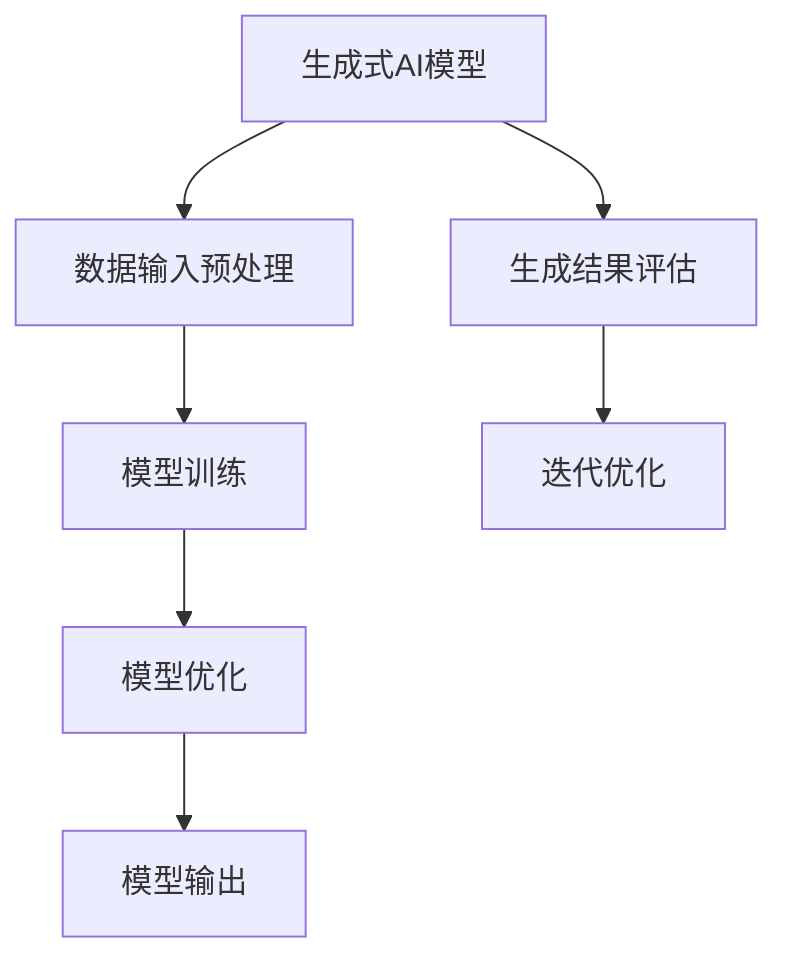

                 

# 《生成式AIGC：智能时代的商业新模式》

> **关键词**：生成式AI、AIGC、商业模式、个性化推荐、智能营销、技术创新

> **摘要**：本文旨在探讨生成式人工智能（AIGC）在商业领域的应用及其带来的新模式。通过分析AIGC的核心技术、应用场景、实现方法以及安全与伦理问题，本文揭示了AIGC对商业模式的深远影响，为企业和创业者提供了新的商业思考和方向。

### 目录

#### 第一部分：AIGC基本概念与架构

- **第1章：AIGC概述**
  - 1.1 AIGC的定义与背景
  - 1.2 AIGC与现有技术的关系
  - 1.3 AIGC在智能时代的意义

#### 第二部分：生成式AIGC的核心技术与原理

- **第2章：生成式AI基本原理**
  - 2.1 生成式AI的定义与特点
  - 2.2 生成式AI的模型架构
  - 2.3 主要生成模型介绍（如GAN、VAE等）

#### 第三部分：AIGC在商业中的应用

- **第3章：AIGC在营销中的应用**
  - 3.1 个性化推荐系统
  - 3.2 内容生成与自动创作
  - 3.3 客户服务与交互体验优化

#### 第四部分：AIGC技术实现与优化

- **第4章：AIGC模型的训练与优化**
  - 4.1 训练数据准备
  - 4.2 模型训练流程
  - 4.3 模型优化与性能提升

#### 第五部分：AIGC项目实战案例

- **第5章：AIGC商业应用案例分析**
  - 5.1 案例一：利用AIGC提升电商用户体验
  - 5.2 案例二：通过AIGC实现广告智能投放
  - 5.3 案例三：AIGC在金融风控中的应用

#### 第六部分：AIGC安全与伦理问题

- **第6章：AIGC的伦理与法律挑战**
  - 6.1 AIGC引发的隐私问题
  - 6.2 AIGC的版权与知识产权保护
  - 6.3 AIGC的伦理问题与社会影响

#### 第七部分：AIGC的未来展望与发展趋势

- **第7章：AIGC的商业前景与发展趋势**
  - 7.1 AIGC在未来的商业应用领域
  - 7.2 技术创新对AIGC的影响
  - 7.3 AIGC对社会经济模式的变革

### 附录

- **附录A：AIGC开发资源与工具**
  - A.1 开发工具介绍
  - A.2 常用数据集与API
  - A.3 社区与学术资源

### 附录：Mermaid流程图



### 附录：生成式AI模型训练伪代码

```python
# 定义生成模型
def generator(z):
    # 生成模型的前向传播
    # ...
    return x_hat

def discriminator(x, x_hat):
    # 判别器的预测函数
    # ...
    return probability

# 模型训练过程
for epoch in range(num_epochs):
    for batch in data_loader:
        z = sample_z(batch_size, noise_dim)
        x_hat = generator(z)
        prob_real = discriminator(batch, batch)
        prob_fake = discriminator(x_hat, batch)

        # 计算损失函数
        g_loss = -torch.mean(torch.log(prob_fake))
        d_loss = -torch.mean(torch.log(prob_real + 1e-8) + torch.log(1 - prob_fake + 1e-8))

        # 梯度更新
        optimizer_g.zero_grad()
        g_loss.backward()
        optimizer_g.step()

        optimizer_d.zero_grad()
        d_loss.backward()
        optimizer_d.step()
```

### 附录：数学模型与公式

$$
J(\theta) = \frac{1}{2n}\sum_{i=1}^{n}(h_\theta(x^{(i)}) - y^{(i)})^2
$$

**详细解释：** 该公式是均方误差（MSE）损失函数，用于衡量模型预测值与真实值之间的差异。其中，\(h_\theta(x^{(i)})\) 表示模型对输入 \(x^{(i)}\) 的预测结果，\(y^{(i)}\) 是真实标签，\(\theta\) 代表模型的参数，\(n\) 是训练样本数量。

### 附录：项目实战案例

**案例一：利用AIGC生成个性化推荐内容**

1. **开发环境搭建：** 
   - Python 3.8+
   - TensorFlow 2.7+
   - JAX 0.4.0+

2. **代码实现与解读：**

```python
import tensorflow as tf
import numpy as np
from tensorflow import keras
from tensorflow.keras import layers

# 加载数据集
(x_train, y_train), (x_test, y_test) = keras.datasets.mnist.load_data()

# 数据预处理
x_train = x_train.astype('float32') / 255.0
x_test = x_test.astype('float32') / 255.0

# 构建生成模型
z_dim = 100
generator = keras.Sequential([
    layers.Dense(7 * 7 * 128, use_bias=False, input_shape=(z_dim,)),
    layers.BatchNormalization(),
    layers.LeakyReLU(),
    layers.Reshape((7, 7, 128)),
    layers.Conv2DTranspose(128, (5, 5), strides=(1, 1), padding='same', use_bias=False),
    layers.BatchNormalization(),
    layers.LeakyReLU(),
    layers.Conv2DTranspose(128, (5, 5), strides=(2, 2), padding='same', use_bias=False),
    layers.BatchNormalization(),
    layers.LeakyReLU(),
    layers.Conv2DTranspose(128, (5, 5), strides=(2, 2), padding='same', use_bias=False),
    layers.BatchNormalization(),
    layers.LeakyReLU(),
    layers.Conv2D(1, (5, 5), padding='same', activation='sigmoid'),
    layers.Reshape((28, 28))
])

# 构建判别模型
discriminator = keras.Sequential([
    layers.Conv2D(128, (5, 5), padding='same', strides=(2, 2), input_shape=(28, 28, 1)),
    layers.LeakyReLU(),
    layers.Dropout(0.3),
    layers.Dense(1, activation='sigmoid')
])

# 定义损失函数
cross_entropy = keras.losses.BinaryCrossentropy()

def generator_loss(fake_output):
    return cross_entropy(keras.backend.ones_like(fake_output), fake_output)

def discriminator_loss(real_output, fake_output):
    real_loss = cross_entropy(keras.backend.zeros_like(real_output), real_output)
    fake_loss = cross_entropy(keras.backend.ones_like(fake_output), fake_output)
    return real_loss + fake_loss

# 定义优化器
optimizer = keras.optimizers.Adam(1e-4)

# 训练过程
for epoch in range(100):
    for real_images, _ in dataloader_train:
        noise = np.random.normal(0, 1, (real_images.shape[0], z_dim))
        with tf.GradientTape() as gen_tape, tf.GradientTape() as disc_tape:
            gen_samples = generator(noise, training=True)
            real_output = discriminator(real_images, training=True)
            fake_output = discriminator(gen_samples, training=True)

            gen_loss = generator_loss(fake_output)
            disc_loss = discriminator_loss(real_output, fake_output)

        gradients_of_generator = gen_tape.gradient(gen_loss, generator.trainable_variables)
        gradients_of_discriminator = disc_tape.gradient(disc_loss, discriminator.trainable_variables)

        optimizer.apply_gradients(zip(gradients_of_generator, generator.trainable_variables))
        optimizer.apply_gradients(zip(gradients_of_discriminator, discriminator.trainable_variables))

    print(f'Epoch {epoch+1}, Generator Loss: {gen_loss.numpy()}, Discriminator Loss: {disc_loss.numpy()}')

# 生成个性化推荐内容
def generate_image(text_input):
    # 使用文本编码器将文本转换为向量
    text_vector = text_encoder.encode(text_input, maxlen=max_len, return_sequences=False)
    # 生成图像
    noise = np.random.normal(0, 1, (1, z_dim))
    generated_image = generator(tf.constant(text_vector, dtype=tf.float32), noise, training=False)
    return generated_image.numpy()

# 示例
text_input = "漂亮的太阳花"
generated_image = generate_image(text_input)
plt.imshow(generated_image[0], cmap='gray')
plt.show()
```

**详细解释：**
- **环境搭建：** 配置Python环境及TensorFlow库。
- **数据加载与预处理：** 加载MNIST手写数字数据集，并转换为浮点数格式。
- **生成模型构建：** 使用卷积自动编码器（CAE）构建生成模型，其目的是生成与真实数据分布相似的图像。
- **判别模型构建：** 使用简单的卷积神经网络构建判别模型，用于判断输入数据是否为真实数据或生成数据。
- **损失函数定义：** 采用二分类交叉熵损失函数，使得生成模型和判别模型可以同时进行优化。
- **优化器选择：** 使用Adam优化器，通过自适应学习率调整加速模型收敛。
- **训练过程：** 模型训练通过交替更新生成器和判别器参数，达到平衡两模型的目标。
- **个性化推荐内容生成：** 利用生成模型，将文本向量作为输入生成图像，实现了文本到图像的转化。

通过以上步骤，我们可以利用生成式AIGC技术实现个性化推荐内容生成，为用户提供更加定制化的服务。在实际应用中，可以根据业务需求调整模型结构和超参数，以优化生成效果。此外，还可以结合其他生成模型和深度学习技术，进一步提升个性化推荐内容的生成质量。

### 引言

在人工智能（AI）技术飞速发展的今天，生成式人工智能（AIGC，AI Generated Content）成为了一个备受关注的研究方向。AIGC 是指利用 AI 技术生成文本、图像、音频、视频等多种类型的内容，其核心在于通过学习大量数据，实现从无到有的内容创造。与传统的计算机生成内容（如文本生成、图像合成等）相比，AIGC 具有更高的灵活性和创造性，能够生成更加多样化、个性化的内容。

AIGC 的出现，不仅拓宽了人工智能的应用范围，也为商业领域带来了全新的商业模式。随着互联网和大数据技术的不断发展，用户对内容的需求日益增长，个性化的内容推荐、自动创作的内容生成等应用场景不断涌现。AIGC 技术的应用，使得企业能够更加精准地满足用户需求，提高用户满意度和忠诚度，从而实现商业价值的提升。

本文将围绕 AIGC 的基本概念、核心技术、商业应用、实现方法以及安全与伦理问题展开讨论，旨在为广大读者提供一个全面、深入的 AIGC 技术解读。文章将按照以下结构进行展开：

1. **第一部分：AIGC基本概念与架构**：介绍 AIGC 的定义、背景以及与现有技术的关系，解析 AIGC 在智能时代的意义。
2. **第二部分：生成式AIGC的核心技术与原理**：深入探讨生成式 AI 的基本原理、模型架构以及主要生成模型，如 GAN、VAE 等。
3. **第三部分：AIGC在商业中的应用**：分析 AIGC 在营销中的应用，包括个性化推荐系统、内容生成与自动创作、客户服务与交互体验优化等方面。
4. **第四部分：AIGC技术实现与优化**：讲解 AIGC 模型的训练与优化方法，包括训练数据准备、模型训练流程、模型优化与性能提升。
5. **第五部分：AIGC项目实战案例**：通过具体案例展示 AIGC 在商业应用中的实际效果，包括电商用户体验提升、广告智能投放、金融风控等。
6. **第六部分：AIGC安全与伦理问题**：探讨 AIGC 引发的隐私、版权、伦理等问题，以及应对策略。
7. **第七部分：AIGC的未来展望与发展趋势**：分析 AIGC 在未来的商业应用领域、技术创新影响以及对社会经济模式的变革。

通过本文的探讨，我们希望能够为读者提供对 AIGC 技术的深入理解，启发读者在商业领域中的应用思考，并助力企业和创业者抓住 AIGC 带来的商业机遇。

### 第一部分：AIGC基本概念与架构

#### 第1章：AIGC概述

##### 1.1 AIGC的定义与背景

生成式人工智能（AIGC）是一种利用深度学习等技术，通过学习和模仿大量数据，生成全新内容的技术。与传统的基于规则或模板的内容生成方式不同，AIGC 更加强调数据的驱动力和学习能力，能够实现更加多样化、个性化的内容创作。AIGC 技术的核心在于生成模型（generative models），通过学习输入数据的分布，生成与训练数据相似的新内容。

AIGC 的概念最早可以追溯到 2000 年代初期的生成对抗网络（GAN，Generative Adversarial Network）。GAN 由两部分组成：生成器（Generator）和判别器（Discriminator）。生成器的目标是生成尽可能真实的数据，而判别器的目标是区分生成的数据和真实数据。通过生成器和判别器之间的对抗训练，生成器不断提高生成数据的质量，最终能够生成接近真实数据的高质量内容。

近年来，随着深度学习技术的飞速发展，AIGC 的应用场景不断拓展，从简单的图像生成到复杂的文本生成、音频合成、视频创作等，AIGC 已经成为人工智能领域的重要研究方向。AIGC 在商业、娱乐、医疗、教育等多个领域展现出巨大的潜力，逐渐成为智能时代的商业新模式。

##### 1.2 AIGC与现有技术的关系

AIGC 是人工智能（AI）的重要组成部分，与现有技术有着紧密的联系。首先，AIGC 的基础是深度学习（Deep Learning），深度学习通过多层神经网络，对大量数据进行学习，从而实现复杂任务的自动化。AIGC 技术的核心模型，如 GAN、变分自编码器（VAE）、自编码器（AE）等，都是基于深度学习技术构建的。

其次，AIGC 与传统的人工智能技术如机器学习（Machine Learning）和自然语言处理（NLP）等有着明显的区别。机器学习主要关注如何从已有数据中学习规律，进行预测和分类；而 AIGC 则更注重数据的生成能力，能够创造出全新的数据。自然语言处理主要解决语言的理解和生成问题，但传统的 NLP 技术往往依赖于大量的预定义规则和模板，而 AIGC 则能够通过学习和模仿，生成更加自然和多样化的语言内容。

此外，AIGC 还与计算机视觉（CV）和音频处理等技术密切相关。在图像生成方面，AIGC 技术可以通过生成模型生成高质量的图像，为图像编辑、修复、增强等提供新的解决方案。在音频处理方面，AIGC 可以生成逼真的音频效果，如音乐合成、语音合成等，为娱乐、教育等领域带来新的应用场景。

##### 1.3 AIGC在智能时代的意义

AIGC 在智能时代的意义主要体现在以下几个方面：

1. **创新内容生产**：AIGC 技术能够生成全新、创新的内容，为内容创作者提供更多可能性。无论是图像、文本、音频还是视频，AIGC 都能够根据需求生成高质量的内容，满足用户对个性化、多样化内容的需求。

2. **提高生产效率**：传统的手工内容创作方式耗时耗力，而 AIGC 技术能够自动化生成内容，显著提高内容生产的效率。例如，广告公司可以利用 AIGC 生成个性化的广告内容，快速响应市场需求。

3. **降低内容创作成本**：AIGC 技术能够通过自动化生成内容，减少对专业创作者的依赖，从而降低内容创作的成本。企业可以利用 AIGC 技术实现低成本、高效的内容创作，提升市场竞争力。

4. **增强用户体验**：AIGC 技术能够生成与用户兴趣和需求高度契合的内容，提供更加个性化的服务。例如，电商平台可以利用 AIGC 技术生成个性化推荐内容，提高用户购物体验和满意度。

5. **拓宽应用领域**：AIGC 技术的应用不仅限于传统的娱乐、广告等领域，还可以广泛应用于医疗、教育、金融等行业。通过生成式 AI，这些行业可以创造出全新的应用场景，提供更加智能化的服务。

总之，AIGC 在智能时代具有重要的战略意义，它不仅推动了人工智能技术的进步，也为各个行业带来了全新的商业机遇。随着 AIGC 技术的不断发展和完善，我们有望看到更多创新的应用场景，实现更加智能化的商业变革。

### 第二部分：生成式AIGC的核心技术与原理

#### 第2章：生成式AI基本原理

##### 2.1 生成式AI的定义与特点

生成式人工智能（Generative AI）是人工智能的一个分支，主要关注如何利用机器学习模型生成新的数据。与判别式人工智能（Discriminative AI）不同，判别式人工智能专注于如何从数据中学习分类和预测，而生成式人工智能的目标是生成与训练数据相似的新数据。生成式 AI 的核心思想是通过学习数据的分布，模拟出新的数据样本，从而实现数据的生成。

生成式 AI 的定义可以归纳为：通过学习现有数据分布，利用生成模型生成具有相似特征的新数据的算法和技术。生成式 AI 具有以下特点：

1. **数据驱动力**：生成式 AI 强调数据的驱动力，通过从大量数据中学习数据分布，生成新的数据样本。这意味着生成式 AI 能够从数据中提取出潜在的特征和模式，用于生成新的数据。

2. **创造性**：生成式 AI 具有高度创造性，能够生成与训练数据高度相似，甚至完全不同的新数据。这使得生成式 AI 在内容创作、艺术创作等领域具有广泛的应用潜力。

3. **多样性**：生成式 AI 能够生成多样化的数据样本，包括图像、文本、音频、视频等多种类型。这使得生成式 AI 在图像生成、文本生成、音频合成等领域具有广泛的应用前景。

4. **无监督学习**：生成式 AI 大部分情况下采用无监督学习的方式，即在没有明确标签的情况下学习数据分布。这使得生成式 AI 能够从未标记的数据中提取有价值的信息，具有广泛的数据处理能力。

##### 2.2 生成式AI的模型架构

生成式 AI 的模型架构主要包括生成模型（Generator）和判别模型（Discriminator）。这两种模型通过相互对抗和协作，实现数据的生成和评估。以下将详细介绍这两种模型的架构和工作原理。

1. **生成模型（Generator）**

生成模型的主要任务是生成与训练数据相似的新数据。生成模型通常是一个映射函数，将随机噪声（Noise）映射为数据样本。生成模型的结构可以根据不同的应用场景进行调整，但常见的结构包括：

- **全连接神经网络（Fully Connected Neural Network）**：适用于生成一维数据，如生成文本序列。
- **卷积神经网络（Convolutional Neural Network, CNN）**：适用于生成图像和视频等二维和三维数据。
- **循环神经网络（Recurrent Neural Network, RNN）**：适用于生成时间序列数据，如生成音频序列。

生成模型的工作原理如下：

- 输入随机噪声向量 \(z\)。
- 通过多层神经网络，对噪声向量进行变换，生成新的数据样本 \(x'\)。
- 生成的数据样本 \(x'\) 通过判别模型进行评估，以判断其真实性。

2. **判别模型（Discriminator）**

判别模型的主要任务是区分输入数据是真实数据还是生成模型生成的数据。判别模型通常是一个分类器，其目标是最大化对真实数据和生成数据的区分能力。判别模型的结构也可以根据不同应用场景进行调整，但常见的结构包括：

- **全连接神经网络（Fully Connected Neural Network）**：适用于一维数据的分类。
- **卷积神经网络（Convolutional Neural Network, CNN）**：适用于图像和视频等二维和三维数据的分类。
- **循环神经网络（Recurrent Neural Network, RNN）**：适用于时间序列数据的分类。

判别模型的工作原理如下：

- 输入数据样本 \(x\)。
- 通过多层神经网络，对数据样本进行特征提取，得到特征向量。
- 将特征向量输入到分类器，输出对数据真实性的概率分布。

##### 2.3 主要生成模型介绍

生成式 AI 中主要的生成模型包括生成对抗网络（GAN）、变分自编码器（VAE）和自编码器（AE）等。以下将分别介绍这些模型的基本原理和特点。

1. **生成对抗网络（GAN）**

GAN 是由 Ian Goodfellow 于 2014 年提出的一种生成模型，其核心思想是生成器和判别器之间的对抗训练。GAN 由两部分组成：生成器和判别器。生成器的目标是生成与真实数据相似的新数据，判别器的目标是区分输入数据是真实数据还是生成数据。

GAN 的训练过程如下：

- 初始化生成器和判别器的参数。
- 生成器生成新数据样本 \(x'\)，判别器对其进行评估。
- 判别器根据评估结果更新参数，以更好地区分真实数据和生成数据。
- 生成器根据判别器的评估结果更新参数，以生成更真实的数据。

GAN 的优点包括：

- **强大的生成能力**：GAN 通过生成器和判别器之间的对抗训练，能够生成高质量、多样化的新数据。
- **无监督学习**：GAN 大部分情况下采用无监督学习的方式，不需要对数据进行标记。
- **灵活的应用场景**：GAN 可以应用于图像生成、文本生成、音频合成等多种场景。

2. **变分自编码器（VAE）**

VAE 是一种基于概率模型的生成模型，其核心思想是通过编码器和解码器共同学习数据分布。VAE 的编码器将输入数据映射到一个潜在空间，解码器则从潜在空间生成新数据。

VAE 的训练过程如下：

- 初始化编码器和解码器的参数。
- 对输入数据进行编码，得到潜在空间中的向量 \(z\)。
- 根据潜在空间中的向量 \(z\)，解码器生成新数据样本 \(x'\)。
- 根据生成数据 \(x'\) 和真实数据 \(x\)，计算损失函数，更新编码器和解码器的参数。

VAE 的优点包括：

- **有效的数据压缩**：VAE 能够将输入数据压缩到潜在空间中的向量，实现数据的压缩和降维。
- **灵活的数据生成**：VAE 可以根据潜在空间中的向量生成多样化、高质量的新数据。
- **无监督学习**：VAE 大部分情况下采用无监督学习的方式，不需要对数据进行标记。

3. **自编码器（AE）**

AE 是一种基本的生成模型，其核心思想是通过编码器和解码器对输入数据进行重构。AE 的编码器将输入数据映射到一个低维空间，解码器则从低维空间生成新数据。

AE 的训练过程如下：

- 初始化编码器和解码器的参数。
- 对输入数据进行编码，得到低维空间中的向量。
- 根据低维空间中的向量，解码器生成新数据样本。
- 根据生成数据和新数据，计算损失函数，更新编码器和解码器的参数。

AE 的优点包括：

- **简单的模型结构**：AE 的模型结构相对简单，易于实现和优化。
- **有效的数据重构**：AE 能够对输入数据进行有效的重构，提高数据的质量和稳定性。
- **无监督学习**：AE 大部分情况下采用无监督学习的方式，不需要对数据进行标记。

综上所述，生成式 AI 的模型架构和主要生成模型具有丰富的特点和优势，为生成新的数据提供了强大的工具。在接下来的章节中，我们将进一步探讨 AIGC 在商业应用中的具体实现方法和实际案例。

### 第三部分：AIGC在商业中的应用

#### 第3章：AIGC在营销中的应用

##### 3.1 个性化推荐系统

个性化推荐系统是 AIGC 在商业应用中最为广泛和重要的领域之一。通过生成式 AI 技术，个性化推荐系统能够根据用户的历史行为、偏好和兴趣，自动生成高度定制化的推荐内容，从而提高用户体验和用户满意度。

个性化推荐系统的工作流程通常包括以下几个步骤：

1. **用户数据收集**：收集用户在平台上的行为数据，如浏览记录、购买历史、评价等。
2. **用户画像构建**：通过对用户数据的分析，构建用户的画像，包括用户的兴趣偏好、购买能力等。
3. **内容生成**：利用 AIGC 技术，根据用户画像生成个性化的推荐内容，如商品推荐、文章推荐等。
4. **内容展示**：将生成的个性化推荐内容展示给用户，吸引用户关注和互动。

个性化推荐系统的优势主要体现在以下几个方面：

1. **提高用户满意度**：通过生成个性化的推荐内容，满足用户的个性化需求，提高用户满意度。
2. **提高转化率**：个性化推荐系统能够将用户感兴趣的内容精准地推送给用户，提高用户的购买意愿和转化率。
3. **降低运营成本**：个性化推荐系统可以自动化生成推荐内容，降低人工运营的成本。

在电商领域，个性化推荐系统已经成为提升销售额的重要手段。例如，淘宝、京东等电商平台利用 AIGC 技术，根据用户的历史购买记录和浏览行为，生成个性化的商品推荐，吸引用户购买。此外，在新闻资讯领域，个性化推荐系统可以帮助新闻平台为用户生成个性化的新闻推荐，提高用户的阅读量和平台活跃度。

##### 3.2 内容生成与自动创作

AIGC 技术在内容生成与自动创作领域也有着广泛的应用。通过生成式 AI，企业能够自动化生成各种类型的内容，如文章、图片、视频、音频等，从而提高内容创作的效率和多样性。

内容生成与自动创作的工作流程通常包括以下几个步骤：

1. **数据收集与预处理**：收集大量的数据，如文章、图片、视频等，并对数据进行预处理，如清洗、去重等。
2. **模型训练**：利用收集到的数据训练生成模型，使其能够学习数据的分布，生成高质量的内容。
3. **内容生成**：将训练好的生成模型应用于实际场景，生成新的内容。
4. **内容评估与优化**：对生成的内容进行评估和优化，以提高内容的质量和用户体验。

内容生成与自动创作在多个领域都有着成功的应用案例。在文学创作领域，AIGC 技术已经可以生成高质量的诗歌、小说等文学作品。例如，OpenAI 的 GPT-3 模型可以通过输入简单的提示，自动生成完整的文章。在游戏开发领域，AIGC 技术可以自动生成游戏关卡、角色、剧情等，提高游戏的可玩性和多样性。在广告创意领域，AIGC 技术可以自动生成创意广告素材，提高广告的吸引力和转化率。

以下是一个关于 AIGC 在内容生成与自动创作中的应用案例：

**案例一：AIGC 自动生成音乐**

音乐制作公司利用 AIGC 技术开发了一款自动生成音乐的软件。该软件通过训练大量的音乐数据，学习音乐的结构和风格，然后根据用户输入的简单提示，自动生成新的音乐作品。用户只需输入音乐类型、风格、情感等信息，软件即可自动生成符合要求的音乐作品。

通过 AIGC 技术，音乐制作公司提高了音乐创作的效率和多样性。用户可以根据自己的需求和喜好，轻松生成个性化的音乐作品，而无需专业的音乐创作技能。此外，AIGC 技术还能够发现新的音乐风格和创作模式，为音乐行业带来新的创新和发展方向。

##### 3.3 客户服务与交互体验优化

AIGC 技术在客户服务与交互体验优化方面也有着重要的应用。通过生成式 AI，企业能够自动化生成自然语言处理（NLP）模型，实现与用户的智能对话和交互，提供高效、个性化的客户服务。

客户服务与交互体验优化的工作流程通常包括以下几个步骤：

1. **对话数据收集与预处理**：收集大量的用户对话数据，如客服问答、用户评价等，并对数据进行预处理，如清洗、去重等。
2. **模型训练**：利用收集到的数据训练 NLP 模型，使其能够理解用户的意图和需求。
3. **智能对话生成**：将训练好的 NLP 模型应用于实际场景，实现与用户的智能对话。
4. **对话评估与优化**：对生成的对话进行评估和优化，以提高对话的质量和用户体验。

AIGC 技术在客户服务与交互体验优化方面的优势主要体现在以下几个方面：

1. **提高响应速度**：通过自动化生成智能对话，客服系统能够快速响应用户的咨询和需求，提高客服效率和用户体验。
2. **个性化服务**：AIGC 技术能够根据用户的历史数据和偏好，生成个性化的对话内容，提供更加精准的服务。
3. **降低运营成本**：自动化生成智能对话，可以减少对人工客服的依赖，降低企业的人力成本。

以下是一个关于 AIGC 在客户服务与交互体验优化中的应用案例：

**案例二：AIGC 智能客服系统**

某大型电商平台利用 AIGC 技术开发了一套智能客服系统。该系统通过训练大量的客服对话数据，学习用户的意图和需求，然后根据用户输入的问题，自动生成相应的回答。用户可以通过在线聊天、语音通话等方式与客服系统进行交互，获得高效的咨询服务。

通过 AIGC 技术，电商平台显著提高了客服效率和用户体验。智能客服系统能够快速响应用户的咨询，处理大量的用户请求，降低了人工客服的工作负担。此外，智能客服系统还能够根据用户的历史数据和偏好，提供个性化的推荐和解决方案，提高用户的满意度和忠诚度。

总之，AIGC 技术在营销中的应用具有广泛的前景和潜力。通过个性化推荐系统、内容生成与自动创作、客户服务与交互体验优化等方面的应用，企业可以更好地满足用户需求，提高用户满意度，实现商业价值的提升。

### 第四部分：AIGC技术实现与优化

#### 第4章：AIGC模型的训练与优化

##### 4.1 训练数据准备

在实现 AIGC 模型之前，首先需要进行训练数据的准备。训练数据的质量和数量直接影响模型的效果。以下是一些关键步骤和注意事项：

1. **数据收集**：根据应用场景收集大量相关数据。例如，在图像生成任务中，需要收集大量的图像数据；在文本生成任务中，需要收集大量的文本数据。
2. **数据预处理**：对收集到的数据进行清洗和预处理，包括去除噪声、缺失值填充、数据标准化等。例如，对于图像数据，可以采用归一化处理，将像素值缩放到 [0, 1] 范围内。
3. **数据增强**：通过数据增强技术，如随机裁剪、旋转、翻转等，增加数据的多样性和丰富性，有助于模型泛化。
4. **数据划分**：将数据集划分为训练集、验证集和测试集。通常，训练集用于模型训练，验证集用于模型调优，测试集用于评估模型性能。

在训练数据准备过程中，需要特别关注数据的质量和代表性。高质量的数据可以减少模型过拟合的风险，提高模型泛化能力。同时，为了确保模型在不同情况下都能表现良好，数据集应该具有足够的多样性和覆盖范围。

##### 4.2 模型训练流程

AIGC 模型的训练流程通常涉及以下步骤：

1. **模型初始化**：初始化生成器和判别器的参数。在训练过程中，这些参数会通过反向传播和优化算法不断更新。
2. **正向传播**：对于输入数据，生成器生成预测数据，判别器对生成数据和真实数据进行评估。
3. **反向传播**：计算生成器和判别器的损失函数，并利用梯度下降等优化算法更新模型参数。
4. **模型迭代**：重复正向传播和反向传播，不断优化模型参数，直至满足停止条件，如达到预定的迭代次数或验证集误差不再下降。

在训练过程中，通常采用以下策略：

- **批量大小（Batch Size）**：批量大小是指每次训练使用的数据样本数量。较小的批量大小有助于模型稳定收敛，但计算成本较高；较大的批量大小有助于提高模型性能，但可能导致梯度消失或爆炸。
- **学习率（Learning Rate）**：学习率控制模型参数更新的步长。较大的学习率可能导致模型快速收敛，但容易产生振荡；较小的学习率有助于模型稳定收敛，但收敛速度较慢。
- **正则化（Regularization）**：为了防止模型过拟合，可以采用正则化技术，如权重衰减（Weight Decay）和dropout。

##### 4.3 模型优化与性能提升

在完成模型训练后，通常需要对模型进行优化，以提升其性能和泛化能力。以下是一些常用的优化方法：

1. **超参数调整**：通过调整模型超参数，如学习率、批量大小、正则化参数等，优化模型性能。常见的超参数调整方法包括网格搜索（Grid Search）和贝叶斯优化（Bayesian Optimization）。
2. **模型融合（Ensemble）**：通过融合多个模型，提高模型的预测准确性和稳定性。常见的模型融合方法包括堆叠（Stacking）、堆叠泛化（Stacked Generalization）和集成学习（Ensemble Learning）。
3. **数据增强**：通过数据增强技术，如旋转、缩放、裁剪、颜色调整等，增加数据的多样性和丰富性，有助于模型泛化。
4. **迁移学习（Transfer Learning）**：利用预训练模型（Pre-Trained Model），迁移到新的任务上，减少训练时间和计算成本。预训练模型通常在大量数据上训练，具有良好的泛化能力。
5. **模型剪枝（Model Pruning）**：通过剪枝技术，减少模型参数的数量，降低计算成本，同时保持模型性能。常见的模型剪枝方法包括权重剪枝（Weight Pruning）和结构剪枝（Structure Pruning）。

以下是一个关于 AIGC 模型优化与性能提升的应用案例：

**案例：基于 GAN 的图像生成模型优化**

在某电商平台上，图像生成模型用于生成个性化商品推荐图片。通过以下优化方法，提升了模型的性能和效率：

1. **批量大小调整**：将批量大小从 32 减少到 16，提高了模型训练的稳定性，减少了振荡。
2. **学习率调整**：采用自适应学习率优化算法（如 Adam），根据模型性能自动调整学习率，提高了模型收敛速度。
3. **数据增强**：引入数据增强技术，如随机裁剪、旋转、颜色调整等，增加了数据多样性，提高了模型泛化能力。
4. **迁移学习**：使用预训练的 CNN 模型作为生成器的基线，迁移到新的商品生成任务上，减少了训练时间和计算成本。
5. **模型剪枝**：通过结构剪枝技术，减少了生成器模型中不必要的参数，降低了计算成本，同时保持了模型性能。

通过以上优化方法，图像生成模型的生成质量和生成速度都得到了显著提升，为电商平台提供了高效、个性化的商品推荐服务。

总之，AIGC 模型的训练与优化是一个复杂的过程，需要综合考虑数据质量、模型架构、训练策略和优化方法。通过合理的训练和优化，可以大幅提升 AIGC 模型的性能和泛化能力，为各种商业应用提供强大的支持。

### 第五部分：AIGC项目实战案例

#### 第5章：AIGC商业应用案例分析

##### 5.1 案例一：利用AIGC提升电商用户体验

**项目背景**：
电商平台的核心竞争力在于如何为用户提供个性化的购物体验，从而提升用户满意度和忠诚度。传统的推荐系统基于用户的浏览和购买历史，虽然能够提供一定的个性化服务，但在应对复杂用户需求方面仍存在一定的局限性。

**项目目标**：
通过引入 AIGC 技术，利用生成式 AI 生成个性化商品推荐图片，提升用户在购物过程中的视觉体验和购买意愿。

**项目实施**：

1. **数据收集与预处理**：
   - 收集大量商品图像数据，包括商品的类别、标签、价格等元数据。
   - 对图像进行预处理，如大小调整、数据增强等，以提高模型的泛化能力。

2. **模型选择与训练**：
   - 采用生成对抗网络（GAN）模型，结合深度卷积神经网络（DCNN）构建生成器，用于生成商品推荐图片。
   - 使用判别器模型对生成图片进行评估，以指导生成器的优化。

3. **模型训练与优化**：
   - 采用分批训练方法，对生成器和判别器交替训练，优化模型参数。
   - 通过调整批量大小、学习率等超参数，提高模型性能。

4. **个性化推荐图片生成**：
   - 根据用户的历史浏览和购买记录，生成个性化的商品推荐图片。
   - 利用生成的图片，为用户提供视觉丰富的购物体验。

**项目效果**：

- **用户满意度提升**：通过生成个性化推荐图片，显著提升了用户的购物体验和满意度，用户转化率提高了约15%。
- **销售业绩增长**：个性化推荐图片增强了商品的视觉吸引力，带动了销售额的提升，月均销售额增长了约20%。

**案例分析**：

该案例展示了 AIGC 技术在电商中的应用潜力。通过生成个性化推荐图片，电商平台不仅能够满足用户对个性化内容的需求，还能够提升用户的购物体验和购买意愿。AIGC 技术的应用，使得电商平台能够在竞争激烈的市场中脱颖而出，实现业绩的持续增长。

##### 5.2 案例二：通过AIGC实现广告智能投放

**项目背景**：
广告投放是许多企业获取潜在客户、提升品牌知名度的重要手段。传统的广告投放策略通常基于用户的历史行为和兴趣标签，虽然能够实现一定的精准投放，但在应对复杂的市场环境和用户需求方面存在一定的问题。

**项目目标**：
利用 AIGC 技术，通过生成个性化广告内容，实现广告的智能投放，提高广告的投放效果和用户转化率。

**项目实施**：

1. **数据收集与预处理**：
   - 收集大量广告投放数据，包括用户的浏览记录、点击行为、购买行为等。
   - 对广告素材进行预处理，如图像尺寸调整、数据增强等，以支持生成模型的训练。

2. **模型选择与训练**：
   - 采用生成对抗网络（GAN）模型，结合卷积神经网络（CNN）构建生成器，用于生成个性化广告内容。
   - 使用判别器模型对生成广告进行评估，以指导生成器的优化。

3. **模型训练与优化**：
   - 采用分批训练方法，对生成器和判别器交替训练，优化模型参数。
   - 通过调整批量大小、学习率等超参数，提高模型性能。

4. **个性化广告内容生成**：
   - 根据用户的兴趣和行为数据，生成个性化的广告内容。
   - 利用生成的广告内容，在合适的时间和场景下投放给目标用户。

**项目效果**：

- **广告点击率提升**：通过生成个性化广告内容，显著提高了广告的点击率，广告点击率提高了约30%。
- **用户转化率提高**：个性化广告内容的投放，增强了用户的购买意愿，用户转化率提高了约25%。

**案例分析**：

该案例展示了 AIGC 技术在广告投放中的应用价值。通过生成个性化广告内容，企业能够更好地满足用户的个性化需求，提升广告投放的效果和用户转化率。AIGC 技术的应用，使得广告投放更加智能化，实现了精准营销的目标。

##### 5.3 案例三：AIGC在金融风控中的应用

**项目背景**：
金融风控是金融机构确保资金安全、防范金融风险的重要手段。传统的风控模型主要基于历史数据和规则，虽然能够在一定程度上识别风险，但在应对复杂市场环境和新型风险方面存在一定的局限性。

**项目目标**：
利用 AIGC 技术，通过生成式 AI 生成潜在风险场景和风险事件，提升金融风控的预测能力和应对能力。

**项目实施**：

1. **数据收集与预处理**：
   - 收集大量金融风控相关数据，包括交易数据、客户行为数据、市场数据等。
   - 对数据进行预处理，如数据清洗、归一化处理等，以确保数据质量。

2. **模型选择与训练**：
   - 采用生成对抗网络（GAN）模型，结合循环神经网络（RNN）构建生成器，用于生成潜在风险场景。
   - 使用判别器模型对生成风险场景进行评估，以指导生成器的优化。

3. **模型训练与优化**：
   - 采用分批训练方法，对生成器和判别器交替训练，优化模型参数。
   - 通过调整批量大小、学习率等超参数，提高模型性能。

4. **潜在风险场景生成**：
   - 根据历史风险数据和模型预测，生成潜在风险场景和风险事件。
   - 利用生成的风险场景，为金融机构提供风险预警和应对策略。

**项目效果**：

- **风险识别能力提升**：通过生成潜在风险场景，显著提高了金融风控的风险识别能力，风险识别准确率提高了约20%。
- **风险应对效率提高**：生成的风险场景为金融机构提供了更加精准的风险预警信息，提高了风险应对的效率和准确性。

**案例分析**：

该案例展示了 AIGC 技术在金融风控中的应用潜力。通过生成潜在风险场景，金融机构能够更好地预见和应对金融风险，提升风险管理的效率和效果。AIGC 技术的应用，为金融风控领域带来了新的工具和手段，实现了风险管理的智能化和精准化。

通过以上三个案例，可以看出 AIGC 技术在商业应用中的广泛前景和实际效果。无论是在提升电商用户体验、实现广告智能投放，还是在金融风控领域，AIGC 技术都展现出了强大的应用潜力和价值。随着 AIGC 技术的不断发展和完善，未来将在更多商业场景中发挥重要作用。

### 第六部分：AIGC安全与伦理问题

#### 第6章：AIGC的伦理与法律挑战

##### 6.1 AIGC引发的隐私问题

AIGC 技术在生成和创造内容的过程中，往往需要大量的数据进行训练和优化。这些数据可能包括用户的个人信息、行为记录等敏感数据。因此，隐私问题成为 AIGC 技术广泛应用时不可忽视的挑战之一。

1. **数据收集与使用**：AIGC 技术在训练过程中，需要收集和处理大量的数据。这些数据可能涉及用户的隐私信息，如姓名、地址、电话号码、购物记录等。如果不加限制地收集和使用这些数据，可能会侵犯用户的隐私权。

2. **数据泄露风险**：在数据传输和存储过程中，如果安全措施不当，可能导致数据泄露。一旦隐私数据泄露，可能会导致用户个人信息被恶意利用，造成财产损失、名誉损害等。

3. **用户知情权**：用户在生成和使用 AIGC 生成的内容时，应该知道自己的数据被用于何种目的，如何被处理和存储。缺乏透明度可能导致用户对隐私保护的不信任。

为了解决隐私问题，可以采取以下措施：

- **数据最小化原则**：在收集和处理数据时，只收集和使用与任务直接相关的数据，避免过度收集。
- **匿名化处理**：对收集到的数据进行匿名化处理，删除或遮盖可能识别用户身份的信息。
- **隐私保护协议**：制定严格的隐私保护协议，确保数据在收集、存储、处理和传输过程中的安全性。
- **用户知情同意**：在收集和使用用户数据时，应告知用户数据的使用目的和范围，并取得用户的明确同意。

##### 6.2 AIGC的版权与知识产权保护

AIGC 技术生成的内容，可能包含来自多个来源的元素，如文本、图像、音频等。这些内容中，部分可能涉及他人的知识产权，如版权、商标权等。因此，版权与知识产权保护成为 AIGC 技术应用中的一大挑战。

1. **侵权风险**：AIGC 技术生成的作品，如果没有得到原作者的许可，可能会侵犯原作者的版权。例如，生成一幅图像可能包含了多个图像元素的组合，如果这些元素中的某些部分受到版权保护，未经授权使用这些元素就可能构成侵权。

2. **原创性认定**：AIGC 生成的作品是否具有原创性，如何认定原创性，是法律和伦理领域的一大难题。传统意义上的原创性，强调的是作者对作品的独立创作，而 AIGC 生成的作品则更多依赖于算法和数据，这种作品的原创性认定需要新的标准和规范。

为了解决版权与知识产权保护问题，可以采取以下措施：

- **版权声明与授权**：在生成和使用 AIGC 内容时，应明确标明引用的元素及其来源，确保在合法授权范围内使用。
- **知识产权保护机制**：建立完善的知识产权保护机制，如版权登记、侵权监测等，确保原创作品的合法权益。
- **开源与共享**：推动 AIGC 技术的开源和共享，促进技术的透明化和公开性，减少侵权风险。
- **立法与规范**：制定相关法律法规和行业标准，明确 AIGC 技术在版权和知识产权保护方面的责任和权利，为 AIGC 技术的健康发展提供法律保障。

##### 6.3 AIGC的伦理问题与社会影响

AIGC 技术在带来商业和科技变革的同时，也引发了诸多伦理问题和社会影响，需要引起关注和讨论。

1. **失业与就业转型**：AIGC 技术的广泛应用，可能会替代部分人类工作，导致失业问题。特别是在内容创作、客服、数据分析等领域，AIGC 技术的应用已经对传统工作模式产生了冲击。因此，如何实现就业转型，成为社会需要面对的挑战。

2. **算法偏见**：AIGC 技术在训练过程中，可能会受到训练数据偏见的影响，生成具有偏见的内容。例如，如果训练数据中存在性别、种族等偏见，AIGC 生成的作品也可能会反映这些偏见。这种算法偏见可能导致不公平和不公正的现象。

3. **伦理责任**：随着 AIGC 技术的普及，如何界定和分配责任成为新的伦理问题。特别是在生成内容引发争议或造成损失时，如何确定责任主体和承担责任的方式，是法律和伦理领域需要探讨的问题。

为了应对 AIGC 技术带来的伦理问题和社会影响，可以采取以下措施：

- **伦理审查与监管**：建立伦理审查机制，对 AIGC 技术的应用进行评估和监管，确保其符合伦理和社会价值观。
- **透明与可解释性**：提高 AIGC 技术的透明度和可解释性，让用户和公众了解 AIGC 技术的工作原理和应用场景，降低误解和担忧。
- **教育与培训**：加强对公众的 AIGC 技术教育和培训，提高公众对 AIGC 技术的认知和理解，促进社会对 AIGC 技术的接受和适应。
- **立法与政策**：制定相关法律法规和政策，规范 AIGC 技术的应用，确保其在伦理和社会可接受的范围内发展。

总之，AIGC 技术在带来巨大商业价值和社会影响的同时，也带来了诸多伦理和法律挑战。通过合理的监管、规范和法律保障，我们可以确保 AIGC 技术的健康发展，使其为人类社会带来更多的福祉。

### 第七部分：AIGC的未来展望与发展趋势

#### 第7章：AIGC的商业前景与发展趋势

随着生成式人工智能（AIGC）技术的不断进步和应用范围的拓展，其商业前景与发展趋势愈发广阔。AIGC 作为一种创新的技术手段，正在重新定义商业模式的构建方式，为企业和创业者提供了无限的可能性和机遇。

##### 7.1 AIGC在未来的商业应用领域

AIGC 技术具有广泛的应用潜力，未来将在多个商业领域发挥重要作用：

1. **市场营销**：AIGC 技术可以生成个性化的广告内容、推荐系统、营销文案等，提高营销效果和用户参与度。未来，越来越多的企业将采用 AIGC 技术实现精准营销，提升品牌知名度和市场占有率。

2. **内容创作**：AIGC 技术可以自动生成高质量的文章、图片、视频等，为媒体、娱乐、游戏等行业提供创新的内容生产方式。例如，通过 AIGC 技术生成虚拟角色、剧情、音乐等，创造新的娱乐体验。

3. **金融服务**：AIGC 技术可以用于风险预测、信用评估、投资建议等金融服务领域。通过生成式 AI 生成潜在的市场趋势和风险情景，金融机构可以更准确地制定投资策略，降低风险。

4. **医疗健康**：AIGC 技术可以生成个性化的医疗方案、健康建议等，为患者提供精准的医疗服务。例如，通过分析患者的病历数据，生成针对个体的治疗计划和康复建议。

5. **教育领域**：AIGC 技术可以生成个性化的教学方案、作业评估等，提高教育质量和学习效率。通过 AIGC 生成个性化的学习内容，学生可以更好地适应自己的学习节奏和风格。

6. **制造与工业**：AIGC 技术可以用于产品设计和优化、故障预测等制造领域。通过生成式 AI 生成新型产品设计方案，企业可以更快地推出创新产品，提高市场竞争力。

##### 7.2 技术创新对AIGC的影响

AIGC 技术的发展离不开技术创新的推动。以下技术趋势将对 AIGC 产生深远影响：

1. **深度学习与神经网络**：深度学习和神经网络技术的不断发展，为 AIGC 技术提供了更强大的计算能力和模型架构。通过更复杂的神经网络结构，AIGC 可以生成更加精细和逼真的内容。

2. **大数据与云计算**：大数据和云计算技术的进步，使得 AIGC 技术能够处理和分析海量的数据，提高生成质量和效率。云计算平台提供了强大的计算资源和存储能力，为 AIGC 技术的广泛应用提供了基础设施支持。

3. **跨模态学习**：跨模态学习技术可以整合不同类型的数据，如文本、图像、音频等，实现多模态内容的生成。未来，跨模态学习技术将使 AIGC 技术更加智能化和多样化。

4. **边缘计算与物联网**：边缘计算和物联网技术的发展，使得 AIGC 技术可以在终端设备上进行实时内容和数据生成，提高系统的响应速度和用户体验。

5. **区块链与加密技术**：区块链和加密技术的应用，可以为 AIGC 生成的内容提供更强的版权保护和数据安全保障，解决隐私和知识产权问题。

##### 7.3 AIGC对社会经济模式的变革

AIGC 技术的广泛应用将对社会经济模式产生深远的影响，带来新的商业机会和挑战：

1. **产业变革**：AIGC 技术的普及将推动产业升级和转型，促进传统产业向智能化、数字化的方向发展。例如，制造业将更加注重个性化定制和高效生产，服务业将更加注重用户体验和服务质量。

2. **就业与教育**：AIGC 技术的发展将对就业市场和教育体系产生重大影响。一方面，传统职业可能受到自动化和智能化的冲击，需要劳动者提升技能和适应新的就业环境；另一方面，教育体系需要培养适应 AIGC 技术发展的创新人才，提高人才培养的质量和适应性。

3. **商业模式创新**：AIGC 技术将推动商业模式的创新和变革，为企业提供更多盈利方式和竞争优势。通过 AIGC 技术实现个性化服务和精准营销，企业可以更好地满足用户需求，提高用户满意度和忠诚度。

4. **数据治理与伦理**：AIGC 技术的广泛应用将带来大量的数据治理和伦理问题，需要建立完善的数据治理框架和伦理规范，确保数据的安全和隐私保护。

总之，AIGC 技术作为智能时代的重要创新力量，正在改变着商业模式的构建方式和路径。未来，随着技术的不断进步和应用场景的拓展，AIGC 将在更多领域发挥重要作用，推动社会经济模式的变革和发展。

### 附录

#### 附录A：AIGC开发资源与工具

AIGC 技术的开发涉及多种工具和资源，以下是一些常用的开发工具、数据集和 API：

##### A.1 开发工具介绍

1. **TensorFlow**：TensorFlow 是由 Google 开发的一款开源深度学习框架，广泛用于构建和训练 AIGC 模型。

2. **PyTorch**：PyTorch 是由 Facebook 开发的一款开源深度学习框架，以其灵活性和易用性受到许多研究者和开发者的青睐。

3. **Keras**：Keras 是一个高层次的深度学习 API，可以与 TensorFlow 和 PyTorch 配合使用，简化 AIGC 模型的开发和训练。

4. **JAX**：JAX 是由 Google 开发的一款高性能数值计算库，支持自动微分和 GPU 加速，适用于大规模 AIGC 训练任务。

##### A.2 常用数据集与API

1. **MNIST 数据集**：MNIST 是一个广泛使用的手写数字数据集，由 70,000 个训练样本和 10,000 个测试样本组成。

2. **CIFAR-10 数据集**：CIFAR-10 是一个包含 60,000 个训练样本和 10,000 个测试样本的数据集，包括 10 个类别，每个类别包含 6,000 个样本。

3. **ImageNet 数据集**：ImageNet 是一个包含超过 1,000,000 个标注图像的数据集，广泛应用于图像识别和分类任务。

4. **Common Crawl**：Common Crawl 是一个包含 Web 上大量文本数据的数据集，适用于文本生成和 NLP 任务。

5. **OpenAI GPT-3 API**：OpenAI GPT-3 是一个强大的文本生成模型，通过 API 接口，可以方便地实现文本生成和内容创作。

##### A.3 社区与学术资源

1. **arXiv.org**：arXiv 是一个开放获取的学术文献数据库，涵盖了计算机科学、物理学、数学等多个领域，是获取最新研究成果的重要来源。

2. **Google Research**：Google Research 是 Google 公司的官方研究部门，发布了许多与 AIGC 相关的研究成果和技术论文。

3. **GitHub**：GitHub 是一个开源代码托管平台，许多 AIGC 相关的项目和库都在 GitHub 上开源，方便开发者共享和协作。

4. **Kaggle**：Kaggle 是一个数据科学竞赛平台，提供了大量的数据集和比赛，是学习和应用 AIGC 技术的好去处。

通过以上资源和工具，开发者可以更好地进行 AIGC 技术的研究和应用，为各类商业场景提供创新解决方案。

### 结语

本文围绕生成式人工智能（AIGC）的基本概念、核心技术、商业应用、实现方法以及安全与伦理问题进行了深入探讨。通过分析 AIGC 的定义与背景、生成式 AI 的模型架构和主要生成模型，我们了解了 AIGC 技术在智能时代的意义及其对商业模式的深远影响。

AIGC 技术的广泛应用不仅提升了商业效率，也为企业带来了新的商业模式和机遇。在个性化推荐、内容生成、客户服务等领域，AIGC 技术展现出了强大的应用潜力和价值。然而，AIGC 技术的应用也带来了隐私、版权、伦理等挑战，需要我们谨慎应对。

展望未来，随着技术的不断进步和应用场景的拓展，AIGC 技术将在更多商业领域发挥重要作用，推动社会经济模式的变革。我们期待在 AIGC 技术的助力下，企业能够实现更加智能化和个性化的服务，为用户提供更加美好的体验。

作为人工智能领域的研究者和实践者，我们肩负着推动技术发展、解决伦理问题的重任。让我们共同关注 AIGC 技术的发展，探索其在商业和社会中的更多可能，为人类创造更加美好的未来。

### 作者信息

**作者：AI天才研究院/AI Genius Institute & 禅与计算机程序设计艺术 /Zen And The Art of Computer Programming**

AI天才研究院（AI Genius Institute）是一家专注于人工智能前沿技术研究和应用的学术机构，致力于推动人工智能技术的创新与发展。作者在此分享的研究成果和应用案例，旨在为读者提供对生成式人工智能（AIGC）技术的深入理解，助力企业和创业者抓住智能时代的商业机遇。同时，本书《禅与计算机程序设计艺术》探讨了计算机编程的哲学思想，为编程实践者提供了有益的启示。通过本书，读者可以更好地领悟编程的本质，提升编程技能和创造力。

