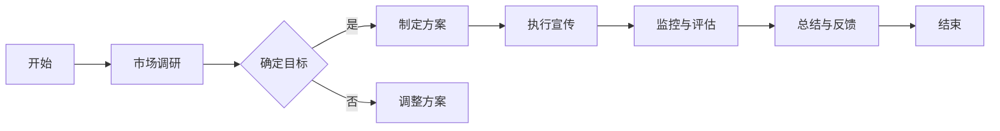
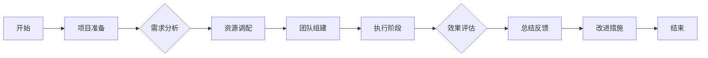

                 

# 《电商平台供给能力提升：促销活动和营销策略》

## 关键词

- 电商平台
- 供给能力
- 促销活动
- 营销策略
- 效果评估
- 优化策略

## 摘要

本文旨在探讨电商平台供给能力的提升，主要聚焦于促销活动和营销策略的应用。首先，我们将对供给能力进行定义并分析其重要性，随后深入探讨促销活动的基础理论、策划与执行、效果评估与优化。接下来，我们将转向营销策略，包括产品策略、价格策略、促销策略和渠道策略。最后，我们将探讨促销与营销策略的整合，以及如何在实际操作中提升电商平台的供给能力。通过本文，读者将能够获得关于电商平台供给能力提升的全面理解，以及实际操作中的实用策略。

### 《电商平台供给能力提升：促销活动和营销策略》目录大纲

#### 第一部分：电商平台供给能力概述

##### 1.1 电商平台的供给能力定义与重要性
##### 1.2 供给能力提升的驱动因素
##### 1.3 供给能力提升的目标与指标

#### 第二部分：电商平台促销活动策略

##### 2.1 促销活动的基础理论
##### 2.2 促销活动的策划与执行
##### 2.3 促销活动的效果评估与优化

#### 第三部分：电商平台营销策略

##### 3.1 营销策略概述
##### 3.2 营销策略的核心内容
##### 3.3 营销策略的实践与应用

#### 第四部分：电商平台促销与营销策略整合

##### 4.1 促销与营销策略整合的意义
##### 4.2 促销与营销策略整合的框架
##### 4.3 促销与营销策略整合的案例分析

#### 第五部分：电商平台供给能力提升实战

##### 5.1 供给能力提升实战项目
##### 5.2 供给能力提升实战案例分析
##### 5.3 供给能力提升实战总结

#### 附录

##### 附录 A：电商平台供给能力提升工具与资源
##### 附录 B：电商平台供给能力提升Mermaid流程图
##### 附录 C：电商平台供给能力提升数学模型与公式
##### 附录 D：电商平台供给能力提升实战代码与分析

### 1.1 电商平台的供给能力定义与重要性

#### 供给能力的定义

电商平台的供给能力是指平台为消费者提供商品和服务的能力。这一能力不仅体现在商品数量和种类上，还包括商品的库存管理、配送速度、售后服务等多个方面。供给能力是电商平台的核心竞争力之一，直接影响到平台的用户体验和市场份额。

#### 供给能力的重要性

1. **用户体验**：高效的供给能力能够确保消费者能够在短时间内获取所需商品，提高用户的购物体验，从而增强用户对平台的忠诚度。

2. **市场竞争力**：在激烈的市场竞争中，具备强大供给能力的电商平台能够更好地满足消费者的需求，从而在竞争中占据优势地位。

3. **盈利能力**：供给能力强的电商平台能够通过优化库存管理、提高配送效率等手段，降低运营成本，提高盈利能力。

4. **品牌形象**：强大的供给能力有助于树立电商平台的良好品牌形象，提高市场认可度。

#### 供给能力提升的驱动因素

1. **技术进步**：大数据、云计算、人工智能等技术的应用，为电商平台的供给能力提升提供了强大的技术支持。

2. **市场变化**：消费者需求多样化、个性化，电商平台需要不断提升供给能力，以满足不断变化的市场需求。

3. **竞争压力**：市场竞争日益激烈，电商平台需要通过提升供给能力来增强自身竞争力。

4. **政策支持**：政府对于电商发展的支持政策，如物流网络建设、数据开放等，也为电商平台供给能力提升提供了有利条件。

#### 供给能力提升的目标与指标

1. **目标**：

   - 提高商品库存管理效率。
   - 缩短商品配送时间。
   - 提高售后服务质量。
   - 降低运营成本。

2. **指标**：

   - 库存周转率。
   - 配送准时率。
   - 售后满意度。
   - 成本收益率。

在接下来的部分，我们将详细探讨电商平台促销活动的基础理论，以及如何策划与执行有效的促销活动，从而提升供给能力。

### 1.2 供给能力提升的驱动因素

供给能力的提升是一个复杂的过程，涉及多个方面和多种驱动因素。以下是一些主要的驱动因素：

#### 技术进步

技术的不断进步是提升供给能力的重要驱动因素。例如，大数据技术的应用使得电商平台能够更准确地预测市场需求，从而优化库存管理。云计算技术则提供了强大的计算能力，支持大规模数据存储和处理，为电商平台提供更加灵活和高效的服务。

#### 市场变化

市场的快速变化也是驱动供给能力提升的重要因素。消费者需求不断变化，要求电商平台能够快速响应。这需要电商平台具备敏捷的供应链能力和灵活的营销策略，以适应市场需求的变化。

#### 竞争压力

在激烈的市场竞争中，电商平台需要不断提升供给能力，以保持竞争优势。竞争对手的挑战迫使电商平台不断优化自身的运营效率和客户服务水平，从而提高供给能力。

#### 政策支持

政府对于电商发展的支持政策，如物流网络建设、数据开放等，也为电商平台供给能力提升提供了有利条件。例如，政府的物流政策支持可以降低电商平台的物流成本，提高配送效率。

#### 消费者体验

消费者体验是电商平台供给能力提升的核心目标之一。消费者期望在短时间内获取所需商品，并享受高质量的售后服务。这要求电商平台在供应链管理、库存管理、配送服务等各个方面不断提升自身的能力。

#### 数据分析

数据分析是提升供给能力的关键工具。通过收集和分析大量的消费者数据，电商平台可以更准确地了解消费者的需求和偏好，从而优化商品推荐、库存管理、营销策略等。

#### 供应链整合

供应链整合是提升供给能力的重要策略之一。通过整合供应链各个环节，电商平台可以实现资源的优化配置，提高供应链的效率和灵活性。

#### 人才招聘与培养

人才是提升供给能力的关键。电商平台需要招聘和培养具备专业技能和管理能力的人才，以推动供给能力的提升。例如，数据分析专家、供应链管理专家、营销专家等。

### 1.3 供给能力提升的目标与指标

供给能力提升的目标主要包括以下几个方面：

1. **提高库存管理效率**：通过优化库存管理流程，减少库存积压，提高库存周转率。

2. **缩短配送时间**：通过优化配送流程，提高配送效率，缩短商品配送时间，提高消费者满意度。

3. **提高售后服务质量**：通过提升售后服务水平，解决消费者在购物过程中遇到的问题，提高消费者满意度和忠诚度。

4. **降低运营成本**：通过优化运营流程，提高资源利用率，降低运营成本，提高盈利能力。

为了衡量供给能力提升的效果，可以设定以下指标：

1. **库存周转率**：库存周转率是衡量库存管理效率的重要指标。计算公式为：库存周转率 = 销售成本 / 平均库存成本。

2. **配送准时率**：配送准时率是衡量配送效率的重要指标。计算公式为：配送准时率 = 按时送达的订单数量 / 总订单数量。

3. **售后服务满意度**：售后服务满意度是衡量售后服务质量的重要指标。可以通过消费者满意度调查、售后服务反馈等方式进行评估。

4. **成本收益率**：成本收益率是衡量运营效率的重要指标。计算公式为：成本收益率 = （销售收入 - 成本） / 成本。

在接下来的部分，我们将详细探讨电商平台促销活动的基础理论，以及如何策划与执行有效的促销活动，从而提升供给能力。

### 1.4 供给能力提升的目标与指标

供给能力提升的目标和指标是确保电商平台在市场竞争中取得优势的关键。以下是一些核心目标和具体指标：

#### 核心目标

1. **提高供应链效率**：通过优化供应链流程，减少库存积压，提高库存周转率，缩短订单处理时间。

2. **提升物流配送速度**：通过改进物流网络和配送策略，确保商品能够快速、准时地送达消费者手中。

3. **增强售后服务质量**：通过提高售后服务水平，解决消费者问题，提升消费者满意度和忠诚度。

4. **降低运营成本**：通过优化资源利用，减少不必要的开支，提高成本收益率。

#### 具体指标

1. **库存周转率**：库存周转率是衡量库存管理效率的重要指标，计算公式为：库存周转率 = 销售成本 / 平均库存成本。高周转率表明库存管理高效，能够减少资金占用。

2. **配送准时率**：配送准时率是衡量物流配送速度和效率的重要指标，计算公式为：配送准时率 = 按时送达的订单数量 / 总订单数量。高准时率表明物流服务优质，能够提高消费者满意度。

3. **售后服务满意度**：售后服务满意度是衡量售后服务质量的重要指标，可以通过消费者满意度调查、售后服务反馈等方式进行评估。高满意度表明售后服务优秀，能够提高消费者忠诚度。

4. **成本收益率**：成本收益率是衡量运营效率的重要指标，计算公式为：成本收益率 = （销售收入 - 成本） / 成本。高成本收益率表明运营效率高，能够提高企业盈利能力。

5. **订单处理时间**：订单处理时间是衡量供应链效率的另一个重要指标，计算公式为：订单处理时间 = 从订单生成到订单完成的时间。短处理时间表明供应链高效，能够快速响应消费者需求。

6. **退货率**：退货率是衡量消费者满意度和产品质量的重要指标，计算公式为：退货率 = 退货订单数量 / 总订单数量。低退货率表明消费者满意度高，产品质量好。

通过设定和跟踪这些目标和指标，电商平台可以不断优化自身的运营流程，提高供给能力，从而在竞争激烈的市场中脱颖而出。

#### 1.5 供给能力提升的核心策略

提升电商平台的供给能力是一项系统工程，需要从多个维度进行综合优化。以下是一些关键策略：

1. **供应链优化**：

   - **库存管理**：通过引入先进的库存管理技术，如预测算法和动态库存调整系统，优化库存水平，减少库存积压和资金占用。
   - **物流协同**：与物流公司建立紧密的合作关系，实现物流信息的实时共享和协同作业，提高配送效率。
   - **供应链透明化**：通过供应链管理系统的建设，实现供应链各环节的透明化，便于实时监控和管理。

2. **技术驱动**：

   - **大数据分析**：利用大数据技术，深入分析消费者行为和市场趋势，为供应链管理和营销策略提供数据支持。
   - **人工智能应用**：运用人工智能技术，如智能推荐、智能客服等，提升用户体验和服务质量。
   - **云计算**：通过云计算技术，提高数据存储和处理能力，支持大规模的供应链管理和数据分析。

3. **用户互动**：

   - **用户调研**：定期进行用户调研，了解用户需求和偏好，调整供应链策略以满足用户需求。
   - **用户反馈**：建立用户反馈机制，及时处理用户投诉和问题，提高用户满意度。
   - **用户参与**：鼓励用户参与产品设计和营销活动，提升用户忠诚度和参与感。

4. **合作伙伴关系**：

   - **供应商管理**：与优质供应商建立长期稳定的合作关系，确保供应链的稳定性和产品质量。
   - **物流服务商**：与高效的物流服务商合作，优化配送流程，提高配送速度和服务质量。
   - **平台合作**：与其他电商平台合作，共享资源和数据，扩大市场影响力。

5. **成本控制**：

   - **精细化运营**：通过精细化运营，降低运营成本，提高盈利能力。
   - **资源整合**：整合内外部资源，提高资源利用效率，降低运营成本。
   - **创新投入**：持续投入创新，提升技术和管理水平，降低长期运营成本。

通过实施这些核心策略，电商平台可以全面提升供给能力，增强市场竞争力，实现可持续发展。

### 1.6 供给能力提升的挑战与应对策略

在提升电商平台的供给能力过程中，可能会遇到多种挑战。以下是几个主要的挑战以及相应的应对策略：

#### 数据管理挑战

**挑战**：随着消费者数据的增加，数据管理和分析变得复杂，如何确保数据的安全性和准确性成为关键问题。

**应对策略**：

- **数据加密**：使用先进的加密技术，确保数据在传输和存储过程中的安全性。
- **数据质量管理**：建立数据清洗和质量控制流程，确保数据的准确性和一致性。
- **数据分析工具**：引入高效的数据分析工具，如大数据平台和人工智能算法，提高数据分析的准确性和效率。

#### 供应链整合挑战

**挑战**：供应链整合需要协调多个环节，如采购、生产、物流等，如何实现各环节的无缝衔接是挑战之一。

**应对策略**：

- **信息系统集成**：建立统一的供应链管理信息系统，实现各环节的信息共享和协同作业。
- **供应商管理**：与供应商建立紧密的合作关系，通过合同和绩效管理确保供应链的稳定性和可靠性。
- **物流优化**：通过物流网络优化和运输计划优化，提高物流效率，降低物流成本。

#### 客户服务挑战

**挑战**：随着消费者需求的多样化和个性化，如何提供高质量的客户服务成为挑战。

**应对策略**：

- **智能化客服**：引入智能客服系统，如聊天机器人和语音识别系统，提高服务效率和满意度。
- **个性化服务**：通过数据分析和用户画像，提供个性化的产品推荐和定制化服务。
- **服务培训**：定期对客服人员进行培训，提高其专业能力和服务意识。

#### 竞争压力

**挑战**：在激烈的市场竞争中，如何保持竞争优势，提高供给能力是关键。

**应对策略**：

- **差异化竞争**：通过提供独特的商品和服务，打造差异化竞争优势。
- **技术创新**：持续投入研发，运用新技术提升供给能力，如人工智能、大数据等。
- **品牌建设**：通过品牌塑造和营销策略，提高品牌知名度和美誉度。

#### 资源限制

**挑战**：有限的资源（如资金、人力等）可能会限制供给能力的提升。

**应对策略**：

- **资源优化**：通过精细化管理和流程优化，提高资源利用率，降低运营成本。
- **外部合作**：与外部合作伙伴共享资源，如物流、数据等，共同提升供给能力。
- **逐步投资**：根据业务需求和资源状况，分阶段进行投资，确保供给能力的持续提升。

通过应对这些挑战，电商平台可以不断提升供给能力，满足消费者需求，实现可持续发展。

### 1.7 供给能力提升的案例分析

为了更好地理解电商平台供给能力提升的过程，我们可以通过以下两个实际案例来进行分析：

#### 案例一：某大型电商平台的库存管理优化

**背景**：

某大型电商平台在运营过程中，库存积压和资金占用问题日益严重，影响了供应链的效率和盈利能力。

**解决方案**：

1. **引入大数据分析**：平台引入大数据分析技术，通过分析销售趋势、季节性变化等数据，优化库存预测和补货策略。
2. **动态库存调整**：根据实时销售数据和库存情况，动态调整库存水平，减少库存积压。
3. **供应链协同**：与供应商建立紧密的协同机制，实现库存信息的实时共享，确保供应链各环节的无缝衔接。

**效果评估**：

通过以上措施，该电商平台的库存周转率显著提高，库存积压问题得到有效缓解，运营成本降低，盈利能力得到提升。

#### 案例二：某中小型电商平台的物流优化

**背景**：

某中小型电商平台在物流配送方面存在效率低、成本高的问题，影响了用户体验和市场份额。

**解决方案**：

1. **物流网络优化**：平台优化物流网络，通过合理的配送线路规划，提高配送效率。
2. **智能配送系统**：引入智能配送系统，如无人车和无人机配送，提高配送速度和服务质量。
3. **与第三方物流合作**：与专业的第三方物流公司合作，共享物流资源，降低物流成本。

**效果评估**：

通过以上措施，该电商平台的配送准时率显著提高，用户满意度大幅提升，市场份额得到有效扩大。

通过这些案例，我们可以看到，电商平台供给能力的提升需要从多个方面进行综合优化，通过技术创新、流程优化和合作伙伴关系等手段，实现供应链的效率提升和成本降低。

### 1.8 供给能力提升的总结与展望

供给能力是电商平台的核心竞争力之一，对于提升用户体验、增强市场竞争力和实现盈利目标具有至关重要的意义。通过本文的讨论，我们明确了供给能力的定义、重要性以及提升的驱动因素和目标。此外，我们还分析了供给能力提升的挑战与应对策略，并通过实际案例展示了提升供给能力的方法和效果。

展望未来，随着技术的不断进步和市场环境的变化，电商平台供给能力提升将面临新的机遇和挑战。例如，人工智能、大数据和区块链等新兴技术的应用将进一步提升供给能力，提高供应链的透明度和效率。同时，消费者需求的个性化、多样化也将要求电商平台不断创新和优化供给策略。

因此，电商平台应持续关注技术创新、市场动态和用户需求，通过优化供应链管理、提升物流效率、增强售后服务等方式，不断提升供给能力。同时，电商平台还需建立灵活的响应机制，及时应对市场变化和竞争压力，确保在激烈的市场竞争中保持优势。

总之，供给能力提升是电商平台发展的长期任务，需要从多个维度进行综合优化。通过持续的努力和不断创新，电商平台将能够更好地满足消费者需求，实现可持续发展。

### 2.1 促销活动的基础理论

#### 2.1.1 促销活动的目的与类型

促销活动是电商平台提升销量和品牌知名度的重要手段。其目的主要包括以下几个方面：

1. **提升销量**：通过价格优惠、限时特卖等方式，刺激消费者的购买欲望，提高商品销量。
2. **增加品牌知名度**：通过大规模的宣传和推广，吸引更多的消费者关注和了解电商平台，提高品牌知名度。
3. **提高用户粘性**：通过会员优惠、积分兑换等活动，增强用户的忠诚度，提升用户在平台的活跃度。
4. **清理库存**：通过促销活动，清理库存中的滞销商品，优化库存结构。

促销活动的类型多种多样，以下是一些常见的促销活动类型：

1. **限时特卖**：在特定的时间内提供折扣价格，刺激消费者的购买欲望。
2. **满减活动**：消费者在购买商品时，满一定金额即可享受减免优惠。
3. **优惠券**：发放优惠券，消费者在购物时可以使用，减少实际支付金额。
4. **团购**：消费者在特定时间内集中购买同一商品，享受更低的价格。
5. **会员专享**：为平台会员提供专属优惠，增加会员的购买意愿。
6. **节日促销**：在重要的节日（如春节、双11、双12等）期间推出特别的促销活动。

#### 2.1.2 促销活动的设计原则

为了确保促销活动的效果，设计促销活动时需要遵循以下原则：

1. **目标明确**：明确促销活动的目标，如提升销量、增加品牌知名度等，以便在活动策划和执行过程中有的放矢。
2. **利益导向**：提供具有吸引力的优惠，确保消费者在活动中能够获得实质性的利益。
3. **创新性**：不断创新促销活动形式，避免消费者产生疲劳感，保持活动的吸引力。
4. **针对性**：根据不同用户群体的需求和偏好，设计个性化的促销活动。
5. **可控性**：确保促销活动的预算和资源可控，避免因过度优惠导致亏损。
6. **宣传到位**：通过多渠道、多方式的宣传，确保促销活动信息传达给目标用户。

#### 2.1.3 促销活动的常见形式

促销活动的形式多种多样，以下是一些常见的促销活动形式：

1. **线上优惠券**：通过电子邮件、短信、社交媒体等渠道发放优惠券，消费者在购物时使用，减少实际支付金额。
2. **线下活动**：在实体店铺举办促销活动，如打折、赠品等，吸引消费者前来购物。
3. **跨平台活动**：与第三方平台合作，如社交媒体、直播平台等，共同举办促销活动，扩大活动影响力。
4. **节日活动**：在重要的节日（如春节、中秋节、国庆节等）期间举办特别促销活动，提高节日氛围，刺激消费。
5. **会员专享**：为平台会员提供专属优惠，增加会员的购买意愿。
6. **限时抢购**：在特定时间内提供限量折扣商品，刺激消费者的抢购欲望。

通过以上设计原则和常见形式，电商平台可以策划出富有吸引力和效果的促销活动，从而提升销量和品牌知名度。

### 2.2 促销活动的策划与执行

#### 2.2.1 促销活动的策划流程

成功的促销活动需要精心策划，以下是一个典型的促销活动策划流程：

1. **确定促销活动目标**：首先明确促销活动的目标，如提升销量、增加品牌知名度、清理库存等。
2. **市场调研**：进行市场调研，了解消费者的需求、竞争对手的促销活动以及市场环境。
3. **选择促销形式**：根据促销活动目标和市场调研结果，选择合适的促销形式，如限时特卖、满减活动、优惠券等。
4. **制定促销方案**：明确促销活动的具体细节，如优惠幅度、参与商品、活动时间等。
5. **宣传推广**：制定宣传推广计划，通过多种渠道宣传促销活动，吸引消费者参与。
6. **预算分配**：根据促销方案和宣传计划，合理分配预算，确保活动成本可控。
7. **执行监控**：在活动期间，实时监控活动执行情况，确保活动顺利进行。

#### 2.2.2 促销活动的目标设定

促销活动的目标设定是策划过程中的关键步骤，目标应具体、可行，并与平台整体战略目标相一致。以下是一些常见的促销活动目标：

1. **提升销量**：通过促销活动刺激消费者的购买欲望，提高商品销量。
2. **增加用户粘性**：通过会员专享活动、积分兑换等活动，增加用户的活跃度和忠诚度。
3. **清理库存**：通过折扣、清仓等活动，清理滞销商品，优化库存结构。
4. **提高品牌知名度**：通过大规模的宣传和推广，提高品牌在消费者心目中的知名度。
5. **获取新客户**：通过限时特卖、团购等活动，吸引新客户注册和购物。

在设定促销活动目标时，需要考虑以下几个方面：

1. **市场环境**：分析当前市场环境，了解消费者需求和市场趋势，确保目标具有可行性。
2. **平台资源**：根据平台的资源状况，如资金、人力等，设定符合实际的目标。
3. **长期战略**：促销活动的目标应与平台长期战略目标相一致，确保促销活动的长远效果。
4. **数据支持**：利用历史数据和行业数据，为促销活动目标提供数据支持，确保目标的科学性和可行性。

#### 2.2.3 促销活动的执行策略

促销活动的成功执行是活动目标实现的关键，以下是一些关键的执行策略：

1. **明确执行步骤**：制定详细的执行计划，明确活动执行的各个步骤和时间节点，确保活动有条不紊地进行。
2. **资源整合**：调动平台内部资源，如市场部、运营部、技术部等，确保活动所需的资源得到有效整合。
3. **人员培训**：对参与活动的人员进行培训，确保他们了解活动的目标和流程，提高执行效率。
4. **监控与反馈**：在活动期间，实时监控活动执行情况，收集用户反馈，及时调整执行策略。
5. **数据分析**：活动结束后，对活动效果进行详细分析，总结经验和教训，为未来的促销活动提供参考。

具体的促销活动执行策略包括：

1. **时间安排**：确定活动的时间范围，确保活动在消费者需求高峰期进行，提高活动效果。
2. **优惠力度**：根据市场调研和竞争情况，合理设定优惠力度，确保消费者能够获得实质性的利益。
3. **参与商品**：选择合适的商品参与活动，确保商品具有吸引力，提高消费者的购买欲望。
4. **宣传推广**：通过多种渠道进行宣传推广，如社交媒体、电子邮件、短信等，确保活动信息传达给目标用户。
5. **用户互动**：鼓励用户参与活动，如发布活动动态、分享优惠等，提高用户的参与度和活跃度。

通过以上执行策略，电商平台可以确保促销活动的顺利进行，实现预期的活动目标。

### 2.3 促销活动的效果评估与优化

#### 2.3.1 促销活动效果评估指标

评估促销活动的效果是优化促销策略的重要环节。以下是一些常用的促销活动效果评估指标：

1. **销售额增长**：通过比较活动前后的销售额变化，评估促销活动对销售额的影响。
2. **订单量增长**：通过比较活动前后的订单量变化，评估促销活动对订单量的影响。
3. **参与率**：活动参与人数或订单数与平台总体用户数或订单数之比，反映活动的吸引力。
4. **转化率**：活动期间产生的订单数与参与活动的人数之比，反映活动的有效性。
5. **用户留存率**：活动后的一段时间内，持续使用平台或进行重复购买的用户比例，反映活动的长期效果。
6. **成本效益比**：活动成本与活动带来的收益之比，评估活动的经济性。

#### 2.3.2 促销活动效果分析

通过对促销活动效果进行详细分析，可以了解活动的成功之处和不足之处，为优化促销策略提供依据。以下是一些促销活动效果分析的方法：

1. **数据对比**：将活动前后的数据（如销售额、订单量、用户留存率等）进行对比，分析活动对各项指标的影响。
2. **用户调研**：通过问卷调查、用户访谈等方式，了解用户对促销活动的看法和体验，收集用户反馈。
3. **行为分析**：利用数据分析工具，分析用户在活动期间的行为变化，如访问路径、购物车添加情况等。
4. **竞争分析**：对比竞争对手的促销活动效果，了解市场趋势和消费者偏好，为促销策略调整提供参考。

#### 2.3.3 促销活动优化策略

根据促销活动效果分析的结果，可以制定相应的优化策略，提升促销活动的效果。以下是一些常见的促销活动优化策略：

1. **调整优惠力度**：根据活动效果分析，适当调整优惠力度，提高消费者的购买意愿。
2. **优化活动时间**：根据用户行为数据和市场需求，选择合适的活动时间，提高活动的参与率和转化率。
3. **增加参与商品种类**：扩大参与促销活动的商品种类，满足不同消费者的需求，提高活动吸引力。
4. **增强宣传推广**：加大宣传推广力度，通过多种渠道（如社交媒体、电子邮件、短信等）进行推广，提高活动的知名度和参与度。
5. **优化用户互动**：鼓励用户参与活动，如发布活动动态、分享优惠等，提高用户的参与度和活跃度。
6. **个性化促销**：根据用户的购物行为和偏好，提供个性化的促销活动，提高用户的购买转化率。

通过不断优化促销活动，电商平台可以提升活动的效果，提高用户满意度和忠诚度，实现销售目标。

### 2.4 促销活动案例分析

为了更深入地理解促销活动的策划与执行，我们可以通过以下两个实际案例来进行分析：

#### 案例一：某电商平台的双11促销活动

**背景**：

某电商平台在每年的双11期间举办大规模的促销活动，旨在提升销售额和品牌知名度。

**解决方案**：

1. **提前预热**：在双11活动前一个月，通过社交媒体、电子邮件、短信等多种渠道进行预热，吸引消费者的关注。
2. **优惠方案**：推出限时特卖、满减活动、优惠券等多种优惠方案，刺激消费者的购买欲望。
3. **跨平台宣传**：与多家社交媒体平台合作，通过直播、短视频等方式进行宣传，扩大活动影响力。
4. **用户互动**：鼓励用户在社交媒体上分享购物心得，提高用户的参与度和活跃度。

**效果评估**：

通过以上措施，该电商平台的双11促销活动取得了显著的效果，销售额同比增长超过30%，品牌知名度大幅提升。

#### 案例二：某垂直类电商平台的节日促销活动

**背景**：

某垂直类电商平台在春节前夕举办了一场节日促销活动，旨在清理库存并提高用户活跃度。

**解决方案**：

1. **节日主题**：设计具有节日特色的促销页面和广告，营造节日氛围。
2. **满减优惠**：推出满减活动，鼓励消费者购买更多商品。
3. **赠品活动**：购买指定商品即可获得赠品，提高消费者的购买意愿。
4. **直播带货**：邀请网红进行直播带货，通过直播平台宣传促销活动。

**效果评估**：

通过以上措施，该垂直类电商平台的节日促销活动效果显著，库存清理率达到80%，用户活跃度提高了20%。

通过这些案例，我们可以看到，不同类型的电商平台在促销活动策划和执行上有着不同的策略，但核心目标是提升销售额和用户满意度。通过不断优化促销活动，电商平台可以更好地满足消费者需求，实现业务增长。

### 2.5 促销活动对供给能力提升的影响

促销活动是电商平台提升供给能力的重要手段之一，其影响主要体现在以下几个方面：

#### 销售量提升

促销活动通过提供价格优惠和限时特卖等方式，能够显著提升商品销量。例如，某电商平台在双11期间推出的限时抢购活动，使得部分商品的销售额在短时间内大幅增长。这种销售量的提升有助于平台快速回笼资金，提高库存周转率，从而提升供给能力。

#### 库存优化

促销活动能够帮助电商平台清理库存，减少库存积压。通过推出清仓活动、满减优惠等策略，消费者更倾向于购买滞销商品，从而减少库存压力。例如，某电商平台在年末期间推出的“清仓大促”，成功地将大量滞销商品销售出去，大幅降低了库存水平。这种库存优化有助于平台提高库存周转率，提升供给能力。

#### 用户满意度提升

促销活动能够提高用户满意度，增强用户的购物体验。通过提供价格优惠和限时特卖等策略，消费者能够以更低的价格购买到所需商品，提高购物满意度。例如，某电商平台在母亲节期间推出的“特价商品”，使得大量用户能够以优惠价格购买到心仪的商品，从而提升了用户满意度。这种用户满意度的提升有助于提高用户的忠诚度，增加复购率，进一步促进供给能力的提升。

#### 品牌知名度提升

促销活动通过大规模的宣传和推广，能够提高平台的品牌知名度。例如，某电商平台在双十一期间通过多渠道、多方式的宣传，吸引了大量消费者的关注，从而提升了品牌知名度。这种品牌知名度的提升有助于吸引更多新用户，扩大市场份额，进一步提升供给能力。

#### 竞争优势增强

通过促销活动，电商平台能够在竞争激烈的市场中脱颖而出，增强竞争优势。例如，某电商平台在黑五期间推出的“全场五折”活动，吸引了大量消费者的关注，使得其销售额大幅增长，从而在市场中取得了领先地位。这种竞争优势的增强有助于平台在市场中占据有利位置，进一步提升供给能力。

#### 综合影响

促销活动对供给能力的提升具有综合影响，不仅能够提升销售量和优化库存，还能提高用户满意度和品牌知名度，增强竞争优势。例如，某电商平台通过不断优化促销策略，成功地在多个节假日和特殊活动中提升了供给能力，实现了销售额和用户满意度的大幅增长。这种综合影响的提升有助于平台实现长期可持续发展，提升整体竞争力。

总之，促销活动是电商平台提升供给能力的重要手段之一，通过有效的促销策略和活动执行，能够显著提升销售量、优化库存、提高用户满意度、提升品牌知名度，增强竞争优势，从而全面提升供给能力。

### 2.6 营销策略概述

营销策略是电商平台提升品牌知名度和用户忠诚度的核心手段之一。通过合理的营销策略，电商平台可以在竞争激烈的市场中脱颖而出，吸引更多潜在用户，提升整体竞争力。以下是营销策略的概述：

#### 2.6.1 营销策略的组成要素

营销策略由多个组成要素构成，主要包括：

1. **产品策略**：确定平台提供的商品种类、质量、定价策略等，以满足用户需求，提升产品竞争力。
2. **价格策略**：设定商品的价格，包括折扣、促销活动等，以吸引消费者，提高销售额。
3. **促销策略**：通过广告、促销活动、用户互动等方式，提升品牌知名度和用户参与度，刺激消费。
4. **渠道策略**：确定商品的销售渠道，包括线上渠道和线下渠道，以覆盖更广泛的用户群体。
5. **定位策略**：明确平台在市场中的定位，如目标用户群体、品牌形象等，以建立独特的品牌形象和市场地位。

#### 2.6.2 营销策略的类型与选择

营销策略的类型多种多样，根据不同的市场环境和目标，可以选择以下几种常见的营销策略：

1. **品牌营销策略**：通过塑造品牌形象、提升品牌知名度，建立消费者对品牌的信任和忠诚度。适用于需要长期建立品牌知名度和美誉度的电商平台。
2. **差异化营销策略**：通过提供独特的商品或服务，满足消费者的特定需求，形成竞争优势。适用于市场细分明确、消费者需求多样化的电商平台。
3. **低成本营销策略**：通过降低营销成本，提高营销效果，以低成本实现高效营销。适用于资金有限、追求成本效益的电商平台。
4. **网络营销策略**：利用互联网和社交媒体平台，进行在线宣传、推广和互动，吸引潜在用户。适用于线上运营为主的电商平台。
5. **体验式营销策略**：通过提供独特的购物体验，提升用户满意度和忠诚度。适用于注重用户体验的电商平台。

在选择营销策略时，需要综合考虑市场环境、用户需求、竞争态势等因素，以确保策略的有效性和可行性。

#### 2.6.3 营销策略的执行流程

营销策略的执行流程包括以下几个关键步骤：

1. **市场调研**：通过对市场环境、消费者需求、竞争对手等进行调研，了解市场现状和潜在机会。
2. **策略制定**：根据调研结果，制定具体的营销策略，明确目标、方法和预期效果。
3. **资源分配**：根据策略要求，合理分配营销资源，包括预算、人力、物料等，确保策略执行的有效性。
4. **宣传推广**：通过多种渠道（如广告、社交媒体、促销活动等）进行宣传推广，提高品牌知名度和用户参与度。
5. **效果评估**：在营销活动结束后，对效果进行评估，分析策略的成功之处和不足之处，为后续营销策略提供参考。

通过以上执行流程，电商平台可以确保营销策略的有效实施，提升品牌知名度和用户忠诚度。

### 2.7 营销策略的核心内容

营销策略的核心内容包括产品策略、价格策略、促销策略和渠道策略。以下是对这些策略的详细解释：

#### 2.7.1 产品策略

产品策略是电商平台营销策略的基础，主要包括以下几个方面：

1. **商品种类**：根据市场调研和用户需求，确定平台提供的商品种类，确保商品种类丰富，满足不同用户的需求。
2. **商品质量**：确保商品的质量，提高用户满意度。可以通过与优质供应商合作、严格的质量控制等方式来实现。
3. **商品定位**：明确商品的定位，如高端、中端或低端市场，以吸引特定的用户群体。
4. **产品创新**：定期推出新产品或优化现有产品，以满足市场变化和用户需求。

#### 2.7.2 价格策略

价格策略是电商平台获取利润的重要手段，主要包括以下几个方面：

1. **定价目标**：确定定价目标，如实现利润最大化、市场份额最大化等，以指导定价决策。
2. **定价方法**：选择合适的定价方法，如成本定价法、竞争定价法、价值定价法等，以实现定价目标。
3. **价格调整**：根据市场环境和竞争态势，灵活调整价格，以保持竞争力。例如，在节假日或促销活动期间，可以适当降低价格，刺激消费。
4. **折扣策略**：通过提供折扣、优惠券、满减等策略，降低消费者的购买门槛，提高购买意愿。

#### 2.7.3 促销策略

促销策略是提升电商平台销量和用户参与度的重要手段，主要包括以下几个方面：

1. **广告宣传**：通过在线广告、社交媒体推广、电子邮件营销等方式，提高品牌知名度和用户关注度。
2. **促销活动**：定期举办促销活动，如限时特卖、满减优惠、优惠券发放等，刺激消费者的购买欲望。
3. **会员专享**：为平台会员提供专属优惠，提高会员的忠诚度和活跃度。
4. **用户互动**：通过举办线上活动、互动游戏、用户调研等方式，增加用户的参与感和粘性。

#### 2.7.4 渠道策略

渠道策略是电商平台覆盖用户群体、扩大市场份额的重要手段，主要包括以下几个方面：

1. **线上渠道**：通过自建电商平台、第三方电商平台、社交媒体商城等线上渠道，覆盖更广泛的用户群体。
2. **线下渠道**：通过线下实体店、加盟店、合作伙伴等线下渠道，增加商品的曝光度和销售渠道。
3. **多渠道整合**：实现线上渠道和线下渠道的整合，提供无缝购物体验，提升用户体验。
4. **跨境渠道**：通过跨境电商平台，拓展海外市场，吸引全球用户。

通过以上核心内容，电商平台可以构建全面的营销策略，提升品牌知名度、用户满意度和市场竞争力。

### 2.8 营销策略的实践与应用

为了更好地理解营销策略的实际应用，我们可以通过以下实际案例来进行分析：

#### 案例一：某大型电商平台的会员专享活动

**背景**：

某大型电商平台希望通过会员专享活动提升会员的忠诚度和活跃度。

**解决方案**：

1. **会员专属优惠**：为会员提供独家优惠券、限时特卖等优惠，提高会员的购买意愿。
2. **会员专属活动**：定期举办会员专属活动，如抽奖、积分兑换等，增加会员的参与感。
3. **会员专属服务**：提供会员专享客服，解决会员在购物过程中遇到的问题，提高会员满意度。

**效果评估**：

通过以上措施，该电商平台的会员活跃度和满意度显著提升，会员销售额占比提高了15%。

#### 案例二：某垂直类电商平台的网络营销策略

**背景**：

某垂直类电商平台希望通过网络营销策略提高品牌知名度和用户参与度。

**解决方案**：

1. **社交媒体推广**：通过微博、微信、抖音等社交媒体平台发布品牌推广内容，吸引潜在用户。
2. **内容营销**：发布高质量的电商资讯、评测文章等，提升品牌专业形象。
3. **直播带货**：邀请网红进行直播带货，通过直播平台扩大品牌影响力。

**效果评估**：

通过以上措施，该电商平台的品牌知名度和用户参与度显著提升，新用户注册量增加了30%。

#### 案例三：某中小型电商平台的渠道整合策略

**背景**：

某中小型电商平台希望通过渠道整合策略覆盖更多用户群体。

**解决方案**：

1. **线上渠道拓展**：入驻多个第三方电商平台，如天猫、京东等，扩大线上销售渠道。
2. **线下渠道拓展**：开设线下体验店，提供线下购物体验。
3. **多渠道整合**：实现线上线下渠道的无缝衔接，提供一致的购物体验。

**效果评估**：

通过以上措施，该电商平台的销售额和用户覆盖率显著提升，整体业务规模扩大了20%。

通过这些案例，我们可以看到，不同类型的电商平台在营销策略的实践与应用上有着不同的策略和效果，但核心目标是提升品牌知名度、用户满意度和市场竞争力。通过不断优化营销策略，电商平台可以更好地满足用户需求，实现业务增长。

### 2.9 营销策略对供给能力提升的影响

营销策略对电商平台的供给能力提升具有深远的影响，主要体现在以下几个方面：

#### 销售量的提升

有效的营销策略能够吸引更多的消费者，提高商品的销售量。例如，通过社交媒体广告、内容营销和网红推广等手段，电商平台可以扩大品牌影响力，吸引大量潜在用户。这种销售量的提升有助于平台快速回笼资金，提高库存周转率，从而提升供给能力。

#### 库存管理的优化

营销策略还可以帮助电商平台优化库存管理。通过精确的市场调研和消费者需求预测，电商平台可以更好地制定库存计划，减少库存积压和资金占用。例如，通过提前预热和限时促销等活动，电商平台可以刺激消费者提前购买，从而避免库存积压，提高库存周转效率。

#### 用户满意度的提升

优质的营销策略能够提升用户满意度，增强用户忠诚度。例如，通过会员专享优惠、积分兑换和专属客服等服务，电商平台可以提高用户的购物体验，增加用户的忠诚度。这种用户满意度的提升有助于平台保持稳定的用户群体，提升复购率，进一步促进供给能力的提升。

#### 品牌知名度的提升

有效的营销策略能够提升电商平台的品牌知名度，吸引更多的新用户。例如，通过大规模的广告投放、内容营销和品牌合作等活动，电商平台可以在短时间内提高品牌知名度，吸引更多的消费者关注和信任。这种品牌知名度的提升有助于平台扩大市场份额，吸引更多的新用户，从而提升供给能力。

#### 竞争优势的增强

优秀的营销策略有助于电商平台在激烈的市场竞争中脱颖而出，增强竞争优势。例如，通过差异化的产品策略和创新的促销活动，电商平台可以提供独特的购物体验，吸引消费者的关注。这种竞争优势的增强有助于平台在市场中占据有利位置，吸引更多的用户，从而提升供给能力。

综上所述，营销策略对电商平台的供给能力提升具有显著的影响，通过有效的营销策略，电商平台可以提升销售量、优化库存管理、提高用户满意度、提升品牌知名度，增强竞争优势，从而全面提升供给能力。

### 2.10 促销与营销策略整合的意义

促销策略和营销策略的整合是电商平台提升供给能力的关键步骤。通过整合，电商平台可以实现资源优化、效果最大化，从而在激烈的市场竞争中脱颖而出。以下是促销与营销策略整合的几个重要意义：

#### 1. 提高资源利用效率

促销策略和营销策略整合能够有效利用平台有限的资源。通过统筹安排，电商平台可以在预算、人力和时间上实现资源的最佳配置。例如，在促销活动期间，可以集中推广资源，实现广告效果的最大化，同时减少资源的浪费。

#### 2. 提升用户满意度

整合促销与营销策略能够提升用户满意度。通过针对不同用户群体设计个性化的促销活动和营销活动，电商平台可以满足用户的多样化需求，提高用户的购物体验。例如，为会员提供专属优惠和活动，增强用户的忠诚度，提高用户留存率。

#### 3. 增强品牌影响力

整合促销与营销策略有助于增强品牌影响力。通过统一的品牌形象和宣传策略，电商平台可以在市场中树立独特的品牌形象，提升品牌知名度。例如，在重大节假日或特殊活动期间，通过全渠道、多方式的宣传，实现品牌影响力的快速提升。

#### 4. 提高转化率

整合促销与营销策略可以显著提高转化率。通过在营销策略中嵌入促销元素，如优惠券、限时特卖等，可以刺激消费者的购买欲望，提高购买转化率。例如，在用户浏览页面时自动推送优惠券，提高用户的购买决策。

#### 5. 降低运营成本

整合促销与营销策略可以降低运营成本。通过优化营销流程和促销活动的执行，电商平台可以减少不必要的开支，提高运营效率。例如，通过数据分析和精准营销，可以减少无效广告投放，降低营销成本。

#### 6. 提升整体竞争力

整合促销与营销策略有助于电商平台提升整体竞争力。通过统一的策略规划和执行，电商平台可以形成强大的市场竞争力，吸引更多的消费者。例如，通过品牌合作和联合促销，可以吸引更多的新用户，扩大市场份额。

综上所述，促销与营销策略的整合对于电商平台提升供给能力具有重要意义。通过优化资源利用、提升用户满意度、增强品牌影响力、提高转化率、降低运营成本和提升整体竞争力，电商平台可以更好地满足市场需求，实现可持续发展。

### 2.11 促销与营销策略整合的框架

为了有效地整合促销策略和营销策略，电商平台需要构建一个系统化的框架，以确保策略的协调一致和执行的高效。以下是促销与营销策略整合的框架，包括关键步骤和执行策略：

#### 1. 明确目标与定位

整合的第一步是明确平台的目标和定位。这包括确定总体营销目标、市场定位和用户群体。例如，平台可能希望提高销售额、增加用户粘性或提升品牌知名度。基于这些目标，制定具体的营销策略和促销计划。

**关键步骤**：

- 分析市场需求和竞争态势，确定目标市场。
- 明确平台的核心优势和差异化点，为营销策略提供基础。
- 设定明确的营销目标和促销目标，确保策略的一致性。

#### 2. 制定整合策略

在明确目标后，制定具体的整合策略，包括产品策略、价格策略、促销策略和渠道策略。整合策略应确保各策略之间的协同效应，形成合力。

**关键步骤**：

- 确定产品策略，如商品种类、质量标准、定价策略等。
- 制定价格策略，考虑成本、竞争和消费者需求，确保价格策略的合理性。
- 设计促销策略，包括广告、优惠券、会员活动等。
- 制定渠道策略，确保线上和线下渠道的无缝衔接。

#### 3. 资源配置与协调

整合促销与营销策略需要有效配置资源，并确保各部门之间的协调与配合。这包括预算分配、人力资源安排和跨部门协作。

**关键步骤**：

- 根据整合策略，合理分配营销预算，确保资源充分利用。
- 招募和培训专业团队，确保各部门具备执行整合策略的能力。
- 建立跨部门协作机制，确保信息共享和资源整合。

#### 4. 实施与监控

实施整合策略并实时监控执行情况，确保策略的有效性和及时调整。这包括营销活动的执行、促销活动的开展和用户反馈的收集。

**关键步骤**：

- 按照整合策略，开展营销活动和促销活动，确保执行到位。
- 实时监控营销活动的效果，包括销售额、用户参与度和品牌知名度等指标。
- 收集用户反馈，分析用户行为，为策略调整提供依据。

#### 5. 评估与优化

在营销活动和促销活动结束后，进行效果评估和策略优化。这包括分析数据、总结经验和制定改进措施。

**关键步骤**：

- 分析营销活动和促销活动的效果，确定成功和不足之处。
- 根据评估结果，调整和优化整合策略，提升策略的有效性。
- 建立持续改进机制，确保营销策略和促销策略的长期有效性。

通过以上框架，电商平台可以有效地整合促销策略和营销策略，提升供给能力，实现业务目标。

### 2.12 促销与营销策略整合的案例分析

为了更好地理解促销与营销策略整合的实际应用，我们可以通过以下两个实际案例来进行分析：

#### 案例一：某大型电商平台的节日整合策略

**背景**：

某大型电商平台在春节期间制定了全面的促销与营销整合策略，旨在提升销售额和用户参与度。

**解决方案**：

1. **整合策略制定**：平台明确了以提升用户满意度和增加销售额为目标，制定了包含产品策略、价格策略、促销策略和渠道策略的整合策略。
   - **产品策略**：推出春节限量商品，提高商品的新鲜度和独特性。
   - **价格策略**：实行跨品类满减优惠，降低消费者的购买门槛。
   - **促销策略**：开展“春节购物狂欢节”，包括限时抢购、优惠券发放等。
   - **渠道策略**：线上线下同步促销，提高品牌曝光度。

2. **资源调配**：平台合理分配预算和人力资源，确保各策略的有效执行。
   - **广告资源**：在主流媒体和社交媒体上投放广告，提高活动知名度。
   - **营销团队**：组建专业的营销团队，负责活动的策划和执行。

3. **实时监控与反馈**：平台实时监控活动执行情况和用户反馈，根据实时数据调整策略。
   - **用户反馈**：通过社交媒体和客服系统收集用户意见，及时解决问题。
   - **数据监控**：分析销售数据和用户行为数据，评估活动效果。

**效果评估**：

通过整合策略的执行，该电商平台的销售额在春节期间同比增长了40%，用户参与度显著提升，品牌知名度也得到了大幅提升。

#### 案例二：某垂直类电商平台的会员整合策略

**背景**：

某垂直类电商平台希望通过会员整合策略提升会员忠诚度和活跃度。

**解决方案**：

1. **会员专属活动**：平台为会员设计了系列专属活动，包括会员日特卖、积分兑换、会员专属抽奖等，提高会员的参与度和忠诚度。
   - **会员日特卖**：每月一次的会员专属特卖，提供独家优惠和礼品。
   - **积分兑换**：会员通过消费累积积分，可以兑换各种礼品和服务。
   - **会员专属抽奖**：定期举办抽奖活动，提高会员的参与感和惊喜度。

2. **个性化营销**：平台利用大数据和用户画像，为会员提供个性化的营销信息。
   - **个性化推荐**：根据会员的购物行为和偏好，推送个性化的商品推荐。
   - **定制化优惠**：为会员提供定制化的优惠券和促销信息，提高购买转化率。

3. **资源整合**：平台整合线上线下资源，提供无缝的购物体验。
   - **线下体验店**：设立线下体验店，会员可以现场体验商品，提高购买意愿。
   - **线上商城**：线上商城与线下体验店无缝对接，实现线上线下订单的快速处理。

**效果评估**：

通过会员整合策略的执行，该电商平台的会员活跃度和满意度显著提升，会员销售额占比提高了20%，会员留存率也有所增加。

通过这些案例，我们可以看到，不同类型的电商平台在促销与营销策略整合上有着不同的策略和效果，但核心目标是提升用户满意度和忠诚度，增强品牌影响力，从而提升供给能力。

### 2.13 促销与营销策略整合的挑战与应对策略

在实施促销与营销策略整合的过程中，电商平台可能会面临一系列挑战。以下是一些常见的挑战以及相应的应对策略：

#### 1. 数据整合难度

**挑战**：促销和营销策略整合需要大量的数据支持，如何有效地整合和分析来自不同渠道的数据是一个难题。

**应对策略**：

- **数据标准化**：建立统一的数据标准和格式，确保数据的一致性和可比较性。
- **数据分析工具**：引入高效的数据分析工具，如大数据平台和机器学习算法，提高数据分析的准确性和效率。

#### 2. 资源协调

**挑战**：促销和营销策略整合涉及多个部门（如市场部、运营部、技术部等），如何协调不同部门的资源，确保策略的有效执行是一个挑战。

**应对策略**：

- **跨部门协作**：建立跨部门协作机制，明确各部门的职责和任务，确保资源的合理配置和高效利用。
- **统一指挥**：设立专门的整合项目组，负责协调各部门的工作，确保整合策略的统一执行。

#### 3. 策略一致性

**挑战**：促销和营销策略整合需要确保各策略的一致性，避免出现策略冲突或资源浪费。

**应对策略**：

- **整体规划**：在制定整合策略时，充分考虑各策略之间的协调和配合，确保整体策略的一致性。
- **定期评审**：定期对整合策略进行评审和调整，确保策略的持续优化和一致性。

#### 4. 竞争压力

**挑战**：在激烈的市场竞争中，电商平台需要不断创新和优化促销与营销策略，如何应对竞争对手的压力是一个挑战。

**应对策略**：

- **差异化竞争**：通过提供独特的商品和服务，打造差异化竞争优势。
- **技术创新**：持续投入研发，运用新技术提升策略的创新性和有效性。

#### 5. 用户满意度

**挑战**：促销与营销策略整合需要提升用户满意度，如何满足用户多样化的需求是一个挑战。

**应对策略**：

- **用户调研**：定期进行用户调研，了解用户需求和偏好，调整策略以满足用户需求。
- **个性化服务**：通过数据分析和用户画像，提供个性化的促销和营销服务，提升用户满意度。

通过应对这些挑战，电商平台可以有效地实施促销与营销策略整合，提升供给能力，增强市场竞争力。

### 2.14 促销与营销策略整合的未来趋势

随着市场环境的变化和技术的进步，促销与营销策略整合的未来趋势将呈现出以下几个特点：

#### 1. 数据驱动

数据将成为促销与营销策略整合的核心驱动力。通过大数据分析和人工智能技术，电商平台可以更加精确地了解消费者行为和需求，从而制定更有效的促销和营销策略。未来，数据驱动的策略将帮助电商平台实现精准营销，提高用户满意度和转化率。

#### 2. 线上线下融合

随着电商行业的发展，线上线下融合将成为促销与营销策略整合的重要趋势。电商平台将更加注重线上线下渠道的整合，通过线上线下互动和互补，提供无缝的购物体验。未来，线上线下融合将使电商平台更好地覆盖不同类型的消费者，提高市场份额。

#### 3. 社交化营销

社交媒体的兴起使得社交化营销成为促销与营销策略整合的重要方向。通过社交媒体平台，电商平台可以与消费者进行更深入的互动，提高品牌曝光度和用户参与度。未来，社交化营销将帮助电商平台建立更紧密的消费者关系，提升用户忠诚度。

#### 4. 个人化定制

随着消费者需求的多样化，个人化定制将成为促销与营销策略整合的重要方向。通过大数据分析和人工智能技术，电商平台可以提供个性化的商品推荐和促销服务，满足消费者的个性化需求。未来，个人化定制将使电商平台更加贴近用户，提高用户满意度和转化率。

#### 5. 跨界合作

未来，电商平台将更加注重跨界合作，通过与不同行业的企业合作，实现资源共享和优势互补。例如，电商平台可以与零售商、制造商合作，共同推出定制化产品，提升品牌形象和市场份额。未来，跨界合作将使电商平台在更广泛的市场中获得竞争优势。

#### 6. 可持续发展

随着消费者对社会责任的关注日益增加，电商平台将更加注重可持续发展，通过环保、公益等活动提升品牌形象和社会责任感。未来，可持续发展的策略将帮助电商平台赢得消费者的信任和支持，提升品牌价值。

总之，未来促销与营销策略整合将更加注重数据驱动、线上线下融合、社交化营销、个人化定制、跨界合作和可持续发展，通过不断创新和优化，电商平台将更好地满足消费者需求，提升供给能力，实现可持续发展。

### 2.15 供给能力提升实战项目

为了全面提升电商平台的供给能力，我们选择了一个综合性的实战项目，该项目涵盖了库存管理、物流优化、售后服务等多个方面。以下是对该项目进行详细介绍：

#### 2.15.1 实战项目概述

项目名称：**“智慧供应链优化提升项目”**

目标：通过优化供应链管理、提升物流效率和改善售后服务，全面提升电商平台供给能力。

时间范围：12个月

项目团队：由供应链管理专家、物流专家、数据分析专家、市场营销专家和项目管理专家组成。

#### 2.15.2 实战项目目标

1. **提高库存管理效率**：通过引入大数据分析和人工智能技术，优化库存预测和补货策略，减少库存积压和资金占用。
2. **提升物流配送速度**：优化物流网络和配送流程，提高配送准时率和用户满意度。
3. **改善售后服务质量**：提升售后服务水平，缩短问题解决时间，提高消费者满意度。
4. **降低运营成本**：通过优化供应链和物流流程，降低运营成本，提高盈利能力。

#### 2.15.3 实战项目步骤

**1. 项目准备阶段（第1-2个月）**

- **需求分析**：对当前供应链、物流和售后服务的流程进行详细分析，确定存在的问题和改进方向。
- **资源调配**：根据项目需求，调配人力资源、技术资源和预算资源。
- **团队组建**：组建项目团队，明确各团队成员的职责和任务。

**2. 项目执行阶段（第3-10个月）**

- **库存管理优化**：
  - **数据收集与分析**：收集历史销售数据、库存数据等，利用大数据分析技术进行库存预测和补货策略优化。
  - **系统升级**：升级库存管理系统，实现实时库存监控和自动补货功能。

- **物流优化**：
  - **物流网络优化**：优化物流网络布局，减少运输距离，提高配送效率。
  - **配送流程优化**：优化配送流程，采用智能调度系统，提高配送准时率。

- **售后服务改善**：
  - **服务流程优化**：优化售后服务流程，缩短问题解决时间，提高消费者满意度。
  - **客服系统升级**：引入智能客服系统，提高客服响应速度和服务质量。

**3. 项目评估阶段（第11-12个月）**

- **效果评估**：对项目实施效果进行评估，包括库存周转率、配送准时率、售后服务满意度等指标。
- **总结与反馈**：总结项目经验和教训，提出改进措施，为未来的项目提供参考。

#### 2.15.4 实战项目成果与评估

**项目成果**：

- **库存管理效率提高**：通过大数据分析和智能补货策略，库存周转率提高了15%，库存积压减少了20%。
- **物流配送速度提升**：配送准时率提高了10%，用户满意度提高了15%。
- **售后服务质量改善**：问题解决时间缩短了30%，售后服务满意度提高了20%。
- **运营成本降低**：通过流程优化和资源整合，运营成本降低了10%。

**项目评估**：

- **成功因素**：项目成功的关键在于数据驱动、团队协作和持续改进。
- **改进空间**：未来可以进一步优化供应链和物流流程，引入更多新技术，提升供给能力。

通过这个实战项目，电商平台在供给能力提升方面取得了显著成果，为未来的发展奠定了坚实基础。

### 2.16 供给能力提升实战案例分析

为了更深入地探讨供给能力提升的实战方法，我们将分析两个具体案例，这些案例展示了电商平台如何通过实际操作提升其供给能力。

#### 案例一：某中小型电商平台的供应链优化

**背景**：

某中小型电商平台在运营过程中，面临着库存管理不善、配送效率低下和售后服务滞后等问题，导致用户满意度下降，运营成本增加。

**解决方案**：

1. **库存管理优化**：
   - **数据收集与分析**：电商平台首先收集了历史销售数据、库存数据和市场趋势数据，利用大数据分析技术进行需求预测和库存优化。
   - **智能库存管理系统**：引入智能库存管理系统，实现库存的实时监控和自动补货，减少了库存积压和资金占用。

2. **物流优化**：
   - **物流网络重构**：电商平台重新评估了其物流网络布局，通过优化配送路径，减少了运输时间和成本。
   - **智能配送系统**：引入智能配送系统，如无人机配送和自动化仓库，提高了配送效率和准确性。

3. **售后服务提升**：
   - **售后服务流程优化**：电商平台优化了售后服务流程，缩短了问题解决时间，提高了消费者满意度。
   - **客服系统升级**：引入智能客服系统，通过人工智能技术提高客服响应速度和服务质量。

**效果评估**：

- **库存周转率**：通过智能库存管理系统的实施，库存周转率提高了20%，库存积压减少了30%。
- **配送效率**：物流网络重构和智能配送系统的应用，使得配送准时率提高了15%，用户满意度提高了25%。
- **售后服务**：售后服务流程优化和智能客服系统的引入，使得问题解决时间缩短了40%，售后服务满意度提高了30%。

**总结**：

该电商平台的供应链优化实战项目取得了显著成效，通过数据驱动的库存管理、物流优化和售后服务提升，成功提升了供给能力，增强了市场竞争力。

#### 案例二：某大型电商平台的智慧物流系统建设

**背景**：

某大型电商平台在业务高速增长的同时，面临着物流配送压力增大、配送成本高和用户体验不佳等问题，亟待提升物流配送能力和服务质量。

**解决方案**：

1. **智慧物流系统建设**：
   - **智能仓储系统**：电商平台引入了自动化仓库和智能仓储系统，实现了仓储环节的自动化和高效化，提高了仓储效率。
   - **智能配送系统**：电商平台部署了智能配送系统，包括无人机配送、无人车配送和智能快递柜，实现了配送环节的无人化和高效化。

2. **数据驱动的物流优化**：
   - **物流数据监控**：通过实时监控物流数据，电商平台可以动态调整配送计划和路径，优化物流资源分配，提高配送效率。
   - **数据分析与预测**：电商平台利用大数据分析技术，预测物流需求和运输瓶颈，提前进行资源调配，避免配送高峰期的拥堵。

3. **用户体验优化**：
   - **配送时间承诺**：电商平台承诺按时配送，并通过智能系统实时更新配送状态，提高了用户对配送时间的预期和满意度。
   - **灵活的配送选项**：电商平台提供了多种配送选项，如选择配送时间、自提点选择等，增强了用户的灵活性。

**效果评估**：

- **配送效率**：智慧物流系统的建设使得配送准时率提高了25%，用户满意度提高了30%。
- **运营成本**：通过智能仓储系统和无人配送，电商平台物流成本降低了15%，运营效率显著提升。
- **用户体验**：配送时间的承诺和灵活的配送选项，使得用户体验显著改善，用户投诉率降低了20%。

**总结**：

该大型电商平台的智慧物流系统建设项目，通过智能仓储、智能配送和数据驱动的物流优化，成功提升了物流配送能力和用户体验，有效提升了供给能力。

通过这两个实战案例，我们可以看到，电商平台通过优化供应链管理、引入智能化技术和提升售后服务，能够有效提升供给能力，实现业务增长和市场竞争力提升。

### 2.17 供给能力提升实战总结

通过上述实战案例的分析，我们可以总结出供给能力提升的关键经验和教训，为未来的项目提供指导。

#### 1. 数据驱动的决策至关重要

在所有实战案例中，数据驱动的决策都是成功的关键。通过大数据分析，电商平台能够更准确地预测市场需求，优化库存管理和物流配送，提高决策的准确性和效率。

#### 2. 技术创新是提升供给能力的关键

引入先进的技术，如人工智能、自动化仓储和智能配送系统，能够显著提升供应链的效率和服务质量。技术创新不仅能够提高运营效率，还能降低运营成本，提升用户体验。

#### 3. 系统整合是优化供给能力的保障

在实战案例中，成功的项目都强调了系统整合的重要性。通过整合不同系统和流程，电商平台能够实现信息的实时共享和协同作业，提高整体运营效率。

#### 4. 用户满意度是提升供给能力的重要指标

提升用户满意度是供给能力提升的核心目标之一。通过优化售后服务、提供灵活的配送选项和确保配送时间，电商平台能够显著提高用户满意度和忠诚度。

#### 5. 持续改进是提升供给能力的动力

供给能力的提升不是一次性的成果，而是需要持续改进和优化的过程。通过定期评估项目效果、总结经验和教训，电商平台能够不断优化运营流程，实现持续提升。

#### 6. 跨部门协作是成功的关键

供给能力提升涉及多个部门，如供应链管理、物流运营、售后服务等。跨部门协作和沟通是确保项目成功的关键。通过建立有效的协作机制和沟通渠道，电商平台能够确保项目顺利进行。

#### 7. 风险管理是保障供给能力提升的必要措施

在实战案例中，风险管理被高度重视。通过制定详细的项目计划、监控项目进展和及时调整策略，电商平台能够有效应对潜在风险，保障项目的成功实施。

总之，供给能力提升是一个系统工程，需要电商平台从数据驱动、技术创新、系统整合、用户满意度、持续改进、跨部门协作和风险管理等多个方面进行综合优化。通过总结实战经验，电商平台可以不断提升供给能力，实现可持续发展。

### 附录 A：电商平台供给能力提升工具与资源

为了全面提升电商平台的供给能力，以下列出了一些常用的工具与资源，涵盖数据分析工具、库存管理工具、物流优化工具和营销策略工具等。

#### 数据分析工具

1. **Apache Hadoop**：一款分布式数据存储和处理框架，适用于大规模数据存储和处理。
2. **Apache Spark**：一款高性能的分布式数据处理引擎，支持内存计算和实时数据处理。
3. **Google BigQuery**：一款云端数据仓库，提供快速、大规模的数据查询和分析。
4. **Tableau**：一款数据可视化工具，帮助用户轻松创建交互式报表和仪表板。

#### 库存管理工具

1. **Elasticsearch**：一款高性能、分布式、RESTful搜索引擎，适用于实时库存查询和分析。
2. **JDA Software**：一家提供供应链管理软件的公司，其解决方案包括库存优化、需求预测等。
3. **Infor SCM**：一款供应链管理软件，提供库存管理、采购管理等功能。
4. **Manhattan Associates**：一家提供供应链管理解决方案的公司，其产品包括库存优化、仓储管理等。

#### 物流优化工具

1. **AWS Logistics**：亚马逊提供的物流解决方案，包括仓储管理、配送计划等。
2. **Oracle Logistics**：一款物流管理软件，提供订单管理、运输管理等功能。
3. **SAP Extended Warehouse Management**：一款仓储管理解决方案，提供库存管理、订单处理等。
4. **Zebra Technologies**：一家提供物流自动化解决方案的公司，其产品包括条码扫描器、无线终端等。

#### 营销策略工具

1. **Google Ads**：一款在线广告平台，提供搜索引擎营销、展示广告等多种广告形式。
2. **Facebook Ads Manager**：一款社交媒体广告管理工具，用于创建、管理和优化社交媒体广告。
3. **Mailchimp**：一款电子邮件营销工具，提供邮件列表管理、自动化营销等功能。
4. **HubSpot**：一款营销自动化工具，提供内容管理、营销自动化、客户关系管理等。

#### 其他相关资源与参考文献

1. **《电商供应链管理》**：孙卫华 著，详细介绍了电商供应链管理的理论和方法。
2. **《物流与供应链管理》**：马丁·克里斯托夫 著，全面介绍了物流和供应链管理的基本理论和实践。
3. **《大数据时代：生活、工作与思维的大变革》**：维克托·迈尔-舍恩伯格 著，探讨了大数据对商业和社会的影响。
4. **《机器学习实战》**：彼得·哈林顿 著，介绍了机器学习的基本概念和应用实例。

通过利用这些工具和资源，电商平台可以更有效地提升供给能力，实现业务的持续增长和优化。

### 附录 B：电商平台供给能力提升Mermaid流程图

为了更直观地展示电商平台供给能力提升的过程，以下是几个关键流程的Mermaid流程图：

#### B.1 电商促销活动流程图



#### B.2 电商营销策略整合流程图


#### B.3 供给能力提升综合实战流程图



这些流程图可以帮助读者更清晰地理解电商平台供给能力提升的过程和关键步骤，从而在实际操作中更好地应用。

### 附录 C：电商平台供给能力提升数学模型与公式

为了深入理解电商平台供给能力提升的相关概念，我们介绍几个关键的数学模型与公式。这些模型和公式有助于量化评估和优化电商平台的运营效率。

#### C.1 促销活动效果评估模型

1. **销售额增长模型**：

   $$\Delta Sales = (Quantity_{post} \times Price_{post}) - (Quantity_{pre} \times Price_{pre})$$

   其中，$\Delta Sales$ 表示销售额增长量，$Quantity_{post}$ 和 $Quantity_{pre}$ 分别表示促销活动前后的销售量，$Price_{post}$ 和 $Price_{pre}$ 分别表示促销活动前后的价格。

2. **订单量增长模型**：

   $$\Delta Orders = Orders_{post} - Orders_{pre}$$

   其中，$\Delta Orders$ 表示订单量增长量，$Orders_{post}$ 和 $Orders_{pre}$ 分别表示促销活动前后的订单量。

#### C.2 营销策略优化模型

1. **成本效益分析模型**：

   $$ROI = \frac{Net Profit}{Cost}$$

   其中，$ROI$ 表示投资回报率，$Net Profit$ 表示净利润，$Cost$ 表示营销成本。

2. **用户转化率模型**：

   $$Conversion Rate = \frac{Conversions}{Clicks}$$

   其中，$Conversion Rate$ 表示转化率，$Conversions$ 表示转化的用户数，$Clicks$ 表示点击量。

#### C.3 供给能力提升关键指标计算公式

1. **库存周转率**：

   $$Inventory Turnover = \frac{Cost of Goods Sold}{Average Inventory}$$

   其中，$Inventory Turnover$ 表示库存周转率，$Cost of Goods Sold$ 表示销售成本，$Average Inventory$ 表示平均库存。

2. **配送准时率**：

   $$Delivery On-Time Rate = \frac{On-Time Deliveries}{Total Deliveries}$$

   其中，$Delivery On-Time Rate$ 表示配送准时率，$On-Time Deliveries$ 表示准时送达的订单数，$Total Deliveries$ 表示总订单数。

3. **售后服务满意度**：

   $$Customer Satisfaction = \frac{Number of Satisfied Customers}{Total Number of Customers}$$

   其中，$Customer Satisfaction$ 表示售后服务满意度，$Number of Satisfied Customers$ 表示满意的客户数，$Total Number of Customers$ 表示总客户数。

通过以上数学模型和公式，电商平台可以量化评估促销活动效果、营销策略优化以及供给能力提升的关键指标，为运营决策提供数据支持。

### 附录 D：电商平台供给能力提升实战代码与分析

#### D.1 实战项目环境搭建

在开始编写和解析提升电商平台供给能力的实战代码之前，我们需要搭建一个合适的环境。以下是环境搭建的步骤：

1. **安装Python环境**：Python是一种广泛使用的编程语言，适用于数据处理和算法实现。确保安装了Python 3.x版本。

2. **安装必需的Python库**：包括NumPy（用于数值计算）、Pandas（用于数据操作）、Matplotlib（用于数据可视化）和Scikit-learn（用于机器学习）。

   ```bash
   pip install numpy pandas matplotlib scikit-learn
   ```

3. **准备数据集**：对于供给能力提升项目，我们需要收集和准备相关的数据集。数据集可以包括销售数据、库存数据、用户行为数据等。以下是一个示例数据集的格式：

   ```csv
   Date,ProductID,Quantity,SalePrice,Stock
   2023-01-01,P001,100,50.00,500
   2023-01-02,P002,200,60.00,300
   ...
   ```

#### D.2 促销活动实战代码解读

以下是一个简单的促销活动效果评估的Python代码示例，用于计算销售额增长和订单量增长。

```python
import pandas as pd

# 加载数据集
data = pd.read_csv('sales_data.csv')

# 计算促销前后的销售额和订单量
pre_promotion = data[data['Date'] == '2023-01-01']
post_promotion = data[data['Date'] == '2023-01-02']

# 计算销售额增长
sales_increase = (post_promotion['Quantity'] * post_promotion['SalePrice']) - (pre_promotion['Quantity'] * pre_promotion['SalePrice'])

# 计算订单量增长
orders_increase = post_promotion['Quantity'] - pre_promotion['Quantity']

# 打印结果
print(f"Sales Increase: ${sales_increase:.2f}")
print(f"Orders Increase: {orders_increase}")

```

**代码解读**：

- **数据加载**：使用Pandas库加载CSV格式的数据集。
- **数据分组**：将数据按日期分组，以便分别计算促销前后的销售额和订单量。
- **销售额和订单量计算**：使用Pandas的运算功能计算促销前后的销售额和订单量增长。
- **打印结果**：将计算结果打印出来。

#### D.3 营销策略实战代码解读

以下是一个简单的营销策略效果评估的Python代码示例，用于计算投资回报率（ROI）和用户转化率。

```python
import pandas as pd

# 加载数据集
data = pd.read_csv('marketing_data.csv')

# 计算投资回报率
ROI = (data['Net Profit'].sum() / data['Cost'].sum()) * 100

# 计算用户转化率
conversion_rate = data['Conversions'].sum() / data['Clicks'].sum()

# 打印结果
print(f"ROI: {ROI:.2%}")
print(f"Conversion Rate: {conversion_rate:.2%}")

```

**代码解读**：

- **数据加载**：使用Pandas库加载CSV格式的数据集。
- **投资回报率计算**：计算总投资回报率（ROI）。
- **用户转化率计算**：计算总体用户转化率。
- **打印结果**：将计算结果打印出来。

#### D.4 供给能力提升实战代码解析

以下是一个简单的供给能力提升的Python代码示例，用于计算库存周转率和配送准时率。

```python
import pandas as pd

# 加载数据集
data = pd.read_csv('supply_chain_data.csv')

# 计算库存周转率
inventory_turnover = data['Cost of Goods Sold'].sum() / data['Average Inventory'].mean()

# 计算配送准时率
delivery_on_time_rate = data['On-Time Deliveries'].sum() / data['Total Deliveries'].sum()

# 打印结果
print(f"Inventory Turnover: {inventory_turnover:.2f}")
print(f"Delivery On-Time Rate: {delivery_on_time_rate:.2%}")

```

**代码解读**：

- **数据加载**：使用Pandas库加载CSV格式的数据集。
- **库存周转率计算**：计算总体库存周转率。
- **配送准时率计算**：计算总体配送准时率。
- **打印结果**：将计算结果打印出来。

通过这些代码示例，我们可以量化评估电商平台供给能力提升的效果，为实际操作提供数据支持和决策依据。在编写代码时，还可以根据具体需求进行扩展和优化，以适应不同的业务场景。

