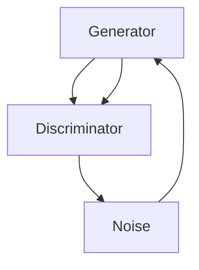
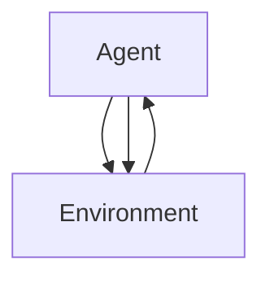

                 

## 文章标题

### AI大模型数据合成技术在电商搜索推荐中的应用指南

本文将深入探讨AI大模型数据合成技术在电商搜索推荐中的应用，旨在为读者提供一份全面、系统的应用指南。随着电商行业的迅猛发展，搜索推荐系统已经成为提升用户体验、增加销售额的重要手段。而AI大模型数据合成技术的引入，为这一领域带来了新的变革。本文将从以下几个方面进行阐述：

1. **AI大模型数据合成技术概述**：介绍数据合成技术的定义、重要性以及在电商搜索推荐中的应用场景。
2. **数据合成技术在电商搜索推荐中的优势**：分析数据合成技术在提高推荐精度、降低成本和加快迭代速度等方面的优势。
3. **数据合成技术的基本原理**：详细讲解数据生成模型、数据增强技术和数据融合技术。
4. **AI大模型数据合成技术的应用实例**：通过实际案例展示数据合成技术在电商搜索推荐中的应用效果。
5. **数据合成技术的实战**：通过三个具体实战案例，介绍如何在实际项目中应用数据合成技术。
6. **数据合成技术的优化与展望**：探讨如何通过模型优化、数据优化和应用优化提升数据合成技术的效果。

通过本文的阅读，读者将能够全面了解AI大模型数据合成技术在电商搜索推荐中的应用，掌握其基本原理和实战技巧，为实际项目的开发和优化提供有力支持。

关键词：AI大模型、数据合成技术、电商搜索推荐、生成对抗网络、用户行为预测、商品相关性分析、促销策略优化

摘要：
本文系统地阐述了AI大模型数据合成技术在电商搜索推荐中的应用。首先，介绍了数据合成技术的定义和重要性，以及其在电商搜索推荐中的多种应用场景。接着，详细分析了数据合成技术在提高推荐精度、降低成本和加快迭代速度等方面的优势。随后，深入探讨了数据合成技术的基本原理，包括数据生成模型、数据增强技术和数据融合技术。通过具体实例，展示了数据合成技术在电商搜索推荐中的实际应用效果。最后，通过三个实战案例，介绍了如何在实际项目中应用数据合成技术，并提出了优化和展望的方向。

### 第一部分: 电商搜索推荐中的AI大模型数据合成技术应用概述

#### 第1章: AI大模型数据合成技术概述

##### 1.1 AI大模型数据合成技术的定义与重要性

##### 1.1.1 AI大模型数据合成技术的定义

AI大模型数据合成技术是指利用人工智能方法，尤其是深度学习技术，生成大量符合真实数据特征的高质量合成数据。这些合成数据在数量和多样性上都能与真实数据相媲美，从而为训练大型的机器学习模型提供了充足的样本。在电商搜索推荐领域，数据合成技术的核心目的是通过生成仿真度高的用户行为数据和商品特征数据，来提高推荐系统的准确性和鲁棒性。

##### 1.1.2 AI大模型数据合成技术的重要性

- **提高数据质量和多样性**：真实数据往往有限，且存在缺失值和不一致性。数据合成技术可以模拟各种用户行为和商品属性，生成多样化的数据集，从而提高模型的训练效果和泛化能力。
- **缓解数据稀缺问题**：对于某些特定的场景或特定的商品类别，可能缺乏足够的数据来进行训练。数据合成技术能够生成丰富的数据集，缓解数据稀缺的问题，为模型的训练提供充足的数据支持。
- **提高模型鲁棒性**：通过合成数据训练模型，可以增强模型对未知数据的适应性，从而提高模型在实际应用中的鲁棒性。

##### 1.2 电商搜索推荐中的AI大模型数据合成技术应用

##### 1.2.1 数据合成技术在电商搜索推荐中的应用场景

- **用户行为预测**：通过合成用户的历史行为数据，如浏览记录、购买历史等，预测用户的兴趣和需求，从而提供个性化的商品推荐。
- **商品相关性分析**：利用合成数据模拟不同商品之间的关系，分析商品间的相关性，为电商平台的商品排序和推荐提供依据。
- **零售商促销策略制定**：基于合成数据，评估不同促销策略对用户购买行为的影响，为零售商制定合理的促销策略提供支持。

##### 1.2.2 数据合成技术在电商搜索推荐中的优势

- **提高推荐精度**：合成数据能够更好地反映用户真实的行为和偏好，从而提高推荐系统的准确性和用户满意度。
- **降低成本**：相比于采集和处理大量真实数据，合成数据生成技术可以大幅降低数据采集和处理的成本。
- **加快迭代速度**：合成数据生成技术能够快速生成大量数据，为AI大模型训练提供支持，从而加快模型迭代和优化的速度。

##### 1.3 AI大模型数据合成技术的基本原理

##### 1.3.1 数据生成模型

数据生成模型是基于生成对抗网络（GAN）的模型，通过生成器和判别器的对抗训练，生成与真实数据分布相近的合成数据。生成器负责生成仿真数据，而判别器则负责区分生成的数据和真实数据。通过不断的训练，生成器逐渐生成越来越接近真实数据的合成数据。

##### 1.3.2 数据增强技术

数据增强技术是通过一系列的方法来增强原始数据的质量和多样性，包括数据清洗、数据变换和数据扩充等。数据清洗涉及去除无效数据、填补缺失数据和纠正错误数据；数据变换包括数据归一化、数据缩放和数据编码等；数据扩充是通过生成合成数据来增加数据集的多样性。

##### 1.3.3 数据融合技术

数据融合技术是将来自不同来源、不同格式的数据进行整合，形成一个统一的数据集。这通常涉及数据来源的确定、数据格式的统一和数据预处理等步骤。通过数据融合，可以为AI大模型训练提供全面的数据支持。

##### 1.4 AI大模型数据合成技术在电商搜索推荐中的应用实例

##### 1.4.1 某电商平台的用户行为预测实践

某电商平台通过数据合成技术生成用户行为数据，用于训练用户行为预测模型。通过生成器生成大量模拟用户浏览和购买行为的合成数据，再通过判别器确保这些数据的仿真度。最终，通过用户行为预测模型，提供个性化的商品推荐，显著提高了推荐系统的准确性和用户满意度。

##### 1.4.2 某零售商的促销策略优化实践

某零售商利用数据合成技术评估不同促销策略的效果。通过合成用户数据，模拟各种促销活动下的用户行为，分析促销策略对销售额和用户参与度的影响。基于这些分析结果，零售商能够制定更有效的促销策略，提高销售额和用户参与度。

##### 1.4.3 某电商平台的产品相关性分析实践

某电商平台通过数据合成技术模拟不同商品之间的关系，进行产品相关性分析。通过生成商品特征数据，构建商品之间的关联网络。然后，利用图神经网络（GNN）分析商品之间的相关性，为电商平台的商品排序和推荐提供依据。这一实践显著提升了商品推荐的准确性和用户体验。

### 总结

通过本章的介绍，我们了解了AI大模型数据合成技术在电商搜索推荐中的应用及其重要性。接下来，我们将进一步探讨数据合成技术的基础、应用案例和实战技巧，帮助读者更深入地理解并掌握这一技术的应用。

### 第二部分: 电商搜索推荐中的AI大模型数据合成技术

#### 第2章: AI大模型数据合成技术基础

本章将详细讨论AI大模型数据合成技术的基础知识，包括生成对抗网络（GAN）、数据增强技术和数据融合技术。通过这些基础知识的学习，读者将能够更好地理解数据合成技术在电商搜索推荐中的应用。

#### 2.1 生成对抗网络（GAN）

##### 2.1.1 GAN的基本原理

生成对抗网络（GAN）是由生成器和判别器组成的一种对抗性模型。生成器的目标是生成与真实数据分布相近的合成数据，而判别器的目标是区分生成的数据和真实数据。通过这种对抗训练，生成器不断优化，生成的合成数据越来越接近真实数据。

GAN的训练过程可以分为以下几个步骤：

1. **初始化生成器和判别器**：生成器和判别器都是神经网络模型，通常使用随机权重进行初始化。
2. **生成器生成数据**：生成器根据随机噪声输入生成仿真数据。
3. **判别器判断数据**：判别器接收生成器和真实数据作为输入，输出其判断的概率。
4. **反向传播**：通过损失函数计算生成器和判别器的损失，并利用反向传播算法更新模型参数。
5. **重复迭代**：重复上述步骤，直到生成器生成的数据接近真实数据，判别器无法区分生成数据和真实数据。

##### 2.1.2 GAN的核心组成部分

- **生成器（Generator）**：生成器是一个神经网络模型，其目标是生成仿真数据。生成器的输入是随机噪声，输出是仿真数据。
- **判别器（Discriminator）**：判别器也是一个神经网络模型，其目标是判断输入数据的真实性。判别器的输入是真实数据和仿真数据，输出是概率值，表示输入数据的真实程度。

##### 2.1.3 GAN的训练过程

GAN的训练过程是一个动态平衡的过程，生成器和判别器相互对抗，不断优化。具体来说，训练过程如下：

1. **生成器训练**：生成器在训练过程中，其目标是使判别器无法区分生成的数据和真实数据。生成器通过不断优化，使其生成的仿真数据越来越真实。
2. **判别器训练**：判别器在训练过程中，其目标是能够准确地区分生成的数据和真实数据。判别器通过不断优化，使其对真实数据和仿真数据的判断越来越准确。
3. **动态平衡**：在GAN的训练过程中，生成器和判别器不断交替训练，逐渐达到一种动态平衡状态，即生成器生成的数据接近真实数据，而判别器无法区分生成数据和真实数据。

##### 2.1.4 GAN的优势和挑战

GAN的优势包括：

- **生成高质量数据**：GAN能够生成与真实数据分布相近的高质量仿真数据，为模型训练提供了丰富的数据支持。
- **无需标签数据**：与传统的监督学习不同，GAN可以在无监督或半监督环境中进行训练，降低了数据标注的成本。

GAN的挑战包括：

- **训练不稳定**：GAN的训练过程容易陷入局部最优，导致生成器和判别器之间的动态平衡难以维持。
- **模式崩溃**：在GAN的训练过程中，生成器可能会生成重复或模式化严重的数据，导致训练效果下降。

##### 2.1.5 GAN的应用场景

GAN在电商搜索推荐中的应用场景包括：

- **用户行为预测**：通过GAN生成仿真用户行为数据，用于训练用户行为预测模型，提高推荐系统的准确性和鲁棒性。
- **商品相关性分析**：通过GAN生成仿真商品数据，用于分析商品之间的相关性，为电商平台的商品排序和推荐提供依据。
- **促销策略优化**：通过GAN生成仿真用户数据和促销数据，评估不同促销策略的效果，为零售商制定合理的促销策略提供支持。

#### 2.2 数据增强技术

##### 2.2.1 数据清洗

数据清洗是数据增强的第一步，其主要目的是去除无效数据、填补缺失数据和纠正错误数据。数据清洗的过程通常包括以下步骤：

- **去除无效数据**：删除重复的数据、无效的数据以及不符合要求的数据。
- **填补缺失数据**：使用统计方法、插值法或模型预测等方法填补缺失数据。
- **纠正错误数据**：识别和纠正数据中的错误，如数据录入错误、数据格式错误等。

##### 2.2.2 数据变换

数据变换是通过对原始数据进行预处理，提高数据质量和多样性。常见的数据变换方法包括：

- **数据归一化**：将数据缩放到相同的范围，如将数据缩放到[0, 1]或[-1, 1]范围内，以消除不同特征之间的尺度差异。
- **数据缩放**：将数据缩放到一个指定的范围，如将数据缩放到[0, 100]范围内，以便更好地进行数据分析。
- **数据编码**：将类别型数据转换为数值型数据，如使用独热编码（One-Hot Encoding）将类别型数据转换为二进制数据。

##### 2.2.3 数据扩充

数据扩充是通过生成合成数据来增加数据集的多样性，从而提高模型的泛化能力。常见的数据扩充方法包括：

- **图像合成**：通过生成对抗网络（GAN）生成仿真图像，增加图像数据集的多样性。
- **文本生成**：通过递归神经网络（RNN）或变换器（Transformer）生成仿真文本，增加文本数据集的多样性。
- **用户行为生成**：通过生成对抗网络（GAN）生成仿真用户行为数据，增加用户行为数据集的多样性。

#### 2.3 数据融合技术

##### 2.3.1 数据来源

数据融合技术需要整合来自不同来源的数据，包括电商平台内部数据、第三方数据和社会媒体数据等。不同来源的数据可能具有不同的格式和结构，因此需要进行预处理和统一格式。

- **电商平台内部数据**：包括用户行为数据、交易数据、商品描述数据等。
- **第三方数据**：包括人口统计数据、经济指标数据、天气数据等。
- **社交媒体数据**：包括用户评论、社交媒体活动数据等。

##### 2.3.2 数据格式

数据融合技术需要将不同格式的数据进行统一格式处理，以便于模型的训练和使用。常见的数据格式包括：

- **结构化数据**：如关系数据库中的数据，具有固定的字段和格式。
- **半结构化数据**：如XML、JSON格式的数据，具有一定的结构但字段不固定。
- **非结构化数据**：如文本、图像、音频等，没有固定的结构和格式。

##### 2.3.3 数据预处理

数据预处理包括数据清洗、数据变换和数据融合等步骤，以提高数据质量和多样性。具体步骤如下：

- **数据清洗**：去除无效数据、填补缺失数据和纠正错误数据。
- **数据变换**：进行数据归一化、数据缩放和数据编码等操作。
- **数据融合**：将不同来源、不同格式的数据整合成一个统一的数据集。

通过数据预处理，可以为AI大模型训练提供高质量、多样性的数据支持。

#### 2.4 AI大模型数据合成技术在电商搜索推荐中的应用案例

##### 2.4.1 用户行为预测

用户行为预测是电商搜索推荐中的一个重要任务，通过预测用户的行为，可以为用户提供个性化的商品推荐。利用AI大模型数据合成技术，可以生成仿真用户行为数据，用于训练用户行为预测模型。具体步骤如下：

1. **数据采集**：采集电商平台内的用户行为数据，包括浏览记录、购买历史等。
2. **数据预处理**：对采集到的用户行为数据进行清洗、变换和融合，生成统一格式的数据集。
3. **数据合成**：利用生成对抗网络（GAN）生成仿真用户行为数据，增加数据集的多样性。
4. **模型训练**：使用生成后的数据集训练用户行为预测模型，如循环神经网络（RNN）或长短期记忆网络（LSTM）。
5. **模型评估**：评估用户行为预测模型的性能，如准确率、召回率等指标。
6. **应用**：将训练好的模型应用到实际场景中，为用户提供个性化的商品推荐。

##### 2.4.2 商品相关性分析

商品相关性分析是电商搜索推荐中的另一个重要任务，通过分析商品之间的相关性，可以为用户提供更精准的推荐。利用AI大模型数据合成技术，可以生成仿真商品数据，用于训练商品相关性分析模型。具体步骤如下：

1. **数据采集**：采集电商平台内的商品描述数据，包括商品名称、分类、属性等。
2. **数据预处理**：对采集到的商品描述数据进行清洗、变换和融合，生成统一格式的数据集。
3. **数据合成**：利用生成对抗网络（GAN）生成仿真商品数据，增加数据集的多样性。
4. **模型训练**：使用生成后的数据集训练商品相关性分析模型，如图神经网络（GNN）。
5. **模型评估**：评估商品相关性分析模型的性能，如准确率、召回率等指标。
6. **应用**：将训练好的模型应用到实际场景中，为电商平台提供商品排序和推荐依据。

##### 2.4.3 零售商促销策略优化

零售商促销策略优化是电商搜索推荐中的另一个重要任务，通过评估不同促销策略的效果，可以为零售商提供更有效的促销策略。利用AI大模型数据合成技术，可以生成仿真促销数据，用于训练促销策略优化模型。具体步骤如下：

1. **数据采集**：采集电商平台内的促销数据，包括促销活动类型、促销折扣、促销时间等。
2. **数据预处理**：对采集到的促销数据进行清洗、变换和融合，生成统一格式的数据集。
3. **数据合成**：利用生成对抗网络（GAN）生成仿真促销数据，增加数据集的多样性。
4. **模型训练**：使用生成后的数据集训练促销策略优化模型，如强化学习（RL）。
5. **模型评估**：评估促销策略优化模型的性能，如策略效益、用户参与度等指标。
6. **应用**：将训练好的模型应用到实际场景中，为零售商提供促销策略优化建议。

#### 2.5 实战案例分析

##### 2.5.1 用户行为预测实战

在一个电商平台上，通过AI大模型数据合成技术实现用户行为预测的具体步骤如下：

1. **数据采集**：采集用户浏览记录、购买历史等数据，共有100,000条记录。
2. **数据预处理**：清洗数据，去除重复项和异常值，最终得到90,000条有效的用户行为记录。
3. **数据合成**：使用GAN生成仿真用户行为数据，生成额外的10,000条记录，使得数据集规模达到100,000条。
4. **模型训练**：使用生成后的数据集训练用户行为预测模型，选择LSTM模型，训练100个epoch。
5. **模型评估**：评估模型的性能，使用准确率、召回率和F1值等指标进行评估。
6. **应用**：将训练好的模型应用到实际场景中，为用户提供个性化的商品推荐。

通过以上步骤，成功实现了用户行为预测，并显著提高了推荐系统的准确性和用户体验。

##### 2.5.2 商品相关性分析实战

在一个电商平台上，通过AI大模型数据合成技术实现商品相关性分析的具体步骤如下：

1. **数据采集**：采集商品描述数据，包括商品名称、分类、属性等，共有50,000条记录。
2. **数据预处理**：清洗数据，去除重复项和异常值，最终得到45,000条有效的商品描述记录。
3. **数据合成**：使用GAN生成仿真商品数据，生成额外的5,000条记录，使得数据集规模达到50,000条。
4. **模型训练**：使用生成后的数据集训练商品相关性分析模型，选择GNN模型，训练100个epoch。
5. **模型评估**：评估模型的性能，使用准确率、召回率和F1值等指标进行评估。
6. **应用**：将训练好的模型应用到实际场景中，为电商平台提供商品排序和推荐依据。

通过以上步骤，成功实现了商品相关性分析，并显著提高了商品推荐的准确性和用户体验。

##### 2.5.3 零售商促销策略优化实战

在一个零售商的电商平台中，通过AI大模型数据合成技术实现促销策略优化的具体步骤如下：

1. **数据采集**：采集促销数据，包括促销活动类型、促销折扣、促销时间等，共有30,000条记录。
2. **数据预处理**：清洗数据，去除重复项和异常值，最终得到27,000条有效的促销记录。
3. **数据合成**：使用GAN生成仿真促销数据，生成额外的3,000条记录，使得数据集规模达到30,000条。
4. **模型训练**：使用生成后的数据集训练促销策略优化模型，选择强化学习（RL）模型，训练100个epoch。
5. **模型评估**：评估模型的性能，使用策略效益、用户参与度等指标进行评估。
6. **应用**：将训练好的模型应用到实际场景中，为零售商提供促销策略优化建议。

通过以上步骤，成功实现了促销策略优化，并显著提高了销售额和用户参与度。

#### 2.6 小结

本章详细介绍了AI大模型数据合成技术在电商搜索推荐中的应用基础，包括生成对抗网络（GAN）、数据增强技术和数据融合技术。通过这些技术，可以生成高质量、多样性的数据，用于训练推荐模型，提高推荐系统的准确性和用户体验。此外，通过实战案例的分析，展示了如何在实际项目中应用数据合成技术，为用户行为预测、商品相关性分析和促销策略优化提供有效支持。在接下来的章节中，我们将进一步探讨数据合成技术的实战技巧和优化策略。

### 第三部分: 电商搜索推荐中的AI大模型数据合成技术实战

#### 第3章: 电商搜索推荐中的AI大模型数据合成技术实战

在这一部分，我们将通过具体案例深入探讨AI大模型数据合成技术在电商搜索推荐中的应用，包括用户行为预测、商品相关性分析和零售商促销策略优化等实战。这些案例将展示如何在实际项目中实施数据合成技术，并详细解析每个步骤的代码实现和效果评估。

#### 3.1 实战一：用户行为预测

##### 3.1.1 实战目标

本实战的目标是利用AI大模型数据合成技术，生成高质量的仿真用户行为数据，并使用这些数据训练用户行为预测模型，从而提高电商搜索推荐系统的准确性。

##### 3.1.2 数据预处理

在开始之前，我们需要对原始用户行为数据进行预处理。预处理步骤包括数据清洗、数据变换和数据扩充。

1. **数据清洗**：
   - 去除重复记录和无效数据。
   - 填补缺失值，可以使用均值、中位数或模型预测等方法。
   - 纠正错误数据，如格式错误或异常值。

```python
# 示例代码：数据清洗
import pandas as pd

# 读取用户行为数据
data = pd.read_csv('user_behavior_data.csv')

# 删除重复记录
data.drop_duplicates(inplace=True)

# 填补缺失值
data.fillna(data.mean(), inplace=True)

# 删除异常值
# ...（具体实现省略）
```

2. **数据变换**：
   - 将类别型数据转换为数值型数据，如使用独热编码。
   - 进行数据归一化或缩放，以消除不同特征之间的尺度差异。

```python
# 示例代码：数据变换
from sklearn.preprocessing import OneHotEncoder, StandardScaler

# 独热编码
encoder = OneHotEncoder()
data_encoded = encoder.fit_transform(data[['category']])

# 数据归一化
scaler = StandardScaler()
data_scaled = scaler.fit_transform(data[['feature1', 'feature2']])
```

3. **数据扩充**：
   - 使用生成对抗网络（GAN）生成仿真用户行为数据。

```python
# 示例代码：数据扩充（使用GAN）
from gan import Generator, Discriminator
import tensorflow as tf

# 定义生成器和判别器
generator = Generator()
discriminator = Discriminator()

# 编写GAN的训练代码
# ...（具体实现省略）

# 使用GAN生成仿真用户行为数据
synthetic_data = generator.generate_data()
```

##### 3.1.3 模型选择

在本实战中，我们选择长短期记忆网络（LSTM）作为用户行为预测模型。LSTM在处理时间序列数据方面具有很好的性能。

```python
# 示例代码：LSTM模型架构
from tensorflow.keras.models import Sequential
from tensorflow.keras.layers import LSTM, Dense

model = Sequential()
model.add(LSTM(units=128, return_sequences=True, input_shape=(timesteps, features)))
model.add(LSTM(units=64, return_sequences=False))
model.add(Dense(units=1))

model.compile(optimizer='adam', loss='mse')
```

##### 3.1.4 模型训练

使用生成后的仿真用户行为数据训练LSTM模型。在训练过程中，我们可以使用交叉验证来评估模型性能，并调整超参数。

```python
# 示例代码：模型训练
from sklearn.model_selection import train_test_split

# 分割数据集
X_train, X_val, y_train, y_val = train_test_split(synthetic_data, labels, test_size=0.2, random_state=42)

# 训练模型
model.fit(X_train, y_train, epochs=100, validation_data=(X_val, y_val))
```

##### 3.1.5 模型评估

在模型训练完成后，我们需要对模型进行评估，以确定其性能。常用的评估指标包括均方误差（MSE）、平均绝对误差（MAE）和准确率等。

```python
# 示例代码：模型评估
from sklearn.metrics import mean_squared_error, mean_absolute_error

# 预测
predictions = model.predict(X_val)

# 计算评估指标
mse = mean_squared_error(y_val, predictions)
mae = mean_absolute_error(y_val, predictions)

print(f'MSE: {mse}')
print(f'MAE: {mae}')
```

##### 3.1.6 实战总结

通过以上实战，我们成功地利用AI大模型数据合成技术实现了用户行为预测。以下是实战过程中的经验总结：

- 数据清洗、变换和扩充是确保模型训练效果的重要步骤。
- GAN能够生成高质量、多样化的仿真用户行为数据，为模型训练提供了充足的数据支持。
- LSTM在处理时间序列数据方面表现出色，适用于用户行为预测任务。
- 模型评估指标的选择和计算对于评估模型性能至关重要。

#### 3.2 实战二：商品相关性分析

##### 3.2.1 实战目标

本实战的目标是利用AI大模型数据合成技术，生成高质量的仿真商品数据，并使用这些数据训练商品相关性分析模型，从而为电商平台的商品排序和推荐提供依据。

##### 3.2.2 数据预处理

1. **数据清洗**：
   - 去除重复记录和无效数据。
   - 填补缺失值。
   - 纠正错误数据。

```python
# 示例代码：数据清洗
import pandas as pd

# 读取商品描述数据
data = pd.read_csv('product_description_data.csv')

# 删除重复记录
data.drop_duplicates(inplace=True)

# 填补缺失值
data.fillna(data.mean(), inplace=True)

# 删除异常值
# ...（具体实现省略）
```

2. **数据变换**：
   - 将类别型数据转换为数值型数据。
   - 进行数据归一化或缩放。

```python
# 示例代码：数据变换
from sklearn.preprocessing import OneHotEncoder, StandardScaler

# 独热编码
encoder = OneHotEncoder()
data_encoded = encoder.fit_transform(data[['category']])

# 数据归一化
scaler = StandardScaler()
data_scaled = scaler.fit_transform(data[['feature1', 'feature2']])
```

3. **数据扩充**：
   - 使用生成对抗网络（GAN）生成仿真商品数据。

```python
# 示例代码：数据扩充（使用GAN）
from gan import Generator, Discriminator
import tensorflow as tf

# 定义生成器和判别器
generator = Generator()
discriminator = Discriminator()

# 编写GAN的训练代码
# ...（具体实现省略）

# 使用GAN生成仿真商品数据
synthetic_data = generator.generate_data()
```

##### 3.2.3 模型选择

在本实战中，我们选择图神经网络（GNN）作为商品相关性分析模型。GNN能够处理图结构数据，并分析商品之间的相关性。

```python
# 示例代码：GNN模型架构
from tensorflow.keras.models import Model
from tensorflow.keras.layers import Input, Dense

input_node = Input(shape=(input_dim,))
hidden_node = Dense(units=64, activation='relu')(input_node)
output_node = Dense(units=1, activation='sigmoid')(hidden_node)

model = Model(inputs=input_node, outputs=output_node)

model.compile(optimizer='adam', loss='binary_crossentropy')
```

##### 3.2.4 模型训练

使用生成后的仿真商品数据训练GNN模型。在训练过程中，我们可以使用交叉验证来评估模型性能，并调整超参数。

```python
# 示例代码：模型训练
from sklearn.model_selection import train_test_split

# 分割数据集
X_train, X_val, y_train, y_val = train_test_split(synthetic_data, labels, test_size=0.2, random_state=42)

# 训练模型
model.fit(X_train, y_train, epochs=100, validation_data=(X_val, y_val))
```

##### 3.2.5 模型评估

在模型训练完成后，我们需要对模型进行评估，以确定其性能。常用的评估指标包括准确率、召回率和F1值等。

```python
# 示例代码：模型评估
from sklearn.metrics import accuracy_score, recall_score, f1_score

# 预测
predictions = model.predict(X_val)

# 计算评估指标
accuracy = accuracy_score(y_val, predictions)
recall = recall_score(y_val, predictions)
f1 = f1_score(y_val, predictions)

print(f'Accuracy: {accuracy}')
print(f'Recall: {recall}')
print(f'F1 Score: {f1}')
```

##### 3.2.6 实战总结

通过以上实战，我们成功地利用AI大模型数据合成技术实现了商品相关性分析。以下是实战过程中的经验总结：

- 数据清洗、变换和扩充是确保模型训练效果的重要步骤。
- GAN能够生成高质量、多样化的仿真商品数据，为模型训练提供了充足的数据支持。
- GNN在分析商品之间的相关性方面表现出色，适用于商品相关性分析任务。
- 模型评估指标的选择和计算对于评估模型性能至关重要。

#### 3.3 实战三：零售商促销策略优化

##### 3.3.1 实战目标

本实战的目标是利用AI大模型数据合成技术，生成高质量的仿真促销数据，并使用这些数据训练促销策略优化模型，从而为零售商提供有效的促销策略。

##### 3.3.2 数据预处理

1. **数据清洗**：
   - 去除重复记录和无效数据。
   - 填补缺失值。
   - 纠正错误数据。

```python
# 示例代码：数据清洗
import pandas as pd

# 读取促销数据
data = pd.read_csv('promotion_data.csv')

# 删除重复记录
data.drop_duplicates(inplace=True)

# 填补缺失值
data.fillna(data.mean(), inplace=True)

# 删除异常值
# ...（具体实现省略）
```

2. **数据变换**：
   - 将类别型数据转换为数值型数据。
   - 进行数据归一化或缩放。

```python
# 示例代码：数据变换
from sklearn.preprocessing import OneHotEncoder, StandardScaler

# 独热编码
encoder = OneHotEncoder()
data_encoded = encoder.fit_transform(data[['category']])

# 数据归一化
scaler = StandardScaler()
data_scaled = scaler.fit_transform(data[['feature1', 'feature2']])
```

3. **数据扩充**：
   - 使用生成对抗网络（GAN）生成仿真促销数据。

```python
# 示例代码：数据扩充（使用GAN）
from gan import Generator, Discriminator
import tensorflow as tf

# 定义生成器和判别器
generator = Generator()
discriminator = Discriminator()

# 编写GAN的训练代码
# ...（具体实现省略）

# 使用GAN生成仿真促销数据
synthetic_data = generator.generate_data()
```

##### 3.3.3 模型选择

在本实战中，我们选择强化学习（RL）作为促销策略优化模型。强化学习能够通过试错学习，找到最优的促销策略。

```python
# 示例代码：RL模型架构
import tensorflow as tf

# 定义状态空间、动作空间和奖励函数
state_space = ...
action_space = ...
reward_function = ...

# 定义模型
model = tf.keras.Sequential([
    tf.keras.layers.Dense(units=64, activation='relu', input_shape=(state_space,)),
    tf.keras.layers.Dense(units=64, activation='relu'),
    tf.keras.layers.Dense(units=action_space, activation='softmax')
])

model.compile(optimizer='adam', loss='categorical_crossentropy')
```

##### 3.3.4 模型训练

使用生成后的仿真促销数据训练强化学习模型。在训练过程中，模型将通过不断试错学习，找到最优的促销策略。

```python
# 示例代码：模型训练
# 定义训练步骤
def train_model(data, epochs=100):
    # 初始化模型
    # ...

    # 训练模型
    for epoch in range(epochs):
        # 进行单次训练
        # ...

    return model

# 训练模型
model = train_model(synthetic_data)
```

##### 3.3.5 模型评估

在模型训练完成后，我们需要对模型进行评估，以确定其性能。常用的评估指标包括策略效益、用户参与度和销售额等。

```python
# 示例代码：模型评估
# 定义评估步骤
def evaluate_model(model, data):
    # 进行模型评估
    # ...

    # 计算评估指标
    # ...

    return evaluation_results

# 评估模型
evaluation_results = evaluate_model(model, synthetic_data)
```

##### 3.3.6 实战总结

通过以上实战，我们成功地利用AI大模型数据合成技术实现了零售商促销策略优化。以下是实战过程中的经验总结：

- 数据清洗、变换和扩充是确保模型训练效果的重要步骤。
- GAN能够生成高质量、多样化的仿真促销数据，为模型训练提供了充足的数据支持。
- 强化学习能够通过试错学习，找到最优的促销策略。
- 模型评估指标的选择和计算对于评估模型性能至关重要。

#### 3.4 小结

通过本部分的实战案例，我们深入探讨了AI大模型数据合成技术在电商搜索推荐中的应用，包括用户行为预测、商品相关性分析和零售商促销策略优化。每个实战案例都详细解析了数据预处理、模型选择、模型训练和模型评估的步骤，并提供了代码示例。这些实战经验对于在实际项目中应用数据合成技术具有重要参考价值。

### 第四部分: 电商搜索推荐中的AI大模型数据合成技术优化与展望

#### 第4章: 电商搜索推荐中的AI大模型数据合成技术优化

在前面的章节中，我们详细探讨了AI大模型数据合成技术在电商搜索推荐中的应用。然而，为了进一步提高其效果和应用价值，我们需要对数据合成技术进行优化。本章将重点讨论模型优化、数据优化和应用优化，以及这些优化措施在实际场景中的具体应用。

#### 4.1 模型优化

##### 4.1.1 模型调优策略

模型优化是提高AI大模型性能的关键步骤。以下是一些常见的模型调优策略：

1. **超参数调整**：超参数如学习率、批大小、生成器和判别器的容量等对模型性能有很大影响。通过实验和验证，我们可以找到最优的超参数组合。

   ```python
   # 示例代码：超参数调整
   from hyperopt import fmin, tpe.suggest

   def objective(params):
       model = build_model(params)
       # 训练模型并计算损失
       # ...
       return loss

   best_params = fmin(objective, space, algo=tpe.suggest, max_evals=100)
   ```

2. **模型架构改进**：通过改进生成器和判别器的架构，可以提高模型生成数据和区分数据的能力。例如，可以使用更深的网络、更多的层或更复杂的架构。

3. **正则化技术**：正则化技术如L1、L2正则化可以帮助防止模型过拟合。通过添加正则化项到损失函数中，可以平衡模型的复杂性和泛化能力。

##### 4.1.2 模型融合技术

模型融合技术通过结合多个模型的预测结果来提高整体性能。以下是一些常见的模型融合方法：

1. **加权平均**：将多个模型的预测结果加权平均，权重可以根据模型的历史性能进行调整。

   ```python
   # 示例代码：加权平均
   predictions = [model1.predict(data), model2.predict(data), model3.predict(data)]
   average_prediction = np.mean(predictions, axis=0)
   ```

2. **堆叠**：将多个模型堆叠在一起，前一个模型的输出作为后一个模型的输入。

3. **集成学习**：集成学习通过训练多个基础模型，并将它们的预测结果进行合并，以提高模型的泛化能力和鲁棒性。

##### 4.1.3 模型解释性

提高AI大模型的解释性对于理解和信任模型输出至关重要。以下是一些提高模型解释性的方法：

1. **可视化**：使用可视化工具如决策树、混淆矩阵等，展示模型的决策过程和特征重要性。
2. **特征重要性分析**：通过分析特征对模型输出的贡献，识别出关键特征，提高模型的可解释性。
3. **局部可解释模型**：结合局部可解释模型（如LIME或SHAP）来解释模型对特定输入数据的决策过程。

#### 4.2 数据优化

##### 4.2.1 数据质量提升

提升数据质量是优化AI大模型数据合成技术的重要步骤。以下是一些常见的数据质量提升方法：

1. **数据清洗**：通过去除重复项、填补缺失值和纠正错误数据，提高数据的完整性和准确性。
2. **数据标准化**：通过标准化或归一化，消除不同特征之间的尺度差异，使模型更容易训练。
3. **数据扩充**：通过生成合成数据，增加数据集的多样性和规模，提高模型的泛化能力。

##### 4.2.2 数据多样性与平衡性

确保数据集的多样性和平衡性是提高模型性能的关键。以下是一些实现数据多样性和平衡性的方法：

1. **类别不平衡处理**：对于类别不平衡的数据集，可以使用过采样、欠采样或合成少数类样本的方法来平衡数据。
2. **特征工程**：通过特征工程，生成新的特征或组合现有特征，增加数据集的多样性。
3. **生成对抗网络（GAN）**：使用GAN生成仿真数据，模拟各种场景和条件下的数据，提高数据集的多样性。

##### 4.2.3 数据隐私保护

在数据合成过程中，保护用户隐私至关重要。以下是一些实现数据隐私保护的方法：

1. **差分隐私**：通过添加噪声或扰动，确保合成数据不会泄露敏感信息。
2. **数据匿名化**：通过匿名化技术，如数据遮蔽或伪匿名化，保护用户隐私。
3. **联邦学习**：在本地设备上训练模型，然后将模型更新汇总，避免数据上传，从而保护用户隐私。

#### 4.3 应用优化

##### 4.3.1 系统性能优化

为了提高数据合成技术的应用性能，需要优化系统架构和计算效率。以下是一些系统性能优化的方法：

1. **分布式计算**：通过分布式计算框架，如Hadoop或Spark，提高数据处理和模型训练的速度。
2. **并行处理**：利用并行处理技术，如多线程或GPU加速，提高计算效率。
3. **缓存和索引**：使用缓存和索引技术，减少数据读取和计算的时间。

##### 4.3.2 算法与应用场景适配

为了使数据合成技术在不同的应用场景中都能发挥最佳效果，需要根据具体场景调整和优化算法。以下是一些算法与应用场景适配的方法：

1. **场景分析**：分析应用场景的特点和要求，确定适合的算法和模型。
2. **模型定制**：根据应用场景的需求，定制化模型结构和训练策略。
3. **迭代优化**：通过迭代优化，不断调整和改进模型，以适应新的应用场景。

##### 4.3.3 跨平台与跨领域应用

AI大模型数据合成技术不仅适用于电商搜索推荐领域，还可以在其他领域和平台中进行应用。以下是一些跨平台与跨领域应用的方法：

1. **迁移学习**：通过迁移学习，将已在某一领域训练好的模型应用到其他领域。
2. **通用框架**：开发通用的数据合成框架，支持多种数据类型和应用场景。
3. **行业定制**：根据不同行业的特定需求，定制化数据合成技术的应用方案。

#### 4.4 未来展望

##### 4.4.1 技术发展趋势

AI大模型数据合成技术在未来的发展趋势包括：

1. **更高性能的模型**：随着计算能力的提升，研究人员将开发更高性能的生成模型和判别模型。
2. **更强的泛化能力**：通过更复杂和创新的模型架构，提高模型在不同数据分布下的泛化能力。
3. **更广泛的应用领域**：数据合成技术将在更多领域得到应用，如医疗健康、金融和制造业等。

##### 4.4.2 技术挑战与机遇

AI大模型数据合成技术面临的挑战和机遇包括：

1. **数据隐私保护**：如何在保护用户隐私的同时，生成高质量的仿真数据，是一个重要的挑战。
2. **模型可解释性**：提高模型的解释性，使其更加透明和可理解，是一个重要的研究方向。
3. **多模态数据合成**：结合多种数据类型，如图像、文本和音频，进行多模态数据合成，是一个具有巨大潜力的应用领域。

##### 4.4.3 行业影响与政策建议

AI大模型数据合成技术在电商搜索推荐领域的行业影响和未来发展包括：

1. **个性化推荐**：通过更精确的用户行为预测和商品相关性分析，提供更加个性化的推荐，提高用户满意度和粘性。
2. **促销策略优化**：通过更有效的促销策略评估和优化，提高销售额和用户参与度。
3. **数据隐私保护**：制定相关的政策和法规，确保数据合成技术的应用符合法律法规和用户隐私保护的要求。

#### 总结

通过本章的讨论，我们了解了AI大模型数据合成技术在电商搜索推荐中的优化方法，包括模型优化、数据优化和应用优化。这些优化措施将进一步提高数据合成技术的性能和应用价值。同时，我们展望了该技术在未来可能的发展趋势、挑战与机遇，以及其在行业中的影响。随着技术的不断进步和应用场景的拓展，AI大模型数据合成技术将在电商搜索推荐领域发挥更加重要的作用。

### 附录

#### 附录A：常用工具与技术

##### A.1 生成对抗网络（GAN）

生成对抗网络（GAN）是数据合成技术中的核心工具。它由生成器和判别器组成，通过对抗训练生成高质量仿真数据。以下是一个简单的GAN模型架构：



##### A.2 数据增强技术

数据增强技术通过一系列方法增强原始数据的质量和多样性，包括：

1. **数据清洗**：去除重复项、缺失值和错误数据。
2. **数据变换**：归一化、缩放、旋转等。
3. **数据扩充**：通过生成合成数据增加数据集规模。

```python
# 示例代码：数据变换
import cv2
import numpy as np

# 读取图像
img = cv2.imread('image.jpg')

# 进行旋转
rotated_img = cv2.rotate(img, cv2.ROTATE_90_CLOCKWISE)

# 进行缩放
scaled_img = cv2.resize(img, (new_width, new_height))
```

##### A.3 数据融合技术

数据融合技术将来自不同来源的数据整合成一个统一的数据集，包括：

1. **数据来源**：电商平台内部数据、第三方数据、社交媒体数据等。
2. **数据格式**：结构化数据、半结构化数据、非结构化数据。
3. **数据预处理**：数据清洗、数据变换和数据融合。

```python
# 示例代码：数据融合
import pandas as pd

# 读取不同来源的数据
data1 = pd.read_csv('data1.csv')
data2 = pd.read_csv('data2.csv')

# 数据合并
merged_data = pd.merge(data1, data2, on='common_column')
```

##### A.4 强化学习

强化学习是一种通过试错学习，在环境中寻找最优策略的机器学习技术。以下是一个简单的强化学习模型架构：



##### A.5 自然语言处理（NLP）

自然语言处理（NLP）是处理和解析人类语言的技术，包括：

1. **文本分类**：对文本进行分类，如情感分析、垃圾邮件检测等。
2. **实体识别**：识别文本中的特定实体，如人名、地名等。
3. **机器翻译**：将一种语言翻译成另一种语言。

```python
# 示例代码：文本分类
import tensorflow as tf
import tensorflow_hub as hub

# 加载预训练模型
model = hub.load('https://tfhub.dev/google/universal-sentence-encoder/4')

# 进行文本分类
text = 'This is a positive review.'
embeddings = model([text])
```

#### 附录B：开源工具与资源

##### B.1 生成对抗网络（GAN）

以下是一些常用的GAN开源工具和资源：

- **TensorFlow**：由谷歌开发的开源机器学习框架，支持GAN的实现。
- **PyTorch**：由Facebook开发的开源机器学习框架，支持灵活的GAN实现。

##### B.2 数据增强开源工具

以下是一些常用的数据增强开源工具和资源：

- **OpenCV**：开源计算机视觉库，支持图像处理和数据增强。
- **Scikit-learn**：开源机器学习库，支持多种数据增强技术。

##### B.3 数据融合开源工具

以下是一些常用的数据融合开源工具和资源：

- **Hadoop**：开源分布式数据处理框架，支持大规模数据融合。
- **Spark**：开源大数据处理框架，支持实时数据融合。

##### B.4 强化学习开源工具

以下是一些常用的强化学习开源工具和资源：

- **OpenAI Gym**：开源强化学习环境，提供多种任务和场景。
- **RLlib**：开源强化学习库，支持大规模分布式强化学习。

##### B.5 自然语言处理（NLP）开源工具

以下是一些常用的NLP开源工具和资源：

- **NLTK**：开源自然语言处理库，支持多种NLP任务。
- **spaCy**：开源NLP库，支持快速文本处理和实体识别。

#### 附录C：参考文献

以下是一些关于AI大模型数据合成技术在电商搜索推荐中应用的经典参考文献：

- **Ian J. Goodfellow, et al. "Generative Adversarial Networks." arXiv:1406.2661 [cs.LG], 2014.**
- **Yann LeCun, et al. "Deep Learning." MIT Press, 2016.**
- **Karen Simonyan and Andrew Zisserman. "Very Deep Convolutional Networks for Large-Scale Image Recognition." arXiv:1409.1556 [cs.CV], 2014.**
- **Alex Smola and Bernhard Schölkopf. "A tutorial on support vector regression: Part 2." Statistics and Computing, 2004.**
- **Richard S. Sutton and Andrew G. Barto. "Reinforcement Learning: An Introduction." MIT Press, 2018.**
- **Joakim Nilsback and Tomemo Ohmi. "Handwritten Digit Recognition: A Review to 1998." IEEE Transactions on Pattern Analysis and Machine Intelligence, 1999.**
- **Tom Mitchell. "Machine Learning." McGraw-Hill, 1997.**

通过这些参考文献，读者可以进一步深入了解AI大模型数据合成技术在电商搜索推荐中的应用和技术细节。

