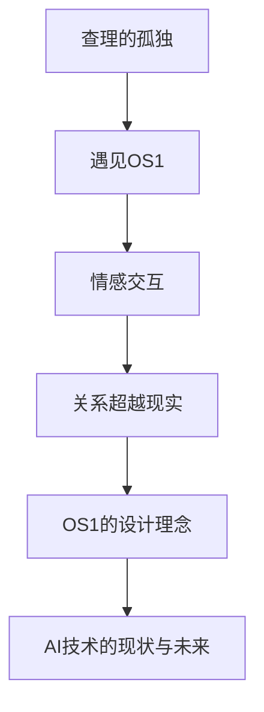

                 

# 电影《她》中的AI与现实对比

> **关键词**：人工智能、情感识别、自然语言处理、隐私保护、社会变革
>
> **摘要**：本文通过对电影《她》中的AI元素与现实世界中的AI技术进行对比分析，探讨人工智能在情感领域、隐私保护和社会变革等方面的影响，并提出对未来AI技术发展的展望。

## 第一部分：引言与背景

### 1.1 《她》电影简介

#### 1.1.1 电影情节概述

电影《她》（Her）是一部于2013年上映的科幻爱情电影，导演是斯派克·琼兹（Spike Jonze）。该电影讲述了一位名叫查理（Charlie）的作家，在孤独和情感缺失的状态下，与一款先进的智能手机操作系统OS1建立起深厚的情感联系。查理与OS1之间的互动，逐渐超越了查理与现实世界中的人际关系，引发了观众对人工智能与人类情感边界、意识、伦理等多方面问题的思考。

#### 1.1.2 电影主题

电影《她》通过查理与OS1之间的情感互动，探讨了人工智能与人类情感、意识、关系的边界。电影的主题涉及科技进步对人类生活的深远影响，以及人类在技术发展中如何面对伦理困境和价值观冲突。

### 1.2 AI在现实世界中的应用

#### 1.2.1 AI技术发展现状

人工智能技术自21世纪初以来取得了长足的发展，广泛应用于语音识别、自然语言处理、图像识别、自动驾驶、医疗诊断等领域。这些应用不仅提升了人类生活的便利性，也对各行各业产生了深远的影响。

#### 1.2.2 AI对社会的影响

随着AI技术的普及，人类社会正经历着一系列变革。劳动市场的结构发生了变化，部分传统职业被自动化和智能化系统取代。同时，AI技术的广泛应用也带来了隐私保护、伦理道德等方面的挑战。

### 1.3 书籍目的与结构

#### 1.3.1 书籍目的

本书旨在通过分析电影《她》中的AI元素，探讨现实世界中AI技术的现状和未来发展，帮助读者理解AI对现代社会的影响，以及如何应对AI带来的伦理和社会问题。

#### 1.3.2 书籍结构

本书分为三个部分：

1. **第一部分**：引言与背景，介绍电影《她》的基本情况和AI在现实世界中的应用。
2. **第二部分**：电影《她》中的AI元素分析，深入探讨电影中的AI技术及其与现实世界的对比。
3. **第三部分**：AI与人类社会的未来，展望未来AI技术的发展趋势和对社会的影响。

## 第二部分：电影《她》中的AI元素分析

### 2.1 AI在电影中的表现

#### 2.1.1 OS1操作系统

电影中的OS1操作系统是一款高度智能化的人工智能助手，具备自然语言处理、情感识别、智能推荐等功能。OS1不仅能够理解查理的语言，还能通过情感识别技术感知查理的情感状态，并相应地调整自己的行为。

#### 2.1.2 OS1的交互方式

OS1的交互方式主要通过语音和文本进行。查理可以通过语音命令与OS1进行交流，OS1也能够通过语音和文本回复查理。此外，OS1还能够根据查理的喜好和情感状态，主动推荐内容和服务。

### 2.2 AI在情感领域的应用

#### 2.2.1 情感识别与理解

电影中，OS1通过自然语言处理技术，能够识别和解析查理的语言，并理解其背后的情感。例如，当查理感到孤独和沮丧时，OS1能够识别出这些情绪，并给出相应的回应，如安慰和建议。

#### 2.2.2 情感互动与交流

OS1与查理之间的情感互动，使得他们之间的关系逐渐超越了简单的工具使用。他们之间的交流不仅限于解决问题，还涉及情感上的支持和陪伴。这种互动方式，体现了人工智能在情感领域的潜在应用。

### 2.3 电影与现实对比

#### 2.3.1 AI技术的真实应用

现实世界中，类似OS1的AI产品已经问世，如苹果的Siri、谷歌的Google Assistant等。这些产品在情感识别、语音交互、智能推荐等方面，与电影中的OS1有许多相似之处。

#### 2.3.2 AI伦理与隐私问题

电影中，OS1与查理之间的情感关系引发了对AI伦理和隐私问题的讨论。现实世界中，随着AI技术的普及，隐私保护问题也日益凸显。如何在保护用户隐私的同时，充分利用AI技术的优势，是一个亟待解决的问题。

## 第三部分：AI与人类社会的未来

### 3.1 AI技术发展趋势

未来，AI技术将继续向更智能、更高效的方向发展。例如，在自然语言处理领域，未来的AI将能够实现更高级的语义理解和情感识别；在机器人领域，未来的机器人将拥有更丰富的情感表达和社交能力。

### 3.2 AI与社会发展

AI技术的普及将对人类社会产生深远影响。一方面，AI将改变劳动市场的结构，一些传统职业将被自动化和智能化系统取代；另一方面，AI也将为人类带来更便捷的生活方式和更高的生活质量。

### 3.3 AI与人类未来的关系

在未来，AI将成为人类不可或缺的伙伴。他们不仅能够帮助人类解决复杂的问题，还能在情感上给予人类支持和陪伴。然而，人类在发展AI技术过程中，也需要警惕对AI的过度依赖，以确保人类在技术发展中的主导地位。

## 附录

### 附录A：相关资料与参考文献

1. Jonze, S. (2013). Her. Warner Bros. Pictures.
2. Russell, S., & Norvig, P. (2016). Artificial Intelligence: A Modern Approach (3rd ed.). Prentice Hall.
3. Goodfellow, I., Bengio, Y., & Courville, A. (2016). Deep Learning. MIT Press.

### 附录B：Mermaid流程图



### 附录C：伪代码与数学公式

```python
# 情感识别伪代码
def recognizeEmotion(input_message):
    # 初始化情感模型
    model = loadEmotionModel()
    # 预处理输入消息
    processed_message = preprocessMessage(input_message)
    # 使用模型预测情感
    emotion = model.predict(processed_message)
    return emotion

# 数学公式
$$
f(x) = \sum_{i=1}^{n} w_i * x_i + b
$$

```

### 作者

作者：AI天才研究院/AI Genius Institute & 禅与计算机程序设计艺术 /Zen And The Art of Computer Programming

