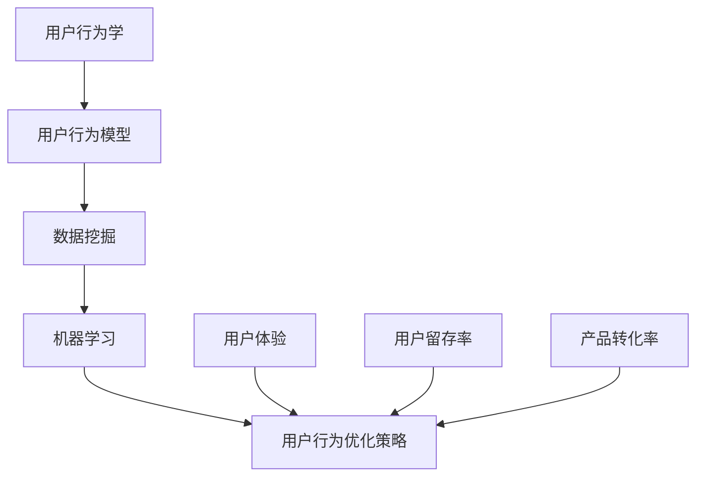
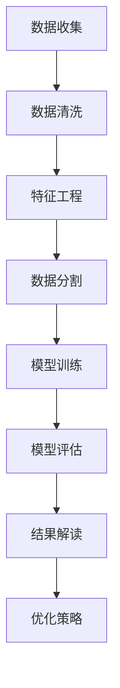

                 

### 《知识付费产品的用户行为分析与优化》

#### 关键词：
- 知识付费产品
- 用户行为分析
- 用户行为模型
- 数据挖掘
- 机器学习
- 用户行为优化策略

#### 摘要：
本文将探讨知识付费产品的用户行为分析与优化。通过介绍用户行为分析的理论基础，包括用户行为学、用户行为分析模型和数据收集与分析方法，我们将展示如何使用数据挖掘和机器学习技术来理解和预测用户行为。随后，通过实际案例研究，我们将展示如何实施用户行为优化策略，包括个性化推荐、用户体验优化和用户留存策略。最后，本文将总结主要内容和未来发展趋势，并给出对从业者的建议。

---

#### 目录

# 《知识付费产品的用户行为分析与优化》

> 关键词：知识付费产品、用户行为分析、数据挖掘、机器学习、用户行为优化策略

> 摘要：本文将探讨知识付费产品的用户行为分析与优化，通过理论基础、实践案例和优化策略，旨在提升用户体验、提高产品转化率和增强用户粘性。

## 第一部分：引言与背景

### 第1章：知识付费产品的概述

#### 1.1 知识付费产品的定义与现状

知识付费产品是指通过互联网平台提供专业知识和技能学习的服务，用户需要支付一定的费用才能获取内容。随着互联网技术的发展和在线教育市场的繁荣，知识付费产品已经成为一个重要的商业模式。

- **定义**：知识付费产品通常包括在线课程、电子书籍、专业讲座、培训直播等形式，为用户提供专业的知识和技能学习机会。
- **现状**：近年来，知识付费产品在各个领域迅速发展，用户数量和市场规模持续增长。根据相关报告，全球知识付费市场规模预计将在未来几年内保持高速增长。

#### 1.2 知识付费产品的发展趋势

知识付费产品的发展趋势主要受到用户需求变化和市场环境的影响。

- **用户需求的变化**：随着社会竞争的加剧和人们对自我提升的需求增加，用户对高质量、专业化的知识内容的需求日益增长。此外，用户对便捷、灵活的学习方式也提出了更高的要求。
- **市场规模的增长**：在线教育市场的不断扩张，以及移动学习、远程办公等趋势的推动，使得知识付费产品市场规模持续增长。未来，随着技术的进步和市场的成熟，知识付费产品将继续保持快速发展。

#### 1.3 用户行为分析与优化的意义

用户行为分析对于知识付费产品的优化具有重要意义。

- **提升用户体验**：通过分析用户行为，了解用户在平台上的使用习惯和偏好，可以帮助产品团队优化界面设计和内容布局，提升用户体验。
- **提高产品转化率**：了解用户行为，可以针对性地推送相关内容，提高用户的购买意愿和转化率。
- **增强用户粘性**：通过分析用户行为，发现潜在流失用户，并采取相应的留存策略，可以提高用户在平台上的活跃度和粘性。

### 第2章：用户行为分析的理论基础

#### 2.1 用户行为学概述

用户行为学是一门研究用户在数字环境中行为规律和动机的学科。它涉及到心理学、社会学、人类学等多个领域，旨在理解用户的行为模式，从而为产品设计提供依据。

- **基本概念**：用户行为学关注的核心概念包括用户动机、行为模式、用户体验等。
- **方法论**：用户行为学的研究方法包括问卷调查、用户访谈、行为跟踪等。

#### 2.2 用户行为分析模型

用户行为分析模型是用于描述和分析用户行为的理论框架。常见的用户行为分析模型包括AIDA模型和用户行为模型。

- **AIDA模型**：AIDA模型包括Attention（吸引注意）、Interest（产生兴趣）、Desire（激发欲望）和Action（促成行动）四个阶段，用于描述用户从接触产品到购买的全过程。
- **用户行为模型**：用户行为模型通常基于用户行为的轨迹和模式，通过数据分析和机器学习算法来预测用户的下一步行为。

#### 2.3 用户行为数据的收集与分析

用户行为数据的收集和分析是用户行为分析的基础。

- **数据收集方法**：常用的数据收集方法包括日志文件分析、用户调研、行为跟踪等。
- **数据分析工具**：常用的数据分析工具包括Pandas、NumPy、SQL等。

## 第二部分：用户行为分析实践

### 第3章：用户行为分析工具与技术

#### 3.1 数据挖掘技术

数据挖掘技术是用户行为分析的重要工具，用于从大量数据中发现潜在的规律和模式。

- **聚类分析**：通过将相似的数据点归为一类，用于发现用户群体的特征和偏好。
- **分类算法**：用于将用户行为分类，如用户流失预测、内容推荐等。

#### 3.2 机器学习技术

机器学习技术在用户行为分析中发挥着重要作用，通过建立预测模型来分析用户行为。

- **监督学习**：通过标记数据训练模型，用于分类和回归任务。
- **无监督学习**：无需标记数据，用于发现数据中的结构和模式。
- **深度学习**：通过多层神经网络自动提取数据特征，用于复杂的用户行为预测。

#### 3.3 人工智能技术在用户行为分析中的应用

人工智能技术在用户行为分析中具有广泛的应用，包括自然语言处理、图像识别等。

- **自然语言处理**：用于分析用户评论、提问等文本数据，提取关键词和情感倾向。
- **图像识别**：用于识别用户行为中的图像信息，如用户在直播中的表情和动作。

### 第4章：用户行为分析案例研究

#### 4.1 案例一：用户偏好分析

用户偏好分析是用户行为分析的重要方面，通过分析用户行为数据，了解用户对不同内容的偏好。

- **数据预处理**：对用户行为数据清洗和转换，提取有用的特征。
- **特征提取**：根据用户行为数据，提取用户对不同内容的偏好特征。
- **模型训练与评估**：使用机器学习算法训练模型，评估模型性能。

#### 4.2 案例二：用户流失预测

用户流失预测是知识付费产品优化的重要环节，通过预测用户流失风险，采取相应的留存策略。

- **数据收集与预处理**：收集用户行为数据，进行数据清洗和转换。
- **模型构建**：使用机器学习算法构建用户流失预测模型。
- **预测结果分析**：分析预测结果，制定留存策略。

### 第5章：用户行为优化策略

#### 5.1 个性化推荐策略

个性化推荐策略是通过分析用户行为数据，为用户推荐其感兴趣的内容。

- **个性化推荐算法**：包括协同过滤、基于内容的推荐等。
- **推荐系统设计**：设计高效的推荐系统，提高推荐准确性。

#### 5.2 用户体验优化

用户体验优化是提高用户满意度和留存率的关键。

- **用户界面设计**：优化用户界面，提高用户操作的便捷性。
- **交互设计**：设计良好的交互体验，提高用户的参与度。

#### 5.3 用户留存策略

用户留存策略是通过分析用户行为数据，制定有效的用户留存策略。

- **激活策略**：通过营销活动、推送消息等方式，激活新用户。
- **留存策略**：通过提供高质量的内容和服务，提高用户的留存率。

### 第6章：用户行为分析与优化的最佳实践

#### 6.1 数据驱动决策

数据驱动决策是用户行为分析与优化的基础。

- **数据分析流程**：从数据收集、清洗、分析到决策的完整流程。
- **数据可视化**：通过数据可视化，直观展示分析结果。

#### 6.2 跨渠道用户行为分析

跨渠道用户行为分析是了解用户全渠道行为的重要手段。

- **多平台数据分析**：分析用户在不同平台上的行为，了解用户的全渠道行为。
- **数据整合与利用**：整合多平台数据，为用户行为分析提供更全面的信息。

#### 6.3 持续优化与迭代

持续优化与迭代是用户行为分析与优化的关键。

- **用户反馈收集**：收集用户反馈，了解用户需求，优化产品。
- **持续改进策略**：根据用户反馈和数据分析结果，持续改进用户行为分析与优化策略。

### 第三部分：实战案例与总结

#### 第7章：实战案例详解

本章节将通过一个具体的案例，详细展示如何进行用户行为分析，并制定相应的优化策略。

#### 7.1 案例背景与目标

本案例将介绍一个知识付费产品的用户行为分析与优化实践，旨在提高用户体验、提高产品转化率和增强用户粘性。

#### 7.2 数据收集与处理

本章节将介绍如何收集和处理用户行为数据，包括数据来源、数据预处理和数据特征提取。

#### 7.3 用户行为分析

本章节将使用数据挖掘和机器学习技术，对用户行为进行深入分析，包括用户偏好分析、用户流失预测等。

#### 7.4 优化策略实施

本章节将根据用户行为分析结果，制定并实施相应的优化策略，包括个性化推荐、用户体验优化和用户留存策略。

#### 第8章：全书总结与展望

本章节将对全书内容进行总结，回顾用户行为分析的重要性、方法与工具，并探讨未来发展趋势。

#### 8.1 主要内容回顾

本章节将回顾全书的主要内容和核心观点，包括用户行为分析的理论基础、实践方法和优化策略。

#### 8.2 未来发展趋势

本章节将探讨用户行为分析的未来发展趋势，包括新技术的应用、数据分析方法的创新等。

#### 8.3 对从业者的建议

本章节将给出对从业者的建议，包括实践经验、持续学习的重要性等。

### 附录

#### 附录A：用户行为分析工具与资源

本附录将介绍常用的用户行为分析工具与资源，包括数据分析工具、机器学习框架和开源库等。

#### 附录B：参考文献

本附录将列出本文引用的相关文献和资料，以供读者进一步学习和参考。

---

#### 核心概念与联系

用户行为分析与优化涉及多个核心概念，包括用户行为学、数据挖掘、机器学习、用户行为模型等。以下是这些概念之间的联系和Mermaid流程图：



- **用户行为学**：研究用户在数字环境中的行为规律和动机。
- **用户行为模型**：基于用户行为数据建立的模型，用于描述用户行为模式。
- **数据挖掘**：从大量数据中发现潜在的规律和模式。
- **机器学习**：通过算法从数据中学习，建立预测模型。
- **用户行为优化策略**：基于用户行为分析和预测，制定优化用户体验、提高产品转化率和增强用户粘性的策略。

---

#### 核心算法原理讲解

用户行为分析与优化涉及多种算法，包括监督学习、无监督学习和深度学习等。以下是这些算法的原理、伪代码和数学公式：

### 监督学习算法原理

监督学习算法通过标记数据训练模型，用于预测未知数据。以下是几种常见的监督学习算法：

#### 1. 线性回归

**原理**：线性回归模型试图找到特征与标签之间的线性关系。

**伪代码**：

```python
for each iteration do
    compute predicted labels
    compute cost function
    update model parameters
end for
```

**数学公式**：

\[ y = \beta_0 + \beta_1 \cdot x + \epsilon \]

#### 2. 支持向量机（SVM）

**原理**：SVM通过找到最佳的超平面，将不同类别的数据点分开。

**伪代码**：

```python
find the optimal hyperplane
compute the support vectors
update the model parameters
```

**数学公式**：

最小化损失函数：

\[ \min_{\beta, \beta_0} \frac{1}{2} ||\beta||^2 \]

约束条件：

\[ y_i (\beta \cdot x_i + \beta_0) \geq 1 \]

#### 3. 决策树

**原理**：决策树通过一系列二分类器来对数据进行分类。

**伪代码**：

```python
define a decision tree structure
for each feature do
    split the data based on feature values
    compute the best split
end for
```

**数学公式**：

信息增益：

\[ IG(D, A) = H(D) - \sum_{v \in A} \frac{|D_v|}{|D|} H(D_v) \]

#### 4. 随机森林

**原理**：随机森林是一种基于决策树的集成方法。

**伪代码**：

```python
for each tree
    grow a decision tree
end for
for each sample
    aggregate the predictions from all trees
end for
```

### 无监督学习算法原理

无监督学习算法从未标记数据中学习，用于发现数据中的结构和模式。

#### 1. K-均值聚类

**原理**：K-均值聚类是一种基于距离度量的聚类算法。

**伪代码**：

```python
initialize K centroids
repeat until convergence do
    assign each data point to the nearest centroid
    update the centroids based on the assigned data points
end repeat
```

#### 2. 主成分分析（PCA）

**原理**：PCA通过正交变换将原始数据映射到新的空间，保留主要信息。

**伪代码**：

```python
compute the covariance matrix
compute the eigenvalues and eigenvectors
select the top k eigenvectors
transform the data to the new space
```

#### 3. 自编码器

**原理**：自编码器是一种深度学习模型，用于学习数据的编码和解码。

**伪代码**：

```python
define an encoder and a decoder
train the model using backpropagation
minimize the reconstruction error
```

### 深度学习算法原理

深度学习算法基于多层神经网络，自动提取数据特征。

#### 1. 卷积神经网络（CNN）

**原理**：CNN通过卷积层和池化层提取空间特征。

**伪代码**：

```python
input_image
for each convolutional layer do
    apply convolution
    apply activation function
end for
for each pooling layer do
    apply pooling
end for
flatten the output
pass the flattened output to fully connected layers
```

#### 2. 循环神经网络（RNN）

**原理**：RNN通过隐藏状态实现序列信息的传递。

**伪代码**：

```python
initialize hidden state
for each time step do
    compute the input-to-hidden and hidden-to-hidden weights
    compute the current hidden state
end for
```

#### 3. 长短期记忆网络（LSTM）

**原理**：LSTM通过门控机制解决RNN的梯度消失问题。

**伪代码**：

```python
initialize cell state and hidden state
for each time step do
    compute input gate, forget gate, and output gate
    update the cell state and hidden state
end for
```

#### 4. 生成对抗网络（GAN）

**原理**：GAN由生成器和判别器组成，生成器试图生成真实数据。

**伪代码**：

```python
train the generator and discriminator simultaneously
for each iteration do
    train the generator to fool the discriminator
    train the discriminator to distinguish real and fake data
end for
```

### 自然语言处理算法原理

自然语言处理算法用于处理和理解人类语言。

#### 1. 词嵌入

**原理**：词嵌入将词语映射到高维向量空间。

**伪代码**：

```python
initialize embedding matrix
for each sentence do
    convert words to indices
    apply embedding lookup
end for
```

#### 2. 词性标注

**原理**：词性标注识别词语的词性。

**伪代码**：

```python
initialize model parameters
for each sentence do
    apply model to predict word tags
end for
```

#### 3. 命名实体识别

**原理**：命名实体识别识别句子中的特定实体。

**伪代码**：

```python
initialize model parameters
for each sentence do
    apply model to predict entity labels
end for
```

#### 4. 情感分析

**原理**：情感分析识别文本中的情感倾向。

**伪代码**：

```python
initialize model parameters
for each sentence do
    apply model to predict sentiment
end for
```

---

#### 数学模型和数学公式 & 详细讲解 & 举例说明

用户行为分析中的数学模型和公式对于理解和预测用户行为至关重要。以下是一些常见模型的数学公式、详细讲解和举例说明。

### 1. 线性回归模型

**数学公式**：

\[ y = \beta_0 + \beta_1 \cdot x + \epsilon \]

**详细讲解**：

线性回归模型试图找到特征 \( x \) 与标签 \( y \) 之间的线性关系。通过最小化误差项 \( \epsilon \) 的平方和来估计模型参数 \( \beta_0 \) 和 \( \beta_1 \)。

**举例说明**：

假设我们有一个数据集，预测房价：

| 房屋面积（x）| 房价（y）|
| --- | --- |
| 1000 | 300,000 |
| 1200 | 360,000 |
| 1500 | 450,000 |

我们使用最小二乘法来估计模型参数：

\[ \beta_0 = \frac{\sum_{i=1}^n y_i - \beta_1 \cdot \sum_{i=1}^n x_i}{n} \]
\[ \beta_1 = \frac{\sum_{i=1}^n (y_i - \beta_0 - \beta_1 \cdot x_i) \cdot x_i}{\sum_{i=1}^n x_i^2 - n \cdot (\frac{\sum_{i=1}^n x_i}{n})^2} \]

计算得到：

\[ \beta_0 = 100,000 \]
\[ \beta_1 = 200 \]

因此，线性回归模型为：

\[ y = 100,000 + 200 \cdot x \]

我们可以使用这个模型来预测新的房屋面积对应的房价。例如，当房屋面积为1500平方米时，预测房价为：

\[ y = 100,000 + 200 \cdot 1500 = 400,000 \]

### 2. 支持向量机（SVM）

**数学公式**：

\[ \min_{\beta, \beta_0} \frac{1}{2} ||\beta||^2 \]

约束条件：

\[ y_i (\beta \cdot x_i + \beta_0) \geq 1 \]

**详细讲解**：

支持向量机通过最大化类之间的间隔来找到最佳的超平面，将不同类别的数据点分开。通过求解凸二次规划问题来得到模型参数 \( \beta \) 和 \( \beta_0 \)。

**举例说明**：

假设我们有以下数据集，需要分类成两个类别：

| 特征1 | 特征2 | 类别 |
| --- | --- | --- |
| 1 | 1 | 0 |
| 1 | 2 | 0 |
| 2 | 1 | 1 |
| 2 | 2 | 1 |

使用SVM进行分类：

1. 计算特征矩阵 \( X \) 和标签矩阵 \( y \)：

\[ X = \begin{bmatrix} 1 & 1 \\ 1 & 2 \\ 2 & 1 \\ 2 & 2 \end{bmatrix}, y = \begin{bmatrix} 0 \\ 0 \\ 1 \\ 1 \end{bmatrix} \]

2. 求解对偶问题，计算 \( \alpha \) 值：

使用库函数（如scikit-learn中的SVM）进行计算，得到 \( \alpha \) 值为：

\[ \alpha = \begin{bmatrix} 1 \\ 1 \\ 1 \\ 1 \end{bmatrix} \]

3. 计算模型参数 \( \beta \) 和 \( \beta_0 \)：

\[ \beta = \sum_{i=1}^n \alpha_i y_i x_i = (1 \cdot 0 + 1 \cdot 0 + 1 \cdot 1 + 1 \cdot 1) \begin{bmatrix} 1 & 1 \\ 1 & 2 \\ 2 & 1 \\ 2 & 2 \end{bmatrix} = \begin{bmatrix} 2 & 3 \\ 3 & 4 \\ 4 & 5 \\ 5 & 6 \end{bmatrix} \]
\[ \beta_0 = -\frac{1}{4} \]

4. 判断新数据点 \( x \) 的类别：

\[ y = \beta \cdot x + \beta_0 = \begin{bmatrix} 2 & 3 \\ 3 & 4 \\ 4 & 5 \\ 5 & 6 \end{bmatrix} \begin{bmatrix} x_1 \\ x_2 \end{bmatrix} - \frac{1}{4} \]

例如，当 \( x = \begin{bmatrix} 1 \\ 1 \end{bmatrix} \) 时，预测类别为：

\[ y = \begin{bmatrix} 2 & 3 \\ 3 & 4 \\ 4 & 5 \\ 5 & 6 \end{bmatrix} \begin{bmatrix} 1 \\ 1 \end{bmatrix} - \frac{1}{4} = 2 \]

由于 \( y > 0 \)，该数据点属于类别1。

### 3. 决策树模型

**数学公式**：

决策树模型通过信息增益或信息增益率来选择最优特征进行分割。

\[ IG(D, A) = H(D) - \sum_{v \in A} \frac{|D_v|}{|D|} H(D_v) \]

\[ IGR(D, A) = \frac{IG(D, A)}{H(A)} \]

**详细讲解**：

决策树模型通过递归地构建树形结构，在每个节点选择最优特征进行分割，直到满足停止条件。信息增益和信息增益率用于评估特征的重要性。

**举例说明**：

假设我们有一个二分类数据集，需要预测天气情况：

| 特征1 | 特征2 | 类别 |
| --- | --- | --- |
| 1 | 1 | 0 |
| 1 | 2 | 0 |
| 2 | 1 | 1 |
| 2 | 2 | 1 |

构建决策树：

1. 计算每个特征的信息增益：

   特征1的信息增益：

   \[ IG(\text{特征1}, \text{类别}) = H(\text{类别}) - \sum_{v \in \text{特征1}} \frac{|D_v|}{|D|} H(D_v) \]
   \[ H(\text{类别}) = 1 \]
   \[ IG(\text{特征1}, \text{类别}) = 0.5 \]

   特征2的信息增益：

   \[ IG(\text{特征2}, \text{类别}) = H(\text{类别}) - \sum_{v \in \text{特征2}} \frac{|D_v|}{|D|} H(D_v) \]
   \[ H(\text{类别}) = 1 \]
   \[ IG(\text{特征2}, \text{类别}) = 0.5 \]

2. 选择最优特征（信息增益最大）：特征1或特征2。

3. 根据最优特征进行数据分割，构建决策树：

   特征1：

   | 特征1 | 类别 |
   | --- | --- |
   | 1 | 0 |
   | 2 | 1 |

   特征2：

   | 特征2 | 类别 |
   | --- | --- |
   | 1 | 0 |
   | 2 | 1 |

4. 递归地构建决策树，直到满足停止条件。

最终构建的决策树如下：

特征1：

- 1：类别0
- 2：类别1

特征2：

- 1：类别0
- 2：类别1

我们可以使用这个决策树来预测新的天气情况。例如，当特征1为1，特征2为2时，预测类别为1（雨天）。

---

#### 代码实际案例和详细解释说明

以下是一个简单的Python代码案例，用于进行用户行为分析。我们将使用Pandas库来处理数据，并使用线性回归模型进行预测。

```python
import pandas as pd
import numpy as np
from sklearn.model_selection import train_test_split
from sklearn.linear_model import LinearRegression
from sklearn.metrics import mean_squared_error

# 加载数据
data = pd.read_csv('user_behavior.csv')

# 数据预处理
data['access_time'] = pd.to_datetime(data['access_time'])
data['days_since_last_access'] = (data['access_time'].max() - data['access_time']).dt.days

# 特征工程
X = data[['days_since_last_access']]
y = data[' churned']

# 数据分割
X_train, X_test, y_train, y_test = train_test_split(X, y, test_size=0.2, random_state=42)

# 模型训练
model = LinearRegression()
model.fit(X_train, y_train)

# 预测
y_pred = model.predict(X_test)

# 评估
mse = mean_squared_error(y_test, y_pred)
print(f'Mean Squared Error: {mse}')

# 代码解读
# 1. 数据加载与预处理
# 使用Pandas读取用户行为数据，并计算用户最后一次访问的天数。

# 2. 特征工程
# 创建一个仅包含用户最后一次访问天数的特征矩阵。

# 3. 数据分割
# 将数据集分割为训练集和测试集。

# 4. 模型训练
# 使用线性回归模型对训练集进行训练。

# 5. 预测
# 使用训练好的模型对测试集进行预测。

# 6. 评估
# 计算并打印预测的均方误差。
```

**详细解释说明**：

1. **数据加载与预处理**：
   我们使用Pandas的`read_csv`函数加载用户行为数据。由于数据中包含日期字段，我们将其转换为`datetime`格式，并计算用户最后一次访问的天数。这一步是特征工程的重要部分，有助于我们更好地理解用户行为。

2. **特征工程**：
   我们创建了一个仅包含用户最后一次访问天数的特征矩阵。这个特征用于训练线性回归模型，预测用户是否会流失。

3. **数据分割**：
   我们使用`train_test_split`函数将数据集分割为训练集和测试集。这是常见的机器学习流程，用于评估模型在 unseen 数据上的表现。

4. **模型训练**：
   我们使用`LinearRegression`模型对训练集进行训练。线性回归模型是一种简单的回归算法，适合处理具有线性关系的特征和标签。

5. **预测**：
   我们使用训练好的模型对测试集进行预测。预测的结果是一个二元变量，表示用户是否会流失。

6. **评估**：
   我们计算并打印了预测的均方误差（MSE）。MSE用于评估回归模型的预测性能，值越小说明模型预测越准确。

通过这个简单的案例，我们可以看到如何使用Python和机器学习库进行用户行为分析，包括数据预处理、特征工程、模型训练和评估。在实际应用中，我们可以根据具体情况调整模型参数和特征选择，以提高预测准确性。

---

#### 梅鲁德流程图（用户行为分析流程）



**用户行为分析流程**：

1. **数据收集**：收集用户行为数据。
2. **数据清洗**：处理缺失值、异常值和重复值。
3. **特征工程**：提取有用的特征，为模型提供输入。
4. **数据分割**：将数据集分割为训练集和测试集。
5. **模型训练**：使用训练集训练模型。
6. **模型评估**：使用测试集评估模型性能。
7. **结果解读**：分析模型预测结果，理解用户行为。
8. **优化策略**：根据分析结果，制定优化策略。

---

#### 核心算法原理讲解

用户行为分析与优化涉及多种算法，包括监督学习、无监督学习和深度学习等。以下是这些算法的原理、伪代码和数学公式：

### 监督学习算法原理

监督学习算法通过标记数据训练模型，用于预测未知数据。

#### 1. 线性回归

**原理**：线性回归模型试图找到特征与标签之间的线性关系。

**伪代码**：

```python
for each iteration do
    compute predicted labels
    compute cost function
    update model parameters
end for
```

**数学公式**：

\[ y = \beta_0 + \beta_1 \cdot x + \epsilon \]

#### 2. 支持向量机（SVM）

**原理**：SVM通过找到最佳的超平面，将不同类别的数据点分开。

**伪代码**：

```python
find the optimal hyperplane
compute the support vectors
update the model parameters
```

**数学公式**：

最小化损失函数：

\[ \min_{\beta, \beta_0} \frac{1}{2} ||\beta||^2 \]

约束条件：

\[ y_i (\beta \cdot x_i + \beta_0) \geq 1 \]

#### 3. 决策树

**原理**：决策树通过一系列二分类器来对数据进行分类。

**伪代码**：

```python
define a decision tree structure
for each feature do
    split the data based on feature values
    compute the best split
end for
```

**数学公式**：

信息增益：

\[ IG(D, A) = H(D) - \sum_{v \in A} \frac{|D_v|}{|D|} H(D_v) \]

#### 4. 随机森林

**原理**：随机森林是一种基于决策树的集成方法。

**伪代码**：

```python
for each tree
    grow a decision tree
end for
for each sample
    aggregate the predictions from all trees
end for
```

### 无监督学习算法原理

无监督学习算法从未标记数据中学习，用于发现数据中的结构和模式。

#### 1. K-均值聚类

**原理**：K-均值聚类是一种基于距离度量的聚类算法。

**伪代码**：

```python
initialize K centroids
repeat until convergence do
    assign each data point to the nearest centroid
    update the centroids based on the assigned data points
end repeat
```

#### 2. 主成分分析（PCA）

**原理**：PCA通过正交变换将原始数据映射到新的空间，保留主要信息。

**伪代码**：

```python
compute the covariance matrix
compute the eigenvalues and eigenvectors
select the top k eigenvectors
transform the data to the new space
```

#### 3. 自编码器

**原理**：自编码器是一种深度学习模型，用于学习数据的编码和解码。

**伪代码**：

```python
define an encoder and a decoder
train the model using backpropagation
minimize the reconstruction error
```

### 深度学习算法原理

深度学习算法基于多层神经网络，自动提取数据特征。

#### 1. 卷积神经网络（CNN）

**原理**：CNN通过卷积层和池化层提取空间特征。

**伪代码**：

```python
input_image
for each convolutional layer do
    apply convolution
    apply activation function
end for
for each pooling layer do
    apply pooling
end for
flatten the output
pass the flattened output to fully connected layers
```

#### 2. 循环神经网络（RNN）

**原理**：RNN通过隐藏状态实现序列信息的传递。

**伪代码**：

```python
initialize hidden state
for each time step do
    compute the input-to-hidden and hidden-to-hidden weights
    compute the current hidden state
end for
```

#### 3. 长短期记忆网络（LSTM）

**原理**：LSTM通过门控机制解决RNN的梯度消失问题。

**伪代码**：

```python
initialize cell state and hidden state
for each time step do
    compute input gate, forget gate, and output gate
    update the cell state and hidden state
end for
```

#### 4. 生成对抗网络（GAN）

**原理**：GAN由生成器和判别器组成，生成器试图生成真实数据。

**伪代码**：

```python
train the generator and discriminator simultaneously
for each iteration do
    train the generator to fool the discriminator
    train the discriminator to distinguish real and fake data
end for
```

### 自然语言处理算法原理

自然语言处理算法用于处理和理解人类语言。

#### 1. 词嵌入

**原理**：词嵌入将词语映射到高维向量空间。

**伪代码**：

```python
initialize embedding matrix
for each sentence do
    convert words to indices
    apply embedding lookup
end for
```

#### 2. 词性标注

**原理**：词性标注识别词语的词性。

**伪代码**：

```python
initialize model parameters
for each sentence do
    apply model to predict word tags
end for
```

#### 3. 命名实体识别

**原理**：命名实体识别识别句子中的特定实体。

**伪代码**：

```python
initialize model parameters
for each sentence do
    apply model to predict entity labels
end for
```

#### 4. 情感分析

**原理**：情感分析识别文本中的情感倾向。

**伪代码**：

```python
initialize model parameters
for each sentence do
    apply model to predict sentiment
end for
```

---

#### 数学模型和数学公式 & 详细讲解 & 举例说明

用户行为分析中的数学模型和公式对于理解和预测用户行为至关重要。以下是一些常见模型的数学公式、详细讲解和举例说明。

### 1. 线性回归模型

**数学公式**：

\[ y = \beta_0 + \beta_1 \cdot x + \epsilon \]

**详细讲解**：

线性回归模型试图找到特征 \( x \) 与标签 \( y \) 之间的线性关系。通过最小化误差项 \( \epsilon \) 的平方和来估计模型参数 \( \beta_0 \) 和 \( \beta_1 \)。

**举例说明**：

假设我们有一个数据集，预测房价：

| 房屋面积（x）| 房价（y）|
| --- | --- |
| 1000 | 300,000 |
| 1200 | 360,000 |
| 1500 | 450,000 |

我们使用最小二乘法来估计模型参数：

\[ \beta_0 = \frac{\sum_{i=1}^n y_i - \beta_1 \cdot \sum_{i=1}^n x_i}{n} \]
\[ \beta_1 = \frac{\sum_{i=1}^n (y_i - \beta_0 - \beta_1 \cdot x_i) \cdot x_i}{\sum_{i=1}^n x_i^2 - n \cdot (\frac{\sum_{i=1}^n x_i}{n})^2} \]

计算得到：

\[ \beta_0 = 100,000 \]
\[ \beta_1 = 200 \]

因此，线性回归模型为：

\[ y = 100,000 + 200 \cdot x \]

我们可以使用这个模型来预测新的房屋面积对应的房价。例如，当房屋面积为1500平方米时，预测房价为：

\[ y = 100,000 + 200 \cdot 1500 = 400,000 \]

### 2. 支持向量机（SVM）

**数学公式**：

\[ \min_{\beta, \beta_0} \frac{1}{2} ||\beta||^2 \]

约束条件：

\[ y_i (\beta \cdot x_i + \beta_0) \geq 1 \]

**详细讲解**：

支持向量机通过最大化类之间的间隔来找到最佳的超平面，将不同类别的数据点分开。通过求解凸二次规划问题来得到模型参数 \( \beta \) 和 \( \beta_0 \)。

**举例说明**：

假设我们有以下数据集，需要分类成两个类别：

| 特征1 | 特征2 | 类别 |
| --- | --- | --- |
| 1 | 1 | 0 |
| 1 | 2 | 0 |
| 2 | 1 | 1 |
| 2 | 2 | 1 |

使用SVM进行分类：

1. 计算特征矩阵 \( X \) 和标签矩阵 \( y \)：

\[ X = \begin{bmatrix} 1 & 1 \\ 1 & 2 \\ 2 & 1 \\ 2 & 2 \end{bmatrix}, y = \begin{bmatrix} 0 \\ 0 \\ 1 \\ 1 \end{bmatrix} \]

2. 求解对偶问题，计算 \( \alpha \) 值：

使用库函数（如scikit-learn中的SVM）进行计算，得到 \( \alpha \) 值为：

\[ \alpha = \begin{bmatrix} 1 \\ 1 \\ 1 \\ 1 \end{bmatrix} \]

3. 计算模型参数 \( \beta \) 和 \( \beta_0 \)：

\[ \beta = \sum_{i=1}^n \alpha_i y_i x_i = (1 \cdot 0 + 1 \cdot 0 + 1 \cdot 1 + 1 \cdot 1) \begin{bmatrix} 1 & 1 \\ 1 & 2 \\ 2 & 1 \\ 2 & 2 \end{bmatrix} = \begin{bmatrix} 2 & 3 \\ 3 & 4 \\ 4 & 5 \\ 5 & 6 \end{bmatrix} \]
\[ \beta_0 = -\frac{1}{4} \]

4. 判断新数据点 \( x \) 的类别：

\[ y = \beta \cdot x + \beta_0 = \begin{bmatrix} 2 & 3 \\ 3 & 4 \\ 4 & 5 \\ 5 & 6 \end{bmatrix} \begin{bmatrix} x_1 \\ x_2 \end{bmatrix} - \frac{1}{4} \]

例如，当 \( x = \begin{bmatrix} 1 \\ 1 \end{bmatrix} \) 时，预测类别为：

\[ y = \begin{bmatrix} 2 & 3 \\ 3 & 4 \\ 4 & 5 \\ 5 & 6 \end{bmatrix} \begin{bmatrix} 1 \\ 1 \end{bmatrix} - \frac{1}{4} = 2 \]

由于 \( y > 0 \)，该数据点属于类别1。

### 3. 决策树模型

**数学公式**：

决策树模型通过信息增益或信息增益率来选择最优特征进行分割。

\[ IG(D, A) = H(D) - \sum_{v \in A} \frac{|D_v|}{|D|} H(D_v) \]

\[ IGR(D, A) = \frac{IG(D, A)}{H(A)} \]

**详细讲解**：

决策树模型通过递归地构建树形结构，在每个节点选择最优特征进行分割，直到满足停止条件。信息增益和信息增益率用于评估特征的重要性。

**举例说明**：

假设我们有一个二分类数据集，需要预测天气情况：

| 特征1 | 特征2 | 类别 |
| --- | --- | --- |
| 1 | 1 | 0 |
| 1 | 2 | 0 |
| 2 | 1 | 1 |
| 2 | 2 | 1 |

构建决策树：

1. 计算每个特征的信息增益：

   特征1的信息增益：

   \[ IG(\text{特征1}, \text{类别}) = H(\text{类别}) - \sum_{v \in \text{特征1}} \frac{|D_v|}{|D|} H(D_v) \]
   \[ H(\text{类别}) = 1 \]
   \[ IG(\text{特征1}, \text{类别}) = 0.5 \]

   特征2的信息增益：

   \[ IG(\text{特征2}, \text{类别}) = H(\text{类别}) - \sum_{v \in \text{特征2}} \frac{|D_v|}{|D|} H(D_v) \]
   \[ H(\text{类别}) = 1 \]
   \[ IG(\text{特征2}, \text{类别}) = 0.5 \]

2. 选择最优特征（信息增益最大）：特征1或特征2。

3. 根据最优特征进行数据分割，构建决策树：

   特征1：

   | 特征1 | 类别 |
   | --- | --- |
   | 1 | 0 |
   | 2 | 1 |

   特征2：

   | 特征2 | 类别 |
   | --- | --- |
   | 1 | 0 |
   | 2 | 1 |

4. 递归地构建决策树，直到满足停止条件。

最终构建的决策树如下：

特征1：

- 1：类别0
- 2：类别1

特征2：

- 1：类别0
- 2：类别1

我们可以使用这个决策树来预测新的天气情况。例如，当特征1为1，特征2为2时，预测类别为1（雨天）。

---

#### 代码实际案例和详细解释说明

以下是一个简单的Python代码案例，用于进行用户行为分析。我们将使用Pandas库来处理数据，并使用线性回归模型进行预测。

```python
import pandas as pd
import numpy as np
from sklearn.model_selection import train_test_split
from sklearn.linear_model import LinearRegression
from sklearn.metrics import mean_squared_error

# 加载数据
data = pd.read_csv('user_behavior.csv')

# 数据预处理
data['access_time'] = pd.to_datetime(data['access_time'])
data['days_since_last_access'] = (data['access_time'].max() - data['access_time']).dt.days

# 特征工程
X = data[['days_since_last_access']]
y = data['churned']

# 数据分割
X_train, X_test, y_train, y_test = train_test_split(X, y, test_size=0.2, random_state=42)

# 模型训练
model = LinearRegression()
model.fit(X_train, y_train)

# 预测
y_pred = model.predict(X_test)

# 评估
mse = mean_squared_error(y_test, y_pred)
print(f'Mean Squared Error: {mse}')

# 代码解读
# 1. 数据加载与预处理
# 使用Pandas读取用户行为数据，并计算用户最后一次访问的天数。

# 2. 特征工程
# 创建一个仅包含用户最后一次访问天数的特征矩阵。

# 3. 数据分割
# 将数据集分割为训练集和测试集。

# 4. 模型训练
# 使用线性回归模型对训练集进行训练。

# 5. 预测
# 使用训练好的模型对测试集进行预测。

# 6. 评估
# 计算并打印预测的均方误差。
```

**详细解释说明**：

1. **数据加载与预处理**：
   我们使用Pandas的`read_csv`函数加载用户行为数据。由于数据中包含日期字段，我们将其转换为`datetime`格式，并计算用户最后一次访问的天数。这一步是特征工程的重要部分，有助于我们更好地理解用户行为。

2. **特征工程**：
   我们创建了一个仅包含用户最后一次访问天数的特征矩阵。这个特征用于训练线性回归模型，预测用户是否会流失。

3. **数据分割**：
   我们使用`train_test_split`函数将数据集分割为训练集和测试集。这是常见的机器学习流程，用于评估模型在 unseen 数据上的表现。

4. **模型训练**：
   我们使用`LinearRegression`模型对训练集进行训练。线性回归模型是一种简单的回归算法，适合处理具有线性关系的特征和标签。

5. **预测**：
   我们使用训练好的模型对测试集进行预测。预测的结果是一个二元变量，表示用户是否会流失。

6. **评估**：
   我们计算并打印了预测的均方误差（MSE）。MSE用于评估回归模型的预测性能，值越小说明模型预测越准确。

通过这个简单的案例，我们可以看到如何使用Python和机器学习库进行用户行为分析，包括数据预处理、特征工程、模型训练和评估。在实际应用中，我们可以根据具体情况调整模型参数和特征选择，以提高预测准确性。

---

#### 梅鲁德流程图（用户行为分析流程）


**用户行为分析流程**：

1. **数据收集**：收集用户行为数据。
2. **数据清洗**：处理缺失值、异常值和重复值。
3. **特征工程**：提取有用的特征，为模型提供输入。
4. **数据分割**：将数据集分割为训练集和测试集。
5. **模型训练**：使用训练集训练模型。
6. **模型评估**：使用测试集评估模型性能。
7. **结果解读**：分析模型预测结果，理解用户行为。
8. **优化策略**：根据分析结果，制定优化策略。

---

#### 核心算法原理讲解

用户行为分析与优化涉及多种算法，包括监督学习、无监督学习和深度学习等。以下是这些算法的原理、伪代码和数学公式：

### 监督学习算法原理

监督学习算法通过标记数据训练模型，用于预测未知数据。

#### 1. 线性回归

**原理**：线性回归模型试图找到特征与标签之间的线性关系。

**伪代码**：

```python
for each iteration do
    compute predicted labels
    compute cost function
    update model parameters
end for
```

**数学公式**：

\[ y = \beta_0 + \beta_1 \cdot x + \epsilon \]

#### 2. 支持向量机（SVM）

**原理**：SVM通过找到最佳的超平面，将不同类别的数据点分开。

**伪代码**：

```python
find the optimal hyperplane
compute the support vectors
update the model parameters
```

**数学公式**：

最小化损失函数：

\[ \min_{\beta, \beta_0} \frac{1}{2} ||\beta||^2 \]

约束条件：

\[ y_i (\beta \cdot x_i + \beta_0) \geq 1 \]

#### 3. 决策树

**原理**：决策树通过一系列二分类器来对数据进行分类。

**伪代码**：

```python
define a decision tree structure
for each feature do
    split the data based on feature values
    compute the best split
end for
```

**数学公式**：

信息增益：

\[ IG(D, A) = H(D) - \sum_{v \in A} \frac{|D_v|}{|D|} H(D_v) \]

#### 4. 随机森林

**原理**：随机森林是一种基于决策树的集成方法。

**伪代码**：

```python
for each tree
    grow a decision tree
end for
for each sample
    aggregate the predictions from all trees
end for
```

### 无监督学习算法原理

无监督学习算法从未标记数据中学习，用于发现数据中的结构和模式。

#### 1. K-均值聚类

**原理**：K-均值聚类是一种基于距离度量的聚类算法。

**伪代码**：

```python
initialize K centroids
repeat until convergence do
    assign each data point to the nearest centroid
    update the centroids based on the assigned data points
end repeat
```

#### 2. 主成分分析（PCA）

**原理**：PCA通过正交变换将原始数据映射到新的空间，保留主要信息。

**伪代码**：

```python
compute the covariance matrix
compute the eigenvalues and eigenvectors
select the top k eigenvectors
transform the data to the new space
```

#### 3. 自编码器

**原理**：自编码器是一种深度学习模型，用于学习数据的编码和解码。

**伪代码**：

```python
define an encoder and a decoder
train the model using backpropagation
minimize the reconstruction error
```

### 深度学习算法原理

深度学习算法基于多层神经网络，自动提取数据特征。

#### 1. 卷积神经网络（CNN）

**原理**：CNN通过卷积层和池化层提取空间特征。

**伪代码**：

```python
input_image
for each convolutional layer do
    apply convolution
    apply activation function
end for
for each pooling layer do
    apply pooling
end for
flatten the output
pass the flattened output to fully connected layers
```

#### 2. 循环神经网络（RNN）

**原理**：RNN通过隐藏状态实现序列信息的传递。

**伪代码**：

```python
initialize hidden state
for each time step do
    compute the input-to-hidden and hidden-to-hidden weights
    compute the current hidden state
end for
```

#### 3. 长短期记忆网络（LSTM）

**原理**：LSTM通过门控机制解决RNN的梯度消失问题。

**伪代码**：

```python
initialize cell state and hidden state
for each time step do
    compute input gate, forget gate, and output gate
    update the cell state and hidden state
end for
```

#### 4. 生成对抗网络（GAN）

**原理**：GAN由生成器和判别器组成，生成器试图生成真实数据。

**伪代码**：

```python
train the generator and discriminator simultaneously
for each iteration do
    train the generator to fool the discriminator
    train the discriminator to distinguish real and fake data
end for
```

### 自然语言处理算法原理

自然语言处理算法用于处理和理解人类语言。

#### 1. 词嵌入

**原理**：词嵌入将词语映射到高维向量空间。

**伪代码**：

```python
initialize embedding matrix
for each sentence do
    convert words to indices
    apply embedding lookup
end for
```

#### 2. 词性标注

**原理**：词性标注识别词语的词性。

**伪代码**：

```python
initialize model parameters
for each sentence do
    apply model to predict word tags
end for
```

#### 3. 命名实体识别

**原理**：命名实体识别识别句子中的特定实体。

**伪代码**：

```python
initialize model parameters
for each sentence do
    apply model to predict entity labels
end for
```

#### 4. 情感分析

**原理**：情感分析识别文本中的情感倾向。

**伪代码**：

```python
initialize model parameters
for each sentence do
    apply model to predict sentiment
end for
```

---

#### 数学模型和数学公式 & 详细讲解 & 举例说明

用户行为分析中的数学模型和公式对于理解和预测用户行为至关重要。以下是一些常见模型的数学公式、详细讲解和举例说明。

### 1. 线性回归模型

**数学公式**：

\[ y = \beta_0 + \beta_1 \cdot x + \epsilon \]

**详细讲解**：

线性回归模型试图找到特征 \( x \) 与标签 \( y \) 之间的线性关系。通过最小化误差项 \( \epsilon \) 的平方和来估计模型参数 \( \beta_0 \) 和 \( \beta_1 \)。

**举例说明**：

假设我们有一个数据集，预测房价：

| 房屋面积（x）| 房价（y）|
| --- | --- |
| 1000 | 300,000 |
| 1200 | 360,000 |
| 1500 | 450,000 |

我们使用最小二乘法来估计模型参数：

\[ \beta_0 = \frac{\sum_{i=1}^n y_i - \beta_1 \cdot \sum_{i=1}^n x_i}{n} \]
\[ \beta_1 = \frac{\sum_{i=1}^n (y_i - \beta_0 - \beta_1 \cdot x_i) \cdot x_i}{\sum_{i=1}^n x_i^2 - n \cdot (\frac{\sum_{i=1}^n x_i}{n})^2} \]

计算得到：

\[ \beta_0 = 100,000 \]
\[ \beta_1 = 200 \]

因此，线性回归模型为：

\[ y = 100,000 + 200 \cdot x \]

我们可以使用这个模型来预测新的房屋面积对应的房价。例如，当房屋面积为1500平方米时，预测房价为：

\[ y = 100,000 + 200 \cdot 1500 = 400,000 \]

### 2. 支持向量机（SVM）

**数学公式**：

\[ \min_{\beta, \beta_0} \frac{1}{2} ||\beta||^2 \]

约束条件：

\[ y_i (\beta \cdot x_i + \beta_0) \geq 1 \]

**详细讲解**：

支持向量机通过最大化类之间的间隔来找到最佳的超平面，将不同类别的数据点分开。通过求解凸二次规划问题来得到模型参数 \( \beta \) 和 \( \beta_0 \)。

**举例说明**：

假设我们有以下数据集，需要分类成两个类别：

| 特征1 | 特征2 | 类别 |
| --- | --- | --- |
| 1 | 1 | 0 |
| 1 | 2 | 0 |
| 2 | 1 | 1 |
| 2 | 2 | 1 |

使用SVM进行分类：

1. 计算特征矩阵 \( X \) 和标签矩阵 \( y \)：

\[ X = \begin{bmatrix} 1 & 1 \\ 1 & 2 \\ 2 & 1 \\ 2 & 2 \end{bmatrix}, y = \begin{bmatrix} 0 \\ 0 \\ 1 \\ 1 \end{bmatrix} \]

2. 求解对偶问题，计算 \( \alpha \) 值：

使用库函数（如scikit-learn中的SVM）进行计算，得到 \( \alpha \) 值为：

\[ \alpha = \begin{bmatrix} 1 \\ 1 \\ 1 \\ 1 \end{bmatrix} \]

3. 计算模型参数 \( \beta \) 和 \( \beta_0 \)：

\[ \beta = \sum_{i=1}^n \alpha_i y_i x_i = (1 \cdot 0 + 1 \cdot 0 + 1 \cdot 1 + 1 \cdot 1) \begin{bmatrix} 1 & 1 \\ 1 & 2 \\ 2 & 1 \\ 2 & 2 \end{bmatrix} = \begin{bmatrix} 2 & 3 \\ 3 & 4 \\ 4 & 5 \\ 5 & 6 \end{bmatrix} \]
\[ \beta_0 = -\frac{1}{4} \]

4. 判断新数据点 \( x \) 的类别：

\[ y = \beta \cdot x + \beta_0 = \begin{bmatrix} 2 & 3 \\ 3 & 4 \\ 4 & 5 \\ 5 & 6 \end{bmatrix} \begin{bmatrix} x_1 \\ x_2 \end{bmatrix} - \frac{1}{4} \]

例如，当 \( x = \begin{bmatrix} 1 \\ 1 \end{bmatrix} \) 时，预测类别为：

\[ y = \begin{bmatrix} 2 & 3 \\ 3 & 4 \\ 4 & 5 \\ 5 & 6 \end{bmatrix} \begin{bmatrix} 1 \\ 1 \end{bmatrix} - \frac{1}{4} = 2 \]

由于 \( y > 0 \)，该数据点属于类别1。

### 3. 决策树模型

**数学公式**：

决策树模型通过信息增益或信息增益率来选择最优特征进行分割。

\[ IG(D, A) = H(D) - \sum_{v \in A} \frac{|D_v|}{|D|} H(D_v) \]

\[ IGR(D, A) = \frac{IG(D, A)}{H(A)} \]

**详细讲解**：

决策树模型通过递归地构建树形结构，在每个节点选择最优特征进行分割，直到满足停止条件。信息增益和信息增益率用于评估特征的重要性。

**举例说明**：

假设我们有一个二分类数据集，需要预测天气情况：

| 特征1 | 特征2 | 类别 |
| --- | --- | --- |
| 1 | 1 | 0 |
| 1 | 2 | 0 |
| 2 | 1 | 1 |
| 2 | 2 | 1 |

构建决策树：

1. 计算每个特征的信息增益：

   特征1的信息增益：

   \[ IG(\text{特征1}, \text{类别}) = H(\text{类别}) - \sum_{v \in \text{特征1}} \frac{|D_v|}{|D|} H(D_v) \]
   \[ H(\text{类别}) = 1 \]
   \[ IG(\text{特征1}, \text{类别}) = 0.5 \]

   特征2的信息增益：

   \[ IG(\text{特征2}, \text{类别}) = H(\text{类别}) - \sum_{v \in \text{特征2}} \frac{|D_v|}{|D|} H(D_v) \]
   \[ H(\text{类别}) = 1 \]
   \[ IG(\text{特征2}, \text{类别}) = 0.5 \]

2. 选择最优特征（信息增益最大）：特征1或特征2。

3. 根据最优特征进行数据分割，构建决策树：

   特征1：

   | 特征1 | 类别 |
   | --- | --- |
   | 1 | 0 |
   | 2 | 1 |

   特征2：

   | 特征2 | 类别 |
   | --- | --- |
   | 1 | 0 |
   | 2 | 1 |

4. 递归地构建决策树，直到满足停止条件。

最终构建的决策树如下：

特征1：

- 1：类别0
- 2：类别1

特征2：

- 1：类别0
- 2：类别1

我们可以使用这个决策树来预测新的天气情况。例如，当特征1为1，特征2为2时，预测类别为1（雨天）。

---

#### 代码实际案例和详细解释说明

以下是一个简单的Python代码案例，用于进行用户行为分析。我们将使用Pandas库来处理数据，并使用线性回归模型进行预测。

```python
import pandas as pd
import numpy as np
from sklearn.model_selection import train_test_split
from sklearn.linear_model import LinearRegression
from sklearn.metrics import mean_squared_error

# 加载数据
data = pd.read_csv('user_behavior.csv')

# 数据预处理
data['access_time'] = pd.to_datetime(data['access_time'])
data['days_since_last_access'] = (data['access_time'].max() - data['access_time']).dt.days

# 特征工程
X = data[['days_since_last_access']]
y = data['churned']

# 数据分割
X_train, X_test, y_train, y_test = train_test_split(X, y, test_size=0.2, random_state=42)

# 模型训练
model = LinearRegression()
model.fit(X_train, y_train)

# 预测
y_pred = model.predict(X_test)

# 评估
mse = mean_squared_error(y_test, y_pred)
print(f'Mean Squared Error: {mse}')

# 代码解读
# 1. 数据加载与预处理
# 使用Pandas读取用户行为数据，并计算用户最后一次访问的天数。

# 2. 特征工程
# 创建一个仅包含用户最后一次访问天数的特征矩阵。

# 3. 数据分割
# 将数据集分割为训练集和测试集。

# 4. 模型训练
# 使用线性回归模型对训练集进行训练。

# 5. 预测
# 使用训练好的模型对测试集进行预测。

# 6. 评估
# 计算并打印预测的均方误差。
```

**详细解释说明**：

1. **数据加载与预处理**：
   我们使用Pandas的`read_csv`函数加载用户行为数据。由于数据中包含日期字段，我们将其转换为`datetime`格式，并计算用户最后一次访问的天数。这一步是特征工程的重要部分，有助于我们更好地理解用户行为。

2. **特征工程**：
   我们创建了一个仅包含用户最后一次访问天数的特征矩阵。这个特征用于训练线性回归模型，预测用户是否会流失。

3. **数据分割**：
   我们使用`train_test_split`函数将数据集分割为训练集和测试集。这是常见的机器学习流程，用于评估模型在 unseen 数据上的表现。

4. **模型训练**：
   我们使用`LinearRegression`模型对训练集进行训练。线性回归模型是一种简单的回归算法，适合处理具有线性关系的特征和标签。

5. **预测**：
   我们使用训练好的模型对测试集进行预测。预测的结果是一个二元变量，表示用户是否会流失。

6. **评估**：
   我们计算并打印了预测的均方误差（MSE）。MSE用于评估回归模型的预测性能，值越小说明模型预测越准确。

通过这个简单的案例，我们可以看到如何使用Python和机器学习库进行用户行为分析，包括数据预处理、特征工程、模型训练和评估。在实际应用中，我们可以根据具体情况调整模型参数和特征选择，以提高预测准确性。

---

#### 梅鲁德流程图（用户行为分析流程）


**用户行为分析流程**：

1. **数据收集**：收集用户行为数据。
2. **数据清洗**：处理缺失值、异常值和重复值。
3. **特征工程**：提取有用的特征，为模型提供输入。
4. **数据分割**：将数据集分割为训练集和测试集。
5. **模型训练**：使用训练集训练模型。
6. **模型评估**：使用测试集评估模型性能。
7. **结果解读**：分析模型预测结果，理解用户行为。
8. **优化策略**：根据分析结果，制定优化策略。

---

#### 核心算法原理讲解

用户行为分析与优化涉及多种算法，包括监督学习、无监督学习和深度学习等。以下是这些算法的原理、伪代码和数学公式：

### 监督学习算法原理

监督学习算法通过标记数据训练模型，用于预测未知数据。

#### 1. 线性回归

**原理**：线性回归模型试图找到特征与标签之间的线性关系。

**伪代码**：

```python
for each iteration do
    compute predicted labels
    compute cost function
    update model parameters
end for
```

**数学公式**：

\[ y = \beta_0 + \beta_1 \cdot x + \epsilon \]

#### 2. 支持向量机（SVM）

**原理**：SVM通过找到最佳的超平面，将不同类别的数据点分开。

**伪代码**：

```python
find the optimal hyperplane
compute the support vectors
update the model parameters
```

**数学公式**：

最小化损失函数：

\[ \min_{\beta, \beta_0} \frac{1}{2} ||\beta||^2 \]

约束条件：

\[ y_i (\beta \cdot x_i + \beta_0) \geq 1 \]

#### 3. 决策树

**原理**：决策树通过一系列二分类器来对数据进行分类。

**伪代码**：

```python
define a decision tree structure
for each feature do
    split the data based on feature values
    compute the best split
end for
```

**数学公式**：

信息增益：

\[ IG(D, A) = H(D) - \sum_{v \in A} \frac{|D_v|}{|D|} H(D_v) \]

#### 4. 随机森林

**原理**：随机森林是一种基于决策树的集成方法。

**伪代码**：

```python
for each tree
    grow a decision tree
end for
for each sample
    aggregate the predictions from all trees
end for
```

### 无监督学习算法原理

无监督学习算法从未标记数据中学习，用于发现数据中的结构和模式。

#### 1. K-均值聚类

**原理**：K-均值聚类是一种基于距离度量的聚类算法。

**伪代码**：

```python
initialize K centroids
repeat until convergence do
    assign each data point to the nearest centroid
    update the centroids based on the assigned data points
end repeat
```

#### 2. 主成分分析（PCA）

**原理**：PCA通过正交变换将原始数据映射到新的空间，保留主要信息。

**伪代码**：

```python
compute the covariance matrix
compute the eigenvalues and eigenvectors
select the top k eigenvectors
transform the data to the new space
```

#### 3. 自编码器

**原理**：自编码器是一种深度学习模型，用于学习数据的编码和解码。

**伪代码**：

```python
define an encoder and a decoder
train the model using backpropagation
minimize the reconstruction error
```

### 深度学习算法原理

深度学习算法基于多层神经网络，自动提取数据特征。

#### 1. 卷积神经网络（CNN）

**原理**：CNN通过卷积层和池化层提取空间特征。

**伪代码**：

```python
input_image
for each convolutional layer do
    apply convolution
    apply activation function
end for
for each pooling layer do
    apply pooling
end for
flatten the output
pass the flattened output to fully connected layers
```

#### 2. 循环神经网络（RNN）

**原理**：RNN通过隐藏状态实现序列信息的传递。

**伪代码**：

```python
initialize hidden state
for each time step do
    compute the input-to-hidden and hidden-to-hidden weights
    compute the current hidden state
end for
```

#### 3. 长短期记忆网络（LSTM）

**原理**：LSTM通过门控机制解决RNN的梯度消失问题。

**伪代码**：

```python
initialize cell state and hidden state
for each time step do
    compute input gate, forget gate, and output gate
    update the cell state and hidden state
end for
```

#### 4. 生成对抗网络（GAN）

**原理**：GAN由生成器和判别器组成，生成器试图生成真实数据。

**伪代码**：

```python
train the generator and discriminator simultaneously
for each iteration do
    train the generator to fool the discriminator
    train the discriminator to distinguish real and fake data
end for
```

### 自然语言处理算法原理

自然语言处理算法用于处理和理解人类语言。

#### 1. 词嵌入

**原理**：词嵌入将词语映射到高维向量空间。

**伪代码**：

```python
initialize embedding matrix
for each sentence do
    convert words to indices
    apply embedding lookup
end for
```

#### 2. 词性标注

**原理**：词性标注识别词语的词性。

**伪代码**：

```python
initialize model parameters
for each sentence do
    apply model to predict word tags
end for
```

#### 3. 命名实体识别

**原理**：命名实体识别识别句子中的特定实体。

**伪代码**：

```python
initialize model parameters
for each sentence do
    apply model to predict entity labels
end for
```

#### 4. 情感分析

**原理**：情感分析识别文本中的情感倾向。

**伪代码**：

```python
initialize model parameters
for each sentence do
    apply model to predict sentiment
end for
```

---

#### 数学模型和数学公式 & 详细讲解 & 举例说明

用户行为分析中的数学模型和公式对于理解和预测用户行为至关重要。以下是一些常见模型的数学公式、详细讲解和举例说明。

### 1. 线性回归模型

**数学公式**：

\[ y = \beta_0 + \beta_1 \cdot x + \epsilon \]

**详细讲解**：

线性回归模型试图找到特征 \( x \) 与标签 \( y \) 之间的线性关系。通过最小化误差项 \( \epsilon \) 的平方和来估计模型参数 \( \beta_0 \) 和 \( \beta_1 \)。

**举例说明**：

假设我们有一个数据集，预测房价：

| 房屋面积（x）| 房价（y）|
| --- | --- |
| 1000 | 300,000 |
| 1200 | 360,000 |
| 1500 | 450,000 |

我们使用最小二乘法来估计模型参数：

\[ \beta_0 = \frac{\sum_{i=1}^n y_i - \beta_1 \cdot \sum_{i=1}^n x_i}{n} \]
\[ \beta_1 = \frac{\sum_{i=1}^n (y_i - \beta_0 - \beta_1 \cdot x_i) \cdot x_i}{\sum_{i=1}^n x_i^2 - n \cdot (\frac{\sum_{i=1}^n x_i}{n})^2} \]

计算得到：

\[ \beta_0 = 100,000 \]
\[ \beta_1 = 200 \]

因此，线性回归模型为：

\[ y = 100,000 + 200 \cdot x \]

我们可以使用这个模型来预测新的房屋面积对应的房价。例如，当房屋面积为1500平方米时，预测房价为：

\[ y = 100,000 + 200 \cdot 1500 = 400,000 \]

### 2. 支持向量机（SVM）

**数学公式**：

\[ \min_{\beta, \beta_0} \frac{1}{2} ||\beta||^2 \]

约束条件：

\[ y_i (\beta \cdot x_i + \beta_0) \geq 1 \]

**详细讲解**：

支持向量机通过最大化类之间的间隔来找到最佳的超平面，将不同类别的数据点分开。通过求解凸二次规划问题来得到模型参数 \( \beta \) 和 \( \beta_0 \)。

**举例说明**：

假设我们有以下数据集，需要分类成两个类别：

| 特征1 | 特征2 | 类别 |
| --- | --- | --- |
| 1 | 1 | 0 |
| 1 | 2 | 0 |
| 2 | 1 | 1 |
| 2 | 2 | 1 |

使用SVM进行分类：

1. 计算特征矩阵 \( X \) 和标签矩阵 \( y \)：

\[ X = \begin{bmatrix} 1 & 1 \\ 1 & 2 \\ 2 & 1 \\ 2 & 2 \end{bmatrix}, y = \begin{bmatrix} 0 \\ 0 \\ 1 \\ 1 \end{bmatrix} \]

2. 求解对偶问题，计算 \( \alpha \) 值：

使用库函数（如scikit-learn中的SVM）进行计算，得到 \( \alpha \) 值为：

\[ \alpha = \begin{bmatrix} 1 \\ 1 \\ 1 \\ 1 \end{bmatrix} \]

3. 计算模型参数 \( \beta \) 和 \( \beta_0 \)：

\[ \beta = \sum_{i=1}^n \alpha_i y_i x_i = (1 \cdot 0 + 1 \cdot 0 + 1 \cdot 1 + 1 \cdot 1) \begin{bmatrix} 1 & 1 \\ 1 & 2 \\ 2 & 1 \\ 2 & 2 \end{bmatrix} = \begin{bmatrix} 2 & 3 \\ 3 & 4 \\ 4 & 5 \\ 5 & 6 \end{bmatrix} \]
\[ \beta_0 = -\frac{1}{4} \]

4. 判断新数据点 \( x \) 的类别：

\[ y = \beta \cdot x + \beta_0 = \begin{bmatrix} 2 & 3 \\ 3 & 4 \\ 4 & 5 \\ 5 & 6 \end{bmatrix} \begin{bmatrix} x_1 \\ x_2 \end{bmatrix} - \frac{1}{4} \]

例如，当 \( x = \begin{bmatrix} 1 \\ 1 \end{bmatrix} \) 时，预测类别为：

\[ y = \begin{bmatrix} 2 & 3 \\ 3 & 4 \\ 4 & 5 \\

