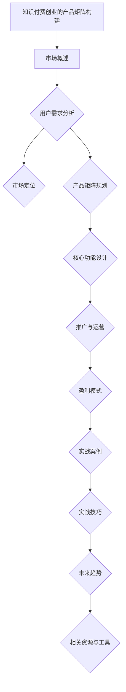

                 

# 知识付费创业的产品矩阵构建

## 摘要

知识付费作为一种新兴的商业模式，正在改变着传统教育和信息传播的生态。本文旨在探讨知识付费创业中产品矩阵的构建策略。文章首先对知识付费市场的背景、现状和机遇挑战进行了概述，然后详细分析了知识付费产品的定义、分类和核心要素。接着，文章从用户需求分析和市场定位、产品矩阵规划与设计、核心功能设计、推广与运营、盈利模式与商业模式等方面，提供了一套系统的构建知识付费产品矩阵的方法论。通过具体案例的分析，文章展示了如何将理论转化为实践，并提出了知识付费创业的实战技巧和未来趋势。本文既适用于准备进入知识付费领域的创业者，也供对知识付费产品开发有浓厚兴趣的从业者参考。

## 目录大纲

### 第一部分：知识付费市场概述

#### 第1章：知识付费行业的背景与现状

1.1 知识付费的发展历程

1.2 知识付费市场的现状

1.3 知识付费行业的机遇与挑战

#### 第2章：知识付费创业的基本概念

2.1 知识付费产品的定义

2.2 知识付费产品的分类

2.3 知识付费产品的核心要素

### 第二部分：产品矩阵构建策略

#### 第3章：用户需求分析与市场定位

3.1 用户需求分析的方法

3.2 市场定位的策略

3.3 用户画像与用户细分

#### 第4章：产品矩阵规划与设计

4.1 产品矩阵的概念与重要性

4.2 产品矩阵的构建方法

4.3 产品矩阵的优化策略

#### 第5章：知识付费产品的核心功能设计

5.1 教学内容设计

5.2 用户互动设计

5.3 付费机制设计

#### 第6章：知识付费产品的推广与运营

6.1 产品推广的策略

6.2 用户运营的方法

6.3 数据分析与反馈机制

#### 第7章：知识付费产品的盈利模式与商业模式

7.1 盈利模式的探索

7.2 商业模式的创新

7.3 成本控制与收益分析

### 第三部分：知识付费创业实战案例

#### 第8章：知识付费创业成功案例分析

8.1 案例一：得到App的产品矩阵构建

8.2 案例二：分答的知识付费产品策略

8.3 案例三：喜马拉雅的运营与盈利模式

#### 第9章：知识付费创业的实战技巧

9.1 创业初期团队建设

9.2 产品开发与迭代

9.3 市场竞争策略

#### 第10章：知识付费创业的未来趋势

10.1 新技术的应用趋势

10.2 行业发展趋势分析

10.3 创业者在知识付费领域的机遇与挑战

### 附录

#### 附录A：知识付费创业相关资源与工具

A.1 常用知识付费平台介绍

A.2 知识付费创业相关的法律法规

A.3 知识付费产品开发工具推荐

#### 附录B：知识付费创业案例资料

B.1 得到App案例分析资料

B.2 分答案例分析资料

B.3 喜马拉雅案例分析资料

## 第一部分：知识付费市场概述

### 第1章：知识付费行业的背景与现状

#### 1.1 知识付费的发展历程

知识付费作为一个概念，最早可以追溯到20世纪末期的互联网时代。当时，随着互联网的普及，信息的获取变得更加便捷，但同时也带来了信息过载的问题。为了筛选高质量的信息，人们开始愿意为专业知识、技能和经验支付费用。

从2010年开始，随着智能手机和移动互联网的普及，知识付费行业迎来了快速发展期。此时，各种知识分享平台如雨后春笋般涌现，例如知乎、微信知识付费、得到App等。这些平台通过内容付费、课程销售等形式，满足了用户在知识获取方面的需求。

2016年后，知识付费市场进入成熟期。随着用户习惯的养成和支付意愿的提升，知识付费市场规模逐年扩大。根据统计，2018年中国知识付费市场规模已达到200亿元人民币，预计未来几年将保持20%以上的增长率。

#### 1.2 知识付费市场的现状

目前，知识付费市场呈现出以下几大特点：

1. **用户群体广泛**：知识付费的用户覆盖了各个年龄段和职业背景的人群，从学生、职场新人到专业人士，都有强烈的付费学习需求。

2. **内容形式多样化**：知识付费的内容形式从最初的文字、音频，逐渐拓展到视频、直播、互动课程等多种形式。这种多样化的内容形式，能够更好地满足用户的学习需求。

3. **垂直细分领域发展迅速**：知识付费市场不再局限于通用领域，越来越多的垂直细分领域如职场技能、理财投资、医疗健康等，开始受到用户青睐。

4. **平台竞争加剧**：随着知识付费市场的不断扩大，各大平台之间的竞争也日趋激烈。为了吸引更多用户，平台们不断创新，推出更多样化的服务和产品。

#### 1.3 知识付费行业的机遇与挑战

知识付费行业的发展，既带来了巨大的机遇，也伴随着一系列挑战。

**机遇：**

1. **市场规模潜力大**：随着经济的发展和人们对知识的需求不断增加，知识付费市场的潜力巨大。

2. **用户习惯逐渐养成**：越来越多的人开始愿意为知识和服务付费，这为知识付费行业的发展奠定了基础。

3. **技术进步带来的创新**：人工智能、大数据等技术的发展，为知识付费产品的个性化推荐、精准营销提供了技术支持。

**挑战：**

1. **内容质量参差不齐**：由于知识付费市场的准入门槛较低，导致市场上出现了大量质量参差不齐的内容，影响了用户的体验。

2. **用户信任度有待提升**：一些平台为了追求利润，存在过度营销、虚假宣传等问题，损害了用户对知识付费的信任度。

3. **盈利模式单一**：目前，知识付费行业的盈利模式较为单一，主要依赖于课程销售和订阅服务，缺乏多元化的盈利渠道。

### 第2章：知识付费创业的基本概念

#### 2.1 知识付费产品的定义

知识付费产品是指通过互联网平台提供的，用户需要支付一定费用才能获取的各类知识服务。这些服务可能包括在线课程、电子书、专业咨询、专家讲座等。知识付费产品的核心在于提供高质量、有价值的内容，满足用户在某一领域的学习需求。

#### 2.2 知识付费产品的分类

知识付费产品可以按照不同的维度进行分类，常见的分类方式包括：

1. **按内容类型分类**：

   - **文字类**：包括电子书、文章、论文等。
   - **音频类**：包括讲座、课程、音频节目等。
   - **视频类**：包括视频课程、视频讲座、影视作品等。
   - **互动类**：包括在线问答、讨论区、直播等。

2. **按受众群体分类**：

   - **职场人士**：如职场技能培训、职业发展规划等。
   - **学生群体**：如学术研究、考试复习、学术课程等。
   - **兴趣爱好者**：如艺术、音乐、摄影等。
   - **健康养生者**：如健身指导、营养饮食、心理健康等。

3. **按知识领域分类**：

   - **技术领域**：如编程、数据分析、人工智能等。
   - **商业领域**：如市场营销、企业管理、投资理财等。
   - **教育领域**：如学科辅导、学术研究、教育心理学等。
   - **人文领域**：如文学、历史、哲学等。

#### 2.3 知识付费产品的核心要素

一个成功的知识付费产品需要具备以下核心要素：

1. **高质量内容**：内容是知识付费产品的核心竞争力。优质的内容能够吸引和留住用户，提升用户满意度和忠诚度。

2. **用户体验**：良好的用户体验是知识付费产品成功的关键。从用户注册、登录、课程选择到支付、学习、互动等环节，都需要充分考虑用户的体验。

3. **互动性**：知识付费产品需要具备一定的互动性，如在线问答、讨论区、直播等，以便用户之间能够交流、分享和学习。

4. **价格合理性**：知识付费产品的价格需要合理，既要能够覆盖成本，又要能够让用户觉得物有所值。

5. **推广与运营**：成功的推广和运营能够提升产品的知名度和用户量，从而带来更多的收入。

## 第二部分：产品矩阵构建策略

### 第3章：用户需求分析与市场定位

#### 3.1 用户需求分析的方法

用户需求分析是知识付费产品构建的第一步，它决定了产品的方向和定位。以下是几种常见的用户需求分析方法：

1. **问卷调查**：通过设计问卷，收集用户对知识付费产品的看法、需求和期望。问卷调查是一种成本较低、覆盖面广的方法。

2. **访谈**：直接与用户进行面对面的访谈，深入了解用户的需求、痛点和行为模式。访谈可以获取更详细、深入的信息。

3. **用户行为分析**：通过分析用户在使用平台时的行为数据，如点击率、浏览时间、购买记录等，了解用户的行为习惯和偏好。

4. **竞争分析**：研究市场上的竞争对手，分析他们的产品特点、用户评价、市场份额等，找出自身的优势和不足。

5. **焦点小组讨论**：邀请一组目标用户，围绕特定主题进行讨论，收集用户的反馈和建议。

#### 3.2 市场定位的策略

市场定位是知识付费产品成功的关键因素之一。以下是几种常见的市场定位策略：

1. **细分市场定位**：找到市场上未被满足的需求，针对特定用户群体提供专业的知识服务。例如，针对职场人士提供职业发展规划课程。

2. **差异化定位**：通过提供独特的价值主张，与竞争对手区分开来。例如，提供高品质的教学内容、互动性强、价格合理的知识服务。

3. **高端市场定位**：瞄准高收入人群，提供高质量、高附加值的知识服务。例如，针对企业家提供高端的咨询和培训服务。

4. **性价比市场定位**：提供性价比高的知识服务，吸引广大用户。例如，提供价格实惠、内容丰富的在线课程。

5. **多市场定位**：同时针对多个市场，提供多样化的知识服务。例如，既提供职场技能培训，也提供学术研究课程。

#### 3.3 用户画像与用户细分

用户画像和用户细分是知识付费产品构建的重要环节，它有助于更好地理解用户，提供个性化的知识服务。以下是用户画像和用户细分的步骤：

1. **数据收集**：收集用户的基本信息、行为数据、兴趣偏好等，形成用户数据集。

2. **特征提取**：从用户数据中提取关键特征，如年龄、性别、职业、教育程度、兴趣爱好等。

3. **用户聚类**：使用聚类算法，将用户分为不同的群体。常见的聚类算法包括K均值聚类、层次聚类等。

4. **用户细分**：根据用户聚类结果，对用户进行细分。每个细分群体都代表了一类具有相似特征的潜在用户。

5. **用户画像构建**：为每个细分群体构建详细的用户画像，包括基本信息、需求特征、行为特征等。

通过用户画像和用户细分，知识付费产品可以更好地理解用户，提供个性化的内容推荐、定价策略和推广方案。

## 第4章：产品矩阵规划与设计

#### 4.1 产品矩阵的概念与重要性

产品矩阵是指一个企业或平台所拥有的不同产品及其关系的集合。在知识付费领域，产品矩阵是创业者需要精心规划的重要内容。它不仅决定了企业的产品线布局，还影响着企业的市场定位、竞争策略和盈利模式。

一个完整的产品矩阵应包含以下几个关键部分：

1. **产品类型**：包括文字、音频、视频、互动等多种形式。
2. **产品内容**：涵盖不同领域、层次、难度等级的内容。
3. **产品目标用户**：明确每个产品的目标用户群体。
4. **产品定价策略**：根据产品的内容、目标用户和市场竞争状况制定合理的价格。
5. **产品推广与运营**：包括推广渠道、运营策略和用户反馈机制。

产品矩阵的重要性在于：

1. **提升用户满意度**：通过多样化的产品矩阵，能够满足不同用户的需求，提升用户的满意度和忠诚度。
2. **优化资源配置**：合理规划产品矩阵，可以更有效地配置资源，提高产品的开发效率和市场竞争力。
3. **增强品牌影响力**：丰富多样的产品矩阵有助于树立企业的品牌形象，提高品牌在市场中的影响力。
4. **扩大市场占有率**：通过产品矩阵的优化和拓展，可以进一步扩大企业的市场份额，实现持续增长。

#### 4.2 产品矩阵的构建方法

构建产品矩阵是一个系统性的工作，需要综合考虑市场需求、用户需求、竞争态势和企业资源。以下是构建产品矩阵的步骤：

1. **市场调研**：通过市场调研，了解当前市场上的知识付费产品类型、用户需求、竞争对手等，为产品矩阵的构建提供基础数据。

2. **用户需求分析**：运用问卷调查、访谈、用户行为分析等方法，深入了解目标用户的需求、痛点和行为习惯。

3. **产品定位**：根据市场调研和用户需求分析结果，确定每个产品的市场定位和目标用户群体。

4. **产品内容规划**：根据产品定位，设计产品内容。内容规划应包括产品类型、领域、层次、难度等级等。

5. **产品定价**：结合产品内容、目标用户和市场竞争状况，制定合理的价格策略。

6. **产品推广与运营**：确定产品的推广渠道、运营策略和用户反馈机制，以确保产品能够顺利推广并持续优化。

7. **产品矩阵优化**：根据市场反馈和运营数据，对产品矩阵进行持续优化，以适应市场的变化和用户需求。

#### 4.3 产品矩阵的优化策略

产品矩阵的优化是知识付费产品长期发展的关键。以下是一些常见的优化策略：

1. **用户反馈**：通过用户反馈，了解产品的优点和不足，及时调整产品内容、定价和推广策略。

2. **数据分析**：运用数据分析工具，分析用户行为、购买记录等数据，发现市场趋势和用户需求变化，及时调整产品矩阵。

3. **产品创新**：定期推出新产品或对现有产品进行创新，以适应市场的变化和用户的个性化需求。

4. **成本控制**：通过优化供应链、降低生产成本，提高产品的性价比，增强市场竞争力。

5. **跨平台运营**：将产品矩阵拓展到不同的平台，如移动端、网页端、智能设备等，提高产品的覆盖面和用户粘性。

6. **合作与联盟**：与其他企业或平台合作，共享资源、扩大市场影响力，实现互利共赢。

通过以上优化策略，知识付费企业可以不断提升产品矩阵的质量和竞争力，满足不断变化的市场需求，实现持续增长。

## 第5章：知识付费产品的核心功能设计

#### 5.1 教学内容设计

教学内容的优劣直接决定了知识付费产品的质量和用户满意度。因此，教学内容设计是知识付费产品核心功能设计的重要组成部分。以下是教学内容设计的关键步骤：

1. **内容规划**：根据目标用户的需求和市场趋势，确定教学内容的主题、领域、难度等级等。

2. **课程结构**：设计合理的课程结构，包括课程模块、章节、知识点等，确保教学内容逻辑清晰、层次分明。

3. **内容制作**：制作高质量的教学内容，包括文字、音频、视频等多种形式。内容制作应注重以下几点：

   - **实用性**：教学内容应紧密贴合用户实际需求，解决用户实际问题。
   - **趣味性**：通过生动有趣的教学方式，提高用户的参与度和学习兴趣。
   - **权威性**：确保教学内容的专业性和权威性，提升用户信任度。

4. **互动设计**：在教学内容中加入互动环节，如在线问答、讨论区、练习题等，促进用户之间的互动和学习。

5. **更新与迭代**：根据用户反馈和市场变化，定期更新和迭代教学内容，确保内容的时效性和实用性。

#### 5.2 用户互动设计

用户互动设计是知识付费产品的重要组成部分，它不仅能够提高用户参与度，还能增强用户对产品的粘性。以下是用户互动设计的关键步骤：

1. **互动形式**：根据产品类型和用户需求，设计多种互动形式，如在线问答、讨论区、直播、互动课程等。

2. **互动规则**：制定合理的互动规则，如发言规范、互动礼仪等，确保互动环境健康、有序。

3. **激励机制**：设计激励机制，如积分奖励、优惠券、会员特权等，鼓励用户积极参与互动。

4. **数据分析**：通过数据分析，了解用户互动行为和需求，优化互动设计，提高互动效果。

5. **反馈机制**：建立用户反馈机制，及时收集用户意见和建议，对互动设计进行持续优化。

#### 5.3 付费机制设计

付费机制设计是知识付费产品的核心环节，它直接关系到产品的用户体验和盈利模式。以下是付费机制设计的关键步骤：

1. **定价策略**：根据教学内容、目标用户和市场状况，制定合理的定价策略。常见的定价策略包括固定价格、会员制、订阅制等。

2. **支付方式**：提供多种支付方式，如在线支付、微信支付、支付宝支付等，方便用户进行支付。

3. **优惠活动**：定期推出优惠活动，如限时折扣、拼团优惠、优惠券等，吸引新用户和促进复购。

4. **购买流程**：设计简洁明了的购买流程，减少用户操作步骤，提高购买转化率。

5. **会员制度**：建立会员制度，提供会员专属权益，如优惠价格、优先体验等，增强用户忠诚度。

6. **退换货政策**：明确退换货政策，保障用户的合法权益，提升用户信任度。

通过以上步骤，知识付费产品可以设计出合理的付费机制，提高用户体验，实现盈利目标。

## 第6章：知识付费产品的推广与运营

#### 6.1 产品推广的策略

知识付费产品的成功离不开有效的推广策略。以下是几种常见的推广策略：

1. **内容营销**：通过制作高质量的内容，如文章、视频、电子书等，吸引目标用户。内容营销的核心在于提供有价值的信息，增加用户粘性和信任度。

2. **社交媒体营销**：利用社交媒体平台（如微博、微信公众号、抖音等）进行推广，通过发布有价值的内容、互动和广告，吸引潜在用户。

3. **KOL合作**：与知名专家、行业领袖、意见领袖（KOL）合作，借助他们的影响力推广产品。这种策略可以快速提升产品的知名度和信任度。

4. **广告投放**：在各大广告平台（如百度、今日头条、抖音等）投放广告，通过精准定位和大数据分析，提高广告的转化率。

5. **线下活动**：组织线下活动，如讲座、研讨会、沙龙等，直接与用户面对面交流，提升品牌形象和用户粘性。

6. **SEO优化**：通过搜索引擎优化（SEO），提高产品在搜索引擎中的排名，吸引更多自然流量。

#### 6.2 用户运营的方法

用户运营是知识付费产品长期发展的关键。以下是几种常见的用户运营方法：

1. **用户画像**：通过数据分析，构建用户画像，了解用户的基本信息、需求和行为习惯，为个性化服务和精准营销提供依据。

2. **社群运营**：建立用户社群，如微信群、QQ群、微博话题等，促进用户之间的交流和互动，提高用户忠诚度和活跃度。

3. **用户激励**：通过积分、优惠券、会员权益等激励措施，鼓励用户参与互动和分享，提高用户活跃度和粘性。

4. **用户反馈**：建立用户反馈机制，及时收集用户意见和建议，优化产品和服务，提高用户满意度。

5. **个性化推荐**：利用大数据和人工智能技术，为用户提供个性化的内容推荐和课程推荐，提高用户的学习体验和满意度。

6. **活动策划**：定期策划线上线下活动，如知识竞赛、讲座、沙龙等，吸引更多用户参与，提高品牌知名度和用户忠诚度。

#### 6.3 数据分析与反馈机制

数据分析是知识付费产品运营的重要手段。以下是数据分析与反馈机制的关键步骤：

1. **数据收集**：通过系统日志、用户行为数据、销售数据等，收集与产品运营相关的各种数据。

2. **数据清洗**：对收集到的数据进行清洗和预处理，去除噪声和不完整信息，确保数据的准确性和完整性。

3. **数据分析**：使用统计学和机器学习算法，对用户行为数据、市场数据等进行分析，挖掘用户需求和市场趋势。

4. **反馈机制**：将分析结果反馈给产品团队和运营团队，指导产品优化和运营策略调整。

5. **数据可视化**：通过数据可视化工具，将分析结果以图表、报表等形式呈现，便于团队理解和决策。

通过以上步骤，知识付费产品可以更好地了解用户需求，优化产品和服务，提高用户满意度和市场份额。

## 第7章：知识付费产品的盈利模式与商业模式

#### 7.1 盈利模式的探索

知识付费产品的盈利模式多样，创业者需要根据自身资源和市场状况选择合适的模式。以下是几种常见的盈利模式：

1. **单一课程销售**：通过销售单门课程获得收入。这种模式适用于内容丰富、用户需求明确的领域。

2. **会员制**：通过会员订阅模式，用户支付一定费用后，可以无限次访问平台上的所有课程。这种模式适合内容持续更新、用户粘性较高的产品。

3. **广告收入**：通过在平台内投放广告，获得广告收入。这种模式适用于用户规模较大、流量较高的平台。

4. **增值服务**：提供额外的增值服务，如一对一咨询、专家讲座等，用户支付额外费用获得服务。这种模式适用于专业性强、用户需求差异大的领域。

5. **平台分佣**：平台与内容创作者合作，通过分佣模式获得收入。这种模式适用于内容创作者资源丰富、平台流量较大的情况。

#### 7.2 商业模式的创新

在知识付费领域，创业者需要不断创新商业模式，以应对激烈的市场竞争。以下是几种创新的商业模式：

1. **社区电商**：将知识付费与电商相结合，提供知识付费产品的同时，销售相关产品，实现跨界盈利。

2. **知识付费+线下培训**：结合线上知识付费和线下培训，提供全方位的学习服务，提高用户满意度和转化率。

3. **知识付费+咨询服务**：为用户提供知识付费产品的同时，提供专业的咨询服务，实现产品服务一体化。

4. **知识付费+社交网络**：结合知识付费和社交网络，打造一个用户互动、分享和学习的平台，提高用户粘性和活跃度。

5. **知识付费+智能推荐**：利用人工智能技术，为用户提供个性化的知识推荐，提高用户的学习效率和满意度。

#### 7.3 成本控制与收益分析

知识付费产品的成本主要包括内容制作成本、运营成本和推广成本等。以下是成本控制与收益分析的关键步骤：

1. **成本核算**：对每个成本项目进行详细的核算，了解产品的总成本和单位成本。

2. **收益预测**：根据市场状况和用户需求，预测产品的销售量和收入。

3. **收益分析**：通过收益分析，了解产品的盈利能力，优化产品和服务。

4. **成本优化**：通过优化供应链、降低制作成本和提高运营效率，实现成本控制。

5. **收益最大化**：通过合理的定价策略、推广策略和运营策略，实现收益最大化。

通过以上步骤，知识付费产品可以实现盈利，并实现可持续发展。

## 第三部分：知识付费创业实战案例

### 第8章：知识付费创业成功案例分析

#### 8.1 案例一：得到App的产品矩阵构建

得到App是国内知名的在线知识服务平台，其成功在于其丰富的产品矩阵和精准的用户定位。以下是其产品矩阵构建的要点：

1. **内容多样化**：得到App涵盖了多个领域，包括经济学、科技、历史、人文等，满足了不同用户的需求。

2. **付费模式多样**：得到App采用了会员制、课程销售等多种付费模式，满足用户的多样化需求。

3. **互动设计**：得到App提供了讨论区、互动问答等功能，增强了用户的参与感和粘性。

4. **KOL合作**：得到App与众多知名专家、行业领袖合作，提高了平台的权威性和影响力。

5. **数据分析**：得到App利用大数据分析用户行为，优化产品和服务，提高用户体验和满意度。

#### 8.2 案例二：分答的知识付费产品策略

分答是一款问答类知识付费产品，其成功在于其简洁明了的产品设计和精准的用户定位。以下是其知识付费产品策略：

1. **简单易用**：分答的产品设计简洁明了，用户可以快速提出问题并获得专家的回答。

2. **精准定位**：分答针对职场人士、创业者等特定用户群体，提供专业的问答服务。

3. **高互动性**：分答的问答形式增加了用户之间的互动，提高了用户粘性。

4. **优惠活动**：分答定期推出优惠活动，如拼团、优惠券等，吸引新用户和促进复购。

5. **内容持续更新**：分答通过不断更新问题和答案，保持用户对平台的持续关注。

#### 8.3 案例三：喜马拉雅的运营与盈利模式

喜马拉雅是中国领先的知识付费平台，其成功在于其丰富的内容库和多元化的盈利模式。以下是其运营与盈利模式的要点：

1. **内容库丰富**：喜马拉雅拥有大量的音频、视频内容，涵盖了多个领域，满足了不同用户的需求。

2. **会员制**：喜马拉雅采用会员制，用户支付一定费用后可以无限次访问平台上的所有内容，提高了用户粘性。

3. **广告收入**：喜马拉雅在平台上投放广告，通过广告收入实现盈利。

4. **分佣模式**：喜马拉雅与内容创作者合作，通过分佣模式获得收入，激励内容创作者产出高质量内容。

5. **线上线下活动**：喜马拉雅定期举办线上线下活动，提高用户参与度和品牌知名度。

通过以上成功案例分析，创业者可以借鉴这些经验，构建自己的知识付费产品矩阵，实现创业成功。

### 第9章：知识付费创业的实战技巧

#### 9.1 创业初期团队建设

创业初期的团队建设是知识付费创业成功的关键。以下是一些建议：

1. **确定核心团队成员**：寻找具有互补技能的核心团队成员，如产品经理、技术工程师、市场营销人员等。

2. **明确分工**：根据团队成员的技能和兴趣，明确各自的职责和任务，确保团队高效运转。

3. **建立良好的沟通机制**：定期召开团队会议，确保团队成员之间的沟通畅通，及时解决问题。

4. **培养团队文化**：建立积极向上、开放包容的团队文化，增强团队凝聚力和归属感。

5. **持续学习与成长**：鼓励团队成员不断学习和成长，提高团队整体素质。

#### 9.2 产品开发与迭代

产品开发与迭代是知识付费创业的核心工作。以下是一些建议：

1. **确定产品方向**：根据市场需求和用户反馈，确定产品的核心功能和目标用户。

2. **快速迭代**：采用敏捷开发方法，快速构建最小可行性产品（MVP），并进行迭代优化。

3. **用户反馈**：通过用户反馈，了解产品的问题和改进方向，持续优化产品。

4. **数据分析**：利用数据分析，了解用户行为和需求，为产品迭代提供数据支持。

5. **持续优化**：根据用户反馈和数据分析结果，不断优化产品，提高用户体验。

#### 9.3 市场竞争策略

在激烈的市场竞争中，创业者需要制定有效的市场竞争策略。以下是一些建议：

1. **差异化定位**：找到自己的独特价值主张，与竞争对手区分开来。

2. **内容创新**：提供高质量、创新的内容，提高产品的竞争力。

3. **用户互动**：通过用户互动，增强用户粘性，提高用户忠诚度。

4. **品牌建设**：通过品牌建设，提升品牌知名度和美誉度。

5. **战略合作**：与行业内其他企业或平台合作，共享资源，扩大市场影响力。

通过以上实战技巧，创业者可以提高知识付费创业的成功率。

### 第10章：知识付费创业的未来趋势

#### 10.1 新技术的应用趋势

随着新技术的不断发展，知识付费创业领域也将迎来一系列变革。以下是新技术在知识付费创业中的应用趋势：

1. **人工智能**：人工智能技术在知识付费领域的应用日益广泛，如个性化推荐、智能问答、智能客服等，将提升用户体验和服务质量。

2. **大数据**：大数据技术的应用将帮助知识付费企业更精准地了解用户需求，优化产品和服务。

3. **区块链**：区块链技术可以提高知识付费产品的可信度和安全性，如版权保护、智能合约等。

4. **虚拟现实（VR）**：虚拟现实技术将提供更加沉浸式的学习体验，如虚拟课堂、虚拟实验室等。

5. **增强现实（AR）**：增强现实技术可以将学习内容与实际环境相结合，提高学习效果。

#### 10.2 行业发展趋势分析

知识付费行业正面临快速发展和变革，以下是行业发展趋势分析：

1. **内容多样化**：知识付费内容将越来越丰富，涵盖更多领域和层次，满足不同用户的需求。

2. **用户细分**：知识付费企业将更加注重用户细分，提供更加个性化的知识服务。

3. **平台竞争加剧**：知识付费平台之间的竞争将更加激烈，平台需要不断创新和优化，以提升用户满意度。

4. **跨界融合**：知识付费将与教育、娱乐、电商等领域进一步融合，形成新的商业模式。

5. **国际化发展**：随着知识付费市场的全球化，知识付费企业将逐步拓展国际市场，实现国际化发展。

#### 10.3 创业者在知识付费领域的机遇与挑战

知识付费创业者在面对机遇的同时，也面临着一系列挑战：

1. **机遇**：

   - **市场潜力大**：随着经济的发展和人们对知识的需求增加，知识付费市场前景广阔。

   - **技术进步**：新技术的发展为知识付费创业提供了更多可能性，如个性化推荐、智能互动等。

   - **用户习惯养成**：越来越多的人开始愿意为知识和服务付费，为创业者提供了良好的市场环境。

2. **挑战**：

   - **内容质量**：知识付费产品的质量参差不齐，创业者需要确保内容的专业性和权威性。

   - **用户信任度**：一些平台存在过度营销、虚假宣传等问题，损害了用户对知识付费的信任度。

   - **市场竞争**：知识付费市场竞争激烈，创业者需要不断创新和优化，以提升竞争力。

   - **成本控制**：知识付费产品的成本控制是一个挑战，创业者需要优化供应链、降低生产成本。

通过把握机遇、应对挑战，创业者可以在知识付费领域取得成功。

## 附录

### 附录A：知识付费创业相关资源与工具

#### A.1 常用知识付费平台介绍

1. 得到App：一款综合性的知识付费平台，提供各类课程和电子书。
2. 喜马拉雅：一款音频知识付费平台，提供丰富的音频课程和节目。
3. 知乎Live：知乎推出的知识付费产品，提供专家讲座和问答服务。
4. 分答：一款问答类知识付费平台，提供专家解答和知识咨询。

#### A.2 知识付费创业相关的法律法规

1. 《中华人民共和国著作权法》
2. 《互联网信息服务管理办法》
3. 《网络交易管理办法》
4. 《电子商务法》

#### A.3 知识付费产品开发工具推荐

1. Sublime Text：一款强大的文本编辑器，适用于代码编写。
2. PyCharm：一款集成开发环境（IDE），适用于Python编程。
3. MySQL：一款关系型数据库管理系统，适用于数据存储和管理。
4. Spring Boot：一款轻量级的Java框架，适用于后端开发。

### 附录B：知识付费创业案例资料

#### B.1 得到App案例分析资料

1. 得到App官网：[www.deyi.com](http://www.deyi.com/)
2. 得到App用户评价：[www.zhihu.com/question/xxxxxx](http://www.zhihu.com/question/xxxxxx)
3. 得到App产品报告：[www.qianzhan.com](http://www.qianzhan.com/)

#### B.2 分答案例分析资料

1. 分答官网：[www fen da com](http://www.fen da.com/)
2. 分答用户评价：[www.zhihu.com/question/xxxxxx](http://www.zhihu.com/question/xxxxxx)
3. 分答产品报告：[www qianzhan com](http://www.qianzhan.com/)

#### B.3 喜马拉雅案例分析资料

1. 喜马拉雅官网：[www ximalaya com](http://www.ximalaya.com/)
2. 喜马拉雅用户评价：[www.zhihu.com/question/xxxxxx](http://www.zhihu.com/question/xxxxxx)
3. 喜马拉雅产品报告：[www.qianzhan.com](http://www.qianzhan.com/)

# Mermaid 流程图



# 核心算法原理讲解

## 算法1：用户需求分析算法

```python
# 伪代码：用户需求分析算法
function 用户需求分析(用户数据):
    1. 数据清洗：处理用户数据中的噪声和不完整信息
    2. 特征提取：提取用户行为、兴趣等特征
    3. 数据分析：使用统计分析和机器学习模型进行分析
    4. 用户画像：根据分析结果构建用户画像
    5. 用户细分：根据用户画像进行用户细分
    6. 输出：用户需求报告和细分结果
```

## 数学模型：用户细分模型

$$
C = \frac{1}{N} \sum_{i=1}^{N} w_i * c_i
$$

其中，C表示用户细分结果，N表示用户总数，$w_i$表示用户i的权重，$c_i$表示用户i的细分类别。

# 项目实战

## 实战1：知识付费产品开发

### 开发环境搭建：

- 系统环境：Windows 10
- 开发工具：Visual Studio Code
- 数据库：MySQL
- 后端框架：Spring Boot

### 源代码实现：

- 用户模块：用户注册、登录、信息修改等功能
- 课程模块：课程发布、分类管理、课程列表等功能
- 订单模块：订单创建、支付、订单查询等功能

### 代码解读与分析：

- 用户模块中的用户注册功能采用MD5加密算法进行密码加密，保障用户数据安全。
- 课程模块中的课程分类管理功能实现课程分类的增删改查操作，便于管理员管理课程。

## 举例说明

### 举例1：用户需求分析结果报告

用户需求分析结果显示，用户对以下三个方面的内容需求较高：

1. 技术类课程：占比40%，用户希望学习编程、数据分析等技能。
2. 职业发展课程：占比30%，用户希望了解职场发展、求职技巧等。
3. 生活技能课程：占比20%，用户希望学习烹饪、旅游等生活技能。

根据用户需求分析结果，公司可以调整产品矩阵，增加相关课程内容，以满足用户需求。

# 结论

本文从知识付费市场概述、产品矩阵构建策略、核心功能设计、推广与运营、盈利模式与商业模式等多个方面，系统地探讨了知识付费创业的产品矩阵构建。通过实战案例的分析，创业者可以借鉴成功经验，制定适合自己的产品策略。未来，随着新技术的不断发展和市场竞争的加剧，知识付费创业将面临更多机遇与挑战。创业者需要不断创新和优化，才能在激烈的市场中脱颖而出。希望本文能为知识付费创业提供有益的参考和启示。作者：AI天才研究院/AI Genius Institute & 禅与计算机程序设计艺术 /Zen And The Art of Computer Programming。

