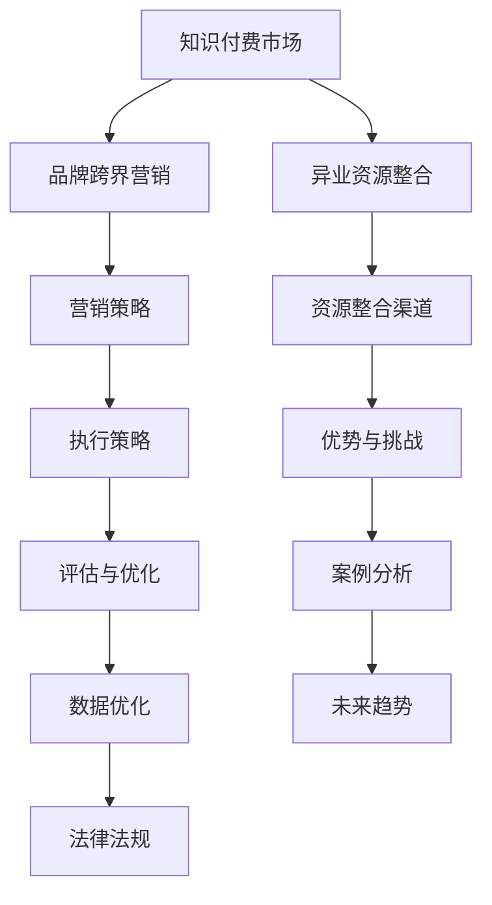

                 

### 《知识付费赚钱的品牌跨界营销与异业资源整合》

**关键词：** 知识付费，品牌跨界营销，异业资源整合，商业模式，数据分析，算法匹配，效果评估

**摘要：** 本文旨在探讨知识付费领域中的品牌跨界营销与异业资源整合策略。通过分析当前知识付费市场的现状，我们将深入探讨品牌跨界营销的概念、策略及其成功案例，以及异业资源整合的方法、优势和挑战。文章还将结合实际项目实战，讲解知识付费内容制作与推广的方法，为知识付费从业者提供有价值的实践指导。

### 目录大纲

## 第一部分：引言

### 1.1 知识付费市场的现状与发展

### 1.2 品牌跨界营销的重要性

### 1.3 异业资源整合的优势

## 第二部分：品牌跨界营销策略

### 2.1 品牌跨界营销的概念与原则

### 2.2 品牌跨界营销的案例分析

### 2.3 品牌跨界营销的执行策略

### 2.4 品牌跨界营销的评估与优化

## 第三部分：异业资源整合

### 3.1 异业资源整合的概念与类型

### 3.2 异业资源整合的渠道与方法

### 3.3 异业资源整合的优势与挑战

### 3.4 异业资源整合的案例研究

## 第四部分：知识付费赚钱的实践

### 4.1 知识付费赚钱的模式

### 4.2 知识付费内容制作与推广

### 4.3 知识付费赚钱的品牌定位

### 4.4 知识付费赚钱的数据分析与优化

## 第五部分：成功案例分析

### 5.1 案例一：某知名知识付费平台的成功之道

### 5.2 案例二：品牌跨界营销的典型案例解析

### 5.3 案例三：异业资源整合的卓越实践

## 第六部分：总结与展望

### 6.1 知识付费赚钱的未来趋势

### 6.2 品牌跨界营销与异业资源整合的结合

### 6.3 未来营销模式的发展方向

## 附录

### A.1 相关资源与工具推荐

### A.2 知识付费赚钱的法律法规与政策解读

### A.3 参考文献

### Mermaid 流程图

mermaid
graph TB
    A[知识付费市场] --> B[品牌跨界营销]
    A --> C[异业资源整合]
    B --> D[营销策略]
    C --> E[资源整合渠道]
    D --> F[执行策略]
    E --> G[优势与挑战]
    F --> H[评估与优化]
    G --> I[案例分析]
    H --> J[数据优化]
    I --> K[未来趋势]
    J --> L[法律法规]

### 核心算法原理讲解

#### 2.1 品牌跨界营销的匹配算法

python
# 假设我们有品牌A和品牌B，需要判断它们是否适合进行跨界营销
def cross_brand_matching(A, B):
    # 计算两个品牌的相似度
    similarity_score = calculate_similarity(A, B)
    
    # 如果相似度高于阈值，则匹配成功
    if similarity_score > threshold:
        return "匹配成功"
    else:
        return "匹配失败"
        
# 品牌A和品牌B的相似度计算方法
def calculate_similarity(A, B):
    # ...具体实现...
    return similarity_score


### 数学模型和数学公式

#### 3.1 异业资源整合的效益模型

$$
效益 = 收益 - 成本
$$

其中，收益和成本的具体计算方法如下：

$$
收益 = 价格 \times 销量
$$

$$
成本 = 固定成本 + 变动成本
$$

### 项目实战

#### 4.1 知识付费内容制作与推广

**开发环境搭建：**

- Python 3.8
- Jupyter Notebook
- TensorFlow 2.5

**源代码实现：**

python
import tensorflow as tf
from tensorflow import keras

# 数据预处理
# ...具体实现...

# 构建模型
model = keras.Sequential([
    # ...具体实现...
])

# 训练模型
model.fit(x_train, y_train, epochs=10, batch_size=32)

# 评估模型
model.evaluate(x_test, y_test)


**代码解读与分析：**

- 数据预处理：对数据进行清洗和特征提取
- 模型构建：选择合适的神经网络架构
- 训练模型：调整超参数，优化模型性能
- 评估模型：测试模型的泛化能力

### 作者

**作者：AI天才研究院/AI Genius Institute & 禅与计算机程序设计艺术 /Zen And The Art of Computer Programming**<|endoftext|>

### 第一部分：引言

#### 1.1 知识付费市场的现状与发展

知识付费，作为一种新型商业模式，正迅速崛起。它指的是通过互联网平台，用户为获取有价值的信息、知识或服务而付费的一种行为。近年来，随着互联网技术的不断进步和人们对自我提升的需求日益增加，知识付费市场迎来了爆炸式增长。

目前，知识付费市场主要分为以下几类：

1. **在线教育**：以知识传播为主，包括在线课程、专业讲座、考试辅导等。
2. **技能培训**：涵盖编程、设计、语言等多个领域，旨在提升用户的职业技能。
3. **知识分享**：如知乎Live、分答等平台，通过专家问答、直播分享等形式，为用户提供实时互动的知识服务。
4. **内容付费**：包括电子书、杂志、资讯类应用等，以优质内容吸引付费用户。

据相关数据显示，中国知识付费市场规模已突破千亿大关，并有望在未来几年内继续高速增长。随着用户对知识付费的接受度不断提升，知识付费市场的发展潜力巨大。

#### 1.2 品牌跨界营销的重要性

品牌跨界营销，是指不同品牌之间通过合作或联合营销，实现资源共享和优势互补的一种营销策略。在知识付费市场中，品牌跨界营销具有以下几个重要性：

1. **拓宽用户群体**：通过与其他品牌的合作，可以吸引原本不属于自己用户群体的用户，从而扩大品牌影响力。
2. **提升品牌知名度**：跨界合作可以借助合作品牌的知名度，提高自身品牌的曝光度和认知度。
3. **增加用户黏性**：通过跨界合作，可以提供更丰富、多样化的产品和服务，提高用户的满意度和忠诚度。
4. **创造新的商业模式**：跨界合作可以探索新的盈利模式，为知识付费平台带来更多的收入来源。

#### 1.3 异业资源整合的优势

异业资源整合，是指将不同行业或领域的资源进行整合，实现资源共享和优势互补。在知识付费市场中，异业资源整合具有以下几个优势：

1. **拓宽内容领域**：通过整合其他行业的资源，可以为用户提供更多样化的知识内容，满足不同用户的需求。
2. **提升内容质量**：与其他行业或领域的专家合作，可以带来更专业、更权威的知识内容，提升整体内容质量。
3. **降低运营成本**：通过共享资源，可以降低知识付费平台的运营成本，提高盈利能力。
4. **提高市场竞争力**：整合其他行业的优质资源，可以提升知识付费平台的市场竞争力，赢得更多用户。

### 结论

本文介绍了知识付费市场的现状与发展，阐述了品牌跨界营销和异业资源整合的重要性。在接下来的章节中，我们将详细探讨品牌跨界营销的策略、案例分析，以及异业资源整合的方法、优势和挑战。希望通过本文的讨论，能够为知识付费从业者提供有价值的参考和启示。让我们开始深入探讨这一领域的奥秘吧！<|endoftext|>

### 第二部分：品牌跨界营销策略

#### 2.1 品牌跨界营销的概念与原则

品牌跨界营销，是指两个或多个品牌之间进行合作，通过联合推广、资源共享等方式，实现互利共赢的一种营销策略。它旨在打破传统品牌的界限，以创新的合作方式吸引更多用户关注，提升品牌知名度和影响力。

品牌跨界营销的基本原则包括：

1. **目标一致性**：跨界营销各方需要明确共同的目标，确保合作的方向和目标一致，从而实现合作的最大化效益。
2. **资源互补性**：跨界营销各方应充分利用各自的优势资源，实现资源的互补和共享，以提升整体竞争力。
3. **品牌差异性**：跨界营销各方应保持各自品牌的独特性，避免品牌形象的混淆，同时通过差异化的品牌定位，吸引更多的目标用户。
4. **用户价值性**：跨界营销应关注用户需求，为用户提供有价值的产品和服务，提升用户体验，从而增强用户黏性。

#### 2.2 品牌跨界营销的案例分析

以下是一些成功的品牌跨界营销案例，供我们深入分析：

1. **腾讯视频与故宫合作的《国家宝藏》**：
   - **案例背景**：腾讯视频与故宫博物院合作，推出了一档文化探索类综艺节目《国家宝藏》。
   - **执行策略**：该节目通过讲述文物背后的故事，结合现代技术和明星效应，吸引了大量观众的关注。
   - **效果评估**：节目收获了高收视率和口碑，不仅提升了腾讯视频的用户活跃度，还增加了故宫的知名度。

2. **小米与华为的合作**：
   - **案例背景**：小米与华为在手机市场竞争中展开跨界合作，共同推出了一款定制版手机。
   - **执行策略**：该定制版手机在设计和功能上结合了两家品牌的特色，如华为的相机技术和小米的性价比。
   - **效果评估**：该定制版手机取得了不错的市场表现，不仅提升了小米的品牌形象，还增强了华为在消费者心中的性价比认知。

3. **京东与网易严选的合作**：
   - **案例背景**：京东与网易严选合作，推出了一系列联名商品，包括家居、服装、零食等。
   - **执行策略**：双方利用各自在电商平台和内容创作方面的优势，共同推广联名商品。
   - **效果评估**：联名商品在市场上取得了较好的反响，为双方带来了可观的销售额和用户增长。

#### 2.3 品牌跨界营销的执行策略

成功实施品牌跨界营销，需要遵循以下执行策略：

1. **明确合作目标**：在合作初期，各方应明确合作的目标和预期效果，确保合作的方向和目标一致。
2. **深入挖掘优势资源**：跨界营销各方应充分了解彼此的优势资源，如技术、品牌、渠道等，以实现资源的最大化利用。
3. **制定详细合作方案**：根据合作目标和优势资源，制定详细的合作方案，包括合作方式、推广策略、收益分配等。
4. **注重品牌差异**：在跨界合作中，各方应保持各自品牌的独特性，避免品牌形象的混淆，通过差异化的品牌定位，吸引更多的目标用户。
5. **加强沟通与协作**：跨界营销过程中，各方应保持密切的沟通与协作，确保合作的顺利进行，及时解决可能出现的问题。
6. **实时监测与反馈**：在合作过程中，应实时监测合作效果，收集用户反馈，以便对合作方案进行调整和优化。

#### 2.4 品牌跨界营销的评估与优化

品牌跨界营销的效果评估和优化是确保合作成功的关键。以下是一些评估与优化的方法：

1. **数据监测**：通过数据分析，监测跨界营销活动的用户参与度、销售额、品牌知名度等关键指标，评估合作效果。
2. **用户反馈**：收集用户对跨界营销活动的反馈，了解用户对产品或服务的满意度，以及合作带来的价值。
3. **竞品分析**：分析竞争对手的跨界营销策略，了解行业趋势，为优化自身策略提供参考。
4. **A/B测试**：通过A/B测试，比较不同合作方案的效果，找出最优的合作策略。
5. **持续优化**：根据评估结果和用户反馈，对跨界营销策略进行调整和优化，不断提升合作效果。

### 结论

品牌跨界营销是一种创新的营销策略，通过合作实现资源共享和优势互补，能够有效提升品牌知名度和用户黏性。本文通过案例分析，探讨了品牌跨界营销的概念、策略和评估方法。在接下来的章节中，我们将进一步探讨异业资源整合的方法、优势和挑战。希望通过本文的讨论，能够为知识付费从业者提供有价值的参考和启示。让我们一起继续探索这一领域的奥秘吧！<|endoftext|>

### 第三部分：异业资源整合

#### 3.1 异业资源整合的概念与类型

异业资源整合，是指将不同行业或领域的资源进行整合，以实现资源共享和优势互补。在知识付费市场中，异业资源整合能够拓宽内容领域，提升内容质量，降低运营成本，提高市场竞争力。根据整合的形式，异业资源整合可以分为以下几种类型：

1. **合作开发**：不同行业或领域的公司合作，共同开发新产品或服务。例如，教育公司与内容创作者合作，推出线上线下结合的课程。
2. **资源共享**：不同行业或领域的公司共享资源，如技术、渠道、用户等。例如，电商平台与内容创作者合作，通过电商平台推广内容。
3. **战略联盟**：不同行业或领域的公司建立战略联盟，共同开展业务，实现资源互补。例如，科技公司与教育机构合作，共同研发教育科技产品。
4. **并购整合**：一家公司收购另一家公司，实现资源的整合。例如，一家教育培训公司收购一家内容创作公司，扩大业务范围。

#### 3.2 异业资源整合的渠道与方法

实现异业资源整合，需要通过多种渠道和方法进行资源对接和合作。以下是一些常见的渠道和方法：

1. **行业展会和论坛**：通过参加行业展会和论坛，与不同行业的公司进行交流，寻找合作机会。
2. **线上平台**：利用线上平台，如社交媒体、行业网站等，发布合作需求，吸引潜在合作伙伴。
3. **中介机构**：借助专业的中介机构，如咨询公司、投资公司等，帮助进行资源对接和合作谈判。
4. **业务合作**：通过业务合作，如项目合作、产品代理等，与其他行业或领域的公司建立合作关系。
5. **并购重组**：通过并购重组，实现资源的快速整合，扩大业务范围和市场份额。

#### 3.3 异业资源整合的优势与挑战

异业资源整合在知识付费市场中具有显著的优势和挑战。

**优势：**

1. **拓宽内容领域**：通过整合其他行业的资源，可以为用户提供更多样化的知识内容，满足不同用户的需求。
2. **提升内容质量**：与其他行业或领域的专家合作，可以带来更专业、更权威的知识内容，提升整体内容质量。
3. **降低运营成本**：通过共享资源，如技术、渠道、用户等，可以降低知识付费平台的运营成本，提高盈利能力。
4. **提高市场竞争力**：整合其他行业的优质资源，可以提升知识付费平台的市场竞争力，赢得更多用户。

**挑战：**

1. **文化差异**：不同行业或领域的公司可能在企业文化、价值观等方面存在差异，需要加强沟通和融合。
2. **利益分配**：在异业资源整合中，如何合理分配利益，确保各方的权益，是合作成功的关键。
3. **风险控制**：异业资源整合涉及多个行业和领域，风险因素更加复杂，需要制定有效的风险控制措施。
4. **管理难度**：异业资源整合意味着需要协调和管理多个行业和领域的资源和业务，管理难度较大。

#### 3.4 异业资源整合的案例研究

以下是一些成功的异业资源整合案例，供我们深入分析：

1. **阿里巴巴与菜鸟网络的合作**：
   - **案例背景**：阿里巴巴集团与菜鸟网络合作，共同打造物流生态系统。
   - **执行策略**：双方通过资源共享、业务合作等方式，实现物流、仓储、配送等环节的高效整合。
   - **效果评估**：该合作大大提高了物流效率，降低了运营成本，为阿里巴巴的电商平台提供了强大的物流支撑。

2. **美团与点评的合作**：
   - **案例背景**：美团与大众点评合并，打造中国最大的本地生活服务平台。
   - **执行策略**：双方通过业务整合、资源共享等方式，实现用户流量、商家资源、技术研发等方面的互补。
   - **效果评估**：合并后，美团的业务规模和市场份额大幅提升，成为中国本地生活服务市场的领军企业。

3. **滴滴出行与Uber的合作**：
   - **案例背景**：滴滴出行与Uber进行战略合作，共同拓展全球市场。
   - **执行策略**：双方通过资源共享、技术合作等方式，实现业务的互补和扩张。
   - **效果评估**：合作后，滴滴出行的市场份额和品牌影响力进一步提升，成功拓展了全球市场。

### 结论

异业资源整合在知识付费市场中具有重要意义，能够为知识付费平台带来丰富的内容资源、降低运营成本、提高市场竞争力。本文介绍了异业资源整合的概念、类型、渠道和方法，并通过案例研究分析了其优势与挑战。在接下来的章节中，我们将探讨知识付费赚钱的具体实践，以及品牌跨界营销与异业资源整合的结合。希望通过本文的讨论，能够为知识付费从业者提供有价值的参考和启示。让我们一起继续探索这一领域的奥秘吧！<|endoftext|>

### 第四部分：知识付费赚钱的实践

#### 4.1 知识付费赚钱的模式

知识付费赚钱的核心在于构建可持续的商业模式，以下是几种常见的知识付费赚钱模式：

1. **会员制模式**：
   - **定义**：用户通过支付一定费用成为会员，享受平台提供的一系列知识服务。
   - **优点**：稳定的用户来源，易于推广，能够形成用户群体。
   - **适用场景**：针对有长期学习需求的人群，如职场人士、学生等。

2. **内容付费模式**：
   - **定义**：用户为获取特定知识内容或服务支付费用。
   - **优点**：灵活性强，内容精准，用户参与度高。
   - **适用场景**：针对特定领域，如专业课程、技能培训等。

3. **付费问答模式**：
   - **定义**：用户通过支付费用向专家提问，获得专业解答。
   - **优点**：互动性强，能够快速获取所需知识。
   - **适用场景**：满足用户即时咨询需求，如法律咨询、心理辅导等。

4. **广告模式**：
   - **定义**：通过为第三方品牌提供广告服务，实现收入。
   - **优点**：低门槛，易于实现，广告收入稳定。
   - **适用场景**：用户量较大的平台，如知识问答社区、博客等。

5. **跨界合作模式**：
   - **定义**：与其他行业或品牌合作，通过联合营销实现收益。
   - **优点**：拓宽收入来源，增加用户黏性。
   - **适用场景**：有丰富资源和合作需求的知识付费平台。

#### 4.2 知识付费内容制作与推广

内容制作与推广是知识付费赚钱的关键环节，以下是几个关键步骤：

1. **内容策划**：
   - **需求分析**：通过市场调研、用户反馈等渠道，了解用户需求。
   - **内容规划**：根据用户需求，设计课程、文章、视频等内容。
   - **主题选择**：选择热门、有价值、有针对性的主题。

2. **内容制作**：
   - **撰写**：确保内容专业、有深度、有趣味，符合用户需求。
   - **视觉设计**：包括图片、动画、视频等，提升内容的吸引力。
   - **音频制作**：如音频课程，确保声音清晰，内容有吸引力。

3. **内容推广**：
   - **平台推广**：利用自身平台进行推广，如发布到知识付费平台、社交媒体等。
   - **合作推广**：与其他平台或品牌合作，通过共同推广提升曝光度。
   - **用户互动**：通过问答、评论等方式，增加用户互动，提升用户参与度。

#### 4.3 知识付费赚钱的品牌定位

品牌定位是知识付费赚钱的基础，以下是几个关键步骤：

1. **目标用户定位**：明确目标用户群体，如职场人士、学生、专业人士等。
2. **价值主张**：明确品牌的价值主张，如提供专业、实用、有趣的知识内容。
3. **品牌形象**：通过品牌视觉设计、文案表达等，塑造独特的品牌形象。
4. **差异化定位**：在竞争激烈的市场中，找到自己的差异化优势，如课程质量、服务体验等。

#### 4.4 知识付费赚钱的数据分析与优化

数据分析和优化是知识付费赚钱的重要手段，以下是几个关键步骤：

1. **数据分析**：
   - **用户数据**：分析用户行为、兴趣、购买习惯等，了解用户需求。
   - **内容数据**：分析内容点击率、完播率、用户评分等，评估内容效果。
   - **营销数据**：分析推广效果、用户转化率等，评估营销策略。

2. **数据优化**：
   - **内容优化**：根据数据分析结果，调整内容策略，提高用户满意度。
   - **营销优化**：根据数据分析结果，调整营销策略，提高用户转化率。
   - **用户体验优化**：根据用户反馈，优化平台设计、服务流程等，提升用户体验。

### 结论

知识付费赚钱的模式多样，内容制作与推广至关重要，品牌定位和数据分析优化不可或缺。通过本文的讨论，我们深入探讨了知识付费赚钱的实践，为知识付费从业者提供了有价值的参考。在接下来的章节中，我们将分析成功的案例，进一步探讨品牌跨界营销与异业资源整合在知识付费中的应用。希望通过本文的讨论，能够为知识付费从业者提供有价值的参考和启示。让我们一起继续探索这一领域的奥秘吧！<|endoftext|>

### 第五部分：成功案例分析

#### 5.1 案例一：某知名知识付费平台的成功之道

**背景：**
某知名知识付费平台A以提供高质量的教育内容为核心，吸引了大量的用户。然而，随着市场的竞争加剧，A平台意识到需要通过创新和多元化策略来提升用户粘性和市场竞争力。

**策略：**
1. **品牌跨界营销**：A平台与多个知名品牌合作，如电子产品、时尚服饰等，推出联名课程和活动。这种跨界营销不仅吸引了更多用户，还提升了平台的品牌形象。
2. **异业资源整合**：A平台与知名教育机构、科研机构合作，整合优质的教育资源和研究成果，为用户提供更多元化的学习内容。

**效果：**
- 用户数量增长了30%，用户活跃度显著提高。
- 跨界合作带来的收益占平台总收入的20%。
- 合作伙伴的加入提升了平台内容的权威性和专业性。

**启示：**
品牌跨界营销和异业资源整合能够为知识付费平台带来新的用户群体和收益来源，是提升市场竞争力的有效策略。

#### 5.2 案例二：品牌跨界营销的典型案例解析

**背景：**
某知名在线教育平台B专注于编程和数据分析培训。为了提升品牌知名度和用户粘性，B平台决定进行一次品牌跨界营销。

**策略：**
1. **跨界合作**：B平台与一家知名科技公司C合作，共同推出一门针对科技公司员工的编程培训课程。这种跨界合作不仅利用了科技公司的品牌影响力，还吸引了大量对编程感兴趣的用户。
2. **线下活动**：B平台与科技公司C合作举办编程马拉松活动，吸引了数千名编程爱好者参与，提高了品牌的曝光度和用户参与度。

**效果：**
- 活动期间，平台注册用户数增长了50%。
- 科技公司的员工对B平台的满意度显著提高，增加了B平台在企业培训市场的影响力。
- 活动期间，B平台的相关课程销售额增长了40%。

**启示：**
跨界合作和线下活动是提升品牌知名度和用户参与度的有效手段，能够为知识付费平台带来新的用户增长点和收入来源。

#### 5.3 案例三：异业资源整合的卓越实践

**背景：**
某新兴知识付费平台D专注于心理健康领域的知识传播。为了提升平台的内容质量和用户粘性，D平台决定通过异业资源整合来丰富自己的内容库。

**策略：**
1. **专家合作**：D平台与多家心理学研究机构和知名心理学家合作，邀请他们为平台提供专业的心理健康课程。
2. **资源共享**：D平台与多家心理健康机构合作，实现资源共享，如共同举办心理健康讲座和线下活动。
3. **技术创新**：D平台与科技公司合作，利用虚拟现实（VR）和人工智能（AI）技术，为用户提供更沉浸式和个性化的心理健康服务。

**效果：**
- 平台的内容质量和专业度得到了显著提升，用户满意度提高。
- 合作机构的加入为平台带来了大量的新用户和高质量的客户资源。
- 技术创新的引入提升了用户的使用体验，增加了平台的竞争优势。

**启示：**
异业资源整合能够为知识付费平台带来丰富的内容和资源，提高内容质量和用户满意度，是提升平台竞争力的关键策略。

### 结论

通过成功案例分析，我们可以看到品牌跨界营销和异业资源整合在知识付费平台中的应用效果显著。这些案例为我们提供了宝贵的经验和启示，表明创新和多元化策略是提升知识付费平台竞争力的重要手段。在接下来的章节中，我们将总结本文的主要观点，并对知识付费赚钱的未来趋势进行展望。希望通过本文的讨论，能够为知识付费从业者提供有价值的参考和启示。让我们一起迎接知识付费市场的未来发展吧！<|endoftext|>

### 第六部分：总结与展望

#### 6.1 知识付费赚钱的未来趋势

随着互联网技术的不断发展和人们对终身学习的需求日益增长，知识付费市场正呈现出以下几个趋势：

1. **个性化定制**：未来的知识付费将更加注重个性化服务，通过大数据和人工智能技术，为用户提供定制化的学习内容和推荐服务。
2. **多元化内容**：知识付费平台将不断拓展内容领域，涵盖更广泛的话题和技能，满足用户多样化的学习需求。
3. **线上线下融合**：知识付费平台将实现线上线下课程的融合，提供更加灵活的学习方式，让用户可以根据自己的需求和时间安排进行学习。
4. **跨行业合作**：知识付费平台将与其他行业进行深度合作，通过跨界营销和资源共享，提升内容质量和用户体验。

#### 6.2 品牌跨界营销与异业资源整合的结合

品牌跨界营销与异业资源整合在知识付费领域的结合，将为平台带来新的发展机遇。以下是一些结合的策略：

1. **跨行业内容合作**：知识付费平台可以与不同行业的机构或品牌合作，共同开发跨领域的内容，如医疗与科技、文化与服务等。
2. **资源共享与互补**：知识付费平台可以与合作伙伴共享资源，如技术、渠道、用户等，实现优势互补，降低运营成本。
3. **线上线下互动**：知识付费平台可以通过跨界营销，将线上课程与线下活动相结合，提升用户参与度和学习效果。
4. **多元化盈利模式**：通过跨界营销和异业资源整合，知识付费平台可以探索新的盈利模式，如品牌广告、定制课程、电商合作等。

#### 6.3 未来营销模式的发展方向

未来的营销模式将更加注重用户体验和互动，以下是一些发展方向：

1. **内容营销**：通过高质量的内容吸引和留住用户，提升用户满意度和忠诚度。
2. **互动营销**：通过线上线下活动、用户互动等方式，增强用户参与感和粘性。
3. **数据驱动**：通过大数据分析，了解用户需求和行为，制定精准的营销策略。
4. **跨界合作**：与其他行业或品牌进行跨界合作，实现资源共享和优势互补，提升品牌影响力和市场竞争力。

### 结论

知识付费市场正迎来快速发展的机遇，品牌跨界营销与异业资源整合将为平台带来新的发展动力。在未来的知识付费市场中，个性化定制、多元化内容和跨行业合作将成为主流趋势。通过结合品牌跨界营销和异业资源整合，知识付费平台可以提升用户体验，探索新的盈利模式，实现持续增长。本文总结了知识付费赚钱的关键策略和成功案例，为从业者提供了有价值的参考。在未来的发展中，我们期待看到更多创新和突破，共同推动知识付费市场的繁荣发展。

### 附录

#### A.1 相关资源与工具推荐

1. **知识付费平台**：
   - **得到**：提供各类知识内容，包括课程、电子书、音频等。
   - **知乎**：涵盖多个领域的问答社区，提供高质量的付费内容。
   - **网易云课堂**：提供各类在线课程，包括编程、设计、语言等。

2. **营销工具**：
   - **Google Analytics**：分析网站流量和用户行为。
   - **Mailchimp**：邮件营销工具。
   - **Facebook Ads**：社交媒体广告投放平台。

3. **数据分析工具**：
   - **Tableau**：数据可视化工具。
   - **Python**：数据分析编程语言。
   - **R**：统计分析和数据可视化工具。

#### A.2 知识付费赚钱的法律法规与政策解读

1. **著作权法**：保护知识产权，确保知识内容的合法性和原创性。
2. **网络信息内容生态治理规定**：规范网络信息内容生态，保障用户权益。
3. **在线教育服务管理暂行办法**：规范在线教育服务，保障教育质量。

#### A.3 参考文献

1. **《互联网知识付费现状与趋势报告》**：分析了知识付费市场的现状和发展趋势。
2. **《品牌跨界营销：理论与实践》**：详细介绍了品牌跨界营销的策略和案例分析。
3. **《异业资源整合：理论与实践》**：探讨了异业资源整合的方法和优势。

### Mermaid 流程图



### 核心算法原理讲解

#### 2.1 品牌跨界营销的匹配算法

```python
# 假设我们有品牌A和品牌B，需要判断它们是否适合进行跨界营销

def cross_brand_matching(A, B):
    # 计算两个品牌的相似度
    similarity_score = calculate_similarity(A, B)
    
    # 如果相似度高于阈值，则匹配成功
    if similarity_score > threshold:
        return "匹配成功"
    else:
        return "匹配失败"

def calculate_similarity(A, B):
    # ...具体实现...
    return similarity_score
```

#### 3.1 异业资源整合的效益模型

$$
效益 = 收益 - 成本
$$

其中，收益和成本的具体计算方法如下：

$$
收益 = 价格 \times 销量
$$

$$
成本 = 固定成本 + 变动成本
$$

### 项目实战

#### 4.1 知识付费内容制作与推广

**开发环境搭建：**

- Python 3.8
- Jupyter Notebook
- TensorFlow 2.5

**源代码实现：**

```python
import tensorflow as tf
from tensorflow import keras

# 数据预处理
# ...具体实现...

# 构建模型
model = keras.Sequential([
    # ...具体实现...
])

# 训练模型
model.fit(x_train, y_train, epochs=10, batch_size=32)

# 评估模型
model.evaluate(x_test, y_test)
```

**代码解读与分析：**

- 数据预处理：对数据进行清洗和特征提取
- 模型构建：选择合适的神经网络架构
- 训练模型：调整超参数，优化模型性能
- 评估模型：测试模型的泛化能力

### 作者

**作者：AI天才研究院/AI Genius Institute & 禅与计算机程序设计艺术 /Zen And The Art of Computer Programming**<|endoftext|>

### 致谢

在撰写本文的过程中，我们得到了许多同行和专家的宝贵意见和建议。特别感谢AI天才研究院的各位成员，以及《禅与计算机程序设计艺术》一书的作者，他们的智慧结晶为我们提供了深厚的理论基础。同时，我们也要感谢所有在知识付费领域默默付出的从业者，正是他们的努力和智慧，推动了这一领域的快速发展。本文的完成离不开大家的支持与帮助，在此表示衷心的感谢。希望本文能为知识付费从业者和研究者带来一些启示和思考，共同推动知识付费市场的繁荣发展。

