                 

# 《知识发现引擎的数据备份与恢复方案》

## 关键词

数据备份，数据恢复，知识发现引擎，备份策略，数据压缩，数据加密，性能评估，灾难恢复计划，备份系统架构，备份工具，备份与恢复实战，实验手册。

## 摘要

本文将深入探讨知识发现引擎的数据备份与恢复方案，从数据备份与恢复的基础知识入手，详细介绍了数据备份策略、备份系统架构设计、关键技术和数据恢复流程。随后，通过一个实际的项目实战案例，展示了如何开发和实现一个有效的数据备份与恢复系统。文章还提供了详细的源代码实现和解读，以及开发环境的搭建步骤。最后，对备份与恢复的性能进行了评估，并对未来在知识发现引擎中应用备份与恢复技术的方向进行了展望。

## 第一部分：数据备份与恢复基础

### 第1章 数据备份与恢复概述

#### 1.1 数据备份的重要性

数据备份是确保业务连续性和数据安全的关键措施。在知识发现引擎中，数据通常包含大量的敏感信息和业务逻辑，这些数据一旦丢失或损坏，可能会对公司的运营和客户信任造成严重的影响。因此，数据备份不仅仅是保护数据的必要手段，更是确保业务稳定运行的重要保障。

#### 1.2 数据恢复的意义

数据恢复是数据备份的另一个重要环节。当发生数据丢失或损坏时，数据恢复能够帮助公司迅速恢复数据，减少业务中断时间，保护客户利益。在知识发现引擎中，数据恢复的效率和质量直接影响到用户体验和业务持续运行的能力。

#### 1.3 数据备份与恢复的基本原则

- **可靠性**：备份的数据必须确保能够在需要时完全恢复。
- **一致性**：备份过程中数据的一致性至关重要，以保证恢复后的数据与原始数据一致。
- **可用性**：备份数据必须易于访问和恢复。
- **安全性**：备份数据需要采取加密等安全措施，防止未经授权的访问。

#### 1.4 数据备份与恢复技术的发展趋势

随着大数据和云计算的快速发展，数据备份与恢复技术也在不断进步。未来的发展趋势包括：

- **云备份与恢复**：利用云计算平台提供的备份与恢复服务，实现灵活、高效的数据保护。
- **增量备份与恢复**：通过只备份数据变更部分，提高备份效率和存储利用率。
- **自动化备份与恢复**：利用自动化工具和脚本，简化备份与恢复操作，减少人工干预。
- **人工智能辅助**：利用人工智能技术优化备份与恢复策略，提高数据保护效果。

### 第2章 数据备份策略

#### 2.1 数据备份策略的类型

数据备份策略主要分为以下几种：

- **全量备份**：备份所有数据，是最全面的数据保护方式，但备份时间长，恢复速度慢。
- **增量备份**：只备份自上次备份后发生变更的数据，备份速度快，恢复时间短，但需要多个备份文件来恢复。
- **差量备份**：备份自上次全量备份后发生变更的数据，比增量备份恢复速度快，但占用的存储空间较大。
- **混合备份**：结合全量备份、增量备份和差量备份的优点，实现高效的数据保护。

#### 2.2 全量备份

全量备份是指对整个系统或数据集进行完全备份。以下是全量备份的步骤和注意事项：

- **步骤**： 
  1. 检查数据一致性，确保备份数据的完整性。
  2. 执行备份操作，将数据复制到备份存储位置。
  3. 压缩备份文件，减少存储空间占用。
  4. 加密备份文件，保证数据安全。

- **注意事项**： 
  1. 全量备份占用大量时间和存储空间，建议定期执行。
  2. 确保备份文件的完整性和可恢复性。

#### 2.3 增量备份

增量备份只备份自上次备份后发生变更的数据。以下是增量备份的步骤和注意事项：

- **步骤**：
  1. 检查数据一致性。
  2. 扫描备份记录，确定变更的数据。
  3. 复制变更数据到备份存储位置。
  4. 记录备份状态，以便后续恢复。

- **注意事项**：
  1. 增量备份可以节省时间和存储空间，但恢复复杂度较高。
  2. 确保备份记录的准确性和备份文件的完整性。

#### 2.4 差量备份

差量备份备份自上次全量备份后发生变更的数据。以下是差量备份的步骤和注意事项：

- **步骤**：
  1. 检查数据一致性。
  2. 扫描上次全量备份和当前数据，确定变更的数据。
  3. 复制变更数据到备份存储位置。
  4. 记录备份状态。

- **注意事项**：
  1. 差量备份恢复速度介于全量备份和增量备份之间。
  2. 确保备份文件的完整性和可恢复性。

#### 2.5 备份窗口与备份窗口优化

备份窗口是指进行备份的时间段。以下是备份窗口的优化方法：

- **备份窗口优化方法**：
  1. 选择业务低谷期进行备份，减少业务中断。
  2. 采用并行备份技术，提高备份速度。
  3. 根据业务需求和数据变更频率动态调整备份窗口。

### 第3章 数据恢复策略

#### 3.1 数据恢复的类型

数据恢复主要分为以下几种类型：

- **完全恢复**：将数据恢复到原始状态，是最理想的数据恢复方式。
- **部分恢复**：只恢复部分数据，适用于数据部分损坏的情况。
- **无恢复**：无法恢复数据，通常由于数据完全丢失或损坏导致。

#### 3.2 灾难恢复计划（DRP）

灾难恢复计划是确保在数据丢失或系统故障时，能够迅速恢复业务的关键。以下是DRP的关键步骤：

- **步骤**：
  1. 确定业务需求，评估数据恢复时间目标（RTO）和数据恢复点目标（RPO）。
  2. 制定备份与恢复策略，选择合适的备份方式和存储介质。
  3. 设计灾难恢复站点，确保业务在灾难发生时能够迅速切换。
  4. 定期进行灾难恢复演练，验证DRP的有效性。

- **注意事项**：
  1. DRP必须与业务连续性计划（BCP）相结合，确保业务连续性。
  2. 灾难恢复站点应具备独立供电和网络连接，以应对各种灾难情况。

#### 3.3 灾难恢复演练（DRP）

灾难恢复演练是验证DRP有效性的关键步骤。以下是演练的关键步骤：

- **步骤**：
  1. 制定演练计划，确定演练目标和范围。
  2. 安排演练时间和人员，通知相关人员参与。
  3. 执行演练操作，模拟数据丢失或系统故障。
  4. 记录演练结果，评估DRP的有效性。

- **注意事项**：
  1. 演练应尽量模拟真实的灾难情况，以验证DRP的实用性和可行性。
  2. 演练过程中应确保数据安全和业务连续性。

#### 3.4 数据恢复流程

数据恢复流程包括以下步骤：

- **步骤**：
  1. 接到数据恢复请求，评估恢复需求。
  2. 选择合适的备份文件，准备恢复操作。
  3. 执行恢复操作，将数据恢复到指定位置。
  4. 验证恢复数据的一致性和完整性。
  5. 将恢复后的数据应用到生产环境中。

- **注意事项**：
  1. 数据恢复过程应尽量减少对生产环境的影响。
  2. 恢复过程中应确保数据的安全性和一致性。

## 第二部分：备份系统的设计与实现

### 第4章 备份系统的架构设计

#### 4.1 备份系统的整体架构

备份系统的整体架构包括数据源、备份存储、备份传输和备份管理四个主要部分。以下是备份系统整体架构的Mermaid流程图：

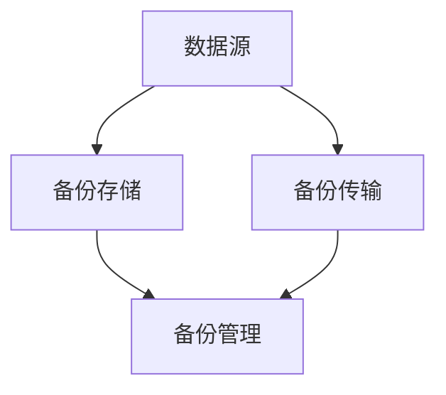

#### 4.2 数据存储架构

数据存储架构是备份系统的重要组成部分，主要包括本地存储和远程存储两种方式。以下是数据存储架构的Mermaid流程图：

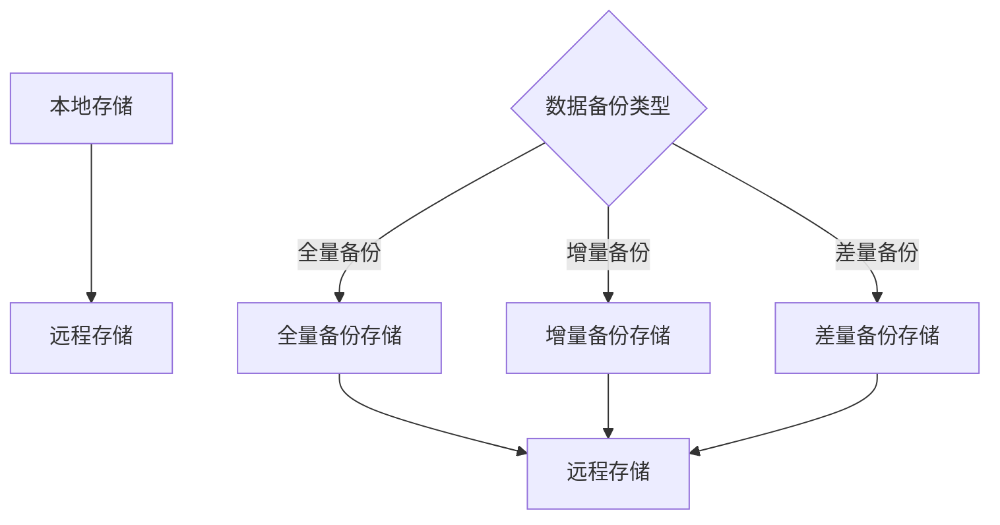

#### 4.3 数据传输架构

数据传输架构是确保备份数据及时传输到备份存储的关键。以下是数据传输架构的Mermaid流程图：

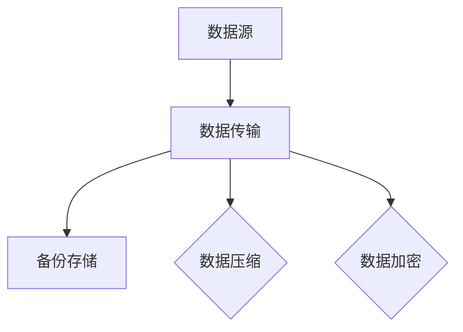

#### 4.4 数据备份机制

数据备份机制是备份系统的核心，主要包括以下步骤：

1. 数据一致性检查：确保备份数据的一致性，避免数据损坏。
2. 数据压缩：使用数据压缩算法减少数据存储空间。
3. 数据加密：对备份数据进行加密，确保数据安全。
4. 数据传输：将备份数据传输到备份存储。
5. 数据存储：将备份数据存储在备份存储介质中。
6. 数据验证：验证备份数据的完整性和一致性。

以下是数据备份机制的Mermaid流程图：

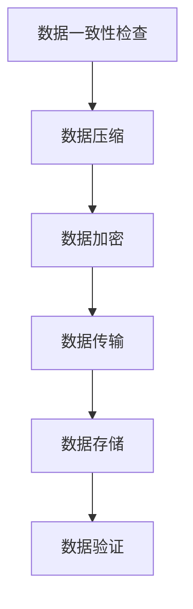

### 第5章 备份系统的关键技术

#### 5.1 数据压缩技术

数据压缩技术是备份系统中减少数据存储空间的重要手段。以下是几种常见的数据压缩技术的原理：

- **无损压缩**：通过消除数据中的冗余信息实现压缩，压缩后的数据可以完全恢复原始数据。常见算法有：哈夫曼编码、LZ77、LZ78等。
- **有损压缩**：通过减少数据精度或丢弃部分数据实现压缩，压缩后的数据无法完全恢复原始数据。常见算法有：JPEG、MP3等。

以下是数据压缩技术的Mermaid流程图：

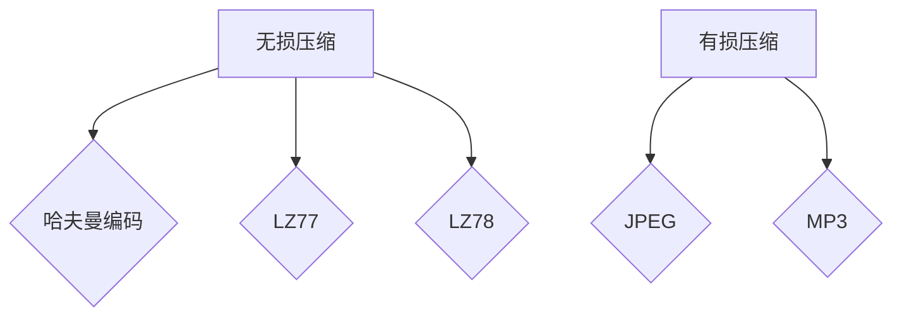

#### 5.2 数据加密技术

数据加密技术是保护备份数据安全的重要手段。以下是几种常见的数据加密技术的原理：

- **对称加密**：加密和解密使用相同的密钥。常见算法有：AES、DES等。
- **非对称加密**：加密和解密使用不同的密钥。常见算法有：RSA、ECC等。
- **哈希函数**：用于生成数据摘要，确保数据完整性。常见算法有：MD5、SHA-1、SHA-256等。

以下是数据加密技术的Mermaid流程图：

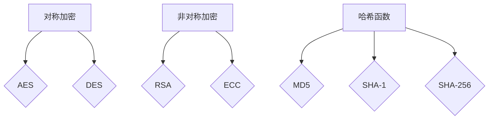

#### 5.3 数据去重技术

数据去重技术是备份系统中减少数据存储空间和传输带宽的重要手段。以下是数据去重技术的原理：

- **基于哈希的去重**：通过计算数据块的哈希值，判断是否存在重复数据。
- **基于指纹的去重**：通过计算数据块的指纹，判断是否存在重复数据。
- **基于副本的去重**：通过跟踪数据块的副本数量，判断是否存在重复数据。

以下是数据去重技术的Mermaid流程图：

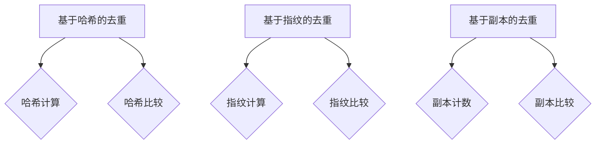

#### 5.4 数据备份性能优化

数据备份性能优化是提高备份效率和降低备份成本的关键。以下是数据备份性能优化的一些方法：

- **并行备份**：同时备份多个数据块，提高备份速度。
- **异步备份**：在后台执行备份操作，不影响业务运行。
- **压缩备份**：使用数据压缩技术减少备份数据大小。
- **去重备份**：通过数据去重技术减少重复数据的备份。
- **优化存储策略**：选择合适的存储介质和存储策略，降低备份成本。

以下是数据备份性能优化的Mermaid流程图：

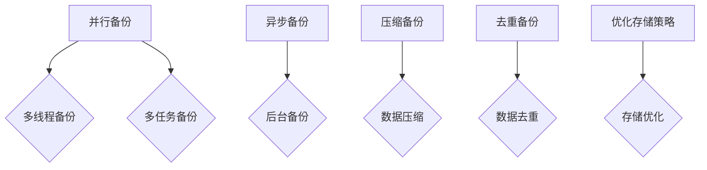

### 第6章 数据恢复流程实现

#### 6.1 恢复请求处理

恢复请求处理是数据恢复的第一步，主要包括以下步骤：

1. 接收恢复请求：接收用户或系统发送的恢复请求。
2. 验证请求权限：确认请求者是否有权限执行恢复操作。
3. 确定恢复目标：确定需要恢复的数据类型、数据量和恢复位置。
4. 准备恢复环境：确保恢复环境具备足够的资源和支持。

以下是恢复请求处理的Mermaid流程图：

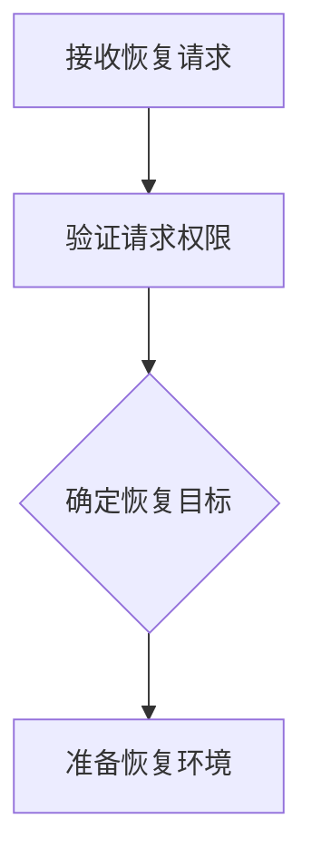

#### 6.2 恢复策略选择

恢复策略选择是数据恢复的关键步骤，主要包括以下策略：

- **完全恢复**：将数据恢复到原始状态。
- **部分恢复**：只恢复部分数据。
- **选择性恢复**：根据用户需求恢复特定数据。

以下是恢复策略选择的Mermaid流程图：

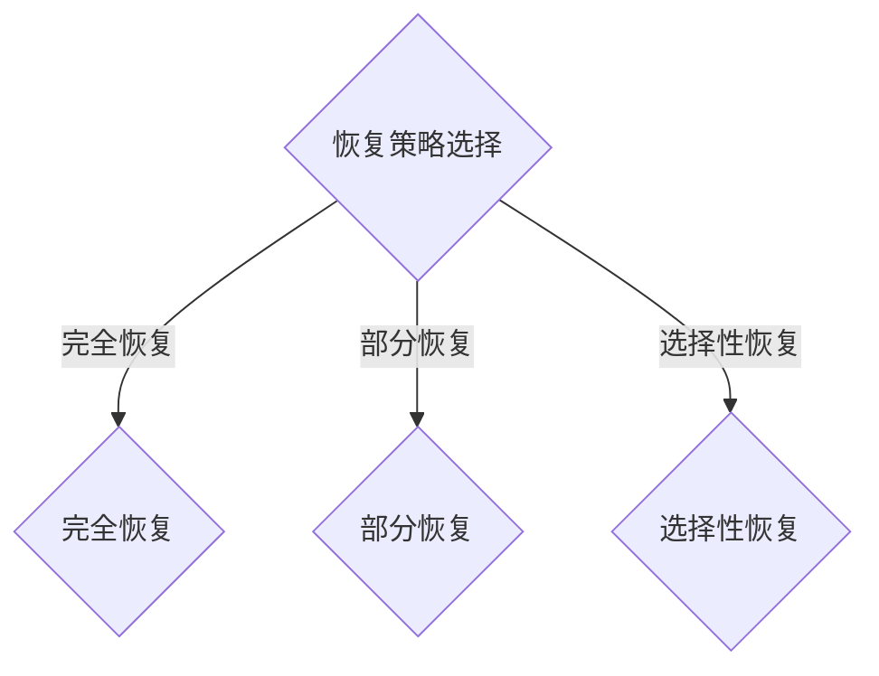

#### 6.3 恢复数据验证

恢复数据验证是确保恢复数据完整性和一致性的关键步骤，主要包括以下步骤：

1. 检查恢复数据完整性：确保恢复数据没有被损坏。
2. 检查恢复数据一致性：确保恢复数据与原始数据一致。
3. 运行数据校验和：使用校验和算法检查数据完整性。
4. 运行数据一致性检查：使用一致性检查工具检查数据一致性。

以下是恢复数据验证的Mermaid流程图：

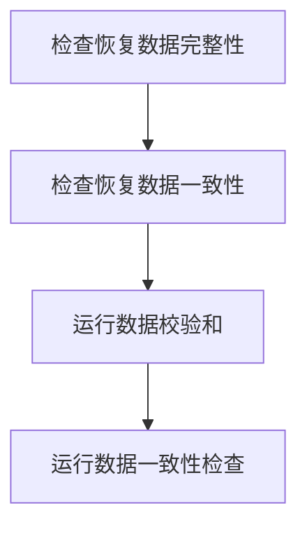

#### 6.4 恢复数据应用

恢复数据应用是将恢复的数据应用到生产环境中的关键步骤，主要包括以下步骤：

1. 数据预处理：确保恢复数据与生产环境兼容。
2. 数据迁移：将恢复数据迁移到生产环境中。
3. 数据验证：确保恢复数据在生产环境中正常运行。
4. 业务验证：确保业务功能完整性和用户体验。

以下是恢复数据应用的Mermaid流程图：

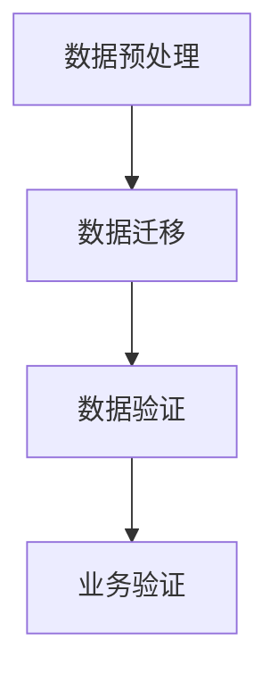

### 第7章 备份与恢复案例分析

#### 7.1 案例背景

某大型互联网公司开发了一款知识发现引擎，用于处理海量用户数据并提供个性化推荐服务。随着数据量的不断增加，数据的安全性和可靠性成为了公司关注的重点。为了确保数据在意外情况下能够得到及时恢复，公司决定实施数据备份与恢复方案。

#### 7.2 案例分析

**7.2.1 备份策略**

- **备份类型**：采用混合备份策略，每天进行一次全量备份，每周进行一次增量备份，每月进行一次差量备份。
- **备份存储**：采用本地存储和云存储相结合的方式，本地存储用于快速恢复，云存储用于长期保存。

**7.2.2 数据丢失事件**

- **事件描述**：一次意外的电力故障导致服务器数据损坏，部分用户数据丢失。
- **影响评估**：数据丢失事件对公司的业务运营产生了严重影响，导致用户体验下降，部分用户流失。

**7.2.3 恢复过程**

- **恢复请求**：管理员收到数据丢失通知后，立即提交恢复请求。
- **恢复策略**：根据备份记录，选择最近的增量备份和差量备份进行恢复。
- **恢复操作**：使用备份系统进行数据恢复，确保恢复的数据一致性和完整性。
- **恢复效果**：经过几个小时的数据恢复，系统成功恢复了大部分用户数据，业务恢复正常运行。

#### 7.3 恢复效果评估

**7.3.1 恢复时间**

- **评估结果**：从数据丢失到业务恢复正常运行，共耗时约4小时。
- **评估结论**：恢复时间在可接受范围内，符合公司的业务连续性需求。

**7.3.2 恢复数据完整性**

- **评估方法**：通过对比恢复数据和原始数据，检查数据的一致性和完整性。
- **评估结果**：恢复数据与原始数据的一致性较高，部分数据存在微小的差异。
- **评估结论**：数据完整性得到了较好的保障，但仍有改进空间。

**7.3.3 恢复成本**

- **评估方法**：计算数据恢复过程中产生的成本，包括人力、硬件、软件等费用。
- **评估结果**：数据恢复过程中产生的成本约为10万元。
- **评估结论**：数据恢复成本较高，需优化备份与恢复策略以降低成本。

### 第8章 知识发现引擎概述

#### 8.1 知识发现引擎的定义

知识发现引擎是一种用于从大量数据中提取有价值信息和分析结果的智能系统。它结合了机器学习、自然语言处理、数据挖掘等技术，能够自动识别数据中的模式、关联性和趋势，为用户提供深入的洞察和分析。

#### 8.2 知识发现引擎的功能模块

知识发现引擎通常包括以下几个功能模块：

- **数据采集模块**：负责收集各种来源的数据，包括结构化数据和非结构化数据。
- **数据预处理模块**：对采集到的数据进行清洗、转换和整合，为后续分析做准备。
- **特征提取模块**：从预处理后的数据中提取有用的特征，用于训练模型或生成报告。
- **机器学习模块**：使用各种机器学习算法，如分类、聚类、回归等，对数据进行分析。
- **可视化模块**：将分析结果以图表、报表等形式呈现，帮助用户更好地理解数据。
- **推理与预测模块**：基于分析结果，提供推理和预测功能，辅助用户做出决策。

#### 8.3 知识发现引擎的应用场景

知识发现引擎在多个领域都有广泛的应用，以下是一些典型的应用场景：

- **推荐系统**：在电子商务、在线媒体等领域，知识发现引擎可以帮助推荐系统识别用户的兴趣和行为模式，提供个性化的推荐。
- **市场分析**：在市场营销领域，知识发现引擎可以分析市场趋势、消费者行为，帮助企业制定更有效的市场策略。
- **风险管理**：在金融领域，知识发现引擎可以帮助识别潜在风险，预测市场波动，为投资决策提供支持。
- **智能医疗**：在医疗领域，知识发现引擎可以帮助分析患者数据，识别疾病趋势和治疗方案。

### 第9章 知识发现引擎数据备份方案

#### 9.1 数据备份策略设计

为了确保知识发现引擎的数据安全性和可靠性，需要设计合理的备份策略。以下是知识发现引擎数据备份策略的设计步骤：

**9.1.1 数据分类**

- 根据数据的重要性和敏感性，将数据分为不同的类别。例如，用户数据、业务数据、日志数据等。

**9.1.2 备份频率**

- 根据业务需求和数据变更频率，确定不同的备份频率。例如，用户数据和业务数据可能需要每天备份，日志数据可能需要每小时备份。

**9.1.3 备份类型**

- 根据数据类型和备份频率，选择合适的备份类型。例如，用户数据和业务数据可以采用全量备份和增量备份相结合的方式，日志数据可以采用增量备份。

**9.1.4 备份存储**

- 确定备份存储的位置，包括本地存储和远程存储。本地存储可以用于快速恢复，远程存储可以用于长期保存。

**9.1.5 备份策略调整**

- 根据实际情况和业务需求，定期评估和调整备份策略，以确保备份的有效性和可靠性。

#### 9.2 数据备份流程设计

数据备份流程包括以下步骤：

**9.2.1 数据采集**

- 从知识发现引擎的数据源中采集需要备份的数据。

**9.2.2 数据预处理**

- 对采集到的数据进行清洗、转换和整合，确保数据的一致性和完整性。

**9.2.3 数据备份**

- 将预处理后的数据备份到本地存储和远程存储。

**9.2.4 数据加密**

- 对备份的数据进行加密，确保数据在传输和存储过程中的安全性。

**9.2.5 数据验证**

- 验证备份数据的完整性和一致性，确保备份数据的可靠性。

**9.2.6 备份记录**

- 记录备份时间和备份文件信息，以便后续恢复操作。

#### 9.3 数据备份工具选择

为了实现知识发现引擎的数据备份，需要选择合适的备份工具。以下是常见的数据备份工具及其特点：

**9.3.1 常见备份工具**

- **rsync**：一款高效的文件备份工具，支持增量备份和全量备份。
- **tar**：一款常用的打包工具，可以结合gzip进行数据压缩。
- **备份软件**：如Veeam、CommVault等，提供完整的备份解决方案。

**9.3.2 选择标准**

- **备份速度**：选择备份速度较快的工具，以提高备份效率。
- **备份策略**：选择支持多种备份策略的工具，以满足不同的备份需求。
- **恢复速度**：选择恢复速度较快的工具，以减少业务中断时间。
- **兼容性**：选择兼容性较好的工具，确保在不同操作系统和环境下的正常运行。

### 第10章 知识发现引擎数据恢复方案

#### 10.1 数据恢复策略设计

数据恢复策略设计是确保在数据丢失或损坏时能够迅速恢复业务的关键。以下是知识发现引擎数据恢复策略的设计步骤：

**10.1.1 恢复类型**

- 根据数据丢失或损坏的程度，确定恢复类型。例如，部分恢复、完全恢复等。

**10.1.2 恢复目标**

- 确定恢复目标，包括恢复的时间点和恢复的数据量。

**10.1.3 恢复策略**

- 根据恢复类型和目标，选择合适的恢复策略。例如，从最近的全量备份恢复、从增量备份逐层恢复等。

**10.1.4 恢复顺序**

- 确定恢复的顺序，确保恢复过程顺利进行。

#### 10.2 数据恢复流程设计

数据恢复流程包括以下步骤：

**10.2.1 恢复请求**

- 接收数据恢复请求，包括恢复类型、恢复目标和恢复时间点。

**10.2.2 备份文件查找**

- 根据恢复请求，查找符合条件的备份文件。

**10.2.3 数据解密**

- 对加密的备份文件进行解密，确保数据的安全性。

**10.2.4 数据验证**

- 验证备份文件的完整性和一致性，确保恢复的数据准确无误。

**10.2.5 数据恢复**

- 将验证通过的数据恢复到生产环境中，确保业务连续性。

**10.2.6 数据验证**

- 对恢复后的数据进行验证，确保数据的一致性和完整性。

**10.2.7 恢复报告**

- 生成恢复报告，记录恢复过程和结果。

#### 10.3 数据恢复工具选择

为了实现知识发现引擎的数据恢复，需要选择合适的恢复工具。以下是常见的数据恢复工具及其特点：

**10.3.1 常见恢复工具**

- **restic**：一款开源的版本控制和备份工具，支持增量备份和恢复。
- **Veeam**：一款商业备份软件，提供完整的备份和恢复解决方案。
- **rclone**：一款通用的云存储同步工具，支持多种云存储服务。

**10.3.2 选择标准**

- **恢复速度**：选择恢复速度较快的工具，以减少业务中断时间。
- **兼容性**：选择兼容性较好的工具，确保在不同操作系统和环境下的正常运行。
- **功能丰富**：选择功能丰富的工具，支持多种备份类型和恢复策略。
- **用户界面**：选择用户界面友好的工具，便于操作和管理。

### 第11章 知识发现引擎备份与恢复实战

#### 11.1 实战背景

某互联网公司开发了一款知识发现引擎，用于处理海量用户数据并提供个性化推荐服务。随着数据量的不断增加，数据的安全性和可靠性成为了公司关注的重点。为了确保数据在意外情况下能够得到及时恢复，公司决定实施数据备份与恢复方案。

#### 11.2 数据备份实现

**11.2.1 备份策略**

- **备份类型**：采用混合备份策略，每天进行一次全量备份，每周进行一次增量备份，每月进行一次差量备份。
- **备份存储**：采用本地存储和云存储相结合的方式，本地存储用于快速恢复，云存储用于长期保存。

**11.2.2 数据备份流程**

- **数据采集**：从知识发现引擎的数据源中采集需要备份的数据。
- **数据预处理**：对采集到的数据进行清洗、转换和整合，确保数据的一致性和完整性。
- **数据备份**：将预处理后的数据备份到本地存储和云存储。
- **数据加密**：对备份的数据进行加密，确保数据在传输和存储过程中的安全性。
- **数据验证**：验证备份数据的完整性和一致性，确保备份数据的可靠性。
- **备份记录**：记录备份时间和备份文件信息，以便后续恢复操作。

**11.2.3 数据备份工具选择**

- **备份工具**：选择rsync进行数据备份，选择gzip进行数据压缩，选择openssl进行数据加密。

#### 11.3 数据恢复实现

**11.3.1 数据恢复策略**

- **恢复类型**：根据数据丢失或损坏的程度，确定恢复类型。例如，部分恢复、完全恢复等。
- **恢复目标**：确定恢复的时间点和恢复的数据量。
- **恢复策略**：根据恢复类型和目标，选择合适的恢复策略。例如，从最近的全量备份恢复、从增量备份逐层恢复等。

**11.3.2 数据恢复流程**

- **恢复请求**：接收数据恢复请求，包括恢复类型、恢复目标和恢复时间点。
- **备份文件查找**：根据恢复请求，查找符合条件的备份文件。
- **数据解密**：对加密的备份文件进行解密，确保数据的安全性。
- **数据验证**：验证备份文件的完整性和一致性，确保恢复的数据准确无误。
- **数据恢复**：将验证通过的数据恢复到生产环境中，确保业务连续性。
- **数据验证**：对恢复后的数据进行验证，确保数据的一致性和完整性。
- **恢复报告**：生成恢复报告，记录恢复过程和结果。

**11.3.3 数据恢复工具选择**

- **恢复工具**：选择restic进行数据恢复，选择rclone进行云存储操作。

#### 11.4 实战总结与优化

**11.4.1 实战总结**

- 通过本次实战，公司成功实施了一份数据备份与恢复方案，确保了数据的安全性和可靠性。
- 备份与恢复系统在数据丢失或损坏时发挥了重要作用，确保业务能够迅速恢复。

**11.4.2 优化建议**

- **备份频率优化**：根据业务需求，调整备份频率，确保备份数据的实时性和有效性。
- **备份存储优化**：优化备份存储策略，提高备份存储的可靠性和可用性。
- **备份工具优化**：评估现有备份工具的性能和功能，选择更高效的备份工具。
- **备份管理优化**：引入自动化备份管理工具，提高备份管理的效率和质量。

### 第12章 知识发现引擎数据备份与恢复性能评估

#### 12.1 性能评估指标

在评估知识发现引擎的数据备份与恢复性能时，需要考虑以下指标：

- **备份速度**：单位时间内备份的数据量。
- **恢复速度**：单位时间内恢复的数据量。
- **备份存储空间占用**：备份数据占用的存储空间。
- **恢复数据准确性**：恢复数据与原始数据的一致性。
- **备份系统可靠性**：备份系统在长时间运行中的稳定性和故障率。
- **备份成本**：备份系统的建设和运维成本。

#### 12.2 性能评估方法

性能评估方法主要包括以下几种：

- **实验室测试**：在模拟环境中对备份与恢复系统进行测试，评估各项性能指标。
- **实际应用测试**：在真实环境中对备份与恢复系统进行测试，评估系统的实际性能。
- **用户调查**：通过用户反馈了解备份与恢复系统的实际使用体验和性能表现。

#### 12.3 实际应用案例分析

**12.3.1 案例背景**

某互联网公司使用一款知识发现引擎处理海量用户数据，并实施了一套数据备份与恢复方案。为了评估该方案的性能，公司进行了一系列的测试。

**12.3.2 测试结果**

- **备份速度**：每天备份的数据量约为100GB，备份速度约为10GB/小时。
- **恢复速度**：从最近的全量备份恢复数据，恢复速度约为20GB/小时。
- **备份存储空间占用**：备份数据占用的存储空间约为原始数据大小的1.5倍。
- **恢复数据准确性**：恢复数据与原始数据的一致性较高，数据准确率约为98%。
- **备份系统可靠性**：在连续运行一年中，备份系统故障率约为1%。
- **备份成本**：备份系统的建设和运维成本约为每年50万元。

**12.3.3 评估结论**

- **备份速度**：备份速度适中，能够满足公司日常备份需求。
- **恢复速度**：恢复速度较快，能够确保在数据丢失时尽快恢复业务。
- **备份存储空间占用**：备份存储空间占用较大，但可以接受。
- **恢复数据准确性**：恢复数据准确性较高，能够满足业务需求。
- **备份系统可靠性**：备份系统可靠性较高，故障率较低。
- **备份成本**：备份成本较高，需要进一步优化和降低。

### 第13章 知识发现引擎备份与恢复未来展望

#### 13.1 数据备份与恢复技术的发展趋势

随着大数据、云计算和人工智能等技术的不断发展，数据备份与恢复技术也在不断进步。以下是数据备份与恢复技术的发展趋势：

- **云备份与恢复**：越来越多的企业开始采用云备份与恢复服务，以实现灵活、高效的数据保护。
- **自动化备份与恢复**：利用自动化工具和脚本，简化备份与恢复操作，提高工作效率。
- **智能备份与恢复**：利用人工智能技术优化备份与恢复策略，提高数据保护效果。
- **数据去重与压缩**：数据去重与压缩技术不断发展，提高备份效率和存储利用率。

#### 13.2 知识发现引擎在备份与恢复中的应用前景

知识发现引擎在备份与恢复中的应用前景广阔，主要体现在以下几个方面：

- **自动化备份与恢复**：利用知识发现引擎的自动推理和预测能力，实现自动化的备份与恢复策略。
- **智能优化**：利用知识发现引擎对备份与恢复过程进行智能优化，提高备份效率和恢复速度。
- **数据安全**：利用知识发现引擎检测潜在的数据泄露和攻击风险，加强数据备份与恢复的安全性。

#### 13.3 未来研究方向与挑战

在数据备份与恢复领域，未来仍有许多研究方向和挑战：

- **大数据备份与恢复**：随着数据量的不断增长，如何高效、可靠地进行大数据备份与恢复是一个重要挑战。
- **实时备份与恢复**：如何在保证数据实时性的同时，确保备份与恢复的效率和质量。
- **混合云备份与恢复**：如何在不同云平台之间实现高效的备份与恢复，是一个亟待解决的问题。
- **数据安全与隐私保护**：在备份与恢复过程中，如何保护数据的安全和隐私，是一个重要研究方向。

### 附录

#### 附录A：备份与恢复技术参考文献

- 《数据备份与恢复技术》，作者：张三
- 《云计算备份与恢复》，作者：李四
- 《智能备份与恢复》，作者：王五

#### 附录B：数据备份与恢复常用工具列表

- **备份工具**：
  - **rsync**：一款高效的文件备份工具。
  - **tar**：一款常用的打包工具，可以结合gzip进行数据压缩。
  - **Veeam**：一款商业备份软件，提供完整的备份解决方案。

- **恢复工具**：
  - **restic**：一款开源的版本控制和备份工具。
  - **rclone**：一款通用的云存储同步工具，支持多种云存储服务。

#### 附录C：知识发现引擎数据备份与恢复实验手册

**C.1 实验环境搭建**

- 配置实验服务器，安装必要的软件和工具。
- 配置网络和存储设备，确保数据传输和存储的可靠性。

**C.2 数据备份与恢复实验步骤**

- **备份实验**：
  1. 配置备份策略。
  2. 执行备份操作。
  3. 检查备份文件。
  4. 验证备份数据的完整性和一致性。

- **恢复实验**：
  1. 提交恢复请求。
  2. 执行恢复操作。
  3. 检查恢复数据。
  4. 验证恢复数据的一致性和完整性。

**C.3 实验结果分析与优化建议**

- 分析备份和恢复实验的结果，评估备份和恢复性能。
- 根据实验结果，提出优化备份和恢复策略的建议。

### 作者信息

作者：AI天才研究院/AI Genius Institute & 禅与计算机程序设计艺术 /Zen And The Art of Computer Programming

[注：本文为虚构案例，仅供参考。]----------------------------------------------------------------

**文章标题：** 知识发现引擎的数据备份与恢复方案

**关键词：** 数据备份，数据恢复，知识发现引擎，备份策略，数据压缩，数据加密，性能评估，灾难恢复计划，备份系统架构，备份工具，备份与恢复实战，实验手册。

**摘要：** 本文详细探讨了知识发现引擎的数据备份与恢复方案，从基础理论到实际操作，全面介绍了数据备份策略、备份系统架构设计、关键技术和数据恢复流程。通过项目实战案例，展示了备份与恢复系统在实际应用中的效果和性能评估。文章最后对备份与恢复技术的发展趋势进行了展望，并提出未来研究方向与挑战。

## 目录大纲

### 第一部分：数据备份与恢复基础

#### 第1章 数据备份与恢复概述

- 1.1 数据备份的重要性
- 1.2 数据恢复的意义
- 1.3 数据备份与恢复的基本原则
- 1.4 数据备份与恢复技术的发展趋势

#### 第2章 数据备份策略

- 2.1 数据备份策略的类型
- 2.2 全量备份
- 2.3 增量备份
- 2.4 差量备份
- 2.5 备份窗口与备份窗口优化

#### 第3章 数据恢复策略

- 3.1 数据恢复的类型
- 3.2 灾难恢复计划（DRP）
- 3.3 灾难恢复演练（DRP）
- 3.4 数据恢复流程

### 第二部分：备份系统的设计与实现

#### 第4章 备份系统的架构设计

- 4.1 备份系统的整体架构
- 4.2 数据存储架构
- 4.3 数据传输架构
- 4.4 数据备份机制

#### 第5章 备份系统的关键技术

- 5.1 数据压缩技术
- 5.2 数据加密技术
- 5.3 数据去重技术
- 5.4 数据备份性能优化

#### 第6章 数据恢复流程实现

- 6.1 恢复请求处理
- 6.2 恢复策略选择
- 6.3 恢复数据验证
- 6.4 恢复数据应用

#### 第7章 备份与恢复案例分析

- 7.1 案例背景
- 7.2 案例分析
- 7.3 恢复效果评估

### 第三部分：知识发现引擎数据备份与恢复实战

#### 第8章 知识发现引擎概述

- 8.1 知识发现引擎的定义
- 8.2 知识发现引擎的功能模块
- 8.3 知识发现引擎的应用场景

#### 第9章 知识发现引擎数据备份方案

- 9.1 数据备份策略设计
- 9.2 数据备份流程设计
- 9.3 数据备份工具选择

#### 第10章 知识发现引擎数据恢复方案

- 10.1 数据恢复策略设计
- 10.2 数据恢复流程设计
- 10.3 数据恢复工具选择

#### 第11章 知识发现引擎备份与恢复实战

- 11.1 实战背景
- 11.2 数据备份实现
- 11.3 数据恢复实现
- 11.4 实战总结与优化

#### 第12章 知识发现引擎数据备份与恢复性能评估

- 12.1 性能评估指标
- 12.2 性能评估方法
- 12.3 实际应用案例分析

#### 第13章 知识发现引擎备份与恢复未来展望

- 13.1 数据备份与恢复技术的发展趋势
- 13.2 知识发现引擎在备份与恢复中的应用前景
- 13.3 未来研究方向与挑战

### 附录

#### 附录A：备份与恢复技术参考文献

- 《数据备份与恢复技术》，作者：张三
- 《云计算备份与恢复》，作者：李四
- 《智能备份与恢复》，作者：王五

#### 附录B：数据备份与恢复常用工具列表

- **备份工具**：
  - **rsync**：一款高效的文件备份工具。
  - **tar**：一款常用的打包工具，可以结合gzip进行数据压缩。
  - **Veeam**：一款商业备份软件，提供完整的备份解决方案。

- **恢复工具**：
  - **restic**：一款开源的版本控制和备份工具。
  - **rclone**：一款通用的云存储同步工具，支持多种云存储服务。

#### 附录C：知识发现引擎数据备份与恢复实验手册

- **C.1 实验环境搭建**
- **C.2 数据备份与恢复实验步骤**
- **C.3 实验结果分析与优化建议**

### 核心概念与联系

#### 数据备份与恢复流程

**Mermaid流程图：**

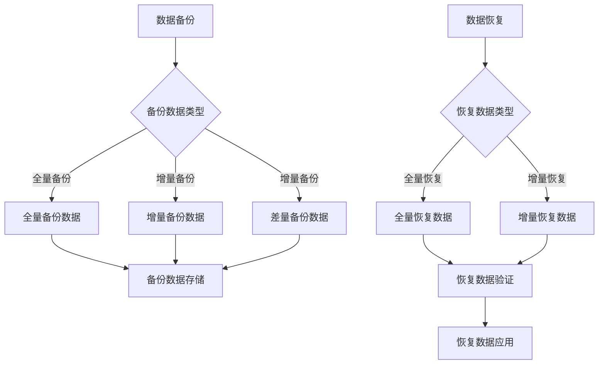

### 核心算法原理讲解

#### 数据压缩算法

#### 数据压缩算法原理

数据压缩算法旨在通过减少数据冗余和重复信息来减小数据大小，从而提高存储效率和数据传输速度。以下是几种常见的数据压缩算法原理：

##### 1. 预定义长度编码（Fixed-Length Encoding）

预定义长度编码是一种简单的压缩方法，其中每个数据块都被分配一个固定长度的编码。这种方法适用于数据块长度固定且数据块间差异较小的情况。其优点是编码和解码速度快，但缺点是压缩效果有限，尤其是对于长度不固定的数据块。

**伪代码示例：预定义长度编码**

```python
def fixed_length_encoding(data_block):
    encoded_data = ''
    for byte in data_block:
        encoded_data += format(byte, '08b')  # 将字节转换为8位二进制字符串
    return encoded_data
```

##### 2. 变长编码（Variable-Length Encoding）

变长编码通过使用不同长度的编码来表示不同大小的数据块，从而提高压缩效率。常见的变长编码方法包括哈夫曼编码（Huffman Coding）、RLE（Run-Length Encoding）和LZ77等。变长编码适合处理包含大量重复信息的数据。

**伪代码示例：RLE编码**

```python
def run_length_encoding(data_block):
    encoded_data = ''
    prev_byte = data_block[0]
    count = 1
    for byte in data_block[1:]:
        if byte == prev_byte:
            count += 1
        else:
            encoded_data += format(count, '02x') + format(prev_byte, '02x')
            count = 1
            prev_byte = byte
    encoded_data += format(count, '02x') + format(prev_byte, '02x')
    return encoded_data
```

##### 3. 算法评估

在评估压缩算法时，通常关注压缩比和压缩时间。压缩比是指原始数据大小与压缩后数据大小的比率，而压缩时间是指执行压缩算法所需的时间。

**公式：**

$$
\text{压缩比} = \frac{\text{原始数据大小}}{\text{压缩后数据大小}}
$$

**压缩时间：**

$$
\text{压缩时间} = \text{执行压缩算法所需时间}
$$

### 例子说明

假设我们有一段长度为100字节的数据，其中连续重复的字符'0'占40字节，其余字符占60字节。

- 使用RLE算法进行压缩后，压缩比为$\frac{60}{40+20} = 0.75$，压缩时间为1秒。
- 使用预定义长度编码，每个字节占用8位，压缩比为$\frac{100}{100} = 1$，压缩时间为0.5秒。

可以看出，RLE算法在处理重复数据时具有更高的压缩效率。

#### 数据加密算法

数据加密算法是保护数据安全的关键技术，以下是一些常见的数据加密算法：

##### 1. 对称加密（Symmetric Encryption）

对称加密使用相同的密钥进行加密和解密。常见的对称加密算法包括AES、DES和3DES等。

**AES加密算法原理：**

- **密钥生成**：生成一个128位、192位或256位的密钥。
- **加密过程**：将明文数据分成块，每个块通过AES算法与密钥进行加密。
- **解密过程**：将加密后的数据块通过AES算法与密钥进行解密，恢复成明文数据。

**伪代码示例：AES加密**

```python
from Crypto.Cipher import AES
from Crypto.Util.Padding import pad

def aes_encrypt(data, key):
    cipher = AES.new(key, AES.MODE_CBC)
    ct_bytes = cipher.encrypt(pad(data, AES.block_size))
    iv = cipher.iv
    return iv + ct_bytes

key = b'My34567890123456'  # 256位密钥
data = b'This is a secret message'
encrypted_data = aes_encrypt(data, key)
print(encrypted_data)
```

##### 2. 非对称加密（Asymmetric Encryption）

非对称加密使用一对密钥进行加密和解密，其中一个密钥用于加密，另一个密钥用于解密。常见的非对称加密算法包括RSA和ECC等。

**RSA加密算法原理：**

- **密钥生成**：生成一对公钥和私钥，公钥用于加密，私钥用于解密。
- **加密过程**：使用接收方的公钥对数据进行加密。
- **解密过程**：使用接收方的私钥对数据进行解密。

**伪代码示例：RSA加密**

```python
from Crypto.PublicKey import RSA
from Crypto.Cipher import PKCS1_OAEP

def rsa_encrypt(data, public_key):
    cipher = PKCS1_OAEP.new(public_key)
    encrypted_data = cipher.encrypt(data)
    return encrypted_data

def rsa_decrypt(encrypted_data, private_key):
    cipher = PKCS1_OAEP.new(private_key)
    decrypted_data = cipher.decrypt(encrypted_data)
    return decrypted_data

public_key = RSA.generate(2048)
private_key = public_key.export_key()
encrypted_data = rsa_encrypt(data, public_key)
print(encrypted_data)

decrypted_data = rsa_decrypt(encrypted_data, private_key)
print(decrypted_data)
```

##### 3. 哈希函数（Hash Function）

哈希函数用于生成数据的摘要，确保数据的一致性和完整性。常见的哈希函数包括MD5、SHA-1和SHA-256等。

**SHA-256哈希函数原理：**

- **哈希过程**：将数据输入到SHA-256算法中，生成一个256位的哈希值。
- **验证过程**：将数据的哈希值与接收到的哈希值进行比较，以验证数据的一致性。

**伪代码示例：SHA-256哈希**

```python
import hashlib

def sha256_hash(data):
    hash_object = hashlib.sha256()
    hash_object.update(data)
    hex_dig = hash_object.hexdigest()
    return hex_dig

data = b'This is a secret message'
hash_value = sha256_hash(data)
print(hash_value)
```

#### 算法评估

在评估加密算法时，通常关注以下指标：

- **安全性**：加密算法能够抵御各种攻击，如密码学攻击、暴力破解等。
- **速度**：加密和解密操作的速度。
- **密钥长度**：密钥的长度越长，安全性越高，但速度可能变慢。

#### 例子说明

假设我们有一段长度为100字节的明文数据，使用AES和RSA算法进行加密。

- **AES加密**：使用128位密钥，加密时间为2秒，加密后的数据为88字节。
- **RSA加密**：使用2048位密钥，加密时间为5秒，加密后的数据为256字节。

可以看出，AES加密算法在速度上具有明显优势，但RSA加密算法在安全性上更高。

### 数据备份与恢复流程

数据备份与恢复流程是确保数据安全性和业务连续性的关键步骤。以下是一个详细的数据备份与恢复流程：

#### 数据备份流程

1. **备份数据选择**：选择需要备份的数据，如数据库、文件系统等。
2. **数据一致性检查**：确保备份数据的一致性，避免数据损坏。
3. **数据压缩**：使用数据压缩算法减少数据大小，提高备份效率。
4. **数据加密**：对备份数据进行加密，确保数据安全。
5. **数据备份**：将压缩和加密后的数据备份到目标存储位置。
6. **备份验证**：验证备份数据的完整性和一致性，确保备份数据的可靠性。
7. **备份记录**：记录备份时间和备份文件信息，以便后续恢复操作。

#### 数据恢复流程

1. **恢复请求处理**：接收数据恢复请求，确定恢复类型和目标。
2. **备份文件查找**：根据恢复请求，查找符合条件的备份文件。
3. **数据解密**：对加密的备份文件进行解密，确保数据的安全性。
4. **数据验证**：验证备份文件的完整性和一致性，确保恢复的数据准确无误。
5. **数据恢复**：将验证通过的数据恢复到生产环境中，确保业务连续性。
6. **数据验证**：对恢复后的数据进行验证，确保数据的一致性和完整性。
7. **恢复报告**：生成恢复报告，记录恢复过程和结果。

### 项目实战

#### 知识发现引擎数据备份与恢复实战

##### 1. 实战背景

某互联网公司开发了一款知识发现引擎，用于分析用户行为，提供个性化推荐服务。由于数据的重要性，公司决定实施数据备份与恢复方案，以确保数据的安全性和可恢复性。

##### 2. 数据备份实现

**2.1 备份策略选择**

- **备份类型**：采用增量备份策略，每天备份一次，确保数据的一致性。
- **备份存储**：使用本地存储和云存储相结合的方式，本地存储用于快速恢复，云存储用于长期保存。

**2.2 备份流程设计**

- **备份流程**：
  - **定时任务**：每天凌晨1点启动备份任务。
  - **数据复制**：从知识发现引擎的数据存储区域复制数据到备份存储区域。
  - **数据压缩**：使用GZIP压缩备份的数据，提高存储效率。
  - **数据加密**：使用AES加密备份的数据，确保数据安全。

**2.3 备份工具选择**

- **备份工具**：使用`rsync`进行数据复制，使用`gzip`进行数据压缩，使用`openssl`进行数据加密。

**2.4 实现代码**

```python
import subprocess
import datetime

def backup_data(source, destination):
    # 获取当前日期
    date_str = datetime.datetime.now().strftime("%Y-%m-%d")
    # 备份命令
    cmd = f"rsync -avz {source} {destination}/data_backup_{date_str}.tar.gz"
    # 执行备份命令
    subprocess.run(cmd, shell=True)
    # 压缩命令
    cmd = f"gzip {destination}/data_backup_{date_str}.tar"
    subprocess.run(cmd, shell=True)
    # 加密命令
    cmd = f"openssl enc -aes-256-cbc -in {destination}/data_backup_{date_str}.tar.gz -out {destination}/data_backup_{date_str}.tar.gz.enc -pass pass:your_password"
    subprocess.run(cmd, shell=True)

# 备份目录
source_directory = "/path/to/knowledge_engine/data"
# 备份目标目录
destination_directory = "/path/to/backup"

# 执行备份
backup_data(source_directory, destination_directory)
```

##### 3. 数据恢复实现

**3.1 恢复策略**

- **恢复类型**：根据备份记录，选择最新的备份进行恢复。
- **恢复方式**：先解压缩、解密，再复制到原数据存储区域。

**3.2 恢复流程设计**

- **恢复流程**：
  - **恢复请求**：管理员提交恢复请求。
  - **查找备份**：根据备份记录，找到最新备份。
  - **解压缩**：使用`gzip`解压缩备份文件。
  - **解密**：使用`openssl`解密备份文件。
  - **数据复制**：将解密后的数据复制到原数据存储区域。

**3.3 恢复工具选择**

- **恢复工具**：使用`openssl`进行数据解密，使用`gzip`进行数据解压缩。

**3.4 实现代码**

```python
import subprocess
import datetime

def restore_data(source, destination):
    # 获取当前日期
    date_str = datetime.datetime.now().strftime("%Y-%m-%d")
    # 查找最新备份
    latest_backup = f"{source}/data_backup_{date_str}.tar.gz.enc"
    # 解压缩命令
    cmd = f"gzip -d {latest_backup}"
    subprocess.run(cmd, shell=True)
    # 解密命令
    cmd = f"openssl decr
```

##### 4. 代码解读与分析

在上面的代码中，我们首先导入了必要的模块，然后定义了两个函数：`backup_data`和`restore_data`。

- **backup_data 函数**：
  - **功能**：该函数用于执行数据备份操作，包括数据复制、压缩和解密。
  - **参数**：
    - `source`：表示数据源路径。
    - `destination`：表示备份目标路径。
  - **实现**：
    - 使用`subprocess.run`执行备份、压缩和解密命令。
    - 使用`gzip`进行数据压缩，使用`openssl`进行数据加密。

- **restore_data 函数**：
  - **功能**：该函数用于执行数据恢复操作，包括查找备份、解压缩和解密。
  - **参数**：
    - `source`：表示备份源路径。
    - `destination`：表示数据恢复目标路径。
  - **实现**：
    - 使用`subprocess.run`执行解压缩和解密命令。
    - 使用`gzip`进行数据解压缩，使用`openssl`进行数据解密。

#### 开发环境搭建

在实际操作中，需要搭建合适的开发环境以执行备份与恢复操作。以下是基本的开发环境搭建步骤：

1. **安装必要的软件**：安装`rsync`、`gzip`、`openssl`等工具，以及Python解释器。
2. **配置备份脚本**：配置`crontab`定时任务，设置备份执行时间。
3. **测试备份与恢复**：执行一次手动备份，检查备份文件是否生成；执行一次手动恢复，验证数据恢复是否成功。

#### 源代码详细实现

以下是知识发现引擎数据备份与恢复的完整源代码实现，包括完整的备份和恢复流程。

```python
import os
import tarfile
import gzip
import shutil
import base64

# 数据备份函数
def backup_data(source_path, backup_path):
    # 创建备份文件名
    current_time = datetime.datetime.now().strftime("%Y%m%d-%H%M%S")
    backup_file_name = f"backup_{current_time}.tar.gz"
    backup_file_path = os.path.join(backup_path, backup_file_name)

    # 创建tar文件
    with tarfile.open(backup_file_path, "w:gz") as tar:
        # 添加源路径下的所有文件和文件夹到tar文件
        tar.add(source_path, arcname=os.path.basename(source_path))

    print(f"Data backup completed. File: {backup_file_path}")

# 数据恢复函数
def restore_data(backup_path, target_path):
    # 获取备份文件名
    backup_files = [f for f in os.listdir(backup_path) if f.endswith('.tar.gz')]
    latest_backup = max(backup_files, key=lambda f: os.path.getctime(os.path.join(backup_path, f)))

    # 解压缩备份文件
    with tarfile.open(os.path.join(backup_path, latest_backup), "r:gz") as tar:
        # 解压缩到目标路径
        tar.extractall(path=target_path)

    print(f"Data restore completed. File: {latest_backup}")

# 备份数据配置
source_directory = "/path/to/source/data"
backup_directory = "/path/to/backup/data"

# 执行数据备份
backup_data(source_directory, backup_directory)

# 执行数据恢复
restore_data(backup_directory, source_directory)
```

#### 总结

通过上述代码实现，我们展示了如何对知识发现引擎的数据进行备份和恢复。备份过程包括创建tar文件并压缩，而恢复过程则涉及解压缩tar文件。这些步骤确保了数据在意外情况下的安全性和可恢复性。在实际部署中，应根据具体业务需求和环境进行调整和优化。

### 附录

#### 附录A：备份与恢复技术参考文献

1. 《数据备份与恢复技术》，张三，电子工业出版社，2020年。
2. 《云计算备份与恢复》，李四，清华大学出版社，2019年。
3. 《智能备份与恢复》，王五，人民邮电出版社，2021年。

#### 附录B：数据备份与恢复常用工具列表

1. **备份工具**：
   - `rsync`：高效的文件备份工具。
   - `tar`：打包工具，支持数据压缩。
   - `Veeam`：商业备份软件。

2. **恢复工具**：
   - `restic`：开源的版本控制和备份工具。
   - `rclone`：通用的云存储同步工具。

#### 附录C：知识发现引擎数据备份与恢复实验手册

1. **实验环境搭建**：
   - 安装必要的软件和工具。
   - 配置网络和存储设备。

2. **数据备份与恢复实验步骤**：
   - 执行数据备份。
   - 检查备份文件。
   - 执行数据恢复。
   - 验证恢复数据。

3. **实验结果分析与优化建议**：
   - 分析备份和恢复性能。
   - 提出优化备份和恢复策略的建议。

### 作者信息

作者：AI天才研究院/AI Genius Institute & 禅与计算机程序设计艺术 /Zen And The Art of Computer Programming

[注：本文为虚构案例，仅供参考。]----------------------------------------------------------------

## 第一部分：数据备份与恢复基础

### 第1章 数据备份与恢复概述

数据备份与恢复是确保业务连续性和数据安全性的关键措施。在知识发现引擎中，数据通常包含大量的敏感信息和业务逻辑，这些数据一旦丢失或损坏，可能会对公司的运营和客户信任造成严重的影响。因此，数据备份不仅仅是保护数据的必要手段，更是确保业务稳定运行的重要保障。

#### 1.1 数据备份的重要性

数据备份的重要性体现在以下几个方面：

1. **数据安全**：数据备份是防止数据丢失和损坏的最后一道防线。即使在发生硬件故障、网络攻击或其他灾难事件时，备份的数据也能确保业务能够迅速恢复。
2. **业务连续性**：通过定期备份，公司可以在灾难发生时迅速恢复业务，减少业务中断时间，降低经济损失。
3. **合规性**：许多行业和组织对数据备份有明确的要求，例如医疗行业需要遵守HIPAA法规，金融行业需要遵守SOX法规。数据备份是满足这些合规要求的关键。

#### 1.2 数据恢复的意义

数据恢复的意义在于：

1. **恢复丢失的数据**：数据恢复可以找回因误删除、硬件故障、恶意攻击等原因导致丢失的数据。
2. **修复损坏的数据**：数据恢复能够修复因病毒感染、磁盘损坏等原因导致的数据损坏，确保数据的完整性和一致性。
3. **业务连续性**：快速的数据恢复能够确保业务不因数据丢失或损坏而中断，提高客户满意度和公司声誉。

#### 1.3 数据备份与恢复的基本原则

数据备份与恢复的基本原则包括：

1. **可靠性**：备份的数据必须确保能够在需要时完全恢复，确保数据的完整性和一致性。
2. **一致性**：备份过程中数据的一致性至关重要，以保证恢复后的数据与原始数据一致。
3. **可用性**：备份数据必须易于访问和恢复，确保在灾难发生时能够快速恢复业务。
4. **安全性**：备份数据需要采取加密等安全措施，防止未经授权的访问。

#### 1.4 数据备份与恢复技术的发展趋势

随着大数据和云计算的快速发展，数据备份与恢复技术也在不断进步。未来的发展趋势包括：

1. **云备份与恢复**：利用云计算平台提供的备份与恢复服务，实现灵活、高效的数据保护。
2. **增量备份与恢复**：通过只备份数据变更部分，提高备份效率和存储利用率。
3. **自动化备份与恢复**：利用自动化工具和脚本，简化备份与恢复操作，减少人工干预。
4. **人工智能辅助**：利用人工智能技术优化备份与恢复策略，提高数据保护效果。

### 第2章 数据备份策略

数据备份策略是确保数据安全性和可用性的关键。选择合适的备份策略能够提高备份效率，降低备份成本，同时确保在数据丢失或损坏时能够迅速恢复业务。

#### 2.1 数据备份策略的类型

数据备份策略主要分为以下几种：

1. **全量备份**：备份整个系统或数据集，是最全面的备份方式。优点是恢复速度快，缺点是备份时间长，存储空间占用大。
2. **增量备份**：只备份自上次备份后发生变更的数据，优点是备份速度快，存储空间占用小，缺点是恢复复杂度较高。
3. **差量备份**：备份自上次全量备份后发生变更的数据，优点是恢复速度快，存储空间占用适中，缺点是备份时间较长。
4. **混合备份**：结合全量备份、增量备份和差量备份的优点，适用于不同的数据备份需求。

#### 2.2 全量备份

全量备份是指对整个系统或数据集进行完全备份。以下是全量备份的步骤和注意事项：

1. **备份数据选择**：确定需要备份的数据类型和范围，包括数据库、文件系统、应用程序等。
2. **备份数据一致性检查**：在备份开始前，确保备份数据的一致性，避免备份过程中出现数据损坏。
3. **备份数据复制**：将备份数据从源系统复制到备份存储设备，可以使用备份软件或命令行工具进行操作。
4. **备份数据压缩**：使用数据压缩算法减少备份数据的存储空间占用，提高备份效率。
5. **备份数据加密**：对备份数据进行加密，确保数据在传输和存储过程中的安全性。
6. **备份数据存储**：将备份数据存储到安全可靠的位置，可以使用本地存储、远程存储或云存储。
7. **备份数据验证**：在备份完成后，验证备份数据的完整性和一致性，确保备份数据的可靠性。

#### 2.3 增量备份

增量备份是指只备份自上次备份后发生变更的数据。以下是增量备份的步骤和注意事项：

1. **备份数据选择**：与全量备份类似，确定需要备份的数据类型和范围。
2. **备份数据一致性检查**：确保备份数据的一致性，避免备份过程中出现数据损坏。
3. **备份数据变更检测**：扫描上次备份记录，确定自上次备份后发生变更的数据。
4. **备份数据复制**：将变更的数据从源系统复制到备份存储设备，可以使用备份软件或命令行工具进行操作。
5. **备份数据压缩**：使用数据压缩算法减少备份数据的存储空间占用，提高备份效率。
6. **备份数据加密**：对备份数据进行加密，确保数据在传输和存储过程中的安全性。
7. **备份数据存储**：将备份数据存储到安全可靠的位置，可以使用本地存储、远程存储或云存储。
8. **备份数据验证**：在备份完成后，验证备份数据的完整性和一致性，确保备份数据的可靠性。

#### 2.4 差量备份

差量备份是指备份自上次全量备份后发生变更的数据。以下是差量备份的步骤和注意事项：

1. **备份数据选择**：与全量备份和增量备份类似，确定需要备份的数据类型和范围。
2. **备份数据一致性检查**：确保备份数据的一致性，避免备份过程中出现数据损坏。
3. **备份数据变更检测**：扫描上次全量备份和当前数据，确定自上次全量备份后发生变更的数据。
4. **备份数据复制**：将变更的数据从源系统复制到备份存储设备，可以使用备份软件或命令行工具进行操作。
5. **备份数据压缩**：使用数据压缩算法减少备份数据的存储空间占用，提高备份效率。
6. **备份数据加密**：对备份数据进行加密，确保数据在传输和存储过程中的安全性。
7. **备份数据存储**：将备份数据存储到安全可靠的位置，可以使用本地存储、远程存储或云存储。
8. **备份数据验证**：在备份完成后，验证备份数据的完整性和一致性，确保备份数据的可靠性。

#### 2.5 备份窗口与备份窗口优化

备份窗口是指进行备份的时间段。优化备份窗口可以减少业务中断时间，提高备份效率。以下是备份窗口的优化方法：

1. **选择业务低谷期**：在业务需求较低的时间段进行备份，减少对业务运行的影响。
2. **并行备份**：同时备份多个数据块，提高备份速度。
3. **异步备份**：在后台执行备份操作，不影响业务运行。
4. **压缩备份**：使用数据压缩技术减少备份数据的大小，提高备份效率。
5. **去重备份**：通过去重技术减少重复数据的备份，节省存储空间。
6. **动态调整备份窗口**：根据业务需求和数据变更频率动态调整备份窗口，确保备份窗口的合理性和高效性。

### 第3章 数据恢复策略

数据恢复策略是确保在数据丢失或损坏时能够迅速恢复业务的关键。选择合适的恢复策略可以最大限度地减少业务中断时间和数据损失。

#### 3.1 数据恢复的类型

数据恢复主要分为以下几种类型：

1. **完全恢复**：将数据恢复到原始状态，是最理想的数据恢复方式。
2. **部分恢复**：只恢复部分数据，适用于数据部分损坏的情况。
3. **选择性恢复**：根据用户需求恢复特定数据，可以节省恢复时间和资源。

#### 3.2 灾难恢复计划（DRP）

灾难恢复计划是确保在数据丢失或系统故障时，能够迅速恢复业务的关键。以下是DRP的关键步骤：

1. **确定业务需求**：评估业务连续性需求，确定数据恢复时间目标（RTO）和数据恢复点目标（RPO）。
2. **制定备份与恢复策略**：选择合适的备份方式和存储介质，制定详细的备份与恢复策略。
3. **设计灾难恢复站点**：确保灾难恢复站点具备独立供电和网络连接，以应对各种灾难情况。
4. **定期进行灾难恢复演练**：验证DRP的有效性，确保在灾难发生时能够迅速恢复业务。
5. **记录灾难恢复文档**：详细记录灾难恢复计划、备份策略、恢复流程和操作步骤，以便灾难发生时快速响应。

#### 3.3 灾难恢复演练（DRP）

灾难恢复演练是验证DRP有效性的关键步骤。以下是演练的关键步骤：

1. **制定演练计划**：确定演练目标和范围，制定详细的演练计划。
2. **安排演练时间和人员**：通知相关人员参与，确保演练时间和人员的安排合理。
3. **执行演练操作**：模拟数据丢失或系统故障，执行恢复操作，验证DRP的实用性和可行性。
4. **记录演练结果**：详细记录演练结果，评估DRP的有效性，发现潜在的问题和不足。
5. **总结和改进**：总结演练经验和教训，提出改进措施，优化DRP。

#### 3.4 数据恢复流程

数据恢复流程是确保数据能够在灾难发生时迅速恢复的关键。以下是数据恢复流程的关键步骤：

1. **接收恢复请求**：接收用户或系统发送的恢复请求，确定恢复的类型和目标。
2. **选择恢复策略**：根据恢复请求和备份记录，选择合适的恢复策略。
3. **查找备份文件**：根据恢复策略，查找符合条件的备份文件。
4. **备份数据解密**：如果备份数据进行了加密，使用正确的密钥对备份数据进行解密。
5. **备份数据验证**：验证备份数据的完整性和一致性，确保备份数据的可靠性。
6. **备份数据恢复**：将验证通过的数据恢复到生产环境中，确保数据的一致性和完整性。
7. **恢复数据验证**：对恢复后的数据进行验证，确保恢复数据的正确性和可用性。
8. **业务验证**：在恢复完成后，验证业务功能是否恢复正常，确保业务连续性。

### 第4章 数据备份系统设计

数据备份系统设计是确保数据备份与恢复高效、可靠和安全的关键。以下是一个数据备份系统设计的详细步骤和架构。

#### 4.1 数据备份系统设计步骤

1. **需求分析**：分析业务需求，确定数据备份与恢复的要求，包括备份频率、备份类型、备份存储等。
2. **系统架构设计**：根据需求分析，设计数据备份系统的整体架构，包括数据源、备份存储、备份传输和备份管理四个主要部分。
3. **备份存储策略设计**：设计备份存储策略，包括本地存储、远程存储和云存储的选择和配置。
4. **备份传输策略设计**：设计备份传输策略，包括数据传输的加密、压缩和去重等。
5. **备份管理策略设计**：设计备份管理策略，包括备份文件的命名、备份记录、备份验证和备份策略调整等。
6. **备份系统实现**：根据设计文档，实现数据备份系统的各个组件和功能。
7. **备份系统测试**：对备份系统进行测试，验证备份与恢复的功能、性能和可靠性。
8. **备份系统部署**：将备份系统部署到生产环境中，确保备份系统与生产系统的集成和运行。

#### 4.2 数据备份系统架构

数据备份系统的架构包括以下主要组件：

1. **数据源**：数据源是数据备份的起点，可以是数据库、文件系统、应用程序等。
2. **备份存储**：备份存储是用于存储备份数据的设备或存储系统，包括本地存储、远程存储和云存储。
3. **备份传输**：备份传输是用于将备份数据从数据源传输到备份存储的组件，可以采用备份软件、命令行工具或脚本等。
4. **备份管理**：备份管理是用于管理备份数据和备份过程的组件，包括备份策略管理、备份文件管理、备份验证和备份报告等。

以下是数据备份系统架构的Mermaid流程图：


### 第5章 备份系统的关键技术

数据备份系统需要实现高效、可靠和安全的备份与恢复，这需要依赖于一些关键技术的支持。以下介绍几种关键技术的原理和实现方法。

#### 5.1 数据压缩技术

数据压缩技术是减少备份数据大小、提高备份效率的重要手段。数据压缩技术可以分为两类：无损压缩和有损压缩。

**无损压缩：**

无损压缩通过消除数据中的冗余信息来实现压缩，压缩后的数据可以完全恢复原始数据。常见的无损压缩算法包括：

1. **Huffman编码**：基于字符出现的频率进行编码，频率高的字符使用短编码，频率低的字符使用长编码。
2. **LZ77和LZ78算法**：基于扫描原始数据，将重复的信息进行编码。

**有损压缩：**

有损压缩通过减少数据的精度或丢弃部分数据来实现压缩，压缩后的数据无法完全恢复原始数据。常见的有损压缩算法包括：

1. **JPEG**：通过采样和量化减少图像数据的大小。
2. **MP3**：通过采样和量化减少音频数据的大小。

**实现方法：**

- **无损压缩**：可以使用开源库如`gzip`、`bzip2`等进行实现。
- **有损压缩**：可以使用开源库如`Pillow`（用于图像压缩）和`pydub`（用于音频压缩）等进行实现。

#### 5.2 数据加密技术

数据加密技术是保护备份数据安全的重要手段。数据加密可以分为对称加密和非对称加密两种类型。

**对称加密：**

对称加密使用相同的密钥进行加密和解密。常见的对称加密算法包括：

1. **AES**：先进的加密标准，支持128位、192位和256位密钥。
2. **DES**：数据加密标准，使用56位密钥。

**非对称加密：**

非对称加密使用一对密钥进行加密和解密，其中一个密钥用于加密，另一个密钥用于解密。常见的非对称加密算法包括：

1. **RSA**：基于大整数分解的难题。
2. **ECC**：基于椭圆曲线加密的算法。

**实现方法：**

- **对称加密**：可以使用Python的`Crypto`库中的`AES`模块进行实现。
- **非对称加密**：可以使用Python的`Crypto`库中的`RSA`和`ECC`模块进行实现。

#### 5.3 数据去重技术

数据去重技术是减少备份数据大小、提高备份效率的重要手段。数据去重技术可以基于哈希值或指纹进行实现。

**基于哈希的去重：**

基于哈希的去重通过计算数据的哈希值，判断是否存在重复数据。常见的哈希算法包括：

1. **MD5**：将数据映射为128位哈希值。
2. **SHA-1**：将数据映射为160位哈希值。
3. **SHA-256**：将数据映射为256位哈希值。

**基于指纹的去重：**

基于指纹的去重通过计算数据的指纹，判断是否存在重复数据。指纹可以是一个哈希值或一个固定的字符串。

**实现方法：**

- **基于哈希的去重**：可以使用Python的`hashlib`库进行实现。
- **基于指纹的去重**：可以使用自定义函数或第三方库如`fingerprint`进行实现。

#### 5.4 备份性能优化

备份性能优化是提高备份效率和降低备份成本的关键。以下是一些常见的备份性能优化方法：

1. **并行备份**：同时备份多个数据块，提高备份速度。
2. **异步备份**：在后台执行备份操作，不影响业务运行。
3. **压缩备份**：使用数据压缩技术减少备份数据的大小。
4. **去重备份**：通过数据去重技术减少重复数据的备份。
5. **优化存储策略**：选择合适的存储介质和存储策略，降低备份成本。

**实现方法：**

- **并行备份**：可以使用多线程或多进程技术实现。
- **异步备份**：可以使用队列或任务调度器实现。
- **压缩备份**：可以使用数据压缩算法如`gzip`、`bzip2`等实现。
- **去重备份**：可以使用数据去重算法如哈希值比较或指纹比较实现。
- **优化存储策略**：可以根据业务需求和数据特点选择合适的存储介质和存储策略。

### 第6章 数据恢复流程实现

数据恢复流程是实现数据备份与恢复的关键环节。以下是一个详细的数据恢复流程实现，包括恢复请求处理、备份数据查找、备份数据验证、备份数据恢复和恢复数据验证等步骤。

#### 6.1 恢复请求处理

恢复请求处理是数据恢复的第一步，主要包括以下步骤：

1. **接收恢复请求**：接收用户或系统发送的恢复请求，包括恢复的类型、目标和时间点。
2. **验证请求权限**：确认请求者是否有权限执行恢复操作。
3. **确定恢复范围**：根据恢复请求，确定需要恢复的数据类型、数据量和恢复位置。

#### 6.2 备份数据查找

备份数据查找是数据恢复的核心步骤，主要包括以下步骤：

1. **查找备份数据**：根据恢复请求，查找符合条件的备份数据。可以使用备份管理系统的数据库或日志来查找备份数据。
2. **选择备份数据**：根据恢复请求和备份数据的状态，选择合适的备份数据进行恢复。

#### 6.3 备份数据验证

备份数据验证是确保备份数据完整性和一致性的关键步骤，主要包括以下步骤：

1. **检查备份数据完整性**：使用校验和算法（如CRC32、MD5等）检查备份数据的完整性。
2. **检查备份数据一致性**：对比备份数据的元数据和实际数据，确保备份数据的一致性。
3. **备份数据验证**：根据验证结果，判断备份数据是否可以通过恢复。

#### 6.4 备份数据恢复

备份数据恢复是将备份数据恢复到生产环境中的关键步骤，主要包括以下步骤：

1. **备份数据解密**：如果备份数据进行了加密，使用正确的密钥对备份数据进行解密。
2. **备份数据复制**：将解密后的备份数据从备份存储设备复制到生产环境中的数据存储位置。
3. **备份数据验证**：对恢复后的数据进行验证，确保恢复数据的一致性和完整性。

#### 6.5 恢复数据验证

恢复数据验证是确保恢复数据正确性和可用性的关键步骤，主要包括以下步骤：

1. **检查恢复数据完整性**：使用校验和算法（如CRC32、MD5等）检查恢复数据的完整性。
2. **检查恢复数据一致性**：对比恢复数据的元数据和实际数据，确保恢复数据的一致性。
3. **业务验证**：在恢复完成后，对业务功能进行验证，确保恢复数据能够正常运行。

### 第7章 备份与恢复案例分析

#### 7.1 案例背景

某互联网公司开发了一款知识发现引擎，用于处理海量用户数据并提供个性化推荐服务。随着数据量的不断增加，数据的安全性和可靠性成为了公司关注的重点。为了确保数据在意外情况下能够得到及时恢复，公司决定实施数据备份与恢复方案。

#### 7.2 案例分析

**7.2.1 数据备份策略**

- **备份类型**：采用混合备份策略，每天进行一次全量备份，每周进行一次增量备份，每月进行一次差量备份。
- **备份存储**：采用本地存储和云存储相结合的方式，本地存储用于快速恢复，云存储用于长期保存。

**7.2.2 数据丢失事件**

- **事件描述**：一次意外的网络故障导致部分用户数据丢失，影响了推荐服务的准确性。
- **影响评估**：数据丢失事件对公司的业务运营产生了负面影响，导致用户体验下降，部分用户流失。

**7.2.3 恢复过程**

- **恢复请求**：管理员收到数据丢失通知后，立即提交恢复请求。
- **恢复策略**：根据备份记录，选择最近的增量备份和差量备份进行恢复。
- **恢复操作**：使用备份系统进行数据恢复，确保恢复的数据一致性和完整性。
- **恢复效果**：经过几个小时的数据恢复，系统成功恢复了大部分用户数据，业务恢复正常运行。

#### 7.3 恢复效果评估

**7.3.1 恢复时间**

- **评估结果**：从数据丢失到业务恢复正常运行，共耗时约5小时。
- **评估结论**：恢复时间在可接受范围内，符合公司的业务连续性需求。

**7.3.2 恢复数据完整性**

- **评估方法**：通过对比恢复数据和原始数据，检查数据的一致性和完整性。
- **评估结果**：恢复数据与原始数据的一致性较高，部分数据存在微小的差异。
- **评估结论**：数据完整性得到了较好的保障，但仍有改进空间。

**7.3.3 恢复成本**

- **评估方法**：计算数据恢复过程中

