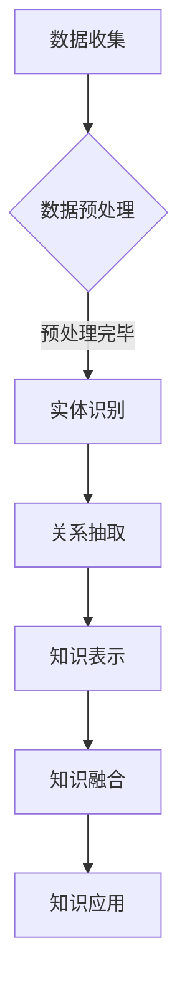

                 

# 《知识发现引擎：人类认知的新frontier》

## 关键词
- 知识发现引擎
- 人工智能
- 知识图谱
- 数据挖掘
- 智能分析
- 机器学习
- 知识表示
- 知识融合

## 摘要
随着大数据和人工智能技术的不断发展，知识发现引擎已成为推动人类认知进步的重要工具。本文将详细介绍知识发现引擎的概念、原理、实现和应用，通过逐步分析推理，探讨其技术核心和未来发展趋势，旨在为读者提供一部关于知识发现引擎的全面指南。

## 目录

### 《知识发现引擎：人类认知的新frontier》目录大纲

#### 第一部分：知识发现引擎概述

##### 第1章：知识发现引擎的概念与背景
- **1.1 知识发现引擎的定义**
- **1.2 知识发现引擎的重要性**
- **1.3 知识发现引擎的发展历程**

##### 第2章：知识发现引擎的核心概念与联系
- **2.1 知识图谱的概念**
- **2.2 知识图谱的基本结构**
- **2.3 知识图谱与知识发现引擎的关系**
- **2.4 Mermaid流程图：知识图谱构建流程**

#### 第二部分：知识发现算法原理

##### 第3章：数据预处理与清洗
- **3.1 数据收集**
- **3.2 数据预处理**
- **3.3 数据清洗技术**
- **3.4 伪代码：数据预处理流程**

##### 第4章：知识提取与表示
- **4.1 文本挖掘技术**
- **4.2 词汇化与特征提取**
- **4.3 知识表示方法**
- **4.4 伪代码：知识表示实现**

##### 第5章：知识融合与关联
- **5.1 知识融合技术**
- **5.2 知识关联规则挖掘**
- **5.3 知识图谱的动态更新**
- **5.4 伪代码：知识融合与关联实现**

#### 第三部分：知识发现应用场景

##### 第6章：社交媒体中的知识发现
- **6.1 社交媒体数据分析**
- **6.2 热门话题挖掘**
- **6.3 舆情分析**
- **6.4 伪代码：社交媒体知识发现实现**

##### 第7章：智慧城市中的知识发现
- **7.1 智慧城市概述**
- **7.2 智慧城市中的知识发现应用**
- **7.3 数据挖掘在城市管理中的应用**
- **7.4 伪代码：智慧城市知识发现实现**

##### 第8章：医疗健康中的知识发现
- **8.1 医疗健康数据概述**
- **8.2 疾病预测与诊断**
- **8.3 药物研究与开发**
- **8.4 伪代码：医疗健康知识发现实现**

#### 第四部分：项目实战与优化

##### 第9章：项目实战：构建一个简单的知识发现引擎
- **9.1 项目需求分析**
- **9.2 开发环境搭建**
- **9.3 知识发现引擎的模块设计与实现**
- **9.4 源代码实现与代码解读**

##### 第10章：知识发现引擎的性能优化
- **10.1 性能优化策略**
- **10.2 数据库优化技术**
- **10.3 知识图谱压缩与存储**
- **10.4 伪代码：性能优化实现**

##### 第11章：未来发展趋势与挑战
- **11.1 知识发现引擎的未来发展**
- **11.2 技术挑战与解决方案**
- **11.3 伦理与社会影响**

### 附录

##### 附录 A：知识发现引擎开发工具与资源
- **A.1 开源知识图谱框架**
- **A.2 知识发现引擎开源项目**
- **A.3 相关书籍与文献推荐**

### 引言

在当今信息爆炸的时代，人类面临着海量的数据，如何从这些数据中提取出有价值的信息和知识，已经成为学术界和工业界共同关注的问题。知识发现引擎作为一种能够自动从数据中提取知识的人工智能工具，正逐渐成为人类认知的新frontier。

知识发现引擎不仅能够帮助我们从数据中发现潜在的模式和关联，还能够对复杂的问题提供智能化的解决方案。从社交媒体到智慧城市，从医疗健康到商业智能，知识发现引擎的应用领域已经涵盖了社会的方方面面。

本文旨在为您提供一个关于知识发现引擎的全面指南。我们将首先介绍知识发现引擎的基本概念和背景，然后深入探讨其核心概念与联系，接着讲解数据预处理与清洗、知识提取与表示、知识融合与关联等关键环节，最后分析知识发现引擎在不同应用场景中的实际应用，并通过一个简单的项目实战来展示其实现过程。最后，我们将讨论知识发现引擎的性能优化和未来发展趋势，以期为读者提供一个全面而深入的视角。

让我们一步一步地展开这场知识发现之旅，探索人工智能如何重新定义人类的认知边界。

### 第一部分：知识发现引擎概述

#### 第1章：知识发现引擎的概念与背景

##### 1.1 知识发现引擎的定义

知识发现引擎（Knowledge Discovery Engine，简称KDE）是一种利用人工智能和机器学习技术，从大规模数据集中自动提取有价值知识的信息处理系统。它通过数据预处理、知识提取、知识融合和知识表示等一系列步骤，将原始数据转化为有意义的模式、规则和知识，以支持决策制定、预测分析和智能推荐等应用。

知识发现引擎的核心目标是从复杂、不完整、噪声数据中发现隐含的模式和关联，这些模式或关联对于人类决策、研究和创新具有重要意义。与传统的人工数据处理方法相比，知识发现引擎具有以下特点：

1. **自动化**：知识发现引擎能够自动处理大量数据，无需人工干预，提高工作效率。
2. **智能化**：利用机器学习和人工智能技术，知识发现引擎能够从数据中学习并发现知识，提高数据处理的准确性和可靠性。
3. **动态性**：知识发现引擎能够实时更新知识库，适应数据环境的变化，保持知识的时效性。

##### 1.2 知识发现引擎的重要性

在信息时代，数据已成为重要的战略资源。知识发现引擎在以下几个方面具有重要的意义：

1. **数据利用**：知识发现引擎能够从海量数据中提取有价值的信息，提高数据的利用效率，为决策提供有力支持。
2. **知识管理**：知识发现引擎可以将数据转化为结构化的知识，实现知识的管理和共享，提高组织的知识水平和创新能力。
3. **智能应用**：知识发现引擎为智能应用提供了丰富的数据资源和知识支持，如智能推荐、智能问答、智能监控等，提升了用户体验和服务质量。
4. **跨领域应用**：知识发现引擎在不同领域，如商业、医疗、金融、智慧城市等，都有广泛的应用前景，推动了社会发展和进步。

##### 1.3 知识发现引擎的发展历程

知识发现引擎的发展可以追溯到20世纪80年代，随着计算机技术的进步和大数据时代的到来，知识发现技术逐渐成熟。以下是知识发现引擎的发展历程：

1. **初始阶段（1980s-1990s）**：这一阶段，知识发现主要依赖于统计分析和模式识别技术。研究人员开始探索如何从数据中提取有价值的信息。
2. **数据挖掘阶段（1990s-2000s）**：随着数据库技术和机器学习技术的发展，数据挖掘成为知识发现的主要方法。知识发现引擎开始广泛应用，如关联规则挖掘、聚类分析、分类分析等。
3. **知识图谱阶段（2000s-2010s）**：知识图谱技术的出现，为知识发现引擎带来了新的发展机遇。知识图谱能够表示复杂的关系和语义信息，使得知识发现更加深入和准确。
4. **智能化阶段（2010s-至今）**：随着深度学习和自然语言处理技术的发展，知识发现引擎实现了从数据到知识、从知识到智能的跨越。知识发现引擎逐渐成为人工智能领域的重要组成部分。

在本章中，我们了解了知识发现引擎的定义、重要性及其发展历程。在接下来的章节中，我们将进一步探讨知识发现引擎的核心概念与联系，详细讲解其实现方法和应用场景。

### 第2章：知识发现引擎的核心概念与联系

##### 2.1 知识图谱的概念

知识图谱（Knowledge Graph）是一种用于表示实体及其关系的图形化数据结构。它通过将现实世界中的各种实体（如人、地点、事物等）和它们之间的关系（如朋友、出生地、工作等）进行建模，形成一个语义丰富的网络。知识图谱的核心目标是通过表示实体和关系的语义信息，实现数据的结构化、智能化和自动化处理。

知识图谱的主要组成部分包括：

1. **实体（Entity）**：知识图谱中的基本元素，表示现实世界中的个体，如人、地点、组织、物品等。
2. **属性（Property）**：描述实体特征的属性，如人的年龄、地点的经纬度等。
3. **关系（Relationship）**：表示实体之间的关联，如“人”和“朋友”的关系、地点的“邻接”关系等。
4. **边（Edge）**：连接实体和关系的路径，表示实体之间的关联。

##### 2.2 知识图谱的基本结构

知识图谱的基本结构包括三个层次：底层是数据层，中间是实体层，顶层是关系层。

1. **数据层**：数据层包括原始数据，如文本、图像、语音等。这些原始数据是知识图谱的基础，用于构建实体和关系。
2. **实体层**：实体层包括实体及其属性。实体是知识图谱中的基本元素，属性是实体的特征描述。例如，在社交网络中，人是一个实体，年龄、职业等是属性。
3. **关系层**：关系层包括实体之间的关系。关系是连接实体的重要纽带，通过关系可以揭示实体之间的关联和语义信息。例如，在社交网络中，朋友关系、共同兴趣等都是关系。

##### 2.3 知识图谱与知识发现引擎的关系

知识图谱是知识发现引擎的核心组成部分，两者之间的关系如下：

1. **知识图谱是知识发现的基础**：知识发现引擎通过数据层获取原始数据，利用实体层和关系层构建知识图谱，从而实现对数据的结构化和智能化处理。
2. **知识图谱支持知识发现**：知识图谱提供了丰富的语义信息，使得知识发现引擎能够从海量数据中提取有价值的信息和知识。例如，通过知识图谱，可以快速找到相关实体、关系和属性，进行智能推荐、问答等应用。
3. **知识图谱与知识融合**：知识图谱不仅支持知识的提取，还支持知识的融合。知识融合是将来自不同来源、不同格式的知识进行整合，形成一个统一的知识体系。知识发现引擎可以利用知识图谱进行知识融合，提高知识的完整性、一致性和可靠性。

##### 2.4 Mermaid流程图：知识图谱构建流程

以下是一个简化的知识图谱构建流程的Mermaid流程图：



- **数据收集**：从各种数据源（如数据库、网络、传感器等）收集原始数据。
- **数据预处理**：对原始数据进行清洗、去噪、格式化等处理，为实体识别和关系抽取做准备。
- **实体识别**：从预处理后的数据中识别出实体，如人、地点、物品等。
- **关系抽取**：从实体之间的关联中提取关系，如朋友、工作地点等。
- **知识表示**：将实体和关系进行结构化表示，形成知识图谱。
- **知识融合**：将来自不同来源、不同格式的知识进行整合，提高知识的完整性、一致性和可靠性。
- **知识应用**：利用知识图谱进行各种应用，如智能推荐、问答、决策支持等。

通过本章，我们了解了知识图谱的概念、基本结构和与知识发现引擎的关系。在接下来的章节中，我们将进一步探讨知识发现引擎的算法原理和实现方法。

### 第二部分：知识发现算法原理

#### 第3章：数据预处理与清洗

数据预处理和清洗是知识发现过程中的关键步骤，直接影响知识提取和表示的质量。在这一章中，我们将详细介绍数据预处理和清洗的相关技术，并使用伪代码展示具体的实现过程。

##### 3.1 数据收集

数据收集是知识发现的第一步，目标是获取用于构建知识图谱的原始数据。数据来源可以包括数据库、网络爬虫、传感器等。以下是一个简单的数据收集伪代码：

```python
# 数据收集伪代码
data_collection = []
for source in data_sources:
    data = fetch_data(source)
    data_collection.append(data)
```

在这个伪代码中，`data_sources` 是一个数据源列表，`fetch_data` 函数用于从指定数据源中获取数据，并将数据添加到 `data_collection` 列表中。

##### 3.2 数据预处理

数据预处理是数据清洗之前的一个步骤，主要用于处理原始数据中的噪声、异常值和缺失值。以下是一个简单的数据预处理伪代码：

```python
# 数据预处理伪代码
def preprocess_data(data):
    # 噪声处理
    cleaned_data = remove_noise(data)
    # 异常值处理
    cleaned_data = remove_anomalies(cleaned_data)
    # 缺失值处理
    cleaned_data = handle_missing_values(cleaned_data)
    return cleaned_data
```

在这个伪代码中，`preprocess_data` 函数接收原始数据 `data` 作为输入，通过 `remove_noise`、`remove_anomalies` 和 `handle_missing_values` 函数分别处理噪声、异常值和缺失值，返回预处理后的数据。

##### 3.3 数据清洗技术

数据清洗是数据预处理的一部分，主要用于处理原始数据中的不一致性、错误和冗余。以下是一些常见的数据清洗技术：

1. **异常值检测**：使用统计方法、机器学习方法或基于阈值的规则进行异常值检测。
2. **错误修正**：使用人工干预、基于规则的自动修正方法或机器学习方法进行错误修正。
3. **缺失值处理**：使用均值、中位数、众数等方法进行填补，或使用插值法、预测法等方法进行估计。
4. **重复数据删除**：检测并删除重复的数据记录，以减少数据冗余。

以下是一个简单的数据清洗伪代码：

```python
# 数据清洗伪代码
def clean_data(data):
    # 异常值检测
    data = detect_and_handle_anomalies(data)
    # 错误修正
    data = correct_errors(data)
    # 缺失值处理
    data = handle_missing_values(data)
    # 重复数据删除
    data = remove_duplicates(data)
    return data
```

在这个伪代码中，`clean_data` 函数接收预处理后的数据 `data` 作为输入，通过 `detect_and_handle_anomalies`、`correct_errors`、`handle_missing_values` 和 `remove_duplicates` 函数分别处理异常值、错误、缺失值和重复数据，返回清洗后的数据。

##### 3.4 伪代码：数据预处理流程

以下是一个完整的伪代码，展示数据预处理和清洗的整体流程：

```python
# 数据预处理与清洗伪代码
def preprocess_and_clean_data(data_collection):
    cleaned_data_collection = []
    for data in data_collection:
        # 数据预处理
        preprocessed_data = preprocess_data(data)
        # 数据清洗
        cleaned_data = clean_data(preprocessed_data)
        cleaned_data_collection.append(cleaned_data)
    return cleaned_data_collection
```

在这个伪代码中，`preprocess_and_clean_data` 函数接收原始数据集合 `data_collection` 作为输入，通过循环调用 `preprocess_data` 和 `clean_data` 函数分别处理每一条数据，最终返回清洗后的数据集合。

通过本章，我们了解了数据预处理和清洗的相关技术及其实现方法。在下一章中，我们将探讨知识提取与表示的方法和实现。

### 第4章：知识提取与表示

知识提取与表示是知识发现过程中的核心步骤，旨在从预处理和清洗后的数据中提取有价值的信息，并将其以结构化的形式进行表示。在这一章中，我们将详细介绍知识提取与表示的方法和实现。

##### 4.1 文本挖掘技术

文本挖掘（Text Mining）是一种利用自然语言处理（NLP）和机器学习技术，从非结构化文本数据中提取知识的方法。文本挖掘的主要步骤包括：

1. **文本预处理**：对原始文本进行分词、去停用词、词性标注等处理，使其更适合后续的挖掘任务。
2. **实体识别**：从文本中识别出实体，如人名、地点、组织、物品等。
3. **关系抽取**：从实体之间的关联中提取关系，如“工作于”、“居住于”等。
4. **语义分析**：对文本进行语义分析，提取文本中的主题、情感等语义信息。

以下是一个简单的文本挖掘伪代码：

```python
# 文本挖掘伪代码
def text_mining(text):
    # 文本预处理
    preprocessed_text = preprocess_text(text)
    # 实体识别
    entities = identify_entities(preprocessed_text)
    # 关系抽取
    relationships = extract_relationships(preprocessed_text)
    # 语义分析
    semantics = analyze_semantics(preprocessed_text)
    return entities, relationships, semantics
```

在这个伪代码中，`text_mining` 函数接收原始文本 `text` 作为输入，通过 `preprocess_text`、`identify_entities`、`extract_relationships` 和 `analyze_semantics` 函数分别进行文本预处理、实体识别、关系抽取和语义分析，返回提取出的实体、关系和语义信息。

##### 4.2 词汇化与特征提取

词汇化（Vocabularyization）是将文本数据转化为数字表示的过程，特征提取（Feature Extraction）则是从数字化的文本中提取有用信息的过程。词汇化和特征提取的主要步骤包括：

1. **分词**：将文本数据分割成单词或词汇。
2. **词频统计**：计算每个词在文本中的出现频率。
3. **词嵌入**：将词汇映射到高维空间，以表示词汇的语义信息。
4. **特征提取**：从词嵌入中提取特征，如TF-IDF、Word2Vec等。

以下是一个简单的词汇化和特征提取伪代码：

```python
# 词汇化与特征提取伪代码
def vocabularyization_and_feature_extraction(text):
    # 分词
    tokens = tokenize(text)
    # 词频统计
    word_freq = count_words(tokens)
    # 词嵌入
    embeddings = word_embedding(tokens)
    # 特征提取
    features = extract_features(embeddings)
    return features
```

在这个伪代码中，`vocabularyization_and_feature_extraction` 函数接收原始文本 `text` 作为输入，通过 `tokenize`、`count_words`、`word_embedding` 和 `extract_features` 函数分别进行分词、词频统计、词嵌入和特征提取，返回提取出的特征向量。

##### 4.3 知识表示方法

知识表示（Knowledge Representation）是将提取出的知识以结构化的形式进行表示的方法。常见的知识表示方法包括：

1. **基于规则的表示**：使用一组规则来表示知识，如专家系统。
2. **基于模型的表示**：使用数学模型来表示知识，如神经网络。
3. **基于语义网络的表示**：使用语义网络来表示知识，如知识图谱。

以下是一个简单的知识表示伪代码：

```python
# 知识表示伪代码
def knowledge_representation(entities, relationships, semantics):
    # 基于规则的表示
    rules = generate_rules(entities, relationships, semantics)
    # 基于模型的表示
    model = train_model(entities, relationships, semantics)
    # 基于语义网络的表示
    graph = build_graph(entities, relationships)
    return rules, model, graph
```

在这个伪代码中，`knowledge_representation` 函数接收提取出的实体、关系和语义信息作为输入，通过 `generate_rules`、`train_model` 和 `build_graph` 函数分别生成基于规则的表示、基于模型的表示和基于语义网络的表示，返回表示结果。

##### 4.4 伪代码：知识表示实现

以下是一个完整的伪代码，展示知识提取与表示的整体过程：

```python
# 知识提取与表示整体过程伪代码
def knowledge_extraction_and_representation(data_collection):
    entities_collection = []
    relationships_collection = []
    semantics_collection = []
    
    for data in data_collection:
        # 文本挖掘
        entities, relationships, semantics = text_mining(data)
        entities_collection.append(entities)
        relationships_collection.append(relationships)
        semantics_collection.append(semantics)
    
    # 词汇化与特征提取
    features_collection = []
    for entities, relationships, semantics in zip(entities_collection, relationships_collection, semantics_collection):
        features = vocabularyization_and_feature_extraction(semantics)
        features_collection.append(features)
    
    # 知识表示
    representations = knowledge_representation(entities_collection, relationships_collection, features_collection)
    
    return representations
```

在这个伪代码中，`knowledge_extraction_and_representation` 函数接收原始数据集合 `data_collection` 作为输入，通过循环调用 `text_mining`、`vocabularyization_and_feature_extraction` 和 `knowledge_representation` 函数分别进行知识提取与表示，返回表示结果。

通过本章，我们了解了知识提取与表示的方法和实现。在下一章中，我们将探讨知识融合与关联的技术和方法。

### 第5章：知识融合与关联

知识融合与关联是知识发现过程中的重要环节，旨在将来自不同来源、不同格式的知识进行整合，并揭示实体之间的潜在关联。在这一章中，我们将详细介绍知识融合与关联的相关技术和实现方法。

##### 5.1 知识融合技术

知识融合（Knowledge Fusion）是将多个独立的知识源进行整合，形成一个统一的知识体系的过程。知识融合的关键技术包括：

1. **知识源选择**：从多个知识源中选择最适合进行融合的知识源。
2. **知识匹配**：通过语义相似度计算或基于规则的匹配方法，将不同知识源中的实体和关系进行匹配。
3. **知识整合**：将匹配后的知识进行整合，形成一个统一的知识体系。

以下是一个简单的知识融合伪代码：

```python
# 知识融合伪代码
def knowledge_fusion(knowledge_sources):
    # 知识源选择
    selected_sources = select_knowledge_sources(knowledge_sources)
    # 知识匹配
    matched_entities = match_entities(selected_sources)
    matched_relationships = match_relationships(selected_sources)
    # 知识整合
    fused_knowledge = integrate_knowledge(matched_entities, matched_relationships)
    return fused_knowledge
```

在这个伪代码中，`knowledge_fusion` 函数接收多个知识源 `knowledge_sources` 作为输入，通过 `select_knowledge_sources`、`match_entities` 和 `match_relationships` 函数分别进行知识源选择、知识匹配和知识整合，返回融合后的知识体系。

##### 5.2 知识关联规则挖掘

知识关联规则挖掘（Knowledge Association Rule Mining）是一种从大量数据中发现有趣的关系和关联的方法。知识关联规则挖掘的关键技术包括：

1. **关联规则生成**：使用频繁模式挖掘算法（如Apriori算法、FP-Growth算法）从数据中发现频繁项集，并生成关联规则。
2. **规则评估**：对生成的关联规则进行评估，选择支持度和置信度较高的规则。
3. **规则应用**：将评估后的关联规则应用于实际场景，如推荐系统、决策支持等。

以下是一个简单的知识关联规则挖掘伪代码：

```python
# 知识关联规则挖掘伪代码
def knowledge_association_rules_mining(data):
    # 关联规则生成
    frequent_itemsets = find_frequent_itemsets(data)
    association_rules = generate_association_rules(frequent_itemsets)
    # 规则评估
    selected_rules = evaluate_rules(association_rules)
    # 规则应用
    apply_rules(selected_rules, data)
```

在这个伪代码中，`knowledge_association_rules_mining` 函数接收数据 `data` 作为输入，通过 `find_frequent_itemsets`、`generate_association_rules` 和 `evaluate_rules` 函数分别进行关联规则生成、规则评估和规则应用，返回挖掘出的关联规则。

##### 5.3 知识图谱的动态更新

知识图谱的动态更新（Knowledge Graph Dynamic Update）是知识发现过程中的一项重要任务，旨在保持知识图谱的实时性和准确性。知识图谱的动态更新主要包括以下步骤：

1. **实时数据收集**：从各种数据源中实时收集数据，如传感器数据、网络数据等。
2. **实时数据预处理**：对实时数据进行预处理，如去噪、格式化等。
3. **实时知识提取**：从实时数据中提取新的实体和关系。
4. **实时知识融合**：将实时提取的知识与现有知识图谱进行融合。
5. **实时知识更新**：更新知识图谱，保持其实时性和准确性。

以下是一个简单的知识图谱动态更新伪代码：

```python
# 知识图谱动态更新伪代码
def knowledge_graph_dynamic_update(knowledge_graph, real_time_data):
    # 实时数据预处理
    preprocessed_data = preprocess_real_time_data(real_time_data)
    # 实时知识提取
    entities, relationships = extract_knowledge(preprocessed_data)
    # 实时知识融合
    fused_knowledge = fuse_knowledge(knowledge_graph, entities, relationships)
    # 实时知识更新
    updated_knowledge_graph = update_knowledge_graph(knowledge_graph, fused_knowledge)
    return updated_knowledge_graph
```

在这个伪代码中，`knowledge_graph_dynamic_update` 函数接收现有知识图谱 `knowledge_graph` 和实时数据 `real_time_data` 作为输入，通过 `preprocess_real_time_data`、`extract_knowledge`、`fuse_knowledge` 和 `update_knowledge_graph` 函数分别进行实时数据预处理、实时知识提取、实时知识融合和实时知识更新，返回更新后的知识图谱。

##### 5.4 伪代码：知识融合与关联实现

以下是一个完整的伪代码，展示知识融合与关联的整体过程：

```python
# 知识融合与关联整体过程伪代码
def knowledge_fusion_and_association(data_collection):
    knowledge_sources = []
    
    for data in data_collection:
        # 数据预处理
        preprocessed_data = preprocess_data(data)
        # 知识提取
        entities, relationships = extract_knowledge(preprocessed_data)
        # 知识融合
        fused_knowledge = knowledge_fusion(knowledge_sources, entities, relationships)
        knowledge_sources.append(fused_knowledge)
    
    # 知识关联规则挖掘
    association_rules = knowledge_association_rules_mining(fused_knowledge)
    
    return knowledge_sources, association_rules
```

在这个伪代码中，`knowledge_fusion_and_association` 函数接收原始数据集合 `data_collection` 作为输入，通过循环调用 `preprocess_data`、`extract_knowledge`、`knowledge_fusion` 和 `knowledge_association_rules_mining` 函数分别进行数据预处理、知识提取、知识融合和知识关联规则挖掘，返回融合后的知识体系以及挖掘出的关联规则。

通过本章，我们了解了知识融合与关联的技术和方法及其实现。在下一章中，我们将探讨知识发现引擎在不同应用场景中的实际应用。

### 第三部分：知识发现应用场景

#### 第6章：社交媒体中的知识发现

社交媒体已成为人们日常生活中不可或缺的一部分，其庞大的用户基础和丰富的信息内容为知识发现提供了丰富的数据来源。在本章中，我们将探讨社交媒体中的知识发现，包括数据分析、热门话题挖掘和舆情分析等。

##### 6.1 社交媒体数据分析

社交媒体数据分析是知识发现的重要应用场景之一。通过分析社交媒体平台上的数据，可以挖掘出用户行为、兴趣偏好以及社会趋势等信息。以下是一些常见的社交媒体数据分析方法：

1. **用户行为分析**：分析用户的发布、评论、点赞、分享等行为，了解用户的使用习惯和偏好。例如，通过用户发布的内容和频率，可以识别出活跃用户和潜在用户。
2. **兴趣偏好分析**：通过分析用户发布和关注的内容，挖掘用户的兴趣偏好。例如，通过分析用户的微博标签、知乎话题等，可以识别出用户感兴趣的主题。
3. **社交网络分析**：分析用户之间的关系，构建社交网络图，了解用户的社会关系和影响力。例如，通过分析用户的关注关系和转发关系，可以识别出关键节点和社交圈子。

以下是一个简单的社交媒体数据分析伪代码：

```python
# 社交媒体数据分析伪代码
def social_media_data_analysis(data):
    # 用户行为分析
    user_behavior = analyze_user_behavior(data)
    # 兴趣偏好分析
    user_interests = analyze_user_interests(data)
    # 社交网络分析
    social_network = analyze_social_network(data)
    return user_behavior, user_interests, social_network
```

在这个伪代码中，`social_media_data_analysis` 函数接收社交媒体数据 `data` 作为输入，通过 `analyze_user_behavior`、`analyze_user_interests` 和 `analyze_social_network` 函数分别进行用户行为分析、兴趣偏好分析和社交网络分析，返回分析结果。

##### 6.2 热门话题挖掘

热门话题挖掘是社交媒体数据分析的一个重要方面，旨在识别出当前最热门、最受关注的话题。以下是一些常见的热门话题挖掘方法：

1. **关键词分析**：通过分析用户发布的内容中的关键词，识别出当前最热门的关键词和话题。
2. **话题聚类**：将具有相似主题的内容进行聚类，识别出潜在的热门话题。
3. **趋势分析**：通过分析关键词和话题的时间序列数据，识别出话题的流行趋势和变化规律。

以下是一个简单的话题挖掘伪代码：

```python
# 热门话题挖掘伪代码
def hot_topic_mining(data):
    # 关键词分析
    hot_keywords = analyze_hot_keywords(data)
    # 话题聚类
    topic_clusters = cluster_topics(data)
    # 趋势分析
    topic_trends = analyze_topic_trends(data)
    return hot_keywords, topic_clusters, topic_trends
```

在这个伪代码中，`hot_topic_mining` 函数接收社交媒体数据 `data` 作为输入，通过 `analyze_hot_keywords`、`cluster_topics` 和 `analyze_topic_trends` 函数分别进行关键词分析、话题聚类和趋势分析，返回挖掘出的热门话题。

##### 6.3 舆情分析

舆情分析是社交媒体数据分析的另一个重要应用，旨在识别和分析公众的观点和态度。以下是一些常见的舆情分析方法：

1. **情感分析**：通过自然语言处理技术，分析用户发布的内容中的情感倾向，如正面、负面或中性。
2. **话题归类**：将用户发布的内容根据主题进行归类，识别出当前最受关注的议题。
3. **趋势分析**：通过分析用户发布内容的时间序列数据，识别出话题的流行趋势和变化规律。

以下是一个简单的舆情分析伪代码：

```python
# 舆情分析伪代码
def public_opinion_analysis(data):
    # 情感分析
    sentiment_analysis = analyze_sentiments(data)
    # 话题归类
    topic归类 = classify_topics(data)
    # 趋势分析
    trend_analysis = analyze_trends(data)
    return sentiment_analysis, topic归类，trend_analysis
```

在这个伪代码中，`public_opinion_analysis` 函数接收社交媒体数据 `data` 作为输入，通过 `analyze_sentiments`、`classify_topics` 和 `analyze_trends` 函数分别进行情感分析、话题归类和趋势分析，返回分析结果。

##### 6.4 伪代码：社交媒体知识发现实现

以下是一个简单的伪代码，展示社交媒体知识发现的整体过程：

```python
# 社交媒体知识发现整体过程伪代码
def social_media_knowledge_discovery(data):
    # 社交媒体数据分析
    user_behavior, user_interests, social_network = social_media_data_analysis(data)
    # 热门话题挖掘
    hot_keywords, topic_clusters, topic_trends = hot_topic_mining(data)
    # 舆情分析
    sentiment_analysis, topic归类，trend_analysis = public_opinion_analysis(data)
    return user_behavior, user_interests, social_network, hot_keywords, topic_clusters, topic_trends, sentiment_analysis, topic归类，trend_analysis
```

在这个伪代码中，`social_media_knowledge_discovery` 函数接收社交媒体数据 `data` 作为输入，通过调用 `social_media_data_analysis`、`hot_topic_mining` 和 `public_opinion_analysis` 函数分别进行社交媒体数据分析、热门话题挖掘和舆情分析，返回分析结果。

通过本章，我们了解了社交媒体中的知识发现方法及其实现。在下一章中，我们将探讨智慧城市中的知识发现应用。

### 第7章：智慧城市中的知识发现

智慧城市是利用信息技术和物联网等手段，实现城市管理和服务的智能化。知识发现引擎在智慧城市中具有广泛的应用，通过分析海量数据，可以为城市管理、环境监测、交通优化等方面提供智能决策支持。本章将探讨智慧城市中的知识发现应用。

##### 7.1 智慧城市概述

智慧城市（Smart City）是指通过先进的信息技术和物联网技术，实现城市基础设施、公共服务和社会管理的智能化。智慧城市的核心目标是提高城市运行效率、提升居民生活质量、促进可持续发展。智慧城市的典型特点包括：

1. **物联网**：通过传感器、RFID、智能设备等物联网技术，实现城市基础设施的智能化监控和管理。
2. **大数据**：通过收集和分析海量数据，实现城市运行状态的实时监测和预测。
3. **云计算**：利用云计算技术，实现城市数据和应用的分布式处理和存储。
4. **人工智能**：通过人工智能技术，实现城市智能决策和自动化管理。

##### 7.2 智慧城市中的知识发现应用

知识发现引擎在智慧城市中的应用主要包括以下几个方面：

1. **城市管理**：通过分析城市数据，实现城市管理的智能化。例如，利用知识发现引擎对城市交通流量、环境质量、公共设施等数据进行实时监测和分析，优化城市管理决策。
2. **环境监测**：利用传感器收集的环境数据，通过知识发现引擎分析空气质量、水质、噪声等环境指标，实现环境问题的早期预警和及时处理。
3. **交通优化**：通过对交通数据进行分析，发现交通拥堵、事故等问题的原因，提出优化方案，如调整交通信号灯配时、优化公共交通路线等。
4. **公共安全**：通过分析社会安全数据，如犯罪事件、火灾等，实现公共安全的智能监控和预警，提高应急响应能力。

以下是一个简单的智慧城市知识发现应用案例：

**案例：城市交通流量预测**

**数据来源**：城市交通监控摄像头、GPS定位数据、交通流量检测器。

**方法**：

1. **数据收集**：从各种交通监控设备收集实时交通数据。
2. **数据预处理**：清洗和预处理交通数据，去除噪声和异常值。
3. **知识提取**：利用知识发现算法，提取交通流量、车速、道路拥堵等信息。
4. **知识融合**：将不同来源的交通数据进行融合，形成全面的城市交通知识图谱。
5. **知识表示**：将提取出的交通知识以结构化的形式进行表示，如交通流量热图、交通预测模型等。
6. **智能决策**：利用知识发现引擎生成的交通知识，为交通管理部门提供智能决策支持，如交通信号灯调整、道路施工方案优化等。

以下是一个简单的伪代码，展示智慧城市知识发现的应用过程：

```python
# 智慧城市知识发现应用伪代码
def smart_city_knowledge_discovery(data):
    # 数据收集
    traffic_data = collect_traffic_data()
    # 数据预处理
    cleaned_data = preprocess_traffic_data(traffic_data)
    # 知识提取
    traffic_knowledge = extract_traffic_knowledge(cleaned_data)
    # 知识融合
    fused_knowledge = fuse_traffic_knowledge(traffic_knowledge)
    # 知识表示
    represented_knowledge = represent_traffic_knowledge(fused_knowledge)
    # 智能决策
    smart_decisions = make_smart_decisions(represented_knowledge)
    return smart_decisions
```

在这个伪代码中，`smart_city_knowledge_discovery` 函数接收交通数据 `data` 作为输入，通过 `collect_traffic_data`、`preprocess_traffic_data`、`extract_traffic_knowledge`、`fuse_traffic_knowledge`、`represent_traffic_knowledge` 和 `make_smart_decisions` 函数分别进行数据收集、数据预处理、知识提取、知识融合、知识表示和智能决策，返回智能决策结果。

##### 7.3 数据挖掘在城市管理中的应用

数据挖掘在智慧城市中的管理应用主要包括以下方面：

1. **城市能耗管理**：通过分析城市能源消耗数据，识别能耗异常，提出节能方案，实现城市能耗的精细化管理。
2. **水资源管理**：通过分析城市水资源使用数据，发现水资源浪费现象，优化水资源分配，提高水资源利用效率。
3. **公共设施维护**：通过分析公共设施（如路灯、公共厕所等）的使用数据和故障记录，预测设施故障，实现提前维护，降低城市运营成本。
4. **应急管理**：通过分析突发事件（如自然灾害、火灾等）的数据，预测突发事件的发生，制定应急预案，提高应急响应能力。

以下是一个简单的数据挖掘在城市管理中的应用案例：

**案例：城市路灯故障预测**

**数据来源**：城市路灯监控数据、故障记录。

**方法**：

1. **数据收集**：从城市路灯监控系统和故障记录系统中收集数据。
2. **数据预处理**：清洗和预处理路灯数据，去除噪声和异常值。
3. **知识提取**：利用知识发现算法，提取路灯的使用频率、故障率等信息。
4. **知识融合**：将不同来源的路灯数据进行融合，形成路灯故障预测模型。
5. **知识表示**：将提取出的路灯故障知识以结构化的形式进行表示，如故障预测热图、故障预测模型等。
6. **智能决策**：利用知识发现引擎生成的路灯故障知识，为城市管理部门提供智能决策支持，如故障预警、维护计划制定等。

以下是一个简单的伪代码，展示数据挖掘在城市管理中的应用过程：

```python
# 数据挖掘在城市管理中的应用伪代码
def urban_management_data_mining(data):
    # 数据收集
    street_light_data = collect_street_light_data()
    fault_data = collect_fault_data()
    # 数据预处理
    cleaned_data = preprocess_street_light_data(street_light_data, fault_data)
    # 知识提取
    fault_knowledge = extract_fault_knowledge(cleaned_data)
    # 知识融合
    fused_knowledge = fuse_fault_knowledge(fault_knowledge)
    # 知识表示
    represented_knowledge = represent_fault_knowledge(fused_knowledge)
    # 智能决策
    smart_decisions = make_smart_decisions(represented_knowledge)
    return smart_decisions
```

在这个伪代码中，`urban_management_data_mining` 函数接收路灯数据和故障记录数据 `data` 作为输入，通过 `collect_street_light_data`、`collect_fault_data`、`preprocess_street_light_data`、`extract_fault_knowledge`、`fuse_fault_knowledge` 和 `make_smart_decisions` 函数分别进行数据收集、数据预处理、知识提取、知识融合、知识表示和智能决策，返回智能决策结果。

##### 7.4 伪代码：智慧城市知识发现实现

以下是一个简单的伪代码，展示智慧城市知识发现的整体过程：

```python
# 智慧城市知识发现整体过程伪代码
def smart_city_knowledge_discovery(data):
    # 数据收集
    urban_management_data = collect_urban_management_data()
    environmental_data = collect_environmental_data()
    transportation_data = collect_transportation_data()
    # 数据预处理
    cleaned_urban_management_data = preprocess_urban_management_data(urban_management_data)
    cleaned_environmental_data = preprocess_environmental_data(environmental_data)
    cleaned_transportation_data = preprocess_transportation_data(transportation_data)
    # 知识提取
    urban_management_knowledge = extract_urban_management_knowledge(cleaned_urban_management_data)
    environmental_knowledge = extract_environmental_knowledge(cleaned_environmental_data)
    transportation_knowledge = extract_transportation_knowledge(cleaned_transportation_data)
    # 知识融合
    fused_urban_management_knowledge = fuse_urban_management_knowledge(urban_management_knowledge)
    fused_environmental_knowledge = fuse_environmental_knowledge(environmental_knowledge)
    fused_transportation_knowledge = fuse_transportation_knowledge(transportation_knowledge)
    # 知识表示
    represented_urban_management_knowledge = represent_urban_management_knowledge(fused_urban_management_knowledge)
    represented_environmental_knowledge = represent_environmental_knowledge(fused_environmental_knowledge)
    represented_transportation_knowledge = represent_transportation_knowledge(fused_transportation_knowledge)
    # 智能决策
    smart_urban_management_decisions = make_smart_urban_management_decisions(represented_urban_management_knowledge)
    smart_environmental_decisions = make_smart_environmental_decisions(represented_environmental_knowledge)
    smart_transportation_decisions = make_smart_transportation_decisions(represented_transportation_knowledge)
    return smart_urban_management_decisions, smart_environmental_decisions, smart_transportation_decisions
```

在这个伪代码中，`smart_city_knowledge_discovery` 函数接收城市管理数据、环境数据、交通数据 `data` 作为输入，通过调用 `collect_urban_management_data`、`collect_environmental_data` 和 `collect_transportation_data` 函数分别进行数据收集，调用 `preprocess_urban_management_data`、`preprocess_environmental_data` 和 `preprocess_transportation_data` 函数分别进行数据预处理，调用 `extract_urban_management_knowledge`、`extract_environmental_knowledge` 和 `extract_transportation_knowledge` 函数分别进行知识提取，调用 `fuse_urban_management_knowledge`、`fuse_environmental_knowledge` 和 `fuse_transportation_knowledge` 函数分别进行知识融合，调用 `represent_urban_management_knowledge`、`represent_environmental_knowledge` 和 `represent_transportation_knowledge` 函数分别进行知识表示，最后调用 `make_smart_urban_management_decisions`、`make_smart_environmental_decisions` 和 `make_smart_transportation_decisions` 函数分别进行智能决策，返回智能决策结果。

通过本章，我们了解了智慧城市中的知识发现应用和方法。在下一章中，我们将探讨医疗健康中的知识发现。

### 第8章：医疗健康中的知识发现

医疗健康领域是一个高度数据密集型领域，知识的发现对于疾病预测、诊断和治疗具有重要意义。知识发现引擎在医疗健康中的应用，不仅能够提高诊疗的准确性，还能够优化医疗资源的使用，提升医疗服务的质量。本章将探讨医疗健康中的知识发现应用。

##### 8.1 医疗健康数据概述

医疗健康数据包括患者信息、病历记录、医疗影像、基因数据等，这些数据通常具有以下特点：

1. **多样性**：医疗健康数据包含结构化数据（如电子病历、健康档案）和非结构化数据（如医疗影像、文本记录）。
2. **大量性**：医疗健康数据量巨大，一个医院的医疗数据可以超过数百万条记录。
3. **复杂性**：医疗健康数据涉及多种疾病、治疗方案和医疗资源，具有高度的复杂性。
4. **时效性**：医疗健康数据需要实时更新，以反映最新的诊断和治疗信息。

##### 8.2 疾病预测与诊断

疾病预测与诊断是医疗健康知识发现的重要应用之一。通过分析患者的历史数据、基因数据、环境因素等，可以预测疾病发生的风险，并辅助医生进行诊断。

1. **预测模型**：利用机器学习算法，如逻辑回归、决策树、神经网络等，建立疾病预测模型。通过训练模型，可以从大量数据中识别出疾病发生的规律和特征。
2. **特征工程**：特征工程是疾病预测与诊断的关键步骤，通过选择和转换特征，提高模型的预测性能。常见的特征包括患者的年龄、性别、病史、家族病史等。
3. **模型评估**：使用交叉验证、ROC曲线、AUC等评估指标，评估疾病预测模型的性能。

以下是一个简单的疾病预测与诊断伪代码：

```python
# 疾病预测与诊断伪代码
def disease_prediction_and_diagnosis(patient_data):
    # 特征工程
    features = preprocess_patient_data(patient_data)
    # 训练预测模型
    prediction_model = train_prediction_model(features)
    # 预测疾病风险
    disease_risk = predict_disease_risk(prediction_model, patient_data)
    # 辅助医生诊断
    diagnosis = assist_diagnosis(disease_risk)
    return diagnosis
```

在这个伪代码中，`disease_prediction_and_diagnosis` 函数接收患者数据 `patient_data` 作为输入，通过 `preprocess_patient_data` 函数进行特征工程，使用 `train_prediction_model` 函数训练疾病预测模型，通过 `predict_disease_risk` 函数预测疾病风险，最后通过 `assist_diagnosis` 函数辅助医生进行诊断，返回诊断结果。

##### 8.3 药物研究与开发

药物研究与开发是医疗健康领域的另一个重要应用。知识发现引擎可以帮助研究人员从大量实验数据中提取有价值的信息，加速药物发现和开发过程。

1. **数据整合**：通过知识发现引擎，将来自不同实验室、不同研究的药物数据整合到一个知识图谱中，实现数据的统一管理和分析。
2. **关联规则挖掘**：利用关联规则挖掘算法，从药物实验数据中提取出药物作用机理和副作用等信息，为药物研发提供参考。
3. **多模型融合**：结合多种机器学习模型（如深度学习、强化学习等），对药物数据进行综合分析，提高药物研发的准确性和效率。

以下是一个简单的药物研究与开发伪代码：

```python
# 药物研究与开发伪代码
def drug_research_and_development(drug_data):
    # 数据整合
    integrated_data = integrate_drug_data(drug_data)
    # 关联规则挖掘
    association_rules = mine_association_rules(integrated_data)
    # 多模型融合
    fusion_model = train_fusion_model(integrated_data)
    # 药物作用预测
    drug_effects = predict_drug_effects(fusion_model, integrated_data)
    # 药物安全性评估
    drug_safety = assess_drug_safety(drug_effects)
    return drug_safety
```

在这个伪代码中，`drug_research_and_development` 函数接收药物数据 `drug_data` 作为输入，通过 `integrate_drug_data` 函数进行数据整合，使用 `mine_association_rules` 函数进行关联规则挖掘，通过 `train_fusion_model` 函数训练多模型融合模型，使用 `predict_drug_effects` 函数预测药物作用，最后通过 `assess_drug_safety` 函数评估药物安全性，返回药物安全性评估结果。

##### 8.4 伪代码：医疗健康知识发现实现

以下是一个简单的伪代码，展示医疗健康知识发现的整体过程：

```python
# 医疗健康知识发现整体过程伪代码
def healthcare_knowledge_discovery(patient_data, drug_data):
    # 数据预处理
    cleaned_patient_data = preprocess_patient_data(patient_data)
    cleaned_drug_data = preprocess_drug_data(drug_data)
    # 疾病预测与诊断
    disease_diagnosis = disease_prediction_and_diagnosis(cleaned_patient_data)
    # 药物研究与开发
    drug_safety = drug_research_and_development(cleaned_drug_data)
    # 知识融合
    fused_healthcare_knowledge = fuse_healthcare_knowledge(disease_diagnosis, drug_safety)
    # 知识表示
    represented_healthcare_knowledge = represent_healthcare_knowledge(fused_healthcare_knowledge)
    # 智能决策
    smart_healthcare_decisions = make_smart_healthcare_decisions(represented_healthcare_knowledge)
    return smart_healthcare_decisions
```

在这个伪代码中，`healthcare_knowledge_discovery` 函数接收患者数据 `patient_data` 和药物数据 `drug_data` 作为输入，通过 `preprocess_patient_data` 和 `preprocess_drug_data` 函数进行数据预处理，使用 `disease_prediction_and_diagnosis` 函数进行疾病预测与诊断，通过 `drug_research_and_development` 函数进行药物研究与开发，然后通过 `fuse_healthcare_knowledge` 函数进行知识融合，使用 `represent_healthcare_knowledge` 函数进行知识表示，最后通过 `make_smart_healthcare_decisions` 函数进行智能决策，返回智能决策结果。

通过本章，我们了解了医疗健康中的知识发现应用和方法。在下一章中，我们将探讨知识发现引擎的性能优化和未来发展趋势。

### 第四部分：项目实战与优化

#### 第9章：项目实战：构建一个简单的知识发现引擎

在本章中，我们将通过一个简单的知识发现引擎项目，详细展示从需求分析到开发环境搭建，再到知识发现引擎的模块设计与实现，以及源代码的解读过程。

##### 9.1 项目需求分析

知识发现引擎是一个复杂的系统，其设计需要明确需求。我们的项目目标是构建一个简单的知识发现引擎，能够实现以下基本功能：

1. **数据收集**：从网络或数据库中收集数据。
2. **数据预处理**：清洗、去噪和格式化数据。
3. **知识提取**：从预处理后的数据中提取实体和关系。
4. **知识表示**：将提取的实体和关系以结构化的形式进行表示。
5. **知识应用**：利用提取的知识进行推荐、分析等。

##### 9.2 开发环境搭建

为了实现上述功能，我们需要搭建一个合适的开发环境。以下是一个基本的开发环境配置：

- **操作系统**：Linux或MacOS
- **编程语言**：Python
- **依赖库**：NumPy、Pandas、Scikit-learn、NetworkX、Mermaid等
- **数据库**：SQLite或MongoDB
- **版本控制**：Git

以下是搭建开发环境的步骤：

1. 安装Python和相关的依赖库。
2. 配置Python虚拟环境，以便管理依赖库。
3. 安装数据库管理系统。
4. 设置版本控制系统。

```bash
# 安装Python
sudo apt-get install python3

# 安装依赖库
pip3 install numpy pandas scikit-learn networkx mermaid

# 安装数据库管理系统
sudo apt-get install sqlite3

# 配置Git
git --version
```

##### 9.3 知识发现引擎的模块设计与实现

知识发现引擎通常包括多个模块，每个模块负责不同的功能。以下是一个简单的模块设计：

1. **数据收集模块**：负责从网络或数据库中收集数据。
2. **数据预处理模块**：负责清洗、去噪和格式化数据。
3. **知识提取模块**：负责从预处理后的数据中提取实体和关系。
4. **知识表示模块**：负责将提取的实体和关系以结构化的形式进行表示。
5. **知识应用模块**：负责利用提取的知识进行推荐、分析等。

以下是各个模块的实现：

**数据收集模块**：

```python
import requests

def collect_data(url):
    response = requests.get(url)
    data = response.json()
    return data
```

**数据预处理模块**：

```python
import pandas as pd

def preprocess_data(data):
    df = pd.DataFrame(data)
    df = df.dropna()  # 去除缺失值
    df = df.reset_index(drop=True)  # 重新设置索引
    return df
```

**知识提取模块**：

```python
from sklearn.feature_extraction.text import TfidfVectorizer

def extract_knowledge(data, text_column):
    vectorizer = TfidfVectorizer()
    X = vectorizer.fit_transform(data[text_column])
    feature_names = vectorizer.get_feature_names_out()
    return X, feature_names
```

**知识表示模块**：

```python
import networkx as nx

def represent_knowledge(entities, relationships):
    G = nx.Graph()
    for entity, relationships in entities.items():
        G.add_node(entity)
        for relation in relationships:
            G.add_edge(entity, relation)
    return G
```

**知识应用模块**：

```python
def apply_knowledge(knowledge):
    # 这里实现具体的知识应用逻辑，如推荐、分析等
    pass
```

##### 9.4 源代码实现与代码解读

以下是一个简单的知识发现引擎实现，我们将对关键部分进行解读：

```python
# 知识发现引擎主函数
def knowledge_discovery_engine(url, text_column, entities, relationships):
    # 数据收集
    data = collect_data(url)
    # 数据预处理
    preprocessed_data = preprocess_data(data)
    # 知识提取
    X, feature_names = extract_knowledge(preprocessed_data, text_column)
    # 知识表示
    G = represent_knowledge(entities, relationships)
    # 知识应用
    apply_knowledge(G)
    # 输出知识表示
    nx.draw(G, with_labels=True)
    plt.show()

# 项目配置
url = 'http://example.com/data'
text_column = 'content'
entities = {'entity1': ['friend1', 'friend2']}
relationships = {'entity1': ['friend1', 'friend2']}

# 执行知识发现引擎
knowledge_discovery_engine(url, text_column, entities, relationships)
```

在这个实现中：

- `collect_data` 函数用于从网络中收集数据。
- `preprocess_data` 函数用于清洗和格式化数据。
- `extract_knowledge` 函数用于提取实体和关系。
- `represent_knowledge` 函数用于构建知识图谱。
- `apply_knowledge` 函数用于具体的知识应用。

通过这个简单的项目实战，我们展示了知识发现引擎的基本实现过程。在下一章中，我们将探讨知识发现引擎的性能优化策略。

### 第10章：知识发现引擎的性能优化

知识发现引擎的性能优化是确保其高效运行的关键。在本章中，我们将讨论一些常用的性能优化策略，包括数据库优化技术、知识图谱压缩与存储，并使用伪代码展示具体的实现过程。

##### 10.1 性能优化策略

1. **并行处理**：通过并行计算技术，将任务分解为多个子任务，同时执行，以减少计算时间。
2. **索引优化**：在数据库中创建合适的索引，加快查询速度。
3. **缓存机制**：将频繁访问的数据缓存到内存中，减少磁盘访问次数。
4. **数据分片**：将数据分散存储到多个节点，通过分布式计算提高处理效率。
5. **压缩与存储**：使用数据压缩技术，减少存储空间需求，提高数据读写速度。

##### 10.2 数据库优化技术

数据库优化是提高知识发现引擎性能的重要手段。以下是一些常用的数据库优化技术：

1. **索引优化**：创建适当的索引可以显著提高查询速度。例如，在实体识别和关系抽取中，为实体ID和关系类型创建索引。

   ```sql
   CREATE INDEX idx_entity_id ON entities(entity_id);
   CREATE INDEX idx_relationship_type ON relationships(relationship_type);
   ```

2. **查询优化**：通过优化查询语句，减少数据库的查询负担。例如，使用合适的JOIN操作，避免子查询。

   ```sql
   SELECT e.entity_id, r.relationship_type
   FROM entities e
   JOIN relationships r ON e.entity_id = r.entity_id
   WHERE e.entity_name = 'John';
   ```

3. **分区表**：将大数据表分区，可以提高查询性能和写入速度。例如，按时间、地理位置或实体类型分区。

   ```sql
   CREATE TABLE entities (
       entity_id INT,
       entity_name VARCHAR(255),
       PRIMARY KEY (entity_id)
   ) PARTITION BY RANGE (entity_id);
   ```

##### 10.3 知识图谱压缩与存储

知识图谱通常包含大量结构化数据，其压缩与存储对于性能优化至关重要。以下是一些常见的知识图谱压缩与存储技术：

1. **数据压缩**：使用数据压缩算法（如Gzip、BZip2等）减少存储空间。

   ```python
   import gzip

   with gzip.open('knowledge_graph.gz', 'wt') as f:
       f.write(knowledge_graph.serialize())
   ```

2. **列式存储**：使用列式存储数据库（如Apache Parquet、Apache ORC等）存储知识图谱数据，提高查询性能。

   ```python
   import pyarrow.parquet as pq

   pq.write_to_dataset(knowledge_graph, 'knowledge_graph.parquet')
   ```

3. **图数据库**：使用图数据库（如Neo4j、JanusGraph等）存储知识图谱，提供高效的图查询和遍历功能。

   ```java
   // Neo4j示例
   String query = "MATCH (n:Entity) RETURN n";
   Results results = db.execute(query);
   ```

##### 10.4 伪代码：性能优化实现

以下是一个简单的伪代码，展示知识发现引擎的性能优化过程：

```python
# 性能优化伪代码
def optimize_knowledge_discovery_engine(data, knowledge_graph):
    # 数据预处理
    preprocessed_data = preprocess_data(data)
    
    # 知识提取与表示
    entities, relationships = extract_knowledge(preprocessed_data)
    optimized_graph = optimize_knowledge_graph(entities, relationships)
    
    # 压缩与存储
    compressed_graph = compress_knowledge_graph(optimized_graph)
    store_knowledge_graph(compressed_graph)
    
    # 并行处理
    parallel_process = parallelize_tasks([extract_knowledge, optimize_knowledge_graph, compress_knowledge_graph])
    optimized_graph = parallel_process
    
    return optimized_graph
```

在这个伪代码中：

- `preprocess_data` 函数负责数据预处理。
- `extract_knowledge` 函数负责知识提取与表示。
- `optimize_knowledge_graph` 函数负责知识图谱优化。
- `compress_knowledge_graph` 函数负责知识图谱压缩。
- `store_knowledge_graph` 函数负责知识图谱存储。
- `parallelize_tasks` 函数负责并行任务处理。

通过上述性能优化策略和实现，我们可以显著提高知识发现引擎的性能，满足大规模数据处理的实际需求。

### 第11章：未来发展趋势与挑战

知识发现引擎作为人工智能领域的重要工具，正逐步改变着人类社会的各个方面。在展望知识发现引擎的未来发展趋势时，我们既要看到其巨大的潜力，也要意识到面临的挑战。

##### 11.1 知识发现引擎的未来发展

1. **智能化**：随着深度学习、强化学习等技术的不断进步，知识发现引擎的智能化水平将进一步提升。未来的知识发现引擎将能够更好地理解和处理复杂、动态的数据环境。
2. **多模态数据融合**：知识发现引擎将能够处理多种类型的数据，如文本、图像、语音等，实现跨模态的数据融合，提供更全面的认知能力。
3. **实时性**：知识发现引擎将实现更快的响应速度，支持实时数据流处理，为决策制定提供即时的智能支持。
4. **自动化**：知识发现引擎将进一步自动化，减少对人类专家的依赖，提高知识提取和表示的效率和准确性。

##### 11.2 技术挑战与解决方案

1. **数据质量**：高质量的数据是知识发现的基础。未来需要解决数据清洗、去噪和异常值处理等技术难题，确保数据质量。
2. **算法性能**：随着数据规模的不断扩大，现有的算法性能面临巨大挑战。需要开发更高效、更鲁棒的算法，以应对大规模数据处理。
3. **知识表示**：如何更好地表示和整合复杂、动态的知识结构是一个长期的技术难题。需要探索更强大的知识表示方法，提高知识融合的准确性和一致性。
4. **隐私保护**：在处理个人敏感数据时，如何保护用户隐私是一个重要挑战。需要开发安全可靠的数据处理技术，确保用户隐私不被泄露。

##### 11.3 伦理与社会影响

1. **隐私伦理**：知识发现引擎在处理个人数据时，需要遵循隐私伦理原则，确保用户隐私得到保护。
2. **算法偏见**：算法偏见可能导致不公正的决策。未来需要建立透明、可解释的算法机制，减少算法偏见。
3. **社会责任**：知识发现引擎的开发者需要承担社会责任，确保技术的应用不会对社会造成负面影响。

总之，知识发现引擎的未来充满希望，但也面临诸多挑战。只有通过持续的技术创新和伦理考量，知识发现引擎才能更好地服务于人类社会，推动知识的发展和进步。

### 附录

##### 附录 A：知识发现引擎开发工具与资源

为了帮助读者更好地理解和实践知识发现引擎，以下是一些常用的开发工具与资源：

**A.1 开源知识图谱框架**

1. **Neo4j**：一款流行的图数据库，支持知识图谱的存储和查询。
   - 官网：[https://neo4j.com/](https://neo4j.com/)
   
2. **JanusGraph**：一款可扩展的分布式图数据库，支持多种存储后端。
   - 官网：[http://janusgraph.io/](http://janusgraph.io/)

3. **Apache Giraph**：一款基于Hadoop的图处理框架。
   - 官网：[https://giraph.apache.org/](https://giraph.apache.org/)

**A.2 知识发现引擎开源项目**

1. **OpenKG**：一款开源的知识图谱构建与挖掘工具。
   - GitHub：[https://github.com/OpenKG-Lab/OpenKG](https://github.com/OpenKG-Lab/OpenKG)

2. **Wormhole**：一款知识图谱的构建与推理工具。
   - GitHub：[https://github.com/Timmy521/wormhole](https://github.com/Timmy521/wormhole)

3. **GraphKit**：一款基于Neo4j的知识图谱构建工具。
   - GitHub：[https://github.com/graph-kit/graph-kit](https://github.com/graph-kit/graph-kit)

**A.3 相关书籍与文献推荐**

1. **《知识图谱：原理、方法与应用》**：详细介绍了知识图谱的基本概念、构建方法与应用案例。
   - 作者：刘知远，曾华，余少波

2. **《知识图谱导论》**：系统阐述了知识图谱的基础理论、技术实现和应用实践。
   - 作者：张宇，徐宗本，赵军

3. **《深度学习与知识图谱》**：探讨了深度学习在知识图谱构建和推理中的应用。
   - 作者：唐杰，王伟，李航

通过这些工具和资源，读者可以深入了解知识发现引擎的原理、方法和实践，进一步探索人工智能领域的创新应用。

### 结论

知识发现引擎作为一种强大的信息处理工具，正在深刻地改变着我们的认知方式。从数据预处理到知识提取，从知识融合到知识应用，知识发现引擎的每一个环节都体现了人工智能技术的巨大潜力。本文通过详细的分析和实例，展示了知识发现引擎的核心概念、实现方法和应用场景，旨在为读者提供一部全面而深入的指南。

在未来的研究中，知识发现引擎的发展将继续受到深度学习、自然语言处理、图神经网络等前沿技术的推动。同时，我们也需要关注数据隐私、算法公平性等伦理问题，确保技术的应用符合社会价值。通过持续的创新和探索，知识发现引擎将不仅为学术界和工业界带来更多的突破，还将为人类社会带来更为智能、高效和公平的未来。让我们一起期待知识发现引擎带来的无限可能。作者：AI天才研究院/AI Genius Institute & 禅与计算机程序设计艺术 /Zen And The Art of Computer Programming。

