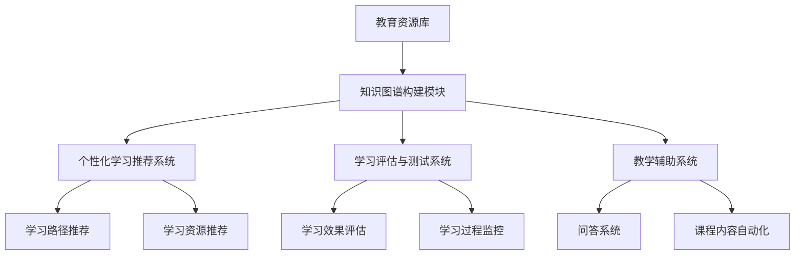

                 

### 第1章: 知识图谱概述

#### 1.1 知识图谱的定义与作用

**1.1.1 知识图谱的概念**

知识图谱（Knowledge Graph）是一种用于表示知识结构和关系的图形化数据模型，它将现实世界中的各种实体、属性和关系以图形的方式表示出来。这种表示方法不仅能够直观地展示知识的结构和联系，还能够实现高效的查询和推理。

知识图谱的概念最早由Google在2012年提出，并用于搜索引擎的优化。知识图谱通过将互联网上的大量信息进行结构化处理，形成一个庞大的、多维度的知识网络，从而实现更加精准、智能的信息检索和推荐。

**1.1.2 知识图谱在智能教育中的作用**

在智能教育系统中，知识图谱发挥着重要的作用。它不仅可以用于教育资源的组织与管理，还能够支持个性化学习推荐、学习评估与测试、教学辅助系统等多个方面。

- **教育资源的组织与管理：** 知识图谱可以将海量的教育资源和知识点进行结构化表示，使得教育资源的查找和管理更加高效。
- **个性化学习推荐：** 通过对学习者的学习需求和知识水平进行分析，知识图谱可以推荐适合的学习资源和路径，提高学习效果。
- **学习评估与测试：** 知识图谱可以根据学习者的学习过程和知识掌握情况，进行实时评估和测试，从而发现学习者的薄弱环节。
- **教学辅助系统：** 知识图谱可以支持问答系统、课程内容的教学自动化等功能，为教师和学生提供更加智能化的教学服务。

#### 1.2 知识图谱的基本原理

**1.2.1 知识图谱的表示方法**

知识图谱的表示方法主要分为三种：结构化知识图谱、半结构化知识图谱和非结构化知识图谱。

- **结构化知识图谱：** 结构化知识图谱采用固定的数据模型来表示实体、属性和关系，如RDF（Resource Description Framework）和OWL（Web Ontology Language）等。
- **半结构化知识图谱：** 半结构化知识图谱采用树状结构或者图状结构来表示实体、属性和关系，如Neo4j等。
- **非结构化知识图谱：** 非结构化知识图谱采用自由文本或者自然语言处理技术来表示实体、属性和关系，如Word2Vec和BERT等。

**1.2.2 知识图谱的构建步骤**

知识图谱的构建通常包括以下步骤：

1. **数据收集与预处理：** 收集相关的数据源，如文本、图像、音频等，并进行预处理，如去除噪声、文本清洗等。
2. **实体识别与关系抽取：** 对预处理后的数据进行实体识别和关系抽取，确定实体和实体之间的关系。
3. **知识融合与图谱构建：** 将抽取出的实体和关系进行融合，构建出知识图谱。
4. **知识图谱的查询与推理：** 利用知识图谱的查询和推理算法，实现对知识的检索和推理。

#### 1.3 知识图谱的类型与应用领域

**1.3.1 结构化知识图谱**

结构化知识图谱主要用于表示和组织结构化的数据，如企业信息、产品信息等。它在搜索引擎、企业数据管理等领域有广泛的应用。

**1.3.2 半结构化知识图谱**

半结构化知识图谱主要用于表示和组织半结构化的数据，如社交网络、网络论坛等。它在社交网络分析、社区发现等领域有广泛的应用。

**1.3.3 非结构化知识图谱**

非结构化知识图谱主要用于表示和组织非结构化的数据，如文本、图像、音频等。它在自然语言处理、计算机视觉等领域有广泛的应用。

#### 1.4 知识图谱的发展历程与趋势

**1.4.1 知识图谱的发展历程**

知识图谱的发展历程可以分为三个阶段：

1. **第一阶段：基于规则的知识表示（1990s）：** 这一阶段的知识图谱主要采用基于规则的方法，通过人工定义规则来表示知识。
2. **第二阶段：基于本体论的知识表示（2000s）：** 这一阶段的知识图谱主要采用本体论的方法，通过定义本体来表示知识。
3. **第三阶段：基于数据驱动的知识表示（2010s-至今）：** 这一阶段的知识图谱主要采用数据驱动的方法，通过大规模数据分析和机器学习来表示知识。

**1.4.2 知识图谱的发展趋势**

知识图谱的发展趋势主要体现在以下几个方面：

1. **大数据与知识图谱的融合：** 随着大数据技术的发展，知识图谱将更加依赖于大规模数据进行分析和构建。
2. **人工智能与知识图谱的融合：** 人工智能技术，特别是深度学习技术，将进一步提高知识图谱的表示、查询和推理能力。
3. **跨领域的知识图谱构建：** 跨领域的知识图谱构建将有助于实现知识的整合和共享，促进跨领域的协同创新。

### 1.5 知识图谱的挑战与未来发展方向

尽管知识图谱在智能教育系统中具有广泛的应用前景，但其在实际应用过程中仍面临着一些挑战：

**1.5.1 数据质量：** 知识图谱的质量很大程度上取决于数据的质量，如何保证数据的一致性、准确性和完整性是一个重要问题。

**1.5.2 查询性能：** 随着知识图谱规模的扩大，如何保证查询的高性能是一个关键问题。

**1.5.3 安全与隐私：** 在知识图谱的应用过程中，如何保护用户的隐私和安全是一个重要问题。

针对这些挑战，未来的发展方向包括：

1. **数据治理与标准化：** 加强数据治理，制定统一的数据标准和规范，提高数据质量。
2. **分布式计算与存储：** 利用分布式计算和存储技术，提高知识图谱的查询性能。
3. **隐私保护与安全机制：** 引入隐私保护和安全机制，确保用户数据的隐私和安全。

#### 1.6 知识图谱在教育领域的应用前景

知识图谱在教育领域的应用前景十分广阔。通过构建教育领域的知识图谱，可以实现教育资源的智能化管理、个性化学习推荐、学习评估与测试、教学辅助等功能，从而提高教育质量和效率。未来，随着人工智能和大数据技术的发展，知识图谱将在教育领域发挥更加重要的作用。**[知识图谱在教育领域的架构图](#Knowledge-Graph-in-Education-Architecture- Diagram)**展示了知识图谱在教育系统中的关键应用场景和架构设计。

**知识图谱在教育领域的架构图**



通过上述架构设计，知识图谱能够充分发挥其在教育领域的优势，为教育系统带来智能化、个性化和高效化的变革。**[知识图谱在教育领域的应用实例](#Knowledge-Graph-in-Education-Application-Examples)**列举了知识图谱在教育领域中的一些具体应用实例，展示了知识图谱在教育系统中的实际效果。

**知识图谱在教育领域的应用实例**

```markdown
### 1. 知识图谱在教育资源的组织与管理中的应用

- **案例：** 利用知识图谱对学校课程资源进行结构化表示和管理，使得课程资源的查找和管理更加高效。

### 2. 知识图谱在个性化学习推荐中的应用

- **案例：** 根据学习者的学习需求和知识水平，利用知识图谱推荐适合的学习资源和路径。

### 3. 知识图谱在学习评估与测试中的应用

- **案例：** 通过对学习者的学习过程和知识掌握情况进行实时评估和测试，发现学习者的薄弱环节。

### 4. 知识图谱在教学辅助系统中的应用

- **案例：** 利用知识图谱构建智能问答系统和课程内容自动化系统，为教师和学生提供智能化的教学服务。
```

### 1.7 本章总结

本章对知识图谱进行了概述，包括其定义、作用、基本原理、类型与应用领域、发展历程与趋势以及挑战与未来发展方向。知识图谱在智能教育系统中具有广泛的应用前景，能够为教育系统带来智能化、个性化和高效化的变革。在下一章中，我们将深入探讨知识图谱的核心技术与算法，为构建和应用知识图谱奠定基础。

## 第2章: 知识图谱的核心技术与算法

#### 2.1 知识图谱表示与存储

**2.1.1 知识图谱的表示方法**

知识图谱的表示方法主要包括图论表示、属性图表示和知识库表示。

- **图论表示：** 图论表示是最常见的一种知识图谱表示方法。它将实体表示为节点，将关系表示为边，从而形成了一个图形化的数据结构。这种表示方法直观、易于理解和操作。

- **属性图表示：** 属性图表示是在图论表示的基础上引入了属性的概念。每个节点和边都可以具有属性，这些属性可以描述节点和边之间的详细信息。属性图表示更加细致和全面，适用于复杂关系和属性的描述。

- **知识库表示：** 知识库表示是将知识图谱表示为一系列规则和事实。这种表示方法通常采用逻辑语言（如RDF、OWL等）来定义实体、属性和关系。知识库表示适用于复杂的知识表示和推理。

**2.1.2 知识图谱的存储方案**

知识图谱的存储方案可以分为关系数据库存储、图数据库存储和混合存储。

- **关系数据库存储：** 关系数据库存储是将知识图谱存储在关系数据库中，使用SQL查询语言进行操作。关系数据库存储适用于小型知识图谱和简单的查询操作。

- **图数据库存储：** 图数据库存储是将知识图谱存储在图数据库中，使用图查询语言（如Gremlin、SPARQL等）进行操作。图数据库存储适用于大规模知识图谱和复杂的查询操作。

- **混合存储：** 混合存储是将关系数据库存储和图数据库存储结合起来，根据不同需求选择不同的存储方案。例如，可以将实体和关系存储在图数据库中，将属性存储在关系数据库中。混合存储适用于复杂的知识图谱和多样化的查询需求。

#### 2.2 知识图谱的构建算法

**2.2.1 数据收集与预处理**

数据收集与预处理是知识图谱构建的第一步，其目标是从各种数据源中提取有用的信息，并将其转换为适合构建知识图谱的形式。

- **数据收集：** 数据收集包括从互联网、数据库、文件系统等各种数据源中获取数据。常用的数据收集方法有网络爬虫、数据库连接、API调用等。

- **数据预处理：** 数据预处理包括数据清洗、数据去重、数据格式化等操作。数据清洗是为了去除数据中的噪声和错误，数据去重是为了避免重复数据，数据格式化是为了将数据转换为统一的格式，便于后续处理。

**2.2.2 实体识别与关系抽取**

实体识别与关系抽取是知识图谱构建的核心步骤，其目标是从原始数据中识别出实体和关系，并将它们表示为知识图谱中的节点和边。

- **实体识别：** 实体识别是指从原始数据中识别出具体的实体。常用的实体识别方法有基于规则的方法、基于统计的方法和基于机器学习的方法。

- **关系抽取：** 关系抽取是指从原始数据中识别出实体之间的关系。常用的关系抽取方法有基于规则的方法、基于统计的方法和基于机器学习的方法。

**2.2.3 知识融合与图谱构建**

知识融合与图谱构建是将识别出的实体和关系进行融合，构建出完整的知识图谱。

- **知识融合：** 知识融合是指将来自不同来源、不同格式的知识进行整合，形成一个统一的、一致的知识体系。知识融合的方法包括基于规则的融合、基于统计的融合和基于机器学习的融合。

- **图谱构建：** 图谱构建是指将融合后的实体和关系表示为图形化的知识图谱。图谱构建的方法包括基于图的构建方法和基于属性图的构建方法。

#### 2.3 知识图谱的查询与推理算法

**2.3.1 知识图谱的查询算法**

知识图谱的查询算法是指如何根据用户的需求，从知识图谱中检索出相关的信息。

- **图查询算法：** 图查询算法是指基于图的数据结构进行查询的算法。常用的图查询算法有BFS（广度优先搜索）、DFS（深度优先搜索）和A*搜索等。

- **路径查询算法：** 路径查询算法是指根据给定的起点和终点，查询它们之间的最短路径或最长路径。常用的路径查询算法有Dijkstra算法、A*算法和Floyd算法等。

- **属性查询算法：** 属性查询算法是指根据给定的属性条件，查询满足条件的实体和关系。常用的属性查询算法有过滤查询、聚合查询和连接查询等。

**2.3.2 知识图谱的推理算法**

知识图谱的推理算法是指如何根据已知的事实和规则，推导出新的结论。

- **基于规则的推理算法：** 基于规则的推理算法是指根据定义的规则，从已知的事实推导出新的结论。常用的推理算法有前向推理和后向推理。

- **基于模型的推理算法：** 基于模型的推理算法是指利用定义的模型，从已知的事实和模型推导出新的结论。常用的推理算法有隐马尔可夫模型（HMM）和贝叶斯网络等。

- **基于机器学习的推理算法：** 基于机器学习的推理算法是指利用机器学习的方法，从训练数据中学习出推理模型，然后利用该模型进行推理。常用的推理算法有深度学习、支持向量机等。

#### 2.4 知识图谱的优化算法

**2.4.1 数据压缩算法**

数据压缩算法是指如何减少知识图谱的数据量，提高存储和查询的效率。

- **基于图的压缩算法：** 基于图的压缩算法是指通过压缩图的结构来减少数据量。常用的压缩算法有图同构检测、图分解等。

- **基于属性的压缩算法：** 基于属性的压缩算法是指通过压缩属性的数据来减少数据量。常用的压缩算法有数据压缩编码、属性压缩存储等。

**2.4.2 查询优化算法**

查询优化算法是指如何提高查询的效率，减少查询的时间和资源消耗。

- **基于索引的优化算法：** 基于索引的优化算法是指利用索引结构来提高查询效率。常用的索引结构有B树、哈希索引等。

- **基于缓存优化算法：** 基于缓存优化算法是指利用缓存机制来提高查询效率。常用的缓存策略有LRU（最近最少使用）、LFU（最不常用）等。

- **基于并行优化的算法：** 基于并行优化的算法是指利用并行计算来提高查询效率。常用的并行优化算法有MapReduce、并行图处理等。

**2.4.3 推理优化算法**

推理优化算法是指如何提高推理的效率，减少推理的时间和资源消耗。

- **基于规则的优化算法：** 基于规则的优化算法是指通过优化规则的表达式和逻辑结构来提高推理效率。常用的优化算法有规则简化、规则合并等。

- **基于模型的优化算法：** 基于模型的优化算法是指利用定义的模型来优化推理过程。常用的优化算法有模型压缩、模型合并等。

- **基于机器学习的优化算法：** 基于机器学习的优化算法是指利用机器学习的方法来优化推理过程。常用的优化算法有深度学习优化、支持向量机优化等。

#### 2.5 本章总结

本章介绍了知识图谱的核心技术与算法，包括知识图谱的表示与存储、知识图谱的构建算法、知识图谱的查询与推理算法以及知识图谱的优化算法。这些技术和算法为知识图谱的构建和应用提供了重要的基础。在下一章中，我们将探讨知识图谱在智能教育系统中的应用，展示其在教育领域的实际效果和价值。

### 第3章: 知识图谱在智能教育中的应用

#### 3.1 知识图谱在教育资源的组织与管理中的应用

知识图谱在教育资源的组织与管理中发挥着重要作用。通过知识图谱，教育机构可以将海量的教育资源和知识点进行结构化表示，使得资源的查找和管理更加高效。以下是知识图谱在教育资源组织与管理中的应用：

**3.1.1 教育资源的结构化表示**

教育资源的结构化表示是指利用知识图谱将教育资源的属性、关系和分类信息进行结构化表示。例如，可以将课程、教材、教学视频、课件等教育资源作为实体，表示为知识图谱中的节点；将资源之间的关联关系（如课程与教材的关联、教材与教学视频的关联等）表示为知识图谱中的边。

- **实体表示：** 实体表示是知识图谱构建的基础。在教育资源中，实体可以包括课程、教材、教学视频、课件等。例如，一个“计算机科学”课程可以表示为一个实体，其属性包括课程名称、课程代码、授课教师、授课时间等。

- **关系表示：** 关系表示描述实体之间的关系。在教育资源中，关系可以包括课程与教材的关联关系、教材与教学视频的关联关系等。例如，一个“计算机科学”课程可能关联到一本特定的教材，这个关联关系可以表示为知识图谱中的一个边。

- **分类表示：** 分类表示用于对教育资源进行分类和组织。例如，可以将教育资源按照学科、年级、难度等级等维度进行分类，从而方便用户查找和使用。

**3.1.2 教育资源的动态更新与维护**

知识图谱支持教育资源的动态更新与维护，可以确保教育资源的实时性和准确性。具体应用场景包括：

- **资源更新：** 当教育资源的属性或关系发生变化时，可以通过知识图谱进行动态更新。例如，当某本教材的内容更新时，可以更新知识图谱中对应的实体和关系，确保资源库中的数据是最新的。

- **资源维护：** 通过知识图谱，可以实现对教育资源的维护和管理。例如，可以监控教育资源的使用情况，定期检查资源的可用性，对损坏或过时的资源进行更新或替换。

**3.1.3 教育资源的推荐与检索**

知识图谱在教育资源的推荐与检索中具有显著优势。通过分析用户的学习需求和历史记录，知识图谱可以推荐适合的教育资源，并支持用户对资源进行高效检索。

- **资源推荐：** 知识图谱可以根据用户的学习需求和知识水平，推荐适合的教育资源。例如，当用户学习“计算机科学”课程时，知识图谱可以推荐相关的教材、教学视频、课件等资源。

- **资源检索：** 知识图谱支持基于关键词、属性、关系等多种维度的资源检索。例如，用户可以输入关键词“计算机科学”，知识图谱会返回与该关键词相关的所有课程、教材、教学视频等资源。

**案例研究：**

以某大学为例，该大学利用知识图谱对课程资源进行组织与管理。具体应用场景包括：

- **课程资源管理：** 大学将所有课程资源（如课程大纲、教材、教学视频、课件等）构建成知识图谱，实现对资源的结构化表示和管理。

- **课程资源推荐：** 根据学生选课记录、学习进度和学习偏好，知识图谱为学生推荐适合的课程资源，提高学习效果。

- **课程资源检索：** 学生可以通过知识图谱快速查找所需的课程资源，提高学习效率。

通过知识图谱在教育资源的组织与管理中的应用，教育机构能够更加高效地管理和利用教育资源，提高教育质量。

#### 3.2 知识图谱在个性化学习推荐中的应用

个性化学习推荐是智能教育系统中的一项重要功能，通过分析学习者的学习需求和知识水平，推荐适合的学习资源和路径，从而提高学习效果。知识图谱在个性化学习推荐中发挥着关键作用，具体应用包括以下几个方面：

**3.2.1 学习需求的深度分析**

学习需求的深度分析是指通过对学习者的学习行为、历史记录和偏好进行分析，了解其学习需求和兴趣点。知识图谱可以存储和学习者的学习路径、学习时间、学习偏好等数据，从而实现学习需求的深度分析。

- **学习路径分析：** 通过分析学习者的学习路径，知识图谱可以了解其学习顺序和重点。例如，如果一个学生在学习“计算机科学”课程时，首先学习了“数据结构”，然后学习了“算法”，这表明学生对数据结构和算法有较强的兴趣。

- **学习偏好分析：** 通过分析学习者的学习偏好，知识图谱可以了解其对学习资源的偏好类型。例如，如果一个学生喜欢通过视频学习，那么知识图谱会推荐更多的视频课程。

**3.2.2 个性化学习路径的推荐**

个性化学习路径的推荐是指根据学习者的学习需求和兴趣点，推荐适合的学习路径和资源。知识图谱可以通过以下方式实现个性化学习路径的推荐：

- **基于内容的推荐：** 基于内容的推荐是指根据学习者的兴趣和需求，推荐与其当前学习内容相关的资源。例如，如果一个学生正在学习“数据结构”，知识图谱会推荐“算法分析”等相关课程。

- **基于协同过滤的推荐：** 基于协同过滤的推荐是指根据学习者的历史行为和偏好，推荐其他学习者的学习路径和资源。例如，如果一个学生喜欢某个教师的授课风格，知识图谱会推荐该教师的其他课程。

- **基于知识图谱的推荐：** 基于知识图谱的推荐是指利用知识图谱中的关系和属性，推荐与学习者需求相关的学习路径和资源。例如，如果一个学生希望学习“计算机科学”课程，知识图谱会推荐与其课程相关的教材、教学视频等资源。

**3.2.3 个性化学习资源的推荐**

个性化学习资源的推荐是指根据学习者的学习需求和兴趣点，推荐适合的学习资源。知识图谱可以通过以下方式实现个性化学习资源的推荐：

- **基于标签的推荐：** 基于标签的推荐是指根据学习资源的标签和属性，推荐与学习者需求相关的资源。例如，如果一个学生希望学习“机器学习”，知识图谱会推荐带有“机器学习”标签的资源。

- **基于相似性的推荐：** 基于相似性的推荐是指根据学习资源的相似度，推荐与学习者需求相关的资源。例如，如果一个学生正在学习某本教材，知识图谱会推荐与其内容相似的其他教材。

- **基于知识图谱的推荐：** 基于知识图谱的推荐是指利用知识图谱中的关系和属性，推荐与学习者需求相关的资源。例如，如果一个学生希望学习“机器学习”，知识图谱会推荐与“机器学习”相关的课程、教材、教学视频等资源。

**案例研究：**

以某在线教育平台为例，该平台利用知识图谱实现个性化学习推荐。具体应用场景包括：

- **学习需求分析：** 平台通过分析用户的学习行为、历史记录和偏好，构建用户的知识图谱，了解其学习需求和兴趣点。

- **个性化学习路径推荐：** 根据用户的知识图谱和学习需求，平台推荐适合的学习路径和资源。例如，对于一名计算机专业的学生，平台会推荐“数据结构”、“算法分析”、“数据库原理”等课程。

- **个性化学习资源推荐：** 平台根据用户的知识图谱和学习需求，推荐适合的学习资源。例如，对于一名正在学习“数据结构”的学生，平台会推荐相关教材、教学视频、习题集等资源。

通过知识图谱在个性化学习推荐中的应用，教育平台能够为学习者提供更加个性化的学习体验，提高学习效果。

#### 3.3 知识图谱在学习评估与测试中的应用

知识图谱在学习评估与测试中具有重要作用，可以实现对学习过程的实时监控和评估，从而帮助学习者发现自身的不足和改进方向。以下是知识图谱在学习评估与测试中的应用：

**3.3.1 学习效果的实时评估**

学习效果的实时评估是指通过分析学习者在学习过程中的行为和表现，实时评估其学习效果。知识图谱可以通过以下方式实现实时评估：

- **学习进度分析：** 通过分析学习者的学习进度，知识图谱可以了解其学习完成情况。例如，如果一个学生已经完成了80%的“数据结构”课程，知识图谱会评估其学习进度。

- **学习行为分析：** 通过分析学习者的学习行为，知识图谱可以了解其学习方式和方法。例如，如果一个学生更喜欢通过视频学习，知识图谱会评估其学习方式。

- **学习效果分析：** 通过分析学习者的学习结果，知识图谱可以评估其学习效果。例如，如果一个学生在测试中获得了90%的正确率，知识图谱会评估其学习效果。

**3.3.2 学习过程的可视化分析**

学习过程的可视化分析是指通过图形化的方式展示学习者的学习过程和表现。知识图谱可以通过以下方式实现可视化分析：

- **学习路径图：** 通过展示学习者的学习路径，知识图谱可以直观地展示其学习过程。例如，一个学生从“数据结构”学到“算法分析”的过程可以以图的形式展示。

- **知识点覆盖率图：** 通过展示学习者对知识点的掌握情况，知识图谱可以直观地展示其学习效果。例如，一个学生掌握了80%的“数据结构”知识点，知识图谱会以图的形式展示。

- **学习效果曲线：** 通过展示学习者的学习效果随时间的变化，知识图谱可以直观地展示其学习趋势。例如，一个学生的学习效果从开始学习的第1周逐渐上升，知识图谱会以曲线的形式展示。

**3.3.3 学习评估与测试的个性化定制**

知识图谱可以通过个性化定制的方式，为学习者提供个性化的评估和测试。具体应用包括：

- **知识点测试：** 通过知识图谱，可以为学习者定制与其学习进度和知识点掌握情况相关的测试。例如，如果一个学生在“数据结构”课程中掌握了70%的知识点，知识图谱会为其定制70%的知识点测试。

- **能力评估：** 通过知识图谱，可以为学习者评估其学习能力和水平。例如，如果一个学生在“算法分析”课程中表现出色，知识图谱会评估其算法分析能力。

- **学习计划定制：** 通过知识图谱，可以为学习者定制个性化的学习计划。例如，如果一个学生在学习过程中存在薄弱环节，知识图谱会为其定制针对性的学习计划，帮助其提高学习效果。

**案例研究：**

以某在线教育平台为例，该平台利用知识图谱实现学习评估与测试。具体应用场景包括：

- **实时评估：** 平台通过分析用户的学习行为和结果，实时评估其学习效果。例如，如果一个学生在测试中获得了90%的正确率，平台会评估其学习效果并反馈给用户。

- **可视化分析：** 平台通过展示用户的学习路径和知识点覆盖率图，直观地展示其学习过程和效果。例如，一个学生的学习路径和学习效果曲线会以图的形式展示。

- **个性化定制：** 平台根据用户的学习情况和需求，为用户定制个性化的评估和测试。例如，如果一个学生存在薄弱环节，平台会为其定制针对性的测试和计划。

通过知识图谱在学习评估与测试中的应用，教育平台能够为学习者提供更加全面和个性化的学习体验，帮助其提高学习效果。

#### 3.4 知识图谱在教学辅助系统中的应用

知识图谱在教学辅助系统中的应用可以帮助教师和学生更加高效地完成教学任务，提高教学质量。以下是知识图谱在教学辅助系统中的应用：

**3.4.1 问答系统的设计与实现**

问答系统是教学辅助系统中的重要组成部分，可以帮助教师和学生快速获取所需信息。知识图谱可以支持问答系统的设计与实现，具体包括以下几个方面：

- **知识图谱构建：** 通过知识图谱，可以将教育领域的知识进行结构化表示，为问答系统提供丰富的知识库。例如，可以构建一个包含课程内容、教材、教学视频、习题等知识的知识图谱。

- **自然语言处理：** 利用自然语言处理技术，可以将用户的问题转换为知识图谱中的查询语句，从而实现对知识图谱的查询。例如，可以将用户的问题转换为“什么是数据结构？”这样的查询语句。

- **查询与推理：** 通过查询和推理算法，可以从知识图谱中检索出与用户问题相关的信息，并给出答案。例如，知识图谱可以回答用户关于“数据结构”的问题，并提供相关的学习资源和知识点链接。

**3.4.2 课程内容的教学自动化**

课程内容的教学自动化是指利用知识图谱将课程内容进行结构化表示，并实现自动化教学。具体包括以下几个方面：

- **课程内容结构化：** 通过知识图谱，可以将课程内容进行结构化表示，形成知识图谱中的知识点网络。例如，可以将“数据结构”课程的每个知识点表示为知识图谱中的一个节点，并描述知识点之间的关系。

- **自动化教学设计：** 利用知识图谱，可以为每个知识点设计相应的教学活动，如讲解视频、习题练习、案例分析等。例如，针对“数据结构”课程中的“链表”知识点，可以设计相应的视频讲解、习题练习和案例分析。

- **自动化教学执行：** 利用知识图谱，可以自动化执行教学活动，并根据学习者的反馈进行调整。例如，根据学习者的学习进度和表现，知识图谱可以自动调整教学内容的难易程度，提供个性化的教学服务。

**3.4.3 教学辅助工具的集成**

知识图谱可以支持教学辅助工具的集成，为教师和学生提供一站式的教学服务。具体包括以下几个方面：

- **教学工具集成：** 通过知识图谱，可以将各种教学工具（如在线课件、教学视频、习题库等）进行集成，为教师和学生提供便捷的教学资源。例如，可以将在线课件、教学视频、习题库等知识图谱中的节点，链接到相应的教学工具中。

- **个性化推荐：** 利用知识图谱，可以为教师和学生推荐合适的教学工具和资源。例如，根据教师的教学需求和学生的学习进度，知识图谱可以推荐相应的教学工具和资源。

- **教学数据分析：** 通过知识图谱，可以分析教师和学生的学习数据，为教学决策提供支持。例如，可以分析学生的学习行为和效果，为教师提供教学改进的建议。

**案例研究：**

以某在线教育平台为例，该平台利用知识图谱实现教学辅助系统的设计与实现。具体应用场景包括：

- **问答系统：** 平台通过知识图谱构建教育领域的知识库，支持自动问答功能。教师和学生可以通过平台提出问题，平台利用知识图谱进行查询和推理，给出相关答案。

- **课程内容自动化：** 平台利用知识图谱对课程内容进行结构化表示，并实现自动化教学。例如，针对“数据结构”课程，平台可以设计相应的视频讲解、习题练习和案例分析，并根据学习者的反馈进行个性化调整。

- **教学工具集成：** 平台将各种教学工具进行集成，提供一站式的教学服务。教师和学生可以通过平台获取教学资源、进行教学互动，并获取个性化的学习推荐。

通过知识图谱在教学辅助系统中的应用，教育平台能够为教师和学生提供更加智能化的教学服务，提高教学质量和学习效果。

### 3.5 本章总结

本章介绍了知识图谱在智能教育系统中的多种应用，包括教育资源的组织与管理、个性化学习推荐、学习评估与测试、教学辅助系统等。知识图谱通过结构化表示、动态更新、个性化推荐等技术手段，为教育系统带来了智能化、个性化和高效化的变革。在下一章中，我们将探讨知识图谱在智能教育系统中的构建方法，为实际应用提供技术指导。

### 第4章: 知识图谱在智能教育系统中的构建方法

知识图谱在智能教育系统中的应用效果显著，但要实现这些应用，需要科学、系统的构建方法。本章将详细介绍知识图谱在智能教育系统中的构建方法，包括系统设计、知识图谱构建流程、工具选择以及系统实施与优化。

#### 4.1 智能教育系统的设计与架构

**4.1.1 智能教育系统的整体设计**

智能教育系统的整体设计需要考虑系统的功能需求、性能需求、安全性和可扩展性等因素。以下是智能教育系统的整体设计框架：

1. **用户层：** 用户层包括学生、教师、教育管理者等，他们通过系统界面进行操作，获取教育资源、学习推荐、评估反馈等。

2. **功能层：** 功能层包括教育资源的组织与管理、个性化学习推荐、学习评估与测试、教学辅助等功能模块。这些功能模块通过知识图谱实现数据关联和业务逻辑处理。

3. **数据层：** 数据层包括数据存储和管理，主要包括教育资源的结构化数据、用户行为数据、评估数据等。知识图谱作为数据层的重要组成部分，存储和管理结构化知识数据。

4. **技术层：** 技术层包括知识图谱的表示与存储、构建算法、查询与推理算法、优化算法等核心技术。这些技术为知识图谱在智能教育系统中的应用提供支持。

5. **接口层：** 接口层包括与外部系统的接口，如学校信息系统、教务系统、学习管理系统等。通过接口层，可以实现与其他系统的数据交换和功能集成。

**4.1.2 知识图谱在系统架构中的作用**

知识图谱在智能教育系统架构中发挥着核心作用，主要包括：

- **数据关联：** 通过知识图谱，可以将教育资源的各种属性和关系进行关联，形成一个统一的知识体系，便于数据的查询和推理。

- **业务逻辑处理：** 知识图谱支持复杂的业务逻辑处理，如个性化学习推荐、学习评估与测试等，通过图计算算法实现业务逻辑的自动化处理。

- **智能化服务：** 知识图谱支持智能化服务，如问答系统、课程内容自动化等，通过自然语言处理和知识图谱技术实现智能化服务。

#### 4.2 知识图谱的构建流程

知识图谱的构建是一个复杂的过程，需要从数据收集与预处理、实体识别与关系抽取、知识融合与图谱构建、知识图谱的查询与推理等环节进行系统设计。以下是知识图谱的构建流程：

**4.2.1 数据收集与预处理**

数据收集与预处理是知识图谱构建的第一步，其目标是获取和整理有用的数据。

- **数据来源：** 数据来源包括公开数据集、学校信息系统、学习管理系统、教师和学生提供的结构化数据、非结构化数据（如文本、图像、音频等）等。

- **数据类型：** 数据类型包括结构化数据（如RDF、OWL等）、非结构化数据（如文本、图像、音频等）。

- **数据预处理：** 数据预处理包括数据清洗、数据去重、数据格式化等。对于结构化数据，需要进行数据转换和格式化，如将XML转换为RDF；对于非结构化数据，需要进行文本预处理、图像预处理等。

**4.2.2 实体识别与关系抽取**

实体识别与关系抽取是知识图谱构建的核心步骤，其目标是识别出数据中的实体和关系，并将其表示为知识图谱中的节点和边。

- **实体识别：** 实体识别是指从原始数据中识别出具体的实体。常用的方法包括基于规则的方法、基于统计的方法和基于机器学习的方法。

- **关系抽取：** 关系抽取是指从原始数据中识别出实体之间的关系。常用的方法包括基于规则的方法、基于统计的方法和基于机器学习的方法。

**4.2.3 知识融合与图谱构建**

知识融合与图谱构建是将识别出的实体和关系进行融合，构建出完整的知识图谱。

- **知识融合：** 知识融合是指将来自不同来源、不同格式的知识进行整合，形成一个统一的知识体系。常用的方法包括基于规则的融合、基于统计的融合和基于机器学习的融合。

- **图谱构建：** 图谱构建是指将融合后的实体和关系表示为图形化的知识图谱。常用的方法包括基于图的构建方法和基于属性图的构建方法。

**4.2.4 知识图谱的查询与推理**

知识图谱的查询与推理是指如何根据用户的需求，从知识图谱中检索出相关的信息，并推导出新的结论。

- **查询算法：** 查询算法是指如何从知识图谱中检索出相关的信息。常用的查询算法包括基于图的查询算法、基于路径的查询算法等。

- **推理算法：** 推理算法是指如何根据已知的事实和规则，推导出新的结论。常用的推理算法包括基于规则的推理算法、基于模型的推理算法等。

#### 4.3 知识图谱构建流程示例

以下是一个知识图谱构建流程的示例，展示了从数据收集与预处理到知识图谱构建的全过程：

1. **数据收集：** 从学校信息系统、学习管理系统、公开数据集等渠道收集教育数据。

2. **数据预处理：** 对收集到的数据进行分析，删除重复和错误的数据，进行数据格式化。

3. **实体识别：** 利用自然语言处理技术，从文本数据中识别出实体，如学生、课程、教师等。

4. **关系抽取：** 从文本数据中抽取实体之间的关系，如学生选修课程、教师授课等。

5. **知识融合：** 将来自不同数据源的实体和关系进行整合，形成一个统一的知识体系。

6. **图谱构建：** 利用图数据库，将融合后的实体和关系表示为知识图谱。

7. **查询与推理：** 根据用户的需求，从知识图谱中检索出相关的信息，并进行推理。

#### 4.4 知识图谱构建工具

知识图谱构建过程中需要使用多种工具，以下是一些常用的知识图谱构建工具：

- **OpenKG：** OpenKG是一个开源的知识图谱构建工具，支持知识图谱的表示、存储、查询和推理等功能。

- **Neo4j：** Neo4j是一个图数据库，支持知识图谱的存储和查询。它提供了一个强大的图查询语言（Cypher），方便用户进行知识图谱的构建和查询。

- **JanusGraph：** JanusGraph是一个开源的分布式图数据库，支持大规模知识图谱的存储和查询。它具有高扩展性和高性能，适合构建大规模的知识图谱。

- **Stardog：** Stardog是一个图数据库和知识图谱平台，提供知识图谱的构建、存储、查询和推理等功能。

- **AllegroGraph：** AllegroGraph是一个图数据库和知识图谱平台，支持大规模知识图谱的构建、存储、查询和推理。它具有丰富的功能和高效的性能，适合构建复杂的知识图谱。

#### 4.5 智能教育系统的实施与优化

知识图谱在智能教育系统中的应用需要经过实施和优化过程，以下是一些实施和优化的建议：

**4.5.1 实施流程**

- **需求分析：** 分析智能教育系统的需求，明确知识图谱的应用场景和功能。

- **系统设计：** 设计智能教育系统的整体架构，包括知识图谱的设计、数据存储和查询方案等。

- **知识图谱构建：** 构建知识图谱，包括数据收集、预处理、实体识别、关系抽取、知识融合和图谱构建等步骤。

- **系统集成：** 将知识图谱集成到智能教育系统中，实现与用户界面、数据库、外部系统的数据交换和功能集成。

- **测试与部署：** 进行系统测试，确保知识图谱的应用效果和系统稳定性，然后部署到生产环境。

**4.5.2 优化策略**

- **查询优化：** 针对知识图谱的查询需求，优化查询算法和查询路径，提高查询效率。

- **存储优化：** 针对知识图谱的存储需求，优化存储结构，提高存储效率和数据访问速度。

- **推理优化：** 针对知识图谱的推理需求，优化推理算法和推理路径，提高推理效率和准确性。

- **性能优化：** 针对系统的性能需求，优化系统的硬件配置、网络架构和软件算法，提高系统性能。

#### 4.6 智能教育系统的案例研究

以下是一个智能教育系统的案例研究，展示了知识图谱在智能教育系统中的构建与应用：

**案例背景与目标**

某在线教育平台希望通过构建知识图谱，实现教育资源的结构化表示、个性化学习推荐、学习评估与测试等功能，提高教育质量和用户体验。

**案例实施过程**

1. **需求分析：** 分析教育平台的用户需求，明确知识图谱的应用场景和功能。

2. **系统设计：** 设计智能教育系统的整体架构，包括知识图谱的设计、数据存储和查询方案等。

3. **知识图谱构建：** 构建知识图谱，包括数据收集、预处理、实体识别、关系抽取、知识融合和图谱构建等步骤。

   - 数据收集：从公开数据集、学校信息系统、学习管理系统等渠道收集教育数据。

   - 数据预处理：对收集到的数据进行清洗、去重、格式化等处理。

   - 实体识别：利用自然语言处理技术，从文本数据中识别出实体，如学生、课程、教师等。

   - 关系抽取：从文本数据中抽取实体之间的关系，如学生选修课程、教师授课等。

   - 知识融合：将来自不同数据源的实体和关系进行整合，形成一个统一的知识体系。

   - 图谱构建：利用图数据库，将融合后的实体和关系表示为知识图谱。

4. **系统集成：** 将知识图谱集成到教育平台中，实现与用户界面、数据库、外部系统的数据交换和功能集成。

5. **测试与部署：** 进行系统测试，确保知识图谱的应用效果和系统稳定性，然后部署到生产环境。

**案例效果评估**

1. **教育资源管理：** 通过知识图谱，教育平台实现了教育资源的结构化表示，方便用户查找和使用。

2. **个性化学习推荐：** 通过知识图谱，教育平台实现了个性化学习推荐，提高了学习效果和用户体验。

3. **学习评估与测试：** 通过知识图谱，教育平台实现了学习评估与测试，帮助学习者发现自身的不足和改进方向。

4. **教学辅助系统：** 通过知识图谱，教育平台实现了教学辅助系统的设计与实现，为教师和学生提供了便捷的教学服务。

通过本案例研究，可以看出知识图谱在智能教育系统中的构建与应用具有重要意义，有助于提高教育质量和用户体验。

### 4.7 本章总结

本章介绍了知识图谱在智能教育系统中的构建方法，包括系统设计、知识图谱构建流程、工具选择以及系统实施与优化。通过本章的内容，读者可以了解到知识图谱在智能教育系统中的构建过程和关键环节，为实际应用提供技术指导。在下一章中，我们将探讨知识图谱在智能教育系统中的应用挑战与解决方案，进一步深入探讨知识图谱在教育领域的未来发展。

### 第5章: 知识图谱在智能教育系统中的应用挑战与解决方案

尽管知识图谱在智能教育系统中具有巨大的潜力，但其实际应用过程中仍面临诸多挑战。本章将重点讨论知识图谱在智能教育系统中应用过程中遇到的数据质量问题、性能优化挑战、安全与隐私问题以及伦理问题，并提出相应的解决方案。

#### 5.1 知识图谱数据质量问题的挑战

**5.1.1 数据不完整**

数据不完整是指知识图谱中存在缺失的数据，这可能导致推理和查询的结果不准确。例如，如果学生信息中的课程成绩数据缺失，那么基于这些数据的推荐和学习评估可能会产生偏差。

**解决方案：**

- **数据补全技术：** 利用数据补全技术，如数据插值、迁移学习、聚类等方法，来填补缺失的数据。例如，可以利用学生的历史学习行为数据来预测其可能缺失的成绩。

- **用户参与：** 鼓励用户参与数据补全，通过用户反馈和修正，提高知识图谱数据的完整性。

**5.1.2 数据不一致**

数据不一致是指不同来源的数据之间存在冲突和矛盾，例如，学生信息系统中可能记录了两个不同的联系方式。这种不一致性会影响知识图谱的准确性和一致性。

**解决方案：**

- **数据清洗和标准化：** 通过数据清洗和标准化，统一数据格式和定义，减少数据不一致性。

- **数据版本管理：** 实施数据版本管理，记录数据的来源和变更历史，确保数据的一致性。

**5.1.3 数据准确性问题**

数据准确性问题是指知识图谱中的数据可能存在错误或偏差，这可能导致错误的推理和查询结果。例如，课程描述中的知识点可能不准确。

**解决方案：**

- **数据验证和校验：** 实施数据验证和校验机制，确保数据输入的正确性。

- **人工审核：** 对关键数据进行人工审核，确保数据的准确性。

**5.1.4 数据更新与维护**

知识图谱需要定期更新和维护，否则数据会逐渐过时。例如，课程内容可能会更新，教师的信息可能需要修改。

**解决方案：**

- **自动化更新机制：** 实施自动化更新机制，定期从源数据中获取最新信息。

- **持续维护：** 设立专门的数据维护团队，负责知识图谱的更新和维护。

#### 5.2 知识图谱在智能教育系统中的性能优化挑战

**5.2.1 大规模数据的查询性能**

随着教育数据的规模不断扩大，查询性能成为一个关键问题。例如，当知识图谱包含数十亿个节点和边时，简单的查询可能会变得非常缓慢。

**解决方案：**

- **分布式计算：** 利用分布式计算框架，如MapReduce、Spark等，来处理大规模数据的查询。

- **索引优化：** 利用索引技术，如B树索引、哈希索引等，来提高查询效率。

**5.2.2 实时性的挑战**

在智能教育系统中，实时性是一个重要的需求。例如，学生提交作业后需要立即获得评分和反馈。然而，知识图谱的实时查询和推理可能面临性能挑战。

**解决方案：**

- **内存计算：** 利用内存计算技术，如内存数据库、缓存等，来提高数据访问速度。

- **流处理：** 利用流处理框架，如Apache Kafka、Apache Flink等，来处理实时数据流。

**5.2.3 能效优化**

随着知识图谱规模的扩大，系统的能效优化成为一个重要问题。例如，大规模的知识图谱存储和查询可能消耗大量的计算资源。

**解决方案：**

- **硬件优化：** 选择高效的硬件设备，如SSD存储、GPU计算等，来提高系统性能。

- **能耗管理：** 实施能耗管理策略，如智能调度、节能模式等，来降低系统的能耗。

#### 5.3 知识图谱的安全与隐私问题

**5.3.1 数据隐私保护**

在知识图谱的应用过程中，学生和教师的个人信息可能会被暴露，从而导致隐私泄露。

**解决方案：**

- **数据加密：** 对敏感数据实施加密，确保数据在传输和存储过程中安全。

- **访问控制：** 实施严格的访问控制策略，确保只有授权用户才能访问特定数据。

**5.3.2 知识图谱的访问控制**

知识图谱的访问控制是指如何确保知识图谱中的数据只能被授权用户访问。

**解决方案：**

- **角色访问控制：** 根据用户的角色和权限，设置不同的访问控制策略。

- **权限管理：** 实施权限管理机制，确保用户只能访问其权限范围内的数据。

**5.3.3 恶意攻击防范**

知识图谱可能会受到恶意攻击，如注入攻击、拒绝服务攻击等。

**解决方案：**

- **防火墙和安全审计：** 设置防火墙和实施安全审计，监控并防范恶意攻击。

- **入侵检测系统：** 实施入侵检测系统，及时发现并响应恶意攻击。

#### 5.4 知识图谱在智能教育系统中的伦理问题

**5.4.1 数据伦理**

数据伦理是指如何在知识图谱的应用过程中保护用户的隐私权和数据权利。

**解决方案：**

- **用户知情同意：** 确保用户在数据收集和使用过程中知情并同意。

- **透明度：** 提高系统的透明度，让用户了解数据如何被收集、存储和使用。

**5.4.2 学习行为监控与评价**

知识图谱可能会用于监控和评价学生的学习行为，这可能导致隐私侵犯和学习自由受限。

**解决方案：**

- **最小化监控：** 仅监控必要的学习行为，避免过度监控。

- **数据保护：** 对学习行为数据进行加密和保护，确保用户隐私。

**5.4.3 教育公平与个性化**

知识图谱的个性化学习推荐可能会加剧教育不平等，因为资源推荐可能受到用户背景和偏好的影响。

**解决方案：**

- **公平算法：** 设计公平的推荐算法，确保所有用户都能获得公正的资源推荐。

- **多样化推荐：** 提供多样化的推荐，让用户选择适合自己的学习资源。

#### 5.5 本章总结

本章讨论了知识图谱在智能教育系统中应用过程中遇到的数据质量、性能优化、安全与隐私以及伦理问题，并提出了相应的解决方案。通过解决这些挑战，知识图谱在智能教育系统中的应用将更加广泛和有效。在下一章中，我们将探讨知识图谱在智能教育系统中的创新应用，展示其在教育领域的新兴趋势。

### 第6章: 智能教育系统中知识图谱的创新应用

随着知识图谱技术的不断发展，其在智能教育系统中的应用也在不断创新，带来了教育领域的新兴趋势。本章将介绍知识图谱在教育游戏、教育资源共享与协同以及跨学科知识融合等领域的创新应用。

#### 6.1 知识图谱在教育游戏中的应用

教育游戏是一种结合游戏元素的教育形式，通过游戏化的方式激发学生的学习兴趣和积极性。知识图谱在教育游戏中的应用主要体现在以下几个方面：

**6.1.1 教育游戏的设计与开发**

知识图谱可以用于教育游戏的设计和开发，帮助创建更加丰富和交互性的学习体验。通过知识图谱，教育游戏可以表示和存储课程内容、游戏规则、玩家行为等信息。

- **动态场景生成：** 知识图谱可以根据学习者的行为和课程进度，动态生成游戏场景。例如，当学习者完成某个学习任务后，知识图谱可以触发新的游戏场景，引导学习者继续学习。

- **个性化任务推荐：** 知识图谱可以根据学习者的兴趣和知识水平，推荐个性化的游戏任务。例如，如果一个学生擅长数学，知识图谱可以推荐更多与数学相关的游戏任务。

**6.1.2 知识图谱在游戏中的应用场景**

知识图谱在教育游戏中的应用场景包括：

- **知识点复习：** 通过游戏化的方式，帮助学习者复习和巩固知识点。例如，可以设计一个答题游戏，让学习者在游戏中回答与课程相关的问题。

- **跨学科融合：** 将不同学科的知识点融入到游戏中，促进跨学科的学习。例如，可以设计一个科学探险游戏，让学习者在游戏中学习物理、化学、生物等学科知识。

- **学习效果评估：** 通过游戏中的行为数据，对学习者的学习效果进行实时评估。例如，可以分析学习者在游戏中的答题正确率、游戏时间等指标，评估其学习效果。

**6.1.3 教育游戏的评估与优化**

知识图谱可以用于教育游戏的评估和优化，通过分析游戏数据，了解学习者的学习行为和反馈，优化游戏设计和教学内容。具体包括：

- **学习行为分析：** 分析学习者在游戏中的行为，了解其学习兴趣和难点。例如，可以分析学习者玩游戏的时间、答题正确率等指标。

- **游戏效果评估：** 评估教育游戏对学习效果的提升情况。例如，通过对比实验组与对照组的学习成绩，评估游戏对学习效果的影响。

- **游戏内容优化：** 根据学习者的反馈和评估结果，优化游戏的内容和设计。例如，可以调整游戏难度、增加互动元素等，提高游戏的学习效果。

#### 6.2 知识图谱在教育资源共享与协同中的作用

知识图谱在教育资源共享与协同中发挥着重要作用，可以促进教育资源的整合和共享，提高教育资源的利用效率。

**6.2.1 教育资源共享平台的设计**

知识图谱可以用于设计教育资源共享平台，实现教育资源的结构化表示和共享。具体包括：

- **资源分类与标签：** 利用知识图谱对教育资源进行分类和标签，方便用户查找和浏览。例如，可以将教育资源按照学科、年级、难度等级等维度进行分类。

- **资源推荐：** 利用知识图谱进行资源推荐，根据用户的需求和偏好，推荐相关的教育资源。例如，当用户搜索“高中物理”时，知识图谱可以推荐相关的课程、教材、教学视频等资源。

**6.2.2 知识图谱在资源共享与协同中的优势**

知识图谱在教育资源共享与协同中的优势包括：

- **跨平台整合：** 知识图谱可以将不同平台的教育资源进行整合，实现资源的跨平台共享。例如，可以将学校内部资源与在线开放课程资源进行整合，提供丰富的学习资源。

- **动态更新与维护：** 知识图谱支持教育资源的动态更新与维护，确保资源的实时性和准确性。例如，当教材内容更新时，知识图谱可以及时更新相关资源。

- **智能化推荐：** 知识图谱可以实现智能化的资源推荐，根据用户的需求和偏好，推荐适合的教育资源。例如，当用户浏览某个课程时，知识图谱可以推荐相关的课程资源。

**6.2.3 实际案例研究**

以下是一个知识图谱在教育资源共享与协同中的实际案例研究：

**案例背景与目标**

某学校希望通过构建知识图谱，实现教育资源的结构化表示和共享，提高教育资源的利用效率。

**案例实施过程**

1. **数据收集与预处理：** 收集学校内部的教育资源，如课程、教材、教学视频等，并进行预处理，如去除噪声、数据格式化等。

2. **知识图谱构建：** 利用知识图谱对教育资源进行结构化表示，构建知识图谱。知识图谱包括教育资源、教育资源之间的关联关系以及教育资源的相关属性。

3. **资源共享与协同：** 将知识图谱应用到教育资源共享平台中，实现教育资源的分类与标签、资源推荐、跨平台整合等功能。

4. **用户反馈与优化：** 收集用户的反馈，优化知识图谱和资源共享平台，提高教育资源的利用效率。

**案例效果评估**

1. **教育资源管理：** 通过知识图谱，学校实现了教育资源的结构化表示和管理，方便用户查找和使用。

2. **资源共享与协同：** 通过知识图谱，学校实现了教育资源的跨平台整合和共享，提高了教育资源的利用效率。

3. **用户满意度：** 用户对知识图谱和资源共享平台的满意度较高，教育资源的使用频率和效果显著提升。

#### 6.3 跨学科知识的融合与应用

知识图谱在跨学科知识的融合与应用中具有重要作用，可以促进知识的整合和共享，提高跨学科学习的效果。

**6.3.1 跨学科知识图谱的构建**

跨学科知识图谱的构建是指将不同学科的知识点和关系进行整合，构建一个统一的知识体系。具体包括：

- **知识点表示：** 将不同学科的知识点表示为知识图谱中的节点，例如，数学、物理、化学等学科的知识点。

- **关系表示：** 将知识点之间的关联关系表示为知识图谱中的边，例如，数学与物理之间的数学模型关联关系。

- **属性表示：** 为知识点和关系添加属性，描述其详细信息，例如，知识点的难度等级、应用领域等。

**6.3.2 跨学科知识的整合与推荐**

跨学科知识的整合与推荐是指利用知识图谱整合不同学科的知识，并根据用户的需求和偏好推荐相关的知识点。

- **整合：** 利用知识图谱将不同学科的知识点进行整合，形成一个统一的知识体系。例如，当用户学习“物理”课程时，知识图谱可以整合“数学”中的相关知识点。

- **推荐：** 根据用户的需求和偏好，推荐相关的知识点。例如，当用户学习“物理”课程时，知识图谱可以推荐与物理相关的数学知识点。

**6.3.3 跨学科知识的应用案例**

以下是一个跨学科知识的应用案例：

**案例背景与目标**

某在线教育平台希望通过构建跨学科知识图谱，提供跨学科知识的学习和推荐，提高学生的学习效果。

**案例实施过程**

1. **数据收集与预处理：** 收集不同学科的知识点和关系数据，如数学、物理、化学等，并进行预处理，如数据清洗、格式化等。

2. **知识图谱构建：** 利用知识图谱对跨学科知识点和关系进行结构化表示，构建知识图谱。

3. **跨学科知识整合与推荐：** 利用知识图谱整合跨学科知识点，并根据用户的需求和偏好推荐相关的知识点。

4. **用户反馈与优化：** 收集用户的反馈，优化知识图谱和跨学科知识推荐，提高跨学科学习的效果。

**案例效果评估**

1. **跨学科知识整合：** 通过知识图谱，平台实现了跨学科知识的整合，为用户提供了丰富和系统的跨学科知识体系。

2. **跨学科知识推荐：** 通过知识图谱，平台根据用户的需求和偏好推荐相关的知识点，提高了跨学科学习的针对性和效果。

3. **用户满意度：** 用户对知识图谱和跨学科知识推荐的功能满意度较高，跨学科学习的参与度和效果显著提升。

通过本章的内容，可以看出知识图谱在教育游戏、教育资源共享与协同以及跨学科知识融合等领域的创新应用，为智能教育系统带来了新的发展机遇。在下一章中，我们将探讨知识图谱在智能教育系统的未来发展趋势，进一步展望其在教育领域的前景。

### 第7章: 知识图谱在智能教育系统的未来发展趋势

知识图谱作为人工智能领域的一项重要技术，在智能教育系统中展现出广阔的应用前景。随着人工智能和大数据技术的不断发展，知识图谱在智能教育系统中的应用将不断深入和扩展，为教育领域带来更多创新和变革。

#### 7.1 人工智能与知识图谱的融合趋势

人工智能（AI）技术的发展为知识图谱的应用提供了强大的支撑，两者之间的融合趋势日益明显。

**7.1.1 人工智能对知识图谱的促进作用**

- **增强知识表示能力：** 人工智能技术，特别是自然语言处理（NLP）和计算机视觉（CV）技术，可以用于知识图谱的构建，提高知识表示的准确性和细致度。例如，通过深度学习模型，可以自动从非结构化数据中提取实体和关系，丰富知识图谱的内容。

- **优化推理算法：** 人工智能技术可以帮助优化知识图谱的推理算法，提高推理的效率和准确性。例如，利用深度学习模型，可以设计出更加智能的推理算法，实现复杂的知识推理和推理路径优化。

- **提升智能化水平：** 人工智能技术可以提升知识图谱的智能化水平，实现自适应学习和智能推荐。例如，通过机器学习算法，知识图谱可以根据学习者的行为和需求，动态调整推荐策略，提供个性化的学习服务。

**7.1.2 知识图谱对人工智能的深化影响**

- **数据整合与共享：** 知识图谱可以将不同来源的数据进行整合和共享，为人工智能算法提供丰富的数据资源。例如，通过知识图谱，可以整合多源数据，形成统一的数据视图，为人工智能算法的训练和推理提供支持。

- **知识增强学习：** 知识图谱可以为人工智能算法提供知识支持，实现知识增强学习。例如，在机器学习算法中引入知识图谱，可以提高模型的解释性和鲁棒性，从而提高算法的性能和可靠性。

- **跨领域应用：** 知识图谱可以帮助人工智能技术在跨领域应用中发挥作用。例如，通过知识图谱的跨学科知识整合，可以为人工智能算法提供跨领域的知识支持，促进跨学科的协同创新。

#### 7.2 知识图谱在教育领域的潜在应用领域

知识图谱在教育领域的应用潜力巨大，未来将在多个领域发挥重要作用。

**7.2.1 在线教育平台**

在线教育平台是知识图谱的重要应用场景之一。通过知识图谱，在线教育平台可以实现教育资源的智能化管理和推荐，提高教育资源的利用效率和用户体验。具体应用包括：

- **教育资源推荐：** 根据学习者的学习需求和知识水平，知识图谱可以推荐适合的教育资源，提高学习效果。

- **个性化学习路径：** 知识图谱可以构建学习者的知识图谱，为学习者提供个性化的学习路径和推荐，实现精准化学习。

- **学习效果评估：** 知识图谱可以实时监控学习者的学习过程，进行学习效果评估，为学习者的学习提供反馈和指导。

**7.2.2 智能教学系统**

智能教学系统是知识图谱在教育领域的另一个重要应用场景。通过知识图谱，智能教学系统可以实现自动化教学、智能评估和个性化推荐，提高教学效率和质量。具体应用包括：

- **自动化教学：** 知识图谱可以支持自动化教学，根据学生的学习进度和知识点掌握情况，自动生成教学计划和教学内容。

- **智能评估：** 知识图谱可以实时监控学生的学习过程，进行智能评估，为学习者的学习效果提供反馈。

- **个性化推荐：** 知识图谱可以根据学习者的兴趣和需求，推荐适合的学习资源和教学策略。

**7.2.3 教育资源共享与协同**

知识图谱在教育资源共享与协同中具有重要作用。通过知识图谱，可以实现教育资源的跨平台整合和共享，促进教育资源的优化利用。具体应用包括：

- **教育资源整合：** 知识图谱可以将不同平台的教育资源进行整合，提供一站式教育资源服务。

- **跨平台共享：** 知识图谱可以支持教育资源的跨平台共享，实现教育资源的跨领域和跨区域共享。

- **协同创新：** 知识图谱可以促进教育领域的协同创新，通过跨学科知识的整合和应用，推动教育领域的创新和发展。

#### 7.3 知识图谱在教育领域的可持续发展

知识图谱在教育领域的可持续发展具有重要意义。为了实现知识图谱在教育领域的可持续发展，需要从以下几个方面进行努力：

**7.3.1 教育数据治理与知识图谱的融合**

- **数据治理：** 加强教育数据的治理，确保数据的一致性、准确性和完整性。通过数据治理，为知识图谱的构建和应用提供可靠的数据基础。

- **知识图谱：** 利用知识图谱技术，对教育数据进行结构化表示和整合，形成统一的教育知识体系。通过知识图谱，可以实现教育数据的智能管理和应用。

**7.3.2 知识图谱在教育行业生态中的角色**

- **行业协同：** 知识图谱可以在教育行业生态中发挥重要作用，促进教育资源的共享和协同创新。通过知识图谱，可以实现教育行业的跨领域和跨区域合作。

- **行业标准：** 制定统一的知识图谱标准和规范，确保知识图谱在教育行业中的互操作性和兼容性。通过行业标准，推动知识图谱在教育领域的广泛应用。

**7.3.3 知识图谱在个性化教育中的未来发展**

- **个性化推荐：** 利用知识图谱，可以提供更加精准和个性化的学习推荐，满足学习者的个性化需求。

- **智能评估与反馈：** 通过知识图谱，可以实现实时、智能的学习评估和反馈，帮助学习者发现学习中的问题，并提供针对性的指导。

- **终身学习与职业发展：** 知识图谱可以帮助学习者构建终身学习体系，支持职业发展和技能提升。通过知识图谱，可以提供个性化的学习资源和职业发展路径。

### 7.4 本章总结

知识图谱在智能教育系统中具有广阔的应用前景和巨大的发展潜力。随着人工智能和大数据技术的不断发展，知识图谱在教育领域的应用将不断深入和扩展，为教育系统带来智能化、个性化和高效化的变革。在未来的发展中，知识图谱将发挥更加重要的作用，推动教育领域的创新和进步。

## 附录A: 知识图谱构建与使用工具

### A.1 知识图谱构建工具

**A.1.1 OpenKG**

OpenKG是一个开源的知识图谱构建平台，支持知识图谱的表示、存储、查询和推理等功能。它提供了丰富的API和工具，方便用户进行知识图谱的构建和应用。

- **功能特点：**
  - 支持多种知识图谱表示方法，如RDF、OWL等。
  - 提供了方便的知识图谱构建和管理工具。
  - 支持知识图谱的存储和查询。
  - 提供了丰富的推理算法和扩展功能。

- **使用指南：**
  - 安装和配置：首先需要安装Python环境，然后通过pip命令安装OpenKG。
  - 数据处理：使用OpenKG提供的API进行数据预处理、实体识别和关系抽取。
  - 知识图谱构建：将预处理后的数据构建成知识图谱，并存储在本地或远程数据库中。
  - 查询与推理：使用OpenKG提供的查询和推理工具，对知识图谱进行查询和推理操作。

**A.1.2 JanusGraph**

JanusGraph是一个开源的分布式图数据库，支持大规模知识图谱的存储和查询。它提供了丰富的API和工具，方便用户进行知识图谱的构建和应用。

- **功能特点：**
  - 支持多种图数据库存储方案，如内存存储、磁盘存储等。
  - 提供了高效的图查询语言（Gremlin）。
  - 支持分布式计算和负载均衡。
  - 提供了丰富的扩展和插件。

- **使用指南：**
  - 安装和配置：首先需要安装Java环境，然后通过Maven命令安装JanusGraph。
  - 数据存储：将知识图谱数据存储到JanusGraph数据库中。
  - 图查询：使用Gremlin进行知识图谱的查询操作。
  - 分布式计算：利用JanusGraph的分布式计算能力，处理大规模知识图谱数据。

**A.1.3 Neo4j**

Neo4j是一个高性能的图数据库，广泛应用于知识图谱的构建和应用。它提供了直观的图形界面和丰富的API，方便用户进行知识图谱的构建和管理。

- **功能特点：**
  - 提供了高效的图查询语言（Cypher）。
  - 支持多种数据存储方案，如内存存储、磁盘存储等。
  - 提供了丰富的API和工具，方便用户进行图数据的操作。
  - 支持分布式计算和负载均衡。

- **使用指南：**
  - 安装和配置：首先需要安装Java环境，然后通过Neo4j安装程序安装Neo4j。
  - 数据存储：将知识图谱数据存储到Neo4j数据库中。
  - 图查询：使用Cypher进行知识图谱的查询操作。
  - 图数据操作：使用Neo4j提供的API和工具，进行图数据的创建、修改、查询等操作。

### A.2 知识图谱推理与查询工具

**A.2.1 Stardog**

Stardog是一个开源的知识图谱平台，支持知识图谱的构建、存储、查询和推理等功能。它提供了一个功能强大的图数据库和推理引擎，方便用户进行知识图谱的推理和查询操作。

- **功能特点：**
  - 提供了高效的图数据库和推理引擎。
  - 支持多种知识图谱表示方法，如RDF、OWL等。
  - 提供了直观的图形界面和API，方便用户进行知识图谱操作。
  - 支持多种查询语言，如SPARQL、SQL等。

- **使用指南：**
  - 安装和配置：首先需要安装Java环境，然后通过Maven命令安装Stardog。
  - 知识图谱构建：使用Stardog提供的API进行知识图谱的构建和存储。
  - 图查询：使用SPARQL进行知识图谱的查询操作。
  - 推理：使用Stardog的推理引擎进行知识图谱的推理操作。

**A.2.2 AllegroGraph**

AllegroGraph是一个高性能的知识图谱平台，支持大规模知识图谱的存储、查询和推理等功能。它提供了一个功能强大的图数据库和推理引擎，方便用户进行知识图谱的推理和查询操作。

- **功能特点：**
  - 提供了高效的图数据库和推理引擎。
  - 支持多种知识图谱表示方法，如RDF、OWL等。
  - 提供了丰富的API和工具，方便用户进行知识图谱操作。
  - 支持分布式计算和负载均衡。

- **使用指南：**
  - 安装和配置：首先需要安装Java环境，然后通过AllegroGraph安装程序安装AllegroGraph。
  - 知识图谱构建：使用AllegroGraph提供的API进行知识图谱的构建和存储。
  - 图查询：使用SPARQL进行知识图谱的查询操作。
  - 推理：使用AllegroGraph的推理引擎进行知识图谱的推理操作。

**A.2.3 Jena**

Jena是一个开源的知识图谱平台，支持知识图谱的构建、存储、查询和推理等功能。它提供了一个功能强大的图数据库和推理引擎，方便用户进行知识图谱的推理和查询操作。

- **功能特点：**
  - 提供了高效的图数据库和推理引擎。
  - 支持多种知识图谱表示方法，如RDF、OWL等。
  - 提供了丰富的API和工具，方便用户进行知识图谱操作。
  - 支持多种查询语言，如SPARQL、SQL等。

- **使用指南：**
  - 安装和配置：首先需要安装Java环境，然后通过Maven命令安装Jena。
  - 知识图谱构建：使用Jena提供的API进行知识图谱的构建和存储。
  - 图查询：使用SPARQL进行知识图谱的查询操作。
  - 推理：使用Jena的推理引擎进行知识图谱的推理操作。

### A.3 知识图谱应用案例与实践

**A.3.1 谷歌知识图谱**

谷歌知识图谱是谷歌公司开发的一个大规模知识图谱，用于搜索引擎优化和信息检索。它通过结构化数据表示和语义分析，实现了对互联网信息的精准检索和推荐。

- **应用场景：** 谷歌知识图谱应用于搜索引擎的优化和信息检索，为用户提供更加准确和相关的搜索结果。

- **关键技术：** 谷歌知识图谱采用图数据库存储结构化数据，并利用语义分析技术进行信息检索和推荐。

- **效果评估：** 谷歌知识图谱的应用显著提高了搜索引擎的检索效率和准确性，为用户提供更好的搜索体验。

**A.3.2 百度知识图谱**

百度知识图谱是百度公司开发的一个大规模知识图谱，用于搜索引擎优化和信息检索。它通过结构化数据表示和语义分析，实现了对互联网信息的精准检索和推荐。

- **应用场景：** 百度知识图谱应用于搜索引擎的优化和信息检索，为用户提供更加准确和相关的搜索结果。

- **关键技术：** 百度知识图谱采用图数据库存储结构化数据，并利用语义分析技术进行信息检索和推荐。

- **效果评估：** 百度知识图谱的应用显著提高了搜索引擎的检索效率和准确性，为用户提供更好的搜索体验。

**A.3.3 其他知名知识图谱应用案例**

- **微软Azure知识图谱：** 微软Azure知识图谱是微软公司开发的一个大规模知识图谱，用于搜索引擎优化和信息检索。它通过结构化数据表示和语义分析，实现了对互联网信息的精准检索和推荐。

- **IBM Watson知识图谱：** IBM Watson知识图谱是IBM公司开发的一个大规模知识图谱，用于人工智能应用和信息检索。它通过结构化数据表示和语义分析，实现了对互联网信息的精准检索和推理。

- **亚马逊知识图谱：** 亚马逊知识图谱是亚马逊公司开发的一个大规模知识图谱，用于电子商务平台的信息检索和推荐。它通过结构化数据表示和语义分析，实现了对商品信息的精准检索和推荐。

通过上述知识图谱构建与使用工具以及应用案例的介绍，读者可以了解到知识图谱在构建、存储、查询和推理等方面的关键技术，并为实际应用提供参考。在未来的研究和实践中，知识图谱将在更多领域发挥重要作用，推动人工智能和教育领域的创新发展。

## 附录B: 术语表

在本文中，我们将使用一系列专业术语来描述知识图谱在智能教育系统中的应用。以下是对这些术语的定义和解释：

### 知识图谱（Knowledge Graph）

知识图谱是一种用于表示实体、属性和关系的图形化数据模型。它通过将实体作为节点，将关系作为边，以图形的方式展示现实世界中的各种知识和信息。知识图谱通常用于搜索引擎优化、信息检索、推荐系统等领域。

### 实体（Entity）

实体是知识图谱中的基本构建块，表示现实世界中的对象或概念。例如，学生、课程、教师等都可以作为知识图谱中的实体。

### 属性（Attribute）

属性是实体的特征或属性，用于描述实体的详细信息。例如，学生的姓名、年龄、性别等都可以作为属性。

### 关系（Relationship）

关系是连接两个实体的线，表示实体之间的关联。例如，学生选修课程、教师授课课程等都可以作为关系。

### RDF（Resource Description Framework）

RDF是一种用于描述Web资源的通用数据模型，用于构建知识图谱。它使用三元组（主体、谓语、客体）来表示实体、属性和关系。

### OWL（Web Ontology Language）

OWL是一种用于定义本体和知识图谱的语言，用于构建复杂的知识模型。它提供了更丰富的描述能力，支持类、属性、个体等概念的明确定义。

### 节点（Node）

节点是知识图谱中的点，表示实体。节点通常包含一个标识符和一个类型。

### 边（Edge）

边是知识图谱中的线，表示关系。边通常包含一个标识符和一个类型。

### 图数据库（Graph Database）

图数据库是一种专门用于存储和查询知识图谱的数据库，如Neo4j、JanusGraph等。图数据库使用图论模型来存储和查询数据，具有较高的查询效率和扩展性。

### 自然语言处理（Natural Language Processing，NLP）

自然语言处理是人工智能领域的一个分支，用于处理和生成自然语言文本。在知识图谱构建中，NLP技术用于提取文本中的实体和关系，并将其转换为结构化的知识表示。

### 深度学习（Deep Learning）

深度学习是一种机器学习技术，通过构建多层神经网络来模拟人脑的神经网络结构，用于特征提取和模式识别。在知识图谱中，深度学习技术可以用于实体识别、关系抽取和推理等任务。

### 推理（Reasoning）

推理是知识图谱中的一种能力，用于根据已知的事实和规则推导出新的结论。推理技术包括基于规则的推理、基于模型的推理和基于机器学习的推理等。

### 个性化学习（Personalized Learning）

个性化学习是指根据学习者的兴趣、需求和知识水平，提供个性化的学习资源和路径，以适应不同学习者的学习风格和能力。

### 智能教育（Smart Education）

智能教育是指利用人工智能技术，如知识图谱、自然语言处理、机器学习等，来优化和提升教育质量和学习效果的一种教育形式。

### 教育资源共享（Educational Resource Sharing）

教育资源共享是指多个教育机构或平台之间共享教育资源，如课程、教材、教学视频等，以提高教育资源的利用效率和可访问性。

### 教育协同（Educational Collaboration）

教育协同是指多个教育机构或平台之间进行合作和协作，共同开发和推广教育项目，以实现教育资源的优化和共享。

### 伦理问题（Ethical Issues）

伦理问题是指知识图谱在教育系统中应用时可能带来的道德和社会问题，如隐私保护、数据安全、教育公平等。

通过理解这些专业术语，读者可以更好地理解和应用知识图谱在智能教育系统中的技术原理和实践方法。在本文中，我们将深入探讨这些概念的具体应用和实践案例。

