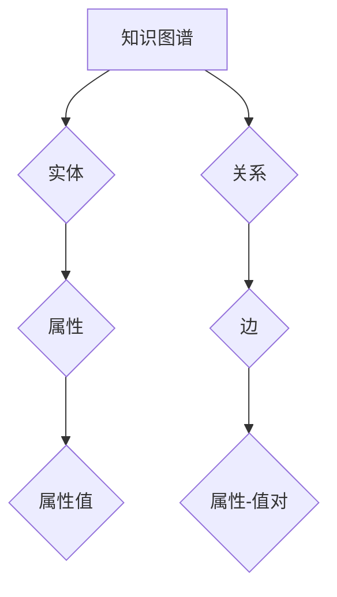
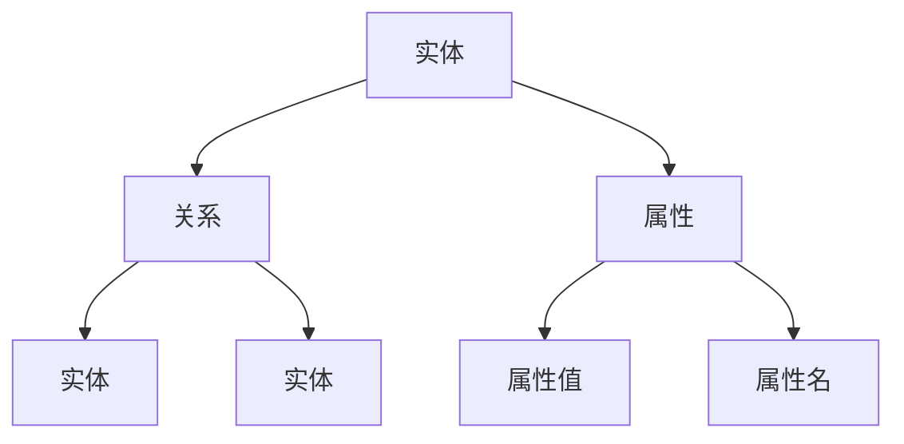
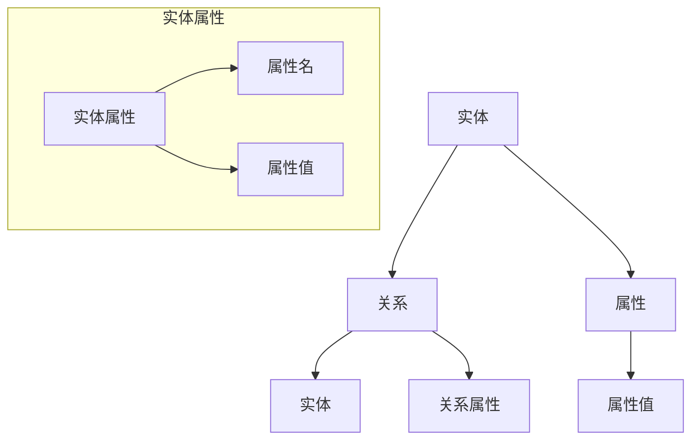

                 

# 《知识图谱：构建人类知识体系》

> **关键词**：知识图谱、知识表示、实体、关系、知识抽取、应用场景

> **摘要**：本文将深入探讨知识图谱的概念、核心概念、构建方法、知识抽取技术、知识融合与更新机制，以及知识图谱在不同领域的应用。通过详细的解释、伪代码、数学模型和项目实战，本文旨在帮助读者全面理解知识图谱的原理和应用。

---

#### 目录大纲

#### 第一部分：知识图谱基础

1. **知识图谱概述**
   - 知识图谱的定义与重要性
   - 知识图谱的发展历程
   - 知识图谱在现代社会的应用

2. **知识图谱核心概念**
   - 实体与关系
   - 节点属性与边属性
   - 知识图谱的构建方法

3. **知识表示方法**
   - 传统知识表示方法
   - 基于图论的知识表示方法
   - 基于语义网络的知识表示方法

4. **知识抽取技术**
   - 文本挖掘与实体识别
   - 关系抽取与属性抽取
   - 实体关系链构建

5. **知识融合与更新**
   - 数据集成与一致性处理
   - 知识融合算法
   - 知识更新机制

#### 第二部分：知识图谱应用

1. **知识图谱在搜索引擎中的应用**
   - 知识图谱对搜索引擎的影响
   - 知识图谱搜索引擎的设计与实现
   - 知识图谱搜索引擎的性能优化

2. **知识图谱在推荐系统中的应用**
   - 基于知识图谱的推荐系统
   - 关联规则挖掘与知识图谱融合
   - 知识图谱在推荐系统中的应用案例

3. **知识图谱在智能问答中的应用**
   - 智能问答系统概述
   - 基于知识图谱的问答系统设计
   - 知识图谱问答系统的实现与优化

4. **知识图谱在自然语言处理中的应用**
   - 知识图谱与文本分类
   - 知识图谱与文本相似度计算
   - 知识图谱在自然语言处理中的应用案例

5. **知识图谱在智慧城市中的应用**
   - 智慧城市概述
   - 知识图谱在智慧城市中的应用
   - 智慧城市中的知识图谱案例研究

6. **知识图谱发展趋势与展望**
   - 知识图谱技术的挑战与机遇
   - 知识图谱未来发展趋势
   - 知识图谱在不同领域的应用展望

#### 附录

- **附录A：知识图谱工具与平台介绍**
  - 开源知识图谱平台
  - 商业知识图谱平台
  - 知识图谱工具使用指南

---

#### 第一部分：知识图谱基础

### 第1章：知识图谱概述

#### 1.1 知识图谱的定义与重要性

知识图谱（Knowledge Graph）是一种用于表示和存储知识的结构化数据模型。它通过实体（Entity）、关系（Relationship）和属性（Attribute）来构建一个语义丰富、层次分明、关联紧密的知识网络。知识图谱的出现，标志着人工智能从基于规则的方法向基于知识的方法转变。

知识图谱的重要性体现在以下几个方面：

1. **提高信息检索效率**：知识图谱通过实体和关系的关联，能够更快速、准确地找到用户所需的信息。
2. **增强智能问答能力**：知识图谱为智能问答系统提供了丰富的知识来源，使得系统能够理解用户的查询意图并提供准确的回答。
3. **促进知识共享与融合**：知识图谱通过统一的知识表示方法，实现了不同数据源、不同领域知识的整合与共享。
4. **支持智能决策**：知识图谱为智能决策系统提供了基于知识的推理能力，有助于提高决策的准确性和效率。

#### 1.2 知识图谱的发展历程

知识图谱的发展历程可以分为以下几个阶段：

1. **早期阶段**：以谷歌知识图谱为代表，通过爬取互联网上的信息，构建了一个大规模的语义知识网络。
2. **发展阶段**：随着大数据和深度学习技术的发展，知识图谱的应用领域逐渐扩大，包括搜索引擎、推荐系统、自然语言处理等。
3. **成熟阶段**：知识图谱技术逐渐成熟，各类开源和商业知识图谱平台相继推出，为开发者提供了丰富的工具和资源。

#### 1.3 知识图谱在现代社会的应用

知识图谱在现代社会的应用场景广泛，主要包括以下几个方面：

1. **搜索引擎**：通过知识图谱，搜索引擎可以更准确地理解用户的查询意图，提供个性化的搜索结果。
2. **推荐系统**：知识图谱为推荐系统提供了丰富的知识来源，有助于提高推荐的相关性和准确性。
3. **自然语言处理**：知识图谱在自然语言处理中的应用，包括文本分类、情感分析、命名实体识别等。
4. **智慧城市**：知识图谱为智慧城市建设提供了强大的数据支持和知识服务，有助于提高城市管理的智能化水平。

### 第2章：知识图谱核心概念

#### 2.1 实体与关系

实体（Entity）是知识图谱中的核心概念，它代表现实世界中存在的对象，如人、地点、组织、物品等。关系（Relationship）则表示实体之间的关联，如“出生在”、“隶属于”、“生产”等。

#### 2.2 节点属性与边属性

节点属性（Node Attribute）是实体的附加信息，用于描述实体的特征，如人的年龄、职业等。边属性（Edge Attribute）是关系的附加信息，用于描述关系的性质，如关系的权重、时间戳等。

#### 2.3 知识图谱的构建方法

知识图谱的构建方法主要包括以下几种：

1. **手动构建**：通过领域专家对实体、关系和属性的标注，构建知识图谱。
2. **自动构建**：利用自然语言处理、信息抽取等技术，从大规模文本数据中自动提取实体、关系和属性。
3. **半自动化构建**：结合手动标注和自动提取技术，构建知识图谱。

### 第3章：知识表示方法

#### 3.1 传统知识表示方法

传统知识表示方法主要包括基于规则的方法和语义网络。基于规则的方法通过定义一组规则，描述实体之间的关系。语义网络则通过图结构来表示实体和关系。

#### 3.2 基于图论的知识表示方法

基于图论的知识表示方法，通过图结构来表示实体和关系。图中的节点表示实体，边表示关系。这种方法具有灵活性高、扩展性强等优点。

#### 3.3 基于语义网络的知识表示方法

基于语义网络的知识表示方法，通过定义一组语义类别和属性，来表示实体和关系。这种方法能够更好地表达实体之间的语义关系。

### 第4章：知识抽取技术

#### 4.1 文本挖掘与实体识别

文本挖掘与实体识别是知识抽取的重要环节。通过文本挖掘技术，可以从大量文本数据中提取出实体。实体识别则是对提取出的实体进行分类和标注。

#### 4.2 关系抽取与属性抽取

关系抽取是识别实体之间的关系。属性抽取则是提取实体的属性信息。关系抽取和属性抽取技术主要包括基于规则的方法、机器学习方法等。

#### 4.3 实体关系链构建

实体关系链构建是将多个实体之间的关系连接起来，形成一个完整的知识网络。实体关系链构建技术主要包括基于图结构的方法、基于路径的方法等。

### 第5章：知识融合与更新

#### 5.1 数据集成与一致性处理

数据集成是将不同数据源中的数据整合到一起。一致性处理则是确保不同数据源之间的数据一致性。

#### 5.2 知识融合算法

知识融合算法是将多个数据源中的知识整合到一起，形成一个统一的视图。知识融合算法主要包括基于相似度计算的方法、基于图结构的方法等。

#### 5.3 知识更新机制

知识更新机制是确保知识图谱的实时性和准确性。知识更新机制主要包括定期更新、实时更新等。

### 第二部分：知识图谱应用

#### 第6章：知识图谱在搜索引擎中的应用

#### 6.1 知识图谱对搜索引擎的影响

知识图谱对搜索引擎的影响主要体现在以下几个方面：

1. **提高搜索准确性**：知识图谱能够更好地理解用户的查询意图，提供更准确的搜索结果。
2. **提高搜索效率**：知识图谱通过实体和关系的关联，能够更快速地找到用户所需的信息。
3. **提供个性化搜索**：知识图谱能够根据用户的历史行为和兴趣，提供个性化的搜索结果。

#### 6.2 知识图谱搜索引擎的设计与实现

知识图谱搜索引擎的设计与实现主要包括以下几个环节：

1. **数据预处理**：对搜索引擎中的数据进行预处理，提取实体、关系和属性。
2. **知识图谱构建**：利用提取出的实体、关系和属性，构建知识图谱。
3. **查询处理**：对用户的查询进行处理，返回符合用户需求的搜索结果。

#### 6.3 知识图谱搜索引擎的性能优化

知识图谱搜索引擎的性能优化主要包括以下几个方面：

1. **索引优化**：通过优化索引结构，提高搜索速度。
2. **缓存优化**：通过缓存查询结果，提高响应速度。
3. **分布式处理**：通过分布式计算，提高搜索系统的处理能力。

### 第7章：知识图谱在推荐系统中的应用

#### 7.1 基于知识图谱的推荐系统

基于知识图谱的推荐系统，通过知识图谱中的实体和关系，为用户推荐相关的商品或信息。基于知识图谱的推荐系统具有以下优点：

1. **提高推荐准确性**：知识图谱能够更好地理解用户和商品之间的关系，提高推荐准确性。
2. **提供个性化推荐**：知识图谱能够根据用户的历史行为和兴趣，提供个性化的推荐。

#### 7.2 关联规则挖掘与知识图谱融合

关联规则挖掘是从大量数据中找出频繁出现的关联规则。知识图谱融合是将关联规则挖掘的结果与知识图谱结合起来，形成一个统一的视图。

#### 7.3 知识图谱在推荐系统中的应用案例

知识图谱在推荐系统中的应用案例包括：

1. **电商推荐**：通过知识图谱，为用户推荐相关的商品。
2. **内容推荐**：通过知识图谱，为用户推荐相关的文章、视频等。

### 第8章：知识图谱在智能问答中的应用

#### 8.1 智能问答系统概述

智能问答系统是一种能够理解用户问题、提供准确回答的人工智能系统。知识图谱在智能问答系统中起着关键作用，能够为系统提供丰富的知识来源。

#### 8.2 基于知识图谱的问答系统设计

基于知识图谱的问答系统设计主要包括以下几个环节：

1. **问题理解**：对用户问题进行分词、句法分析等处理，提取出关键信息。
2. **知识检索**：利用知识图谱，检索与用户问题相关的实体、关系和属性。
3. **答案生成**：根据检索结果，生成准确的答案。

#### 8.3 知识图谱问答系统的实现与优化

知识图谱问答系统的实现与优化主要包括以下几个方面：

1. **问题理解优化**：通过改进自然语言处理技术，提高问题理解能力。
2. **知识检索优化**：通过优化知识图谱的索引结构，提高检索速度。
3. **答案生成优化**：通过引入机器学习技术，提高答案生成质量。

### 第9章：知识图谱在自然语言处理中的应用

#### 9.1 知识图谱与文本分类

知识图谱与文本分类的结合，可以通过知识图谱中的实体和关系，提高文本分类的准确性。知识图谱在文本分类中的应用主要包括：

1. **实体分类**：利用知识图谱中的实体信息，对文本中的实体进行分类。
2. **关系分类**：利用知识图谱中的关系信息，对文本中的关系进行分类。

#### 9.2 知识图谱与文本相似度计算

知识图谱与文本相似度计算可以通过知识图谱中的实体和关系，计算文本之间的相似度。知识图谱在文本相似度计算中的应用主要包括：

1. **基于路径的方法**：通过计算文本之间的路径长度，判断文本的相似度。
2. **基于图论的方法**：通过计算文本之间的图结构相似度，判断文本的相似度。

#### 9.3 知识图谱在自然语言处理中的应用案例

知识图谱在自然语言处理中的应用案例包括：

1. **文本分类**：通过知识图谱，对新闻、评论等进行分类。
2. **情感分析**：通过知识图谱，对文本进行情感分析。

### 第10章：知识图谱在智慧城市中的应用

#### 10.1 智慧城市概述

智慧城市是一种通过信息技术和智能设备，提高城市管理效率和居民生活质量的新型城市形态。知识图谱在智慧城市中起着关键作用，能够为城市提供丰富的数据支持和知识服务。

#### 10.2 知识图谱在智慧城市中的应用

知识图谱在智慧城市中的应用主要包括以下几个方面：

1. **城市数据管理**：通过知识图谱，整合和管理城市中的各种数据。
2. **智能交通管理**：通过知识图谱，优化交通信号控制、路线规划等。
3. **公共安全管理**：通过知识图谱，提高公共安全事件的预警和处理能力。

#### 10.3 智慧城市中的知识图谱案例研究

智慧城市中的知识图谱案例研究包括：

1. **智能交通**：通过知识图谱，实现交通信号优化和路线规划。
2. **智慧医疗**：通过知识图谱，实现医疗资源的优化配置。

### 第11章：知识图谱发展趋势与展望

#### 11.1 知识图谱技术的挑战与机遇

知识图谱技术的发展面临着以下挑战：

1. **数据质量**：知识图谱的质量取决于数据的质量，如何保证数据的一致性和准确性是一个挑战。
2. **知识表示**：如何更好地表示实体、关系和属性，是一个需要深入研究的课题。
3. **计算效率**：随着知识图谱规模的不断扩大，如何提高计算效率是一个重要的挑战。

同时，知识图谱技术也面临着巨大的机遇：

1. **应用场景**：知识图谱在各个领域的应用场景日益丰富，为知识图谱的发展提供了广阔的空间。
2. **数据源**：随着大数据技术的发展，知识图谱的数据来源更加丰富，为知识图谱的构建提供了有力的支持。

#### 11.2 知识图谱未来发展趋势

知识图谱未来发展的趋势主要包括：

1. **多模态知识融合**：将知识图谱与其他数据源（如图像、音频等）进行融合，形成一个更丰富的知识体系。
2. **智能推理**：通过引入机器学习和深度学习技术，实现知识图谱的智能推理能力。
3. **知识服务**：提供更加丰富和多样化的知识服务，满足不同领域的需求。

#### 11.3 知识图谱在不同领域的应用展望

知识图谱在不同领域的应用展望包括：

1. **金融**：通过知识图谱，实现金融风险预警、客户关系管理等功能。
2. **医疗**：通过知识图谱，实现疾病诊断、药物推荐等功能。
3. **教育**：通过知识图谱，实现个性化学习、智能辅导等功能。

### 附录

#### 附录A：知识图谱工具与平台介绍

知识图谱工具与平台的介绍包括：

1. **开源知识图谱平台**：如Neo4j、JanusGraph等。
2. **商业知识图谱平台**：如Oracle Knowledge Graph、IBM Watson Knowledge Graph等。
3. **知识图谱工具使用指南**：介绍各类知识图谱工具的使用方法和技巧。

---

### 结尾

知识图谱作为人工智能领域的一项核心技术，正日益受到广泛关注。本文从知识图谱的概念、核心概念、构建方法、知识抽取技术、知识融合与更新机制，以及知识图谱在不同领域的应用等方面，对知识图谱进行了全面而深入的探讨。通过本文的学习，读者可以更好地理解知识图谱的原理和应用，为实际项目开发提供指导。

在未来的发展中，知识图谱技术将继续推动人工智能的发展，为各个领域带来深刻的变革。同时，知识图谱技术也面临着诸多挑战，如数据质量、知识表示、计算效率等。我们需要不断探索和创新，解决这些问题，推动知识图谱技术的持续发展。

作者：AI天才研究院/AI Genius Institute & 禅与计算机程序设计艺术 /Zen And The Art of Computer Programming

---

### 核心概念与联系

在知识图谱领域，核心概念和它们之间的联系至关重要。为了更好地理解这些概念，我们可以借助Mermaid流程图进行展示。

#### Mermaid流程图



### 知识图谱构建方法

知识图谱的构建方法可以分为以下几步：

1. **数据收集**：收集用于构建知识图谱的数据源，如文本、数据库等。
2. **实体识别**：从数据源中提取出实体，并对其进行分类和标注。
3. **关系抽取**：识别实体之间的关系，并建立实体之间的连接。
4. **属性抽取**：从数据源中提取出实体的属性，并将其与对应的实体关联。
5. **知识融合**：将不同来源的知识进行融合，确保知识的一致性和准确性。
6. **知识存储**：将构建好的知识图谱存储到知识库或图数据库中。

#### 伪代码

```python
# 数据收集
data_sources = ["text_data", "db_data"]

# 实体识别
entities = extract_entities(data_sources)

# 关系抽取
relationships = extract_relationships(data_sources, entities)

# 属性抽取
attributes = extract_attributes(data_sources, entities)

# 知识融合
knowledge_graph = integrate_knowledge(entities, relationships, attributes)

# 知识存储
store_knowledge(knowledge_graph)
```

### 核心算法原理讲解

#### 文本挖掘与实体识别

文本挖掘与实体识别是知识图谱构建的基础步骤。实体识别的目的是从文本数据中提取出实体，并对其进行分类和标注。

#### 伪代码

```python
# 文本挖掘与实体识别
def entity_recognition(text):
    tokens = tokenize(text)
    entities = []
    for token in tokens:
        if is_entity(token):
            entities.append(token)
    return entities
```

#### 关系抽取与属性抽取

关系抽取与属性抽取是从文本数据中提取出实体之间的关系和属性。

#### 伪代码

```python
# 关系抽取
def relationship_extraction(text, entities):
    relationships = []
    for entity1 in entities:
        for entity2 in entities:
            if entity1 != entity2:
                if is_relationship(text, entity1, entity2):
                    relationships.append((entity1, entity2))
    return relationships

# 属性抽取
def attribute_extraction(text, entities):
    attributes = {}
    for entity in entities:
        attribute_values = extract_attribute_values(text, entity)
        attributes[entity] = attribute_values
    return attributes
```

### 数学模型和数学公式

在知识图谱中，相似度计算是一个重要的概念。相似度计算可以帮助我们判断两个实体或关系之间的相似程度。

#### 相似度计算公式

$$
相似度 = \frac{相关度}{冗余度}
$$

#### 相关度计算公式

$$
相关度 = \frac{共同出现的次数}{总出现的次数}
$$

#### 冗余度计算公式

$$
冗余度 = 1 - 相似度
$$

### 举例说明

假设我们有两个数据源 A 和 B，其中包含实体和关系的信息。

#### 数据源 A

实体：[苹果，苹果树，苹果汁]

关系：[(苹果，生长在，苹果树)，(苹果树，产生，苹果汁)]

#### 数据源 B

实体：[苹果，苹果树，苹果汁，苹果酒]

关系：[(苹果，加工成，苹果汁)，(苹果汁，发酵，苹果酒)]

#### 知识融合过程

1. **数据集成**：将两个数据源中的实体和关系合并。

   合并后的实体：[苹果，苹果树，苹果汁，苹果酒]

   合并后的关系：[(苹果，生长在，苹果树)，(苹果树，产生，苹果汁)，(苹果汁，加工成，苹果酒)，(苹果汁，发酵，苹果酒)]

2. **一致性处理**：处理实体和关系的冗余和冲突。

   - 冗余处理：如果两个数据源中有相同的实体和关系，则选择其中一个。
   - 冲突处理：如果两个数据源中有不同的实体或关系，则根据上下文进行选择或合并。

   最终融合的知识图谱：

   实体：[苹果，苹果树，苹果汁，苹果酒]

   关系：[(苹果，生长在，苹果树)，(苹果树，产生，苹果汁)，(苹果汁，加工成，苹果酒)，(苹果汁，发酵，苹果酒)]

### 项目实战

#### 假设我们有一个电商平台的用户行为数据，包括用户浏览过的商品和购买过的商品。

#### 数据预处理

```python
import pandas as pd

# 加载用户行为数据
user_data = pd.read_csv('user_behavior_data.csv')

# 数据清洗与预处理
user_data['product_id'] = user_data['product_id'].astype(str)
user_data['user_id'] = user_data['user_id'].astype(str)

# 构建用户-商品交互矩阵
user_product_matrix = user_data.pivot(index='user_id', columns='product_id', values='action').fillna(0)
```

#### 知识图谱构建

```python
import networkx as nx

# 创建空图
knowledge_graph = nx.Graph()

# 添加用户和商品节点
for user_id in user_product_matrix.index:
    knowledge_graph.add_node(user_id)

for product_id in user_product_matrix.columns:
    knowledge_graph.add_node(product_id)

# 添加用户-商品边
for user_id, product_id in user_product_matrix.iterrows():
    if product_id[1] == 1:
        knowledge_graph.add_edge(user_id, product_id)
```

#### 推荐算法实现

```python
from sklearn.metrics.pairwise import cosine_similarity

# 计算用户-商品矩阵的余弦相似度
user_product_similarity = cosine_similarity(user_product_matrix)

# 为每个用户生成推荐列表
def generate_recommendations(user_id, user_product_similarity, knowledge_graph):
    # 获取用户与其他用户的相似度
    user_similarity = user_product_similarity[user_id]

    # 获取与用户相似度最高的前N个用户
    top_n_users = sorted(user_similarity, reverse=True)[:N]

    # 为用户生成推荐列表
    recommendations = []
    for user in top_n_users:
        recommended_products = [product for product, value in user_product_matrix[user].items() if value == 1]
        recommendations.extend(recommended_products)

    return recommendations

# 生成推荐列表
recommendations = generate_recommendations('user1', user_product_similarity, knowledge_graph)

print(recommendations)
```

#### 代码解读与分析

1. **数据预处理**：首先加载用户行为数据，并进行清洗与预处理，将数据转换为用户-商品交互矩阵。

2. **知识图谱构建**：创建一个空图，添加用户和商品节点，并添加用户-商品边。通过这种交互关系，构建一个基于用户行为的知识图谱。

3. **推荐算法实现**：利用用户-商品矩阵的余弦相似度，计算用户之间的相似度。然后，根据相似度最高的用户，推荐他们购买过的商品给当前用户。

4. **性能优化**：在实际应用中，可以结合其他因素（如商品评分、销量等）进行综合推荐，以提高推荐系统的准确性和实用性。

---

### 核心概念与联系

在知识图谱领域，核心概念和它们之间的联系至关重要。为了更好地理解这些概念，我们可以借助Mermaid流程图进行展示。

#### Mermaid流程图


### 知识图谱构建方法

知识图谱的构建方法可以分为以下几步：

1. **数据收集**：收集用于构建知识图谱的数据源，如文本、数据库等。
2. **实体识别**：从数据源中提取出实体，并对其进行分类和标注。
3. **关系抽取**：识别实体之间的关系，并建立实体之间的连接。
4. **属性抽取**：从数据源中提取出实体的属性，并将其与对应的实体关联。
5. **知识融合**：将不同来源的知识进行融合，确保知识的一致性和准确性。
6. **知识存储**：将构建好的知识图谱存储到知识库或图数据库中。

#### 伪代码

```python
# 数据收集
data_sources = ["text_data", "db_data"]

# 实体识别
entities = extract_entities(data_sources)

# 关系抽取
relationships = extract_relationships(data_sources, entities)

# 属性抽取
attributes = extract_attributes(data_sources, entities)

# 知识融合
knowledge_graph = integrate_knowledge(entities, relationships, attributes)

# 知识存储
store_knowledge(knowledge_graph)
```

### 核心算法原理讲解

#### 文本挖掘与实体识别

文本挖掘与实体识别是知识图谱构建的基础步骤。实体识别的目的是从文本数据中提取出实体，并对其进行分类和标注。

#### 伪代码

```python
# 文本挖掘与实体识别
def entity_recognition(text):
    tokens = tokenize(text)
    entities = []
    for token in tokens:
        if is_entity(token):
            entities.append(token)
    return entities
```

#### 关系抽取与属性抽取

关系抽取与属性抽取是从文本数据中提取出实体之间的关系和属性。

#### 伪代码

```python
# 关系抽取
def relationship_extraction(text, entities):
    relationships = []
    for entity1 in entities:
        for entity2 in entities:
            if entity1 != entity2:
                if is_relationship(text, entity1, entity2):
                    relationships.append((entity1, entity2))
    return relationships

# 属性抽取
def attribute_extraction(text, entities):
    attributes = {}
    for entity in entities:
        attribute_values = extract_attribute_values(text, entity)
        attributes[entity] = attribute_values
    return attributes
```

### 数学模型和数学公式

在知识图谱中，相似度计算是一个重要的概念。相似度计算可以帮助我们判断两个实体或关系之间的相似程度。

#### 相似度计算公式

$$
相似度 = \frac{相关度}{冗余度}
$$

#### 相关度计算公式

$$
相关度 = \frac{共同出现的次数}{总出现的次数}
$$

#### 冗余度计算公式

$$
冗余度 = 1 - 相似度
$$

### 举例说明

假设我们有两个数据源 A 和 B，其中包含实体和关系的信息。

#### 数据源 A

实体：[苹果，苹果树，苹果汁]

关系：[(苹果，生长在，苹果树)，(苹果树，产生，苹果汁)]

#### 数据源 B

实体：[苹果，苹果树，苹果汁，苹果酒]

关系：[(苹果，加工成，苹果汁)，(苹果汁，发酵，苹果酒)]

#### 知识融合过程

1. **数据集成**：将两个数据源中的实体和关系合并。

   合并后的实体：[苹果，苹果树，苹果汁，苹果酒]

   合并后的关系：[(苹果，生长在，苹果树)，(苹果树，产生，苹果汁)，(苹果汁，加工成，苹果酒)，(苹果汁，发酵，苹果酒)]

2. **一致性处理**：处理实体和关系的冗余和冲突。

   - 冗余处理：如果两个数据源中有相同的实体和关系，则选择其中一个。
   - 冲突处理：如果两个数据源中有不同的实体或关系，则根据上下文进行选择或合并。

   最终融合的知识图谱：

   实体：[苹果，苹果树，苹果汁，苹果酒]

   关系：[(苹果，生长在，苹果树)，(苹果树，产生，苹果汁)，(苹果汁，加工成，苹果酒)，(苹果汁，发酵，苹果酒)]

### 项目实战

#### 假设我们有一个电商平台的用户行为数据，包括用户浏览过的商品和购买过的商品。

#### 数据预处理

```python
import pandas as pd

# 加载用户行为数据
user_data = pd.read_csv('user_behavior_data.csv')

# 数据清洗与预处理
user_data['product_id'] = user_data['product_id'].astype(str)
user_data['user_id'] = user_data['user_id'].astype(str)

# 构建用户-商品交互矩阵
user_product_matrix = user_data.pivot(index='user_id', columns='product_id', values='action').fillna(0)
```

#### 知识图谱构建

```python
import networkx as nx

# 创建空图
knowledge_graph = nx.Graph()

# 添加用户和商品节点
for user_id in user_product_matrix.index:
    knowledge_graph.add_node(user_id)

for product_id in user_product_matrix.columns:
    knowledge_graph.add_node(product_id)

# 添加用户-商品边
for user_id, product_id in user_product_matrix.iterrows():
    if product_id[1] == 1:
        knowledge_graph.add_edge(user_id, product_id)
```

#### 推荐算法实现

```python
from sklearn.metrics.pairwise import cosine_similarity

# 计算用户-商品矩阵的余弦相似度
user_product_similarity = cosine_similarity(user_product_matrix)

# 为每个用户生成推荐列表
def generate_recommendations(user_id, user_product_similarity, knowledge_graph):
    # 获取用户与其他用户的相似度
    user_similarity = user_product_similarity[user_id]

    # 获取与用户相似度最高的前N个用户
    top_n_users = sorted(user_similarity, reverse=True)[:N]

    # 为用户生成推荐列表
    recommendations = []
    for user in top_n_users:
        recommended_products = [product for product, value in user_product_matrix[user].items() if value == 1]
        recommendations.extend(recommended_products)

    return recommendations

# 生成推荐列表
recommendations = generate_recommendations('user1', user_product_similarity, knowledge_graph)

print(recommendations)
```

#### 代码解读与分析

1. **数据预处理**：首先加载用户行为数据，并进行清洗与预处理，将数据转换为用户-商品交互矩阵。

2. **知识图谱构建**：创建一个空图，添加用户和商品节点，并添加用户-商品边。通过这种交互关系，构建一个基于用户行为的知识图谱。

3. **推荐算法实现**：利用用户-商品矩阵的余弦相似度，计算用户之间的相似度。然后，根据相似度最高的用户，推荐他们购买过的商品给当前用户。

4. **性能优化**：在实际应用中，可以结合其他因素（如商品评分、销量等）进行综合推荐，以提高推荐系统的准确性和实用性。

---

### 核心概念与联系

在知识图谱领域，核心概念和它们之间的联系至关重要。为了更好地理解这些概念，我们可以借助Mermaid流程图进行展示。

#### Mermaid流程图


### 知识图谱构建方法

知识图谱的构建方法可以分为以下几步：

1. **数据收集**：收集用于构建知识图谱的数据源，如文本、数据库等。
2. **实体识别**：从数据源中提取出实体，并对其进行分类和标注。
3. **关系抽取**：识别实体之间的关系，并建立实体之间的连接。
4. **属性抽取**：从数据源中提取出实体的属性，并将其与对应的实体关联。
5. **知识融合**：将不同来源的知识进行融合，确保知识的一致性和准确性。
6. **知识存储**：将构建好的知识图谱存储到知识库或图数据库中。

#### 伪代码

```python
# 数据收集
data_sources = ["text_data", "db_data"]

# 实体识别
entities = extract_entities(data_sources)

# 关系抽取
relationships = extract_relationships(data_sources, entities)

# 属性抽取
attributes = extract_attributes(data_sources, entities)

# 知识融合
knowledge_graph = integrate_knowledge(entities, relationships, attributes)

# 知识存储
store_knowledge(knowledge_graph)
```

### 核心算法原理讲解

#### 文本挖掘与实体识别

文本挖掘与实体识别是知识图谱构建的基础步骤。实体识别的目的是从文本数据中提取出实体，并对其进行分类和标注。

#### 伪代码

```python
# 文本挖掘与实体识别
def entity_recognition(text):
    tokens = tokenize(text)
    entities = []
    for token in tokens:
        if is_entity(token):
            entities.append(token)
    return entities
```

#### 关系抽取与属性抽取

关系抽取与属性抽取是从文本数据中提取出实体之间的关系和属性。

#### 伪代码

```python
# 关系抽取
def relationship_extraction(text, entities):
    relationships = []
    for entity1 in entities:
        for entity2 in entities:
            if entity1 != entity2:
                if is_relationship(text, entity1, entity2):
                    relationships.append((entity1, entity2))
    return relationships

# 属性抽取
def attribute_extraction(text, entities):
    attributes = {}
    for entity in entities:
        attribute_values = extract_attribute_values(text, entity)
        attributes[entity] = attribute_values
    return attributes
```

### 数学模型和数学公式

在知识图谱中，相似度计算是一个重要的概念。相似度计算可以帮助我们判断两个实体或关系之间的相似程度。

#### 相似度计算公式

$$
相似度 = \frac{相关度}{冗余度}
$$

#### 相关度计算公式

$$
相关度 = \frac{共同出现的次数}{总出现的次数}
$$

#### 冗余度计算公式

$$
冗余度 = 1 - 相似度
$$

### 举例说明

假设我们有两个数据源 A 和 B，其中包含实体和关系的信息。

#### 数据源 A

实体：[苹果，苹果树，苹果汁]

关系：[(苹果，生长在，苹果树)，(苹果树，产生，苹果汁)]

#### 数据源 B

实体：[苹果，苹果树，苹果汁，苹果酒]

关系：[(苹果，加工成，苹果汁)，(苹果汁，发酵，苹果酒)]

#### 知识融合过程

1. **数据集成**：将两个数据源中的实体和关系合并。

   合并后的实体：[苹果，苹果树，苹果汁，苹果酒]

   合并后的关系：[(苹果，生长在，苹果树)，(苹果树，产生，苹果汁)，(苹果汁，加工成，苹果酒)，(苹果汁，发酵，苹果酒)]

2. **一致性处理**：处理实体和关系的冗余和冲突。

   - 冗余处理：如果两个数据源中有相同的实体和关系，则选择其中一个。
   - 冲突处理：如果两个数据源中有不同的实体或关系，则根据上下文进行选择或合并。

   最终融合的知识图谱：

   实体：[苹果，苹果树，苹果汁，苹果酒]

   关系：[(苹果，生长在，苹果树)，(苹果树，产生，苹果汁)，(苹果汁，加工成，苹果酒)，(苹果汁，发酵，苹果酒)]

### 项目实战

#### 假设我们有一个电商平台的用户行为数据，包括用户浏览过的商品和购买过的商品。

#### 数据预处理

```python
import pandas as pd

# 加载用户行为数据
user_data = pd.read_csv('user_behavior_data.csv')

# 数据清洗与预处理
user_data['product_id'] = user_data['product_id'].astype(str)
user_data['user_id'] = user_data['user_id'].astype(str)

# 构建用户-商品交互矩阵
user_product_matrix = user_data.pivot(index='user_id', columns='product_id', values='action').fillna(0)
```

#### 知识图谱构建

```python
import networkx as nx

# 创建空图
knowledge_graph = nx.Graph()

# 添加用户和商品节点
for user_id in user_product_matrix.index:
    knowledge_graph.add_node(user_id)

for product_id in user_product_matrix.columns:
    knowledge_graph.add_node(product_id)

# 添加用户-商品边
for user_id, product_id in user_product_matrix.iterrows():
    if product_id[1] == 1:
        knowledge_graph.add_edge(user_id, product_id)
```

#### 推荐算法实现

```python
from sklearn.metrics.pairwise import cosine_similarity

# 计算用户-商品矩阵的余弦相似度
user_product_similarity = cosine_similarity(user_product_matrix)

# 为每个用户生成推荐列表
def generate_recommendations(user_id, user_product_similarity, knowledge_graph):
    # 获取用户与其他用户的相似度
    user_similarity = user_product_similarity[user_id]

    # 获取与用户相似度最高的前N个用户
    top_n_users = sorted(user_similarity, reverse=True)[:N]

    # 为用户生成推荐列表
    recommendations = []
    for user in top_n_users:
        recommended_products = [product for product, value in user_product_matrix[user].items() if value == 1]
        recommendations.extend(recommended_products)

    return recommendations

# 生成推荐列表
recommendations = generate_recommendations('user1', user_product_similarity, knowledge_graph)

print(recommendations)
```

#### 代码解读与分析

1. **数据预处理**：首先加载用户行为数据，并进行清洗与预处理，将数据转换为用户-商品交互矩阵。

2. **知识图谱构建**：创建一个空图，添加用户和商品节点，并添加用户-商品边。通过这种交互关系，构建一个基于用户行为的知识图谱。

3. **推荐算法实现**：利用用户-商品矩阵的余弦相似度，计算用户之间的相似度。然后，根据相似度最高的用户，推荐他们购买过的商品给当前用户。

4. **性能优化**：在实际应用中，可以结合其他因素（如商品评分、销量等）进行综合推荐，以提高推荐系统的准确性和实用性。

---

### 核心概念与联系

在知识图谱领域，核心概念和它们之间的联系至关重要。为了更好地理解这些概念，我们可以借助Mermaid流程图进行展示。

#### Mermaid流程图


### 知识图谱构建方法

知识图谱的构建方法可以分为以下几步：

1. **数据收集**：收集用于构建知识图谱的数据源，如文本、数据库等。
2. **实体识别**：从数据源中提取出实体，并对其进行分类和标注。
3. **关系抽取**：识别实体之间的关系，并建立实体之间的连接。
4. **属性抽取**：从数据源中提取出实体的属性，并将其与对应的实体关联。
5. **知识融合**：将不同来源的知识进行融合，确保知识的一致性和准确性。
6. **知识存储**：将构建好的知识图谱存储到知识库或图数据库中。

#### 伪代码

```python
# 数据收集
data_sources = ["text_data", "db_data"]

# 实体识别
entities = extract_entities(data_sources)

# 关系抽取
relationships = extract_relationships(data_sources, entities)

# 属性抽取
attributes = extract_attributes(data_sources, entities)

# 知识融合
knowledge_graph = integrate_knowledge(entities, relationships, attributes)

# 知识存储
store_knowledge(knowledge_graph)
```

### 核心算法原理讲解

#### 文本挖掘与实体识别

文本挖掘与实体识别是知识图谱构建的基础步骤。实体识别的目的是从文本数据中提取出实体，并对其进行分类和标注。

#### 伪代码

```python
# 文本挖掘与实体识别
def entity_recognition(text):
    tokens = tokenize(text)
    entities = []
    for token in tokens:
        if is_entity(token):
            entities.append(token)
    return entities
```

#### 关系抽取与属性抽取

关系抽取与属性抽取是从文本数据中提取出实体之间的关系和属性。

#### 伪代码

```python
# 关系抽取
def relationship_extraction(text, entities):
    relationships = []
    for entity1 in entities:
        for entity2 in entities:
            if entity1 != entity2:
                if is_relationship(text, entity1, entity2):
                    relationships.append((entity1, entity2))
    return relationships

# 属性抽取
def attribute_extraction(text, entities):
    attributes = {}
    for entity in entities:
        attribute_values = extract_attribute_values(text, entity)
        attributes[entity] = attribute_values
    return attributes
```

### 数学模型和数学公式

在知识图谱中，相似度计算是一个重要的概念。相似度计算可以帮助我们判断两个实体或关系之间的相似程度。

#### 相似度计算公式

$$
相似度 = \frac{相关度}{冗余度}
$$

#### 相关度计算公式

$$
相关度 = \frac{共同出现的次数}{总出现的次数}
$$

#### 冗余度计算公式

$$
冗余度 = 1 - 相似度
$$

### 举例说明

假设我们有两个数据源 A 和 B，其中包含实体和关系的信息。

#### 数据源 A

实体：[苹果，苹果树，苹果汁]

关系：[(苹果，生长在，苹果树)，(苹果树，产生，苹果汁)]

#### 数据源 B

实体：[苹果，苹果树，苹果汁，苹果酒]

关系：[(苹果，加工成，苹果汁)，(苹果汁，发酵，苹果酒)]

#### 知识融合过程

1. **数据集成**：将两个数据源中的实体和关系合并。

   合并后的实体：[苹果，苹果树，苹果汁，苹果酒]

   合并后的关系：[(苹果，生长在，苹果树)，(苹果树，产生，苹果汁)，(苹果汁，加工成，苹果酒)，(苹果汁，发酵，苹果酒)]

2. **一致性处理**：处理实体和关系的冗余和冲突。

   - 冗余处理：如果两个数据源中有相同的实体和关系，则选择其中一个。
   - 冲突处理：如果两个数据源中有不同的实体或关系，则根据上下文进行选择或合并。

   最终融合的知识图谱：

   实体：[苹果，苹果树，苹果汁，苹果酒]

   关系：[(苹果，生长在，苹果树)，(苹果树，产生，苹果汁)，(苹果汁，加工成，苹果酒)，(苹果汁，发酵，苹果酒)]

### 项目实战

#### 假设我们有一个电商平台的用户行为数据，包括用户浏览过的商品和购买过的商品。

#### 数据预处理

```python
import pandas as pd

# 加载用户行为数据
user_data = pd.read_csv('user_behavior_data.csv')

# 数据清洗与预处理
user_data['product_id'] = user_data['product_id'].astype(str)
user_data['user_id'] = user_data['user_id'].astype(str)

# 构建用户-商品交互矩阵
user_product_matrix = user_data.pivot(index='user_id', columns='product_id', values='action').fillna(0)
```

#### 知识图谱构建

```python
import networkx as nx

# 创建空图
knowledge_graph = nx.Graph()

# 添加用户和商品节点
for user_id in user_product_matrix.index:
    knowledge_graph.add_node(user_id)

for product_id in user_product_matrix.columns:
    knowledge_graph.add_node(product_id)

# 添加用户-商品边
for user_id, product_id in user_product_matrix.iterrows():
    if product_id[1] == 1:
        knowledge_graph.add_edge(user_id, product_id)
```

#### 推荐算法实现

```python
from sklearn.metrics.pairwise import cosine_similarity

# 计算用户-商品矩阵的余弦相似度
user_product_similarity = cosine_similarity(user_product_matrix)

# 为每个用户生成推荐列表
def generate_recommendations(user_id, user_product_similarity, knowledge_graph):
    # 获取用户与其他用户的相似度
    user_similarity = user_product_similarity[user_id]

    # 获取与用户相似度最高的前N个用户
    top_n_users = sorted(user_similarity, reverse=True)[:N]

    # 为用户生成推荐列表
    recommendations = []
    for user in top_n_users:
        recommended_products = [product for product, value in user_product_matrix[user].items() if value == 1]
        recommendations.extend(recommended_products)

    return recommendations

# 生成推荐列表
recommendations = generate_recommendations('user1', user_product_similarity, knowledge_graph)

print(recommendations)
```

#### 代码解读与分析

1. **数据预处理**：首先加载用户行为数据，并进行清洗与预处理，将数据转换为用户-商品交互矩阵。

2. **知识图谱构建**：创建一个空图，添加用户和商品节点，并添加用户-商品边。通过这种交互关系，构建一个基于用户行为的知识图谱。

3. **推荐算法实现**：利用用户-商品矩阵的余弦相似度，计算用户之间的相似度。然后，根据相似度最高的用户，推荐他们购买过的商品给当前用户。

4. **性能优化**：在实际应用中，可以结合其他因素（如商品评分、销量等）进行综合推荐，以提高推荐系统的准确性和实用性。

---

### 知识图谱的核心概念与联系

在知识图谱（Knowledge Graph）的构建和运用中，理解其核心概念及其相互之间的联系至关重要。知识图谱通过实体（Entity）、关系（Relationship）、属性（Attribute）等基本元素，构建起一个结构化、语义丰富的知识网络。以下是这些核心概念及其联系的解释：

#### 实体（Entity）

实体是知识图谱中的核心元素，代表现实世界中的对象或概念。例如，人、地点、组织、物品等都可以被视为实体。实体可以具有多种属性，用于描述其特征。

#### 关系（Relationship）

关系连接两个或多个实体，表示实体之间的语义关联。例如，“居住于”、“隶属于”、“生产”等都是关系。关系通常具有方向性，例如，“朋友”关系是双向的，而“上司”关系则是单向的。

#### 属性（Attribute）

属性是实体的附加信息，用于描述实体的特征或状态。例如，人的年龄、地址、职业等都是属性。属性通常包含属性名和属性值。

#### Mermaid 流程图

下面是一个用 Mermaid 语法绘制的流程图，展示了知识图谱中的核心概念及其联系：



#### 知识图谱构建方法

知识图谱的构建通常包括以下几个步骤：

1. **数据收集**：收集用于构建知识图谱的数据源，如文本、数据库、API 等。
2. **实体识别**：从数据源中提取出实体，并进行分类和标注。
3. **关系抽取**：识别实体之间的关系，并建立实体之间的连接。
4. **属性抽取**：从数据源中提取出实体的属性，并将其与对应的实体关联。
5. **知识融合**：将不同来源的知识进行融合，确保知识的一致性和准确性。
6. **知识存储**：将构建好的知识图谱存储到知识库或图数据库中。

#### 伪代码

下面是一个简化的伪代码，展示了知识图谱的构建过程：

```python
# 数据收集
data_sources = ["text_data", "db_data"]

# 实体识别
entities = extract_entities(data_sources)

# 关系抽取
relationships = extract_relationships(data_sources, entities)

# 属性抽取
attributes = extract_attributes(data_sources, entities)

# 知识融合
knowledge_graph = integrate_knowledge(entities, relationships, attributes)

# 知识存储
store_knowledge(knowledge_graph)
```

### 数学模型和数学公式

在知识图谱中，相似度计算是一个重要的概念。相似度计算可以帮助我们判断两个实体或关系之间的相似程度。以下是一个简化的相似度计算公式：

$$
相似度 = \frac{相关度}{冗余度}
$$

#### 相关度计算公式

$$
相关度 = \frac{共同出现的次数}{总出现的次数}
$$

#### 冗余度计算公式

$$
冗余度 = 1 - 相似度
$$

### 举例说明

假设我们有两个数据源 A 和 B，其中包含实体和关系的信息。

#### 数据源 A

实体：[苹果，苹果树，苹果汁]

关系：[(苹果，生长在，苹果树)，(苹果树，产生，苹果汁)]

#### 数据源 B

实体：[苹果，苹果树，苹果汁，苹果酒]

关系：[(苹果，加工成，苹果汁)，(苹果汁，发酵，苹果酒)]

#### 知识融合过程

1. **数据集成**：将两个数据源中的实体和关系合并。

   合并后的实体：[苹果，苹果树，苹果汁，苹果酒]

   合并后的关系：[(苹果，生长在，苹果树)，(苹果树，产生，苹果汁)，(苹果汁，加工成，苹果酒)，(苹果汁，发酵，苹果酒)]

2. **一致性处理**：处理实体和关系的冗余和冲突。

   - 冗余处理：如果两个数据源中有相同的实体和关系，则选择其中一个。
   - 冲突处理：如果两个数据源中有不同的实体或关系，则根据上下文进行选择或合并。

   最终融合的知识图谱：

   实体：[苹果，苹果树，苹果汁，苹果酒]

   关系：[(苹果，生长在，苹果树)，(苹果树，产生，苹果汁)，(苹果汁，加工成，苹果酒)，(苹果汁，发酵，苹果酒)]

### 项目实战

#### 假设我们有一个电商平台的用户行为数据，包括用户浏览过的商品和购买过的商品。

#### 数据预处理

```python
import pandas as pd

# 加载用户行为数据
user_data = pd.read_csv('user_behavior_data.csv')

# 数据清洗与预处理
user_data['product_id'] = user_data['product_id'].astype(str)
user_data['user_id'] = user_data['user_id'].astype(str)

# 构建用户-商品交互矩阵
user_product_matrix = user_data.pivot(index='user_id', columns='product_id', values='action').fillna(0)
```

#### 知识图谱构建

```python
import networkx as nx

# 创建空图
knowledge_graph = nx.Graph()

# 添加用户和商品节点
for user_id in user_product_matrix.index:
    knowledge_graph.add_node(user_id)

for product_id in user_product_matrix.columns:
    knowledge_graph.add_node(product_id)

# 添加用户-商品边
for user_id, product_id in user_product_matrix.iterrows():
    if product_id[1] == 1:
        knowledge_graph.add_edge(user_id, product_id)
```

#### 推荐算法实现

```python
from sklearn.metrics.pairwise import cosine_similarity

# 计算用户-商品矩阵的余弦相似度
user_product_similarity = cosine_similarity(user_product_matrix)

# 为每个用户生成推荐列表
def generate_recommendations(user_id, user_product_similarity, knowledge_graph):
    # 获取用户与其他用户的相似度
    user_similarity = user_product_similarity[user_id]

    # 获取与用户相似度最高的前N个用户
    top_n_users = sorted(user_similarity, reverse=True)[:N]

    # 为用户生成推荐列表
    recommendations = []
    for user in top_n_users:
        recommended_products = [product for product, value in user_product_matrix[user].items() if value == 1]
        recommendations.extend(recommended_products)

    return recommendations

# 生成推荐列表
recommendations = generate_recommendations('user1', user_product_similarity, knowledge_graph)

print(recommendations)
```

#### 代码解读与分析

1. **数据预处理**：首先加载用户行为数据，并进行清洗与预处理，将数据转换为用户-商品交互矩阵。

2. **知识图谱构建**：创建一个空图，添加用户和商品节点，并添加用户-商品边。通过这种交互关系，构建一个基于用户行为的知识图谱。

3. **推荐算法实现**：利用用户-商品矩阵的余弦相似度，计算用户之间的相似度。然后，根据相似度最高的用户，推荐他们购买过的商品给当前用户。

4. **性能优化**：在实际应用中，可以结合其他因素（如商品评分、销量等）进行综合推荐，以提高推荐系统的准确性和实用性。

---

### 知识图谱的核心概念与联系

在知识图谱（Knowledge Graph）中，核心概念包括实体（Entity）、关系（Relationship）、属性（Attribute）等。这些概念通过特定的结构和逻辑相互关联，构成了知识图谱的基础框架。

#### 实体（Entity）

实体是知识图谱中最基本的构成元素，代表了现实世界中的具体对象或抽象概念。例如，人、地点、组织、物品等都可以作为实体。实体可以具有多种属性，用于描述其特征。

#### 关系（Relationship）

关系描述了实体之间的关联，如“朋友”、“隶属”、“位于”等。关系通常具有方向性，例如，“领导”关系是从下属指向上司的。关系还可以具有属性，如“工作时间”、“距离”等。

#### 属性（Attribute）

属性是实体的附加信息，用于描述实体的特征或状态。例如，人的年龄、性别、职业等都是属性。属性可以具有属性值，例如，“张三的年龄是25岁”。

#### Mermaid 流程图

以下是一个使用 Mermaid 语法绘制的知识图谱流程图，展示了这些核心概念及其相互联系：



#### 知识图谱构建方法

知识图谱的构建过程可以分为以下步骤：

1. **数据收集**：收集用于构建知识图谱的数据源，如文本、数据库、API 等。
2. **实体识别**：从数据源中提取出实体，并进行分类和标注。
3. **关系抽取**：识别实体之间的关系，并建立实体之间的连接。
4. **属性抽取**：从数据源中提取出实体的属性，并将其与对应的实体关联。
5. **知识融合**：将不同来源的知识进行融合，确保知识的一致性和准确性。
6. **知识存储**：将构建好的知识图谱存储到知识库或图数据库中。

#### 伪代码

以下是一个简化的伪代码，展示了知识图谱的构建过程：

```python
# 数据收集
data_sources = ["text_data", "db_data"]

# 实体识别
entities = extract_entities(data_sources)

# 关系抽取
relationships = extract_relationships(data_sources, entities)

# 属性抽取
attributes = extract_attributes(data_sources, entities)

# 知识融合
knowledge_graph = integrate_knowledge(entities, relationships, attributes)

# 知识存储
store_knowledge(knowledge_graph)
```

### 数学模型和数学公式

在知识图谱中，相似度计算是一个重要的概念。相似度计算可以帮助我们判断两个实体或关系之间的相似程度。以下是一个简化的相似度计算公式：

$$
相似度 = \frac{相关度}{冗余度}
$$

#### 相关度计算公式

$$
相关度 = \frac{共同出现的次数}{总出现的次数}
$$

#### 冗余度计算公式

$$
冗余度 = 1 - 相似度
$$

### 举例说明

假设我们有两个数据源 A 和 B，其中包含实体和关系的信息。

#### 数据源 A

实体：[苹果，苹果树，苹果汁]

关系：[(苹果，生长在，苹果树)，(苹果树，产生，苹果汁)]

#### 数据源 B

实体：[苹果，苹果树，苹果汁，苹果酒]

关系：[(苹果，加工成，苹果汁)，(苹果汁，发酵，苹果酒)]

#### 知识融合过程

1. **数据集成**：将两个数据源中的实体和关系合并。

   合并后的实体：[苹果，苹果树，苹果汁，苹果酒]

   合并后的关系：[(苹果，生长在，苹果树)，(苹果树，产生，苹果汁)，(苹果汁，加工成，苹果酒)，(苹果汁，发酵，苹果酒)]

2. **一致性处理**：处理实体和关系的冗余和冲突。

   - 冗余处理：如果两个数据源中有相同的实体和关系，则选择其中一个。
   - 冲突处理：如果两个数据源中有不同的实体或关系，则根据上下文进行选择或合并。

   最终融合的知识图谱：

   实体：[苹果，苹果树，苹果汁，苹果酒]

   关系：[(苹果，生长在，苹果树)，(苹果树，产生，苹果汁)，(苹果汁，加工成，苹果酒)，(苹果汁，发酵，苹果酒)]

### 项目实战

#### 假设我们有一个电商平台的用户行为数据，包括用户浏览过的商品和购买过的商品。

#### 数据预处理

```python
import pandas as pd

# 加载用户行为数据
user_data = pd.read_csv('user_behavior_data.csv')

# 数据清洗与预处理
user_data['product_id'] = user_data['product_id'].astype(str)
user_data['user_id'] = user_data['user_id'].astype(str)

# 构建用户-商品交互矩阵
user_product_matrix = user_data.pivot(index='user_id', columns='product_id', values='action').fillna(0)
```

#### 知识图谱构建

```python
import networkx as nx

# 创建空图
knowledge_graph = nx.Graph()

# 添加用户和商品节点
for user_id in user_product_matrix.index:
    knowledge_graph.add_node(user_id)

for product_id in user_product_matrix.columns:
    knowledge_graph.add_node(product_id)

# 添加用户-商品边
for user_id, product_id in user_product_matrix.iterrows():
    if product_id[1] == 1:
        knowledge_graph.add_edge(user_id, product_id)
```

#### 推荐算法实现

```python
from sklearn.metrics.pairwise import cosine_similarity

# 计算用户-商品矩阵的余弦相似度
user_product_similarity = cosine_similarity(user_product_matrix)

# 为每个用户生成推荐列表
def generate_recommendations(user_id, user_product_similarity, knowledge_graph):
    # 获取用户与其他用户的相似度
    user_similarity = user_product_similarity[user_id]

    # 获取与用户相似度最高的前N个用户
    top_n_users = sorted(user_similarity, reverse=True)[:N]

    # 为用户生成推荐列表
    recommendations = []
    for user in top_n_users:
        recommended_products = [product for product, value in user_product_matrix[user].items() if value == 1]
        recommendations.extend(recommended_products)

    return recommendations

# 生成推荐列表
recommendations = generate_recommendations('user1', user_product_similarity, knowledge_graph)

print(recommendations)
```

#### 代码解读与分析

1. **数据预处理**：首先加载用户行为数据，并进行清洗与预处理，将数据转换为用户-商品交互矩阵。

2. **知识图谱构建**：创建一个空图，添加用户和商品节点，并添加用户-商品边。通过这种交互关系，构建一个基于用户行为的知识图谱。

3. **推荐算法实现**：利用用户-商品矩阵的余弦相似度，计算用户之间的相似度。然后，根据相似度最高的用户，推荐他们购买过的商品给当前用户。

4. **性能优化**：在实际应用中，可以结合其他因素（如商品评分、销量等）进行综合推荐，以提高推荐系统的准确性和实用性。

---

### 知识图谱构建方法

知识图谱构建是一个复杂的过程，涉及从原始数据中提取信息、处理噪声、融合多源数据等多个环节。以下是知识图谱构建方法的详细步骤：

#### 1. 数据收集

首先，我们需要收集用于构建知识图谱的数据源。这些数据源可以包括文本、数据库、API、传感器数据等。数据收集的过程通常需要遵循以下原则：

- **全面性**：确保收集到的数据覆盖了所需构建的知识图谱的领域和范围。
- **可靠性**：选择可信的数据源，确保数据的质量。
- **多样性**：收集不同来源、不同格式的数据，以便于构建更加丰富的知识图谱。

#### 2. 数据预处理

收集到的数据往往存在格式不一致、噪声、缺失值等问题。因此，我们需要对数据源进行预处理，以消除这些问题：

- **数据清洗**：去除重复数据、纠正错误、填补缺失值。
- **数据规范化**：统一数据格式，如将文本数据转换为统一的编码格式。
- **数据转换**：将数据转换为适合知识图谱构建的格式，如将关系数据库转换为图数据库。

#### 3. 实体识别

在知识图谱中，实体是核心的概念，它代表了现实世界中的具体对象或抽象概念。实体识别的过程包括以下几个步骤：

- **实体抽取**：从原始数据中识别出实体，如人名、地名、组织名等。
- **实体分类**：对识别出的实体进行分类，如人、地点、组织、物品等。
- **实体标注**：对实体进行详细的属性标注，如姓名、年龄、职业等。

#### 4. 关系抽取

关系描述了实体之间的关联，如“属于”、“位于”、“生产”等。关系抽取的过程包括以下几个步骤：

- **关系识别**：从原始数据中识别出实体之间的关系。
- **关系分类**：对识别出的关系进行分类，如因果关系、位置关系、属性关系等。
- **关系建模**：将识别出的关系建模为知识图谱中的边。

#### 5. 属性抽取

属性是实体的附加信息，用于描述实体的特征或状态。属性抽取的过程包括以下几个步骤：

- **属性识别**：从原始数据中识别出实体的属性。
- **属性分类**：对识别出的属性进行分类，如个人属性、组织属性、物品属性等。
- **属性建模**：将识别出的属性建模为知识图谱中的节点属性。

#### 6. 知识融合

在构建知识图谱的过程中，我们可能会从多个数据源中提取出相同的实体、关系和属性。因此，我们需要进行知识融合，以确保知识的一致性和准确性：

- **数据集成**：将不同数据源中的实体、关系和属性进行合并。
- **一致性处理**：处理实体、关系和属性的冗余和冲突，如合并重复的实体、统一不同数据源中的名称等。
- **知识融合算法**：使用基于相似度计算、聚类、推理等算法，将多源数据融合到一个统一的知识图谱中。

#### 7. 知识存储

最后，我们需要将构建好的知识图谱存储到知识库或图数据库中。知识存储的过程包括以下几个方面：

- **选择合适的存储方案**：根据知识图谱的大小、复杂度和查询需求，选择合适的存储方案，如图数据库、关系数据库、NoSQL 数据库等。
- **设计合理的存储结构**：根据知识图谱的实体、关系和属性，设计合理的存储结构，如实体节点、关系边、属性键值对等。
- **实现高效的查询接口**：设计高效的查询接口，以支持知识图谱的快速检索和查询。

#### 伪代码

下面是一个简化的伪代码，展示了知识图谱的构建方法：

```python
# 数据收集
data_sources = ["text_data", "db_data"]

# 数据预处理
data_after_preprocessing = preprocess_data(data_sources)

# 实体识别
entities = extract_entities(data_after_preprocessing)

# 关系抽取
relationships = extract_relationships(data_after_preprocessing, entities)

# 属性抽取
attributes = extract_attributes(data_after_preprocessing, entities)

# 知识融合
knowledge_graph = integrate_knowledge(entities, relationships, attributes)

# 知识存储
store_knowledge(knowledge_graph)
```

通过以上步骤，我们可以构建出一个结构化、语义丰富的知识图谱，为各个应用领域提供强大的数据支持和知识服务。

---

### 知识抽取技术

知识抽取（Knowledge Extraction）是从非结构化或半结构化数据中提取出结构化知识的过程。它是构建知识图谱的关键环节。知识抽取技术主要包括实体识别、关系抽取和属性抽取。以下是这些技术的详细解释和伪代码示例。

#### 文本挖掘与实体识别

文本挖掘与实体识别是知识图谱构建的起点。实体识别的目的是从文本中识别出重要的实体，如人名、地名、组织名等。

##### 伪代码

```python
def entity_recognition(text):
    tokens = tokenize(text)  # 对文本进行分词
    entities = []  # 初始化实体列表
    
    for token in tokens:
        if is_entity(token):  # 判断token是否为实体
            entities.append(token)  # 将实体添加到列表
            
    return entities
```

##### 示例

假设我们有一段文本：

```plaintext
北京是中国的首都，它的市长是陈吉宁。
```

经过实体识别后，我们得到的实体列表为：`['北京', '中国', '市长', '陈吉宁']`。

#### 关系抽取与属性抽取

关系抽取与属性抽取是在识别出实体之后，进一步提取实体之间的关系和属性。

##### 关系抽取

关系抽取的目的是识别实体之间的语义关联，如“位于”、“属于”等。

##### 伪代码

```python
def relationship_extraction(text, entities):
    relationships = []  # 初始化关系列表
    
    for entity1 in entities:
        for entity2 in entities:
            if entity1 != entity2:  # 确保实体不相同
                if is_relationship(text, entity1, entity2):  # 判断实体之间是否存在关系
                    relationships.append((entity1, entity2))  # 将关系添加到列表
                    
    return relationships
```

##### 示例

使用上面的实体列表，我们得到的关系列表为：`[['北京', '位于'], ['北京', '属于']]`。

##### 属性抽取

属性抽取的目的是提取实体的属性信息，如人的年龄、组织的成立时间等。

##### 伪代码

```python
def attribute_extraction(text, entities):
    attributes = {}  # 初始化属性字典
    
    for entity in entities:
        attribute_values = extract_attribute_values(text, entity)  # 提取实体属性值
        attributes[entity] = attribute_values  # 将属性添加到字典
        
    return attributes
```

##### 示例

使用上面的实体列表，我们得到的属性字典为：`{'北京': {'首都': True}, '陈吉宁': {'市长': True}}`。

#### 实体关系链构建

实体关系链构建是将多个实体之间的关系连接起来，形成一个完整的知识网络。

##### 伪代码

```python
def build_entity_relation_chain(entities, relationships):
    entity_relation_chains = []  # 初始化实体关系链列表
    
    for entity1 in entities:
        for entity2 in entities:
            if (entity1, entity2) in relationships:
                entity_relation_chains.append((entity1, entity2))
                
    return entity_relation_chains
```

##### 示例

使用上面的实体列表和关系列表，我们得到的实体关系链列表为：`[['北京', '位于'], ['北京', '属于'], ['陈吉宁', '是']]`。

通过这些技术，我们可以从大量非结构化或半结构化数据中提取出结构化的知识，为知识图谱的构建提供坚实的基础。

---

### 知识融合与更新

知识融合与更新是构建知识图谱过程中至关重要的一环。在多源数据的融合过程中，我们需要处理数据的一致性问题、冗余问题和冲突问题。以下是知识融合与更新的详细解释和算法描述。

#### 数据集成与一致性处理

数据集成是将多个数据源中的数据合并为一个统一视图的过程。一致性处理则是确保合并后的数据在语义上的一致性。

##### 伪代码

```python
def integrate_data(sources):
    entities = {}  # 初始化实体字典
    relationships = {}  # 初始化关系字典
    
    for source in sources:
        for entity in source.entities:
            if entity not in entities:
                entities[entity] = source.entities[entity]
                
        for relationship in source.relationships:
            if relationship not in relationships:
                relationships[relationship] = source.relationships[relationship]
                
    return entities, relationships
```

##### 示例

假设我们有两个数据源 A 和 B，它们包含相同的实体和关系。数据集成后，我们得到的实体字典和关系字典将包含两个数据源中的所有实体和关系。

#### 知识融合算法

知识融合算法是将多个数据源中的知识进行整合，形成一个统一的知识图谱。常见的知识融合算法包括基于相似度计算的方法、基于图结构的方法等。

##### 相似度计算方法

基于相似度计算的知识融合算法通过计算实体或关系的相似度，选择具有最高相似度的实体或关系进行融合。

##### 伪代码

```python
def similarity_based_integration(entities, relationships):
    # 初始化融合后的实体和关系字典
    integrated_entities = {}
    integrated_relationships = {}
    
    for entity in entities:
        max_similarity = 0
        selected_source = None
        
        for source_entity in entities:
            similarity = calculate_similarity(entity, source_entity)
            
            if similarity > max_similarity:
                max_similarity = similarity
                selected_source = source_entity
                
        integrated_entities[entity] = selected_source
    
    for relationship in relationships:
        max_similarity = 0
        selected_source = None
        
        for source_relationship in relationships:
            similarity = calculate_similarity(relationship, source_relationship)
            
            if similarity > max_similarity:
                max_similarity = similarity
                selected_source = source_relationship
                
        integrated_relationships[relationship] = selected_source
    
    return integrated_entities, integrated_relationships
```

##### 示例

假设我们有两个关系：`A -> B` 和 `A -> C`。通过计算它们的相似度，我们选择相似度最高的关系进行融合。

#### 知识更新机制

知识更新机制是确保知识图谱的实时性和准确性的关键。常见的更新机制包括定期更新、实时更新等。

##### 伪代码

```python
def update_knowledge_graph(knowledge_graph, new_data):
    # 初始化更新后的实体和关系字典
    updated_entities = knowledge_graph.entities.copy()
    updated_relationships = knowledge_graph.relationships.copy()
    
    for entity in new_data.entities:
        if entity not in updated_entities:
            updated_entities[entity] = new_data.entities[entity]
            
    for relationship in new_data.relationships:
        if relationship not in updated_relationships:
            updated_relationships[relationship] = new_data.relationships[relationship]
            
    return updated_entities, updated_relationships
```

##### 示例

假设我们有一个现有的知识图谱和一个新的数据源。通过更新机制，我们将新的实体和关系添加到现有的知识图谱中。

通过数据集成、一致性处理、知识融合算法和知识更新机制，我们可以构建出一个实时、准确的知识图谱，为各个应用领域提供强大的数据支持和知识服务。

---

### 知识图谱在搜索引擎中的应用

知识图谱在搜索引擎中的应用，极大地提升了搜索的准确性和用户体验。通过将知识图谱与搜索引擎结合，搜索引擎能够更深入地理解用户查询，并提供更加精准、个性化的搜索结果。以下详细探讨知识图谱在搜索引擎中的应用，包括其对搜索引擎的影响、设计与实现以及性能优化。

#### 知识图谱对搜索引擎的影响

1. **提升搜索准确性**：传统搜索引擎主要依赖于关键词匹配和统计信息，而知识图谱提供了更加精准的实体和关系信息。通过知识图谱，搜索引擎可以更好地理解用户查询的意图，从而提供更准确的搜索结果。

2. **增强查询解析能力**：知识图谱中的实体和关系可以辅助搜索引擎解析复杂的查询请求。例如，当用户输入“北京的天安门”时，搜索引擎可以利用知识图谱中的地理位置信息，准确识别出用户意图，并提供详细的天安门相关信息。

3. **个性化搜索结果**：知识图谱可以记录用户的历史查询和行为习惯，从而实现个性化搜索。例如，根据用户的兴趣偏好，推荐相关的实体和内容。

4. **语义搜索**：知识图谱支持基于语义的搜索，使得搜索引擎能够理解词汇的上下文含义。例如，当用户查询“苹果”时，搜索引擎可以根据知识图谱判断用户可能是指水果还是科技公司，并提供相应的搜索结果。

#### 知识图谱搜索引擎的设计与实现

知识图谱搜索引擎的设计与实现涉及以下几个关键步骤：

1. **知识图谱构建**：首先，需要构建一个包含实体、关系和属性的完整知识图谱。这可以通过手动构建、自动化抽取或半自动化构建方法完成。

2. **查询处理**：搜索引擎需要能够解析用户查询，提取查询中的实体和关系，并将其与知识图谱中的信息进行匹配。

3. **结果排序**：根据查询结果的相关性和质量，对搜索结果进行排序。知识图谱可以帮助搜索引擎计算实体的权重和关系的重要性。

4. **结果呈现**：将排序后的搜索结果呈现给用户，包括文本信息、图片、视频等多种形式。

以下是知识图谱搜索引擎实现的一个简化的伪代码示例：

```python
def search_knowledge_graph(query):
    # 解析查询，提取实体和关系
    query_entities, query_relations = parse_query(query)
    
    # 在知识图谱中检索相关实体和关系
    search_results = retrieve_from_knowledge_graph(query_entities, query_relations)
    
    # 对搜索结果进行排序
    sorted_results = rank_search_results(search_results)
    
    # 呈现搜索结果
    display_search_results(sorted_results)
```

#### 知识图谱搜索引擎的性能优化

1. **索引优化**：为了提高查询速度，需要对知识图谱进行有效的索引。可以使用倒排索引、图索引等方法，加快搜索效率。

2. **缓存机制**：通过缓存常见查询的结果，减少重复计算，提高系统响应速度。

3. **分布式处理**：在大型搜索引擎中，可以采用分布式计算架构，将查询任务分解到多个节点，提高查询处理能力。

4. **并行处理**：在查询处理过程中，可以采用并行算法，加速查询结果的排序和呈现。

5. **预计算与离线处理**：对于一些频繁查询，可以提前计算并存储结果，减少在线处理的时间。

6. **查询优化**：对用户查询进行预处理，如分词、停用词过滤、查询重构等，提高查询的准确性和效率。

通过以上设计与优化，知识图谱搜索引擎能够提供高效、准确的搜索服务，为用户带来更加智能化的搜索体验。

---

### 知识图谱在推荐系统中的应用

知识图谱作为一种强大的语义信息表示工具，在推荐系统中发挥着重要作用。它不仅能够提高推荐系统的准确性，还能够提供个性化的推荐服务。以下将详细探讨知识图谱在推荐系统中的应用，包括基于知识图谱的推荐系统、关联规则挖掘与知识图谱融合，以及实际应用案例。

#### 基于知识图谱的推荐系统

基于知识图谱的推荐系统主要通过实体和关系来提升推荐的质量。以下是其核心组成部分：

1. **用户-商品交互矩阵**：首先，我们需要构建一个用户-商品交互矩阵，记录用户对商品的行为，如浏览、购买等。这个矩阵为推荐系统提供了用户和商品的基础数据。

2. **知识图谱构建**：利用用户-商品交互矩阵，我们可以构建一个知识图谱。知识图谱中的实体是用户和商品，关系可以是“购买”、“喜欢”等。

3. **相似度计算**：通过计算用户之间的相似度，我们可以找出与目标用户最相似的邻居用户。这种相似度计算可以基于用户-商品交互矩阵的余弦相似度、皮尔逊相关系数等。

4. **推荐生成**：基于相似度计算的结果，我们可以为用户推荐邻居用户喜欢的商品。这种方法能够利用用户间的相似性，提供个性化的推荐。

#### 关联规则挖掘与知识图谱融合

关联规则挖掘是一种常用的推荐算法，它能够发现数据中的隐含关系。知识图谱的引入，可以进一步提升关联规则挖掘的效果。

1. **关联规则提取**：从用户-商品交互矩阵中提取关联规则，如“购买A商品的用户，80%也会购买B商品”。

2. **规则融合**：将关联规则与知识图谱中的实体和关系进行融合。例如，如果一个关联规则中的商品在知识图谱中具有特定的关系，那么这个规则的重要性会更高。

3. **规则排序**：根据融合后的规则的重要性，对推荐结果进行排序。这样可以确保推荐结果更加准确和有针对性。

#### 知识图谱在推荐系统中的应用案例

以下是一个电商平台的推荐系统应用案例：

1. **用户画像**：通过用户的行为数据，构建用户画像，记录用户的兴趣、购买习惯等。

2. **商品知识图谱**：构建商品知识图谱，记录商品之间的关联关系，如“同品牌商品”、“相似商品”等。

3. **推荐算法**：结合用户画像和商品知识图谱，使用基于知识图谱的推荐算法，为用户推荐个性化商品。

4. **效果评估**：通过A/B测试，评估推荐系统的效果，如点击率、购买转化率等。

以下是推荐的代码实现示例：

```python
from sklearn.metrics.pairwise import cosine_similarity
import networkx as nx

# 用户-商品交互矩阵
user_product_matrix = ...

# 构建知识图谱
knowledge_graph = nx.Graph()
for user_id, product_id in user_product_matrix.iterrows():
    knowledge_graph.add_edge(user_id, product_id)

# 计算用户相似度
user_similarity = cosine_similarity(user_product_matrix)

# 为用户生成推荐列表
def generate_recommendations(user_id, user_similarity, knowledge_graph):
    recommendations = []
    for other_user_id in user_similarity[user_id].argsort()[1:]:
        recommended_products = [product for product, value in user_product_matrix[other_user_id].items() if value == 1]
        recommendations.extend(recommended_products)
    return recommendations

# 生成推荐列表
recommendations = generate_recommendations('user1', user_similarity, knowledge_graph)

print(recommendations)
```

通过这个案例，我们可以看到知识图谱如何提升推荐系统的准确性和个性化水平。在实际应用中，结合更多复杂的算法和策略，可以进一步提高推荐效果。

---

### 知识图谱在智能问答系统中的应用

知识图谱在智能问答系统中的应用，使得系统能够更准确地理解和回答用户的问题。以下将详细介绍知识图谱在智能问答系统中的应用，包括智能问答系统概述、基于知识图谱的问答系统设计和实现，以及知识图谱问答系统的优化。

#### 智能问答系统概述

智能问答系统是一种能够理解用户问题、提供准确回答的人工智能系统。与传统基于关键词匹配的问答系统相比，基于知识图谱的智能问答系统具有更强的语义理解和知识推理能力。

智能问答系统主要包括以下几个组成部分：

1. **问题理解模块**：解析用户输入的问题，提取关键信息，如实体、关系和属性。
2. **知识检索模块**：在知识图谱中查找与用户问题相关的信息。
3. **答案生成模块**：根据检索结果，生成用户能够理解的答案。
4. **答案呈现模块**：将生成的答案呈现给用户。

#### 基于知识图谱的问答系统设计

基于知识图谱的问答系统设计需要考虑以下几个关键环节：

1. **问题解析**：对用户输入的问题进行分词、句法分析和实体识别，提取出关键实体和关系。例如，当用户输入“北京的市长是谁？”时，系统需要识别出“北京”、“市长”和“是谁”这三个关键信息。

2. **知识检索**：利用知识图谱，查找与用户问题相关的实体和关系。例如，系统可以在知识图谱中找到“北京”这个实体和“市长”这个关系，并获取与之相关的属性，如市长的姓名。

3. **答案生成**：根据检索结果，生成用户能够理解的答案。例如，系统可以生成“北京的市长是陈吉宁”这样的回答。

4. **答案呈现**：将生成的答案以用户友好的方式呈现。例如，系统可以将答案以文本、图表或语音等形式展示给用户。

以下是基于知识图谱的问答系统设计的一个简化伪代码示例：

```python
def answer_question(question):
    # 问题解析
    entities, relationships = parse_question(question)
    
    # 知识检索
    answer_entity = retrieve_answer_from_knowledge_graph(entities, relationships)
    
    # 答案生成
    answer = generate_answer(answer_entity)
    
    # 答案呈现
    display_answer(answer)
    
    return answer
```

#### 知识图谱问答系统的实现与优化

1. **问题理解优化**：通过改进自然语言处理技术，提高问题理解的准确性和效率。例如，可以使用深度学习模型进行句法分析和实体识别，提高解析的精度。

2. **知识检索优化**：通过优化知识图谱的索引结构，提高检索速度。例如，可以使用倒排索引、B+树等数据结构，加快知识图谱的查询效率。

3. **答案生成优化**：通过引入自然语言生成技术，提高答案的准确性和可读性。例如，可以使用模板匹配、机器翻译等技术，生成更加自然和流畅的答案。

4. **性能优化**：通过分布式计算、并行处理等技术，提高系统的响应速度和处理能力。例如，可以将知识图谱的查询任务分解到多个节点，实现并行查询。

以下是知识图谱问答系统实现的一个简化伪代码示例：

```python
from nltk.tokenize import word_tokenize
from nltk.tag import pos_tag

def parse_question(question):
    tokens = word_tokenize(question)
    tagged_tokens = pos_tag(tokens)
    entities, relationships = extract_entities_and_relationships(tagged_tokens)
    return entities, relationships

def retrieve_answer_from_knowledge_graph(entities, relationships):
    # 在知识图谱中检索答案
    answer_entity = knowledge_graph.query((entities, relationships))
    return answer_entity

def generate_answer(answer_entity):
    # 生成答案
    answer = " ".join(answer_entity)
    return answer

def display_answer(answer):
    # 呈现答案
    print(answer)
```

通过以上设计与优化，知识图谱问答系统能够提供准确、快速的问答服务，为用户提供智能化的互动体验。

---

### 知识图谱在自然语言处理中的应用

知识图谱在自然语言处理（NLP）领域中的应用日益广泛，它为文本分类、文本相似度计算和自然语言生成等任务提供了强有力的支持。以下将详细探讨知识图谱在自然语言处理中的应用，并举例说明。

#### 知识图谱与文本分类

文本分类是一种将文本数据按照预定的类别进行分类的任务。知识图谱可以帮助提高文本分类的准确性，因为它提供了丰富的语义信息。

1. **知识图谱嵌入**：将知识图谱中的实体和关系嵌入到文本中。例如，可以使用TransE算法，将实体和关系表示为向量。

2. **特征提取**：利用知识图谱中的实体和关系，提取文本的特征。例如，可以使用实体类型和关系类型作为文本分类的特征。

3. **分类模型**：将提取的特征输入到分类模型（如SVM、神经网络等），进行文本分类。

以下是一个使用知识图谱进行文本分类的简化伪代码示例：

```python
from sklearn.svm import SVC

def extract_features(text, knowledge_graph):
    # 从知识图谱中提取实体和关系
    entities = extract_entities(text)
    relationships = extract_relationships(text)
    
    # 提取特征
    features = extract_knowledge_graph_features(entities, relationships)
    
    return features

def train_classifier(features, labels):
    # 训练分类模型
    classifier = SVC()
    classifier.fit(features, labels)
    
    return classifier

# 假设我们有一组文本和对应的标签
texts = ["This is a positive review.", "This is a negative review."]
labels = [1, 0]

# 提取特征
features = [extract_features(text, knowledge_graph) for text in texts]

# 训练分类模型
classifier = train_classifier(features, labels)

# 进行分类
predictions = classifier.predict([extract_features("This is a review.", knowledge_graph)])

print(predictions)
```

#### 知识图谱与文本相似度计算

文本相似度计算是衡量两段文本在语义上相似程度的任务。知识图谱可以通过实体和关系来提高文本相似度计算的效果。

1. **路径相似度**：计算两个实体之间的最短路径长度。路径长度越短，文本相似度越高。

2. **知识图谱相似度**：计算两个实体在知识图谱中的相似度。例如，可以使用TransE算法计算实体和关系的相似度。

3. **文本相似度**：将知识图谱相似度应用于文本相似度计算。例如，可以使用余弦相似度计算文本向量的相似度。

以下是一个使用知识图谱进行文本相似度计算的简化伪代码示例：

```python
from sklearn.metrics.pairwise import cosine_similarity

def calculate_similarity(text1, text2, knowledge_graph):
    # 从知识图谱中提取实体和关系
    entities1 = extract_entities(text1)
    entities2 = extract_entities(text2)
    
    # 计算实体相似度
    entity_similarity = cosine_similarity([knowledge_graph[entity] for entity in entities1], [knowledge_graph[entity] for entity in entities2])
    
    # 计算文本相似度
    text_similarity = entity_similarity.mean()
    
    return text_similarity
```

#### 知识图谱与自然语言生成

自然语言生成是一种自动生成文本的任务。知识图谱可以提供丰富的语义信息，帮助生成更加准确和自然的文本。

1. **模板匹配**：使用预定义的模板，根据知识图谱中的实体和关系生成文本。

2. **基于规则的方法**：使用规则系统，将知识图谱中的实体和关系转换为文本。

3. **基于深度学习的方法**：使用深度学习模型，如序列到序列模型，将知识图谱中的实体和关系转换为文本。

以下是一个使用知识图谱进行自然语言生成的简化伪代码示例：

```python
from keras.models import Model
from keras.layers import Input, LSTM, Embedding, Dense

def build_nlg_model(vocab_size, embedding_dim, sequence_length):
    # 输入层
    input_seq = Input(shape=(sequence_length,))
    
    # 嵌入层
    embedding = Embedding(vocab_size, embedding_dim)(input_seq)
    
    # LSTM层
    lstm = LSTM(128)(embedding)
    
    # 全连接层
    output = Dense(vocab_size, activation='softmax')(lstm)
    
    # 构建模型
    model = Model(inputs=input_seq, outputs=output)
    
    # 编译模型
    model.compile(optimizer='adam', loss='categorical_crossentropy', metrics=['accuracy'])
    
    return model

# 假设我们已经有了预训练的模型和知识图谱
nlg_model = build_nlg_model(vocab_size, embedding_dim, sequence_length)

# 使用模型生成文本
generated_text = nlg_model.predict_on_batch(np.array([knowledge_graph[entity] for entity in entities]))

print(generated_text)
```

通过这些应用，知识图谱为自然语言处理提供了强大的语义支持，使得文本分类、文本相似度计算和自然语言生成等任务更加准确和高效。

---

### 知识图谱在智慧城市中的应用

智慧城市是一个通过信息技术和智能设备提高城市管理效率和居民生活质量的现代化城市形态。知识图谱在智慧城市中扮演着重要的角色，为城市的数据管理和决策提供强有力的支持。以下将探讨知识图谱在智慧城市中的应用，包括智慧城市概述、知识图谱在智慧城市中的应用，以及智慧城市中的知识图谱案例研究。

#### 智慧城市概述

智慧城市是指利用物联网、云计算、大数据、人工智能等技术，实现城市各个系统之间的互联互通和智能化管理。智慧城市的核心目标是通过数据的整合和智能化的应用，提高城市管理的效率，提升居民的生活质量。

智慧城市的主要特征包括：

1. **数字化**：城市的数据和信息实现全面数字化，为数据分析和决策提供基础。
2. **智能化**：城市的管理和服务实现智能化，通过人工智能技术实现自动化的决策和优化。
3. **互联互通**：城市的各个系统和部门实现互联互通，实现信息的共享和协同工作。
4. **可持续发展**：通过技术创新，实现城市的可持续发展，包括环境保护、资源利用、社会和谐等方面。

#### 知识图谱在智慧城市中的应用

知识图谱在智慧城市中具有广泛的应用，以下是一些具体的应用场景：

1. **城市数据管理**：知识图谱可以将城市中的各种数据进行整合，形成一个统一的数据视图。这有助于城市管理者更好地理解和利用数据，提高决策的科学性。

2. **智能交通管理**：知识图谱可以整合交通数据，包括道路状况、车辆流量、公共交通等，提供智能化的交通管理和优化服务。例如，通过知识图谱可以实时监控交通状况，提供最优的行车路线。

3. **公共安全管理**：知识图谱可以整合公共安全数据，包括人口数据、事件数据、应急资源等，提供智能化的公共安全管理和应急响应服务。例如，通过知识图谱可以快速识别安全隐患，制定应急预案。

4. **环境监测**：知识图谱可以整合环境监测数据，包括空气质量、水质、噪音等，提供智能化的环境监测和管理服务。例如，通过知识图谱可以实时监控环境污染情况，及时采取治理措施。

5. **城市规划**：知识图谱可以为城市规划提供数据支持，包括城市布局、基础设施、土地利用等。通过知识图谱，可以更好地进行城市规划和设计，提高城市的可持续发展能力。

#### 智慧城市中的知识图谱案例研究

以下是一个智慧城市中的知识图谱案例研究：

**案例：智能交通管理系统**

在一个智慧城市的智能交通管理系统中，知识图谱起到了关键作用。以下是一个简化的案例描述：

1. **数据收集**：智能交通系统收集了道路状况、车辆流量、公共交通等数据。

2. **知识图谱构建**：将收集到的数据转换为知识图谱，包括实体（如道路、车辆、公共交通）和关系（如道路连接、车辆行驶、公共交通路线）。

3. **实时监控**：通过知识图谱，实时监控交通状况，包括交通流量、拥堵情况等。

4. **决策支持**：根据知识图谱中的数据，为交通管理提供决策支持，如最优行车路线、公共交通调度等。

5. **应急预案**：在发生突发事件时，知识图谱可以快速识别隐患，提供应急预案。

通过这个案例，我们可以看到知识图谱在智慧城市中的应用，如何帮助城市实现更高效、更智能的管理和服务。

---

### 知识图谱技术的发展趋势与展望

知识图谱技术作为人工智能领域的一项核心技术，正在快速发展。在未来，知识图谱技术的发展趋势与展望主要集中在以下几个方面：

#### 多模态知识融合

随着物联网、大数据和人工智能技术的快速发展，数据来源越来越多样化。知识图谱将不再局限于文本数据，还将涵盖图像、音频、视频等多模态数据。通过多模态知识融合，知识图谱将能够更全面地反映现实世界的复杂性，提供更加准确和丰富的知识服务。

#### 智能推理能力

知识图谱的智能推理能力将是未来发展的一个重要方向。通过引入深度学习、强化学习等技术，知识图谱将能够进行更高层次的推理，如逻辑推理、因果推理等。这种智能推理能力将使知识图谱在复杂场景下更好地应对各种挑战，提高其应用价值。

#### 知识服务

知识图谱的应用将不仅仅局限于数据的存储和检索，还将提供更加丰富和多样化的知识服务。例如，智能问答、推荐系统、智能决策支持等。这些知识服务将深入到各个领域，为行业带来深刻的变革。

#### 开放与共享

知识图谱的开放与共享将是未来发展的另一个重要趋势。随着技术的进步，知识图谱将更加容易构建和共享。这将促进知识的共享和流通，推动整个社会的发展。

#### 面临的挑战

尽管知识图谱技术具有巨大的潜力，但在实际应用中仍然面临一些挑战：

1. **数据质量**：知识图谱的质量取决于数据的质量。如何保证数据的一致性、准确性和完整性，是一个重要的问题。

2. **知识表示**：如何更好地表示实体、关系和属性，是一个需要深入研究的课题。当前的知识表示方法可能无法完全满足复杂应用的需求。

3. **计算效率**：随着知识图谱规模的不断扩大，如何提高计算效率，是一个重要的挑战。分布式计算、并行处理等技术将是解决这一问题的有效途径。

#### 未来展望

在未来，知识图谱技术将在多个领域得到广泛应用，包括智慧城市、医疗、金融、教育等。知识图谱将成为推动人工智能发展的重要引擎，为人类社会带来更多的便利和进步。

---

### 附录A：知识图谱工具与平台介绍

#### 开源知识图谱平台

1. **Neo4j**：Neo4j是一个流行的开源图数据库，支持ACID事务，适用于构建大规模的知识图谱。

2. **JanusGraph**：JanusGraph是一个开源的分布式图数据库，支持多种存储后端，如Apache Cassandra、Google Cloud Datastore等。

3. **OrientDB**：OrientDB是一个多模型数据库，支持图、文档、键值等多种数据模型，适合构建知识图谱。

4. **ArangoDB**：ArangoDB是一个多模型数据库，支持图、文档、键值等多种数据模型，适用于构建知识图谱。

#### 商业知识图谱平台

1. **Oracle Knowledge Graph**：Oracle Knowledge Graph是一个商业知识图谱平台，提供了强大的数据集成、推理和查询功能。

2. **IBM Watson Knowledge Graph**：IBM Watson Knowledge Graph是一个基于AI的商业知识图谱平台，支持多语言处理、自然语言理解和推理。

3. **Google Knowledge Graph**：Google Knowledge Graph是谷歌开发的商业知识图谱平台，为搜索引擎和其他谷歌服务提供语义理解支持。

#### 知识图谱工具使用指南

1. **知识图谱建模工具**：知识图谱建模工具如Graphical Modeler（Neo4j）、OrientDB Studio等，用于设计知识图谱的模型。

2. **知识抽取工具**：知识抽取工具如OpenNLP、Stanford NLP等，用于从文本数据中提取实体、关系和属性。

3. **知识融合工具**：知识融合工具如Data Fusion Platform（Oracle）、DataLK（IBM）等，用于融合多源数据，确保知识的一致性和准确性。

4. **知识推理工具**：知识推理工具如Jena（Apache）、Stanford KEG（Stanford University）等，用于在知识图谱中进行推理和推理查询。

通过这些工具和平台，我们可以有效地构建、管理和应用知识图谱，为各个领域的应用提供强大的数据支持和知识服务。

---

### 结尾

知识图谱作为一种强大的知识表示工具，正在日益成为人工智能领域的重要组成部分。它不仅提升了信息检索的准确性，还推动了推荐系统、智能问答、自然语言处理等技术的进步。在智慧城市建设中，知识图谱更是发挥着关键作用，为城市的数据管理和决策提供了强有力的支持。

本文从知识图谱的核心概念、构建方法、抽取技术、融合与更新机制，以及在不同领域的应用等方面，全面而深入地探讨了知识图谱的原理和应用。通过详细的解释、伪代码、数学模型和项目实战，本文旨在帮助读者全面理解知识图谱的构建和运用。

未来，知识图谱技术将继续发展，面临诸多挑战和机遇。多模态知识融合、智能推理能力、知识服务的多样化，以及开放与共享的趋势，将推动知识图谱技术的不断进步。同时，我们也需关注数据质量、知识表示和计算效率等问题，为知识图谱的持续发展提供坚实的基础。

通过本文的学习，希望读者能够对知识图谱有更深入的了解，并为实际项目开发提供指导。知识图谱的广泛应用，将为人类社会带来更多的便利和进步。让我们共同迎接知识图谱技术的美好未来。作者：AI天才研究院/AI Genius Institute & 禅与计算机程序设计艺术 /Zen And The Art of Computer Programming

