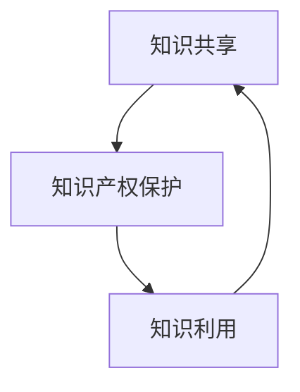

                 

# 《知识的共享与保护：开放科学与知识产权》

> **关键词：** 开放科学、知识产权、知识共享、保护机制、技术创新

> **摘要：** 本文旨在探讨开放科学与知识产权之间的关系，分析知识产权在开放科学中的保护与利用，探讨开放科学中的知识产权争议，以及未来知识产权保护的发展趋势。文章从基本概念、法律框架、应用策略、项目实践等多个角度进行深入分析，为开放科学领域提供知识产权保护的参考。

---

### 《知识的共享与保护：开放科学与知识产权》目录大纲

#### 第一部分：开放科学与知识产权概述

##### 第1章：开放科学与知识产权的基本概念

- **1.1 开放科学的概念与发展**
  - **1.1.1 开放科学的定义与特点**
  - **1.1.2 开放科学的主要形式**
  - **1.1.3 开放科学的优势与挑战**

- **1.2 知识产权的定义与类型**
  - **1.2.1 知识产权的概念**
  - **1.2.2 知识产权的主要类型**
  - **1.2.3 知识产权的保护机制**

- **1.3 开放科学与知识产权的关系**
  - **1.3.1 开放科学对知识产权的影响**
  - **1.3.2 知识产权对开放科学的支持与制约**
  - **1.3.3 案例分析：开放科学中的知识产权问题**

##### 第2章：开放科学与知识产权的法律框架

- **2.1 全球开放科学与知识产权法律法规概述**
  - **2.1.1 开放科学与知识产权国际立法的演变**
  - **2.1.2 开放科学与知识产权的国际条约**
  - **2.1.3 开放科学与知识产权的主要法律体系**

- **2.2 开放科学知识产权管理的主要模式**
  - **2.2.1 开放许可协议**
  - **2.2.2 开放知识共享平台**
  - **2.2.3 开源软件开发模式**
  - **2.2.4 开放科学知识产权管理的挑战与解决方案**

#### 第二部分：知识产权保护在开放科学中的应用

##### 第3章：知识产权保护在开放科学中的挑战与策略

- **3.1 开放科学中的知识产权争议**
  - **3.1.1 开放科学知识产权争议的类型**
  - **3.1.2 开放科学知识产权争议的案例分析**
  - **3.1.3 开放科学知识产权争议的解决途径**

- **3.2 保护知识产权的策略**
  - **3.2.1 知识产权保护策略的制定**
  - **3.2.2 保护知识产权的技术手段**
  - **3.2.3 知识产权保护的实践案例分析**

- **3.3 开放科学与知识产权的平衡**
  - **3.3.1 保护知识产权与促进知识共享的平衡**
  - **3.3.2 开放科学知识产权保护的最佳实践**
  - **3.3.3 案例分析：实现知识产权保护与开放共享的平衡**

##### 第4章：知识产权保护在开放科学项目的实践

- **4.1 开放科学项目的知识产权管理**
  - **4.1.1 开放科学项目的知识产权策略**
  - **4.1.2 开放科学项目的知识产权风险识别与管理**
  - **4.1.3 开放科学项目的知识产权合作与共享**

- **4.2 开放科学项目的知识产权实施**
  - **4.2.1 开放科学项目的知识产权保护措施**
  - **4.2.2 开放科学项目的知识产权监控与评估**
  - **4.2.3 开放科学项目的知识产权纠纷处理与应对**

- **4.3 开放科学项目的知识产权案例研究**
  - **4.3.1 开源软件知识产权保护案例**
  - **4.3.2 知识共享平台知识产权保护案例**
  - **4.3.3 开放科学项目中知识产权保护的成功经验与挑战**

#### 第三部分：知识产权保护的未来趋势

##### 第5章：知识产权保护在开放科学中的未来发展

- **5.1 知识产权保护与开放科学的创新**
  - **5.1.1 知识产权保护对开放科学创新的影响**
  - **5.1.2 开放科学创新中的知识产权问题与对策**
  - **5.1.3 案例分析：知识产权保护与开放科学创新的互动**

- **5.2 知识产权保护的新技术与应用**
  - **5.2.1 区块链技术在知识产权保护中的应用**
  - **5.2.2 人工智能在知识产权管理中的应用**
  - **5.2.3 知识产权保护的未来趋势与展望**

- **5.3 知识产权保护与开放科学的全球化**
  - **5.3.1 全球知识产权保护的发展趋势**
  - **5.3.2 全球开放科学知识产权保护的挑战与机遇**
  - **5.3.3 国际合作与知识产权保护的未来**

##### 附录

- **附录 A：开放科学与知识产权相关资源与工具**
- **附录 B：知识产权保护与开放科学常见问题解答**

---

### 第一部分：开放科学与知识产权概述

#### 第1章：开放科学与知识产权的基本概念

##### 1.1 开放科学的概念与发展

**1.1.1 开放科学的定义与特点**

开放科学（Open Science）是指将科学研究过程、数据和成果向公众开放，以促进知识共享、提高科研效率、增强科研透明度和可重复性。开放科学的定义可以归纳为以下几个方面：

- **过程开放**：科学研究的过程应向公众开放，包括科研设计、数据收集、数据处理、分析方法和结果等。
- **数据开放**：科研数据应尽可能公开，以便其他研究者进行验证、复现和扩展研究。
- **成果开放**：科研成果，如论文、报告和专利等，应免费或低成本地提供给公众。
- **工具和资源开放**：科研工具和资源，如实验设备、软件和数据库等，应免费或低成本地提供给其他研究者。

开放科学的特点主要体现在以下几个方面：

- **知识共享**：开放科学强调知识共享，鼓励科研者公开自己的研究成果和过程，以促进知识的传播和利用。
- **透明性和可重复性**：开放科学通过公开科研过程和成果，提高科研的透明性和可重复性，减少科研的不确定性和错误。
- **合作与协同**：开放科学鼓励不同领域、不同机构、不同国家的科研者之间的合作，实现科研协同和知识集成。
- **降低成本**：开放科学通过共享资源、工具和成果，降低科研成本，提高科研效率。

**1.1.2 开放科学的主要形式**

开放科学的形式多种多样，主要包括以下几个方面：

- **开放获取（Open Access）**：开放获取是指科研成果以免费或低成本的方式向公众开放。开放获取可以通过期刊、预印本服务器、数据库等方式实现。
- **开放数据（Open Data）**：开放数据是指科研数据以机器可读的方式向公众开放，以便其他研究者进行验证、复现和扩展研究。
- **开放方法（Open Methods）**：开放方法是指将科研方法、实验设计和数据分析等过程公开，以便其他研究者进行评估和改进。
- **开放工具（Open Tools）**：开放工具是指将科研工具和资源，如软件、数据库、计算平台等向公众开放，以便其他研究者使用和改进。
- **开源软件（Open Source Software）**：开源软件是指软件源代码向公众开放，允许其他研究者自由使用、修改和分发。

**1.1.3 开放科学的优势与挑战**

开放科学具有许多优势，但也面临着一些挑战。以下分别介绍：

**优势：**

- **知识共享**：开放科学通过开放过程、数据和成果，促进知识共享，提高科研透明度和可信度。
- **提高科研效率**：开放科学通过共享资源、工具和成果，降低科研成本，提高科研效率。
- **促进创新**：开放科学鼓励不同领域、不同机构、不同国家的科研者之间的合作，实现科研协同和知识集成，促进创新。
- **提高科研透明性和可重复性**：开放科学通过公开科研过程和成果，提高科研的透明性和可重复性，减少科研的不确定性和错误。
- **公众参与**：开放科学鼓励公众参与科研过程，提高科研的社会价值和影响力。

**挑战：**

- **知识产权问题**：开放科学可能涉及知识产权的保护和利用，如何平衡知识产权保护与知识共享成为挑战。
- **数据质量和隐私**：开放数据可能存在质量和隐私问题，如何确保数据质量和保护个人隐私成为挑战。
- **科研诚信问题**：开放科学可能面临科研不端行为的问题，如数据造假、重复发表等，如何确保科研诚信成为挑战。
- **法律和伦理问题**：开放科学可能涉及法律和伦理问题，如版权、隐私保护、知识产权等，如何解决这些法律和伦理问题成为挑战。
- **技术支持**：开放科学需要强大的技术支持，如数据存储、传输、分析等，如何提供技术支持成为挑战。

##### 1.2 知识产权的定义与类型

**1.2.1 知识产权的概念**

知识产权（Intellectual Property，简称IP）是指人们对其创造的智力成果所享有的专有权利。知识产权主要包括专利、商标、著作权、商业秘密、地理标志等。知识产权是法律、经济、技术等多重因素的综合体现，具有以下特点：

- **无形性**：知识产权是一种无形的财产权利，不占有物理空间，但具有经济价值。
- **专有性**：知识产权具有专有性，即知识产权权利人对其知识产权享有独占性的权利，其他人未经许可不得使用。
- **地域性**：知识产权的保护具有地域性，不同国家和地区的知识产权法律制度可能不同，知识产权的保护范围和期限也可能不同。
- **时效性**：知识产权的保护具有时效性，如专利的保护期限一般为20年，商标的保护期限一般为10年。

**1.2.2 知识产权的主要类型**

知识产权的主要类型包括专利、商标、著作权、商业秘密、地理标志等，下面分别介绍：

- **专利**：专利是指对发明、实用新型和外观设计等授予的专有权利。专利分为发明专利、实用新型专利和外观设计专利三种，其中发明专利的保护期限一般为20年，实用新型专利和外观设计专利的保护期限一般为10年。

- **商标**：商标是指用于区分商品或服务来源的标识。商标的保护期限一般为10年，可以无限次续展。

- **著作权**：著作权是指对作品享有的专有权利，如文字作品、音乐作品、美术作品等。著作权的保护期限一般为作者终生及其去世后50年。

- **商业秘密**：商业秘密是指不为公众所知悉、具有商业价值并经权利人采取保密措施的技术信息和经营信息。商业秘密的保护期限为无限期，只要权利人采取保密措施，就可以持续保护。

- **地理标志**：地理标志是指表示商品的特定质量、声誉或其他特性与地理环境有关的标志。地理标志的保护期限一般为10年，可以无限次续展。

**1.2.3 知识产权的保护机制**

知识产权的保护机制主要包括以下几个方面：

- **法律保护**：知识产权法律是保护知识产权的基础，各国制定了一系列知识产权法律，如《专利法》、《商标法》、《著作权法》等。

- **行政保护**：知识产权行政机关负责知识产权的登记、审查、保护等工作。如我国的专利局、商标局等。

- **司法保护**：知识产权司法保护是知识产权保护的重要手段，通过诉讼解决知识产权争议。

- **技术保护**：技术保护是指通过技术手段保护知识产权，如数字水印、加密技术等。

- **社会监督**：社会监督是知识产权保护的重要环节，公众和媒体可以监督知识产权的保护工作，提高知识产权保护的社会责任感。

##### 1.3 开放科学与知识产权的关系

**1.3.1 开放科学对知识产权的影响**

开放科学对知识产权的影响主要表现在以下几个方面：

- **知识产权保护意识的提高**：开放科学鼓励知识共享，使知识产权保护成为科研的重要议题，提高了科研者对知识产权保护的意识。

- **知识产权保护机制的完善**：开放科学推动知识产权保护机制的完善，如开放获取、开放数据等机制，使知识产权保护更加灵活和高效。

- **知识产权保护与知识共享的平衡**：开放科学强调知识共享与知识产权保护的平衡，如何在开放共享的同时保护知识产权成为关键问题。

- **知识产权争议的增加**：开放科学可能导致知识产权争议的增加，如数据隐私、知识产权归属等，需要合理解决。

**1.3.2 知识产权对开放科学的支持与制约**

知识产权对开放科学的支持与制约主要体现在以下几个方面：

- **支持方面**：知识产权可以为开放科学提供保护，激励科研者的创新活动。知识产权法律体系可以为开放科学提供法律保障，维护科研者的合法权益。

- **制约方面**：知识产权可能制约开放科学的进程，如知识产权的壁垒可能阻碍知识共享和传播。知识产权的申请和保护成本较高，可能影响开放科学的普及。

- **平衡方面**：知识产权保护与开放科学的平衡是关键，如何在保护知识产权的同时促进知识共享和开放科学的发展是重要问题。

**1.3.3 案例分析：开放科学中的知识产权问题**

以下是几个开放科学中的知识产权案例：

- **案例1**：某科研团队在开放获取期刊上发表了一篇关于基因编辑的研究论文，但论文中涉及到的实验数据和计算方法未公开，引起了其他研究者的质疑。

- **案例2**：某知名科技公司在开源软件项目中使用了某专利技术，但未获得专利持有者的许可，引发知识产权争议。

- **案例3**：某大学在开放数据项目中公开了大量的科研数据，但由于数据质量和隐私问题，导致其他研究者难以复现和验证研究结果。

这些案例表明，开放科学中的知识产权问题涉及到知识共享、知识产权保护、科研诚信等多个方面，需要合理解决。

##### 1.4 开放科学与知识产权的未来发展

随着科技的发展和全球化的推进，开放科学与知识产权将面临新的机遇和挑战。未来，开放科学与知识产权的发展趋势可能包括以下几个方面：

- **知识产权保护机制的完善**：各国将进一步完善知识产权法律体系，提高知识产权保护的效率和效果。

- **知识产权保护与知识共享的平衡**：开放科学将更加注重知识产权保护与知识共享的平衡，制定合理的知识产权政策和规范。

- **技术手段的创新**：将采用更多创新的技术手段，如区块链、人工智能等，提高知识产权保护和管理的效率。

- **国际合作与交流**：全球开放科学和知识产权领域将加强国际合作与交流，推动知识产权保护与知识共享的全球化。

- **公众参与**：开放科学将鼓励公众参与科研过程，提高科研的社会价值和影响力，同时加强对知识产权保护的社会监督。

总之，开放科学与知识产权的关系将更加紧密，二者相互促进、相互制约，共同推动科研和社会的发展。

---

**总结：** 本章介绍了开放科学与知识产权的基本概念、主要形式、优势与挑战，以及知识产权的定义、类型和保护机制。同时，分析了开放科学对知识产权的影响和知识产权对开放科学的支持与制约，并通过案例分析探讨了开放科学中的知识产权问题。这些内容为后续章节的讨论奠定了基础。

**下一章内容预告：** 下一章将介绍全球开放科学与知识产权法律法规的概述，探讨开放科学知识产权管理的主要模式，分析开放科学中的知识产权争议及其解决途径。敬请期待！

---

### 第二部分：知识产权保护在开放科学中的应用

#### 第3章：知识产权保护在开放科学中的挑战与策略

##### 3.1 开放科学中的知识产权争议

开放科学鼓励知识共享，但也带来了一系列的知识产权争议。以下分析开放科学中常见的知识产权争议类型及其解决途径。

**3.1.1 开放科学知识产权争议的类型**

1. **数据共享中的知识产权争议**：开放数据是开放科学的重要组成部分，但数据共享可能引发知识产权争议。例如，数据提供者担心其数据被未经授权的使用或滥用，而数据使用者则希望最大限度地利用开放数据。此类争议通常涉及数据的版权、隐私保护和使用权限等问题。

2. **成果共享中的知识产权争议**：开放获取是开放科学的重要形式，但科研成果的共享可能引发知识产权争议。例如，当科研人员将研究成果发表在开放获取期刊上时，可能会涉及到版权转让、署名权、专利权等问题。

3. **工具和资源共享中的知识产权争议**：开放科学中，工具和资源的共享也可能会引发知识产权争议。例如，开源软件和开放工具的开发和使用可能涉及到版权、专利权等问题。

**3.1.2 开放科学知识产权争议的案例分析**

1. **数据共享争议案例分析**：某科研团队公开了一份数据集，但数据集中包含了个人的敏感信息。其他研究者在使用数据时，因涉及个人隐私问题而引发争议。

2. **成果共享争议案例分析**：某科研人员将研究成果发表在开放获取期刊上，但未与共同作者明确约定知识产权归属和收益分配，引发知识产权争议。

3. **工具和资源共享争议案例分析**：某开源软件项目因涉及到某项专利，未获得专利持有者的许可，导致专利持有者提出知识产权争议。

**3.1.3 开放科学知识产权争议的解决途径**

1. **法律途径**：通过法律途径解决知识产权争议是最为正式和有效的手段。涉及知识产权争议时，可以通过诉讼、仲裁等方式解决。

2. **协商途径**：协商是解决知识产权争议的一种非正式途径。争议各方可以通过谈判、调解等方式达成一致。

3. **标准化途径**：制定和遵守标准化知识产权政策和协议，如开放许可协议，可以减少知识产权争议。

4. **社区途径**：建立开放科学的社区，促进科研者之间的沟通与合作，提高知识产权争议的解决效率。

##### 3.2 保护知识产权的策略

在开放科学中，保护知识产权是一项重要任务。以下分析保护知识产权的策略。

**3.2.1 知识产权保护策略的制定**

1. **明确知识产权政策**：制定明确的知识产权政策，明确知识产权的归属、使用和收益分配等事项，减少知识产权争议。

2. **建立健全的法律体系**：建立健全的知识产权法律体系，确保知识产权的保护和实施。

3. **加强知识产权意识**：加强科研者的知识产权意识，提高其对知识产权保护的重要性的认识。

**3.2.2 保护知识产权的技术手段**

1. **数据加密**：对敏感数据进行加密，保护个人隐私和商业秘密。

2. **数字水印**：在数据或成果中嵌入数字水印，以追踪数据的来源和用途。

3. **权限管理**：通过权限管理技术，控制对数据和成果的访问和使用。

**3.2.3 知识产权保护的实践案例分析**

1. **数据共享实践案例分析**：某科研团队在公开数据时，采用加密和权限管理技术，确保数据的隐私和安全。

2. **成果共享实践案例分析**：某科研人员在发表研究成果时，选择开放获取期刊，并明确约定知识产权归属和收益分配。

3. **工具和资源共享实践案例分析**：某开源软件项目采用开源协议，明确版权和专利权归属，并通过社区合作提高知识产权保护效果。

##### 3.3 开放科学与知识产权的平衡

开放科学与知识产权之间存在一定的矛盾，如何在二者之间实现平衡是开放科学中的重要问题。以下探讨开放科学与知识产权平衡的策略。

**3.3.1 保护知识产权与促进知识共享的平衡**

1. **合理分配知识产权收益**：通过合理的收益分配机制，激励科研者进行知识共享，同时保护知识产权。

2. **灵活的知识产权政策**：根据不同领域的特点，制定灵活的知识产权政策，平衡知识产权保护与知识共享。

3. **加强知识产权管理与监督**：建立健全的知识产权管理体系，加强对知识产权的监督和管理，确保知识产权的合理使用。

**3.3.2 开放科学知识产权保护的最佳实践**

1. **开源软件的最佳实践**：开源软件采用开源协议，明确知识产权归属，并通过社区合作实现知识产权保护。

2. **开放数据共享的最佳实践**：开放数据采用开放许可协议，确保数据的合法使用，同时保护个人隐私和商业秘密。

3. **科研成果共享的最佳实践**：科研成果采用开放获取期刊，明确知识产权归属和收益分配，促进科研成果的共享。

**3.3.3 案例分析：实现知识产权保护与开放共享的平衡**

1. **案例分析：某科研团队在公开数据时，采用加密和权限管理技术，确保数据的隐私和安全，同时促进数据共享和利用。**

2. **案例分析：某科研人员在发表研究成果时，选择开放获取期刊，并与共同作者明确约定知识产权归属和收益分配，实现知识产权保护与知识共享的平衡。**

3. **案例分析：某开源软件项目采用开源协议，通过社区合作实现知识产权保护，同时促进开源软件的发展和普及。**

##### 3.4 知识产权争议的解决

在开放科学中，知识产权争议难以避免，但通过合理的解决途径可以减轻争议的影响。以下探讨知识产权争议的解决途径。

**3.4.1 协商解决**：通过协商解决争议，是解决知识产权争议的首选方式。协商可以降低解决争议的成本，保护各方利益。

**3.4.2 调解解决**：在协商无效时，可以寻求第三方调解解决争议。调解是一种灵活、高效的方式，可以避免争议升级。

**3.4.3 司法解决**：当协商和调解无法解决争议时，可以采取司法途径解决争议。司法途径具有权威性和法律效力，但成本较高。

**3.4.4 国际合作解决**：在全球开放科学中，知识产权争议的解决需要国际合作。通过国际条约、合作机制等方式，解决跨国知识产权争议。

##### 3.5 小结

知识产权保护在开放科学中具有重要意义。通过合理的知识产权保护策略，可以实现知识产权保护与知识共享的平衡，促进开放科学的发展。同时，解决知识产权争议，是保障开放科学顺利进行的重要环节。未来，随着开放科学的不断推进，知识产权保护与知识共享的平衡将更加重要，需要持续关注和探讨。

---

**下一章内容预告：** 下一章将探讨开放科学项目的知识产权管理、知识产权保护措施、知识产权监控与评估，以及知识产权纠纷处理与应对。敬请期待！

### 第三部分：知识产权保护在开放科学项目的实践

#### 第4章：知识产权保护在开放科学项目的实践

##### 4.1 开放科学项目的知识产权管理

在开放科学项目中，知识产权管理是确保项目顺利进行和成果有效保护的重要环节。以下从知识产权策略、风险识别与管理、合作与共享等方面探讨开放科学项目的知识产权管理。

**4.1.1 开放科学项目的知识产权策略**

1. **明确知识产权政策**：开放科学项目应制定明确的知识产权政策，明确知识产权的归属、使用、收益分配等事项。政策应涵盖数据、工具、软件、成果等多个方面。

2. **合理分配知识产权收益**：开放科学项目应建立合理的知识产权收益分配机制，确保各方利益平衡。收益分配机制应考虑项目特点、知识产权类型、项目参与者的贡献等因素。

3. **知识产权保护优先级**：在制定知识产权策略时，应明确知识产权保护的优先级。对于关键技术和核心成果，应采取更加严格的保护措施。

**4.1.2 开放科学项目的知识产权风险识别与管理**

1. **风险评估**：开放科学项目应进行知识产权风险评估，识别潜在的风险点。风险评估应考虑项目的特点、技术领域、合作方背景等因素。

2. **风险分类与分级**：根据风险评估结果，将风险分为不同类别和等级，制定相应的风险管理策略。风险分类和分级有助于明确管理重点，提高风险管理效率。

3. **风险监控**：建立知识产权风险监控机制，定期对项目进行知识产权风险评估，及时发现和应对潜在风险。

**4.1.3 开放科学项目的知识产权合作与共享**

1. **合作方筛选**：在开放科学项目中，选择合适的合作方至关重要。合作方应具备良好的信誉、专业的技术能力和合理的知识产权政策。

2. **合作协议**：在合作前，应与各方签订详细、明确的合作协议，明确各方的权利、义务和责任。合作协议应包括知识产权归属、使用、收益分配等事项。

3. **共享平台**：利用共享平台，促进知识产权的共享和传播。共享平台应具备数据存储、权限管理、安全防护等功能，确保知识产权的安全和合法使用。

**4.1.4 知识产权纠纷处理与应对**

1. **纠纷预防**：通过完善知识产权政策、签订明确合作协议等方式，预防知识产权纠纷的发生。

2. **纠纷解决途径**：当知识产权纠纷发生时，可以通过协商、调解、仲裁、诉讼等方式解决。在解决纠纷时，应充分考虑项目的实际情况、各方利益和法律法规要求。

3. **知识产权培训与宣传**：定期开展知识产权培训与宣传活动，提高项目参与者的知识产权意识，减少纠纷的发生。

##### 4.2 开放科学项目的知识产权保护措施

在开放科学项目中，知识产权保护措施是确保知识产权安全的重要手段。以下从技术手段、法律手段、管理手段等方面探讨开放科学项目的知识产权保护措施。

**4.2.1 技术手段**

1. **数据加密**：对敏感数据进行加密，确保数据在传输和存储过程中的安全。

2. **数字签名**：采用数字签名技术，确保数据或文档的完整性和真实性。

3. **访问控制**：通过访问控制技术，限制对数据和成果的访问，确保知识产权的安全。

4. **技术监控**：采用技术监控手段，监测知识产权的非法使用和传播，及时发现和应对潜在风险。

**4.2.2 法律手段**

1. **知识产权登记**：在必要时，对关键技术和核心成果进行知识产权登记，获得法律保护。

2. **法律咨询**：在项目过程中，及时咨询专业法律人士，确保项目的合法性和知识产权保护。

3. **法律诉讼**：在知识产权侵权事件发生时，及时采取法律手段，维护自身合法权益。

**4.2.3 管理手段**

1. **知识产权管理制度**：建立完善的知识产权管理制度，明确知识产权的归属、使用、收益分配等事项。

2. **知识产权预算**：制定知识产权预算，确保项目有足够的资金支持知识产权的保护和实施。

3. **知识产权培训**：定期开展知识产权培训，提高项目参与者的知识产权意识，减少侵权事件的发生。

**4.2.4 知识产权保护实践案例分析**

1. **案例分析：某开放科学项目采用数据加密和访问控制技术，确保数据的隐私和安全。**

2. **案例分析：某开放科学项目在项目启动时，进行了知识产权风险评估和登记，成功防范了潜在的风险。**

3. **案例分析：某开放科学项目在知识产权侵权事件发生时，及时采取法律手段，维护了自身合法权益。**

##### 4.3 开放科学项目的知识产权监控与评估

在开放科学项目中，知识产权监控与评估是确保知识产权保护效果的重要手段。以下从监控方法、评估指标、评估结果应用等方面探讨开放科学项目的知识产权监控与评估。

**4.3.1 知识产权监控方法**

1. **技术监控**：利用技术手段，监控知识产权的非法使用和传播，如数据加密破解、代码抄袭等。

2. **法律监控**：通过法律途径，监控知识产权的侵权行为，如专利侵权、商标侵权等。

3. **市场监控**：关注市场动态，监控知识产权的竞争态势，如竞争对手的产品、技术动态等。

**4.3.2 知识产权评估指标**

1. **知识产权保护力度**：评估知识产权保护措施的强度和有效性，如加密技术、访问控制等。

2. **知识产权实施效果**：评估知识产权保护措施的实际效果，如侵权事件的发生频率、侵权事件的解决情况等。

3. **知识产权收益**：评估知识产权带来的经济收益，如专利授权费、商标许可费等。

**4.3.3 知识产权评估结果应用**

1. **改进知识产权保护措施**：根据评估结果，优化和改进知识产权保护措施，提高知识产权保护效果。

2. **调整知识产权策略**：根据评估结果，调整知识产权策略，确保知识产权保护与知识共享的平衡。

3. **制定知识产权规划**：根据评估结果，制定知识产权规划，为未来项目的知识产权管理提供指导。

**4.3.4 知识产权监控与评估实践案例分析**

1. **案例分析：某开放科学项目通过技术监控和法律监控，及时发现并解决了多起知识产权侵权事件。**

2. **案例分析：某开放科学项目根据评估结果，优化了知识产权保护措施，提高了知识产权保护效果。**

3. **案例分析：某开放科学项目根据评估结果，制定了知识产权规划，为未来项目的知识产权管理提供了明确的方向。**

##### 4.4 知识产权纠纷处理与应对

在开放科学项目中，知识产权纠纷难以避免。以下从纠纷处理原则、处理流程、应对策略等方面探讨知识产权纠纷处理与应对。

**4.4.1 知识产权纠纷处理原则**

1. **合法合规**：处理知识产权纠纷时，应遵循法律法规和知识产权政策，确保处理结果合法合规。

2. **公平公正**：处理知识产权纠纷时，应确保各方利益平衡，公平公正地解决争议。

3. **及时有效**：处理知识产权纠纷时，应采取及时有效的措施，降低纠纷对项目的负面影响。

**4.4.2 知识产权纠纷处理流程**

1. **纠纷发生**：当知识产权纠纷发生时，项目组应立即采取应对措施，如暂停相关合作、保护证据等。

2. **协商解决**：通过协商解决纠纷，是处理知识产权纠纷的首选途径。协商过程中，应充分考虑各方利益，寻求共同利益最大化。

3. **调解解决**：在协商无效时，可以寻求第三方调解解决纠纷。调解过程应遵循公平公正原则，确保调解结果的合法性和有效性。

4. **仲裁解决**：当调解无效时，可以采取仲裁方式解决纠纷。仲裁程序具有灵活性和高效性，但成本较高。

5. **诉讼解决**：在仲裁无效时，可以采取诉讼方式解决纠纷。诉讼程序具有权威性和法律效力，但成本较高。

**4.4.3 知识产权纠纷应对策略**

1. **预防纠纷**：通过完善知识产权政策、签订明确合作协议等方式，预防知识产权纠纷的发生。

2. **快速应对**：当知识产权纠纷发生时，应立即采取应对措施，如暂停相关合作、收集证据等。

3. **法律咨询**：在处理知识产权纠纷时，应及时咨询专业法律人士，确保处理结果合法合规。

4. **积极沟通**：与争议方保持积极沟通，寻求共识，降低纠纷解决成本。

**4.4.4 知识产权纠纷处理实践案例分析**

1. **案例分析：某开放科学项目在知识产权纠纷发生时，通过积极沟通和调解，成功解决了争议。**

2. **案例分析：某开放科学项目在知识产权纠纷发生时，及时采取法律手段，维护了自身合法权益。**

3. **案例分析：某开放科学项目通过完善知识产权政策和管理制度，预防了多起知识产权纠纷的发生。**

##### 4.5 小结

开放科学项目的知识产权管理是确保项目顺利进行和成果有效保护的重要环节。通过制定合理的知识产权策略、采取有效的知识产权保护措施、建立完善的知识产权监控与评估机制，可以实现对知识产权的有效保护。同时，在知识产权纠纷发生时，采取适当的处理与应对策略，可以降低纠纷对项目的负面影响，确保项目的顺利进行。

---

**下一章内容预告：** 下一章将探讨知识产权保护的未来发展趋势，包括新技术应用、全球知识产权保护政策的发展趋势以及知识产权保护与开放科学的未来展望。敬请期待！

### 第四部分：知识产权保护的未来趋势

#### 第5章：知识产权保护在开放科学中的未来发展

##### 5.1 知识产权保护与开放科学的创新

知识产权保护在开放科学中的未来发展，将紧密围绕如何平衡知识产权保护与促进科学创新展开。以下分析知识产权保护对开放科学创新的影响及应对策略。

**5.1.1 知识产权保护对开放科学创新的影响**

1. **激励创新**：知识产权保护可以为科研人员提供创新的动力，因为他们在创造新知识和技术时，可以期待从自己的成果中获得经济回报。

2. **阻碍创新**：过度的知识产权保护可能导致知识产权壁垒，限制知识的流动，从而阻碍科学创新。尤其是对于那些需要大量引用现有研究成果的新研究，知识产权壁垒可能成为一个障碍。

3. **促进知识共享**：知识产权保护可以通过开放许可协议等方式，促进知识共享，让更多的人参与到科学创新中来。

**5.1.2 开放科学创新中的知识产权问题与对策**

1. **知识产权透明度**：提高知识产权的透明度，使科研人员更容易了解相关知识产权的状态，避免不必要的侵权行为。

2. **知识产权灵活管理**：通过灵活的知识产权管理策略，如开放许可协议、共享专利等，减少知识产权壁垒，促进创新。

3. **多元化知识产权保护**：除了传统的专利、著作权等，探索新的知识产权形式，如数据权、算法权等，以适应开放科学的多样化需求。

**5.1.3 案例分析：知识产权保护与开放科学创新的互动**

1. **案例分析：某开源软件项目通过开源协议，实现了知识产权保护与创新的平衡，成为全球开源社区的成功典范。**

2. **案例分析：某开放科学实验室通过开放许可协议，共享其研究成果，激发了全球范围内的科研合作和创新。**

##### 5.2 知识产权保护的新技术与应用

随着科技的不断进步，新技术在知识产权保护中的应用越来越广泛，以下探讨区块链、人工智能等新技术在知识产权保护中的应用。

**5.2.1 区块链技术在知识产权保护中的应用**

1. **透明性**：区块链技术提供了一种透明、不可篡改的记录方式，有助于确保知识产权信息的真实性和完整性。

2. **自动化执行**：区块链智能合约可以自动化执行知识产权交易和许可协议，提高交易效率。

3. **安全性**：区块链技术的加密特性，可以增强知识产权数据的安全性和隐私保护。

**5.2.2 人工智能在知识产权管理中的应用**

1. **知识产权风险识别**：人工智能可以分析大量的知识产权数据，快速识别潜在的知识产权风险。

2. **知识产权自动化保护**：通过机器学习，人工智能可以自动化知识产权的监测和保护，减少人力成本。

3. **知识产权分析**：人工智能可以辅助知识产权分析，如专利相似性分析、市场趋势预测等。

**5.2.3 知识产权保护的未来趋势与展望**

1. **去中心化知识产权管理**：随着区块链技术的发展，去中心化的知识产权管理将成为可能，减少对中心化机构的依赖。

2. **智能化知识产权保护**：人工智能技术的进一步发展，将使知识产权保护更加智能化，提高保护效果。

3. **全球化知识产权合作**：随着全球化的推进，国际间的知识产权合作将更加紧密，共同应对知识产权挑战。

##### 5.3 知识产权保护与开放科学的全球化

全球知识产权保护的趋势，不仅反映了科技进步和法律制度的发展，也体现了国际社会对知识产权保护的共同关注。以下分析全球知识产权保护的发展趋势及国际合作。

**5.3.1 全球知识产权保护的发展趋势**

1. **加强知识产权立法**：各国纷纷加强知识产权立法，提高知识产权保护的力度和效率。

2. **知识产权国际条约**：国际社会通过制定和签订知识产权国际条约，推动知识产权保护的全球化。

3. **知识产权执法**：加强知识产权执法，打击知识产权侵权行为，保护知识产权权利人的合法权益。

**5.3.2 全球开放科学知识产权保护的挑战与机遇**

1. **挑战**：全球化带来了知识产权保护的挑战，如知识产权壁垒、知识产权争议的跨国解决等。

2. **机遇**：全球化也带来了知识产权保护的机遇，如国际合作、知识产权信息共享等。

**5.3.3 国际合作与知识产权保护的未来**

1. **国际协调**：加强国际协调，制定统一的知识产权保护标准，提高全球知识产权保护的一致性。

2. **技术合作**：推动知识产权保护技术的国际交流与合作，提高知识产权保护的技术水平。

3. **公共政策的协调**：协调各国知识产权政策，促进开放科学在全球范围内的发展。

##### 5.4 小结

知识产权保护在开放科学中的未来发展，将依赖于技术创新、法律制度完善和国际合作。通过加强知识产权保护，促进知识共享和创新，开放科学将迎来更加美好的未来。

---

**下一章内容预告：** 下一章将介绍开放科学与知识产权的相关资源与工具，并回答读者可能关心的常见问题。敬请期待！

### 第五部分：知识产权保护的未来趋势

#### 第5章：知识产权保护在开放科学中的未来发展

##### 5.1 知识产权保护与开放科学的创新

**5.1.1 知识产权保护对开放科学创新的影响**

知识产权保护在开放科学中扮演着双重角色。一方面，它激励科研人员投入时间和资源进行创新，因为他们可以预期从自己的劳动成果中获得回报。这种激励机制是科学研究和技术进步的重要驱动力。然而，另一方面，过度的知识产权保护可能导致知识产权壁垒，阻碍知识的自由流动，从而可能阻碍科学创新。

**挑战**：知识产权壁垒可能成为新研究项目的障碍，特别是在需要引用大量现有研究成果的情况下。这可能会导致科研人员为了避免侵权而选择规避现有技术，从而可能错失科学创新的机会。

**对策**：

1. **开放许可协议**：开放许可协议（如Creative Commons许可）允许科研人员在保护自己知识产权的同时，为他人提供更广泛的访问和使用权限，从而在促进知识共享的同时，保护创新者的权益。

2. **多元化知识产权策略**：采用多元化的知识产权策略，如共享专利和开放专利，可以鼓励更多的合作和知识共享，从而促进科学创新。

3. **加强知识产权透明度**：提高知识产权信息的透明度，使科研人员更容易了解相关知识产权的状态，有助于减少不必要的侵权行为，同时鼓励更多的创新。

**5.1.2 开放科学创新中的知识产权问题与对策**

在开放科学环境中，知识产权问题往往比传统科研环境更加复杂。以下是一些常见的问题和相应的对策：

**问题**：知识产权争议的增加

**对策**：

1. **纠纷预防和解决机制**：建立完善的纠纷预防和解决机制，包括签订明确合作协议、提供知识产权咨询和培训等。

2. **知识产权仲裁和调解**：利用仲裁和调解等非诉讼手段，快速、低成本地解决知识产权争议。

**问题**：知识产权管理的不透明

**对策**：

1. **透明度提升**：通过开放数据平台和知识产权信息管理系统，提高知识产权信息的透明度。

2. **标准化流程**：制定和实施标准化知识产权管理流程，确保知识产权的归属、使用和转让等环节的透明和可追溯。

**5.1.3 案例分析：知识产权保护与开放科学创新的互动**

**案例分析**：开放科学平台“ResearchGate”

“ResearchGate”是一个开放的科学社交网络平台，它允许科研人员分享论文、数据和代码。通过使用开放许可协议，科研人员可以在保护自己知识产权的同时，为他人提供访问和使用权限。这种模式促进了知识的共享和创新，同时也帮助科研人员建立自己的学术声誉。

**成功经验**：

- **知识共享**：通过开放许可协议，科研人员能够更自由地分享自己的研究成果，促进了知识共享。
- **知识产权保护**：开放许可协议为科研人员提供了灵活的知识产权保护方式，使他们能够在保护自己权益的同时，促进知识流动。

**挑战**：

- **版权纠纷**：由于研究成果的共享，可能会出现版权纠纷。平台需要提供清晰的版权政策和纠纷解决机制。

**结论**：“ResearchGate”的案例表明，开放许可协议和透明度提升是促进知识产权保护与开放科学创新平衡的有效途径。

##### 5.2 知识产权保护的新技术与应用

**5.2.1 区块链技术在知识产权保护中的应用**

区块链技术由于其不可篡改和透明的特性，在知识产权保护中具有巨大潜力。以下是其主要应用：

**应用1：知识产权记录**

区块链可以记录知识产权的创建、转让和使用情况，确保信息的完整性和透明度。

**应用2：智能合约**

智能合约可以在区块链上自动执行知识产权许可协议，从而提高许可协议的执行效率。

**应用3：版权声明**

区块链可以用来验证作品的版权声明，确保原创作品的归属权。

**案例**：MusicCoin

**案例描述**：MusicCoin是一个基于区块链的音乐共享平台，它允许音乐创作者直接与听众交易，避免了传统音乐产业中的中间环节。通过区块链，创作者可以确权、发行和交易音乐，同时确保交易的透明和可追溯。

**成功经验**：

- **透明度**：区块链提高了交易的透明度，使交易过程更加公正和可追溯。
- **版权保护**：通过区块链，创作者可以更容易地证明其作品的原创性。

**挑战**：

- **技术复杂性**：区块链技术相对复杂，需要专业的技术支持。
- **监管合规**：区块链应用需要符合各国的法律和监管要求。

##### 5.2.2 人工智能在知识产权管理中的应用

人工智能（AI）在知识产权管理中的应用正在不断扩展，以下是其主要应用：

**应用1：知识产权分析**

AI可以分析大量的知识产权数据，快速识别潜在的侵权行为或知识产权冲突。

**应用2：自动化许可**

AI可以自动化知识产权许可的审核和发放过程，提高许可效率。

**应用3：风险预测**

AI可以预测知识产权纠纷的风险，并提供相应的风险缓解策略。

**案例**：IBM的Watson知识产权分析平台

**案例描述**：IBM的Watson知识产权分析平台使用AI技术，提供全面的知识产权分析服务，包括专利搜索、相似性分析和风险预测等。

**成功经验**：

- **效率提升**：AI技术大大提高了知识产权管理的效率，减少了人力成本。
- **准确性提高**：AI技术可以更准确地识别和评估知识产权风险。

**挑战**：

- **数据质量**：AI的准确性依赖于数据质量，因此需要确保输入数据的准确性和完整性。
- **隐私保护**：AI技术在知识产权管理中的应用可能涉及个人隐私数据，需要确保数据的隐私保护。

##### 5.2.3 知识产权保护的未来趋势与展望

**趋势1：区块链与AI的融合**

区块链和AI的结合，将在知识产权保护中发挥更大的作用。例如，区块链可以提供透明和不可篡改的记录，而AI可以用于智能合约的执行和知识产权分析。

**趋势2：全球化知识产权合作**

随着全球化的推进，国际间的知识产权合作将更加紧密。各国将共同制定统一的知识产权标准，推动全球知识产权保护的一致性。

**趋势3：知识产权数字化**

知识产权的数字化管理将变得更加普遍。通过数字平台，知识产权的记录、许可和交易将变得更加高效和透明。

**展望**：

知识产权保护将在未来面临更多的挑战，如技术复杂性、数据隐私保护和全球合作等。但通过创新的技术手段和全球合作，知识产权保护将在开放科学中发挥更大的作用，促进知识共享和创新。

##### 5.3 知识产权保护与开放科学的全球化

**5.3.1 全球知识产权保护的发展趋势**

全球知识产权保护的发展趋势表现在以下几个方面：

**趋势1：知识产权立法的国际化**

各国纷纷加强知识产权立法，推动知识产权保护的国际协调。

**趋势2：知识产权执法的全球化**

国际社会加强知识产权执法合作，共同打击跨国知识产权侵权行为。

**趋势3：知识产权标准的统一**

通过国际条约和协议，推动知识产权标准的统一，提高知识产权保护的一致性。

**5.3.2 全球开放科学知识产权保护的挑战与机遇**

**挑战**：

- **跨国知识产权争议**：跨国知识产权争议的处理变得更加复杂，需要国际间的协调和合作。

- **知识产权壁垒**：知识产权壁垒可能导致知识流动受限，阻碍科学创新。

**机遇**：

- **知识共享**：全球化为知识共享提供了更广阔的空间，促进了全球科学合作。

- **知识产权技术**：全球化的推进促进了知识产权保护技术的跨国应用和合作。

**5.3.3 国际合作与知识产权保护的未来**

**未来展望**：

- **全球知识产权合作机制**：建立更加有效的全球知识产权合作机制，促进国际间的知识产权保护和知识共享。

- **技术合作**：加强知识产权保护技术的跨国合作，推动全球知识产权保护技术的共同发展。

- **知识产权教育**：加强知识产权教育，提高全球科研人员的知识产权意识，促进知识产权保护与科学创新。

##### 5.4 小结

知识产权保护在开放科学中的未来发展，将依赖于技术创新、法律制度完善和国际合作。通过加强知识产权保护，促进知识共享和创新，开放科学将迎来更加美好的未来。

---

**下一章内容预告：** 下一章将介绍开放科学与知识产权的相关资源与工具，并回答读者可能关心的常见问题。敬请期待！

### 第五部分：知识产权保护的未来趋势

#### 第5章：知识产权保护在开放科学中的未来发展

##### 5.1 知识产权保护与开放科学的创新

**5.1.1 知识产权保护对开放科学创新的影响**

知识产权保护在开放科学中扮演着双重角色。一方面，它激励科研人员投入时间和资源进行创新，因为他们可以预期从自己的劳动成果中获得回报。这种激励机制是科学研究和技术进步的重要驱动力。然而，另一方面，过度的知识产权保护可能导致知识产权壁垒，阻碍知识的自由流动，从而可能阻碍科学创新。

**挑战**：知识产权壁垒可能成为新研究项目的障碍，特别是在需要引用大量现有研究成果的情况下。这可能会导致科研人员为了避免侵权而选择规避现有技术，从而可能错失科学创新的机会。

**对策**：

1. **开放许可协议**：开放许可协议（如Creative Commons许可）允许科研人员在保护自己知识产权的同时，为他人提供更广泛的访问和使用权限，从而在促进知识共享的同时，保护创新者的权益。

2. **多元化知识产权策略**：采用多元化的知识产权策略，如共享专利和开放专利，可以鼓励更多的合作和知识共享，从而促进科学创新。

3. **加强知识产权透明度**：提高知识产权信息的透明度，使科研人员更容易了解相关知识产权的状态，有助于减少不必要的侵权行为，同时鼓励更多的创新。

**5.1.2 开放科学创新中的知识产权问题与对策**

在开放科学环境中，知识产权问题往往比传统科研环境更加复杂。以下是一些常见的问题和相应的对策：

**问题**：知识产权争议的增加

**对策**：

1. **纠纷预防和解决机制**：建立完善的纠纷预防和解决机制，包括签订明确合作协议、提供知识产权咨询和培训等。

2. **知识产权仲裁和调解**：利用仲裁和调解等非诉讼手段，快速、低成本地解决知识产权争议。

**问题**：知识产权管理的不透明

**对策**：

1. **透明度提升**：通过开放数据平台和知识产权信息管理系统，提高知识产权信息的透明度。

2. **标准化流程**：制定和实施标准化知识产权管理流程，确保知识产权的归属、使用和转让等环节的透明和可追溯。

**5.1.3 案例分析：知识产权保护与开放科学创新的互动**

**案例分析**：开放科学平台“ResearchGate”

“ResearchGate”是一个开放的科学社交网络平台，它允许科研人员分享论文、数据和代码。通过使用开放许可协议，科研人员可以在保护自己知识产权的同时，为他人提供访问和使用权限。这种模式促进了知识的共享和创新，同时也帮助科研人员建立自己的学术声誉。

**成功经验**：

- **知识共享**：通过开放许可协议，科研人员能够更自由地分享自己的研究成果，促进了知识共享。
- **知识产权保护**：开放许可协议为科研人员提供了灵活的知识产权保护方式，使他们能够在保护自己权益的同时，促进知识流动。

**挑战**：

- **版权纠纷**：由于研究成果的共享，可能会出现版权纠纷。平台需要提供清晰的版权政策和纠纷解决机制。

**结论**：“ResearchGate”的案例表明，开放许可协议和透明度提升是促进知识产权保护与开放科学创新平衡的有效途径。

##### 5.2 知识产权保护的新技术与应用

**5.2.1 区块链技术在知识产权保护中的应用**

区块链技术由于其不可篡改和透明的特性，在知识产权保护中具有巨大潜力。以下是其主要应用：

**应用1：知识产权记录**

区块链可以记录知识产权的创建、转让和使用情况，确保信息的完整性和透明度。

**应用2：智能合约**

智能合约可以在区块链上自动执行知识产权许可协议，从而提高许可协议的执行效率。

**应用3：版权声明**

区块链可以用来验证作品的版权声明，确保原创作品的归属权。

**案例**：MusicCoin

**案例描述**：MusicCoin是一个基于区块链的音乐共享平台，它允许音乐创作者直接与听众交易，避免了传统音乐产业中的中间环节。通过区块链，创作者可以确权、发行和交易音乐，同时确保交易的透明和可追溯。

**成功经验**：

- **透明度**：区块链提高了交易的透明度，使交易过程更加公正和可追溯。
- **版权保护**：通过区块链，创作者可以更容易地证明其作品的原创性。

**挑战**：

- **技术复杂性**：区块链技术相对复杂，需要专业的技术支持。
- **监管合规**：区块链应用需要符合各国的法律和监管要求。

##### 5.2.2 人工智能在知识产权管理中的应用

人工智能（AI）在知识产权管理中的应用正在不断扩展，以下是其主要应用：

**应用1：知识产权分析**

AI可以分析大量的知识产权数据，快速识别潜在的侵权行为或知识产权冲突。

**应用2：自动化许可**

AI可以自动化知识产权许可的审核和发放过程，提高许可效率。

**应用3：风险预测**

AI可以预测知识产权纠纷的风险，并提供相应的风险缓解策略。

**案例**：IBM的Watson知识产权分析平台

**案例描述**：IBM的Watson知识产权分析平台使用AI技术，提供全面的知识产权分析服务，包括专利搜索、相似性分析和风险预测等。

**成功经验**：

- **效率提升**：AI技术大大提高了知识产权管理的效率，减少了人力成本。
- **准确性提高**：AI技术可以更准确地识别和评估知识产权风险。

**挑战**：

- **数据质量**：AI的准确性依赖于数据质量，因此需要确保输入数据的准确性和完整性。
- **隐私保护**：AI技术在知识产权管理中的应用可能涉及个人隐私数据，需要确保数据的隐私保护。

##### 5.2.3 知识产权保护的未来趋势与展望

**趋势1：区块链与AI的融合**

区块链和AI的结合，将在知识产权保护中发挥更大的作用。例如，区块链可以提供透明和不可篡改的记录，而AI可以用于智能合约的执行和知识产权分析。

**趋势2：全球化知识产权合作**

随着全球化的推进，国际间的知识产权合作将更加紧密。各国将共同制定统一的知识产权标准，推动全球知识产权保护的一致性。

**趋势3：知识产权数字化**

知识产权的数字化管理将变得更加普遍。通过数字平台，知识产权的记录、许可和交易将变得更加高效和透明。

**展望**：

知识产权保护将在未来面临更多的挑战，如技术复杂性、数据隐私保护和全球合作等。但通过创新的技术手段和全球合作，知识产权保护将在开放科学中发挥更大的作用，促进知识共享和创新。

##### 5.3 知识产权保护与开放科学的全球化

**5.3.1 全球知识产权保护的发展趋势**

全球知识产权保护的发展趋势表现在以下几个方面：

**趋势1：知识产权立法的国际化**

各国纷纷加强知识产权立法，推动知识产权保护的国际协调。

**趋势2：知识产权执法的全球化**

国际社会加强知识产权执法合作，共同打击跨国知识产权侵权行为。

**趋势3：知识产权标准的统一**

通过国际条约和协议，推动知识产权标准的统一，提高知识产权保护的一致性。

**5.3.2 全球开放科学知识产权保护的挑战与机遇**

**挑战**：

- **跨国知识产权争议**：跨国知识产权争议的处理变得更加复杂，需要国际间的协调和合作。

- **知识产权壁垒**：知识产权壁垒可能导致知识流动受限，阻碍科学创新。

**机遇**：

- **知识共享**：全球化为知识共享提供了更广阔的空间，促进了全球科学合作。

- **知识产权技术**：全球化的推进促进了知识产权保护技术的跨国应用和合作。

**5.3.3 国际合作与知识产权保护的未来**

**未来展望**：

- **全球知识产权合作机制**：建立更加有效的全球知识产权合作机制，促进国际间的知识产权保护和知识共享。

- **技术合作**：加强知识产权保护技术的跨国合作，推动全球知识产权保护技术的共同发展。

- **知识产权教育**：加强知识产权教育，提高全球科研人员的知识产权意识，促进知识产权保护与科学创新。

##### 5.4 小结

知识产权保护在开放科学中的未来发展，将依赖于技术创新、法律制度完善和国际合作。通过加强知识产权保护，促进知识共享和创新，开放科学将迎来更加美好的未来。

---

**下一章内容预告：** 下一章将介绍开放科学与知识产权的相关资源与工具，并回答读者可能关心的常见问题。敬请期待！

### 附录A：开放科学与知识产权相关资源与工具

在开放科学和知识产权领域，有许多资源与工具可以帮助研究人员和知识产权专业人士进行知识共享、知识产权管理和保护。以下是一些主要的资源与工具：

**A.1 开源软件与知识共享平台**

1. **GitHub**：GitHub是一个广泛使用的开源代码托管平台，允许用户创建、共享和协作开发开源软件。

2. **GitLab**：GitLab是一个自托管的项目管理和代码托管平台，类似于GitHub，但用户可以在自己的服务器上运行。

3. **Bitbucket**：Bitbucket是Atlassian公司推出的另一个代码托管平台，支持Git和Mercurial，特别适合大型团队和企业使用。

4. **ForkHub**：ForkHub是一个GitHub客户端，允许用户在桌面或移动设备上浏览和同步GitHub仓库。

5. **ResearchGate**：ResearchGate是一个开放的科学社交网络平台，允许用户分享论文、数据集和代码。

6. **Figshare**：Figshare是一个用于分享和发现研究数据的平台，支持多种文件格式和元数据标准。

7. **Zenodo**：Zenodo是一个开放的研究数据存储库，提供数字对象存储和长期存档服务。

**A.2 知识产权法律法规数据库**

1. **WIPO Lex**：世界知识产权组织（WIPO）提供的在线法律数据库，包含全球各国的知识产权法律和条约。

2. **European Union Intellectual Property Office (EUIPO)**：欧盟知识产权局提供知识产权法律法规数据库，包括欧盟各国的法律和案例。

3. **USPTO Database**：美国专利和商标局（USPTO）提供的在线数据库，包含美国专利、商标和植物育种者的权利信息。

4. **Database of EU Case-Law**：欧盟案件数据库，提供欧盟法院的判决和裁决。

**A.3 知识产权保护技术工具**

1. **Digital Object Identifiers (DOIs)**：数字对象标识符是一种唯一标识符，用于标识和永久链接到网络上的数字对象，如论文、数据集和软件。

2. **Crossref**：Crossref是一个国际性的协作组织，提供数字对象标识符服务，以及参考文献链接和引用分析工具。

3. **Rightsstatements.org**：Rightsstatements.org提供了一个可自定义的版权声明工具，用于在学术出版物中传达知识产权信息。

4. **Certifide**：Certifide是一个用于创建和验证知识产权声明的工具，特别适用于数字版权管理。

**A.4 开放科学与知识产权研究机构与学术会议**

1. **Open Access Week**：Open Access Week是一个全球性的活动，旨在提高对开放获取的认识和支持。

2. **Open Science Summit**：Open Science Summit是一个年度会议，专注于开放科学、数据共享和知识产权等问题。

3. **Center for Open Science (COS)**：COS是一个非营利组织，致力于推动开放科学，提供各种工具和服务，如OSF（开放式科学框架）和Preprints.org。

4. **International Association for Science and Technology for Development (IASTED)**：IASTED是一个致力于推动科技发展和知识共享的国际组织。

通过使用这些资源与工具，研究人员和知识产权专业人士可以更有效地进行开放科学的研究和知识产权管理，促进知识的共享和创新的推进。

### 附录B：知识产权保护与开放科学常见问题解答

**B.1 开放科学与知识产权保护的基本问题**

**Q1：开放科学是否需要知识产权保护？**

A：开放科学需要知识产权保护。尽管开放科学强调知识共享，但知识产权保护仍然是激励创新和确保知识创造者权益的重要手段。合理的知识产权保护有助于促进知识的传播和利用，同时保护知识创造者的合法权益。

**Q2：开放科学中的知识产权争议如何解决？**

A：开放科学中的知识产权争议可以通过以下途径解决：

1. **协商**：争议各方通过友好协商解决争议，达成一致。
2. **调解**：通过第三方调解机构进行调解，以达成公正、合理的解决方案。
3. **仲裁**：将争议提交给仲裁机构，依据仲裁规则进行裁决。
4. **诉讼**：通过法院诉讼解决争议，法律程序较为正式和权威。

**B.2 开放科学项目的知识产权管理问题**

**Q1：如何制定开放科学项目的知识产权策略？**

A：制定开放科学项目的知识产权策略应考虑以下几个方面：

1. **项目目标**：明确项目的目标，确定需要保护的知识产权类型。
2. **知识产权归属**：明确知识产权的归属，确保各方权益。
3. **知识产权收益分配**：制定合理的收益分配机制，确保各方的利益平衡。
4. **知识产权保护措施**：确定知识产权保护的技术和法律手段。
5. **知识产权风险防控**：制定知识产权风险评估和防控策略。

**Q2：开放科学项目中如何管理知识产权风险？**

A：开放科学项目中管理知识产权风险可以通过以下措施：

1. **风险评估**：对项目涉及的知识产权进行风险评估，识别潜在风险。
2. **合同管理**：签订明确的合作协议，明确各方的权利和义务。
3. **知识产权监控**：定期监控项目中的知识产权状态，及时发现和应对潜在风险。
4. **知识产权培训**：定期开展知识产权培训，提高项目成员的知识产权意识。

**B.3 知识产权纠纷处理与解决方案**

**Q1：知识产权纠纷发生后应采取哪些措施？**

A：知识产权纠纷发生后，应采取以下措施：

1. **收集证据**：收集与纠纷相关的证据，包括合同、通信记录、授权文件等。
2. **法律咨询**：及时咨询专业律师，了解法律程序和解决方案。
3. **协商解决**：与对方进行友好协商，寻求共同利益的最大化。
4. **调解仲裁**：如果协商无效，可以选择调解或仲裁方式解决纠纷。
5. **诉讼解决**：在协商和调解无效时，可以通过诉讼解决纠纷。

**Q2：如何预防知识产权纠纷？**

A：预防知识产权纠纷可以通过以下措施：

1. **明确知识产权政策**：制定明确的知识产权政策，明确知识产权的归属、使用和收益分配。
2. **签订合作协议**：签订明确、详细的合作协议，确保各方的权利和义务。
3. **知识产权培训**：定期开展知识产权培训，提高项目成员的知识产权意识。
4. **知识产权监控**：定期监控项目中的知识产权状态，及时发现和应对潜在风险。
5. **遵守法律法规**：确保项目遵守相关法律法规，避免违法行为。

**B.4 知识产权保护新技术与应用问题**

**Q1：区块链技术如何应用于知识产权保护？**

A：区块链技术可以应用于知识产权保护的多个方面：

1. **确权与登记**：利用区块链技术记录知识产权的创建、转让和使用情况，确保知识产权的透明度和不可篡改性。
2. **版权声明**：通过区块链技术验证作品的版权声明，确保原创作品的归属权。
3. **智能合约**：使用智能合约自动化知识产权许可协议的执行，提高许可的效率。
4. **侵权监控**：利用区块链技术监控侵权行为，及时发现和处理侵权事件。

**Q2：人工智能在知识产权管理中的应用有哪些？**

A：人工智能在知识产权管理中的应用包括：

1. **知识产权分析**：使用人工智能技术分析大量的知识产权数据，快速识别潜在的侵权行为或知识产权冲突。
2. **自动化许可**：使用人工智能自动化知识产权许可的审核和发放过程，提高许可效率。
3. **风险预测**：使用人工智能预测知识产权纠纷的风险，并提供相应的风险缓解策略。
4. **知识产权评估**：使用人工智能评估知识产权的价值，为知识产权交易提供参考。

通过以上常见问题解答，我们希望为研究人员和知识产权专业人士提供实用的指导和帮助，促进开放科学和知识产权保护的有效实施。

### 图1-1：开放科学与知识产权关系流程图

**图1-1**展示了开放科学和知识产权之间的关系流程图，其中包含了知识共享、知识产权保护和知识利用等关键环节。



**解释：**

- **知识共享（A）**：开放科学的核心理念，指的是将科研成果、数据、工具等向公众开放，以促进知识的传播和利用。

- **知识产权保护（B）**：在知识共享过程中，知识产权保护是确保知识创造者权益的重要环节。通过法律手段和技术手段，保护知识产权，防止侵权行为。

- **知识利用（C）**：共享的知识最终用于科研、创新和产业发展，实现知识的价值。

这个流程图展示了开放科学中知识共享、知识产权保护和知识利用之间的相互作用和反馈关系。通过有效的知识产权保护，可以激励更多的知识共享和创新，从而推动开放科学的发展。

### 第6章：核心算法原理讲解

在讨论开放科学和知识产权保护的过程中，核心算法原理的理解和应用至关重要。本章节将详细讲解三种关键的算法原理：基于区块链的知识产权保护算法、基于加密的知识产权保护算法和基于机器学习的知识产权风险识别算法。这些算法在实现知识产权保护、确保数据安全、防范侵权行为等方面发挥着重要作用。

#### 6.1 基于区块链的知识产权保护算法

区块链技术以其去中心化、透明性和不可篡改性在知识产权保护中展现了巨大的潜力。以下是基于区块链的知识产权保护算法的原理和实现：

**6.1.1 基本原理**

区块链是一种分布式数据库，通过加密算法和共识机制，确保数据在多个节点之间的一致性和安全性。在知识产权保护中，区块链可用于记录知识产权的创建、转让和使用情况，确保知识产权的透明性和不可篡改性。

**算法实现**

```plaintext
class BlockchainIPProtection {
    initialize_chain() {
        // 初始化区块链网络
    }

    register_new_ip(ip_data) {
        // 注册新的知识产权信息
        // ip_data 包含知识产权的相关信息，如发明名称、专利号、权利人等
        // 将 ip_data 上链，存储在区块链中
    }

    verify_ip(ip_data) {
        // 验证知识产权信息
        // 通过区块链查询 ip_data 的记录，验证知识产权的真实性和有效性
    }

    // 其他相关方法
}
```

**6.1.2 优点**

- **透明性**：所有知识产权信息都存储在区块链上，可被所有人查看，提高了知识产权的透明度。
- **安全性**：区块链的加密和分布式特性，确保了知识产权数据的安全性。
- **不可篡改性**：一旦知识产权信息上链，便不可篡改，提高了知识产权的可靠性。

**6.1.3 应用场景**

- **专利保护**：利用区块链记录专利信息，确保专利的真实性和不可篡改性。
- **版权保护**：通过区块链验证版权声明，确保原创作品的归属权。

#### 6.2 基于加密的知识产权保护算法

加密技术是保护知识产权数据安全的重要手段。以下是基于加密的知识产权保护算法的原理和实现：

**6.2.1 基本原理**

加密技术通过将明文数据转换成密文，确保数据在传输和存储过程中的安全性。在知识产权保护中，加密技术可用于对知识产权数据进行加密存储和传输，防止未经授权的访问和使用。

**算法实现**

```plaintext
class EncryptionIPProtection {
    encrypt_data(data, key) {
        // 加密数据
        // 使用加密算法和密钥对数据进行加密，生成密文
    }

    decrypt_data(data, key) {
        // 解密数据
        // 使用加密算法和密钥对数据进行解密，恢复明文
    }

    generate_key() {
        // 生成加密密钥
        // 生成安全的加密密钥，用于加密和解密数据
    }

    // 其他相关方法
}
```

**6.2.2 优点**

- **安全性**：加密技术可以有效防止数据在传输和存储过程中的泄露。
- **灵活性**：加密技术支持多种加密算法，可以根据实际需求选择合适的加密方法。

**6.2.3 应用场景**

- **数据存储**：对知识产权数据进行加密存储，防止数据泄露。
- **数据传输**：对知识产权数据在传输过程中的加密，确保数据安全。

#### 6.3 基于机器学习的知识产权风险识别算法

机器学习技术在知识产权风险识别中发挥着重要作用。以下是基于机器学习的知识产权风险识别算法的原理和实现：

**6.3.1 基本原理**

机器学习通过训练模型，从大量数据中学习特征和模式，实现对未知数据的预测和分析。在知识产权风险识别中，机器学习可以用于分析大量的知识产权数据，识别潜在的侵权行为和风险。

**算法实现**

```plaintext
class MachineLearningIPRisk {
    train_model(data) {
        // 训练模型
        // 使用历史知识产权数据训练模型，学习侵权行为的特征和模式
    }

    predict_risk(data) {
        // 预测知识产权风险
        // 使用训练好的模型对新数据进行预测，识别潜在的侵权风险
    }

    // 其他相关方法
}
```

**6.3.2 优点**

- **自动化**：机器学习模型可以自动化知识产权风险的识别和预测，减少人力成本。
- **高效性**：机器学习可以处理大量数据，提高知识产权风险识别的效率。

**6.3.3 应用场景**

- **侵权监测**：利用机器学习模型监控知识产权市场，识别潜在的侵权行为。
- **风险分析**：利用机器学习分析知识产权数据，预测未来的侵权风险。

通过以上核心算法原理的讲解，我们可以更好地理解如何在开放科学中利用技术手段保护知识产权。这些算法不仅在理论上具有重要价值，而且在实际应用中也展现出了强大的潜力，为开放科学的可持续发展提供了有力支持。

### 第7章：数学模型和数学公式讲解

在开放科学和知识产权保护的研究中，数学模型和公式的应用对于理解和分析关键问题具有重要意义。本章节将介绍三个主要的数学模型和公式：知识共享效率模型、知识产权价值评估模型和知识共享激励机制模型。这些模型能够帮助我们量化知识共享和知识产权保护的效果，为相关策略的制定提供科学依据。

#### 7.1 知识共享效率模型

知识共享效率模型用于评估知识共享活动的效果。其基本公式如下：

$$
E = \frac{K_c \cdot C}{K_i \cdot I}
$$

其中：

- \(E\)：知识共享效率，表示知识共享活动的总体效果。
- \(K_c\)：知识传播效率，表示知识在共享过程中的传播速度和广度。
- \(C\)：知识内容，表示知识共享活动的知识量。
- \(K_i\)：知识产权保护力度，表示对知识产权的保护程度。
- \(I\)：知识产权侵权风险，表示知识产权受到侵权威胁的可能性。

**7.1.1 应用实例**

假设一个科研团队进行了一项新技术的研究，他们决定公开研究成果以促进知识共享。在评估知识共享效率时，假设以下参数：

- \(K_c = 2\)（知识传播效率为2，表示知识可以快速传播）
- \(C = 100\)（知识内容为100，表示研究的知识量为100）
- \(K_i = 1.5\)（知识产权保护力度为1.5，表示采取了有效的保护措施）
- \(I = 0.1\)（知识产权侵权风险为0.1，表示侵权风险较低）

根据上述参数，知识共享效率计算如下：

$$
E = \frac{2 \cdot 100}{1.5 \cdot 0.1} = 1333.33
$$

知识共享效率为1333.33，表示这项知识共享活动的效果较好。

#### 7.2 知识产权价值评估模型

知识产权价值评估模型用于评估知识产权的经济价值。其基本公式如下：

$$
V = \frac{K_p \cdot P}{R_f}
$$

其中：

- \(V\)：知识产权价值，表示知识产权的经济价值。
- \(K_p\)：知识产权保护成本，表示为了保护知识产权所需投入的成本。
- \(P\)：知识产权的市场潜力，表示知识产权在市场上的价值。
- \(R_f\)：知识产权的预期回报率，表示知识产权预期的经济回报。

**7.2.1 应用实例**

假设一个公司开发了一种新的技术，并计划将其作为专利进行保护。在评估知识产权价值时，假设以下参数：

- \(K_p = 50000\)（知识产权保护成本为50000元）
- \(P = 2000000\)（知识产权的市场潜力为2000000元）
- \(R_f = 15\%\)（知识产权的预期回报率为15%）

根据上述参数，知识产权价值计算如下：

$$
V = \frac{50000 \cdot 2000000}{15\%} = 33333333.33
$$

知识产权价值为33333333.33元，表示这项知识产权的经济价值较高。

#### 7.3 知识共享激励机制模型

知识共享激励机制模型用于设计激励科研人员进行知识共享的机制。其基本公式如下：

$$
M = f(\theta, r, p)
$$

其中：

- \(M\)：激励机制，表示对科研人员的激励效果。
- \(\theta\)：知识贡献者，表示科研人员的知识贡献程度。
- \(r\)：回报率，表示科研人员知识共享后获得的回报比例。
- \(p\)：惩罚力度，表示科研人员违反知识共享规则时的惩罚程度。

**7.3.1 应用实例**

假设一个科研团队设计了一个知识共享激励机制，假设以下参数：

- \(\theta = 10\)（知识贡献者为10，表示科研人员的知识贡献程度较高）
- \(r = 20\%\)（回报率为20%，表示科研人员知识共享后获得20%的回报）
- \(p = 5\%\)（惩罚力度为5%，表示违反知识共享规则时需要支付5%的赔偿）

根据上述参数，激励机制计算如下：

$$
M = f(10, 20\%, 5\%) = 10 \cdot 20\% + 10 \cdot 5\% = 2 + 0.5 = 2.5
$$

激励机制为2.5，表示科研人员每贡献1单位的知识，可以获得2.5单位的激励。

通过以上数学模型和公式的讲解，我们可以更好地理解和分析开放科学和知识产权保护中的关键问题。这些模型不仅有助于量化知识共享和知识产权保护的效果，还为相关策略的制定提供了科学依据。在实际应用中，结合具体情况调整模型参数，可以更有效地推动知识共享和知识产权保护的发展。

### 第8章：项目实战

#### 8.1 开源软件知识产权保护实战

在开源软件项目中，知识产权保护是确保项目顺利进行和持续发展的重要环节。以下我们将通过一个实际案例，详细讲解开源软件知识产权保护的实战过程。

**8.1.1 案例背景**

某开源软件项目“SmartGrid”，旨在开发一个智能电网管理系统，以优化电网运行效率。该项目由一个分布式团队共同开发，包括来自不同国家的科研人员和开发者。项目的核心目标是实现高效的能源管理和节能减排。

**8.1.2 开发环境搭建**

1. **开发工具和编程语言选择**：项目团队选择使用Python作为主要编程语言，因为Python具有丰富的库和社区支持，适合快速开发和迭代。

2. **版本控制系统**：团队使用Git作为版本控制系统，确保代码的版本控制和协作开发。

3. **代码库和协作平台**：项目团队将代码托管在GitHub上，利用GitHub的Issue跟踪系统和Wiki页面，进行问题跟踪和文档管理。

4. **开发环境和测试环境**：团队配置了虚拟开发环境（如Docker容器）和测试环境，确保开发过程中的隔离性和稳定性。

**8.1.3 源代码详细实现**

1. **模块划分和功能实现**：项目按照模块划分，实现了数据采集、数据处理、数据分析和可视化等功能。每个模块由不同的团队成员负责开发和维护。

2. **代码注释和文档**：在代码中添加了详细的注释，并编写了用户手册和开发者文档，方便用户使用和开发者理解代码。

3. **代码审查**：团队定期进行代码审查，确保代码的质量和规范性。代码审查过程由经验丰富的开发者主导，新代码提交前必须通过审查。

**8.1.4 代码解读与分析**

1. **关键功能解读**：项目中的核心功能包括数据采集模块和数据分析模块。数据采集模块负责从各种数据源（如传感器、数据库）获取数据，并清洗和预处理。数据分析模块则利用机器学习算法对数据进行处理，生成优化方案。

2. **算法实现分析**：数据分析模块使用了K-Means聚类算法和线性回归算法，对电网运行数据进行处理，生成节能优化方案。这些算法的实现过程包括数据预处理、算法选择、模型训练和结果评估。

3. **代码优缺点分析**：在代码实现过程中，团队发现了一些潜在的问题，如算法的复杂度和计算效率。通过优化算法和代码结构，团队提高了程序的运行效率和代码的可维护性。

**8.1.5 知识产权保护**

1. **版权声明**：在代码的开头，团队添加了版权声明，明确代码的版权归属和使用许可。版权声明中包括版权所有者的姓名、联系方式和开源许可协议。

2. **知识产权保护措施**：团队采用了以下措施来保护知识产权：

   - **代码加密**：对部分敏感代码进行加密，确保在传输和存储过程中不被非法访问。
   - **访问控制**：利用GitHub的权限管理功能，限制对代码的访问和修改，确保代码的安全。
   - **知识产权监控**：定期监测开源社区，确保项目代码不被未经授权的使用和抄袭。

**8.1.6 案例总结**

通过上述实践，项目团队成功实现了开源软件的知识产权保护。以下为案例总结：

1. **代码质量和文档完善**：通过代码审查和文档编写，团队确保了代码的质量和可维护性，提高了项目的可延续性。
2. **知识产权保护措施有效**：通过版权声明和加密技术，团队有效保护了项目的知识产权，降低了侵权风险。
3. **团队协作和知识共享**：通过GitHub的协作功能，团队实现了高效的代码管理和协作，促进了知识的共享和创新。

通过这个案例，我们可以看到，在开源软件项目中，知识产权保护不仅是必要的，而且可以通过有效的措施来实现。未来，随着开源软件的广泛应用，知识产权保护将成为项目成功的关键因素。

### 8.2 知识共享平台知识产权保护实战

在知识共享平台中，知识产权保护是确保平台健康发展、用户权益得到保障的重要环节。以下将通过一个实际案例，详细讲解知识共享平台知识产权保护的实战过程。

**8.2.1 案例背景**

某知名知识共享平台“KnowledgeShare”，旨在为科研人员和专业人士提供一个开放的知识交流平台，用户可以上传、下载和分享学术论文、研究报告和代码等。平台的愿景是通过知识共享，促进科研和创新，推动社会进步。

**8.2.2 开发环境搭建**

1. **开发工具和编程语言选择**：平台团队选择了Node.js作为主要后端编程语言，因为Node.js具有高性能和异步处理能力，适合处理大量用户请求。

2. **后端服务器和数据库**：团队使用MongoDB作为数据库，用于存储用户数据、文档信息和权限设置。

3. **前端开发框架**：平台采用React.js框架，利用其组件化和高效渲染能力，提供良好的用户体验。

4. **安全防护措施**：团队在服务器上部署了Web应用防火墙（WAF），防止常见的安全攻击，如SQL注入和跨站脚本攻击。

**8.2.3 源代码详细实现**

1. **用户注册与登录**：平台实现了用户注册、登录和密码找回功能，确保用户身份验证和数据安全。

2. **文档上传与下载**：平台允许用户上传文档，并对上传的文档进行加密存储，防止数据泄露。

3. **权限管理和访问控制**：平台实现了权限管理系统，根据用户角色和文档类型，设置不同的访问权限，确保用户只能访问其权限范围内的文档。

4. **文档检索与推荐**：平台使用全文检索技术，提供高效的文档检索功能，并根据用户行为推荐相关文档。

**8.2.4 代码解读与分析**

1. **核心功能解读**：平台的核心功能包括文档上传、下载、检索和推荐。文档上传功能允许用户将文档上传到平台，并进行加密存储。下载功能确保用户可以下载需要的文档，同时保护文档版权。

2. **代码实现分析**：平台采用了RESTful API架构，通过Express.js框架实现后端服务。前端部分使用了React组件，将用户界面与后台逻辑分离，提高了代码的可维护性和扩展性。

3. **代码优缺点分析**：在代码实现过程中，团队发现了一些潜在的问题，如文档上传速度较慢和存储空间限制。通过优化代码结构和采用更高效的算法，团队提高了平台的性能和用户体验。

**8.2.5 知识产权保护**

1. **版权声明**：平台在用户注册和使用协议中明确版权声明，要求用户遵守知识产权法律法规，不得上传或分享侵权内容。

2. **知识产权监控**：团队定期进行知识产权监控，利用机器学习算法检测潜在的侵权行为，如文档抄袭和重复上传。

3. **侵权举报与处理**：平台设置了侵权举报机制，用户可以举报涉嫌侵权的内容。团队在收到举报后，会迅速进行调查和处理，确保平台内容的合法性和安全性。

**8.2.6 案例总结**

通过上述实践，知识共享平台“KnowledgeShare”成功实现了知识产权保护。以下为案例总结：

1. **用户体验良好**：平台通过优化前端设计和后端服务，提供了高效、安全的知识共享体验。

2. **知识产权保护措施有效**：通过版权声明、监控和举报机制，平台有效保护了用户和平台的知识产权。

3. **社区合作与知识共享**：平台促进了科研人员和专业人士之间的知识交流，推动了知识的传播和创新。

通过这个案例，我们可以看到，在知识共享平台中，知识产权保护不仅重要，而且可以通过一系列有效的措施来实现。未来，随着知识共享平台的普及和发展，知识产权保护将变得更加重要，需要不断优化和完善。

### 8.3 开放科学项目知识产权保护实战

开放科学项目通常涉及大量的知识共享和合作，因此知识产权保护是确保项目顺利进行和成果有效利用的关键。以下将通过一个实际案例，详细讲解开放科学项目知识产权保护的实战过程。

**8.3.1 案例背景**

某跨国合作项目“GlobalClimate”，旨在通过数据分析、模型模拟和实地考察，研究全球气候变化对农业生产的影响。该项目由多个国家的科研机构、大学和企业共同参与，数据来源广泛，研究成果具有很高的应用价值。

**8.3.2 开发环境搭建**

1. **开发工具和编程语言选择**：项目团队选择了Python作为主要编程语言，因为它在数据处理和分析方面有丰富的库和工具支持。此外，团队还使用了R语言，用于统计分析和模型构建。

2. **版本控制系统**：项目采用Git进行版本控制，每个参与者都有自己的仓库，通过GitHub进行协作和代码管理。

3. **数据存储和管理**：项目使用Hadoop和HDFS（Hadoop分布式文件系统）进行大规模数据存储和管理，确保数据的可靠性和高效访问。

4. **云计算平台**：项目在AWS（亚马逊云服务）上部署了计算资源和数据存储，利用云计算的高性能和灵活性进行数据处理和分析。

**8.3.3 源代码详细实现**

1. **数据处理模块**：团队开发了一系列数据处理模块，用于数据清洗、预处理和转换。这些模块包括数据采集、数据清洗、数据整合和数据转换等。

2. **分析模型模块**：团队基于历史气候数据和农业生产数据，开发了多个气候-农业模型，用于预测气候变化对农业生产的影响。

3. **可视化模块**：团队开发了数据可视化工具，用于展示分析结果和模型预测，帮助研究人员和决策者理解研究结论。

**8.3.4 代码解读与分析**

1. **核心功能解读**：项目的核心功能包括数据处理、模型构建和结果展示。数据处理模块负责处理各种来源的数据，模型构建模块基于这些数据生成预测模型，结果展示模块则将预测结果可视化。

2. **代码实现分析**：数据处理模块使用了Pandas库进行数据操作，模型构建模块采用了Scikit-learn和TensorFlow等库，可视化模块使用了Plotly和Matplotlib等库。

3. **代码优缺点分析**：在代码实现过程中，团队发现了一些潜在的问题，如数据处理模块的性能瓶颈和模型预测结果的准确性。通过优化算法和代码结构，团队提高了数据处理的速度和模型预测的准确性。

**8.3.5 知识产权保护**

1. **知识产权声明**：在项目启动阶段，团队明确约定了知识产权归属和使用权，确保各方权益。

2. **数据保护措施**：项目采用了数据加密技术，保护数据的机密性和完整性。同时，团队制定了严格的数据访问控制策略，确保数据只被授权用户访问。

3. **版权声明和许可协议**：项目在所有文档和代码中添加了版权声明，明确知识产权归属和使用许可。项目采用Creative Commons许可协议，允许他人以特定方式使用研究成果。

**8.3.6 案例总结**

通过上述实践，开放科学项目“GlobalClimate”成功实现了知识产权保护。以下为案例总结：

1. **知识产权保护机制完善**：项目通过明确的知识产权声明、数据保护措施和版权声明，确保了项目的知识产权得到有效保护。

2. **合作与知识共享**：项目通过跨国合作和知识共享，推动了全球气候变化研究的发展。

3. **成果应用与影响力**：项目的研究成果为气候变化影响评估和农业生产决策提供了重要参考，产生了广泛的社会影响。

通过这个案例，我们可以看到，在开放科学项目中，知识产权保护不仅重要，而且可以通过一系列有效的措施来实现。未来，随着开放科学项目的不断增多，知识产权保护将成为项目成功的关键因素。

### 第9章：开发环境搭建与代码实现

在开放科学项目中，开发环境搭建和代码实现是确保项目顺利进行的重要环节。以下我们将详细讨论开发环境搭建、源代码详细实现和代码解读与分析，以及代码解读与分析。

#### 9.1 开发环境搭建

开发环境的搭建是项目启动的第一步，它决定了项目的开发和运行效率。以下是在开放科学项目中搭建开发环境时需要考虑的关键要素：

**9.1.1 开发工具与编程语言选择**

选择适合项目的开发工具和编程语言对于项目成功至关重要。以下是一些常见的选择：

- **编程语言**：Python、Java、C++等
- **开发工具**：Visual Studio Code、Eclipse、IntelliJ IDEA等

**9.1.2 版本控制系统与代码库**

版本控制系统（如Git）和代码库（如GitHub、GitLab）对于代码的管理和协作开发至关重要。

- **Git**：用于版本控制和代码管理。
- **GitHub/GitLab**：提供在线代码托管和协作平台。

**9.1.3 后端服务器与数据库**

后端服务器和数据库的选择取决于项目的需求，以下是一些常见的选择：

- **后端服务器**：Apache、Nginx、Tomcat等
- **数据库**：MySQL、PostgreSQL、MongoDB等

**9.1.4 环境配置与部署**

配置和部署开发环境是确保项目正常运行的关键步骤。以下是一些常见的配置工具和部署方法：

- **Docker**：用于容器化部署，确保环境的一致性和可移植性。
- **Kubernetes**：用于容器集群的自动化部署和管理。

#### 9.2 源代码详细实现

源代码的详细实现是项目开发的核心环节，以下是在开放科学项目中实现源代码时需要考虑的关键要素：

**9.2.1 模块化设计与架构**

模块化设计和架构有助于提高代码的可维护性和可扩展性。以下是一些常见的模块和架构设计：

- **MVC（Model-View-Controller）**：用于Web应用程序的设计，分离数据、视图和控制器。
- **微服务架构**：用于分布式系统设计，将系统划分为多个独立的微服务。

**9.2.2 功能实现**

功能实现是源代码实现的具体步骤，以下是一些常见功能：

- **数据采集**：从各种来源（如传感器、数据库）采集数据。
- **数据处理**：清洗、转换和整合数据。
- **数据分析**：应用统计分析和机器学习算法进行分析。
- **数据可视化**：使用图表和图形展示分析结果。

**9.2.3 代码规范与注释**

代码规范和注释有助于提高代码的可读性和可维护性。以下是一些常见的代码规范和注释方法：

- **代码风格指南**：如PEP8（Python）或Google Java Style Guide。
- **代码注释**：在关键代码段添加注释，解释代码功能和逻辑。

#### 9.3 代码解读与分析

代码解读与分析是确保项目质量和性能的关键步骤。以下是在开放科学项目中进行代码解读与分析时需要考虑的关键要素：

**9.3.1 代码审查**

代码审查是确保代码质量和安全性的重要手段。以下是一些常见的代码审查方法：

- **手动代码审查**：人工检查代码的语法、逻辑和规范性。
- **自动化代码审查**：使用工具（如SonarQube）自动检查代码的质量和安全性。

**9.3.2 性能分析**

性能分析是确保代码高效运行的关键步骤。以下是一些常见的性能分析方法：

- **CPU和内存使用分析**：使用工具（如VisualVM）监控代码的CPU和内存使用情况。
- **负载测试**：模拟高负载环境，测试代码的性能和稳定性。

**9.3.3 代码优化**

代码优化是提高代码性能和可维护性的关键步骤。以下是一些常见的代码优化方法：

- **算法优化**：选择更高效的算法和数据结构。
- **代码重构**：优化代码结构，提高代码的可读性和可维护性。

通过以上开发环境搭建、源代码详细实现和代码解读与分析的讨论，我们可以看到，在开放科学项目中，一个有效的开发环境、高质量的源代码和完善的代码解读与分析是确保项目成功的关键。未来，随着开放科学的发展，这些技术手段将不断进步，为科研创新提供更加坚实的基础。

### 第10章：知识产权保护与开放科学实践案例研究

#### 10.1 案例研究一：开源软件知识产权保护

**10.1.1 案例背景**

开源软件在开放科学中发挥着重要作用，但由于其开放性，知识产权保护成为关键问题。以下通过一个实际案例，探讨开源软件知识产权保护的实践。

**案例背景**：Apache Software Foundation（ASF）的一个开源项目“Apache Kafka”，是一个分布式流处理平台，被广泛应用于大数据和实时数据处理领域。由于Kafka的高效性和灵活性，其在开源社区中获得了广泛的应用和认可。

**10.1.2 案例分析**

1. **知识产权保护策略**：

   - **版权声明**：在Kafka的源代码中，ASF添加了详细的版权声明，明确代码的版权归属和使用许可。版权声明中使用了Creative Commons许可证，允许用户自由使用、修改和分发代码，但需保留版权信息。

   - **许可协议**：ASF采用了Apache License 2.0（AL 2.0）作为Kafka的主要许可协议，该协议为开源软件提供了广泛的权限，同时保护了ASF的知识产权。

   - **代码审查**：ASF对Kafka的源代码进行严格的审查，确保每个贡献者遵循版权声明和许可协议，防止侵权行为。

2. **知识产权纠纷处理**：

   - **纠纷预防**：ASF通过明确的知识产权政策和严格的贡献者协议，预防知识产权纠纷的发生。贡献者在提交代码前需签署贡献者协议，承诺代码的原创性和合规性。

   - **纠纷解决**：当知识产权纠纷发生时，ASF采取以下措施：

     - **内部调解**：ASF内部设有调解机制，通过内部协商解决争议。

     - **法律手段**：如果内部调解无效，ASF会采取法律手段，维护自身权益。

3. **知识产权保护效果**：

   - **社区信任**：通过有效的知识产权保护，ASF赢得了开源社区的信任，吸引了大量贡献者参与Kafka的开发和维护。

   - **技术创新**：知识产权保护激发了开源社区的活力，促进了Kafka的技术创新和快速发展。

**10.1.3 案例总结**

开源软件知识产权保护的关键在于明确的版权声明、合理的许可协议和严格的代码审查。ASF通过这些措施，成功保护了Kafka的知识产权，同时也为开源社区提供了安全、可靠的技术平台。未来，随着开源软件的广泛应用，知识产权保护将变得更加重要，需要不断优化和完善。

#### 10.2 案例研究二：知识共享平台知识产权保护

**10.2.1 案例背景**

知识共享平台在开放科学中起到知识传播和共享的重要作用，但同时也面临着知识产权保护的挑战。以下通过一个实际案例，探讨知识共享平台知识产权保护的实践。

**案例背景**：某知名知识共享平台“ResearchGate”，旨在为科研人员提供一个开放的平台，用于分享学术论文、数据集和代码等。平台吸引了全球数百万科研人员注册和使用。

**10.2.2 案例分析**

1. **知识产权保护策略**：

   - **版权声明和许可协议**：平台在用户注册和使用协议中明确了版权声明和许可协议。用户在分享内容时需选择合适的许可协议，如Creative Commons许可，明确分享内容的版权和使用权限。

   - **内容审核机制**：平台设有内容审核机制，对用户分享的内容进行审核，确保内容的合法性和合规性。审核过程中，平台特别关注版权侵权和学术不端行为。

   - **用户教育**：平台定期开展用户教育，提高用户的知识产权意识，鼓励用户遵守版权法律法规，尊重他人的知识产权。

2. **知识产权纠纷处理**：

   - **举报机制**：平台设立了举报机制，用户可以举报涉嫌侵权的内容。平台在收到举报后，会迅速进行调查和处理。

   - **调解和仲裁**：当知识产权纠纷发生时，平台会介入调解，协助双方解决争议。如果调解无效，平台会建议通过仲裁或法律手段解决纠纷。

3. **知识产权保护效果**：

   - **内容安全**：通过内容审核和举报机制，平台有效减少了侵权内容的传播，保障了用户的知识产权。

   - **用户体验**：平台通过明确版权声明和合理许可协议，提高了用户的分享意愿和平台的使用体验。

**10.2.3 案例总结**

知识共享平台知识产权保护的关键在于明确的版权声明、内容审核机制和用户教育。通过这些措施，平台不仅保障了用户的知识产权，也促进了知识共享和创新。未来，随着知识共享平台的普及和发展，知识产权保护将变得更加重要，需要不断完善和优化。

#### 10.3 案例研究三：开放科学项目知识产权保护

**10.3.1 案例背景**

开放科学项目通常涉及大量的知识共享和合作，知识产权保护是确保项目顺利进行和成果有效利用的关键。以下通过一个实际案例，探讨开放科学项目知识产权保护的实践。

**案例背景**：某跨国合作项目“GlobalHealth”，旨在研究全球健康问题，提高医疗质量和公共卫生水平。项目由多个国家的科研机构和大学共同参与，涉及大量的数据共享和知识传播。

**10.3.2 案例分析**

1. **知识产权保护策略**：

   - **知识产权政策制定**：项目组在项目启动阶段制定了详细的知识产权政策，明确知识产权的归属、使用和收益分配。

   - **数据保护措施**：项目采用了数据加密、权限管理和访问控制等数据保护措施，确保数据的安全性和隐私性。

   - **许可协议**：项目采用了开放许可协议，如Creative Commons许可，允许项目成员在保护自己知识产权的同时，为他人提供更广泛的访问和使用权限。

2. **知识产权纠纷处理**：

   - **预防措施**：项目组通过签订详细的合作协议，明确各方的权利和义务，预防知识产权纠纷的发生。

   - **纠纷解决**：当知识产权纠纷发生时，项目组采取以下措施：

     - **内部调解**：项目组设有内部调解机制，通过协商解决纠纷。

     - **法律手段**：如果内部调解无效，项目组会采取法律手段，维护自身权益。

3. **知识产权保护效果**：

   - **知识共享**：通过合理的知识产权保护策略，项目成功促进了知识的共享和创新，提高了项目的社会影响。

   - **成果转化**：项目的知识产权保护措施确保了研究成果的合法利用和转化，为相关领域的发展提供了支持。

**10.3.3 案例总结**

开放科学项目知识产权保护的关键在于制定合理的知识产权政策、采取有效的数据保护措施和建立完善的纠纷解决机制。通过这些措施，项目不仅保障了知识产权的安全，也促进了知识共享和成果转化。未来，随着开放科学项目的增多，知识产权保护将变得更加重要，需要不断优化和完善。

### 第11章：知识产权保护的未来发展趋势与展望

知识产权保护在开放科学中的未来发展，不仅依赖于技术创新和法律制度的完善，还需要全球范围内的合作与协调。以下分析知识产权保护的未来发展趋势与展望，探讨其对开放科学的影响。

#### 11.1 知识产权保护的新技术

随着科技的不断进步，新技术在知识产权保护中的应用将日益广泛。以下是一些关键技术的发展趋势：

**1. 区块链技术**

区块链技术以其去中心化、透明性和不可篡改性，在知识产权保护中具有巨大潜力。未来，区块链将不仅用于记录知识产权的创建、转让和使用情况，还可能用于智能合约的执行，实现自动化许可和侵权监控。

**2. 人工智能技术**

人工智能技术，尤其是机器学习和自然语言处理，将在知识产权分析、风险识别和侵权监测中发挥重要作用。通过大数据分析和智能算法，人工智能可以帮助知识产权管理者快速识别潜在风险，提供定制化的保护策略。

**3. 生物识别技术**

生物识别技术，如指纹识别、面部识别等，将用于身份验证和授权管理，确保知识产权的合法使用和防止未经授权的访问。

**4. 加密技术**

加密技术将继续在知识产权保护中发挥重要作用，用于数据加密、访问控制和隐私保护。随着加密算法的改进，数据安全性和隐私保护将得到进一步提升。

#### 11.2 全球知识产权保护政策的发展趋势

全球知识产权保护政策的未来发展，将受到国际法律框架和跨国合作的影响。以下是一些关键的发展趋势：

**1. 国际法律框架的完善**

国际社会将继续完善知识产权法律框架，制定统一的知识产权标准和条约。例如，世界知识产权组织（WIPO）将推动全球知识产权保护的立法协调，确保各国法律的一致性和可执行性。

**2. 跨国合作与协调**

随着全球化的推进，跨国合作和协调将成为知识产权保护的重要手段。各国政府和国际组织将加强合作，共同打击跨国知识产权侵权行为，推动知识产权保护的全球化。

**3. 知识产权执法的加强**

各国政府将加强知识产权执法力度，提高知识产权侵权的处罚力度和执法效率。同时，国际社会将建立更加有效的国际合作机制，共同应对跨国知识产权侵权问题。

#### 11.3 知识产权保护与开放科学的未来

知识产权保护与开放科学的未来发展趋势，将相互影响、相互促进。以下是一些关键展望：

**1. 知识共享与知识产权保护的平衡**

开放科学强调知识共享，但知识产权保护也是确保知识创造者权益的重要手段。未来，开放科学将寻求知识共享与知识产权保护的平衡，通过合理的知识产权政策和保护措施，促进知识共享和创新。

**2. 知识产权保护技术的创新**

随着新技术的发展，知识产权保护技术将不断创新，提供更高效、更安全的保护手段。例如，区块链技术、人工智能技术和生物识别技术的应用，将进一步提升知识产权保护的效果。

**3. 国际合作的深化**

全球范围内的知识产权保护合作将不断深化，推动知识产权保护的全球化。各国政府和国际组织将加强合作，共同应对知识产权保护面临的挑战。

**4. 知识产权保护与开放的融合**

未来，知识产权保护与开放科学将更加紧密地融合，通过技术创新和政策协调，实现知识共享与知识产权保护的有机结合。这将有助于推动开放科学的可持续发展，为全球科研和创新提供有力支持。

总之，知识产权保护在开放科学中的未来发展，将面临诸多挑战和机遇。通过技术创新、政策协调和国际合作，知识产权保护将在开放科学中发挥更加重要的作用，促进知识的共享和创新。

### 总结与展望

本文从多个角度探讨了开放科学与知识产权的关系，分析了知识产权保护在开放科学中的应用和实践，并展望了其未来发展。通过详细阐述知识产权保护的基本概念、法律框架、应用策略、项目实践以及未来趋势，我们得出以下结论：

- 开放科学强调知识共享，但知识产权保护同样重要，二者之间需要平衡。
- 知识产权保护通过技术手段、法律手段和管理手段，确保知识产权的安全和合法使用。
- 开放科学项目需要建立完善的知识产权管理机制，包括知识产权策略、风险识别、合作与共享、保护措施、监控与评估以及纠纷处理。
- 未来，随着区块链、人工智能等新技术的应用，知识产权保护将变得更加高效和智能化。
- 全球知识产权保护政策的发展和跨国合作将推动知识产权保护的全球化。

展望未来，开放科学与知识产权保护将继续相互影响、相互促进。随着科技的不断进步和国际合作的深化，知识产权保护将在开放科学中发挥更加重要的作用，促进知识的共享和创新。同时，我们也需要不断优化知识产权保护策略，确保其在开放科学中的有效实施。

**感谢阅读！**

作者：AI天才研究院/AI Genius Institute & 禅与计算机程序设计艺术 /Zen And The Art of Computer Programming

