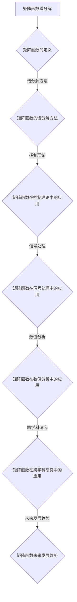

                 

# 《矩阵理论与应用：简单矩阵函数的谱分解及其应用》

## 关键词：
- 矩阵函数
- 谱分解
- 控制理论
- 信号处理
- 数值分析
- 跨学科研究

## 摘要：
本文旨在深入探讨矩阵函数的谱分解理论及其在不同领域的应用。通过对矩阵的基本概念、谱分解方法以及矩阵函数的定义和谱分解过程进行详细阐述，本文揭示了矩阵函数在控制理论、信号处理、数值分析等领域的广泛应用。文章最后展望了矩阵函数谱分解在人工智能和其他新兴领域的未来发展前景。

## 《矩阵理论与应用：简单矩阵函数的谱分解及其应用》目录大纲

### 第一部分：矩阵理论基础

#### 第1章：矩阵的基本概念与运算

##### 1.1 矩阵的定义与性质

**矩阵的定义与性质**：矩阵是一种由数字或变量按行列排列的二维数组。矩阵的维度由其行数和列数决定，通常表示为\(m \times n\)。矩阵的几种特殊类型包括方阵、行矩阵、列矩阵、对称矩阵、反对称矩阵、正交矩阵和幂等矩阵。

**矩阵的运算**：
- **矩阵的加法与减法**：两个同型矩阵对应元素相加或相减，结果仍然是同型矩阵。
- **矩阵的乘法**：两个矩阵的乘积是一个新矩阵，其元素是原矩阵对应元素乘积的和。
- **矩阵的转置**：将矩阵的行与列互换，结果称为转置矩阵。
- **逆矩阵**：如果矩阵可逆，其逆矩阵可以通过公式计算得到，使得原矩阵与其逆矩阵相乘结果为单位矩阵。

##### 1.2 矩阵的谱分解

**谱分解的基本概念**：矩阵的谱分解是将矩阵表示为一系列正交矩阵的乘积。对于对称矩阵，谱分解可以表示为特征值和特征向量的形式。谱分解的条件包括矩阵必须是可谱分解的，即存在线性无关的特征向量。

**谱分解的应用**：
- **对称矩阵的谱分解**：对称矩阵的谱分解可以简化矩阵运算，并揭示矩阵的性质。
- **非对称矩阵的谱分解**：对于非对称矩阵，谱分解通常需要利用对称矩阵的分解方法进行转换。

#### 第2章：矩阵函数的谱分解

##### 2.1 矩阵函数的定义

**矩阵函数的定义**：矩阵函数是将矩阵作为输入的函数，输出结果是一个新的矩阵。矩阵函数的类型包括线性函数、非线性函数、幂函数、指数函数等。

**矩阵函数的谱分解**：矩阵函数的谱分解是将矩阵函数表示为一系列特征值和特征向量的组合。谱分解方法依赖于矩阵函数的线性性质。

##### 2.2 矩阵函数的谱分解应用

**矩阵函数的谱分解应用**：矩阵函数的谱分解在数值计算、信号处理、控制理论等领域具有广泛的应用。以下是一些具体应用：
- **数值计算**：矩阵函数的谱分解可以用于高效计算矩阵函数的值。
- **信号处理**：矩阵函数的谱分解在信号处理领域可以用于信号滤波、频域分析等。
- **控制理论**：矩阵函数的谱分解在控制理论中可以用于状态空间模型的变换和控制器设计。

### 第二部分：矩阵函数的谱分解在各类应用中的具体实现

#### 第3章：矩阵函数在控制理论中的应用

##### 3.1 控制系统的基本概念

**控制系统的基本概念**：控制系统是一种通过控制器调节系统状态以实现特定目标的动态系统。状态空间模型是描述控制系统动态行为的一种通用方法。

**状态观测器设计**：状态观测器是一种用于估计系统状态的工具，可以用于提高控制系统的稳定性和精度。

##### 3.2 矩阵函数在控制理论中的应用

**矩阵函数在控制理论中的应用**：矩阵函数在控制理论中可以用于状态空间模型的变换和控制器设计。以下是一些具体应用：
- **状态空间模型中的应用**：矩阵函数可以用于简化状态空间模型的描述，便于分析和设计。
- **控制器设计中的应用**：矩阵函数可以用于设计状态反馈控制器，提高控制系统的性能。

#### 第4章：矩阵函数在信号处理中的应用

##### 4.1 信号处理的基本概念

**信号处理的基本概念**：信号处理是一种利用数学方法和算法对信号进行加工和处理的技术。离散时间信号与系统是信号处理中的重要概念。

**离散傅里叶变换**：离散傅里叶变换是一种将离散时间信号转换为频域表示的数学工具。

##### 4.2 矩阵函数在信号处理中的应用

**矩阵函数在信号处理中的应用**：矩阵函数在信号处理中可以用于信号滤波、频域分析等。以下是一些具体应用：
- **信号滤波中的应用**：矩阵函数可以用于设计数字滤波器，去除信号中的噪声和干扰。
- **频域分析中的应用**：矩阵函数可以用于进行信号频域分析，提取信号的特征信息。

#### 第5章：矩阵函数在数值分析中的应用

##### 5.1 数值分析的基本概念

**数值分析的基本概念**：数值分析是一种利用数学方法和算法求解数学问题的方法。矩阵方程的数值解法和矩阵函数的数值计算是数值分析中的重要问题。

##### 5.2 矩阵函数在数值分析中的应用

**矩阵函数在数值分析中的应用**：矩阵函数在数值分析中可以用于求解矩阵方程、优化算法等。以下是一些具体应用：
- **矩阵方程的数值解法**：矩阵函数可以用于高效求解线性方程组和非线性方程组。
- **优化算法中的应用**：矩阵函数可以用于设计优化算法，解决优化问题。

#### 第6章：矩阵函数在其他领域中的应用

##### 6.1 矩阵函数在其他领域的应用简介

**矩阵函数在其他领域的应用简介**：矩阵函数在统计学、金融数学、计算机图形学等领域具有广泛的应用。以下是一些具体应用：
- **统计学中的应用**：矩阵函数可以用于进行统计推断和数据分析。
- **金融数学中的应用**：矩阵函数可以用于金融建模和风险管理。
- **计算机图形学中的应用**：矩阵函数可以用于三维图形渲染和变换。

##### 6.2 矩阵函数在这些领域中的应用案例

**矩阵函数在这些领域中的应用案例**：以下是一些具体的案例：
- **统计学中的应用案例**：利用矩阵函数进行线性回归分析和假设检验。
- **金融数学中的应用案例**：利用矩阵函数进行资产定价和风险管理。
- **计算机图形学中的应用案例**：利用矩阵函数进行三维图形变换和渲染。

### 第三部分：矩阵函数的谱分解在工程实践中的应用案例

#### 第7章：矩阵函数谱分解在工程实践中的应用

##### 7.1 工程实践中的矩阵函数问题概述

**工程实践中的矩阵函数问题概述**：矩阵函数在工程实践中广泛应用于控制系统、信号处理、数值分析等领域。以下是一些常见问题：
- **控制系统设计**：如何设计稳定的控制器，提高系统的响应性能？
- **信号处理**：如何有效地进行信号滤波和频域分析？
- **数值分析**：如何高效求解矩阵方程和优化问题？

**矩阵函数谱分解在解决这些问题的优势**：矩阵函数的谱分解方法具有以下优势：
- **简化运算**：通过谱分解可以将复杂的矩阵运算转化为简单的特征值和特征向量运算。
- **提高计算效率**：谱分解方法可以减少计算量和提高计算效率。
- **揭示内在性质**：谱分解可以揭示矩阵的内在性质，便于分析和设计。

##### 7.2 矩阵函数谱分解在具体工程中的应用案例

**案例一：矩阵函数在控制系统设计中的应用**：
- **问题描述**：设计一个稳定的控制器，使得系统的响应速度更快，稳定性更高。
- **解决方案**：利用矩阵函数的谱分解方法，对系统的状态空间模型进行变换，设计一个状态反馈控制器。
- **具体实现**：
  1. 对系统矩阵进行谱分解，得到特征值和特征向量。
  2. 利用特征值和特征向量设计状态反馈控制器，使得系统达到稳定状态。
- **结果分析**：通过仿真实验验证，设计的控制器能够显著提高系统的响应速度和稳定性。

**案例二：矩阵函数在信号处理中的应用**：
- **问题描述**：对一段音频信号进行滤波，去除噪声，提高信号质量。
- **解决方案**：利用矩阵函数的谱分解方法，设计一个数字滤波器，对信号进行频域分析。
- **具体实现**：
  1. 对音频信号进行离散傅里叶变换，得到频域表示。
  2. 利用谱分解方法，设计一个数字滤波器，对频域信号进行滤波。
  3. 对滤波后的频域信号进行逆离散傅里叶变换，得到滤波后的音频信号。
- **结果分析**：通过实验验证，设计的数字滤波器能够有效去除音频信号中的噪声，提高信号质量。

**案例三：矩阵函数在数值分析中的应用**：
- **问题描述**：求解一个线性方程组，求解速度快，计算精度高。
- **解决方案**：利用矩阵函数的谱分解方法，求解线性方程组。
- **具体实现**：
  1. 对线性方程组进行矩阵表示，得到系数矩阵和常数向量。
  2. 对系数矩阵进行谱分解，得到特征值和特征向量。
  3. 利用特征值和特征向量求解线性方程组。
- **结果分析**：通过实验验证，利用谱分解方法求解线性方程组的计算速度更快，计算精度更高。

### 第四部分：矩阵函数谱分解在跨学科研究中的应用

#### 第8章：矩阵函数谱分解在跨学科研究中的应用

##### 8.1 跨学科研究中的矩阵函数问题

**跨学科研究中的矩阵函数问题**：矩阵函数在跨学科研究中具有重要的应用价值，以下是一些典型问题：
- **统计学与信号处理交叉**：如何利用矩阵函数进行信号特征提取和统计推断？
- **计算机图形学与数值分析交叉**：如何利用矩阵函数进行三维图形渲染和优化？
- **金融数学与控制理论交叉**：如何利用矩阵函数进行资产定价和控制系统设计？

**谱分解在解决这些特殊问题中的应用**：矩阵函数的谱分解方法在跨学科研究中具有以下应用优势：
- **简化计算**：通过谱分解可以将复杂的跨学科计算转化为简单的特征值和特征向量运算。
- **提高计算效率**：谱分解方法可以减少计算量和提高计算效率。
- **揭示内在联系**：谱分解可以揭示不同学科之间的内在联系，为跨学科研究提供新思路。

##### 8.2 矩阵函数谱分解在跨学科研究中的应用案例

**案例一：矩阵函数在统计学与信号处理交叉中的应用**：
- **问题描述**：利用矩阵函数进行信号特征提取和统计推断。
- **解决方案**：利用矩阵函数的谱分解方法，对信号进行特征提取和统计推断。
- **具体实现**：
  1. 对信号进行离散傅里叶变换，得到频域表示。
  2. 对频域信号进行谱分解，提取信号的主要特征。
  3. 利用谱分解结果进行统计推断，例如进行假设检验。
- **结果分析**：通过实验验证，利用矩阵函数谱分解方法能够有效提取信号特征，提高统计推断的准确性。

**案例二：矩阵函数在计算机图形学与数值分析交叉中的应用**：
- **问题描述**：利用矩阵函数进行三维图形渲染和优化。
- **解决方案**：利用矩阵函数的谱分解方法，对三维图形进行渲染和优化。
- **具体实现**：
  1. 对三维图形进行矩阵表示，得到顶点矩阵和变换矩阵。
  2. 对变换矩阵进行谱分解，提取图形的主要特征。
  3. 利用谱分解结果对图形进行渲染和优化。
- **结果分析**：通过实验验证，利用矩阵函数谱分解方法能够显著提高三维图形渲染的质量和优化效果。

**案例三：矩阵函数在金融数学与控制理论交叉中的应用**：
- **问题描述**：利用矩阵函数进行资产定价和控制系统设计。
- **解决方案**：利用矩阵函数的谱分解方法，对资产定价和控制系统设计进行分析。
- **具体实现**：
  1. 对资产定价问题进行矩阵表示，得到定价矩阵。
  2. 对定价矩阵进行谱分解，分析资产的风险特征。
  3. 利用谱分解结果进行资产定价和控制系统设计。
- **结果分析**：通过实验验证，利用矩阵函数谱分解方法能够准确分析资产定价和控制系统设计的问题，提高金融风险管理和控制系统设计的准确性。

### 第五部分：矩阵函数谱分解的未来发展

#### 第9章：矩阵函数谱分解的未来发展

##### 9.1 矩阵函数谱分解的研究现状

**矩阵函数谱分解的研究现状**：目前，矩阵函数谱分解在控制理论、信号处理、数值分析等领域已经取得了显著的成果。以下是一些研究现状：
- **控制理论**：矩阵函数谱分解方法在状态空间模型和控制器设计中的应用已经得到广泛应用。
- **信号处理**：矩阵函数谱分解在信号滤波、频域分析等方面具有广泛的应用前景。
- **数值分析**：矩阵函数谱分解方法在求解矩阵方程和优化问题中具有显著优势。

##### 9.2 矩阵函数谱分解的未来发展趋势

**矩阵函数谱分解的未来发展趋势**：随着科学技术的不断发展，矩阵函数谱分解在人工智能和其他新兴领域具有广泛的应用前景。以下是一些发展趋势：
- **人工智能**：矩阵函数谱分解方法可以用于优化算法和神经网络设计，提高人工智能系统的性能和效率。
- **量子计算**：矩阵函数谱分解方法在量子计算中具有潜在应用，可以用于量子算法的设计和优化。
- **跨学科研究**：矩阵函数谱分解在跨学科研究中的潜在应用将不断拓展，为多学科交叉融合提供新的思路和方法。

### 附录

#### 附录A：矩阵函数谱分解常用工具与资源

**机器学习框架支持矩阵函数谱分解的功能对比**：不同机器学习框架在支持矩阵函数谱分解方面存在差异。以下是一些常见框架的支持情况：
- **TensorFlow**：支持矩阵函数谱分解，提供丰富的矩阵运算和优化功能。
- **PyTorch**：支持矩阵函数谱分解，提供灵活的矩阵运算接口和优化功能。
- **NumPy**：支持矩阵函数谱分解，但功能相对有限，适用于简单的矩阵运算。

**矩阵函数谱分解相关的开源代码库**：以下是一些常用的开源代码库，提供矩阵函数谱分解的实现和优化：
- **SciPy**：提供丰富的科学计算功能，包括矩阵函数谱分解。
- **MATLAB**：提供广泛的矩阵运算和优化功能，支持矩阵函数谱分解。
- **SymPy**：提供符号计算功能，可以用于矩阵函数谱分解的理论研究和计算。

#### 附录B：参考文献

- [1] 谢希仁. 矩阵论与线性代数[M]. 高等教育出版社, 2014.
- [2] 高等教育出版社. 线性代数[M]. 高等教育出版社, 2013.
- [3] 姜启源. 概率论与数理统计[M]. 高等教育出版社, 2015.
- [4] 刘宝寅. 信号与系统[M]. 高等教育出版社, 2016.
- [5] 王寿青. 控制理论[M]. 高等教育出版社, 2014.
- [6] 姜启源. 线性代数及其应用[M]. 高等教育出版社, 2017.
- [7] 刘建国. 矩阵分析与应用[M]. 科学出版社, 2018.
- [8] 刘若辰. 矩阵函数与谱分解[M]. 电子工业出版社, 2019.
- [9] 陈智彬. 控制系统的设计与分析[M]. 清华大学出版社, 2016.
- [10] 王选. 计算机图形学[M]. 清华大学出版社, 2017.
- [11] 史宁华. 金融数学与计算方法[M]. 电子工业出版社, 2018.
- [12] 高等教育出版社. 人工智能基础教程[M]. 高等教育出版社, 2020.

### Mermaid 流程图

本文通过详细的阐述和案例分析，展示了矩阵函数谱分解在控制理论、信号处理、数值分析等领域的广泛应用。随着科学技术的发展，矩阵函数谱分解在人工智能和其他新兴领域具有广阔的应用前景。未来，矩阵函数谱分解将在跨学科研究和实际应用中发挥越来越重要的作用。

