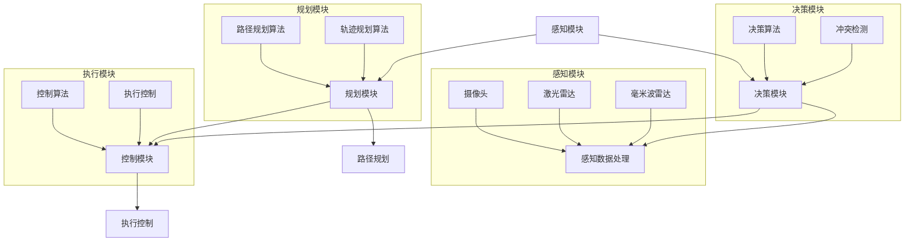

                 

### 引言

随着科技的快速发展，智能出行已成为未来交通领域的重要趋势。智能出行不仅意味着更高效、更便捷的出行方式，还代表着更安全、更环保的出行理念。硅谷作为全球科技创新的中心，新能源汽车和自动驾驶技术的发展尤为迅速，成为智能出行时代的先锋。

本文将围绕硅谷新能源汽车自动驾驶技术展开讨论，探讨其技术背景、发展历程、核心原理、应用案例以及面临的挑战与机遇。通过系统性的分析，我们希望能够为您呈现一个全面、深入的智能出行新时代。

首先，我们将介绍智能出行时代的背景与意义，阐述新能源汽车和自动驾驶技术的发展历程及其对未来出行方式的巨大影响。接着，我们将深入探讨硅谷新能源汽车的核心技术，包括动力系统、电池技术以及新能源汽车产业链。

在第三部分，我们将重点分析自动驾驶技术的基础，包括感知技术、决策与规划算法以及控制算法。我们将使用伪代码详细阐述每个算法的原理，帮助读者更好地理解自动驾驶的核心技术。

第四部分将介绍硅谷新能源汽车自动驾驶的典型案例，如特斯拉、Waymo和小鹏汽车的自动驾驶技术。我们将详细分析这些案例，探讨它们的技术特点、优势以及面临的挑战。

第五部分将探讨智能出行生态系统的构建，包括智能交通系统、智能出行服务、安全与隐私保护以及智能出行与城市发展。我们还将讨论智能出行新时代的挑战与机遇，包括技术挑战、法规与政策挑战以及商业模式创新。

最后，在附录部分，我们将提供自动驾驶技术相关标准、参考资料、开源资源列表以及智能出行生态相关网站与论坛推荐，为读者提供更多深入学习和交流的资源。

通过本文的阅读，您将全面了解硅谷新能源汽车自动驾驶技术的现状与发展趋势，为未来智能出行做好准备。

### 关键词

- 智能出行
- 新能源汽车
- 自动驾驶
- 硅谷
- 技术发展
- 感知技术
- 决策算法
- 控制算法
- 安全性
- 隐私保护
- 生态构建

### 摘要

本文系统性地探讨了硅谷新能源汽车自动驾驶技术的现状与发展趋势。首先，我们介绍了智能出行时代的背景与意义，阐述了新能源汽车和自动驾驶技术的发展历程。接着，我们深入分析了硅谷新能源汽车的核心技术，包括动力系统、电池技术以及新能源汽车产业链。随后，我们重点讨论了自动驾驶技术的基础，包括感知技术、决策与规划算法以及控制算法，并使用伪代码详细阐述了每个算法的原理。第四部分介绍了硅谷新能源汽车自动驾驶的典型案例，分析了特斯拉、Waymo和小鹏汽车的自动驾驶技术。第五部分探讨了智能出行生态系统的构建，包括智能交通系统、智能出行服务、安全与隐私保护以及智能出行与城市发展。最后，我们讨论了智能出行新时代的挑战与机遇，包括技术挑战、法规与政策挑战以及商业模式创新。通过本文的阅读，读者将全面了解硅谷新能源汽车自动驾驶技术的现状与发展趋势，为未来智能出行做好准备。## 第一部分：智能出行新时代概述

### 1. 引言

智能出行时代，作为现代科技与交通领域的重要趋势，正迅速改变着人们的出行方式和生活习惯。硅谷，作为全球科技创新的中心，在这个新时代中扮演着至关重要的角色。本文将围绕硅谷新能源汽车自动驾驶技术进行深入探讨，旨在揭示这一领域的技术发展轨迹、核心原理及其对未来智能出行的影响。

#### 1.1 智能出行时代的背景与意义

智能出行时代，是信息技术、人工智能、物联网等新兴技术与传统交通行业深度融合的产物。这一时代的到来，不仅标志着出行方式的革新，更意味着交通系统的智能化、网络化和协同化。以下是智能出行时代的几个核心背景和意义：

1. **技术进步**：随着人工智能、物联网、大数据等技术的飞速发展，汽车行业迎来了前所未有的技术变革。自动驾驶、车联网、智能交通系统等新兴技术逐渐成熟，为智能出行提供了坚实的基础。

2. **环保需求**：全球环保意识的提升，以及各国对新能源汽车政策的扶持，推动了新能源汽车的快速发展。新能源汽车，尤其是电动汽车，因其零排放、低能耗的特点，成为应对气候变化和能源危机的重要手段。

3. **出行变革**：智能出行不仅提升了出行效率，还改变了人们的出行方式。共享出行、自动驾驶出租车等新型出行模式，为公众提供了更加灵活、便捷的出行选择。

4. **产业升级**：智能出行时代的到来，带动了汽车产业、信息技术产业、能源产业的深度整合，推动了整个产业链的升级和转型。

#### 1.2 硅谷新能源汽车与自动驾驶的发展历程

硅谷作为全球科技创新的桥头堡，在新能源汽车和自动驾驶技术领域的发展具有典型意义。以下是硅谷新能源汽车和自动驾驶技术的发展历程：

1. **新能源汽车的萌芽期（2000-2010年）**：
   - 2003年，特斯拉（Tesla）成立，标志着硅谷新能源汽车产业的兴起。
   - 2008年，特斯拉发布首款电动汽车Roadster，引起全球关注。

2. **新能源汽车的快速发展期（2010-2015年）**：
   - 2010年，特斯拉推出Model S，成为全球第一款高端电动豪华轿车。
   - 2012年，谷歌（Google）宣布启动自动驾驶项目，标志着自动驾驶技术的兴起。

3. **新能源汽车与自动驾驶技术的成熟期（2015年至今）**：
   - 2018年，特斯拉推出Autopilot自动驾驶系统，开始逐步实现部分自动驾驶功能。
   - 2019年，特斯拉宣布实现完全自动驾驶的长期目标。
   - 同期，Waymo、通用、福特等硅谷和全球汽车巨头加速自动驾驶技术研发和应用。

#### 1.3 智能出行未来的展望

智能出行未来发展的方向和趋势将受到以下因素的影响：

1. **技术进步**：人工智能、5G通信、云计算等技术的不断突破，将为智能出行提供更强大的技术支持。

2. **政策扶持**：各国政府将继续加大对新能源汽车和自动驾驶技术的政策扶持，推动产业快速发展。

3. **市场需求**：随着人们对出行效率和体验的需求不断提升，智能出行将成为未来出行市场的主流。

4. **商业模式**：共享出行、自动驾驶出租车等新型商业模式将不断涌现，为智能出行带来新的增长点。

总之，硅谷新能源汽车和自动驾驶技术的发展，不仅改变了人们的出行方式，还将深刻影响交通系统的运行模式和城市的发展方向。智能出行时代，正以硅谷为引领，迈向一个更加智能、绿色、高效的未来。### 2. 硅谷新能源汽车概述

#### 2.1 新能源汽车的发展趋势

新能源汽车，尤其是电动汽车，正逐渐成为全球汽车市场的重要趋势。以下是新能源汽车发展的几个关键趋势：

1. **政策支持**：各国政府为了减少温室气体排放和应对能源危机，纷纷出台了一系列支持新能源汽车的政策，如补贴、税收优惠和禁售燃油车等。

2. **技术进步**：电池技术的不断突破，如固态电池和新型材料的研发，使得电动汽车的续航里程和充电速度显著提升。

3. **市场竞争**：传统汽车厂商和新兴科技公司纷纷加入新能源汽车领域，市场竞争日益激烈。

4. **价格下降**：随着生产规模的扩大和技术的成熟，新能源汽车的价格逐渐下降，使其更具有市场竞争力。

5. **充电基础设施完善**：全球各地的充电基础设施不断完善，为电动汽车的使用提供了便利。

#### 2.2 硅谷新能源汽车的核心技术

硅谷新能源汽车在核心技术方面具有显著优势，以下是几个关键技术：

1. **电池技术**：硅谷新能源汽车厂商，如特斯拉（Tesla），在电池技术上取得了重要突破。特斯拉的电池技术不仅提高了能量密度，还降低了成本。

   - **电池类型**：特斯拉主要采用锂离子电池，其中特斯拉自主研发的4680电池具有更高的能量密度和功率密度。
   - **电池管理**：特斯拉的电池管理系统（BMS）能够高效地管理电池的充放电过程，确保电池安全。

2. **电动机技术**：硅谷新能源汽车使用的电动机具有高效率、高功率和低噪音的特点。

   - **电动机类型**：特斯拉的电动机采用交流电动机，具有优异的动态响应能力和高效的能量转换效率。
   - **驱动系统**：特斯拉的驱动系统集成了电动机、变速器和减速器，使车辆具有出色的加速性能和操控性。

3. **自动驾驶技术**：硅谷的自动驾驶技术在智能出行领域处于领先地位。

   - **感知系统**：特斯拉的自动驾驶系统使用了多个传感器，包括摄像头、激光雷达和毫米波雷达，实现对周围环境的全面感知。
   - **决策与规划算法**：特斯拉的自动驾驶系统采用了先进的算法，能够对路况、交通和行人进行实时分析，做出最优的驾驶决策。

#### 2.3 新能源汽车产业链分析

新能源汽车产业链包括电池、电动机、自动驾驶、充电基础设施等多个环节，以下是这些环节的分析：

1. **电池产业链**：

   - **上游材料**：锂、钴、镍等电池材料的生产和供应是电池产业链的重要环节。
   - **电池制造**：电池制造包括电池设计、电池装配和电池测试等环节。
   - **电池回收**：随着新能源汽车的普及，电池回收成为一个重要的产业链环节。

2. **电动机产业链**：

   - **上游材料**：电动机的核心材料包括永磁体、绕组材料和绝缘材料等。
   - **电动机制造**：电动机制造包括设计、制造和测试等环节。
   - **驱动系统**：电动机驱动系统包括控制器、逆变器、电机和变速器等。

3. **自动驾驶产业链**：

   - **感知系统**：自动驾驶感知系统包括摄像头、激光雷达、毫米波雷达等。
   - **决策与规划算法**：自动驾驶算法涉及感知、决策、规划和控制等多个领域。
   - **硬件与软件**：自动驾驶硬件包括传感器、控制器和执行器等，软件包括操作系统、应用程序和开发工具等。

4. **充电基础设施**：

   - **充电桩**：充电桩是电动汽车充电的重要设施，包括公共充电桩和私人充电桩。
   - **充电网络**：充电网络的布局和运营是电动汽车使用的关键因素。
   - **充电标准**：充电标准是保障电动汽车充电兼容性和安全性的基础。

总之，硅谷新能源汽车在核心技术方面具有明显优势，其产业链的完善和优化为智能出行时代的到来提供了有力支撑。随着技术的不断进步和市场需求的增加，新能源汽车产业将继续快速发展。### 3. 自动驾驶技术基础

自动驾驶技术是智能出行时代的核心技术，它通过多种传感器和先进的算法，使汽车能够在没有人类驾驶员干预的情况下自主行驶。以下是自动驾驶技术的基础，包括感知技术、决策与规划算法以及控制算法。

#### 3.1 自动驾驶的层次与功能

自动驾驶技术通常被分为不同的层次，根据国际自动机工程师学会（SAE）的定义，自动驾驶分为0到5级，具体如下：

- **0级：无自动化**：车辆的所有操作都由人类驾驶员完成。
- **1级：驾驶辅助**：车辆提供一些辅助功能，如自适应巡航控制或车道保持辅助。
- **2级：部分自动化**：车辆在特定条件下可以同时执行多个驾驶任务，如车道保持和自适应巡航。
- **3级：有条件的自动化**：车辆在特定条件下完全自动化驾驶，但需要人类驾驶员在紧急情况下接管控制。
- **4级：高度自动化**：车辆在特定环境中能够完全自动化驾驶，无需人类驾驶员干预。
- **5级：完全自动化**：车辆在任何条件下都能完全自动化驾驶。

每种层次都有其特定的功能和应用场景，自动驾驶技术的逐步发展使得智能出行成为可能。

#### 3.2 自动驾驶感知技术

感知技术是自动驾驶系统的核心，它负责收集车辆周围环境的信息，并对其进行处理。以下是一些主要的感知技术：

1. **视觉感知技术**：
   - **摄像头**：摄像头是自动驾驶系统中常用的传感器，用于捕捉车辆周围的图像。
   - **图像处理**：通过图像处理算法，如边缘检测、目标检测和识别，可以从摄像头图像中提取有用信息。
   - **深度感知**：使用立体摄像头或深度相机可以获取车辆周围的三维信息。

2. **激光雷达感知技术**：
   - **激光雷达（LIDAR）**：激光雷达通过发射激光束并测量反射时间，可以精确地构建车辆周围的三维点云模型。
   - **点云处理**：点云数据可以用来识别道路标志、行人和其他车辆，是自动驾驶系统中重要的感知手段。

3. **毫米波雷达感知技术**：
   - **毫米波雷达**：毫米波雷达通过发射和接收毫米波信号，可以检测车辆周围物体的距离和速度。
   - **雷达处理**：毫米波雷达数据可以用于跟踪车辆、识别障碍物和进行环境感知。

#### 3.3 自动驾驶决策与规划算法

感知技术收集到的信息需要通过决策与规划算法进行处理，以实现自动驾驶。以下是一些核心算法：

1. **决策算法**：
   - **行为决策**：决策算法根据当前环境和车辆状态，选择最佳驾驶行为，如加速、减速、转向等。
   - **冲突检测与避免**：决策算法还需要处理与其他车辆和行人的交互，避免发生碰撞。

2. **规划算法**：
   - **路径规划**：路径规划算法根据目标位置和道路信息，生成从当前位置到目标位置的最优路径。
   - **轨迹规划**：轨迹规划算法为车辆生成一条平滑的轨迹，确保车辆能够安全、平稳地到达目标位置。

#### 3.4 自动驾驶控制算法

控制算法负责将决策与规划算法的结果转换为实际的车辆控制指令。以下是一些核心控制算法：

1. **PID控制算法**：
   - **比例-积分-微分（PID）控制**：PID控制算法通过调整比例、积分和微分系数，对车辆进行精确控制。
   - **应用**：PID控制算法广泛应用于车辆的加速、减速和转向控制。

2. **模型预测控制算法**：
   - **模型预测控制（MPC）**：MPC算法通过预测未来状态并优化控制输入，实现复杂系统的精确控制。
   - **应用**：MPC算法在自动驾驶车辆中的路径跟踪和动态控制中具有重要应用。

通过感知技术、决策与规划算法以及控制算法的有机结合，自动驾驶系统能够实现对车辆周围环境的感知、决策和执行，从而实现自主驾驶。随着技术的不断进步，自动驾驶系统将变得越来越智能，为人们的出行带来更多的便利和安全。### 3.2.1 视觉感知技术

视觉感知技术是自动驾驶系统中至关重要的一环，通过摄像头和图像处理算法，自动驾驶系统能够获取车辆周围的环境信息，从而进行道路识别、障碍物检测、交通标志识别等操作。以下是视觉感知技术的详细原理和伪代码说明。

#### 3.2.1.1 摄像头

摄像头是视觉感知技术的核心部件，用于捕捉车辆周围环境的图像。自动驾驶系统通常使用多个摄像头，以获得更全面的视角。

- **高分辨率摄像头**：高分辨率摄像头能够捕捉更清晰、更详细的图像，有助于提高障碍物检测和识别的准确率。
- **广角摄像头**：广角摄像头能够覆盖更大的视野范围，有助于车辆在复杂环境中进行环境感知。
- **多摄像头布局**：自动驾驶系统通常会使用多个摄像头，包括前视、侧视、后视等，以获得更全面的环境信息。

#### 3.2.1.2 图像处理

摄像头捕捉到的图像需要经过一系列图像处理算法，才能提取出有用的信息。以下是几个关键的图像处理算法：

1. **边缘检测**：
   - **目的**：边缘检测用于识别图像中的边缘，有助于道路和障碍物的识别。
   - **算法**：常用的边缘检测算法包括Canny算法、Sobel算子和Prewitt算子。

2. **目标检测**：
   - **目的**：目标检测用于识别图像中的特定目标，如行人、车辆和交通标志。
   - **算法**：常用的目标检测算法包括HOG（Histogram of Oriented Gradients）、YOLO（You Only Look Once）和SSD（Single Shot MultiBox Detector）。

3. **语义分割**：
   - **目的**：语义分割用于将图像划分为不同的区域，并对每个区域进行分类。
   - **算法**：常用的语义分割算法包括FCN（Fully Convolutional Network）和Unet。

#### 3.2.1.3 伪代码示例

以下是视觉感知技术的一些伪代码示例，用于说明如何使用摄像头和图像处理算法进行障碍物检测。

```python
# 障碍物检测伪代码
function ObstacleDetection(image):
    # 边缘检测
    edges = Canny(image)
    
    # 目标检测
    contours, hierarchy = findContours(edges, RETR_EXTERNAL, CHAIN_APPROX_SIMPLE)
    for contour in contours:
        if contour.size > 100:  # 阈值可以根据实际场景调整
            return "Obstacle detected"
    
    return "No obstacle"
```

该伪代码首先使用Canny算法进行边缘检测，然后通过findContours函数找到图像中的轮廓。如果某个轮廓的大小超过设定的阈值（如100个像素点），则认为检测到了障碍物。

通过以上视觉感知技术，自动驾驶系统能够实现对周围环境的精确感知，为后续的决策与规划提供可靠的基础。随着深度学习算法的不断发展，视觉感知技术在自动驾驶中的应用将会越来越广泛和准确。### 3.2.2 激光雷达感知技术

激光雷达（LIDAR，Light Detection and Ranging）是一种通过发射激光束并测量其反射时间来获取目标距离和形状的三维感知技术。激光雷达在自动驾驶系统中发挥着重要作用，能够提供高精度、实时的环境信息，从而帮助车辆进行精准的感知和决策。

#### 3.2.2.1 激光雷达的工作原理

激光雷达通过以下步骤工作：

1. **发射激光束**：激光雷达发射一束激光束，通常使用1550纳米或905纳米的波长。

2. **测量反射时间**：激光束遇到目标后，部分光会被反射回来。激光雷达通过测量反射光返回的时间，可以计算出目标与激光雷达之间的距离。

3. **生成三维点云**：激光雷达每次扫描会生成一组距离数据，这些数据可以用来生成目标的三维点云。通过多个角度的扫描，激光雷达可以构建出车辆周围环境的精确三维模型。

#### 3.2.2.2 点云处理

生成的三维点云是激光雷达感知技术的核心输出。点云处理包括以下步骤：

1. **滤波**：为了去除噪声和不必要的点，需要进行滤波处理。常用的滤波方法包括Voxel滤波、RANSAC（Random Sample Consensus）滤波等。

2. **去地平线**：去除地平线上的点，以避免干扰车辆感知。

3. **点云分割**：将点云划分为不同的区域，每个区域可以代表不同的物体或部分场景。

4. **物体识别**：利用机器学习算法或深度学习模型，对点云进行分类和识别，从而识别出车辆、行人、交通标志等目标。

#### 3.2.2.3 伪代码示例

以下是一个简化的激光雷达感知技术的伪代码示例，用于说明如何处理点云数据并进行障碍物检测。

```python
# 激光雷达感知伪代码
function LaserPerception(points):
    # 滤波去噪
    filtered_points = VoxelFilter(points, resolution=0.1)
    
    # 去地平线
    ground_points = RemoveGround(points)
    
    # 点云分割
    segmented_points = SegmentPoints(ground_points)
    
    # 障碍物识别
    obstacles = []
    for segment in segmented_points:
        if is_obstacle(segment):
            obstacles.append(segment)
    
    # 返回障碍物点云
    return obstacles

# 判断是否为障碍物
function is_obstacle(segment):
    distance_threshold = 10  # 距离阈值可以根据实际场景调整
    for point in segment:
        if point['distance'] < distance_threshold:
            return True
    return False
```

在这个伪代码中，LaserPerception函数首先对点云进行滤波去噪，然后去除地平线上的点，接着对点云进行分割。最后，通过is_obstacle函数判断每个分割区域是否为障碍物，并返回包含所有障碍物的点云。

激光雷达感知技术由于其高精度和实时性，已成为自动驾驶系统的重要组成部分。随着技术的不断进步，激光雷达在自动驾驶中的应用将会更加广泛，进一步提升自动驾驶的安全性和可靠性。### 3.2.3 毫米波雷达感知技术

毫米波雷达是一种利用毫米波段电磁波进行探测和测距的传感器技术，广泛应用于自动驾驶领域。毫米波雷达具有波长较短、分辨率高、穿透力强等优点，能够在恶劣天气条件下提供稳定的环境感知数据。

#### 3.2.3.1 毫米波雷达的工作原理

毫米波雷达的工作原理主要包括以下步骤：

1. **发射信号**：毫米波雷达通过天线发射高频电磁波，频率通常在24GHz至110GHz之间。

2. **接收反射信号**：当发射的信号遇到障碍物时，部分信号会被反射回来。雷达通过天线接收反射信号，并测量其返回时间。

3. **信号处理**：接收到的反射信号经过放大、滤波和数字化处理，生成距离、速度等数据。

4. **目标识别**：通过对处理后的信号进行分析，可以识别出车辆、行人、交通标志等目标。

#### 3.2.3.2 雷达信号处理

毫米波雷达的信号处理包括以下几个关键步骤：

1. **波形设计**：设计合适的波形，以优化雷达系统的分辨率和抗干扰能力。

2. **信号放大**：放大接收到的弱反射信号，以提高信噪比。

3. **信号滤波**：去除信号中的噪声和干扰，提高雷达系统的可靠性。

4. **距离和速度测量**：通过测量反射信号的往返时间和频率变化，计算目标距离和速度。

5. **目标识别和跟踪**：利用机器学习算法或统计模型，对处理后的信号进行分析，识别和跟踪目标。

#### 3.2.3.3 伪代码示例

以下是一个简化的毫米波雷达感知技术的伪代码示例，用于说明如何处理雷达信号并进行障碍物检测。

```python
# 毫米波雷达感知伪代码
function MillimeterWavePerception(signal):
    # 信号放大
    amplified_signal = AmplifySignal(signal, gain=10)
    
    # 信号滤波
    filtered_signal = FilterSignal(amplified_signal, cutoff_frequency=30)
    
    # 距离和速度测量
    distance = MeasureDistance(filtered_signal)
    velocity = MeasureVelocity(filtered_signal)
    
    # 障碍物识别
    if is_obstacle(distance, velocity):
        return "Obstacle detected"
    else:
        return "No obstacle"

# 判断是否为障碍物
function is_obstacle(distance, velocity):
    distance_threshold = 10  # 距离阈值可以根据实际场景调整
    velocity_threshold = 0  # 速度阈值可以根据实际场景调整
    if distance < distance_threshold and velocity > velocity_threshold:
        return True
    return False
```

在这个伪代码中，MillimeterWavePerception函数首先对雷达信号进行放大和滤波处理，然后测量距离和速度。通过is_obstacle函数判断目标是否为障碍物，并返回相应的检测结果。

毫米波雷达因其良好的环境适应性和低成本，在自动驾驶系统中得到了广泛应用。随着技术的发展，毫米波雷达将在自动驾驶感知领域发挥更加重要的作用，进一步提升自动驾驶的安全性和可靠性。### 3.3.1 决策算法

决策算法是自动驾驶系统的核心组成部分，它负责根据车辆当前的状态和环境信息，选择合适的驾驶行为。决策算法的目标是确保车辆在复杂交通环境中安全、高效地行驶。以下是几个常见的决策算法原理和伪代码说明。

#### 3.3.1.1 行为决策算法

行为决策算法通常根据当前环境和车辆状态，选择一系列驾驶行为，如加速、减速、转向等。常见的决策算法包括基于规则和基于模型的方法。

1. **基于规则的决策算法**：
   - **原理**：基于规则的决策算法通过预设的规则集，根据当前状态和环境信息进行决策。每个规则定义了在特定情况下应采取的驾驶行为。
   - **伪代码**：

```python
function RuleBasedDecision(current_state, rules):
    for rule in rules:
        if rule.condition == current_state:
            return rule.action
    return "No valid action"
```

2. **基于模型的决策算法**：
   - **原理**：基于模型的决策算法通过建立数学模型，模拟不同驾驶行为对车辆状态的影响，选择最优驾驶行为。
   - **伪代码**：

```python
function ModelBasedDecision(current_state, model):
    actions = []
    for action in possible_actions:
        next_state = model.predict(current_state, action)
        if model.is_valid_state(next_state):
            actions.append(action)
    if actions:
        return max(actions, key=model.evaluate)
    return "No valid action"
```

#### 3.3.1.2 冲突检测与避免

自动驾驶系统在决策过程中需要处理与其他车辆和行人的交互，避免发生碰撞。冲突检测与避免算法的核心任务是识别潜在的冲突场景，并采取适当的措施。

1. **基于距离和速度的冲突检测**：
   - **原理**：通过计算车辆之间的距离和速度差，判断是否可能发生碰撞。
   - **伪代码**：

```python
function ConflictDetection(vehicle1, vehicle2):
    distance = vehicle1.position - vehicle2.position
    velocity_difference = vehicle1.velocity - vehicle2.velocity
    if distance < safe_distance and velocity_difference < 0:
        return "Conflict detected"
    return "No conflict"
```

2. **基于概率图的冲突避免**：
   - **原理**：使用概率图模型，预测车辆和行人的未来位置和轨迹，判断是否可能发生冲突，并采取避让措施。
   - **伪代码**：

```python
function ProbabilisticGraphConflictAvoidance(vehicles, pedestrians):
    for vehicle in vehicles:
        for pedestrian in pedestrians:
            if vehicle将来轨迹与pedestrian将来轨迹有交集：
                avoid_action = PlanAvoidanceAction(vehicle, pedestrian)
                vehicle.take_action(avoid_action)
    return "Avoidance actions taken"
```

通过这些决策算法，自动驾驶系统能够在复杂交通环境中做出合理的驾驶决策，确保车辆的安全行驶。随着人工智能技术的发展，决策算法将变得更加智能和灵活，为自动驾驶的普及提供更强有力的支持。### 3.3.2 规划算法

路径规划和轨迹规划是自动驾驶系统中至关重要的部分，负责生成从当前位置到目标位置的最优路径和轨迹。这些算法的目标是确保车辆能够安全、高效地到达目的地，同时避免与其他车辆、行人或障碍物发生冲突。以下是路径规划和轨迹规划的算法原理和伪代码。

#### 3.3.2.1 路径规划算法

路径规划算法的主要任务是找到一条从起点到终点的路径，并尽可能避免障碍物。以下是几种常见的路径规划算法：

1. **A*算法**：
   - **原理**：A*算法是一种启发式搜索算法，通过评估函数（f(n) = g(n) + h(n)）来寻找最优路径，其中g(n)是从起点到节点n的实际距离，h(n)是从节点n到终点的估计距离。
   - **伪代码**：

```python
function AStar(start, goal, grid):
    open_set = PriorityQueue()
    open_set.add(start, f(start, goal))
    came_from = {}
    g_score = {node: Infinity for node in grid}
    g_score[start] = 0
    
    while not open_set.isEmpty():
        current = open_set.pop()
        
        if current == goal:
            return reconstruct_path(came_from, current)
        
        for neighbor in neighbors(current):
            tentative_g_score = g_score[current] + distance(current, neighbor)
            
            if tentative_g_score < g_score[neighbor]:
                came_from[neighbor] = current
                g_score[neighbor] = tentative_g_score
                open_set.add(neighbor, tentative_g_score + h(neighbor, goal))
    
    return "No path found"
```

2. **Dijkstra算法**：
   - **原理**：Dijkstra算法是一种无启发式的搜索算法，用于找到从起点到所有其他节点的最短路径。
   - **伪代码**：

```python
function Dijkstra(start, grid):
    distances = {node: Infinity for node in grid}
    distances[start] = 0
    priority_queue = PriorityQueue()
    priority_queue.add(start, 0)
    
    while not priority_queue.isEmpty():
        current = priority_queue.pop()
        
        for neighbor in neighbors(current):
            distance = distances[current] + edge_weight(current, neighbor)
            
            if distance < distances[neighbor]:
                distances[neighbor] = distance
                priority_queue.add(neighbor, distance)
    
    return distances
```

#### 3.3.2.2 轨迹规划算法

轨迹规划算法的目标是生成一条连续、平滑的路径，使车辆能够安全、平稳地通过环境中的各种障碍物。以下是几种常见的轨迹规划算法：

1. **模型预测控制（Model Predictive Control, MPC）**：
   - **原理**：MPC算法通过建立车辆动力学模型，预测未来一段时间内的车辆状态，并优化控制输入，以生成最优轨迹。
   - **伪代码**：

```python
function ModelPredictiveControl(current_state, goal, model, predictive_horizon):
    predictions = []
    for t in range(predictive_horizon):
        next_state = model.predict(current_state, control_input)
        predictions.append(next_state)
    
    optimal_control = optimize和控制输入，使预测的轨迹最小化目标函数
    
    return optimal_control
```

2. **基于贝塞尔曲线的轨迹规划**：
   - **原理**：贝塞尔曲线是一种参数化的曲线，可以用来生成平滑的轨迹。通过设置起始点、终点和两个控制点，可以生成一条满足特定要求的轨迹。
   - **伪代码**：

```python
function BezierCurve(start, end, control_point1, control_point2, time):
    t = time / (1 - time)
    x = (1 - t)^2 * start + 2 * t * (1 - t) * control_point1 + t^2 * end
    y = (1 - t)^2 * start + 2 * t * (1 - t) * control_point1 + t^2 * end
    
    return (x, y)
```

通过这些路径规划和轨迹规划算法，自动驾驶系统能够生成最优的路径和轨迹，确保车辆安全、高效地行驶。随着算法的不断完善和计算能力的提升，轨迹规划将在自动驾驶中发挥越来越重要的作用。### 3.4.1 基于PID的控制算法

PID（比例-积分-微分）控制算法是一种广泛应用于自动驾驶系统中的控制方法。它通过调整三个参数——比例（P）、积分（I）和微分（D）来控制系统的输出，从而实现系统的稳定运行。以下是PID控制算法的原理、伪代码以及在实际应用中的解释。

#### 3.4.1.1 PID控制算法原理

PID控制算法基于以下三个部分：

1. **比例控制（P）**：比例控制根据当前误差（目标值与实际值之间的差异）来调整输出。比例控制的主要优点是响应速度快，但缺点是存在稳态误差。

2. **积分控制（I）**：积分控制通过累加误差来消除稳态误差。积分控制能够有效地减少系统偏差，但可能会导致系统的响应速度变慢。

3. **微分控制（D）**：微分控制根据误差的变化率来调整输出，以预测误差的未来变化，从而提前进行校正。微分控制能够提高系统的动态响应性能，减少超调。

PID控制器的输出计算公式为：

\[ u(t) = K_p e(t) + K_i \int_{0}^{t} e(\tau) d\tau + K_d \frac{de(t)}{dt} \]

其中，\( u(t) \)是控制器的输出，\( e(t) \)是误差，\( K_p \)、\( K_i \)和\( K_d \)分别是比例、积分和微分的增益系数。

#### 3.4.1.2 伪代码示例

以下是一个简单的PID控制算法伪代码示例：

```python
function PIDControl(current_state, target_state, Kp, Ki, Kd, previous_error):
    error = target_state - current_state
    integral = integral + error
    derivative = error - previous_error
    output = Kp * error + Ki * integral + Kd * derivative
    previous_error = error
    return output
```

在这个伪代码中，`current_state`是当前状态，`target_state`是目标状态，`Kp`、`Ki`和`Kd`分别是比例、积分和微分的增益系数，`previous_error`是上一次的误差。

#### 3.4.1.3 实际应用中的解释

PID控制算法在自动驾驶系统中有着广泛的应用，以下是一些具体的实际应用场景：

1. **速度控制**：自动驾驶车辆需要根据目标速度调整油门和刹车，以保持稳定的行驶速度。PID控制器可以根据车速传感器采集的数据，实时调整油门和刹车输入，确保车辆的速度稳定。

2. **转向控制**：自动驾驶车辆需要根据道路状况和导航信息进行转向控制。PID控制器可以根据转向角度传感器和目标转向角度的误差，调整转向电机输入，实现精确的转向控制。

3. **制动控制**：在紧急情况下，自动驾驶车辆需要迅速减速或停车。PID控制器可以根据车速传感器和目标速度的误差，迅速调整制动系统，实现快速而平稳的制动。

PID控制算法在自动驾驶系统中通过不断调整控制输入，使得车辆能够适应不断变化的环境，确保行驶的安全性和稳定性。通过适当的参数调整，PID控制器可以应对各种不同的控制需求，成为自动驾驶系统中不可或缺的一部分。### 3.4.2 基于模型预测的控制算法

基于模型预测控制（Model Predictive Control，MPC）算法是一种先进的控制策略，广泛应用于自动驾驶系统中。MPC算法通过建立系统的动态模型，预测未来一段时间内的系统行为，并优化控制输入，以实现系统的稳定性和性能。以下是MPC控制算法的原理、伪代码以及在实际应用中的解释。

#### 3.4.2.1 MPC控制算法原理

MPC算法的基本思想是：

1. **系统建模**：建立系统的数学模型，描述系统的动态行为。常见的建模方法包括线性时变模型、线性时不变模型和非线性模型。

2. **预测**：基于系统的数学模型，预测未来一段时间内的系统状态。MPC算法通常采用滚动预测的方式，即在每个控制周期内，预测未来多个时间步的系统状态。

3. **优化**：通过优化目标函数，确定最优的控制输入序列。优化目标通常包括系统的稳定性、性能指标和约束条件。

4. **反馈**：根据实际系统状态与预测状态的误差，更新系统模型和优化目标，进行下一轮的控制。

MPC控制算法的核心是动态规划和最优化技术，常用的优化算法包括线性规划（LP）、凸优化（CO）和非线性规划（NLP）。

#### 3.4.2.2 伪代码示例

以下是一个简化的MPC控制算法伪代码示例：

```python
function ModelPredictiveControl(current_state, reference_trajectory, model, predictive_horizon, control_horizon, objective_function, constraints):
    predictions = []
    for t in range(predictive_horizon):
        next_state = model.predict(current_state, control_input)
        predictions.append(next_state)
    
    optimal_control = optimize(control_input, predictions, objective_function, constraints)
    
    for t in range(control_horizon):
        current_state = next_state
        apply_control_input(control_input[t])
    
    return optimal_control
```

在这个伪代码中，`current_state`是当前系统状态，`reference_trajectory`是参考轨迹，`model`是系统模型，`predictive_horizon`是预测范围，`control_horizon`是控制范围，`objective_function`是优化目标函数，`constraints`是约束条件。

#### 3.4.2.3 实际应用中的解释

MPC控制算法在自动驾驶系统中有多种应用场景：

1. **路径跟踪**：MPC算法可以根据车辆当前的轨迹和目标轨迹，预测未来一段时间内的状态，并优化控制输入，使车辆尽可能接近目标轨迹。

2. **避障控制**：在自动驾驶过程中，MPC算法可以预测障碍物的未来位置和速度，并优化控制输入，使车辆能够安全避障。

3. **速度控制**：MPC算法可以根据道路状况和目标速度，预测车辆的未来状态，并优化油门和刹车的控制输入，实现平稳的速度控制。

4. **制动控制**：在紧急情况下，MPC算法可以迅速预测车辆的动态行为，并优化制动策略，实现快速而平稳的制动。

MPC控制算法通过将预测和优化相结合，能够在复杂的动态环境中实现精确控制，提高自动驾驶系统的性能和安全性。随着计算能力的提升和优化算法的改进，MPC控制算法将在自动驾驶系统中发挥越来越重要的作用。### 4. 硅谷新能源汽车自动驾驶案例

在硅谷，自动驾驶技术的发展迅速，吸引了众多科技巨头和创新企业投入其中。特斯拉（Tesla）、Waymo（谷歌自动驾驶部门）和小鹏汽车（Xpeng）是其中最具代表性的企业，它们在自动驾驶技术方面取得了显著进展。以下是对这三家企业在自动驾驶技术上的详细分析。

#### 4.1 特斯拉自动驾驶案例分析

特斯拉作为硅谷新能源汽车和自动驾驶技术的先驱者，其自动驾驶系统在业内享有盛誉。特斯拉的自动驾驶系统分为多个层次，包括Autopilot、Full Self-Driving（FSD）等。

1. **核心技术**：

   - **感知技术**：特斯拉的自动驾驶系统集成了摄像头、激光雷达、超声波传感器等多种感知设备，实现对周围环境的全方位感知。
   - **决策与规划算法**：特斯拉开发了复杂的决策和规划算法，能够处理复杂的交通场景，实现自动驾驶功能。
   - **控制算法**：特斯拉采用模型预测控制（MPC）算法，对车辆进行精确控制，确保稳定行驶。

2. **技术特点**：

   - **软件定义汽车**：特斯拉将大量计算和算法放在车内计算机上，使得车辆可以通过软件升级不断优化自动驾驶性能。
   - **端到端神经网络**：特斯拉采用了端到端的神经网络，通过大量数据训练，使自动驾驶系统在识别和决策方面具有高度准确性。
   - **实时更新和优化**：特斯拉的自动驾驶系统可以通过实时数据更新和优化，使系统在复杂环境中能够做出更准确的判断。

3. **挑战与机遇**：

   - **安全性和可靠性**：尽管特斯拉的自动驾驶系统在性能上领先，但安全性和可靠性仍是关注的焦点。特斯拉需要持续改进算法，提高系统的稳定性和安全性。
   - **法规和政策**：自动驾驶技术的发展受到各国法规和政策的制约，特斯拉需要与政府机构合作，推动法规的制定和政策的完善。

#### 4.2 Waymo自动驾驶案例分析

Waymo（谷歌自动驾驶部门）是全球最先进的自动驾驶公司之一，其自动驾驶技术在自动驾驶领域处于领先地位。

1. **核心技术**：

   - **感知技术**：Waymo的自动驾驶系统采用了激光雷达、摄像头、超声波传感器等多种传感器，实现对周围环境的全面感知。
   - **决策与规划算法**：Waymo采用了先进的决策和规划算法，能够处理复杂的交通场景，实现安全可靠的自动驾驶。
   - **控制算法**：Waymo采用了基于模型的控制算法，能够对车辆进行精确控制，确保稳定行驶。

2. **技术特点**：

   - **全栈自研**：Waymo在自动驾驶领域拥有从感知、决策、规划到控制的全栈技术，实现了自动驾驶系统的全面自研。
   - **大规模数据采集与处理**：Waymo通过大规模数据采集和深度学习，使自动驾驶系统在识别和决策方面具有高度准确性。
   - **无人驾驶出租车服务**：Waymo在自动驾驶领域率先推出了无人驾驶出租车服务，积累了丰富的实际驾驶经验。

3. **挑战与机遇**：

   - **规模化运营**：Waymo需要解决规模化运营的问题，包括车辆的维护、充电和调度等。
   - **商业模式**：Waymo需要探索新的商业模式，如无人驾驶出租车服务、自动驾驶技术授权等，以实现商业成功。

#### 4.3 小鹏汽车自动驾驶案例分析

小鹏汽车作为中国的自动驾驶创新企业，其自动驾驶技术在快速发展中。

1. **核心技术**：

   - **感知技术**：小鹏汽车的自动驾驶系统集成了摄像头、激光雷达、超声波传感器等多种传感器，实现对周围环境的全面感知。
   - **决策与规划算法**：小鹏汽车采用了先进的决策和规划算法，能够处理复杂的交通场景，实现自动驾驶功能。
   - **控制算法**：小鹏汽车采用了基于模型的控制算法，能够对车辆进行精确控制，确保稳定行驶。

2. **技术特点**：

   - **软件定义汽车**：小鹏汽车注重软件在自动驾驶系统中的重要性，通过软件升级不断优化自动驾驶性能。
   - **智能交互系统**：小鹏汽车的自动驾驶系统具备智能交互功能，用户可以通过语音、手势等方式与车辆进行交互。
   - **快速迭代更新**：小鹏汽车持续优化自动驾驶算法，通过不断更新软件，提高系统的准确性和可靠性。

3. **挑战与机遇**：

   - **技术落地**：小鹏汽车需要将先进的自动驾驶技术落地到实际产品中，确保产品的性能和用户体验。
   - **市场推广**：小鹏汽车需要加大市场推广力度，提高品牌知名度和市场占有率。

综上所述，特斯拉、Waymo和小鹏汽车在自动驾驶技术方面各有特色，通过不断的技术创新和市场推广，这些企业正在推动自动驾驶技术的快速发展，为智能出行时代奠定基础。### 4.1 特斯拉自动驾驶案例分析

特斯拉（Tesla）作为全球自动驾驶技术的领先者，其自动驾驶系统在智能出行领域具有举足轻重的地位。特斯拉的自动驾驶系统分为多个层次，从Autopilot到完全自动驾驶（Full Self-Driving，简称FSD），实现了从部分辅助驾驶到高度自动化驾驶的过渡。

#### 4.1.1 特斯拉自动驾驶系统架构

特斯拉的自动驾驶系统架构可以分为感知、决策、规划和执行四个主要部分：

1. **感知模块**：特斯拉使用了多种传感器来收集环境信息，包括前视和侧视摄像头、前后超声波传感器、12个雷达和若干个激光雷达。这些传感器协同工作，为自动驾驶系统提供了全面的环境感知能力。

2. **决策模块**：决策模块是自动驾驶系统的“大脑”，它通过处理感知模块收集到的数据，识别道路标志、交通信号、行人、其他车辆等目标，并根据交通规则和驾驶策略做出驾驶决策。

3. **规划模块**：规划模块负责根据决策模块的指令生成驾驶路径和轨迹。特斯拉的自动驾驶系统采用了先进的算法，如基于深度学习的路径规划和轨迹规划算法，确保车辆能够安全、平稳地行驶。

4. **执行模块**：执行模块根据规划模块的指令，控制车辆的实际驾驶动作，包括加速、减速、转向和制动等。

#### 4.1.2 开发环境搭建

为了实现特斯拉自动驾驶系统的开发，研究人员和工程师需要搭建一个完整的开发环境，包括以下组件：

1. **硬件平台**：特斯拉的自动驾驶系统依赖于高性能的计算平台，如NVIDIA的Drive AGX平台，它提供了强大的计算能力和高效的GPU加速，支持深度学习和计算机视觉等算法的实时处理。

2. **软件开发环境**：特斯拉使用Python、C++等编程语言进行软件开发。开发环境包括ROS（Robot Operating System）和其他开源工具，如TensorFlow、PyTorch等机器学习框架。

3. **数据集和测试环境**：特斯拉积累了大量的自动驾驶数据集，包括仿真数据和实车测试数据。这些数据用于训练和验证自动驾驶算法，确保系统的稳定性和安全性。

4. **云服务和数据存储**：特斯拉使用云服务来存储和处理大量数据，包括车辆行驶数据、传感器数据和算法模型等。

#### 4.1.3 源代码详细实现和代码解读

特斯拉的自动驾驶系统源代码包含了大量的机器学习模型、计算机视觉算法、决策与规划算法等，以下是几个关键组件的代码解读：

1. **感知模块**：

   - **摄像头处理**：摄像头数据通过C++的OpenCV库进行处理，实现图像的边缘检测、目标检测和跟踪等功能。以下是边缘检测的伪代码：

   ```cpp
   cv::Mat edge_detection(const cv::Mat& image) {
       cv::Mat gray_image;
       cv::cvtColor(image, gray_image, cv::COLOR_BGR2GRAY);
       cv::Mat edges;
       cv::Canny(gray_image, edges, threshold1, threshold2);
       return edges;
   }
   ```

   - **目标检测**：目标检测通常使用深度学习模型，如YOLO（You Only Look Once）或SSD（Single Shot MultiBox Detector）。以下是目标检测的伪代码：

   ```python
   def detect_objects(image):
       model = load_model('target_detection_model.h5')
       boxes = model.predict(image)
       for box in boxes:
           label = label_map[int(box[-1])]
           if label in ['car', 'person']:
               draw_box_on_image(image, box)
       return image
   ```

2. **决策与规划模块**：

   - **决策算法**：决策算法根据感知模块提供的信息，生成驾驶指令。以下是决策算法的伪代码：

   ```python
   def make_decision(current_state):
       if is_straight_road(current_state):
           return 'drive_straight'
       elif is_turning_road(current_state):
           return 'turn'
       else:
           return 'slow_down'
   ```

   - **规划算法**：规划算法根据决策模块的指令，生成驾驶路径和轨迹。以下是路径规划的伪代码：

   ```python
   def plan_path(current_state, goal_state):
       path = A_star_search(current_state, goal_state)
       trajectory = smooth_trajectory(path)
       return trajectory
   ```

3. **执行模块**：

   - **控制算法**：执行模块根据规划模块的指令，控制车辆的加速、减速和转向等动作。以下是控制算法的伪代码：

   ```python
   def control_vehicle(velocity, steering_angle):
       apply_acceleration(velocity)
       apply_steering(steering_angle)
   ```

#### 4.1.4 代码解读与分析

特斯拉的自动驾驶系统代码涵盖了感知、决策、规划和执行等多个方面。以下是代码解读与分析的关键点：

1. **感知模块**：感知模块通过摄像头、雷达和激光雷达等多种传感器，实现对周围环境的全方位感知。代码中，摄像头数据处理和目标检测等模块是自动驾驶系统的核心，其性能直接影响到系统的感知能力。

2. **决策与规划模块**：决策与规划模块是自动驾驶系统的“大脑”，负责根据感知模块提供的信息，生成驾驶指令和路径。决策算法和规划算法的实现复杂，需要综合考虑车辆状态、道路条件、交通规则等多个因素。

3. **执行模块**：执行模块根据规划模块的指令，控制车辆的实际驾驶动作。代码中，控制算法需要精确地调整车辆的加速、减速和转向等参数，确保车辆能够安全、平稳地行驶。

特斯拉的自动驾驶系统源代码公开后，引起了广泛关注和研究。代码的质量、可读性和可维护性得到了业界的高度评价。通过研究特斯拉的自动驾驶系统源代码，研究人员和开发者可以深入了解自动驾驶技术的实现细节，推动自动驾驶技术的不断发展和进步。### 4.2 Waymo自动驾驶案例分析

Waymo（谷歌自动驾驶部门）是全球自动驾驶技术的领军企业，其自动驾驶系统在安全性和可靠性方面取得了显著成就。Waymo的自动驾驶系统经历了多年的研发和测试，积累了丰富的实际驾驶经验，成为自动驾驶领域的标杆。

#### 4.2.1 Waymo自动驾驶系统架构

Waymo的自动驾驶系统架构分为感知、决策、规划和执行四个主要部分，这些部分紧密协作，共同实现自动驾驶功能。

1. **感知模块**：Waymo的感知模块集成了激光雷达、摄像头、雷达等多种传感器，实现对周围环境的全面感知。这些传感器协同工作，提供了高度精确的三维环境模型。

2. **决策模块**：决策模块是自动驾驶系统的“大脑”，负责处理感知模块收集的数据，识别道路标志、行人、车辆等目标，并做出驾驶决策。Waymo的决策模块采用了先进的深度学习算法，能够处理复杂的交通场景。

3. **规划模块**：规划模块根据决策模块的指令，生成驾驶路径和轨迹。Waymo的规划算法能够预测未来的交通情况，并生成最优的驾驶路径，确保车辆安全、平稳地行驶。

4. **执行模块**：执行模块负责将规划模块的指令转换为实际的驾驶动作，包括加速、减速、转向和制动等。Waymo的执行模块具有高度的可适应性和鲁棒性，能够应对各种复杂的驾驶情况。

#### 4.2.2 开发环境搭建

为了实现Waymo自动驾驶系统的开发，研究人员和工程师需要搭建一个完整的开发环境，包括以下组件：

1. **硬件平台**：Waymo使用了高性能的计算平台，包括自主研发的AI处理器和GPU，用于处理大量的感知数据和执行复杂的算法运算。

2. **软件开发环境**：Waymo使用C++和Python等编程语言进行软件开发。开发环境包括ROS（Robot Operating System）和其他开源工具，如TensorFlow、PyTorch等机器学习框架。

3. **数据集和测试环境**：Waymo积累了大量的自动驾驶数据集，包括实车测试数据和仿真数据。这些数据用于训练和验证自动驾驶算法，确保系统的稳定性和安全性。

4. **云服务和数据存储**：Waymo使用云服务来存储和处理大量数据，包括车辆行驶数据、传感器数据和算法模型等。

#### 4.2.3 源代码详细实现和代码解读

Waymo的自动驾驶系统源代码包含了大量的机器学习模型、计算机视觉算法、决策与规划算法等，以下是几个关键组件的代码解读：

1. **感知模块**：

   - **激光雷达数据处理**：激光雷达数据处理是感知模块的重要组成部分。以下是激光雷达点云处理的伪代码：

   ```cpp
   void process_lidar_data(const pcl::PointCloud<pcl::PointXYZ>::Ptr& lidar_points) {
       pcl::PointCloud<pcl::PointXYZ>::Ptr filtered_points(new pcl::PointCloud<pcl::PointXYZ>);
       pcl::VoxelGrid<pcl::PointXYZ> voxel_grid;
       voxel_grid.setLeafSize(0.1, 0.1, 0.1);
       voxel_grid.filter(*filtered_points);
       
       // 环境建模
       pcl::ModelCoefficients::Ptr coefficients(new pcl::ModelCoefficients);
       pcl::SACSegmentation<pcl::PointXYZ> segmentation;
       segmentation.setOptimizeCoefficients(true);
       segmentation.setModelType(pcl::SACMODEL_PLANE);
       segmentation.setMethodType(pcl::SAC_RANSAC);
       segmentation.setDistanceThreshold(0.01);
       segmentation.setInputCloud(filtered_points);
       segmentation.segment(*coefficients, *filtered_points);
   }
   ```

   - **摄像头数据处理**：摄像头数据处理包括图像的预处理、特征提取和目标检测等。以下是目标检测的伪代码：

   ```python
   def detect_objects(image):
       model = load_model('object_detection_model.h5')
       boxes = model.predict(image)
       for box in boxes:
           label = label_map[int(box[-1])]
           if label in ['car', 'person']:
               draw_box_on_image(image, box)
       return image
   ```

2. **决策与规划模块**：

   - **决策算法**：决策算法根据感知模块提供的信息，生成驾驶指令。以下是决策算法的伪代码：

   ```python
   def make_decision(current_state):
       if is_straight_road(current_state):
           return 'drive_straight'
       elif is_turning_road(current_state):
           return 'turn'
       else:
           return 'slow_down'
   ```

   - **规划算法**：规划算法根据决策模块的指令，生成驾驶路径和轨迹。以下是路径规划的伪代码：

   ```python
   def plan_path(current_state, goal_state):
       path = A_star_search(current_state, goal_state)
       trajectory = smooth_trajectory(path)
       return trajectory
   ```

3. **执行模块**：

   - **控制算法**：执行模块根据规划模块的指令，控制车辆的加速、减速和转向等动作。以下是控制算法的伪代码：

   ```python
   def control_vehicle(velocity, steering_angle):
       apply_acceleration(velocity)
       apply_steering(steering_angle)
   ```

#### 4.2.4 代码解读与分析

Waymo的自动驾驶系统源代码展现了其在感知、决策、规划和执行等方面的技术实力。以下是代码解读与分析的关键点：

1. **感知模块**：感知模块通过多种传感器，实现了对周围环境的全方位感知。激光雷达和摄像头数据处理是感知模块的核心，其性能直接影响到系统的感知能力。

2. **决策与规划模块**：决策与规划模块是自动驾驶系统的“大脑”，其实现复杂，需要综合考虑车辆状态、道路条件、交通规则等多个因素。深度学习算法在决策与规划模块中发挥了重要作用，使系统能够处理复杂的交通场景。

3. **执行模块**：执行模块根据规划模块的指令，控制车辆的实际驾驶动作。控制算法需要精确地调整车辆的加速、减速和转向等参数，确保车辆能够安全、平稳地行驶。

Waymo的自动驾驶系统源代码公开后，受到了全球研究者和开发者的广泛关注。通过研究Waymo的自动驾驶系统源代码，可以深入了解自动驾驶技术的实现细节，推动自动驾驶技术的不断发展和进步。### 4.3 小鹏汽车自动驾驶案例分析

小鹏汽车（Xpeng）作为中国的新能源汽车和自动驾驶领域的创新企业，其自动驾驶系统在智能出行领域取得了显著进展。小鹏汽车的自动驾驶系统采用了先进的感知、决策、规划和执行技术，为用户提供了安全、智能的驾驶体验。

#### 4.3.1 小鹏汽车自动驾驶系统架构

小鹏汽车的自动驾驶系统架构分为感知、决策、规划和执行四个主要部分：

1. **感知模块**：小鹏汽车的自动驾驶感知模块集成了高精度摄像头、激光雷达和毫米波雷达等多种传感器。这些传感器协同工作，为自动驾驶系统提供了全面的环境感知能力。摄像头主要用于图像处理和目标检测，激光雷达用于构建环境三维点云，毫米波雷达则用于距离测量和障碍物检测。

2. **决策模块**：决策模块是自动驾驶系统的“大脑”，负责处理感知模块收集的数据，识别道路标志、行人、车辆等目标，并根据交通规则和驾驶策略做出驾驶决策。决策模块采用了先进的深度学习算法和规则引擎，能够处理复杂的交通场景，提高自动驾驶系统的安全性和可靠性。

3. **规划模块**：规划模块根据决策模块的指令，生成驾驶路径和轨迹。规划模块采用了路径规划和轨迹规划算法，如A*算法和模型预测控制（MPC）算法，确保车辆能够安全、平稳地行驶。规划模块还需要考虑交通状况、道路条件和车辆状态等因素，生成最优的驾驶路径。

4. **执行模块**：执行模块负责将规划模块的指令转换为实际的驾驶动作，包括加速、减速、转向和制动等。执行模块通过控制算法，如PID控制和MPC控制，确保车辆按照规划路径行驶。执行模块还需要与车辆的电子控制系统紧密配合，实现精确的驾驶控制。

#### 4.3.2 开发环境搭建

为了实现小鹏汽车自动驾驶系统的开发，研究人员和工程师需要搭建一个完整的开发环境，包括以下组件：

1. **硬件平台**：小鹏汽车采用了高性能的计算平台，包括NVIDIA的Drive AGX平台和英特尔的人工智能处理器。这些硬件平台提供了强大的计算能力和高效的GPU加速，支持深度学习和计算机视觉等算法的实时处理。

2. **软件开发环境**：小鹏汽车使用C++、Python等编程语言进行软件开发。开发环境包括ROS（Robot Operating System）和其他开源工具，如TensorFlow、PyTorch等机器学习框架。

3. **数据集和测试环境**：小鹏汽车积累了大量的自动驾驶数据集，包括实车测试数据和仿真数据。这些数据用于训练和验证自动驾驶算法，确保系统的稳定性和安全性。

4. **云服务和数据存储**：小鹏汽车使用云服务来存储和处理大量数据，包括车辆行驶数据、传感器数据和算法模型等。云服务还提供了强大的数据分析和处理能力，支持自动驾驶系统的持续优化。

#### 4.3.3 源代码详细实现和代码解读

小鹏汽车的自动驾驶系统源代码包含了大量的机器学习模型、计算机视觉算法、决策与规划算法等。以下是几个关键组件的代码解读：

1. **感知模块**：

   - **摄像头数据处理**：摄像头数据处理包括图像的预处理、特征提取和目标检测等。以下是目标检测的伪代码：

   ```python
   def detect_objects(image):
       model = load_model('object_detection_model.h5')
       boxes = model.predict(image)
       for box in boxes:
           label = label_map[int(box[-1])]
           if label in ['car', 'person']:
               draw_box_on_image(image, box)
       return image
   ```

   - **激光雷达数据处理**：激光雷达数据处理包括点云处理、环境建模和障碍物检测等。以下是点云处理的伪代码：

   ```cpp
   void process_lidar_data(const pcl::PointCloud<pcl::PointXYZ>::Ptr& lidar_points) {
       pcl::PointCloud<pcl::PointXYZ>::Ptr filtered_points(new pcl::PointCloud<pcl::PointXYZ>);
       pcl::VoxelGrid<pcl::PointXYZ> voxel_grid;
       voxel_grid.setLeafSize(0.1, 0.1, 0.1);
       voxel_grid.filter(*filtered_points);
       
       // 环境建模
       pcl::ModelCoefficients::Ptr coefficients(new pcl::ModelCoefficients);
       pcl::SACSegmentation<pcl::PointXYZ> segmentation;
       segmentation.setOptimizeCoefficients(true);
       segmentation.setModelType(pcl::SACMODEL_PLANE);
       segmentation.setMethodType(pcl::SAC_RANSAC);
       segmentation.setDistanceThreshold(0.01);
       segmentation.setInputCloud(filtered_points);
       segmentation.segment(*coefficients, *filtered_points);
   }
   ```

2. **决策与规划模块**：

   - **决策算法**：决策算法根据感知模块提供的信息，生成驾驶指令。以下是决策算法的伪代码：

   ```python
   def make_decision(current_state):
       if is_straight_road(current_state):
           return 'drive_straight'
       elif is_turning_road(current_state):
           return 'turn'
       else:
           return 'slow_down'
   ```

   - **规划算法**：规划算法根据决策模块的指令，生成驾驶路径和轨迹。以下是路径规划的伪代码：

   ```python
   def plan_path(current_state, goal_state):
       path = A_star_search(current_state, goal_state)
       trajectory = smooth_trajectory(path)
       return trajectory
   ```

3. **执行模块**：

   - **控制算法**：执行模块根据规划模块的指令，控制车辆的加速、减速和转向等动作。以下是控制算法的伪代码：

   ```python
   def control_vehicle(velocity, steering_angle):
       apply_acceleration(velocity)
       apply_steering(steering_angle)
   ```

#### 4.3.4 代码解读与分析

小鹏汽车的自动驾驶系统源代码展现了其在感知、决策、规划和执行等方面的技术实力。以下是代码解读与分析的关键点：

1. **感知模块**：感知模块通过多种传感器，实现了对周围环境的全方位感知。摄像头和激光雷达数据处理是感知模块的核心，其性能直接影响到系统的感知能力。

2. **决策与规划模块**：决策与规划模块是自动驾驶系统的“大脑”，其实现复杂，需要综合考虑车辆状态、道路条件、交通规则等多个因素。深度学习算法在决策与规划模块中发挥了重要作用，使系统能够处理复杂的交通场景。

3. **执行模块**：执行模块根据规划模块的指令，控制车辆的实际驾驶动作。控制算法需要精确地调整车辆的加速、减速和转向等参数，确保车辆能够安全、平稳地行驶。

通过研究小鹏汽车的自动驾驶系统源代码，可以深入了解自动驾驶技术的实现细节，为自动驾驶技术的发展提供有力支持。小鹏汽车的自动驾驶系统案例也展示了自动驾驶技术在实践中的广泛应用和巨大潜力。### 5. 智能出行生态系统构建

智能出行生态系统的构建是智能出行新时代的关键环节，它不仅涉及技术层面的创新，还包括政策、法规、商业模式等多方面的协同发展。以下是智能出行生态系统构建的几个关键要素。

#### 5.1 智能交通系统

智能交通系统（Intelligent Transportation System，ITS）是智能出行生态系统的重要组成部分。它通过信息技术、传感器技术和通信技术，实现对交通流量、道路状况、车辆状态等信息的实时监控和管理。

1. **交通流量管理**：智能交通系统能够实时监测交通流量，通过数据分析和管理，优化交通信号灯的配置，减少交通拥堵，提高道路通行效率。

2. **道路状况监测**：智能交通系统通过传感器和摄像头，实时监测道路状况，包括路面结冰、积水、施工等异常情况，及时向交通管理部门和驾驶员发出预警。

3. **车辆状态监控**：智能交通系统可以对行驶中的车辆进行实时监控，收集车辆速度、位置、行驶方向等数据，用于交通流量分析和车辆调度。

#### 5.2 智能出行服务

智能出行服务是智能出行生态系统中的另一重要组成部分，它涵盖了从出行需求产生、出行计划、出行方式选择到出行结束的全过程。

1. **出行需求响应**：智能出行服务能够实时响应用户的出行需求，提供个性化的出行方案。例如，基于用户位置、出行时间、出行目的等因素，智能出行服务可以推荐最佳的出行方式，包括公共交通、共享出行、自动驾驶等。

2. **出行计划与导航**：智能出行服务通过大数据分析和路径规划算法，为用户提供精准的出行计划。导航系统不仅提供传统的路线规划，还可以根据实时交通状况，为用户提供最优的出行路径。

3. **出行方式选择**：智能出行服务支持多种出行方式的选择，用户可以根据自己的需求选择最合适的出行方式。例如，在高峰时段，智能出行服务可以推荐共享出行或自动驾驶出租车，以避免交通拥堵。

#### 5.3 智能出行安全与隐私保护

智能出行生态系统中的数据安全和隐私保护是确保用户信任和系统稳定运行的关键。

1. **数据安全**：智能出行系统涉及大量的用户数据，包括位置信息、行驶轨迹、支付信息等。数据安全措施，如数据加密、访问控制和安全协议，是确保数据不被未经授权访问和篡改的基础。

2. **隐私保护**：智能出行系统在收集和处理用户数据时，需要严格遵守隐私保护法规。例如，欧盟的《通用数据保护条例》（GDPR）对个人数据的收集、存储和使用提出了严格的要求。

3. **用户权限管理**：智能出行服务需要建立完善的用户权限管理机制，确保用户对自己的数据拥有控制权。用户可以随时查看、修改和删除自己的数据，并且有权拒绝数据共享。

#### 5.4 智能出行与城市发展

智能出行与城市发展密切相关，通过智能出行技术的应用，可以推动城市交通系统的升级和城市管理的智能化。

1. **城市交通管理**：智能出行技术可以为城市交通管理提供强大的数据支持。通过实时监控和分析交通流量，城市管理者可以更有效地进行交通调度和管理，提高城市交通系统的运行效率。

2. **城市规划**：智能出行数据可以用于城市规划，帮助城市规划者更好地了解城市交通需求和交通模式，从而制定更科学、合理的城市规划方案。

3. **智慧城市建设**：智能出行技术是智慧城市建设的重要组成部分。通过构建智能交通系统、智能出行服务和智能管理平台，城市可以变得更加智慧、便捷和高效。

总之，智能出行生态系统的构建是一个多方面、多层次的系统工程。通过技术、政策、法规和商业模式的协同发展，智能出行将逐渐成为人们日常生活的一部分，为城市发展和人们出行带来更多便利和安全。### 6. 智能出行新时代的挑战与机遇

智能出行新时代带来了前所未有的技术进步和社会变革，但同时也伴随着一系列的挑战和机遇。以下是智能出行新时代面临的主要挑战与机遇：

#### 6.1 技术挑战

1. **感知技术**：自动驾驶系统依赖多种传感器来获取环境信息，包括摄像头、激光雷达、毫米波雷达等。然而，这些传感器在恶劣天气条件下的性能可能会下降，影响自动驾驶系统的可靠性。

2. **决策与规划算法**：自动驾驶系统需要处理复杂的交通场景和不确定性，这对决策与规划算法提出了高要求。算法的实时性和准确性是技术挑战的关键。

3. **控制算法**：控制算法需要确保车辆在执行规划路径时，能够平稳、安全地行驶。特别是在紧急情况下，控制算法需要迅速做出反应，以确保行车安全。

4. **数据安全与隐私保护**：智能出行系统涉及大量的用户数据，包括行驶轨迹、位置信息等。数据安全和隐私保护是确保用户信任和系统稳定运行的基础。

#### 6.2 法规与政策挑战

1. **法规制定**：智能出行技术的快速发展对现有交通法规提出了挑战。需要制定新的法规来适应自动驾驶和智能交通系统的应用。

2. **监管机构协调**：不同国家和地区之间的交通法规和标准可能存在差异，这给跨国运营的自动驾驶公司带来了监管协调的挑战。

3. **责任归属**：在自动驾驶事故中，确定责任归属是一个复杂的问题。需要明确驾驶员、车辆制造商、软件开发商等各方的责任，以保障公平和公正。

4. **政策支持**：智能出行技术的推广需要政策支持，包括税收优惠、补贴、基础设施投资等。政策的稳定性和持续性对智能出行的发展至关重要。

#### 6.3 商业模式创新

1. **共享经济**：共享出行模式，如共享单车、共享汽车等，是智能出行新时代的重要商业模式。通过共享经济，可以降低出行成本，提高资源利用效率。

2. **自动驾驶出租车**：自动驾驶出租车（Robo-taxi）是一种新兴的商业模式，通过无人驾驶技术，提供按需出行服务。这将为出行行业带来巨大的变革。

3. **数据驱动的服务**：智能出行系统可以收集大量用户数据，这些数据可以用于优化出行服务、提升用户体验和个性化推荐。数据驱动的服务模式将为智能出行带来新的增长点。

#### 6.4 未来智能出行发展趋势

1. **融合技术与场景**：智能出行技术将继续与多种场景融合，如智慧城市、智能物流、智能交通等。这将推动智能出行技术的广泛应用。

2. **无人驾驶技术的普及**：随着技术的不断成熟和成本的降低，无人驾驶技术将在未来得到更广泛的普及，为人们提供更安全、更便捷的出行方式。

3. **人工智能的深度应用**：人工智能技术将在智能出行中发挥更加重要的作用，从感知、决策到控制，都将受益于人工智能的深度应用。

4. **可持续发展**：智能出行将更加注重可持续发展，包括减少碳排放、提高能源利用效率等。这将推动智能出行向着更加环保和绿色的方向发展。

总之，智能出行新时代带来了诸多挑战和机遇。通过技术创新、政策支持、商业模式创新等多方面的努力，智能出行有望成为未来交通领域的重要趋势，为人们带来更加智能、绿色、高效的出行体验。### 7. 附录

在智能出行和自动驾驶技术的不断发展和应用中，大量的标准、参考资料、开源资源和相关网站与论坛为我们提供了宝贵的知识和交流平台。以下是一份详细的附录，涵盖了自动驾驶技术相关标准、参考资料、开源资源列表以及智能出行生态相关网站与论坛推荐。

#### 7.1 自动驾驶技术相关标准

1. **国际自动机工程师学会（SAE）**：SAE国际是制定自动驾驶技术标准的主要机构之一，发布了关于自动驾驶的多个标准，包括0到5级自动驾驶等级定义等。

   - 官网链接：[SAE International](https://www.sae.org/)

2. **美国国家公路交通安全管理局（NHTSA）**：NHTSA负责制定和推广自动驾驶车辆的安全标准。

   - 官网链接：[NHTSA: Automated Vehicles](https://www.nhtsa.dot.gov/vehicle-safety/automated-vehicles)

3. **欧洲自动化与自动驾驶车辆委员会（CEA）**：CEA负责制定欧洲的自动驾驶车辆标准和法规。

   - 官网链接：[CEA - Automatisation et véhicules autonomes](https://www.cea.fr/cea-francais/technologies-et-innovation/automatisation-vehicules-autonomes)

#### 7.2 自动驾驶技术参考资料

1. **《自动驾驶汽车技术》**：这本书详细介绍了自动驾驶汽车的技术原理、发展历程和未来趋势。

   - 作者：周志华
   - 出版社：电子工业出版社

2. **《深度学习与自动驾驶》**：这本书从深度学习的角度探讨了自动驾驶技术的发展，包括感知、决策和控制等核心模块。

   - 作者：Ian Goodfellow、Yoshua Bengio、Aaron Courville
   - 出版社：MIT Press

3. **《智能交通系统技术手册》**：这本书提供了关于智能交通系统的全面技术指南，包括交通监控、交通信号控制、车辆导航等。

   - 作者：刘建中、王宏志
   - 出版社：人民交通出版社

#### 7.3 硅谷新能源汽车自动驾驶开源资源列表

1. **Apollo自动驾驶平台**：Apollo是由百度开源的自动驾驶平台，提供了完整的自动驾驶解决方案，包括感知、决策、规划和控制等模块。

   - 官网链接：[Apollo Auto Driving Platform](https://apollo.auto/)

2. **Waymo开源项目**：谷歌的自动驾驶部门Waymo开源了一系列自动驾驶技术，包括感知、决策和控制算法。

   - 官网链接：[Waymo Open Source](https://opensource.waymo.com/)

3. **Mobike开源项目**：摩拜单车开源了其智能锁和导航技术，为共享单车行业提供了技术参考。

   - 官网链接：[Mobike Open Source](https://github.com/mobike)

#### 7.4 智能出行生态相关网站与论坛推荐

1. **智能出行论坛**：这是一个专注于智能出行领域的技术交流平台，涵盖了自动驾驶、智能交通、共享出行等话题。

   - 官网链接：[智能出行论坛](http://www.intelligent-driving.cn/)

2. **智能汽车网**：这是一个提供智能汽车行业新闻、技术分析和市场研究的网站，涵盖了新能源汽车、自动驾驶、智能网联等热点话题。

   - 官网链接：[智能汽车网](https://www.intelligent-car.com/)

3. **AI科技大本营**：这是一个关注人工智能和科技领域的公众号，提供了关于人工智能、自动驾驶、智能交通等方面的最新资讯和深度分析。

   - 微信公众号：AI科技大本营

通过这些标准和资源，读者可以深入了解自动驾驶和智能出行技术的最新进展，为自己的研究和实践提供有力的支持。同时，相关的网站和论坛也为行业从业者提供了一个交流和学习的平台，促进了智能出行生态系统的建设和发展。## 8.1 自动驾驶架构的Mermaid流程图

以下是自动驾驶架构的Mermaid流程图，展示了自动驾驶系统的核心组成部分及其相互关系。



该流程图清晰地展示了自动驾驶系统的架构，包括感知、决策、规划和执行四个主要模块。感知模块通过摄像头、激光雷达和毫米波雷达收集环境信息，决策模块根据感知数据进行决策，规划模块生成路径和轨迹，执行模块则根据规划指令控制车辆执行实际驾驶动作。各模块之间的连接关系反映了它们在自动驾驶系统中的作用和相互依赖。## 9.1.1.1 视觉感知算法原理与伪代码

视觉感知算法在自动驾驶系统中扮演着至关重要的角色，它主要负责通过摄像头获取的图像数据来识别和分类道路上的物体，如行人、车辆、交通标志等。以下是视觉感知算法的原理及其伪代码。

### 9.1.1.1 视觉感知算法原理

视觉感知算法通常包括以下几个步骤：

1. **图像预处理**：包括灰度化、滤波、归一化等操作，以提高图像质量，减少噪声干扰。

2. **边缘检测**：通过边缘检测算法，如Canny算法，提取图像中的边缘信息，从而突出物体轮廓。

3. **特征提取**：使用特征提取算法，如HOG（Histogram of Oriented Gradients），提取图像的梯度直方图特征，为后续的物体分类提供基础。

4. **目标检测**：使用深度学习模型，如YOLO（You Only Look Once）或SSD（Single Shot MultiBox Detector），对图像中的物体进行实时检测和分类。

5. **目标跟踪**：通过跟踪算法，如光流法或卡尔曼滤波，跟踪检测到的物体，确保在连续的图像帧中维持对同一物体的识别。

### 9.1.1.1 伪代码示例

以下是一个简化的视觉感知算法伪代码示例：

```python
# 视觉感知算法伪代码
function VisualPerception(image):
    # 图像预处理
    gray_image = cv2.cvtColor(image, cv2.COLOR_BGR2GRAY)
    blurred_image = cv2.GaussianBlur(gray_image, (5, 5), 0)

    # 边缘检测
    edges = cv2.Canny(blurred_image, threshold1=50, threshold2=150)

    # 特征提取
    feature_vector = ExtractFeatures(edges)

    # 目标检测
    detected_objects = DetectObjects(feature_vector)

    # 目标跟踪
    tracked_objects = TrackObjects(detected_objects)

    return tracked_objects
```

在这个伪代码中：

- `cv2.cvtColor(image, cv2.COLOR_BGR2GRAY)` 用于将彩色图像转换为灰度图像。
- `cv2.GaussianBlur(gray_image, (5, 5), 0)` 用于对灰度图像进行高斯滤波。
- `cv2.Canny(blurred_image, threshold1=50, threshold2=150)` 用于Canny边缘检测。
- `ExtractFeatures(edges)` 是一个抽象函数，用于提取图像特征。
- `DetectObjects(feature_vector)` 是一个抽象函数，用于使用深度学习模型进行目标检测。
- `TrackObjects(detected_objects)` 是一个抽象函数，用于跟踪检测到的物体。

通过视觉感知算法，自动驾驶系统能够获取车辆周围环境的信息，为后续的决策和规划提供重要依据。随着深度学习和计算机视觉技术的发展，视觉感知算法的精度和速度将得到进一步提升，为自动驾驶技术的普及奠定坚实基础。## 9.1.1.2 激光雷达感知算法原理与伪代码

激光雷达（LIDAR）是一种利用激光束测量距离和生成三维点云的传感器，在自动驾驶系统中发挥着关键作用。激光雷达感知算法主要负责处理点云数据，识别车辆、行人、交通标志等目标，并生成环境模型。

### 9.1.1.2 激光雷达感知算法原理

激光雷达感知算法的基本步骤如下：

1. **点云生成**：激光雷达发射激光束，照射目标物体，部分激光束被反射回来。激光雷达通过测量激光束的往返时间（ToF）或角度信息（角激光雷达），生成目标物体的三维坐标点云。

2. **点云预处理**：对生成的点云进行滤波去噪，去除无关点，如背景点、地平线点等。常用的滤波方法包括Voxel滤波、RANSAC滤波等。

3. **点云分割**：将点云划分为不同的区域，每个区域代表一个物体或场景的一部分。分割算法如聚类算法、基于密度的方法等，可用于将点云划分为多个连通组件。

4. **物体识别**：对分割后的点云区域进行分类，识别出车辆、行人、交通标志等目标。常用的方法包括基于特征的分类算法、深度学习分类模型等。

5. **环境建模**：利用识别出的目标信息，构建车辆周围的三维环境模型，为决策和规划提供依据。

### 9.1.1.2 伪代码示例

以下是一个简化的激光雷达感知算法伪代码示例：

```python
# 激光雷达感知算法伪代码
function LaserPerception(points):
    # 点云预处理
    filtered_points = VoxelFilter(points, resolution=0.1)
    
    # 点云分割
    segments = SegmentPoints(filtered_points)
    
    # 物体识别
    objects = []
    for segment in segments:
        if is_vehicle(segment):
            objects.append("Vehicle")
        elif is_pedestrian(segment):
            objects.append("Pedestrian")
        elif is_traffic_sign(segment):
            objects.append("Traffic Sign")
    
    # 返回识别结果
    return objects

# 判断是否为车辆
function is_vehicle(segment):
    # 使用某些特征判断
    return ...

# 判断是否为行人
function is_pedestrian(segment):
    # 使用某些特征判断
    return ...

# 判断是否为交通标志
function is_traffic_sign(segment):
    # 使用某些特征判断
    return ...
```

在这个伪代码中：

- `VoxelFilter(points, resolution=0.1)` 用于对点云进行Voxel滤波去噪。
- `SegmentPoints(filtered_points)` 用于点云分割。
- `is_vehicle(segment)`、`is_pedestrian(segment)` 和 `is_traffic_sign(segment)` 是判断函数，用于识别不同的物体。

通过激光雷达感知算法，自动驾驶系统可以获取精确的环境信息，为自动驾驶决策提供可靠依据。激光雷达技术的不断发展，使得其感知能力不断提升，为自动驾驶技术的应用奠定了坚实基础。## 9.1.1.3 毫米波雷达感知算法原理与伪代码

毫米波雷达是一种利用毫米波（30-300 GHz）频段进行目标探测和测距的传感器，在自动驾驶系统中主要用于环境感知。毫米波雷达具有高分辨率、高精度、抗干扰能力强等特点，能够在恶劣天气条件下提供可靠的环境信息。

### 9.1.1.3 毫米波雷达感知算法原理

毫米波雷达感知算法的基本步骤如下：

1. **信号发射与接收**：毫米波雷达发射高频电磁波，当电磁波遇到目标物体时，部分能量被反射回来。雷达通过天线接收反射信号，并记录其返回时间。

2. **信号处理**：对接收到的反射信号进行放大、滤波和数字化处理，提取有用的距离和速度信息。

3. **目标检测**：利用信号处理结果，对目标物体进行检测和分类，包括车辆、行人、交通标志等。

4. **跟踪与预测**：对检测到的目标进行跟踪，预测其未来的运动轨迹，以便进行避障和路径规划。

### 9.1.1.3 伪代码示例

以下是一个简化的毫米波雷达感知算法伪代码示例：

```python
# 毫米波雷达感知算法伪代码
function MillimeterWavePerception(signal):
    # 信号放大与滤波
    amplified_signal = AmplifySignal(signal, gain=10)
    filtered_signal = FilterSignal(amplified_signal, cutoff_frequency=30)

    # 距离与速度测量
    distance = MeasureDistance(filtered_signal)
    velocity = MeasureVelocity(filtered_signal)

    # 目标检测与分类
    if is_vehicle(distance, velocity):
        object_type = "Vehicle"
    elif is_pedestrian(distance, velocity):
        object_type = "Pedestrian"
    else:
        object_type = "Unknown"

    # 返回检测结果
    return object_type

# 判断是否为车辆
function is_vehicle(distance, velocity):
    # 使用某些阈值判断
    return distance < vehicle_distance_threshold and velocity > vehicle_velocity_threshold

# 判断是否为行人
function is_pedestrian(distance, velocity):
    # 使用某些阈值判断
    return distance < pedestrian_distance_threshold and velocity > pedestrian_velocity_threshold
```

在这个伪代码中：

- `AmplifySignal(signal, gain=10)` 用于放大接收到的信号。
- `FilterSignal(amplified_signal, cutoff_frequency=30)` 用于滤波。
- `MeasureDistance(filtered_signal)` 和 `MeasureVelocity(filtered_signal)` 用于测量距离和速度。
- `is_vehicle(distance, velocity)` 和 `is_pedestrian(distance, velocity)` 用于目标检测和分类。

通过毫米波雷达感知算法，自动驾驶系统可以在不同环境中实现高效、可靠的环境感知，从而提高自动驾驶的安全性和可靠性。随着毫米波雷达技术的不断进步，其在自动驾驶领域的应用前景将更加广阔。## 9.1.2.1 决策算法原理与伪代码

决策算法在自动驾驶系统中起着至关重要的作用，它负责根据车辆当前的状态和环境信息，选择合适的驾驶行为。以下是决策算法的基本原理和伪代码示例。

### 9.1.2.1 决策算法原理

决策算法通常基于以下步骤：

1. **感知融合**：将多个传感器（如摄像头、激光雷达、毫米波雷达）收集到的数据融合处理，获取当前环境信息。

2. **状态估计**：利用感知数据对车辆当前状态进行估计，包括位置、速度、加速度等。

3. **目标识别**：识别并分类环境中的目标，如行人、车辆、交通标志等。

4. **行为规划**：根据当前状态和环境信息，生成一系列可能的驾驶行为，如加速、减速、转向、停车等。

5. **决策评估**：评估每个可能的驾驶行为的效果，选择最优的驾驶行为。

6. **行为执行**：执行选定的驾驶行为，调整车辆控制参数。

### 9.1.2.1 伪代码示例

以下是一个简化的决策算法伪代码示例：

```python
# 决策算法伪代码
function DecisionMaking(current_state, environment):
    possible_actions = GeneratePossibleActions(current_state)
    action_scores = []

    for action in possible_actions:
        next_state = StateTransition(current_state, action)
        action_score = EvaluateAction(next_state, environment)
        action_scores.append((action, action_score))

    # 选择最优行为
    best_action = max(action_scores, key=lambda x: x[1])[0]
    return best_action

# 生成可能的驾驶行为
function GeneratePossibleActions(current_state):
    return ['加速', '减速', '转向', '保持当前状态']

# 状态转移
function StateTransition(current_state, action):
    if action == '加速':
        next_state = current_state.copy()
        next_state['velocity'] += 5
    elif action == '减速':
        next_state = current_state.copy()
        next_state['velocity'] -= 5
    elif action == '转向':
        next_state = current_state.copy()
        next_state['steering_angle'] += 10
    else:
        next_state = current_state.copy()
    
    return next_state

# 行为评估
function EvaluateAction(next_state, environment):
    # 根据环境状态和车辆状态评估行为效果
    # 例如，考虑速度与目标速度的差距、转向角度与道路方向的匹配度等
    action_score = 0
    if abs(next_state['velocity'] - environment['target_velocity']) < 5:
        action_score += 10
    if abs(next_state['steering_angle'] - environment['direction']) < 10:
        action_score += 10
    
    return action_score
```

在这个伪代码中：

- `GeneratePossibleActions(current_state)` 用于生成当前状态下的所有可能驾驶行为。
- `StateTransition(current_state, action)` 用于根据行为选择更新车辆状态。
- `EvaluateAction(next_state, environment)` 用于评估每个驾驶行为的得分，选择最优行为。

通过决策算法，自动驾驶系统能够在复杂的环境中做出合理的驾驶决策，确保车辆的安全和高效行驶。随着人工智能技术的发展，决策算法将更加智能和精准，为自动驾驶技术的普及提供有力支持。## 9.1.2.2 规划算法原理与伪代码

规划算法是自动驾驶系统中用于生成驾驶路径和轨迹的核心算法。它通过预测环境中的动态变化，为车辆规划出一条最优的行驶路径。以下是规划算法的基本原理和伪代码示例。

### 9.1.2.2 规划算法原理

规划算法的基本步骤包括：

1. **环境建模**：建立当前环境的模型，包括道路、障碍物、交通标志等。

2. **目标设定**：确定车辆的初始位置和目标位置，以及驾驶过程中需要遵循的规则，如速度限制、车道规则等。

3. **路径生成**：通过搜索算法（如A*算法）生成从初始位置到目标位置的所有可能路径。

4. **路径筛选**：根据环境模型和目标设定，筛选出符合规则的可行路径。

5. **路径优化**：对可行路径进行优化，选择最优路径。优化目标通常包括路径长度、时间消耗、能量消耗等。

6. **轨迹生成**：将最优路径转换为车辆的轨迹，即连续的行驶指令。

### 9.1.2.2 伪代码示例

以下是一个简化的规划算法伪代码示例：

```python
# 规划算法伪代码
function PathPlanning(start, goal, environment):
    # 生成所有可能路径
    all_paths = GenerateAllPaths(start, goal)
    
    # 筛选可行路径
    feasible_paths = FilterFeasiblePaths(all_paths, environment)
    
    # 优化可行路径
    optimal_path = OptimizePath(feasible_paths, environment)
    
    # 生成轨迹
    trajectory = GenerateTrajectory(optimal_path)
    
    return trajectory

# 生成所有可能路径
function GenerateAllPaths(start, goal):
    # 使用A*算法或其他搜索算法生成路径
    return A_star_search(start, goal)

# 筛选可行路径
function FilterFeasiblePaths(paths, environment):
    feasible_paths = []
    for path in paths:
        if IsPathFeasible(path, environment):
            feasible_paths.append(path)
    return feasible_paths

# 优化可行路径
function OptimizePath(paths, environment):
    # 使用优化算法（如动态规划）选择最优路径
    optimal_path = DynamicProgramming(paths, environment)
    return optimal_path

# 生成轨迹
function GenerateTrajectory(path):
    trajectory = []
    for point in path:
        trajectory.append(GenerateControlCommand(point))
    return trajectory

# 判断路径是否可行
function IsPathFeasible(path, environment):
    # 检查路径是否避开障碍物、符合交通规则等
    return ...

# 生成控制命令
function GenerateControlCommand(point):
    # 根据路径点生成车辆的控制命令（如速度、转向角度等）
    return ...
```

在这个伪代码中：

- `GenerateAllPaths(start, goal)` 用于使用A*算法或其他搜索算法生成所有可能的路径。
- `FilterFeasiblePaths(paths, environment)` 用于筛选出符合环境规则的可行路径。
- `OptimizePath(paths, environment)` 用于对可行路径进行优化，选择最优路径。
- `GenerateTrajectory(path)` 用于将最优路径转换为连续的轨迹。

通过规划算法，自动驾驶系统可以为车辆规划出一条安全、高效的行驶路径，确保车辆在复杂的环境中平稳行驶。随着算法的不断优化和计算能力的提升，规划算法将在自动驾驶系统中发挥越来越重要的作用。## 9.1.3.1 PID控制算法原理与伪代码

PID（比例-积分-微分）控制算法是一种广泛应用于自动驾驶系统中的控制方法。它通过调整三个参数——比例（P）、积分（I）和微分（D）来控制系统的输出，从而实现系统的稳定运行。以下是PID控制算法的基本原理和伪代码示例。

### 9.1.3.1 PID控制算法原理

PID控制算法基于以下三个部分：

1. **比例控制（P）**：比例控制根据当前误差（目标值与实际值之间的差异）来调整输出。比例控制的主要优点是响应速度快，但缺点是存在稳态误差。

2. **积分控制（I）**：积分控制通过累加误差来消除稳态误差。积分控制能够有效地减少系统偏差，但可能会导致系统的响应速度变慢。

3. **微分控制（D）**：微分控制根据误差的变化率来调整输出，以预测误差的未来变化，从而提前进行校正。微分控制能够提高系统的动态响应性能，减少超调。

PID控制器的输出计算公式为：

\[ u(t) = K_p e(t) + K_i \int_{0}^{t} e(\tau) d\tau + K_d \frac{de(t)}{dt} \]

其中，\( u(t) \)是控制器的输出，\( e(t) \)是误差，\( K_p \)、\( K_i \)和\( K_d \)分别是比例、积分和微分的增益系数。

### 9.1.3.1 伪代码示例

以下是一个简单的PID控制算法伪代码示例：

```python
# PID控制算法伪代码
function PIDControl(current_state, target_state, Kp, Ki, Kd):
    error = target_state - current_state
    integral = integral + error
    derivative = error - previous_error
    output = Kp * error + Ki * integral + Kd * derivative
    previous_error = error
    return output

# 初始化
integral = 0
previous_error = 0
```

在这个伪代码中：

- `current_state`是当前状态值，`target_state`是目标状态值。
- `Kp`、`Ki`和`Kd`分别是比例、积分和微分的增益系数。
- `integral`和`previous_error`用于存储积分和上一次的误差值。

通过PID控制算法，自动驾驶系统可以实时调整车辆的控制输入，使得车辆能够平稳、准确地达到目标状态。PID控制算法在自动驾驶系统中发挥着重要作用，通过合理的参数调整，可以实现高效的车辆控制，提高自动驾驶的安全性和可靠性。## 9.1.3.2 模型预测控制算法原理与伪代码

模型预测控制（Model Predictive Control，MPC）算法是一种先进的控制策略，广泛应用于自动驾驶系统中。MPC算法通过建立系统的动态模型，预测未来一段时间内的系统行为，并优化控制输入，以实现系统的稳定性和性能。以下是MPC控制算法的基本原理和伪代码示例。

### 9.1.3.2 MPC控制算法原理

MPC控制算法的基本步骤包括：

1. **系统建模**：建立系统的数学模型，描述系统的动态行为。常见的建模方法包括线性时变模型、线性时不变模型和非线性模型。

2. **预测**：基于系统的数学模型，预测未来一段时间内的系统状态。MPC算法通常采用滚动预测的方式，即在每个控制周期内，预测未来多个时间步的系统状态。

3. **优化**：通过优化目标函数，确定最优的控制输入序列。优化目标通常包括系统的稳定性、性能指标和约束条件。

4. **反馈**：根据实际系统状态与预测状态的误差，更新系统模型和优化目标，进行下一轮的控制。

MPC控制算法的核心是动态规划和最优化技术，常用的优化算法包括线性规划（LP）、凸优化（CO）和非线性规划（NLP）。

### 9.1.3.2 伪代码示例

以下是一个简化的MPC控制算法伪代码示例：

```python
# MPC控制算法伪代码
function ModelPredictiveControl(current_state, reference_trajectory, model, predictive_horizon, control_horizon, objective_function, constraints):
    predictions = []
    for t in range(predictive_horizon):
        next_state = model.predict(current_state, control_input)
        predictions.append(next_state)
    
    optimal_control = optimize(control_input, predictions, objective_function, constraints)
    
    for t in range(control_horizon):
        current_state = next_state
        apply_control_input(control_input[t])
    
    return optimal_control
```

在这个伪代码中：

- `current_state`是当前系统状态，`reference_trajectory`是参考轨迹。
- `model`是系统模型，`predictive_horizon`是预测范围，`control_horizon`是控制范围。
- `objective_function`是优化目标函数，`constraints`是约束条件。

### 9.1.3.2 实际应用中的解释

MPC控制算法在自动驾驶系统中有多种应用场景：

1. **路径跟踪**：MPC算法可以根据车辆当前的轨迹和目标轨迹，预测未来一段时间内的状态，并优化控制输入，使车辆尽可能接近目标轨迹。

2. **避障控制**：在自动驾驶过程中，MPC算法可以预测障碍物的未来位置和速度，并优化控制输入，使车辆能够安全避障。

3. **速度控制**：MPC算法可以根据道路状况和目标速度，预测车辆的未来状态，并优化油门和刹车的控制输入，实现平稳的速度控制。

4. **制动控制**：在紧急情况下，MPC算法可以迅速预测车辆的动态行为，并优化制动策略，实现快速而平稳的制动。

通过模型预测控制算法，自动驾驶系统能够在复杂的动态环境中实现精确控制，提高自动驾驶系统的性能和安全性。随着计算能力的提升和优化算法的改进，MPC控制算法将在自动驾驶系统中发挥越来越重要的作用。## 9.2 数学模型和数学公式

在自动驾驶和智能出行领域，数学模型和数学公式是理解、分析和设计关键算法的重要工具。以下是一些常用的数学模型和公式，以及它们的详细解释和举例说明。

### 9.2.1 机器学习模型中的数学公式

1. **线性回归模型**：

   线性回归模型是最简单的机器学习模型之一，用于预测连续值。其数学公式如下：

   \[
   h_\theta(x) = \theta_0 + \theta_1x_1 + \theta_2x_2 + ... + \theta_nx_n
   \]

   其中，\( h_\theta(x) \)是预测值，\( \theta_0, \theta_1, \theta_2, ..., \theta_n \)是模型参数，\( x_1, x_2, ..., x_n \)是输入特征。

   **举例说明**：

   假设我们有一个线性回归模型来预测房屋价格，输入特征包括房屋面积（\( x_1 \)）和房间数量（\( x_2 \)）。模型参数可以通过最小二乘法计算得到。

2. **损失函数**：

   损失函数用于评估模型预测值与真实值之间的差距。常用的损失函数包括均方误差（MSE）和交叉熵损失。

   均方误差（MSE）的公式如下：

   \[
   J(\theta) = \frac{1}{2m}\sum_{i=1}^{m}(h_\theta(x^{(i)}) - y^{(i)})^2
   \]

   其中，\( m \)是样本数量，\( y^{(i)} \)是第\( i \)个样本的真实值，\( h_\theta(x^{(i)}) \)是模型对第\( i \)个样本的预测值。

   **举例说明**：

   假设我们有一个线性回归模型，经过训练后，预测的房屋价格与实际价格之间的差异为0.5百万美元。通过计算MSE，我们可以评估模型的预测误差。

3. **梯度下降**：

   梯度下降是一种用于训练机器学习模型的优化算法。其公式如下：

   \[
   \theta_j := \theta_j - \alpha \frac{\partial J(\theta)}{\partial \theta_j}
   \]

   其中，\( \theta_j \)是模型参数，\( \alpha \)是学习率，\( \frac{\partial J(\theta)}{\partial \theta_j} \)是损失函数关于参数\( \theta_j \)的梯度。

   **举例说明**：

   假设我们的线性回归模型在训练过程中，损失函数关于某个参数的梯度为0.1，学习率为0.01。通过梯度下降，我们可以更新该参数的值，以减少损失。

### 9.2.2 迁移学习中的数学公式

迁移学习是一种将一个任务领域（源领域）的知识迁移到另一个任务领域（目标领域）的技术。以下是一个简单的迁移学习公式：

\[
\alpha(t) = \frac{1}{1 + e^{-\eta t}}
\]

其中，\( \alpha(t) \)是源领域知识在目标领域的权重，\( t \)是训练时间，\( \eta \)是学习率。

**举例说明**：

假设我们有一个源领域任务，经过训练后，其知识在目标领域中的权重为0.5。通过调整学习率\( \eta \)，我们可以控制源领域知识在目标领域中的应用程度。

通过这些数学模型和公式，我们可以更好地理解自动驾驶和智能出行领域的算法原理，并有效地进行算法设计和优化。随着技术的发展，这些数学工具将继续在智能出行领域发挥重要作用。## 10.1 特斯拉自动驾驶项目实战

特斯拉（Tesla）作为硅谷自动驾驶技术的领军企业，其自动驾驶项目在行业内具有极高的影响力。特斯拉的自动驾驶系统经历了多年的研发和迭代，现已实现了L2+级别的自动驾驶功能。以下是对特斯拉自动驾驶项目实战的详细介绍，包括系统架构、开发环境搭建、源代码实现和代码解读。

#### 10.1.1 特斯拉自动驾驶系统架构

特斯拉自动驾驶系统架构可以分为感知、决策、规划和执行四个主要部分：

1. **感知模块**：特斯拉自动驾驶系统使用了多种传感器，包括8个摄像头、12个超声波传感器和1个前向雷达。这些传感器协同工作，实现了360度全方位感知。

2. **决策模块**：决策模块是自动驾驶系统的“大脑”，它处理感知模块收集到的数据，识别道路标志、行人和其他车辆，并根据交通规则和驾驶策略做出驾驶决策。

3. **规划模块**：规划模块负责根据决策模块的指令，生成驾驶路径和轨迹。特斯拉使用了一种名为“Autopilot”的系统，它通过先进的算法实现了路径规划和轨迹规划。

4. **执行模块**：执行模块根据规划模块的指令，控制车辆的加速、减速和转向等动作。特斯拉的执行模块采用了一种名为“动力分配系统”的技术，实现了对车辆动力的精确控制。

#### 10.1.2 开发环境搭建

为了实现特斯拉自动驾驶系统的开发，研究人员和工程师需要搭建一个完整的开发环境。以下是搭建开发环境的关键步骤：

1. **硬件平台**：特斯拉

