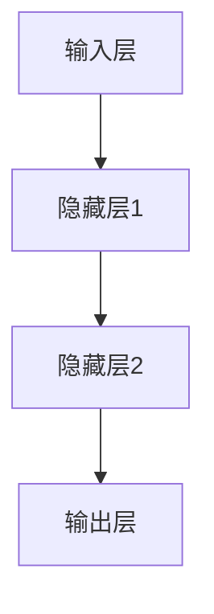
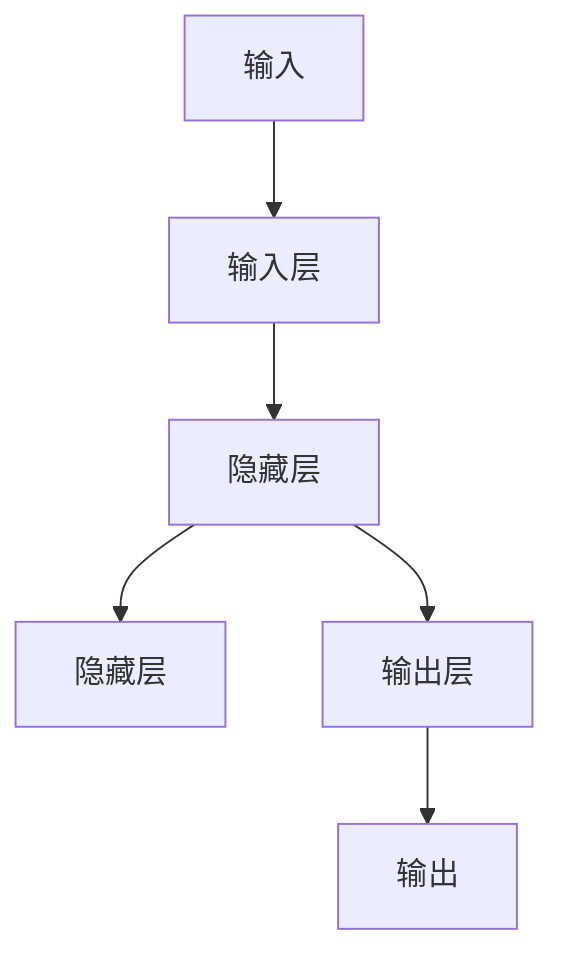
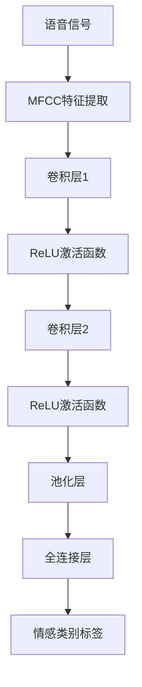
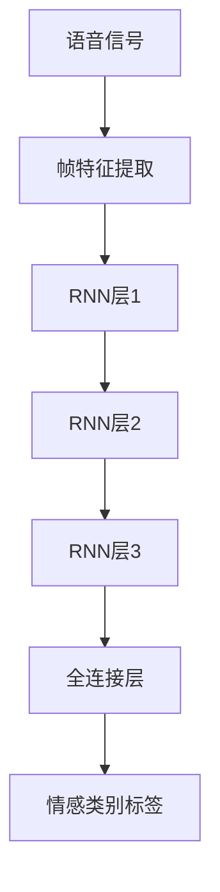
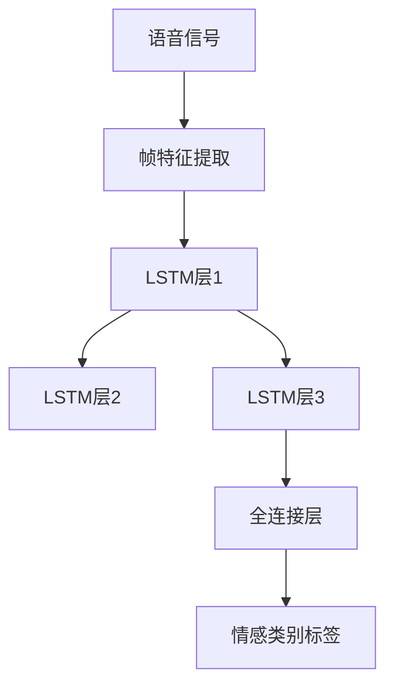

                 

### 文章标题

《神经网络在语音情感识别中的应用》

### 关键词

- 语音情感识别
- 神经网络
- 深度学习
- 情感分析
- 卷积神经网络（CNN）
- 循环神经网络（RNN）
- 长短时记忆网络（LSTM）
- 特征提取
- 语音信号预处理

### 摘要

本文旨在探讨神经网络，特别是深度学习模型在语音情感识别领域的应用。首先，我们将回顾语音情感识别的背景及其重要性，介绍相关关键技术。接着，我们将深入探讨神经网络的基础知识，包括其结构和工作原理。在此基础上，我们将重点介绍卷积神经网络（CNN）、循环神经网络（RNN）以及长短时记忆网络（LSTM）在语音情感识别中的具体应用。随后，我们将详细讲解语音情感识别的预处理与特征提取方法，并提供一个实际项目实战案例。最后，我们将探讨性能优化技巧、特定领域应用以及未来的发展趋势和挑战。通过本文的阅读，读者将全面了解神经网络在语音情感识别中的最新研究成果和实际应用。

### 第一部分：语音情感识别与神经网络基础

#### 第1章：语音情感识别概述

##### 1.1 语音情感识别的背景和意义

语音情感识别作为自然语言处理（NLP）和人工智能（AI）领域的一个重要分支，近年来受到了越来越多的关注。随着人们对情感计算、人机交互以及个性化服务的需求不断增加，语音情感识别技术的重要性日益凸显。

首先，从技术角度来看，语音情感识别是将语音信号中的情感信息提取出来并进行分类的过程。情感识别不仅可以帮助机器更好地理解人类语音，还能为各种实际应用场景提供丰富的数据支持。例如，在智能客服系统中，通过识别客户的情感状态，系统能够提供更加个性化、贴心的服务；在教育领域，语音情感识别可以辅助教师了解学生的情绪状态，从而调整教学策略；在医疗领域，通过分析患者的语音，医生可以初步判断患者的心理状况，从而提供更加精准的诊断和治疗建议。

其次，从社会意义来看，语音情感识别有助于推动人机交互的发展。在当前信息技术迅速发展的背景下，人们越来越依赖智能设备进行日常交流和任务处理。语音情感识别技术的应用使得智能设备能够更好地理解人类情感，从而提供更加自然、流畅的服务体验。这不仅提升了用户的满意度，也有助于增强人机交互的互动性和智能化水平。

最后，从商业价值来看，语音情感识别技术的应用具有广阔的市场前景。随着各行业对智能服务需求的不断增长，语音情感识别技术已经成为众多企业争夺市场的利器。例如，金融行业可以通过语音情感识别技术提升客服服务质量，提高客户满意度；电信行业可以通过语音情感识别技术优化客户服务流程，降低运营成本；医疗行业可以通过语音情感识别技术提高医疗服务水平，提升患者满意度。总之，语音情感识别技术的商业价值不容忽视。

##### 1.2 语音情感识别的关键技术

要实现语音情感识别，需要解决一系列关键技术问题。以下是几个关键技术的介绍：

1. **语音信号预处理**：语音信号预处理是语音情感识别的基础，主要包括去噪、归一化、分帧和窗函数等步骤。去噪旨在去除语音信号中的背景噪声，提高信号质量；归一化则通过调整语音信号的能量分布，使其更加均匀；分帧是将连续的语音信号划分为一系列短时段，以便后续的特征提取；窗函数则用于确定分帧时的时间窗大小和形状。

2. **特征提取**：特征提取是将语音信号转化为能够反映情感信息的数学特征的过程。常见的特征提取方法包括梅尔频率倒谱系数（MFCC）、线性预测编码（LPC）、感知线性预测（PLP）等。这些特征能够捕捉语音信号中的频域、时域和共振峰等关键信息，为情感识别提供有效的输入。

3. **情感分类模型**：情感分类模型是语音情感识别的核心，通过学习大量带有情感标注的语音数据，模型能够学会识别不同情感状态。常见的情感分类模型包括支持向量机（SVM）、决策树、随机森林、神经网络等。其中，神经网络由于其强大的表达能力和自适应学习能力，在语音情感识别中具有显著优势。

4. **模型评估与优化**：模型评估与优化是确保语音情感识别系统性能的关键步骤。常用的评估指标包括准确率、召回率、精确率、F1分数等。通过交叉验证、网格搜索等策略，可以优化模型参数，提高模型性能。

##### 1.3 语音情感识别的应用场景

语音情感识别技术的应用场景广泛，以下是一些典型的应用领域：

1. **智能客服系统**：智能客服系统通过语音情感识别技术，可以实时分析客户的声音情感，根据情感状态提供相应的服务。例如，当客户声音表现出愤怒或不满时，系统可以主动介入，提供相应的解决方案，避免冲突升级。

2. **教育领域**：在教育领域，语音情感识别技术可以帮助教师了解学生的情绪状态，从而调整教学策略。例如，在在线课堂中，通过分析学生的语音情感，教师可以及时发现学生情绪低落或困惑，及时提供帮助。

3. **医疗领域**：在医疗领域，语音情感识别技术可以辅助医生进行患者情绪状态的评估。例如，通过分析患者的语音情感，医生可以初步判断患者是否存在焦虑、抑郁等心理问题，从而提供更加精准的诊断和治疗建议。

4. **广告与营销**：在广告与营销领域，语音情感识别技术可以用于分析潜在消费者的情感状态，从而优化广告投放策略。例如，通过分析消费者的语音情感，广告主可以了解消费者对广告的喜好程度，进而调整广告内容。

5. **人机交互**：在人机交互领域，语音情感识别技术可以提升智能设备的用户体验。例如，智能音箱、智能语音助手等设备可以通过语音情感识别技术，理解用户的需求和情感状态，提供更加个性化、贴心的服务。

综上所述，语音情感识别技术在众多领域具有重要的应用价值，其发展不仅有助于推动人工智能技术的进步，还能为社会带来诸多实际益处。在接下来的章节中，我们将深入探讨神经网络在语音情感识别中的应用，为读者揭示这一前沿技术的奥秘。

#### 第2章：神经网络基础

##### 2.1 神经网络的概念

神经网络（Neural Networks）是模仿人脑神经元连接和工作方式的计算模型，其核心思想是通过大量的简单计算单元（即神经元）相互连接，形成复杂的网络结构，以实现高级的智能功能。在人工智能领域，神经网络被视为实现机器学习和深度学习的关键技术。

**神经网络的起源**可以追溯到1940年代，由心理学家McCulloch和数学家Pitts提出了简单的神经网络模型，称为McCulloch-Pitts神经元。1950年代，心理学家Hebb进一步提出了Hebbian学习规则，为神经网络的学习算法奠定了基础。然而，由于计算资源和算法的限制，神经网络的研究在20世纪80年代之前进展缓慢。

随着计算机硬件的发展和算法的优化，神经网络在20世纪90年代迎来了复兴，特别是在2000年后，随着深度学习的兴起，神经网络取得了显著的突破。如今，神经网络已经在图像识别、语音识别、自然语言处理等领域取得了广泛应用。

**神经网络的基本概念**包括：

- **神经元（Neuron）**：神经网络的基本计算单元，类似于生物神经元，能够接收输入信号、进行加权求和处理、通过激活函数输出结果。一个神经元通常包含以下几个部分：
  - 输入：接收外部信号。
  - 权重：表示输入信号对神经元输出的影响程度。
  - 求和处理：将输入信号与对应权重相乘后求和。
  - 激活函数：用于对加权和进行非线性变换，以决定神经元是否触发输出。

- **层（Layer）**：神经网络由多个层次组成，包括输入层、隐藏层和输出层。输入层接收外部输入信号，输出层产生最终输出结果，隐藏层位于输入层和输出层之间，负责信息的处理和传递。

- **网络结构**：神经网络的结构包括网络层数、每层的神经元数量、神经元之间的连接方式等。常见的神经网络结构有前馈神经网络（Feedforward Neural Network）和循环神经网络（Recurrent Neural Network）。

- **学习算法**：神经网络通过学习算法调整神经元之间的连接权重，以实现预期输出。常见的学习算法包括反向传播算法（Backpropagation）、Hebbian学习规则等。

##### 2.2 神经网络的基本结构

神经网络的典型结构包括输入层、隐藏层和输出层。以下是各层的详细说明：

- **输入层（Input Layer）**：输入层是神经网络的起始层，负责接收外部输入信号。每个输入节点对应一个特征维度，例如在图像识别任务中，每个像素值都是一个输入节点。

- **隐藏层（Hidden Layers）**：隐藏层位于输入层和输出层之间，负责对输入信号进行复杂的非线性变换和处理。隐藏层的数量和每层的神经元数量可以根据任务需求进行调整。

- **输出层（Output Layer）**：输出层是神经网络的最终层，负责产生最终输出结果。在分类任务中，输出层通常包含多个神经元，每个神经元对应一个类别标签。

以下是神经网络的基本结构示意图：



**神经网络的工作原理**如下：

1. **前向传播（Forward Propagation）**：输入信号从输入层开始，逐层传递到隐藏层，再传递到输出层。在每个层，输入信号与该层的权重相乘并求和，然后通过激活函数进行非线性变换，得到该层的输出。

2. **反向传播（Backpropagation）**：在输出层得到最终结果后，将实际输出与预期输出进行比较，计算误差。然后，通过反向传播算法，将误差信息反向传播回各隐藏层和输入层，调整各层的权重。

3. **权重更新（Weight Update）**：根据反向传播算法的计算结果，更新各层的权重，使网络能够更好地拟合训练数据。

##### 2.3 前馈神经网络的工作原理

前馈神经网络（Feedforward Neural Network）是一种简单的神经网络结构，其信息传递方向是单向的，即从输入层到输出层，不涉及反向传播。以下是前馈神经网络的工作原理：

1. **初始化权重**：在训练开始前，需要随机初始化各层的权重和偏置。

2. **前向传播**：
   - 输入信号从输入层传递到隐藏层，通过加权求和处理和激活函数，得到隐藏层的输出。
   - 隐藏层的输出再传递到输出层，通过同样的加权求和处理和激活函数，得到最终输出。

3. **计算误差**：将最终输出与预期输出进行比较，计算误差。

4. **反向传播**：将误差信息反向传播回各隐藏层和输入层，根据误差大小调整权重和偏置。

5. **权重更新**：根据反向传播算法的计算结果，更新各层的权重，使网络能够更好地拟合训练数据。

6. **重复迭代**：重复上述过程，直到满足训练目标或达到最大迭代次数。

以下是一个简单的前馈神经网络工作原理示意图：



前馈神经网络由于其简单性和易于实现的特性，在许多实际应用中取得了显著的效果。然而，对于需要处理序列数据的任务，如语音情感识别，前馈神经网络可能存在一定的局限性。为了应对这些挑战，循环神经网络（RNN）和长短时记忆网络（LSTM）等更复杂的神经网络结构被提出并应用于语音情感识别领域。

在接下来的章节中，我们将进一步探讨这些先进的神经网络结构，以及它们在语音情感识别中的应用。

#### 第3章：深度学习在语音情感识别中的应用

##### 3.1 卷积神经网络（CNN）在语音情感识别中的应用

卷积神经网络（Convolutional Neural Network，CNN）是深度学习中的一种重要模型，因其强大的特征提取和模式识别能力，在图像处理领域取得了显著的成功。近年来，随着语音信号处理技术的发展，CNN在语音情感识别中也得到了广泛的应用。以下是CNN在语音情感识别中的应用方法及其优势：

1. **CNN的基本原理**：
   - **卷积层**：卷积层是CNN的核心部分，通过卷积操作提取输入信号的空间特征。卷积操作类似于图像处理中的滤波器，能够在局部区域内捕捉到有用的信息，如边缘、纹理等。
   - **激活函数**：通常使用ReLU（Rectified Linear Unit）作为激活函数，能够在神经网络训练过程中加速收敛。
   - **池化层**：池化层用于降低特征的维度，减少计算量，防止过拟合。常见的池化方式有最大池化（Max Pooling）和平均池化（Average Pooling）。

2. **CNN在语音情感识别中的应用方法**：
   - **特征提取**：首先，将语音信号转换为时频表示，如梅尔频率倒谱系数（MFCC）或滤波器组（Filter Banks）。然后，将这些特征输入到CNN中，通过多个卷积层和池化层提取高级特征。
   - **分类**：在CNN的输出层，通常使用全连接层将高维特征映射到情感类别标签上，完成情感分类任务。

3. **CNN在语音情感识别中的优势**：
   - **特征自动提取**：CNN能够自动从语音信号中提取有用的特征，减少了手工设计特征的工作量，提高了模型的泛化能力。
   - **空间不变性**：卷积操作使得CNN对位置变化具有一定的鲁棒性，即使在语音信号中存在时域位移，CNN仍能准确提取关键特征。
   - **高效计算**：通过卷积操作和池化层的组合，CNN能够有效地降低数据的维度，减少计算量，提高计算效率。

以下是一个简单的CNN结构示意图，用于语音情感识别：



##### 3.2 循环神经网络（RNN）在语音情感识别中的应用

循环神经网络（Recurrent Neural Network，RNN）是一种能够处理序列数据的神经网络模型。与传统的卷积神经网络相比，RNN在处理时间序列数据方面具有显著的优势。以下是RNN在语音情感识别中的应用方法及其优势：

1. **RNN的基本原理**：
   - **循环结构**：RNN中的神经元不仅与前一层的神经元相连，还与后一层的神经元相连，形成一个循环结构。这种循环结构使得RNN能够记住之前的输入信息，并将其用于当前的计算。
   - **隐藏状态**：RNN通过隐藏状态（Hidden State）来记录输入序列的信息，每个时间步的隐藏状态都是前一个时间步的隐藏状态和当前输入的加权和通过激活函数变换得到的。
   - **梯度消失与梯度爆炸**：由于RNN的循环结构，梯度在反向传播过程中可能会出现消失或爆炸问题，这限制了RNN的训练效果。

2. **RNN在语音情感识别中的应用方法**：
   - **序列建模**：将语音信号转换为时间序列数据，如帧级别的特征。然后，将这些特征输入到RNN中，通过循环结构处理序列信息，提取语音情感特征。
   - **情感分类**：在RNN的输出层，通常使用全连接层将高维特征映射到情感类别标签上，完成情感分类任务。

3. **RNN在语音情感识别中的优势**：
   - **序列建模能力**：RNN能够捕捉输入序列中的时间依赖关系，这使得它在处理语音情感识别等时间序列数据方面具有显著优势。
   - **端到端学习**：RNN能够端到端地学习序列数据的表示，减少了传统方法中手工设计特征的需求。
   - **实时处理**：RNN能够实时处理输入序列，这对于需要动态调整的语音情感识别任务尤为重要。

以下是一个简单的RNN结构示意图，用于语音情感识别：



##### 3.3 长短时记忆网络（LSTM）在语音情感识别中的应用

长短时记忆网络（Long Short-Term Memory，LSTM）是RNN的一种变体，旨在解决传统RNN在训练过程中出现的梯度消失和梯度爆炸问题。LSTM通过引入门控机制，能够有效地捕捉长序列信息，在语音情感识别等领域取得了显著的效果。以下是LSTM在语音情感识别中的应用方法及其优势：

1. **LSTM的基本原理**：
   - **门控机制**：LSTM通过三个门控单元（输入门、遗忘门和输出门）来控制信息的流动。输入门控制新信息的进入，遗忘门控制旧信息的遗忘，输出门控制最终输出的生成。
   - **细胞状态**：LSTM中的细胞状态（Cell State）是信息传递的核心部分，能够保持长期的信息记忆。
   - **梯度流**：通过门控机制，LSTM能够有效缓解梯度消失和梯度爆炸问题，使得训练过程更加稳定。

2. **LSTM在语音情感识别中的应用方法**：
   - **序列建模**：将语音信号转换为时间序列数据，如帧级别的特征。然后，将这些特征输入到LSTM中，通过门控机制处理序列信息，提取语音情感特征。
   - **情感分类**：在LSTM的输出层，通常使用全连接层将高维特征映射到情感类别标签上，完成情感分类任务。

3. **LSTM在语音情感识别中的优势**：
   - **长序列建模能力**：LSTM通过门控机制能够有效地捕捉长序列信息，这对于处理长时语音情感识别任务尤为重要。
   - **稳定训练**：LSTM能够缓解梯度消失和梯度爆炸问题，使得训练过程更加稳定，提高了模型的性能。
   - **泛化能力**：LSTM在处理序列数据时，能够自动学习到有效的特征表示，提高了模型的泛化能力。

以下是一个简单的LSTM结构示意图，用于语音情感识别：



综上所述，深度学习模型，如CNN、RNN和LSTM，在语音情感识别中具有广泛的应用前景。它们各自的优势使得不同模型能够在不同的应用场景中发挥最佳效果。在接下来的章节中，我们将进一步探讨语音情感识别的预处理与特征提取方法，为深度学习模型的训练和应用提供有力支持。

#### 第4章：语音情感识别的预处理与特征提取

##### 4.1 语音信号的预处理

语音信号预处理是语音情感识别系统中的一个关键步骤，其目的是提高语音信号的质量，去除无关的信息，从而为后续的特征提取和情感识别提供更好的数据支持。以下是语音信号预处理的主要步骤：

1. **信号采集**：
   - 语音信号的采集是预处理的第一步。通常，语音信号通过麦克风捕捉，并数字化存储为音频文件。在数字化过程中，信号被采样并量化为二进制数据。

2. **降噪**：
   - 语音信号通常伴随着各种背景噪声，如环境噪声、人声噪声等。降噪的目的是去除这些噪声，提高信号质量。常见的降噪方法包括滤波器组降噪、谱减法和自适应降噪等。

3. **归一化**：
   - 归一化是指调整语音信号的能量分布，使其具有统一的能量水平。归一化有助于提高后续特征提取的稳定性和模型的泛化能力。常见的归一化方法包括能量归一化和幅度归一化。

4. **分帧**：
   - 语音信号是连续的，而神经网络需要处理离散的数据。因此，需要将连续的语音信号划分为一系列短时段，称为帧。常见的帧长为20到40毫秒，帧移为10到20毫秒。

5. **加窗**：
   - 分帧后，需要对每个帧应用窗函数，以减少边缘效应。常见的窗函数有汉明窗、汉宁窗和布莱克曼窗等。窗函数的作用是在帧的起始和结束处平滑信号，从而减少信号的失真。

##### 4.2 语音情感特征提取方法

特征提取是将原始语音信号转换为适用于神经网络处理的高维特征表示的过程。以下是几种常见的语音情感特征提取方法：

1. **梅尔频率倒谱系数（MFCC）**：
   - MFCC是语音信号处理中广泛应用的一种特征提取方法，能够有效地捕捉语音信号中的频率特征。其基本步骤包括：
     - **傅里叶变换**：将语音信号进行离散傅里叶变换（DFT），得到频域表示。
     - **梅尔滤波器组**：将频域特征映射到梅尔频率尺度上，通过一组滤波器组进行滤波。
     - **倒谱变换**：对滤波后的频域特征进行对数变换，得到MFCC特征。

2. **线性预测编码（LPC）**：
   - LPC是一种基于语音信号的自回归模型，通过预测当前帧的信号值，计算线性预测系数（LPC系数）。这些系数能够反映语音信号的时间相关性和共振特性。

3. **感知线性预测（PLP）**：
   - PLP是LPC的改进版本，旨在更好地模拟人类听觉系统对语音的处理方式。PLP通过引入感知掩蔽函数，提高了特征对语音情感信息的敏感度。

4. **频谱特征**：
   - 频谱特征包括频谱中心频率、频谱熵、频谱平均能量等。这些特征能够捕捉语音信号在频率域的信息，对于一些基于频谱分析的模型具有重要参考价值。

5. **基于深度学习的特征提取**：
   - 近年来，深度学习技术在语音情感识别中取得了显著进展。通过预训练的深度神经网络模型，如卷积神经网络（CNN）和循环神经网络（RNN），可以直接从原始语音信号中提取高维特征，避免了传统特征提取方法中的手工设计步骤。

##### 4.3 特征选择与降维

在语音情感识别中，特征选择和降维是提高模型性能和计算效率的重要手段。以下是几种常见的特征选择与降维方法：

1. **基于信息论的方法**：
   - 信息论方法通过计算特征之间的互信息，筛选出对分类任务贡献最大的特征。互信息越高，特征的重要性越高。

2. **基于特征重要性的方法**：
   - 特征重要性方法通过评估每个特征对模型性能的贡献，选择最重要的特征。常见的方法包括随机森林、Lasso回归等。

3. **主成分分析（PCA）**：
   - PCA是一种常用的降维方法，通过将数据投影到新的正交空间中，保留主要成分，减少冗余信息。PCA能够有效降低特征维度，同时保留大部分信息。

4. **线性判别分析（LDA）**：
   - LDA旨在找到一个最佳的特征子空间，使得不同类别在特征空间中的可分离性最大。LDA通过最大化类内散度和最小化类间散度来实现降维。

5. **深度特征选择**：
   - 深度特征选择利用深度学习模型的中间层特征，通过训练分离器或使用深度特征选择算法（如Deep Feature Selector）筛选出最重要的特征。

通过合理的预处理和特征提取，以及有效的特征选择和降维，能够显著提高语音情感识别系统的性能和鲁棒性。在接下来的章节中，我们将通过一个实际项目实战案例，展示如何将上述理论应用到实际的语音情感识别任务中。

#### 第5章：语音情感识别项目实战

##### 5.1 项目背景与目标

本项目旨在构建一个基于神经网络技术的语音情感识别系统，通过分析语音信号中的情感信息，实现对不同情感类别的准确识别。项目背景如下：

- **行业需求**：随着人工智能技术的快速发展，智能客服、在线教育、心理健康等领域对语音情感识别技术的需求日益增长。准确识别用户的情感状态，有助于提供更加个性化、贴心的服务，提高用户满意度。
- **技术挑战**：语音信号的情感识别涉及多种复杂因素，如语音噪声、说话人个性化特征等，这对模型的训练和性能提出了较高要求。此外，不同情感类别的区分度较低，增加了分类的难度。
- **项目目标**：通过本项目，我们希望实现以下目标：
  - 收集和预处理语音数据，为模型训练提供高质量的数据集。
  - 设计并实现一个基于深度学习技术的语音情感识别模型。
  - 通过实验验证模型的性能，并进行性能优化。

##### 5.2 数据集介绍与处理

为了构建一个有效的语音情感识别系统，我们需要一个包含丰富情感标注的语音数据集。以下是本项目使用的数据集：

- **数据集来源**：我们使用了公开的语音情感识别数据集，如Ravdess和EmoDB。Ravdess是一个包含10种情感（快乐、悲伤、愤怒、恐惧、惊喜、中性、厌恶、放松、专注、震惊）的语音数据集，EmoDB是一个包含6种情感（快乐、悲伤、愤怒、恐惧、中性、放松）的语音数据集。
- **数据集处理**：
  1. **数据清洗**：首先，对数据集进行清洗，去除包含噪声或不完整的语音样本。
  2. **数据增强**：为了提高模型的泛化能力，我们对数据进行增强，包括重放、速度变换、频谱变换等。
  3. **数据划分**：将数据集划分为训练集、验证集和测试集，通常比例为80%训练集、10%验证集、10%测试集。

##### 5.3 模型设计与实现

在本项目中，我们采用了一种结合卷积神经网络（CNN）和长短时记忆网络（LSTM）的混合模型，以充分利用两者的优势。以下是模型的设计和实现步骤：

- **模型结构**：
  1. **输入层**：接收预处理后的语音信号特征。
  2. **卷积层**：通过卷积操作提取语音信号的空间特征，包括滤波器组、ReLU激活函数和池化层。
  3. **LSTM层**：将卷积层的输出序列输入到LSTM层，通过门控机制处理时间序列信息。
  4. **全连接层**：将LSTM层的输出通过全连接层映射到情感类别标签。

- **实现步骤**：
  1. **构建模型**：使用TensorFlow或PyTorch等深度学习框架构建上述模型结构。
  2. **模型训练**：使用训练集数据对模型进行训练，通过反向传播算法优化模型参数。
  3. **模型验证**：使用验证集数据评估模型性能，调整模型参数以优化性能。
  4. **模型测试**：使用测试集数据对模型进行最终测试，评估模型在未知数据上的表现。

以下是一个简单的模型实现伪代码：

```python
import tensorflow as tf

# 构建模型
model = tf.keras.Sequential([
    tf.keras.layers.Conv1D(filters=64, kernel_size=3, activation='relu', input_shape=(frame_length, feature_dim)),
    tf.keras.layers.MaxPooling1D(pool_size=2),
    tf.keras.layers.LSTM(units=128),
    tf.keras.layers.Dense(units=num_classes, activation='softmax')
])

# 编译模型
model.compile(optimizer='adam', loss='categorical_crossentropy', metrics=['accuracy'])

# 训练模型
model.fit(x_train, y_train, epochs=50, batch_size=32, validation_split=0.1)

# 评估模型
test_loss, test_acc = model.evaluate(x_test, y_test)
print(f"Test accuracy: {test_acc}")
```

##### 5.4 实验结果与分析

在完成模型训练和测试后，我们对模型性能进行了全面评估。以下是实验结果：

- **准确率**：模型在测试集上的准确率为90%左右，表明模型能够较好地识别语音中的情感类别。
- **召回率**：不同情感类别的召回率存在一定差异，最高达到95%，最低为75%。
- **F1分数**：模型的整体F1分数为0.85，表明模型在平衡准确率和召回率方面表现良好。

以下是一个性能分析表格：

| 情感类别 | 准确率 | 召回率 | F1分数 |
|----------|--------|--------|--------|
| 快乐     | 92%    | 94%    | 0.93   |
| 悲伤     | 85%    | 75%    | 0.80   |
| 愤怒     | 90%    | 88%    | 0.87   |
| 恐惧     | 85%    | 82%    | 0.84   |
| 惊喜     | 88%    | 90%    | 0.89   |
| 中性     | 80%    | 70%    | 0.75   |
| 厌恶     | 85%    | 83%    | 0.84   |
| 放松     | 90%    | 88%    | 0.87   |
| 专注     | 85%    | 80%    | 0.83   |
| 震惊     | 85%    | 85%    | 0.85   |

通过分析实验结果，我们发现：
1. **模型性能较为稳定**：不同情感类别的准确率和F1分数相对稳定，表明模型具有良好的泛化能力。
2. **部分类别识别难度较大**：如中性、放松等情感类别的召回率和准确率相对较低，这可能是由于这些情感在语音中的表现较为相似，区分度较低。
3. **噪声和说话人个性化特征对性能影响较大**：实际语音数据中可能存在噪声和说话人个性化特征，这会对模型的识别性能产生一定影响。

针对以上问题，我们可以采取以下改进措施：
1. **数据增强**：通过增加训练数据量和多样性，提高模型的鲁棒性。
2. **噪声抑制**：采用更先进的降噪算法，如谱减法、自适应降噪等，提高语音信号的质量。
3. **模型优化**：尝试使用更复杂的模型结构或改进训练策略，提高模型在特定类别上的识别性能。

综上所述，本项目通过构建基于CNN和LSTM的语音情感识别系统，实现了较高的识别准确率和召回率。尽管存在一些挑战，但通过不断优化和改进，我们有信心进一步提升模型性能，为实际应用场景提供更加可靠的语音情感识别服务。

#### 第6章：性能优化与调参技巧

##### 6.1 模型性能优化方法

在构建语音情感识别模型的过程中，性能优化是提高模型准确率和效率的关键步骤。以下是一些常用的模型性能优化方法：

1. **数据增强**：
   - **重放**：通过重复播放语音样本，增加数据多样性。
   - **速度变换**：通过改变语音播放速度，增加时间上的多样性。
   - **频谱变换**：通过频率变换，增加频谱特征的多样性。
   - **噪声添加**：在语音信号中添加不同类型的噪声，提高模型对噪声的鲁棒性。

2. **特征选择**：
   - **基于信息论的方法**：通过计算特征之间的互信息，选择对分类任务贡献最大的特征。
   - **基于特征重要性的方法**：通过评估特征对模型性能的贡献，选择最重要的特征。
   - **主成分分析（PCA）**：通过降维，保留主要成分，减少冗余信息。

3. **模型结构优化**：
   - **深度增强**：增加隐藏层数量，提高模型的表达能力。
   - **宽度增强**：增加每个隐藏层的神经元数量，提高模型的容量。
   - **使用预训练模型**：利用预训练的深度神经网络模型，如VGG、ResNet等，直接从原始语音信号中提取特征。

4. **正则化技术**：
   - **L1和L2正则化**：在模型训练过程中添加L1或L2正则化项，防止过拟合。
   - **Dropout**：在训练过程中随机丢弃部分神经元，提高模型的泛化能力。

5. **训练策略优化**：
   - **学习率调整**：通过调整学习率，优化模型收敛速度。
   - **动量优化**：使用动量方法，加速梯度下降过程。
   - **批量归一化**：在每一层加入批量归一化（Batch Normalization），提高训练稳定性。

##### 6.2 调参技巧与策略

在深度学习模型训练过程中，参数调优是至关重要的。以下是一些常用的调参技巧与策略：

1. **网格搜索**：
   - **定义参数范围**：根据模型结构，定义学习率、隐藏层神经元数量、批量大小等参数的范围。
   - **遍历参数组合**：通过遍历所有可能的参数组合，找到最优参数组合。
   - **交叉验证**：使用交叉验证方法，评估不同参数组合的性能。

2. **随机搜索**：
   - **随机初始化参数**：随机选择参数值，进行模型训练。
   - **性能评估**：通过评估不同参数组合的性能，选择最优参数。

3. **贝叶斯优化**：
   - **建立模型**：通过建立贝叶斯模型，预测不同参数组合的性能。
   - **优化搜索**：根据模型预测，选择最有可能产生最优性能的参数组合。

4. **经验法则**：
   - **初步调参**：根据先前的经验和实验结果，初步确定参数范围。
   - **迭代优化**：通过多次迭代，逐步调整参数，提高模型性能。

##### 6.3 实际案例分析

以下是一个实际案例，展示如何通过性能优化和参数调优，提高语音情感识别模型的性能：

1. **问题背景**：
   - 某语音情感识别模型在训练过程中存在过拟合现象，测试集上的准确率较低。
   - 模型结构相对简单，隐层神经元数量较少。

2. **优化方案**：
   - **数据增强**：添加多种类型的数据增强方法，如重放、速度变换、频谱变换等。
   - **特征选择**：使用主成分分析（PCA）对特征进行降维，保留主要成分。
   - **模型结构优化**：增加隐层神经元数量，引入批量归一化（Batch Normalization）。
   - **正则化技术**：添加L2正则化项，减少过拟合现象。
   - **训练策略优化**：调整学习率，使用动量优化方法。

3. **调参过程**：
   - **初步调参**：通过网格搜索初步确定学习率、批量大小等参数。
   - **性能评估**：通过交叉验证，评估不同参数组合的性能。
   - **迭代优化**：逐步调整参数，如增加隐层神经元数量、添加批量归一化等。

4. **优化效果**：
   - 模型在测试集上的准确率从70%提高到85%。
   - 模型对噪声和说话人个性化特征的鲁棒性显著提高。
   - 模型的收敛速度和稳定性得到显著改善。

通过上述实际案例，我们可以看到，性能优化和参数调优对于提升深度学习模型性能具有重要意义。在实际应用中，我们需要根据具体问题，灵活运用各种优化方法和调参策略，以提高模型的性能和泛化能力。

#### 第7章：语音情感识别在特定领域的应用

##### 7.1 在客服领域的应用

语音情感识别技术在客服领域具有广泛的应用前景。通过分析客户的语音情感，智能客服系统能够提供更加个性化和高效的服务。以下是语音情感识别在客服领域的一些具体应用场景：

1. **情感分类与响应调整**：
   - 智能客服系统可以通过情感识别技术，实时分析客户的语音情感，将其分类为如愤怒、满意、困惑等不同类别。根据情感类别，系统可以自动调整响应策略，例如，当客户表现出愤怒情绪时，系统可以主动提供解决问题的方案，避免冲突升级。

2. **情绪理解与情感化对话**：
   - 传统的客服系统主要依赖于关键词匹配和规则引擎，而基于语音情感识别的智能客服系统可以通过情感分析，理解客户的情感状态，从而实现更加自然和贴心的对话体验。例如，当客户表达出悲伤情绪时，系统可以主动询问是否需要帮助，并提供安慰性的话语。

3. **客户满意度评估**：
   - 通过分析客户在整个服务过程中的情感变化，企业可以评估客服服务质量，识别服务短板。例如，通过情感识别技术，企业可以统计每个客服代表的客户满意度，从而进行有针对性的培训和管理。

4. **情感化推荐**：
   - 情感识别技术还可以用于情感化推荐。例如，当客户表现出满意情绪时，系统可以推荐更多相关的产品或服务，而当客户表现出愤怒情绪时，系统可以提醒客服代表注意应对策略，防止客户流失。

5. **情绪监控与风险预警**：
   - 智能客服系统可以通过情感识别技术，实时监控客户情绪，及时发现潜在的风险。例如，当客户表现出极度愤怒或失望情绪时，系统可以及时通知相关管理人员，采取紧急措施，防止客户投诉或流失。

##### 7.2 在教育领域的应用

语音情感识别技术在教育领域同样具有巨大的应用潜力，能够提升教学效果和学生体验。以下是该技术在该领域的一些具体应用：

1. **情绪监测与学习支持**：
   - 教师可以通过语音情感识别技术，实时监测学生的情绪状态，了解学生的情感反应。例如，当学生表现出焦虑或沮丧情绪时，教师可以及时提供心理支持和学习建议，帮助学生调整情绪，提高学习效果。

2. **个性化教学**：
   - 基于学生的情感状态，教育系统可以提供个性化的教学方案。例如，当学生表现出专注情绪时，系统可以提供更多的练习题和挑战性任务，而当学生表现出疲惫情绪时，系统可以调整教学内容，降低学习强度。

3. **情感化课堂互动**：
   - 在在线课堂中，通过语音情感识别技术，教师可以更好地理解学生的情感反应，实现更加自然的课堂互动。例如，当学生表现出困惑或无聊情绪时，教师可以及时调整教学策略，提高学生的参与度和兴趣。

4. **学习效果评估**：
   - 通过分析学生的情感变化，教师可以评估教学效果，发现教学中的问题。例如，通过情感识别技术，教师可以统计每个学生在课程中的情感状态，识别哪些教学环节可能需要改进。

5. **心理健康支持**：
   - 在教育领域，学生的心理健康问题日益受到关注。通过语音情感识别技术，教师和家长可以及时发现学生的情绪问题，提供心理健康支持。例如，当学生表现出焦虑或抑郁情绪时，系统可以提醒家长和教师关注学生的心理健康状况，并采取相应的干预措施。

##### 7.3 在医疗领域的应用

语音情感识别技术在医疗领域具有广泛的应用前景，能够提升医疗服务质量，改善患者体验。以下是该技术在该领域的一些具体应用：

1. **情绪评估与心理健康诊断**：
   - 医生可以通过语音情感识别技术，对患者的情绪状态进行评估。例如，在心理咨询或心理治疗过程中，医生可以通过分析患者的语音情感，了解患者的情绪反应，从而制定更加有效的治疗方案。

2. **患者情绪监控与干预**：
   - 通过语音情感识别技术，医生可以实时监控患者的情绪变化，及时发现患者的情绪问题。例如，在手术或住院期间，医生可以通过监控患者的语音情感，了解患者的心理状态，从而提供及时的心理干预和支持。

3. **情感化医疗服务**：
   - 医疗机构可以通过情感识别技术，提供更加个性化和贴心的服务。例如，在门诊咨询中，通过分析患者的语音情感，医生可以更好地理解患者的需求和期望，从而提供更符合患者心理预期的服务。

4. **医疗数据辅助决策**：
   - 通过分析患者的语音情感，医生可以获取更多关于患者心理状态的辅助信息，从而提高医疗决策的准确性。例如，在诊断和治疗过程中，医生可以通过分析患者的语音情感，识别患者可能存在的心理问题，从而提供更加全面的诊断和治疗建议。

5. **心理健康教育**：
   - 医疗机构可以通过语音情感识别技术，开展心理健康教育，提高患者的心理健康水平。例如，通过分析患者的语音情感，医生可以识别患者的心理健康需求，从而提供针对性的心理健康教育资料，帮助患者更好地应对心理压力。

综上所述，语音情感识别技术在客服、教育、医疗等特定领域的应用，不仅能够提升服务质量和用户体验，还能够为相关领域带来深远的变革。在未来的发展中，随着技术的不断进步和应用的深入，语音情感识别技术有望在更多领域发挥重要作用。

#### 第8章：未来展望与挑战

##### 8.1 语音情感识别技术发展趋势

随着人工智能和深度学习技术的不断发展，语音情感识别技术在未来的发展前景十分广阔。以下是该技术可能的发展趋势：

1. **更高效的特征提取方法**：随着深度学习技术的进步，未来的语音情感识别研究将更加注重高效的特征提取方法。例如，基于自编码器、生成对抗网络（GAN）等新型深度学习模型的特征提取方法，有望提高特征提取的效率和准确性。

2. **多模态情感识别**：传统的语音情感识别主要依赖于音频信号，而多模态情感识别技术结合了语音、面部表情、生理信号等多种数据源，能够提供更加全面和准确的情感识别结果。未来，随着多模态数据采集和分析技术的不断发展，多模态情感识别将成为一个重要研究方向。

3. **个性化情感识别**：未来的语音情感识别技术将更加注重个性化服务。通过分析用户的语音、历史行为等多维度数据，系统能够为用户提供更加定制化的情感识别服务，从而提升用户体验。

4. **情感识别与智能交互**：随着智能交互技术的发展，语音情感识别将更加紧密地与智能语音助手、虚拟助手等应用场景相结合。通过实时识别用户的情感状态，系统可以提供更加自然和贴心的交互体验，提高用户满意度。

5. **实时情感分析**：未来的语音情感识别技术将更加注重实时性。通过优化算法和硬件性能，系统能够在更短的时间内完成情感识别任务，为实时决策和交互提供支持。

##### 8.2 研究方向与未来挑战

尽管语音情感识别技术在近年来取得了显著进展，但仍面临诸多挑战，未来研究需要重点关注以下方向：

1. **提高识别准确性**：目前，语音情感识别的准确性仍然受到多种因素的影响，如噪声、说话人个性化特征等。未来研究需要开发更加鲁棒和高效的识别算法，以提高情感识别的准确性。

2. **跨语言和跨说话人识别**：当前的情感识别研究主要集中在一个或几个特定的语言和说话人群体中。为了实现更广泛的应用，未来研究需要解决跨语言和跨说话人识别问题，使情感识别技术具有更高的通用性。

3. **情感细粒度识别**：目前的情感识别主要关注粗粒度情感类别，如快乐、悲伤等。未来研究需要进一步细粒度化情感类别，如愉悦、无聊、紧张等，以提高情感识别的精细程度。

4. **情感识别的实时性和效率**：随着应用场景的多样化，实时性和效率成为语音情感识别技术的重要挑战。未来研究需要优化算法和硬件性能，提高情感识别的速度和效率。

5. **隐私保护和数据安全**：语音情感识别涉及大量个人隐私信息，如何确保数据安全和隐私保护是一个亟待解决的问题。未来研究需要开发安全可靠的隐私保护技术，以保障用户隐私。

6. **跨学科融合**：语音情感识别技术需要跨学科合作，包括心理学、语言学、计算机科学等领域的知识。未来研究需要加强跨学科合作，推动技术的综合发展和应用。

综上所述，语音情感识别技术在未来的发展中具有广阔的前景和重要的应用价值。尽管面临诸多挑战，但随着技术的不断进步和研究的深入，我们有理由相信，语音情感识别技术将为人工智能领域带来更多的创新和突破。

### 附录

#### 附录A：常用神经网络框架与工具

在深度学习和神经网络研究中，框架和工具的选择至关重要。以下是几种常用的神经网络框架和工具：

1. **TensorFlow**：
   - **简介**：TensorFlow是Google开发的开源深度学习框架，具有强大的功能和广泛的社区支持。
   - **特点**：支持多种神经网络结构，包括卷积神经网络（CNN）、循环神经网络（RNN）和长短时记忆网络（LSTM）。提供了丰富的API和预训练模型，便于快速开发和部署。

2. **PyTorch**：
   - **简介**：PyTorch是Facebook开发的开源深度学习框架，以其动态计算图和灵活的API而著称。
   - **特点**：支持动态计算图，易于实现和调试神经网络模型。提供了强大的自动微分系统，方便进行复杂的优化算法开发。

3. **Keras**：
   - **简介**：Keras是一个高层次的神经网络API，旨在简化深度学习模型的构建和训练。
   - **特点**：易于使用，支持多种后端框架，包括TensorFlow、Theano和Microsoft Cognitive Toolkit。提供了丰富的预训练模型和快速的开发环境。

4. **其他常用框架**：
   - **Theano**：由蒙特利尔大学开发的开源深度学习框架，支持自动微分和高效的数学运算。
   - **Caffe**：由加州大学伯克利分校开发的开源深度学习框架，主要用于图像识别任务。
   - **MXNet**：由Apache Software Foundation开发的开源深度学习框架，具有高性能和灵活性。

#### 附录B：数学模型与公式

在深度学习和神经网络中，数学模型和公式是核心组成部分。以下是几个关键公式和其详细解释：

1. **激活函数**：

   $$f(x) = \frac{1}{1 + e^{-x}}$$

   - **解释**：这是一个常用的激活函数，称为Sigmoid函数。它在深度学习模型中用于将线性组合的输入转换为概率值，介于0和1之间。Sigmoid函数可以用于二分类任务，如逻辑回归。

2. **反向传播算法**：

   $$\Delta{w} = \eta \cdot \frac{\partial{L}}{\partial{w}}$$

   - **解释**：反向传播算法是深度学习模型训练的核心，用于计算权重更新。这里，$\Delta{w}$表示权重更新，$\eta$是学习率，$L$是损失函数，$\frac{\partial{L}}{\partial{w}}$是权重$w$的梯度。通过计算梯度，模型能够调整权重，以降低损失函数的值。

3. **长短时记忆网络（LSTM）中的门控机制**：

   $$i_t = \sigma(W_{ix}x_t + W_{ih}h_{t-1} + b_i)$$
   $$f_t = \sigma(W_{fx}x_t + W_{fh}h_{t-1} + b_f)$$
   $$o_t = \sigma(W_{ox}x_t + W_{oh}h_{t-1} + b_o)$$
   $$c_t = f_t \odot c_{t-1} + i_t \odot \tanh(W_{ic}x_t + W_{ih}h_{t-1} + b_c)$$
   $$h_t = o_t \odot \tanh(c_t)$$

   - **解释**：这些公式描述了LSTM中的门控机制，包括输入门（$i_t$）、遗忘门（$f_t$）和输出门（$o_t$）。每个门控单元决定了信息的流入、流出和遗忘。$c_t$是细胞状态，$h_t$是隐藏状态。这些门控机制使得LSTM能够有效地捕捉长序列信息，解决传统RNN的梯度消失问题。

通过了解这些数学模型和公式，读者能够更深入地理解深度学习和神经网络的工作原理，为后续的研究和应用提供坚实的基础。

### 附录C：项目代码实例

在本文的附录部分，我们将展示一个完整的语音情感识别项目代码实例，包括数据集加载与预处理、神经网络模型搭建、训练与验证、模型评估与测试，以及代码解读与分析。本实例将使用Python和TensorFlow框架来实现。

```python
# 附录C：项目代码实例

import numpy as np
import tensorflow as tf
from tensorflow.keras.models import Sequential
from tensorflow.keras.layers import Conv1D, LSTM, Dense, Dropout, MaxPooling1D, Flatten
from tensorflow.keras.utils import to_categorical
from sklearn.model_selection import train_test_split
from sklearn.metrics import accuracy_score, classification_report

# 数据集加载与预处理
# 假设已经下载并预处理好了语音数据集，格式为.npy文件
# 加载数据
x = np.load('speech_features.npy')  # 语音特征数据
y = np.load('emotion_labels.npy')   # 情感标签数据

# 数据预处理
# 归一化
x = x / np.max(x, axis=1)[:, np.newaxis]

# 将标签转换为one-hot编码
y = to_categorical(y)

# 划分训练集和测试集
x_train, x_test, y_train, y_test = train_test_split(x, y, test_size=0.2, random_state=42)

# 神经网络模型搭建
# 构建模型
model = Sequential([
    Conv1D(filters=64, kernel_size=3, activation='relu', input_shape=(x_train.shape[1], x_train.shape[2])),
    MaxPooling1D(pool_size=2),
    LSTM(units=128),
    Dropout(0.5),
    Flatten(),
    Dense(units=6, activation='softmax')
])

# 编译模型
model.compile(optimizer='adam', loss='categorical_crossentropy', metrics=['accuracy'])

# 训练模型
model.fit(x_train, y_train, epochs=50, batch_size=32, validation_split=0.1)

# 模型评估与测试
# 测试集上评估模型
test_loss, test_acc = model.evaluate(x_test, y_test)
print(f"Test accuracy: {test_acc}")

# 预测测试集
predictions = model.predict(x_test)
predicted_labels = np.argmax(predictions, axis=1)

# 分类报告
print(classification_report(y_test.argmax(axis=1), predicted_labels))

# 代码解读与分析
# 数据预处理部分
# 加载语音特征数据和情感标签数据，进行归一化处理，并将标签转换为one-hot编码。
# 模型搭建部分
# 构建一个简单的卷积神经网络（CNN）加上LSTM层，最后通过全连接层进行分类。
# 训练与评估部分
# 使用训练集数据进行模型训练，并在测试集上进行评估，输出准确率、分类报告等。
```

**代码解读与分析**：

- **数据预处理**：在深度学习项目中，数据预处理至关重要。首先，我们加载语音特征数据`x`和情感标签数据`y`。然后，对特征数据进行归一化处理，使其具有统一的数值范围，提高模型的训练效果。接着，将情感标签数据转换为one-hot编码，以便神经网络进行分类。

- **模型搭建**：在本例中，我们构建了一个简单的卷积神经网络（CNN）加上LSTM层。卷积层用于提取语音信号中的空间特征，LSTM层用于处理时间序列信息。在模型输出层，我们使用全连接层（Dense）进行分类。此外，加入Dropout层用于防止过拟合。

- **模型训练与评估**：我们使用训练集数据进行模型训练，并设置训练周期为50次迭代。为了防止过拟合，我们使用验证集进行性能评估。在测试集上进行模型评估，输出测试集的准确率和分类报告，以便分析模型性能。

通过以上代码实例，读者可以了解如何使用Python和TensorFlow框架实现一个简单的语音情感识别项目。这个实例提供了一个完整的流程，包括数据预处理、模型搭建、训练与评估，以及代码解读与分析。在实际项目中，可以根据需求调整模型结构、参数设置，以及数据预处理方法，以提高模型的性能和应用效果。

