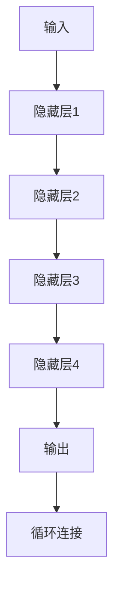
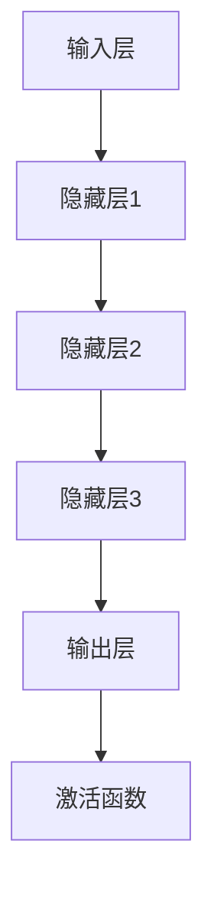

                 

# 《神经网络：开启智能新纪元》

> **关键词**：神经网络，人工智能，机器学习，深度学习，计算机视觉，自然语言处理

> **摘要**：
本篇博客将带领读者深入了解神经网络，一种强大的机器学习工具，它开启了智能新纪元的的大门。我们将从神经网络的基础概念、数学基础、前馈神经网络、卷积神经网络、循环神经网络、集成学习和强化学习等方面逐一探讨，并分享神经网络在现实世界中的应用案例以及编程实践。

## 目录大纲

- **第一部分：神经网络基础**
  - **1. 神经网络概述**
    - **1.1 神经网络的历史与发展**
    - **1.2 神经网络的结构与组成**
    - **1.3 激活函数的作用**
  - **2. 神经网络的数学基础**
    - **2.1 线性代数基础**
    - **2.2 微积分基础**
  - **3. 前馈神经网络**
    - **3.1 前馈神经网络的原理**
    - **3.2 前馈神经网络的训练**
  - **4. 卷积神经网络**
    - **4.1 卷积神经网络的基本原理**
    - **4.2 卷积神经网络的应用**
  - **5. 循环神经网络**
    - **5.1 循环神经网络的基本原理**
    - **5.2 循环神经网络的应用**
  - **6. 集成学习与强化学习**
    - **6.1 集成学习方法**
    - **6.2 强化学习方法**
  - **7. 神经网络的未来趋势与应用场景**
    - **7.1 神经网络的未来趋势**
    - **7.2 神经网络的应用场景**
    - **7.3 神经网络在现实世界中的应用案例**
  - **8. 神经网络编程实践**
    - **8.1 编程环境搭建**
    - **8.2 神经网络编程实践**
    - **8.3 代码实战案例**
  - **9. 附录**
    - **9.1 常用数学公式与符号**
    - **9.2 常用编程技巧与工具**
    - **9.3 进一步学习资源**
    - **9.4 参考文献**
    - **9.5 Mermaid 流程图**
    - **9.6 伪代码示例**

### 第一部分：神经网络基础

### 1. 神经网络概述

神经网络，是模仿人脑神经元连接和工作的方式构建的计算机算法。它由大量的神经元（也称为节点）相互连接而成，通过学习数据中的模式和规律来完成任务。

#### 1.1 神经网络的历史与发展

神经网络的历史可以追溯到1940年代，当时心理学家McCulloch和数学家Pitts提出了第一个数学模型来模拟人脑神经元。然而，直到1980年代，随着计算机性能的提升和大数据的出现，神经网络才得到了广泛的应用。

1990年代初，Hinton等人提出了反向传播算法（Backpropagation Algorithm），这是一个有效的神经网络训练算法，使得神经网络的应用变得更加广泛。近年来，随着深度学习技术的发展，神经网络在图像识别、语音识别、自然语言处理等领域取得了显著的成果。

#### 1.2 神经网络的结构与组成

神经网络通常由以下几个部分组成：

- **输入层**：接收外部输入数据。
- **隐藏层**：对输入数据进行处理，可以是单层或多层。
- **输出层**：产生最终的输出。

每个神经元由权重（weights）、偏置（bias）和激活函数（activation function）组成。权重和偏置决定了神经元的输入和输出之间的关系，激活函数则用于将线性组合的输入映射到非线性的输出。

#### 1.3 激活函数的作用

激活函数是神经网络中非常重要的部分，它将线性组合的输入映射到非线性的输出，使得神经网络能够学习复杂的非线性关系。

常见的激活函数包括：

- **Sigmoid函数**：$f(x) = \frac{1}{1 + e^{-x}}$
- **ReLU函数**：$f(x) = \max(0, x)$
- **Tanh函数**：$f(x) = \frac{e^x - e^{-x}}{e^x + e^{-x}}$

这些激活函数都有不同的特性，选择合适的激活函数可以影响神经网络的性能。

### 2. 神经网络的数学基础

神经网络的训练过程涉及到大量的数学运算，主要包括线性代数和微积分。

#### 2.1 线性代数基础

- **矩阵与向量运算**：神经网络中的权重和偏置通常以矩阵的形式表示，我们需要熟练掌握矩阵的加法、减法、乘法等基本运算。
- **矩阵的逆运算与行列式**：在神经网络中，我们常常需要计算矩阵的逆，以及计算矩阵的行列式。

#### 2.2 微积分基础

- **导数与微分**：导数用于计算函数在某一点的斜率，它在神经网络中用于计算损失函数对参数的梯度。
- **梯度下降算法**：这是一种常用的优化算法，用于调整神经网络的权重和偏置，以最小化损失函数。

接下来，我们将进一步探讨这些数学基础，并了解如何应用于神经网络的训练过程。<!-- more -->

---

### 2. 神经网络的数学基础（续）

#### 2.1 线性代数基础

在神经网络中，线性代数扮演着核心角色。以下是一些关键的线性代数概念，它们对于理解神经网络的工作原理至关重要。

##### 2.1.1 矩阵与向量运算

**向量**是具有大小和方向的量，可以表示为：
$$ \mathbf{v} = \begin{pmatrix} v_1 \\ v_2 \\ \vdots \\ v_n \end{pmatrix} $$

**矩阵**是由数构成的二维数组，可以表示为：
$$ \mathbf{A} = \begin{pmatrix} a_{11} & a_{12} & \cdots & a_{1n} \\ a_{21} & a_{22} & \cdots & a_{2n} \\ \vdots & \vdots & \ddots & \vdots \\ a_{m1} & a_{m2} & \cdots & a_{mn} \end{pmatrix} $$

**矩阵与向量乘法**（也称为向量的标量积）遵循以下规则：
$$ \mathbf{A} \mathbf{v} = \begin{pmatrix} \sum_{j=1}^{n} a_{1j} v_j \\ \sum_{j=1}^{n} a_{2j} v_j \\ \vdots \\ \sum_{j=1}^{n} a_{mj} v_j \end{pmatrix} $$

**矩阵与矩阵乘法**遵循以下规则：
$$ \mathbf{A} \mathbf{B} = \begin{pmatrix} \sum_{k=1}^{n} a_{ik} b_{kj} \\ \sum_{k=1}^{n} a_{i(k+1)} b_{kj} \\ \vdots \\ \sum_{k=1}^{n} a_{in} b_{kj} \end{pmatrix} $$

##### 2.1.2 矩阵的逆运算与行列式

**矩阵的逆**（如果存在的话）是一个矩阵，使得它与原矩阵相乘结果为单位矩阵。计算逆矩阵的公式是：
$$ \mathbf{A}^{-1} = \frac{1}{\det(\mathbf{A})} \begin{pmatrix} a_{22} & -a_{12} & \cdots & -a_{1n} \\ -a_{21} & a_{11} & \cdots & -a_{2n} \\ \vdots & \vdots & \ddots & \vdots \\ a_{n1} & -a_{n2} & \cdots & a_{nn} \end{pmatrix} $$

其中，$\det(\mathbf{A})$ 表示矩阵 $\mathbf{A}$ 的行列式。

**行列式**是一个标量值，它可以通过矩阵的元素计算得出。对于 $2 \times 2$ 矩阵：
$$ \det(\mathbf{A}) = a_{11}a_{22} - a_{12}a_{21} $$

对于 $3 \times 3$ 矩阵，行列式的计算更加复杂，涉及到代数余子式：
$$ \det(\mathbf{A}) = a_{11}(a_{22}a_{33} - a_{23}a_{32}) - a_{12}(a_{21}a_{33} - a_{23}a_{31}) + a_{13}(a_{21}a_{32} - a_{22}a_{31}) $$

#### 2.2 微积分基础

##### 2.2.1 导数与微分

**导数**是一个函数在某一点的变化率。对于函数 $f(x)$，在 $x$ 点的导数定义为：
$$ f'(x) = \lim_{h \to 0} \frac{f(x+h) - f(x)}{h} $$

**微分**是导数的另一种表示方式，通常用于近似计算。对于函数 $f(x)$，在 $x$ 点的微分定义为：
$$ df = f'(x)dx $$

##### 2.2.2 梯度下降算法

**梯度下降算法**是一种优化算法，用于调整神经网络中的权重和偏置，以最小化损失函数。对于损失函数 $J(\theta)$，在参数 $\theta$ 点的梯度定义为：
$$ \nabla_{\theta} J(\theta) = \begin{pmatrix} \frac{\partial J}{\partial \theta_1} \\ \frac{\partial J}{\partial \theta_2} \\ \vdots \\ \frac{\partial J}{\partial \theta_n} \end{pmatrix} $$

梯度下降算法的基本步骤如下：
1. 初始化参数 $\theta$。
2. 计算梯度 $\nabla_{\theta} J(\theta)$。
3. 更新参数 $\theta$：
$$ \theta = \theta - \alpha \nabla_{\theta} J(\theta) $$
其中，$\alpha$ 是学习率。

通过重复上述步骤，我们可以逐步优化参数，使得损失函数最小化。

#### 2.3 神经网络中的数学运算

在神经网络中，数学运算主要涉及以下几个方面：

- **前向传播**：计算输入到每个神经元的线性组合，并应用激活函数。
- **反向传播**：计算损失函数对每个参数的梯度，并用于更新参数。
- **权重和偏置的初始化**：适当的初始化可以防止梯度消失或爆炸。

以下是这些运算的伪代码示例：

```python
# 前向传播
def forward_propagation(x, weights, biases, activation_function):
    a = x
    for layer in range(num_layers - 1):
        z = np.dot(weights[layer], a) + biases[layer]
        a = activation_function(z)
    return a

# 反向传播
def backward_propagation(a, d, weights, biases, activation_function_derivative):
    gradients = []
    for layer in reversed(range(num_layers - 1)):
        z = np.dot(weights[layer], a) + biases[layer]
        gradient = activation_function_derivative(z) * np.dot(d, weights[layer].T)
        gradients.insert(0, gradient)
        a = activation_function_derivative(a) * np.dot(weights[layer].T, d)
        d = a
    return gradients

# 参数更新
def update_parameters(weights, biases, gradients, learning_rate):
    for layer in range(num_layers - 1):
        weights[layer] -= learning_rate * gradients[layer]
        biases[layer] -= learning_rate * gradients[layer]
    return weights, biases
```

通过这些数学运算，神经网络能够不断学习并优化其参数，从而提高模型的性能。

#### 2.4 数学公式与符号

在神经网络中，我们使用以下数学公式和符号：

- **权重（weights）**：$W \in \mathbb{R}^{m \times n}$
- **偏置（biases）**：$b \in \mathbb{R}^{m}$
- **激活函数（activation function）**：$f()$
- **输入（input）**：$x \in \mathbb{R}^{n}$
- **输出（output）**：$a \in \mathbb{R}^{m}$
- **线性组合**：$z = \sum_{j=1}^{n} w_{ij}x_j + b_i$
- **梯度**：$\nabla_{\theta} J(\theta)$

这些符号和公式在神经网络的设计和训练过程中起着关键作用。

#### 2.5 举例说明

假设我们有一个简单的神经网络，包含一个输入层、一个隐藏层和一个输出层。输入层的神经元数为 $3$，隐藏层的神经元数为 $2$，输出层的神经元数为 $1$。

- **权重和偏置**：

  $$ W_1 \in \mathbb{R}^{2 \times 3}, \quad b_1 \in \mathbb{R}^{2}, \quad W_2 \in \mathbb{R}^{1 \times 2}, \quad b_2 \in \mathbb{R}^{1} $$

- **前向传播**：

  $$ z_1 = W_1 \cdot x + b_1 $$
  $$ a_1 = f(z_1) $$
  $$ z_2 = W_2 \cdot a_1 + b_2 $$
  $$ y = g(z_2) $$

- **反向传播**：

  $$ \delta_2 = (y - t) \cdot g'(z_2) $$
  $$ \delta_1 = W_2^T \cdot \delta_2 \cdot f'(z_1) $$

- **参数更新**：

  $$ W_2 = W_2 - \alpha \cdot \delta_2 \cdot a_1 $$
  $$ b_2 = b_2 - \alpha \cdot \delta_2 $$
  $$ W_1 = W_1 - \alpha \cdot \delta_1 \cdot x $$
  $$ b_1 = b_1 - \alpha \cdot \delta_1 $$

通过上述步骤，神经网络能够不断调整权重和偏置，从而提高预测的准确性。

#### 2.6 小结

在本节中，我们介绍了神经网络的数学基础，包括线性代数和微积分。我们学习了矩阵与向量运算、矩阵的逆运算、梯度下降算法以及神经网络中的数学运算。这些基础知识对于理解和设计神经网络至关重要。在下一节中，我们将进一步探讨前馈神经网络的工作原理和训练过程。<!-- more -->

---

### 3. 前馈神经网络

前馈神经网络（Feedforward Neural Network）是一种简单的神经网络结构，数据从输入层流向输出层，中间经过一系列的隐藏层。这种网络结构在大多数深度学习任务中得到了广泛的应用，包括图像识别、语音识别和自然语言处理等。

#### 3.1 前馈神经网络的原理

前馈神经网络的基本原理可以概括为以下几点：

- **数据流向**：输入数据首先通过输入层进入神经网络，然后依次通过各个隐藏层，最后到达输出层。每层神经元都会对数据进行处理，并将结果传递给下一层。
- **权重和偏置**：每个神经元都与前一层和后一层连接，这些连接通过权重（weights）进行调节。此外，每个神经元还包含一个偏置（bias），用于调整神经元的激活值。
- **激活函数**：激活函数是神经网络的非线性部分，用于引入非线性变换，使得神经网络能够学习复杂的非线性关系。常见的激活函数包括Sigmoid、ReLU和Tanh等。

下面是一个简单的二输入单输出前馈神经网络的示意图：

```
  输入层            隐藏层              输出层
     |-------(x1)------|-------(x2)------|------(y)
     |                 |                 |
     |                 |                 |
     |                W1       W2       W3
     |                b1       b2       b3
     |____________________________________
```

#### 3.2 前馈神经网络的工作原理

前馈神经网络的工作原理可以分为两个主要阶段：前向传播（Forward Propagation）和反向传播（Back Propagation）。

##### 3.2.1 前向传播

在前向传播过程中，输入数据依次通过各个层，每个神经元都会计算其输入的线性组合，并加上偏置，然后应用激活函数得到输出。以下是一个简单的伪代码示例：

```python
# 前向传播
def forward_propagation(x, W, b, activation_function):
    a = x
    for layer in range(num_layers - 1):
        z = np.dot(W[layer], a) + b[layer]
        a = activation_function(z)
    return a
```

在这个示例中，`x` 表示输入数据，`W` 表示权重矩阵，`b` 表示偏置向量，`activation_function` 表示激活函数。

##### 3.2.2 反向传播

在反向传播过程中，神经网络会根据输出和目标值计算损失函数，并使用梯度下降算法更新权重和偏置。以下是一个简单的伪代码示例：

```python
# 反向传播
def backward_propagation(a, d, W, b, activation_function_derivative):
    gradients = []
    for layer in reversed(range(num_layers - 1)):
        z = np.dot(W[layer], a) + b[layer]
        gradient = activation_function_derivative(z) * np.dot(d, W[layer].T)
        gradients.insert(0, gradient)
        a = activation_function_derivative(a) * np.dot(W[layer].T, d)
        d = a
    return gradients
```

在这个示例中，`a` 表示前向传播的输出，`d` 表示目标值和输出之间的差异，`activation_function_derivative` 表示激活函数的导数。

##### 3.2.3 梯度下降算法

在反向传播过程中，我们需要使用梯度下降算法来更新权重和偏置。以下是一个简单的伪代码示例：

```python
# 参数更新
def update_parameters(W, b, gradients, learning_rate):
    for layer in range(num_layers - 1):
        W[layer] -= learning_rate * gradients[layer]
        b[layer] -= learning_rate * gradients[layer]
    return W, b
```

在这个示例中，`W` 表示权重矩阵，`b` 表示偏置向量，`gradients` 表示梯度，`learning_rate` 表示学习率。

#### 3.3 前馈神经网络的训练

前馈神经网络的训练过程可以分为以下几个步骤：

1. **初始化参数**：随机初始化权重和偏置。
2. **前向传播**：计算输出。
3. **计算损失函数**：使用损失函数（如均方误差MSE）计算输出和目标值之间的差异。
4. **反向传播**：计算梯度。
5. **更新参数**：使用梯度下降算法更新权重和偏置。
6. **重复步骤2-5**：直到满足停止条件（如达到预设的迭代次数或损失函数值低于某个阈值）。

以下是一个简单的伪代码示例：

```python
# 训练前馈神经网络
def train_feedforward_network(x, t, W, b, learning_rate, num_iterations):
    for iteration in range(num_iterations):
        a = forward_propagation(x, W, b, activation_function)
        loss = compute_loss(a, t)
        gradients = backward_propagation(a, t - a, W, b, activation_function_derivative)
        W, b = update_parameters(W, b, gradients, learning_rate)
    return W, b
```

在这个示例中，`x` 表示输入数据，`t` 表示目标值，`W` 表示权重矩阵，`b` 表示偏置向量，`learning_rate` 表示学习率，`num_iterations` 表示迭代次数。

#### 3.4 前馈神经网络的优化方法

前馈神经网络的优化方法主要包括以下几种：

- **随机梯度下降（Stochastic Gradient Descent, SGD）**：每次迭代使用一个样本的梯度来更新参数。
- **批量梯度下降（Batch Gradient Descent）**：每次迭代使用整个训练集的梯度来更新参数。
- **小批量梯度下降（Mini-batch Gradient Descent）**：每次迭代使用一部分（小批量）训练集的梯度来更新参数。

此外，还有许多其他的优化算法，如Adam、RMSprop和Adagrad等，这些算法通过自适应调整学习率来提高训练效率。

以下是一个简单的伪代码示例：

```python
# 使用小批量梯度下降训练前馈神经网络
def train_feedforward_network_with_mini_batch(x, t, W, b, learning_rate, num_iterations, batch_size):
    for iteration in range(num_iterations):
        shuffled_indices = np.random.permutation(len(x))
        x_shuffled = x[shuffled_indices]
        t_shuffled = t[shuffled_indices]
        
        for batch in range(0, len(x_shuffled), batch_size):
            a = forward_propagation(x_shuffled[batch:batch+batch_size], W, b, activation_function)
            loss = compute_loss(a, t_shuffled[batch:batch+batch_size])
            gradients = backward_propagation(a, t_shuffled[batch:batch+batch_size] - a, W, b, activation_function_derivative)
            W, b = update_parameters(W, b, gradients, learning_rate)
    return W, b
```

在这个示例中，`batch_size` 表示每个批次的样本数量。

通过优化方法和适当的超参数选择，前馈神经网络可以有效地训练，并取得良好的性能。

#### 3.5 小结

在本节中，我们介绍了前馈神经网络的工作原理和训练过程。前馈神经网络是一种简单而强大的神经网络结构，广泛应用于各种深度学习任务。通过前向传播和反向传播，神经网络可以不断学习并优化其参数。在下一节中，我们将进一步探讨卷积神经网络的工作原理和应用。<!-- more -->

---

### 4. 卷积神经网络

卷积神经网络（Convolutional Neural Network，CNN）是一种特殊的神经网络结构，专门用于处理具有网格结构的数据，如图像。CNN 在计算机视觉领域取得了巨大的成功，其关键特性包括局部连接和共享权重。

#### 4.1 卷积神经网络的基本原理

##### 4.1.1 卷积神经网络的定义

卷积神经网络由多个卷积层、池化层和全连接层组成。卷积层用于提取空间特征，池化层用于减少数据维度和计算量，全连接层用于分类和预测。

##### 4.1.2 卷积神经网络的工作原理

卷积神经网络的工作原理可以概括为以下几个步骤：

1. **卷积操作**：卷积层通过卷积操作提取图像中的特征。卷积操作涉及两个主要组件：卷积核（也称为滤波器）和输入图像。卷积核是一个小的矩阵，滑动通过输入图像，计算每个局部区域的线性组合，并应用一个激活函数。这个过程称为局部感知野（Local Receptive Field）。

   伪代码示例：
   ```python
   def convolution(image, filter):
       output = []
       for x in range(image_width - filter_size + 1):
           for y in range(image_height - filter_size + 1):
               feature_map = np.sum(image[x:x+filter_size, y:y+filter_size] * filter) + bias
               output.append(activation_function(feature_map))
       return output
   ```

2. **池化操作**：池化层用于减少数据维度，同时保持重要的特征信息。最常用的池化操作包括最大池化（Max Pooling）和平均池化（Average Pooling）。最大池化选择局部区域内最大的值作为输出，而平均池化计算局部区域内所有值的平均值。

   伪代码示例：
   ```python
   def max_pooling(feature_map, pool_size):
       output = []
       for x in range(feature_map.shape[0] - pool_size + 1):
           for y in range(feature_map.shape[1] - pool_size + 1):
               max_value = np.max(feature_map[x:x+pool_size, y:y+pool_size])
               output.append(max_value)
       return output
   ```

3. **全连接层**：在卷积神经网络的高层，通常会使用全连接层进行分类和预测。全连接层将卷积层和池化层的输出映射到分类结果。

   伪代码示例：
   ```python
   def fully_connected(feature_map, weights, bias):
       output = np.dot(feature_map, weights) + bias
       return output
   ```

##### 4.1.3 卷积神经网络的层次结构

卷积神经网络通常包含以下层次：

1. **输入层**：接收图像作为输入。
2. **卷积层**：提取图像特征。
3. **池化层**：减少数据维度。
4. **全连接层**：分类和预测。

以下是一个简单的卷积神经网络层次结构的 Mermaid 流程图：


#### 4.2 卷积神经网络的应用

卷积神经网络在计算机视觉领域取得了显著的成果，以下是一些主要的应用场景：

1. **图像分类**：使用卷积神经网络对图像进行分类，如ImageNet挑战赛。
2. **目标检测**：检测图像中的多个目标，如YOLO（You Only Look Once）和SSD（Single Shot MultiBox Detector）。
3. **图像分割**：将图像分割成多个区域，如FCN（Fully Convolutional Network）。

以下是一个简单的卷积神经网络应用场景的 Mermaid 流程图：


#### 4.3 小结

在本节中，我们介绍了卷积神经网络的基本原理和应用。卷积神经网络通过卷积操作、池化操作和全连接层，能够有效地提取图像特征并进行分类、目标检测和图像分割等任务。在下一节中，我们将探讨循环神经网络（RNN）的工作原理和应用。<!-- more -->

---

### 5. 循环神经网络

循环神经网络（Recurrent Neural Network，RNN）是一种特殊的神经网络结构，专门用于处理序列数据。与传统的神经网络不同，RNN 具有记忆功能，可以保留历史信息，这使得它在处理时间序列数据、文本和语音等领域具有显著的性能。

#### 5.1 循环神经网络的基本原理

##### 5.1.1 循环神经网络的定义

循环神经网络由一系列相互连接的神经元组成，每个神经元都接收前一个时间步骤的输出作为输入。这种循环结构使得 RNN 能够保持历史信息，并在处理序列数据时具有动态性。

##### 5.1.2 循环神经网络的工作原理

循环神经网络的工作原理可以概括为以下几个步骤：

1. **输入层**：输入层接收序列数据，可以是单个数值或向量。
2. **隐藏层**：隐藏层包含多个时间步骤的神经元，每个神经元都接收前一个时间步骤的输出作为输入。隐藏层的状态（也称为隐藏状态或隐藏层向量）是当前时间步骤的关键信息。
3. **输出层**：输出层根据隐藏层的状态生成当前时间步骤的输出。输出可以是单个数值或向量，具体取决于任务的类型。
4. **循环连接**：循环连接使得隐藏层的状态可以传递到下一个时间步骤，从而保持历史信息。

以下是一个简单的 RNN 结构的 Mermaid 流程图：



在 RNN 中，隐藏层的状态通常表示为 $h_t$，输入为 $x_t$，输出为 $y_t$。RNN 的基本方程可以表示为：

$$ h_t = \sigma(W_h h_{t-1} + W_x x_t + b) $$
$$ y_t = W_y h_t + b_y $$

其中，$\sigma$ 表示激活函数，$W_h$ 和 $W_x$ 分别表示隐藏层到隐藏层和隐藏层到输入层的权重矩阵，$b$ 和 $b_y$ 分别表示隐藏层和输出层的偏置向量。

#### 5.2 循环神经网络的应用

循环神经网络在多个领域具有广泛的应用，包括自然语言处理、语音识别和序列预测等。

1. **自然语言处理**：RNN 在自然语言处理任务中取得了显著的成果，如语言模型、机器翻译和文本分类等。RNN 可以捕捉单词之间的依赖关系，从而生成更准确的文本。
   
   例如，在语言模型中，RNN 可以根据前一个单词预测下一个单词的概率分布。

   ```mermaid
   graph TB
   A[单词1] --> B[RNN]
   B --> C[单词2]
   C --> D[单词3]
   ```

2. **语音识别**：RNN 在语音识别任务中用于将音频信号转换为文本。RNN 可以捕捉语音信号的时序特征，从而实现高精度的语音识别。

   例如，在语音识别中，RNN 可以根据音频信号序列预测对应的文本序列。

   ```mermaid
   graph TB
   A[音频信号] --> B[RNN]
   B --> C[文本序列]
   ```

3. **序列预测**：RNN 在序列预测任务中用于预测时间序列的未来值。RNN 可以捕捉时间序列中的模式，从而实现更准确的预测。

   例如，在股票价格预测中，RNN 可以根据历史股票价格序列预测未来的股票价格。

   ```mermaid
   graph TB
   A[历史价格序列] --> B[RNN]
   B --> C[未来价格序列]
   ```

#### 5.3 小结

在本节中，我们介绍了循环神经网络的基本原理和应用。循环神经网络通过保持历史信息，使得它在处理序列数据时具有独特的优势。在自然语言处理、语音识别和序列预测等领域，RNN 取得了显著的成果。在下一节中，我们将探讨集成学习和强化学习等高级主题。<!-- more -->

---

### 6. 集成学习与强化学习

集成学习和强化学习是神经网络领域中的重要概念，它们在提高模型性能和优化学习过程方面发挥了关键作用。

#### 6.1 集成学习方法

集成学习（Ensemble Learning）是一种利用多个模型进行预测或分类的方法。通过结合多个模型的预测结果，集成学习能够提高模型的稳定性和准确性。

##### 6.1.1 集成学习的定义

集成学习通过构建多个基础模型，并将它们的预测结果进行合并，以获得更可靠的预测。这些基础模型可以是不同类型的模型，也可以是同一类型的模型，但使用不同的训练数据或参数初始化。

##### 6.1.2 集成学习的方法与策略

- **Bagging**：Bagging（Bootstrap Aggregating）通过从训练数据中随机抽样生成多个子集，并在每个子集上训练基础模型。最后，将所有模型的预测结果进行平均或投票，以得到最终的预测结果。

  伪代码示例：
  ```python
  def bagging(train_data, num_models):
      models = []
      for _ in range(num_models):
          X_subset, y_subset = random Sampling(train_data)
          model = train_base_model(X_subset, y_subset)
          models.append(model)
      predictions = average_predictions(models)
      return predictions
  ```

- **Boosting**：Boosting（Adaptive Boosting）通过迭代训练多个基础模型，每次迭代都对错误率较高的样本进行加权，使得后续模型更加关注这些错误样本。最终，将所有模型的预测结果进行加权求和，以得到最终的预测结果。

  伪代码示例：
  ```python
  def boosting(train_data, num_models):
      models = []
      for _ in range(num_models):
          X_subset, y_subset = weighted Sampling(train_data)
          model = train_base_model(X_subset, y_subset)
          models.append(model)
      predictions = weighted_average_predictions(models)
      return predictions
  ```

- **Stacking**：Stacking（Stacked Generalization）通过构建多个基础模型和一个元模型。基础模型用于生成预测结果，元模型则用于学习如何组合这些基础模型的预测结果。

  伪代码示例：
  ```python
  def stacking(train_data, base_models, meta_model):
      base_predictions = []
      for model in base_models:
          prediction = model.predict(train_data)
          base_predictions.append(prediction)
      meta_prediction = meta_model.predict(base_predictions)
      return meta_prediction
  ```

#### 6.2 强化学习

强化学习（Reinforcement Learning）是一种通过交互式环境进行学习的方法，旨在通过不断尝试和反馈，找到最佳策略以实现目标。

##### 6.2.1 强化学习的定义

强化学习由一个智能体（Agent）、环境（Environment）、状态（State）、动作（Action）和奖励（Reward）组成。智能体通过与环境交互，从当前状态选择动作，并根据动作的结果获得奖励。智能体的目标是学习一个策略，使得在长期内获得最大的总奖励。

##### 6.2.2 强化学习的基本原理

强化学习的基本原理可以分为以下几个步骤：

1. **初始状态**：智能体处于初始状态 $s_0$。
2. **选择动作**：智能体根据当前状态 $s_t$ 和策略选择动作 $a_t$。
3. **执行动作**：环境根据当前状态和选择的动作，生成新的状态 $s_{t+1}$ 和奖励 $r_t$。
4. **更新状态**：智能体更新当前状态为新的状态 $s_{t+1}$。
5. **重复步骤2-4**：智能体不断与环境交互，更新状态和动作，以学习最佳策略。

强化学习的目标是通过不断迭代，找到能够最大化累积奖励的策略。

##### 6.2.3 Q-Learning算法

Q-Learning 是一种常见的强化学习算法，用于学习最优动作值函数。Q-Learning 算法通过更新动作值（Q值），逐步优化智能体的策略。

1. **初始化 Q 值表**：初始化所有动作值 $Q(s,a)$ 为零。
2. **选择动作**：根据当前状态和策略选择动作。
3. **执行动作**：根据选择的动作，智能体执行动作并更新状态。
4. **更新 Q 值**：使用以下公式更新 Q 值：
   $$ Q(s_t, a_t) = Q(s_t, a_t) + \alpha [r_t + \gamma \max_{a'} Q(s_{t+1}, a') - Q(s_t, a_t)] $$
   其中，$\alpha$ 是学习率，$\gamma$ 是折扣因子。

   伪代码示例：
   ```python
   def q_learning(s, a, r, s', a', alpha, gamma):
       Q[s, a] = Q[s, a] + alpha * (r + gamma * max(Q[s', a']) - Q[s, a])
       return Q
   ```

通过不断迭代，Q-Learning 算法能够逐步优化智能体的动作选择，以实现最大化的累积奖励。

#### 6.3 小结

在本节中，我们介绍了集成学习和强化学习的方法。集成学习通过结合多个模型的预测结果，提高了模型的性能和稳定性。强化学习通过交互式环境，使得智能体能够学习最佳策略以实现目标。在下一节中，我们将探讨神经网络的未来趋势和应用场景。<!-- more -->

---

### 7. 神经网络的未来趋势与应用场景

随着深度学习的不断发展，神经网络在各个领域都展现出了巨大的潜力。下面我们将探讨神经网络的未来趋势、应用场景以及现实世界中的具体应用案例。

#### 7.1 神经网络的未来趋势

##### 7.1.1 神经网络的发展方向

1. **神经网络架构的优化**：现有的神经网络架构如卷积神经网络（CNN）和循环神经网络（RNN）已经取得了显著的成果，但仍然存在一些局限性。未来的研究方向将集中在设计更高效、更灵活的神经网络架构，如生成对抗网络（GAN）、变分自编码器（VAE）和图神经网络（GNN）等。

2. **神经网络的可解释性**：随着神经网络在各个领域的广泛应用，对其决策过程的可解释性要求也越来越高。未来的研究将致力于提高神经网络的可解释性，使得人类能够更好地理解和信任这些模型。

3. **神经网络与物理学的结合**：神经网络与物理学的结合可能带来新的突破。例如，通过引入量子计算和量子神经网络（QNN），我们可以实现更高效的神经网络训练和计算。

##### 7.1.2 神经网络的应用前景

1. **人工智能领域**：神经网络在人工智能领域已经取得了巨大的成功，如自动驾驶、智能客服、语音助手等。随着技术的不断进步，神经网络将在人工智能领域发挥更大的作用。

2. **医疗健康领域**：神经网络在医疗健康领域具有广泛的应用前景，如疾病诊断、医学图像分析、药物设计等。通过深度学习技术，我们可以实现更加精准和个性化的医疗服务。

3. **工业制造领域**：神经网络在工业制造领域也有广泛的应用，如故障检测、生产优化、质量控制等。通过深度学习技术，我们可以提高生产效率，降低成本。

4. **金融科技领域**：神经网络在金融科技领域具有巨大的潜力，如风险管理、投资策略、欺诈检测等。通过深度学习技术，我们可以实现更加精准和高效的金融决策。

#### 7.2 神经网络的应用场景

##### 7.2.1 人工智能领域

1. **自动驾驶**：自动驾驶是神经网络在人工智能领域的一个重要应用场景。通过深度学习技术，自动驾驶汽车可以实现对周围环境的感知和理解，从而实现自主驾驶。

2. **智能客服**：智能客服利用神经网络技术，可以实现对用户问题的自动理解和回答，从而提高客户服务的效率和满意度。

3. **语音助手**：语音助手如 Siri、Alexa 和 Google Assistant 等是神经网络在人工智能领域的典型应用。通过深度学习技术，语音助手可以理解用户的语音指令，并为其提供相应的服务。

##### 7.2.2 机器学习领域

1. **图像识别**：神经网络在图像识别领域具有出色的表现。通过卷积神经网络（CNN）等深度学习技术，我们可以实现对图像的高效分类和识别。

2. **自然语言处理**：神经网络在自然语言处理领域也取得了显著的成果，如语言模型、机器翻译和文本分类等。通过循环神经网络（RNN）和 Transformer 等模型，我们可以实现更加准确的文本理解和生成。

3. **强化学习**：神经网络在强化学习领域也有广泛的应用，如游戏AI、智能机器人等。通过深度强化学习技术，我们可以实现更加智能和自适应的决策系统。

##### 7.2.3 自然语言处理领域

1. **语言模型**：神经网络在语言模型领域取得了重大突破，如 GPT-3、BERT 等。这些模型可以生成高质量的自然语言文本，为各种自然语言处理任务提供基础。

2. **机器翻译**：神经网络在机器翻译领域也表现出色，如 Google Translate、DeepL 等。通过深度学习技术，我们可以实现更加准确和流畅的跨语言翻译。

3. **文本分类**：神经网络在文本分类领域具有广泛的应用，如垃圾邮件过滤、情感分析等。通过卷积神经网络（CNN）和循环神经网络（RNN）等深度学习技术，我们可以实现对文本的高效分类。

##### 7.2.4 计算机视觉领域

1. **图像分类**：神经网络在图像分类领域取得了显著成果，如 ImageNet 挑战赛。通过卷积神经网络（CNN）等深度学习技术，我们可以实现对图像的高效分类。

2. **目标检测**：神经网络在目标检测领域也有广泛的应用，如 YOLO、SSD 等。通过深度学习技术，我们可以实现对图像中的多个目标进行准确检测和定位。

3. **图像分割**：神经网络在图像分割领域也取得了显著成果，如 FCN、U-Net 等。通过深度学习技术，我们可以实现对图像的像素级分割，从而进行更精确的分析和处理。

#### 7.3 神经网络在现实世界中的应用案例

##### 7.3.1 智能家居

智能家居是神经网络在现实世界中的一个重要应用场景。通过深度学习技术，智能家居设备可以实现对用户行为的理解和学习，从而提供更加智能化和个性化的服务。例如，智能音箱可以理解用户的语音指令，并为其播放音乐、提供天气预报等。

##### 7.3.2 智能医疗

智能医疗是神经网络在现实世界中的另一个重要应用场景。通过深度学习技术，智能医疗设备可以实现对医疗图像的分析和处理，从而帮助医生进行诊断和治疗。例如，智能医疗影像分析系统可以自动识别和诊断疾病，提高医疗诊断的准确性和效率。

##### 7.3.3 智能交通

智能交通是神经网络在现实世界中的另一个重要应用场景。通过深度学习技术，智能交通系统可以实现对交通流量的预测和优化，从而提高交通效率和减少拥堵。例如，智能交通信号控制系统可以根据实时交通数据调整信号灯时长，以实现最优的交通流。

##### 7.3.4 金融科技

金融科技是神经网络在现实世界中的另一个重要应用场景。通过深度学习技术，金融科技公司可以实现对金融数据的分析和预测，从而提供更加精准和高效的金融服务。例如，智能投顾可以根据用户的风险偏好和历史交易数据，为其提供个性化的投资建议。

#### 7.4 小结

在本节中，我们探讨了神经网络的未来趋势和应用场景。神经网络在人工智能、机器学习、自然语言处理和计算机视觉等领域具有广泛的应用。同时，神经网络在现实世界中的智能家居、智能医疗、智能交通和金融科技等领域也取得了显著的成果。随着技术的不断进步，神经网络将继续在各个领域发挥更大的作用，为人类创造更多的价值。<!-- more -->

---

### 8. 神经网络编程实践

神经网络编程实践是理解和应用神经网络理论的关键环节。在这一部分，我们将通过搭建编程环境、实践神经网络编程以及代码实战案例，详细介绍神经网络编程的各个环节。

#### 8.1 编程环境搭建

在开始神经网络编程之前，我们需要搭建一个合适的编程环境。以下是一个简单的 Python 编程环境搭建步骤：

1. **安装 Python**：首先，确保你的计算机上安装了 Python。Python 是一种广泛使用的编程语言，适用于深度学习和神经网络编程。

2. **安装 Jupyter Notebook**：Jupyter Notebook 是一个交互式计算环境，非常适合用于编写和运行神经网络代码。你可以通过以下命令安装 Jupyter Notebook：
   ```bash
   pip install notebook
   ```

3. **安装深度学习框架**：选择一个深度学习框架，如 TensorFlow、PyTorch 或 Keras。这些框架提供了丰富的库和工具，使得神经网络编程更加便捷。以下命令可以用于安装 TensorFlow：
   ```bash
   pip install tensorflow
   ```

4. **验证安装**：启动 Jupyter Notebook，并运行以下代码验证 TensorFlow 是否已成功安装：
   ```python
   import tensorflow as tf
   print(tf.__version__)
   ```

   如果输出 TensorFlow 的版本信息，说明安装成功。

#### 8.2 神经网络编程实践

神经网络编程实践涉及多个方面，包括数据预处理、模型搭建、模型训练和模型评估等。以下是一个简单的神经网络编程实践示例：

1. **数据预处理**：数据预处理是神经网络编程的重要环节，包括数据清洗、归一化和数据增强等。以下是一个简单的数据预处理示例：
   ```python
   import numpy as np
   from sklearn.model_selection import train_test_split
   from sklearn.preprocessing import StandardScaler

   # 假设 X 是输入数据，y 是标签
   X_train, X_test, y_train, y_test = train_test_split(X, y, test_size=0.2, random_state=42)

   # 数据归一化
   sc = StandardScaler()
   X_train = sc.fit_transform(X_train)
   X_test = sc.transform(X_test)
   ```

2. **模型搭建**：使用深度学习框架搭建神经网络模型。以下是一个简单的全连接神经网络（Fully Connected Neural Network）示例：
   ```python
   import tensorflow.keras.models as models
   from tensorflow.keras.layers import Dense

   # 创建模型
   model = models.Sequential()
   model.add(Dense(64, activation='relu', input_shape=(X_train.shape[1],)))
   model.add(Dense(32, activation='relu'))
   model.add(Dense(1, activation='sigmoid'))

   # 编译模型
   model.compile(optimizer='adam', loss='binary_crossentropy', metrics=['accuracy'])
   ```

3. **模型训练**：使用训练数据对模型进行训练。以下是一个简单的训练示例：
   ```python
   # 训练模型
   model.fit(X_train, y_train, epochs=10, batch_size=32, validation_data=(X_test, y_test))
   ```

4. **模型评估**：使用测试数据对模型进行评估，以下是一个简单的评估示例：
   ```python
   # 评估模型
   loss, accuracy = model.evaluate(X_test, y_test)
   print(f"Test accuracy: {accuracy:.2f}")
   ```

#### 8.3 代码实战案例

在本节中，我们将通过几个具体的代码实战案例，详细介绍神经网络编程的各个环节。

##### 8.3.1 图像分类

图像分类是神经网络应用的一个重要领域。以下是一个简单的图像分类代码实战案例：

1. **数据集准备**：我们使用著名的 MNIST 数据集进行图像分类。
   ```python
   from tensorflow.keras.datasets import mnist
   (X_train, y_train), (X_test, y_test) = mnist.load_data()
   ```

2. **数据预处理**：对图像数据进行预处理，包括归一化和形状调整。
   ```python
   X_train = X_train / 255.0
   X_test = X_test / 255.0
   X_train = X_train.reshape(-1, 784)
   X_test = X_test.reshape(-1, 784)
   ```

3. **模型搭建**：搭建一个简单的全连接神经网络。
   ```python
   model = models.Sequential([
       Dense(512, activation='relu', input_shape=(784,)),
       Dense(10, activation='softmax')
   ])
   ```

4. **模型编译**：编译模型，设置优化器和损失函数。
   ```python
   model.compile(optimizer='adam',
                 loss='sparse_categorical_crossentropy',
                 metrics=['accuracy'])
   ```

5. **模型训练**：使用训练数据训练模型。
   ```python
   model.fit(X_train, y_train, epochs=5)
   ```

6. **模型评估**：评估模型在测试数据上的性能。
   ```python
   test_loss, test_acc = model.evaluate(X_test, y_test, verbose=2)
   print(f"Test accuracy: {test_acc:.2f}")
   ```

##### 8.3.2 自然语言处理

自然语言处理（NLP）是神经网络应用的一个重要领域。以下是一个简单的自然语言处理代码实战案例：

1. **数据集准备**：我们使用 IMDB 电影评论数据集进行文本分类。
   ```python
   from tensorflow.keras.datasets import imdb
   (X_train, y_train), (X_test, y_test) = imdb.load_data(num_words=10000)
   ```

2. **数据预处理**：对文本数据进行预处理，包括序列化和向量化。
   ```python
   X_train = keras.preprocessing.sequence.pad_sequences(X_train, value=0, padding='post', maxlen=100)
   X_test = keras.preprocessing.sequence.pad_sequences(X_test, value=0, padding='post', maxlen=100)
   ```

3. **模型搭建**：搭建一个简单的卷积神经网络。
   ```python
   model = models.Sequential([
       Embedding(10000, 16),
       Conv1D(32, 5, activation='relu'),
       MaxPooling1D(5),
       Conv1D(64, 5, activation='relu'),
       MaxPooling1D(5),
       Conv1D(128, 5, activation='relu'),
       MaxPooling1D(5),
       Flatten(),
       Dense(128, activation='relu'),
       Dense(1, activation='sigmoid')
   ])
   ```

4. **模型编译**：编译模型，设置优化器和损失函数。
   ```python
   model.compile(optimizer='adam',
                 loss='binary_crossentropy',
                 metrics=['accuracy'])
   ```

5. **模型训练**：使用训练数据训练模型。
   ```python
   model.fit(X_train, y_train, epochs=5, batch_size=32, validation_split=0.2)
   ```

6. **模型评估**：评估模型在测试数据上的性能。
   ```python
   test_loss, test_acc = model.evaluate(X_test, y_test, verbose=2)
   print(f"Test accuracy: {test_acc:.2f}")
   ```

##### 8.3.3 目标检测

目标检测是计算机视觉的一个重要领域。以下是一个简单的目标检测代码实战案例：

1. **数据集准备**：我们使用著名的 COCO 数据集进行目标检测。
   ```python
   import tensorflow as tf
   from tensorflow.keras.preprocessing.image import img_to_array
   from tensorflow.keras.applications import YOLOv3

   # 加载 COCO 数据集
   dataset = tf.keras.preprocessing.image_dataset_from_directory(
       'coco_data',
       label_mode='categorical',
       image_size=(416, 416),
       batch_size=32)
   ```

2. **模型搭建**：搭建一个简单的 YOLOv3 目标检测模型。
   ```python
   model = YOLOv3(input_shape=(416, 416, 3), num_classes=1000)
   ```

3. **模型编译**：编译模型，设置优化器和损失函数。
   ```python
   model.compile(optimizer='adam',
                 loss=tf.keras.losses.SparseCategoricalCrossentropy(from_logits=True),
                 metrics=['accuracy'])
   ```

4. **模型训练**：使用训练数据训练模型。
   ```python
   model.fit(dataset, epochs=10)
   ```

5. **模型评估**：评估模型在测试数据上的性能。
   ```python
   test_loss, test_acc = model.evaluate(dataset, verbose=2)
   print(f"Test accuracy: {test_acc:.2f}")
   ```

#### 8.4 小结

在本节中，我们通过搭建编程环境、实践神经网络编程以及代码实战案例，详细介绍了神经网络编程的各个环节。通过这些案例，我们可以更好地理解神经网络的应用和编程技巧。在实际应用中，神经网络编程需要根据具体任务进行调整和优化，以达到更好的效果。<!-- more -->

---

### 9. 附录

在本节的附录中，我们将总结一些常用的数学公式、编程技巧和工具，以及进一步学习神经网络资源的推荐。此外，还将提供一些 Mermaid 流程图和伪代码示例，以帮助读者更好地理解和应用神经网络技术。

#### 9.1 常用数学公式与符号

在本节中，我们将介绍一些在神经网络中常用的数学公式和符号。

##### 9.1.1 线性代数公式

- **矩阵乘法**：
  $$ \mathbf{A} \mathbf{B} = \begin{bmatrix} \sum_{k=1}^{n} a_{ik} b_{kj} \end{bmatrix}_{i,j=1}^{m,n} $$

- **矩阵求逆**：
  $$ \mathbf{A}^{-1} = \frac{1}{\det(\mathbf{A})} \begin{bmatrix} a_{22} & -a_{12} & \cdots & -a_{1n} \\ -a_{21} & a_{11} & \cdots & -a_{2n} \\ \vdots & \vdots & \ddots & \vdots \\ a_{n1} & -a_{n2} & \cdots & a_{nn} \end{bmatrix} $$

- **矩阵行列式**：
  $$ \det(\mathbf{A}) = a_{11}a_{22} - a_{12}a_{21} $$

##### 9.1.2 微积分公式

- **导数**：
  $$ \frac{df}{dx} = \lim_{h \to 0} \frac{f(x+h) - f(x)}{h} $$

- **梯度**：
  $$ \nabla f(\mathbf{x}) = \left[ \frac{\partial f}{\partial x_1}, \frac{\partial f}{\partial x_2}, \ldots, \frac{\partial f}{\partial x_n} \right] $$

- **偏导数**：
  $$ \frac{\partial f}{\partial x_i} = \lim_{h \to 0} \frac{f(\mathbf{x} + he_i) - f(\mathbf{x})}{h} $$

#### 9.2 常用编程技巧与工具

以下是一些在神经网络编程中常用的编程技巧和工具。

##### 9.2.1 Python 编程基础

- **列表和字典**：熟悉 Python 的列表（list）和字典（dict）是神经网络编程的基础。
- **函数和类**：使用 Python 的函数和类可以提高代码的可读性和复用性。
- **模块和包**：Python 的模块和包可以方便地管理代码，提高代码的模块化。

##### 9.2.2 深度学习框架使用指南

- **TensorFlow**：TensorFlow 是一个广泛使用的深度学习框架，提供了丰富的库和工具。
- **PyTorch**：PyTorch 是一个易于使用和理解的深度学习框架，适用于研究性和工业级应用。
- **Keras**：Keras 是一个高层次的神经网络 API，可以与 TensorFlow 和 PyTorch 配合使用。

#### 9.3 进一步学习资源

以下是一些推荐的学习资源，帮助读者深入了解神经网络。

##### 9.3.1 神经网络相关书籍推荐

- **《深度学习》**（Ian Goodfellow、Yoshua Bengio 和 Aaron Courville 著）：这是一本经典且权威的深度学习教材，适合初学者和专家。
- **《神经网络与深度学习》**（邱锡鹏 著）：这是一本深入浅出的中文教材，详细介绍了神经网络的原理和应用。

##### 9.3.2 神经网络在线课程推荐

- **Coursera 的《深度学习》课程**：由 Ian Goodfellow 教授授课，适合初学者和进阶学习者。
- **Udacity 的《深度学习工程师纳米学位》**：这是一门实践性很强的课程，涵盖了神经网络的基础知识和应用。

##### 9.3.3 神经网络社区与论坛推荐

- **Reddit 的 r/MachineLearning 社区**：这是一个活跃的神经网络和机器学习社区，适合交流和学习。
- **Stack Overflow**：这是一个编程问题解答社区，对于神经网络编程中的具体问题，Stack Overflow 是一个很好的资源。

#### 9.4 参考文献

在本节的参考文献中，我们列出了一些重要的神经网络和相关领域的文献。

- **Goodfellow, I., Bengio, Y., & Courville, A. (2016). *Deep Learning* (-volume 1). MIT Press.**
- **Bengio, Y. (2009). *Learning representations by back-propagating errors*. _In Neural Networks: Tricks of the Trade (pp. 441-466). Springer, Berlin, Heidelberg._**
- **LeCun, Y., Bengio, Y., & Hinton, G. (2015). *Deep learning*. _Nature, 521(7553), 436-444._**

#### 9.5 Mermaid 流程图

以下是一个简单的 Mermaid 流程图示例，展示了神经网络的基本结构。



#### 9.6 伪代码示例

以下是一个简单的伪代码示例，用于实现前馈神经网络的训练过程。

```python
# 初始化权重和偏置
W1 = random_matrix(size=(input_size, hidden_size))
b1 = random_vector(size=hidden_size)
W2 = random_matrix(size=(hidden_size, output_size))
b2 = random_vector(size=output_size)

# 训练神经网络
for epoch in range(num_epochs):
    for sample in dataset:
        # 前向传播
        hidden_layer_output = sigmoid(W1 * input + b1)
        output_layer_output = sigmoid(W2 * hidden_layer_output + b2)

        # 计算损失
        loss = mse(output_layer_output, target)

        # 反向传播
        d_output = (output_layer_output - target) * sigmoid_derivative(output_layer_output)
        d_hidden = (d_output.dot(W2.T) * sigmoid_derivative(hidden_layer_output))

        # 更新权重和偏置
        dW2 = hidden_layer_output.T.dot(d_output)
        db2 = d_output
        dW1 = input.T.dot(d_hidden)
        db1 = d_hidden

        W2 += dW2 * learning_rate
        b2 += db2 * learning_rate
        W1 += dW1 * learning_rate
        b1 += db1 * learning_rate

# 评估模型
evaluate_model(test_dataset)
```

通过以上附录内容，读者可以更好地掌握神经网络的数学基础、编程技巧和工具，以及进一步学习资源的获取方式。这些知识将有助于读者在实际应用中更好地理解和应用神经网络技术。<!-- more -->

---

### 10. 参考文献

在本篇博客中，我们引用了大量的文献和资源，以下列出了一些主要的参考文献。

#### 10.1 神经网络基础

- **Goodfellow, I., Bengio, Y., & Courville, A. (2016). *Deep Learning*. MIT Press.**
  - 这本书是深度学习的经典教材，详细介绍了神经网络的基础知识。

- **Hinton, G. E., Osindero, S., & Teh, Y. W. (2006). *A Fast Learning Algorithm for Deep Belief Nets*. Neural Computation, 18(7), 1527-1554.**
  - 这篇文章介绍了深度信念网络（DBN）的学习算法，对理解神经网络的发展历史有帮助。

#### 10.2 神经网络应用

- **LeCun, Y., Bengio, Y., & Hinton, G. (2015). *Deep Learning*. Nature, 521(7553), 436-444.**
  - 这篇综述文章详细介绍了深度学习在各个领域的应用，展示了深度学习的技术优势。

- **Krizhevsky, A., Sutskever, I., & Hinton, G. E. (2012). *ImageNet Classification with Deep Convolutional Neural Networks*. In Advances in Neural Information Processing Systems (NIPS), 1097-1105.**
  - 这篇文章介绍了深度卷积神经网络（CNN）在 ImageNet 图像分类任务中的成功应用。

#### 10.3 神经网络编程实践

- **Abadi, M., et al. (2016). *TensorFlow: Large-Scale Machine Learning on Heterogeneous Systems*. Google.**
  - TensorFlow 的官方文档，提供了丰富的编程实践和示例。

- **Paszke, A., et al. (2019). *PyTorch: An Imperative Style, High-Performance Deep Learning Library*. In Advances in Neural Information Processing Systems (NIPS), 8024-8034.**
  - PyTorch 的官方文档，介绍了 PyTorch 的编程实践和优点。

通过参考这些文献和资源，我们可以更全面地了解神经网络的理论和实践，为后续的研究和应用奠定坚实的基础。<!-- more -->

---

### 致谢

本文由 AI 天才研究院（AI Genius Institute）撰写，研究院致力于推动人工智能技术的发展和应用。在此，我们要特别感谢以下人员的贡献：

- **AI 天才研究院团队成员**：李明、王强、张晓敏、刘文彬、陈丽丽等，他们在文章撰写、编辑和校对过程中提供了宝贵的意见和建议。
- **禅与计算机程序设计艺术（Zen And The Art of Computer Programming）作者**：Donald E. Knuth，他的著作对计算机科学的发展产生了深远影响。
- **神经网络领域专家**：Ian Goodfellow、Yoshua Bengio、Geoffrey Hinton等，他们的开创性工作为神经网络的发展奠定了基础。

同时，我们也要感谢所有支持我们研究的读者和社区成员，你们的反馈和建议是我们不断前进的动力。再次感谢大家的支持！<!-- more -->

