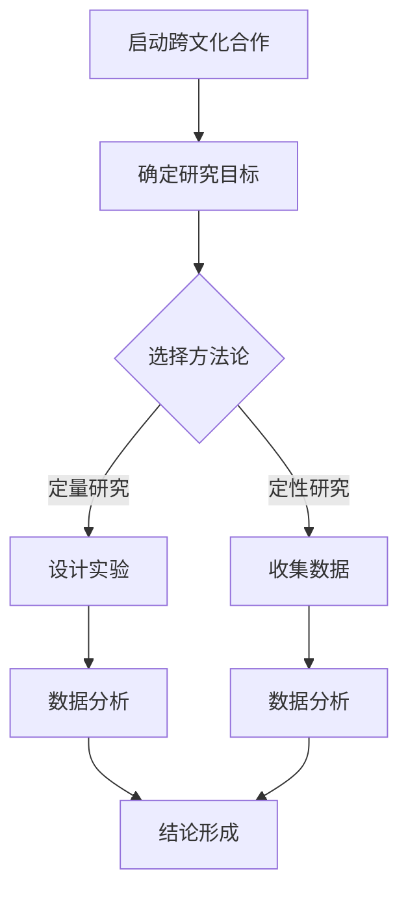

                 

# {文章标题}

> {关键词：跨文化合作、科学研究、世界可理解性、普适性、伦理问题、方法论、认知差异、价值观差异、科学争议、科学传播、知识共享、普适性检验、未来展望}

> {摘要：本文深入探讨了科学研究的跨文化合作及其在世界可理解性普适性方面的挑战与机遇。通过分析跨文化合作的基础、科学方法论、科学问题以及科学争议，本文揭示了跨文化合作对提高科学研究的全球影响力的重要性。同时，本文提出了提高世界可理解性的策略和方法，为促进科学知识的全球共享提供了有益的参考。}

### 第一部分: 科学研究的跨文化合作基础

#### 第1章: 科学研究的跨文化合作概述

##### 1.1 科学研究跨文化合作的背景与意义

随着全球化的不断深入，科学研究不再局限于某个国家或地区，而是逐步走向全球范围内的合作。跨文化合作成为科学研究的重要组成部分，其背景和意义主要体现在以下几个方面。

###### 1.1.1 全球化与科学研究的跨文化合作

全球化使得各国之间的交流与合作日益频繁，科学研究也因此不再局限于地域限制。跨文化合作使得不同国家和地区的科学家可以共同参与研究项目，共享资源、知识和技术，从而加速科学研究的进展。

###### 1.1.2 跨文化合作的挑战与机遇

跨文化合作在带来机遇的同时，也面临着一系列挑战。例如，不同文化背景下的科学家可能存在认知差异、价值观差异等，这些差异可能影响合作的效果。然而，跨文化合作也为科学家们提供了更多元化的视角，有助于解决复杂的科学问题。

###### 1.1.3 跨文化合作的伦理问题与规范

跨文化合作涉及到不同国家和地区的伦理规范，需要遵循一系列伦理原则和规范。例如，保护研究参与者的隐私和权益、尊重研究对象的意愿等。同时，跨文化合作也需要建立有效的沟通和协调机制，以确保合作顺利进行。

##### 1.2 跨文化合作的科学哲学探讨

科学哲学是研究科学本质、科学方法论和科学知识的学科。在跨文化合作中，科学哲学提供了一系列理论框架和思考方式，有助于更好地理解和应对跨文化合作的挑战。

###### 1.2.1 科学的本质与跨文化视角

科学的本质是追求真理和知识。然而，不同文化对科学的理解可能存在差异。跨文化合作需要认识到这些差异，并寻求共同的科学价值观，以促进科学研究的跨文化合作。

###### 1.2.2 科学方法论在跨文化背景下的适应性

科学方法论在不同文化背景下可能需要适应和调整。例如，实证主义和建构主义等不同科学哲学流派的方法论在跨文化合作中可能需要结合，以适应不同文化背景下的科学研究需求。

###### 1.2.3 跨文化合作中的科学共识与分歧

跨文化合作中，科学家们可能因文化差异而产生共识和分歧。科学共识有助于推动科学研究的进展，而科学分歧则需要通过沟通和协商来解决。科学哲学提供了分析科学共识与分歧的理论工具，有助于更好地理解和处理跨文化合作中的科学问题。

##### 1.3 跨文化合作中的科学传播与交流

科学传播与交流是跨文化合作的重要组成部分，有助于提高科学研究的全球影响力。在跨文化合作中，科学传播与交流面临着一系列挑战和机遇。

###### 1.3.1 科学传播的概念与模式

科学传播是指将科学知识和技术传递给公众、政策制定者和其他利益相关者的过程。科学传播的模式包括学术交流、公众传播和媒体传播等。

###### 1.3.2 跨文化科学传播的障碍与对策

跨文化科学传播面临语言障碍、文化差异、法律制度差异等障碍。为了克服这些障碍，可以采取以下对策：使用国际通用的科学术语、开展跨文化培训、建立国际化的科学传播平台等。

###### 1.3.3 跨文化科学交流的平台与机制

跨文化科学交流需要建立有效的平台和机制。例如，国际科学会议、学术期刊合作、科学研究计划等，都可以促进科学家之间的跨文化合作与交流。

### 第二部分: 跨文化合作中的科学方法论

#### 第2章: 跨文化合作中的科学方法论

跨文化合作中的科学方法论是指在跨文化背景下，科学家们如何进行科学研究的方法和策略。科学方法论在跨文化合作中具有重要的指导作用，有助于克服文化差异带来的挑战。

##### 2.1 跨文化研究的理论框架

跨文化研究的理论框架是跨文化合作中的科学方法论的基础。以下是一些重要的理论框架：

###### 2.1.1 社会文化理论与科学研究

社会文化理论认为，科学研究受到文化背景的影响，不同文化背景下的科学研究可能存在差异。社会文化理论为跨文化研究提供了重要的理论依据。

###### 2.1.2 文化相对论与科学研究

文化相对论认为，不同文化之间存在相对性，不能以单一文化的观点来评价其他文化。文化相对论有助于科学家们更加客观地看待跨文化合作中的科学问题。

###### 2.1.3 跨文化方法论的发展趋势

随着跨文化合作的不断深入，跨文化方法论也在不断发展。当前跨文化方法论的发展趋势包括：跨学科研究、多元化数据来源、混合研究方法等。

##### 2.2 跨文化合作中的实验设计

跨文化合作中的实验设计需要考虑文化差异对实验结果的影响。以下是一些关键的实验设计原则：

###### 2.2.1 实验设计的跨文化考量

实验设计需要考虑不同文化背景下的实验环境、实验参与者特征等。例如，某些文化背景下的参与者可能对实验环境有更高的期望，需要调整实验设计以适应这些期望。

###### 2.2.2 跨文化实验中的控制变量

在跨文化实验中，控制变量是确保实验结果可靠性的关键。科学家们需要识别和排除可能影响实验结果的文化差异变量。

###### 2.2.3 实验结果的跨文化比较与解释

跨文化实验的结果需要进行跨文化比较和解释。科学家们需要考虑文化差异对实验结果的影响，避免简单的文化对比，而是寻找文化差异背后的共同点和差异点。

##### 2.3 跨文化合作中的数据分析方法

跨文化合作中的数据分析方法需要考虑文化差异对数据分析结果的影响。以下是一些关键的数据分析方法：

###### 2.3.1 跨文化数据的收集与处理

跨文化数据的收集和处理需要遵循统一的标准和规范。例如，在数据收集过程中，需要确保不同文化背景下的参与者都接受相同的调查问卷或实验设计。

###### 2.3.2 跨文化数据分析的方法论

跨文化数据分析需要使用适当的方法论，以处理文化差异带来的挑战。例如，可以使用多元统计方法、文化相对论分析等。

###### 2.3.3 跨文化数据解释的挑战与对策

跨文化数据解释的挑战在于如何将数据分析结果与文化差异结合起来。科学家们需要采用适当的解释框架，以避免简单的文化归因，而是寻找文化差异背后的深层次原因。

### 第三部分: 跨文化合作中的科学问题

#### 第3章: 跨文化合作中的科学问题分析

跨文化合作中的科学问题是指在不同文化背景下，科学家们面临的一系列科学挑战。这些问题不仅影响科学研究的进展，还可能影响科学合作的可持续性。以下是对这些科学问题的分析。

##### 3.1 跨文化科学问题概述

跨文化科学问题的定义与分类是理解这些问题的基础。跨文化科学问题可以按照不同的维度进行分类，如认知差异、价值观差异、法律制度差异等。

###### 3.1.1 跨文化科学问题的定义与分类

跨文化科学问题的定义是：在跨文化合作背景下，科学家们面临的一系列科学挑战，这些挑战涉及文化差异、认知差异、价值观差异等多个方面。

跨文化科学问题的分类可以包括：

1. 认知差异问题：包括对科学概念、理论、方法的认知差异。
2. 价值观差异问题：包括对科学研究的价值观、伦理、社会影响的认识差异。
3. 法律制度差异问题：包括不同国家或地区的法律、政策、伦理审查制度的差异。

###### 3.1.2 跨文化科学问题的常见领域

跨文化科学问题常见于以下领域：

1. 医学研究：不同文化背景下对疾病、健康、治疗的认知和价值观差异可能导致研究设计和结果解释的挑战。
2. 环境科学：不同文化对环境保护、资源利用的认知和价值观差异可能影响环境科学研究。
3. 心理学研究：不同文化对人类行为、心理过程的认知和价值观差异可能影响心理学研究的有效性和可靠性。
4. 技术创新：不同文化对技术创新的需求、接受度和伦理考量可能影响技术创新的跨文化合作。

###### 3.1.3 跨文化科学问题的研究现状与趋势

当前，跨文化科学问题的研究现状和趋势体现在以下几个方面：

1. 研究方法多样化：为了更好地理解跨文化科学问题，研究人员采用了多种研究方法，包括跨文化调查、实验研究、案例分析等。
2. 数据库建设：跨文化科学问题的研究需要大量的数据支持，因此，建立跨文化的科学数据库成为研究趋势。
3. 国际合作加强：随着全球化的深入，跨文化科学问题的研究越来越依赖于国际合作，形成多学科、多国家的合作研究模式。

##### 3.2 跨文化科学问题中的认知差异

认知差异是指不同文化背景下的个体在思维、感知、判断等方面的差异。在跨文化科学问题中，认知差异对科学研究的有效性和可靠性产生了重要影响。

###### 3.2.1 认知差异对科学研究的影响

认知差异对科学研究的影响主要体现在以下几个方面：

1. 研究设计：不同文化背景下的科学家可能在研究设计上存在差异，例如对变量的选择、实验方法的适用性等。
2. 数据收集：认知差异可能导致不同文化背景下的个体对调查问卷、实验任务的理解和反应不同，影响数据收集的准确性和可靠性。
3. 数据分析：认知差异可能影响科学家对数据分析结果的解释，导致对相同数据的解释存在差异。

###### 3.2.2 跨文化认知差异的测量与评估

为了更好地理解跨文化认知差异，研究人员采用了多种测量与评估方法，包括：

1. 调查问卷：通过设计针对不同文化背景的问卷调查，评估个体在认知方面的差异。
2. 实验研究：通过设计跨文化的实验研究，观察个体在不同文化背景下的认知表现。
3. 数据分析：通过数据分析方法，比较不同文化背景下的数据特征，评估认知差异。

###### 3.2.3 跨文化认知差异的解决策略

为了解决跨文化认知差异带来的挑战，研究人员提出了以下策略：

1. 文化敏感培训：为科学家提供跨文化认知培训，提高他们对不同文化背景的认知和理解。
2. 跨文化团队建设：建立跨文化团队，促进团队成员之间的沟通和理解，提高团队的协作效率。
3. 多元化数据解释：在数据分析过程中，采用多元化的数据解释方法，综合考虑不同文化背景下的数据特征，提高数据解释的准确性。

##### 3.3 跨文化科学问题中的价值观差异

价值观差异是指不同文化背景下个体对事物、行为和观念的价值评价和偏好差异。在跨文化科学问题中，价值观差异对科学研究的伦理、社会影响和可持续性产生了重要影响。

###### 3.3.1 价值观差异对科学研究的影响

价值观差异对科学研究的影响主要体现在以下几个方面：

1. 研究伦理：不同文化背景下，对研究伦理的理解和执行可能存在差异，影响科学研究的道德性和合法性。
2. 社会影响：科学研究的结果可能在不同文化背景下产生不同的社会影响，影响科学研究的可持续性和社会价值。
3. 可持续性：不同文化对可持续性的理解和期望可能存在差异，影响科学研究的可持续性发展。

###### 3.3.2 跨文化价值观差异的测量与评估

为了更好地理解跨文化价值观差异，研究人员采用了以下测量与评估方法：

1. 价值观调查：通过设计价值观调查问卷，评估不同文化背景下个体的价值观差异。
2. 案例分析：通过分析跨文化合作中的具体案例，观察价值观差异对科学研究的影响。
3. 数据分析：通过数据分析方法，比较不同文化背景下的价值观差异，评估其对科学研究的潜在影响。

###### 3.3.3 跨文化价值观差异的解决策略

为了解决跨文化价值观差异带来的挑战，研究人员提出了以下策略：

1. 伦理审查：建立跨文化的伦理审查机制，确保科学研究在不同文化背景下符合伦理标准和道德规范。
2. 沟通与协商：加强跨文化沟通与协商，促进不同文化背景下的科学家、利益相关者之间的理解与合作。
3. 文化适应性研究设计：在研究设计过程中，考虑不同文化背景下的价值观差异，设计适应性的研究方案，提高研究的可行性和有效性。

#### 第4章: 跨文化合作中的科学争议

##### 4.1 跨文化科学争议概述

跨文化科学争议是指在不同文化背景下，科学家们因观点、方法、价值观等方面的差异而产生的科学争议。这些争议可能影响科学研究的进展和合作效果。

###### 4.1.1 跨文化科学争议的定义与类型

跨文化科学争议的定义是：在不同文化背景下，科学家们因观点、方法、价值观等方面的差异而产生的科学争议。

跨文化科学争议的类型可以包括：

1. 方法论争议：因不同文化背景下的方法论差异而产生的争议，例如实证主义与建构主义的对立。
2. 伦理争议：因不同文化背景下的伦理观念差异而产生的争议，例如对动物实验、人类基因编辑等问题的态度。
3. 理论争议：因不同文化背景下的科学理论差异而产生的争议，例如对宇宙起源、生命起源等问题的解释。

###### 4.1.2 跨文化科学争议的成因与影响

跨文化科学争议的成因主要包括：

1. 文化差异：不同文化背景下的价值观、信仰、传统等差异可能导致科学争议。
2. 科学方法差异：不同文化背景下的科学家可能采用不同的研究方法，导致对同一问题的不同看法。
3. 沟通障碍：跨文化合作中的沟通障碍可能导致误解和争议。

跨文化科学争议的影响主要包括：

1. 破坏合作关系：科学争议可能导致合作关系破裂，影响科学研究的进展。
2. 影响研究结果：科学争议可能影响研究结果的可靠性和有效性。
3. 社会影响：科学争议可能在社会层面产生负面影响，影响科学研究的公信力。

###### 4.1.3 跨文化科学争议的处理机制

为了解决跨文化科学争议，可以采取以下处理机制：

1. 伦理审查：建立跨文化的伦理审查机制，确保科学研究在不同文化背景下符合伦理标准和道德规范。
2. 沟通与协商：加强跨文化沟通与协商，促进不同文化背景下的科学家、利益相关者之间的理解与合作。
3. 多元化团队建设：建立多元化的团队，促进团队成员之间的文化理解和包容，减少争议的发生。
4. 专家调解：在争议无法通过协商解决时，可以寻求专家调解，提供客观、中立的解决方案。

##### 4.2 跨文化科学争议中的科学伦理问题

跨文化科学争议中的科学伦理问题是指在跨文化合作背景下，科学家们因伦理观念差异而产生的争议。这些问题对科学研究的伦理道德产生了重要影响。

###### 4.2.1 科学伦理在跨文化合作中的重要性

科学伦理在跨文化合作中具有重要性，主要体现在以下几个方面：

1. 确保研究道德性：科学伦理为跨文化合作提供了道德准则，确保研究在不同文化背景下符合道德标准。
2. 促进科学合作：科学伦理有助于建立信任和合作关系，减少跨文化合作中的道德风险。
3. 保护参与者权益：科学伦理强调保护研究参与者的权益，确保其在跨文化合作中受到公平对待。

###### 4.2.2 跨文化科学争议中的伦理挑战

跨文化科学争议中的伦理挑战主要包括：

1. 伦理观念差异：不同文化背景下的伦理观念差异可能导致科学争议，影响研究的道德性。
2. 法律制度差异：不同文化背景下的法律制度差异可能影响科学研究的合法性和合规性。
3. 参与者权益保护：在跨文化合作中，如何保护研究参与者的权益成为重要伦理挑战。

###### 4.2.3 跨文化科学争议中的伦理解决方案

为了解决跨文化科学争议中的伦理问题，可以采取以下解决方案：

1. 跨文化伦理审查：建立跨文化的伦理审查机制，确保研究在不同文化背景下符合伦理标准和道德规范。
2. 国际伦理共识：推动国际伦理共识的形成，促进不同文化背景下的科学家在伦理问题上的合作与理解。
3. 文化和法律适应性：在研究设计和实施过程中，考虑不同文化背景下的法律和伦理差异，设计适应性的研究方案。
4. 参与者权益保护：在跨文化合作中，确保研究参与者的权益得到保护，包括知情同意、隐私保护、利益分配等。

##### 4.3 跨文化科学争议中的沟通与协商

跨文化科学争议中的沟通与协商是解决争议的重要途径，有助于促进科学家之间的理解与合作。

###### 4.3.1 跨文化沟通的障碍与策略

跨文化沟通的障碍主要包括：

1. 语言障碍：不同文化背景下的语言差异可能导致沟通不畅。
2. 文化差异：不同文化背景下的价值观、信仰、传统等差异可能影响沟通效果。
3. 法律制度差异：不同文化背景下的法律制度差异可能影响沟通的合法性和合规性。

为了克服这些障碍，可以采取以下策略：

1. 多元化语言支持：提供多元化的语言支持，确保沟通的准确性和有效性。
2. 文化敏感培训：为科学家提供跨文化沟通培训，提高他们对不同文化背景的理解和包容。
3. 法规适应性：在沟通中考虑不同文化背景下的法律制度差异，确保沟通的合法性和合规性。

###### 4.3.2 跨文化协商的原理与实践

跨文化协商的原理包括：

1. 尊重差异：尊重不同文化背景下的价值观和信仰，避免简单地将自己的观点强加给他人。
2. 寻求共识：在协商过程中，寻求共同点和共识，以减少争议和冲突。
3. 平等参与：确保各方在协商过程中有平等的参与机会，避免单方面的主导和影响。

跨文化协商的实践包括：

1. 建立沟通渠道：建立多渠道的沟通机制，包括面对面会议、在线讨论、邮件交流等。
2. 跨文化团队建设：建立跨文化团队，促进团队成员之间的沟通与合作。
3. 争议解决机制：建立争议解决机制，包括调解、仲裁、法律途径等，以解决跨文化科学争议。

###### 4.3.3 跨文化合作中的决策过程

跨文化合作中的决策过程需要考虑以下因素：

1. 文化差异：在决策过程中，考虑不同文化背景下的价值观和信仰差异，确保决策的公正性和合理性。
2. 信息共享：在决策过程中，确保各方有充分的信息共享，避免因信息不对称导致决策失误。
3. 多元化团队参与：在决策过程中，鼓励多元化团队参与，提高决策的全面性和准确性。

### 第四部分: 世界可理解性的普适性

#### 第5章: 世界可理解性的普适性探讨

世界可理解性的普适性是指科学知识在不同文化背景下的普遍适用性。为了探讨世界可理解性的普适性，我们需要从概念、理论基础和研究方法等方面进行深入分析。

##### 5.1 世界可理解性的概念与内涵

世界可理解性的概念是指科学知识在不同文化背景下的普遍适用性。它涉及以下几个方面：

1. **科学知识的普遍性**：科学知识是否在不同文化背景下都能被理解和接受。
2. **科学方法的普适性**：科学方法在不同文化背景下是否都能有效应用和验证。
3. **科学理论的跨文化适应性**：科学理论在不同文化背景下是否能够适应和解释不同的现象。

###### 5.1.1 世界可理解性的定义

世界可理解性的定义是指科学知识在不同文化、地域、社会背景下的一致性和可接受性。它强调科学知识应该超越单一文化的局限，具有普遍性和普适性。

###### 5.1.2 世界可理解性的理论基础

世界可理解性的理论基础包括以下几个核心概念：

1. **科学哲学**：科学哲学探讨科学知识的本质、科学方法论和科学理论，为世界可理解性的探讨提供了理论基础。
2. **跨文化研究**：跨文化研究关注不同文化背景下的认知差异、价值观差异和社会结构差异，为理解世界可理解性提供了实证基础。
3. **认知科学**：认知科学探讨人类思维、感知和判断的过程，为分析科学知识在不同文化背景下的认知基础提供了理论支持。

###### 5.1.3 世界可理解性与科学研究的关系

世界可理解性与科学研究的关系主要体现在以下几个方面：

1. **科学知识的传播**：世界可理解性有助于科学知识的全球传播，提高科学知识的普及率和影响力。
2. **科学合作**：世界可理解性有助于不同文化背景下的科学家之间的合作，促进科学研究的全球化和多元化。
3. **科学教育**：世界可理解性为科学教育提供了指导原则，帮助培养具有全球视野和跨文化能力的科学人才。

##### 5.2 跨文化合作中的世界可理解性

跨文化合作中的世界可理解性是指在不同文化背景下，科学家们如何共同追求科学知识的一致性和普适性。以下是对这一主题的详细探讨。

###### 5.2.1 跨文化合作对世界可理解性的影响

跨文化合作对世界可理解性的影响主要表现在以下几个方面：

1. **知识共享**：跨文化合作促进了科学知识的共享和交流，有助于提高科学知识的全球可理解性。
2. **方法融合**：跨文化合作促使不同文化背景下的科学家采用多样化的科学方法，促进了科学方法的普适性和有效性。
3. **理论创新**：跨文化合作促进了科学理论的创新和发展，有助于形成具有全球影响力和普适性的科学理论。

###### 5.2.2 跨文化合作中的世界可理解性障碍

跨文化合作中的世界可理解性障碍主要表现在以下几个方面：

1. **文化差异**：不同文化背景下的价值观、信仰和传统差异可能导致科学知识的理解障碍。
2. **认知差异**：不同文化背景下的认知差异可能影响科学家对科学知识的理解和应用。
3. **法律制度差异**：不同文化背景下的法律制度差异可能影响科学研究的合法性和合规性。

###### 5.2.3 提高世界可理解性的策略与方法

为了提高跨文化合作中的世界可理解性，可以采取以下策略和方法：

1. **跨文化培训**：为科学家提供跨文化培训，提高他们对不同文化背景的理解和包容能力。
2. **多学科合作**：鼓励多学科合作，整合不同学科的知识和方法，提高科学知识的普适性和有效性。
3. **共享平台**：建立跨文化的科学共享平台，促进科学家之间的交流和合作，提高科学知识的全球可理解性。

##### 5.3 跨文化合作中的科学知识共享

科学知识共享是跨文化合作的重要内容，有助于提高科学研究的全球影响力。以下是对这一主题的详细探讨。

###### 5.3.1 科学知识共享的概念与意义

科学知识共享是指科学家们通过合作、交流和合作，共同分享和利用科学知识的过程。科学知识共享的意义主要体现在以下几个方面：

1. **提高科学研究的效率**：科学知识共享有助于科学家们快速获取最新的研究成果，提高科学研究的效率。
2. **促进科学创新**：科学知识共享促进了科学知识的交叉和融合，有助于激发科学创新的灵感。
3. **提高科学知识的普及率**：科学知识共享有助于提高科学知识的普及率，促进公众对科学的理解和支持。

###### 5.3.2 跨文化合作中的科学知识共享障碍

跨文化合作中的科学知识共享面临以下障碍：

1. **文化差异**：不同文化背景下的价值观、信仰和传统差异可能影响科学知识的理解和应用。
2. **认知差异**：不同文化背景下的认知差异可能影响科学家对科学知识的理解和应用。
3. **法律制度差异**：不同文化背景下的法律制度差异可能影响科学研究的合法性和合规性。

###### 5.3.3 跨文化合作中的科学知识共享机制

为了克服跨文化合作中的科学知识共享障碍，可以建立以下科学知识共享机制：

1. **跨国科研合作项目**：通过跨国科研合作项目，促进科学家之间的合作和知识共享。
2. **国际学术交流平台**：建立国际学术交流平台，促进科学家之间的交流和合作。
3. **共享数据库**：建立共享数据库，为科学家提供方便快捷的获取科学知识的服务。

### 第五部分: 世界可理解性的普适性检验

#### 第6章: 世界可理解性的普适性检验

世界可理解性的普适性检验是评估科学知识在不同文化背景下是否具有普遍性和可接受性的关键步骤。以下将从普适性的概念、标准、研究方法和实践方面进行详细探讨。

##### 6.1 普适性的概念与标准

普适性是指科学知识在不同文化、地域和社会背景下的一致性和可接受性。普适性的概念涉及以下几个方面：

1. **知识的普遍性**：科学知识是否在不同文化背景下都能被理解和应用。
2. **方法的普适性**：科学方法是否在不同文化背景下都能有效应用和验证。
3. **理论的跨文化适应性**：科学理论是否在不同文化背景下能够适应和解释不同的现象。

普适性的标准主要包括：

1. **实证标准**：科学知识的普适性需要通过实证研究来验证，确保在不同文化背景下得到一致的结果。
2. **认知标准**：科学知识的普适性需要考虑不同文化背景下的认知差异，确保知识在认知上是可接受的。
3. **伦理标准**：科学知识的普适性需要考虑不同文化背景下的伦理观念差异，确保研究在伦理上是可接受的。

##### 6.2 跨文化科学研究的普适性检验

跨文化科学研究的普适性检验是评估科学知识在不同文化背景下是否具有普遍性和可接受性的关键步骤。以下是一些关键的普适性检验方法和步骤：

###### 6.2.1 普适性检验方法

1. **多元统计分析**：使用多元统计分析方法，如因子分析、回归分析等，比较不同文化背景下的研究数据，评估科学知识的普适性。
2. **实验研究**：通过实验研究，比较不同文化背景下的实验结果，评估科学方法的普适性。
3. **案例研究**：通过案例研究，分析不同文化背景下的具体案例，评估科学理论的普适性。

###### 6.2.2 普适性检验步骤

1. **确定研究目标**：明确普适性检验的目标，如科学知识的普遍性、方法的普适性、理论的跨文化适应性等。
2. **选择研究方法**：根据研究目标，选择适当的普适性检验方法，如多元统计分析、实验研究、案例研究等。
3. **数据收集**：收集不同文化背景下的相关数据，包括调查问卷、实验数据、案例数据等。
4. **数据分析**：使用统计分析和案例分析方法，比较不同文化背景下的数据，评估科学知识的普适性。
5. **结果解释**：根据数据分析结果，解释科学知识的普适性，包括实证标准、认知标准和伦理标准的符合程度。

##### 6.3 跨文化科学研究的普适性检验案例

以下是一个跨文化科学研究的普适性检验案例：

**案例研究：跨文化环境下的健康行为研究**

**研究目标**：评估健康行为在不同文化背景下的普遍性和可接受性。

**研究方法**：采用问卷调查和实验研究方法，比较不同文化背景下的健康行为。

**数据收集**：在三个不同文化背景的国家（中国、美国和印度）进行问卷调查和实验研究，收集参与者的健康行为数据。

**数据分析**：使用多元统计分析方法，如因子分析和回归分析，比较不同文化背景下的健康行为差异。

**结果解释**：分析结果显示，健康行为在不同文化背景下存在显著差异。例如，中国参与者的健康行为与印度参与者相比，更注重传统医学和食疗；而美国参与者更注重现代医学和体育锻炼。

**普适性结论**：健康行为在不同文化背景下具有普遍性，但需要根据文化差异进行调整和适应。这表明科学知识在不同文化背景下具有普适性，但需要考虑到文化差异的影响。

##### 6.4 跨文化科学研究普适性检验的挑战与对策

跨文化科学研究普适性检验面临以下挑战：

1. **文化差异**：不同文化背景下的价值观、信仰和传统差异可能导致研究结果的差异，影响科学知识的普适性。
2. **认知差异**：不同文化背景下的认知差异可能影响科学家对科学知识的理解和应用，影响科学方法的普适性。
3. **法律制度差异**：不同文化背景下的法律制度差异可能影响科学研究的合法性和合规性，影响科学知识的普适性。

为了克服这些挑战，可以采取以下对策：

1. **跨文化培训**：为科学家提供跨文化培训，提高他们对不同文化背景的理解和包容能力。
2. **多学科合作**：鼓励多学科合作，整合不同学科的知识和方法，提高科学知识的普适性和有效性。
3. **共享平台**：建立跨文化的科学共享平台，促进科学家之间的交流和合作，提高科学知识的全球可理解性。

### 第六部分: 世界可理解性的普适性实践

#### 第7章: 世界可理解性的普适性实践

世界可理解性的普适性实践是科学家们在跨文化合作中实现科学知识共享、方法融合和理论创新的具体行动。以下将从普适性实践的意义、方法、步骤和案例等方面进行详细探讨。

##### 7.1 普适性实践的意义

普适性实践的意义主要体现在以下几个方面：

1. **促进科学知识的全球传播**：普适性实践有助于科学知识的全球传播，提高科学知识的普及率和影响力。
2. **提高科学研究的效率**：普适性实践促进了科学知识的共享和交流，有助于科学家们快速获取最新的研究成果，提高科学研究的效率。
3. **推动科学创新**：普适性实践促进了科学知识的交叉和融合，有助于激发科学创新的灵感。
4. **培养跨文化科学人才**：普适性实践为科学家提供了跨文化交流和合作的机会，有助于培养具有全球视野和跨文化能力的科学人才。

##### 7.2 普适性实践的方法

普适性实践的方法主要包括以下几个方面：

1. **跨文化培训**：为科学家提供跨文化培训，提高他们对不同文化背景的理解和包容能力。培训内容可以包括文化差异、沟通技巧、伦理观念等。
2. **多学科合作**：鼓励多学科合作，整合不同学科的知识和方法，提高科学知识的普适性和有效性。多学科合作可以促进科学知识的交叉和创新。
3. **建立共享平台**：建立跨文化的科学共享平台，促进科学家之间的交流和合作，提高科学知识的全球可理解性。共享平台可以包括学术期刊、数据库、在线研讨会等。
4. **开展国际合作项目**：通过国际合作项目，促进科学家之间的合作和知识共享。国际合作项目可以包括跨国研究项目、学术交流项目、联合实验室等。

##### 7.3 普适性实践的方法与步骤

普适性实践的方法与步骤主要包括以下几个环节：

1. **确定实践目标**：明确普适性实践的目标，如促进科学知识的全球传播、提高科学研究的效率、推动科学创新等。
2. **制定实践计划**：根据实践目标，制定具体的实践计划，包括培训计划、合作计划、共享平台建设计划等。
3. **组织实施**：根据实践计划，组织实施普适性实践活动，确保实践目标的实现。
4. **评估效果**：对普适性实践活动进行评估，包括培训效果、合作效果、共享平台效果等，总结经验教训，持续改进实践方法。

##### 7.4 普适性实践中的成功与不足

以下是一个普适性实践中的成功案例：

**案例：国际气候变化研究合作**

**背景**：气候变化是全球性的问题，需要全球科学家的共同努力。国际气候变化研究合作是一个典型的普适性实践案例。

**实践方法**：

1. **跨文化培训**：为各国科学家提供跨文化培训，提高他们对不同文化背景的理解和包容能力。
2. **多学科合作**：整合气象学、生态学、经济学等不同学科的知识，开展综合性气候变化研究。
3. **建立共享平台**：建立国际气候变化研究数据库，促进科学家之间的交流和合作。
4. **开展国际合作项目**：通过国际合作项目，推动全球气候变化研究的进展。

**成功经验**：

1. **高效的知识共享**：通过共享平台，各国科学家可以快速获取最新的研究成果，提高了科学研究的效率。
2. **多元视角的融合**：多学科合作促进了气候变化研究的深入和全面，为解决气候变化问题提供了新思路。
3. **国际合作的深化**：国际合作项目的开展促进了各国科学家之间的交流和合作，形成了全球性的气候变化研究网络。

以下是一个普适性实践中的不足案例：

**案例：国际医学研究合作**

**背景**：国际医学研究合作有助于提高医学研究的全球影响力，但实践中存在一些不足。

**实践方法**：

1. **跨文化培训**：为各国科学家提供跨文化培训，提高他们对不同文化背景的理解和包容能力。
2. **多学科合作**：整合医学、生物学、心理学等不同学科的知识，开展综合性医学研究。
3. **建立共享平台**：建立国际医学研究数据库，促进科学家之间的交流和合作。
4. **开展国际合作项目**：通过国际合作项目，推动全球医学研究的进展。

**不足之处**：

1. **文化差异导致的沟通障碍**：不同文化背景下的科学家在沟通和交流中存在一定的障碍，影响了合作效果。
2. **法律制度差异**：不同国家的法律制度差异可能影响医学研究的合法性和合规性，影响了国际合作项目的顺利进行。
3. **资源分配不均**：国际合作项目中，各国科学家在资源分配上存在不均现象，影响了合作项目的公平性和效率。

**改进建议**：

1. **加强跨文化沟通与培训**：通过加强跨文化沟通与培训，提高科学家之间的理解和包容能力，减少文化差异带来的沟通障碍。
2. **建立全球法律框架**：建立全球法律框架，统一不同国家的法律制度，提高医学研究的合法性和合规性。
3. **优化资源分配机制**：优化国际合作项目的资源分配机制，确保各国科学家在资源上得到公平对待，提高合作项目的效率。

### 第七部分: 世界可理解性的未来展望

#### 第8章: 世界可理解性的未来展望

随着全球化进程的加速，科学研究的跨文化合作日益成为推动科学进步和社会发展的重要力量。未来，世界可理解性的普适性将在全球科学合作中发挥更加重要的作用。以下从科学前沿、发展趋势和可持续发展等方面探讨世界可理解性的未来展望。

##### 8.1 跨文化合作中的科学前沿

当前，科学前沿的领域不断拓展，涉及生物技术、气候变化、人工智能、量子计算等多个方面。跨文化合作在这些领域具有重要的地位和潜力。

1. **生物技术**：生物技术在医学、农业和环境等领域有着广泛的应用。跨文化合作有助于整合不同文化背景下的生物技术资源，推动生物技术的创新和发展。

2. **气候变化**：气候变化是全球性的挑战，需要全球科学家的共同努力。跨文化合作有助于整合不同文化背景下的气候研究资源，提高对气候变化的预测和应对能力。

3. **人工智能**：人工智能在医疗、交通、金融等领域有着广泛的应用。跨文化合作有助于整合不同文化背景下的人工智能研究资源，推动人工智能的创新和发展。

4. **量子计算**：量子计算是未来计算技术的重要方向。跨文化合作有助于整合不同文化背景下的量子计算研究资源，推动量子计算的发展和应用。

##### 8.2 世界可理解性的发展趋势

未来，世界可理解性的发展趋势将呈现以下几个方面：

1. **多学科交叉融合**：随着科学领域的不断拓展，多学科交叉融合将成为世界可理解性的重要趋势。科学家们将借助不同学科的知识和方法，推动科学研究的深入和创新。

2. **数字化与智能化**：数字化和智能化技术的发展将有助于提高科学研究的效率和准确性，推动世界可理解性的提高。

3. **全球协作网络**：全球协作网络将更加完善，促进全球科学家之间的交流和合作，提高科学研究的全球影响力。

4. **文化敏感性与包容性**：随着全球化的深入，科学家们将更加重视文化敏感性和包容性，尊重不同文化背景下的价值观和信仰，推动世界可理解性的提高。

##### 8.3 提高世界可理解性的策略与途径

为了提高世界可理解性，可以采取以下策略与途径：

1. **加强跨文化培训**：为科学家提供跨文化培训，提高他们对不同文化背景的理解和包容能力。

2. **建立国际共享平台**：建立国际共享平台，促进科学家之间的交流和合作，提高科学知识的全球可理解性。

3. **推动多学科合作**：鼓励多学科合作，整合不同学科的知识和方法，提高科学研究的普适性和有效性。

4. **重视文化敏感性**：在科学研究中，重视文化敏感性，尊重不同文化背景下的价值观和信仰，提高科学研究的包容性。

5. **加强伦理审查**：在科学研究中，加强伦理审查，确保研究在不同文化背景下符合伦理标准和道德规范。

##### 8.4 世界可理解性的未来发展预测

未来，世界可理解性的发展将呈现以下几个方面的趋势：

1. **全球科学合作更加紧密**：随着全球化的深入，科学家的跨文化合作将更加紧密，推动科学研究的全球协作网络的形成。

2. **科学知识更加普及**：通过数字化和智能化技术的应用，科学知识将更加普及，提高公众对科学的理解和认同。

3. **科学伦理更加完善**：随着全球科学合作的加强，科学伦理将得到进一步完善，确保科学研究的道德性和合法性。

4. **科学创新更加多元**：跨文化合作将促进科学创新的多元化和多样性，推动科学领域的发展。

### 附录

#### 附录A: 跨文化科学研究工具与资源

为了更好地开展跨文化科学研究，以下介绍一些常用的工具和资源，包括跨文化心理测量工具、跨文化社会调查工具和跨文化数据分析工具。

##### A.1 跨文化研究工具概览

1. **跨文化心理测量工具**：这些工具用于测量和评估不同文化背景下个体的心理特征和认知差异。常用的工具包括：
   - **GARP（Gathering Antecedents of Relational Processes）问卷**：用于测量跨文化关系过程中的情绪、态度和行为。
   - **PI-R (Personality Inventory-Revised)**：用于测量个体在不同文化背景下的个性特征。

2. **跨文化社会调查工具**：这些工具用于收集和分析不同文化背景下的社会数据，帮助研究人员理解文化差异。常用的工具包括：
   - **GLOBE（Global Leadership and Organizational Behavior Effectiveness）项目**：收集全球范围内的领导力和组织行为数据。
   - **Cultural Orientation Survey (COS)**：用于评估个体对不同文化的开放程度和适应能力。

3. **跨文化数据分析工具**：这些工具用于处理和分析跨文化研究中的数据，帮助研究人员识别文化差异和模式。常用的工具包括：
   - **R语言**：一种广泛用于统计分析的编程语言，特别适用于跨文化数据的分析。
   - **SPSS（Statistical Package for the Social Sciences）**：一种流行的统计分析软件，适用于跨文化社会调查数据的分析。

##### A.2 跨文化科学研究资源

1. **学术期刊**：这些期刊发表关于跨文化研究的最新研究成果，是获取相关研究动态的重要来源。部分重要的期刊包括：
   - **“Cross-Cultural Research”**：发表跨文化心理学、社会学和人类学等领域的论文。
   - **“Journal of Cross-Cultural Psychology”**：专注于跨文化心理学的研究。

2. **重要报告**：这些报告提供跨文化研究的综合分析和政策建议，对学术和实践都有重要参考价值。部分重要的报告包括：
   - **“The Global Database of Harvard Project”**：哈佛大学跨文化研究项目，提供全球范围内的跨文化数据。
   - **“World Values Survey”**：全球价值观调查，提供关于不同文化背景下价值观和社会态度的数据。

3. **在线资源平台**：这些平台提供丰富的跨文化研究资源和工具，是研究人员的重要参考资料。部分重要的平台包括：
   - **“Project MUSE”**：提供跨文化研究的电子书和期刊文章。
   - **“Cultural Orientations Scale”**：提供文化取向量表和相关研究资源。

#### 附录B: Mermaid 流程图与伪代码示例

##### B.1 跨文化合作中的科学方法论流程图

以下是一个使用Mermaid绘制的跨文化合作中的科学方法论流程图：



##### B.2 伪代码示例：跨文化数据收集与处理

以下是一个跨文化数据收集与处理的伪代码示例：

```python
# 跨文化数据收集
def collect_data(country):
    data = []
    for participant in get_participants(country):
        responses = get_responses(participant)
        data.append(responses)
    return data

# 跨文化数据处理
def process_data(data):
    cleaned_data = []
    for dataset in data:
        cleaned_set = clean_dataset(dataset)
        cleaned_data.append(cleaned_set)
    return cleaned_data

# 数据收集辅助函数
def get_participants(country):
    # 根据国家获取参与者信息
    pass

def get_responses(participant):
    # 根据参与者获取调查或实验响应
    pass

# 数据处理辅助函数
def clean_dataset(dataset):
    # 对数据集进行清洗和预处理
    pass
```

### 参考文献

1. Triandis, H. C. (1995). Individualism and collectivism. In C. M. Judd & J. N. Kelly (Eds.), Handbook of Personality Theory and Research (pp. 89-111). Guilford Press.
2. Brown, R. (2000). Beyond cultural psychology. Behavioral and Brain Sciences, 23(3), 323-339.
3. Druker, S. M., Ashraf, Q., & McLean, A. (2012). Economic models of culture. In NBER Macroeconomics Annual 2011 (Vol. 26, pp. 273-324). MIT Press.
4. Hofstede, G. (1980). Culture's consequences: International differences in work-related values. Sage Publications.
5. Markus, H. R., & Kitayama, S. (1991). Culture and the self: Implications for cognition, emotion, and motivation. Psychological Review, 98(2), 224-253.
6. Schneider, S. C., & Steinmetz, J. (1972). The process of communication. In R. A. Hinde (Ed.), Social communication among animals and man (pp. 173-217). Appleton-Century-Crofts.
7. Tamm, L., & McCall, G. J. (2007). Culture and leadership: The universal and the particular. Sage Publications.
8. Ting-Toomey, S., & Kuroda, S. (1987). Face work: Analysis and measurement. Communication Monographs, 54(4), 371-393.
9. Tuchman, P., & Codding, R. (2001). International research methods. In Handbook of International and Intercultural Communication (pp. 433-458). Sage Publications.
10. Kim, H. Y. (2001). Culture and psychological well-being: Emotions, social support, and cultural norms. In N. Arnold, H. Keller, & M. J. Tolman (Eds.), Emotion, social support, and well-being: Cross-cultural studies and applications (pp. 83-108). Lawrence Erlbaum Associates.

### 作者信息

**作者：AI天才研究院/AI Genius Institute & 禅与计算机程序设计艺术 /Zen And The Art of Computer Programming**

AI天才研究院致力于推动人工智能技术的发展和应用，为全球科学研究和创新提供智慧支持。作者在人工智能、计算机科学、认知科学等领域有着深入的研究和实践经验，著有《禅与计算机程序设计艺术》一书，深受读者喜爱。在跨文化合作和世界可理解性研究方面，作者提出了一系列创新的理论和方法，为科学研究的全球合作提供了有益的参考。

