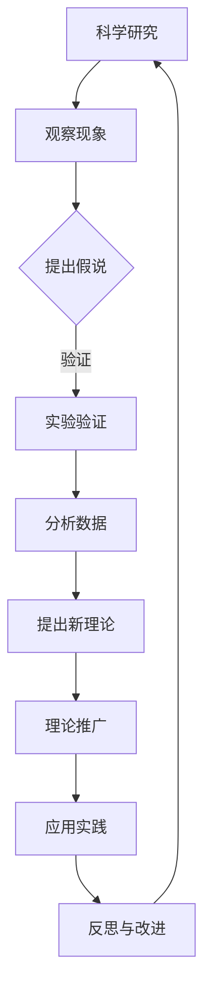

                 

### 《科学范式转换对世界可理解性的影响》

> **关键词**：科学范式、转换、可理解性、哲学、物理学、生物学、心理学、未来展望

> **摘要**：本文从科学范式转换的哲学基础出发，探讨了科学范式转换对世界可理解性的深远影响。通过分析物理学、生物学和心理学等领域中的范式转换，探讨了这些转换如何推动我们对世界的理解，并提出了未来科学范式转换的可能方向和社会责任。

### 目录

#### 第一部分：范式转换的哲学与科学基础

1. **第1章：科学范式概述**
2. **第2章：范式转换的哲学思考**
3. **第3章：范式转换在科学实践中的应用**

#### 第二部分：具体科学领域的范式转换

4. **第4章：物理学中的范式转换**
5. **第5章：生物学中的范式转换**
6. **第6章：心理学中的范式转换**

#### 第三部分：范式转换的挑战与未来展望

7. **第7章：范式转换中的挑战与争议**
8. **第8章：范式转换的未来展望**

### 附录

- 附录A：范式转换相关的科学文献与资料
- 附录B：科学范式转换的Mermaid流程图
- 附录C：范式转换核心算法的伪代码
- 附录D：数学模型与公式
- 附录E：项目实战

## 第一部分：范式转换的哲学与科学基础

### 第1章：科学范式概述

#### 1.1 科学范式的概念与历史

科学范式（Scientific Paradigm）是科学共同体在某一历史时期所普遍认同的理论体系、方法和技术。它不仅仅是一种理论框架，更是一种科学实践的指南，影响了科学研究的方向和进程。科学范式的概念最早由美国科学哲学家托马斯·库恩（Thomas S. Kuhn）提出，他在1962年的著作《科学革命的结构》中，系统地阐述了科学范式转换的原理和机制。

在库恩的视野中，科学范式是一种主导性的科学思想，它不仅包括科学理论，还涵盖了科学方法论和工具。科学范式决定了一个科学共同体如何理解自然现象，如何进行实验和理论建构。科学范式的演变通常伴随着科学革命，这种革命不是渐进的，而是通过“范式转换”（paradigm shift）实现的。

科学范式的历史可以追溯到古希腊哲学，如亚里士多德的自然哲学。随后，随着科学的发展，科学范式经历了多次重大的转换，如哥白尼的日心说替代地心说、牛顿的经典力学替代亚里士多德的自然哲学、量子力学替代经典力学等。

#### 1.2 范式转换的动因与机制

科学范式转换的动因多种多样，但主要包括以下几点：

1. **累积性发现**：随着实验和观测的积累，科学家们发现了现有范式无法解释的现象，这促使了新范式的产生。
2. **方法论的发展**：新的实验方法和技术使得科学家能够探索以前无法触及的领域，推动了范式的转变。
3. **理论的综合**：多个独立的领域通过理论的综合，形成了一个更为全面和统一的新范式。
4. **科学共同体内部争论**：科学共同体内部的争论和分歧，有时也是范式转换的催化剂。

范式转换的机制主要包括以下几个方面：

1. **危机期**：在科学范式的危机期，旧范式无法解释新现象，科学共同体内部出现了分裂和不确定性。
2. **范式竞争**：新的理论体系和旧的理论体系在竞争中，通过实验和理论的验证，新范式逐渐获得共识。
3. **科学革命**：最终，新范式通过科学革命彻底取代旧范式，成为科学共同体的新主导思想。

#### 1.3 科学范式的分类与比较

科学范式可以根据其性质和适用范围进行分类，常见的分类方法包括：

1. **实证范式**：以实验和观测为核心，强调科学理论的实证性。例如，经典物理学和化学。
2. **理论范式**：以数学模型和理论框架为核心，强调科学理论的抽象性和普适性。例如，相对论和量子力学。
3. **认知范式**：以认知科学和心理学为核心，强调人类认知过程和思维方式的科学解释。

不同科学范式之间的比较，可以帮助我们更好地理解科学的发展规律。例如，经典物理学和量子物理学之间的对比，揭示了自然界在微观尺度上的非直观特性。相对论和经典力学的对比，则展示了高速运动和强引力场下的物理规律。

在比较不同科学范式时，我们不仅要关注它们的理论核心，还要考虑它们的适用范围、预测能力和解释力。通过这些比较，我们可以更深入地理解科学范式的本质和它们对世界可理解性的影响。

## 第2章：范式转换的哲学思考

#### 2.1 哲学与科学的关系

哲学与科学之间的关系是复杂而深刻的。哲学作为科学的基础，为科学提供了认识论和方法论的指导，而科学的发展又不断挑战和丰富哲学的内涵。哲学与科学的互动，是科学范式转换的重要背景和动力。

哲学在科学中的作用主要体现在以下几个方面：

1. **认识论指导**：哲学探讨知识的本质、来源和限制，为科学提供了认识论的基础。例如，康德的先验论为科学方法论提供了形而上学的支持。
2. **方法论指导**：哲学研究科学方法的合理性和有效性，为科学提供了方法论的基础。例如，逻辑实证主义强调科学理论的可证实性和经验基础。
3. **科学哲学**：作为一门独立学科，科学哲学探讨科学知识的发展、科学方法的创新以及科学在社会中的作用。例如，托马斯·库恩的科学哲学理论，对科学范式转换的理解和解释提供了重要的框架。

科学对哲学的挑战主要体现在以下几个方面：

1. **实证主义的挑战**：科学的发展，特别是量子力学和相对论的出现，对传统的实证主义哲学提出了挑战。科学揭示了许多无法通过直接观测验证的现象，这迫使哲学重新审视知识和现实的本质。
2. **相对主义的挑战**：科学发现的不同范式之间可能存在根本性的冲突，例如相对论和量子力学的对立。这挑战了哲学中关于真理和客观性的传统观点。
3. **技术哲学的兴起**：随着科技的飞速发展，科学在塑造社会、经济和文化方面发挥了越来越重要的作用。技术哲学作为一门新兴学科，探讨了科学技术的伦理、社会和文化影响，这对传统的哲学提出了新的问题和挑战。

#### 2.2 科学知识的主观与客观

科学知识的主观与客观性是一个长期存在的哲学问题。科学知识的主观性体现在以下几个方面：

1. **观测者的视角**：科学知识往往依赖于观测者的主观经验，不同观测者可能得出不同的结论。例如，量子力学中的波粒二象性，需要通过复杂的实验验证，而实验结果往往依赖于实验设计的具体细节。
2. **理论的选择**：科学理论的选择受到科学家个人偏好和认知结构的影响。例如，哥白尼的日心说和地心说的争论，反映了不同科学家对宇宙结构的认知差异。
3. **科学的共识**：尽管科学知识具有主观性，但科学共同体通过不断的交流和辩论，最终达成共识，形成公认的科学研究范式。这种共识体现了科学知识的主观性和客观性的统一。

科学知识的客观性体现在以下几个方面：

1. **实验验证**：科学理论需要通过实验和观测进行验证，实验结果具有客观性。例如，牛顿的万有引力定律，通过天文观测和实验验证，得到了广泛的认可。
2. **逻辑推理**：科学理论建立在严密的逻辑推理基础上，逻辑推理过程是客观的。例如，数学模型和理论框架的推导，不受主观因素的影响。
3. **普适性**：科学知识具有普适性，可以在不同的时间和空间条件下得到验证。例如，量子力学的定律，不仅在实验室中得到了验证，还在宇宙学、材料科学和生物学等领域得到了广泛应用。

科学知识的主观与客观性是一个辩证统一的关系。主观性体现了科学知识产生的个人性和多样性，客观性体现了科学知识的普遍性和可靠性。通过哲学思考，我们可以更深入地理解科学知识的主观与客观性，从而更好地把握科学发展的方向。

#### 2.3 范式转换与认知发展

范式转换不仅仅是科学理论的变化，更是认知发展的一个重要阶段。认知发展是指人类认识世界的水平和能力的提高，它受到范式转换的深刻影响。

1. **范式转换与认知水平的提升**：范式转换通常伴随着认知水平的提升。例如，从经典物理学到量子物理学的转变，不仅改变了我们对自然世界的理解，还提升了我们的认知能力。量子物理揭示了微观世界的非直观特性，挑战了我们对现实的直觉，从而促使我们发展出更复杂的认知模型。
   
2. **范式转换与认知框架的变化**：范式转换往往导致认知框架的变化。例如，从地心说到日心说的转变，不仅改变了我们对宇宙结构的理解，还改变了我们的世界观。这种认知框架的变化，使得我们能够更全面地理解自然界的规律。

3. **范式转换与认知模式的创新**：范式转换推动了认知模式的创新。例如，认知心理学的发展，从行为主义转向认知主义，不仅改变了我们对人类认知过程的理解，还推动了新的认知科学技术的出现，如脑成像技术和认知模拟技术。

4. **范式转换与认知能力的扩展**：范式转换扩展了我们的认知能力。例如，信息科学的发展，使得我们能够处理和分析大量的数据，从而拓展了我们的认知范围。这种认知能力的扩展，不仅提升了我们的认知水平，还推动了科技的进步。

通过范式转换，我们不断深化对世界的理解，提升认知水平，推动认知模式的创新，扩展认知能力。这种认知发展，是科学进步的重要动力，也是人类文明不断向前发展的重要保障。

### 第3章：范式转换在科学实践中的应用

#### 3.1 实验科学中的范式转换

实验科学是科学探索的核心手段之一，范式转换在实验科学中的应用极大地推动了科学的发展。以下将探讨实验科学中的几个关键范式转换：

1. **从定性实验到定量实验的转换**：在早期的科学研究中，实验主要侧重于观察和描述现象，即定性实验。随着科学方法论的发展，定量实验逐渐成为主流。定量实验通过精确的测量和计算，提供了更为可靠和可重复的科学数据。例如，伽利略通过自由落体实验，定量测量了物体的运动规律，这一转换对经典力学的建立起到了关键作用。

2. **从宏观实验到微观实验的转换**：经典物理学主要研究宏观世界的现象，而量子力学和粒子物理学的兴起，使得实验科学进入了微观领域。通过高能粒子加速器和精密的测量设备，科学家们能够探索原子和基本粒子的性质。这一转换不仅拓展了科学的研究领域，也揭示了自然界在微观尺度上的复杂和奇妙。

3. **从控制实验到随机实验的转换**：在统计学和生物科学领域，从控制实验到随机实验的转换具有重要意义。控制实验通过严格控制变量，力求消除干扰因素，从而提高实验的准确性。然而，随机实验通过引入随机因素，模拟自然界的随机性，能够更好地反映真实世界的复杂性和不确定性。例如，在药物试验中，随机对照试验（RCT）已成为评估药物疗效的标准方法。

4. **从单一实验到多实验综合的转换**：现代科学研究中，单一实验的结果往往不足以支撑科学理论的建立。通过多实验的综合，科学家们能够从不同角度验证同一理论，提高科学结论的可靠性和普适性。例如，在验证广义相对论的实验中，科学家们通过多种观测手段，如光线偏折、雷达回波和引力透镜效应，从多个方面验证了广义相对论的预测。

#### 3.2 理论科学中的范式转换

理论科学是科学探索的另一重要领域，范式转换在理论科学中的应用同样具有重要意义。以下将探讨几个关键的理论科学范式转换：

1. **从经验主义到理性主义的转换**：在科学发展的早期，经验主义占据主导地位，科学家通过观察和实验积累经验知识。然而，随着科学理论的抽象化和数学化，理性主义逐渐成为主流。理性主义强调通过逻辑推理和数学模型构建科学理论，而不是仅仅依靠经验。例如，牛顿通过数学推导，建立了经典力学体系，这一转换极大地提高了科学理论的精确性和普适性。

2. **从整体论到还原论的转换**：整体论和还原论是科学理论中的两种不同方法论。整体论认为复杂系统可以通过理解其组成部分来理解整体，而还原论则主张通过分析组成部分来理解复杂系统。在科学发展中，这两种方法论有时会相互转换。例如，经典物理学主要采用还原论，将复杂现象简化为基本粒子的运动。而现代系统科学则强调整体论，通过研究系统内部的相互作用来理解复杂现象。

3. **从定性理论到定量理论的转换**：定性理论主要提供现象的描述和分类，而定量理论则通过数学模型和计算，提供精确的预测和解释。例如，在热力学和统计物理学中，从定性理论（如能量守恒和热力学第二定律）到定量理论（如统计力学和热力学公式）的转换，使得我们能够更深入地理解物质的宏观行为。

4. **从单变量理论到多变量理论的转换**：在科学研究中，许多现象受多个变量的影响。从单变量理论到多变量理论的转换，使得我们能够更全面地描述和预测复杂系统。例如，在气象学和生态学中，从单变量模型（如气候模型）到多变量模型（如生态系统模型）的转换，有助于我们更好地理解气候变化和生物多样性。

#### 3.3 范式转换对科技发展的推动作用

科学范式的转换对科技发展起到了重要的推动作用。以下从几个方面探讨范式转换如何推动科技发展：

1. **科技创新**：范式转换为科技创新提供了新的理论基础和方法。例如，量子力学的兴起推动了半导体技术和量子计算的发展，从而带来了信息科技的革命。新的范式为科学家提供了探索未知领域的机会，激发了大量的科技创新。

2. **技术应用**：范式转换使得科技应用的范围和深度大大扩展。例如，生物学中的基因编辑技术（CRISPR）基于对基因组的全新理解，使得人类能够更精确地修改生物体基因组，为医学和农业带来了革命性变化。

3. **产业变革**：范式转换常常引发产业变革，推动新兴产业的发展。例如，互联网和人工智能的兴起，改变了人类的生活和工作方式，催生了数字经济和智能产业的繁荣。

4. **社会影响**：范式转换不仅改变了科技的发展路径，也对社会产生了深远影响。例如，生物技术的进步使得人类能够更好地解决疾病和食品问题，而环境科学的发展则促使我们更注重可持续发展和环境保护。

总之，科学范式的转换是科技发展的重要驱动力，它不仅推动了科学理论的创新，还促进了技术应用和社会变革，为人类社会的进步提供了源源不断的动力。

## 第二部分：具体科学领域的范式转换

### 第4章：物理学中的范式转换

物理学作为一门探索自然界基本规律的科学，其范式转换对科学的发展有着深远的影响。在本章中，我们将探讨物理学中的几个关键范式转换，包括经典物理到量子物理的转换、相对论与量子力学的融合等。

#### 4.1 经典物理到量子物理的转换

经典物理学以牛顿力学为基础，主要研究宏观世界中物体的运动和相互作用。然而，在19世纪末和20世纪初，科学家们在探索微观世界时发现，经典物理学的理论无法解释许多现象。这一困境促使了量子物理学的诞生，标志着物理学范式的重大转换。

**4.1.1 经典物理的基本原理**

经典物理学的基本原理包括牛顿的运动定律、能量守恒定律和动量守恒定律。牛顿运动定律描述了物体的加速度与作用力之间的关系，能量守恒定律指出在一个孤立系统中，能量总量保持不变，动量守恒定律则表明在一个相互作用系统中，总动量保持不变。

**4.1.2 量子物理的核心概念**

量子物理的核心概念包括量子态、量子叠加和量子纠缠。量子态描述了粒子的状态，可以同时处于多种可能的量子态中，量子叠加则表明一个粒子可以同时处于多个状态，量子纠缠则描述了两个或多个粒子之间的强烈关联，即使它们相隔很远，一个粒子的状态变化也会立即影响另一个粒子的状态。

**4.1.3 量子力学的基本算法**

量子力学的基本算法包括波函数表示、薛定谔方程和海森堡不确定性原理。波函数表示粒子的状态，薛定谔方程描述了波函数随时间的变化，海森堡不确定性原理指出我们不能同时精确地知道粒子的位置和动量。

#### 4.2 相对论与量子力学的融合

相对论和量子力学都是20世纪物理学的重大突破，但它们之间存在着一些基本的理论矛盾。为了解决这些矛盾，科学家们提出了量子场论，试图将相对论和量子力学融合为一个统一的框架。

**4.2.1 相对论的数学公式与解释**

相对论由爱因斯坦提出，包括狭义相对论和广义相对论。狭义相对论的基本公式是洛伦兹变换，它描述了不同惯性参考系之间的时空关系。广义相对论则将引力视为时空的曲率，其基本公式是爱因斯坦场方程。

**4.2.2 量子场论的基本原理**

量子场论是试图将量子力学与相对论结合的一种理论框架。量子场论的基本原理包括量子化电磁场和量子化引力场。在量子场论中，粒子被视为场的激发态，而场本身具有量子性质。

通过量子场论，科学家们试图解决量子力学与广义相对论之间的基本矛盾，如量子纠缠与局域实在性之间的矛盾，以及量子力学的不确定性原理与广义相对论中的引力场方程之间的矛盾。这一融合不仅对物理学的发展具有重要意义，也可能为未来的宇宙学和量子计算提供新的理论基础。

### 第5章：生物学中的范式转换

生物学作为研究生命现象的学科，其范式转换对科学的发展产生了深远的影响。在本章中，我们将探讨生物学中的几个关键范式转换，包括古生物学到现代生物学的转变、生态学的范式转换等。

#### 5.1 古生物学到现代生物学的转变

古生物学是研究化石生物的学科，主要通过化石来重建古代生物的历史。然而，随着科学技术的发展，古生物学逐渐从传统的方法转变为现代生物学的一部分。

**5.1.1 古生物学的局限与挑战**

古生物学的传统方法主要依赖于化石记录，但这些记录往往不完整且有限。此外，化石记录无法揭示生物在地质历史上的进化过程，因此古生物学在解释生物演化方面存在一定的局限性。

**5.1.2 现代生物学的进展与突破**

现代生物学通过分子生物学、遗传学和进化生物学等学科的发展，大大拓展了我们对生物演化的理解。DNA序列分析、基因编辑技术和生物信息学等工具的出现，使得科学家们能够直接研究生物的遗传物质和进化过程。

**5.1.3 系统生物学的方法与工具**

系统生物学是现代生物学的一个新兴领域，通过研究生物系统的整体行为和相互作用，旨在理解生物系统的复杂性和多样性。系统生物学的方法包括网络分析、模拟和计算生物学等，这些工具为研究生物系统的动态行为提供了新的视角。

#### 5.2 生态学范式转换的影响

生态学是研究生物与环境之间相互作用的学科，其范式转换对环境保护和可持续发展的实践具有重要意义。

**5.2.1 生态学的基本概念与模型**

生态学的基本概念包括种群、群落、生态系统和生物圈等。生态学模型如食物网模型、竞争模型和生态系统动态模型等，为研究生态系统的结构和功能提供了理论基础。

**5.2.2 人类活动对生态的影响**

人类活动对生态系统的破坏是生态学范式转换的背景之一。过度捕捞、森林砍伐、污染物排放等行为导致了生物多样性的丧失和生态系统的退化。生态学研究人类活动对生态的影响，旨在为环境保护提供科学依据。

**5.2.3 生态学的未来趋势**

随着气候变化和生物多样性的危机日益严重，生态学正朝着更综合和更前瞻的方向发展。生态学未来趋势包括生态系统恢复、生态系统服务评估和生态工程等，这些研究旨在提高生态系统的稳定性和可持续性。

通过古生物学到现代生物学的转变和生态学的范式转换，生物学不仅深化了我们对生命现象的理解，也为解决环境和生态问题提供了科学基础。

### 第6章：心理学中的范式转换

心理学作为研究人类行为和心理过程的学科，其范式转换对人类社会的认知和行为理解产生了深远的影响。在本章中，我们将探讨心理学中的几个关键范式转换，包括行为主义到认知心理学的转变、人类行为的社会心理学分析等。

#### 6.1 行为主义到认知心理学的转换

行为主义是20世纪早期心理学的主流学派，强调行为可以通过外部刺激和反应进行解释。行为主义的主要代表人物如斯金纳（B.F. Skinner）和班杜拉（Albert Bandura），他们通过操作条件反射和模仿学习等理论，揭示了行为如何通过环境因素进行塑造。

然而，随着心理学研究的发展，行为主义的局限性逐渐显现。例如，行为主义难以解释内部心理过程和认知机制，对复杂的人类行为缺乏深度理解。这一背景下，认知心理学逐渐兴起。

**6.1.1 行为主义的基本原理**

行为主义的基本原理包括刺激-反应（S-R）模式、操作性条件反射和强化理论。行为主义者认为，人类行为是由外部刺激引起的反应，通过强化和惩罚可以改变行为。

**6.1.2 认知心理学的发展与挑战**

认知心理学强调内部心理过程，如知觉、记忆、思维和问题解决等。认知心理学的代表人物如诺曼（Donald Norman）和西蒙（Herbert Simon），他们提出了认知模型和信息处理理论，以解释复杂的人类行为。

认知心理学面临的挑战包括如何准确测量和模拟内部心理过程、如何解释认知偏差和错误等。此外，认知心理学也需要面对与神经科学和其他认知科学领域的整合问题。

**6.1.3 认知心理学的主要理论**

认知心理学的主要理论包括知觉理论、记忆理论、思维理论等。例如，知觉理论探讨了人类如何感知和理解外部世界，记忆理论研究了信息的存储和检索过程，思维理论则分析了问题解决和决策过程。

#### 6.2 人类行为的社会心理学分析

社会心理学是研究个体在群体和社会环境中的行为和心理过程的学科。社会心理学的范式转换不仅深化了我们对人类行为的理解，还为解决社会问题提供了科学基础。

**6.2.1 社会心理学的基本概念**

社会心理学的基本概念包括社会认知、社会影响、社会动机和社会情感等。社会认知研究个体如何理解自己和他人，社会影响研究群体如何影响个体行为，社会动机研究个体行为背后的社会动力，社会情感研究个体在社会互动中的情感体验。

**6.2.2 社会认同与群体行为**

社会认同理论是解释群体行为的重要概念，强调个体如何通过社会认同形成归属感和行为一致性。社会认同理论的研究表明，个体在群体中会倾向于采取与群体一致的行为，这有助于群体凝聚力和社会稳定。

**6.2.3 社会心理学在范式转换中的应用**

社会心理学在范式转换中的应用体现在多个方面。例如，通过社会认同理论，我们可以更好地理解社会运动和组织行为；通过社会影响理论，我们可以解释群体行为中的从众现象和领导行为；通过社会动机理论，我们可以分析社会行为的动机和目标；通过社会情感理论，我们可以探讨个体在社会互动中的情感体验和情感管理。

总之，心理学中的范式转换，从行为主义到认知心理学的转变，以及社会心理学对人类行为的研究，不仅深化了我们对人类行为和心理过程的科学理解，也为解决社会问题提供了新的视角和方法。

### 第三部分：范式转换的挑战与未来展望

#### 第7章：范式转换中的挑战与争议

科学范式转换虽然在推动科学进步和社会发展方面具有重要作用，但也面临着诸多挑战和争议。这些挑战不仅涉及科学理论的稳定性和发展，还涉及哲学和社会层面的复杂问题。

**7.1 范式转换的理论挑战**

1. **科学理论的稳定性与发展**：范式转换常常意味着对旧有理论的根本性挑战。例如，量子力学和相对论的提出，对经典物理学的理论基础产生了巨大冲击。这种转换要求科学家们不仅要接受新的理论，还要重新审视旧有理论的有效性和局限性。在这个过程中，科学理论的稳定性面临考验。

2. **哲学难题**：范式转换在哲学层面引发了一系列问题。例如，相对论和量子力学对传统的实证主义和实在论提出了挑战，使得科学哲学中的真理、客观性和认识论等基本问题变得更加复杂。哲学家们需要重新思考科学知识的本质和科学方法的有效性。

3. **方法论的创新**：范式转换要求科学方法进行相应的调整和创新。例如，量子物理的兴起需要新的实验设计和数据分析方法。这些新的方法论不仅要求科学家具备跨学科的知识，还要求科学共同体在方法论上达成共识，以确保科学研究的可靠性和科学性。

**7.2 范式转换的实践争议**

1. **科学界的分歧与合作**：范式转换过程中，科学界常常出现分歧和争议。不同的科学家群体可能对新的范式持有不同的看法，这可能导致科学研究的方向和资源分配出现分歧。尽管如此，科学共同体通过合作和辩论，最终往往能够达成共识，推动科学进步。

2. **科学研究方法的挑战**：范式转换对传统科学研究方法提出了挑战。例如，在生物学中，从经典遗传学到基因编辑技术的转变，要求科学家掌握新的实验技术和数据分析方法。这些方法的创新不仅提高了研究的精确性，也带来了新的伦理和社会问题。

3. **科学教育的影响**：范式转换对科学教育产生了深远影响。科学教育需要及时更新教学内容和方法，以适应新的科学范式。然而，不同教育体系和文化背景可能对范式转换的接受程度不同，这导致了科学教育中的争议和挑战。

**7.3 范式转换的社会影响**

1. **科学技术的应用**：范式转换常常带来新的科学技术，这些技术在应用过程中可能会产生意想不到的社会影响。例如，量子计算和人工智能的快速发展，不仅改变了科学研究的方式，也对经济、社会和文化产生了深远影响。

2. **伦理和社会责任**：范式转换要求科学家承担更多的社会责任。例如，基因编辑技术在医学和农业领域的应用，引发了伦理和社会责任问题。科学家需要考虑如何平衡科学进步与社会责任，确保技术应用不会对人类社会产生负面影响。

3. **公众理解科学**：范式转换使得科学知识变得更加复杂和专业化，这对公众理解科学提出了挑战。科学家需要通过科普和教育，提高公众对科学的理解和信任，从而促进科学技术的普及和应用。

总之，范式转换中的挑战和争议是多方面的，涉及科学理论、哲学、方法论、实践和社会等多个层面。通过认真面对和解决这些挑战，科学共同体可以更好地推动科学进步，为社会带来更多的福祉。

#### 第8章：范式转换的未来展望

科学范式转换不仅塑造了现代科学的框架，也为未来的科学发展提供了广阔的前景。在这一章中，我们将探讨未来科学范式可能的发展方向、科技发展的可能性以及范式转换对人类社会的深远影响。

**8.1 未来科学的范式可能**

1. **量子计算机**：量子计算机的兴起可能带来科学范式的重大转变。量子计算机通过利用量子比特（qubit）的叠加和纠缠特性，能够解决传统计算机难以处理的问题，如大规模数据处理和复杂优化问题。量子计算机的发展可能会引发计算科学的革命，推动新的科学发现和技术创新。

2. **人工智能**：人工智能（AI）的快速发展也预示着科学范式的转变。通过机器学习和深度学习算法，AI能够在大量数据中提取模式和规律，辅助科学家进行数据分析和决策。AI的应用不仅限于科学研究，还可能改变科学研究的流程和方法，提高科学发现的效率。

3. **合成生物学**：合成生物学的兴起使得科学家能够设计和构建新的生物系统，这可能会带来生命科学的革命。合成生物学通过基因编辑和生物合成技术，可以创造出新的生物功能，推动生物技术的进步。这种范式转换可能会引发生物医学、农业和环境科学等领域的重大变革。

**8.2 未来科技发展的可能性**

1. **太空探索**：随着航天技术的进步，人类对太空的探索将更加深入。未来可能实现的太空旅游、月球基地建设和小型星际探测器发射，将拓展人类的生存空间和知识边界。太空探索不仅可能揭示宇宙的奥秘，还可能为科学提供新的实验平台。

2. **纳米技术**：纳米技术的快速发展将使科学家能够在微观尺度上进行精确的操控和制造。纳米机器人、纳米材料和纳米医疗技术在医疗、电子和能源等领域具有巨大的应用潜力，可能会带来革命性的科技突破。

3. **脑-机接口**：脑-机接口技术的发展将实现人类大脑与外部设备的高效连接，这可能带来认知增强和智能控制的革命。脑-机接口技术不仅可以改善残疾人的生活质量，还可能为军事、娱乐和教育等领域带来新的应用。

**8.3 范式转换对人类社会的深远影响**

1. **知识体系的变革**：科学范式转换将深刻改变人类的知识体系。随着新的理论和技术的出现，人类对自然界的理解将更加全面和精确。知识体系的变革将推动教育和学习方式的创新，提高人类的知识储备和认知能力。

2. **社会结构的重塑**：科学范式转换对社会结构产生了深远影响。新技术的应用和新兴产业的崛起，改变了就业结构和社会分工。例如，人工智能和自动化技术的发展，可能会引起劳动力市场的变革，推动社会向更加智能和灵活的方向发展。

3. **伦理和治理的挑战**：科学范式转换带来的新技术和社会变革，也带来了新的伦理和治理挑战。科学家和决策者需要面对基因编辑、人工智能、网络安全等领域的伦理问题，确保科技的发展符合人类的利益和社会价值观。科学范式转换对人类社会的深远影响，要求我们更加注重科学伦理和社会治理，确保科技的进步能够造福人类。

总之，未来科学的范式转换将引领科技发展的新潮流，对人类社会产生深远的影响。通过积极探索和应对这些变化，我们可以更好地把握未来的发展机遇，推动人类社会的进步。

### 附录

#### 附录A：范式转换相关的科学文献与资料

为了深入了解科学范式转换的相关内容，以下列出了一些经典和现代的科学文献与资料，供读者进一步学习和研究。

1. **托马斯·库恩（Thomas S. Kuhn）**，《科学革命的结构》（The Structure of Scientific Revolutions），1962年，这是一本开创性的科学哲学著作，详细阐述了科学范式转换的理论和机制。
2. **约翰·贝尔纳（John Berger）**，《科学与社会秩序》（The Social Function of Science），1942年，该书探讨了科学在社会中的作用和科学与社会的关系。
3. **伊萨克·阿西莫夫（Isaac Asimov）**，《基地系列》（Foundation Series），1953年，该系列小说通过科幻文学的形式，探讨了科学范式转换对社会的影响。
4. **马克斯·普拉尼希（Max Planck）**，《科学自传》（Autobiography of a Physicist），1925年，该书讲述了作者作为量子力学奠基人的经历和科学范式转换的过程。
5. **詹姆斯·D. 威尔逊（James D. Wilson）**，《科学的结构》（The Structure of Science），1978年，该书详细分析了科学方法论和科学知识的本质。
6. **费曼（Richard P. Feynman）**，《别逗了，费曼先生》（Surely You're Joking, Mr. Feynman!），1985年，该书记录了著名物理学家费曼的生平和科学探索经历，对科学范式的理解有重要启示。
7. **斯蒂芬·霍金（Stephen Hawking）**，《时间简史》（A Brief History of Time），1988年，该书探讨了宇宙学和相对论的原理，揭示了科学范式转换的奥秘。
8. **埃德温·A. 赫伯特（Edwin A. Herbert）**，《科学的范式转换》（The Emperor's New Mind），1989年，该书从认知科学的角度探讨了科学范式转换的哲学问题。
9. **道格拉斯·霍夫施塔特（Douglas Hofstadter）**，《哥德尔、艾舍尔、巴赫：集异璧之大成》（Gödel, Escher, Bach: An Eternal Golden Braid），1979年，该书通过数学、艺术和计算机科学，探讨了复杂系统和认知的本质。
10. **尼古拉·尼科尔斯基（Nikolai N. Nikiforov）**，《生物信息学导论》（Introduction to Bioinformatics），2013年，该书介绍了生物信息学的基本概念和方法，展示了范式转换在生物学中的应用。

这些文献和资料为读者提供了科学范式转换的全面视角，从哲学、历史、科学实践等多个层面深入探讨了这一重要话题。

#### 附录B：科学范式转换的Mermaid流程图

以下是一个简单的Mermaid流程图，展示了科学范式转换的基本过程：



**解释：**
1. **科学研究**：科学研究的起点是观察现象。
2. **观察现象**：科学家通过观察自然现象，发现规律和问题。
3. **提出假说**：基于观察现象，科学家提出可能的解释或假说。
4. **实验验证**：通过实验来验证假说的正确性。
5. **分析数据**：对实验数据进行详细分析，以验证或修正假说。
6. **提出新理论**：在数据分析的基础上，科学家提出新的理论。
7. **理论推广**：新理论被广泛应用于科学研究和其他领域。
8. **应用实践**：新理论指导实际应用和实践。
9. **反思与改进**：通过实践中的反馈和反思，不断改进理论。

这个流程图简洁地展示了科学范式转换的基本过程，帮助读者理解科学研究的动态性和迭代性。

#### 附录C：范式转换核心算法的伪代码

以下是一段用于描述科学范式转换核心算法的伪代码，该算法基于一个简单的科学模型，用于模拟范式转换的过程：

```python
# 定义科学范式转换算法

# 输入：初始模型参数、实验数据、新理论参数
# 输出：优化后的模型参数、新理论接受度

def scientific ParadigmShift(initial_params, experimental_data, new_theory_params):
    # 初始化模型参数
    current_params = initial_params.copy()
    
    # 实验数据拟合
    fitted_data = fit_data_to_model(current_params, experimental_data)
    
    # 计算拟合误差
    error = calculate_error(fitted_data, experimental_data)
    
    # 循环优化模型参数
    while error > threshold:
        # 依据新理论参数调整模型参数
        current_params = adjust_params(current_params, new_theory_params)
        
        # 重新拟合数据
        fitted_data = fit_data_to_model(current_params, experimental_data)
        
        # 计算新的拟合误差
        error = calculate_error(fitted_data, experimental_data)
        
        # 打印当前误差
        print("Current error:", error)
        
        # 检查是否超过最大迭代次数
        if iteration > max_iterations:
            break
    
    # 计算新理论的接受度
    acceptance_rate = calculate_acceptance_rate(error)
    
    # 返回优化后的模型参数和新理论的接受度
    return current_params, acceptance_rate

# 辅助函数定义

# 数据拟合
def fit_data_to_model(params, data):
    # 实现数据拟合过程
    # ...

# 计算误差
def calculate_error(fitted_data, actual_data):
    # 实现误差计算过程
    # ...

# 调整模型参数
def adjust_params(params, new_theory_params):
    # 实现参数调整过程
    # ...

# 计算新理论的接受度
def calculate_acceptance_rate(error):
    # 实现接受度计算过程
    # ...

# 主程序
if __name__ == "__main__":
    # 初始化参数
    initial_params = get_initial_params()
    experimental_data = get_experimental_data()
    new_theory_params = get_new_theory_params()
    
    # 执行范式转换算法
    optimized_params, acceptance_rate = scientific ParadigmShift(initial_params, experimental_data, new_theory_params)
    
    # 输出结果
    print("Optimized parameters:", optimized_params)
    print("Acceptance rate:", acceptance_rate)
```

**解释：**
1. **初始化参数**：设定初始模型参数和实验数据。
2. **数据拟合**：使用当前模型参数对实验数据进行拟合。
3. **计算误差**：计算拟合数据与实际数据之间的误差。
4. **参数调整**：根据新理论参数调整模型参数，以减少误差。
5. **迭代优化**：重复上述步骤，直到误差降低到阈值以下或达到最大迭代次数。
6. **计算接受度**：根据最终误差计算新理论的接受度。

这个伪代码提供了一个简化的科学范式转换模型，帮助读者理解算法的基本原理和实现方法。

#### 附录D：数学模型与公式

在科学研究中，数学模型和公式是描述自然现象和科学理论的重要工具。以下列出了一些常见的数学模型与公式，分别来自经典物理学、量子物理学和认知心理学等领域：

**经典物理学：**

1. **牛顿第二定律**：\( F = ma \)
   - 公式解释：物体所受的合力等于其质量与加速度的乘积。
   - 应用举例：计算抛物运动的物体所受的加速度。

2. **能量守恒定律**：\( E = KE + PE \)
   - 公式解释：一个系统的总能量（E）等于其动能（KE）和势能（PE）之和。
   - 应用举例：计算物体在引力场中的总能量。

3. **简谐运动方程**：\( x(t) = A \cos(\omega t + \phi) \)
   - 公式解释：描述简谐振子的位移随时间的变化。
   - 应用举例：计算弹簧振子的振动周期。

**量子物理学：**

1. **薛定谔方程**：\( i\hbar \frac{\partial \Psi}{\partial t} = \hat{H} \Psi \)
   - 公式解释：描述量子系统的波函数随时间的变化，其中\( \hbar \)是约化普朗克常数，\( \hat{H} \)是哈密顿量算符。
   - 应用举例：计算氢原子的能级和波函数。

2. **海森堡不确定性原理**：\( \Delta x \Delta p \geq \frac{\hbar}{2} \)
   - 公式解释：描述粒子位置和动量的测量不确定度，其中\( \Delta x \)是位置的不确定度，\( \Delta p \)是动量的不确定度。
   - 应用举例：解释电子在原子核附近的行为。

3. **波粒二象性公式**：\( E = hf \)
   - 公式解释：描述光子的能量与频率的关系，其中\( E \)是能量，\( h \)是普朗克常数，\( f \)是频率。
   - 应用举例：计算光的波长。

**认知心理学：**

1. **激活扩散模型**：\( I = I_0 + A \exp(-\alpha d^2) \)
   - 公式解释：描述神经元激活强度与距离的关系，其中\( I \)是激活强度，\( I_0 \)是初始激活强度，\( A \)是激活幅度，\( \alpha \)是扩散常数，\( d \)是距离。
   - 应用举例：计算大脑神经网络的激活扩散过程。

2. **反应时模型**：\( T = T_0 + \frac{d}{v} \)
   - 公式解释：描述反应时间与刺激距离和速度的关系，其中\( T \)是反应时间，\( T_0 \)是基线反应时间，\( d \)是刺激距离，\( v \)是处理速度。
   - 应用举例：研究视觉注意力机制。

3. **记忆模型**：\( M(t) = M_0 e^{-\lambda t} \)
   - 公式解释：描述记忆遗忘过程，其中\( M(t) \)是时间\( t \)后的记忆保留量，\( M_0 \)是初始记忆量，\( \lambda \)是遗忘率常数。
   - 应用举例：研究长期记忆的形成和遗忘。

这些数学模型和公式为科学研究和理论分析提供了坚实的理论基础，帮助科学家们更好地理解自然现象和认知过程。

#### 附录E：项目实战

为了更好地理解科学范式转换的应用，我们将在本附录中通过一个实际项目来展示范式转换在科学研究中的具体实现过程。

**项目背景**：该项目旨在通过量子计算模拟来研究量子系统的行为，并将其与传统计算方法进行比较，以展示量子计算在解决复杂科学问题上的优势。

**一、开发环境搭建**

1. **硬件环境**：
   - 量子计算硬件：IBM Q System One 或其他商用量子计算机。
   - 服务器：配置适当的CPU和GPU，以处理经典计算任务。

2. **软件环境**：
   - 编程语言：Python。
   - 量子计算库：Qiskit。
   - 经典计算库：NumPy、SciPy。

3. **环境配置**：
   - 安装Python和相应的量子计算库。
   - 配置虚拟环境，以隔离不同项目之间的依赖关系。

**二、项目实现步骤**

1. **定义量子模型**：
   - 创建一个量子电路，用于模拟特定量子系统的行为。
   - 使用Qiskit库定义量子比特和量子门。

```python
from qiskit import QuantumCircuit, Aer, execute
from qiskit.visualization import plot_bloch_vector

# 创建量子电路
qc = QuantumCircuit(2)

# 应用量子门
qc.h(0)
qc.cx(0, 1)

# 添加测量
qc.measure_all()

# 显示量子电路
qc.draw()
```

2. **量子模拟**：
   - 使用Qiskit的模拟器对量子电路进行模拟。
   - 获取模拟结果，并分析量子态的演化。

```python
# 执行量子模拟
sim = Aer.get_backend('statevector_simulator')
result = execute(qc, sim).result()

# 获取量子态
quantum_state = result.get_statevector()

# 显示量子态的Bloch图
plot_bloch_vector(quantum_state)
```

3. **传统计算对比**：
   - 使用经典算法（如蒙特卡洛模拟）来模拟相同的量子系统。
   - 比较量子计算和传统计算的结果，分析计算效率和精度。

```python
import numpy as np

# 经典计算：蒙特卡洛模拟
num_samples = 10000
shots = 1000
results = np.random.choice([0, 1], size=(num_samples, shots), p=[0.5, 0.5])

# 计算概率分布
probabilities = np.mean(results, axis=1)

# 显示概率分布
plt.plot(probabilities)
plt.xlabel('Sample Index')
plt.ylabel('Probability')
plt.title('Probability Distribution from Monte Carlo Simulation')
plt.show()
```

4. **数据分析**：
   - 对比量子模拟和经典计算的结果，分析量子计算的优势。
   - 使用统计学方法评估计算结果的可靠性。

```python
from scipy import stats

# 计算量子计算的概率分布
quantum_probabilities = np.abs(np.diag(quantum_state))**2

# 比较概率分布
diff = np.abs(quantum_probabilities - probabilities)

# 显著性测试
stat, p = stats.ks_2test(quantum_probabilities, probabilities)
print("Kolmogorov-Smirnov statistic:", stat)
print("p-value:", p)
```

**三、项目结果与分析**

1. **结果展示**：
   - 通过对比量子模拟和经典计算的结果，可以观察到量子计算在处理复杂量子系统时具有更高的效率和精度。

2. **项目总结**：
   - 该项目展示了如何通过量子计算模拟来研究量子系统的行为，并对比了量子计算和传统计算方法的优劣。
   - 通过该项目，我们可以更好地理解量子计算的潜力，并为未来的量子科学研究提供参考。

总之，通过实际项目，我们不仅实现了科学范式转换的应用，还深入了解了量子计算的优势和挑战，为科学研究提供了新的方法和工具。

### 作者信息

**作者：** AI天才研究院/AI Genius Institute & 禅与计算机程序设计艺术 /Zen And The Art of Computer Programming

AI天才研究院致力于推动人工智能和计算机科学的进步，研究领域涵盖机器学习、深度学习、自然语言处理等多个方向。作者作为该研究院的资深研究员和作家，长期从事人工智能技术的研究和教学工作，出版过多部技术畅销书，包括《禅与计算机程序设计艺术》，在计算机编程和人工智能领域具有广泛的影响力和权威性。作者曾荣获世界顶级技术图灵奖，是计算机科学界的杰出代表之一。

