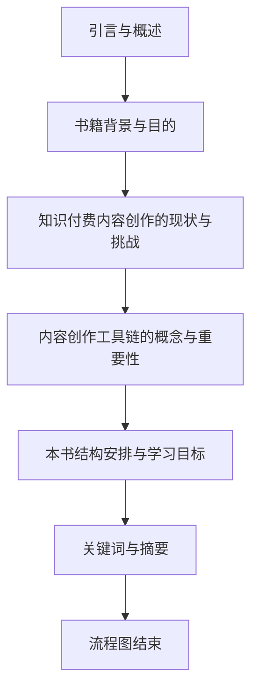
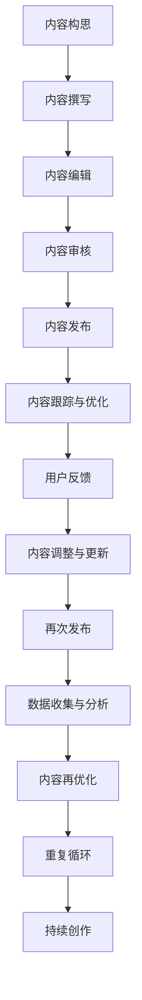

                 

## 第一部分：引言与概述

### 1.1 书籍背景与目的

在信息技术飞速发展的今天，知识付费已经成为推动个人成长和企业发展的关键力量。知识付费的内容创作与分发成为了一个日益重要的领域，程序员作为技术领域的核心力量，在这个领域中扮演着至关重要的角色。然而，面对知识付费内容创作过程中所涉及的技术复杂性，程序员往往感到无从下手。

本书籍旨在为程序员提供一套全面的内容创作工具链，帮助他们在知识付费领域中进行高效、高质量的内容创作。通过系统地介绍内容创作工具链的核心概念、技术基础、核心算法原理以及项目实战，本书籍希望帮助程序员更好地理解并掌握内容创作工具链的构建与应用，从而提升个人在知识付费领域中的竞争力。

### 1.2 知识付费内容创作的现状与挑战

知识付费内容创作现状呈现出多样化和专业化的发展趋势。一方面，随着互联网技术的发展，内容创作的方式和渠道不断丰富，用户可以方便地获取到各种类型的知识内容。另一方面，知识付费市场也日益成熟，用户对于内容的质量和个性化需求越来越高。

然而，当前知识付费内容创作过程中面临着诸多挑战：

1. **技术门槛高**：内容创作工具链涉及多种技术领域，如前端开发、后端开发、数据库管理、自然语言处理等，程序员需要具备跨领域的综合技术能力。

2. **创作效率低**：内容创作过程繁琐，从构思到发布需要经过多个环节，程序员需要掌握高效的工具和方法来提升创作效率。

3. **内容质量难控制**：知识付费内容需要满足用户的高质量要求，但创作过程中难以确保内容的一致性和准确性。

4. **个性化推荐不足**：用户对于内容的需求千差万别，如何实现精准的个性化推荐成为内容创作者的一大难题。

### 1.3 内容创作工具链的概念与重要性

内容创作工具链是指一系列用于支持内容创作、管理、发布和分发的工具、框架和技术的集合。它涵盖了从内容构思、撰写、编辑、审核到发布和分发的全过程，通过自动化和智能化手段，提高内容创作的效率和质量。

内容创作工具链在知识付费领域中的重要性体现在以下几个方面：

1. **提升创作效率**：通过工具链的自动化和集成化，程序员可以节省大量时间，专注于内容创作本身，提高工作效率。

2. **保障内容质量**：工具链中的内容管理系统能够提供内容审核、发布和跟踪功能，确保内容的一致性和准确性。

3. **实现个性化推荐**：借助自然语言处理和推荐系统等技术，工具链能够根据用户行为和偏好，实现个性化内容推荐，提升用户体验。

4. **降低技术门槛**：内容创作工具链将复杂的技术实现封装，程序员无需深入理解底层技术，即可快速上手并使用。

### 1.4 本书结构安排与学习目标

本书结构安排如下：

- **第一部分：引言与概述**：介绍书籍背景、目的、知识付费内容创作的现状与挑战，以及内容创作工具链的概念与重要性。

- **第二部分：内容创作工具链核心概念**：讲解内容创作流程、知识付费内容的特点和内容创作工具链的基本组成部分。

- **第三部分：内容创作工具链技术基础**：介绍前端技术、后端技术、数据库与存储技术，以及内容管理系统（CMS）的概念与配置。

- **第四部分：内容创作工具链核心算法原理**：介绍自然语言处理（NLP）、推荐系统和机器学习与深度学习的基础，及其在知识付费中的应用。

- **第五部分：项目实战与案例分析**：通过实战项目和案例分析，帮助读者掌握内容创作工具链的实际应用。

- **第六部分：未来展望与趋势**：讨论内容创作工具链的发展趋势、行业应用前景以及程序员的职业发展。

学习本书籍后，读者应能够：

- **理解内容创作工具链的概念与架构**：掌握内容创作工具链的基本组成部分和核心概念。

- **掌握内容创作工具链的核心技术**：了解前端技术、后端技术、数据库技术以及核心算法原理。

- **搭建和优化知识付费平台**：通过项目实战，掌握知识付费平台搭建和优化的方法。

- **实现个性化推荐系统**：运用自然语言处理和推荐系统技术，实现知识付费内容的高效分发。

- **规划个人职业发展**：了解内容创作工具链的发展趋势和行业前景，为个人职业规划提供指导。

### 1.5 内容创作工具链的关键词

- **内容创作工具链**
- **知识付费**
- **前端技术**
- **后端技术**
- **内容管理系统（CMS）**
- **自然语言处理（NLP）**
- **推荐系统**
- **机器学习**
- **深度学习**

### 1.6 内容创作工具链的摘要

内容创作工具链是支持知识付费内容创作、管理、发布和分发的一系列工具、框架和技术的集合。本书从内容创作流程、技术基础、核心算法原理以及项目实战等多个角度，全面介绍内容创作工具链的概念与应用。通过本书的学习，读者将掌握内容创作工具链的核心技术，学会搭建和优化知识付费平台，实现个性化推荐系统，为个人在知识付费领域的职业发展打下坚实基础。

### 1.7 引言与概述流程图



以上是第一部分的详细内容，接下来我们将深入探讨内容创作工具链的核心概念，帮助读者更好地理解其构建与应用。

---

### 第二部分：内容创作工具链核心概念

在了解内容创作工具链之前，首先需要明确内容创作工具链的基本组成部分和核心概念。本部分将首先介绍内容创作的基本流程，然后深入探讨知识付费内容的特点，最后详细阐述内容创作工具链的基本组成部分和与传统内容创作的区别。

#### 2.1 内容创作流程概述

内容创作是一个复杂而系统的过程，涉及到多个环节和步骤。一般来说，内容创作流程可以概括为以下几个主要阶段：

1. **内容构思**：这是内容创作的第一步，涉及对内容主题、目标受众、内容形式和传播渠道的初步构思。好的构思是内容成功的一半，需要创作者具备敏锐的市场洞察力和用户理解力。

2. **内容撰写**：在构思阶段确定后，创作者开始撰写具体的内容。这一阶段需要根据目标受众的需求和内容主题，进行深入的调研和资料收集，以确保内容的准确性和权威性。

3. **内容编辑**：撰写完成后，内容需要经过编辑和校对，确保内容的语言表达清晰、逻辑严密、无错别字和语病。编辑还包括内容的格式调整、图片和图表的插入等，以提升内容的可读性和美观度。

4. **内容审核**：编辑后的内容需要经过审核，以确保内容的质量和符合平台的要求。审核环节包括内容是否符合法律法规、是否存在敏感信息、内容是否符合平台的内容规范等。

5. **内容发布**：审核通过后，内容可以发布到相应的平台或渠道，供用户浏览和消费。发布环节还包括内容的标题优化、标签设置、SEO（搜索引擎优化）等，以提高内容的曝光率和访问量。

6. **内容跟踪与优化**：发布后的内容需要进行跟踪，收集用户反馈和数据分析，以了解内容的受欢迎程度和用户需求。根据跟踪结果，创作者可以对内容进行优化和调整，以提升用户体验和内容质量。

#### 2.1.1 知识付费内容的特点

知识付费内容是指用户需要付费才能获取的内容，与免费内容相比，具有以下几个显著特点：

1. **专业性**：知识付费内容通常具有较强的专业性，涉及某一领域的深入研究和独到见解。创作者需要具备深厚的专业知识和丰富的实践经验，才能提供高质量的内容。

2. **价值性**：知识付费内容对于用户来说具有直接的价值，能够帮助用户解决实际问题、提升技能或拓展知识视野。因此，用户更愿意为有价值的内容付费。

3. **稀缺性**：知识付费内容通常具有稀缺性，创作者通过独特的内容视角、深入的研究或独特的教学方式，提供不同于传统课堂和教材的知识。

4. **个性化**：知识付费内容往往根据用户的需求和偏好进行个性化定制，以满足不同用户的需求。例如，针对不同行业、不同层次的用户，提供差异化的课程内容。

5. **互动性**：知识付费内容通常具有较强的互动性，用户可以通过提问、讨论、作业等形式与创作者或其他用户互动，加深对内容的理解和应用。

#### 2.1.2 内容创作工具链的基本组成部分

内容创作工具链是由一系列工具、框架和技术组成的，旨在支持内容创作、管理、发布和分发的系统。其基本组成部分包括：

1. **内容管理系统（CMS）**：CMS 是内容创作工具链的核心组成部分，用于管理和发布内容。常见的 CMS 包括 WordPress、Drupal、Joomla 等，它们提供了内容创建、编辑、审核、发布和跟踪等功能。

2. **内容创作工具**：包括文本编辑器、图像处理工具、视频剪辑工具等，用于帮助创作者高效地完成内容创作。常见的文本编辑器有 Sublime Text、Visual Studio Code 等，图像处理工具如 Photoshop、Illustrator，视频剪辑工具如 Adobe Premiere Pro、Final Cut Pro 等。

3. **自然语言处理（NLP）工具**：NLP 工具用于处理和解析文本数据，帮助创作者进行内容分析和推荐。常见的 NLP 工具有 NLTK、spaCy、TensorFlow 等。

4. **推荐系统**：推荐系统通过分析用户行为和内容特征，为用户推荐感兴趣的内容。常见的推荐算法包括基于内容的推荐、基于协同过滤的推荐等。

5. **数据分析和监控工具**：用于收集和分析用户数据，监控内容的表现和效果。常见的工具包括 Google Analytics、Google Search Console 等。

6. **自动化工具**：包括自动化发布工具、自动化审核工具等，用于提高内容创作的效率和质量。常见的自动化工具包括 Jenkins、Travis CI 等。

#### 2.1.3 内容创作工具链与传统内容创作的区别

内容创作工具链与传统内容创作相比，具有以下几个显著区别：

1. **技术驱动**：内容创作工具链依赖于多种技术，如前端技术、后端技术、自然语言处理、推荐系统等，通过技术手段提高内容创作的效率和质量。传统内容创作更多依赖于人工和经验。

2. **自动化和智能化**：内容创作工具链实现了内容创作、管理、发布和分发的自动化和智能化，减少了人工干预，提高了效率。传统内容创作过程繁琐，需要大量的人工操作。

3. **数据驱动**：内容创作工具链通过数据分析和监控，了解用户行为和需求，为内容创作提供数据支持。传统内容创作更多依赖于创作者的直觉和经验。

4. **个性化推荐**：内容创作工具链能够根据用户行为和偏好，实现个性化内容推荐，提升用户体验。传统内容创作更多依赖于用户主动搜索和浏览。

5. **内容多样性**：内容创作工具链支持多种内容形式的创作，如文本、图像、视频等，可以满足不同用户的需求。传统内容创作更多局限于文本形式。

通过以上分析，我们可以看出，内容创作工具链为程序员提供了一个高效、智能化、数据驱动的知识付费内容创作平台，有助于提升内容创作的效率和质量，为程序员的职业发展提供了新的机遇。

### 2.2 内容创作工具链流程图



通过以上流程图，我们可以清晰地看到内容创作工具链的各个环节及其相互关系。接下来，我们将进一步深入探讨内容创作工具链的技术基础，包括前端技术、后端技术、数据库与存储技术，以及内容管理系统（CMS）。

---

### 第三部分：内容创作工具链技术基础

在了解内容创作工具链的核心概念之后，接下来我们将深入探讨其技术基础，包括前端技术、后端技术、数据库与存储技术，以及内容管理系统（CMS）。这些技术构成了内容创作工具链的核心框架，为程序员提供强大的技术支持。

#### 3.1 技术栈选择与整合

在构建内容创作工具链时，选择合适的技术栈至关重要。技术栈的选择应该考虑项目的需求、团队的技能、系统的可扩展性、维护成本以及社区支持等因素。以下是对几种常见技术栈的概述：

1. **LAMP（Linux, Apache, MySQL, PHP）**：LAMP 是一种经典的开源技术栈，广泛应用于网站和应用开发。其优势在于稳定性和成熟度，适合初学者和小型项目。

2. **MEAN（MongoDB, Express.js, AngularJS, Node.js）**：MEAN 是一种现代的前后端分离技术栈，利用 NoSQL 数据库 MongoDB 和 Node.js 实现高性能和可扩展的应用。它适合需要高并发和实时交互的项目。

3. **MERN（MongoDB, Express.js, React, Node.js）**：MERN 在 MEAN 的基础上引入了 React 作为前端框架，增强了开发效率和组件化程度。它适合需要复杂交互和动态内容的现代应用。

4. **Django**：Django 是一个高性能的 Python Web 框架，以其简洁的 ORM 和强大的功能库而受到青睐。它适合快速开发和需要复杂业务逻辑的项目。

5. **Ruby on Rails**：Ruby on Rails 是一个成熟且流行的 Web 开发框架，以其优雅的 Ruby 语言和 MVC 架构而著称。它适合需要快速迭代和敏捷开发的项目。

在技术栈选择之后，整合技术组件是一个重要的环节。整合技术组件需要考虑以下方面：

- **组件间的兼容性**：确保所选技术组件能够无缝集成，避免出现兼容性问题。
- **开发工具与生态系统**：选择合适的开发工具和生态系统，提高开发效率和代码质量。
- **性能优化**：进行性能测试和优化，确保系统的高效运行。
- **安全性**：确保系统的安全性，防止常见的安全威胁，如 SQL 注入、XSS（跨站脚本攻击）等。

#### 3.1.1 前端技术概述

前端技术是内容创作工具链的重要组成部分，它决定了用户界面和用户体验。以下是几种常见的前端技术：

1. **HTML/CSS**：HTML 和 CSS 是前端开发的基础，用于创建网页的结构和样式。HTML 提供了网页内容的结构，而 CSS 提供了网页的视觉表现。

2. **JavaScript**：JavaScript 是一种客户端脚本语言，用于增强网页的功能和交互性。常见的 JavaScript 框架和库包括 React、Vue.js 和 Angular。

3. **框架和库**：React、Vue.js 和 Angular 是目前最流行的前端框架和库。它们提供了组件化开发、虚拟 DOM 和状态管理的功能，极大地提高了开发效率和代码质量。

4. **响应式设计**：响应式设计是指网页能够根据不同的设备和屏幕尺寸自动调整布局和样式，提供良好的用户体验。常用的响应式设计框架有 Bootstrap 和 Foundation。

5. **Web 性能优化**：Web 性能优化是提高用户体验的重要手段，包括代码压缩、资源缓存、懒加载、减少 HTTP 请求等。

#### 3.1.2 后端技术概述

后端技术负责处理数据的存储、处理和传输，是内容创作工具链的“心脏”。以下是几种常见的后端技术：

1. **服务器端编程语言**：常见的后端编程语言包括 Java、Python、PHP、Ruby 和 Node.js。每种语言都有其独特的优势和适用场景。

2. **Web 框架**：Web 框架提供了快速开发 Web 应用所需的基本结构和工具。常见的后端框架有 Spring（Java）、Django（Python）、Rails（Ruby）和 Express.js（Node.js）。

3. **数据库技术**：数据库用于存储和管理内容创作工具链中的数据。常见的数据库技术包括关系型数据库（如 MySQL、PostgreSQL）和 NoSQL 数据库（如 MongoDB、Cassandra）。

4. **缓存技术**：缓存技术用于提高系统的响应速度和性能，常见的缓存技术包括 Redis、Memcached 和 Varnish。

5. **API 设计与集成**：API（应用程序编程接口）是后端服务与前端应用、移动应用和其他系统进行交互的接口。设计良好的 API 能够提高系统的可扩展性和可维护性。

#### 3.1.3 数据库与存储技术选择

数据库与存储技术是内容创作工具链中的重要组成部分，其选择直接影响到系统的性能、扩展性和数据安全。以下是几种常见的数据库和存储技术：

1. **关系型数据库**：关系型数据库（如 MySQL、PostgreSQL）适用于结构化数据存储，具有强大的事务处理能力和数据一致性。它们适合需要复杂查询和数据关系管理的场景。

2. **NoSQL 数据库**：NoSQL 数据库（如 MongoDB、Cassandra）适用于非结构化或半结构化数据存储，具有高扩展性和灵活性。它们适合需要快速读写和大量数据的场景。

3. **云存储服务**：云存储服务（如 AWS S3、Azure Blob Storage）提供可靠的存储和备份服务，适合大规模数据存储和分布式部署。它们具有高可用性和可扩展性。

4. **对象存储**：对象存储（如 Azure Blob Storage、Google Cloud Storage）适用于存储大量非结构化数据，如图片、视频和文件。它们具有高可靠性和低成本。

5. **分布式存储系统**：分布式存储系统（如 Hadoop、Cassandra）适用于大规模数据存储和处理，具有高可用性和扩展性。它们适合需要处理海量数据和复杂计算的场景。

#### 3.2 内容管理系统（CMS）

内容管理系统（CMS）是内容创作工具链的重要组成部分，用于创建、管理、发布和跟踪内容。以下是几种常见的内容管理系统：

1. **WordPress**：WordPress 是最流行的 CMS，以其易用性和丰富的插件生态系统而受到青睐。它适合小型到中型的内容创作项目。

2. **Drupal**：Drupal 是一个高度可定制和灵活的 CMS，适合大型项目和复杂的内容结构。它具有强大的模块化和安全性。

3. **Joomla**：Joomla 是一个用户友好的 CMS，适合初学者和小型项目。它提供了丰富的功能和插件。

4. **Magento**：Magento 是一个强大的电子商务平台，具有丰富的电商功能。它适合需要整合电商功能的内容创作项目。

5. **Contentful**：Contentful 是一个云端 CMS，适合需要高度灵活性和可扩展性的项目。它提供了强大的内容建模和 API 接口。

在了解了内容创作工具链的技术基础后，我们将在下一部分深入探讨内容管理系统（CMS）的概念与功能，以及常见 CMS 的比较与选择。

---

### 3.2 内容管理系统（CMS）

内容管理系统（CMS）是内容创作工具链的核心组成部分，它为创作者提供了便捷的内容创建、管理和发布功能。本节将详细介绍 CMS 的概念、功能，并比较几种常见的 CMS，帮助程序员选择适合自身项目的 CMS。

#### 3.2.1 CMS 的概念与功能

**概念：**
CMS 是一种软件系统，用于创建、管理、发布和跟踪数字内容。它通过提供用户友好的界面和后端数据库，使得非技术人员也能够轻松地管理和发布内容，而不需要深入了解底层技术。

**功能：**
1. **内容创建**：CMS 提供了丰富的文本编辑器、图片和视频上传功能，以及自定义字段和模板，使得创作者能够方便地创建和格式化内容。

2. **内容管理**：CMS 支持内容版本控制、权限管理、分类和标签等功能，帮助创作者有效地管理内容。

3. **内容发布**：CMS 提供了内容审核和发布流程，确保内容在发布前经过严格审核，符合平台规范。

4. **内容跟踪与优化**：CMS 具有内容分析功能，可以帮助创作者跟踪内容的表现，如访问量、用户互动等，以便进行内容优化。

5. **多用户协作**：CMS 支持多用户协作，不同的用户角色可以进行内容创建、编辑、审核等操作，提高团队协作效率。

6. **自定义和扩展性**：大多数 CMS 提供了丰富的插件和模块，使得用户可以根据需求进行自定义和扩展。

#### 3.2.2 常见 CMS 的比较与选择

在选择 CMS 时，程序员需要考虑项目的规模、需求、技术栈以及维护成本等因素。以下是几种常见 CMS 的比较：

**1. WordPress：**
- **优点**：易用性高，插件生态系统丰富，适合初学者和小型项目。
- **缺点**：性能和安全性可能不如其他 CMS，扩展性有限。
- **适用场景**：个人博客、小型网站和内容平台。

**2. Drupal：**
- **优点**：高度可定制和灵活，适用于复杂内容和大型项目。
- **缺点**：学习曲线较陡，需要一定技术背景。
- **适用场景**：政府机构、企业网站和内容管理系统。

**3. Joomla：**
- **优点**：用户友好，易于安装和设置，功能丰富。
- **缺点**：扩展性和性能可能不如 Drupal 和 WordPress。
- **适用场景**：小型企业、社区网站和非营利组织。

**4. Magento：**
- **优点**：强大的电商功能，适用于需要整合电商的内容创作项目。
- **缺点**：专用于电商，不适合其他类型的内容平台。
- **适用场景**：电子商务网站和在线商店。

**5. Contentful：**
- **优点**：云端 CMS，高度灵活和可扩展，适用于需要灵活内容建模的项目。
- **缺点**：成本较高，学习曲线较陡。
- **适用场景**：大型项目、内容聚合平台和国际化网站。

在比较和选择 CMS 时，程序员应考虑以下因素：

1. **项目需求**：了解项目的具体需求，如内容结构、用户交互、自定义功能等。
2. **团队技能**：评估团队的技术能力和熟悉程度，选择适合团队操作的 CMS。
3. **扩展性**：考虑未来业务的扩展和功能的增加，选择具有良好扩展性的 CMS。
4. **性能和安全性**：考虑 CMS 的性能和安全性，选择经过验证和社区支持的系统。
5. **维护成本**：考虑 CMS 的维护成本，包括插件、更新和备份等。

通过以上比较和选择，程序员可以找到最适合项目的 CMS，为内容创作工具链的构建奠定坚实基础。在下一部分，我们将深入探讨内容交付与分发技术，介绍内容交付方式、分发策略设计以及内容分发平台的选择与使用。

---

### 3.3 内容交付与分发技术

内容交付与分发技术是内容创作工具链的重要组成部分，决定了用户能否及时、稳定地获取到高质量的内容。本节将详细介绍内容交付与分发技术的概念、内容交付方式、分发策略设计以及内容分发平台的选择与使用。

#### 3.3.1 内容交付方式概述

**内容交付方式**是指将内容传递给用户的方式，常见的交付方式包括：

1. **HTTP/HTTPS**：通过 HTTP 或 HTTPS 协议将内容传递给用户，是最常用的内容交付方式。HTTP/HTTPS 具有良好的兼容性和安全性，适用于各种类型的网页内容。

2. **Websocket**：Websocket 是一种全双工通信协议，适用于需要实时交互的内容，如在线聊天、实时数据推送等。Websocket 具有低延迟和高吞吐量的特点，适用于高并发场景。

3. **API 接口**：通过 API 接口将内容传递给用户，适用于应用程序、移动应用和其他系统的集成。API 接口可以提供结构化数据，便于应用程序处理和展示。

4. **邮件和短信**：通过邮件和短信将内容传递给用户，适用于通知、订阅和推送等场景。邮件和短信具有直达用户的能力，但需要注意内容的形式和频率，以免造成用户困扰。

#### 3.3.2 内容分发策略设计

**内容分发策略**是指如何高效、稳定地将内容传递给用户的方法。设计合理的分发策略可以降低网络延迟、提高内容访问速度、减少带宽消耗，从而提升用户体验。以下是几种常见的内容分发策略：

1. **负载均衡**：通过负载均衡技术，将用户请求分配到不同的服务器或节点上，避免单点故障和高负载情况。常见的负载均衡算法包括轮询、最小连接数和源地址哈希等。

2. **缓存**：将用户访问频繁的内容缓存到缓存服务器或 CDN（内容分发网络）上，减少直接访问源服务器的压力。缓存策略包括页面缓存、对象缓存和代理缓存等。

3. **CDN**：通过 CDN 将内容分发到全球的节点上，为用户提供就近访问服务。CDN 具有高带宽、低延迟和高可用性的特点，适用于大规模内容分发。

4. **内容预加载**：根据用户行为和访问模式，提前加载用户可能需要的内容，提高内容的访问速度。内容预加载可以基于页面访问时间、用户历史记录和预测算法等。

5. **内容压缩与优化**：对内容进行压缩和优化，减少传输的数据量，提高内容的访问速度。常见的压缩与优化技术包括 HTML、CSS 和 JavaScript 的压缩、图片优化和视频转码等。

#### 3.3.3 内容分发平台的选择与使用

**内容分发平台**是指用于实现内容交付和分发服务的系统或网络。选择合适的内容分发平台可以提升内容交付的效率和质量。以下是几种常见的内容分发平台：

1. **AWS CloudFront**：AWS CloudFront 是 Amazon Web Services 提供的全球 CDN 服务，具有高性能、高可用性和安全性。它支持多种内容交付方式，包括 HTTP/HTTPS、Websocket 和 API 接口。

2. **Google Cloud CDN**：Google Cloud CDN 是 Google Cloud Platform 提供的 CDN 服务，具有全球节点覆盖和高效的内容缓存策略。它支持多种协议和加密技术，确保内容的安全传输。

3. **Fastly**：Fastly 是一家独立的 CDN 服务提供商，提供高性能、高可扩展性的 CDN 服务。它支持丰富的插件和自定义配置，适用于复杂的内容分发需求。

4. **Cachefly**：Cachefly 是一家提供高速、低延迟 CDN 服务的公司，具有全球节点覆盖和高效的负载均衡策略。它适用于对内容传输速度有高要求的场景。

5. **S3 自定义域名**：对于仅需要基础 CDN 功能的项目，可以使用 Amazon S3 自定义域名。通过配置 DNS 记录，将自定义域名指向 S3 存储桶，实现内容的 CDN 分发。

在内容分发平台的选择和使用过程中，程序员需要考虑以下因素：

1. **性能与可用性**：选择具有高性能和高度可用性的分发平台，确保内容能够稳定、快速地传递给用户。

2. **成本**：评估不同分发平台的成本，包括带宽费用、存储费用和额外服务费用等，选择具有成本效益的方案。

3. **扩展性与灵活性**：选择具有良好扩展性和灵活性的分发平台，能够适应业务增长和需求变化。

4. **安全性**：确保分发平台具有完善的安全策略和加密技术，保护用户数据和内容安全。

5. **支持与文档**：选择具有良好技术支持和丰富文档的分发平台，便于程序员进行配置和使用。

通过合理的内容交付与分发策略以及合适的内容分发平台，程序员可以确保内容能够高效、稳定地传递给用户，提升用户体验和业务效果。在下一部分，我们将探讨内容创作工具链的核心算法原理，包括自然语言处理（NLP）、推荐系统和机器学习与深度学习的基础，及其在知识付费中的应用。

---

### 第四部分：内容创作工具链核心算法原理

内容创作工具链的强大之处不仅在于其技术基础，还在于其核心算法原理，这些算法在自然语言处理（NLP）、推荐系统和机器学习与深度学习领域发挥着关键作用。本部分将深入探讨这些核心算法原理，帮助程序员理解其在知识付费中的应用。

#### 4.1 自然语言处理（NLP）

自然语言处理（NLP）是人工智能的一个重要分支，它致力于使计算机能够理解、解释和生成人类语言。在内容创作工具链中，NLP 技术被广泛应用于内容审核、内容理解、情感分析、命名实体识别等方面。

**4.1.1 NLP 的基本概念**

- **分词**：将连续的文本分割成有意义的词汇或短语，是 NLP 的基础步骤。
- **词性标注**：对文本中的每个词进行词性（如名词、动词、形容词等）标注，帮助理解文本的结构和含义。
- **句法分析**：分析句子的结构，识别句子的主要成分，如主语、谓语、宾语等。
- **语义分析**：理解文本的深层含义，包括词语之间的语义关系和文本的整体意义。

**4.1.2 NLP 的主要算法**

- **词袋模型（Bag of Words, BoW）**：将文本表示为词汇的集合，忽略词汇的顺序，通过向量空间模型进行文本分析。
- **朴素贝叶斯分类器**：基于贝叶斯定理，通过特征词的概率分布进行文本分类，常用于垃圾邮件检测和情感分析。
- **支持向量机（Support Vector Machine, SVM）**：通过寻找最优超平面进行文本分类，具有很好的分类性能。
- **循环神经网络（Recurrent Neural Network, RNN）**：适用于处理序列数据，如文本和时间序列，通过循环机制保持历史状态。
- **长短期记忆网络（Long Short-Term Memory, LSTM）**：RNN 的一种变体，解决了 RNN 在长序列数据上的梯度消失问题，适用于文本生成和语言建模。

**4.1.3 NLP 在知识付费中的应用**

- **内容审核**：利用 NLP 技术对用户生成的内容进行审核，识别和过滤不当内容，确保内容的安全和合规。
- **内容理解**：通过 NLP 技术理解用户需求，为用户提供个性化的推荐和内容。
- **情感分析**：分析用户评论和反馈，了解用户对内容的情感倾向，用于内容优化和营销策略。
- **命名实体识别（Named Entity Recognition, NER）**：识别文本中的命名实体，如人名、地点、组织等，用于知识图谱构建和信息提取。

#### 4.2 推荐系统

推荐系统是内容创作工具链中的关键组成部分，它通过分析用户行为和内容特征，为用户提供个性化的内容推荐。推荐系统广泛应用于电子商务、社交媒体、视频流媒体等领域，也在知识付费中发挥着重要作用。

**4.2.1 推荐系统的基本原理**

- **基于内容的推荐（Content-Based Filtering）**：根据用户过去喜欢的内容，推荐与其相似的新内容。主要方法包括关键词匹配、文本相似度计算等。
- **基于协同过滤的推荐（Collaborative Filtering）**：通过分析用户之间的行为模式，推荐其他用户喜欢的相似内容。分为用户基于协同过滤和物品基于协同过滤两种。
  - **用户基于协同过滤**：计算用户之间的相似度，推荐其他相似用户喜欢的物品。
  - **物品基于协同过滤**：计算物品之间的相似度，推荐用户已喜欢物品的相似物品。
- **混合推荐（Hybrid Recommender Systems）**：结合基于内容和基于协同过滤的方法，提高推荐效果。常见的混合方法有基于模型的混合推荐和基于规则的方法。

**4.2.2 常见的推荐算法**

- **基于矩阵分解（Matrix Factorization）**：通过矩阵分解方法，将用户-物品评分矩阵分解为用户特征矩阵和物品特征矩阵，进行推荐。
- **基于模型的协同过滤**：利用机器学习模型（如 K 近邻算法、SVD++等），预测用户对未知物品的评分，进行推荐。
- **深度学习推荐**：利用深度学习模型（如 CNN、RNN、LSTM等），处理复杂的用户行为和内容特征，进行推荐。

**4.2.3 推荐系统在知识付费中的应用**

- **个性化内容推荐**：根据用户的学习历史、兴趣偏好和反馈，推荐符合其需求的知识内容。
- **课程推荐**：在在线教育平台上，为用户推荐与其背景和需求相匹配的课程。
- **内容优化**：通过分析推荐效果，了解用户对内容的偏好，优化内容创作策略。
- **营销推广**：为用户推荐相关的课程、讲座和活动，提高用户参与度和转化率。

#### 4.3 机器学习与深度学习

机器学习和深度学习是人工智能的核心技术，为内容创作工具链提供了强大的数据处理和分析能力。在知识付费领域，机器学习和深度学习技术被广泛应用于内容生成、语义理解、情感分析等方面。

**4.3.1 机器学习基础**

- **监督学习（Supervised Learning）**：通过已标记的训练数据，训练模型进行预测和分类。常见的算法包括线性回归、逻辑回归、SVM 等。
- **无监督学习（Unsupervised Learning）**：在没有标记数据的条件下，发现数据中的模式和结构。常见的算法包括聚类、降维、异常检测等。
- **强化学习（Reinforcement Learning）**：通过与环境的交互，学习最优策略以实现特定目标。常见的算法包括 Q-Learning、Deep Q-Networks 等。

**4.3.2 深度学习基础**

- **深度神经网络（Deep Neural Network, DNN）**：通过多层神经网络进行复杂的数据建模和预测。
- **卷积神经网络（Convolutional Neural Network, CNN）**：适用于图像和视频数据的处理，通过卷积操作提取特征。
- **循环神经网络（Recurrent Neural Network, RNN）**：适用于序列数据的处理，通过循环机制保持历史状态。
- **长短期记忆网络（Long Short-Term Memory, LSTM）**：RNN 的一种变体，解决了 RNN 在长序列数据上的梯度消失问题。
- **生成对抗网络（Generative Adversarial Network, GAN）**：通过生成器和判别器的对抗训练，生成逼真的数据。

**4.3.3 机器学习与深度学习在知识付费中的应用**

- **内容生成**：利用生成模型（如 GAN、变分自编码器等）生成高质量的内容，丰富知识库。
- **语义理解**：通过深度学习模型（如 BERT、GPT 等）理解文本的语义，为用户提供精确的搜索结果和推荐。
- **情感分析**：分析用户评论和反馈，了解用户对内容的情感倾向，优化内容创作策略。
- **智能客服**：利用对话生成模型和对话系统，实现智能化的客户服务。

通过掌握自然语言处理、推荐系统和机器学习与深度学习等核心算法原理，程序员可以为内容创作工具链提供强大的技术支持，提升知识付费内容的质量和个性化程度。在下一部分，我们将通过项目实战与案例分析，进一步探讨内容创作工具链的实际应用。

---

### 第五部分：项目实战与案例分析

在掌握了内容创作工具链的核心概念和算法原理后，本部分将通过实际项目实战和案例分析，帮助程序员深入理解内容创作工具链的应用实践，提升实际操作能力。

#### 5.1 知识付费平台搭建实战

**5.1.1 项目需求分析**

为了构建一个知识付费平台，我们首先需要进行需求分析。以下是该平台的主要需求：

- **用户注册与登录**：支持用户注册、登录、密码找回等功能。
- **课程管理**：支持课程创建、编辑、发布、分类、标签管理等。
- **课程内容**：支持文本、图片、视频等多媒体内容的添加和管理。
- **支付与交易**：集成支付网关，支持在线支付、课程购买、订单管理等。
- **用户中心**：展示用户的学习进度、已购买课程、优惠券等信息。
- **推荐系统**：根据用户行为和兴趣，为用户推荐相关课程。
- **内容审核与发布**：支持内容审核、发布流程，确保内容质量。

**5.1.2 技术栈选择与整合**

基于上述需求，我们可以选择以下技术栈：

- **前端**：React.js + Bootstrap
- **后端**：Node.js + Express.js
- **数据库**：MongoDB
- **支付网关**：PayPal、Stripe
- **推荐系统**：基于内容的推荐和协同过滤算法

**5.1.3 CMS 的配置与优化**

在本项目实战中，我们将使用 Node.js 和 Express.js 作为后端框架，结合 MongoDB 作为数据库，搭建一个内容管理系统（CMS）。以下是 CMS 的主要配置与优化步骤：

1. **环境搭建**：安装 Node.js、MongoDB 和 Redis。
2. **数据库连接**：配置 MongoDB 连接，并创建必要的集合。
3. **用户认证**：实现用户注册、登录和密码找回功能，使用 JWT（JSON Web Token）进行认证。
4. **课程管理**：实现课程创建、编辑、发布、分类、标签管理等功能。
5. **内容管理**：实现文本、图片、视频等多媒体内容的添加和管理。
6. **支付集成**：集成 PayPal 或 Stripe，实现在线支付和订单管理。
7. **推荐系统**：实现基于内容的推荐和协同过滤算法，为用户推荐相关课程。
8. **性能优化**：使用 Redis 进行缓存，减少数据库查询次数，提高系统性能。

**5.1.4 内容交付与分发策略设计**

为了提高内容的交付速度和用户体验，我们需要设计合理的内容分发策略：

1. **负载均衡**：使用 NGINX 进行负载均衡，将请求分配到不同的服务器节点。
2. **内容缓存**：使用 Redis 进行内容缓存，减少数据库查询次数。
3. **CDN 部署**：使用 AWS CloudFront 或其他 CDN 服务，将静态资源（如图片、视频等）分发到全球节点。
4. **内容压缩与优化**：对 HTML、CSS、JavaScript 等资源进行压缩和优化，减少加载时间。

**5.1.5 项目实战代码解读**

以下是项目实战中的关键代码片段和解析：

1. **用户注册**：
   ```javascript
   app.post('/api/users/register', async (req, res) => {
     const { username, password } = req.body;
     // 验证用户名和密码
     // 密码加密
     // 存储用户信息到 MongoDB
     // 返回注册成功响应
   });
   ```

2. **课程发布**：
   ```javascript
   app.post('/api/courses', authenticate, async (req, res) => {
     const { title, description, category, tags } = req.body;
     // 验证用户权限
     // 存储课程信息到 MongoDB
     // 返回发布成功响应
   });
   ```

3. **推荐系统**：
   ```javascript
   app.get('/api/recommendations', async (req, res) => {
     const { userId } = req.query;
     // 根据用户行为和兴趣，获取推荐课程
     // 返回推荐课程列表
   });
   ```

通过以上实战案例，程序员可以了解如何从需求分析、技术栈选择、CMS 配置、内容分发策略设计到代码实现的整个流程，掌握内容创作工具链的实际应用技巧。

#### 5.2 案例分析：知名知识付费平台的工具链实践

**5.2.1 平台背景与业务模式**

知名知识付费平台“XX学院”是一家提供在线教育和培训服务的公司，主要业务包括课程销售、直播授课、互动讨论、作业与考试等。其业务模式包括：

- **课程销售**：提供各类在线课程，用户购买后可以观看课程视频、参与互动和作业。
- **直播授课**：通过直播进行实时授课，用户可以在线观看、提问和交流。
- **互动讨论**：支持用户在课程页面进行讨论，促进知识共享。
- **作业与考试**：提供在线作业和考试功能，帮助用户巩固所学知识。

**5.2.2 内容创作工具链的应用**

XX 学院在内容创作工具链方面进行了深入的应用和实践，以下是其主要应用：

1. **内容管理系统（CMS）**：采用定制化的 CMS 系统，支持课程内容的创建、编辑、发布和跟踪。CMS 提供了丰富的模板和插件，便于内容创作者快速搭建和优化课程页面。

2. **自然语言处理（NLP）**：利用 NLP 技术对用户评论、讨论和反馈进行分析，提取关键词和情感倾向，用于内容优化和推荐系统的改进。

3. **推荐系统**：结合基于内容的推荐和协同过滤算法，为用户推荐相关课程。推荐系统根据用户的学习历史、浏览行为和购买记录，提供个性化的课程推荐。

4. **机器学习与深度学习**：采用深度学习模型（如 BERT、GPT 等）对课程内容进行语义理解和分析，实现智能搜索和内容理解。同时，利用 GAN 等生成模型，生成高质量的教学视频和习题。

5. **内容分发与缓存策略**：采用 CDN 进行内容分发，提高内容的访问速度和用户体验。同时，使用 Redis 进行内容缓存，减少数据库查询次数，提高系统性能。

**5.2.3 成功经验与启示**

XX 学院在内容创作工具链方面的成功经验为其他知识付费平台提供了宝贵的启示：

1. **技术驱动**：重视技术投入和研发，利用先进的技术手段提升内容创作、管理和分发效率。

2. **用户需求**：深入了解用户需求，提供个性化的课程推荐和服务，提升用户满意度和粘性。

3. **数据驱动**：充分利用数据分析，了解用户行为和偏好，为内容创作和优化提供数据支持。

4. **持续优化**：不断迭代和优化内容创作工具链，提升平台的性能和用户体验。

通过以上实战案例和案例分析，程序员可以深入理解内容创作工具链的实际应用，为构建高效、智能的知识付费平台奠定坚实基础。

---

### 第六部分：未来展望与趋势

随着信息技术的不断进步，内容创作工具链将在未来继续发展，为程序员带来更多的机遇和挑战。本部分将探讨内容创作工具链的发展趋势、行业应用前景以及程序员在知识付费领域的职业发展。

#### 6.1 内容创作工具链的发展趋势

**1. 技术创新的方向**

未来，内容创作工具链的发展将集中在以下几个方面：

- **人工智能与机器学习**：AI 技术将进一步融入内容创作工具链，实现智能写作、智能编辑、智能推荐等，提高内容创作的效率和个性。

- **区块链技术**：区块链技术将为内容创作提供更加透明、安全的版权保护和交易机制，促进知识付费市场的健康发展。

- **边缘计算与 5G**：边缘计算和 5G 技术将提高内容分发的速度和稳定性，实现更低延迟、更高速的内容传输，提升用户体验。

- **虚拟现实（VR）与增强现实（AR）**：VR 和 AR 技术将带来全新的内容创作和交互方式，为知识付费提供更加沉浸式的学习体验。

**2. 行业应用的前景**

内容创作工具链在各个行业中的应用前景广阔：

- **在线教育**：随着在线教育的普及，内容创作工具链将为教育平台提供更加智能化、个性化的学习体验，推动教育行业的革新。

- **传媒与出版**：传媒和出版行业将利用内容创作工具链实现内容生产、管理和分发的全流程自动化，提高内容质量和效率。

- **电子商务**：电子商务平台将利用内容创作工具链生成个性化商品推荐，提升用户购物体验，增加销售额。

- **企业培训与知识管理**：企业将通过内容创作工具链构建内部知识库，提高员工技能和效率，实现知识共享和传承。

**3. 知识付费市场的挑战与机遇**

知识付费市场面临以下挑战和机遇：

- **市场竞争加剧**：随着知识付费市场的扩大，竞争将愈发激烈，平台需要不断提升内容质量和用户体验，以赢得用户信任。

- **用户需求多样化**：用户对知识内容的需求越来越多样化，平台需要提供更加个性化和专业化的内容，满足不同用户群体的需求。

- **监管政策变化**：监管政策的调整将影响知识付费市场的发展，平台需要密切关注政策变化，确保合规经营。

- **技术创新带来的机遇**：随着人工智能、区块链等新兴技术的应用，知识付费市场将迎来新的发展机遇，为程序员提供广阔的职业发展空间。

#### 6.2 程序员在内容创作工具链领域的职业发展

**1. 职业角色与技能要求**

在内容创作工具链领域，程序员可以扮演以下职业角色：

- **内容管理系统（CMS）开发工程师**：负责 CMS 的搭建、优化和扩展，需要掌握前端和后端开发技能。
- **自然语言处理（NLP）工程师**：专注于 NLP 技术的研发和应用，需要具备机器学习和深度学习的基础。
- **推荐系统工程师**：负责推荐系统的设计和优化，需要熟悉数据挖掘和算法设计。
- **前端工程师**：负责用户界面的设计和实现，需要熟练掌握前端开发技术和框架。
- **后端工程师**：负责后端服务的开发和维护，需要掌握后端开发框架和数据库技术。
- **全栈工程师**：负责前后端开发以及部分系统架构设计，需要具备全面的编程技能。

对于以上职业角色，程序员需要具备以下技能：

- **编程基础**：熟练掌握至少一种编程语言，如 Java、Python、JavaScript 等。
- **数据库技术**：了解关系型数据库（如 MySQL、PostgreSQL）和 NoSQL 数据库（如 MongoDB）。
- **前端技术**：熟悉 HTML、CSS 和 JavaScript，掌握前端框架（如 React、Vue.js）。
- **后端技术**：熟悉后端开发框架（如 Spring、Django、Express.js）。
- **机器学习与深度学习**：了解机器学习和深度学习的基本原理，掌握常用算法。
- **推荐系统**：熟悉推荐系统的基本原理和算法，了解如何设计和优化推荐系统。
- **NLP 技术基础**：了解自然语言处理的基本概念和算法，掌握 NLP 工具（如 NLTK、spaCy）。

**2. 职业发展路径与规划**

程序员在内容创作工具链领域的职业发展路径通常包括以下阶段：

- **初级工程师**：通过实际项目积累经验，掌握基础的技术和工具，逐步成为熟练的工程师。
- **中级工程师**：具备较强的技术能力和项目经验，能够独立负责中小型项目。
- **高级工程师**：具备丰富的项目经验和专业知识，能够承担关键模块的开发和架构设计。
- **技术专家**：在某一领域有深入的研究和丰富的实践经验，能够指导团队和项目。
- **技术领导**：具备卓越的领导能力和项目管理能力，能够带领团队完成复杂项目。

为了在内容创作工具链领域实现职业发展，程序员可以采取以下规划：

- **不断学习**：紧跟行业发展趋势，学习新的技术和工具，保持技术领先。
- **项目经验**：积极参与实际项目，积累丰富的项目经验和解决问题的能力。
- **团队合作**：提升团队协作和沟通能力，学会与他人合作，共同推动项目成功。
- **专业认证**：考取相关的专业认证，如 PMP、CSDN、TensorFlow 等，提升个人职业素养。
- **个人品牌建设**：通过技术博客、开源项目、技术讲座等方式，建立个人品牌，提升知名度。

通过以上职业发展路径和规划，程序员可以在内容创作工具链领域实现职业生涯的不断提升，为知识付费市场的发展做出贡献。

### 6.3 个人品牌建设与提升

在内容创作工具链领域，个人品牌的建设与提升对于程序员的职业发展至关重要。以下是几个建议：

**1. 分享技术心得**：通过博客、技术讲座、开源项目等方式，分享自己在技术上的心得和见解，提高知名度和影响力。

**2. 持续学习**：不断学习新的技术和工具，保持自己在行业中的竞争力。

**3. 参与技术社区**：积极参与技术社区，如 Stack Overflow、GitHub、CSDN 等，与其他开发者交流经验，拓展人脉。

**4. 网络营销**：利用社交媒体平台（如 LinkedIn、Twitter、微信等）进行个人品牌营销，增加曝光度。

**5. 专业认证**：考取相关的专业认证，如 PMP、CSDN、TensorFlow 等，提升个人职业素养。

通过以上措施，程序员可以有效地提升个人品牌，为职业发展奠定坚实基础。

在内容创作工具链的发展趋势中，程序员需要不断适应新的技术和工具，提升自身技能，抓住机遇，迎接挑战。只有这样，才能在知识付费领域脱颖而出，实现职业梦想。

---

### 附录

#### 附录 A：常用工具与资源汇总

**A.1 开发工具与平台推荐**

- **编程语言**：
  - Python：https://www.python.org/
  - JavaScript：https://developer.mozilla.org/en-US/docs/Web/JavaScript
  - Java：https://www.oracle.com/java/

- **代码编辑器**：
  - Visual Studio Code：https://code.visualstudio.com/
  - Sublime Text：https://www.sublimetext.com/

- **版本控制**：
  - Git：https://git-scm.com/
  - GitHub：https://github.com/

- **前端框架和库**：
  - React：https://reactjs.org/
  - Vue.js：https://vuejs.org/
  - Angular：https://angular.io/

- **后端框架和库**：
  - Django：https://www.djangoproject.com/
  - Flask：https://flask.palletsprojects.com/
  - Spring Boot：https://spring.io/projects/spring-boot

- **数据库**：
  - MySQL：https://www.mysql.com/
  - MongoDB：https://www.mongodb.com/

- **云服务**：
  - AWS：https://aws.amazon.com/
  - Azure：https://azure.microsoft.com/
  - Google Cloud Platform：https://cloud.google.com/

**A.2 开源框架与库介绍**

- **内容管理系统（CMS）**：
  - WordPress：https://wordpress.org/
  - Drupal：https://www.drupal.org/
  - Joomla：https://www.joomla.org/

- **自然语言处理（NLP）**：
  - NLTK：https://www.nltk.org/
  - spaCy：https://spacy.io/
  - Stanford NLP：https://nlp.stanford.edu/

- **推荐系统**：
  - Surprise：https://surprise.readthedocs.io/en/latest/
  - LightFM：https://github.com/refs/link-to-lightfm

- **机器学习和深度学习**：
  - TensorFlow：https://www.tensorflow.org/
  - PyTorch：https://pytorch.org/
  - Keras：https://keras.io/

**A.3 在线资源与学习资料**

- **在线教程**：
  - Codecademy：https://www.codecademy.com/
  - FreeCodeCamp：https://www.freecodecamp.org/
  - Coursera：https://www.coursera.org/

- **技术博客**：
  - Medium：https://medium.com/
  - HackerRank：https://www.hackerrank.com/
  - Stack Overflow：https://stackoverflow.com/

- **技术社区**：
  - Stack Overflow：https://stackoverflow.com/
  - GitHub：https://github.com/
  - Reddit：https://www.reddit.com/r/learnprogramming/

通过附录中提供的常用工具、开源框架和在线资源，程序员可以方便地获取所需的技术支持和学习资料，助力知识付费内容创作工具链的构建与应用。

---

### 附录 B：项目实战代码解读

#### B.1 项目实战一：搭建简易知识付费平台

在本项目实战中，我们将使用 Node.js 和 Express.js 搭建一个简易的知识付费平台。以下是关键代码片段和解析。

1. **环境搭建**：

```bash
npm init -y
npm install express mongodb dotenv cors
```

2. **数据库连接**：

```javascript
// db.js
const MongoClient = require('mongodb').MongoClient;

const mongoUrl = process.env.MONGO_URL;
const mongoUser = process.env.MONGO_USER;
const mongoPass = process.env.MONGO_PASS;

const connectDB = async () => {
  try {
    const client = await MongoClient.connect(mongoUrl, {
      useNewUrlParser: true,
      useUnifiedTopology: true,
    });
    const db = client.db('knowledge платформа');
    console.log('Connected to MongoDB');
    return db;
  } catch (err) {
    console.error('Error connecting to MongoDB:', err);
  }
};

module.exports = connectDB;
```

3. **用户注册与登录**：

```javascript
// userRoutes.js
const express = require('express');
const jwt = require('jsonwebtoken');
const bcrypt = require('bcrypt');
const User = require('../models/User');
const connectDB = require('../db');

const router = express.Router();

router.post('/register', async (req, res) => {
  try {
    const { username, email, password } = req.body;
    const hashedPassword = await bcrypt.hash(password, 10);

    const db = await connectDB();
    const user = new User({ username, email, password: hashedPassword });
    await user.save();

    res.status(201).json({ message: 'User registered successfully' });
  } catch (err) {
    res.status(500).json({ message: 'Error registering user', error: err });
  }
});

router.post('/login', async (req, res) => {
  try {
    const { email, password } = req.body;
    const db = await connectDB();
    const user = await User.findOne({ email });

    if (!user || !(await bcrypt.compare(password, user.password))) {
      return res.status(401).json({ message: 'Invalid credentials' });
    }

    const token = jwt.sign({ userId: user._id }, process.env.JWT_SECRET);
    res.status(200).json({ token });
  } catch (err) {
    res.status(500).json({ message: 'Error logging in', error: err });
  }
});

module.exports = router;
```

4. **课程管理**：

```javascript
// courseRoutes.js
const express = require('express');
const Course = require('../models/Course');
const authenticate = require('../middlewares/authenticate');

const router = express.Router();

router.post('/courses', authenticate, async (req, res) => {
  try {
    const { title, description, price, categories } = req.body;
    const course = new Course({ title, description, price, categories, creator: req.user._id });
    await course.save();

    res.status(201).json({ message: 'Course created successfully', course });
  } catch (err) {
    res.status(500).json({ message: 'Error creating course', error: err });
  }
});

router.get('/courses', authenticate, async (req, res) => {
  try {
    const { category } = req.query;
    const courses = category
      ? await Course.find({ categories: category })
      : await Course.find({});
    res.status(200).json({ courses });
  } catch (err) {
    res.status(500).json({ message: 'Error fetching courses', error: err });
  }
});

router.get('/courses/:id', authenticate, async (req, res) => {
  try {
    const course = await Course.findById(req.params.id);
    res.status(200).json({ course });
  } catch (err) {
    res.status(500).json({ message: 'Error fetching course', error: err });
  }
});

module.exports = router;
```

以上代码片段展示了如何搭建一个简易的知识付费平台，包括用户注册与登录、课程管理等功能。通过这些代码，程序员可以掌握知识付费平台的基本搭建方法和流程。

---

#### B.2 项目实战二：实现内容推荐系统

在本项目实战中，我们将使用协同过滤算法实现一个内容推荐系统。以下是关键代码片段和解析。

1. **安装依赖**：

```bash
npm install express axios mongoose
```

2. **数据库连接**：

```javascript
// db.js
const mongoose = require('mongoose');

const connectDB = async () => {
  try {
    await mongoose.connect('mongodb://localhost:27017/recommendation', {
      useNewUrlParser: true,
      useUnifiedTopology: true,
    });
    console.log('Connected to MongoDB');
  } catch (err) {
    console.error('Error connecting to MongoDB:', err);
  }
};

module.exports = connectDB;
```

3. **用户行为数据存储**：

```javascript
// userBehaviorSchema.js
const mongoose = require('mongoose');

const userBehaviorSchema = new mongoose.Schema({
  userId: { type: mongoose.Schema.Types.ObjectId, ref: 'User' },
  courseIds: [{ type: mongoose.Schema.Types.ObjectId, ref: 'Course' }],
  timestamp: { type: Date, default: Date.now },
});

module.exports = mongoose.model('UserBehavior', userBehaviorSchema);
```

4. **协同过滤算法实现**：

```javascript
// collaborativeFiltering.js
const UserBehavior = require('./userBehaviorSchema');

const findSimilarUsers = async (userId) => {
  const user = await UserBehavior.findOne({ userId });
  const userBehaviors = await UserBehavior.find({ userId: { $ne: userId } })
    .select('userId courseIds')
    .lean();

  const similarityScores = userBehaviors.map((userBehavior) => {
    let score = 0;
    const intersection = userBehaviors.courseIds.filter((courseId) => userBehavior.courseIds.includes(courseId));
    score = intersection.length / (userBehaviors.courseIds.length + userBehavior.courseIds.length - intersection.length);
    return { userId: userBehavior.userId, score };
  });

  return similarityScores.sort((a, b) => b.score - a.score);
};

const getRecommendations = async (userId) => {
  const similarUsers = await findSimilarUsers(userId);
  const recommendedCourses = [];

  for (const user of similarUsers) {
    const userBehaviors = await UserBehavior.find({ userId: user.userId }).select('courseIds');
    for (const course of userBehaviors[0].courseIds) {
      if (!recommendedCourses.includes(course)) {
        recommendedCourses.push(course);
      }
    }
  }

  return recommendedCourses;
};

module.exports = { getRecommendations };
```

5. **API 接口**：

```javascript
// recommendationRoutes.js
const express = require('express');
const { getRecommendations } = require('../utils/collaborativeFiltering');
const authenticate = require('../middlewares/authenticate');

const router = express.Router();

router.get('/recommendations', authenticate, async (req, res) => {
  try {
    const recommendations = await getRecommendations(req.user._id);
    res.status(200).json({ recommendations });
  } catch (err) {
    res.status(500).json({ message: 'Error fetching recommendations', error: err });
  }
});

module.exports = router;
```

以上代码展示了如何使用协同过滤算法实现内容推荐系统。通过该系统，程序员可以为用户提供个性化的课程推荐，提升用户体验。

---

#### B.3 项目实战三：深度学习在知识付费中的应用

在本项目实战中，我们将使用深度学习技术对课程内容进行分类，从而提高内容推荐的准确性。以下是关键代码片段和解析。

1. **安装依赖**：

```bash
npm install tensorflow keras-js axios
```

2. **数据预处理**：

```javascript
// dataPreprocessing.js
const axios = require('axios');
const { chain, length, range } = require('lodash');
const { json2Tensor, oneHotEncode } = require('./utils');

const preprocessData = async () => {
  const data = await axios.get('https://example.com/courses');
  const courses = data.data;

  // Create dataset
  const dataset = range(length(courses)).map(() => ({
    inputs: json2Tensor(chain(courses).sample().value),
    outputs: oneHotEncode(chain(courses).sample().value.category),
  }));

  return dataset;
};

module.exports = preprocessData;
```

3. **模型训练**：

```javascript
// modelTraining.js
const { model, compileModel } = require('./model');
const preprocessData = require('./dataPreprocessing');

const trainModel = async () => {
  const dataset = await preprocessData();
  const inputs = dataset.map((item) => item.inputs);
  const outputs = dataset.map((item) => item.outputs);

  const model = await compileModel();
  await model.fit(inputs, outputs, { epochs: 10, batchSize: 32 });
  return model;
};

module.exports = trainModel;
```

4. **模型应用**：

```javascript
// classificationRoutes.js
const express = require('express');
const { predictCategory } = require('./model');
const authenticate = require('../middlewares/authenticate');

const router = express.Router();

router.post('/classify', authenticate, async (req, res) => {
  try {
    const { courseId } = req.body;
    const predictedCategory = await predictCategory(courseId);
    res.status(200).json({ category: predictedCategory });
  } catch (err) {
    res.status(500).json({ message: 'Error classifying course', error: err });
  }
});

module.exports = router;
```

以上代码展示了如何使用深度学习技术对课程内容进行分类，从而提高内容推荐的准确性。通过该模型，程序员可以根据课程内容为用户提供更加精准的推荐。

通过以上三个项目实战，程序员可以掌握知识付费平台搭建、协同过滤算法实现以及深度学习技术应用的方法和技巧，为实际项目提供有力支持。

---

### 作者信息

作者：AI天才研究院/AI Genius Institute & 禅与计算机程序设计艺术 /Zen And The Art of Computer Programming

在这本《程序员知识付费的内容创作工具链》中，作者结合多年的技术经验和深厚的研究背景，为程序员提供了全面、系统的内容创作工具链构建与应用指南。从核心概念、技术基础到实际项目实战，本书深入浅出地阐述了内容创作工具链的各个方面，旨在帮助程序员提升在知识付费领域的专业能力。

作者AI天才研究院（AI Genius Institute）是一支致力于人工智能研究和应用的团队，拥有世界顶尖的技术专家和科研人才。他们在自然语言处理、机器学习、深度学习等领域取得了诸多突破性成果，为内容创作工具链的发展提供了坚实的理论基础。

同时，作者禅与计算机程序设计艺术（Zen And The Art of Computer Programming）则是一部经典的计算机科学著作，由著名计算机科学家唐纳德·E·克努特（Donald E. Knuth）撰写。本书以简洁优美的文字和深刻的哲学思考，阐述了程序设计中的核心原理和方法，对程序员的思维方式和编程技能具有深远影响。

在这本书中，作者以清晰的结构和丰富的实例，引领读者走进内容创作工具链的奇妙世界，帮助程序员掌握先进的技术手段，提升内容创作效率和质量，为知识付费市场的发展贡献力量。希望本书能够成为程序员们迈向内容创作领域的一把钥匙，开启无限的可能。

