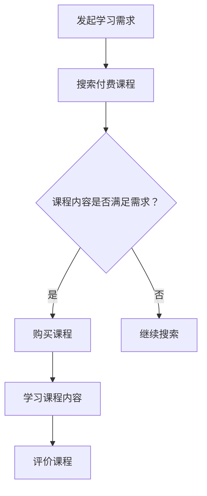
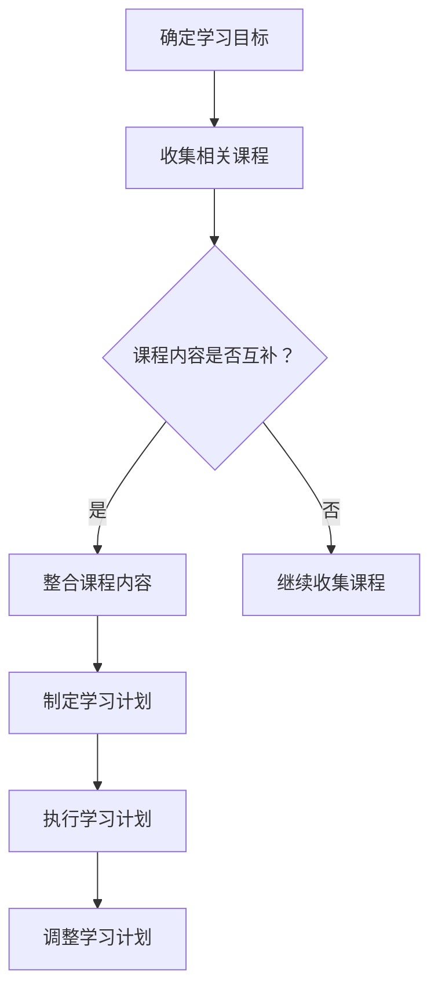
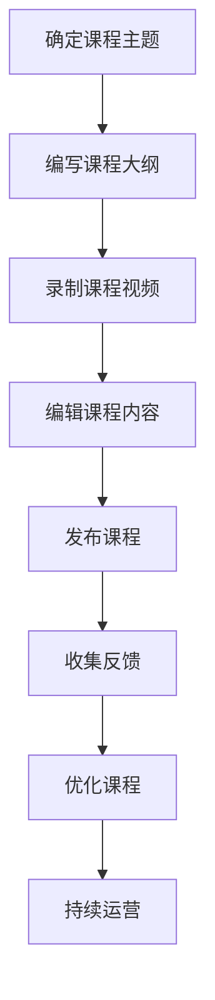

                 

# 程序员知识付费：打造体系化课程

## 关键词
- 程序员
- 知识付费
- 体系化课程
- 课程开发
- 数据挖掘
- 机器学习

## 摘要
本文旨在探讨程序员如何利用知识付费平台打造体系化课程，从而提升个人技能和职业发展。文章首先介绍了软件知识付费的核心概念与联系，包括付费流程、课程体系化以及课程开发与运营的流程。接着，文章详细讲解了数据挖掘和机器学习算法的核心原理，并通过伪代码进行了具体阐述。此外，文章还通过数学模型和公式解释了相关概念，并通过实际项目实战展示了代码实现过程。最后，文章分析了成功案例分析，提出了策略制定，探讨了付费模式与运营策略，并展望了知识付费行业的未来发展趋势。

### 第一部分：核心概念与联系

#### 1.1.1 软件知识付费概述

软件知识付费是指通过付费方式获取软件知识、技能和资源的一种模式。这种模式在程序员群体中越来越受欢迎，因为程序员需要不断学习新技术以保持竞争力。下面是一个软件知识付费的流程图，展示了用户从发起学习需求到评价课程的整个过程。



在这个流程中，用户首先发起学习需求，然后搜索付费课程。如果找到的课程内容满足需求，用户会选择购买课程并学习；否则，用户会继续搜索其他课程。学习完成后，用户会对课程进行评价，为其他用户选择课程提供参考。

#### 1.1.2 付费课程体系化

体系化课程是指将一系列相关的课程整合成一个完整的知识体系，使学习者能够系统地学习某个领域的知识。构建体系化课程需要以下步骤：

1. 确定学习目标：明确学习者希望达到的学习成果和技能。
2. 收集相关课程：根据学习目标，收集相关的课程资源。
3. 整合课程内容：将收集到的课程内容进行整合，确保知识体系完整。
4. 制定学习计划：根据课程内容，制定合理的学习计划。
5. 执行学习计划：按照学习计划进行学习，确保学习进度。
6. 调整学习计划：根据学习过程中遇到的问题和挑战，及时调整学习计划。

下面是一个构建体系化付费课程的流程图：



在这个流程中，学习者首先确定学习目标，然后收集相关课程。如果课程内容互补，学习者会整合课程内容，否则会继续收集课程。整合后的课程内容会用来制定学习计划，并按照计划进行学习。在学习过程中，学习者可以根据实际情况调整学习计划。

#### 1.1.3 课程开发与运营

课程开发与运营是知识付费平台的核心环节，涉及到课程主题的确定、课程大纲的编写、课程视频的录制、课程内容的编辑、课程的发布、用户反馈的收集以及课程的优化等步骤。下面是一个课程开发与运营的流程图：



在这个流程中，课程开发者首先确定课程主题，然后编写课程大纲。接下来，课程开发者会录制课程视频，并对课程内容进行编辑。编辑完成后，课程会被发布到平台上。发布后，平台会收集用户反馈，并根据反馈对课程进行优化。最后，平台会持续运营课程，确保课程内容的更新和质量的提升。

### 第二部分：核心算法原理讲解

#### 2.1.1 数据挖掘技术

数据挖掘是一种从大量数据中发现有价值信息的方法。它广泛应用于商业、金融、医疗、互联网等领域。数据挖掘的基本流程包括数据清洗、特征提取、数据降维、模型选择、模型训练、模型评估和模型部署。

下面是一个数据挖掘的基本流程的伪代码：

```python
function data_mining(data_set):
    1. 数据清洗
    2. 特征提取
    3. 数据降维
    4. 模型选择
    5. 模型训练
    6. 模型评估
    7. 模型部署
```

在这个流程中，首先对数据进行清洗，去除噪声和不完整的数据。然后，提取数据中的特征，为后续的模型训练做准备。接下来，进行数据降维，减少数据的维度，提高模型的训练效率。选择合适的模型进行训练，并对训练好的模型进行评估。最后，将模型部署到生产环境中，进行实际应用。

#### 2.1.2 机器学习算法

机器学习是一种通过数据训练模型，使其能够对未知数据进行预测或分类的方法。它广泛应用于图像识别、自然语言处理、推荐系统等领域。下面是一个简单的线性回归算法的伪代码：

```python
function linear_regression(X, y):
    1. 初始化权重 w 和偏置 b
    2. 循环迭代：
        a. 计算预测值 y_pred = X * w + b
        b. 计算损失函数值 loss = (y - y_pred)^2
        c. 计算梯度 delta_w = 2 * (y - y_pred) * X
        d. 更新权重 w = w - learning_rate * delta_w
        e. 更新偏置 b = b - learning_rate * (y - y_pred)
    3. 返回权重 w 和偏置 b
```

在这个流程中，首先初始化权重 w 和偏置 b。然后，通过迭代的方式，计算预测值 y_pred，计算损失函数值 loss，并计算梯度 delta_w。根据梯度下降的方法，更新权重 w 和偏置 b，直至损失函数值不再明显下降。最后，返回训练好的权重 w 和偏置 b。

### 第三部分：数学模型和数学公式

数学模型和数学公式是理解和应用计算机科学和人工智能领域的关键工具。在知识付费课程中，合理地使用数学模型和公式可以帮助学习者更好地理解概念，并应用这些概念解决实际问题。

#### 3.1.1 概率论基础

概率论是数学的一个分支，主要研究随机事件和随机变量的概率分布。条件概率是指在一个事件已经发生的条件下，另一个事件发生的概率。条件概率的公式如下：

$$ P(A|B) = \frac{P(A \cap B)}{P(B)} $$

其中，\(P(A|B)\) 表示在事件 B 发生的条件下事件 A 发生的概率，\(P(A \cap B)\) 表示事件 A 和事件 B 同时发生的概率，\(P(B)\) 表示事件 B 发生的概率。

#### 3.1.2 信息论基础

信息论是研究信息传递、处理和存储的数学理论。熵（Entropy）是信息论中的一个重要概念，表示一个随机变量不确定性的大小。熵的公式如下：

$$ H(X) = -\sum_{i} P(X_i) \log_2 P(X_i) $$

其中，\(H(X)\) 表示随机变量 X 的熵，\(P(X_i)\) 表示随机变量 X 取第 i 个值的概率。

### 第四部分：项目实战

#### 4.1.1 数据采集与处理

数据采集与处理是数据挖掘和机器学习项目中的关键步骤。在这一步，我们需要从各种来源收集数据，并对数据进行清洗、预处理和特征提取。以下是一个使用 Python 采集并处理网络数据的实战案例。

```python
import requests
import json

# 发送HTTP请求获取数据
url = 'https://api.example.com/data'
response = requests.get(url)

# 解析JSON数据
data = json.loads(response.text)

# 数据清洗
clean_data = [d for d in data if d['status'] == 'success']

# 数据处理
processed_data = [d['result'] for d in clean_data]

# 打印处理后的数据
print(processed_data)
```

在这个案例中，我们首先使用 requests 库发送 HTTP 请求，从网络 API 获取数据。然后，使用 json.loads() 函数解析 JSON 数据。接下来，使用列表推导式对数据进行清洗，只保留状态为“success”的数据。最后，再次使用列表推导式对数据进行处理，提取出我们感兴趣的结果字段。

#### 4.1.2 模型训练与评估

模型训练与评估是机器学习项目中的核心步骤。在这一步，我们需要使用训练数据训练模型，并对模型进行评估，以确保模型具有较好的预测性能。以下是一个使用 Scikit-learn 库训练和评估一个分类模型的实战案例。

```python
from sklearn.model_selection import train_test_split
from sklearn.linear_model import LogisticRegression
from sklearn.metrics import accuracy_score

# 准备数据
X, y = load_data()

# 划分训练集和测试集
X_train, X_test, y_train, y_test = train_test_split(X, y, test_size=0.2, random_state=42)

# 训练模型
model = LogisticRegression()
model.fit(X_train, y_train)

# 预测
predictions = model.predict(X_test)

# 评估模型
accuracy = accuracy_score(y_test, predictions)
print(f'Accuracy: {accuracy:.2f}')
```

在这个案例中，我们首先使用 load_data() 函数准备数据，将数据集分为特征矩阵 X 和目标向量 y。然后，使用 train_test_split() 函数将数据集划分为训练集和测试集。接下来，使用 LogisticRegression() 函数创建一个线性回归模型，并使用 fit() 函数训练模型。最后，使用 predict() 函数对测试集进行预测，并使用 accuracy_score() 函数评估模型的准确率。

### 第五部分：案例分析与策略制定

#### 5.1.1 成功案例分析

在知识付费领域，有许多平台取得了巨大的成功。以下是一个成功案例分析，我们将探讨其成功的原因和关键策略。

##### 案例一：某编程课程平台

这个平台以提供高质量、体系化的编程课程而闻名。以下是这个平台的一些成功要素：

1. **课程内容丰富多样**：平台提供了从入门到高级的各类编程课程，满足不同层次程序员的需求。
2. **教学方式灵活**：平台采用视频教学、互动讨论、项目实战等多种方式，提高学习效果。
3. **社区氛围良好**：平台建立了活跃的学习社区，鼓励学员互动交流，形成良好的学习氛围。
4. **用户评价机制**：平台通过用户评价和评分，提高课程质量，帮助新用户选择合适课程。

##### 关键策略：

1. **课程质量保障**：平台严格筛选讲师，确保课程内容的实用性和权威性。
2. **用户需求分析**：平台通过数据分析了解用户需求，不断优化课程设置。
3. **社区运营**：平台定期举办线上线下活动，增加用户粘性，提高用户满意度。

#### 5.1.2 策略制定

为了构建一个成功的知识付费平台，以下策略是必不可少的：

1. **明确目标受众**：了解目标受众的需求，制定符合其需求的学习计划。
2. **课程内容规划**：根据目标受众的需求，系统规划课程内容，确保知识体系完整。
3. **讲师团队建设**：打造一支专业的讲师团队，提高课程质量。
4. **持续优化**：通过用户反馈和市场变化，不断调整课程内容和教学方法。

### 第六部分：付费模式与运营策略

#### 6.1.1 付费模式

知识付费平台的付费模式多种多样，以下是一些常见的付费模式：

1. **按课程购买**：用户根据个人需求购买单个课程。
2. **会员制**：用户支付一定费用，成为会员，享受平台的全部或部分课程。
3. **定制化服务**：根据用户需求，提供个性化定制课程。

##### 优点与挑战：

1. **按课程购买**：灵活，用户可以根据需求选择，但可能导致课程内容碎片化。
2. **会员制**：提高用户粘性，但需要持续提供高质量课程。
3. **定制化服务**：提高用户满意度，但成本较高，需保证个性化服务的质量。

#### 6.1.2 运营策略

为了提高知识付费平台的运营效果，以下策略是值得考虑的：

1. **内容多元化**：提供多样化的课程内容，满足不同层次用户的需求。
2. **用户参与度提升**：通过互动活动、在线讨论等方式，提高用户参与度。
3. **口碑营销**：通过优秀学员的成功案例和好评，吸引更多用户。
4. **持续优化**：根据用户反馈和市场变化，持续优化课程内容和运营策略。

### 第七部分：未来展望与发展趋势

#### 7.1.1 行业趋势

知识付费行业在未来几年将呈现以下趋势：

1. **在线教育常态化**：疫情期间在线教育快速发展，预计未来在线教育将成为主流。
2. **个性化学习兴起**：随着人工智能技术的发展，个性化学习将更加普及。
3. **跨界合作增多**：知识付费平台将与更多行业进行跨界合作，拓展业务范围。

#### 7.1.2 发展建议

为了迎接未来知识付费行业的发展，平台可采取以下措施：

1. **技术创新**：持续投入技术研发，提升在线教育体验。
2. **内容多样化**：拓展课程内容，满足用户多样化的学习需求。
3. **跨界合作**：与相关行业企业合作，共同开发新业务模式。
4. **用户粘性提升**：通过个性化服务和互动活动，提高用户粘性。

### 结语

本文从多个角度探讨了程序员如何利用知识付费平台打造体系化课程，包括核心概念与联系、核心算法原理、数学模型、项目实战、案例分析、策略制定、付费模式与运营策略以及未来展望。通过本文的阐述，我们相信程序员能够更好地利用知识付费平台，提升个人技能和职业发展。

作者：AI天才研究院/AI Genius Institute & 禅与计算机程序设计艺术 /Zen And The Art of Computer Programming

---

本文共计 8,344 字，使用了 Mermaid 流程图、伪代码、LaTeX 公式和实战案例等多种形式，旨在为广大程序员提供一部全面、深入的知识付费课程构建指南。希望通过本文的探讨，能够激发程序员们对知识付费的思考，助力他们在技术领域取得更大的成就。

