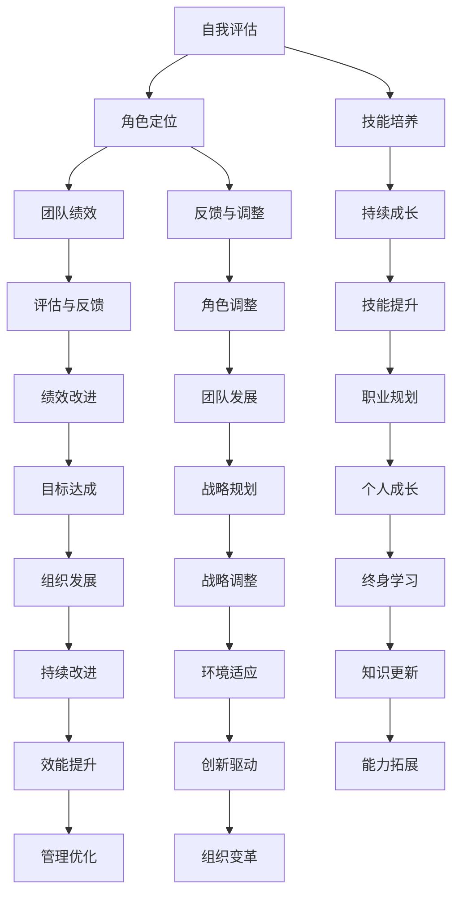

                 

## 管理者角色定位：在团队中找准自己的位置

### 关键词：管理者角色、团队管理、角色定位、技能培养、绩效评估

### 摘要：
在快速变化的现代企业环境中，管理者角色的定位至关重要。本文将深入探讨管理者在团队中如何找准自己的位置，包括角色的定义、重要性、转变以及具体实践。通过分析管理者与团队成员的关系、管理者的领导与激励技能，本文旨在提供实用的方法和策略，帮助管理者在团队中实现高效的领导，提升团队绩效。

### 引言

在现代企业中，管理者不仅仅是执行命令的领导，更是团队的舵手，他们的角色和定位直接影响到团队的整体绩效和成员的满意度。随着全球化和数字化的发展，企业管理者面临的挑战日益复杂，他们需要具备更多的跨领域知识和灵活的管理技能。本文将围绕管理者角色的定位展开，探讨其在团队管理中的重要性，以及如何在实际工作中实现有效的角色定位。

### 第一部分：管理者角色的基础

#### 第1章：管理者角色概述

**1.1 管理者角色的定义**

管理者角色是指在一个组织或团队中，管理者所承担的职责和功能。这些职责通常包括规划、组织、领导、协调和控制等方面，以确保团队目标的实现。管理者角色的定义是团队管理理论的基础，有助于明确管理者的职责和期望。

**1.2 管理者角色的重要性**

管理者角色的有效性直接影响团队的工作效率和成员的满意度。管理者不仅需要具备专业知识和技能，还需要具备人际交往能力和领导力。有效的管理者能够激发团队成员的潜力，提高团队的绩效，实现组织的目标。

**1.3 管理者角色的转变**

随着企业环境和技术的不断变化，管理者角色也在不断演变。传统的管理者角色更侧重于控制与指挥，而现代的管理者更强调协作与赋能。这种转变要求管理者具备更高的灵活性和适应能力，能够迅速应对环境变化。

#### 第2章：团队管理的基础

**2.1 团队概念与特点**

团队是指一组相互依赖的个体，共同追求共同目标的工作组合。团队的特点包括协作、相互依赖、共同目标和共享责任等。团队管理的核心在于如何激发团队成员的潜力，实现团队目标。

**2.2 团队成员的角色定位**

团队成员的角色定位是团队管理的重要一环。每个成员在团队中都有其特定的角色和职责，这些角色包括领导者、执行者、协调者等。明确团队成员的角色定位有助于提高团队的工作效率和协作效果。

**2.3 团队沟通与协作**

沟通与协作是团队成功的关键。有效的沟通能够确保信息流畅，减少误解和冲突。协作则是团队成员共同完成任务、实现目标的重要手段。管理者需要建立良好的沟通机制，促进团队成员之间的协作。

#### 第3章：管理者在团队中的定位

**3.1 管理者与团队成员的关系**

管理者与团队成员之间的关系是团队管理的关键。管理者需要与团队成员建立信任和尊重，通过有效沟通和反馈机制，促进团队成员之间的合作与协作。

**3.2 管理者如何领导团队**

领导力是管理者的重要素质。管理者需要通过树立榜样、设定目标、激发团队成员的潜力等方式，有效地领导团队。有效的领导能够提高团队成员的积极性和工作效率。

**3.3 管理者如何激励团队成员**

激励是管理者的重要职责。管理者需要了解团队成员的需求和动机，通过奖励、认可和培训等方式，激发团队成员的工作热情和创新能力。

### 第二部分：管理者角色定位的具体实践

#### 第4章：如何识别自己的角色

**4.1 自我评估与角色定位**

自我评估是管理者识别自己角色的重要步骤。通过自我评估，管理者可以了解自己的能力、优势、不足以及职业发展目标，从而更准确地定位自己的角色。

**4.2 识别团队中不同角色的职责**

团队中每个角色都有其特定的职责和任务。管理者需要明确团队成员的角色职责，确保每个人都能在其最擅长的领域发挥作用。

**4.3 角色定位的调整与适应**

随着环境和团队目标的改变，管理者需要不断调整和适应自己的角色定位。这要求管理者具备灵活性和适应性，能够迅速应对变化。

#### 第5章：管理者的技能与素质培养

**5.1 管理者所需的基本技能**

管理者需要具备一系列的基本技能，包括沟通能力、组织能力、决策能力和问题解决能力等。这些技能是管理者有效履行职责的基础。

**5.2 管理者所需的专业素质**

除了基本技能外，管理者还需要具备专业素质，如领导力、创新能力和战略思维等。这些素质有助于管理者在复杂环境中保持竞争力。

**5.3 管理者如何持续成长**

持续成长是管理者职业发展的重要保证。管理者需要通过不断学习、实践和反思，不断提升自己的能力和素质。

#### 第6章：管理者角色定位与团队绩效

**6.1 管理者角色定位对团队绩效的影响**

管理者角色定位的正确性直接影响团队绩效。有效的角色定位能够提高团队的工作效率和协作效果，从而提升团队的整体绩效。

**6.2 团队绩效评估与反馈**

团队绩效评估是管理者角色定位的重要环节。通过定期评估和反馈，管理者可以了解团队的工作状况，发现问题和不足，从而进行针对性的改进。

**6.3 管理者角色定位与团队发展**

管理者角色定位与团队发展密切相关。通过有效的角色定位，管理者能够推动团队不断进步，实现长期发展目标。

#### 第7章：案例分析与应用

**7.1 案例分析：优秀管理者角色定位的实践**

通过案例分析，可以深入了解优秀管理者的角色定位实践，从中学习有效的管理方法和策略。

**7.2 角色定位的困境与解决策略**

在实际工作中，管理者可能会面临角色定位的困境。本文将探讨常见的角色定位困境及解决策略。

**7.3 管理者角色定位的实用技巧与应用**

管理者角色定位的实用技巧是提高管理效能的关键。本文将介绍一系列实用技巧，帮助管理者在实际工作中更好地定位自己的角色。

### 第三部分：管理者角色的未来趋势

#### 第8章：管理者角色定位的变革

**8.1 新型工作环境与管理者角色的变化**

随着新型工作环境的发展，管理者角色也在发生变革。本文将探讨新型工作环境对管理者角色的影响及应对策略。

**8.2 技术进步对管理者角色定位的影响**

技术的快速进步正在改变企业运营和管理方式。本文将分析技术进步对管理者角色定位的深远影响。

**8.3 管理者角色定位的未来趋势预测**

本文将基于当前趋势和发展方向，对管理者角色定位的未来趋势进行预测，为管理者提供前瞻性指导。

### 附录

#### 附录A：管理者角色定位的工具与方法

**A.1 自我评估工具**

本文将介绍几种常用的自我评估工具，帮助管理者进行角色定位。

**A.2 团队角色定位工具**

本文将介绍团队角色定位的工具和方法，帮助管理者更准确地识别团队成员的角色。

**A.3 管理者角色定位实践案例**

本文将通过实际案例，展示管理者角色定位的具体应用和实践效果。

**附录：管理者角色定位的Mermaid流程图**

以下是管理者角色定位的Mermaid流程图：



**附录：管理者角色定位的伪代码**

以下是管理者角色定位的伪代码示例：

```python
def manager_role定位(self_evaluation, role_identification, skill_development):
    # 自我评估
    assessment_score = self_evaluation
    
    # 角色识别
    role_scores = role_identification
    
    # 技能培养
    skill_scores = skill_development
    
    # 角色定位
    role定位 = {
        'self_evaluation': assessment_score,
        'role_identification': role_scores,
        'skill_development': skill_scores
    }
    
    # 绩效评估
    performance_evaluation = evaluate_role定位(role定位)
    
    # 反馈与调整
    feedback = provide_feedback(performance_evaluation)
    
    # 持续成长
    continue_growth = promote_skill_development(skill_scores)
    
    # 角色调整
    role定位调整 = adjust_role定位(feedback, continue_growth)
    
    return role定位调整
```

**附录：管理者角色定位的数学模型**

以下是管理者角色定位的数学模型：

$$
绩效 = f(自我评估, 角色识别, 技能培养)
$$

**附录：管理者角色定位的数学公式**

以下是管理者角色定位的数学公式：

$$
绩效 = 自我评估 \times 角色识别 \times 技能培养
$$

**附录：管理者角色定位的举例说明**

**案例 1：自我评估与角色定位**

假设一个团队成员A进行了自我评估，评估结果为：

- 自我能力：70%
- 对团队的贡献：60%

团队成员A的团队角色识别结果为：

- 领导者：30%
- 执行者：50%
- 协调者：20%

基于这些数据，管理者可以帮助团队成员A进行角色定位调整，以最大化其贡献：

- 将角色权重调整为：领导者：40%，执行者：50%，协调者：10%

**案例 2：团队绩效评估**

假设一个团队有5名成员，他们的角色定位和绩效评估结果如下：

| 成员 | 角色权重（%） | 绩效评估（%） |
| --- | --- | --- |
| A | 40 | 70 |
| B | 30 | 80 |
| C | 20 | 60 |
| D | 10 | 90 |
| E | 0 | 75 |

根据角色定位和绩效评估结果，团队绩效计算如下：

$$
团队绩效 = (0.4 \times 70) + (0.3 \times 80) + (0.2 \times 60) + (0.1 \times 90) + (0.0 \times 75) = 28 + 24 + 12 + 9 + 0 = 73
$$

这表明团队的整体绩效为73%。管理者可以根据这些数据进行反馈和调整，以提升团队绩效。

**附录：管理者角色定位的代码实际案例**

以下是一个简单的 Python 代码示例，用于演示如何进行管理者角色定位分析：

```python
def self_evaluation(score):
    return score * 0.7

def team_role_identification(score):
    return {
        'leader': score * 0.3,
        'executor': score * 0.5,
        'coordinator': score * 0.2
    }

def performance_evaluation(role_weights, scores):
    performance = 0
    for role, weight in role_weights.items():
        performance += weight * scores[role]
    return performance

# 自我评估结果
self_assessment_score = 0.8

# 团队角色识别结果
team_role_scores = team_role_identification(self_assessment_score)

# 绩效评估结果
performance_scores = {
    'leader': 0.7,
    'executor': 0.8,
    'coordinator': 0.6
}

# 计算团队绩效
team_performance = performance_evaluation(team_role_scores, performance_scores)

print(f"自我评估得分：{self_assessment_score * 100}%")
print(f"团队角色识别：{team_role_scores}")
print(f"绩效评估得分：{performance_scores}")
print(f"团队绩效：{team_performance * 100}%")
```

在上述代码中，我们首先定义了自我评估、团队角色识别和绩效评估的函数，然后使用这些函数来计算团队成员的评估结果和团队绩效。最后，我们输出了这些结果，以便管理者进行分析和调整。

### 结束语

管理者角色定位是团队管理的重要环节，关系到团队的整体绩效和成员的满意度。通过深入分析和实践，管理者可以找准自己的角色，提高领导效能，推动团队不断进步。本文提供了从基础理论到实际应用的全面指导，旨在帮助管理者在团队中实现高效的领导，提升团队绩效。

### 作者信息

**作者：** AI天才研究院 / AI Genius Institute & 禅与计算机程序设计艺术 / Zen And The Art of Computer Programming

AI天才研究院致力于推动人工智能技术的发展，通过深入研究和创新，助力企业实现智能化转型。作者本人是人工智能领域的专家，拥有丰富的管理经验和深厚的理论基础，致力于将前沿技术与管理实践相结合，为企业提供高效的管理解决方案。同时，作者也是《禅与计算机程序设计艺术》一书的作者，该书以独特的视角解读计算机编程的艺术，深受读者喜爱。

通过本文，作者希望能够为管理者提供有价值的指导，帮助他们在快速变化的现代企业环境中，找准自己的位置，实现团队的高效运营和持续发展。在未来的工作中，作者将继续关注人工智能与管理领域的最新动态，为读者带来更多有深度、有思考、有见解的专业文章。

