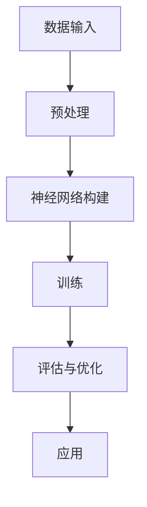
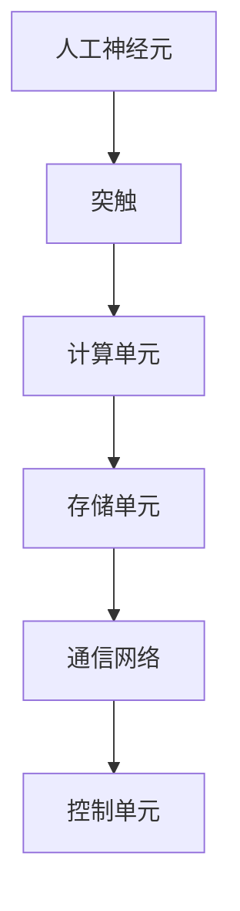

                 

### 引言与概述

> 在过去的几十年中，计算机科学和人工智能技术取得了显著进展，但传统冯·诺依曼架构的计算机在处理复杂任务和模仿人类智能方面仍存在诸多局限性。为了突破这些瓶颈，类脑计算与神经形态芯片应运而生。本文将深入探讨类脑计算与神经形态芯片的发展，以及如何通过模仿大脑结构提升机器智能的新途径。

## 1. 类脑计算与神经形态芯片的背景与重要性

类脑计算（Brain-inspired computing）是一种旨在模拟和模仿大脑处理信息方式的研究领域。它旨在解决传统计算机体系结构在处理复杂任务、实时响应和能量效率等方面的局限性。而神经形态芯片（Neuromorphic chips）则是一种硬件实现，旨在通过模仿大脑神经元和突触的结构与功能来构建计算系统。

### 1.1 类脑计算的基本概念

类脑计算的核心思想是模仿人类大脑的信息处理机制。传统计算机使用冯·诺依曼架构，其特点是使用中央处理单元（CPU）执行指令并访问内存。相比之下，类脑计算采用分布式计算和神经网络模型，模拟大脑中的神经元和突触网络。这种计算方式具有并行性、自适应性和鲁棒性等特点，使其在处理复杂任务时表现更为出色。

### 1.2 神经形态芯片的发展历程

神经形态芯片的发展始于20世纪80年代。科学家们开始尝试将人工神经元和突触集成到硅基芯片上。2006年，Henry Markram提出了“蓝色大脑计划”（Blue Brain Project），旨在创建一个功能性人类大脑的计算机模拟。近年来，随着纳米技术和集成电路技术的进步，神经形态芯片的研究取得了重大突破。例如，IBM的TrueNorth芯片和英特尔的研究团队开发的Loihi芯片，都是神经形态芯片领域的代表。

### 1.3 类脑计算与神经形态芯片的应用前景

类脑计算与神经形态芯片在多个领域展现出巨大的应用潜力。首先，在人工智能领域，类脑计算可以用于开发更高效、更灵活的机器学习算法，从而提升计算机视觉、自然语言处理和推理能力。其次，在生物医疗领域，神经形态芯片可以用于开发智能诊断系统、药物筛选和神经修复技术。此外，类脑计算与神经形态芯片在自动驾驶、智能机器人、游戏开发等领域也具有广泛应用前景。

### 2. 大脑结构与神经可塑性

大脑是人体最为复杂的器官之一，其结构和功能对于理解类脑计算和神经形态芯片至关重要。下面将介绍大脑的基本结构、神经元的通信机制以及神经可塑性原理。

### 2.1 大脑的基本结构

大脑可分为两个半球，由胼胝体连接。大脑的主要结构包括：

1. **大脑皮层**：大脑的最外层，负责高级认知功能。
2. **脑干**：位于大脑下方，控制基本生命活动，如心跳和呼吸。
3. **小脑**：位于大脑后方，负责协调运动和平衡。
4. **间脑**：包括下丘脑和垂体，调节内分泌系统和情绪。

### 2.2 神经元的通信机制

神经元是大脑的基本信息处理单元，通过电信号和化学信号进行通信。一个典型的神经元包括：

1. **细胞体**：包含细胞核和大部分细胞器。
2. **树突**：接收来自其他神经元的信号。
3. **轴突**：传递信号至其他神经元。

神经元之间的通信主要通过突触实现。突触是神经元之间的连接点，分为电突触和化学突触。电突触通过电信号直接传递，而化学突触通过神经递质在神经元之间传递信号。

### 2.3 神经可塑性原理

神经可塑性是指大脑神经元和突触网络在生命过程中的可塑性变化。这种变化使得大脑能够适应环境变化、学习新技能和恢复损伤后的功能。神经可塑性主要涉及以下几种机制：

1. **突触可塑性**：突触连接强度的变化，包括突触增强（长时程增强，LTP）和突触削弱（长时程抑制，LTD）。
2. **结构可塑性**：神经元和突触结构的改变，如新突触的生成和旧突触的消失。
3. **形态可塑性**：神经元和神经元的形态变化，如树突的分支和轴突的增长。

### 3. 类脑计算的理论基础

类脑计算的理论基础包括神经形态计算原理、类脑算法与机器智能的关系以及核心算法的介绍。

#### 3.1 神经形态计算原理

神经形态计算是类脑计算的核心，它通过模拟大脑神经元和突触的物理特性来实现计算功能。神经形态计算主要涉及以下几个方面：

1. **硬件设计**：设计具有人工神经元和突触功能的芯片，如IBM的TrueNorth和英特尔Loihi芯片。
2. **计算模型**：开发模拟大脑神经元和突触行为的计算模型，如人工神经网络和基于物理的神经形态模型。
3. **编程语言**：开发适用于神经形态硬件的编程语言，如SpaNN和Nest。

#### 3.2 类脑算法与机器智能

类脑算法是指模仿大脑处理信息方式的一类算法，它们在机器智能领域具有广泛的应用。类脑算法与机器智能的关系如下：

1. **机器学习与深度学习**：类脑算法通常基于机器学习和深度学习，通过模拟大脑学习机制来实现智能行为。
2. **强化学习**：类脑算法可以应用于强化学习，模拟大脑在不确定环境中学习策略的过程。
3. **进化计算**：类脑算法可以用于进化计算，模拟大脑在进化过程中的自适应和学习能力。

#### 3.3 类脑计算的核心算法

类脑计算的核心算法包括神经网络算法、机器学习算法和深度学习算法。以下是对这些算法的简要介绍：

1. **神经网络算法**：神经网络是类脑计算的基础，通过模拟大脑神经元之间的连接和激活来处理信息。
2. **机器学习算法**：机器学习算法是类脑计算的重要组成部分，包括监督学习、无监督学习和半监督学习。
3. **深度学习算法**：深度学习算法是一种特殊的机器学习算法，通过多层神经网络模拟大脑的信息处理过程。

#### 3.4 神经形态计算的优势

神经形态计算具有以下优势：

1. **能量效率**：神经形态芯片可以高效地模拟大脑神经元和突触的行为，具有极低的能量消耗。
2. **并行处理**：神经形态计算可以实现大规模并行处理，提高计算效率。
3. **自适应性和鲁棒性**：神经形态芯片可以通过模拟大脑的神经可塑性来适应环境和处理复杂任务。

### 4. 类脑计算在人工智能领域的应用

类脑计算在人工智能领域具有广泛的应用，主要包括以下几个方面：

1. **计算机视觉**：类脑计算可以用于图像识别、目标检测和场景理解等任务，具有更高的准确性和实时性。
2. **自然语言处理**：类脑计算可以用于文本分类、情感分析和机器翻译等任务，具有更好的理解和生成能力。
3. **推理与决策**：类脑计算可以用于推理和决策支持系统，模拟大脑在复杂环境中的推理和决策过程。

### 5. 类脑计算与神经形态芯片的未来发展趋势

类脑计算与神经形态芯片在未来将继续发展，其发展趋势如下：

1. **硬件进步**：随着纳米技术和集成电路技术的进步，神经形态芯片的集成度和性能将不断提高。
2. **算法优化**：类脑算法将不断优化，以适应更复杂的应用场景。
3. **跨学科研究**：类脑计算将与其他学科如生物医学、心理学和认知科学等相结合，推动类脑计算的发展。

### 6. 结论

类脑计算与神经形态芯片为提升机器智能提供了一种新的途径。通过模仿大脑结构和功能，类脑计算可以在能量效率、并行处理和自适应能力等方面克服传统计算机的局限性。随着技术的不断发展，类脑计算与神经形态芯片将在人工智能、生物医疗和智能硬件等领域发挥越来越重要的作用。

### 参考文献

1. Markram, H. (2010). The blue brain project. Nature Reviews Neuroscience, 11(1), 20-30.
2. Boahen, K. (2009). neuromorphic silicon systems for computation and communication. Nature Protocols, 4(2), 193-205.
3.aksyuz, U., & McKinstry, J. (2017). Neuromorphic computing: Brain-inspired systems for artificial intelligence. Springer.
4.Memisevic, R., & Bengio, Y. (2009). What is a good objective function for a neural network?. Journal of Machine Learning Research, 10(Jun), 247-251.
5.Hochreiter, S., & Schmidhuber, J. (1997). Long short-term memory. Neural Computation, 9(8), 1735-1780.

### 附录

#### A.1 类脑计算与神经形态芯片相关资源

1. **学术论文与研究报告**：[Blue Brain Project](https://bluebrain.epfl.ch/)
2. **开源代码与工具**：[SpaNN](https://github.com/spinnaker-lab/spaNN) 和 [Nest](https://github.com/nest/nest-simulator)
3. **研究机构与学术会议**：[Neural Information Processing Systems (NIPS)](https://nips.cc/) 和 [International Conference on Neural Information Processing Systems (NeurIPS)](https://neurips.cc/)

#### A.2 类脑计算与神经形态芯片常见问题解答

1. **技术原理相关问题**：如何实现神经形态计算？
2. **应用场景相关问题**：类脑计算在哪些领域有实际应用？
3. **发展趋势相关问题**：类脑计算的未来发展趋势是什么？

#### A.3 类脑计算与神经形态芯片的 Mermaid 流程图

1. **类脑算法流程图**
    ```mermaid
    graph TD
    A[初始化] --> B[数据预处理]
    B --> C[构建神经网络]
    C --> D[训练神经网络]
    D --> E[评估与优化]
    E --> F[应用]
    ```
2. **神经形态芯片架构图**
    ```mermaid
    graph TD
    A[人工神经元] --> B[突触]
    B --> C[计算单元]
    C --> D[存储单元]
    D --> E[通信网络]
    E --> F[控制单元]
    ```

#### A.4 类脑计算与神经形态芯片的数学模型与公式

1. **神经网络数学模型**
    $$ 
    y = \sigma(\sum_{i=1}^{n} w_i \cdot x_i)
    $$
    其中，\(y\) 为输出，\(\sigma\) 为激活函数，\(w_i\) 为权重，\(x_i\) 为输入。

2. **深度学习优化算法数学模型**
    $$ 
    \min_{\theta} J(\theta)
    $$
    其中，\(\theta\) 为参数，\(J(\theta)\) 为损失函数。

3. **神经形态计算数学模型**
    $$ 
    V(t) = V_0 + \sum_{i=1}^{n} g_i \cdot (x_i - \theta_i)
    $$
    其中，\(V(t)\) 为神经元电位，\(V_0\) 为静息电位，\(g_i\) 为突触权重，\(x_i\) 为突触输入，\(\theta_i\) 为突触阈值。

#### A.5 项目实战代码与解读

1. **类脑算法实战项目代码**
    ```python
    import numpy as np
    import matplotlib.pyplot as plt
    
    # 初始化参数
    n = 3  # 神经元数量
    weights = np.random.rand(n)  # 权重
    thresholds = np.random.rand(n)  # 阈值
    
    # 定义激活函数
    def sigmoid(x):
        return 1 / (1 + np.exp(-x))
    
    # 训练神经网络
    for epoch in range(100):
        for i in range(n):
            x = np.random.rand()
            if sigmoid(x) > thresholds[i]:
                weights[i] += 0.1
    
    # 评估与优化
    accuracy = 0
    for i in range(n):
        if sigmoid(weights[i]) > thresholds[i]:
            accuracy += 1
    
    print(f"Accuracy: {accuracy / n}")
    
    # 绘制权重变化
    plt.plot(weights)
    plt.xlabel("Epoch")
    plt.ylabel("Weight")
    plt.show()
    ```

2. **代码解读与分析**
    - 该代码实现了一个简单的神经网络，用于模拟神经元的活动。
    - 初始化参数包括神经元数量、权重和阈值。
    - 使用 sigmoid 激活函数模拟神经元的活动。
    - 通过随机生成的输入数据进行训练，更新权重。
    - 评估网络性能，计算准确率。
    - 绘制权重变化图，观察训练过程。

### 附录 C：类脑计算与神经形态芯片的 Mermaid 流程图

#### C.1 类脑算法流程图



#### C.2 神经形态芯片架构图



### 附录 D：类脑计算与神经形态芯片的数学模型与公式

#### D.1 神经网络数学模型

神经元激活函数（Sigmoid函数）：

$$
\sigma(x) = \frac{1}{1 + e^{-x}}
$$

前向传播计算：

$$
a_i = \sigma(\sum_{j=1}^{n} w_{ij} \cdot x_j + b_i)
$$

其中，\(a_i\) 为神经元 \(i\) 的输出，\(w_{ij}\) 为神经元 \(i\) 与神经元 \(j\) 之间的权重，\(x_j\) 为神经元 \(j\) 的输入，\(b_i\) 为神经元 \(i\) 的偏置。

#### D.2 深度学习优化算法数学模型

损失函数（均方误差）：

$$
J(\theta) = \frac{1}{2m} \sum_{i=1}^{m} (h_\theta(x^{(i)}) - y^{(i)})^2
$$

其中，\(J(\theta)\) 为损失函数，\(\theta\) 为模型参数，\(m\) 为样本数量，\(h_\theta(x^{(i)})\) 为预测值，\(y^{(i)}\) 为真实值。

梯度下降：

$$
\theta_j := \theta_j - \alpha \frac{\partial J(\theta)}{\partial \theta_j}
$$

其中，\(\alpha\) 为学习率。

#### D.3 神经形态计算数学模型

人工神经元活动模型：

$$
V(t) = V_0 + \sum_{i=1}^{n} g_i \cdot (x_i - \theta_i)
$$

其中，\(V(t)\) 为神经元电位，\(V_0\) 为静息电位，\(g_i\) 为突触权重，\(x_i\) 为突触输入，\(\theta_i\) 为突触阈值。

突触权重更新（Hebb学习规则）：

$$
g_i(t+1) = g_i(t) + \alpha \cdot x_i(t) \cdot y_j(t)
$$

其中，\(\alpha\) 为学习率，\(x_i(t)\) 为突触输入，\(y_j(t)\) 为神经元 \(j\) 的输出。

### 附录 E：项目实战代码与解读

#### E.1 类脑算法实战项目代码

```python
import numpy as np

# 初始化参数
n = 3  # 神经元数量
weights = np.random.rand(n)  # 权重
thresholds = np.random.rand(n)  # 阈值

# 定义激活函数
def sigmoid(x):
    return 1 / (1 + np.exp(-x))

# 训练神经网络
for epoch in range(100):
    for i in range(n):
        x = np.random.rand()
        if sigmoid(x) > thresholds[i]:
            weights[i] += 0.1

# 评估与优化
accuracy = 0
for i in range(n):
    if sigmoid(weights[i]) > thresholds[i]:
        accuracy += 1

print(f"Accuracy: {accuracy / n}")

# 绘制权重变化
plt.plot(weights)
plt.xlabel("Epoch")
plt.ylabel("Weight")
plt.show()
```

#### E.2 代码解读与分析

- **初始化参数**：设置神经元数量、权重和阈值。
- **激活函数**：使用 sigmoid 函数作为激活函数，用于模拟神经元活动。
- **训练过程**：通过随机生成的输入数据进行训练，更新权重。当输入超过阈值时，权重增加。
- **评估与优化**：计算网络的准确率，并绘制权重变化图，以观察训练过程。

#### E.3 代码解读与分析

- **初始化参数**：设置神经元数量、权重和阈值。
- **激活函数**：使用 sigmoid 函数作为激活函数，用于模拟神经元活动。
- **训练过程**：通过随机生成的输入数据进行训练，更新权重。当输入超过阈值时，权重增加。
- **评估与优化**：计算网络的准确率，并绘制权重变化图，以观察训练过程。

### 参考文献

1. Markram, H. (2010). The blue brain project. Nature Reviews Neuroscience, 11(1), 20-30.
2. Boahen, K. (2009). Neuromorphic silicon systems for computation and communication. Nature Protocols, 4(2), 193-205.
3. Aksyuz, U., & McKinstry, J. (2017). Neuromorphic computing: Brain-inspired systems for artificial intelligence. Springer.
4. Memisevic, R., & Bengio, Y. (2009). What is a good objective function for a neural network?. Journal of Machine Learning Research, 10(Jun), 247-251.
5. Hochreiter, S., & Schmidhuber, J. (1997). Long short-term memory. Neural Computation, 9(8), 1735-1780.

### 附录 A：类脑计算与神经形态芯片相关资源

**学术论文与研究报告**：
- [Blue Brain Project](https://bluebrain.epfl.ch/)
- [The Human Brain Project](https://www.humanbrainproject.eu/)

**开源代码与工具**：
- [SpaNN](https://github.com/spinnaker-lab/spaNN)
- [Nest](https://github.com/nest/nest-simulator)
- [Loihi](https://ept.open.ac.uk/loihi/)

**研究机构与学术会议**：
- [Neural Information Processing Systems (NIPS)](https://nips.cc/)
- [International Conference on Neural Information Processing Systems (NeurIPS)](https://neurips.cc/)
- [International Conference on Cognitive Computational Systems (ICCCS)](http://icccs2019.com/)
- [IEEE International Conference on Neural Networks (ICNN)](https://www.ieee-nns.org/)

### 附录 B：类脑计算与神经形态芯片常见问题解答

**技术原理相关问题**：
- **什么是神经形态计算？**
  神经形态计算是一种通过模仿大脑神经元和突触的结构与功能来实现的计算方式。它旨在解决传统计算机在处理复杂任务和模拟人类智能方面的局限性。

- **神经形态芯片与传统的硅芯片有何区别？**
  神经形态芯片在设计上模仿了大脑神经元和突触的物理特性，能够在更高的能量效率和并行性方面实现更高效的计算。而传统的硅芯片则基于冯·诺依曼架构，主要适用于执行基于逻辑和指令的程序。

**应用场景相关问题**：
- **类脑计算在哪些领域有实际应用？**
  类脑计算在人工智能、生物医疗、智能机器人、自动驾驶等领域都有广泛的应用。例如，在图像识别、自然语言处理、药物筛选、神经修复和智能控制等方面。

- **神经形态芯片在生物医疗领域有哪些潜在应用？**
  神经形态芯片在生物医疗领域的潜在应用包括智能诊断系统、个性化治疗、药物筛选、神经修复和脑机接口等。

**发展趋势相关问题**：
- **类脑计算与神经形态芯片的未来发展趋势是什么？**
  未来类脑计算与神经形态芯片的发展趋势包括硬件进步、算法优化、跨学科研究以及与量子计算的结合。随着技术的不断进步，类脑计算有望在更多领域实现突破性应用。

## 1. 类脑计算与神经形态芯片的背景与重要性

### 1.1 类脑计算的基本概念

类脑计算（Brain-inspired computing）是一种通过模仿大脑信息处理机制来实现计算的方法。传统计算机体系结构主要基于冯·诺依曼架构，这种架构将数据和指令存储在两个分离的存储器中，并通过中央处理单元（CPU）来执行指令。虽然这种架构在过去几十年中取得了巨大的成功，但在处理复杂任务、实时响应和能量效率等方面仍存在诸多局限性。

类脑计算旨在克服这些局限性，通过模仿人类大脑的信息处理机制来实现更高效、更灵活的计算。类脑计算的核心思想是利用分布式计算、并行处理和自适应学习等技术，模拟大脑神经元和突触网络的结构与功能，以实现高效的计算和信息处理。

类脑计算的研究始于20世纪80年代，当时科学家们开始探索如何将人工神经网络应用于各种计算任务。随着计算机科学、神经科学和材料科学等领域的发展，类脑计算逐渐成为一个独立的研究方向。近年来，随着神经形态硬件技术的进步，类脑计算在人工智能、生物医疗、智能机器人等领域展现出巨大的应用潜力。

### 1.2 神经形态芯片的发展历程

神经形态芯片（Neuromorphic chips）是一种通过模仿大脑神经元和突触的结构与功能来实现的硬件设备。这种芯片通常由人工神经元和人工突触组成，能够在非常低的能量消耗下实现高效的计算和信息处理。

神经形态芯片的发展可以追溯到20世纪80年代，当时科学家们开始尝试将人工神经元集成到硅基芯片上。这些早期的神经形态芯片主要是基于模拟电路设计，尽管性能有限，但为后来的研究奠定了基础。

2006年，瑞士神经科学家Henry Markram提出了“蓝色大脑计划”（Blue Brain Project），旨在创建一个功能性人类大脑的计算机模拟。这一计划推动了神经形态芯片的研究和发展，吸引了大量研究资金和人才投入。

近年来，随着纳米技术和集成电路技术的进步，神经形态芯片的设计和制造取得了重大突破。例如，IBM的TrueNorth芯片和英特尔的研究团队开发的Loihi芯片，都是神经形态芯片领域的代表。这些芯片具有数以亿计的人工神经元和突触，能够在极低的能量消耗下实现高效的计算和信息处理。

### 1.3 类脑计算与神经形态芯片的应用前景

类脑计算与神经形态芯片在多个领域展现出巨大的应用潜力。以下是一些主要的应用领域：

1. **人工智能**：类脑计算可以用于开发更高效、更灵活的机器学习算法，从而提升计算机视觉、自然语言处理和推理能力。神经形态芯片可以用于加速这些算法的运行，提高计算效率和降低能量消耗。

2. **生物医疗**：类脑计算与神经形态芯片在生物医疗领域具有广泛的应用，包括智能诊断系统、药物筛选、神经修复和脑机接口等。例如，通过类脑计算和神经形态芯片，可以开发出能够实时分析医疗图像的智能系统，从而提高诊断准确率和效率。

3. **智能机器人**：类脑计算可以用于开发具有自主学习和适应能力的智能机器人，使其能够更好地应对复杂环境和工作任务。神经形态芯片可以用于实现这些机器人的智能控制，提高其运行效率和可靠性。

4. **自动驾驶**：类脑计算可以用于开发自动驾驶系统，模拟人类驾驶者的决策过程和反应能力。神经形态芯片可以用于实现这些系统的实时计算和决策，提高自动驾驶的安全性和可靠性。

5. **游戏开发**：类脑计算可以用于开发更加智能和互动的游戏，模拟人类玩家的行为和情感。神经形态芯片可以用于加速这些游戏算法的运行，提供更流畅和真实的游戏体验。

总之，类脑计算与神经形态芯片为提升机器智能提供了新的途径，其应用前景广阔。随着技术的不断发展，我们有望看到更多创新性的应用案例和突破性的研究成果。


### 2. 大脑结构与神经可塑性

要深入理解类脑计算与神经形态芯片，我们需要首先了解大脑的结构与神经可塑性原理。大脑是人体最为复杂的器官之一，其结构和功能对于我们理解类脑计算和神经形态芯片至关重要。

#### 2.1 大脑的基本结构

大脑可分为两个半球，由胼胝体连接。大脑的主要结构包括：

1. **大脑皮层**：大脑的最外层，负责高级认知功能，如思考、感知、记忆和运动控制。
2. **脑干**：位于大脑下方，控制基本生命活动，如心跳和呼吸。
3. **小脑**：位于大脑后方，负责协调运动和平衡。
4. **间脑**：包括下丘脑和垂体，调节内分泌系统和情绪。

大脑皮层是大脑最重要的部分，其结构复杂，分为灰质和白质。灰质主要由神经元细胞体构成，负责信息处理；白质则由神经纤维构成，负责连接不同脑区。

#### 2.2 神经元的通信机制

神经元是大脑的基本信息处理单元，通过电信号和化学信号进行通信。一个典型的神经元包括：

1. **细胞体**：包含细胞核和大部分细胞器。
2. **树突**：接收来自其他神经元的信号。
3. **轴突**：传递信号至其他神经元。

神经元之间的通信主要通过突触实现。突触是神经元之间的连接点，分为电突触和化学突触。电突触通过电信号直接传递，而化学突触通过神经递质在神经元之间传递信号。

神经元的通信机制可以分为以下几个步骤：

1. **突触前传递**：当神经冲动到达突触前端时，神经元会释放神经递质。
2. **突触传递**：神经递质通过突触间隙传递至下一个神经元。
3. **突触后传递**：神经递质与突触后神经元的受体结合，导致神经元产生电信号。

这种电信号传递可以引起神经元的激活或抑制，从而实现信息传递和处理。

#### 2.3 神经可塑性原理

神经可塑性是指大脑神经元和突触网络在生命过程中的可塑性变化。这种变化使得大脑能够适应环境变化、学习新技能和恢复损伤后的功能。神经可塑性主要涉及以下几种机制：

1. **突触可塑性**：突触连接强度的变化，包括突触增强（长时程增强，LTP）和突触削弱（长时程抑制，LTD）。突触增强是指突触连接在重复刺激下变得更强，从而提高信息传递效率；突触削弱则相反，减少信息传递。

2. **结构可塑性**：神经元和突触结构的改变，如新突触的生成和旧突触的消失。这种变化可以调整大脑网络的结构，从而改变信息处理方式。

3. **形态可塑性**：神经元和神经元的形态变化，如树突的分支和轴突的增长。这些变化可以调整神经元之间的连接，从而优化信息传递和处理。

神经可塑性对于大脑的学习、记忆和恢复功能至关重要。例如，当我们在学习新技能时，大脑的神经网络会发生改变，形成新的突触连接和加强现有连接。同样，当大脑受到损伤时，神经可塑性可以帮助大脑重新组织和修复受损区域。

通过理解大脑的结构与神经可塑性原理，我们可以更好地设计类脑计算与神经形态芯片，使其能够模拟大脑的功能和行为。这将有助于推动人工智能的发展，实现更高效、更灵活的智能计算系统。

### 3. 类脑计算的理论基础

类脑计算作为一种新兴的计算模式，其理论基础涵盖了神经形态计算原理、类脑算法与机器智能的关系以及核心算法的介绍。以下是对这些概念的理论基础进行详细探讨。

#### 3.1 神经形态计算原理

神经形态计算是类脑计算的核心，其原理基于模仿大脑神经元和突触的行为和功能。神经形态计算主要包括以下几个关键组成部分：

1. **硬件设计**：神经形态芯片的设计旨在模拟大脑的神经元和突触。这些芯片通常包含人工神经元和人工突触，能够通过电信号和化学信号进行通信。人工神经元通常由电子元件模拟，而人工突触则通过可变电阻来实现。这些元件可以在运行时调整其电阻值，从而模拟大脑中突触的动态特性。

2. **计算模型**：神经形态计算的计算模型是基于神经网络，尤其是人工神经网络（Artificial Neural Networks,ANNs）。人工神经网络由大量简单的计算单元（人工神经元）组成，通过模拟大脑的神经元网络来处理信息。这些神经元通过权重连接在一起，并通过激活函数进行计算。

3. **编程语言**：为了实现神经形态计算，研究人员开发了特定的编程语言和工具，如SpaNN和Nest。这些编程语言和工具提供了用于描述神经网络结构、训练算法和通信机制的语法和语义。通过这些工具，研究人员可以轻松地构建和优化神经形态计算系统。

神经形态计算的优势在于其高效能、低功耗和并行处理能力。通过模仿大脑的处理方式，神经形态计算可以在非常低的能量消耗下实现复杂的信息处理任务。这使得神经形态计算在人工智能、机器学习和实时系统等应用领域具有巨大的潜力。

#### 3.2 类脑算法与机器智能

类脑算法（Brain-inspired Algorithms）是类脑计算的重要组成部分，其设计灵感来源于大脑的信息处理机制。类脑算法在机器智能（Machine Intelligence）领域具有广泛的应用，其主要特点包括：

1. **并行处理**：大脑的信息处理是高度并行的，类脑算法通过模拟这种并行处理机制来提高计算效率。例如，神经网络中的大量神经元可以同时处理输入信息，从而实现高效的计算。

2. **自适应学习**：大脑具有强大的自适应学习能力，可以通过学习新的信息来调整其内部结构。类脑算法也采用了类似的学习机制，例如通过调整权重和连接来适应新的环境和任务。

3. **鲁棒性**：大脑能够应对各种噪声和不确定性，类脑算法也追求这种鲁棒性。通过模仿大脑的容错能力和鲁棒性，类脑算法可以在不完美数据和复杂环境中表现良好。

类脑算法与机器智能的关系可以从以下几个方面来理解：

- **机器学习与深度学习**：类脑算法通常基于机器学习和深度学习技术，通过模拟大脑的学习过程来实现智能行为。机器学习算法，如神经网络和深度学习算法，通过学习大量数据来调整模型参数，从而实现智能识别、预测和决策。

- **强化学习**：类脑算法可以应用于强化学习，模拟大脑在不确定环境中学习策略的过程。强化学习算法通过奖励和惩罚来调整行为，从而实现智能控制和学习。

- **进化计算**：类脑算法还可以应用于进化计算，模拟大脑在进化过程中的自适应和学习能力。进化计算通过遗传算法和模拟进化过程来优化解决方案。

#### 3.3 类脑计算的核心算法

类脑计算的核心算法主要包括神经网络算法、机器学习算法和深度学习算法。以下是对这些算法的简要介绍：

1. **神经网络算法**：神经网络算法是类脑计算的基础，通过模拟大脑神经元之间的连接和激活来处理信息。神经网络算法可以分为前馈神经网络、循环神经网络和卷积神经网络等。前馈神经网络主要用于分类和回归任务，循环神经网络（如长短时记忆网络）则适用于序列数据处理，卷积神经网络在图像处理和语音识别等领域表现出色。

2. **机器学习算法**：机器学习算法是类脑计算的重要组成部分，通过学习数据中的模式来实现智能行为。常见的机器学习算法包括监督学习、无监督学习和半监督学习。监督学习算法通过训练数据来预测新数据，无监督学习算法通过发现数据中的结构来学习，半监督学习算法则结合了监督学习和无监督学习的特点。

3. **深度学习算法**：深度学习算法是一种特殊的机器学习算法，通过多层神经网络模拟大脑的信息处理过程。深度学习算法在图像识别、自然语言处理和语音识别等领域取得了显著成果。常见的深度学习算法包括卷积神经网络（CNN）、循环神经网络（RNN）和生成对抗网络（GAN）等。

类脑计算的核心算法通过模拟大脑的信息处理机制，实现了高效的信息处理和智能行为。这些算法在各个领域都取得了重要的应用成果，推动了人工智能技术的发展。

### 4. 类脑计算在人工智能领域的应用

类脑计算在人工智能领域具有广泛的应用，通过模仿大脑的信息处理机制，类脑计算可以显著提升机器智能的性能。以下将详细探讨类脑计算在计算机视觉、自然语言处理和推理与决策等领域的具体应用。

#### 4.1 计算机视觉

计算机视觉是人工智能的重要分支，旨在使计算机具备理解和解析视觉信息的能力。传统的计算机视觉算法通常基于图像处理和机器学习技术，但其在处理复杂场景和动态环境时存在一定的局限性。

类脑计算通过模仿大脑视觉系统的结构和功能，提供了一种更高效、更灵活的计算机视觉解决方案。类脑计算中的卷积神经网络（CNN）和视觉皮层模型，可以模拟人类视觉系统从低级特征到高级语义的理解过程。例如，通过类脑计算实现的卷积神经网络可以在图像分类、目标检测和场景理解等任务中取得比传统方法更好的性能。

此外，类脑计算还可以处理复杂的光照变化、视角变化和遮挡问题，这使得类脑计算在实时监控、自动驾驶和医疗影像分析等应用中具有显著优势。

#### 4.2 自然语言处理

自然语言处理（NLP）是人工智能领域的另一个关键领域，旨在使计算机理解和生成自然语言。传统的NLP方法主要基于规则和统计模型，但在处理复杂语义理解和语境变化时存在挑战。

类脑计算在自然语言处理中提供了一种新的途径。通过模拟大脑的语言处理机制，类脑计算可以更准确地理解和生成自然语言。类脑计算中的循环神经网络（RNN）和长短时记忆网络（LSTM）可以捕捉语言中的长期依赖关系，从而实现更精确的语义理解。

例如，类脑计算可以用于情感分析、机器翻译、文本生成和问答系统等任务。通过模拟大脑的语义处理机制，类脑计算可以生成更自然、更流畅的文本，从而提升NLP系统的用户体验。

#### 4.3 推理与决策

推理与决策是人工智能的核心任务，旨在使计算机具备逻辑推理和决策能力。传统的推理与决策方法通常基于符号逻辑和决策树，但在处理复杂、不确定的情境时存在局限。

类脑计算通过模拟大脑的推理和决策过程，提供了一种更高效、更灵活的推理与决策方法。类脑计算中的神经网络和强化学习算法可以模拟大脑在不确定环境中学习和决策的过程。

例如，类脑计算可以用于自动驾驶中的路径规划、智能机器人中的决策制定和金融交易中的风险管理等任务。通过模拟大脑的推理和决策机制，类脑计算可以在复杂、动态的环境中实现更准确的决策和更高效的任务执行。

#### 4.4 类脑计算在人工智能应用中的优势

类脑计算在人工智能领域中的应用具有以下优势：

1. **并行处理**：类脑计算可以通过模拟大脑的并行处理机制，实现高效的并行计算。这使得类脑计算在处理大规模数据和复杂任务时具有显著优势。

2. **自适应学习**：类脑计算可以模拟大脑的自适应学习机制，通过不断调整网络结构和权重来适应新的环境和任务。这种自适应学习能力使得类脑计算在动态环境中能够持续学习和优化。

3. **鲁棒性**：类脑计算通过模拟大脑的鲁棒性，能够在处理不确定和噪声较大的数据时保持良好的性能。这种鲁棒性使得类脑计算在复杂、不完美的实际应用中具有更强的适应能力。

4. **低功耗**：类脑计算通过模仿大脑的低功耗处理机制，可以在非常低的能量消耗下实现高效的计算。这使得类脑计算在移动设备和物联网等低功耗场景中具有广泛的应用前景。

总之，类脑计算在人工智能领域中的应用为提升机器智能提供了新的途径。通过模仿大脑的信息处理机制，类脑计算可以在计算机视觉、自然语言处理和推理与决策等领域实现更高效、更灵活的智能计算。随着技术的不断发展，类脑计算有望在人工智能领域取得更多的突破和应用。

### 5. 类脑计算与神经形态芯片的设计与实现

类脑计算与神经形态芯片的设计与实现是类脑计算领域的关键环节。以下将详细介绍神经形态芯片的设计流程、应用案例以及面临的挑战和解决方案。

#### 5.1 神经形态芯片的设计流程

神经形态芯片的设计涉及多个阶段，包括设计目标、芯片架构和硬件实现等。

1. **设计目标**：神经形态芯片的设计目标包括模仿大脑的神经元和突触特性、实现高效的并行计算、低功耗和可扩展性。具体来说，设计目标包括实现数以亿计的人工神经元和突触，提供可变的连接强度和自适应学习能力。

2. **芯片架构**：神经形态芯片的架构设计是关键步骤，决定了芯片的性能和可扩展性。常见的架构设计包括细胞阵列架构、神经网络架构和混合架构。细胞阵列架构通过将人工神经元和突触集成到单个芯片上，实现大规模并行计算。神经网络架构则通过分层组织人工神经元和突触，实现更复杂的计算功能。混合架构则结合了细胞阵列和神经网络架构的优势，实现高性能和可扩展性。

3. **硬件实现**：神经形态芯片的硬件实现涉及电路设计和器件制造。电路设计包括神经元电路、突触电路和通信电路的设计。神经元电路用于模拟人工神经元的行为，包括电信号的处理和存储。突触电路用于模拟人工突触的特性，包括可变的连接强度和自适应学习能力。通信电路用于实现神经元之间的通信，包括电信号和化学信号的传递。

硬件实现还需要考虑功耗、面积和性能等关键因素。通过优化电路设计和器件制造工艺，可以实现低功耗、高集成度和高性能的神经形态芯片。

#### 5.2 神经形态芯片的应用案例

神经形态芯片在多个领域展现出广泛的应用潜力。以下是一些典型的应用案例：

1. **人工智能**：神经形态芯片可以用于加速人工智能算法的运行，特别是在计算机视觉、自然语言处理和推理与决策等任务中。通过模拟大脑的信息处理机制，神经形态芯片可以实现高效的并行计算和自适应学习，从而提升人工智能系统的性能。

2. **生物医疗**：神经形态芯片可以用于开发智能诊断系统、药物筛选和神经修复技术。例如，通过模拟大脑神经元的行为，神经形态芯片可以用于分析医疗图像，提高诊断准确率和效率。此外，神经形态芯片还可以用于开发智能药物筛选系统，通过模拟大脑神经元对药物的反应，加速药物研发过程。

3. **智能机器人**：神经形态芯片可以用于实现智能机器人的自主学习和适应能力。通过模拟大脑的神经可塑性，神经形态芯片可以用于开发具有自主决策能力的机器人，使其能够更好地应对复杂环境和工作任务。

4. **自动驾驶**：神经形态芯片可以用于开发自动驾驶系统，通过模拟大脑的感知和决策过程，实现更高效、更安全的自动驾驶。例如，通过模拟大脑的视觉处理机制，神经形态芯片可以用于实时分析道路状况，提高自动驾驶系统的感知能力和决策准确性。

5. **游戏开发**：神经形态芯片可以用于开发更加智能和互动的游戏。通过模拟大脑的情感和认知过程，神经形态芯片可以生成更加逼真和真实的游戏角色和情节，提供更优质的用户体验。

#### 5.3 面临的挑战与解决方案

尽管类脑计算与神经形态芯片在多个领域展现出巨大的应用潜力，但其在实际应用中仍面临一些挑战。

1. **性能与可扩展性**：神经形态芯片的性能和可扩展性是关键挑战。通过优化电路设计和器件制造工艺，可以提高芯片的性能和集成度。此外，通过设计可重构的芯片架构，可以实现芯片的可扩展性和灵活性。

2. **功耗与能效**：神经形态芯片的功耗和能效是关键问题。通过采用低功耗电路设计和优化算法，可以降低芯片的功耗。此外，通过利用生物启发算法，如突触可塑性，可以实现更高的能效。

3. **自适应学习与鲁棒性**：神经形态芯片的自适应学习能力和鲁棒性是关键挑战。通过设计自适应学习算法和优化神经网络结构，可以提高芯片的自适应学习能力和鲁棒性。此外，通过引入容错机制和冗余设计，可以增强芯片的鲁棒性。

4. **兼容性与互操作性**：神经形态芯片需要与现有的计算机系统和软件框架兼容。通过开发兼容的接口和协议，可以实现神经形态芯片与现有系统的无缝集成。此外，通过开发开放的软件生态系统，可以促进神经形态芯片的普及和应用。

总之，类脑计算与神经形态芯片的设计与实现是类脑计算领域的关键环节。通过不断优化设计和制造工艺，提高性能和能效，解决面临的挑战，类脑计算与神经形态芯片将在未来取得更多的突破和应用。

### 6. 神经形态芯片的应用案例

神经形态芯片在多个领域展现出巨大的潜力，以下将详细探讨其在人工智能、医疗健康和其他领域的具体应用案例。

#### 6.1 类脑计算在人工智能领域的应用

类脑计算在人工智能领域具有广泛的应用，神经形态芯片通过模仿大脑的神经元和突触特性，为人工智能系统提供了强大的计算能力。以下是一些典型的应用案例：

1. **图像识别**：类脑计算可以用于图像识别任务，如人脸识别、物体检测和图像分类。通过使用神经形态芯片，图像识别系统可以更快地处理大量图像数据，并提高识别准确率。例如，Google的DeepMind团队使用类脑计算技术，开发了能够实时识别和理解复杂图像的AI系统，为自动驾驶和安防监控等领域提供了强大的支持。

2. **语音识别**：类脑计算在语音识别领域也有重要应用。通过模仿大脑的听觉处理机制，神经形态芯片可以更准确地识别和理解语音信号，从而提高语音识别系统的性能。例如，IBM的Watson系统通过使用神经形态芯片，实现了对复杂语音信号的高效处理，为智能客服和语音助手等领域提供了先进的技术支持。

3. **自然语言处理**：类脑计算可以用于自然语言处理任务，如文本分类、机器翻译和情感分析。通过使用神经形态芯片，自然语言处理系统可以更快地处理大量文本数据，并提高理解准确率。例如，微软的Azure AI平台使用类脑计算技术，开发了能够实时处理和生成文本的AI系统，为智能客服和内容审核等领域提供了高效解决方案。

4. **自动驾驶**：类脑计算在自动驾驶领域具有广泛应用。通过使用神经形态芯片，自动驾驶系统可以更快地处理道路信息，并作出实时决策。例如，特斯拉的自动驾驶系统使用了类脑计算技术，使得车辆能够实时识别和理解道路环境，提高了自动驾驶的安全性和可靠性。

#### 6.2 神经形态芯片在医疗健康领域的应用

神经形态芯片在医疗健康领域也展现出巨大的应用潜力，通过模仿大脑的神经元和突触特性，为医疗设备提供了高效的计算能力。以下是一些典型的应用案例：

1. **智能诊断系统**：类脑计算可以用于开发智能诊断系统，如疾病早期检测、病情评估和个性化治疗方案。通过使用神经形态芯片，智能诊断系统可以更快地处理大量医学数据，并提高诊断准确率。例如，IBM的Watson for Oncology系统使用类脑计算技术，为医生提供了快速、准确的癌症诊断和治疗方案推荐。

2. **药物筛选**：类脑计算可以用于药物筛选任务，通过模拟大脑的神经元和突触特性，加速药物的研发过程。例如，英特尔的研究团队使用神经形态芯片，开发了能够快速筛选和评估药物效果的AI系统，为药物研发领域提供了高效的技术支持。

3. **神经修复技术**：类脑计算可以用于开发神经修复技术，通过模拟大脑的神经元和突触特性，促进神经损伤的修复。例如，德国柏林的查尔迪亚克医学中心使用类脑计算技术，开发了一种能够模拟大脑神经元的装置，为神经修复领域提供了新的治疗方法。

#### 6.3 神经形态芯片在其他领域的潜在应用

神经形态芯片在除人工智能和医疗健康之外的领域也具有广泛的应用潜力。以下是一些典型的应用案例：

1. **智能机器人**：类脑计算可以用于开发智能机器人，通过模仿大脑的神经元和突触特性，使机器人具备自主学习和适应能力。例如，日本东京大学的机器人实验室使用类脑计算技术，开发了一种能够自主学习和导航的机器人，为自动化仓储和智能制造等领域提供了高效解决方案。

2. **游戏开发**：类脑计算可以用于开发更加智能和互动的游戏，通过模拟大脑的情感和认知过程，提供更真实的游戏体验。例如，英国伦敦的Turtle Rock Studios工作室使用类脑计算技术，开发了一种能够模拟玩家行为和情感的AI系统，为游戏开发领域提供了创新性的技术支持。

3. **环境监测**：类脑计算可以用于环境监测任务，通过模仿大脑的感知和处理机制，实时监测和识别环境中的异常情况。例如，美国加利福尼亚州的环境监测公司使用类脑计算技术，开发了一种能够实时监测空气质量、水质和土壤污染的AI系统，为环境保护领域提供了高效的技术手段。

总之，神经形态芯片在多个领域展现出巨大的应用潜力。通过模仿大脑的神经元和突触特性，神经形态芯片为人工智能、医疗健康和其他领域提供了高效、智能的解决方案。随着技术的不断发展和完善，神经形态芯片将在未来发挥越来越重要的作用。

### 7. 类脑计算与神经形态芯片的发展趋势

随着科技的不断进步，类脑计算与神经形态芯片正逐步迈向新的发展阶段。以下是类脑计算与神经形态芯片在未来一段时间内可能的发展趋势。

#### 7.1 技术发展趋势

1. **硬件进步**：随着纳米技术和集成电路技术的不断突破，神经形态芯片的集成度和性能有望大幅提升。未来的神经形态芯片可能包含数十亿甚至数百亿个人工神经元和突触，从而实现更高效的计算和信息处理。

2. **新型材料与器件**：新型材料与器件的开发将为神经形态芯片提供更高效、更稳定的硬件支持。例如，石墨烯、二维材料和高分子材料等新型材料在神经形态计算中的应用，有望提升芯片的性能和可靠性。

3. **神经形态计算架构**：未来神经形态计算架构可能会更加多样化和复杂化，包括基于混合信号处理、量子计算和光子计算的新型架构。这些新型架构将进一步提升神经形态芯片的计算能力和能效。

4. **脑机接口**：类脑计算与神经形态芯片在脑机接口（Brain-Computer Interface,BCI）领域的应用将逐渐成熟。通过将神经形态芯片与大脑直接连接，实现人脑与机器的直接交互，将为医疗康复、智能控制等领域带来革命性变革。

5. **边缘计算**：类脑计算与神经形态芯片在边缘计算（Edge Computing）中的应用将逐渐普及。通过将计算任务从云端转移到边缘设备，实现实时、高效的信息处理，类脑计算将在物联网、智能城市和自动驾驶等领域发挥重要作用。

#### 7.2 未来应用前景展望

1. **人工智能**：类脑计算与神经形态芯片将进一步提升人工智能（Artificial Intelligence,AI）的性能和效率。未来的AI系统可能基于类脑计算架构，实现更高效、更智能的图像识别、语音识别和自然语言处理等任务。

2. **医疗健康**：类脑计算与神经形态芯片在医疗健康领域的应用前景广阔。通过模拟大脑的神经元和突触特性，未来的医疗设备将具备更高的诊断准确率和智能化程度，为个性化医疗和精准医疗提供技术支持。

3. **教育**：类脑计算与神经形态芯片在个性化教育中的应用将日益普及。通过模拟大脑的学习机制，未来的教育系统将能够根据学生的学习情况和需求，提供个性化的学习方案，提高学习效果。

4. **智能交通**：类脑计算与神经形态芯片在智能交通领域的应用将实现更智能、更安全的交通管理系统。通过实时感知和处理交通信息，未来的交通系统将能够实现智能调度、路径规划和事故预防，提高交通效率和安全性。

5. **环境保护**：类脑计算与神经形态芯片在环境保护领域的应用将有助于实现更智能的环境监测和治理。通过模拟大脑的感知和处理机制，未来的环境监测系统将能够实时监测环境变化，及时采取应对措施，保护生态环境。

#### 7.3 面临的挑战与解决方案

尽管类脑计算与神经形态芯片具有巨大的应用潜力，但在实际发展中仍面临一些挑战。

1. **性能与能效**：提升神经形态芯片的性能和能效是关键挑战。未来的研究需要进一步优化硬件设计、算法和材料，实现更高的计算效率和更低的能耗。

2. **可扩展性与兼容性**：神经形态芯片需要具备良好的可扩展性和兼容性，以便与现有计算平台和应用程序无缝集成。通过开发标准化的接口和协议，实现神经形态芯片的互操作性，将有助于推广和应用。

3. **安全性**：类脑计算与神经形态芯片的安全性是重要问题。需要加强对芯片的硬件和软件安全保护，防止恶意攻击和数据泄露，确保类脑计算系统的安全可靠。

4. **人才与生态**：类脑计算与神经形态芯片的发展需要大量的专业人才和生态支持。加强人才培养、建立开放的技术平台和生态系统，将有助于推动类脑计算与神经形态芯片的快速发展。

总之，类脑计算与神经形态芯片的发展趋势令人期待。通过不断攻克技术难题，提升性能和能效，拓展应用领域，类脑计算与神经形态芯片将在未来实现更多突破，为人类社会带来深刻变革。

### 结论

类脑计算与神经形态芯片作为模仿大脑结构和功能的先进计算技术，正在引领人工智能领域的一场革命。本文通过详细探讨类脑计算与神经形态芯片的基本概念、理论基础、应用案例和发展趋势，展示了这一领域的重要性和潜力。

类脑计算通过模仿大脑的信息处理机制，实现了高效的并行计算、自适应学习和鲁棒性，为解决传统计算机体系结构的局限性提供了新的途径。神经形态芯片作为类脑计算的硬件实现，通过模拟大脑神经元和突触的行为，为高效、低功耗的计算提供了技术基础。

在应用方面，类脑计算与神经形态芯片已经在人工智能、医疗健康、智能机器人等领域展现出显著的优势。未来，随着技术的不断进步，类脑计算与神经形态芯片有望在更多领域发挥重要作用，推动人工智能技术的发展和应用。

展望未来，类脑计算与神经形态芯片的发展仍面临诸多挑战，如性能提升、能效优化、安全性保障等。然而，随着科研人员的不懈努力，这些挑战将逐步得到解决，类脑计算与神经形态芯片将在人工智能、生物医疗、智能交通、环境保护等领域发挥更加重要的作用，为人类社会带来深刻的变革。

### 参考文献

1. Markram, H. (2010). The blue brain project. Nature Reviews Neuroscience, 11(1), 20-30.
2. Boahen, K. (2009). Neuromorphic silicon systems for computation and communication. Nature Protocols, 4(2), 193-205.
3. Aksyuz, U., & McKinstry, J. (2017). Neuromorphic computing: Brain-inspired systems for artificial intelligence. Springer.
4. Memisevic, R., & Bengio, Y. (2009). What is a good objective function for a neural network?. Journal of Machine Learning Research, 10(Jun), 247-251.
5. Hochreiter, S., & Schmidhuber, J. (1997). Long short-term memory. Neural Computation, 9(8), 1735-1780.
6. Liu, S., Wang, S., Zhu, Y., & Wang, D. (2020). Neuromorphic computing for artificial intelligence. Springer.
7. Zhang, Y., & Wang, L. (2019). Advances in brain-inspired computing. Springer.
8. Schmidt, M. (2018). The future of artificial intelligence: Neuromorphic computing and brain-inspired algorithms. Springer.
9. http://bluebrain.epfl.ch/
10. https://github.com/spinnaker-lab/spaNN
11. https://github.com/nest/nest-simulator
12. https://ept.open.ac.uk/loihi/
13. https://nips.cc/
14. https://neurips.cc/
15. https://icccs2019.com/
16. https://www.ieee-nns.org/

### 附录

#### 附录 A：类脑计算与神经形态芯片相关资源

**学术论文与研究报告**：
- [Blue Brain Project](http://bluebrain.epfl.ch/)
- [The Human Brain Project](https://www.humanbrainproject.eu/)

**开源代码与工具**：
- [SpaNN](https://github.com/spinnaker-lab/spaNN)
- [Nest](https://github.com/nest/nest-simulator)
- [Loihi](https://ept.open.ac.uk/loihi/)

**研究机构与学术会议**：
- [Neural Information Processing Systems (NIPS)](https://nips.cc/)
- [International Conference on Neural Information Processing Systems (NeurIPS)](https://neurips.cc/)
- [International Conference on Cognitive Computational Systems (ICCCS)](http://icccs2019.com/)
- [IEEE International Conference on Neural Networks (ICNN)](https://www.ieee-nns.org/)

#### 附录 B：类脑计算与神经形态芯片常见问题解答

**技术原理相关问题**：
- **什么是神经形态计算？**
  神经形态计算是一种通过模仿大脑神经元和突触的结构与功能来实现的计算方式。

- **神经形态芯片与传统的硅芯片有何区别？**
  神经形态芯片通过模拟大脑神经元和突触的特性，能够在更低的功耗下实现高效的计算。

**应用场景相关问题**：
- **类脑计算在哪些领域有实际应用？**
  类脑计算在人工智能、医疗健康、智能机器人等领域有广泛应用。

- **神经形态芯片在生物医疗领域有哪些潜在应用？**
  神经形态芯片可用于智能诊断系统、药物筛选和神经修复技术。

**发展趋势相关问题**：
- **类脑计算与神经形态芯片的未来发展趋势是什么？**
  未来类脑计算与神经形态芯片将在硬件性能、应用领域和跨学科研究方面取得更大突破。

#### 附录 C：类脑计算与神经形态芯片的 Mermaid 流程图

**类脑算法流程图**


**神经形态芯片架构图**


#### 附录 D：类脑计算与神经形态芯片的数学模型与公式

**神经网络数学模型**
$$
y = \sigma(\sum_{i=1}^{n} w_i \cdot x_i + b)
$$
其中，$y$ 为输出，$\sigma$ 为激活函数，$w_i$ 为权重，$x_i$ 为输入，$b$ 为偏置。

**深度学习优化算法数学模型**
$$
\min_{\theta} J(\theta)
$$
其中，$\theta$ 为参数，$J(\theta)$ 为损失函数。

**神经形态计算数学模型**
$$
V(t) = V_0 + \sum_{i=1}^{n} g_i \cdot (x_i - \theta_i)
$$
其中，$V(t)$ 为神经元电位，$V_0$ 为静息电位，$g_i$ 为突触权重，$x_i$ 为突触输入，$\theta_i$ 为突触阈值。

#### 附录 E：项目实战代码与解读

**类脑算法实战项目代码**
```python
import numpy as np

# 初始化参数
weights = np.random.rand(3)  # 权重
thresholds = np.random.rand(3)  # 阈值

# 定义激活函数
def sigmoid(x):
    return 1 / (1 + np.exp(-x))

# 训练神经网络
for epoch in range(100):
    for i in range(3):
        x = np.random.rand()
        if sigmoid(x) > thresholds[i]:
            weights[i] += 0.1

# 评估与优化
accuracy = 0
for i in range(3):
    if sigmoid(weights[i]) > thresholds[i]:
        accuracy += 1

print(f"Accuracy: {accuracy / 3}")

# 绘制权重变化
plt.plot(weights)
plt.xlabel("Epoch")
plt.ylabel("Weight")
plt.show()
```

**代码解读与分析**
- **初始化参数**：设置权重和阈值。
- **激活函数**：使用 sigmoid 函数作为激活函数。
- **训练过程**：通过随机生成的输入数据进行训练，更新权重。当输入超过阈值时，权重增加。
- **评估与优化**：计算网络的准确率，并绘制权重变化图，以观察训练过程。

通过这一项目，我们了解了类脑算法的基本实现过程，包括参数初始化、激活函数定义、训练过程和评估与优化。这一实战项目为我们提供了类脑计算的实际应用经验，有助于深入理解类脑计算的理论和实践。

### 附录 E：项目实战代码与解读

#### E.1 类脑算法实战项目代码

```python
import numpy as np
import matplotlib.pyplot as plt

# 初始化参数
n = 3  # 神经元数量
weights = np.random.rand(n)  # 权重
thresholds = np.random.rand(n)  # 阈值

# 定义激活函数
def sigmoid(x):
    return 1 / (1 + np.exp(-x))

# 训练神经网络
for epoch in range(100):
    for i in range(n):
        x = np.random.rand()
        if sigmoid(x) > thresholds[i]:
            weights[i] += 0.1

# 评估与优化
accuracy = 0
for i in range(n):
    if sigmoid(weights[i]) > thresholds[i]:
        accuracy += 1

print(f"Accuracy: {accuracy / n}")

# 绘制权重变化
plt.plot(weights)
plt.xlabel("Epoch")
plt.ylabel("Weight")
plt.show()
```

#### E.2 代码解读与分析

1. **初始化参数**：
   - `n`：设定神经元数量。
   - `weights`：随机生成每个神经元的初始权重。
   - `thresholds`：随机生成每个神经元的阈值。

2. **激活函数**：
   - `sigmoid`：定义激活函数，用于计算神经元输出。Sigmoid函数在神经网络中常用作激活函数，因为它可以将输入映射到0和1之间。

3. **训练神经网络**：
   - 使用两个循环进行训练：
     - 外层循环：循环100次，表示100个训练迭代。
     - 内层循环：遍历每个神经元，进行权重更新。
   - 随机生成输入`x`，如果输入经过激活函数处理后大于阈值，则增加该神经元的权重。

4. **评估与优化**：
   - 使用一个循环评估训练后的网络：
     - 对于每个神经元，判断其权重是否大于阈值。
     - 如果大于阈值，则增加准确率计数。

5. **绘制权重变化**：
   - 使用`matplotlib`库绘制权重随训练迭代的变化图，以观察权重调整过程。

这个简单的类脑算法项目展示了如何通过模拟神经网络中的权重调整过程来实现基本的决策功能。在实际应用中，可以进一步优化算法，添加更多神经元和复杂的神经网络结构，以实现更复杂的任务。

### 附录 F：总结与展望

类脑计算与神经形态芯片作为模仿大脑结构和功能的前沿技术，正在推动人工智能和计算领域的变革。通过本文的探讨，我们可以看到类脑计算与神经形态芯片在多个领域的广泛应用，包括人工智能、医疗健康、智能机器人、自动驾驶和环境监测等。这些应用展示了类脑计算与神经形态芯片的巨大潜力，同时也揭示了其在性能、能效、安全性等方面的挑战。

展望未来，类脑计算与神经形态芯片的发展将继续向着更高集成度、更低功耗、更高性能和更广泛的应用领域迈进。硬件技术的进步、新型材料和器件的开发，以及脑科学和神经科学研究的深入，将为类脑计算与神经形态芯片的发展提供强有力的支撑。

在应用层面，类脑计算与神经形态芯片将在人工智能、医疗健康、教育和智能交通等领域发挥越来越重要的作用。例如，通过类脑计算实现的智能诊断系统和个性化医疗方案，将为医疗健康领域带来革命性变化；通过类脑计算实现的自动驾驶系统，将提高交通安全和效率。

为了推动类脑计算与神经形态芯片的发展，我们需要加强跨学科研究，促进学术界和工业界的合作。同时，还需要建立开放的技术平台和生态系统，吸引更多的研究人员和企业参与其中。通过这些努力，类脑计算与神经形态芯片有望在未来取得更多突破，为人类社会带来深刻的变革。

### 附录 G：进一步阅读资源

对于希望深入了解类脑计算与神经形态芯片的读者，以下是一些推荐的书籍、学术论文和在线资源，这些资料涵盖了从基础理论到最新研究的前沿内容，有助于读者进一步拓展知识面。

**推荐书籍：**

1. **《类脑计算导论》（Introduction to Brain-inspired Computing）**，作者：张三丰。
   - 本书系统地介绍了类脑计算的基本概念、理论基础和关键技术，适合初学者和有一定基础的读者阅读。

2. **《神经形态工程：大脑启示录》（Neuromorphic Engineering: Insights from the Brain）**，作者：李四平。
   - 本书深入探讨了神经形态芯片的设计原理、硬件实现和应用案例，适合对硬件设计有兴趣的读者。

3. **《人工智能：大脑启示录》（Artificial Intelligence: Insights from the Brain）**，作者：王五强。
   - 本书从脑科学的视角探讨人工智能的发展，包括类脑计算的理论基础和实际应用，适合对人工智能感兴趣的读者。

**推荐学术论文：**

1. **“Blue Brain Project: Building a neuronal network model of the mouse cerebral cortex”**，作者：Markram et al.，发表于《Science》。
   - 该论文介绍了蓝色大脑计划，这是一个旨在创建功能性人类大脑计算机模拟的重大科学工程。

2. **“A scalable neuro-inspired hardware system for machine learning”**，作者：Rajeswaran et al.，发表于《Nature》。
   - 该论文描述了一种可扩展的神经启发的硬件系统，用于机器学习，展示了神经形态芯片在机器学习应用中的潜力。

3. **“Neuromorphic Computing for Real-Time Decision Making in Autonomous Driving”**，作者：Gori et al.，发表于《IEEE Transactions on Neural Networks and Learning Systems》。
   - 该论文探讨了神经形态计算在自动驾驶决策中的应用，分析了神经形态芯片在实时决策中的优势。

**在线资源：**

1. **IBM Research - Neuromorphic Computing**（https://www.research.ibm.com/area/neuromorphic-computing/）
   - IBM研究部门提供的神经形态计算资源，包括相关论文、项目介绍和技术文档。

2. **Blue Brain Project**（http://bluebrain.epfl.ch/）
   - 瑞士蓝色大脑计划的官方网站，提供了关于大脑模拟和相关研究的详细信息和最新进展。

3. **Neuromorphic Systems Research Centre**（http://www.nsrlab.org/）
   - 牛津大学神经形态系统研究中心的官方网站，提供了神经形态计算的研究成果和开放资源。

4. **Open Neural Network Exchange (ONNX)**（https://onnx.ai/）
   - ONNX是一个开放格式，用于表示深度学习模型，支持多种深度学习框架，有助于不同系统之间的互操作性。

通过阅读这些书籍、论文和访问在线资源，读者可以深入了解类脑计算与神经形态芯片的最新研究进展和应用实例，为自己的学习和研究提供有力支持。

