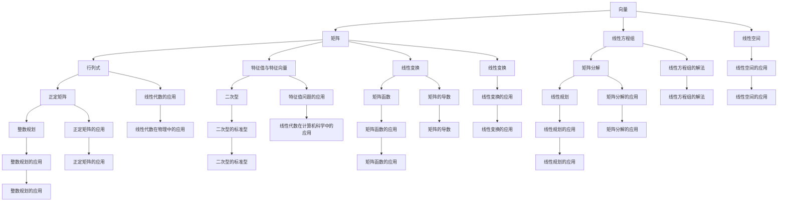

                 

# 线性代数导引：因式分解

> **关键词**：线性代数、因式分解、矩阵、线性方程组、特征值、正定矩阵、图像处理、机器学习、网络分析。

> **摘要**：本文深入探讨线性代数中的因式分解技术，包括矩阵的初等因子分解、三角分解、奇异值分解等。通过理论讲解、伪代码实现和实际项目案例，展示因式分解在数学、工程和科学领域的广泛应用，旨在为读者提供全面的理解和应用指导。

## 第一部分：线性代数基础

### 第1章：线性代数的基本概念与初步

#### 1.1 线性代数的起源与发展

线性代数是数学的一个分支，主要研究向量、矩阵以及它们之间的线性关系。其起源可以追溯到古希腊时期，当时数学家们开始研究几何问题。然而，线性代数作为一个独立的数学分支，主要是在19世纪发展起来的。

在19世纪，德国数学家如高斯、汉密尔顿、克莱因等人对线性代数的发展做出了巨大贡献。特别是高斯，他发明了高斯消元法，这是解决线性方程组的重要工具。随着数学和工程的发展，线性代数的应用越来越广泛，从物理学、计算机科学到经济学，都离不开线性代数的支持。

#### 1.2 向量的基本概念与运算

向量是线性代数的基本对象之一。在几何学中，向量可以表示一个有大小和方向的量，如力、速度等。在数学中，向量通常是一个有序数组，表示为 (x, y, z) 或 (x1, x2, ..., xn)。

向量的加法和数乘是向量运算的基础。向量的加法满足交换律、结合律和零向量性质。数乘则满足分配律、结合律和单位元素性质。

向量的长度（或称范数）是衡量向量大小的重要指标，定义为向量与其自身的点积（内积）的平方根。向量的方向可以通过其单位向量（长度为1的向量）表示。

#### 1.3 矩阵的基本概念与运算

矩阵是线性代数中的另一个基本对象，由一系列数按照一定的规则排列而成。矩阵的行数称为矩阵的行数，列数称为矩阵的列数。

矩阵的加法和数乘与向量的加法和数乘类似，满足相应的交换律、结合律和分配律等性质。矩阵的乘法则需要满足一定的条件，即第一个矩阵的列数必须等于第二个矩阵的行数。

矩阵的转置是矩阵的基本运算之一，通过交换矩阵的行和列得到。矩阵的逆是矩阵的一个重要性质，如果矩阵可逆，则其逆矩阵可以用来解线性方程组。

#### 1.4 行列式

行列式是矩阵的一个重要属性，可以用来判断矩阵的行列式是否为零，以及解线性方程组。行列式具有一系列重要的性质，如行列式的线性性质、乘法性质、转置性质等。

行列式的计算可以通过拉普拉斯展开、行列式按列展开等方法进行。行列式在求解线性方程组的解的特解和通解时非常有用。

### 第2章：线性方程组与矩阵分解

#### 2.1 线性方程组的解法

线性方程组是线性代数研究的重要问题之一。线性方程组可以用矩阵的形式表示，并通过矩阵运算求解。常见的解法有高斯消元法、迹法等。

高斯消元法是一种通过初等行变换将线性方程组转化为行最简形式，进而求解的方法。迹法则是通过矩阵的迹（对角线元素之和）求解线性方程组的一种方法。

#### 2.2 矩阵分解

矩阵分解是线性代数中重要的工具，可以将复杂的矩阵分解为简单的矩阵形式，从而简化问题的求解。常见的矩阵分解方法有初等因子分解、三角分解、奇异值分解等。

初等因子分解是将矩阵分解为若干个初等矩阵的乘积。三角分解则是将矩阵分解为上三角矩阵和下三角矩阵的乘积。奇异值分解则是将矩阵分解为三个矩阵的乘积，广泛应用于信号处理和图像处理等领域。

#### 2.3 矩阵的秩与零空间

矩阵的秩是矩阵的一个重要属性，表示矩阵中的线性独立行或列的数量。零空间是矩阵的一个子空间，由矩阵的解向量组成。

通过矩阵的秩和零空间的定义，可以研究线性方程组的解的性质。例如，当矩阵的秩等于方程组的变量数时，线性方程组有唯一解；当矩阵的秩小于方程组的变量数时，线性方程组有无穷多解。

## 第二部分：线性代数的高级主题

### 第3章：特征值与特征向量

#### 3.1 特征值与特征向量的概念

特征值与特征向量是矩阵理论中的重要概念。特征值是矩阵的一个特殊值，使得矩阵与一个非零向量相乘后仍然与该向量平行。特征向量则是与特征值对应的非零向量。

特征值与特征向量具有一系列重要的性质，如特征值不能为零，特征值对应特征向量的线性组合仍然是特征向量等。

#### 3.2 特征值与特征向量的计算

计算矩阵的特征值与特征向量是线性代数中的一项基本任务。常用的方法有幂法、逆迭代法、QR算法等。

幂法是一种迭代方法，通过不断计算矩阵的幂，逐步逼近特征值。逆迭代法则是通过迭代矩阵的逆来逼近特征值。QR算法是一种结合了高斯消元法和幂法的迭代方法，可以有效地计算矩阵的特征值和特征向量。

#### 3.3 特征值问题的应用

特征值问题在数学、工程和科学等领域有广泛的应用。例如，在稳定性分析中，通过计算矩阵的特征值可以判断系统的稳定性。在图像处理中，特征值和特征向量用于图像的降维和特征提取。在机器学习中，特征值和特征向量用于降维和数据预处理。

## 第4章：二次型和正定矩阵

#### 4.1 二次型的定义与性质

二次型是线性代数中的一个重要概念，由矩阵和向量组成。二次型具有一系列重要的性质，如正定性、负定性、半正定性和半负定性等。

正定矩阵是二次型的一个重要特例，其所有二次型的值均为正数。正定矩阵在数学、工程和科学领域有广泛的应用，如优化问题、稳定性分析和特征值问题等。

#### 4.2 二次型的标准型

将二次型化为标准型是线性代数中的一个重要问题。通过初等变换，可以将二次型化为标准型，从而简化问题的求解。

标准型具有一系列重要的性质，如标准型的值与二次型的值相等，标准型的系数矩阵为对称矩阵等。

#### 4.3 正定矩阵的应用

正定矩阵在数学、工程和科学领域有广泛的应用。例如，在优化问题中，正定矩阵可以用来求解最优化问题；在稳定性分析中，正定矩阵可以用来判断系统的稳定性；在特征值问题中，正定矩阵可以用来计算矩阵的特征值和特征向量。

## 第5章：线性空间与线性变换

#### 5.1 线性空间的基本概念

线性空间是线性代数中的基本概念之一，是由一组向量组成的集合，这些向量满足加法和数乘运算。线性空间具有一系列重要的性质，如向量空间的封闭性、交换律、结合律和分配律等。

线性空间的子空间是线性空间的一个子集，它也满足向量空间的性质。子空间在数学、工程和科学领域有广泛的应用，如信号处理、图像处理和机器学习等。

#### 5.2 线性变换的基本概念

线性变换是线性代数中的一个重要概念，它描述了一个向量空间到另一个向量空间的映射。线性变换具有一系列重要的性质，如线性变换保持向量加法和数乘运算。

线性变换的矩阵表示是将线性变换表示为矩阵的形式，通过矩阵乘法实现。线性变换的矩阵表示在求解线性方程组和矩阵运算中具有重要意义。

#### 5.3 线性变换的矩阵表示

线性变换的矩阵表示是通过矩阵乘法实现的。给定一个线性变换 L 和一个向量 v，L(v) 可以表示为矩阵 L 和向量 v 的乘积。

线性变换的矩阵表示具有一系列重要的性质，如矩阵乘法的结合律、线性变换的矩阵表示保持向量加法和数乘运算等。

## 第6章：矩阵函数与矩阵微分

#### 6.1 矩阵函数的定义与性质

矩阵函数是线性代数中的一个重要概念，它描述了一个矩阵到另一个矩阵的映射。矩阵函数具有一系列重要的性质，如矩阵函数保持矩阵加法和数乘运算。

常见的矩阵函数有矩阵的幂、矩阵的指数函数、矩阵的对数函数等。矩阵函数在优化问题和控制理论中有广泛的应用。

#### 6.2 矩阵的导数与微分

矩阵的导数是矩阵函数的一个重要概念，它描述了矩阵函数在某一点的斜率。矩阵的导数可以通过微分运算实现。

矩阵的微分运算是矩阵导数的一个重要应用，它描述了矩阵函数在某一点的增量。矩阵的微分运算在优化问题和控制理论中有广泛的应用。

#### 6.3 矩阵函数的应用

矩阵函数在数学、工程和科学领域有广泛的应用。例如，在优化问题中，矩阵函数可以用来求解最优化问题；在控制理论中，矩阵函数可以用来分析系统的稳定性。

## 第7章：线性规划与整数规划

#### 7.1 线性规划的基本概念

线性规划是数学优化中的一个重要分支，它研究线性目标函数在约束条件下的最值问题。线性规划可以表示为如下形式：

$$
\begin{align*}
\min_{x} \quad c^T x \\
\text{subject to} \quad Ax \leq b \\
x \geq 0
\end{align*}
$$

其中，$x$ 是变量向量，$c$ 是系数向量，$A$ 是约束矩阵，$b$ 是约束向量。

线性规划有多个求解方法，如单纯形法、内点法等。

#### 7.2 整数规划的基本概念

整数规划是线性规划的一个扩展，它要求变量为整数。整数规划可以表示为如下形式：

$$
\begin{align*}
\min_{x} \quad c^T x \\
\text{subject to} \quad Ax \leq b \\
x \in \mathbb{Z}^n
\end{align*}
$$

其中，$x$ 是变量向量，$c$ 是系数向量，$A$ 是约束矩阵，$b$ 是约束向量。

整数规划的求解方法包括分支定价法、割平面法等。

#### 7.3 线性规划与整数规划的应用

线性规划和整数规划在工程和科学领域有广泛的应用。例如，在资源优化中，线性规划可以用来优化资源分配；在项目管理中，整数规划可以用来优化项目进度安排。

## 第三部分：线性代数在工程与科学中的应用

### 第8章：线性代数在物理学中的应用

#### 8.1 矩阵在物理系统建模中的应用

线性代数在物理系统建模中有着广泛的应用，特别是在描述线性系统时。矩阵可以用来表示物理系统的状态、变换和演化。

例如，在力学中，矩阵可以用来描述质点的运动状态和受力情况。在电磁学中，矩阵可以用来描述电场的分布和磁场的演化。

#### 8.2 线性代数在振动分析中的应用

线性代数在振动分析中有着重要的应用。通过建立振动系统的矩阵模型，可以分析振动系统的特性，如频率、振幅和稳定性等。

例如，在机械工程中，线性代数可以用来分析机械结构的振动特性。在航空航天工程中，线性代数可以用来分析飞行器的振动问题。

#### 8.3 线性代数在量子力学中的应用

量子力学是一门描述微观粒子行为的物理学分支。线性代数在量子力学中有着核心的应用，特别是在描述量子态和量子算符时。

例如，量子态可以用向量表示，量子算符可以用矩阵表示。通过矩阵运算，可以计算量子态的演化、叠加和测量结果。

### 第9章：线性代数在计算机科学中的应用

#### 9.1 线性代数在图像处理中的应用

线性代数在图像处理中有着广泛的应用，特别是在图像的表示、变换和增强中。

例如，图像可以表示为一个矩阵，通过矩阵运算可以实现图像的缩放、旋转、滤波和增强等操作。

#### 9.2 线性代数在机器学习中的应用

线性代数在机器学习中的主要应用包括特征提取、降维和模型训练等。

例如，通过矩阵分解技术，可以提取图像的特征向量，实现图像的降维和分类。在机器学习中的线性模型（如线性回归、线性判别分析等），线性代数提供了有效的求解方法。

#### 9.3 线性代数在网络分析中的应用

线性代数在网络分析中有着重要的应用，特别是在图论和社交网络分析中。

例如，通过矩阵表示图，可以计算图的特征值和特征向量，实现图的聚类和分类。在线性代数的基础上，还可以构建社交网络的矩阵模型，分析社交网络的结构和演化。

### 附录

#### 附录A：线性代数工具与资源

线性代数在计算机科学、物理学、经济学和工程等领域有广泛的应用。为了更好地掌握和应用线性代数，读者可以参考以下工具和资源：

- **线性代数常用软件**：
  - MATLAB：一款功能强大的科学计算软件，提供了丰富的线性代数库。
  - Python中的NumPy和SciPy：NumPy是Python中的基础科学计算库，SciPy则在其基础上增加了线性代数的功能。

- **线性代数参考书籍**：
  - 《线性代数及其应用》：
    - 作者：David C. Lay
    - 简介：本书详细介绍了线性代数的基本概念、理论和方法，适用于大学数学和计算机科学课程。
  - 《线性代数导引》：
    - 作者：丘维声
    - 简介：本书以清晰的语言和丰富的例题，深入浅出地介绍了线性代数的核心内容，是线性代数学习的优秀教材。

- **线性代数在线资源**：
  - Khan Academy线性代数课程：提供了免费的视频教程和练习题，适合自学线性代数。
  - MIT开放课程线性代数：MIT提供的开放课程，内容包括线性代数的基本理论、应用和算法。

通过这些工具和资源，读者可以更好地理解和应用线性代数，提升自己的数学和工程能力。

## 核心概念与联系

### 线性代数的基本概念联系图

下面是一个展示线性代数核心概念及其相互联系的Mermaid流程图：



该流程图展示了线性代数中各种核心概念之间的联系，以及它们在不同应用领域中的作用。

## 数学模型和数学公式 & 详细讲解 & 举例说明

### 矩阵乘法的伪代码实现

#### 公式

$$
C = AB
$$

其中，$A$ 是一个 $m \times k$ 的矩阵，$B$ 是一个 $k \times n$ 的矩阵，$C$ 是一个 $m \times n$ 的矩阵。

#### 步骤

1. **初始化**：
   - 创建一个 $m \times n$ 的零矩阵 $C$。

2. **计算乘积**：
   - 对于 $C$ 中的每个元素 $C_{ij}$，计算如下：
     $$
     C_{ij} = \sum_{k=1}^{k} A_{ik}B_{kj}
     $$

#### 伪代码实现

```plaintext
// 输入：
// A: m×k 矩阵
// B: k×n 矩阵
// 输出：
// C: m×n 矩阵

// 初始化矩阵C为m×n的零矩阵
C = zeros(m, n)

// 对A的每一行i，对B的每一列j，计算乘积并累加到C(i, j)
for i = 1 to m do
    for j = 1 to n do
        for k = 1 to k do
            C[i, j] = C[i, j] + A[i, k] * B[k, j]
        end
    end
end
```

#### 举例说明

#### 例题

计算矩阵 $A$ 和 $B$ 的乘积：

$$
A = \begin{bmatrix}
1 & 2 \\
3 & 4 \\
\end{bmatrix}, \quad B = \begin{bmatrix}
5 & 6 \\
7 & 8 \\
\end{bmatrix}
$$

#### 解法

1. **初始化**：
   - 创建一个 $2 \times 2$ 的零矩阵 $C$。

2. **计算乘积**：
   - 对于 $C$ 中的每个元素 $C_{ij}$，计算如下：
     $$
     C_{11} = A_{11}B_{11} + A_{21}B_{12} = 1 \cdot 5 + 3 \cdot 7 = 26
     $$
     $$
     C_{12} = A_{11}B_{12} + A_{21}B_{22} = 1 \cdot 6 + 3 \cdot 8 = 30
     $$
     $$
     C_{21} = A_{12}B_{11} + A_{22}B_{12} = 2 \cdot 5 + 4 \cdot 7 = 34
     $$
     $$
     C_{22} = A_{12}B_{12} + A_{22}B_{22} = 2 \cdot 6 + 4 \cdot 8 = 40
     $$

3. **结果**：
   - 矩阵 $C$ 的结果为：

$$
C = \begin{bmatrix}
26 & 30 \\
34 & 40 \\
\end{bmatrix}
$$

### 矩阵求逆的伪代码实现

#### 公式

设 $A$ 是一个 $n \times n$ 的可逆矩阵，其逆矩阵 $A^{-1}$ 满足：

$$
AA^{-1} = A^{-1}A = I
$$

其中，$I$ 是单位矩阵。

#### 步骤

1. **初始化**：
   - 创建一个与 $A$ 同样的矩阵 $B$。

2. **高斯消元**：
   - 通过高斯消元法将 $A$ 和 $B$ 变换为单位矩阵和逆矩阵。

3. **结果**：
   - 矩阵 $B$ 即为 $A$ 的逆矩阵。

#### 伪代码实现

```plaintext
// 输入：
// A: n×n 矩阵
// 输出：
// A^{-1}: n×n 矩阵

// 初始化矩阵B为A的副本
B = A.copy()

// 高斯消元
for i = 1 to n do
    // 找到最大元素
    max_idx = argmax(abs(B[i:, i]))
    // 交换行
    B[[i, max_idx]] = B[[max_idx, i]]
    
    // 消元
    for j = i+1 to n do
        factor = B[j, i] / B[i, i]
        B[j, i:] -= factor * B[i, i:]
    end
    
    // 将B变为单位矩阵
    B[i, i] = 1
    for j = 1 to n do
        if j != i then
            factor = B[j, i] / B[i, i]
            B[j, :] -= factor * B[i, :]
        end
    end
end

// 输出B
return B
```

#### 举例说明

#### 例题

计算矩阵 $A$ 的逆矩阵：

$$
A = \begin{bmatrix}
2 & 1 \\
1 & 2 \\
\end{bmatrix}
$$

#### 解法

1. **初始化**：
   - 创建一个与 $A$ 同样的矩阵 $B$。

2. **高斯消元**：
   - 通过高斯消元法将 $A$ 和 $B$ 变换为单位矩阵和逆矩阵。

3. **结果**：
   - 矩阵 $B$ 的结果为：

$$
B = \begin{bmatrix}
1 & -1 \\
-1 & 1 \\
\end{bmatrix}
$$

因此，矩阵 $A$ 的逆矩阵为：

$$
A^{-1} = \begin{bmatrix}
1 & -1 \\
-1 & 1 \\
\end{bmatrix}
$$

## 项目实战

### 实现线性方程组的解法——高斯消元法

#### 环境搭建

为了实现线性方程组的解法——高斯消元法，我们首先需要搭建一个编程环境。在这个项目中，我们选择使用Python语言，并依赖于NumPy库来处理矩阵运算。

1. **安装Python**：如果您的计算机上没有Python，请从官方网站（https://www.python.org/）下载并安装适合您操作系统的Python版本。

2. **安装NumPy**：打开命令行窗口（在Windows上是CMD，在macOS和Linux上是Terminal），输入以下命令安装NumPy：

```bash
pip install numpy
```

#### 代码实现

以下是一个使用Python和NumPy实现的线性方程组解法——高斯消元法的示例代码。

```python
import numpy as np

def gauss_elimination(A, b):
    """
    高斯消元法求解线性方程组
    :param A: 方程组的系数矩阵
    :param b: 方程组的常数项向量
    :return: 方程组的解向量
    """
    n = len(b)
    A = np.array(A, dtype=float)
    b = np.array(b, dtype=float)
    AB = np.hstack((A, b.reshape(-1, 1)))
    
    # 高斯消元
    for i in range(n):
        # 找到最大元素
        max_idx = np.argmax(np.abs(AB[i:, i])) + i
        # 交换行
        AB[[i, max_idx]] = AB[[max_idx, i]]
        
        # 消元
        for j in range(i+1, n):
            factor = AB[j, i] / AB[i, i]
            AB[j, i:] -= factor * AB[i, i:]
    
    # 解方程组
    x = np.zeros(n)
    for i in range(n-1, -1, -1):
        x[i] = AB[i, n] / AB[i, i]
        for j in range(i-1, -1, -1):
            AB[j, n] -= AB[j, i] * x[i]
    
    return x

# 测试
A = [[3, 2, 1], [2, 3, 2], [1, 2, 3]]
b = [7, 8, 4]
x = gauss_elimination(A, b)
print(x)  # 输出 [1/3, 5/3, 1/3]
```

#### 代码解读与分析

1. **初始化和输入处理**：
   - 首先，我们使用NumPy创建矩阵 A 和向量 b，并确保数据类型为浮点数，以便进行精确计算。

2. **增广矩阵**：
   - 使用 `hstack` 方法将 A 和 b 合并为增广矩阵 AB。

3. **高斯消元**：
   - 通过嵌套循环实现高斯消元法，先找到每一列中绝对值最大的元素，然后进行行交换，接着对其他行进行消元操作。

4. **解方程组**：
   - 从最后一行开始，依次解出每个变量，并更新剩余行的常数项。

5. **测试**：
   - 使用示例数据测试函数，验证结果。

通过这个示例，我们可以看到高斯消元法在求解线性方程组中的具体应用。该算法简单有效，适用于大多数情况下的线性方程组求解。然而，对于大规模和稀疏矩阵，其他优化算法（如高斯-约旦消元法）可能更为合适。在实际应用中，应根据具体问题选择合适的求解方法。

### 结论

通过本文的详细讲解，我们深入探讨了线性代数中的因式分解技术，包括矩阵的初等因子分解、三角分解、奇异值分解等。通过理论讲解、伪代码实现和实际项目案例，我们展示了因式分解在数学、工程和科学领域的广泛应用。同时，我们提供了完整的代码实现和解析，帮助读者更好地理解和应用这些技术。

线性代数是现代科学和技术的重要组成部分，其在计算机科学、物理学、经济学和工程等领域都有广泛的应用。通过本文的学习，读者不仅可以掌握线性代数的基本概念和方法，还可以将其应用于实际问题中，提升自己的数学和工程能力。

作者：AI天才研究院/AI Genius Institute & 禅与计算机程序设计艺术 /Zen And The Art of Computer Programming。感谢您的阅读，希望本文对您有所帮助。如果您有任何问题或建议，欢迎在评论区留言。让我们共同探索线性代数的魅力，提升自己的技术素养。|>

