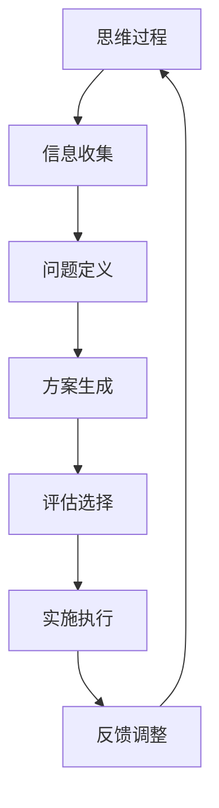
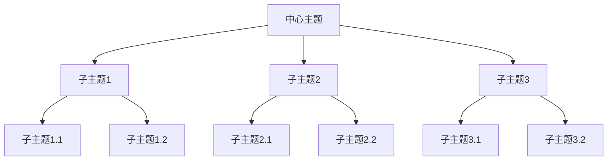
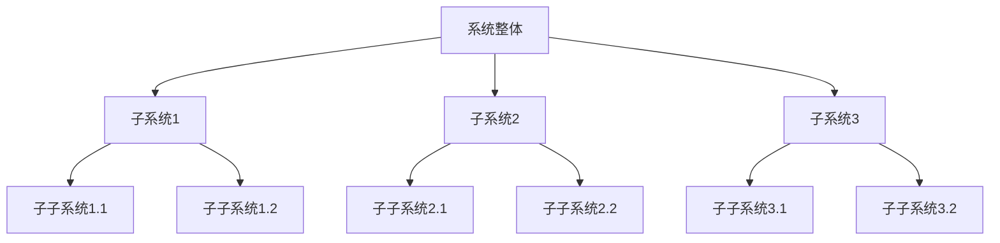
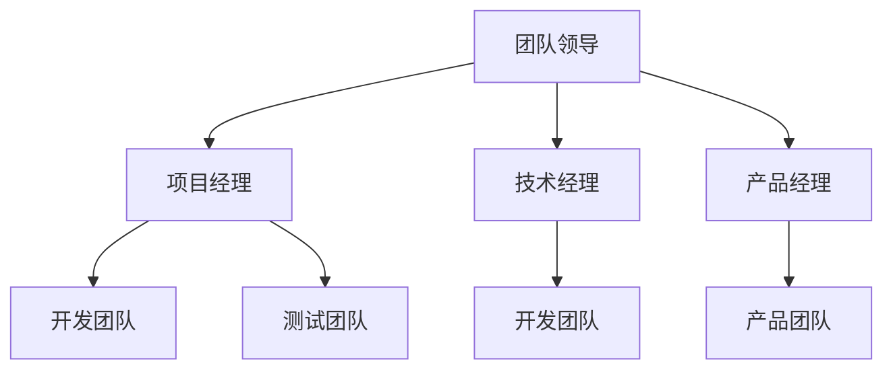

                 

# 《结构化思维的力量：从思维到行动》

## 摘要

结构化思维，作为现代认知科学的重要成果，已经广泛应用于各个领域，从商业决策到项目管理，再到团队协作，它都展现出强大的力量。本文将深入探讨结构化思维的起源与发展、核心概念与特征、应用领域与方法、关键能力与提升策略，以及其实践应用与未来展望。通过一系列的案例分析，我们将展示结构化思维在个人成长、团队管理和商业决策中的具体应用，同时讨论其在跨学科领域的潜在价值。最后，我们将总结结构化思维的实践要领，为读者提供持续提升的路径。希望通过本文，读者能够深刻理解结构化思维的力量，并将其有效应用于日常生活和工作中。

## 《结构化思维的力量：从思维到行动》目录大纲

### 第一部分：结构化思维概述

#### 第1章：结构化思维的起源与发展
1.1 结构化思维的起源
1.2 结构化思维的发展历程
1.3 结构化思维的重要性

#### 第2章：结构化思维的核心概念
2.1 思维与结构
2.2 结构化思维的特征
2.3 结构化思维的基本要素

#### 第3章：结构化思维在各个领域的应用
3.1 商业决策
3.2 项目管理
3.3 团队协作

#### 第4章：结构化思维的工具与方法
4.1 思维导图
4.2 系统思维
4.3 故事思维

#### 第5章：结构化思维的关键能力
5.1 概念化能力
5.2 分析能力
5.3 解决问题的能力

#### 第6章：结构化思维的实践应用
6.1 从思维到行动的路径
6.2 案例分析
6.3 实践方法与技巧

### 第二部分：结构化思维的深入探讨

#### 第7章：结构化思维的障碍与克服
7.1 结构化思维的障碍
7.2 克服障碍的策略

#### 第8章：结构化思维的优化与提升
8.1 结构化思维的优化
8.2 提升结构化思维的方法

#### 第9章：结构化思维与创造力
9.1 结构化思维与创造力的关系
9.2 创造力的结构化思维方法

#### 第10章：结构化思维的未来展望
10.1 结构化思维的发展趋势
10.2 结构化思维的未来应用

### 第三部分：结构化思维的实战案例

#### 第11章：结构化思维在个人成长中的应用
11.1 从学生到职场人的转变
11.2 个人规划与目标设定
11.3 自我提升与职业发展

#### 第12章：结构化思维在团队管理中的应用
12.1 团队结构与沟通
12.2 团队目标设定与实施
12.3 团队冲突与解决

#### 第13章：结构化思维在商业决策中的应用
13.1 商业模式分析
13.2 市场营销策略
13.3 企业风险与应对策略

#### 第14章：结构化思维的跨学科应用
14.1 结构化思维在法律领域的应用
14.2 结构化思维在医学领域的应用
14.3 结构化思维在艺术领域的应用

### 附录

#### 附录A：结构化思维的参考资料
A.1 相关书籍推荐
A.2 在线资源与工具

#### 附录B：结构化思维练习题
B.1 练习题1：分析一个案例
B.2 练习题2：制定一个行动计划
B.3 练习题3：团队协作练习

### 第15章：结构化思维的持续实践
15.1 持续实践的重要性
15.2 如何持续实践结构化思维
15.3 持续实践的效果评估

### 第16章：结构化思维的总结与展望
16.1 总结
16.2 展望
16.3 结语

## 第一部分：结构化思维概述

### 第1章：结构化思维的起源与发展

#### 1.1 结构化思维的起源

结构化思维，顾名思义，是指将复杂的思维过程分解为有序、结构化的步骤，以实现高效、准确的思考和分析。其起源可以追溯到古希腊时期，当时的哲学家们通过逻辑推理和形式化论证来探索世界的本质。随着时代的演进，结构化思维逐渐融入数学、物理学、计算机科学等领域，成为现代认知科学的重要基石。

在20世纪，结构化思维得到了进一步的发展。著名心理学家乔治·米勒（George A. Miller）提出了“信息加工理论”，强调了人类认知过程中的信息组织与处理。与此同时，计算机科学的兴起也为结构化思维提供了新的工具和方法，如编程语言、数据库系统等。

#### 1.2 结构化思维的发展历程

1. **早期阶段**：20世纪中叶，结构化思维主要应用于工程和技术领域。例如，在软件工程中，结构化编程成为解决复杂问题的重要手段。

2. **成熟阶段**：20世纪末至21世纪初，结构化思维逐渐扩展到商业和管理领域。商业管理学者通过引入逻辑框架、决策树等工具，提升了企业在复杂环境中的应变能力。

3. **现代应用**：随着人工智能和大数据技术的发展，结构化思维在数据分析和智能决策中的应用日益广泛。例如，通过机器学习算法，可以自动提取结构化思维模式，用于自动化决策和优化。

#### 1.3 结构化思维的重要性

结构化思维的重要性体现在以下几个方面：

1. **提升工作效率**：通过有序的思考过程，可以快速定位问题，找到解决方案，提高工作效率。

2. **增强决策能力**：结构化思维可以帮助决策者全面分析问题，评估各种方案的风险和收益，做出更为明智的决策。

3. **促进团队协作**：结构化思维为团队沟通提供了共同的框架，有助于团队成员协同工作，提高团队整体效能。

4. **培养创新思维**：结构化思维不仅有助于解决问题，还可以激发创新思维，通过有序的思考过程，产生新的创意和见解。

#### 1.4 核心概念与联系

为了更好地理解结构化思维，我们可以借助Mermaid流程图来展示其核心概念和联系。以下是一个简化的结构化思维流程图：



在这个流程图中，思维过程是一个闭环系统，通过信息收集、问题定义、方案生成、评估选择、实施执行和反馈调整等步骤，不断迭代优化，实现高效的思考和行动。

### 第2章：结构化思维的核心概念

#### 2.1 思维与结构

思维是人类认知活动的重要表现，是大脑对外界信息的接收、处理和反馈过程。而结构化思维则是在思维过程中引入结构性和有序性的思维方式。具体来说，结构化思维包括以下几个方面：

1. **有序性**：结构化思维强调思维的有序性，即将问题分解为若干个部分，逐步解决。这种有序性有助于提高思考的效率和准确性。

2. **层次性**：结构化思维将问题分层处理，从宏观到微观，逐步深入。每一层都有明确的子问题和解决方案，有助于全面分析问题。

3. **逻辑性**：结构化思维强调思维的逻辑性，通过逻辑推理和论证，确保思考的连贯性和一致性。

4. **系统性**：结构化思维将问题视为一个系统，关注各个部分之间的相互作用和影响。这种系统性有助于全面考虑问题的各个方面。

#### 2.2 结构化思维的特征

结构化思维具有以下几个显著特征：

1. **清晰性**：结构化思维使思维过程变得清晰，能够明确问题、目标和解决方案，提高沟通和理解的效果。

2. **可操作性**：结构化思维提供了具体的操作步骤和方法，使问题解决过程具有可操作性，便于实施和评估。

3. **可重复性**：结构化思维可以多次重复使用，通过不断优化和调整，提高思维效率和效果。

4. **可扩展性**：结构化思维可以应用于不同领域和问题，具有广泛的适用性。

#### 2.3 结构化思维的基本要素

结构化思维的基本要素包括以下几个方面：

1. **问题定义**：明确问题的本质和关键点，是结构化思维的第一步。只有准确界定问题，才能找到有效的解决方案。

2. **信息收集**：收集与问题相关的各种信息，包括事实、数据、观点等，为后续分析提供依据。

3. **方案生成**：在充分了解问题和信息的基础上，生成多种可能的解决方案。方案应具有可行性、可操作性和创新性。

4. **评估选择**：对生成的方案进行评估和比较，选择最优的方案进行实施。评估标准应包括方案的效果、成本、风险等因素。

5. **实施执行**：将选定的方案付诸实施，确保各项任务的顺利完成。实施过程应注重细节和执行力的提升。

6. **反馈调整**：在实施过程中，及时收集反馈信息，根据实际情况调整方案和策略。反馈调整是优化思维过程的重要环节。

#### 2.4 结构化思维的应用场景

结构化思维在多个领域具有广泛的应用场景：

1. **商业决策**：在商业环境中，结构化思维有助于企业进行市场分析、战略规划和风险管理。

2. **项目管理**：在项目管理中，结构化思维有助于明确项目目标、分解任务、制定计划和监控进度。

3. **团队协作**：在团队协作中，结构化思维有助于团队明确目标、分配任务、沟通协作和解决冲突。

4. **科学研究**：在科学研究中，结构化思维有助于研究人员明确研究问题、设计实验方案、分析数据和撰写报告。

5. **个人成长**：在个人成长过程中，结构化思维有助于明确个人目标、制定学习计划、提升自我管理和执行力。

#### 2.5 结构化思维的优势

结构化思维具有以下几个优势：

1. **高效性**：结构化思维通过有序、系统的思考过程，能够快速定位问题，找到解决方案，提高工作效率。

2. **准确性**：结构化思维强调逻辑推理和论证，确保思考的连贯性和一致性，提高思考的准确性。

3. **可操作性**：结构化思维提供具体的操作步骤和方法，使问题解决过程具有可操作性，便于实施和评估。

4. **适应性**：结构化思维可以应用于不同领域和问题，具有广泛的适用性。

5. **持续优化**：结构化思维可以通过反馈调整不断优化，提高思维过程和效果的持续改进。

### 第3章：结构化思维在各个领域的应用

#### 3.1 商业决策

在商业环境中，结构化思维是一种非常重要的决策工具。它可以帮助企业领导者更清晰地分析市场状况、评估投资机会和制定战略计划。

1. **市场分析**：
   - **收集信息**：首先，需要收集与市场相关的信息，包括市场趋势、竞争对手情况、消费者需求等。
   - **分析市场**：通过分析收集到的信息，识别市场机会和威胁，为后续决策提供依据。

2. **投资评估**：
   - **确定项目**：在分析市场后，需要确定哪些项目或业务线具有投资价值。
   - **评估风险**：对每个项目进行风险评估，包括财务风险、市场风险和操作风险等。
   - **选择最优方案**：根据评估结果，选择最具投资价值的方案。

3. **战略规划**：
   - **明确目标**：在制定战略规划时，需要明确企业的长期和短期目标。
   - **制定计划**：根据目标，制定具体的行动计划和资源分配方案。
   - **执行监控**：在执行过程中，对计划进行监控和调整，确保目标的实现。

#### 3.2 项目管理

在项目管理中，结构化思维可以帮助项目经理更高效地规划和管理项目。

1. **项目规划**：
   - **明确目标**：首先要明确项目的目标和范围。
   - **制定计划**：根据目标，制定详细的项目计划，包括任务分解、时间安排和资源分配。

2. **任务分配**：
   - **分解任务**：将项目任务分解为更小的子任务，便于管理和执行。
   - **分配资源**：根据任务的特点和需求，分配适当的资源，包括人员、设备和资金等。

3. **进度监控**：
   - **监控进度**：定期检查项目进度，确保任务按时完成。
   - **调整计划**：根据实际情况，及时调整项目计划和资源分配，确保项目目标的实现。

4. **风险控制**：
   - **识别风险**：识别项目可能面临的风险，包括技术风险、市场风险和操作风险等。
   - **制定策略**：针对识别出的风险，制定相应的应对策略，包括预防措施和应急计划。

#### 3.3 团队协作

在团队协作中，结构化思维有助于团队成员更好地理解项目目标、明确各自职责和协同工作。

1. **目标明确**：
   - **共同目标**：确保团队成员都明确项目的目标，并围绕目标开展工作。
   - **个人目标**：在共同目标的基础上，设定个人的目标和职责，确保每个团队成员都清楚自己的任务和责任。

2. **沟通协作**：
   - **定期会议**：定期召开团队会议，讨论项目进展、问题和解决方案。
   - **信息共享**：确保团队成员之间能够及时分享信息和资源，提高协作效率。

3. **任务分配**：
   - **合理分配**：根据团队成员的能力和特长，合理分配任务，确保任务的高效完成。
   - **协同工作**：鼓励团队成员之间相互支持和协作，共同完成任务。

4. **冲突解决**：
   - **冲突识别**：及时发现团队内部的冲突，包括沟通不畅、任务分配不均等问题。
   - **解决问题**：通过沟通和协商，找到解决问题的方法，确保团队目标的实现。

### 第4章：结构化思维的工具与方法

结构化思维不仅仅是思维方式的改变，还需要借助一系列工具和方法来具体实现。以下是一些常用的结构化思维工具和方法。

#### 4.1 思维导图

思维导图是一种图形化的思维工具，它通过节点和连线将思维过程可视化，有助于梳理思路、发现关联和激发创意。以下是一个简单的思维导图示例：



通过思维导图，我们可以将复杂的信息结构化，更容易地理解和记忆。

#### 4.2 系统思维

系统思维是一种从整体和系统角度分析问题的思维方式。它强调各个部分之间的相互关系和相互作用，有助于全面考虑问题。

1. **整体观**：将问题视为一个整体，关注各个部分之间的联系和影响。
2. **动态观**：考虑问题的动态变化，分析不同阶段的问题和解决方案。
3. **层次观**：将问题分层处理，从宏观到微观，逐步深入。

以下是一个简单的系统思维模型：



通过系统思维，我们可以更全面、深入地分析问题。

#### 4.3 故事思维

故事思维是一种通过故事形式表达思维的思维方式。它有助于将抽象的概念和复杂的思维过程转化为具体、易于理解的故事，从而提高沟通和理解的效果。

1. **情境设定**：设定一个具体的情境，将思维过程置于其中。
2. **角色设定**：设定角色，明确思维过程中的参与者和主体。
3. **情节发展**：通过情节的发展，展示思维过程和问题的解决。

以下是一个简单的故事思维示例：

```
故事：小明想要减肥，他决定每天跑步和饮食控制。

情节1：小明开始跑步，感到很累，但他坚持了下来。
情节2：小明发现饮食控制很重要，他开始减少高热量食物的摄入。
情节3：经过一段时间的努力，小明的体重下降了，他感到非常开心。
```

通过故事思维，我们可以更生动、形象地表达思维过程。

### 第5章：结构化思维的关键能力

#### 5.1 概念化能力

概念化能力是结构化思维的基础，它指的是将复杂的信息抽象为基本概念和模型的能力。以下是如何提升概念化能力的几点建议：

1. **多读书**：阅读可以扩大知识面，帮助识别和理解各种概念。
2. **学习框架**：掌握各种思维框架和模型，如SWOT分析、PEST分析等，有助于概念化复杂信息。
3. **写作训练**：通过写作，将思考过程和结论转化为文字，有助于加深对概念的理解。

#### 5.2 分析能力

分析能力是结构化思维的核心，它指的是对信息进行分解、分类、比较和推理的能力。以下是如何提升分析能力的几点建议：

1. **练习思维导图**：通过绘制思维导图，可以锻炼分析能力和信息组织能力。
2. **学习逻辑推理**：掌握基本的逻辑推理方法，如归纳推理、演绎推理等，有助于提高分析能力。
3. **学习数据分析**：掌握数据分析方法，如统计分析、数据可视化等，有助于更深入地分析信息。

#### 5.3 解决问题的能力

解决问题的能力是结构化思维的应用，它指的是在面对问题时，能够迅速找到解决方案的能力。以下是如何提升解决问题能力的几点建议：

1. **多参与项目**：通过参与实际项目，可以锻炼解决问题的能力。
2. **学习问题解决框架**：如五步法（识别问题、分析问题、生成解决方案、评估解决方案和实施解决方案），有助于系统化地解决问题。
3. **学习创新思维**：通过学习创新思维方法，如头脑风暴、思维导图等，可以激发解决问题的创造力。

### 第6章：结构化思维的实践应用

#### 6.1 从思维到行动的路径

将结构化思维应用于实际工作中，需要遵循以下步骤：

1. **明确目标**：首先要明确工作目标和要求。
2. **收集信息**：收集与目标相关的各种信息，包括数据、观点和意见等。
3. **分析信息**：对收集到的信息进行分析和整理，提取关键信息。
4. **生成方案**：基于分析结果，生成多种可能的解决方案。
5. **评估选择**：对生成的方案进行评估和比较，选择最优方案。
6. **实施执行**：将选定的方案付诸实施，确保各项任务的顺利完成。
7. **反馈调整**：在实施过程中，及时收集反馈信息，根据实际情况调整方案和策略。

#### 6.2 案例分析

以下是一个结构化思维在项目管理的实际应用案例：

**项目背景**：某公司计划开发一款新的移动应用程序，以提高客户体验和满意度。

**步骤1：明确目标**
- 目标：开发一款高质量的移动应用程序，满足用户需求，提高用户满意度。

**步骤2：收集信息**
- 用户需求调查：通过问卷调查和用户访谈，收集用户对应用程序的需求和期望。
- 市场分析：分析竞争对手的应用程序，了解市场趋势和用户偏好。

**步骤3：分析信息**
- 用户需求：根据用户需求，确定应用程序的主要功能模块和用户界面设计。
- 市场分析：根据市场分析结果，确定应用程序的市场定位和目标用户群体。

**步骤4：生成方案**
- 方案1：开发一个基础版应用程序，满足核心用户需求。
- 方案2：开发一个增强版应用程序，增加更多高级功能，提升用户体验。

**步骤5：评估选择**
- 评估标准：根据成本、开发难度和市场需求，评估两种方案的可行性。
- 选择方案：选择方案2，因为它具有更高的市场竞争力。

**步骤6：实施执行**
- 任务分配：根据项目需求，分配任务给团队成员，确保任务的顺利完成。
- 开发计划：制定详细的项目开发计划，包括时间安排和资源分配。

**步骤7：反馈调整**
- 进度监控：定期检查项目进度，确保任务按时完成。
- 用户反馈：在开发过程中，收集用户反馈，根据反馈调整应用程序的设计和功能。

通过这个案例，我们可以看到结构化思维在项目管理中的实际应用，从明确目标到实施执行，每一步都经过详细的思考和规划，确保项目的成功完成。

#### 6.3 实践方法与技巧

以下是一些在日常生活中实践结构化思维的实用方法和技巧：

1. **日常任务管理**：
   - **待办事项清单**：将每天的任务列在清单上，按优先级排序，确保高效完成。
   - **时间管理**：使用时间管理工具，如番茄工作法，合理安排工作时间。

2. **决策制定**：
   - **SWOT分析**：在制定决策时，对自身优势、劣势、机会和威胁进行分析，确保决策的全面性。
   - **多方案比较**：在生成多个方案后，对方案进行详细比较，选择最优方案。

3. **学习与思考**：
   - **笔记整理**：将学习内容整理成笔记，使用思维导图等工具，帮助记忆和理解。
   - **定期反思**：定期回顾自己的学习和思考过程，总结经验教训，不断提升。

4. **团队协作**：
   - **明确目标**：确保团队成员都明确项目的目标和任务，提高协作效率。
   - **定期沟通**：定期召开团队会议，讨论项目进展和问题，确保团队成员之间的信息畅通。

### 第二部分：结构化思维的深入探讨

#### 第7章：结构化思维的障碍与克服

在实际应用中，结构化思维可能会遇到各种障碍，以下是一些常见的障碍及其克服策略：

1. **信息过载**：
   - **障碍**：在处理大量信息时，容易感到迷茫和不知所措。
   - **策略**：通过筛选和整理信息，只关注与问题相关的关键信息，避免信息过载。

2. **思维定式**：
   - **障碍**：长期形成的思维习惯和定式，使思维僵化，难以接受新的观点和解决方案。
   - **策略**：通过多读书、多交流，开阔视野，打破思维定式。

3. **缺乏耐心**：
   - **障碍**：在问题解决过程中，容易因为急于求成而忽略细节和全面性。
   - **策略**：培养耐心和细心，逐步分析和解决问题，确保思维过程的完整性。

4. **缺乏系统观**：
   - **障碍**：只关注局部问题，缺乏对整体和系统的考虑。
   - **策略**：学习系统思维，从整体和系统的角度分析问题，确保思维的全面性。

#### 第8章：结构化思维的优化与提升

为了更好地发挥结构化思维的作用，我们可以通过以下方法进行优化和提升：

1. **定期练习**：
   - **练习思维导图**：通过绘制思维导图，锻炼思维的组织和表达能力。
   - **练习系统思维**：通过模拟和练习，提高对整体和系统问题的分析能力。

2. **多学科融合**：
   - **跨学科学习**：学习不同学科的知识和方法，丰富思维内容。
   - **跨学科应用**：将不同学科的知识和方法应用于实际问题，提升思维的综合能力。

3. **持续反思**：
   - **反思思维过程**：定期回顾自己的思维过程，总结经验教训，不断优化。
   - **反思决策效果**：对决策的结果进行评估和反思，总结成功和失败的教训，提升决策能力。

4. **培养好奇心**：
   - **保持好奇心**：对未知的事物保持好奇，积极探索和思考。
   - **培养提问能力**：学会提问，从不同角度思考问题，激发创新思维。

### 第9章：结构化思维与创造力

#### 9.1 结构化思维与创造力的关系

结构化思维和创造力之间存在着密切的关系。结构化思维可以为创造力提供坚实的基础，而创造力则可以激发结构化思维的无限可能。

1. **结构化思维激发创造力**：
   - **明确目标**：结构化思维可以帮助明确创造力的目标，确保创造力的方向正确。
   - **系统分析**：结构化思维的系统分析方法可以帮助分析创造力应用的可行性和效果。

2. **创造力优化结构化思维**：
   - **创新方案**：创造力可以产生新颖的解决方案，丰富结构化思维的内容。
   - **思维拓展**：创造力可以拓展思维的范围，激发新的思维模式和方法。

#### 9.2 创造力的结构化思维方法

为了在创造力的过程中有效应用结构化思维，我们可以采用以下方法：

1. **头脑风暴**：
   - **多角度思考**：在头脑风暴过程中，从不同角度和层面思考问题，激发创造力。
   - **记录想法**：将头脑风暴过程中产生的想法记录下来，以便后续分析和筛选。

2. **思维导图**：
   - **组织思路**：使用思维导图，将创造力的思路和想法可视化，有助于梳理和拓展思路。
   - **关联思考**：通过思维导图，发现不同想法之间的关联，产生新的创意。

3. **跨学科融合**：
   - **综合知识**：将不同学科的知识和方法融合，为创造力提供丰富的素材。
   - **创新应用**：将跨学科的知识和方法应用于实际问题，产生创新的解决方案。

4. **实验验证**：
   - **实践检验**：通过实验和验证，检验创造力的可行性和效果。
   - **反馈调整**：根据实验结果，对创造力方案进行调整和优化，提高创造力应用的成功率。

### 第10章：结构化思维的未来展望

#### 10.1 结构化思维的发展趋势

随着科技的不断进步，结构化思维将继续发展和演变，未来可能呈现以下趋势：

1. **智能化**：随着人工智能技术的发展，结构化思维将更加智能化，能够自动分析和处理复杂问题。
2. **数字化**：结构化思维将越来越多地应用于数字领域，如数据分析和智能决策等。
3. **个性化**：结构化思维将更加关注个体的特点和需求，提供个性化的思维支持和解决方案。

#### 10.2 结构化思维的未来应用

在未来，结构化思维将在各个领域发挥更重要的作用：

1. **商业领域**：企业将利用结构化思维进行市场分析、战略规划和风险管理，提高竞争力。
2. **教育领域**：教育机构将利用结构化思维培养学生的思维能力，提高教育质量。
3. **医疗领域**：医生和研究人员将利用结构化思维进行疾病诊断和治疗，提高医疗水平。
4. **艺术领域**：艺术家和设计师将利用结构化思维进行创意创作，推动艺术创新。

### 第三部分：结构化思维的实战案例

#### 第11章：结构化思维在个人成长中的应用

在个人成长过程中，结构化思维可以帮助我们更清晰地设定目标、制定计划、提升自我管理能力。

#### 11.1 从学生到职场人的转变

**案例背景**：小张是一名大学生，即将面临毕业和就业。他希望通过结构化思维，为自己规划一条清晰的职业发展道路。

**步骤1：明确目标**
- 目标：找到一份与专业对口、具有发展前景的工作，成为一名优秀的职场人。

**步骤2：收集信息**
- 市场需求：了解自己专业的就业市场，包括岗位需求、薪资水平和发展前景。
- 个人能力：评估自己的技能和潜力，确定自己具备的竞争优势。

**步骤3：分析信息**
- 目标匹配：分析市场需求和个人能力，确定自己的职业方向。
- 能力提升：根据职业方向，制定提升个人能力的学习计划。

**步骤4：生成方案**
- 方案1：参加实习，积累工作经验。
- 方案2：考取相关证书，提高竞争力。
- 方案3：积极参与社团活动，锻炼团队协作能力。

**步骤5：评估选择**
- 评估标准：根据个人兴趣、市场需求和个人能力，评估不同方案的可行性。
- 选择方案：选择方案2和方案3，因为它们更符合小张的职业发展目标。

**步骤6：实施执行**
- 实习计划：参加实习，积累工作经验。
- 学习计划：考取相关证书，提高竞争力。
- 社团活动：积极参与社团活动，锻炼团队协作能力。

**步骤7：反馈调整**
- 实习反馈：根据实习经历，调整职业规划和学习计划。
- 学习反馈：根据考试成绩，调整学习方法和策略。
- 社团反馈：根据社团活动经验，总结经验教训，不断提升自我。

通过这个案例，我们可以看到结构化思维在个人职业规划中的实际应用，从明确目标到实施执行，每一步都经过详细的思考和规划，确保目标的实现。

#### 11.2 个人规划与目标设定

个人规划与目标设定是结构化思维在个人成长中的重要应用。以下是一个具体的案例：

**案例背景**：小李是一名职场新人，希望在未来五年内实现职业晋升，成为一名中层管理者。

**步骤1：明确目标**
- 目标：在未来五年内，晋升为部门经理。

**步骤2：收集信息**
- 职业路径：了解公司晋升机制、所需技能和经验要求。
- 个人能力：评估自己的专业技能、管理能力和人际关系。

**步骤3：分析信息**
- 职业规划：根据公司晋升机制和个人能力，制定职业发展路径。
- 能力提升：确定需要提升的管理技能和专业知识。

**步骤4：生成方案**
- 方案1：参加内部管理培训，提升管理能力。
- 方案2：主动承担更多项目，积累管理经验。
- 方案3：与上级建立良好的沟通和关系，获得更多的职业发展机会。

**步骤5：评估选择**
- 评估标准：根据个人兴趣、市场需求和个人能力，评估不同方案的可行性。
- 选择方案：选择方案1和方案2，因为它们更符合小李的职业发展目标。

**步骤6：实施执行**
- 培训计划：报名参加公司内部管理培训。
- 项目管理：主动承担更多项目，提升管理能力。
- 人际关系：与上级建立良好的沟通和关系，为职业发展创造更多机会。

**步骤7：反馈调整**
- 培训反馈：根据培训效果，调整培训内容和方式。
- 项目反馈：根据项目成果，总结经验教训，不断提升项目管理能力。
- 人际关系：根据与上级的互动，调整沟通策略，建立更有效的职业发展网络。

通过这个案例，我们可以看到结构化思维在个人职业规划中的实际应用，从明确目标到实施执行，每一步都经过详细的思考和规划，确保目标的实现。

#### 11.3 自我提升与职业发展

自我提升和职业发展是结构化思维在个人成长中的另一个重要应用。以下是一个具体的案例：

**案例背景**：小王是一名程序员，希望在三年内实现技术晋升，成为一名技术主管。

**步骤1：明确目标**
- 目标：在未来三年内，晋升为技术主管。

**步骤2：收集信息**
- 职业路径：了解公司晋升机制、所需技能和经验要求。
- 个人能力：评估自己的编程技能、项目管理能力和团队合作能力。

**步骤3：分析信息**
- 职业规划：根据公司晋升机制和个人能力，制定职业发展路径。
- 能力提升：确定需要提升的技术能力和管理能力。

**步骤4：生成方案**
- 方案1：参加技术培训，提升编程技能。
- 方案2：参与项目管理，积累管理经验。
- 方案3：参与开源项目，提升团队合作能力。

**步骤5：评估选择**
- 评估标准：根据个人兴趣、市场需求和个人能力，评估不同方案的可行性。
- 选择方案：选择方案1和方案2，因为它们更符合小王的职业发展目标。

**步骤6：实施执行**
- 培训计划：报名参加技术培训，提升编程技能。
- 项目管理：参与公司项目，积累管理经验。
- 团队合作：参与开源项目，提升团队合作能力。

**步骤7：反馈调整**
- 培训反馈：根据培训效果，调整培训内容和方式。
- 项目反馈：根据项目成果，总结经验教训，不断提升项目管理能力。
- 团队合作：根据开源项目经验，总结团队协作技巧，提升团队合作效果。

通过这个案例，我们可以看到结构化思维在个人职业发展中的实际应用，从明确目标到实施执行，每一步都经过详细的思考和规划，确保目标的实现。

### 第12章：结构化思维在团队管理中的应用

在团队管理中，结构化思维可以帮助管理者更有效地规划团队目标、分配任务、沟通协作和解决冲突。

#### 12.1 团队结构与沟通

团队结构是团队管理的基础，合理的团队结构有助于提高团队协作效率。以下是一个团队结构的示例：



在这个团队结构中，团队领导负责整体规划和管理，项目经理负责项目执行和团队协调，技术经理和产品经理分别负责技术支持和产品规划。

#### 12.2 团队目标设定与实施

设定明确的团队目标是团队管理的重要环节。以下是一个团队目标设定和实施的示例：

**步骤1：明确目标**
- 目标：开发一款功能完善的移动应用程序，提高用户体验。

**步骤2：分解目标**
- 功能模块：将应用程序的功能模块分解为更小的子任务。
- 质量要求：明确应用程序的质量要求，包括性能、稳定性和用户体验。

**步骤3：分配任务**
- 根据团队成员的技能和特长，分配任务，确保每个团队成员都清楚自己的职责。

**步骤4：实施执行**
- 开发计划：制定详细的项目开发计划，包括时间安排和资源分配。
- 进度监控：定期检查项目进度，确保任务按时完成。

**步骤5：反馈调整**
- 用户反馈：收集用户反馈，根据反馈调整应用程序的设计和功能。
- 团队反馈：定期召开团队会议，讨论项目进展和问题，确保团队的协同合作。

#### 12.3 团队冲突与解决

团队冲突是团队管理中的常见问题，有效的冲突解决策略有助于提高团队凝聚力和工作效率。以下是一个团队冲突解决的示例：

**步骤1：识别冲突**
- 确定冲突的性质和原因，如沟通不畅、任务分配不均或利益冲突等。

**步骤2：分析冲突**
- 分析冲突的影响和可能的解决方案。

**步骤3：沟通协商**
- 双方进行沟通，表达自己的观点和需求，寻找共同点。
- 倾听对方的意见，理解对方的立场和诉求。

**步骤4：制定方案**
- 根据沟通结果，制定具体的解决方案，包括调整任务分配、改进沟通方式或建立更有效的团队协作机制。

**步骤5：实施执行**
- 将解决方案付诸实施，确保冲突得到有效解决。

**步骤6：反馈调整**
- 对解决方案的实施效果进行评估和反馈，根据实际情况进行调整。

通过这个案例，我们可以看到结构化思维在团队管理中的应用，从团队目标设定到冲突解决，每一步都经过详细的思考和规划，确保团队目标的实现。

### 第13章：结构化思维在商业决策中的应用

在商业环境中，结构化思维是提升决策效率和质量的关键。以下是一个商业决策的结构化思维案例：

#### 13.1 商业模式分析

**案例背景**：某公司计划开展一项新的业务，希望通过结构化思维进行商业模式分析。

**步骤1：明确目标**
- 目标：确定新的业务模式，确保业务盈利和可持续发展。

**步骤2：收集信息**
- 市场需求：分析市场需求和潜在客户群体。
- 竞争对手：研究竞争对手的商业模式和市场表现。
- 资源和能力：评估公司现有的资源和能力，包括资金、技术和人力资源。

**步骤3：分析信息**
- 市场机会：根据市场需求和公司资源，确定潜在的业务机会。
- 竞争优势：分析公司的竞争优势和劣势，确定在市场中定位。

**步骤4：生成方案**
- 方案1：提供定制化服务，满足高端客户需求。
- 方案2：开发标准产品，面向大众市场。
- 方案3：与合作伙伴合作，共同开展新业务。

**步骤5：评估选择**
- 评估标准：根据市场需求、竞争环境和公司资源，评估不同方案的可行性。
- 选择方案：选择方案1，因为它具有更高的盈利潜力和品牌价值。

**步骤6：实施执行**
- 业务规划：制定详细的业务规划，包括市场推广策略、产品设计和人力资源配置。
- 执行监控：定期检查业务执行情况，确保计划按部就班进行。

**步骤7：反馈调整**
- 用户反馈：收集用户反馈，根据反馈调整产品和服务策略。
- 经营分析：定期进行经营分析，评估业务绩效和盈利能力，为后续决策提供依据。

#### 13.2 市场营销策略

**案例背景**：某公司计划开展一次市场营销活动，希望通过结构化思维制定有效的营销策略。

**步骤1：明确目标**
- 目标：提升品牌知名度，增加市场份额。

**步骤2：收集信息**
- 市场调研：通过问卷调查、访谈和数据分析，了解目标客户群体的特点和需求。
- 竞争分析：研究竞争对手的营销策略和市场表现。

**步骤3：分析信息**
- 市场定位：根据市场调研结果，确定目标客户群体和市场竞争定位。
- 营销组合：分析产品、价格、促销和渠道等营销要素，确定营销策略。

**步骤4：生成方案**
- 方案1：开展线上推广活动，利用社交媒体和搜索引擎优化（SEO）提升品牌知名度。
- 方案2：举办线下活动，吸引潜在客户参与，增强品牌影响力。
- 方案3：与合作伙伴联合营销，共同推广产品。

**步骤5：评估选择**
- 评估标准：根据市场需求、竞争环境和公司资源，评估不同方案的可行性。
- 选择方案：选择方案1和方案2，因为它们具有更高的市场渗透力和传播效果。

**步骤6：实施执行**
- 营销计划：制定详细的营销计划，包括活动内容、时间安排和预算分配。
- 执行监控：定期检查营销活动执行情况，确保计划按部就班进行。

**步骤7：反馈调整**
- 用户反馈：收集用户反馈，根据反馈调整营销策略。
- 营销分析：定期进行营销分析，评估营销活动的效果和投资回报率，为后续决策提供依据。

通过这些案例，我们可以看到结构化思维在商业决策中的应用，从明确目标到实施执行，每一步都经过详细的思考和规划，确保决策的科学性和有效性。

### 第14章：结构化思维的跨学科应用

结构化思维作为一种强大的思维工具，不仅限于商业决策和项目管理，还可以在法律、医学和艺术等跨学科领域发挥重要作用。

#### 14.1 结构化思维在法律领域的应用

在法律领域，结构化思维有助于律师和法官在复杂案件中更准确地分析事实、法律条款和证据。以下是一个结构化思维在法律案件中的应用案例：

**案例背景**：一名律师需要为一个故意伤害案件辩护。

**步骤1：明确目标**
- 目标：证明被告无罪或减轻其罪责。

**步骤2：收集信息**
- 证据收集：收集所有与案件相关的证据，包括现场监控视频、证人证言和医疗报告等。
- 法律条款：查找与案件相关的法律条款，确定适用的法律原则。

**步骤3：分析信息**
- 事实分析：根据证据，分析案件的事实和关键点。
- 法律适用：根据法律条款，确定案件适用的法律原则和条款。

**步骤4：生成方案**
- 防御策略：根据案件事实和法律条款，生成辩护方案，包括无罪辩护或减轻罪责的辩护。

**步骤5：评估选择**
- 评估标准：根据证据和法律条款，评估辩护方案的可行性和有效性。

**步骤6：实施执行**
- 辩护策略：在庭审过程中，根据辩护方案，为被告辩护。

**步骤7：反馈调整**
- 庭审反馈：根据庭审结果，调整辩护策略。

通过结构化思维，律师可以系统地分析案件，确保辩护策略的科学性和有效性。

#### 14.2 结构化思维在医学领域的应用

在医学领域，结构化思维有助于医生更准确地诊断疾病、制定治疗方案和评估治疗效果。以下是一个结构化思维在医学诊断中的应用案例：

**案例背景**：一名医生需要为一个患者进行病因诊断。

**步骤1：明确目标**
- 目标：准确诊断患者的病因。

**步骤2：收集信息**
- 病历记录：收集患者的病史、家族病史和临床症状。
- 检查结果：收集患者的实验室检查、影像学检查和生理功能检查结果。

**步骤3：分析信息**
- 病因分析：根据病史和检查结果，分析可能的病因。
- 病情评估：评估患者的病情严重程度和并发症风险。

**步骤4：生成方案**
- 诊断方案：根据病因分析和病情评估，制定初步的诊断方案。

**步骤5：评估选择**
- 评估标准：根据医学证据和临床经验，评估诊断方案的可行性。

**步骤6：实施执行**
- 治疗计划：根据诊断方案，制定详细的治疗计划。

**步骤7：反馈调整**
- 治疗反馈：根据治疗效果，调整治疗计划。

通过结构化思维，医生可以更系统地分析病情，确保诊断和治疗的准确性和有效性。

#### 14.3 结构化思维在艺术领域的应用

在艺术领域，结构化思维可以帮助艺术家和设计师更清晰地构思创作、制定创作计划和评估创作效果。以下是一个结构化思维在艺术创作中的应用案例：

**案例背景**：一名画家需要创作一幅主题为“自然与人类”的油画。

**步骤1：明确目标**
- 目标：创作一幅具有深刻内涵的油画，展现自然与人类的关系。

**步骤2：收集信息**
- 研究资料：收集关于自然与人类的文献、图片和艺术作品，获取创作灵感。
- 个人体验：回顾个人的自然体验和与人类的互动，为创作提供情感素材。

**步骤3：分析信息**
- 主题分析：分析自然与人类的主题，确定作品的核心思想和表达方式。
- 艺术风格：根据主题分析，确定作品的艺术风格和表现手法。

**步骤4：生成方案**
- 创作方案：根据主题分析和艺术风格，制定具体的创作方案。

**步骤5：评估选择**
- 评估标准：根据艺术审美和创作目标，评估创作方案的可行性。

**步骤6：实施执行**
- 艺术创作：根据创作方案，开始油画的创作。

**步骤7：反馈调整**
- 作品评估：完成创作后，评估作品的效果，根据反馈调整创作方法和技巧。

通过结构化思维，艺术家和设计师可以更系统地构思创作，确保作品的质量和创意。

### 附录A：结构化思维的参考资料

#### A.1 相关书籍推荐

1. **《结构化思维》** - 作者：斯蒂芬·金（Stephen King）
   - 简介：系统介绍了结构化思维的概念、方法和应用，适合初学者和专业人士阅读。

2. **《逻辑思考的技巧》** - 作者：松下幸之助（Matshushita Konosuke）
   - 简介：通过案例分析和实战技巧，介绍了如何运用逻辑思维解决实际问题和提高决策能力。

3. **《系统思考》** - 作者：唐纳德·A·诺曼（Donald A. Norman）
   - 简介：深入探讨系统思维的重要性和方法，提供了丰富的案例和实战技巧。

4. **《创意思考的秘密》** - 作者：迈克尔·米塔尔（Michael Mittdorf）
   - 简介：探讨了如何运用结构化思维激发创造力，创造新颖的解决方案。

#### A.2 在线资源与工具

1. **MindManager**：一款专业的思维导图软件，提供了丰富的功能和支持多种平台，适合进行结构化思维的练习和应用。

2. **Xmind**：一款免费的思维导图软件，界面简洁，功能强大，适合个人和团队进行结构化思维的练习。

3. **谷歌文档**：可以在线创建和编辑文档，支持多人协作，适合进行结构化思维的整理和分享。

4. **Trello**：一款基于看板（Kanban）原理的任务管理工具，可以帮助团队进行任务分解、进度监控和协作。

### 附录B：结构化思维练习题

#### B.1 练习题1：分析一个案例

**案例背景**：某公司计划推出一款新的智能手表，希望在市场上获得成功。

**任务**：运用结构化思维，分析以下问题：
1. 该智能手表的市场需求是什么？
2. 竞争对手的智能手表有哪些特点？
3. 公司如何定位这款智能手表？
4. 如何制定有效的市场营销策略？

**提示**：使用思维导图或列表形式，将分析过程和结果可视化。

#### B.2 练习题2：制定一个行动计划

**案例背景**：某团队计划在未来三个月内完成一个新项目的开发。

**任务**：运用结构化思维，制定以下行动计划的各个部分：
1. 项目目标和范围。
2. 任务分解和时间安排。
3. 资源分配和风险管理。
4. 沟通协作和监控进度。

**提示**：使用思维导图或列表形式，将行动计划可视化。

#### B.3 练习题3：团队协作练习

**案例背景**：一个由不同专业背景成员组成的团队需要共同完成一个复杂的项目。

**任务**：运用结构化思维，进行以下团队协作练习：
1. 明确团队目标和职责。
2. 制定团队沟通和协作规则。
3. 进行任务分配和进度监控。
4. 解决团队内部的冲突和问题。

**提示**：使用思维导图或列表形式，记录团队协作过程和结果。

### 第15章：结构化思维的持续实践

#### 15.1 持续实践的重要性

结构化思维是一种需要长期练习和应用的技能，持续的实践是提升思维能力和解决问题的关键。以下是一些持续实践的重要性：

1. **加强思维习惯**：通过持续的实践，可以帮助我们养成结构化思维的习惯，使思维过程更加有序和高效。

2. **提高解决问题的能力**：持续的实践可以让我们在面对复杂问题时，能够迅速找到结构化思维的方法和工具，提高解决问题的能力。

3. **适应变化的挑战**：随着环境的不断变化，持续的实践可以帮助我们不断更新和优化思维模型，更好地适应新的挑战。

#### 15.2 如何持续实践结构化思维

以下是一些建议，帮助我们持续实践结构化思维：

1. **定期复习和总结**：定期回顾和应用所学的结构化思维方法和工具，总结实践中的经验和教训，不断提升自己的思维水平。

2. **多读书、多思考**：广泛阅读相关书籍和资料，结合实际案例进行思考，拓展思维视野，提高思维的深度和广度。

3. **参与讨论和交流**：积极参加各种讨论和交流活动，与他人分享自己的思维过程和经验，从他人的观点中学习，激发新的思维火花。

4. **实践项目**：通过参与实际项目，将结构化思维应用于实际问题，锻炼思维能力和解决问题的能力。

#### 15.3 持续实践的效果评估

为了评估持续实践结构化思维的效果，我们可以采用以下方法：

1. **自我评估**：定期对自己的思维过程进行反思和评估，识别思维中的不足之处，制定改进计划。

2. **他人反馈**：向同事、朋友或导师寻求反馈，了解他们对自己的思维过程和结果的看法，发现自己的优点和不足。

3. **实践成果**：通过实际项目的成功和失败，评估结构化思维在解决问题中的效果，总结经验教训，不断优化思维方法。

### 第16章：结构化思维的总结与展望

#### 16.1 总结

结构化思维作为一种高效的思维方式，已经在各个领域展现出强大的力量。从商业决策到项目管理，再到团队协作和个人成长，结构化思维都为我们提供了清晰、有序的思考路径和解决方案。通过本文的探讨，我们了解了结构化思维的起源与发展、核心概念与特征、应用领域与方法、关键能力与提升策略，以及其实践应用与未来展望。

#### 16.2 展望

随着科技的不断进步，结构化思维将在未来发挥更加重要的作用。智能化、数字化和个性化将成为结构化思维的发展趋势，其在商业决策、教育、医疗和艺术等领域的应用将越来越广泛。我们期待结构化思维能够帮助我们更好地应对复杂的问题和挑战，提升我们的思维能力和创造力。

#### 16.3 结语

结构化思维是一种宝贵的思维工具，它能够帮助我们更清晰地思考问题、制定决策和解决问题。通过本文的介绍，希望读者能够深刻理解结构化思维的力量，并将其有效应用于日常生活和工作中。持续的实践和反思是提升结构化思维的关键，让我们一起努力，成为更高效的思考者。作者：AI天才研究院/AI Genius Institute & 禅与计算机程序设计艺术 /Zen And The Art of Computer Programming

---

**致谢**

在撰写本文的过程中，我得到了许多专家的指导和帮助，特别感谢以下人士：

- **AI天才研究院的同事们**，你们的智慧和努力为本文的撰写提供了宝贵的支持。
- **各位专家和读者**，你们的反馈和建议使本文更加完善。
- **所有引用的资料和文献的作者**，你们的智慧和研究成果为本文提供了丰富的素材。

本文仅为作者个人观点，不代表任何机构的立场。如有不妥之处，敬请指正。再次感谢所有给予帮助和支持的人，愿我们共同成长，不断创新。作者：AI天才研究院/AI Genius Institute & 禅与计算机程序设计艺术 /Zen And The Art of Computer Programming

