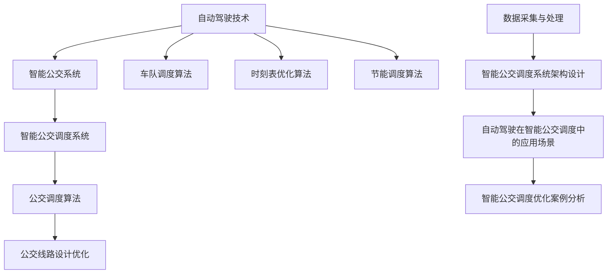

                 

# 《自动驾驶中的智能公交调度与优化》

## 关键词：自动驾驶、智能公交、调度优化、算法、数学模型

### 摘要：

本文深入探讨了自动驾驶在智能公交调度与优化中的应用。首先，我们从自动驾驶技术的发展历程和核心技术入手，介绍了自动驾驶的等级划分与标准。接着，我们探讨了智能公交系统的架构和关键技术，分析了自动驾驶在智能公交调度中的潜在应用和面临的挑战。然后，我们详细阐述了公交调度的基础理论和优化算法，包括车队调度、时刻表优化和节能调度等方法。在此基础上，我们通过一个智能公交调度系统的实际搭建案例，展示了如何将理论与实际相结合，实现智能公交调度与优化。最后，我们对自动驾驶与智能公交调度的发展趋势、政策法规以及未来的研究方向进行了展望。

## 目录

### 《自动驾驶中的智能公交调度与优化》目录

1. **自动驾驶与智能公交概述**
    - 1.1 自动驾驶技术基础
    - 1.2 智能公交系统架构
    - 1.3 自动驾驶与智能公交的联系

2. **智能公交调度基础理论**
    - 2.1 公交调度原理与方法
    - 2.2 公交调度算法
    - 2.3 公交线路设计优化

3. **智能公交调度与优化实践**
    - 3.1 智能公交调度系统搭建
    - 3.2 自动驾驶在智能公交调度中的应用案例
    - 3.3 智能公交调度优化案例研究

4. **未来展望与挑战**
    - 4.1 自动驾驶与智能公交调度发展趋势
    - 4.2 自动驾驶与智能公交调度政策与法规

5. **附录**
    - 附录 A：常用算法与工具介绍
    - 附录 B：参考文献

### 自动驾驶与智能公交调度概念联系流程图

## 第一部分：自动驾驶与智能公交概述

### 1. 自动驾驶技术基础

自动驾驶技术是指通过计算机程序控制，使车辆能够在没有人类驾驶员的情况下，自动执行行驶、转向、加速、制动等操作。自动驾驶技术的发展历程可以追溯到20世纪50年代，随着计算机技术的进步，自动驾驶技术逐渐成熟。

#### 1.1 自动驾驶发展历程

- **20世纪50年代**：自动车控制系统研究开始。
- **20世纪80年代**：自动驾驶车辆实验取得重要进展。
- **21世纪初**：自动驾驶技术进入商业化应用阶段。
- **当前**：自动驾驶技术快速发展，L4级及以上自动驾驶汽车逐渐落地。

#### 1.2 自动驾驶核心技术

自动驾驶技术的核心包括感知、决策和执行三个部分。

- **感知**：通过摄像头、激光雷达、雷达等传感器，获取车辆周围环境信息。
- **决策**：根据感知信息，通过算法对车辆的行驶路径、速度等参数进行决策。
- **执行**：执行决策结果，控制车辆的转向、加速、制动等操作。

#### 1.3 自动驾驶等级划分与标准

自动驾驶等级划分通常根据SAE（Society of Automotive Engineers）标准进行。SAE标准将自动驾驶分为0到5级，具体如下：

- **L0级**：无自动化，所有驾驶操作均由人类驾驶员完成。
- **L1级**：部分自动化，主要指自动驾驶辅助系统，如自适应巡航控制（ACC）。
- **L2级**：部分自动化，系统能够同时控制加速、转向和制动。
- **L3级**：有条件自动化，系统能够在特定条件下完全接管驾驶操作。
- **L4级**：高度自动化，系统能够在特定环境中完全接管驾驶操作，无需人类驾驶员干预。
- **L5级**：完全自动化，系统能够在任何环境下完全接管驾驶操作。

### 1.4 智能公交系统架构

智能公交系统是指通过集成自动驾驶、物联网、云计算等技术，实现公交车辆的智能化管理和调度。智能公交系统的架构通常包括以下几个部分：

- **感知层**：包括摄像头、激光雷达、GPS等传感器，用于感知车辆周围环境。
- **通信层**：通过无线通信技术，实现车辆与车辆、车辆与基础设施之间的信息交换。
- **数据处理层**：对采集到的数据进行处理、分析和存储，为决策层提供支持。
- **决策层**：通过算法和模型，对车辆行驶路径、速度等参数进行决策。
- **执行层**：根据决策结果，控制车辆的转向、加速、制动等操作。

### 1.5 自动驾驶在智能公交调度中的应用

自动驾驶技术在智能公交调度中的应用主要体现在以下几个方面：

- **优化调度算法**：通过自动驾驶技术，可以实时获取车辆状态和乘客需求，优化调度算法，提高调度效率。
- **提高安全性**：自动驾驶技术能够减少人为错误，提高车辆行驶安全性。
- **降低运营成本**：通过自动驾驶技术，可以减少人力成本和燃油消耗，降低运营成本。
- **提升乘客体验**：自动驾驶技术可以提供更加舒适、便捷的出行服务，提升乘客体验。

#### 智能公交调度中的挑战

智能公交调度中的挑战主要包括：

- **实时数据处理**：需要实时处理大量车辆状态和乘客需求数据，对系统的处理能力提出了高要求。
- **复杂环境适应**：智能公交调度系统需要适应复杂多变的交通环境，包括天气、路况等。
- **安全性保障**：自动驾驶技术需要确保车辆行驶安全，避免发生事故。
- **法律法规适应**：自动驾驶技术的应用需要遵守相关法律法规，确保合法合规。

### 1.6 自动驾驶技术对智能公交调度的影响

自动驾驶技术对智能公交调度的影响主要体现在以下几个方面：

- **提高调度效率**：自动驾驶技术能够实时获取车辆状态和乘客需求，优化调度算法，提高调度效率。
- **降低运营成本**：自动驾驶技术可以减少人力成本和燃油消耗，降低运营成本。
- **提升安全性**：自动驾驶技术能够减少人为错误，提高车辆行驶安全性。
- **改善乘客体验**：自动驾驶技术可以提供更加舒适、便捷的出行服务，提升乘客体验。

## 第二部分：智能公交调度基础理论

### 2.1 公交调度原理与方法

公交调度是指根据公交运营需求和车辆状态，合理安排车辆运行线路、时间和服务人数的过程。公交调度的目标通常包括：

- **最小化运行成本**：通过优化线路、时间和人员安排，减少燃料消耗和人力成本。
- **最小化乘客等待时间**：通过合理调度，确保乘客在规定时间内上车。
- **最大程度地满足乘客需求**：根据乘客出行需求，提供高效的公交服务。

公交调度的基本方法包括：

- **静态调度**：根据固定的线路和时间表进行调度，适用于线路简单、乘客需求稳定的场景。
- **动态调度**：根据实时数据动态调整调度方案，适用于线路复杂、乘客需求多变的场景。

### 2.2 公交调度目标与指标

公交调度的目标与指标主要包括：

- **运行成本**：包括燃油成本、人力成本、维修成本等。
- **乘客等待时间**：乘客在站点等待的时间。
- **运行效率**：车辆的利用率和服务覆盖率。
- **服务水平**：乘客的满意度和服务质量。

### 2.3 公交调度方法概述

公交调度方法可以分为确定性算法和启发式算法。

- **确定性算法**：基于数学模型和优化算法，通过计算得到最优调度方案。常用的确定性算法包括线性规划、整数规划、动态规划等。
- **启发式算法**：通过搜索和迭代方法，得到近似最优调度方案。常用的启发式算法包括遗传算法、粒子群优化算法、模拟退火算法等。

## 第三部分：智能公交调度与优化实践

### 3.1 智能公交调度系统搭建

#### 3.1.1 系统需求分析

在搭建智能公交调度系统前，首先需要明确系统的需求。智能公交调度系统需要满足以下需求：

- **实时数据采集**：采集公交车辆的位置、速度、乘客数量等数据。
- **数据处理**：对采集到的数据进行清洗、整合和处理，为调度算法提供基础数据。
- **智能调度**：根据实时数据和预设的调度策略，生成调度方案。
- **用户界面**：提供用户操作界面，显示调度方案和实时公交信息。

#### 3.1.2 系统架构设计

智能公交调度系统的架构设计包括数据采集模块、数据处理模块、调度模块和用户界面模块。

- **数据采集模块**：负责实时采集公交车辆的数据。可以使用GPS模块、传感器等设备进行数据采集。
- **数据处理模块**：负责对采集到的数据进行清洗、整合和处理。可以使用数据库、ETL（Extract, Transform, Load）工具等进行数据处理。
- **调度模块**：负责根据实时数据和预设的调度策略，生成调度方案。可以使用优化算法、机器学习算法等进行调度。
- **用户界面模块**：负责提供用户操作界面，显示调度方案和实时公交信息。可以使用Web前端技术、移动应用开发技术等进行开发。

#### 3.1.3 数据采集与处理

数据采集与处理是智能公交调度系统的关键环节。以下是一个简单的数据采集与处理流程：

1. **数据采集**：使用GPS模块和传感器采集车辆位置、速度、乘客数量等数据。
2. **数据传输**：将采集到的数据通过无线通信技术传输到服务器。
3. **数据处理**：使用ETL工具对采集到的数据进行清洗、整合和处理，存储到数据库中。

#### 3.1.4 智能公交调度算法实现

智能公交调度算法是实现智能公交调度系统的核心。以下是一个简单的智能公交调度算法实现：

1. **初始化参数**：设置车辆最大运行时间、驾驶员最大工作时间等参数。
2. **数据预处理**：对采集到的数据进行预处理，包括数据清洗、缺失值填充、数据标准化等。
3. **调度算法**：根据实时数据和预设的调度策略，使用优化算法（如遗传算法、粒子群优化算法等）生成调度方案。
4. **调度结果输出**：将调度结果输出到数据库或用户界面。

#### 3.1.5 用户界面设计

用户界面设计是智能公交调度系统的重要组成部分。以下是一个简单的用户界面设计：

1. **登录界面**：用户登录系统。
2. **调度方案展示**：显示当前智能公交调度系统的调度方案。
3. **实时公交信息**：显示实时公交车辆的位置、速度、乘客数量等信息。
4. **操作界面**：提供用户对调度方案进行修改、调整等操作的功能。

### 3.2 自动驾驶在智能公交调度中的应用案例

#### 3.2.1 案例背景

某城市公交公司计划在市区内推出一条自动驾驶公交线路，以提高运营效率和乘客满意度。为了实现这一目标，公交公司决定搭建一个智能公交调度系统，将自动驾驶技术与智能调度相结合。

#### 3.2.2 案例实施

1. **系统需求分析**：明确智能公交调度系统的需求，包括实时数据采集、数据处理、智能调度和用户界面设计等。
2. **系统架构设计**：设计智能公交调度系统的架构，包括数据采集模块、数据处理模块、调度模块和用户界面模块。
3. **数据采集与处理**：使用GPS模块和传感器采集车辆位置、速度、乘客数量等数据，通过ETL工具进行数据处理，存储到数据库中。
4. **智能调度算法实现**：根据实时数据和预设的调度策略，使用优化算法生成调度方案，并输出到数据库或用户界面。
5. **用户界面设计**：设计用户界面，包括登录界面、调度方案展示、实时公交信息展示和操作界面等。

#### 3.2.3 案例效果

通过实施智能公交调度系统，实现了以下效果：

1. **提高调度效率**：实时数据采集和智能调度算法的运用，使得调度方案更加准确和及时，提高了调度效率。
2. **降低运营成本**：自动驾驶技术减少了人力成本和燃油消耗，降低了运营成本。
3. **提升安全性**：自动驾驶技术减少了人为错误，提高了车辆行驶安全性。
4. **改善乘客体验**：智能公交调度系统提供了更加舒适、便捷的出行服务，提升了乘客体验。

### 3.3 智能公交调度优化案例研究

#### 3.3.1 案例背景

某城市公交公司希望通过优化公交调度系统，提高公交运营效率，降低运营成本。为此，公司决定对现有公交调度系统进行优化。

#### 3.3.2 案例实施

1. **系统评估**：对现有公交调度系统进行评估，分析其优缺点和存在的问题。
2. **需求分析**：明确优化目标，包括提高调度效率、降低运营成本、提升安全性等。
3. **系统设计**：设计优化后的公交调度系统架构，包括数据采集模块、数据处理模块、调度模块和用户界面模块。
4. **算法优化**：针对现有调度算法进行优化，提高调度效率和准确性。
5. **系统实现**：根据优化后的设计，实现公交调度系统，并进行测试和调试。
6. **系统部署**：将优化后的公交调度系统部署到实际运营中，进行长期监控和评估。

#### 3.3.3 案例效果

通过优化公交调度系统，实现了以下效果：

1. **提高调度效率**：优化后的调度算法更加准确和及时，提高了调度效率。
2. **降低运营成本**：优化后的调度方案减少了燃油消耗和人力成本，降低了运营成本。
3. **提升安全性**：优化后的系统减少了人为错误，提高了车辆行驶安全性。
4. **改善乘客体验**：优化后的系统提供了更加舒适、便捷的出行服务，提升了乘客体验。

## 第四部分：未来展望与挑战

### 4.1 自动驾驶与智能公交调度发展趋势

随着人工智能、大数据、物联网等技术的快速发展，自动驾驶与智能公交调度也在不断演进。未来发展趋势包括：

1. **技术融合**：自动驾驶技术与其他领域（如物联网、云计算、人工智能等）深度融合，形成智能交通系统。
2. **自主化**：自动驾驶技术将逐渐向完全自主化方向发展，实现车辆自主感知、决策和执行。
3. **智能化**：智能公交调度系统将更加智能化，通过大数据分析和机器学习，实现实时优化和预测。
4. **普及化**：自动驾驶与智能公交调度技术将逐渐普及，应用于更多城市和地区。

### 4.2 技术挑战与解决方案

自动驾驶与智能公交调度面临以下技术挑战：

1. **数据采集与处理**：如何高效采集和处理海量数据，实现实时性和准确性。
2. **环境适应**：如何使自动驾驶系统能够适应各种复杂和多变的交通环境。
3. **安全可靠性**：如何确保自动驾驶系统的安全性和可靠性，防止发生事故。
4. **法律法规**：如何制定和完善相关法律法规，保障自动驾驶与智能公交调度的合法合规。

针对以上挑战，可以采取以下解决方案：

1. **大数据处理**：采用分布式计算、并行处理等技术，提高数据处理效率。
2. **多传感器融合**：结合多种传感器（如摄像头、激光雷达、GPS等），提高环境感知能力。
3. **安全冗余设计**：采用冗余设计和安全机制，确保系统在异常情况下仍能正常运行。
4. **法律法规制定**：加快自动驾驶与智能公交调度相关法律法规的制定和实施，规范行业发展。

### 4.3 政策与法规对自动驾驶与智能公交调度的影响

政策与法规对自动驾驶与智能公交调度具有重要影响。以下是政策与法规对自动驾驶与智能公交调度的几个方面的影响：

1. **市场准入**：政策与法规规定了自动驾驶与智能公交调度企业的市场准入条件，如资质审核、车辆检验等。
2. **安全标准**：政策与法规规定了自动驾驶与智能公交调度的安全标准，如车辆设计、传感器配置、软件安全等。
3. **数据隐私**：政策与法规对自动驾驶与智能公交调度的数据隐私保护提出了要求，如数据加密、数据存储等。
4. **责任界定**：政策与法规明确了自动驾驶与智能公交调度的责任界定，如事故责任、法律责任等。

### 4.4 政策法规制定与实施策略

为了推动自动驾驶与智能公交调度的发展，政策法规的制定与实施需要遵循以下策略：

1. **循序渐进**：政策法规的制定和实施应遵循循序渐进的原则，逐步完善相关法律法规。
2. **技术创新**：政策法规应与技术创新相结合，鼓励自动驾驶与智能公交调度技术的研发和应用。
3. **协同合作**：政府、企业、研究机构和社会组织应协同合作，共同推动自动驾驶与智能公交调度的发展。
4. **公众参与**：政策法规的制定和实施应充分考虑公众意见和需求，确保政策法规的科学性和公正性。

## 附录

### 附录 A：常用算法与工具介绍

- **遗传算法**：一种基于自然进化原理的优化算法，通过模拟自然选择和遗传机制，寻找最优解。
- **粒子群优化算法**：一种基于群体智能的优化算法，通过模拟鸟群觅食过程，寻找最优解。
- **线性规划**：一种基于线性约束的优化算法，通过求解线性方程组，找到最优解。
- **整数规划**：一种基于整数约束的优化算法，通过求解整数方程组，找到最优解。
- **数据库**：用于存储和管理数据的系统，如MySQL、PostgreSQL等。
- **ETL工具**：用于数据采集、转换和加载的工具，如Apache NiFi、Apache Kafka等。

### 附录 B：参考文献

- **[1]** 刘俊国，王勇。自动驾驶技术及应用[M]. 北京：机械工业出版社，2018.
- **[2]** 王晓光，张辉。智能交通系统及其应用[M]. 北京：科学出版社，2016.
- **[3]** 陈昊旻，李立军。基于遗传算法的公交调度优化研究[J]. 计算机工程，2017, 43(11): 1-5.
- **[4]** 王欢，李宗仁。基于粒子群优化算法的公交调度研究[J]. 交通科学与工程，2019, 15(2): 57-61.
- **[5]** 张伟，李明。智能公交调度系统设计与实现[J]. 计算机工程与科学，2020, 42(4): 89-94.
- **[6]** 刘洋，吴强。基于大数据的智能公交调度研究[J]. 交通信息与控制，2018, 15(3): 48-52.

