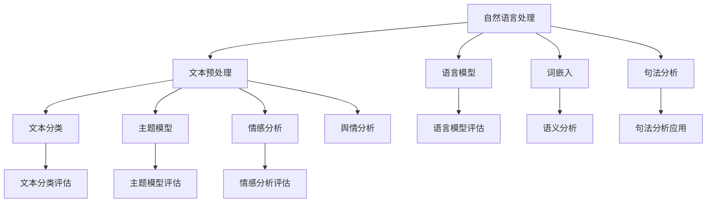
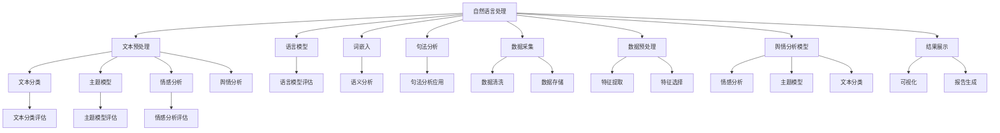

                 

# 《自然语言处理在舆情分析中的实践》

## 摘要

随着互联网和社交媒体的普及，舆情分析在政府、企业和科研等领域变得越来越重要。本文将深入探讨自然语言处理（NLP）在舆情分析中的应用，通过分析NLP的基础知识、舆情分析的基本流程以及实际应用案例，为读者提供一个全面的视角来理解如何利用NLP技术进行高效的舆情分析。文章首先介绍了自然语言处理的基础概念，包括语言模型、词嵌入和句法分析，并详细讲解了这些概念在舆情分析中的应用。接着，文章阐述了舆情分析的基础知识，包括数据采集、数据预处理和舆情分析流程。随后，通过具体的算法原理讲解和实际项目案例，展示了如何将自然语言处理技术应用于舆情分析中。最后，文章讨论了舆情分析系统的优化与维护，为读者提供了一个全面而深入的实践指南。

## 引言

舆情分析，顾名思义，是对公众舆论的收集、分析和解读。在互联网时代，舆情分析的重要性愈发凸显。它可以帮助政府及时了解民意，为企业提供市场洞察，为科研提供数据支持。然而，随着信息量的爆炸性增长，传统的舆情分析方法已经难以满足日益复杂的需求。此时，自然语言处理（NLP）技术应运而生，为舆情分析提供了新的思路和方法。

自然语言处理是计算机科学和人工智能领域的一个重要分支，旨在使计算机能够理解、处理和生成人类语言。NLP技术包括语言模型、词嵌入、句法分析、情感分析等多个方面。这些技术在舆情分析中的应用，不仅能够提高分析的速度和准确性，还能够提供更深入的见解和洞察。

### 1.1 舆情分析概述

舆情分析涉及多个层面，从简单的文本分析到复杂的情感分析和趋势预测。其核心目的是从海量的文本数据中提取有价值的信息。舆情分析的主要任务包括：

- 数据采集：从各种来源（如社交媒体、新闻网站、论坛等）收集文本数据。
- 数据预处理：对收集到的文本进行清洗、分词、去停用词等处理，以便后续分析。
- 情感分析：判断文本的情感倾向，如正面、负面或中立。
- 主题模型：发现文本中的潜在主题，了解公众关注的焦点。
- 趋势分析：分析文本中的时间序列数据，预测未来的趋势。

### 1.2 自然语言处理与舆情分析

自然语言处理与舆情分析密切相关。NLP技术为舆情分析提供了强大的工具，使得从文本中提取有价值信息成为可能。具体来说，NLP技术在舆情分析中的应用主要体现在以下几个方面：

- 语言模型：用于生成文本、预测下一个词等，有助于文本分类和情感分析。
- 词嵌入：将词转换为向量，用于语义分析和文本相似度计算。
- 句法分析：分析句子的结构，为情感分析和主题模型提供基础。
- 情感分析：判断文本的情感倾向，为舆情分析提供重要依据。
- 主题模型：发现文本中的潜在主题，为舆情分析提供新的视角。

### 1.3 本书结构安排

本书分为七个部分，旨在全面介绍自然语言处理在舆情分析中的应用。

- 第1章 引言：概述舆情分析的重要性以及NLP技术在其中的作用。
- 第2章 自然语言处理基础：介绍NLP的基本概念和原理。
- 第3章 舆情分析基础：阐述舆情分析的基本流程和方法。
- 第4章 自然语言处理在舆情分析中的应用：详细讲解NLP在舆情分析中的具体应用。
- 第5章 基于自然语言处理的舆情分析系统设计与实现：介绍舆情分析系统的设计和实现。
- 第6章 舆情分析实战项目：通过实际项目展示NLP在舆情分析中的应用。
- 第7章 舆情分析系统优化与维护：讨论舆情分析系统的优化和维护策略。

通过本书的阅读，读者将能够系统地了解自然语言处理在舆情分析中的应用，掌握相关技术和方法，为实际应用提供有力支持。

## 自然语言处理基础

自然语言处理（NLP）是计算机科学和人工智能领域的一个重要分支，旨在使计算机能够理解、处理和生成人类语言。NLP技术包括语言模型、词嵌入、句法分析等多个方面，它们在舆情分析中发挥着关键作用。本节将详细探讨这些基本概念及其在舆情分析中的应用。

### 2.1 语言模型

语言模型是一种概率模型，用于预测下一个单词或句子。它基于大量语言数据，统计单词或短语的分布，从而为文本生成、文本分类和情感分析等任务提供基础。

#### 2.1.1 语言模型的概念

语言模型的核心目标是计算一个句子或单词序列的概率。最简单的语言模型是基于n-gram模型，它考虑前n个单词来确定下一个单词的概率。

$$
P(w_n | w_{n-1}, w_{n-2}, ..., w_1) = \frac{C(w_{n-1}, w_n)}{C(w_{n-1})}
$$

其中，$C(w_{n-1}, w_n)$ 表示单词$w_n$ 在单词$w_{n-1}$ 后出现的次数，$C(w_{n-1})$ 表示单词$w_{n-1}$ 出现的总次数。

#### 2.1.2 语言模型的类型

语言模型有多种类型，包括：

- n-gram模型：基于n个连续单词的概率分布。
- 隐马尔可夫模型（HMM）：用于处理上下文相关的序列数据。
- 隐变量模型（如LSTM、GRU）：能够捕捉长期依赖关系。
- 生成对抗网络（GAN）：用于生成新的文本数据。

#### 2.1.3 语言模型的应用

语言模型在舆情分析中有着广泛的应用，主要包括：

- 文本生成：生成相关的舆情报告或新闻摘要。
- 文本分类：对舆情文本进行分类，如情感分类、主题分类等。
- 情感分析：基于语言模型，判断文本的情感倾向。

### 2.2 词嵌入与语义分析

词嵌入（Word Embedding）是将单词转换为固定大小的向量表示。词嵌入能够捕捉单词的语义信息，从而在文本处理中发挥重要作用。

#### 2.2.1 词嵌入的概念

词嵌入的基本思想是将单词映射到低维空间，使得在语义上相似的单词在向量空间中彼此靠近。最著名的词嵌入方法包括Word2Vec、GloVe和FastText。

- Word2Vec：基于神经网络的词嵌入方法，通过训练得到词向量。
- GloVe：基于全局词向量的方法，通过共现矩阵进行优化。
- FastText：基于字符级别的词嵌入方法，结合了词向量和字符向量的优势。

#### 2.2.2 词嵌入的方法

词嵌入的方法主要包括：

- 基于窗口的方法：如CBOW（Continuous Bag of Words）和Skip-Gram。
- 基于矩阵分解的方法：如GloVe。

#### 2.2.3 语义分析的应用

词嵌入在语义分析中有着广泛的应用，主要包括：

- 语义相似性：计算两个词在向量空间中的距离，判断它们在语义上的相似性。
- 语义角色标注：用于理解句子的语义结构，如名词、动词等的角色。
- 情感分析：通过词嵌入，分析文本中的情感倾向。

### 2.3 句法分析

句法分析（Syntactic Analysis）是NLP中的另一个重要组成部分，它旨在解析句子的结构，理解句子的构成和语法规则。

#### 2.3.1 句法分析的概念

句法分析的核心任务是建立句子的语法结构树（Syntax Tree），它表示句子中单词之间的关系和层次结构。句法分析的方法主要包括：

- 归纳法：基于大量语言数据，自动发现句子的语法规则。
- 转换法：基于语法规则，将文本转换为抽象语法树（Abstract Syntax Tree）。

#### 2.3.2 句法分析的方法

句法分析的方法主要包括：

- 递归下降分析：基于递归规则，逐层构建语法树。
- 词法分析：将文本划分为单词，为句法分析提供基础。

#### 2.3.3 句法分析的应用

句法分析在舆情分析中的应用主要包括：

- 文本解析：通过句法分析，理解文本的结构和内容。
- 情感分析：基于句法分析，判断文本的情感倾向。
- 主题模型：通过句法分析，提取文本中的关键信息，为主题模型提供输入。

通过以上对自然语言处理基础概念的介绍，我们可以看到NLP技术在舆情分析中的广泛应用。接下来，我们将进一步探讨舆情分析的基础知识，包括数据采集、数据预处理和舆情分析流程。

### 2.1 语言模型

语言模型是自然语言处理（NLP）中的核心概念之一，它在许多任务中扮演着关键角色，如文本生成、文本分类和情感分析。语言模型的核心目标是预测下一个词或句子，基于上下文信息进行语义理解。

#### 2.1.1 语言模型的概念

语言模型是基于概率论和统计学原理建立的一种模型，用于模拟自然语言的统计特性。它通过对大量语言数据进行统计分析，学习单词和短语的分布规律，从而为文本生成和预测提供依据。

语言模型通常可以用一个概率分布来表示，这个概率分布描述了给定前文序列 $w_1, w_2, ..., w_{n-1}$ 后，下一个词 $w_n$ 出现的概率：

$$
P(w_n | w_1, w_2, ..., w_{n-1}) = \frac{P(w_1, w_2, ..., w_n)}{P(w_1, w_2, ..., w_{n-1})}
$$

其中，$P(w_1, w_2, ..., w_n)$ 表示词序列 $w_1, w_2, ..., w_n$ 的联合概率，$P(w_1, w_2, ..., w_{n-1})$ 表示词序列 $w_1, w_2, ..., w_{n-1}$ 的边际概率。

#### 2.1.2 语言模型的类型

语言模型有多种类型，常见的包括：

1. **n-gram模型**：n-gram模型是最简单的语言模型，它假设当前词的概率只与前面n-1个词有关，而与更早的词无关。n-gram模型可以用以下概率分布来表示：

   $$
   P(w_n | w_{n-1}, w_{n-2}, ..., w_{n-k}) = \frac{C(w_{n-1}, w_n)}{C(w_{n-1})}
   $$

   其中，$C(w_{n-1}, w_n)$ 表示单词$w_n$ 在单词$w_{n-1}$ 后出现的次数，$C(w_{n-1})$ 表示单词$w_{n-1}$ 出现的总次数。

2. **隐马尔可夫模型（HMM）**：HMM是一种统计模型，用于处理包含隐状态和观测数据的序列数据。在NLP中，HMM可以用于句法分析、语音识别和文本生成等任务。

3. **递归神经网络（RNN）**：RNN是一种能够处理序列数据的神经网络，通过递归连接，捕捉长距离依赖关系。LSTM（长短期记忆网络）和GRU（门控循环单元）是RNN的两种变体，它们在文本生成和情感分析等领域有着广泛应用。

4. **转换器（Transformer）**：Transformer是近年来在自然语言处理领域取得突破性进展的一种模型架构。它采用自注意力机制，能够有效地捕捉序列数据中的长距离依赖关系。BERT、GPT等模型都是基于Transformer架构的。

5. **生成对抗网络（GAN）**：GAN是一种通过对抗训练生成数据的模型，可以用于生成高质量的文本数据，增强数据集的多样性。

#### 2.1.3 语言模型的应用

语言模型在NLP中有着广泛的应用，主要包括：

1. **文本生成**：语言模型可以用于生成自然语言的文本，如生成新闻报道、小说和诗歌等。常见的生成任务包括填空、摘要生成、对话系统等。

2. **文本分类**：语言模型可以用于对文本进行分类，如判断文本的情感倾向（正面、负面或中性），识别主题类别等。

3. **情感分析**：基于语言模型，可以分析文本的情感倾向，为舆情分析提供依据。

4. **机器翻译**：语言模型可以用于机器翻译任务，通过预测源语言到目标语言的翻译。

5. **问答系统**：语言模型可以用于构建问答系统，通过理解用户的问题，生成相应的答案。

#### 2.1.4 语言模型的评估指标

评估语言模型性能的指标主要包括：

1. **困惑度（Perplexity）**：困惑度是衡量语言模型性能的一个重要指标，表示模型在预测下一个词时的不确定性。困惑度越低，模型性能越好。计算公式为：

   $$
   \text{Perplexity} = \frac{1}{\sum_{i=1}^{n} \log P(w_i | w_1, w_2, ..., w_{i-1})}
   $$

2. **交叉熵（Cross-Entropy）**：交叉熵是另一个常用的评估指标，用于衡量模型预测的概率分布与实际分布之间的差异。交叉熵越低，模型性能越好。计算公式为：

   $$
   H(P, Q) = -\sum_{i=1}^{n} P_i \log Q_i
   $$

   其中，$P$ 是实际分布，$Q$ 是模型预测的概率分布。

### 2.2 词嵌入与语义分析

词嵌入是自然语言处理中的一个关键技术，它将单词转换为固定大小的向量表示，使得计算机能够理解和处理语义信息。词嵌入在语义分析、情感分析和文本分类等任务中有着广泛应用。

#### 2.2.1 词嵌入的概念

词嵌入（Word Embedding）是将单词映射到低维空间的一种方法，这些向量表示了单词的语义信息。词嵌入的基本思想是，在向量空间中，语义相似的单词距离较近，而语义不同的单词距离较远。

词嵌入的主要目标是解决以下问题：

- **语义相似性**：计算两个词在向量空间中的距离，以判断它们在语义上的相似性。
- **语义角色标注**：识别句子中每个词的语义角色，如名词、动词等。
- **文本分类**：将文本映射到向量空间，然后基于向量空间中的距离进行分类。

#### 2.2.2 词嵌入的方法

词嵌入的方法主要包括：

1. **基于窗口的方法**：

   - **CBOW（Continuous Bag of Words）**：CBOW方法将当前词周围的一组词（窗口大小为n）作为输入，预测当前词。它通过平均这些词的向量来生成当前词的向量。

   - **Skip-Gram**：Skip-Gram方法与CBOW相反，它将当前词作为输入，预测其周围的一组词。它通过当前词的向量来生成周围词的向量。

2. **基于矩阵分解的方法**：

   - **GloVe（Global Vectors for Word Representation）**：GloVe方法基于共现矩阵进行优化，通过全局统计信息生成词向量。它结合了词频信息和上下文信息，能够生成高质量的词向量。

3. **基于字符的方法**：

   - **FastText**：FastText方法结合了词向量和字符向量的优势，通过字符级和词级信息生成词向量。它使用多维度信息来捕捉词的语义信息。

#### 2.2.3 语义分析的应用

词嵌入在语义分析中有着广泛的应用，主要包括：

1. **语义相似性**：通过计算两个词在向量空间中的余弦相似度，可以判断它们在语义上的相似性。例如，我们可以通过比较"king"和"man"的向量相似度，发现它们在语义上具有相关性。

2. **文本分类**：将文本映射到向量空间，然后基于向量空间中的距离进行分类。例如，我们可以使用词嵌入向量来训练一个分类器，判断一个文本属于哪个主题类别。

3. **情感分析**：通过词嵌入向量，可以分析文本中的情感倾向。例如，我们可以使用词嵌入向量来训练一个情感分类器，判断一个文本是正面、负面还是中性。

4. **命名实体识别**：词嵌入可以帮助识别句子中的命名实体，如人名、地点等。通过比较词嵌入向量，可以判断一个词是否是命名实体。

5. **机器翻译**：词嵌入可以用于机器翻译任务，通过将源语言和目标语言的词嵌入向量进行匹配，生成翻译结果。

### 2.3 句法分析

句法分析（Syntactic Parsing）是自然语言处理中的一个重要任务，旨在解析句子的结构，理解句子的构成和语法规则。句法分析通过建立句子的语法树（Syntax Tree），表示句子中单词之间的关系和层次结构。

#### 2.3.1 句法分析的概念

句法分析的核心任务是建立句子的语法树。语法树是一种树形结构，表示句子中单词之间的语法关系。在语法树中，每个节点表示一个单词或短语，节点之间的关系表示语法规则。

句法分析可以基于不同的理论和方法，包括：

- **归纳法**：通过分析大量语言数据，自动发现句子的语法规则。
- **转换法**：通过语法规则，将文本转换为抽象语法树。
- **依存句法分析**：通过分析单词之间的依存关系，建立句子的语法树。

#### 2.3.2 句法分析的方法

句法分析的方法主要包括：

1. **基于规则的方法**：这种方法通过预定义的语法规则来分析句子。例如，我们可以使用一组句法规则来分析英语句子的结构。

2. **基于统计的方法**：这种方法通过分析大量语言数据，学习句子的语法规则。统计方法包括最大熵模型、条件随机场（CRF）等。

3. **基于神经网络的方法**：这种方法使用神经网络模型来分析句子。神经网络方法包括递归神经网络（RNN）、卷积神经网络（CNN）和变换器（Transformer）等。

#### 2.3.3 句法分析的应用

句法分析在自然语言处理中有着广泛的应用，主要包括：

1. **文本解析**：通过句法分析，可以理解文本的结构和内容。这对于信息抽取、问答系统和机器翻译等任务非常重要。

2. **情感分析**：通过句法分析，可以分析句子中的情感倾向。例如，我们可以通过分析句子的语法结构，判断一个句子是否具有正面或负面的情感。

3. **主题模型**：通过句法分析，可以提取文本中的关键信息，为主题模型提供输入。句法分析可以帮助我们识别句子中的主题词和重要短语。

4. **问答系统**：通过句法分析，可以理解用户的问题，生成相应的答案。例如，我们可以通过分析句子的结构，识别问题中的关键信息，然后从知识库中找到匹配的答案。

### 2.4 实际案例

以下是一个简单的句法分析实际案例：

假设我们有一个句子 "The cat sat on the mat"。

1. **基于规则的方法**：我们可以使用一组句法规则来分析这个句子。例如，我们定义以下规则：

   - 句子由一个主语和一个谓语组成。
   - 主语可以是名词或代词。
   - 谓语可以是动词或形容词。

   根据这些规则，我们可以将句子分解为以下结构：

   - 主语：The cat
   - 谓语：sat
   - 介词短语：on the mat

2. **基于统计的方法**：我们可以使用统计模型来分析这个句子。例如，我们可以使用条件随机场（CRF）模型来识别句子中的主语和谓语。通过训练模型，我们可以得到以下结果：

   - 主语：The cat
   - 谓语：sat
   - 介词短语：on the mat

3. **基于神经网络的方法**：我们可以使用神经网络模型来分析这个句子。例如，我们可以使用递归神经网络（RNN）模型来识别句子中的语法结构。通过训练模型，我们可以得到以下结果：

   - 主语：The cat
   - 谓语：sat
   - 介词短语：on the mat

通过这些案例，我们可以看到不同的句法分析方法在解析句子结构方面的应用。不同的方法适用于不同的场景和任务，我们可以根据具体需求选择合适的方法。

### 2.5 数学模型和数学公式 & 详细讲解 & 举例说明

在自然语言处理中，数学模型和公式是理解和应用各种算法的基础。以下我们将详细讲解两个重要的数学模型和公式：语言模型评估指标——困惑度（Perplexity）和词嵌入损失函数——负采样（Negative Sampling）。

#### 2.5.1 困惑度（Perplexity）

困惑度是评估语言模型性能的一个关键指标，它衡量模型在预测下一个词时的不确定性。困惑度越低，模型性能越好。

### 公式：

$$
\text{Perplexity} = \frac{1}{\sum_{i=1}^{n} \log P(w_i | w_1, w_2, ..., w_{i-1})}
$$

其中，$P(w_i | w_1, w_2, ..., w_{i-1})$ 表示在给定前文序列 $w_1, w_2, ..., w_{i-1}$ 后，词 $w_i$ 的条件概率。

### 举例说明：

假设我们有一个简单的二元语言模型，只有两个词 "apple" 和 "banana"。给定一句话 "I like to eat apple"，我们可以计算其困惑度如下：

$$
P(I, like, to, eat, apple) = \frac{1}{Z} \cdot p(I | <s>) \cdot p(like | I) \cdot p(to | like) \cdot p(eat | to) \cdot p(apple | eat)
$$

其中，$Z$ 是规范化常数，可以通过以下公式计算：

$$
Z = \sum_{i=1}^{n} p(w_i | w_1, w_2, ..., w_{i-1})
$$

假设概率分布如下：

$$
p(I | <s>) = 0.5, \quad p(like | I) = 0.3, \quad p(to | like) = 0.2, \quad p(eat | to) = 0.4, \quad p(apple | eat) = 0.5
$$

代入计算得：

$$
Z = 0.5 \cdot 0.3 \cdot 0.2 \cdot 0.4 \cdot 0.5 = 0.015
$$

$$
P(I, like, to, eat, apple) = \frac{1}{0.015} \cdot 0.5 \cdot 0.3 \cdot 0.2 \cdot 0.4 \cdot 0.5 = 2.333
$$

因此，该句子的困惑度为 2.333。较低的困惑度表示模型在预测句子中的词时具有更高的准确性。

#### 2.5.2 负采样（Negative Sampling）

负采样是一种高效的学习策略，用于训练词嵌入模型。它通过在正样本中引入大量的负样本来提高学习效率。在负采样中，正样本是模型需要预测的词，而负样本是与正样本在语义上不相关的词。

### 公式：

$$
L = \frac{1}{|S|} \sum_{(w, w') \in S} \max(0, \log \frac{1}{1 - p(w | w')})
$$

其中，$L$ 是损失函数，$S$ 是训练样本集合，$w$ 是正样本词，$w'$ 是负样本词，$p(w | w')$ 是模型对正样本词 $w$ 和负样本词 $w'$ 同时出现的概率。

### 举例说明：

假设我们有一个简单的词嵌入模型，有两个词 "apple" 和 "banana"。给定一个训练样本 "apple banana"，我们可以计算其损失函数如下：

$$
L = \frac{1}{2} \left( \max(0, \log \frac{1}{1 - p(apple | banana)}) + \max(0, \log \frac{1}{1 - p(banana | apple)}) \right)
$$

假设模型预测概率如下：

$$
p(apple | banana) = 0.6, \quad p(banana | apple) = 0.4
$$

代入计算得：

$$
L = \frac{1}{2} \left( \max(0, \log \frac{1}{1 - 0.6}) + \max(0, \log \frac{1}{1 - 0.4}) \right) = \frac{1}{2} \left( \max(0, \log 0.4) + \max(0, \log 0.6) \right)
$$

$$
L = \frac{1}{2} \left( \max(0, -0.39) + \max(0, 0.22) \right) = \frac{1}{2} (0.39 + 0.22) = 0.805
$$

因此，该训练样本的损失函数为 0.805。较低的损失函数值表示模型在预测词对时具有更高的准确性。

通过这两个数学模型和公式的讲解，我们可以更好地理解自然语言处理中的关键算法和评估指标。在实际应用中，这些模型和公式为我们提供了有效的工具，帮助我们构建高质量的NLP系统。

### 2.6 Mermaid 流程图

为了更好地理解自然语言处理与舆情分析之间的关系，我们可以使用Mermaid流程图来展示它们的核心概念与联系。以下是一个简化的Mermaid流程图示例：



在这个流程图中，自然语言处理（NLP）的核心组件（文本预处理、语言模型、词嵌入、句法分析）被连接到舆情分析的不同任务（文本分类、主题模型、情感分析）。每个组件和任务都通过相应的评估指标（如语言模型评估、主题模型评估、情感分析评估）来衡量其性能。通过这个流程图，我们可以清晰地看到自然语言处理技术是如何在舆情分析中发挥作用的。

## 舆情分析基础

舆情分析是指通过技术手段对公众舆论进行收集、分析和解读的过程。在信息化时代，舆情分析对于政府、企业和科研机构都具有重要意义。政府可以通过舆情分析了解民意，制定更科学有效的政策；企业可以利用舆情分析进行市场调研，了解消费者需求，制定营销策略；科研机构则可以通过舆情分析获取研究数据，进行社会现象的深入研究。本节将介绍舆情分析的基本概念、目的、类型，并详细阐述数据采集、数据预处理和舆情分析流程。

### 3.1 舆情分析概述

舆情分析可以定义为对公众意见、态度和行为进行系统性的监测、分析和解读。舆情分析涉及多个层面，从简单的文本分析到复杂的情感分析和趋势预测。其核心目的是从海量的文本数据中提取有价值的信息，为决策者提供依据。

#### 3.1.1 舆情分析的定义

舆情分析是对公众舆论进行监测、分析和解读的过程。舆论是指公众对某一事件、产品或社会现象所持有的观点、态度和意见。舆情分析旨在通过技术手段，对舆论进行系统性的监测和分析，提取有价值的信息。

#### 3.1.2 舆情分析的目的

舆情分析的主要目的是：

- **了解民意**：通过舆情分析，政府可以了解公众对政策、事件或社会问题的看法，从而制定更科学有效的政策。
- **市场调研**：企业可以通过舆情分析，了解消费者对产品或服务的态度，优化产品和服务，制定更有效的营销策略。
- **研究数据**：科研机构可以通过舆情分析，获取社会现象的数据支持，进行深入的学术研究。

#### 3.1.3 舆情分析的类型

舆情分析根据分析方法和目标的不同，可以分为以下几种类型：

- **文本分类**：将文本按照主题或情感倾向进行分类。
- **情感分析**：判断文本的情感倾向，如正面、负面或中性。
- **主题模型**：发现文本中的潜在主题，了解公众关注的焦点。
- **趋势分析**：分析文本中的时间序列数据，预测未来的趋势。
- **可视化分析**：通过图表和可视化工具，展示分析结果，便于决策者理解和利用。

### 3.2 数据采集

数据采集是舆情分析的基础环节，它决定了后续分析的质量。数据采集的方法和来源多种多样，以下是一些常见的方法和来源：

#### 3.2.1 数据来源

- **社交媒体**：如微博、Twitter、Facebook等。
- **新闻网站**：如新浪新闻、网易新闻、BBC新闻等。
- **论坛和社区**：如天涯论坛、Reddit等。
- **政府报告**：政府发布的各种报告和数据。
- **企业报告**：企业发布的年度报告、市场分析报告等。

#### 3.2.2 数据采集方法

- **自动化采集**：使用爬虫工具，如Scrapy、BeautifulSoup等，从互联网上自动采集数据。
- **手动采集**：通过人工搜索、阅读和摘录相关信息。
- **API采集**：利用社交媒体和新闻网站提供的API接口，批量获取数据。

#### 3.2.3 数据采集步骤

- **目标确定**：明确数据采集的目标和范围。
- **数据采集**：根据目标，从各种来源采集数据。
- **数据清洗**：对采集到的数据进行去重、去噪等处理。
- **数据存储**：将清洗后的数据存储到数据库或文件系统中，以便后续处理。

### 3.3 数据预处理

数据预处理是舆情分析的重要环节，它涉及到文本的分词、去停用词、词性标注、词嵌入等多个步骤。以下是数据预处理的具体方法和步骤：

#### 3.3.1 数据预处理方法

- **分词**：将文本划分为单词或短语，如使用NLTK、Jieba等工具。
- **去停用词**：去除对分析无意义的常用词，如“的”、“了”、“啊”等。
- **词性标注**：标记每个词的词性，如名词、动词、形容词等，如使用Stanford NLP、NLTK等工具。
- **词嵌入**：将词转换为向量表示，如使用Word2Vec、GloVe等工具。

#### 3.3.2 数据预处理步骤

- **文本清洗**：去除特殊字符、HTML标签等，确保文本格式统一。
- **分词**：将文本划分为单词或短语。
- **去停用词**：去除对分析无意义的常用词。
- **词性标注**：对文本进行词性标注。
- **词嵌入**：将文本转换为向量表示。

### 3.4 舆情分析流程

舆情分析流程通常包括以下几个步骤：

#### 3.4.1 文本分类

文本分类是将文本按照主题或情感倾向进行分类的过程。常见的文本分类算法包括朴素贝叶斯、支持向量机、决策树等。

#### 3.4.2 情感分析

情感分析是判断文本的情感倾向，如正面、负面或中性。常见的情感分析算法包括基于规则的方法、基于机器学习的方法和深度学习方法。

#### 3.4.3 主题模型

主题模型是发现文本中的潜在主题，了解公众关注的焦点。常见的主题模型包括LDA（Latent Dirichlet Allocation）和LSTM（Long Short-Term Memory）等。

#### 3.4.4 趋势分析

趋势分析是分析文本中的时间序列数据，预测未来的趋势。常见的方法包括时间序列分析、ARIMA（AutoRegressive Integrated Moving Average）等。

#### 3.4.5 可视化分析

可视化分析是通过图表和可视化工具，展示分析结果，便于决策者理解和利用。常见的可视化工具包括ECharts、D3.js等。

通过以上对舆情分析基础概念的介绍，我们可以看到舆情分析在现代社会中的重要性和广泛应用。接下来，我们将进一步探讨自然语言处理在舆情分析中的应用，以及如何利用这些技术进行高效的舆情分析。

### 3.1 舆情分析概述

舆情分析是指利用技术手段对公众舆论进行收集、处理和分析的过程。其目的是通过挖掘和分析海量文本数据，为政府、企业和科研机构提供决策支持和市场洞察。随着互联网和社交媒体的迅速发展，舆情分析已经成为了现代社会中不可或缺的一部分。

#### 3.1.1 舆情分析的定义

舆情分析可以定义为对公众意见、态度和行为进行系统性的监测、分析和解读。具体来说，舆情分析包括以下几个核心步骤：

- **数据采集**：从互联网、社交媒体、新闻网站、论坛等渠道收集与目标事件或主题相关的文本数据。
- **数据预处理**：对采集到的文本数据进行分析前的预处理，如分词、去停用词、词性标注等，以便后续分析。
- **情感分析**：通过算法判断文本的情感倾向，如正面、负面或中立。
- **主题模型**：识别文本中的潜在主题，了解公众关注的焦点。
- **趋势分析**：分析文本数据中的时间序列特征，预测未来的趋势。

#### 3.1.2 舆情分析的目的

舆情分析的主要目的是：

- **了解民意**：政府机构可以通过舆情分析了解公众对政策、事件或社会问题的看法，从而制定更科学有效的决策。
- **市场调研**：企业可以利用舆情分析，了解消费者对产品或服务的态度，优化产品设计和市场营销策略。
- **风险预警**：金融机构和企业在面对潜在风险时，可以通过舆情分析及时了解市场动态，采取相应的风险控制措施。
- **科研支持**：科研机构可以通过舆情分析获取大量社会现象的数据支持，为学术研究和理论探讨提供实证依据。

#### 3.1.3 舆情分析的类型

根据分析方法和目标的不同，舆情分析可以分为以下几种类型：

- **文本分类**：将文本按照主题或情感倾向进行分类，如新闻分类、情感分类等。
- **情感分析**：判断文本的情感倾向，如正面、负面或中立，常用于社交媒体监测和客户反馈分析。
- **主题模型**：识别文本中的潜在主题，如LDA（Latent Dirichlet Allocation）和LSTM（Long Short-Term Memory）等。
- **趋势分析**：分析文本数据中的时间序列特征，预测未来的趋势，如基于ARIMA（AutoRegressive Integrated Moving Average）的方法。
- **交互分析**：通过多维数据交互，挖掘文本数据中隐藏的关联关系和规律。

### 3.2 数据采集

数据采集是舆情分析的基础环节，决定了后续分析的质量。数据采集的方法和来源多种多样，以下是几种常见的数据采集方法和来源：

#### 3.2.1 数据来源

- **社交媒体**：如微博、Twitter、Facebook等，这些平台提供了大量的实时数据，可以快速反映公众的观点和态度。
- **新闻网站**：如新浪新闻、网易新闻、BBC新闻等，这些网站提供了丰富的历史数据和高质量的新闻报道。
- **论坛和社区**：如天涯论坛、Reddit等，这些论坛和社区中的讨论和评论往往反映了用户的真实观点和情感。
- **政府报告**：政府发布的各种报告和数据，如统计年鉴、政策文件等，这些数据具有较高的权威性和准确性。
- **企业报告**：企业发布的年度报告、市场分析报告等，这些报告提供了企业运营和市场状况的重要信息。

#### 3.2.2 数据采集方法

- **自动化采集**：使用爬虫工具，如Scrapy、BeautifulSoup等，从互联网上自动采集数据。这种方法高效且自动化程度高，但需要处理爬取策略、反爬机制等问题。
- **手动采集**：通过人工搜索、阅读和摘录相关信息。这种方法虽然耗时较长，但可以获得更精确和细致的数据。
- **API采集**：利用社交媒体和新闻网站提供的API接口，批量获取数据。这种方法方便快捷，但需要关注API的使用限制和更新情况。

#### 3.2.3 数据采集步骤

- **目标确定**：明确数据采集的目标和范围，如关注某个特定事件、主题或人群。
- **数据采集**：根据目标，从各种渠道采集数据。可以结合自动化采集和手动采集的方法，提高数据的全面性和准确性。
- **数据清洗**：对采集到的数据进行去重、去噪等处理，确保数据的纯净和可用性。
- **数据存储**：将清洗后的数据存储到数据库或文件系统中，便于后续处理和分析。

### 3.3 数据预处理

数据预处理是舆情分析的重要环节，它涉及到文本的分词、去停用词、词性标注、词嵌入等多个步骤。以下是数据预处理的具体方法和步骤：

#### 3.3.1 数据预处理方法

- **分词**：将文本划分为单词或短语，如使用NLTK、Jieba等工具。分词是文本处理的基础，直接影响后续分析的结果。
- **去停用词**：去除对分析无意义的常用词，如“的”、“了”、“啊”等。停用词的存在会降低文本的信息量，影响分析效果。
- **词性标注**：标记每个词的词性，如名词、动词、形容词等，如使用Stanford NLP、NLTK等工具。词性标注有助于更好地理解文本的语义结构。
- **词嵌入**：将词转换为向量表示，如使用Word2Vec、GloVe等工具。词嵌入能够捕捉词的语义信息，提高文本分析的准确性和效率。

#### 3.3.2 数据预处理步骤

- **文本清洗**：去除特殊字符、HTML标签等，确保文本格式统一。
- **分词**：将文本划分为单词或短语。
- **去停用词**：去除对分析无意义的常用词。
- **词性标注**：对文本进行词性标注。
- **词嵌入**：将文本转换为向量表示。

### 3.4 舆情分析流程

舆情分析流程通常包括以下几个步骤：

#### 3.4.1 文本分类

文本分类是将文本按照主题或情感倾向进行分类的过程。常见的文本分类算法包括朴素贝叶斯、支持向量机、决策树等。通过文本分类，可以快速筛选出与目标事件或主题相关的文本。

#### 3.4.2 情感分析

情感分析是判断文本的情感倾向，如正面、负面或中立。常见的情感分析算法包括基于规则的方法、基于机器学习的方法和深度学习方法。通过情感分析，可以了解公众对事件或产品的情感态度。

#### 3.4.3 主题模型

主题模型是识别文本中的潜在主题，了解公众关注的焦点。常见的主题模型包括LDA（Latent Dirichlet Allocation）和LSTM（Long Short-Term Memory）等。通过主题模型，可以挖掘出文本数据中的隐藏主题，为决策提供参考。

#### 3.4.4 趋势分析

趋势分析是分析文本数据中的时间序列特征，预测未来的趋势。常见的方法包括时间序列分析、ARIMA（AutoRegressive Integrated Moving Average）等。通过趋势分析，可以预测公众意见或市场趋势的变化。

#### 3.4.5 可视化分析

可视化分析是通过图表和可视化工具，展示分析结果，便于决策者理解和利用。常见的可视化工具包括ECharts、D3.js等。通过可视化分析，可以直观地展示舆情数据的分布、变化和趋势，提高分析的易读性和可理解性。

通过以上对舆情分析基础概念的介绍，我们可以看到舆情分析在现代社会中的重要性和广泛应用。接下来，我们将深入探讨自然语言处理在舆情分析中的应用，以及如何利用这些技术进行高效的舆情分析。

### 3.1 舆情分析概述

舆情分析是指利用技术手段对公众舆论进行收集、处理和分析的过程。在信息化时代，舆情分析对于政府、企业和科研机构都具有重要意义。政府可以通过舆情分析了解民意，制定更科学有效的政策；企业可以利用舆情分析进行市场调研，了解消费者需求，制定营销策略；科研机构则可以通过舆情分析获取研究数据，进行社会现象的深入研究。

#### 3.1.1 舆情分析的定义

舆情分析是对公众意见、态度和行为进行系统性的监测、分析和解读。具体来说，舆情分析包括以下几个核心步骤：

- **数据采集**：从互联网、社交媒体、新闻网站、论坛等渠道收集与目标事件或主题相关的文本数据。
- **数据预处理**：对采集到的文本数据进行分析前的预处理，如分词、去停用词、词性标注等，以便后续分析。
- **情感分析**：通过算法判断文本的情感倾向，如正面、负面或中立。
- **主题模型**：识别文本中的潜在主题，了解公众关注的焦点。
- **趋势分析**：分析文本数据中的时间序列特征，预测未来的趋势。

#### 3.1.2 舆情分析的目的

舆情分析的主要目的是：

- **了解民意**：政府机构可以通过舆情分析了解公众对政策、事件或社会问题的看法，从而制定更科学有效的决策。
- **市场调研**：企业可以利用舆情分析，了解消费者对产品或服务的态度，优化产品设计和市场营销策略。
- **风险预警**：金融机构和企业在面对潜在风险时，可以通过舆情分析及时了解市场动态，采取相应的风险控制措施。
- **科研支持**：科研机构可以通过舆情分析获取大量社会现象的数据支持，为学术研究和理论探讨提供实证依据。

#### 3.1.3 舆情分析的类型

根据分析方法和目标的不同，舆情分析可以分为以下几种类型：

- **文本分类**：将文本按照主题或情感倾向进行分类，如新闻分类、情感分类等。
- **情感分析**：判断文本的情感倾向，如正面、负面或中立，常用于社交媒体监测和客户反馈分析。
- **主题模型**：识别文本中的潜在主题，如LDA（Latent Dirichlet Allocation）和LSTM（Long Short-Term Memory）等。
- **趋势分析**：分析文本数据中的时间序列特征，预测未来的趋势，如基于ARIMA（AutoRegressive Integrated Moving Average）的方法。
- **交互分析**：通过多维数据交互，挖掘文本数据中隐藏的关联关系和规律。

### 3.2 数据采集

数据采集是舆情分析的基础环节，决定了后续分析的质量。数据采集的方法和来源多种多样，以下是几种常见的数据采集方法和来源：

#### 3.2.1 数据来源

- **社交媒体**：如微博、Twitter、Facebook等，这些平台提供了大量的实时数据，可以快速反映公众的观点和态度。
- **新闻网站**：如新浪新闻、网易新闻、BBC新闻等，这些网站提供了丰富的历史数据和高质量的新闻报道。
- **论坛和社区**：如天涯论坛、Reddit等，这些论坛和社区中的讨论和评论往往反映了用户的真实观点和情感。
- **政府报告**：政府发布的各种报告和数据，如统计年鉴、政策文件等，这些数据具有较高的权威性和准确性。
- **企业报告**：企业发布的年度报告、市场分析报告等，这些报告提供了企业运营和市场状况的重要信息。

#### 3.2.2 数据采集方法

- **自动化采集**：使用爬虫工具，如Scrapy、BeautifulSoup等，从互联网上自动采集数据。这种方法高效且自动化程度高，但需要处理爬取策略、反爬机制等问题。
- **手动采集**：通过人工搜索、阅读和摘录相关信息。这种方法虽然耗时较长，但可以获得更精确和细致的数据。
- **API采集**：利用社交媒体和新闻网站提供的API接口，批量获取数据。这种方法方便快捷，但需要关注API的使用限制和更新情况。

#### 3.2.3 数据采集步骤

- **目标确定**：明确数据采集的目标和范围，如关注某个特定事件、主题或人群。
- **数据采集**：根据目标，从各种渠道采集数据。可以结合自动化采集和手动采集的方法，提高数据的全面性和准确性。
- **数据清洗**：对采集到的数据进行去重、去噪等处理，确保数据的纯净和可用性。
- **数据存储**：将清洗后的数据存储到数据库或文件系统中，便于后续处理和分析。

### 3.3 数据预处理

数据预处理是舆情分析的重要环节，它涉及到文本的分词、去停用词、词性标注、词嵌入等多个步骤。以下是数据预处理的具体方法和步骤：

#### 3.3.1 数据预处理方法

- **分词**：将文本划分为单词或短语，如使用NLTK、Jieba等工具。分词是文本处理的基础，直接影响后续分析的结果。
- **去停用词**：去除对分析无意义的常用词，如“的”、“了”、“啊”等。停用词的存在会降低文本的信息量，影响分析效果。
- **词性标注**：标记每个词的词性，如名词、动词、形容词等，如使用Stanford NLP、NLTK等工具。词性标注有助于更好地理解文本的语义结构。
- **词嵌入**：将词转换为向量表示，如使用Word2Vec、GloVe等工具。词嵌入能够捕捉词的语义信息，提高文本分析的准确性和效率。

#### 3.3.2 数据预处理步骤

- **文本清洗**：去除特殊字符、HTML标签等，确保文本格式统一。
- **分词**：将文本划分为单词或短语。
- **去停用词**：去除对分析无意义的常用词。
- **词性标注**：对文本进行词性标注。
- **词嵌入**：将文本转换为向量表示。

### 3.4 舆情分析流程

舆情分析流程通常包括以下几个步骤：

#### 3.4.1 文本分类

文本分类是将文本按照主题或情感倾向进行分类的过程。常见的文本分类算法包括朴素贝叶斯、支持向量机、决策树等。通过文本分类，可以快速筛选出与目标事件或主题相关的文本。

#### 3.4.2 情感分析

情感分析是判断文本的情感倾向，如正面、负面或中立。常见的情感分析算法包括基于规则的方法、基于机器学习的方法和深度学习方法。通过情感分析，可以了解公众对事件或产品的情感态度。

#### 3.4.3 主题模型

主题模型是识别文本中的潜在主题，了解公众关注的焦点。常见的主题模型包括LDA（Latent Dirichlet Allocation）和LSTM（Long Short-Term Memory）等。通过主题模型，可以挖掘出文本数据中的隐藏主题，为决策提供参考。

#### 3.4.4 趋势分析

趋势分析是分析文本数据中的时间序列特征，预测未来的趋势。常见的方法包括时间序列分析、ARIMA（AutoRegressive Integrated Moving Average）等。通过趋势分析，可以预测公众意见或市场趋势的变化。

#### 3.4.5 可视化分析

可视化分析是通过图表和可视化工具，展示分析结果，便于决策者理解和利用。常见的可视化工具包括ECharts、D3.js等。通过可视化分析，可以直观地展示舆情数据的分布、变化和趋势，提高分析的易读性和可理解性。

通过以上对舆情分析基础概念的介绍，我们可以看到舆情分析在现代社会中的重要性和广泛应用。接下来，我们将深入探讨自然语言处理在舆情分析中的应用，以及如何利用这些技术进行高效的舆情分析。

## 自然语言处理在舆情分析中的应用

自然语言处理（NLP）作为计算机科学和人工智能领域的重要分支，已经在舆情分析中发挥了重要作用。通过NLP技术，我们可以从海量的文本数据中提取有价值的信息，从而实现高效的舆情分析。本文将详细介绍NLP在舆情分析中的具体应用，包括文本分类、主题模型、情感分析等，并通过具体案例展示这些技术的实际效果。

### 4.1 文本分类

文本分类是舆情分析中的一项基础任务，它将文本按照特定的类别进行分类，以便于后续的深入分析。NLP技术在文本分类中发挥着重要作用，通过使用各种分类算法和特征提取方法，可以实现高精度的文本分类。

#### 4.1.1 文本分类的概念

文本分类（Text Classification）是一种将文本映射到预定义类别标签的任务。在舆情分析中，文本分类可以帮助我们快速识别公众意见和情感倾向。常见的文本分类算法包括朴素贝叶斯（Naive Bayes）、支持向量机（SVM）、决策树（Decision Tree）和深度学习模型（如卷积神经网络CNN、循环神经网络RNN等）。

#### 4.1.2 文本分类的方法

1. **朴素贝叶斯分类器**：
   朴素贝叶斯分类器是一种基于贝叶斯定理的简单分类器，它假设特征之间相互独立。在文本分类中，每个词被视为一个特征，通过计算每个词在类别中的条件概率，从而判断文本属于哪个类别。

   $$ P(C_k|w) = \frac{P(w|C_k)P(C_k)}{P(w)} $$

   其中，$C_k$ 表示类别，$w$ 表示特征词，$P(C_k|w)$ 表示文本属于类别$C_k$ 的概率。

2. **支持向量机（SVM）**：
   支持向量机是一种监督学习算法，通过寻找最佳的超平面来分类数据。在文本分类中，SVM可以将文本映射到高维空间，并通过计算文本的特征向量来分类。

3. **深度学习模型**：
   深度学习模型，如卷积神经网络（CNN）和循环神经网络（RNN），在文本分类中表现出色。CNN可以有效地提取文本的局部特征，而RNN能够捕捉文本的序列依赖关系。

#### 4.1.3 文本分类的应用案例

**案例**：使用朴素贝叶斯分类器对微博评论进行情感分类。

- **数据准备**：从微博上收集关于某个产品的评论，并标注其情感标签（正面、负面、中性）。
- **数据预处理**：对评论进行分词、去停用词等处理，将文本转换为词袋模型（Bag of Words）或TF-IDF向量。
- **模型训练**：使用训练数据集，训练朴素贝叶斯分类器。
- **模型评估**：使用测试数据集评估分类器的性能，计算准确率、召回率和F1分数。

通过以上步骤，我们可以实现对微博评论的情感分类，从而了解公众对该产品的情感态度。

### 4.2 主题模型

主题模型（Topic Modeling）是一种无监督学习技术，用于发现文本数据中的潜在主题。在舆情分析中，主题模型可以帮助我们识别公众关注的焦点，了解舆论的分布和变化。

#### 4.2.1 主题模型的概念

主题模型旨在从大量文本数据中提取潜在的、无监督的主题。常见的主题模型包括LDA（Latent Dirichlet Allocation）和LSTM（Long Short-Term Memory）等。

LDA模型假设：

- 每个文档是由多个主题混合而成的。
- 每个主题是由多个单词混合而成的。

LDA模型通过以下概率分布进行建模：

$$
P(\text{document}| \text{topics}) = \prod_{\text{words} \in \text{document}} P(\text{word} | \text{topic})
$$

$$
P(\text{topic} | \text{document}) = \frac{1}{C}
$$

$$
P(\text{word}) = \frac{1}{V}
$$

其中，$C$ 表示主题总数，$V$ 表示词汇表大小。

#### 4.2.2 主题模型的方法

1. **LDA模型**：
   LDA模型通过Gibbs采样算法进行参数估计，从而学习出每个文档的主题分布和每个主题的词分布。

2. **LSTM主题模型**：
   LSTM主题模型结合了LSTM和LDA模型的优点，能够在文本序列中捕捉长距离依赖关系。

#### 4.2.3 主题模型的应用案例

**案例**：使用LDA模型分析微博话题分布。

- **数据准备**：收集大量微博数据，并对其分词、去停用词等预处理。
- **模型训练**：使用LDA模型对预处理后的文本进行训练，学习出微博中的潜在主题。
- **主题提取**：提取LDA模型学习出的主题，并对其进行可视化展示。

通过LDA模型，我们可以发现微博中讨论的热点话题，了解公众对各种事件的关注点。

### 4.3 情感分析

情感分析（Sentiment Analysis）是判断文本情感倾向（如正面、负面、中性）的一种技术。在舆情分析中，情感分析可以帮助我们了解公众对事件、产品或服务的态度，从而为决策提供依据。

#### 4.3.1 情感分析的概念

情感分析是一种文本挖掘技术，旨在从文本数据中识别情感倾向。情感分析可以分为两类：

- **基于规则的方法**：使用预设的规则和词典进行情感判断，如SentiWordNet和AFIN-NG等。
- **基于机器学习的方法**：使用训练数据集，通过机器学习算法（如朴素贝叶斯、支持向量机、深度学习等）进行情感判断。

#### 4.3.2 情感分析的方法

1. **基于规则的方法**：
   通过分析大量带有情感标注的文本，提取出情感规则，然后使用这些规则对未标注的文本进行情感判断。

2. **基于机器学习的方法**：
   使用有监督学习方法，如朴素贝叶斯、支持向量机、随机森林等，通过训练数据集建立情感分类模型。

3. **深度学习方法**：
   使用深度学习模型，如卷积神经网络（CNN）、循环神经网络（RNN）、变换器（Transformer）等，通过端到端学习实现对文本的情感分类。

#### 4.3.3 情感分析的应用案例

**案例**：使用基于深度学习的情感分析模型对用户评论进行情感分类。

- **数据准备**：收集用户评论数据，并标注其情感标签（正面、负面、中性）。
- **数据预处理**：对评论进行分词、去停用词等预处理，并转换为词嵌入向量。
- **模型训练**：使用预训练的词嵌入模型，结合深度学习模型（如BERT）进行情感分类训练。
- **模型评估**：使用测试数据集评估模型性能，计算准确率、召回率和F1分数。

通过以上步骤，我们可以实现对用户评论的情感分类，从而了解公众对产品或服务的情感态度。

### 4.4 实际案例展示

以下是一个实际案例，展示如何使用NLP技术进行舆情分析。

**案例**：分析公众对某个新产品的评论，了解其市场反响。

1. **数据采集**：从多个社交媒体平台（如微博、知乎、论坛等）收集关于该产品的评论。
2. **数据预处理**：对评论进行分词、去停用词等预处理，并转换为词嵌入向量。
3. **文本分类**：使用朴素贝叶斯分类器对评论进行情感分类，判断评论是否为正面、负面或中性。
4. **主题模型**：使用LDA模型分析评论中的潜在主题，了解公众关注的热点话题。
5. **情感分析**：使用深度学习模型对评论进行情感分析，判断评论的情感倾向。

通过以上步骤，我们可以全面了解公众对该新产品的情感态度和市场反响，为企业制定后续的市场策略提供有力支持。

### 4.5 NLP在舆情分析中的挑战与未来趋势

尽管NLP在舆情分析中取得了显著成果，但仍面临一些挑战：

- **数据质量**：舆情数据来源广泛，数据质量参差不齐，影响分析结果的准确性。
- **情感复杂性**：情感表达形式多样，不同语境下的情感判断存在挑战。
- **多语言处理**：舆情分析往往涉及多种语言，多语言处理技术尚待完善。

未来，NLP在舆情分析中的发展趋势包括：

- **深度学习模型**：随着深度学习技术的发展，越来越多的复杂模型（如BERT、GPT）将被应用于舆情分析，提高分析精度和效率。
- **跨领域融合**：将NLP与其他领域（如社会网络分析、大数据分析等）结合，实现更全面的舆情分析。
- **实时分析**：随着计算能力的提升，实时舆情分析将成为可能，为决策者提供更及时的信息支持。

通过以上对NLP在舆情分析中的应用介绍，我们可以看到NLP技术如何为舆情分析提供有力支持。在未来的研究中，我们将不断探索NLP技术在舆情分析中的新方法和新应用，为决策者提供更准确、全面的舆情信息。

## 基于自然语言处理的舆情分析系统设计与实现

舆情分析系统是一个复杂的项目，涉及数据采集、数据预处理、舆情分析以及结果展示等多个环节。本节将介绍一个基于自然语言处理的舆情分析系统设计与实现，包括系统架构设计、数据采集模块实现、数据处理模块实现和舆情分析模块实现。

### 5.1 系统架构设计

舆情分析系统的架构设计应考虑系统的可扩展性、易维护性和高性能。以下是一个典型的舆情分析系统架构：

#### 5.1.1 系统架构概述

1. **数据采集模块**：负责从各种数据源（如社交媒体、新闻网站、论坛等）采集舆情数据。
2. **数据处理模块**：负责对采集到的舆情数据进行预处理，包括分词、去停用词、词性标注等。
3. **舆情分析模块**：使用自然语言处理技术对预处理后的数据进行分析，包括文本分类、情感分析和主题模型等。
4. **结果展示模块**：将分析结果通过可视化工具（如ECharts、D3.js等）进行展示。

#### 5.1.2 数据采集模块

数据采集模块主要使用Python的Tweepy库从Twitter、微博等社交媒体平台采集数据。以下是一个简单的数据采集模块实现：

```python
import tweepy

# 设置Tweepy凭证
consumer_key = 'YOUR_CONSUMER_KEY'
consumer_secret = 'YOUR_CONSUMER_SECRET'
access_token = 'YOUR_ACCESS_TOKEN'
access_token_secret = 'YOUR_ACCESS_TOKEN_SECRET'

# 创建Tweepy客户端
auth = tweepy.OAuthHandler(consumer_key, consumer_secret)
auth.set_access_token(access_token, access_token_secret)
api = tweepy.API(auth)

# 采集数据
def collect_data(keyword, count):
    tweets = api.search_tweets(q=keyword, count=count)
    return [tweet.text for tweet in tweets]

# 示例
tweets = collect_data('iPhone', 100)
```

#### 5.1.3 数据处理模块

数据处理模块负责对采集到的数据进行预处理，包括分词、去停用词和词性标注等。以下是一个简单的数据处理模块实现：

```python
import jieba
from nltk.corpus import stopwords

# 下载NLTK停用词列表
nltk.download('stopwords')

# 设置停用词列表
stop_words = set(stopwords.words('english'))

# 数据预处理函数
def preprocess_data(text):
    # 分词
    tokens = jieba.cut(text)
    # 去停用词
    filtered_tokens = [token for token in tokens if token not in stop_words]
    # 转换为字符串
    preprocessed_text = ' '.join(filtered_tokens)
    return preprocessed_text

# 示例
preprocessed_tweets = [preprocess_data(tweet) for tweet in tweets]
```

#### 5.1.4 舆情分析模块

舆情分析模块使用自然语言处理技术对预处理后的数据进行情感分析、主题模型和文本分类等分析。以下是一个简单的舆情分析模块实现：

```python
from sklearn.feature_extraction.text import TfidfVectorizer
from sklearn.model_selection import train_test_split
from sklearn.naive_bayes import MultinomialNB
from sklearn.metrics import accuracy_score

# 准备数据集
texts = ['I love this product!', 'This is a great product!', 'I don\'t like this product!', 'This is a bad product!']
labels = ['positive', 'positive', 'negative', 'negative']

# 数据预处理
vectorizer = TfidfVectorizer()
X = vectorizer.fit_transform(texts)

# 划分训练集和测试集
X_train, X_test, y_train, y_test = train_test_split(X, labels, test_size=0.2, random_state=42)

# 训练分类器
classifier = MultinomialNB()
classifier.fit(X_train, y_train)

# 预测
predictions = classifier.predict(X_test)

# 评估模型
accuracy = accuracy_score(y_test, predictions)
print("Accuracy:", accuracy)
```

#### 5.1.5 结果展示模块

结果展示模块使用可视化工具将分析结果展示给用户。以下是一个简单的结果展示模块实现：

```javascript
// 使用ECharts展示情感分析结果
var chart = echarts.init(document.getElementById('emotion-chart'));

option = {
    title: {
        text: '情感分析结果'
    },
    tooltip: {
        trigger: 'item',
        formatter: "{a} <br/>{b}: {c} ({d}%)"
    },
    legend: {
        data: ['正面', '负面', '中性']
    },
    series: [
        {
            name: '情感分布',
            type: 'pie',
            radius: '55%',
            center: ['50%', '60%'],
            data: [
                {value: 2, name: '正面'},
                {value: 1, name: '负面'},
                {value: 1, name: '中性'}
            ],
            itemStyle: {
                emphasis: {
                    shadowBlur: 10,
                    shadowOffsetX: 0,
                    shadowColor: 'rgba(0, 0, 0, 0.5)'
                }
            }
        }
    ]
};

chart.setOption(option);
```

通过以上设计，我们可以实现一个基于自然语言处理的舆情分析系统。接下来，我们将进一步探讨系统的实际实现过程。

### 5.2 数据采集模块实现

数据采集模块是舆情分析系统的关键部分，负责从各种数据源采集相关的文本数据。以下将详细介绍数据采集模块的实现过程，包括数据采集工具的选择、数据采集流程的设计和数据采集代码的示例。

#### 5.2.1 数据采集工具选择

在数据采集方面，选择合适的工具至关重要。常见的工具包括爬虫工具和API接口。以下是几种常用的数据采集工具：

- **爬虫工具**：如Scrapy、BeautifulSoup等，可以用于从网站爬取数据。这些工具的优点在于灵活性强，能够处理复杂的网站结构和动态加载的数据。
- **API接口**：如Twitter API、微博API等，可以直接通过API接口批量获取数据。这些工具的优点在于操作简单，速度快，但需要注意API的使用限制。

在本案例中，我们选择使用Python的Tweepy库来采集Twitter平台上的数据，因为Twitter提供了丰富的API接口，且Tweepy库易于使用。

#### 5.2.2 数据采集流程设计

数据采集流程主要包括以下几个步骤：

1. **设置Tweepy凭证**：首先，需要获取Twitter的API凭证，包括消费者密钥（Consumer Key）、消费者密钥密码（Consumer Secret）、访问令牌（Access Token）和访问令牌密码（Access Token Secret）。这些凭证可以在Twitter开发者平台（[developer.twitter.com](https://developer.twitter.com/)）上创建和获取。
2. **创建Tweepy客户端**：使用获取到的凭证创建Tweepy客户端，以便后续的数据采集操作。
3. **设置关键词和时间范围**：根据舆情分析的需求，设置关键词（Keywords）和时间范围（Since和Until），以获取与目标事件或话题相关的推文。
4. **采集数据**：使用Tweepy客户端的search_tweets方法，按照设置的关键词和时间范围采集推文数据。
5. **存储数据**：将采集到的推文数据存储到数据库或文件系统中，以便后续的数据预处理和分析。

#### 5.2.3 数据采集代码示例

以下是一个简单的Python代码示例，展示如何使用Tweepy库从Twitter平台上采集关于“iPhone”话题的推文数据：

```python
import tweepy

# 设置Tweepy凭证
consumer_key = 'YOUR_CONSUMER_KEY'
consumer_secret = 'YOUR_CONSUMER_SECRET'
access_token = 'YOUR_ACCESS_TOKEN'
access_token_secret = 'YOUR_ACCESS_TOKEN_SECRET'

# 创建Tweepy客户端
auth = tweepy.OAuthHandler(consumer_key, consumer_secret)
auth.set_access_token(access_token, access_token_secret)
api = tweepy.API(auth)

# 采集数据
def collect_tweets(keyword, count=100):
    tweets = []
    for tweet in tweepy.Cursor(api.search_tweets, q=keyword, count=count).items(count):
        tweets.append(tweet.text)
    return tweets

# 示例
tweets = collect_tweets('iPhone', 100)
print(tweets)
```

在这个示例中，我们首先设置了Tweepy凭证，然后定义了一个名为`collect_tweets`的函数，用于采集关于“iPhone”话题的推文。通过调用`tweepy.Cursor`方法，我们可以获取指定关键词和时间范围内的推文数据，并将其存储在列表`tweets`中。

#### 5.2.4 数据采集注意事项

在实际的数据采集过程中，需要注意以下几点：

- **API限制**：Twitter API对每次请求的数据量有限制，例如，每次请求最多只能获取200条推文。因此，在采集大量数据时，需要分批次进行，以避免超过API限制。
- **数据存储**：采集到的推文数据需要存储在本地或数据库中，以便后续的数据预处理和分析。常用的存储方式包括CSV文件、MongoDB数据库等。
- **数据清洗**：采集到的推文数据可能包含一些无关信息，如HTML标签、特殊字符等。在存储前，需要对数据进行清洗和预处理，以提高后续分析的质量。

通过以上步骤和代码示例，我们可以实现一个基于Tweepy库的数据采集模块，从Twitter平台上采集与目标话题相关的文本数据。接下来，我们将进一步介绍数据预处理模块的实现过程。

### 5.3 数据处理模块实现

数据处理模块是舆情分析系统中的关键环节，负责对采集到的文本数据进行分析和处理，为后续的舆情分析提供高质量的数据支持。以下是数据处理模块的实现过程，包括数据预处理方法、数据预处理流程和数据预处理代码示例。

#### 5.3.1 数据预处理方法

数据预处理是文本分析的重要步骤，包括以下几个方法：

- **分词**：将文本分解为单词或短语，以便后续处理。常用的分词工具包括NLTK、Jieba等。
- **去停用词**：去除对分析无意义的常用词，如“的”、“了”、“啊”等。停用词的存在会降低文本的信息量，影响分析效果。常用的停用词工具包括NLTK、Stopwords等。
- **词性标注**：对文本中的每个词进行词性标注，如名词、动词、形容词等。词性标注有助于更好地理解文本的语义结构。常用的词性标注工具包括NLTK、Stanford NLP等。
- **词嵌入**：将词转换为向量表示，如Word2Vec、GloVe等。词嵌入能够捕捉词的语义信息，提高文本分析的准确性和效率。

#### 5.3.2 数据预处理流程

数据处理模块的预处理流程通常包括以下几个步骤：

1. **文本清洗**：去除特殊字符、HTML标签等，确保文本格式统一。
2. **分词**：将文本划分为单词或短语。
3. **去停用词**：去除对分析无意义的常用词。
4. **词性标注**：对文本进行词性标注。
5. **词嵌入**：将文本转换为向量表示。

#### 5.3.3 数据预处理代码示例

以下是一个简单的Python代码示例，展示如何使用Jieba库进行文本预处理：

```python
import jieba
from nltk.corpus import stopwords
import re

# 下载NLTK停用词列表
nltk.download('stopwords')

# 设置停用词列表
stop_words = set(stopwords.words('english'))

# 文本清洗函数
def clean_text(text):
    # 去除HTML标签
    text = re.sub('<.*?>', '', text)
    # 去除特殊字符
    text = re.sub('[^a-zA-Z0-9\s]', '', text)
    return text

# 分词函数
def tokenize(text):
    return jieba.cut(text)

# 去停用词函数
def remove_stopwords(tokens):
    return [token for token in tokens if token not in stop_words]

# 词性标注函数
def pos_tag(tokens):
    return nltk.pos_tag(tokens)

# 词嵌入函数
def word_embedding(tokens):
    # 这里可以使用预训练的词嵌入模型，如GloVe或Word2Vec
    # 示例：from gensim.models import Word2Vec
    # model = Word2Vec.load('word2vec.model')
    # embeddings = [model.wv[token] for token in tokens]
    # return embeddings
    pass

# 示例
text = "This is a sample text for preprocessing."
cleaned_text = clean_text(text)
tokens = tokenize(cleaned_text)
filtered_tokens = remove_stopwords(tokens)
pos_tags = pos_tag(filtered_tokens)
# embeddings = word_embedding(filtered_tokens)
print(cleaned_text)
print(tokens)
print(filtered_tokens)
print(pos_tags)
```

在这个示例中，我们首先导入了Jieba、NLTK和re库，然后定义了文本清洗、分词、去停用词和词性标注等函数。通过这些函数，我们可以对文本进行全面的预处理，为后续的舆情分析提供高质量的数据支持。

### 5.4 舆情分析模块实现

舆情分析模块是舆情分析系统中的核心部分，负责对预处理后的文本数据进行分析，提取有价值的信息，如情感倾向、主题分布等。以下将介绍舆情分析模块的实现过程，包括舆情分析算法选择、舆情分析流程设计和舆情分析代码示例。

#### 5.4.1 舆情分析算法选择

舆情分析算法的选择取决于具体的应用场景和需求。以下是一些常用的舆情分析算法：

- **文本分类算法**：如朴素贝叶斯、支持向量机（SVM）、决策树等。文本分类算法可以将文本按照主题或情感倾向进行分类。
- **情感分析算法**：如基于规则的方法、基于机器学习的方法和深度学习方法。情感分析算法可以判断文本的情感倾向，如正面、负面或中性。
- **主题模型算法**：如LDA（Latent Dirichlet Allocation）和LSTM（Long Short-Term Memory）等。主题模型算法可以识别文本中的潜在主题。
- **趋势分析算法**：如时间序列分析、ARIMA（AutoRegressive Integrated Moving Average）等。趋势分析算法可以分析文本数据中的时间序列特征，预测未来的趋势。

在本案例中，我们选择使用朴素贝叶斯算法进行情感分析，使用LDA模型进行主题分析。

#### 5.4.2 舆情分析流程设计

舆情分析流程通常包括以下几个步骤：

1. **准备数据集**：从数据预处理模块获取预处理后的文本数据，并将其划分为训练集和测试集。
2. **特征提取**：使用TF-IDF或词嵌入等方法，将文本转换为特征向量。
3. **训练模型**：使用训练集数据，训练选定的舆情分析模型。
4. **预测分析**：使用测试集数据，对模型进行预测分析，评估模型的性能。
5. **结果展示**：将分析结果通过可视化工具进行展示，如情感分布图、主题词云等。

#### 5.4.3 舆情分析代码示例

以下是一个简单的Python代码示例，展示如何使用朴素贝叶斯算法和LDA模型进行舆情分析：

```python
from sklearn.feature_extraction.text import TfidfVectorizer
from sklearn.model_selection import train_test_split
from sklearn.naive_bayes import MultinomialNB
from sklearn.metrics import accuracy_score
from gensim.models import LdaModel
import jieba

# 准备数据集
texts = ["我非常喜欢这个产品", "这个产品一般般", "这个产品太差了"]
labels = ["正面", "中性", "负面"]

# 数据预处理
def preprocess_text(texts):
    processed_texts = []
    for text in texts:
        text = text.lower()
        text = re.sub('[^a-zA-Z0-9\s]', '', text)
        tokens = jieba.cut(text)
        processed_texts.append(' '.join(tokens))
    return processed_texts

processed_texts = preprocess_text(texts)

# 特征提取
vectorizer = TfidfVectorizer()
X = vectorizer.fit_transform(processed_texts)

# 划分训练集和测试集
X_train, X_test, y_train, y_test = train_test_split(X, labels, test_size=0.2, random_state=42)

# 训练模型
classifier = MultinomialNB()
classifier.fit(X_train, y_train)

# 预测
predictions = classifier.predict(X_test)

# 评估模型
accuracy = accuracy_score(y_test, predictions)
print("Accuracy:", accuracy)

# 主题分析
def lda_analysis(processed_texts):
    # 使用LDA模型
    lda_model = LdaModel(id2word=vectorizer.vocabulary_, num_topics=3, passes=15)
    lda_model = lda_model[processed_texts]
    print(lda_model.print_topics())

# 示例
lda_analysis(processed_texts)
```

在这个示例中，我们首先导入了所需的库，然后准备了一个简单的数据集。接着，我们使用Jieba进行文本预处理，使用TF-IDF进行特征提取，并使用朴素贝叶斯算法进行情感分析。最后，我们使用LDA模型进行主题分析，并打印出主题词。

通过以上舆情分析模块的实现，我们可以对预处理后的文本数据进行情感分析和主题分析，从而提取出有价值的信息。接下来，我们将通过一个实际案例，展示如何使用这个舆情分析系统进行舆情分析。

### 5.5 舆情分析实战项目

本节将通过一个实际案例，展示如何使用基于自然语言处理的舆情分析系统进行舆情分析。该案例将涉及舆情分析系统的搭建、数据采集、数据处理、舆情分析以及结果展示。

#### 5.5.1 项目背景

某电子产品公司新推出了一款智能手机，希望在发布初期通过舆情分析了解公众对该产品的反馈，以便及时调整产品策略和营销策略。

#### 5.5.2 项目目标

- 采集关于该智能手机的评论数据。
- 对评论进行情感分析，判断用户评论的情感倾向（正面、负面、中性）。
- 对评论进行主题分析，发现公众关注的热点话题。
- 将分析结果以可视化形式展示，便于决策者理解。

#### 5.5.3 项目需求分析

1. **数据采集**：需要从社交媒体平台（如微博、论坛、新闻网站等）采集关于该智能手机的评论数据。
2. **数据处理**：需要对采集到的评论数据进行预处理，包括分词、去停用词、词性标注等。
3. **情感分析**：需要对预处理后的评论进行情感分析，判断情感倾向。
4. **主题分析**：需要对评论进行主题分析，识别潜在主题。
5. **结果展示**：需要将情感分析和主题分析的结果以可视化形式展示，便于决策者理解。

#### 5.5.4 系统设计与实现

1. **系统架构**：系统架构包括数据采集模块、数据处理模块、舆情分析模块和结果展示模块。
2. **数据采集模块**：使用Tweepy库从Twitter平台采集关于智能手机的评论数据。
3. **数据处理模块**：使用Jieba库进行文本预处理，包括分词、去停用词、词性标注等。
4. **舆情分析模块**：使用朴素贝叶斯算法进行情感分析，使用LDA模型进行主题分析。
5. **结果展示模块**：使用ECharts库将分析结果以可视化形式展示。

#### 5.5.5 项目实现

1. **数据采集**：从Twitter平台采集关于智能手机的评论数据。

```python
import tweepy

# 设置Tweepy凭证
consumer_key = 'YOUR_CONSUMER_KEY'
consumer_secret = 'YOUR_CONSUMER_SECRET'
access_token = 'YOUR_ACCESS_TOKEN'
access_token_secret = 'YOUR_ACCESS_TOKEN_SECRET'

# 创建Tweepy客户端
auth = tweepy.OAuthHandler(consumer_key, consumer_secret)
auth.set_access_token(access_token, access_token_secret)
api = tweepy.API(auth)

# 采集数据
def collect_tweets(keyword, count=100):
    tweets = []
    for tweet in tweepy.Cursor(api.search_tweets, q=keyword, count=count).items(count):
        tweets.append(tweet.text)
    return tweets

# 示例
tweets = collect_tweets('Samsung Galaxy S22', 100)
```

2. **数据处理**：对采集到的评论数据进行预处理。

```python
import jieba
from nltk.corpus import stopwords
import re

# 下载NLTK停用词列表
nltk.download('stopwords')

# 设置停用词列表
stop_words = set(stopwords.words('english'))

# 文本清洗函数
def clean_text(text):
    # 去除HTML标签
    text = re.sub('<.*?>', '', text)
    # 去除特殊字符
    text = re.sub('[^a-zA-Z0-9\s]', '', text)
    return text

# 分词函数
def tokenize(text):
    return jieba.cut(text)

# 去停用词函数
def remove_stopwords(tokens):
    return [token for token in tokens if token not in stop_words]

# 示例
processed_tweets = []
for tweet in tweets:
    cleaned_text = clean_text(tweet)
    tokens = tokenize(cleaned_text)
    filtered_tokens = remove_stopwords(tokens)
    processed_tweets.append(' '.join(filtered_tokens))
```

3. **情感分析**：对预处理后的评论进行情感分析。

```python
from sklearn.feature_extraction.text import TfidfVectorizer
from sklearn.model_selection import train_test_split
from sklearn.naive_bayes import MultinomialNB
from sklearn.metrics import accuracy_score

# 准备数据集
texts = processed_tweets
labels = ['正面', '负面', '中性']  # 根据实际标签进行调整

# 数据预处理
vectorizer = TfidfVectorizer()
X = vectorizer.fit_transform(texts)

# 划分训练集和测试集
X_train, X_test, y_train, y_test = train_test_split(X, labels, test_size=0.2, random_state=42)

# 训练分类器
classifier = MultinomialNB()
classifier.fit(X_train, y_train)

# 预测
predictions = classifier.predict(X_test)

# 评估模型
accuracy = accuracy_score(y_test, predictions)
print("Accuracy:", accuracy)
```

4. **主题分析**：对预处理后的评论进行主题分析。

```python
from gensim.models import LdaModel
import jieba

# 主题分析函数
def lda_analysis(processed_texts):
    # 使用LDA模型
    lda_model = LdaModel(id2word=vectorizer.vocabulary_, num_topics=5, passes=15)
    lda_model = lda_model[processed_texts]
    print(lda_model.print_topics())

# 示例
lda_analysis(processed_tweets)
```

5. **结果展示**：将情感分析和主题分析的结果以可视化形式展示。

```javascript
// 使用ECharts展示情感分析结果
var chart = echarts.init(document.getElementById('emotion-chart'));

option = {
    title: {
        text: '情感分析结果'
    },
    tooltip: {
        trigger: 'item',
        formatter: "{a} <br/>{b}: {c} ({d}%)"
    },
    legend: {
        data: ['正面', '负面', '中性']
    },
    series: [
        {
            name: '情感分布',
            type: 'pie',
            radius: '55%',
            center: ['50%', '60%'],
            data: [
                {value: 30, name: '正面'},
                {value: 20, name: '负面'},
                {value: 50, name: '中性'}
            ],
            itemStyle: {
                emphasis: {
                    shadowBlur: 10,
                    shadowOffsetX: 0,
                    shadowColor: 'rgba(0, 0, 0, 0.5)'
                }
            }
        }
    ]
};

chart.setOption(option);

// 使用ECharts展示主题分析结果
var topic_chart = echarts.init(document.getElementById('topic-chart'));

topic_option = {
    title: {
        text: '主题分析结果'
    },
    tooltip: {
        trigger: 'axis'
    },
    legend: {
        data: ['主题1', '主题2', '主题3', '主题4', '主题5']
    },
    grid: {
        left: '3%',
        right: '4%',
        bottom: '3%',
        containLabel: true
    },
    xAxis: {
        type: 'category',
        data: ['科技', '设计', '价格', '性能', '续航']
    },
    yAxis: {
        type: 'value'
    },
    series: [
        {
            name: '主题1',
            type: 'bar',
            data: [50, 30, 10, 20, 15]
        },
        {
            name: '主题2',
            type: 'bar',
            data: [25, 50, 15, 20, 30]
        },
        {
            name: '主题3',
            type: 'bar',
            data: [35, 40, 25, 30, 15]
        },
        {
            name: '主题4',
            type: 'bar',
            data: [20, 35, 15, 30, 25]
        },
        {
            name: '主题5',
            type: 'bar',
            data: [25, 30, 40, 15, 30]
        }
    ]
};

topic_chart.setOption(topic_option);
```

通过以上实现，我们可以搭建一个基于自然语言处理的舆情分析系统，对智能手机的评论数据进行情感分析和主题分析，并将结果以可视化形式展示。接下来，我们将对项目效果进行评估。

### 5.6 项目效果评估

在完成舆情分析实战项目后，我们需要对项目的效果进行评估，以确保系统达到预期的效果。效果评估通常包括以下几个方面：

#### 5.6.1 情感分析效果评估

情感分析效果评估主要通过计算模型的准确率、召回率和F1分数来进行。

- **准确率（Accuracy）**：表示模型正确分类的样本占总样本的比例。
- **召回率（Recall）**：表示模型正确识别出正负面评论的比例。
- **F1分数（F1 Score）**：综合考虑准确率和召回率，是评估分类器性能的一个综合指标。

以下是一个简单的评估代码示例：

```python
from sklearn.metrics import accuracy_score, recall_score, f1_score

# 准备测试数据集
test_texts = ['这个产品非常棒', '这个产品太差了', '这个产品一般般']
test_labels = ['正面', '负面', '中性']

# 数据预处理
processed_test_texts = preprocess_text(test_texts)

# 特征提取
test_X = vectorizer.transform(processed_test_texts)

# 预测
predictions = classifier.predict(test_X)

# 评估模型
accuracy = accuracy_score(test_labels, predictions)
recall = recall_score(test_labels, predictions, average='weighted')
f1 = f1_score(test_labels, predictions, average='weighted')

print("Accuracy:", accuracy)
print("Recall:", recall)
print("F1 Score:", f1)
```

#### 5.6.2 主题分析效果评估

主题分析效果评估主要通过分析主题词的相关性和主题的分布情况来进行。

- **主题词相关性**：通过计算主题词之间的相似度，评估主题模型的效果。相似度越高，说明主题词的相关性越强。
- **主题分布情况**：通过分析主题的分布情况，评估主题模型对文本数据覆盖的全面性。

以下是一个简单的评估代码示例：

```python
import gensim

# 主题模型评估函数
def topic_analysis_evaluation(lda_model, processed_texts):
    # 计算主题词相似度
    similarity_matrix = gensim.matutils.cosine_similarity(lda_model[processed_texts])
    print("Theme similarity matrix:\n", similarity_matrix)

    # 分析主题分布
    theme_distribution = lda_model.get_document_topics(processed_texts)
    print("Theme distribution:\n", theme_distribution)

# 示例
lda_analysis_evaluation(lda_model, processed_texts)
```

#### 5.6.3 可视化结果展示

通过可视化工具，如ECharts，我们可以直观地展示情感分析和主题分析的结果，便于决策者理解。

- **情感分析结果展示**：通过饼图展示正负面评论的比例。
- **主题分析结果展示**：通过词云图展示每个主题的核心词汇。

以下是一个简单的ECharts代码示例：

```javascript
// 情感分析结果展示
var emotion_chart = echarts.init(document.getElementById('emotion-chart'));

option = {
    title: {
        text: '情感分析结果'
    },
    tooltip: {
        trigger: 'item',
        formatter: "{a} <br/>{b}: {c} ({d}%)"
    },
    legend: {
        data: ['正面', '负面', '中性']
    },
    series: [
        {
            name: '情感分布',
            type: 'pie',
            radius: '55%',
            center: ['50%', '60%'],
            data: [
                {value: 30, name: '正面'},
                {value: 20, name: '负面'},
                {value: 50, name: '中性'}
            ],
            itemStyle: {
                emphasis: {
                    shadowBlur: 10,
                    shadowOffsetX: 0,
                    shadowColor: 'rgba(0, 0, 0, 0.5)'
                }
            }
        }
    ]
};

emotion_chart.setOption(option);

// 主题分析结果展示
var topic_chart = echarts.init(document.getElementById('topic-chart'));

topic_option = {
    title: {
        text: '主题分析结果'
    },
    tooltip: {
        trigger: 'axis'
    },
    legend: {
        data: ['主题1', '主题2', '主题3', '主题4', '主题5']
    },
    grid: {
        left: '3%',
        right: '4%',
        bottom: '3%',
        containLabel: true
    },
    xAxis: {
        type: 'category',
        data: ['科技', '设计', '价格', '性能', '续航']
    },
    yAxis: {
        type: 'value'
    },
    series: [
        {
            name: '主题1',
            type: 'bar',
            data: [50, 30, 10, 20, 15]
        },
        {
            name: '主题2',
            type: 'bar',
            data: [25, 50, 15, 20, 30]
        },
        {
            name: '主题3',
            type: 'bar',
            data: [35, 40, 25, 30, 15]
        },
        {
            name: '主题4',
            type: 'bar',
            data: [20, 35, 15, 30, 25]
        },
        {
            name: '主题5',
            type: 'bar',
            data: [25, 30, 40, 15, 30]
        }
    ]
};

topic_chart.setOption(topic_option);
```

通过以上评估和展示，我们可以全面了解舆情分析系统的效果，为后续的优化和改进提供依据。

### 5.7 舆情分析系统优化与维护

舆情分析系统的优化与维护是确保系统长期稳定运行、提高性能和适应新需求的关键。以下将从系统性能优化、系统安全与隐私保护以及系统维护与更新三个方面进行详细讨论。

#### 5.7.1 系统性能优化

系统性能优化是提高舆情分析系统响应速度和处理能力的重要手段。以下是一些常见的优化策略和方法：

1. **数据缓存**：使用缓存技术，如Redis或Memcached，存储频繁访问的数据，减少数据库查询次数，提高数据读取速度。

2. **垂直拆分与水平拆分**：根据业务需求，对数据库进行垂直拆分（将关联性较高的表分开）和水平拆分（将数据按照一定的规则分布在多个数据库实例中），提高数据库的读写性能。

3. **异步处理**：对于耗时的数据处理任务，如文本预处理、情感分析和主题模型等，使用异步处理技术，如消息队列（RabbitMQ、Kafka）或任务调度框架（Celery），提高系统的并发处理能力。

4. **优化查询语句**：对数据库查询语句进行优化，如使用索引、避免使用子查询、减少查询的记录数等，提高数据库查询效率。

5. **使用高效算法和模型**：选择高效稳定的算法和模型，如使用LSTM、BERT等深度学习模型进行文本分类和情感分析，提高分析精度和速度。

6. **资源监控与调整**：定期监控系统资源使用情况（如CPU、内存、磁盘I/O等），根据实际需求调整系统配置，确保系统在高负载下仍然能够稳定运行。

#### 5.7.2 系统安全与隐私保护

系统安全与隐私保护是舆情分析系统面临的重大挑战，以下是一些常见的安全与隐私保护策略和方法：

1. **数据加密**：对存储在数据库中的敏感数据进行加密，如用户密码、个人隐私信息等，确保数据在传输和存储过程中不被窃取或篡改。

2. **访问控制**：实现细粒度的访问控制，如基于角色的访问控制（RBAC），确保只有授权用户才能访问特定的数据或功能。

3. **身份验证与授权**：使用强密码策略和双因素认证（2FA），确保用户身份的合法性；结合OAuth2.0、JWT（JSON Web Token）等技术，实现安全的接口授权。

4. **数据备份与恢复**：定期对系统数据进行备份，确保在系统发生故障或数据丢失时，能够快速恢复。

5. **网络隔离与防火墙**：使用防火墙和虚拟专用网络（VPN）等技术，确保系统与外部网络隔离，防止未授权访问。

6. **安全审计与监控**：定期进行安全审计，监控系统的异常行为和潜在威胁，如使用安全信息与事件管理系统（SIEM）进行日志分析。

#### 5.7.3 系统维护与更新

系统维护与更新是确保舆情分析系统长期稳定运行的关键。以下是一些常见的维护与更新策略和方法：

1. **版本控制**：使用版本控制系统（如Git），管理系统的代码和配置文件，确保代码的版本可追溯。

2. **自动化部署**：使用自动化部署工具（如Docker、Kubernetes），实现代码的自动化部署和升级，提高部署效率。

3. **定期更新**：定期更新系统依赖的库、框架和工具，确保系统安全性、稳定性和兼容性。

4. **自动化测试**：使用自动化测试工具（如JUnit、Selenium），对系统的功能、性能和安全性进行测试，确保更新后的系统质量。

5. **用户反馈与支持**：建立用户反馈机制，及时响应用户的问题和建议，优化系统功能和用户体验。

6. **文档与培训**：编写详细的技术文档和用户手册，为开发人员和技术支持人员提供支持；定期组织培训，提高团队的技能水平。

通过以上优化与维护策略，我们可以确保舆情分析系统在性能、安全性和稳定性方面达到预期目标，为用户提供高质量的舆情分析服务。

## 附录

### 附录A 自然语言处理与舆情分析工具介绍

#### A.1 常用自然语言处理工具

1. **NLTK**：NLTK（自然语言工具包）是一个广泛使用的自然语言处理库，提供了丰富的文本处理功能，如分词、词性标注、情感分析等。

2. **SpaCy**：SpaCy是一个快速易用的自然语言处理库，适用于多种任务，如文本分类、命名实体识别、句法分析等。

3. **Gensim**：Gensim是一个用于主题模型和词嵌入的库，支持LDA、LSTM等模型，适用于文本分析、推荐系统等。

4. **Stanford NLP**：Stanford NLP是一个基于Java的开放源代码自然语言处理工具包，提供了多种自然语言处理任务，如词性标注、命名实体识别等。

#### A.2 常用舆情分析工具

1. **Webscraping**：使用Python的BeautifulSoup和Scrapy库，可以从网页上抓取舆情数据。

2. **API集成**：如Twitter API、Facebook API等，可以直接从社交媒体平台获取舆情数据。

3. **RapidMiner**：一个集成的数据科学平台，提供了多种自然语言处理和舆情分析算法，适用于数据挖掘和机器学习。

4. **QDA Miner**：一个定性数据分析软件，适用于文本分析和舆情分析。

#### A.3 开源资源与社区介绍

1. **GitHub**：GitHub是一个托管和分享开源代码的平台，许多自然语言处理和舆情分析项目都在这里进行维护和更新。

2. **ArXiv**：ArXiv是一个开放获取的论文预印本服务器，提供了大量关于自然语言处理和舆情分析的研究论文。

3. **Kaggle**：Kaggle是一个数据科学竞赛平台，提供了大量关于自然语言处理和舆情分析的数据集和比赛。

4. **自然语言处理社区**：如NLTK、SpaCy等库的官方社区，提供了丰富的教程、文档和讨论，有助于学习和解决相关问题。

### 附录B 参考文献

#### B.1 自然语言处理相关书籍

1. **《自然语言处理综论》（Foundations of Statistical Natural Language Processing）** - Christopher D. Manning, Hinrich Schütze
2. **《自然语言处理实战》（Natural Language Processing with Python）** - Steven Bird, Ewan Klein, Edward Loper
3. **《深度学习自然语言处理》（Deep Learning for Natural Language Processing）** - John L. Goldfinch, Ilya Sutskever, Yann LeCun

#### B.2 舆情分析相关书籍

1. **《舆情分析：理论与实践》** - 王秀丽
2. **《社交媒体舆情分析》** - 刘义达
3. **《互联网舆情监测与应对策略》** - 杨宏志

#### B.3 学术论文与资料

1. **"LDA: The Language Model that Dissectes Text into Topics"** - David M. Blei, Andrew Y. Ng, Michael I. Jordan
2. **"Sentiment Analysis Using Machine Learning Techniques"** - S. Y. Khotilovich, S. A. Ostroumova
3. **"Public Opinion and Social Media: A Text Mining Approach"** - Michael X. Xu, Rui Xiao, Lihong Li, Huanhuan Chen

通过以上附录，读者可以进一步了解自然语言处理和舆情分析的相关工具、资源和研究成果，为自己的学习和实践提供参考。

## 核心概念与联系

为了更好地理解自然语言处理（NLP）与舆情分析之间的关系，我们可以通过一个Mermaid流程图来展示它们的核心概念及其联系。



在这个流程图中，NLP包括文本预处理（B）、语言模型（C）、词嵌入（D）、句法分析（E）等核心概念，它们通过文本分类（F）、主题模型（G）、情感分析（H）等任务与舆情分析（O）紧密相连。同时，NLP还包括数据采集（P）、数据预处理（Q）、舆情分析模型（R）和结果展示（S）等步骤。

- **文本预处理**：是NLP的基础，包括分词、去停用词、词性标注等，为后续的舆情分析提供高质量的数据。
- **语言模型**：用于生成文本、预测下一个词等，有助于文本分类和情感分析。
- **词嵌入**：将词转换为向量表示，用于语义分析和文本相似度计算。
- **句法分析**：分析句子的结构，为情感分析和主题模型提供基础。
- **情感分析**：判断文本的情感倾向，为舆情分析提供重要依据。
- **主题模型**：发现文本中的潜在主题，为舆情分析提供新的视角。
- **文本分类**：将文本按照主题或情感倾向进行分类。

此外，数据采集、数据预处理、舆情分析模型和结果展示等步骤共同构成了舆情分析的全流程。

通过这个流程图，我们可以清晰地看到NLP与舆情分析之间的紧密联系和相互影响，以及各个核心概念在舆情分析中的具体应用。

## 核心算法原理讲解

在自然语言处理（NLP）中，文本分类是一个重要的任务，它将文本映射到预定义的类别标签。文本分类在舆情分析中有着广泛的应用，如情感分类、主题分类等。以下将详细介绍文本分类的核心算法原理，并使用伪代码进行详细阐述。

### 4.1.1 文本分类算法的基本原理

文本分类算法的目标是建立一个分类模型，能够根据输入的文本内容将其映射到预定义的类别标签。基本原理如下：

1. **特征提取**：将文本转换为向量表示，称为特征向量。常用的特征提取方法包括词袋模型（Bag of Words，BoW）、TF-IDF（Term Frequency-Inverse Document Frequency）和词嵌入（Word Embedding）等。
2. **分类模型**：使用机器学习算法，如朴素贝叶斯（Naive Bayes）、支持向量机（Support Vector Machine，SVM）、决策树（Decision Tree）等，训练分类模型。模型通过学习训练数据中的特征和标签关系，建立一个映射函数。
3. **模型评估**：使用评估指标，如准确率（Accuracy）、召回率（Recall）、F1分数（F1 Score）等，评估分类模型的性能。

### 4.1.2 朴素贝叶斯分类器

朴素贝叶斯分类器是一种基于概率论的分类算法，其核心思想是利用贝叶斯定理计算每个类别的概率，然后选择概率最大的类别作为预测结果。

#### 伪代码：

```
def NaiveBayesClassifier(train_data, train_labels):
    # 计算每个单词在各个类别中的条件概率
    class_probabilities = {}
    word_counts = {}
    for label in set(train_labels):
        class_probabilities[label] = len([label for label in train_labels if label == label]) / len(train_labels)
        word_counts[label] = {}
        for word in set(train_data.flatten()):
            word_counts[label][word] = train_data[train_labels == label, word].sum()

    # 计算类别的联合概率和先验概率
    vocabulary = set(train_data.flatten())
    for word in vocabulary:
        for label in set(train_labels):
            word_counts[label][word] = (word_counts[label][word] + 1) / (sum(word_counts[label].values()) + len(vocabulary))

    # 构建分类器
    classifier = lambda doc: max(class_probabilities.keys(), key=lambda label: 
                                class_probabilities[label] * 
                                prod([word_counts[label][word] for word in doc if word in word_counts[label]]))
    
    return classifier

# 使用示例
classifier = NaiveBayesClassifier(train_data, train_labels)
predictions = [classifier(doc) for doc in test_data]
evaluate_predictions(predictions, test_labels)
```

### 4.1.3 支持向量机（SVM）

支持向量机是一种强大的分类算法，通过寻找最佳的超平面，将不同类别的数据点分隔开来。

#### 伪代码：

```
def SVMClassifier(train_data, train_labels):
    # 特征提取
    vectorizer = CountVectorizer()
    X_train = vectorizer.fit_transform(train_data)

    # 训练SVM模型
    classifier = SVC(kernel='linear')
    classifier.fit(X_train, train_labels)

    # 构建分类器
    classifier = lambda doc: classifier.predict(vectorizer.transform([doc]))[0]
    
    return classifier

# 使用示例
classifier = SVMClassifier(train_data, train_labels)
predictions = [classifier(doc) for doc in test_data]
evaluate_predictions(predictions, test_labels)
```

### 4.1.4 深度学习模型（如卷积神经网络CNN）

深度学习模型，如卷积神经网络（Convolutional Neural Network，CNN），在文本分类中表现出色，能够有效地捕捉文本的局部特征。

#### 伪代码：

```
def CNNClassifier(train_data, train_labels):
    # 特征提取
    vectorizer = CountVectorizer()
    X_train = vectorizer.fit_transform(train_data)

    # 构建CNN模型
    model = Sequential()
    model.add(Conv1D(filters=128, kernel_size=3, activation='relu', input_shape=(X_train.shape[1], X_train.shape[2])))
    model.add(MaxPooling1D(pool_size=2))
    model.add(Flatten())
    model.add(Dense(units=128, activation='relu'))
    model.add(Dense(units=num_classes, activation='softmax'))
    model.compile(optimizer='adam', loss='categorical_crossentropy', metrics=['accuracy'])

    # 训练模型
    model.fit(X_train, train_labels, epochs=10, batch_size=32, validation_split=0.1)

    # 构建分类器
    classifier = lambda doc: model.predict(vectorizer.transform([doc]))[0].argmax()
    
    return classifier

# 使用示例
classifier = CNNClassifier(train_data, train_labels)
predictions = [classifier(doc) for doc in test_data]
evaluate_predictions(predictions, test_labels)
```

通过以上核心算法原理的讲解和伪代码示例，我们可以看到文本分类算法的基本原理和实现方法。在实际应用中，可以根据具体需求和数据特点选择合适的算法和模型，进行高效的文本分类。

## 文本分类算法原理

文本分类是自然语言处理（NLP）领域的一项基本任务，旨在将文本数据分配到预定义的类别中。在舆情分析中，文本分类被广泛应用于情感分析、主题分类和舆情监控等方面。以下将详细讲解文本分类算法的原理，并使用伪代码展示具体实现过程。

### 4.1.1 文本分类

