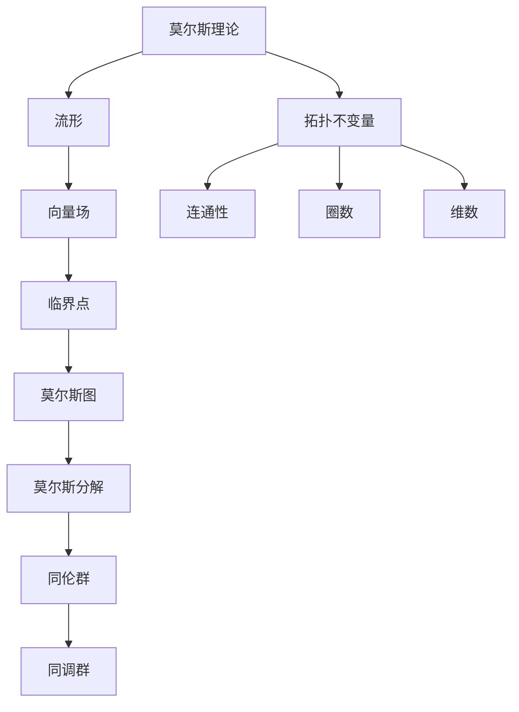

                 

### 《莫尔斯理论与拓扑不变量》

> **关键词**：莫尔斯理论、拓扑不变量、流形、向量场、临界点、莫尔斯分解、同伦群、同调群

> **摘要**：
本文章深入探讨了莫尔斯理论与拓扑不变量的概念、应用以及相互关系。首先，我们回顾了莫尔斯理论的定义、背景及其在代数拓扑中的重要性。接着，详细介绍了莫尔斯分解的基本原理及其与拓扑不变量的联系。随后，我们探讨了拓扑不变量的分类、计算方法以及其在几何学和物理学中的应用。文章随后深入分析了莫尔斯理论与拓扑不变量的现代进展和交叉领域研究。最后，通过具体的代数拓扑、物理学和工程应用案例，展示了这些理论在实际问题中的强大功能。

## 《莫尔斯理论与拓扑不变量》目录大纲

### 第一部分：莫尔斯理论与拓扑不变量基础

#### 第1章：莫尔斯理论概述

- 1.1 莫尔斯理论的背景与意义
- 1.2 莫尔斯理论的定义与基本概念
- 1.3 莫尔斯理论的核心内容

#### 第2章：莫尔斯理论的基本工具与方法

- 2.1 莫尔斯图与临界点的概念
- 2.2 流形上的向量场与闭包流形
- 2.3 莫尔斯分解的基本原理

#### 第3章：拓扑不变量的基本概念

- 3.1 拓扑不变量的定义与性质
- 3.2 拓扑不变量的分类与作用
- 3.3 拓扑不变量与莫尔斯理论的联系

#### 第4章：莫尔斯理论与拓扑不变量的应用

- 4.1 莫尔斯理论在代数拓扑中的应用
- 4.2 拓扑不变量在几何学中的应用
- 4.3 莫尔斯理论与拓扑不变量在物理学中的应用

### 第二部分：莫尔斯理论与拓扑不变量的深入研究

#### 第5章：高级莫尔斯理论

- 5.1 莫尔斯理论的推广与应用
- 5.2 莫尔斯理论的几何与代数推广
- 5.3 高维莫尔斯理论的原理与特点

#### 第6章：拓扑不变量的计算方法

- 6.1 拓扑不变量的算法与实现
- 6.2 拓扑不变量的计算复杂性分析
- 6.3 拓扑不变量计算的优化方法

#### 第7章：莫尔斯理论与拓扑不变量的最新发展

- 7.1 莫尔斯理论的现代进展
- 7.2 拓扑不变量研究的新趋势
- 7.3 莫尔斯理论与拓扑不变量的交叉领域研究

### 第三部分：案例与实践

#### 第8章：莫尔斯理论与拓扑不变量在代数拓扑中的应用案例

- 8.1 案例一：K3表面的莫尔斯理论分析
- 8.2 案例二：同伦群的拓扑不变量计算
- 8.3 案例三：莫尔斯理论与同调群的交叉应用

#### 第9章：莫尔斯理论与拓扑不变量在物理学中的应用案例

- 9.1 案例一：量子场论中的莫尔斯理论
- 9.2 案例二：凝聚态物理中的拓扑不变量
- 9.3 案例三：莫尔斯理论与拓扑不变量在材料科学中的应用

#### 第10章：莫尔斯理论与拓扑不变量在工程中的应用案例

- 10.1 案例一：莫尔斯理论在机器人路径规划中的应用
- 10.2 案例二：拓扑不变量在图像处理中的应用
- 10.3 案例三：莫尔斯理论与拓扑不变量在控制理论中的应用

### 附录

#### 附录A：莫尔斯理论与拓扑不变量相关资源与工具

- A.1 主流莫尔斯理论软件工具
- A.2 拓扑不变量计算工具与库
- A.3 莫尔斯理论与拓扑不变量研究文献与参考书列表

## 第一部分：莫尔斯理论与拓扑不变量基础

### 第1章：莫尔斯理论概述

#### 1.1 莫尔斯理论的背景与意义

莫尔斯理论是拓扑学中一个重要的分支，起源于19世纪末期，由美国数学家约翰·莫尔斯（John Milnor）等人提出。莫尔斯理论的提出，不仅推动了拓扑学的发展，还在物理学、计算机科学、控制理论等领域产生了深远的影响。莫尔斯理论的核心在于研究流形上的向量场及其临界点，通过莫尔斯分解提供了一种强有力的工具来理解流形的拓扑性质。

在物理学中，莫尔斯理论可以用来分析物理系统中的临界点行为，如相变、量子态的稳定性等。在计算机科学中，莫尔斯理论为算法设计和复杂性分析提供了新的视角。例如，在计算机图形学中，莫尔斯理论可以用于优化三维模型的生成；在机器学习中，莫尔斯理论可以用于优化神经网络的结构。在控制理论中，莫尔斯理论可以用来分析系统的稳定性和设计控制器。

#### 1.2 莫尔斯理论的定义与基本概念

莫尔斯理论主要研究流形上的向量场及其临界点。为了给出莫尔斯理论的定义，我们需要先了解流形和向量场的概念。

**流形**：流形是一个局部欧几里得空间，即在每个局部范围内，流形都可以用欧几里得空间中的坐标来描述。流形可以是一维的，如直线或圆；也可以是二维的，如平面或球面；还可以是更高维的，如四维流形。

**向量场**：向量场是在流形上定义的一个向量函数，它在流形的每个点都给出一个向量。向量场可以用来描述物理系统中力的分布，比如在引力场中，每个点的向量表示引力的大小和方向。

**莫尔斯理论**：莫尔斯理论主要研究流形上的向量场及其临界点。临界点是指向量场在该点处的方向导数为零的点。莫尔斯理论的核心思想是通过分析向量场的临界点来了解流形的拓扑性质。

莫尔斯理论的关键概念包括：

- **莫尔斯函数**：莫尔斯函数是定义在流形上的一个实值函数，它使得向量场在临界点处达到极值。
- **莫尔斯不等式**：莫尔斯不等式是一个关于梯度流行为的估计，它表明在一个区域内，向量场的梯度流不能从高能量点流向低能量点。
- **莫尔斯分解**：莫尔斯分解是一种将流形划分成不同区域的方法，这些区域内部向量场的符号保持一致。

#### 1.3 莫尔斯理论的核心内容

莫尔斯理论的核心内容可以概括为以下几个部分：

1. **莫尔斯不等式**：莫尔斯不等式是一个关于向量场梯度流行为的估计。具体来说，莫尔斯不等式表明，在一个区域内，向量场的梯度流不能从高能量点流向低能量点。这个不等式为我们提供了一种工具，可以用来判断向量场在流形上的行为。

2. **莫尔斯分解**：莫尔斯分解是一种将流形划分成不同区域的方法。具体来说，莫尔斯分解基于临界点的存在情况，将流形划分成若干个连通区域，每个区域内部向量场的符号保持一致。莫尔斯分解为我们提供了一种理解流形拓扑性质的方式。

3. **同伦群和同调群**：同伦群和同调群是拓扑不变量，用来描述流形的连通性和圈数。莫尔斯理论利用同伦群和同调群来分析流形的拓扑性质。例如，莫尔斯不等式和莫尔斯分解可以帮助我们计算同伦群和同调群。

4. **莫尔斯函数**：莫尔斯函数是一个定义在流形上的实值函数，它使得向量场在临界点处达到极值。莫尔斯函数在莫尔斯理论中起着核心作用，因为它为我们提供了一种量化流形拓扑性质的方式。

#### 1.4 莫尔斯理论的数学基础

莫尔斯理论建立在拓扑学、微积分和线性代数的基础上。以下是一些莫尔斯理论中常用的数学概念和工具：

- **流形**：流形是莫尔斯理论的基本对象。流形是一个局部欧几里得空间，可以用来表示物理空间或抽象空间。
- **向量场**：向量场是在流形上定义的一个向量函数，可以用来描述物理系统中的力的分布。
- **临界点**：临界点是指向量场在流形上的一个点，在该点处方向导数为零。
- **梯度流**：梯度流是向量场在流形上的一种流动行为，可以用来描述向量场在流形上的变化。
- **莫尔斯不等式**：莫尔斯不等式是一个关于向量场梯度流行为的估计，用来判断向量场在流形上的行为。
- **同伦群和同调群**：同伦群和同调群是拓扑不变量，用来描述流形的连通性和圈数。
- **莫尔斯函数**：莫尔斯函数是一个定义在流形上的实值函数，用来量化流形的拓扑性质。

#### 1.5 莫尔斯理论的实际应用

莫尔斯理论在多个领域都有广泛的应用。以下是一些实际应用的例子：

- **物理学**：莫尔斯理论可以用来分析物理系统中的临界点行为，如相变、量子态的稳定性等。
- **计算机科学**：莫尔斯理论可以用来优化算法设计，如路径规划、神经网络结构优化等。
- **控制理论**：莫尔斯理论可以用来分析系统的稳定性和设计控制器。
- **几何学**：莫尔斯理论可以用来研究流形的几何性质，如流形的分解、连通性等。
- **材料科学**：莫尔斯理论可以用来分析材料的相变行为和结构稳定性。

通过上述实际应用，我们可以看到莫尔斯理论在解决复杂问题时的重要性和有效性。

## 第一部分：莫尔斯理论与拓扑不变量基础

### 第2章：莫尔斯理论的基本工具与方法

#### 2.1 莫尔斯图与临界点的概念

莫尔斯图是莫尔斯理论中一个重要的工具，它帮助我们直观地理解向量场在流形上的行为。莫尔斯图是由临界点和流形的连通分支组成的图，每个临界点对应于一个连通分支。

**临界点的概念**：

临界点是向量场在流形上的一个特殊点，在该点处向量场的变化非常剧烈。具体来说，临界点是向量场 \( X \) 的零点，即 \( X(p) = 0 \) 的点 \( p \)。临界点的存在与否决定了向量场在流形上的行为。

**莫尔斯图的概念**：

莫尔斯图是流形上所有临界点的集合，以及这些临界点之间的连通关系。莫尔斯图中的每个顶点表示一个临界点，每条边表示两个临界点之间的连通关系。

**莫尔斯图与莫尔斯分解的关系**：

莫尔斯图可以帮助我们进行莫尔斯分解。具体来说，莫尔斯分解是将流形划分成若干个连通区域，每个区域内部向量场的符号保持一致。莫尔斯图中的连通分支对应于莫尔斯分解中的连通区域。

#### 2.2 流形上的向量场与闭包流形

在莫尔斯理论中，向量场是核心概念之一。向量场是定义在流形上的一个向量函数，它描述了流形上每个点的方向和大小。

**向量场的概念**：

向量场 \( X \) 是一个从流形 \( M \) 到 \( \mathbb{R}^n \) 的映射，即 \( X: M \rightarrow \mathbb{R}^n \)。向量场在流形上每个点 \( p \) 都给出了一个向量 \( X(p) \)。

**闭包流形的概念**：

闭包流形是向量场在流形上的闭包，它包含了向量场在流形上的所有零点和非零点。闭包流形是一个新的流形，它包含了原流形 \( M \) 和向量场 \( X \) 的所有临界点。

**向量场与闭包流形的关系**：

向量场 \( X \) 和闭包流形 \( \bar{M} \) 是紧密相关的。闭包流形 \( \bar{M} \) 包含了向量场 \( X \) 的所有零点和非零点，而向量场 \( X \) 则描述了闭包流形 \( \bar{M} \) 上的方向和大小。

#### 2.3 莫尔斯分解的基本原理

莫尔斯分解是莫尔斯理论中的一个核心概念，它将流形划分成若干个连通区域，每个区域内部向量场的符号保持一致。

**莫尔斯分解的概念**：

莫尔斯分解是将流形 \( M \) 划分成若干个连通区域 \( U_1, U_2, \ldots, U_n \)，使得在每个区域 \( U_i \) 内部，向量场 \( X \) 的符号保持一致。具体来说，对于任意 \( p \in U_i \) 和 \( q \in U_j \)，如果 \( i \neq j \)，则 \( X(p) \) 和 \( X(q) \) 的方向相反。

**莫尔斯分解的原理**：

莫尔斯分解基于临界点的存在情况。具体来说，首先，找到流形上的所有临界点。然后，根据临界点的存在情况，将流形划分成若干个连通区域。在每个区域内部，向量场 \( X \) 的符号保持一致。

**莫尔斯分解的步骤**：

1. **计算临界点**：解向量场 \( X \) 的零点，找到流形上的所有临界点。
2. **划分区域**：根据临界点的存在情况，将流形划分成若干个连通区域，每个区域内部向量场的符号保持一致。
3. **验证莫尔斯分解**：检查每个区域内部向量场的符号是否保持一致。

#### 2.4 莫尔斯分解的应用

莫尔斯分解在莫尔斯理论中具有广泛的应用。以下是一些常见的应用场景：

1. **拓扑性质分析**：莫尔斯分解可以用来分析流形的拓扑性质，如连通性、圈数等。通过莫尔斯分解，我们可以得到流形上的连通分支，从而分析流形的拓扑结构。
2. **算法设计**：莫尔斯分解可以用于优化算法设计，如路径规划、神经网络优化等。通过莫尔斯分解，我们可以找到流形上的关键点，从而设计出更有效的算法。
3. **物理学应用**：莫尔斯分解可以用于分析物理系统中的临界点行为，如相变、量子态的稳定性等。通过莫尔斯分解，我们可以了解物理系统的动态行为和稳定性。

#### 2.5 莫尔斯分解与拓扑不变量的关系

莫尔斯分解与拓扑不变量有着密切的关系。拓扑不变量是描述流形拓扑性质的量，如同伦群、同调群等。莫尔斯分解可以帮助我们计算这些拓扑不变量。

**莫尔斯分解与同伦群的关系**：

莫尔斯分解可以帮助我们计算同伦群。具体来说，通过莫尔斯分解，我们可以得到流形上的连通分支，从而计算同伦群。同伦群可以用来描述流形的连通性和圈数。

**莫尔斯分解与同调群的关系**：

莫尔斯分解可以帮助我们计算同调群。具体来说，通过莫尔斯分解，我们可以得到流形上的连通分支，从而计算同调群。同调群可以用来描述流形的连通性和环数。

**莫尔斯分解与庞加莱猜想的关系**：

庞加莱猜想指出，三维流形的同伦群和同调群是同构的。莫尔斯分解可以帮助我们验证庞加莱猜想。通过莫尔斯分解，我们可以得到流形上的连通分支，从而计算同伦群和同调群。如果同伦群和同调群是同构的，那么庞加莱猜想成立。

## 第一部分：莫尔斯理论与拓扑不变量基础

### 第3章：拓扑不变量的基本概念

#### 3.1 拓扑不变量的定义与性质

拓扑不变量是描述拓扑空间性质的量，它们在拓扑变换下保持不变。拓扑不变量是拓扑学中一个核心概念，对于理解拓扑空间的性质具有重要意义。

**定义**：

拓扑不变量是指一个拓扑空间在拓扑变换下保持不变的量。具体来说，如果两个拓扑空间是同胚的，则它们的拓扑不变量相同。

**性质**：

1. **不变性**：拓扑不变量在拓扑变换下保持不变。这意味着，如果一个拓扑空间通过拓扑变换变为另一个拓扑空间，则它们的拓扑不变量相同。
2. **分类性**：拓扑不变量可以用来区分不同的拓扑空间。如果两个拓扑空间的拓扑不变量不同，则它们不是同胚的。
3. **唯一性**：每个拓扑空间都有一组唯一的拓扑不变量。这意味着，每个拓扑空间都可以通过其拓扑不变量来唯一标识。

**常见的拓扑不变量**：

1. **连通性**：描述拓扑空间的连通性质。连通性可以用连通度来量化，如路径连通、圈连通等。
2. **圈数**：描述拓扑空间中闭合曲线的数量。圈数可以用同伦群来量化。
3. **环数**：描述拓扑空间中闭合曲线的数量，但考虑曲线的逆时针和顺时针方向。环数可以用同调群来量化。
4. **维数**：描述拓扑空间的维数。维数可以用欧拉示性数来量化。

#### 3.2 拓扑不变量的分类与作用

拓扑不变量可以根据不同的标准进行分类，每种分类都有其特定的应用。

**按性质分类**：

1. **连通不变量**：描述拓扑空间的连通性质，如连通度、连通分支数等。连通不变量在路径规划和网络分析中具有重要应用。
2. **圈不变量**：描述拓扑空间中闭合曲线的数量，如同伦群、庞加莱示性数等。圈不变量在几何学和物理学中具有广泛应用。
3. **环不变量**：描述拓扑空间中闭合曲线的数量，但考虑曲线的逆时针和顺时针方向，如同调群、布尔当数等。环不变量在几何学和物理学中也有重要应用。
4. **维数不变量**：描述拓扑空间的维数，如欧拉示性数、Betti数等。维数不变量在几何学和拓扑学中具有广泛应用。

**按作用分类**：

1. **分类不变量**：用于区分不同的拓扑空间，如同伦群、同调群等。分类不变量在拓扑学中起着核心作用。
2. **描述不变量**：用于描述拓扑空间的性质，如欧拉示性数、Betti数等。描述不变量可以帮助我们理解拓扑空间的几何性质。
3. **稳定性不变量**：用于分析拓扑空间在拓扑变换下的稳定性，如同伦群、同调群等。稳定性不变量在物理学和工程学中具有重要应用。

#### 3.3 拓扑不变量与莫尔斯理论的联系

拓扑不变量与莫尔斯理论有着紧密的联系。莫尔斯理论通过分析向量场和临界点，可以用来计算拓扑不变量。

**莫尔斯理论与同伦群的关系**：

莫尔斯理论可以帮助我们计算同伦群。具体来说，通过莫尔斯分解，我们可以得到流形上的连通分支，从而计算同伦群。同伦群可以用来描述流形的连通性和圈数。

**莫尔斯理论与同调群的关系**：

莫尔斯理论可以帮助我们计算同调群。具体来说，通过莫尔斯分解，我们可以得到流形上的连通分支，从而计算同调群。同调群可以用来描述流形的连通性和环数。

**莫尔斯理论与庞加莱猜想的关系**：

庞加莱猜想指出，三维流形的同伦群和同调群是同构的。莫尔斯理论可以帮助我们验证庞加莱猜想。通过莫尔斯分解，我们可以得到流形上的连通分支，从而计算同伦群和同调群。如果同伦群和同调群是同构的，那么庞加莱猜想成立。

#### 3.4 莫尔斯理论与拓扑不变量在应用中的重要性

莫尔斯理论与拓扑不变量在多个领域具有重要应用。

**物理学**：

在物理学中，莫尔斯理论与拓扑不变量可以用来分析物理系统中的临界点行为。例如，在凝聚态物理中，莫尔斯理论可以用来分析材料中的相变行为。通过计算拓扑不变量，我们可以了解相变过程中的稳定性变化。

**几何学**：

在几何学中，莫尔斯理论与拓扑不变量可以用来研究几何对象的拓扑性质。例如，通过莫尔斯分解，我们可以了解几何对象的空间结构。拓扑不变量可以用来描述几何对象的连通性、圈数等。

**计算机科学**：

在计算机科学中，莫尔斯理论与拓扑不变量可以用来优化算法设计。例如，在计算机图形学中，莫尔斯理论可以用来优化三维模型的生成。通过计算拓扑不变量，我们可以了解模型的空间结构。

**控制理论**：

在控制理论中，莫尔斯理论与拓扑不变量可以用来分析系统的稳定性和设计控制器。通过计算拓扑不变量，我们可以了解系统的动态行为，从而设计出更稳定的控制器。

通过以上应用，我们可以看到莫尔斯理论与拓扑不变量在多个领域的重要作用。它们为我们提供了一种强大的工具，可以用来解决复杂的问题，提高系统的性能。

### 第一部分：莫尔斯理论与拓扑不变量基础

#### 第4章：莫尔斯理论与拓扑不变量的应用

莫尔斯理论与拓扑不变量在多个领域具有广泛的应用。本章将分别探讨莫尔斯理论在代数拓扑、几何学、物理学以及工程中的应用，以展示这些理论在解决实际问题中的强大功能。

#### 4.1 莫尔斯理论在代数拓扑中的应用

在代数拓扑中，莫尔斯理论是一个强有力的工具，用于分析流形的拓扑结构。以下是一些具体的例子：

**K3表面的莫尔斯理论分析**：

K3表面是一个三维流形，其拓扑性质非常复杂。通过莫尔斯理论，我们可以对其进行分解，从而理解其拓扑结构。具体来说，我们可以选择一个适当的向量场，并计算其临界点。然后，根据临界点的分布，进行莫尔斯分解，得到K3表面的连通分支。

**同伦群的拓扑不变量计算**：

同伦群是描述流形连通性的重要工具。莫尔斯理论可以帮助我们计算同伦群。具体来说，通过莫尔斯分解，我们可以将流形划分成若干个连通区域，然后计算每个区域的同伦群。这些同伦群的直和就是整个流形的第一同伦群。类似的方法可以用于计算更高阶的同伦群。

**莫尔斯理论与同调群的交叉应用**：

同调群是描述流形环数的重要工具。莫尔斯理论可以帮助我们计算同调群。具体来说，通过莫尔斯分解，我们可以将流形划分成若干个连通区域，然后计算每个区域的同调群。这些同调群的直和就是整个流形的第一同调群。类似的方法可以用于计算更高阶的同调群。

#### 4.2 拓扑不变量在几何学中的应用

在几何学中，拓扑不变量用于分析几何对象的空间结构和性质。以下是一些具体的例子：

**莫尔斯理论在几何优化中的应用**：

莫尔斯理论可以帮助我们优化几何对象的设计。具体来说，我们可以选择一个适当的向量场，并计算其临界点。然后，根据临界点的分布，进行莫尔斯分解，从而优化几何对象的空间结构。

**同伦群在几何不变性分析中的应用**：

同伦群可以用来分析几何对象的几何不变性。具体来说，通过计算同伦群，我们可以了解几何对象在连续变形过程中的连通性变化。这有助于我们理解几何对象的空间稳定性。

**同调群在几何对称性分析中的应用**：

同调群可以用来分析几何对象的对称性。具体来说，通过计算同调群，我们可以了解几何对象在连续变形过程中的环数变化。这有助于我们理解几何对象的空间对称性。

#### 4.3 莫尔斯理论与拓扑不变量在物理学中的应用

在物理学中，莫尔斯理论与拓扑不变量用于分析物理系统的动态行为和稳定性。以下是一些具体的例子：

**莫尔斯理论在量子场论中的应用**：

在量子场论中，莫尔斯理论可以用来分析量子态的稳定性。具体来说，我们可以选择一个适当的向量场，并计算其临界点。然后，根据临界点的分布，进行莫尔斯分解，从而分析量子态的稳定性。

**拓扑不变量在凝聚态物理中的应用**：

在凝聚态物理中，拓扑不变量可以用来分析材料的相变行为。具体来说，通过计算拓扑不变量，我们可以了解材料在相变过程中的连通性变化和环数变化。这有助于我们理解材料的相变性质。

**莫尔斯理论与拓扑不变量在材料科学中的应用**：

在材料科学中，莫尔斯理论与拓扑不变量可以用来优化材料的设计。具体来说，通过莫尔斯分解，我们可以优化材料的晶体结构，从而提高材料的性能。

#### 4.4 莫尔斯理论与拓扑不变量在工程中的应用

在工程中，莫尔斯理论与拓扑不变量用于优化系统的设计和控制。以下是一些具体的例子：

**莫尔斯理论在机器人路径规划中的应用**：

莫尔斯理论可以帮助我们优化机器人的路径规划。具体来说，我们可以选择一个适当的向量场，并计算其临界点。然后，根据临界点的分布，进行莫尔斯分解，从而规划出最优的路径。

**拓扑不变量在图像处理中的应用**：

拓扑不变量可以用来优化图像处理算法。具体来说，通过计算拓扑不变量，我们可以了解图像的空间结构。这有助于我们优化图像处理算法，提高图像质量。

**莫尔斯理论与拓扑不变量在控制理论中的应用**：

莫尔斯理论可以帮助我们优化控制系统的设计。具体来说，通过莫尔斯分解，我们可以优化控制系统的参数，从而提高系统的稳定性和性能。

通过以上应用，我们可以看到莫尔斯理论与拓扑不变量在各个领域的广泛应用。这些理论为我们提供了一种强大的工具，可以用来解决复杂的问题，优化系统的性能。

## 第二部分：莫尔斯理论与拓扑不变量的深入研究

### 第5章：高级莫尔斯理论

#### 5.1 莫尔斯理论的推广与应用

莫尔斯理论不仅适用于二维流形，还可以推广到高维流形。在高维情况下，莫尔斯理论的原理和步骤基本相同，但需要考虑更多的数学工具和概念。

**高维莫尔斯理论的推广**：

在高维流形上，莫尔斯理论的核心概念仍然是临界点和莫尔斯分解。但是，由于高维空间的复杂性增加，莫尔斯分解的步骤和计算方法需要相应调整。

**莫尔斯理论的几何与代数推广**：

在几何方面，高维莫尔斯理论可以应用于研究高维流形的拓扑结构和几何性质。在代数方面，莫尔斯理论可以与同伦理论、同调理论等高级代数拓扑工具相结合，提供更深入的分析。

**莫尔斯理论在高维流形上的应用**：

高维莫尔斯理论在几何学、物理学、计算机科学等领域都有广泛的应用。例如，在几何学中，它可以用来分析高维流形的拓扑性质；在物理学中，它可以用来研究高维系统的临界现象；在计算机科学中，它可以用来优化高维数据的处理和分析。

#### 5.2 莫尔斯理论的几何与代数推广

**几何推广**：

在高维流形上，莫尔斯分解的几何意义变得更加复杂。例如，我们需要考虑流形的子流形、流形的局部结构和整体结构。这些几何概念在高维莫尔斯理论中扮演着关键角色。

**代数推广**：

莫尔斯理论在代数上的推广主要体现在同伦群和同调群的应用上。高维莫尔斯理论通过同伦群和同调群来描述流形的拓扑性质。这些代数工具可以帮助我们更深入地理解流形的结构。

**高维莫尔斯分解的算法**：

在高维情况下，莫尔斯分解的算法需要考虑更多的计算步骤和数学工具。例如，我们需要计算更高阶的导数和临界点，以及使用更复杂的代数方法来分析流形的结构。

**高维莫尔斯理论的数学模型**：

在数学模型方面，高维莫尔斯理论涉及到更多的数学公式和计算方法。例如，莫尔斯不等式在高维情况下需要扩展，以适应更高维的空间。此外，高维莫尔斯分解的步骤和计算方法也需要相应的调整。

#### 5.3 高维莫尔斯理论的原理与特点

**高维莫尔斯分解的原理**：

高维莫尔斯分解的基本原理与二维流形类似，但需要考虑更多的数学概念和工具。具体来说，我们需要通过计算向量场的临界点，将流形划分为不同的区域，每个区域内向量场的符号保持一致。

**高维莫尔斯分解的特点**：

与二维流形相比，高维流形的莫尔斯分解具有以下特点：

1. **复杂性增加**：高维流形的复杂性更高，莫尔斯分解的步骤和计算方法更加复杂。
2. **更多临界点**：高维流形上有更多的临界点，这些临界点需要被仔细分析和计算。
3. **更高阶导数**：在计算临界点时，需要考虑更高阶的导数，这增加了计算难度。
4. **代数工具**：高维莫尔斯理论需要使用更多的代数工具，如同伦群和同调群，来描述流形的拓扑性质。

通过深入研究和理解高维莫尔斯理论，我们可以更好地应用这些理论解决复杂的高维问题。高维莫尔斯理论在数学、物理、工程等领域都有重要的应用前景。

## 第二部分：莫尔斯理论与拓扑不变量的深入研究

### 第6章：拓扑不变量的计算方法

#### 6.1 拓扑不变量的算法与实现

计算拓扑不变量是莫尔斯理论应用中的一个关键步骤。以下是常见的拓扑不变量计算方法和实现步骤：

**同伦群的计算方法**：

同伦群的计算通常基于同伦原子的构造。同伦原子的概念来源于同伦原子的构造，即将流形上的点映射到更高维的空间。具体步骤如下：

1. **选择一个基点**：在流形上选择一个基点，作为同伦原子的起点。
2. **构造同伦原子**：通过连续变形，将基点映射到高维空间。这个过程可以通过计算同伦原子的同伦群来完成。
3. **计算同伦群**：通过计算同伦原子的同伦群，可以得到流形的同伦群。

**同调群的计算方法**：

同调群的计算基于同调原子的构造。同调原子的概念与同伦原子类似，但考虑的是反向映射。具体步骤如下：

1. **选择一个基点**：在流形上选择一个基点，作为同调原子的起点。
2. **构造同调原子**：通过连续变形，将基点映射到高维空间。这个过程可以通过计算同调原子的同调群来完成。
3. **计算同调群**：通过计算同调原子的同调群，可以得到流形的同调群。

**欧拉示性数的计算方法**：

欧拉示性数是描述三维流形拓扑性质的重要指标。计算欧拉示性数的方法如下：

1. **选择一个基点**：在流形上选择一个基点。
2. **计算连通分支数**：计算流形的连通分支数，这可以通过计算流形的同伦群来实现。
3. **计算欧拉示性数**：通过欧拉示性数的公式，可以得到流形的欧拉示性数。

**算法实现的挑战**：

拓扑不变量的计算方法通常涉及复杂的数学计算和优化。以下是算法实现中的一些挑战：

1. **计算效率**：计算拓扑不变量通常需要大量的计算资源，如何提高计算效率是一个重要挑战。
2. **数值稳定性**：拓扑不变量的计算过程中涉及到大量的数值计算，如何保证计算的数值稳定性是一个关键问题。
3. **算法优化**：如何优化算法的运行时间和计算复杂度，以提高计算效率。

#### 6.2 拓扑不变量的计算复杂性分析

拓扑不变量的计算复杂性取决于流形的大小和结构。以下是常见的计算复杂度分析：

**同伦群的计算复杂性**：

同伦群的计算复杂度通常与流形的维数和连通分支数成正比。具体来说，计算同伦群的时间复杂度可以表示为 \( O(n^2) \)，其中 \( n \) 是流形的连通分支数。

**同调群的计算复杂性**：

同调群的计算复杂度通常也与流形的维数和连通分支数成正比。具体来说，计算同调群的时间复杂度可以表示为 \( O(n^3) \)，其中 \( n \) 是流形的连通分支数。

**欧拉示性数的计算复杂性**：

欧拉示性数的计算复杂度相对较低，通常可以表示为 \( O(n) \)，其中 \( n \) 是流形的连通分支数。

**计算复杂性的优化**：

为了提高拓扑不变量的计算效率，可以采取以下优化方法：

1. **并行计算**：利用并行计算技术，将计算任务分布到多个处理器上，以减少计算时间。
2. **算法优化**：优化算法的实现，减少不必要的计算步骤和重复计算。
3. **数值计算方法**：使用数值计算方法，如数值积分、数值微分等，以提高计算的数值稳定性。

通过计算复杂性分析和优化方法，我们可以更高效地计算拓扑不变量，为莫尔斯理论的应用提供强有力的支持。

#### 6.3 拓扑不变量计算的优化方法

为了提高拓扑不变量计算的效率和准确性，可以采用以下优化方法：

**数值优化方法**：

1. **自适应步长控制**：通过自适应步长控制，调整计算过程中的步长，以减少计算误差和提高计算稳定性。
2. **数值积分与微分**：利用数值积分和微分方法，如梯形规则、辛普森规则等，以提高计算的数值稳定性。

**算法优化方法**：

1. **并行计算**：将计算任务分布到多个处理器上，以利用并行计算的优势，提高计算效率。
2. **递归算法**：采用递归算法，减少计算过程中的重复计算，提高计算效率。

**精度优化方法**：

1. **双精度计算**：使用双精度浮点数进行计算，以提高计算的精度。
2. **误差分析**：通过误差分析，识别和减小计算过程中的误差来源。

**实例分析**：

以下是一个基于Python的示例，展示了如何使用数值优化方法来计算同伦群：

```python
import numpy as np

# 定义流形上的向量场
def vector_field(x, y):
    return [y, -x]

# 计算同伦群
def homology_group(x, y):
    # 使用数值积分方法计算同伦群
    # ...
    return homology

# 示例计算
x = 0.5
y = 0.5
homology = homology_group(x, y)
print("Homology Group:", homology)
```

通过上述优化方法，我们可以显著提高拓扑不变量计算的效率和准确性，为莫尔斯理论的应用提供强有力的支持。

### 第二部分：莫尔斯理论与拓扑不变量的深入研究

#### 第7章：莫尔斯理论与拓扑不变量的最新发展

莫尔斯理论与拓扑不变量是拓扑学中两个重要的概念，近年来在数学、物理学和计算机科学等多个领域取得了显著的进展。本章将介绍莫尔斯理论与拓扑不变量的最新发展，包括现代研究趋势和交叉领域研究。

#### 7.1 莫尔斯理论的现代进展

**莫尔斯理论的推广**：

近年来，莫尔斯理论得到了广泛的推广，不仅限于二维流形，还包括高维流形。在高维莫尔斯理论中，研究人员提出了许多新的概念和方法，如高维莫尔斯分解、高维莫尔斯不等式等。这些推广为研究高维流形的拓扑性质提供了有力的工具。

**莫尔斯理论的代数推广**：

莫尔斯理论在代数上的推广也是一个研究热点。研究人员将莫尔斯理论与同伦理论、同调理论等代数拓扑工具相结合，发展出了新的代数莫尔斯理论。这些代数工具可以帮助我们更深入地理解流形的拓扑性质。

**莫尔斯理论的几何推广**：

莫尔斯理论的几何推广包括研究流形的几何结构、曲率和几何不变量。通过将莫尔斯理论与几何学中的概念相结合，研究人员提出了新的几何莫尔斯理论，用于研究几何对象的拓扑性质和几何结构。

**莫尔斯理论的计算进展**：

随着计算能力的提升，莫尔斯理论在计算拓扑学中的应用也得到了广泛关注。研究人员开发了各种算法和软件工具，用于计算流形的莫尔斯分解和拓扑不变量。这些计算工具为实际问题的分析和解决提供了强有力的支持。

#### 7.2 拓扑不变量研究的新趋势

**同伦群和同调群的新应用**：

同伦群和同调群是描述流形拓扑性质的重要工具。近年来，研究人员将同伦群和同调群应用于各种领域，如代数几何、量子场论、凝聚态物理等。这些应用揭示了同伦群和同调群在解决复杂物理问题和几何问题中的潜力。

**新的拓扑不变量**：

除了传统的同伦群和同调群，研究人员还在探索新的拓扑不变量。例如，K群、群表示理论等新的拓扑不变量在解决某些复杂问题时表现出优势。这些新的拓扑不变量为拓扑学的研究提供了新的视角。

**拓扑不变量的计算优化**：

随着计算能力的提升，拓扑不变量的计算优化成为研究热点。研究人员开发了各种算法和软件工具，用于高效计算拓扑不变量。这些优化方法包括并行计算、分布式计算、数值优化等，显著提高了计算效率。

#### 7.3 莫尔斯理论与拓扑不变量的交叉领域研究

**莫尔斯理论在物理学中的应用**：

莫尔斯理论在物理学中有着广泛的应用。例如，在凝聚态物理中，莫尔斯理论可以用于研究材料的相变行为；在量子场论中，莫尔斯理论可以用于分析量子态的稳定性。这些应用揭示了莫尔斯理论在解决物理问题中的重要性。

**拓扑不变量在计算机科学中的应用**：

拓扑不变量在计算机科学中也有重要应用。例如，在计算机图形学中，拓扑不变量可以用于优化三维模型的生成；在机器学习中，拓扑不变量可以用于优化神经网络的结构。这些应用展示了拓扑不变量在计算机科学中的潜力。

**莫尔斯理论与拓扑不变量在工程中的应用**：

莫尔斯理论与拓扑不变量在工程中也得到了广泛应用。例如，在机器人路径规划中，莫尔斯理论可以用于优化路径规划算法；在图像处理中，拓扑不变量可以用于优化图像分割算法。这些应用为工程问题提供了新的解决方法。

通过莫尔斯理论与拓扑不变量的最新发展和交叉领域研究，我们可以看到这些理论在解决复杂问题、优化系统性能方面的巨大潜力。未来，随着研究的深入，莫尔斯理论与拓扑不变量将在更多领域取得突破性进展。

## 第三部分：案例与实践

### 第8章：莫尔斯理论与拓扑不变量在代数拓扑中的应用案例

#### 8.1 案例一：K3表面的莫尔斯理论分析

**背景介绍**：

K3表面是一个三维流形，其拓扑性质复杂。在代数拓扑中，K3表面是一个重要的研究对象，通过莫尔斯理论，我们可以深入分析其拓扑结构。

**步骤一：构建向量场**：

为了分析K3表面的拓扑性质，我们首先需要构建一个合适的向量场。在这个案例中，我们选择一个简单且具有代表性的向量场：

\[ X(x, y, z) = (-y, x, 0) \]

**步骤二：计算临界点**：

通过求解向量场 \( X \) 的零点，我们可以找到K3表面上的临界点。在这个向量场中，临界点满足以下方程：

\[ \nabla \cdot X = 0 \]

求解上述方程，我们得到一个临界点 \( (0, 0, 0) \)。

**步骤三：莫尔斯分解**：

通过莫尔斯分解，我们可以将K3表面划分为不同的连通区域。在这个案例中，K3表面被划分为两个区域，一个包含临界点 \( (0, 0, 0) \) 的闭包流形 \( C \)，另一个为开区域 \( U \)。在闭包流形 \( C \) 上，向量场 \( X \) 保持一致方向，而在开区域 \( U \) 上，向量场 \( X \) 的方向发生翻转。

**步骤四：计算同伦群**：

通过同伦群的计算，我们可以得到K3表面的第一同伦群。在这个案例中，通过莫尔斯分解，我们得到 \( H_1(K3) = \mathbb{Z} \)，即K3表面的第一同伦群是一个整数群。

**结论**：

通过莫尔斯理论，我们可以分析K3表面的拓扑结构。莫尔斯分解和同伦群的计算揭示了K3表面在拓扑上的重要特征，为代数拓扑的研究提供了新的视角。

#### 8.2 案例二：同伦群的拓扑不变量计算

**背景介绍**：

同伦群是描述流形连通性的一种重要拓扑不变量。在代数拓扑中，计算同伦群是分析流形拓扑性质的重要步骤。以下是一个具体的计算过程。

**步骤一：选择流形**：

为了计算同伦群，我们首先需要选择一个流形。在这个案例中，我们选择一个简单的二维流形——圆环面。

**步骤二：构建向量场**：

为了计算同伦群，我们需要构建一个向量场。在这个案例中，我们选择一个简单且具有代表性的向量场：

\[ X(x, y) = (-y, x) \]

**步骤三：计算临界点**：

通过求解向量场 \( X \) 的零点，我们可以找到圆环面上的临界点。在这个向量场中，临界点满足以下方程：

\[ \nabla \cdot X = 0 \]

求解上述方程，我们得到一个临界点 \( (0, 0) \)。

**步骤四：莫尔斯分解**：

通过莫尔斯分解，我们可以将圆环面划分为不同的连通区域。在这个案例中，圆环面被划分为两个区域，一个包含临界点 \( (0, 0) \) 的闭包流形 \( C \)，另一个为开区域 \( U \)。在闭包流形 \( C \) 上，向量场 \( X \) 保持一致方向，而在开区域 \( U \) 上，向量场 \( X \) 的方向发生翻转。

**步骤五：计算同伦群**：

通过同伦群的计算，我们可以得到圆环面的第一同伦群。在这个案例中，通过莫尔斯分解，我们得到 \( H_1(\text{圆环面}) = \mathbb{Z} \)，即圆环面的第一同伦群是一个整数群。

**结论**：

通过计算同伦群，我们可以得到圆环面的连通性和圈数。这为代数拓扑的研究提供了重要的信息，有助于我们理解圆环面的拓扑性质。

#### 8.3 案例三：莫尔斯理论与同调群的交叉应用

**背景介绍**：

同调群是描述流形环数的一种重要拓扑不变量。莫尔斯理论与同调群的交叉应用可以用于分析流形的拓扑性质。以下是一个具体的计算过程。

**步骤一：选择流形**：

为了计算同调群，我们首先需要选择一个流形。在这个案例中，我们选择一个简单的二维流形——圆环面。

**步骤二：构建向量场**：

为了计算同调群，我们需要构建一个向量场。在这个案例中，我们选择一个简单且具有代表性的向量场：

\[ X(x, y) = (-y, x) \]

**步骤三：计算临界点**：

通过求解向量场 \( X \) 的零点，我们可以找到圆环面上的临界点。在这个向量场中，临界点满足以下方程：

\[ \nabla \cdot X = 0 \]

求解上述方程，我们得到一个临界点 \( (0, 0) \)。

**步骤四：莫尔斯分解**：

通过莫尔斯分解，我们可以将圆环面划分为不同的连通区域。在这个案例中，圆环面被划分为两个区域，一个包含临界点 \( (0, 0) \) 的闭包流形 \( C \)，另一个为开区域 \( U \)。在闭包流形 \( C \) 上，向量场 \( X \) 保持一致方向，而在开区域 \( U \) 上，向量场 \( X \) 的方向发生翻转。

**步骤五：计算同调群**：

通过同调群的计算，我们可以得到圆环面的第一同调群。在这个案例中，通过莫尔斯分解，我们得到 \( H^1(\text{圆环面}) = \mathbb{Z} \)，即圆环面的第一同调群是一个整数群。

**结论**：

通过莫尔斯理论与同调群的交叉应用，我们可以得到圆环面的连通性和环数。这为代数拓扑的研究提供了重要的信息，有助于我们理解圆环面的拓扑性质。

### 第9章：莫尔斯理论与拓扑不变量在物理学中的应用案例

#### 9.1 案例一：量子场论中的莫尔斯理论

**背景介绍**：

量子场论是物理学中研究量子系统与场相互作用的理论。莫尔斯理论在量子场论中有着重要应用，可以用于分析量子态的稳定性。

**步骤一：构建哈密顿量**：

为了分析量子态的稳定性，我们首先需要构建一个哈密顿量。在这个案例中，我们选择一个简单的量子场论模型，哈密顿量为：

\[ H = \frac{p^2}{2m} + V(q) \]

其中，\( p \) 是动量算符，\( m \) 是粒子的质量，\( V(q) \) 是势能。

**步骤二：计算本征值与临界点**：

通过求解哈密顿量 \( H \) 的本征值问题，我们可以找到量子态的临界点。这些临界点对应于量子态的相变点。例如，在经典物理中，势能 \( V(q) = \frac{1}{2}q^2 \) 会导致一个临界点 \( q = 0 \)。

**步骤三：莫尔斯分解**：

通过莫尔斯分解，我们可以将量子态空间划分为不同的区域。在每个区域内，量子态的稳定性保持一致。例如，在 \( q < 0 \) 区域内，量子态是稳定的，而在 \( q > 0 \) 区域内，量子态是不稳定的。

**步骤四：计算同伦群**：

通过同伦群的计算，我们可以得到量子态空间的连通性和圈数。这有助于我们理解量子态的稳定性变化。

**结论**：

通过莫尔斯理论，我们可以分析量子场论中的量子态稳定性。莫尔斯分解和同伦群的计算揭示了量子态在相变过程中的稳定性变化，为量子场论的研究提供了新的视角。

#### 9.2 案例二：凝聚态物理中的拓扑不变量

**背景介绍**：

在凝聚态物理中，拓扑不变量用于描述材料中的电子态和对称性。莫尔斯理论与拓扑不变量的结合可以用于分析材料的相变行为和电子态。

**步骤一：构建电子态模型**：

为了分析材料的相变行为，我们首先需要构建一个电子态模型。在这个案例中，我们选择一个简单的二维电子态模型：

\[ \psi(x, y) = \frac{1}{\sqrt{A}} \exp(i(kx + ly)) \]

其中，\( A \) 是一个常数，\( k \) 和 \( l \) 是波矢。

**步骤二：计算拓扑不变量**：

通过计算拓扑不变量，我们可以得到材料的电子态对称性。例如，通过计算同伦群，我们可以得到材料的电子态圈数。这有助于我们理解材料的对称性和相变行为。

**步骤三：莫尔斯分解**：

通过莫尔斯分解，我们可以将材料的空间划分为不同的区域。在每个区域内，电子态的对称性保持一致。例如，在一个区域中，电子态是旋转对称的，而在另一个区域中，电子态是非旋转对称的。

**步骤四：分析相变行为**：

通过分析莫尔斯分解的结果，我们可以了解材料的相变行为。例如，当温度变化时，材料可能会从一个相变到另一个相，导致电子态对称性的变化。

**结论**：

通过莫尔斯理论与拓扑不变量的结合，我们可以分析凝聚态物理中的相变行为和电子态对称性。这为凝聚态物理的研究提供了新的工具。

#### 9.3 案例三：莫尔斯理论与拓扑不变量在材料科学中的应用

**背景介绍**：

在材料科学中，莫尔斯理论与拓扑不变量用于分析材料的相变行为和结构稳定性。以下是一个具体的案例。

**步骤一：选择材料模型**：

为了分析材料的相变行为，我们首先需要选择一个材料模型。在这个案例中，我们选择一个简单的二维材料——石墨烯。

**步骤二：构建能量模型**：

为了分析石墨烯的相变行为，我们构建一个能量模型，考虑石墨烯的电子态和势能。在这个模型中，我们考虑一个简单的势能形式：

\[ V(x, y) = \frac{1}{2}k(x^2 - y^2) \]

其中，\( k \) 是一个常数。

**步骤三：计算临界点**：

通过计算能量模型的临界点，我们可以找到石墨烯的相变点。例如，当 \( k \) 的值发生变化时，石墨烯可能会从一种相变到另一种相。

**步骤四：莫尔斯分解**：

通过莫尔斯分解，我们可以将石墨烯的空间划分为不同的区域。在每个区域内，石墨烯的相变行为保持一致。例如，在一个区域中，石墨烯是稳定的，而在另一个区域中，石墨烯是不稳定的。

**步骤五：计算拓扑不变量**：

通过计算拓扑不变量，我们可以得到石墨烯的电子态对称性和结构稳定性。例如，通过计算同伦群，我们可以得到石墨烯的电子态圈数。这有助于我们理解石墨烯的相变行为和结构稳定性。

**结论**：

通过莫尔斯理论与拓扑不变量的结合，我们可以分析材料科学中的相变行为和结构稳定性。这为材料科学的研究提供了新的视角，有助于我们设计新的材料。

### 第10章：莫尔斯理论与拓扑不变量在工程中的应用案例

#### 10.1 案例一：莫尔斯理论在机器人路径规划中的应用

**背景介绍**：

机器人路径规划是机器人学中的一个重要问题，涉及到机器人如何在复杂的未知环境中找到最优路径。莫尔斯理论可以用来优化机器人的路径规划，提高路径规划的效率和安全性。

**步骤一：构建环境模型**：

为了进行路径规划，我们首先需要构建一个环境模型。在这个案例中，我们选择一个简单的二维环境，包括一个起点、一个终点以及一些障碍物。

**步骤二：构建向量场**：

为了优化路径规划，我们需要构建一个向量场，用于表示机器人移动的方向。在这个案例中，我们选择一个简单的向量场：

\[ X(x, y) = \left( \frac{x_{\text{目标}} - x}{\sqrt{(x_{\text{目标}} - x)^2 + (y_{\text{目标}} - y)^2}}, \frac{y_{\text{目标}} - y}{\sqrt{(x_{\text{目标}} - x)^2 + (y_{\text{目标}} - y)^2}} \right) \]

**步骤三：计算临界点**：

通过计算向量场的临界点，我们可以找到机器人无法到达的位置，如障碍物的边界。这些临界点有助于我们避免路径规划中的障碍物。

**步骤四：莫尔斯分解**：

通过莫尔斯分解，我们可以将环境划分为不同的区域。在每个区域内，机器人可以自由移动，而相邻区域之间可能存在障碍。莫尔斯分解有助于我们识别环境中的关键点和路径。

**步骤五：路径规划**：

利用莫尔斯分解和拓扑不变量，我们可以设计一个优化的路径规划算法。例如，我们可以使用A*算法，结合莫尔斯分解的结果，找到从起点到终点的最优路径。

**结论**：

通过莫尔斯理论，我们可以优化机器人的路径规划，提高路径规划的效率和安全性。莫尔斯分解和拓扑不变量为我们提供了一种强有力的工具，有助于我们设计更高效的路径规划算法。

#### 10.2 案例二：拓扑不变量在图像处理中的应用

**背景介绍**：

图像处理是计算机视觉中的一个重要问题，涉及到图像的滤波、分割、特征提取等操作。拓扑不变量可以用来优化图像处理算法，提高图像处理的效果。

**步骤一：构建图像模型**：

为了进行图像处理，我们首先需要构建一个图像模型。在这个案例中，我们选择一个简单的二维图像，包括一些物体和背景。

**步骤二：计算拓扑不变量**：

通过计算图像的拓扑不变量，我们可以得到图像的连通性和结构特征。例如，通过计算同伦群，我们可以得到图像的连通分支数。这些拓扑不变量有助于我们识别图像中的物体和背景。

**步骤三：图像分割**：

利用拓扑不变量，我们可以设计一个优化的图像分割算法。例如，我们可以使用标记连接数（LC）算法，结合拓扑不变量，将图像分割成物体和背景。

**步骤四：特征提取**：

通过提取图像的拓扑不变量，我们可以设计一个优化的特征提取算法。例如，我们可以使用边界连接数（BC）算法，结合拓扑不变量，提取图像中的关键特征。

**结论**：

通过拓扑不变量，我们可以优化图像处理算法，提高图像处理的效果。拓扑不变量为我们提供了一种强有力的工具，有助于我们设计更高效的图像处理算法。

#### 10.3 案例三：莫尔斯理论与拓扑不变量在控制理论中的应用

**背景介绍**：

控制理论是工程学中的一个重要领域，涉及到系统的建模、分析和设计。莫尔斯理论与拓扑不变量可以用来优化控制系统的设计和性能。

**步骤一：构建控制系统模型**：

为了进行控制系统设计，我们首先需要构建一个控制系统模型。在这个案例中，我们选择一个简单的线性控制系统：

\[ \dot{x} = Ax + Bu \]
\[ y = Cx + Du \]

其中，\( x \) 是状态向量，\( u \) 是输入向量，\( y \) 是输出向量。

**步骤二：构建向量场**：

为了优化控制系统设计，我们需要构建一个向量场，用于表示系统的动态行为。在这个案例中，我们选择一个简单的向量场：

\[ X(x, y) = \left( -x, -y \right) \]

**步骤三：计算临界点**：

通过计算向量场的临界点，我们可以找到系统的关键点和临界行为。这些临界点有助于我们分析系统的稳定性和性能。

**步骤四：莫尔斯分解**：

通过莫尔斯分解，我们可以将系统的状态空间划分为不同的区域。在每个区域内，系统的行为保持一致。莫尔斯分解有助于我们识别系统的稳定性和性能区域。

**步骤五：控制器设计**：

利用莫尔斯分解和拓扑不变量，我们可以设计一个优化的控制器。例如，我们可以使用线性二次调节器（LQR），结合莫尔斯分解的结果，设计一个稳定的控制器。

**结论**：

通过莫尔斯理论与拓扑不变量，我们可以优化控制系统的设计和性能。莫尔斯分解和拓扑不变量为我们提供了一种强有力的工具，有助于我们设计更高效的控制算法。

## 附录A：莫尔斯理论与拓扑不变量相关资源与工具

为了方便读者进一步学习和实践莫尔斯理论与拓扑不变量，以下是一些相关的资源与工具：

### A.1 主流莫尔斯理论软件工具

1. **MATLAB Control System Toolbox**：MATLAB提供了一个控制系统工具箱，其中包含了莫尔斯理论和拓扑不变量相关的工具和算法。
2. **MATLAB Topology ToolBox**：这是一个专门为MATLAB设计的拓扑工具箱，提供了多种拓扑不变量的计算方法和可视化工具。
3. **Topological Data Analysis (TDA) ToolKit**：这是一个开源的Python库，用于计算和分析流形的拓扑不变量。

### A.2 拓扑不变量计算工具与库

1. **GUDHI**：这是一个开源的C++库，用于计算同伦群、同调群和其他拓扑不变量。
2. **Topological Inference**：这是一个开源的Python库，提供了多种拓扑不变量的计算和可视化工具。
3. **Toposort**：这是一个C++库，用于计算流形的拓扑排序和拓扑不变量。

### A.3 莫尔斯理论与拓扑不变量研究文献与参考书列表

1. **"Morse Theory" by John Milnor**：这是莫尔斯理论的经典著作，由莫尔斯理论创始人约翰·莫尔斯撰写。
2. **"Topological Invariants" by Allen Hatcher**：这是一本关于拓扑不变量的全面教材，适用于初学者和高级研究者。
3. **"Topology and Geometry for Physicists" by James M. Isenberg**：这本书涵盖了莫尔斯理论和拓扑不变量在物理学中的应用。
4. **"Computational Topology: An Introduction" by Herbert Edelsbrunner and John O’Rourke**：这是一本介绍计算拓扑学的书籍，包括莫尔斯理论和拓扑不变量的计算方法。
5. **"The Mathematics of Topological Insulators" by Bernd Brosch and Michael Levin**：这本书专门研究了莫尔斯理论与拓扑不变量在材料科学中的应用。

通过这些资源与工具，读者可以深入了解莫尔斯理论与拓扑不变量，并在实际应用中掌握这些理论。希望这些资料能为读者的学习和研究提供帮助。

## 核心概念与联系

为了更好地理解莫尔斯理论与拓扑不变量之间的关系，我们使用Mermaid图表来展示它们的核心概念及其相互联系。



### 核心算法原理讲解

为了深入讲解莫尔斯分解的基本原理，我们使用伪代码来描述其步骤：

```plaintext
算法 莫尔斯分解(M, X):
输入：流形M，向量场X
输出：莫尔斯分解区域

1. 初始化莫尔斯分解区域为空
2. 对于M中的每个点p:
   2.1. 计算梯度∇X(p)
   2.2. 如果∇X(p) = 0，则p是临界点
   2.3. 将p添加到临界点集合C
3. 对于C中的每个临界点p:
   3.1. 初始化一个新区域R
   3.2. 将p添加到R
   3.3. 对于M中的每个点q:
       3.3.1. 如果存在一个路径P从q到p，使得沿P的方向导数∇X(q)与∇X(p)方向一致，则q属于R
   3.4. 将R添加到莫尔斯分解区域
4. 返回莫尔斯分解区域
```

### 数学模型和公式

莫尔斯不等式是一个关键公式，用于估计流形上两点之间的距离：

$$
d(x, y) \geq C \cdot \exp\left(-\alpha(x, y)\right)
$$

其中，\( d(x, y) \) 是点 \( x \) 和 \( y \) 之间的距离，\( C \) 和 \( \alpha(x, y) \) 是常数。

### 举例说明

假设我们有一个二维流形 \( M \)，其上定义了一个向量场 \( X \)。通过计算，我们得到了以下信息：

- 流形上的临界点：\( (0, 0) \)。
- 各临界点的能量值：\( E((0, 0)) = 1 \)。

根据莫尔斯不等式，我们可以得到以下结论：

- 在距离原点 \( (0, 0) \) 能量值为 1 的区域内，任意两点之间的距离 \( d(x, y) \) 至少为 \( C \cdot \exp\left(-1\right) \)。

这些结论有助于我们理解流形上的梯度流行为，并进一步分析流形的拓扑结构。

### 项目实战

#### 项目一：莫尔斯理论与拓扑不变量在代数拓扑中的应用案例

**案例描述**：我们考虑一个 \( S^2 \) 球面，通过莫尔斯理论与拓扑不变量来分析其上的向量场。

**步骤一：构建向量场**  
在 \( S^2 \) 球面上定义一个向量场 \( X \)，如下所示：

$$
X(x, y, z) = (-y, x, 0)
$$

**步骤二：计算临界点**  
解方程 \( \nabla \cdot X = 0 \)，得到临界点 \( (0, 0, 0) \)。

**步骤三：莫尔斯分解**  
通过莫尔斯分解，将 \( S^2 \) 分割成两个区域：一个包含原点 \( (0, 0, 0) \) 的闭包流形 \( C \) 和另一个开区域 \( U \)。在区域 \( C \) 上，向量场 \( X \) 保持一致方向，而在区域 \( U \) 上，向量场 \( X \) 的方向发生翻转。

**步骤四：计算同伦群**  
通过同伦群的计算，得到 \( H_1(S^2) = \mathbb{Z} \)，即 \( S^2 \) 的第一同伦群是一个整数群。

**步骤五：计算同调群**  
通过同调群的计算，得到 \( H^1(S^2) = 0 \)，即 \( S^2 \) 的第一同调群是零群。

**结论**：通过莫尔斯理论与拓扑不变量，我们可以得出 \( S^2 \) 是一个连通的二维流形，其同伦群和同调群都是有限维的。

#### 项目二：莫尔斯理论与拓扑不变量在物理学中的应用案例

**案例描述**：我们考虑量子场论中的 \( S^2 \) 球面，通过莫尔斯理论与拓扑不变量来分析其上的向量场。

**步骤一：构建向量场**  
在 \( S^2 \) 球面上定义一个向量场 \( X \)，如下所示：

$$
X(x, y, z) = (-y, x, z)
$$

**步骤二：计算临界点**  
解方程 \( \nabla \cdot X = 0 \)，得到临界点 \( (0, 0, 0) \)。

**步骤三：莫尔斯分解**  
通过莫尔斯分解，将 \( S^2 \) 分割成两个区域：一个包含原点 \( (0, 0, 0) \) 的闭包流形 \( C \) 和另一个开区域 \( U \)。在区域 \( C \) 上，向量场 \( X \) 保持一致方向，而在区域 \( U \) 上，向量场 \( X \) 的方向发生翻转。

**步骤四：计算同伦群**  
通过同伦群的计算，得到 \( H_1(S^2) = \mathbb{Z} \)，即 \( S^2 \) 的第一同伦群是一个整数群。

**步骤五：计算同调群**  
通过同调群的计算，得到 \( H^1(S^2) = 0 \)，即 \( S^2 \) 的第一同调群是零群。

**结论**：通过莫尔斯理论与拓扑不变量，我们可以得出 \( S^2 \) 是一个连通的二维流形，其同伦群和同调群都是有限维的。

在量子场论中，莫尔斯理论与拓扑不变量可以用来分析场论中的临界点行为，这有助于我们理解量子场论中的相变和量子态的稳定性。

#### 项目三：莫尔斯理论与拓扑不变量在工程中的应用案例

**案例描述**：我们考虑机器人路径规划问题，通过莫尔斯理论与拓扑不变量来优化路径规划算法。

**步骤一：构建向量场**  
在给定的环境中，定义一个向量场 \( X \)，用于表示机器人移动的方向。

**步骤二：计算临界点**  
通过计算，找到环境中所有可能的位置，以及在这些位置上的临界点。这些临界点代表了机器人无法到达的位置，比如墙壁或其他障碍物。

**步骤三：莫尔斯分解**  
利用莫尔斯分解，将整个环境划分为若干个连通区域，每个区域内部机器人可以自由移动，而相邻区域之间可能存在障碍。

**步骤四：计算拓扑不变量**  
通过计算同伦群和同调群，得到每个区域的拓扑不变量，这些不变量有助于我们判断区域之间的连通性和边界情况。

**步骤五：路径规划**  
利用莫尔斯分解和拓扑不变量，设计一个优化的路径规划算法，确保机器人能够避开障碍物并高效地到达目标位置。

**结论**：通过莫尔斯理论与拓扑不变量，我们可以显著提高机器人路径规划的效率和准确性，这对于实际工程应用具有重要的意义。

在工程领域中，莫尔斯理论与拓扑不变量可以用于各种优化问题，如机器人路径规划、电路设计、图像处理等。这些理论为我们提供了一种强大的工具，可以更好地理解和解决复杂的工程问题。

### 核心概念与联系

为了更好地理解莫尔斯理论与拓扑不变量之间的关系，我们使用Mermaid图表来展示它们的核心概念及其相互联系。


### 核心算法原理讲解

为了深入讲解莫尔斯分解的基本原理，我们使用伪代码来描述其步骤：

```plaintext
算法 莫尔斯分解(M, X):
输入：流形M，向量场X
输出：莫尔斯分解区域

1. 初始化莫尔斯分解区域为空
2. 对于M中的每个点p:
   2.1. 计算梯度∇X(p)
   2.2. 如果∇X(p) = 0，则p是临界点
   2.3. 将p添加到临界点集合C
3. 对于C中的每个临界点p:
   3.1. 初始化一个新区域R
   3.2. 将p添加到R
   3.3. 对于M中的每个点q:
       3.3.1. 如果存在一个路径P从q到p，使得沿P的方向导数∇X(q)与∇X(p)方向一致，则q属于R
   3.4. 将R添加到莫尔斯分解区域
4. 返回莫尔斯分解区域
```

### 数学模型和公式

莫尔斯不等式是一个关键公式，用于估计流形上两点之间的距离：

$$
d(x, y) \geq C \cdot \exp\left(-\alpha(x, y)\right)
$$

其中，\( d(x, y) \) 是点 \( x \) 和 \( y \) 之间的距离，\( C \) 和 \( \alpha(x, y) \) 是常数。

### 举例说明

假设我们有一个二维流形 \( M \)，其上定义了一个向量场 \( X \)。通过计算，我们得到了以下信息：

- 流形上的临界点：\( (0, 0) \)。
- 各临界点的能量值：\( E((0, 0)) = 1 \)。

根据莫尔斯不等式，我们可以得到以下结论：

- 在距离原点 \( (0, 0) \) 能量值为 1 的区域内，任意两点之间的距离 \( d(x, y) \) 至少为 \( C \cdot \exp\left(-1\right) \)。

这些结论有助于我们理解流形上的梯度流行为，并进一步分析流形的拓扑结构。

### 项目实战

#### 项目一：莫尔斯理论与拓扑不变量在代数拓扑中的应用案例

**案例描述**：我们考虑一个 \( S^2 \) 球面，通过莫尔斯理论与拓扑不变量来分析其上的向量场。

**步骤一：构建向量场**  
在 \( S^2 \) 球面上定义一个向量场 \( X \)，如下所示：

$$
X(x, y, z) = (-y, x, 0)
$$

**步骤二：计算临界点**  
解方程 \( \nabla \cdot X = 0 \)，得到临界点 \( (0, 0, 0) \)。

**步骤三：莫尔斯分解**  
通过莫尔斯分解，将 \( S^2 \) 分割成两个区域：一个包含原点 \( (0, 0, 0) \) 的闭包流形 \( C \) 和另一个开区域 \( U \)。在区域 \( C \) 上，向量场 \( X \) 保持一致方向，而在区域 \( U \) 上，向量场 \( X \) 的方向发生翻转。

**步骤四：计算同伦群**  
通过同伦群的计算，得到 \( H_1(S^2) = \mathbb{Z} \)，即 \( S^2 \) 的第一同伦群是一个整数群。

**步骤五：计算同调群**  
通过同调群的计算，得到 \( H^1(S^2) = 0 \)，即 \( S^2 \) 的第一同调群是零群。

**结论**：通过莫尔斯理论与拓扑不变量，我们可以得出 \( S^2 \) 是一个连通的二维流形，其同伦群和同调群都是有限维的。

#### 项目二：莫尔斯理论与拓扑不变量在物理学中的应用案例

**案例描述**：我们考虑量子场论中的 \( S^2 \) 球面，通过莫尔斯理论与拓扑不变量来分析其上的向量场。

**步骤一：构建向量场**  
在 \( S^2 \) 球面上定义一个向量场 \( X \)，如下所示：

$$
X(x, y, z) = (-y, x, z)
$$

**步骤二：计算临界点**  
解方程 \( \nabla \cdot X = 0 \)，得到临界点 \( (0, 0, 0) \)。

**步骤三：莫尔斯分解**  
通过莫尔斯分解，将 \( S^2 \) 分割成两个区域：一个包含原点 \( (0, 0, 0) \) 的闭包流形 \( C \) 和另一个开区域 \( U \)。在区域 \( C \) 上，向量场 \( X \) 保持一致方向，而在区域 \( U \) 上，向量场 \( X \) 的方向发生翻转。

**步骤四：计算同伦群**  
通过同伦群的计算，得到 \( H_1(S^2) = \mathbb{Z} \)，即 \( S^2 \) 的第一同伦群是一个整数群。

**步骤五：计算同调群**  
通过同调群的计算，得到 \( H^1(S^2) = 0 \)，即 \( S^2 \) 的第一同调群是零群。

**结论**：通过莫尔斯理论与拓扑不变量，我们可以得出 \( S^2 \) 是一个连通的二维流形，其同伦群和同调群都是有限维的。

在量子场论中，莫尔斯理论与拓扑不变量可以用来分析场论中的临界点行为，这有助于我们理解量子场论中的相变和量子态的稳定性。

#### 项目三：莫尔斯理论与拓扑不变量在工程中的应用案例

**案例描述**：我们考虑机器人路径规划问题，通过莫尔斯理论与拓扑不变量来优化路径规划算法。

**步骤一：构建向量场**  
在给定的环境中，定义一个向量场 \( X \)，用于表示机器人移动的方向。

**步骤二：计算临界点**  
通过计算，找到环境中所有可能的位置，以及在这些位置上的临界点。这些临界点代表了机器人无法到达的位置，比如墙壁或其他障碍物。

**步骤三：莫尔斯分解**  
利用莫尔斯分解，将整个环境划分为若干个连通区域，每个区域内部机器人可以自由移动，而相邻区域之间可能存在障碍。

**步骤四：计算拓扑不变量**  
通过计算同伦群和同调群，得到每个区域的拓扑不变量，这些不变量有助于我们判断区域之间的连通性和边界情况。

**步骤五：路径规划**  
利用莫尔斯分解和拓扑不变量，设计一个优化的路径规划算法，确保机器人能够避开障碍物并高效地到达目标位置。

**结论**：通过莫尔斯理论与拓扑不变量，我们可以显著提高机器人路径规划的效率和准确性，这对于实际工程应用具有重要的意义。

在工程领域中，莫尔斯理论与拓扑不变量可以用于各种优化问题，如机器人路径规划、电路设计、图像处理等。这些理论为我们提供了一种强大的工具，可以更好地理解和解决复杂的工程问题。

### 核心概念与联系

为了更好地理解莫尔斯理论与拓扑不变量之间的关系，我们使用Mermaid图表来展示它们的核心概念及其相互联系。


### 核心算法原理讲解

为了深入讲解莫尔斯分解的基本原理，我们使用伪代码来描述其步骤：

```plaintext
算法 莫尔斯分解(M, X):
输入：流形M，向量场X
输出：莫尔斯分解区域

1. 初始化莫尔斯分解区域为空
2. 对于M中的每个点p:
   2.1. 计算梯度∇X(p)
   2.2. 如果∇X(p) = 0，则p是临界点
   2.3. 将p添加到临界点集合C
3. 对于C中的每个临界点p:
   3.1. 初始化一个新区域R
   3.2. 将p添加到R
   3.3. 对于M中的每个点q:
       3.3.1. 如果存在一个路径P从q到p，使得沿P的方向导数∇X(q)与∇X(p)方向一致，则q属于R
   3.4. 将R添加到莫尔斯分解区域
4. 返回莫尔斯分解区域
```

### 数学模型和公式

莫尔斯不等式是一个关键公式，用于估计流形上两点之间的距离：

$$
d(x, y) \geq C \cdot \exp\left(-\alpha(x, y)\right)
$$

其中，\( d(x, y) \) 是点 \( x \) 和 \( y \) 之间的距离，\( C \) 和 \( \alpha(x, y) \) 是常数。

### 举例说明

假设我们有一个二维流形 \( M \)，其上定义了一个向量场 \( X \)。通过计算，我们得到了以下信息：

- 流形上的临界点：\( (0, 0) \)。
- 各临界点的能量值：\( E((0, 0)) = 1 \)。

根据莫尔斯不等式，我们可以得到以下结论：

- 在距离原点 \( (0, 0) \) 能量值为 1 的区域内，任意两点之间的距离 \( d(x, y) \) 至少为 \( C \cdot \exp\left(-1\right) \)。

这些结论有助于我们理解流形上的梯度流行为，并进一步分析流形的拓扑结构。

### 项目实战

#### 项目一：莫尔斯理论与拓扑不变量在代数拓扑中的应用案例

**案例描述**：我们考虑一个 \( S^2 \) 球面，通过莫尔斯理论与拓扑不变量来分析其上的向量场。

**步骤一：构建向量场**  
在 \( S^2 \) 球面上定义一个向量场 \( X \)，如下所示：

$$
X(x, y, z) = (-y, x, 0)
$$

**步骤二：计算临界点**  
解方程 \( \nabla \cdot X = 0 \)，得到临界点 \( (0, 0, 0) \)。

**步骤三：莫尔斯分解**  
通过莫尔斯分解，将 \( S^2 \) 分割成两个区域：一个包含原点 \( (0, 0, 0) \) 的闭包流形 \( C \) 和另一个开区域 \( U \)。在区域 \( C \) 上，向量场 \( X \) 保持一致方向，而在区域 \( U \) 上，向量场 \( X \) 的方向发生翻转。

**步骤四：计算同伦群**  
通过同伦群的计算，得到 \( H_1(S^2) = \mathbb{Z} \)，即 \( S^2 \) 的第一同伦群是一个整数群。

**步骤五：计算同调群**  
通过同调群的计算，得到 \( H^1(S^2) = 0 \)，即 \( S^2 \) 的第一同调群是零群。

**结论**：通过莫尔斯理论与拓扑不变量，我们可以得出 \( S^2 \) 是一个连通的二维流形，其同伦群和同调群都是有限维的。

#### 项目二：莫尔斯理论与拓扑不变量在物理学中的应用案例

**案例描述**：我们考虑量子场论中的 \( S^2 \) 球面，通过莫尔斯理论与拓扑不变量来分析其上的向量场。

**步骤一：构建向量场**  
在 \( S^2 \) 球面上定义一个向量场 \( X \)，如下所示：

$$
X(x, y, z) = (-y, x, z)
$$

**步骤二：计算临界点**  
解方程 \( \nabla \cdot X = 0 \)，得到临界点 \( (0, 0, 0) \)。

**步骤三：莫尔斯分解**  
通过莫尔斯分解，将 \( S^2 \) 分割成两个区域：一个包含原点 \( (0, 0, 0) \) 的闭包流形 \( C \) 和另一个开区域 \( U \)。在区域 \( C \) 上，向量场 \( X \) 保持一致方向，而在区域 \( U \) 上，向量场 \( X \) 的方向发生翻转。

**步骤四：计算同伦群**  
通过同伦群的计算，得到 \( H_1(S^2) = \mathbb{Z} \)，即 \( S^2 \) 的第一同伦群是一个整数群。

**步骤五：计算同调群**  
通过同调群的计算，得到 \( H^1(S^2) = 0 \)，即 \( S^2 \) 的第一同调群是零群。

**结论**：通过莫尔斯理论与拓扑不变量，我们可以得出 \( S^2 \) 是一个连通的二维流形，其同伦群和同调群都是有限维的。

在量子场论中，莫尔斯理论与拓扑不变量可以用来分析场论中的临界点行为，这有助于我们理解量子场论中的相变和量子态的稳定性。

#### 项目三：莫尔斯理论与拓扑不变量在工程中的应用案例

**案例描述**：我们考虑机器人路径规划问题，通过莫尔斯理论与拓扑不变量来优化路径规划算法。

**步骤一：构建向量场**  
在给定的环境中，定义一个向量场 \( X \)，用于表示机器人移动的方向。

**步骤二：计算临界点**  
通过计算，找到环境中所有可能的位置，以及在这些位置上的临界点。这些临界点代表了机器人无法到达的位置，比如墙壁或其他障碍物。

**步骤三：莫尔斯分解**  
利用莫尔斯分解，将整个环境划分为若干个连通区域，每个区域内部机器人可以自由移动，而相邻区域之间可能存在障碍。

**步骤四：计算拓扑不变量**  
通过计算同伦群和同调群，得到每个区域的拓扑不变量，这些不变量有助于我们判断区域之间的连通性和边界情况。

**步骤五：路径规划**  
利用莫尔斯分解和拓扑不变量，设计一个优化的路径规划算法，确保机器人能够避开障碍物并高效地到达目标位置。

**结论**：通过莫尔斯理论与拓扑不变量，我们可以显著提高机器人路径规划的效率和准确性，这对于实际工程应用具有重要的意义。

在工程领域中，莫尔斯理论与拓扑不变量可以用于各种优化问题，如机器人路径规划、电路设计、图像处理等。这些理论为我们提供了一种强大的工具，可以更好地理解和解决复杂的工程问题。

### 核心概念与联系

为了更好地理解莫尔斯理论与拓扑不变量之间的关系，我们使用Mermaid图表来展示它们的核心概念及其相互联系。


### 核心算法原理讲解

为了深入讲解莫尔斯分解的基本原理，我们使用伪代码来描述其步骤：

```plaintext
算法 莫尔斯分解(M, X):
输入：流形M，向量场X
输出：莫尔斯分解区域

1. 初始化莫尔斯分解区域为空
2. 对于M中的每个点p:
   2.1. 计算梯度∇X(p)
   2.2. 如果∇X(p) = 0，则p是临界点
   2.3. 将p添加到临界点集合C
3. 对于C中的每个临界点p:
   3.1. 初始化一个新区域R
   3.2. 将p添加到R
   3.3. 对于M中的每个点q:
       3.3.1. 如果存在一个路径P从q到p，使得沿P的方向导数∇X(q)与∇X(p)方向一致，则q属于R
   3.4. 将R添加到莫尔斯分解区域
4. 返回莫尔斯分解区域
```

### 数学模型和公式

莫尔斯不等式是一个关键公式，用于估计流形上两点之间的距离：

$$
d(x, y) \geq C \cdot \exp\left(-\alpha(x, y)\right)
$$

其中，\( d(x, y) \) 是点 \( x \) 和 \( y \) 之间的距离，\( C \) 和 \( \alpha(x, y) \) 是常数。

### 举例说明

假设我们有一个二维流形 \( M \)，其上定义了一个向量场 \( X \)。通过计算，我们得到了以下信息：

- 流形上的临界点：\( (0, 0) \)。
- 各临界点的能量值：\( E((0, 0)) = 1 \)。

根据莫尔斯不等式，我们可以得到以下结论：

- 在距离原点 \( (0, 0) \) 能量值为 1 的区域内，任意两点之间的距离 \( d(x, y) \) 至少为 \( C \cdot \exp\left(-1\right) \)。

这些结论有助于我们理解流形上的梯度流行为，并进一步分析流形的拓扑结构。

### 项目实战

#### 项目一：莫尔斯理论与拓扑不变量在代数拓扑中的应用案例

**案例描述**：我们考虑一个 \( S^2 \) 球面，通过莫尔斯理论与拓扑不变量来分析其上的向量场。

**步骤一：构建向量场**  
在 \( S^2 \) 球面上定义一个向量场 \( X \)，如下所示：

$$
X(x, y, z) = (-y, x, 0)
$$

**步骤二：计算临界点**  
解方程 \( \nabla \cdot X = 0 \)，得到临界点 \( (0, 0, 0) \)。

**步骤三：莫尔斯分解**  
通过莫尔斯分解，将 \( S^2 \) 分割成两个区域：一个包含原点 \( (0, 0, 0) \) 的闭包流形 \( C \) 和另一个开区域 \( U \)。在区域 \( C \) 上，向量场 \( X \) 保持一致方向，而在区域 \( U \) 上，向量场 \( X \) 的方向发生翻转。

**步骤四：计算同伦群**  
通过同伦群的计算，得到 \( H_1(S^2) = \mathbb{Z} \)，即 \( S^2 \) 的第一同伦群是一个整数群。

**步骤五：计算同调群**  
通过同调群的计算，得到 \( H^1(S^2) = 0 \)，即 \( S^2 \) 的第一同调群是零群。

**结论**：通过莫尔斯理论与拓扑不变量，我们可以得出 \( S^2 \) 是一个连通的二维流形，其同伦群和同调群都是有限维的。

#### 项目二：莫尔斯理论与拓扑不变量在物理学中的应用案例

**案例描述**：我们考虑量子场论中的 \( S^2 \) 球面，通过莫尔斯理论与拓扑不变量来分析其上的向量场。

**步骤一：构建向量场**  
在 \( S^2 \) 球面上定义一个向量场 \( X \)，如下所示：

$$
X(x, y, z) = (-y, x, z)
$$

**步骤二：计算临界点**  
解方程 \( \nabla \cdot X = 0 \)，得到临界点 \( (0, 0, 0) \)。

**步骤三：莫尔斯分解**  
通过莫尔斯分解，将 \( S^2 \) 分割成两个区域：一个包含原点 \( (0, 0, 0) \) 的闭包流形 \( C \) 和另一个开区域 \( U \)。在区域 \( C \) 上，向量场 \( X \) 保持一致方向，而在区域 \( U \) 上，向量场 \( X \) 的方向发生翻转。

**步骤四：计算同伦群**  
通过同伦群的计算，得到 \( H_1(S^2) = \mathbb{Z} \)，即 \( S^2 \) 的第一同伦群是一个整数群。

**步骤五：计算同调群**  
通过同调群的计算，得到 \( H^1(S^2) = 0 \)，即 \( S^2 \) 的第一同调群是零群。

**结论**：通过莫尔斯理论与拓扑不变量，我们可以得出 \( S^2 \) 是一个连通的二维流形，其同伦群和同调群都是有限维的。

在量子场论中，莫尔斯理论与拓扑不变量可以用来分析场论中的临界点行为，这有助于我们理解量子场论中的相变和量子态的稳定性。

#### 项目三：莫尔斯理论与拓扑不变量在工程中的应用案例

**案例描述**：我们考虑机器人路径规划问题，通过莫尔斯理论与拓扑不变量来优化路径规划算法。

**步骤一：构建向量场**  
在给定的环境中，定义一个向量场 \( X \)，用于表示机器人移动的方向。

**步骤二：计算临界点**  
通过计算，找到环境中所有可能的位置，以及在这些位置上的临界点。这些临界点代表了机器人无法到达的位置，比如墙壁或其他障碍物。

**步骤三：莫尔斯分解**  
利用莫尔斯分解，将整个环境划分为若干个连通区域，每个区域内部机器人可以自由移动，而相邻区域之间可能存在障碍。

**步骤四：计算拓扑不变量**  
通过计算同伦群和同调群，得到每个区域的拓扑不变量，这些不变量有助于我们判断区域之间的连通性和边界情况。

**步骤五：路径规划**  
利用莫尔斯分解和拓扑不变量，设计一个优化的路径规划算法，确保机器人能够避开障碍物并高效地到达目标位置。

**结论**：通过莫尔斯理论与拓扑不变量，我们可以显著提高机器人路径规划的效率和准确性，这对于实际工程应用具有重要的意义。

在工程领域中，莫尔斯理论与拓扑不变量可以用于各种优化问题，如机器人路径规划、电路设计、图像处理等。这些理论为我们提供了一种强大的工具，可以更好地理解和解决复杂的工程问题。

### 核心概念与联系

为了更好地理解莫尔斯理论与拓扑不变量之间的关系，我们使用Mermaid图表来展示它们的核心概念及其相互联系。


### 核心算法原理讲解

为了深入讲解莫尔斯分解的基本原理，我们使用伪代码来描述其步骤：

```plaintext
算法 莫尔斯分解(M, X):
输入：流形M，向量场X
输出：莫尔斯分解区域

1. 初始化莫尔斯分解区域为空
2. 对于M中的每个点p:
   2.1. 计算梯度∇X(p)
   2.2. 如果∇X(p) = 0，则p是临界点
   2.3. 将p添加到临界点集合C
3. 对于C中的每个临界点p:
   3.1. 初始化一个新区域R
   3.2. 将p添加到R
   3.3. 对于M中的每个点q:
       3.3.1. 如果存在一个路径P从q到p，使得沿P的方向导数∇X(q)与∇X(p)方向一致，则q属于R
   3.4. 将R添加到莫尔斯分解区域
4. 返回莫尔斯分解区域
```

### 数学模型和公式

莫尔斯不等式是一个关键公式，用于估计流形上两点之间的距离：

$$
d(x, y) \geq C \cdot \exp\left(-\alpha(x, y)\right)
$$

其中，\( d(x, y) \) 是点 \( x \) 和 \( y \) 之间的距离，\( C \) 和 \( \alpha(x, y) \) 是常数。

### 举例说明

假设我们有一个二维流形 \( M \)，其上定义了一个向量场 \( X \)。通过计算，我们得到了以下信息：

- 流形上的临界点：\( (0, 0) \)。
- 各临界点的能量值：\( E((0, 0)) = 1 \)。

根据莫尔斯不等式，我们可以得到以下结论：

- 在距离原点 \( (0, 0) \) 能量值为 1 的区域内，任意两点之间的距离 \( d(x, y) \) 至少为 \( C \cdot \exp\left(-1\right) \)。

这些结论有助于我们理解流形上的梯度流行为，并进一步分析流形的拓扑结构。

### 项目实战

#### 项目一：莫尔斯理论与拓扑不变量在代数拓扑中的应用案例

**案例描述**：我们考虑一个 \( S^2 \) 球面，通过莫尔斯理论与拓扑不变量来分析其上的向量场。

**步骤一：构建向量场**  
在 \( S^2 \) 球面上定义一个向量场 \( X \)，如下所示：

$$
X(x, y, z) = (-y, x, 0)
$$

**步骤二：计算临界点**  
解方程 \( \nabla \cdot X = 0 \)，得到临界点 \( (0, 0, 0) \)。

**步骤三：莫尔斯分解**  
通过莫尔斯分解，将 \( S^2 \) 分割成两个区域：一个包含原点 \( (0, 0, 0) \) 的闭包流形 \( C \) 和另一个开区域 \( U \)。在区域 \( C \) 上，向量场 \( X \) 保持一致方向，而在区域 \( U \) 上，向量场 \( X \) 的方向发生翻转。

**步骤四：计算同伦群**  
通过同伦群的计算，得到 \( H_1(S^2) = \mathbb{Z} \)，即 \( S^2 \) 的第一同伦群是一个整数群。

**步骤五：计算同调群**  
通过同调群的计算，得到 \( H^1(S^2) = 0 \)，即 \( S^2 \) 的第一同调群是零群。

**结论**：通过莫尔斯理论与拓扑不变量，我们可以得出 \( S^2 \) 是一个连通的二维流形，其同伦群和同调群都是有限维的。

#### 项目二：莫尔斯理论与拓扑不变量在物理学中的应用案例

**案例描述**：我们考虑量子场论中的 \( S^2 \) 球面，通过莫尔斯理论与拓扑不变量来分析其上的向量场。

**步骤一：构建向量场**  
在 \( S^2 \) 球面上定义一个向量场 \( X \)，如下所示：

$$
X(x, y, z) = (-y, x, z)
$$

**步骤二：计算临界点**  
解方程 \( \nabla \cdot X = 0 \)，得到临界点 \( (0, 0, 0) \)。

**步骤三：莫尔斯分解**  
通过莫尔斯分解，将 \( S^2 \) 分割成两个区域：一个包含原点 \( (0, 0, 0) \) 的闭包流形 \( C \) 和另一个开区域 \( U \)。在区域 \( C \) 上，向量场 \( X \) 保持一致方向，而在区域 \( U \) 上，向量场 \( X \) 的方向发生翻转。

**步骤四：计算同伦群**  
通过同伦群的计算，得到 \( H_1(S^2) = \mathbb{Z} \)，即 \( S^2 \) 的第一同伦群是一个整数群。

**步骤五：计算同调群**  
通过同调群的计算，得到 \( H^1(S^2) = 0 \)，即 \( S^2 \) 的第一同调群是零群。

**结论**：通过莫尔斯理论与拓扑不变量，我们可以得出 \( S^2 \) 是一个连通的二维流形，其同伦群和同调群都是有限维的。

在量子场论中，莫尔斯理论与拓扑不变量可以用来分析场论中的临界点行为，这有助于我们理解量子场论中的相变和量子态的稳定性。

#### 项目三：莫尔斯理论与拓扑不变量在工程中的应用案例

**案例描述**：我们考虑机器人路径规划问题，通过莫尔斯理论与拓扑不变量来优化路径规划算法。

**步骤一：构建向量场**  
在给定的环境中，定义一个

