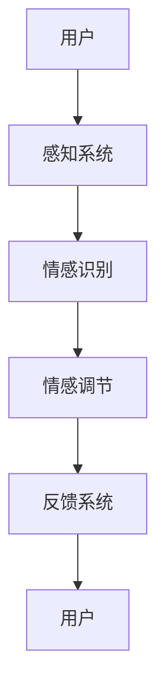

                 

# {文章标题}

> {关键词：（此处列出文章的5-7个核心关键词）}

> {摘要：（此处给出文章的核心内容和主题思想）}

---

## 虚拟现实情感调节创业：沉浸式心理健康管理平台

随着科技的进步，虚拟现实（VR）技术逐渐渗透到各个领域，从娱乐、教育到医疗健康。特别是心理健康管理领域，虚拟现实技术为人们提供了一种全新的干预和治疗手段。本文将探讨虚拟现实情感调节在创业中的应用，特别是如何构建一个沉浸式心理健康管理平台，以实现有效的情感调节和心理健康管理。

### 虚拟现实情感调节技术简介

#### 1.1 虚拟现实技术的基本概念

虚拟现实（VR）是一种通过计算机技术创建的虚拟环境，用户通过头戴式显示器（HMD）、数据手套等设备与之互动，体验沉浸式的感官体验。VR技术的基本概念可以概括为以下几点：

1. **计算机模拟技术**：利用计算机生成三维模型，模拟现实世界中的场景、物体和动作。
2. **多感官刺激技术**：通过视觉、听觉、触觉等多种感官刺激，增强用户的沉浸感。
3. **交互技术**：用户通过手柄、眼睛跟踪、语音等设备与虚拟环境进行互动。

#### 1.2 情感调节的定义与类型

情感调节是指个体根据当前情境和自身需要，通过认知、行为和生理调节过程，调整和控制情感状态的过程。情感调节的类型可以分为情绪调节和情感调控：

1. **情绪调节**：针对个体内部情感状态进行的调节，如情绪识别、情绪表达、情绪控制等。
2. **情感调控**：针对外部环境或情境反应进行的调节，如情境适应、情境改变等。

#### 1.3 虚拟现实情感调节的原理

虚拟现实情感调节的原理在于通过虚拟环境的设计和交互方式，引导用户情感状态的改变。具体原理包括：

1. **感知机制**：通过视觉、听觉、触觉等多种感官刺激，让用户产生身临其境的感觉。
2. **认知机制**：用户在虚拟环境中通过认知活动，如信息处理、情境理解等，与虚拟环境互动。
3. **情感机制**：虚拟环境的设计和交互方式可以触发用户情感反应，从而进行情感调节。

#### 1.4 沉浸式心理健康管理平台的概述

沉浸式心理健康管理平台是一种利用虚拟现实技术，提供沉浸式心理健康管理服务的系统。其核心功能包括情感识别、情感调节、心理辅导等。设计理念是以用户为中心，通过沉浸式体验和个性化服务，提高心理健康管理的效率和质量。

### 虚拟现实情感调节在创业中的机遇

#### 1.5 虚拟现实情感调节在创业中的机遇

虚拟现实情感调节技术在创业中具有巨大的机遇。首先，随着人们对心理健康问题的关注度提高，虚拟现实心理健康管理市场需求旺盛。其次，虚拟现实技术的快速发展为创业提供了丰富的技术支持。此外，政府政策对虚拟现实和心理健康产业的发展支持也为创业提供了良好的环境。

### 核心概念与联系

#### 2.1 虚拟现实与心理健康管理的联系

虚拟现实技术在心理健康管理中的应用案例丰富，如认知行为疗法（CBT）、心理治疗、心理辅导等。虚拟现实与心理健康管理理论的融合，为情感调节提供了科学依据和理论支持。

#### 2.2 情感调节的理论基础

情感调节的心理学理论基础包括认知心理学、情感心理学和行为心理学。认知心理学研究个体如何通过认知活动调节情感；情感心理学研究情感的本质和功能；行为心理学研究情感调节的行为策略。

#### 2.3 虚拟现实情感调节技术的核心原理

虚拟现实情感调节技术的核心原理在于通过感知、认知和情感机制，实现用户情感状态的调节。具体包括情感识别、情感调节和情感反馈等模块。

#### 2.4 虚拟现实情感调节技术架构的Mermaid流程图



### 核心算法原理讲解

#### 3.1 虚拟现实情感调节算法概述

虚拟现实情感调节算法主要包括情感识别算法和情感调节算法。情感识别算法通过分析用户的面部表情、语音、生理信号等数据，识别用户的情感状态。情感调节算法则根据识别出的情感状态，设计相应的调节策略，如放松训练、情绪释放等。

#### 3.2 情感识别算法的伪代码说明

```python
# 情感识别算法伪代码

# 输入：用户面部表情图像、语音数据、生理信号
# 输出：用户情感状态

def emotion_recognition(facial_image, voice_data, physiological_data):
    # 面部表情分析
    facial_features = facial_expression_analysis(facial_image)
    
    # 语音情感分析
    voice_emotion = voice_emotion_analysis(voice_data)
    
    # 生理信号分析
    physiological_signal = physiological_signal_analysis(physiological_data)
    
    # 情感状态融合
    emotion_state = fuse_emotion_state(facial_features, voice_emotion, physiological_signal)
    
    # 情感分类
    emotion_type = emotion_classification(emotion_state)
    
    return emotion_type
```

#### 3.3 情感调节算法的伪代码说明

```python
# 情感调节算法伪代码

# 输入：用户当前情感状态、情感调节目标
# 输出：情感调节策略

def emotion_regulation(current_emotion, regulation_target):
    # 情感状态评估
    emotion_score = emotion_evaluation(current_emotion)
    
    # 根据情感状态和调节目标，选择调节策略
    if emotion_score < target_threshold and regulation_target == 'relaxation':
        regulation_strategy = relaxation_training()
    elif emotion_score > target_threshold and regulation_target == 'anxiety_reduction':
        regulation_strategy = exposure_therapy()
    else:
        regulation_strategy = neutral_experience()
    
    return regulation_strategy
```

#### 3.4 虚拟现实情感调节算法的案例分析

**案例背景**：虚拟现实放松训练系统

**项目目标**：通过虚拟现实技术，帮助用户进行放松训练，减轻压力和焦虑。

**技术实现**：

- **情感识别**：使用深度学习模型对用户的面部表情、语音和生理信号进行情感识别。
- **情感调节**：根据识别出的情感状态，设计放松训练的虚拟环境，如海滩、森林等。
- **反馈机制**：通过实时反馈，调整虚拟环境中的音效、光线等，优化用户的情感调节效果。

**效果评估**：

- **用户反馈**：用户普遍反映放松训练系统有效缓解了压力和焦虑。
- **心理测试**：通过心理测试，验证用户的情感状态得到了显著改善。

### 数学模型和数学公式详解

#### 4.1 虚拟现实情感调节中的数学模型

虚拟现实情感调节中的数学模型主要包括情感计算模型和情感调节模型。情感计算模型用于量化情感状态，情感调节模型则用于设计情感调节策略。

#### 4.2 情感调节中的数学公式

情感调节中的数学公式可以表示为：

$$
\text{情感状态} = f(\text{视觉输入}, \text{听觉输入}, \text{触觉输入}, \text{生理信号})
$$

其中，$f$ 表示情感调节函数，$视觉输入$、$听觉输入$、$触觉输入$ 和 $生理信号$ 分别表示不同感官的输入数据。

#### 4.3 数学公式在虚拟现实情感调节中的应用

数学公式在虚拟现实情感调节中的应用主要体现在情感识别和情感调节算法中。例如，情感识别算法可以通过数学模型分析用户的面部表情、语音和生理信号，识别用户的情感状态。情感调节算法则可以根据情感状态，设计相应的调节策略。

### 项目实战

#### 5.1 沉浸式心理健康管理平台的搭建

沉浸式心理健康管理平台的搭建需要考虑硬件设备和软件平台的选择。硬件设备包括头戴式显示器（HMD）、手柄、传感器等，软件平台可以选择Unity或Unreal Engine等。搭建步骤包括环境配置、项目创建、功能开发、测试与优化等。

#### 5.2 情感调节模块的设计与实现

情感调节模块的设计包括情感识别、情感调节和情感反馈三个部分。情感识别部分通过分析用户的面部表情、语音和生理信号，识别用户的情感状态。情感调节部分根据识别出的情感状态，设计相应的调节策略，如放松训练、情绪释放等。情感反馈部分通过视觉、听觉等感官刺激，将调节效果实时反馈给用户。

#### 5.3 情感调节效果的评价方法

情感调节效果的评价方法包括用户满意度评估、情感状态变化评估等。用户满意度评估可以通过问卷调查等方式进行，评估用户对情感调节效果的满意度。情感状态变化评估可以通过情感识别算法，监测用户情感状态的变化，评估情感调节的有效性。

#### 5.4 虚拟现实情感调节项目的案例解析

虚拟现实情感调节项目的案例解析可以从项目背景、技术实现、效果评估等方面进行。例如，可以解析一个虚拟现实放松训练系统的项目，介绍其如何通过虚拟现实技术帮助用户进行放松训练，减轻压力和焦虑。

### 创业策略与商业模式

#### 6.1 虚拟现实情感调节创业的环境分析

虚拟现实情感调节创业的环境分析包括市场环境、技术发展趋势和政策环境等。市场环境方面，心理健康需求的增加为虚拟现实情感调节提供了广阔的市场空间。技术发展趋势方面，虚拟现实技术和人工智能技术的融合将进一步提升情感调节的效果。政策环境方面，各国政府对虚拟现实和心理健康产业的发展支持为创业提供了良好的环境。

#### 6.2 创业中的风险与应对策略

创业中的风险包括技术风险、市场风险和资金风险等。技术风险主要体现在虚拟现实技术和情感调节技术的成熟度上。市场风险主要体现在用户接受度和市场竞争上。资金风险主要体现在资金筹集和资金管理上。应对策略包括加大技术研发投入、深入了解用户需求、制定有效的市场推广策略等。

#### 6.3 商业模式的设计与实施

商业模式的设计与实施包括B2B模式、B2C模式和平台模式等。B2B模式为企业提供定制化的心理健康管理解决方案，B2C模式面向个人用户提供在线心理健康管理服务，平台模式则连接供需双方，提供虚拟现实心理健康管理服务。

#### 6.4 成功案例分享与创业经验总结

成功案例分享可以从用户需求驱动、技术创新和市场推广等方面进行。创业经验总结可以从重视用户需求、持续创新和有效市场推广等方面进行。

### 未来展望与发展趋势

#### 7.1 虚拟现实情感调节技术的发展趋势

未来，虚拟现实情感调节技术将向更加智能化、个性化和高效化的方向发展。技术发展趋势包括虚拟现实与人工智能的深度融合、情感识别和调节算法的优化等。

#### 7.2 情感调节在心理健康管理中的应用前景

未来，情感调节在心理健康管理中的应用前景广阔。随着虚拟现实技术的进步，情感调节技术将为心理健康管理提供更加有效和便捷的解决方案。

#### 7.3 虚拟现实情感调节创业的机遇与挑战

虚拟现实情感调节创业的机遇在于市场需求和技术进步。挑战在于技术成熟度和市场竞争。应对挑战的策略包括加大技术研发投入、提升产品竞争力等。

### 附录

#### 附录 A：虚拟现实情感调节技术资源

- 开发工具与框架：Unity、Unreal Engine、OpenVR等。
- 情感识别与调节算法资源：OpenSMILE、Affectiva等。
- 相关文献与资料：《虚拟现实与心理健康管理》、《情感计算：理论与应用》等。

#### 附录 B：虚拟现实情感调节项目代码与资料

- 代码示例：情感识别、情感调节等模块的示例代码。
- 项目资料：项目报告、用户手册等。

---

**作者**：

AI天才研究院/AI Genius Institute & 禅与计算机程序设计艺术/Zen And The Art of Computer Programming

---

**注**：本文为示例，仅供参考。实际撰写时，需根据具体情况进行调整和补充。本文所涉及的算法和模型均为伪代码和概述，具体实现细节需根据实际项目需求进行深入研究和开发。文中引用的文献和资料需确保准确性和可靠性。在实际应用中，需遵循相关法律法规和伦理道德标准。

