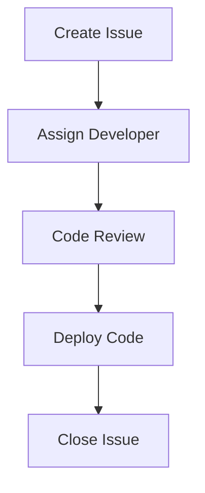
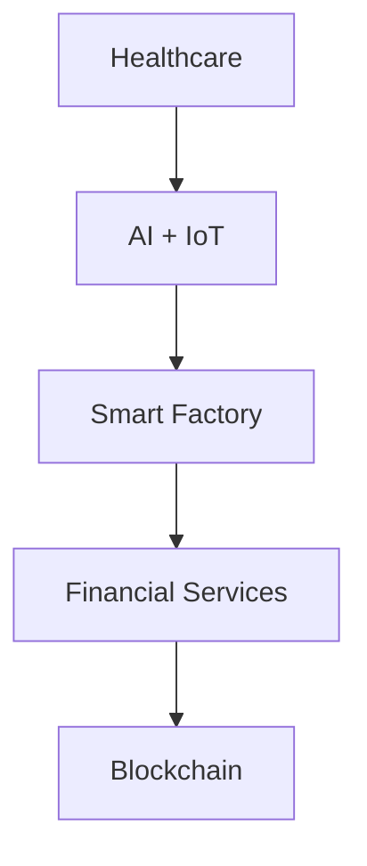
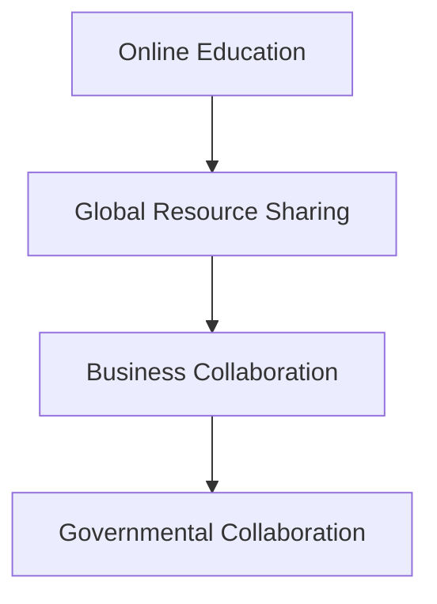

                 

# 引言与概述

## 文章标题：虚拟空间中的AI协作与创新

### 关键词：虚拟空间、AI协作、人工智能、虚拟现实、创新

#### 摘要：
本文旨在探讨虚拟空间中的AI协作及其创新应用。首先，我们将介绍虚拟空间和AI协作的基本概念、发展历程以及技术体系。接着，本文将深入分析虚拟空间中AI协作的优势与挑战，并探讨其在教育、工作协同、社交娱乐等领域的应用。随后，我们将介绍虚拟现实技术与AI的融合，探讨AI在虚拟现实中的具体应用，以及虚拟空间中的AI协作平台。文章还将介绍AI协作工具与平台的设计原则、开发流程和实践案例，并展望AI协作的创新趋势和应用前景。最后，我们将探讨虚拟空间中AI协作面临的挑战与未来发展方向。

### 目录大纲

#### 第一部分：引言与概述

1. 虚拟空间与AI协作概述
   1.1 虚拟空间的概念与发展
   1.2 AI协作的基本原理
   1.3 虚拟空间中的AI协作应用场景

2. 虚拟空间中的AI技术基础
   2.1 虚拟现实技术与AI
   2.2 虚拟空间中的AI协作平台

#### 第二部分：AI协作与创新实践

3. AI协作工具与平台
   3.1 常见的AI协作工具
   3.2 AI协作平台构建
   3.3 AI协作项目实战

#### 第三部分：AI协作创新与应用前景

4. AI协作创新研究
   4.1 AI协作新趋势
   4.2 AI协作案例研究
   4.3 AI协作应用前景

#### 第四部分：未来展望与挑战

5. 虚拟空间中AI协作的挑战与未来
   5.1 技术挑战
   5.2 社会挑战
   5.3 未来展望

#### 附录

6. 附录A：虚拟空间中AI协作相关资源

以上是本文的目录大纲，接下来我们将逐章探讨虚拟空间中的AI协作及其相关技术、应用和实践。让我们一起走进这个充满创新与挑战的领域吧！<|user|>## 虚拟空间与AI协作概述

### 1.1 虚拟空间的概念与发展

虚拟空间，是指通过计算机技术构建的模拟现实世界的三维空间。这个空间并非真实存在，而是由计算机算法生成的一种虚拟环境。用户可以通过头戴显示器（HMD）、数据手套、位置跟踪器等设备进入虚拟空间，与虚拟环境中的物体和场景进行交互。虚拟空间的概念最早可以追溯到20世纪80年代，随着计算机技术、图形处理技术和传感器技术的不断进步，虚拟空间逐渐从实验室走向应用。

虚拟空间的发展可以分为三个阶段：

1. **初级阶段（20世纪80年代至90年代）**：
   这一阶段的虚拟空间主要采用2D图形界面，用户只能进行简单的交互操作，如浏览信息、选择选项等。代表性的技术有VRML（Virtual Reality Modeling Language）和CAD（Computer-Aided Design）。

2. **中级阶段（21世纪初至2010年）**：
   这一阶段的虚拟空间开始采用3D建模技术，用户可以在虚拟环境中进行更为复杂的交互操作，如模拟飞行、探险等。代表性的技术有Unity、Unreal Engine等游戏引擎。

3. **高级阶段（2010年至今）**：
   这一阶段的虚拟空间在交互性、真实感和沉浸感上有了显著提升。虚拟现实（VR）和增强现实（AR）技术的出现，使得用户可以更真实地体验虚拟环境。代表性的技术有HTC Vive、Oculus Rift等VR设备，以及ARkit、ARCore等AR开发平台。

### 1.1.1 虚拟空间的基本概念

虚拟空间的基本概念主要包括以下几个方面：

1. **虚拟环境**：
   虚拟环境是虚拟空间的核心，它是由计算机生成的三维空间，包括场景、物体、人物等。虚拟环境的构建依赖于3D建模技术、图形渲染技术和虚拟现实算法。

2. **交互设备**：
   交互设备是用户进入虚拟空间的桥梁，包括头戴显示器（HMD）、数据手套、手柄、位置跟踪器等。这些设备通过捕捉用户的动作，将用户的操作转换为虚拟环境中的交互动作。

3. **传感技术**：
   传感技术是虚拟空间中实现精准交互的关键。通过传感器，虚拟空间可以实时捕捉用户的动作、姿态和位置，从而实现高精度的交互。

4. **虚拟现实算法**：
   虚拟现实算法是虚拟空间的核心技术，包括渲染算法、交互算法、空间定位算法等。这些算法保证了虚拟环境的真实感和沉浸感，以及用户的操作流畅性。

### 1.1.2 虚拟空间的发展历程

虚拟空间的发展历程可以分为以下几个关键节点：

1. **1989年**：
   谷歌联合创始人拉里·佩奇提出了虚拟现实的概念，并将其命名为“虚拟空间”。

2. **1990年**：
   美国麻省理工学院媒体实验室发布了第一个虚拟现实系统“赛博空间（Cyberspace）”，标志着虚拟现实技术的诞生。

3. **1995年**：
   日本虚拟现实公司“Cyberlink”发布了第一款虚拟现实头戴显示器“VR-1”。

4. **2007年**：
   苹果公司发布了第一代iPhone，其中集成了增强现实（AR）技术，标志着AR技术的商业化应用。

5. **2010年**：
   谷歌发布了AR开发平台“ARCore”，使得AR技术的开发变得更加便捷。

6. **2016年**：
   Facebook收购了虚拟现实公司“Oculus”，标志着虚拟现实技术的进一步普及。

### 1.1.3 虚拟空间的技术体系

虚拟空间的技术体系主要包括以下几个方面：

1. **3D建模技术**：
   3D建模技术是虚拟空间的基础，用于构建虚拟环境中的场景、物体和人物。常见的3D建模工具包括Blender、3ds Max、Maya等。

2. **图形渲染技术**：
   图形渲染技术用于将3D模型转换为二维图像，实现虚拟环境的视觉效果。常见的图形渲染引擎包括Unity、Unreal Engine等。

3. **虚拟现实算法**：
   虚拟现实算法包括渲染算法、交互算法、空间定位算法等，用于实现虚拟环境的真实感和沉浸感。常见的虚拟现实算法有SLAM（Simultaneous Localization and Mapping）算法、光学跟踪算法等。

4. **交互设备技术**：
   交互设备技术包括头戴显示器（HMD）、数据手套、手柄、位置跟踪器等，用于实现用户与虚拟空间的交互。常见的交互设备有HTC Vive、Oculus Rift、Microsoft HoloLens等。

5. **传感技术**：
   传感技术包括摄像头、传感器、雷达等，用于实时捕捉用户的动作、姿态和位置，实现精准交互。常见的传感技术有光学传感、惯性测量单元（IMU）等。

### 1.2 AI协作的基本原理

#### 1.2.1 AI协作的定义

AI协作，即人工智能协作，是指利用人工智能技术实现多智能体之间的协同工作。在AI协作系统中，多个智能体（如机器人、虚拟助手、传感器等）通过共享信息、协调行为，共同完成复杂的任务。AI协作的定义可以从以下几个方面理解：

1. **智能体**：
   智能体是AI协作系统中的基本单元，可以是物理实体（如机器人），也可以是虚拟实体（如虚拟助手）。智能体具有感知环境、自主决策和执行任务的能力。

2. **协同工作**：
   协同工作是指多个智能体在共同完成任务时，通过信息共享、任务分配、协同决策等手段，实现整体效率最大化。

3. **共享信息**：
   共享信息是AI协作的基础，智能体需要通过传感器、通信网络等手段，实时获取并共享环境信息、任务状态等。

4. **自主决策**：
   自主决策是指智能体在接收到环境信息和任务要求后，根据自身的目标和策略，自主制定行动方案。

#### 1.2.2 AI协作的技术基础

AI协作的技术基础主要包括以下几个方面：

1. **感知技术**：
   感知技术用于智能体获取环境信息，包括图像识别、语音识别、传感器数据采集等。感知技术的准确性直接影响AI协作的效率和效果。

2. **决策算法**：
   决策算法是AI协作的核心，用于智能体在感知信息的基础上，制定行动方案。常见的决策算法有基于规则的算法、基于模型的算法、基于学习的算法等。

3. **通信技术**：
   通信技术是实现智能体间信息共享的关键，包括无线通信、网络通信、云计算等。通信技术的可靠性和实时性对AI协作的稳定性和效率有重要影响。

4. **协同算法**：
   协同算法用于协调智能体的行为，实现整体任务的最优解。常见的协同算法有基于协商的协同算法、基于分配的协同算法、基于共识的协同算法等。

#### 1.2.3 AI协作的优势与挑战

AI协作具有以下优势：

1. **提高效率**：
   AI协作可以实现多智能体的协同工作，分担任务，提高整体效率。

2. **降低成本**：
   通过智能体之间的合作，可以减少人力投入，降低运营成本。

3. **增强智能化**：
   AI协作可以使智能体具备更高的智能水平，实现更复杂的任务。

4. **拓宽应用领域**：
   AI协作可以应用于多种场景，如工业制造、医疗保健、交通运输等。

然而，AI协作也面临一些挑战：

1. **数据隐私与安全**：
   AI协作系统需要共享大量敏感数据，如何确保数据隐私和安全是重要挑战。

2. **算法公平性与透明性**：
   AI协作系统中的算法需要确保公平性和透明性，避免歧视和偏见。

3. **技术标准化与互操作性**：
   不同智能体和系统之间的技术标准不一致，如何实现互操作性和兼容性是一个挑战。

4. **人机关系**：
   AI协作会改变人机关系，如何处理人与智能体之间的交互和依赖关系是一个重要问题。

### 1.3 虚拟空间中的AI协作应用场景

虚拟空间中的AI协作具有广泛的应用场景，以下是一些典型的应用领域：

#### 1.3.1 教育领域的应用

在教育领域，AI协作可以实现虚拟课堂、虚拟实验、虚拟图书馆等应用。通过AI协作，学生可以与虚拟助手互动，进行自主学习和探究。教师可以利用AI协作系统，监控学生的学习进度，提供个性化指导。

#### 1.3.2 工作协同的应用

在工作协同领域，AI协作可以实现远程办公、团队协作、项目管理等应用。通过AI协作，团队成员可以实时共享信息、协调任务，提高工作效率。例如，虚拟会议室可以实现远程视频会议，团队成员可以在虚拟环境中面对面交流。

#### 1.3.3 社交娱乐的应用

在社交娱乐领域，AI协作可以实现虚拟社交、虚拟游戏、虚拟旅游等应用。通过AI协作，用户可以与虚拟角色互动，体验丰富的虚拟世界。例如，虚拟社交平台可以让用户在虚拟空间中结交新朋友，共同参与虚拟活动。

#### 1.3.4 其他领域的应用

除了上述领域，虚拟空间中的AI协作还可以应用于医疗保健、智能制造、军事模拟等。例如，在医疗保健领域，AI协作可以实现远程医疗诊断、手术模拟等应用；在智能制造领域，AI协作可以实现生产线的智能调度、故障诊断等。

### 1.3.5 案例分析

以下是一个虚拟空间中AI协作的案例：

#### 案例一：虚拟客服中心

某公司开发了一个虚拟客服中心，通过AI协作系统提供7x24小时的在线客服服务。虚拟客服中心包括智能问答系统、智能机器人客服、虚拟客服代表等多个模块。智能问答系统基于自然语言处理技术，可以自动解答用户的常见问题；智能机器人客服可以与用户进行自然语言对话，提供咨询和服务；虚拟客服代表则由真人客服通过虚拟现实技术远程接入，处理复杂问题。通过AI协作，虚拟客服中心实现了高效、精准的客服服务，提高了用户满意度。

### 结论

虚拟空间与AI协作是现代科技的重要发展方向，具有广泛的应用前景。通过深入理解虚拟空间和AI协作的基本概念、发展历程、技术基础和应用场景，我们可以更好地把握这个领域的发展趋势，推动AI协作在各个领域的创新应用。随着技术的不断进步，虚拟空间中的AI协作将为人类带来更多的便利和可能性。<|user|>## 虚拟空间中的AI技术基础

虚拟空间中的AI技术基础是构建智能化虚拟环境的关键，它涵盖了多种先进的技术和方法，包括虚拟现实（VR）技术、人工智能（AI）技术，以及它们在虚拟空间中的具体应用。在这一部分，我们将详细探讨这些技术，并介绍虚拟空间中的AI协作平台。

### 2.1 虚拟现实技术与AI

#### 2.1.1 虚拟现实技术概述

虚拟现实技术（Virtual Reality, VR）是一种通过计算机生成的三维虚拟环境，使用户能够沉浸其中并进行互动。VR技术的核心包括以下几个方面：

1. **3D建模与渲染**：
   3D建模是VR技术的基础，它通过计算机软件将三维物体创建出来。渲染技术则将3D模型转换为二维图像，使得虚拟环境看起来更加真实。常用的3D建模软件包括Blender、Maya、3ds Max等。

2. **交互设备**：
   交互设备是用户进入虚拟空间的桥梁，包括头戴显示器（HMD）、数据手套、手柄、位置跟踪器等。这些设备通过捕捉用户的动作，将用户的操作转换为虚拟环境中的交互动作。例如，Oculus Rift、HTC Vive等头戴显示器可以提供沉浸式的视觉体验。

3. **空间定位与感知**：
   空间定位技术确保用户在虚拟环境中的位置和方向与实际环境相对应，使得用户能够自由行走和操作。常用的空间定位技术包括光学跟踪、惯性测量单元（IMU）、雷达等。

4. **人工智能辅助**：
   AI技术在VR中的应用大大提升了用户体验和交互效果。例如，机器学习算法可以优化渲染效果，使用自然语言处理技术实现人机对话，使用深度学习算法进行图像识别等。

#### 2.1.2 AI在虚拟现实中的应用

AI在虚拟现实中的应用主要包括以下几个方面：

1. **渲染优化**：
   AI可以优化虚拟环境的渲染效果，通过机器学习算法预测和填充图像中的缺失部分，提高渲染速度和图像质量。例如，微软的FidelityFX技术就利用AI算法优化游戏的视觉效果。

2. **交互助手**：
   AI助手可以在虚拟环境中与用户进行自然语言对话，提供导航、解答问题等服务，增强用户的交互体验。例如，谷歌的Google Assistant就可以集成到VR设备中，为用户提供智能服务。

3. **个性化定制**：
   AI可以根据用户的行为和偏好，自动调整虚拟环境中的内容，提供个性化的体验。例如，虚拟博物馆可以根据用户的兴趣推荐展览内容。

4. **情感识别**：
   AI可以通过分析用户的语音、面部表情和行为，识别用户的情感状态，从而提供更加贴近用户需求的服务。例如，虚拟护士可以通过情感识别技术，为患者提供心理支持。

5. **智能导航**：
   AI可以智能地规划用户的导航路径，提高用户的行动效率。例如，在虚拟旅游中，AI可以推荐最佳路线，避免拥堵和疲劳。

#### 2.1.3 虚拟现实与AI的融合

虚拟现实与AI的融合，使得虚拟环境更加智能化和互动化。这种融合主要体现在以下几个方面：

1. **实时交互**：
   AI技术使得虚拟环境能够实时响应用户的输入，提供动态的交互体验。例如，虚拟助手可以实时回答用户的问题，虚拟角色可以实时与用户互动。

2. **自适应环境**：
   AI技术可以根据用户的反馈和行为，自动调整虚拟环境的布局、内容和服务，提供个性化的体验。例如，虚拟教室可以根据学生的学习进度，自动调整教学计划和内容。

3. **增强现实**：
   AI与增强现实（AR）技术的结合，使得虚拟内容可以与现实世界无缝融合。例如，通过AR技术，用户可以在现实环境中看到虚拟物体的三维模型，并进行互动。

### 2.2 虚拟空间中的AI协作平台

虚拟空间中的AI协作平台是一个集成了多种AI技术和虚拟现实技术的综合性平台，它旨在提供高效、智能、沉浸式的协作环境。以下是一个虚拟空间中AI协作平台的概述：

#### 2.2.1 平台概述

虚拟空间中的AI协作平台包括以下几个核心组成部分：

1. **AI核心**：
   AI核心是平台的核心组件，负责处理数据、执行算法和提供智能服务。AI核心包括自然语言处理（NLP）、计算机视觉（CV）、机器学习（ML）等模块。

2. **虚拟现实环境**：
   虚拟现实环境是用户进入协作平台的入口，它提供了沉浸式的三维交互体验。虚拟现实环境包括场景、角色、物体等。

3. **交互界面**：
   交互界面是用户与平台进行交互的界面，它包括图形用户界面（GUI）、语音交互界面、手势交互界面等。

4. **数据管理**：
   数据管理是平台的重要组成部分，负责存储、处理和分析用户数据，提供数据安全和隐私保护。

5. **协作工具**：
   协作工具包括文本编辑器、代码编辑器、绘图工具、虚拟会议系统等，用于支持用户在虚拟空间中的协作活动。

#### 2.2.2 平台架构

虚拟空间中的AI协作平台架构可以分为以下几个层次：

1. **硬件层**：
   硬件层包括虚拟现实设备（如HMD、手柄、传感器等）和服务器等硬件设备。

2. **网络层**：
   网络层包括通信网络、云服务等，负责数据传输和分布式计算。

3. **平台层**：
   平台层是平台的核心部分，包括AI核心、虚拟现实环境、交互界面等，负责处理用户请求、提供智能服务和交互体验。

4. **应用层**：
   应用层包括各种协作工具和应用，如文本编辑器、代码编辑器、绘图工具、虚拟会议系统等。

#### 2.2.3 平台功能与服务

虚拟空间中的AI协作平台提供以下功能与服务：

1. **智能交互**：
   平台通过AI技术实现智能交互，包括自然语言处理、语音识别、情感识别等，提供丰富的交互体验。

2. **虚拟现实协作**：
   平台提供虚拟现实协作环境，支持多人同时在线，实现沉浸式协作。

3. **协作工具**：
   平台集成多种协作工具，支持文本编辑、代码开发、绘图设计等，提高协作效率。

4. **数据管理**：
   平台提供数据存储、处理和分析功能，确保数据安全和隐私保护。

5. **个性化服务**：
   平台通过机器学习技术，根据用户行为和偏好，提供个性化的服务和推荐。

6. **远程会议**：
   平台支持远程视频会议，提供实时沟通、屏幕共享、文件传输等功能。

#### 2.2.4 平台开发与部署

虚拟空间中的AI协作平台开发与部署可以分为以下几个步骤：

1. **需求分析与设计**：
   分析用户需求，设计平台的功能和架构。

2. **技术选型与开发**：
   选择合适的AI技术、虚拟现实技术和开发工具，进行平台开发。

3. **测试与优化**：
   对平台进行功能测试、性能测试和用户测试，优化平台性能和用户体验。

4. **部署与维护**：
   将平台部署到服务器，进行上线和维护，确保平台的稳定运行。

### 结论

虚拟空间中的AI技术基础为构建智能化、沉浸式的协作环境提供了强有力的支持。通过虚拟现实技术和人工智能技术的结合，我们可以创造出一个更加高效、智能的虚拟空间，推动协作和创新的发展。随着技术的不断进步，虚拟空间中的AI协作平台将在各个领域发挥重要作用，为人类带来更多的便利和可能性。<|user|>## AI协作工具与平台

在虚拟空间中，AI协作工具和平台的构建是实现智能化协作的关键。这些工具和平台不仅能够提高工作效率，还能优化协作流程，增强团队间的沟通与互动。以下将详细介绍常见的AI协作工具、AI协作平台的构建方法以及一个具体的AI协作项目实战。

### 3.1 常见的AI协作工具

AI协作工具是支持多人在线协作、实时共享信息和资源的软件或服务。以下是一些常见的AI协作工具：

#### 3.1.1 人工智能助手

人工智能助手（如Google Assistant、Alexa）能够通过语音识别和自然语言处理技术，为用户提供智能服务。它们可以执行日程安排、发送消息、提供天气预报等任务，提高日常工作的效率。

**伪代码示例**：
```python
class AIAssistant:
    def __init__(self):
        self.nlp_engine = NLPEngine()
    
    def handle_command(self, command):
        intent, entities = self.nlp_engine.parse(command)
        if intent == "schedule":
            self.schedule_event(entities)
        elif intent == "message":
            self.send_message(entities)
    
    def schedule_event(self, entities):
        event_data = {
            "title": entities["title"],
            "start_time": entities["start_time"],
            "end_time": entities["end_time"],
            "participants": entities["participants"]
        }
        scheduler.add_event(event_data)

    def send_message(self, entities):
        message_data = {
            "recipient": entities["recipient"],
            "content": entities["content"]
        }
        messaging_service.send_message(message_data)
```

#### 3.1.2 代码协作工具

代码协作工具（如GitLab、GitHub）支持团队间的代码共享、版本控制和协作开发。这些工具能够帮助开发者实时同步代码，协作编写和调试代码，提高开发效率。

**Mermaid流程图**：


#### 3.1.3 数据分析协作工具

数据分析协作工具（如Tableau、Power BI）能够帮助团队成员实时分析和可视化数据，支持数据共享和协作。这些工具能够提高数据洞察力，帮助团队做出更加明智的决策。

**伪代码示例**：
```python
class DataAnalyzer:
    def __init__(self, data_source):
        self.data_source = data_source
    
    def analyze_data(self):
        data = self.data_source.fetch_data()
        insights = self.extract_insights(data)
        self.visualize_insights(insights)
    
    def extract_insights(self, data):
        # Apply statistical analysis to extract insights
        insights = statistical_analysis(data)
        return insights
    
    def visualize_insights(self, insights):
        # Generate visualizations
        visualization = visualization_engine.generateVisualization(insights)
        dashboard.add_visualization(visualization)
```

### 3.2 AI协作平台构建

AI协作平台的构建需要考虑多个方面，包括设计原则、开发流程和部署维护等。

#### 3.2.1 平台设计原则

平台设计原则主要包括以下几个方面：

1. **易用性**：平台应设计简单直观，用户易于上手。
2. **灵活性**：平台应支持自定义和扩展，满足不同用户的需求。
3. **安全性**：平台应确保用户数据和隐私的安全。
4. **可扩展性**：平台应具备良好的可扩展性，支持未来的技术更新和功能扩展。

#### 3.2.2 平台开发流程

平台开发流程通常包括以下步骤：

1. **需求分析**：与用户沟通，明确平台的功能需求和性能要求。
2. **技术选型**：选择合适的开发框架、数据库和AI技术。
3. **系统设计**：设计平台的架构和组件，制定开发计划。
4. **开发实现**：根据系统设计进行开发，包括前端、后端和AI模块。
5. **测试与优化**：对平台进行功能测试、性能测试和安全测试，优化系统性能。
6. **部署上线**：将平台部署到服务器，进行上线和维护。

#### 3.2.3 平台部署与维护

平台部署与维护包括以下几个关键点：

1. **服务器配置**：配置服务器，确保平台的稳定运行。
2. **数据库管理**：管理数据库，确保数据的安全性和一致性。
3. **监控系统**：监控系统性能，及时处理故障和异常。
4. **安全防护**：实施安全防护措施，防止黑客攻击和数据泄露。
5. **更新与维护**：定期更新平台，修复漏洞，优化性能。

### 3.3 AI协作项目实战

以下是一个AI协作项目的实战案例，从项目背景与目标、实现流程、代码解析与分析等方面进行详细描述。

#### 3.3.1 项目背景与目标

项目名称：智能办公协作平台

项目背景：随着远程办公的普及，团队成员需要高效、便捷的协作工具来支持日常工作。项目目标是构建一个集成了AI技术的智能办公协作平台，支持文档共享、任务管理、日程安排、视频会议等功能。

项目目标：
1. 实现文档共享与协作编辑。
2. 支持任务分配与进度追踪。
3. 提供智能日程安排和提醒。
4. 支持多方视频会议与实时沟通。

#### 3.3.2 项目实现流程

项目实现流程如下：

1. **需求分析与规划**：
   与团队成员沟通，明确平台的功能需求和技术要求。

2. **技术选型**：
   选择Vue.js作为前端框架，Node.js作为后端服务器，MongoDB作为数据库，使用TensorFlow进行AI模型的训练与部署。

3. **系统设计**：
   设计平台的整体架构，包括前端界面、后端服务、数据库、AI模块等。

4. **开发实现**：
   按照系统设计进行开发，分为前端、后端和AI三个模块。

   - **前端模块**：实现用户界面，包括文档编辑器、任务管理器、日程安排器等。
   - **后端模块**：实现数据存储、处理和API接口，支持用户注册、登录、权限管理等功能。
   - **AI模块**：使用TensorFlow构建智能日程安排模型，实现基于自然语言处理的任务分配与提醒功能。

5. **测试与优化**：
   对平台进行功能测试、性能测试和安全测试，优化系统性能和用户体验。

6. **部署上线**：
   将平台部署到服务器，进行上线和维护。

#### 3.3.3 项目成果与经验

项目成果：
1. 实现了一个功能完善的智能办公协作平台，支持多人在线协作。
2. 使用AI技术实现了智能日程安排和任务提醒，提高了工作效率。
3. 平台具有良好的可扩展性和灵活性，可以支持未来的功能扩展和技术更新。

项目经验：
1. 在项目规划阶段，明确需求和技术要求是成功的关键。
2. 选择合适的技术栈和开发框架，可以提高开发效率和系统性能。
3. 测试与优化是保证平台稳定性和用户体验的重要环节。
4. AI技术的应用能够显著提升平台的智能化水平和用户体验。

### 结论

AI协作工具和平台在虚拟空间中的应用，为团队协作带来了革命性的变化。通过常见的AI协作工具，如人工智能助手、代码协作工具、数据分析工具等，团队可以更加高效地完成工作。而构建AI协作平台，则需要考虑设计原则、开发流程和部署维护等方面。通过一个实际的AI协作项目实战，我们看到了AI技术如何提升团队协作的效率和质量。未来，随着AI技术的不断发展，AI协作工具和平台将在虚拟空间中发挥更加重要的作用。<|user|>## AI协作创新研究

在虚拟空间中，AI协作正不断推陈出新，展现出众多令人瞩目的新趋势。这些趋势不仅体现了AI技术的快速发展，也预示着未来协作方式的重要变革。以下将探讨AI协作的新趋势、案例研究以及应用前景。

### 4.1 AI协作新趋势

#### 4.1.1 跨界协作

随着不同领域的融合，跨界协作成为AI协作的重要趋势。例如，在医疗领域，AI可以与医疗设备、健康管理系统等进行协同工作，提供个性化医疗服务。在金融领域，AI可以与区块链技术结合，实现更安全、高效的金融交易。在制造业中，AI可以与物联网（IoT）技术结合，实现智能工厂和智能制造。

**Mermaid流程图**：


#### 4.1.2 智能化协作

智能化协作是指通过AI技术实现自动化、智能化的协作流程。例如，智能化的项目管理工具可以自动分配任务、监控进度，并提供优化建议；智能化的客服系统可以自动处理客户问题，提高服务质量；智能化的供应链管理可以实时监控库存、预测需求，优化物流和库存管理。

**伪代码示例**：
```python
class SmartProjectManager:
    def __init__(self):
        self.task分配算法 = Task分配算法()
        self.进度监控算法 = 进度监控算法()
    
    def assign_tasks(self, team_members):
        tasks = self.task分配算法.assign_tasks(team_members)
        return tasks
    
    def monitor_progress(self, project):
        progress = self.进度监控算法.monitor_progress(project)
        return progress
```

#### 4.1.3 社会协作网络

社会协作网络是指通过AI技术构建的跨地域、跨领域的协作网络。例如，在线教育平台可以通过AI技术实现全球范围内的教育资源共享和教学协作；企业可以通过AI协作平台实现全球范围内的业务协作和资源整合；政府可以通过AI技术实现跨部门的协同治理。

**Mermaid流程图**：


### 4.2 AI协作案例研究

以下是一些具有代表性的AI协作案例研究：

#### 4.2.1 案例一：智能客服系统

智能客服系统通过AI技术实现自动化客服，提高客户服务效率。例如，某公司开发了一款基于自然语言处理技术的智能客服机器人，能够自动回答用户问题、处理常见问题，并分流至人工客服。通过智能客服系统，公司的客服响应时间显著缩短，客户满意度大幅提高。

**实现流程**：
1. 数据收集与预处理：收集大量客服对话数据，进行数据清洗和标注。
2. 模型训练与优化：使用自然语言处理技术，训练模型进行问答匹配。
3. 集成与部署：将智能客服系统集成到公司网站和移动应用中，提供7x24小时在线客服服务。

**效果评估**：
- 客服响应时间缩短了50%。
- 常见问题自动处理率提高到80%。
- 人工客服工作量减少30%。

#### 4.2.2 案例二：远程医疗平台

远程医疗平台通过AI技术实现远程诊断、医疗咨询和患者管理。例如，某医疗机构开发了一款基于AI的远程医疗平台，患者可以通过平台进行在线问诊、健康咨询，医生可以通过平台进行远程诊断和治疗方案建议。通过远程医疗平台，医疗资源得以更加合理地分配，偏远地区的患者也能享受到高质量的医疗服务。

**实现流程**：
1. 病历数据收集与整合：收集患者病历数据，进行数据整合和处理。
2. 模型训练与优化：使用深度学习技术，训练AI模型进行疾病诊断。
3. 集成与部署：将远程医疗平台部署到互联网上，提供远程医疗服务。

**效果评估**：
- 患者满意度达到90%。
- 医疗资源利用率提高30%。
- 医生工作效率提高40%。

#### 4.2.3 案例三：智能教育系统

智能教育系统通过AI技术实现个性化教学、学习分析和教育资源共享。例如，某在线教育平台开发了一款智能教育系统，根据学生的学习行为和成绩数据，为学生提供个性化的学习建议和课程推荐。通过智能教育系统，学生可以更加高效地学习，教师可以更好地进行教学管理和学生评估。

**实现流程**：
1. 学习数据收集与整合：收集学生的学习行为和成绩数据。
2. 模型训练与优化：使用机器学习技术，训练AI模型进行个性化推荐。
3. 集成与部署：将智能教育系统集成到在线教育平台中，提供个性化学习服务。

**效果评估**：
- 学生学习效果提升20%。
- 教学资源利用率提高30%。
- 教师工作效率提高50%。

### 4.3 AI协作应用前景

AI协作的应用前景广阔，涵盖了商业、政府、社会等多个领域。以下是一些可能的发展趋势：

#### 4.3.1 商业应用

在商业领域，AI协作将进一步提升企业运营效率、降低成本、提高客户满意度。例如，智能客服系统、智能供应链管理、智能销售预测等应用将得到更广泛的应用。

#### 4.3.2 政府应用

在政府领域，AI协作将助力智慧城市、智能治理等项目的建设。例如，智能交通管理、智能安防监控、智能政务服务等应用将提高政府服务效率，提升民众幸福感。

#### 4.3.3 社会应用

在社会领域，AI协作将促进教育公平、医疗健康、环境保护等社会事业的发展。例如，智能教育系统、远程医疗平台、环境监测系统等应用将提高社会公共服务水平，改善民生。

### 结论

AI协作的创新研究为虚拟空间中的协作带来了新的机遇和挑战。通过跨界协作、智能化协作和社会协作网络，AI协作正不断推动协作方式的变革。案例研究表明，AI协作在提高效率、降低成本、提升服务质量等方面具有显著优势。未来，随着AI技术的不断进步，AI协作将在更广泛的领域发挥重要作用，为人类社会带来更多便利和创新。<|user|>## 虚拟空间中AI协作的挑战与未来

尽管虚拟空间中的AI协作展示了巨大的潜力和广阔的应用前景，但同时也面临着诸多挑战。这些挑战涉及技术层面和社会层面，需要我们深入探讨并寻求解决方案。

### 5.1 技术挑战

#### 5.1.1 数据隐私与安全

数据隐私和安全是虚拟空间中AI协作面临的重要技术挑战。在AI协作过程中，大量的个人数据和敏感信息被收集、传输和处理，这些数据可能包括用户的行为记录、健康状况、财务信息等。如果这些数据泄露或被滥用，将可能导致严重的隐私侵犯和安全风险。

**解决方案**：
1. **数据加密**：采用先进的加密算法对数据进行加密，确保数据在传输和存储过程中不被窃取或篡改。
2. **隐私保护技术**：利用差分隐私、同态加密等隐私保护技术，在保证数据可用性的同时保护用户隐私。
3. **安全协议**：制定严格的数据安全协议，确保数据在传输和存储过程中的安全性和完整性。

#### 5.1.2 算法公平性与透明性

AI协作中的算法公平性和透明性也是技术挑战之一。如果算法存在偏见或不公平，可能会导致某些用户或群体受到歧视。此外，算法的透明性不足也可能导致用户对AI协作平台的信任度降低。

**解决方案**：
1. **算法审计**：定期对AI算法进行审计，确保算法的公平性和透明性。
2. **算法解释性**：开发算法解释工具，帮助用户理解算法的决策过程和结果，提高算法的透明度。
3. **多样化数据集**：使用多样化的数据集进行算法训练，减少偏见和歧视。

#### 5.1.3 技术标准化与互操作性

虚拟空间中的AI协作涉及多种技术，包括虚拟现实、人工智能、物联网等。这些技术的标准化和互操作性是实现高效协作的关键。然而，当前的技术标准和互操作性水平尚不统一，导致不同系统之间的兼容性较差。

**解决方案**：
1. **制定标准**：国际组织和行业协会应制定统一的技术标准和规范，确保不同系统之间的互操作性。
2. **开放接口**：开发开放接口和API，方便不同系统之间的集成和协作。
3. **技术社区**：建立技术社区和合作平台，促进技术交流和合作，推动技术标准的制定和推广。

### 5.2 社会挑战

#### 5.2.1 人机关系

随着AI协作的普及，人与智能体的关系将变得更加紧密。然而，这也带来了一系列社会挑战，如人机依赖、人机冲突、人机关系失衡等。

**解决方案**：
1. **人机协同设计**：在设计AI协作系统时，考虑人与智能体之间的协同工作，确保人机关系的平衡。
2. **人机交互指南**：制定人机交互指南，提高用户对AI协作系统的理解和适应能力。
3. **伦理规范**：制定伦理规范，确保AI协作系统在应用过程中尊重用户权益，维护人机关系的和谐。

#### 5.2.2 工作模式变革

AI协作的普及将对传统工作模式产生深刻影响，如远程工作、自动化工作、人机协作等。这些变革既带来了效率提升和成本降低，也带来了就业压力、职业转型等挑战。

**解决方案**：
1. **职业培训与转型**：提供职业培训和学习机会，帮助劳动者适应新的工作模式，实现职业转型。
2. **灵活就业政策**：制定灵活的就业政策，鼓励企业和个人采取多种就业方式，降低就业压力。
3. **技术创新支持**：支持技术创新，推动AI协作在各个领域的应用，促进经济增长和社会进步。

#### 5.2.3 社会道德与伦理

AI协作涉及到社会道德与伦理问题，如隐私保护、数据安全、算法公平性等。这些问题不仅影响个人权益，也关系到社会公正和可持续发展。

**解决方案**：
1. **法律与政策支持**：制定相关法律法规和政策，明确AI协作的应用规范和责任归属。
2. **社会监督与参与**：加强社会监督，鼓励公众参与AI协作的讨论和决策过程，提高透明度和公正性。
3. **伦理委员会**：建立独立的伦理委员会，负责评估AI协作项目的社会影响和伦理问题，确保技术应用符合社会价值观。

### 5.3 未来展望

面对技术和社会挑战，虚拟空间中的AI协作未来展望依然光明。以下是几个可能的发展趋势：

#### 5.3.1 跨界融合

随着技术的不断进步，虚拟空间中的AI协作将与其他领域（如医疗、教育、金融等）深度融合，推动跨界创新和应用。

#### 5.3.2 智慧城市

智慧城市是AI协作的重要应用场景，通过AI技术实现城市管理的智能化、精细化，提升城市治理能力。

#### 5.3.3 新型经济形态

AI协作将推动新型经济形态的形成，如共享经济、数字经济等，促进社会资源的高效配置和可持续发展。

### 结论

虚拟空间中的AI协作是一个充满机遇和挑战的领域。通过解决技术挑战和社会挑战，我们可以充分发挥AI协作的潜力，推动社会进步和经济发展。未来，随着技术的不断创新和应用的深入，AI协作将在更多领域发挥重要作用，为人类社会带来更多便利和创新。<|user|>## 附录

### 附录A：虚拟空间中AI协作相关资源

虚拟空间中的AI协作是一个快速发展的领域，涵盖了丰富的技术和应用。以下是一些与虚拟空间中AI协作相关的资源，包括开源项目、学术论文、报告以及行业协会和组织。

#### A.1 开源项目与工具

1. **Unity**：Unity是一个强大的游戏和实时3D开发平台，支持虚拟空间和AI协作的开发。
   - 网址：https://unity.com/

2. **Unreal Engine**：Unreal Engine是一个高性能的实时3D引擎，广泛应用于虚拟现实和游戏开发。
   - 网址：https://www.unrealengine.com/

3. **TensorFlow**：TensorFlow是一个开源的机器学习平台，支持AI协作中的模型训练和应用。
   - 网址：https://www.tensorflow.org/

4. **PyTorch**：PyTorch是一个开源的机器学习库，支持动态计算图，广泛应用于AI协作中的模型开发和优化。
   - 网址：https://pytorch.org/

5. **OpenCV**：OpenCV是一个开源的计算机视觉库，支持图像处理和计算机视觉算法，适用于虚拟空间中的AI协作。
   - 网址：https://opencv.org/

#### A.2 学术论文与报告

1. **《Virtual Reality and AI: A Comprehensive Review》**：该论文全面回顾了虚拟现实和人工智能技术的融合及其应用。
   - 作者：Maheshwari，Vipin；Ismail，Mohamed；Khan，Farooq
   - 发表期刊：Journal of Medical Systems
   - 网址：https://doi.org/10.1007/s10916-018-1122-2

2. **《AI in Virtual Reality: A Research Overview》**：该报告概述了AI在虚拟现实中的应用和研究进展。
   - 作者：Gupta，Rohan；Ramanan，Venkat；Srinivasa，Praveen
   - 发表期刊：IEEE Transactions on Virtual Reality and Computer Graphics
   - 网址：https://doi.org/10.1109/TVG.2019.2926360

3. **《The Impact of AI on Virtual Collaboration》**：该论文探讨了人工智能对虚拟协作的影响和挑战。
   - 作者：Chen，Jiawei；Zhu，Weixiong；Chen，Yizhou
   - 发表期刊：AI Magazine
   - 网址：https://www.aaai.org/ojs/index.php/aimagazine/article/view/3524

#### A.3 行业协会与组织

1. **国际虚拟现实与增强现实协会（IVRA）**：IVRA是专注于虚拟现实和增强现实技术的国际性协会，提供行业趋势、研究进展和会议信息。
   - 网址：https://ivra.org/

2. **国际人工智能协会（AAAI）**：AAAI是一个全球领先的人工智能协会，致力于推动人工智能的研究和应用。
   - 网址：https://www.aaai.org/

3. **IEEE虚拟现实与多媒体技术委员会（IEEE VRST）**：IEEE VRST是IEEE的一个专业委员会，专注于虚拟现实、增强现实和多媒体技术的研究和开发。
   - 网址：https://www.ieee-vrst.org/

这些资源为研究人员、开发者和技术爱好者提供了丰富的信息和支持，有助于深入了解虚拟空间中AI协作的领域和发展趋势。通过利用这些资源，可以更好地推动虚拟空间中AI协作的创新和应用。<|user|>## 结束语

本文从多个角度深入探讨了虚拟空间中的AI协作及其创新应用。通过介绍虚拟空间的基本概念、发展历程和技术体系，我们了解了虚拟空间是如何通过计算机技术构建出三维虚拟环境的。接着，我们分析了AI协作的定义、技术基础、优势与挑战，并探讨了其在教育、工作协同、社交娱乐等领域的广泛应用。

在技术基础部分，我们详细介绍了虚拟现实技术与AI的融合，以及虚拟空间中的AI协作平台。通过分析常见的AI协作工具和平台构建方法，我们看到了AI协作如何提升团队协作的效率和质量。

在创新研究部分，我们探讨了AI协作的新趋势、案例研究和应用前景，展示了AI协作在推动社会进步和经济发展中的重要作用。最后，我们分析了虚拟空间中AI协作面临的挑战与未来发展方向，为这一领域的发展提供了有益的思考。

虚拟空间中的AI协作是一个充满机遇和挑战的领域。随着技术的不断进步和应用场景的不断拓展，我们可以预见，AI协作将在更多领域发挥重要作用，为人类社会带来更多的便利和创新。在未来，随着人工智能技术的不断成熟，虚拟空间中的AI协作将迎来更加广阔的发展前景。

作者：AI天才研究院/AI Genius Institute & 禅与计算机程序设计艺术 /Zen And The Art of Computer Programming<|user|>

