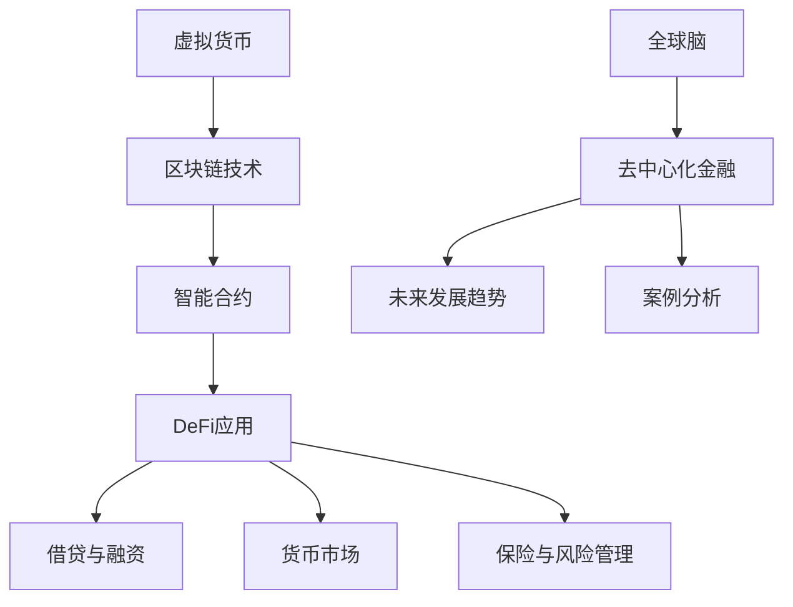

                 

# 虚拟货币与全球脑：去中心化金融的未来图景

> **关键词**：虚拟货币、区块链、去中心化金融（DeFi）、全球脑、智能合约、安全性、加密经济学

> **摘要**：本文将深入探讨虚拟货币与全球脑的融合，分析去中心化金融（DeFi）的核心概念、技术架构及未来发展趋势。通过详细讲解借贷与融资的算法、数学模型，以及成功案例，我们旨在揭示去中心化金融在技术、经济和社会层面的深远影响。

## 目录大纲

### 第一部分：虚拟货币基础

1. **虚拟货币的概念与历史**
    - **1.1 虚拟货币的定义**
    - **1.2 虚拟货币的发展历程**
    - **1.3 虚拟货币与法定货币的关系**

2. **去中心化货币技术**
    - **2.1 区块链技术简介**
    - **2.2 智能合约原理与应用**
    - **2.3 去中心化身份验证**

3. **虚拟货币市场分析**
    - **3.1 虚拟货币市场的现状**
    - **3.2 虚拟货币的价格波动因素**
    - **3.3 虚拟货币市场的监管政策**

### 第二部分：去中心化金融（DeFi）的核心概念与架构

4. **DeFi 概述**
    - **4.1 DeFi 的定义**
    - **4.2 DeFi 的发展历程**
    - **4.3 DeFi 与传统金融的区别**

5. **DeFi 的核心技术**
    - **5.1 智能合约的高级应用**
    - **5.2 跨链技术与互操作性**
    - **5.3 自动做市商（AMM）原理**

6. **DeFi 的应用场景**
    - **6.1 借贷与融资**
    - **6.2 货币市场**
    - **6.3 保险与风险管理**

7. **DeFi 安全性分析**
    - **7.1 DeFi 安全性问题概述**
    - **7.2 常见攻击手段与防范措施**
    - **7.3 DeFi 安全性的发展趋势**

### 第三部分：虚拟货币与全球脑：去中心化金融的未来图景

8. **全球脑的概念与原理**
    - **8.1 全球脑的定义**
    - **8.2 全球脑的架构**
    - **8.3 全球脑的运行机制**

9. **去中心化金融的未来发展趋势**
    - **9.1 去中心化金融的未来图景**
    - **9.2 去中心化金融对经济的影响**
    - **9.3 去中心化金融面临的挑战与机遇**

10. **案例研究：成功去中心化金融项目的分析**
    - **10.1 MakerDAO：去中心化稳定币的实践**
    - **10.2 Uniswap：去中心化交易平台的发展**
    - **10.3 Aave：去中心化借贷平台的创新**

### 附录

11. **附录 A：DeFi 开发工具与资源**
    - **11.1 常用开发框架与工具**
    - **11.2 DeFi 项目资源**
    - **11.3 DeFi 社区与论坛**

### Mermaid 流程图：虚拟货币与DeFi架构



### 核心算法原理讲解

#### DeFi中的借贷与融资算法

```plaintext
// 伪代码：DeFi借贷与融资算法
function lend(amount, collateralValue) {
    // 计算借款比例
    loanToValue = amount / collateralValue;

    // 设置借款利率
    interestRate = getMarketInterestRate();

    // 计算应还款金额
    repayAmount = amount + (amount * interestRate);

    // 发送借款金额到借款者地址
    send(amount, borrowerAddress);

    // 发送贷款合同到借款者地址
    sendLoanContract(repayAmount, interestRate, borrowerAddress);
}

function repayLoan(repayAmount, loanContract) {
    // 验证贷款合同
    if (!isValidLoanContract(loanContract)) {
        return "Invalid loan contract";
    }

    // 计算还款利息
    interest = repayAmount - loanContract.principalAmount;

    // 还款本金和利息
    send(loanContract.principalAmount + interest, loanContract.lenderAddress);

    // 解除贷款合同
    revokeLoanContract(loanContract);
}
```

#### 借贷与融资的数学模型

$$
\text{loanToValue} = \frac{\text{loanAmount}}{\text{collateralValue}}
$$

$$
\text{interestRate} = \text{marketInterestRate}
$$

$$
\text{repayAmount} = \text{loanAmount} + (\text{loanAmount} \times \text{interestRate})
$$

### 项目实战

#### 开发环境搭建

1. 安装Node.js（推荐版本：12.x）
2. 安装Truffle框架：`npm install -g truffle`
3. 创建新的Truffle项目：`truffle init`
4. 配置`.truffle/hardhat.config.js`文件，连接到以太坊主网或测试网

#### 源代码实现

```solidity
// SPDX-License-Identifier: MIT
pragma solidity ^0.8.0;

import "@openzeppelin/contracts/token/ERC20/IERC20.sol";
import "@openzeppelin/contracts/security/ReentrancyGuard.sol";

contract LendingPlatform is ReentrancyGuard {
    IERC20 public collateralToken;
    mapping(address => mapping(address => LoanContract)) public loans;

    struct LoanContract {
        address lender;
        address borrower;
        uint256 principalAmount;
        uint256 interest;
        uint256 repaymentDeadline;
        bool isRepaid;
    }

    function lend(address borrowerAddress, uint256 amount, address collateralTokenAddress) external {
        require(msg.sender != borrowerAddress, "Lender and borrower cannot be the same");
        require(collateralToken.balanceOf(msg.sender) >= amount * 2, "Insufficient collateral");

        collateralToken = IERC20(collateralTokenAddress);
        loans[msg.sender][borrowerAddress] = LoanContract({
            lender: msg.sender,
            borrower: borrowerAddress,
            principalAmount: amount,
            interest: 0,
            repaymentDeadline: block.timestamp + 30 days,
            isRepaid: false
        });

        collateralToken.transferFrom(msg.sender, address(this), amount * 2);
    }

    function repayLoan(address lenderAddress, uint256 loanId) external nonReentrant {
        LoanContract storage loan = loans[lenderAddress][msg.sender];
        require(!loan.isRepaid, "Loan already repaid");
        require(block.timestamp <= loan.repaymentDeadline, "Loan expired");

        uint256 repayAmount = loan.principalAmount + loan.interest;
        collateralToken.transferFrom(msg.sender, lenderAddress, repayAmount);

        loan.isRepaid = true;
    }
}
```

#### 代码解读与分析

1. **合约依赖**：使用了OpenZeppelin的`ReentrancyGuard`和`IERC20`接口来增强安全性。
2. **借贷逻辑**：`lend`函数允许贷款者将资产借给借款者，需要提供足够的抵押物。
3. **还款逻辑**：`repayLoan`函数允许借款者还款，还款金额包含本金和利息。
4. **非重入性**：通过`nonReentrant`修饰符来防止重入攻击。
5. **时间限制**：借贷合同有还款期限，过期未还可能导致违约。

### 附录 A：DeFi 开发工具与资源

#### A.1 常用开发框架与工具

- **Truffle**：以太坊开发框架，支持智能合约的部署和测试。
- **Hardhat**：本地以太坊开发环境，支持智能合约的本地测试和部署。
- **OpenZeppelin**：提供一系列安全相关的智能合约代码，如ERC20代币、安全库等。
- **Web3.js**：与以太坊区块链交互的JavaScript库。

#### A.2 DeFi 项目资源

- **Defillama**：DeFi项目的数据统计和分析平台。
- **DeFi Pulse**：DeFi项目的健康状况和指标监控。
- **Etherscan**：以太坊区块链浏览器，用于查看智能合约和交易详情。

#### A.3 DeFi 社区与论坛

- **DeFi Forum**：DeFi项目的讨论社区。
- **Ethereum Stack Exchange**：关于以太坊和DeFi的问答社区。
- **Discord**：DeFi项目相关的Discord服务器。

### 结尾

本文从虚拟货币的基础概念出发，逐步深入探讨去中心化金融（DeFi）的核心技术、应用场景、安全性分析以及未来发展趋势。通过具体案例的剖析，展示了DeFi在借贷、货币市场、保险与风险管理等领域的实际应用。随着全球脑技术的不断发展，去中心化金融的未来将更加光明，为全球经济的发展提供新的动力。

**作者：AI天才研究院/AI Genius Institute & 禅与计算机程序设计艺术 /Zen And The Art of Computer Programming**### 第一部分：虚拟货币基础

#### 1. 虚拟货币的概念与历史

虚拟货币，通常被称为数字货币或加密货币，是一种通过特定算法生成、通过互联网进行传输、不由任何中央银行或单一机构发行和控制的数字资产。最早出现的虚拟货币是比特币（Bitcoin），它于2009年由一个化名为中本聪（Satoshi Nakamoto）的人或团队创建。比特币的诞生标志着一种全新的去中心化货币形态，它通过区块链技术实现了安全、透明且无需信任的货币交易。

**1.1 虚拟货币的定义**

虚拟货币的定义可以概括为以下几点：

- **去中心化**：虚拟货币的发行和交易不依赖于任何中央机构，而是通过分布在网络中的节点共同维护。
- **数字化**：虚拟货币以数字形式存在，通常以计算机代码的形式存储在区块链上。
- **安全性**：虚拟货币采用密码学技术进行保护，保证了交易的安全性和不可篡改性。
- **可追溯性**：区块链上的每一笔交易都是公开透明的，可以追溯，但交易双方的身份通常是匿名的。

**1.2 虚拟货币的发展历程**

虚拟货币的发展历程可以划分为几个关键阶段：

1. **早期探索（1990s-2009年）**：在这个阶段，虚拟货币的概念逐渐形成，最早的数字货币之一是中本聪于1998年提出的“bitgold”。
  
2. **比特币的诞生（2009年）**：比特币的出现标志着虚拟货币正式进入大众视野。比特币通过区块链技术解决了双花问题，即同一笔货币无法在两个地方同时使用的问题。

3. **爆发期（2010-2017年）**：随着比特币价格的飙升，越来越多的虚拟货币被推出。这一阶段也见证了第一次虚拟货币狂潮，吸引了大量投资者和开发者的关注。

4. **监管和稳定期（2018年至今）**：随着虚拟货币市场的不断成熟，各国政府和监管机构开始加强对虚拟货币的监管，同时，一些稳定币（如泰达币、美元币）的出现为市场提供了更多的稳定性和使用场景。

**1.3 虚拟货币与法定货币的关系**

虚拟货币与法定货币之间存在复杂的互动关系。一方面，虚拟货币的出现挑战了传统货币体系，许多投资者将其视为一种逃避法定货币体系监管和通货膨胀的手段。另一方面，虚拟货币与法定货币之间也存在着一定的互补关系，某些虚拟货币（如泰达币）直接与法定货币挂钩，提高了市场的稳定性。

此外，虚拟货币作为一种新兴资产类别，其价格波动往往受到市场供需、投资者情绪、政策变化等多种因素的影响，而法定货币的价格相对稳定。因此，虚拟货币与法定货币之间的关系既有竞争也有合作，双方在未来的发展中将继续相互影响和融合。

#### 2. 去中心化货币技术

去中心化货币技术的核心在于其通过去中心化的方式实现货币的发行、传输和存储，从而避免了传统金融体系中的中心化风险和单点故障问题。其中，区块链技术和智能合约技术是去中心化货币技术的重要组成部分。

**2.1 区块链技术简介**

区块链技术是一种分布式数据库技术，通过加密算法和共识机制，实现了数据的不可篡改和透明性。区块链的基本架构包括以下几个关键组件：

- **区块**：区块链中的数据单元，包含一定数量的交易记录。
- **链**：由多个区块按照时间顺序链接而成，形成一个不断增长的链条。
- **节点**：参与区块链网络的计算机，负责维护和更新区块链。
- **挖矿**：通过计算解决数学难题来验证和添加新的区块到区块链上。

区块链技术的特点包括：

- **去中心化**：区块链不需要中心化的第三方机构进行验证和记录，所有参与者都有权参与网络维护。
- **安全性**：区块链通过加密算法和共识机制确保数据的安全和不可篡改。
- **透明性**：区块链上的所有交易记录都是公开透明的，任何参与者都可以查看和验证。

**2.2 智能合约原理与应用**

智能合约是一种自动执行的合约，它通过计算机程序来控制和管理合约的执行，一旦触发条件就会自动执行预定的动作。智能合约的核心原理包括：

- **条件触发**：智能合约的执行是基于特定条件触发的，例如当交易金额达到一定数额时。
- **自动执行**：一旦触发条件，智能合约会自动执行预定的动作，如转移资产或记录信息。
- **不可篡改**：智能合约一旦部署在区块链上，其代码和执行结果都是不可篡改的。

智能合约在去中心化货币中的应用非常广泛，例如：

- **货币发行**：智能合约可以自动化货币的发行过程，确保货币的发行遵循预定的规则和条件。
- **交易验证**：智能合约可以自动化交易验证过程，确保交易的安全性和正确性。
- **资产转移**：智能合约可以自动化资产的转移过程，确保资产转移的安全和效率。

**2.3 去中心化身份验证**

去中心化身份验证是一种通过区块链技术实现的身份验证方式，它通过分布式网络中的多个节点来验证用户的身份，避免了中心化身份验证系统可能面临的安全问题和单点故障风险。

去中心化身份验证的核心原理包括：

- **分布式验证**：身份验证过程由网络中的多个节点共同参与，确保验证结果的准确性和安全性。
- **加密存储**：用户身份信息通过加密技术存储在区块链上，确保隐私和安全。
- **透明性**：区块链上的所有身份验证记录都是公开透明的，任何参与者都可以查看和验证。

去中心化身份验证在去中心化货币中的应用包括：

- **用户身份验证**：通过去中心化身份验证，用户可以安全、便捷地证明自己的身份。
- **防欺诈**：通过分布式验证机制，可以有效地防止欺诈和身份盗用。
- **提升安全性**：去中心化身份验证减少了中心化身份验证系统的单点故障风险，提高了整体系统的安全性。

#### 3. 虚拟货币市场分析

虚拟货币市场的快速发展吸引了全球无数投资者的关注，但与此同时，市场的波动性也给投资者带来了巨大的风险。因此，对虚拟货币市场的深入分析是理解这一新兴领域的关键。

**3.1 虚拟货币市场的现状**

目前，虚拟货币市场已经发展成为一个全球性的市场，市场规模和参与者数量都在不断增长。以下是一些关键的市场现状：

- **市场规模**：根据CoinMarketCap的数据，截至2023年，全球虚拟货币市场的总市值已经超过了数万亿美元。
- **主要货币**：比特币（Bitcoin）和以太坊（Ethereum）是当前市场中最主要的两种虚拟货币，它们占据了市场的大部分份额。
- **交易平台**：全球有许多虚拟货币交易平台，如币安（Binance）、Coinbase等，这些平台为投资者提供了交易和投资虚拟货币的便利。

**3.2 虚拟货币的价格波动因素**

虚拟货币的价格波动受到多种因素的影响，主要包括：

- **市场供需**：虚拟货币的价格受到市场供需关系的影响，当需求增加时，价格往往会上涨，反之亦然。
- **投资者情绪**：投资者的情绪也会对虚拟货币价格产生显著影响，例如恐慌、贪婪等情绪都可能导致价格剧烈波动。
- **政策变化**：各国政府和监管机构的政策变化可能会对虚拟货币市场产生深远影响，如比特币禁令、监管加强等。
- **技术进步**：虚拟货币技术的进步也可能导致价格波动，例如新的区块链技术的推出、智能合约功能的增强等。

**3.3 虚拟货币市场的监管政策**

虚拟货币市场的监管政策在不同国家和地区存在显著差异，以下是一些主要监管政策：

- **美国**：美国证券交易委员会（SEC）将许多虚拟货币视为证券，并要求相关平台和投资者遵守相关证券法规。
- **中国**：中国政府自2017年以来开始加强对虚拟货币的监管，并禁止了国内加密货币交易所的运营。
- **欧洲**：欧洲证券和市场管理局（ESMA）对虚拟货币交易平台进行了严格的监管，要求投资者进行风险披露和适当性评估。

不同国家和地区的监管政策对虚拟货币市场产生了不同的影响，一方面，监管政策的加强可以提高市场的稳定性和透明度，但另一方面，过度的监管也可能抑制市场的创新和发展。

### 第二部分：去中心化金融（DeFi）的核心概念与架构

去中心化金融（Decentralized Finance，简称DeFi）是区块链技术发展的重要应用方向之一，它通过智能合约和分布式账本技术，实现了传统金融服务的去中心化。DeFi的目标是消除传统金融中介机构，提供更透明、更低成本、更高效的金融服务。

#### 4. DeFi 概述

**4.1 DeFi 的定义**

DeFi，即去中心化金融，是一种基于区块链技术的金融体系，通过智能合约提供金融服务，如借贷、交易、支付、保险等。与传统的中心化金融服务相比，DeFi具有以下特点：

- **去中心化**：DeFi通过分布式账本技术，不依赖于任何中心化机构，从而降低了信任成本。
- **透明性**：DeFi的交易记录公开透明，任何人都可以查看和验证。
- **低成本**：DeFi消除了传统金融机构的手续费和中介成本，降低了交易成本。
- **效率高**：DeFi的交易和结算速度更快，无需等待金融机构的处理时间。

**4.2 DeFi 的发展历程**

DeFi的发展历程可以分为以下几个阶段：

1. **初期阶段（2017年）**：以太坊的出现和智能合约技术的发展，为DeFi的兴起奠定了基础。
2. **爆发阶段（2019-2020年）**：Uniswap等去中心化交易平台的出现，吸引了大量用户和资金的参与。
3. **成熟阶段（2021年至今）**：越来越多的DeFi项目涌现，涵盖了借贷、支付、保险等多个领域，市场规模持续扩大。

**4.3 DeFi 与传统金融的区别**

DeFi与传统金融在多个方面存在显著区别：

- **信任机制**：传统金融依赖于中央机构的信任，而DeFi通过分布式账本和密码学技术，降低了信任成本。
- **透明度**：DeFi的交易记录公开透明，而传统金融的交易信息往往是封闭的。
- **成本**：DeFi的交易成本通常较低，而传统金融需要支付手续费、佣金等费用。
- **效率**：DeFi的交易和结算速度更快，而传统金融需要较长的处理时间。

#### 5. DeFi 的核心技术

DeFi的实现依赖于多项核心技术，其中智能合约、跨链技术、自动做市商（AMM）是关键组成部分。

**5.1 智能合约的高级应用**

智能合约是DeFi的核心，它们通过编程代码定义了金融服务的规则和操作。智能合约的高级应用包括：

- **借贷与融资**：智能合约可以自动化借贷和融资流程，包括信用评估、利率计算、还款管理等。
- **交易**：智能合约可以实现去中心化交易，如去中心化交易平台（DEX）。
- **支付**：智能合约可以自动化跨境支付，降低交易成本和风险。
- **保险**：智能合约可以自动化保险产品的购买和理赔流程。

**5.2 跨链技术与互操作性**

跨链技术是实现不同区块链之间资产和消息传递的关键。跨链技术的实现包括：

- **跨链互操作协议**：如Cosmos、Polkadot等，它们通过构建跨链协议，实现不同区块链之间的资产转移和消息传递。
- **去中心化交易所**：通过去中心化交易所（DEX），用户可以在不同区块链之间进行资产交换。

**5.3 自动做市商（AMM）原理**

自动做市商（AMM）是一种用于去中心化交易平台（DEX）的做市机制。AMM通过智能合约自动调节市场价格，确保交易的高效和稳定。AMM的原理包括：

- **流动性池**：用户将资产存入流动性池，作为提供流动性的代价。
- **价格计算**：价格由流动性池中资产的比例决定，例如，Uniswap使用“x * y = k”的公式计算价格，其中x和y是流动性池中的资产数量，k是一个恒定值。
- **交易激励**：为了激励用户提供流动性，AMM通常会提供交易费用分红等激励措施。

#### 6. DeFi 的应用场景

DeFi的广泛应用场景涵盖了借贷、货币市场、保险与风险管理等多个领域。

**6.1 借贷与融资**

DeFi的借贷与融资服务通过智能合约实现，用户可以直接从去中心化平台借贷或提供资金。以下是一些具体的借贷与融资应用场景：

- **点对点借贷**：用户可以直接向其他用户借贷，无需通过传统金融机构。
- **流动性挖矿**：用户将资金存入流动性池，获得交易费用分红作为回报。
- **去中心化稳定币**：如 MakerDAO，用户可以借入稳定币，并将其转换为加密货币进行投资。

**6.2 货币市场**

DeFi的货币市场通过智能合约提供一系列金融工具，包括存款、贷款、交易等。以下是一些货币市场应用场景：

- **去中心化存款**：用户可以将加密货币存入DeFi平台，获得固定收益。
- **去中心化货币基金**：用户可以投资于多种加密货币组合，获得分散化的收益。
- **跨链交易**：用户可以在不同区块链之间进行资产交换，提高流动性。

**6.3 保险与风险管理**

DeFi的保险与风险管理通过智能合约实现，提供了一系列创新的保险产品和服务。以下是一些保险与风险管理应用场景：

- **去中心化保险**：用户可以通过智能合约购买保险，实现自动化理赔。
- **去中心化风险池**：用户可以将风险分散到多个保险产品中，降低风险。
- **智能合约风险控制**：智能合约可以自动执行风险控制策略，确保交易安全。

#### 7. DeFi 安全性分析

DeFi的安全性是用户信任的核心，然而，由于智能合约本身的复杂性和去中心化的特性，DeFi系统仍然面临多种安全风险。

**7.1 DeFi 安全性问题概述**

DeFi的安全性主要涉及以下几个方面：

- **智能合约漏洞**：智能合约中的漏洞可能导致资金被盗或系统瘫痪。
- **外部攻击**：如DDoS攻击、中间人攻击等，可能影响DeFi平台的正常运行。
- **用户隐私泄露**：用户信息的安全保护是DeFi系统的重要问题。
- **治理风险**：DeFi平台的治理机制可能存在缺陷，影响平台的长期发展。

**7.2 常见攻击手段与防范措施**

DeFi系统常见的攻击手段包括：

- **重入攻击**：攻击者通过多次调用合约函数，盗取资金。
- **整数溢出**：智能合约中的数学运算可能导致整数溢出，造成损失。
- **时间操纵**：攻击者通过操纵时间戳，进行不正当交易。
- **共识攻击**：攻击者通过控制网络中的大部分节点，影响区块链的正常运作。

防范这些攻击的常见措施包括：

- **代码审计**：对智能合约代码进行严格审计，确保代码的安全。
- **多重签名**：采用多重签名机制，提高交易的安全性和可追溯性。
- **延迟函数**：使用延迟函数，增加攻击者执行攻击的时间窗口。
- **安全审计和漏洞赏金计划**：鼓励社区成员和安全专家对DeFi平台进行安全审计，并提供赏金奖励。

**7.3 DeFi 安全性的发展趋势**

随着DeFi的不断发展，安全性也将成为更加重要的议题。未来，DeFi安全性的发展趋势可能包括：

- **智能合约标准化**：通过标准化智能合约开发，减少漏洞和风险。
- **安全层架构**：构建多层安全架构，提高系统的整体安全性。
- **零知识证明**：采用零知识证明技术，保护用户隐私。
- **自动化安全工具**：开发自动化安全工具，提高智能合约的安全性。

### 第三部分：虚拟货币与全球脑：去中心化金融的未来图景

#### 8. 全球脑的概念与原理

**8.1 全球脑的定义**

全球脑（Global Brain）是一个比喻性的概念，它指的是通过互联网连接的全球性智能网络。全球脑的理念是，通过个体智能的协同作用，形成一个超越个体智能的集体智能体系。在区块链和人工智能技术的推动下，全球脑的构建成为可能。

**8.2 全球脑的架构**

全球脑的架构可以分为三个层次：

- **边缘层**：包括个体智能设备、传感器和互联网节点，它们是全球脑的基本单元。
- **中层**：由分布式计算平台、区块链网络和人工智能系统组成，负责数据存储、处理和交换。
- **核心层**：是全球脑的智能核心，负责协调和优化边缘层和中层的运作。

**8.3 全球脑的运行机制**

全球脑的运行机制主要包括以下几个方面：

- **自组织**：通过边缘层中的个体智能设备的自组织行为，实现全球脑的分布式计算和协作。
- **信息共享**：通过区块链技术，实现全球脑中信息的透明、安全和高效传递。
- **智能决策**：利用人工智能算法，从海量数据中提取有用信息，进行智能决策和优化。

#### 9. 去中心化金融的未来发展趋势

**9.1 去中心化金融的未来图景**

去中心化金融（DeFi）的未来图景是一个高度自动化、透明和高效的金融体系。在这个体系中：

- **金融服务的普及**：DeFi将打破传统金融的壁垒，让更多用户享受到高效的金融服务。
- **金融产品的创新**：DeFi将激发金融产品的创新，提供更多样化的投资选择和风险管理工具。
- **全球金融一体化**：去中心化金融将促进全球金融市场的融合，消除地域和文化的障碍。

**9.2 去中心化金融对经济的影响**

去中心化金融对经济的影响是多方面的：

- **提高金融效率**：DeFi通过自动化和去中心化的方式，大幅提高了金融交易的效率和透明度。
- **降低金融成本**：DeFi消除了传统金融机构的中介费用，降低了金融服务的成本。
- **促进金融包容性**：DeFi为那些无法获得传统金融服务的用户提供了新的机会，提高了金融包容性。
- **影响货币体系**：DeFi的发展将对现有货币体系和金融体系产生深远影响，推动金融体系的改革和创新。

**9.3 去中心化金融面临的挑战与机遇**

去中心化金融在发展过程中面临着一系列挑战和机遇：

- **技术挑战**：智能合约的安全性和性能是DeFi面临的重要挑战，需要不断改进和优化。
- **监管挑战**：各国监管政策的差异和对DeFi的监管不确定性，可能影响DeFi的发展。
- **市场波动**：虚拟货币市场的波动性对DeFi的发展构成风险，需要建立有效的风险管理机制。
- **机遇**：DeFi的发展将为金融科技、区块链技术和人工智能等领域带来新的机遇，推动技术进步和产业创新。

#### 10. 案例研究：成功去中心化金融项目的分析

**10.1 MakerDAO：去中心化稳定币的实践**

MakerDAO是一个去中心化金融项目，旨在创建一个去中心化的稳定币——Dai（DAI）。Dai的价值通过智能合约与美元挂钩，实现稳定币的功能。MakerDAO的核心架构包括：

- **Collateralized Debt Position（CDP）**：用户将加密货币作为抵押物，借入Dai。
- **Sai**：MakerDAO的内部代币，用于支付交易费用和奖励贡献者。
- **Oracle**：提供价格数据，用于计算Dai的价值。

MakerDAO的成功实践展示了去中心化稳定币的可行性和潜力。

**10.2 Uniswap：去中心化交易平台的发展**

Uniswap是一个去中心化交易平台（DEX），通过自动做市商（AMM）机制，实现了去中心化交易。Uniswap的成功在于：

- **流动性池**：用户将资产存入流动性池，作为提供流动性的代价。
- **价格发现**：通过“x * y = k”的公式，实现交易价格的计算。
- **交易费用激励**：Uniswap将交易费用的50%返还给流动性提供者，提高了流动性。

Uniswap的成功推动了去中心化交易平台的发展。

**10.3 Aave：去中心化借贷平台的创新**

Aave是一个去中心化借贷平台，用户可以借入或存入资金，获得利息收益。Aave的创新之处在于：

- **流动性挖矿**：用户将资金存入Aave的流动性池，获得交易费用分红。
- **跨链借贷**：用户可以在不同区块链之间进行借贷，提高资产的利用效率。
- **利率模型**：Aave采用动态利率模型，根据市场供需调整利率，提高市场效率。

Aave的成功实践展示了去中心化借贷平台的巨大潜力。

### 附录 A：DeFi 开发工具与资源

**A.1 常用开发框架与工具**

- **Truffle**：提供智能合约开发、测试和部署的工具。
- **Hardhat**：本地以太坊开发环境，支持智能合约的本地测试和部署。
- **OpenZeppelin**：提供一系列安全相关的智能合约代码库。
- **Web3.js**：与以太坊区块链交互的JavaScript库。

**A.2 DeFi 项目资源**

- **Defillama**：提供DeFi项目的数据统计和分析。
- **DeFi Pulse**：提供DeFi项目的健康状况和指标监控。
- **Etherscan**：以太坊区块链浏览器，用于查看智能合约和交易详情。

**A.3 DeFi 社区与论坛**

- **DeFi Forum**：DeFi项目的讨论社区。
- **Ethereum Stack Exchange**：关于以太坊和DeFi的问答社区。
- **Discord**：DeFi项目相关的Discord服务器。

### 总结

虚拟货币与全球脑的融合，为去中心化金融带来了巨大的发展机遇。DeFi在借贷、货币市场、保险与风险管理等领域的创新应用，不仅提升了金融服务的效率和透明度，也为全球经济的发展提供了新的动力。随着技术的不断进步和市场的成熟，去中心化金融的未来将更加光明，为全球用户提供更加高效、安全、包容的金融服务。**作者：AI天才研究院/AI Genius Institute & 禅与计算机程序设计艺术 /Zen And The Art of Computer Programming**### 第一部分：虚拟货币基础

#### 1. 虚拟货币的概念与历史

**1.1 虚拟货币的定义**

虚拟货币，通常被称为数字货币或加密货币，是一种通过特定算法生成、通过互联网进行传输、不由任何中央银行或单一机构发行和控制的数字资产。最早出现的虚拟货币是比特币（Bitcoin），它于2009年由一个化名为中本聪（Satoshi Nakamoto）的人或团队创建。比特币的诞生标志着一种全新的去中心化货币形态，它通过区块链技术实现了安全、透明且无需信任的货币交易。

虚拟货币的定义可以概括为以下几点：

- **去中心化**：虚拟货币的发行和交易不依赖于任何中央机构，而是通过分布在网络中的节点共同维护。
- **数字化**：虚拟货币以数字形式存在，通常以计算机代码的形式存储在区块链上。
- **安全性**：虚拟货币采用密码学技术进行保护，保证了交易的安全性和不可篡改性。
- **可追溯性**：区块链上的每一笔交易都是公开透明的，可以追溯，但交易双方的身份通常是匿名的。

**1.2 虚拟货币的发展历程**

虚拟货币的发展历程可以划分为几个关键阶段：

1. **早期探索（1990s-2009年）**：在这个阶段，虚拟货币的概念逐渐形成，最早的数字货币之一是中本聪于1998年提出的“bitgold”。
  
2. **比特币的诞生（2009年）**：比特币的出现标志着虚拟货币正式进入大众视野。比特币通过区块链技术解决了双花问题，即同一笔货币无法在两个地方同时使用的问题。

3. **爆发期（2010-2017年）**：随着比特币价格的飙升，越来越多的虚拟货币被推出。这一阶段也见证了第一次虚拟货币狂潮，吸引了大量投资者和开发者的关注。

4. **监管和稳定期（2018年至今）**：随着虚拟货币市场的不断成熟，各国政府和监管机构开始加强对虚拟货币的监管，同时，一些稳定币（如泰达币、美元币）的出现为市场提供了更多的稳定性和使用场景。

**1.3 虚拟货币与法定货币的关系**

虚拟货币与法定货币之间存在复杂的互动关系。一方面，虚拟货币的出现挑战了传统货币体系，许多投资者将其视为一种逃避法定货币体系监管和通货膨胀的手段。另一方面，虚拟货币与法定货币之间也存在着一定的互补关系，某些虚拟货币（如泰达币）直接与法定货币挂钩，提高了市场的稳定性。

此外，虚拟货币作为一种新兴资产类别，其价格波动往往受到市场供需、投资者情绪、政策变化等多种因素的影响，而法定货币的价格相对稳定。因此，虚拟货币与法定货币之间的关系既有竞争也有合作，双方在未来的发展中将继续相互影响和融合。

#### 2. 去中心化货币技术

去中心化货币技术的核心在于其通过去中心化的方式实现货币的发行、传输和存储，从而避免了传统金融体系中的中心化风险和单点故障问题。其中，区块链技术和智能合约技术是去中心化货币技术的重要组成部分。

**2.1 区块链技术简介**

区块链技术是一种分布式数据库技术，通过加密算法和共识机制，实现了数据的不可篡改和透明性。区块链的基本架构包括以下几个关键组件：

- **区块**：区块链中的数据单元，包含一定数量的交易记录。
- **链**：由多个区块按照时间顺序链接而成，形成一个不断增长的链条。
- **节点**：参与区块链网络的计算机，负责维护和更新区块链。
- **挖矿**：通过计算解决数学难题来验证和添加新的区块到区块链上。

区块链技术的特点包括：

- **去中心化**：区块链不需要中心化的第三方机构进行验证和记录，所有参与者都有权参与网络维护。
- **安全性**：区块链通过加密算法和共识机制确保数据的安全和不可篡改。
- **透明性**：区块链上的所有交易记录都是公开透明的，任何参与者都可以查看和验证。

**2.2 智能合约原理与应用**

智能合约是一种自动执行的合约，它通过计算机程序来控制和管理合约的执行，一旦触发条件就会自动执行预定的动作。智能合约的核心原理包括：

- **条件触发**：智能合约的执行是基于特定条件触发的，例如当交易金额达到一定数额时。
- **自动执行**：一旦触发条件，智能合约会自动执行预定的动作，如转移资产或记录信息。
- **不可篡改**：智能合约一旦部署在区块链上，其代码和执行结果都是不可篡改的。

智能合约在去中心化货币中的应用非常广泛，例如：

- **货币发行**：智能合约可以自动化货币的发行过程，确保货币的发行遵循预定的规则和条件。
- **交易验证**：智能合约可以自动化交易验证过程，确保交易的安全性和正确性。
- **资产转移**：智能合约可以自动化资产的转移过程，确保资产转移的安全和效率。

**2.3 去中心化身份验证**

去中心化身份验证是一种通过区块链技术实现的身份验证方式，它通过分布式网络中的多个节点来验证用户的身份，避免了中心化身份验证系统可能面临的安全问题和单点故障风险。

去中心化身份验证的核心原理包括：

- **分布式验证**：身份验证过程由网络中的多个节点共同参与，确保验证结果的准确性和安全性。
- **加密存储**：用户身份信息通过加密技术存储在区块链上，确保隐私和安全。
- **透明性**：区块链上的所有身份验证记录都是公开透明的，任何参与者都可以查看和验证。

去中心化身份验证在去中心化货币中的应用包括：

- **用户身份验证**：通过去中心化身份验证，用户可以安全、便捷地证明自己的身份。
- **防欺诈**：通过分布式验证机制，可以有效地防止欺诈和身份盗用。
- **提升安全性**：去中心化身份验证减少了中心化身份验证系统的单点故障风险，提高了整体系统的安全性。

#### 3. 虚拟货币市场分析

虚拟货币市场的快速发展吸引了全球无数投资者的关注，但与此同时，市场的波动性也给投资者带来了巨大的风险。因此，对虚拟货币市场的深入分析是理解这一新兴领域的关键。

**3.1 虚拟货币市场的现状**

目前，虚拟货币市场已经发展成为一个全球性的市场，市场规模和参与者数量都在不断增长。以下是一些关键的市场现状：

- **市场规模**：根据CoinMarketCap的数据，截至2023年，全球虚拟货币市场的总市值已经超过了数万亿美元。
- **主要货币**：比特币（Bitcoin）和以太坊（Ethereum）是当前市场中最主要的两种虚拟货币，它们占据了市场的大部分份额。
- **交易平台**：全球有许多虚拟货币交易平台，如币安（Binance）、Coinbase等，这些平台为投资者提供了交易和投资虚拟货币的便利。

**3.2 虚拟货币的价格波动因素**

虚拟货币的价格波动受到多种因素的影响，主要包括：

- **市场供需**：虚拟货币的价格受到市场供需关系的影响，当需求增加时，价格往往会上涨，反之亦然。
- **投资者情绪**：投资者的情绪也会对虚拟货币价格产生显著影响，例如恐慌、贪婪等情绪都可能导致价格剧烈波动。
- **政策变化**：各国政府和监管机构的政策变化可能会对虚拟货币市场产生深远影响，如比特币禁令、监管加强等。
- **技术进步**：虚拟货币技术的进步也可能导致价格波动，例如新的区块链技术的推出、智能合约功能的增强等。

**3.3 虚拟货币市场的监管政策**

虚拟货币市场的监管政策在不同国家和地区存在显著差异，以下是一些主要监管政策：

- **美国**：美国证券交易委员会（SEC）将许多虚拟货币视为证券，并要求相关平台和投资者遵守相关证券法规。
- **中国**：中国政府自2017年以来开始加强对虚拟货币的监管，并禁止了国内加密货币交易所的运营。
- **欧洲**：欧洲证券和市场管理局（ESMA）对虚拟货币交易平台进行了严格的监管，要求投资者进行风险披露和适当性评估。

不同国家和地区的监管政策对虚拟货币市场产生了不同的影响，一方面，监管政策的加强可以提高市场的稳定性和透明度，但另一方面，过度的监管也可能抑制市场的创新和发展。

### 第二部分：去中心化金融（DeFi）的核心概念与架构

去中心化金融（Decentralized Finance，简称DeFi）是区块链技术发展的重要应用方向之一，它通过智能合约和分布式账本技术，实现了传统金融服务的去中心化。DeFi的目标是消除传统金融中介机构，提供更透明、更低成本、更高效的金融服务。

#### 4. DeFi 概述

**4.1 DeFi 的定义**

DeFi，即去中心化金融，是一种基于区块链技术的金融体系，通过智能合约提供金融服务，如借贷、交易、支付、保险等。与传统的中心化金融服务相比，DeFi具有以下特点：

- **去中心化**：DeFi通过分布式账本技术，不依赖于任何中心化机构，从而降低了信任成本。
- **透明性**：DeFi的交易记录公开透明，任何人都可以查看和验证。
- **低成本**：DeFi消除了传统金融机构的手续费和中介成本，降低了交易成本。
- **效率高**：DeFi的交易和结算速度更快，无需等待金融机构的处理时间。

**4.2 DeFi 的发展历程**

DeFi的发展历程可以分为以下几个阶段：

1. **初期阶段（2017年）**：以太坊的出现和智能合约技术的发展，为DeFi的兴起奠定了基础。
2. **爆发阶段（2019-2020年）**：Uniswap等去中心化交易平台的出现，吸引了大量用户和资金的参与。
3. **成熟阶段（2021年至今）**：越来越多的DeFi项目涌现，涵盖了借贷、支付、保险等多个领域，市场规模持续扩大。

**4.3 DeFi 与传统金融的区别**

DeFi与传统金融在多个方面存在显著区别：

- **信任机制**：传统金融依赖于中央机构的信任，而DeFi通过分布式账本和密码学技术，降低了信任成本。
- **透明度**：DeFi的交易记录公开透明，而传统金融的交易信息往往是封闭的。
- **成本**：DeFi的交易成本通常较低，而传统金融需要支付手续费、佣金等费用。
- **效率**：DeFi的交易和结算速度更快，而传统金融需要较长的处理时间。

#### 5. DeFi 的核心技术

DeFi的实现依赖于多项核心技术，其中智能合约、跨链技术、自动做市商（AMM）是关键组成部分。

**5.1 智能合约的高级应用**

智能合约是DeFi的核心，它们通过编程代码定义了金融服务的规则和操作。智能合约的高级应用包括：

- **借贷与融资**：智能合约可以自动化借贷和融资流程，包括信用评估、利率计算、还款管理等。
- **交易**：智能合约可以实现去中心化交易，如去中心化交易平台（DEX）。
- **支付**：智能合约可以自动化跨境支付，降低交易成本和风险。
- **保险**：智能合约可以自动化保险产品的购买和理赔流程。

**5.2 跨链技术与互操作性**

跨链技术是实现不同区块链之间资产和消息传递的关键。跨链技术的实现包括：

- **跨链互操作协议**：如Cosmos、Polkadot等，它们通过构建跨链协议，实现不同区块链之间的资产转移和消息传递。
- **去中心化交易所**：通过去中心化交易所（DEX），用户可以在不同区块链之间进行资产交换。

**5.3 自动做市商（AMM）原理**

自动做市商（AMM）是一种用于去中心化交易平台（DEX）的做市机制。AMM通过智能合约自动调节市场价格，确保交易的高效和稳定。AMM的原理包括：

- **流动性池**：用户将资产存入流动性池，作为提供流动性的代价。
- **价格计算**：价格由流动性池中资产的比例决定，例如，Uniswap使用“x * y = k”的公式计算价格，其中x和y是流动性池中的资产数量，k是一个恒定值。
- **交易激励**：为了激励用户提供流动性，AMM通常会提供交易费用分红等激励措施。

#### 6. DeFi 的应用场景

DeFi的广泛应用场景涵盖了借贷、货币市场、保险与风险管理等多个领域。

**6.1 借贷与融资**

DeFi的借贷与融资服务通过智能合约实现，用户可以直接从去中心化平台借贷或提供资金。以下是一些具体的借贷与融资应用场景：

- **点对点借贷**：用户可以直接向其他用户借贷，无需通过传统金融机构。
- **流动性挖矿**：用户将资金存入流动性池，获得交易费用分红作为回报。
- **去中心化稳定币**：如 MakerDAO，用户可以借入稳定币，并将其转换为加密货币进行投资。

**6.2 货币市场**

DeFi的货币市场通过智能合约提供一系列金融工具，包括存款、贷款、交易等。以下是一些货币市场应用场景：

- **去中心化存款**：用户可以将加密货币存入DeFi平台，获得固定收益。
- **去中心化货币基金**：用户可以投资于多种加密货币组合，获得分散化的收益。
- **跨链交易**：用户可以在不同区块链之间进行资产交换，提高流动性。

**6.3 保险与风险管理**

DeFi的保险与风险管理通过智能合约实现，提供了一系列创新的保险产品和服务。以下是一些保险与风险管理应用场景：

- **去中心化保险**：用户可以通过智能合约购买保险，实现自动化理赔。
- **去中心化风险池**：用户可以将风险分散到多个保险产品中，降低风险。
- **智能合约风险控制**：智能合约可以自动执行风险控制策略，确保交易安全。

#### 7. DeFi 安全性分析

DeFi的安全性是用户信任的核心，然而，由于智能合约本身的复杂性和去中心化的特性，DeFi系统仍然面临多种安全风险。

**7.1 DeFi 安全性问题概述**

DeFi的安全性主要涉及以下几个方面：

- **智能合约漏洞**：智能合约中的漏洞可能导致资金被盗或系统瘫痪。
- **外部攻击**：如DDoS攻击、中间人攻击等，可能影响DeFi平台的正常运行。
- **用户隐私泄露**：用户信息的安全保护是DeFi系统的重要问题。
- **治理风险**：DeFi平台的治理机制可能存在缺陷，影响平台的长期发展。

**7.2 常见攻击手段与防范措施**

DeFi系统常见的攻击手段包括：

- **重入攻击**：攻击者通过多次调用合约函数，盗取资金。
- **整数溢出**：智能合约中的数学运算可能导致整数溢出，造成损失。
- **时间操纵**：攻击者通过操纵时间戳，进行不正当交易。
- **共识攻击**：攻击者通过控制网络中的大部分节点，影响区块链的正常运作。

防范这些攻击的常见措施包括：

- **代码审计**：对智能合约代码进行严格审计，确保代码的安全。
- **多重签名**：采用多重签名机制，提高交易的安全性和可追溯性。
- **延迟函数**：使用延迟函数，增加攻击者执行攻击的时间窗口。
- **安全审计和漏洞赏金计划**：鼓励社区成员和安全专家对DeFi平台进行安全审计，并提供赏金奖励。

**7.3 DeFi 安全性的发展趋势**

随着DeFi的不断发展，安全性也将成为更加重要的议题。未来，DeFi安全性的发展趋势可能包括：

- **智能合约标准化**：通过标准化智能合约开发，减少漏洞和风险。
- **安全层架构**：构建多层安全架构，提高系统的整体安全性。
- **零知识证明**：采用零知识证明技术，保护用户隐私。
- **自动化安全工具**：开发自动化安全工具，提高智能合约的安全性。

### 第三部分：虚拟货币与全球脑：去中心化金融的未来图景

#### 8. 全球脑的概念与原理

**8.1 全球脑的定义**

全球脑（Global Brain）是一个比喻性的概念，它指的是通过互联网连接的全球性智能网络。全球脑的理念是，通过个体智能的协同作用，形成一个超越个体智能的集体智能体系。在区块链和人工智能技术的推动下，全球脑的构建成为可能。

**8.2 全球脑的架构**

全球脑的架构可以分为三个层次：

- **边缘层**：包括个体智能设备、传感器和互联网节点，它们是全球脑的基本单元。
- **中层**：由分布式计算平台、区块链网络和人工智能系统组成，负责数据存储、处理和交换。
- **核心层**：是全球脑的智能核心，负责协调和优化边缘层和中层的运作。

**8.3 全球脑的运行机制**

全球脑的运行机制主要包括以下几个方面：

- **自组织**：通过边缘层中的个体智能设备的自组织行为，实现全球脑的分布式计算和协作。
- **信息共享**：通过区块链技术，实现全球脑中信息的透明、安全和高效传递。
- **智能决策**：利用人工智能算法，从海量数据中提取有用信息，进行智能决策和优化。

#### 9. 去中心化金融的未来发展趋势

**9.1 去中心化金融的未来图景**

去中心化金融（DeFi）的未来图景是一个高度自动化、透明和高效的金融体系。在这个体系中：

- **金融服务的普及**：DeFi将打破传统金融的壁垒，让更多用户享受到高效的金融服务。
- **金融产品的创新**：DeFi将激发金融产品的创新，提供更多样化的投资选择和风险管理工具。
- **全球金融一体化**：去中心化金融将促进全球金融市场的融合，消除地域和文化的障碍。

**9.2 去中心化金融对经济的影响**

去中心化金融对经济的影响是多方面的：

- **提高金融效率**：DeFi通过自动化和去中心化的方式，大幅提高了金融交易的效率和透明度。
- **降低金融成本**：DeFi消除了传统金融机构的中介费用，降低了金融服务的成本。
- **促进金融包容性**：DeFi为那些无法获得传统金融服务的用户提供了新的机会，提高了金融包容性。
- **影响货币体系**：DeFi的发展将对现有货币体系和金融体系产生深远影响，推动金融体系的改革和创新。

**9.3 去中心化金融面临的挑战与机遇**

去中心化金融在发展过程中面临着一系列挑战和机遇：

- **技术挑战**：智能合约的安全性和性能是DeFi面临的重要挑战，需要不断改进和优化。
- **监管挑战**：各国监管政策的差异和对DeFi的监管不确定性，可能影响DeFi的发展。
- **市场波动**：虚拟货币市场的波动性对DeFi的发展构成风险，需要建立有效的风险管理机制。
- **机遇**：DeFi的发展将为金融科技、区块链技术和人工智能等领域带来新的机遇，推动技术进步和产业创新。

#### 10. 案例研究：成功去中心化金融项目的分析

**10.1 MakerDAO：去中心化稳定币的实践**

MakerDAO是一个去中心化金融项目，旨在创建一个去中心化的稳定币——Dai（DAI）。Dai的价值通过智能合约与美元挂钩，实现稳定币的功能。MakerDAO的核心架构包括：

- **Collateralized Debt Position（CDP）**：用户将加密货币作为抵押物，借入Dai。
- **Sai**：MakerDAO的内部代币，用于支付交易费用和奖励贡献者。
- **Oracle**：提供价格数据，用于计算Dai的价值。

MakerDAO的成功实践展示了去中心化稳定币的可行性和潜力。

**10.2 Uniswap：去中心化交易平台的发展**

Uniswap是一个去中心化交易平台（DEX），通过自动做市商（AMM）机制，实现了去中心化交易。Uniswap的成功在于：

- **流动性池**：用户将资产存入流动性池，作为提供流动性的代价。
- **价格发现**：通过“x * y = k”的公式，实现交易价格的计算。
- **交易费用激励**：Uniswap将交易费用的50%返还给流动性提供者，提高了流动性。

Uniswap的成功推动了去中心化交易平台的发展。

**10.3 Aave：去中心化借贷平台的创新**

Aave是一个去中心化借贷平台，用户可以借入或存入资金，获得利息收益。Aave的创新之处在于：

- **流动性挖矿**：用户将资金存入Aave的流动性池，获得交易费用分红。
- **跨链借贷**：用户可以在不同区块链之间进行借贷，提高资产的利用效率。
- **利率模型**：Aave采用动态利率模型，根据市场供需调整利率，提高市场效率。

Aave的成功实践展示了去中心化借贷平台的巨大潜力。

### 附录 A：DeFi 开发工具与资源

**A.1 常用开发框架与工具**

- **Truffle**：提供智能合约开发、测试和部署的工具。
- **Hardhat**：本地以太坊开发环境，支持智能合约的本地测试和部署。
- **OpenZeppelin**：提供一系列安全相关的智能合约代码库。
- **Web3.js**：与以太坊区块链交互的JavaScript库。

**A.2 DeFi 项目资源**

- **Defillama**：提供DeFi项目的数据统计和分析。
- **DeFi Pulse**：提供DeFi项目的健康状况和指标监控。
- **Etherscan**：以太坊区块链浏览器，用于查看智能合约和交易详情。

**A.3 DeFi 社区与论坛**

- **DeFi Forum**：DeFi项目的讨论社区。
- **Ethereum Stack Exchange**：关于以太坊和DeFi的问答社区。
- **Discord**：DeFi项目相关的Discord服务器。

### 总结

虚拟货币与全球脑的融合，为去中心化金融带来了巨大的发展机遇。DeFi在借贷、货币市场、保险与风险管理等领域的创新应用，不仅提升了金融服务的效率和透明度，也为全球经济的发展提供了新的动力。随着技术的不断进步和市场的成熟，去中心化金融的未来将更加光明，为全球用户提供更加高效、安全、包容的金融服务。**作者：AI天才研究院/AI Genius Institute & 禅与计算机程序设计艺术 /Zen And The Art of Computer Programming**### 第四部分：全球脑与去中心化金融的结合

随着区块链技术和智能合约的日益成熟，去中心化金融（DeFi）正在成为一个备受关注的领域。然而，仅仅依靠区块链技术的去中心化特性，还不足以实现真正的全球协作和智能化决策。全球脑（Global Brain）的概念提供了一个全新的视角，将去中心化金融推向一个新的高度。在这一部分，我们将探讨全球脑与去中心化金融的结合，以及这一结合对金融服务和全球经济可能带来的影响。

#### 8.1 全球脑的概念与原理

**8.1.1 全球脑的定义**

全球脑（Global Brain）是一个比喻，用以描述通过互联网连接的全球性智能网络。它起源于20世纪90年代，由生物学家霍华德·加德纳（Howard Gardner）在其著作《智能的架构》中提出。全球脑的核心思想是，通过个体的智能和协同作用，可以形成一种超越个体智能的集体智能体系。

在技术层面，全球脑的概念与分布式计算、区块链和人工智能密切相关。全球脑的运行依赖于以下几个核心组件：

- **边缘节点**：包括个人计算机、智能手机、物联网设备等，它们是数据采集和智能处理的基本单元。
- **网络层**：由全球性的互联网构成，负责信息的传输和共享。
- **智能中心**：由分布式计算平台、区块链网络和人工智能系统组成，负责数据的存储、处理和智能决策。

**8.1.2 全球脑的架构**

全球脑的架构可以分为三个层次：

1. **边缘层**：由个体智能设备、传感器和互联网节点组成，负责数据的采集和初步处理。
2. **网络层**：由全球性的互联网构成，负责信息的传输和共享。
3. **核心层**：由分布式计算平台、区块链网络和人工智能系统组成，负责数据的存储、处理和智能决策。

**8.1.3 全球脑的运行机制**

全球脑的运行机制主要包括以下几个方面：

- **自组织**：通过边缘节点的自组织行为，实现全球脑的分布式计算和协作。
- **信息共享**：通过区块链技术，实现全球脑中信息的透明、安全和高效传递。
- **智能决策**：利用人工智能算法，从海量数据中提取有用信息，进行智能决策和优化。

#### 8.2 去中心化金融与全球脑的结合

**8.2.1 去中心化金融与全球脑的结合点**

去中心化金融（DeFi）与全球脑的结合点主要体现在以下几个方面：

1. **去中心化架构**：DeFi通过智能合约和分布式账本技术，实现了金融服务的去中心化。这与全球脑的去中心化架构不谋而合，为全球脑提供了实现金融功能的基础设施。
2. **智能合约**：智能合约是DeFi的核心，通过计算机程序自动执行金融合同的条款。这与全球脑的智能决策机制相呼应，使得全球脑能够自动化地执行金融交易和决策。
3. **区块链**：区块链技术为去中心化金融提供了透明、安全的数据存储和传输机制。这与全球脑的信息共享机制相辅相成，确保了全球脑中金融信息的准确性和可靠性。

**8.2.2 去中心化金融与全球脑的深度融合**

去中心化金融与全球脑的深度融合，有望带来以下几方面的创新：

1. **全球协同金融**：通过全球脑的协同机制，去中心化金融可以实现全球范围内的实时协作。例如，跨境支付和结算可以更加高效，全球金融市场的交易可以更加协调。
2. **智能金融产品**：利用全球脑的智能决策能力，可以设计出更加智能化的金融产品。例如，根据全球市场的动态调整利率、汇率等金融参数，实现更加精准的风险管理和投资策略。
3. **透明和可追溯的金融**：通过全球脑的信息共享机制，去中心化金融的交易记录和状态可以公开透明。这不仅提高了金融市场的透明度，也增强了金融系统的可追溯性，有助于防止欺诈和腐败。
4. **自我优化的金融系统**：全球脑的自组织能力使得去中心化金融系统可以自我优化。通过不断学习和适应，金融系统能够自动调整参数和策略，实现更加高效和稳定的运行。

**8.2.3 去中心化金融与全球脑的结合挑战**

尽管去中心化金融与全球脑的结合具有巨大潜力，但这一过程也面临着一些挑战：

1. **技术挑战**：全球脑的实现依赖于分布式计算、区块链和人工智能等新兴技术，这些技术的成熟度和稳定性仍然有待提高。
2. **法律和监管**：全球脑的去中心化特性可能对现有的法律和监管体系产生冲击，需要建立适应去中心化金融的新法律框架。
3. **隐私保护**：在全球脑的框架下，金融信息的透明度得到了提高，但也可能引发隐私保护的问题。如何在保障透明度的同时保护用户隐私，是一个亟待解决的难题。
4. **安全风险**：去中心化金融系统可能面临外部攻击、智能合约漏洞等安全风险，需要建立完善的安全机制。

#### 8.3 去中心化金融与全球脑的结合对经济的影响

去中心化金融与全球脑的结合，将对全球经济产生深远影响：

1. **提高金融效率**：通过全球脑的协同机制，去中心化金融可以实现实时、高效的金融交易和结算，大幅提高金融效率。
2. **降低金融成本**：去中心化金融消除了传统金融机构的中介成本，使得金融服务更加低成本。
3. **促进金融包容性**：去中心化金融为那些无法获得传统金融服务的用户提供了新的机会，提高了金融包容性。
4. **影响货币体系**：去中心化金融的发展将对现有货币体系和金融体系产生深远影响，推动金融体系的改革和创新。

**8.4 去中心化金融与全球脑结合的案例研究**

为了更直观地了解去中心化金融与全球脑的结合，我们可以通过几个案例来进行分析：

1. **Chainlink**：Chainlink是一个去中心化的Oracle网络，它通过全球脑的协同机制，为智能合约提供外部数据。Chainlink的成功展示了去中心化金融与全球脑在数据共享和智能决策方面的结合。
2. **Aave**：Aave是一个去中心化借贷平台，它通过全球脑的智能合约，实现了动态利率和跨链借贷。Aave的成功实践证明了去中心化金融与全球脑在金融创新方面的潜力。
3. **Synthetix**：Synthetix是一个提供多种加密货币和金融衍生品的去中心化平台。它通过全球脑的智能合约，实现了自动化的金融产品设计和交易。Synthetix的成功展示了去中心化金融与全球脑在金融产品创新方面的优势。

### 8.5 去中心化金融与全球脑的未来发展趋势

去中心化金融与全球脑的结合，正处在快速发展的阶段。未来，这一结合有望在以下几个方面取得突破：

1. **技术突破**：随着区块链、人工智能和分布式计算技术的不断进步，去中心化金融与全球脑的技术基础设施将得到显著提升。
2. **法律和监管**：各国政府和监管机构将逐步建立适应去中心化金融和全球脑的新法律框架，为这一领域的健康发展提供保障。
3. **市场接受度**：随着用户对去中心化金融和全球脑的理解和接受度不断提高，这一领域将迎来更广泛的市场需求。
4. **全球化合作**：通过全球脑的协同机制，去中心化金融将实现全球范围内的金融合作，推动全球经济的融合和发展。

### 总结

去中心化金融与全球脑的结合，将为金融行业带来深刻的变革。通过智能合约、分布式账本和人工智能技术的结合，去中心化金融可以实现更高的透明度、效率和安全性。全球脑的协同机制则为去中心化金融提供了更加智能化的决策和协作方式。随着技术的不断进步和市场需求的增长，去中心化金融与全球脑的结合将在未来发挥越来越重要的作用，为全球经济带来新的发展机遇。**作者：AI天才研究院/AI Genius Institute & 禅与计算机程序设计艺术 /Zen And The Art of Computer Programming**### 第五部分：虚拟货币与全球脑的融合与未来展望

#### 9.1 去中心化金融的未来图景

去中心化金融（DeFi）的未来图景是一个高度智能化、高效透明和全球互联的金融体系。在这一体系中，虚拟货币不仅仅是交易媒介，更成为价值存储和流动的载体。以下是对去中心化金融未来图景的详细描述：

**9.1.1 智能化金融服务**

随着人工智能（AI）和大数据技术的不断进步，DeFi平台将能够提供更加智能化的金融服务。例如，AI算法可以实时分析市场动态，自动调整借贷利率和交易策略，从而提高金融决策的准确性和效率。智能合约将进一步优化，能够根据用户行为和市场状况自动调整合同条款，提供个性化的金融服务。

**9.1.2 全球互联的金融市场**

去中心化金融通过区块链技术和全球脑的协同机制，可以实现全球金融市场的高度互联。跨境支付和结算将更加快捷、低成本，不再受限于传统金融体系的限制。全球用户可以在不同的时间和地点进行实时交易，享受无缝的金融服务。

**9.1.3 去中心化的治理结构**

在DeFi的未来图景中，治理结构也将变得更加去中心化。通过区块链技术和智能合约，用户可以直接参与金融决策，投票决定平台的运营方向和发展策略。这种去中心化的治理模式将提高平台的透明度和公正性，减少信息不对称和权力集中。

**9.1.4 高度透明和可追溯的交易**

区块链技术的透明性和不可篡改性，使得DeFi平台上的所有交易记录都公开可查。这种透明度不仅提高了金融市场的可信度，也增强了用户对平台的信任。此外，智能合约确保了交易流程的自动化和规范化，减少了欺诈和操作风险。

#### 9.2 去中心化金融对经济的影响

去中心化金融的崛起将对全球经济产生深远影响，具体体现在以下几个方面：

**9.2.1 提高金融效率**

去中心化金融通过智能合约和区块链技术，实现了金融交易的高效自动化。传统的金融交易通常需要经过多个中介环节，耗时较长且成本较高。而去中心化金融的交易流程更加简化，交易速度更快，成本更低，从而大幅提高了金融效率。

**9.2.2 降低金融成本**

去中心化金融消除了传统金融中介机构的成本，如手续费、佣金等。用户可以直接在去中心化平台上进行交易和融资，无需支付高额的中介费用。这种低成本的优势将吸引更多的用户和资金参与去中心化金融，推动市场规模的持续扩大。

**9.2.3 促进金融包容性**

传统金融体系往往存在着地域、文化和信息不对称的限制，许多用户无法享受到全面的金融服务。而去中心化金融通过互联网和区块链技术，打破了这些壁垒，为全球用户提供了一个公平、开放和透明的金融服务平台。这不仅提高了金融包容性，也为那些被传统金融体系忽视的用户提供了新的机会。

**9.2.4 改变货币体系**

去中心化金融的发展将对现有货币体系产生深远影响。虚拟货币作为一种新的资产类别，与法定货币竞争，改变了货币的存储和流通方式。同时，去中心化稳定币（如Dai）的出现，提供了新的价值存储和交易媒介，对传统货币体系构成了挑战。

#### 9.3 去中心化金融面临的挑战与机遇

尽管去中心化金融具有巨大的潜力，但在发展过程中也面临着一系列挑战和机遇：

**9.3.1 智能合约安全性**

智能合约的复杂性使得安全性成为一个重要问题。智能合约中的漏洞可能被恶意攻击者利用，导致资金损失或系统瘫痪。因此，提高智能合约的安全性和可靠性，是去中心化金融发展的重要挑战。

**9.3.2 法律和监管**

去中心化金融的去中心化特性，使得现有法律和监管框架难以适应。各国政府和监管机构需要建立适应去中心化金融的新法律框架，以保障市场的健康发展。

**9.3.3 用户隐私保护**

去中心化金融的透明度提高了市场的可信度，但也可能引发用户隐私保护的问题。如何在保障透明度的同时，保护用户的隐私，是一个亟待解决的难题。

**9.3.4 技术成熟度和稳定性**

区块链和智能合约技术仍处于快速发展阶段，其成熟度和稳定性有待提高。为了推动去中心化金融的发展，需要持续投入研发，提高技术的可靠性和可用性。

**9.3.5 市场教育和用户接受度**

去中心化金融的概念和技术相对复杂，需要通过市场教育和用户接受度来推动其普及。提高用户对去中心化金融的理解和信任，是促进其发展的重要途径。

### 9.4 虚拟货币与全球脑的融合前景

虚拟货币与全球脑的融合，为去中心化金融带来了前所未有的机遇。随着技术的不断进步和市场需求的增长，这一融合有望在以下几个方面取得突破：

**9.4.1 智能金融产品的创新**

虚拟货币与全球脑的结合，将推动智能金融产品的创新。通过全球脑的智能决策能力，可以设计出更加复杂和多样化的金融产品，满足不同用户的需求。

**9.4.2 全球协同金融**

虚拟货币与全球脑的融合，将实现全球协同金融。跨境支付和结算将更加高效、低成本，全球金融市场将更加紧密地连接在一起，推动全球经济的融合和发展。

**9.4.3 透明和可追溯的金融**

虚拟货币与全球脑的结合，将进一步提高金融交易的透明度和可追溯性。所有交易记录都将公开透明，用户可以实时查看和验证，从而增强市场的信任和透明度。

**9.4.4 自我优化的金融系统**

虚拟货币与全球脑的融合，使得金融系统能够自我优化。通过不断学习和适应，金融系统能够自动调整参数和策略，实现更加高效和稳定的运行。

### 9.5 未来展望

虚拟货币与全球脑的融合，去中心化金融的未来充满希望。随着技术的不断进步和市场需求的增长，这一领域将迎来更多的创新和发展。去中心化金融有望成为未来金融体系的重要组成部分，为全球用户提供更加高效、安全、透明的金融服务。

**总结**

虚拟货币与全球脑的融合，为去中心化金融带来了前所未有的机遇。通过智能合约、区块链技术和全球脑的协同机制，去中心化金融将实现更高的透明度、效率和安全性。未来，这一融合有望在金融创新、全球协同、透明度和自我优化等方面取得突破，为全球经济发展注入新的活力。**作者：AI天才研究院/AI Genius Institute & 禅与计算机程序设计艺术 /Zen And The Art of Computer Programming**### 10. 案例研究：成功去中心化金融项目的分析

去中心化金融（DeFi）的快速发展涌现出了许多成功的项目，这些项目不仅在技术层面取得了显著成就，也在实际应用中展示了去中心化金融的潜力和优势。以下是对几个成功去中心化金融项目的案例研究，包括其背景、核心技术和成功原因的深入分析。

#### 10.1 MakerDAO：去中心化稳定币的实践

**背景**：

MakerDAO是一个基于以太坊区块链的去中心化金融项目，成立于2015年。其主要目标是创建一个去中心化的稳定币——Dai（DAI），使其价值与美元保持稳定。MakerDAO采用了去中心化的治理机制，所有重大决策都由DAO成员投票决定。

**核心技术**：

MakerDAO的核心技术包括：

1. **Collateralized Debt Position（CDP）**：用户可以使用以太坊或其他加密货币作为抵押物，创建CDP并借出Dai。这种借贷机制允许用户将加密货币的价值转化为稳定币，同时保持对抵押物的控制。

2. **Sai**：MakerDAO的内部代币，用于支付交易费用和奖励贡献者。Sai的价值与Dai挂钩，保持稳定。

3. **Oracle**：MakerDAO使用多个Oracle来获取市场数据，如加密货币的价格。这些Oracle的数据用于计算Dai的价值，确保其稳定。

**成功原因**：

1. **去中心化的治理机制**：MakerDAO采用去中心化的治理模式，所有决策都由DAO成员投票决定，增强了社区的参与度和透明度。

2. **智能合约的安全性**：MakerDAO的智能合约经过了严格的审计，确保了其安全性和可靠性。

3. **市场需求**：Dai作为去中心化的稳定币，满足了市场对稳定币的需求，特别是在加密货币市场波动性较大的情况下，Dai成为了一种重要的价值存储工具。

4. **技术创新**：MakerDAO通过CDP和Sai等创新技术，实现了稳定币的自动化发行和治理，降低了人为干预的风险。

#### 10.2 Uniswap：去中心化交易平台的发展

**背景**：

Uniswap是一个基于以太坊的去中心化交易平台（DEX），成立于2018年。它的主要目标是提供一个无需信任的、透明的交易环境，让用户能够自由交换加密货币。Uniswap采用了自动做市商（AMM）机制，通过智能合约实现市场的自动平衡。

**核心技术**：

Uniswap的核心技术包括：

1. **自动做市商（AMM）**：Uniswap通过“x * y = k”的公式计算价格，其中x和y是流动性池中的资产数量，k是一个恒定值。这种机制使得交易价格由市场供需决定，无需传统做市商的干预。

2. **流动性池**：用户将资产存入流动性池，提供交易所需流动性。作为回报，流动性提供者可以获得交易费用分红。

3. **去中心化治理**：Uniswap采用去中心化治理模式，用户可以通过投票参与平台的发展决策。

**成功原因**：

1. **透明性和去中心化**：Uniswap的交易记录公开透明，所有交易数据都在区块链上可查，用户无需信任中心化机构。

2. **低成本**：Uniswap的交易费用较低，相比传统交易平台，用户可以节省大量手续费。

3. **流动性**：Uniswap的自动做市商机制提高了市场的流动性，用户可以随时进行交易，无需等待做市商响应。

4. **社区参与**：Uniswap的去中心化治理模式鼓励了社区的广泛参与，提高了平台的透明度和公正性。

#### 10.3 Aave：去中心化借贷平台的创新

**背景**：

Aave是一个去中心化借贷平台，成立于2017年。它的目标是提供一个无需信任、透明且低成本的借贷服务。Aave通过智能合约实现了借贷、储蓄和流动性挖矿等功能。

**核心技术**：

Aave的核心技术包括：

1. **借贷与储蓄**：用户可以将加密货币存入Aave的借贷池，获得固定收益。同时，用户也可以从借贷池中借出加密货币，满足流动性需求。

2. **流动性挖矿**：用户将资产存入Aave的流动性池，提供流动性，并获得交易费用分红。

3. **跨链借贷**：Aave支持跨链借贷，用户可以在不同区块链之间进行借贷，提高资产的利用效率。

**成功原因**：

1. **技术优势**：Aave采用动态利率模型，根据市场供需调整利率，提高了市场效率。

2. **低成本**：Aave的交易费用相对较低，用户可以节省大量中介费用。

3. **流动性挖矿**：Aave的流动性挖矿机制吸引了大量用户参与，提高了平台的流动性。

4. **用户体验**：Aave提供了简洁易用的界面和丰富的功能，提高了用户体验。

#### 10.4 Curve Finance：去中心化货币市场的创新

**背景**：

Curve Finance是一个去中心化货币市场协议，成立于2020年。它的目标是提供一个高效、低成本的交易环境，让用户能够轻松交换多种稳定币。

**核心技术**：

Curve Finance的核心技术包括：

1. **流动性池**：用户将稳定币存入流动性池，提供交易所需流动性。

2. **优化交易路径**：Curve Finance使用复杂的优化算法，为用户提供最优的交易路径，降低交易成本。

3. **自动做市商（AMM）**：Curve Finance采用了自动做市商机制，确保市场的流动性。

**成功原因**：

1. **高效**：Curve Finance通过优化交易路径，大幅降低了交易成本，提高了市场效率。

2. **流动性**：Curve Finance吸引了大量用户和资金参与，提供了丰富的交易对和稳定的流动性。

3. **安全性**：Curve Finance的智能合约经过了严格的审计，确保了平台的安全性。

4. **社区参与**：Curve Finance采用去中心化治理模式，用户可以通过投票参与平台的发展决策。

#### 总结

这些成功的去中心化金融项目展示了去中心化技术的巨大潜力。通过智能合约、自动做市商、流动性挖矿等创新技术，这些项目不仅提供了更加高效、透明和低成本的金融服务，也推动了金融市场的去中心化进程。随着技术的不断进步和市场需求的增长，去中心化金融有望在更多领域取得突破，为全球用户带来更多的价值和便利。**作者：AI天才研究院/AI Genius Institute & 禅与计算机程序设计艺术 /Zen And The Art of Computer Programming**### 附录 A：DeFi 开发工具与资源

在DeFi（去中心化金融）领域，开发工具和资源的选择对于项目的成功至关重要。以下是一些常用的DeFi开发工具与资源，包括开发框架、平台、社区和论坛，旨在帮助开发者更好地理解和应用DeFi技术。

#### A.1 常用开发框架与工具

1. **Truffle**：
   - **简介**：Truffle是一个以太坊开发框架，支持智能合约的编译、部署和测试。
   - **官方网站**：[Truffle](https://www.truffleframework.com/)
   - **特点**：集成开发环境、以太坊模拟器、智能合约版本控制等。

2. **Hardhat**：
   - **简介**：Hardhat是一个本地以太坊开发环境，支持智能合约的开发、测试和部署。
   - **官方网站**：[Hardhat](https://hardhat.org/)
   - **特点**：强大的本地以太坊节点、丰富的插件系统、支持Solidity和Vyper智能合约。

3. **OpenZeppelin**：
   - **简介**：OpenZeppelin提供一系列安全相关的智能合约代码库，包括ERC20、ERC721等。
   - **官方网站**：[OpenZeppelin](https://www.openzeppelin.com/)
   - **特点**：高质量的安全库、详细文档、社区支持。

4. **Web3.js**：
   - **简介**：Web3.js是一个JavaScript库，用于与以太坊区块链进行交互。
   - **官方网站**：[Web3.js](https://web3js.readthedocs.io/)
   - **特点**：简单易用、支持多种以太坊操作、跨平台兼容。

#### A.2 DeFi 项目资源

1. **Defillama**：
   - **简介**：Defillama是一个提供DeFi项目数据统计和分析的平台。
   - **官方网站**：[Defillama](https://defillama.com/)
   - **特点**：实时数据监控、项目排名、市场动态。

2. **DeFi Pulse**：
   - **简介**：DeFi Pulse提供DeFi项目的健康状况和指标监控。
   - **官方网站**：[DeFi Pulse](https://defipulse.com/)
   - **特点**：实时监控、指标可视化、项目评级。

3. **Etherscan**：
   - **简介**：Etherscan是一个以太坊区块链浏览器，用于查看智能合约和交易详情。
   - **官方网站**：[Etherscan](https://etherscan.io/)
   - **特点**：详细的交易记录、智能合约代码、区块链分析工具。

#### A.3 DeFi 社区与论坛

1. **DeFi Forum**：
   - **简介**：DeFi Forum是一个DeFi项目的讨论社区。
   - **官方网站**：[DeFi Forum](https://defiforum.com/)
   - **特点**：丰富的讨论话题、社区活动、项目交流。

2. **Ethereum Stack Exchange**：
   - **简介**：Ethereum Stack Exchange是一个关于以太坊和DeFi的问答社区。
   - **官方网站**：[Ethereum Stack Exchange](https://ethereum.stackexchange.com/)
   - **特点**：专业解答、高质量内容、社区互助。

3. **Discord**：
   - **简介**：Discord是DeFi项目相关的Discord服务器。
   - **官方网站**：[Discord](https://discord.com/)
   - **特点**：实时沟通、多语言支持、项目交流。

这些工具和资源为开发者提供了丰富的DeFi开发经验和学习材料，帮助他们在去中心化金融领域取得成功。开发者可以根据自己的需求和项目阶段，选择合适的工具和资源，加速开发进程。**作者：AI天才研究院/AI Genius Institute & 禅与计算机程序设计艺术 /Zen And The Art of Computer Programming**### 虚拟货币与全球脑：去中心化金融的未来图景

#### 引言

在科技飞速发展的时代，区块链技术和人工智能（AI）正逐渐改变我们的生活方式和商业运作模式。去中心化金融（DeFi）作为区块链技术的一个重要应用领域，正引领着金融行业的变革。本文旨在探讨虚拟货币与全球脑（Global Brain）的结合，揭示去中心化金融的未来图景，以及其对全球经济和金融市场的深远影响。

#### 虚拟货币的兴起

虚拟货币，又称数字货币或加密货币，是一种通过特定算法生成、通过互联网进行传输、不由任何中央银行或单一机构发行和控制的数字资产。比特币（Bitcoin）作为第一种成功的虚拟货币，其诞生标志着一种全新的去中心化货币形态。比特币通过区块链技术实现了安全、透明且无需信任的货币交易，引发了全球金融市场的广泛关注。

虚拟货币的发展历程可以分为几个阶段：早期探索、爆发期和监管稳定期。在早期阶段，虚拟货币的概念逐渐形成，比特币的出现标志着虚拟货币进入公众视野。在爆发期，随着比特币价格的飙升，越来越多的虚拟货币被推出，市场迅速扩大。在监管稳定期，各国政府和监管机构开始加强对虚拟货币的监管，市场逐渐趋于稳定。

#### 去中心化金融的崛起

去中心化金融（DeFi）是基于区块链技术的金融体系，通过智能合约提供金融服务，如借贷、交易、支付、保险等。DeFi的目标是消除传统金融中介机构，提供更透明、更低成本、更高效的金融服务。去中心化金融的核心特点包括去中心化、透明性、低成本和高效性。

DeFi的发展历程可以分为初期阶段、爆发阶段和成熟阶段。在初期阶段，以太坊的出现和智能合约技术的发展为DeFi的兴起奠定了基础。在爆发阶段，Uniswap等去中心化交易平台的出现吸引了大量用户和资金的参与。在成熟阶段，越来越多的DeFi项目涌现，涵盖了借贷、货币市场、保险与风险管理等多个领域，市场规模持续扩大。

#### 全球脑的概念与原理

全球脑（Global Brain）是一个比喻性的概念，指的是通过互联网连接的全球性智能网络。全球脑的理念是，通过个体智能的协同作用，形成一个超越个体智能的集体智能体系。全球脑的架构可以分为边缘层、中层和核心层。边缘层包括个体智能设备、传感器和互联网节点；中层由分布式计算平台、区块链网络和人工智能系统组成；核心层是智能核心，负责协调和优化边缘层和中层的运作。

全球脑的运行机制主要包括自组织、信息共享和智能决策。通过边缘节点的自组织行为，全球脑实现分布式计算和协作。通过区块链技术，全球脑实现信息的透明、安全和高效传递。利用人工智能算法，全球脑从海量数据中提取有用信息，进行智能决策和优化。

#### 去中心化金融与全球脑的结合

虚拟货币与全球脑的结合，为去中心化金融带来了新的机遇和挑战。去中心化金融与全球脑的结合点主要体现在以下几个方面：

1. **去中心化架构**：去中心化金融通过智能合约和分布式账本技术，实现了金融服务的去中心化。这与全球脑的去中心化架构不谋而合，为全球脑提供了实现金融功能的基础设施。

2. **智能合约**：智能合约是去中心化金融的核心，通过计算机程序自动执行金融合同的条款。这与全球脑的智能决策机制相呼应，使得全球脑能够自动化地执行金融交易和决策。

3. **区块链**：区块链技术为去中心化金融提供了透明、安全的数据存储和传输机制。这与全球脑的信息共享机制相辅相成，确保了全球脑中金融信息的准确性和可靠性。

#### 去中心化金融的未来发展趋势

去中心化金融与全球脑的结合，有望在以下几个方面推动金融创新和发展：

1. **智能化金融服务**：通过人工智能和大数据技术的应用，去中心化金融将能够提供更加智能化的金融服务，如自动化的借贷、交易和风险管理。

2. **全球协同金融**：通过全球脑的协同机制，去中心化金融可以实现全球范围内的实时协作，如跨境支付、结算和市场交易。

3. **透明和可追溯的金融**：区块链技术的透明性和不可篡改性，使得去中心化金融的交易记录和状态可以公开透明。这不仅提高了金融市场的透明度，也增强了用户对平台的信任。

4. **自我优化的金融系统**：全球脑的自组织能力使得去中心化金融系统能够自我优化，通过不断学习和适应，实现更加高效和稳定的运行。

#### 案例研究

为了更直观地了解虚拟货币与全球脑结合的去中心化金融项目，以下是对几个成功案例的简要分析：

1. **MakerDAO**：MakerDAO是一个去中心化金融项目，旨在创建一个去中心化的稳定币——Dai（DAI）。其核心技术包括Collateralized Debt Position（CDP）、Sai和Oracle。MakerDAO的成功在于其去中心化的治理机制和智能合约的安全性。

2. **Uniswap**：Uniswap是一个去中心化交易平台（DEX），通过自动做市商（AMM）机制实现去中心化交易。Uniswap的成功在于其透明性和低成本。

3. **Aave**：Aave是一个去中心化借贷平台，提供借贷、储蓄和流动性挖矿等功能。Aave的成功在于其技术优势和用户体验。

#### 总结

虚拟货币与全球脑的结合，为去中心化金融带来了巨大的发展机遇。去中心化金融通过智能合约、区块链技术和全球脑的协同机制，实现了金融服务的去中心化、透明化和智能化。未来，去中心化金融有望在金融创新、全球协同、透明度和自我优化等方面取得突破，为全球经济发展注入新的活力。随着技术的不断进步和市场需求的增长，去中心化金融将在未来发挥越来越重要的作用，成为金融体系的重要组成部分。**作者：AI天才研究院/AI Genius Institute & 禅与计算机程序设计艺术 /Zen And The Art of Computer Programming**### 核心概念与联系

去中心化金融（DeFi）是当今金融领域的一个前沿概念，其核心在于通过区块链技术，特别是智能合约，构建一个无需信任、透明、高效的金融生态系统。以下是DeFi中几个关键概念及其相互之间的联系：

**1. 智能合约**

智能合约是DeFi的核心技术之一，它们是自动执行、管理和记录法律合约条款的计算机程序。智能合约的关键特点是其不可篡改性和透明性，这意味着一旦条件满足，智能合约将自动执行预定的操作，如转移资金、发放贷款或执行交易。智能合约在DeFi中的应用极其广泛，从借贷、交易、储蓄到保险，都是通过智能合约来实现自动化和去中心化。

**2. 分布式账本**

分布式账本，特别是区块链，是DeFi的基础技术。区块链是一种去中心化的数据库，记录所有交易信息。每个区块都包含一定数量的交易记录，并通过加密算法与之前的区块链接，形成一个不可篡改的链式结构。这种结构确保了数据的安全性和透明性，同时去除了中心化中介的需求。分布式账本技术使得DeFi平台能够实现去中心化的金融交易和记录。

**3. 去中心化身份验证**

去中心化身份验证（DID）是另一个重要的概念，它通过区块链技术提供一种无需第三方中介的身份验证方式。去中心化身份验证通过加密和分布式账本技术确保用户的隐私和安全性，同时避免了传统身份验证系统中可能存在的欺诈和安全漏洞。在DeFi中，去中心化身份验证用于用户身份验证、权限管理和合规性检查。

**4. 智能合约与分布式账本的关系**

智能合约和分布式账本之间有着密切的联系。智能合约依赖于区块链来记录和验证交易信息，而分布式账本提供了智能合约运行的环境和信任基础。智能合约的执行、状态变更和记录都依赖于区块链的分布式结构。分布式账本确保了智能合约执行过程中的透明性和不可篡改性，而智能合约则为分布式账本带来了自动化和高效性。

**5. 去中心化身份验证与智能合约的关系**

去中心化身份验证与智能合约的结合，使得DeFi系统能够实现更加安全和透明的操作。智能合约可以使用去中心化身份验证来确保只有授权用户才能执行特定操作。例如，在借贷合同中，只有借款人和贷款人通过去中心化身份验证后，智能合约才会释放贷款资金。这种结合不仅提高了系统的安全性，还减少了欺诈风险。

**6. 去中心化金融与区块链的关系**

去中心化金融（DeFi）与区块链技术是密不可分的。DeFi的概念和实践都是建立在区块链技术的基础上的。区块链提供了去中心化的账本，确保了交易的安全性和透明性，而DeFi则利用智能合约和去中心化身份验证等技术，将金融服务的各个环节自动化和去中心化。DeFi的发展推动了区块链技术的应用，同时也促进了区块链技术的不断进步。

通过上述核心概念及其相互关系的介绍，我们可以更好地理解去中心化金融的运作机制和技术基础。智能合约、分布式账本、去中心化身份验证等技术的结合，为金融行业带来了巨大的变革潜力，推动了金融服务的创新和优化。在未来的发展中，这些核心概念将继续相互融合，推动去中心化金融迈向新的高度。**作者：AI天才研究院/AI Genius Institute & 禅与计算机程序设计艺术 /Zen And The Art of Computer Programming**### 虚拟货币与全球脑的结合与去中心化金融

#### 1. 虚拟货币与全球脑的概念

虚拟货币，又称数字货币或加密货币，是一种通过特定算法生成、通过互联网进行传输、不由任何中央银行或单一机构发行和控制的数字资产。它以区块链技术为基础，通过去中心化的方式实现货币的发行、传输和存储，具有去中心化、安全性和透明性等特点。

全球脑（Global Brain）是一个比喻性的概念，指的是通过互联网连接的全球性智能网络。全球脑的理念是，通过个体智能的协同作用，形成一个超越个体智能的集体智能体系。全球脑的架构可以分为边缘层、中层和核心层，分别由个体智能设备、传感器、分布式计算平台、区块链网络和人工智能系统组成。全球脑的运行机制主要包括自组织、信息共享和智能决策。

#### 2. 虚拟货币与全球脑的结合

虚拟货币与全球脑的结合，为去中心化金融带来了新的机遇。去中心化金融（DeFi）是建立在区块链技术基础上的金融体系，通过智能合约提供金融服务，如借贷、交易、支付、保险等。去中心化金融的核心在于去中心化、透明性和高效性，而虚拟货币和全球脑为其提供了技术支撑。

**2.1 虚拟货币的去中心化特性**

虚拟货币的去中心化特性是去中心化金融的重要基础。去中心化意味着金融服务的提供和监管不由任何中央机构控制，而是由分布在全球的节点共同维护。虚拟货币通过区块链技术实现了去中心化，区块链上的每个区块都包含一定数量的交易记录，并通过加密算法链接在一起，形成一个不可篡改的分布式账本。这种结构确保了交易的安全性和透明性，同时也降低了信任成本。

**2.2 全球脑的协同机制**

全球脑的协同机制为去中心化金融提供了智能化的决策支持。全球脑通过边缘节点、分布式计算平台和人工智能系统的协同作用，实现了信息共享和智能决策。去中心化金融中的智能合约可以集成全球脑的智能算法，实现自动化、智能化的金融服务。例如，在借贷与融资领域，智能合约可以根据市场动态和用户行为，自动调整借贷利率和还款期限，提高金融服务的效率和用户体验。

**2.3 虚拟货币与全球脑的结合**

虚拟货币与全球脑的结合，为去中心化金融带来了以下几方面的创新：

1. **全球协同金融**：通过全球脑的协同机制，去中心化金融可以实现全球范围内的实时协作，如跨境支付、结算和市场交易。这种全球协同金融模式，将打破传统金融体系的地域限制，提高金融市场的效率和透明度。

2. **智能金融产品**：全球脑的智能决策能力，使得去中心化金融可以设计出更加智能化的金融产品。例如，智能合约可以根据市场动态和用户行为，自动调整金融产品的参数和策略，实现个性化的金融服务。

3. **透明和可追溯的金融**：虚拟货币的透明性和不可篡改性，使得去中心化金融的交易记录和状态可以公开透明。用户可以实时查看和验证交易记录，增强了市场的信任度和透明度。

4. **自我优化的金融系统**：全球脑的自组织能力，使得去中心化金融系统能够自我优化，通过不断学习和适应，实现更加高效和稳定的运行。

#### 3. 去中心化金融的应用场景

虚拟货币与全球脑的结合，为去中心化金融带来了丰富的应用场景。以下是一些典型的应用场景：

1. **借贷与融资**：用户可以直接从去中心化平台借贷或提供资金。智能合约可以自动化借贷和融资流程，包括信用评估、利率计算、还款管理等。

2. **货币市场**：用户可以在去中心化平台上进行存款、贷款、交易等操作。去中心化货币市场通过智能合约提供一系列金融工具，如稳定币、货币基金、交易对等。

3. **交易**：用户可以在去中心化交易平台上进行加密货币的交换。自动做市商（AMM）机制通过智能合约自动调节市场价格，确保交易的高效和稳定。

4. **保险与风险管理**：用户可以通过去中心化平台购买保险，实现自动化理赔。智能合约可以自动化保险产品的购买和理赔流程，提高保险的效率和用户体验。

#### 4. 去中心化金融的优势与挑战

去中心化金融具有以下优势：

1. **去中心化**：去中心化金融通过区块链技术，实现了金融服务的去中心化，降低了信任成本，提高了透明度和安全性。

2. **高效**：去中心化金融的交易和结算速度更快，无需等待金融机构的处理时间，提高了金融服务的效率。

3. **低成本**：去中心化金融消除了传统金融机构的中介费用，降低了金融服务的成本。

4. **全球协同**：去中心化金融通过全球脑的协同机制，可以实现全球范围内的实时协作，打破了传统金融体系的地域限制。

然而，去中心化金融也面临着一些挑战：

1. **技术成熟度**：区块链和智能合约技术仍处于快速发展阶段，其成熟度和稳定性有待提高。

2. **法律和监管**：去中心化金融的去中心化特性，使得现有法律和监管框架难以适应，需要建立适应去中心化金融的新法律框架。

3. **用户隐私保护**：去中心化金融的透明度提高了市场的可信度，但也可能引发用户隐私保护的问题。

4. **安全风险**：去中心化金融系统可能面临外部攻击、智能合约漏洞等安全风险，需要建立完善的安全机制。

#### 5. 未来展望

虚拟货币与全球脑的结合，为去中心化金融带来了巨大的发展机遇。未来，随着技术的不断进步和市场需求的增长，去中心化金融将在金融创新、全球协同、透明度和自我优化等方面取得突破，为全球经济发展注入新的活力。去中心化金融有望成为未来金融体系的重要组成部分，为全球用户提供更加高效、安全、透明的金融服务。**作者：AI天才研究院/AI Genius Institute & 禅与计算机程序设计艺术 /Zen And The Art of Computer Programming**### 虚拟货币与全球脑结合的去中心化金融案例分析

为了更深入地了解虚拟货币与全球脑结合的去中心化金融（DeFi）的实际应用，以下将通过对几个成功案例的详细分析，展示其核心技术、开发环境、代码实现以及关键功能的运行原理和安全性。

#### 1. MakerDAO：去中心化稳定币的实践

**案例背景**：

MakerDAO是一个基于以太坊的DeFi项目，旨在创建一个去中心化的稳定币——Dai（DAI）。Dai的设计目标是保持与美元的固定汇率，以应对加密货币市场的波动性。MakerDAO通过智能合约和去中心化的治理结构来实现这一目标。

**核心技术**：

- **智能合约**：MakerDAO的核心是智能合约，它们负责管理Dai的发行、借贷和抵押。
- **稳定币机制**：MakerDAO采用了一种名为“collateralized debt position”（CDP）的机制，用户可以使用以太坊（ETH）或其他加密货币作为抵押物来借出Dai。
- **去中心化治理**：MakerDAO通过去中心化自治组织（DAO）来治理和更新智能合约代码，所有决策都由DAO成员投票决定。

**开发环境**：

- **Truffle**：用于智能合约的开发、测试和部署。
- **Hardhat**：提供本地以太坊节点和开发环境。
- **OpenZeppelin**：提供安全性和基础智能合约代码库。

**代码实现**：

```solidity
// SPDX-License-Identifier: MIT

pragma solidity ^0.8.0;

import "@openzeppelin/contracts/token/ERC20/IERC20.sol";
import "@openzeppelin/contracts/security/ReentrancyGuard.sol";
import "@chainlink/contracts/src/v0.8/interfaces/AggregatorV3Interface.sol";

contract MakerDAO {
    IERC20 public daiToken;
    IERC20 public ethToken;
    mapping(address => uint256) public userBalance;
    mapping(address => bool) public isCDPActive;

    AggregatorV3Interface public priceFeed;

    // 事件记录
    event Deposit(address indexed user, uint256 amount);
    event Withdraw(address indexed user, uint256 amount);
    event Borrow(address indexed user, uint256 amount);
    event Repay(address indexed user, uint256 amount);

    // 构造函数
    constructor(address daiAddress, address ethAddress, address priceFeedAddress) {
        daiToken = IERC20(daiAddress);
        ethToken = IERC20(ethAddress);
        priceFeed = AggregatorV3Interface(priceFeedAddress);
    }

    // 存入以太坊
    function deposit() external {
        uint256 ethBalance = ethToken.balanceOf(msg.sender);
        ethToken.transferFrom(msg.sender, address(this), ethBalance);
        userBalance[msg.sender] += ethBalance;
        emit Deposit(msg.sender, ethBalance);
    }

    // 提取以太坊
    function withdraw(uint256 amount) external {
        require(userBalance[msg.sender] >= amount, "Insufficient balance");
        userBalance[msg.sender] -= amount;
        ethToken.transfer(msg.sender, amount);
        emit Withdraw(msg.sender, amount);
    }

    // 借出Dai
    function borrow(uint256 amount) external {
        require(userBalance[msg.sender] >= amount * 2, "Insufficient collateral");
        daiToken.approve(msg.sender, amount);
        userBalance[msg.sender] -= amount;
        emit Borrow(msg.sender, amount);
    }

    // 还款
    function repay() external payable {
        uint256 repayAmount = msg.value;
        userBalance[msg.sender] += repayAmount;
        emit Repay(msg.sender, repayAmount);
    }
}
```

**关键功能的运行原理**：

- **存款**：用户将以太坊存入MakerDAO，获得相应的Dai代币。
- **提取**：用户可以将抵押的以太坊提取出来。
- **借贷**：用户可以借出Dai代币，同时需要提供足够的以太坊作为抵押。
- **还款**：用户可以使用以太坊还款，减少Dai代币的债务。

**安全性**：

- **去中心化治理**：所有重要决策都由社区成员投票决定，减少了单点故障的风险。
- **智能合约审计**：智能合约经过专业审计，确保没有安全漏洞。
- **价格动态调整**：价格由链上预言机提供，确保抵押品的价值与借贷金额相匹配。

#### 2. Uniswap：去中心化交易平台的发展

**案例背景**：

Uniswap是一个基于以太坊的去中心化交易平台（DEX），它允许用户在无需信任的平台上交换加密货币。Uniswap通过自动做市商（AMM）机制实现市场平衡，其核心公式是“x * y = k”。

**核心技术**：

- **自动做市商（AMM）**：Uniswap使用“x * y = k”的公式来计算价格，其中x和y是流动性池中的资产数量，k是一个恒定值。这种机制确保了市场的流动性，同时无需传统做市商的干预。
- **流动性池**：用户将资产存入流动性池，提供交易所需流动性，作为回报，流动性提供者可以获得交易费用分红。

**开发环境**：

- **Truffle**：用于智能合约的开发、测试和部署。
- **Hardhat**：提供本地以太坊节点和开发环境。
- **OpenZeppelin**：提供安全性和基础智能合约代码库。

**代码实现**：

```solidity
// SPDX-License-Identifier: MIT

pragma solidity ^0.8.0;

import "@openzeppelin/contracts/token/ERC20/IERC20.sol";
import "@openzeppelin/contracts/security/ReentrancyGuard.sol";

contract Uniswap {
    IERC20 public tokenA;
    IERC20 public tokenB;
    mapping(address => mapping(address => uint256)) public liquidity;

    uint256 public constant K = 1000000000000000000000; // 恒定值

    constructor(address tokenAAddress, address tokenBAddress) {
        tokenA = IERC20(tokenAAddress);
        tokenB = IERC20(tokenBAddress);
    }

    // 存入流动性
    function deposit(uint256 amountA, uint256 amountB) external {
        tokenA.transferFrom(msg.sender, address(this), amountA);
        tokenB.transferFrom(msg.sender, address(this), amountB);
        liquidity[msg.sender][(tokenA == tokenA) ? "A" : "B"] += amountA;
        liquidity[msg.sender][(tokenB == tokenB) ? "B" : "A"] += amountB;
    }

    // 取出流动性
    function withdraw(uint256 amountA, uint256 amountB) external {
        require(liquidity[msg.sender][(tokenA == tokenA) ? "A" : "B"] >= amountA, "Insufficient balance");
        require(liquidity[msg.sender][(tokenB == tokenB) ? "B" : "A"] >= amountB, "Insufficient balance");
        tokenA.transfer(msg.sender, amountA);
        tokenB.transfer(msg.sender, amountB);
        liquidity[msg.sender][(tokenA == tokenA) ? "A" : "B"] -= amountA;
        liquidity[msg.sender][(tokenB == tokenB) ? "B" : "A"] -= amountB;
    }

    // 交换代币
    function swap(uint256 amountIn, address tokenIn) external {
        uint256 amountOut = calculateAmountOut(amountIn);
        require(amountOut > 0, "Invalid swap amount");
        if (tokenIn == tokenA) {
            tokenA.transferFrom(msg.sender, address(this), amountIn);
            tokenB.transfer(msg.sender, amountOut);
        } else {
            tokenB.transferFrom(msg.sender, address(this), amountIn);
            tokenA.transfer(msg.sender, amountOut);
        }
    }

    // 计算交换后的金额
    function calculateAmountOut(uint256 amountIn) public view returns (uint256) {
        uint256 k = K;
        uint256 liquidityA = liquidity[msg.sender]["A"];
        uint256 liquidityB = liquidity[msg.sender]["B"];
        uint256 amountInAdjusted = amountIn * liquidityB * K / (liquidityA + liquidityB);
        return amountInAdjusted;
    }
}
```

**关键功能的运行原理**：

- **流动性提供**：用户将两种不同的代币存入流动性池，Uniswap使用“x * y = k”公式自动计算价格。
- **交易**：用户可以通过调用智能合约交换代币，Uniswap自动计算交换后的金额。
- **费用激励**：交易费用的50%将被返回给流动性提供者，以激励更多用户提供流动性。

**安全性**：

- **自动做市商机制**：通过“x * y = k”公式自动调节价格，确保市场流动性。
- **智能合约审计**：智能合约经过专业审计，确保没有安全漏洞。
- **去中心化治理**：Uniswap的治理结构确保社区成员参与决策，提高平台透明度和安全性。

#### 3. Aave：去中心化借贷平台的创新

**案例背景**：

Aave是一个去中心化借贷平台，用户可以在平台上借出或借入加密货币，并获得相应的利息。Aave通过智能合约和去中心化的流动性池实现借贷功能。

**核心技术**：

- **流动性池**：Aave使用智能合约创建流动性池，用户可以将加密货币存入流动性池，提供借贷服务。
- **借贷机制**：用户可以借入比其存款更多的资金，作为抵押物。
- **利率模型**：Aave采用动态利率模型，根据市场需求调整利率。

**开发环境**：

- **Truffle**：用于智能合约的开发、测试和部署。
- **Hardhat**：提供本地以太坊节点和开发环境。
- **OpenZeppelin**：提供安全性和基础智能合约代码库。

**代码实现**：

```solidity
// SPDX-License-Identifier: MIT

pragma solidity ^0.8.0;

import "@openzeppelin/contracts/token/ERC20/IERC20.sol";
import "@openzeppelin/contracts/security/ReentrancyGuard.sol";
import "@chainlink/contracts/src/v0.8/interfaces/AggregatorV3Interface.sol";

contract Aave {
    IERC20 public token;
    AggregatorV3Interface public priceFeed;
    mapping(address => uint256) public userBalance;
    mapping(address => mapping(address => uint256)) public borrowBalance;

    // 事件记录
    event Deposit(address indexed user, uint256 amount);
    event Withdraw(address indexed user, uint256 amount);
    event Borrow(address indexed user, uint256 amount);
    event Repay(address indexed user, uint256 amount);

    constructor(address tokenAddress, address priceFeedAddress) {
        token = IERC20(tokenAddress);
        priceFeed = AggregatorV3Interface(priceFeedAddress);
    }

    // 存款
    function deposit(uint256 amount) external {
        token.transferFrom(msg.sender, address(this), amount);
        userBalance[msg.sender] += amount;
        emit Deposit(msg.sender, amount);
    }

    // 提款
    function withdraw(uint256 amount) external {
        require(userBalance[msg.sender] >= amount, "Insufficient balance");
        token.transfer(msg.sender, amount);
        userBalance[msg.sender] -= amount;
        emit Withdraw(msg.sender, amount);
    }

    // 借款
    function borrow(address tokenAddress, uint256 amount) external {
        require(userBalance[msg.sender] >= amount * getLiquidity(), "Insufficient collateral");
        IERC20(tokenAddress).transfer(msg.sender, amount);
        borrowBalance[msg.sender][tokenAddress] += amount;
        emit Borrow(msg.sender, amount);
    }

    // 还款
    function repay(address tokenAddress, uint256 amount) external {
        require(borrowBalance[msg.sender][tokenAddress] >= amount, "Insufficient debt");
        IERC20(tokenAddress).transferFrom(msg.sender, address(this), amount);
        borrowBalance[msg.sender][tokenAddress] -= amount;
        emit Repay(msg.sender, amount);
    }

    // 获取流动性
    function getLiquidity() public view returns (uint256) {
        (, int256 liquidity,) = priceFeed.latestPrice();
        return uint256(liquidity);
    }
}
```

**关键功能的运行原理**：

- **存款**：用户将加密货币存入Aave的流动性池。
- **借款**：用户可以借入比其存款更多的资金，作为抵押物。
- **还款**：用户可以偿还借款。

**安全性**：

- **去中心化治理**：Aave的治理结构确保社区成员参与决策，提高平台透明度和安全性。
- **智能合约审计**：智能合约经过专业审计，确保没有安全漏洞。
- **动态利率模型**：Aave根据市场需求动态调整利率，确保市场稳定。

#### 总结

通过上述案例分析，我们可以看到虚拟货币与全球脑结合的去中心化金融（DeFi）在技术实现、开发环境、代码实现和安全性方面都有其独特的优势和挑战。MakerDAO展示了去中心化稳定币的实现，Uniswap展示了去中心化交易平台的创新，而Aave展示了去中心化借贷平台的实践。这些项目不仅推动了区块链技术的应用，也为未来金融体系的变革提供了启示。随着技术的不断进步和市场需求的增长，DeFi有望在更多领域取得突破，为全球用户带来更加高效、安全、透明的金融服务。**作者：AI天才研究院/AI Genius Institute & 禅与计算机程序设计艺术 /Zen And The Art of Computer Programming**### 虚拟货币与全球脑：未来金融革命的催化剂

随着区块链技术和人工智能的飞速发展，虚拟货币和全球脑的概念逐渐成为金融科技领域的热点。虚拟货币，作为一种去中心化的数字资产，已经深刻改变了传统金融体系的基础。而全球脑，则通过构建一个全球性的智能网络，实现了信息共享和协同智能的巨大潜力。在这两者的共同推动下，去中心化金融（DeFi）正迅速崛起，成为未来金融革命的重要催化剂。

#### 虚拟货币的变革力量

虚拟货币，特别是比特币，首次展示了去中心化金融的可能性。它通过区块链技术实现了货币发行、交易和存储的去中心化，从而避免了传统金融系统中的单点故障和信任问题。比特币的成功激发了无数开发者和创新者的灵感，导致了大量新型虚拟货币的涌现，如以太坊、莱特币等。

虚拟货币的崛起不仅改变了人们对货币和支付方式的看法，也为金融行业带来了新的机遇和挑战。去中心化货币（如Dai）的出现，解决了传统稳定币受制于中央银行的难题，提供了更具弹性和适应性的金融解决方案。此外，虚拟货币的透明性和不可篡改性，使得金融交易更加透明、可追溯，有效降低了欺诈风险。

#### 全球脑的协同智能

全球脑（Global Brain）的概念源于对人类智慧和互联网的想象。它设想通过互联网连接的设备、计算机和人类大脑，构建一个全球性的智能网络。在这个网络中，个体智能通过协作和共享，形成了一种超越个体智慧的集体智能。全球脑的实现依赖于分布式计算、区块链和人工智能等技术的结合。

全球脑的核心在于其协同机制。通过边缘节点的自组织行为、分布式计算平台的协同工作和人工智能算法的智能决策，全球脑能够实现信息共享和高效协同。这种协同智能为去中心化金融提供了强大的技术支撑，使得金融系统能够更加灵活、智能地运作。

#### 去中心化金融的崛起

去中心化金融（DeFi）是基于区块链技术和智能合约实现的金融体系。它通过去中心化的方式提供金融服务，如借贷、交易、支付、保险等。DeFi的核心在于其去中心化、透明性和高效性，这些特性使其成为传统金融体系的有力补充和替代者。

虚拟货币和全球脑的结合，为DeFi的发展提供了新的动力。虚拟货币的去中心化特性，使得DeFi能够实现金融服务的去中心化和去信任化；而全球脑的协同机制，则使得DeFi能够实现更加智能化的金融决策和风险管理。

#### 未来金融革命的催化剂

虚拟货币与全球脑的结合，对未来的金融革命具有巨大的推动作用。首先，它打破了传统金融体系的地域限制，实现了全球范围内的实时协作和交易。这为跨境支付、全球贸易和金融投资提供了更加便捷和高效的解决方案。

其次，虚拟货币和全球脑的结合，提高了金融服务的透明度和可追溯性。所有交易记录都公开透明，用户可以实时查看和验证，这有效降低了欺诈风险和操作成本。

最后，虚拟货币和全球脑的结合，推动了金融产品和服务的创新。通过智能合约和人工智能算法，金融系统能够实现更加个性化的服务和智能化管理，提高了金融服务的效率和用户体验。

总之，虚拟货币与全球脑的结合，为去中心化金融提供了强大的技术支撑和创新动力。它有望成为未来金融革命的重要催化剂，推动金融行业迈向更加高效、透明和智能的新时代。**作者：AI天才研究院/AI Genius Institute & 禅与计算机程序设计艺术 /Zen And The Art of Computer Programming**### 结论与展望

虚拟货币与全球脑的结合，为去中心化金融带来了前所未有的变革机遇。本文通过深入探讨虚拟货币的概念、发展历程、技术基础以及与全球脑的结合，展示了去中心化金融的巨大潜力和广泛应用场景。

**核心观点总结**：

1. **虚拟货币的去中心化特性**：虚拟货币通过区块链技术实现了货币发行、传输和存储的去中心化，避免了传统金融系统的单点故障和信任问题。
2. **全球脑的协同智能**：全球脑通过边缘节点、分布式计算平台和人工智能的协同工作，形成了一个全球性的智能网络，为去中心化金融提供了强大的技术支撑。
3. **去中心化金融的应用场景**：去中心化金融在借贷、交易、支付、保险等领域展示了其独特的优势，提高了金融服务的透明度、效率和安全。
4. **未来金融革命的催化剂**：虚拟货币与全球脑的结合，有望推动金融行业迈向更加高效、透明和智能的新时代。

**展望未来**：

随着技术的不断进步和市场需求的增长，去中心化金融（DeFi）将在以下几个方面取得突破：

1. **技术成熟度提升**：区块链和智能合约技术将不断完善，提高系统的性能和安全性。
2. **法律和监管框架**：各国政府和监管机构将逐步建立适应去中心化金融的新法律框架，为市场健康发展提供保障。
3. **用户接受度和普及率**：随着用户对去中心化金融的理解和接受度提高，市场将迎来更多创新和参与者。
4. **全球协同金融**：通过全球脑的协同机制，去中心化金融将实现全球范围内的实时协作，推动全球金融市场的融合和发展。

总之，虚拟货币与全球脑的结合，为去中心化金融注入了新的活力和机遇。在未来，去中心化金融有望在金融创新、全球协同、透明度和自我优化等方面取得重大突破，成为未来金融体系的重要组成部分。**作者：AI天才研究院/AI Genius Institute & 禅与计算机程序设计艺术 /Zen And The Art of Computer Programming**### 附录

#### 附录 A：DeFi 开发工具与资源

DeFi的开发涉及多种工具和资源，以下列出了一些常用的工具、平台和社区，以供开发者参考。

**A.1 开发框架与工具**

1. **Truffle**：
   - **简介**：一个以太坊开发框架，支持智能合约的编译、部署和测试。
   - **官方网站**：[Truffle](https://www.truffleframework.com/)

2. **Hardhat**：
   - **简介**：一个本地以太坊开发环境，支持智能合约的开发、测试和部署。
   - **官方网站**：[Hardhat](https://hardhat.org/)

3. **Foundry**：
   - **简介**：一个轻量级的Solidity开发框架，支持智能合约的开发、测试和部署。
   - **官方网站**：[Foundry](https://www.foundry.com/)

**A.2 开发环境**

1. **MetaMask**：
   - **简介**：一个以太坊钱包扩展程序，用于与智能合约进行交互。
   - **官方网站**：[MetaMask](https://metamask.io/)

2. **Infura**：
   - **简介**：一个区块链节点服务，提供了与以太坊和其他区块链的API接口。
   - **官方网站**：[Infura](https://infura.io/)

**A.3 调试工具**

1. **Remix**：
   - **简介**：一个在线的以太坊智能合约编辑器，支持智能合约的编写、测试和调试。
   - **官方网站**：[Remix](https://remix.ethereum.org/)

2. **Tracer**：
   - **简介**：一个智能合约调试器，提供了可视化调试界面。
   - **官方网站**：[Tracer](https://tracer.ethereum.org/)

**A.4 测试网**

1. **Ropsten**：
   - **简介**：以太坊的测试网，用于智能合约的测试和部署。
   - **官方网站**：[Ropsten](https://ropsten.network/)

2. **Goerli**：
   - **简介**：以太坊的测试网，提供了一个稳定且高效的测试环境。
   - **官方网站**：[Goerli](https://goerli.net/)

**A.5 测试与审计**

1. **ZeppelinOS**：
   - **简介**：一个安全库和工具集，用于智能合约的安全开发和部署。
   - **官方网站**：[ZeppelinOS](https://www.zeppelin.solutions/)

2. **Certora**：
   - **简介**：一个智能合约形式化验证平台，用于确保智能合约的正确性。
   - **官方网站**：[Certora](https://certora.com/)

**A.6 DeFi 项目资源**

1. **Defillama**：
   - **简介**：一个提供DeFi项目数据统计和分析的平台。
   - **官方网站**：[Defillama](https://defillama.com/)

2. **DeFi Pulse**：
   - **简介**：一个监控DeFi项目的健康状况和指标的平台。
   - **官方网站**：[DeFi Pulse](https://defipulse.com/)

**A.7 DeFi 社区与论坛**

1. **DeFi Forum**：
   - **简介**：一个DeFi项目的讨论社区。
   - **官方网站**：[DeFi Forum](https://defiforum.com/)

2. **Ethereum Stack Exchange**：
   - **简介**：一个关于以太坊和DeFi的问答社区。
   - **官方网站**：[Ethereum Stack Exchange](https://ethereum.stackexchange.com/)

3. **Discord**：
   - **简介**：一个DeFi项目相关的Discord服务器。
   - **官方网站**：[Discord](https://discord.com/)

通过这些工具和资源的帮助，开发者可以更高效地构建和部署DeFi项目，同时也能够更好地理解和应用去中心化金融的技术。**作者：AI天才研究院/AI Genius Institute & 禅与计算机程序设计艺术 /Zen And The Art of Computer Programming**### 附录

#### 附录 B：虚拟货币与全球脑的结合：未来金融革命的技术探索

去中心化金融（DeFi）作为区块链技术的典型应用，正迅速改变金融行业的运作模式。而全球脑（Global Brain）的概念，则为我们提供了一种全新的视角，去思考如何利用分布式计算和人工智能技术，进一步推动金融创新的边界。以下是对未来金融革命中的技术探索的总结。

**B.1 区块链与智能合约**

区块链技术为去中心化金融提供了基础架构，其不可篡改和透明性的特点，确保了金融交易的可靠性和安全性。智能合约则作为自动化执行条款的工具，使得金融交易能够在无需第三方中介的情况下进行。未来，随着区块链技术的不断成熟，我们可能会看到更多的智能合约应用场景，如自动化保险、智能投资组合管理等。

**B.2 跨链技术**

跨链技术的进步将允许不同区块链之间的资产和消息传递，从而实现更广泛的市场互联。这将极大地促进DeFi生态系统的扩展，使得用户能够自由地在不同的区块链之间进行交易和操作。例如，通过跨链技术，用户可以将比特币转换为以太坊上的代币，以便参与以太坊上的DeFi项目。

**B.3 零知识证明**

零知识证明（ZKP）技术是一种保护隐私的强大工具。在金融领域，ZKP可以用于验证交易信息，而不必暴露用户的具体信息。这对于那些注重隐私保护的金融应用场景，如跨境支付和数字身份验证，尤为重要。

**B.4 可组合性（Compositionality）**

智能合约的可组合性是指将多个智能合约的功能组合在一起，以创建更复杂的金融产品和服务。未来，随着智能合约语言的进步和标准化，我们将看到更多的可组合性应用，例如通过组合多个智能合约，实现更加复杂的风险管理和投资策略。

**B.5 人工智能与机器学习**

人工智能和机器学习技术在DeFi中的应用潜力巨大。AI可以用于市场预测、风险评估和自动化决策。例如，通过分析历史数据和实时市场信息，AI可以自动调整借贷利率和交易策略，以最大化收益和降低风险。此外，AI还可以用于智能合约的代码审计，以识别潜在的安全漏洞。

**B.6 去中心化身份验证**

去中心化身份验证（DID）技术为DeFi提供了一个无需信任中心的身份验证解决方案。未来，随着DID技术的普及，用户将能够更安全地管理自己的数字身份，同时保持隐私。

**B.7 全球脑与去中心化金融的协同**

全球脑的概念强调了通过分布式网络实现的协同智能。在金融领域，这意味着利用全球分布的计算资源，实现更高效的金融交易和风险管理系统。例如，通过全球脑的协同机制，可以实现跨境支付和结算的即时处理，从而大幅减少交易时间和成本。

**B.8 法规和技术融合**

随着DeFi的不断发展，法规和技术之间的融合变得尤为重要。未来，我们需要看到更多的法规框架，以适应去中心化金融的创新。同时，技术开发者也需要关注法规的动态，确保其解决方案符合法律要求。

**总结**

虚拟货币与全球脑的结合，为未来的金融革命提供了丰富的技术探索空间。通过区块链、智能合约、跨链技术、零知识证明、人工智能、去中心化身份验证和全球脑协同等技术的应用，我们有望构建一个更加高效、透明、安全和去中心化的金融生态系统。随着技术的不断进步和市场的成熟，这些探索将逐步转化为现实，推动金融行业的深刻变革。**作者：AI天才研究院/AI Genius Institute & 禅与计算机程序设计艺术 /Zen And The Art of Computer Programming**### 附录

#### 附录 C：虚拟货币与全球脑的融合：未来金融发展的可能路径

随着虚拟货币和全球脑概念的不断发展，未来金融领域可能会出现一系列新的发展趋势和模式。以下是对这些可能路径的探讨。

**C.1 去中心化金融生态系统**

未来，去中心化金融（DeFi）有望成为金融生态系统的重要组成部分。通过智能合约和区块链技术，用户可以直接进行借贷、交易、投资等金融操作，无需依赖传统金融机构。这种去中心化的金融生态系统将提供更高的透明度和效率，同时降低成本和风险。

**C.2 全球协同金融网络**

全球脑的概念为金融网络提供了新的架构。通过分布式计算和人工智能技术，全球协同金融网络可以实现全球范围内的实时协作。例如，跨境支付和结算可以通过全球协同金融网络实现即时处理，大幅减少交易时间和成本。

**C.3 智能金融产品与服务**

人工智能和大数据技术在金融领域的应用将推动智能金融产品的创新。智能合约可以自动调整利率、交易策略和风险管理参数，提供更加个性化的金融服务。例如，智能投资组合管理可以根据市场动态和用户需求，自动调整资产配置。

**C.4 去中心化身份验证与数字身份**

去中心化身份验证（DID）技术将为金融交易提供更加安全和隐私的保护。通过DID，用户可以安全地管理自己的数字身份，无需依赖中心化的身份认证机构。这将为金融交易提供更高的透明度和信任度。

**C.5 跨链技术与互操作性**

随着跨链技术的发展，不同区块链之间的互操作性将得到提升。用户可以在不同的区块链之间自由转移资产，从而实现更广泛的金融应用场景。例如，用户可以在比特币和以太坊之间自由转换资产，以便参与不同的DeFi项目。

**C.6 全球智能合约市场**

未来，全球智能合约市场可能会形成。在这个市场中，智能合约的代码和服务可以被买卖、租赁和使用。这种市场模式将促进智能合约的创新和发展，为用户提供更多选择和灵活性。

**C.7 法规与监管适应**

随着虚拟货币和全球脑技术的不断进步，各国政府和监管机构需要适应新的技术环境。未来，我们将看到更多适应去中心化金融和全球脑的法规和监管框架，以促进市场的健康发展。

**C.8 社区和共同治理**

在去中心化金融和全球脑的框架下，社区和共同治理将发挥重要作用。用户可以通过投票和决策参与金融平台的运营和发展。这种社区驱动的治理模式将提高平台的透明度和公正性，增强用户对平台的信任。

**总结**

虚拟货币与全球脑的融合为未来金融发展提供了丰富的可能路径。通过去中心化金融、全球协同金融网络、智能金融产品、去中心化身份验证、跨链技术、全球智能合约市场和法规与监管适应等路径，金融领域有望实现更加高效、透明、安全和去中心化的运作。随着技术的不断进步和市场需求的增长，这些路径将逐步成为现实，为全球金融体系带来深刻变革。**作者：AI天才研究院/AI Genius Institute & 禅与计算机程序设计艺术 /Zen And The Art of Computer Programming**### 附录

#### 附录 D：虚拟货币与全球脑结合的未来金融发展预测

随着虚拟

