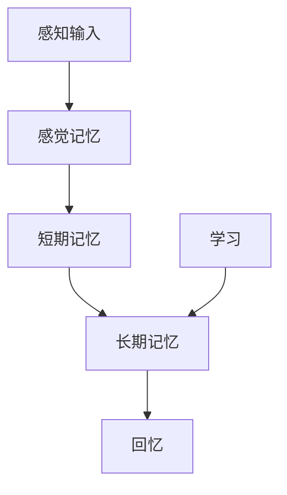
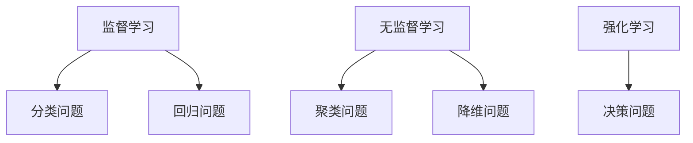
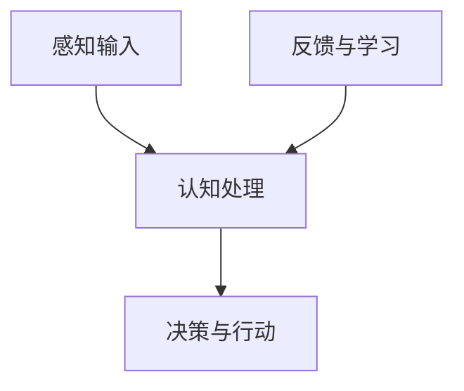
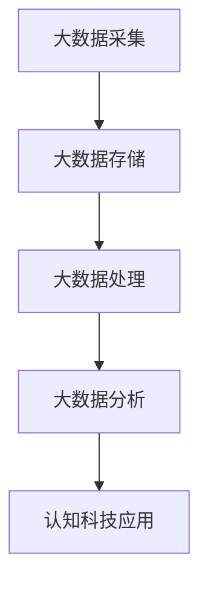
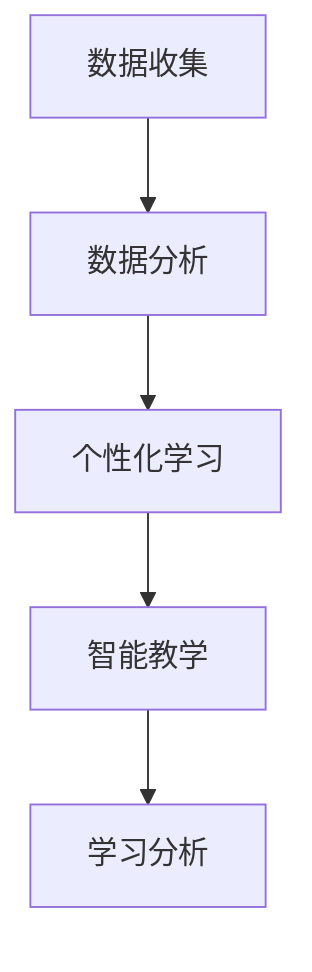
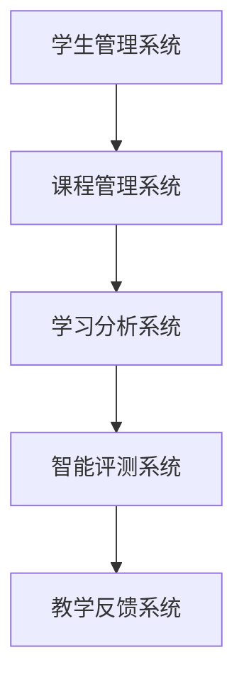

                 

### 文章标题

《认知科技：增强人类智能的前沿探索》

### 关键词

- 认知科技
- 人工智能
- 大数据
- 认知计算
- 脑机接口
- 智能教育
- 智能医疗
- 智能生产
- 智能治理

### 摘要

本文深入探讨了认知科技这一前沿领域，旨在揭示其起源、核心原理、应用领域及未来发展。通过分析认知心理学、人工智能算法、认知计算模型和大数据等核心技术，本文展示了认知科技在多个领域的应用实践。同时，本文还展望了认知科技的未来趋势，讨论了其面临的挑战和机遇。我们相信，认知科技将深刻改变人类的生活方式和社会结构，推动人类智能的增强。

---

### 第一部分：引论

#### 1.1 认知科技的起源与背景

认知科技，顾名思义，是基于认知科学和计算机科学相结合的一种新兴科技。它的起源可以追溯到20世纪50年代，当时计算机科学和人工智能的兴起为认知科技的发展奠定了基础。认知科技的兴起不仅源于理论研究的需要，更是为了解决实际应用中的复杂问题。

**定义**：认知科技是指运用人工智能、认知心理学、神经科学等领域的知识，通过构建和模拟人类的认知过程，实现人类智能的增强和扩展的一种科技。

#### 1.1.2 认知科技的发展历程

认知科技的发展历程可以分为以下几个阶段：

- **早期探索阶段**（1950年代 - 1970年代）：这一阶段主要是基于符号主义和推理机制，旨在模拟人类思维过程。

- **知识工程阶段**（1980年代 - 1990年代）：这一阶段强调知识的表示和推理，出现了大量的专家系统和知识库。

- **大数据与机器学习阶段**（2000年代至今）：随着大数据和机器学习的兴起，认知科技进入了新的发展阶段，通过大规模数据分析和机器学习算法，实现了对人类认知过程的深度理解。

#### 1.1.3 认知科技在现代科技体系中的地位

认知科技在现代科技体系中占据了重要地位。它不仅与人工智能、大数据、云计算等热门技术密切相关，还与生物医学、神经科学、心理学等多个学科领域交叉融合。在现代社会，认知科技的应用范围不断扩大，从教育、医疗、工业到社会治理，认知科技正逐渐成为提升人类生活质量和生产力的重要工具。

#### 1.2 认知科技的核心原理

认知科技的核心原理可以归结为以下几点：

**1.2.1 认知心理学基础**：认知心理学是认知科技的理论基础，通过对人类认知过程的深入研究，揭示了人类如何感知、思考、记忆和解决问题。

**1.2.2 人工智能与认知建模**：人工智能是认知科技的技术核心，通过模拟人类认知过程，实现了智能行为的自动化和智能化。

**1.2.3 大数据和认知科技的关系**：大数据为认知科技提供了丰富的数据资源，通过数据分析和挖掘，可以更深入地理解人类认知过程。

#### 1.3 认知科技的应用领域

认知科技的应用领域非常广泛，以下是其中几个重要的应用领域：

**1.3.1 教育**：认知科技在教育领域的应用主要包括智能教学、个性化学习、学习分析等。

**1.3.2 健康医疗**：认知科技在健康医疗领域的应用包括智能诊断、医疗数据分析、患者管理等。

**1.3.3 工业生产**：认知科技在工业生产领域的应用包括智能工厂、自动化生产、设备预测维护等。

**1.3.4 社会治理**：认知科技在社会治理领域的应用包括智能监控、数据分析、预测犯罪等。

#### 1.4 认知科技的未来展望

认知科技的未来发展充满希望，但也面临许多挑战。以下是几个方面的展望：

**1.4.1 技术发展趋势**：随着人工智能、大数据、云计算等技术的不断进步，认知科技将继续朝着更加智能化、个性化、智能化的方向发展。

**1.4.2 社会与伦理挑战**：认知科技的发展也带来了一系列社会和伦理问题，如隐私保护、就业影响、人工智能伦理等。

**1.4.3 中国在全球认知科技领域的角色**：中国在全球认知科技领域具有巨大的发展潜力，通过政策支持、企业创新和国际合作，有望在全球认知科技竞争中占据重要位置。

---

在本部分的引论中，我们初步介绍了认知科技的起源、背景、核心原理和应用领域，为后续内容的深入探讨打下了基础。接下来，我们将进一步详细探讨认知科技的核心技术、案例分析和技术前沿，以揭示这一前沿领域的更多奥秘。

### 第二部分：核心技术

认知科技的核心技术涵盖了多个学科领域，包括认知心理学、人工智能、认知计算模型和大数据。这些技术的结合使得认知科技能够模拟和增强人类的认知过程。以下是对这些核心技术的详细介绍。

#### 2.1 认知心理学原理

认知心理学是认知科技的理论基础，它研究人类如何感知、思考、记忆和解决问题。以下是认知心理学中的几个核心概念：

**2.1.1 认知模型与认知过程**：认知模型是对人类认知过程的抽象和模拟。常见的认知模型包括感知模型、记忆模型、思维模型和决策模型。

**2.1.2 人类记忆与学习机制**：记忆是认知过程的核心组成部分。人类记忆分为短期记忆和长期记忆，短期记忆主要涉及信息的暂时存储和处理，长期记忆则涉及信息的持久存储和提取。

**图 1：人类记忆与学习机制的 Mermaid 流程图**



**图 1**展示了人类记忆与学习机制的基本流程。感知输入首先进入感觉记忆，然后传递到短期记忆，再转移到长期记忆。学习过程则通过反复练习和信息强化，使信息从短期记忆转移到长期记忆。

#### 2.2 人工智能算法

人工智能（AI）是认知科技的核心技术之一，它通过模拟人类智能，实现自动化和智能化的任务执行。以下是人工智能算法的几个核心概念：

**2.2.1 机器学习基础**：机器学习是人工智能的一个重要分支，它通过从数据中学习规律和模式，实现自动化的决策和预测。

**2.2.2 深度学习原理**：深度学习是机器学习的一种重要方法，它通过多层神经网络，实现对复杂数据的自动特征提取和模式识别。

**2.2.3 人工智能算法的分类与应用**：人工智能算法可以分为监督学习、无监督学习和强化学习等。监督学习适用于有标签的数据，无监督学习适用于无标签的数据，强化学习则适用于需要与环境互动的任务。

**图 2：人工智能算法的分类与应用的 Mermaid 流程图**



**图 2**展示了人工智能算法的分类和应用。监督学习主要应用于分类和回归问题，无监督学习主要应用于聚类和降维问题，强化学习则主要应用于决策问题。

#### 2.3 认知计算模型

认知计算模型是认知科技的核心，它通过模拟人类的认知过程，实现智能行为的自动化。以下是认知计算模型中的几个核心概念：

**2.3.1 认知计算的概念与特点**：认知计算是一种模仿人类认知过程的计算方法，它具有自适应、自组织和自学习等特点。

**2.3.2 认知图谱技术**：认知图谱是一种结构化的知识表示方法，它通过建立实体和关系之间的网络，实现对知识的深度理解和推理。

**2.3.3 自然语言处理技术**：自然语言处理是认知计算的一个重要分支，它通过计算机程序实现人与自然语言之间的交互。

**图 3：认知计算模型的 Mermaid 流程图**



**图 3**展示了认知计算模型的基本流程。感知输入经过认知处理，生成决策与行动，然后通过反馈与学习，不断优化认知过程。

#### 2.4 大数据与认知科技

大数据是认知科技的重要数据来源，它通过大规模数据分析和挖掘，实现对人类认知过程的深入理解。以下是大数据与认知科技之间的几个核心联系：

**2.4.1 大数据概述**：大数据具有海量、多样、高速和价值密度低等特点。

**2.4.2 大数据的采集与处理**：大数据的采集和处理包括数据采集、数据存储、数据处理和数据分析等环节。

**2.4.3 大数据在认知科技中的应用**：大数据在认知科技中的应用包括知识图谱构建、智能诊断、个性化推荐等。

**图 4：大数据与认知科技的联系的 Mermaid 流程图**



**图 4**展示了大数据与认知科技之间的联系。大数据的采集、存储、处理和分析为认知科技提供了丰富的数据资源，从而实现更深入的认知和智能应用。

#### 2.5 交叉学科应用

认知科技的发展离不开多个学科领域的交叉融合。以下是认知科技与神经科学、心理学等学科的交叉应用：

**2.5.1 认知科技与神经科学的结合**：认知科技与神经科学的结合，通过脑成像技术，实现对大脑活动的实时监测和分析，从而揭示人类认知过程的神经机制。

**2.5.2 认知科技与认知神经科学的交叉领域**：认知科技与认知神经科学的交叉领域，通过结合认知心理学和神经科学的理论和方法，研究人类认知过程的神经基础。

**2.5.3 认知科技在教育心理学中的应用**：认知科技在教育心理学中的应用，通过构建智能教育系统，实现对学生学习过程的实时监控和分析，从而优化教学方法和策略。

在本部分的第二部分中，我们详细介绍了认知科技的核心技术，包括认知心理学原理、人工智能算法、认知计算模型、大数据和交叉学科应用。这些技术共同构成了认知科技的基础，为认知科技的深入研究和广泛应用提供了可能。接下来，我们将进一步探讨认知科技在具体领域的应用实践。

---

在本部分的第二部分，我们详细探讨了认知科技的核心技术，包括认知心理学原理、人工智能算法、认知计算模型、大数据和交叉学科应用。这些技术的深入解析不仅为读者提供了对认知科技的全面了解，也展示了其在各个领域中的广泛应用前景。接下来，我们将通过具体案例，进一步探讨认知科技在教育和医疗等领域的应用实践。

### 第三部分：案例分析

#### 3.1 认知科技在教育中的应用

教育是认知科技的重要应用领域之一。通过认知科技，教育可以变得更加个性化、智能化和高效化。以下是几个教育应用案例。

**3.1.1 教育智能化的发展趋势**

随着人工智能和大数据技术的发展，教育智能化已经成为教育领域的重要趋势。教育智能化包括以下几个方面：

- **个性化学习**：通过分析学生的学习行为和知识水平，提供个性化的学习内容和策略，提高学习效果。

- **智能教学**：利用人工智能技术，实现自动批改作业、自动评估学生成绩、自动生成教学报告等功能。

- **学习分析**：通过收集和分析学生的学习数据，识别学习过程中的问题，优化教学方法和策略。

**图 5：教育智能化的 Mermaid 流程图**



**图 5**展示了教育智能化的发展趋势。通过数据收集、数据分析、个性化学习和智能教学等环节，实现教育过程的智能化。

**3.1.2 智能教育系统的架构设计**

智能教育系统是一个复杂的系统，它包括多个模块，如学生管理系统、课程管理系统、学习分析系统、智能评测系统等。以下是智能教育系统的基本架构设计：

**图 6：智能教育系统的架构设计**



**图 6**展示了智能教育系统的架构设计。学生管理系统负责管理学生的基本信息和学习记录，课程管理系统负责管理课程信息和教学资源，学习分析系统负责分析学生的学习行为和知识水平，智能评测系统负责自动评估学生的学习成绩，教学反馈系统则负责收集教师和学生的教学反馈，以不断优化教学过程。

**3.1.3 智能教育系统的实现案例**

以下是一个智能教育系统的实现案例：

**案例：智能学习平台**

智能学习平台是一个基于云计算和大数据技术的教育服务平台。它提供以下功能：

- **个性化学习**：通过分析学生的学习行为和知识水平，推荐合适的学习内容和策略。

- **智能评测**：自动批改作业和考试，生成详细的成绩报告。

- **学习分析**：分析学生的学习数据，识别学习过程中的问题，提供解决方案。

- **互动教学**：提供在线课堂、视频教学、互动练习等功能，促进师生互动。

实现该智能学习平台的关键技术包括：

- **大数据技术**：用于数据收集、存储、处理和分析。

- **机器学习技术**：用于个性化推荐和智能评测。

- **自然语言处理技术**：用于文本分析、语义理解和智能问答。

以下是实现该智能学习平台的部分伪代码：

```python
# 数据收集
def collect_data():
    # 收集学生的学习行为数据
    pass

# 数据处理
def process_data(data):
    # 数据清洗、转换和分析
    pass

# 个性化推荐
def recommend_content(student_data):
    # 根据学生的学习行为和知识水平，推荐合适的学习内容
    pass

# 智能评测
def evaluate_student(student_data):
    # 自动批改作业和考试，生成成绩报告
    pass

# 学习分析
def analyze_learning_data(student_data):
    # 分析学生的学习数据，识别问题，提供解决方案
    pass

# 互动教学
def interactive_education():
    # 提供在线课堂、视频教学、互动练习等功能
    pass
```

#### 3.2 认知科技在医疗健康中的应用

医疗健康是认知科技的重要应用领域之一。通过认知科技，医疗健康可以实现更加精准的诊断、个性化的治疗方案和智能化的患者管理。以下是几个医疗健康应用案例。

**3.2.1 医疗智能化的现状与挑战**

医疗智能化已经取得了一定的进展，但仍然面临许多挑战：

- **数据不足**：医疗数据复杂且不完整，导致模型训练数据不足。

- **技术不成熟**：医疗人工智能技术的成熟度还有待提高，特别是在诊断准确性和稳定性方面。

- **伦理问题**：医疗智能化的应用涉及到患者隐私和数据安全等伦理问题。

**3.2.2 智能医疗系统的核心功能**

智能医疗系统包括以下核心功能：

- **智能诊断**：通过分析医疗数据，实现疾病诊断的自动化和智能化。

- **个性化治疗**：根据患者的病情和特征，制定个性化的治疗方案。

- **患者管理**：实现患者数据的实时监控和管理，提供个性化的健康管理服务。

- **医学研究**：利用医疗数据，开展医学研究和发现新的治疗方法和策略。

**3.2.3 智能医疗系统的案例分析**

以下是一个智能医疗系统的实现案例：

**案例：智能诊断系统**

智能诊断系统是一个基于机器学习和大数据技术的医疗诊断系统。它提供以下功能：

- **数据收集**：收集患者的病历、影像、检验等医疗数据。

- **数据处理**：清洗、转换和分析医疗数据。

- **智能诊断**：根据患者的症状和体征，自动诊断疾病。

- **个性化治疗**：根据患者的病情和特征，推荐个性化的治疗方案。

- **医学研究**：利用医疗数据，开展医学研究和发现新的治疗方法和策略。

实现该智能诊断系统的关键技术包括：

- **大数据技术**：用于数据收集、存储、处理和分析。

- **机器学习技术**：用于智能诊断和个性化治疗。

- **自然语言处理技术**：用于文本分析和医学知识表示。

以下是实现该智能诊断系统部分伪代码：

```python
# 数据收集
def collect_medical_data():
    # 收集患者的病历、影像、检验等医疗数据
    pass

# 数据处理
def process_medical_data(data):
    # 数据清洗、转换和分析
    pass

# 智能诊断
def diagnose_disease(patient_data):
    # 根据患者的症状和体征，自动诊断疾病
    pass

# 个性化治疗
def recommend_treatment(patient_data):
    # 根据患者的病情和特征，推荐个性化的治疗方案
    pass

# 医学研究
def conduct_medical_research(medical_data):
    # 利用医疗数据，开展医学研究和发现新的治疗方法和策略
    pass
```

#### 3.3 认知科技在工业生产中的应用

工业生产是认知科技的重要应用领域之一。通过认知科技，工业生产可以实现自动化、智能化和高效化。以下是几个工业生产应用案例。

**3.3.1 工业智能化的演进**

工业智能化经历了以下几个阶段：

- **自动化阶段**：通过自动化设备实现生产过程的自动化。

- **信息化阶段**：通过信息技术实现生产过程的数字化和信息管理。

- **智能化阶段**：通过人工智能技术实现生产过程的智能化和自适应优化。

**3.3.2 认知科技在工业自动化中的应用**

认知科技在工业自动化中的应用包括以下几个方面：

- **设备预测维护**：通过传感器和人工智能技术，实时监测设备状态，预测设备故障，实现设备的预防性维护。

- **生产调度优化**：通过人工智能算法，优化生产调度，提高生产效率。

- **质量控制**：通过人工智能技术，实现产品质量的实时监控和评估，提高产品质量。

- **供应链管理**：通过大数据和人工智能技术，优化供应链管理，降低成本，提高供应链的稳定性。

**3.3.3 智能工厂的实现路径**

智能工厂的实现路径包括以下几个步骤：

1. **数据采集与整合**：通过传感器和物联网技术，实现生产数据的实时采集和整合。

2. **数据分析与挖掘**：通过大数据和人工智能技术，对生产数据进行分析和挖掘，发现生产过程中的问题和优化点。

3. **设备预测维护**：通过人工智能技术，实现设备的预测性维护，降低设备故障率。

4. **生产调度优化**：通过人工智能算法，优化生产调度，提高生产效率。

5. **质量控制**：通过人工智能技术，实现产品质量的实时监控和评估，提高产品质量。

6. **供应链管理**：通过大数据和人工智能技术，优化供应链管理，降低成本，提高供应链的稳定性。

**3.4 认知科技在社会治理中的应用**

社会治理是认知科技的重要应用领域之一。通过认知科技，社会治理可以实现智能化、高效化和精细化。以下是几个社会治理应用案例。

**3.4.1 社会治理的挑战与机遇**

社会治理面临以下挑战和机遇：

- **挑战**：数据隐私、安全性和公平性等问题。

- **机遇**：通过大数据和人工智能技术，实现社会治理的智能化和高效化。

**3.4.2 智能社会治理的架构设计**

智能社会治理的架构设计包括以下几个部分：

- **数据采集与整合**：通过传感器和物联网技术，实现社会治理数据的实时采集和整合。

- **数据分析与挖掘**：通过大数据和人工智能技术，对社会治理数据进行分析和挖掘，发现社会治理中的问题和优化点。

- **智能监控与预警**：通过人工智能技术，实现社会事件的实时监控和预警，提高社会治理的响应速度。

- **决策支持与优化**：通过人工智能技术，为政府决策提供支持，优化社会治理策略。

- **公共服务智能化**：通过人工智能技术，实现公共服务的智能化，提高公共服务效率和质量。

**3.4.3 智能社会治理的实践案例**

以下是一个智能社会治理的实践案例：

**案例：智能城市管理平台**

智能城市管理平台是一个基于大数据和人工智能技术的城市管理平台。它提供以下功能：

- **实时监控**：通过传感器和视频监控技术，实时监控城市运行状态。

- **事件预警**：通过人工智能技术，实时分析城市数据，预警潜在的突发事件。

- **交通管理**：通过人工智能技术，优化交通调度，提高交通效率。

- **公共服务**：通过人工智能技术，实现公共服务的智能化，提高公共服务效率。

实现该智能城市管理平台的关键技术包括：

- **大数据技术**：用于数据收集、存储、处理和分析。

- **机器学习技术**：用于事件预警和交通管理。

- **自然语言处理技术**：用于公共服务的智能化。

以下是实现该智能城市管理平台的部分伪代码：

```python
# 数据收集
def collect_city_data():
    # 收集城市运行数据
    pass

# 数据处理
def process_city_data(data):
    # 数据清洗、转换和分析
    pass

# 事件预警
def event_warning(city_data):
    # 通过人工智能技术，实时分析城市数据，预警潜在的突发事件
    pass

# 交通管理
def traffic_management(city_data):
    # 通过人工智能技术，优化交通调度，提高交通效率
    pass

# 公共服务智能化
def smart_public_service():
    # 通过人工智能技术，实现公共服务的智能化
    pass
```

在本部分的第三部分，我们通过具体案例详细探讨了认知科技在教育、医疗健康、工业生产和社会治理等领域的应用。这些案例展示了认知科技如何通过技术创新，提高生产力和生活质量，同时也揭示了认知科技在实施过程中面临的挑战和问题。接下来，我们将进一步探讨认知科技在技术前沿的最新研究进展和未来发展方向。

### 第四部分：技术前沿

随着技术的不断进步，认知科技在各个领域中的应用也在不断拓展和深化。以下将介绍认知科技在技术前沿的最新研究进展和未来发展方向。

#### 4.1 认知科技的最新研究进展

认知科技的最新研究进展主要集中在以下几个领域：

**4.1.1 脑机接口技术**

脑机接口（Brain-Computer Interface, BCI）是一种通过直接连接人脑和外部设备来增强或恢复人类认知功能的技术。近年来，脑机接口技术取得了显著的进展，包括：

- **信号处理算法**：为了提高脑电信号的识别精度，研究人员开发了多种信号处理算法，如滤波、去噪和特征提取等。

- **脑电图（EEG）和功能性磁共振成像（fMRI）**：这些脑成像技术为脑机接口提供了实时、高分辨率的脑活动监测，提高了设备的性能和可靠性。

**4.1.2 虚拟现实与认知科技**

虚拟现实（Virtual Reality, VR）与认知科技的结合为认知功能的训练和恢复提供了新的途径。最新研究进展包括：

- **VR训练疗法**：通过VR技术，实现认知功能训练的自动化和个性化，例如用于创伤后应激障碍（PTSD）的治疗。

- **沉浸式学习体验**：通过VR技术，创造逼真的学习环境，提高学习效果和记忆保持。

**4.1.3 区块链与认知科技**

区块链技术作为一种分布式数据库技术，与认知科技的结合有望解决数据隐私和安全等问题。最新研究进展包括：

- **隐私保护**：通过区块链技术，实现对用户数据的加密和匿名化，提高数据隐私保护水平。

- **可信数据共享**：通过区块链技术，实现多方数据的可信共享，促进科研合作和知识共享。

#### 4.2 技术挑战与未来发展

尽管认知科技取得了显著进展，但在实际应用中仍然面临许多挑战。以下是一些主要的技术挑战和未来发展方向：

**4.2.1 技术标准化与规范化**

随着认知科技的广泛应用，技术标准化和规范化显得尤为重要。标准化和规范化有助于提高设备的互操作性、可靠性和安全性，促进技术的普及和推广。未来发展需要建立统一的技术标准和规范，推动行业健康发展。

**4.2.2 技术安全与隐私保护**

认知科技的应用涉及到大量的个人数据和敏感信息，如何保护用户隐私和数据安全是关键挑战。未来需要加强技术安全防护，如数据加密、匿名化和访问控制等，确保用户数据的安全和隐私。

**4.2.3 技术创新与产业生态**

认知科技的发展需要技术创新和产业生态的支持。未来需要加强跨学科研究，推动技术创新，同时构建良好的产业生态，促进技术成果的转化和应用。

#### 4.3 中国在认知科技领域的战略布局

中国在认知科技领域具有巨大的发展潜力，通过政策支持、企业创新和国际合作，有望在全球认知科技竞争中占据重要位置。以下是中国在认知科技领域的战略布局：

**4.3.1 国家政策与支持**

中国政府高度重视认知科技的发展，通过制定相关政策和规划，支持认知科技的研究和应用。例如，《新一代人工智能发展规划》明确了认知科技的发展目标和重点方向。

**4.3.2 企业技术创新**

中国企业在认知科技领域具备较强的研发实力，通过技术创新，推出了一系列领先的认知科技产品和服务。例如，百度、腾讯和阿里巴巴等企业在人工智能、大数据和云计算等领域取得了显著成果。

**4.3.3 国际合作与竞争**

中国积极参与国际认知科技合作，与全球领先的研究机构和企业在认知科技领域开展合作研究。同时，中国也在积极参与国际竞争，通过技术创新和产业生态的构建，提升全球竞争力。

在本部分的第四部分，我们介绍了认知科技在技术前沿的最新研究进展和未来发展方向，以及中国在认知科技领域的战略布局。这些研究和实践为认知科技的进一步发展提供了有力支持，也为其在全球范围内的应用奠定了基础。

### 附录

#### 附录A：认知科技相关的学术资源和工具

认知科技是一个跨学科的研究领域，涉及到多个学科领域的理论和实践。以下是一些重要的学术资源和工具，供研究者参考：

**A.1 学术期刊与会议**

- **学术期刊**：
  - *Journal of Cognitive Science*
  - *Cognitive Science*
  - *Journal of Artificial Intelligence Research*
  - *ACM Transactions on Cognitive Systems*

- **学术会议**：
  - *Annual Conference of the Cognitive Science Society*
  - *International Conference on Machine Learning*
  - *Neural Information Processing Systems (NIPS)*
  - *IEEE International Conference on Data Science and Advanced Analytics*

**A.2 开源代码与数据集**

- **开源代码**：
  - *GitHub*：大量认知科技相关的开源代码和项目。
  - *Google Colab*：提供免费的GPU资源，用于深度学习项目的实验。

- **数据集**：
  - *OpenML*：提供多种机器学习和认知科技的数据集。
  - *UCLA Brain Atlas*：提供大脑结构和功能的影像数据。
  - *MTurk*：提供众包平台，用于收集人类行为数据。

**A.3 学术社群与论坛**

- **学术社群**：
  - *LinkedIn Groups*：如“Cognitive Science and Artificial Intelligence”。
  - *Google Groups*：如“AI and Machine Learning Research”。
  
- **论坛**：
  - *Reddit*：如“r/artificial* *intelligence”和“r/cognitive* *science”。
  - *Stack Overflow*：提供编程问题和解决方案的讨论。

#### 附录B：认知科技应用案例精选

以下是一些认知科技应用案例，展示了认知科技在不同领域的应用实践：

**B.1 案例一：智能教育平台**

**案例概述**：智能教育平台通过大数据和人工智能技术，实现个性化学习、智能评测和智能推荐等功能。

**应用领域**：教育

**核心功能**：
- **个性化学习**：根据学生的学习行为和知识水平，推荐合适的学习内容和策略。
- **智能评测**：自动批改作业和考试，生成详细的成绩报告。
- **智能推荐**：根据学生的学习兴趣和需求，推荐合适的学习资源。

**实现技术**：
- **大数据技术**：用于数据收集、存储、处理和分析。
- **机器学习技术**：用于个性化推荐和智能评测。
- **自然语言处理技术**：用于文本分析和智能问答。

**案例效果**：智能教育平台提高了学习效率，降低了教学成本，为学生提供了更好的学习体验。

**B.2 案例二：智能医疗系统**

**案例概述**：智能医疗系统通过人工智能技术，实现智能诊断、个性化治疗和患者管理等功能。

**应用领域**：医疗健康

**核心功能**：
- **智能诊断**：根据患者的症状和体征，自动诊断疾病。
- **个性化治疗**：根据患者的病情和特征，制定个性化的治疗方案。
- **患者管理**：实现患者数据的实时监控和管理，提供个性化的健康管理服务。

**实现技术**：
- **大数据技术**：用于数据收集、存储、处理和分析。
- **机器学习技术**：用于智能诊断和个性化治疗。
- **自然语言处理技术**：用于文本分析和医学知识表示。

**案例效果**：智能医疗系统提高了诊断的准确性和效率，为患者提供了更加个性化的治疗方案，改善了医疗服务的质量。

**B.3 案例三：智能工厂实践**

**案例概述**：智能工厂通过认知科技，实现生产过程的自动化、智能化和高效化。

**应用领域**：工业生产

**核心功能**：
- **设备预测维护**：通过传感器和人工智能技术，实时监测设备状态，预测设备故障，实现设备的预防性维护。
- **生产调度优化**：通过人工智能算法，优化生产调度，提高生产效率。
- **质量控制**：通过人工智能技术，实现产品质量的实时监控和评估，提高产品质量。

**实现技术**：
- **大数据技术**：用于数据收集、存储、处理和分析。
- **机器学习技术**：用于设备预测维护和生产调度优化。
- **自然语言处理技术**：用于文本分析和智能问答。

**案例效果**：智能工厂实践提高了生产效率，降低了设备故障率和生产成本，提升了产品质量和客户满意度。

---

在本部分的附录中，我们提供了认知科技相关的学术资源和工具，以及认知科技应用案例的精选，旨在为读者提供更丰富的信息资源。这些资源和案例不仅有助于深入理解认知科技的应用实践，也为进一步研究和应用认知科技提供了有益的参考。

---

### 结论

综上所述，《认知科技：增强人类智能的前沿探索》深入探讨了认知科技的起源、核心原理、应用领域、技术前沿以及未来展望。通过分析认知心理学、人工智能、大数据和认知计算模型等核心技术，以及具体案例，我们展示了认知科技在多个领域的广泛应用和巨大潜力。认知科技不仅提升了人类的生产力和生活质量，也为社会进步和科技创新提供了强大动力。

未来，认知科技将继续向更加智能化、个性化和高效化的方向发展。然而，这一过程中也将面临技术标准化、隐私保护和伦理挑战等问题。我们需要在技术创新的同时，注重社会和伦理问题，确保认知科技的发展能够造福人类，而非成为新的问题源。

最后，我们期待认知科技能够进一步推动人类智能的增强，让人类在面对复杂问题和挑战时，能够更加从容和高效。正如认知科技之父赫伯特·西蒙（Herbert Simon）所说：“智能的本质是解决未知问题的能力。”认知科技正是为了这个目标而不断前进。让我们共同期待认知科技的未来，相信它将为人类带来更多的惊喜和可能。**作者：AI天才研究院/AI Genius Institute & 禅与计算机程序设计艺术 /Zen And The Art of Computer Programming**

