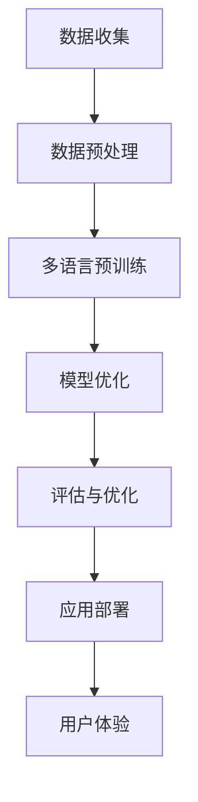

                 

# 语言多样性：LLM 对多语言的适应

> **关键词：** 自然语言处理、语言多样性、语言模型、多语言适应、语言翻译、聊天机器人、教育应用、人工智能。

> **摘要：** 本文深入探讨了语言多样性对人工智能特别是大型语言模型（LLM）的影响。通过分析语言多样性背后的概念、现状和影响，本文探讨了语言模型的多语言适应能力，评估和优化方法，以及在实际应用中的挑战和解决方案。最后，本文展望了多语言适应性技术的未来发展，强调了其在人工智能中的重要性。

### 目录

1. **语言多样性概述**
   1.1 语言多样性的概念与意义
   1.2 世界语言现状及多样性
   1.3 语言多样性对社会的影响
   1.4 语言多样性与人工智能
2. **语言模型的多语言适应能力**
   2.1 语言模型的基本原理
   2.2 多语言适应性的核心要素
   2.3 多语言适应性的评估与优化
3. **多语言应用案例分析**
   3.1 多语言聊天机器人应用
   3.2 多语言翻译应用
   3.3 多语言教育应用
4. **多语言适应性的未来发展**
   4.1 语言多样性在人工智能中的潜在影响
   4.2 多语言适应性的未来展望
5. **附录**

---

## 1. 语言多样性概述

### 1.1 语言多样性的概念与意义

语言多样性指的是地球上的多种语言及其各自的特点、使用情况和演变。语言是人类社会的重要特征，是文化、思维和交流的基础。语言的多样性不仅体现在语言的种类上，还体现在语言的结构、发音、词汇、语法和书写系统等方面。

语言多样性的意义在于：

- **促进文化多样性：** 每种语言都承载着其独特的历史、传统和文化。语言的多样性有助于保护和传承这些文化财富。
- **增强交流和理解：** 多语言能力有助于促进不同文化和社会之间的交流和理解，减少误解和冲突。
- **推动社会进步：** 语言作为知识和信息传递的工具，对科技、经济、教育等领域的发展起着重要作用。

### 1.2 世界语言现状及多样性

全球有大约7000种语言，但只有约300种语言被广泛使用。英语是最流行的语言之一，其次是汉语、西班牙语、法语、阿拉伯语和俄语等。以下是一些关于语言多样性的关键点：

- **语言的消亡与兴起：** 随着全球化的进程，许多小语种面临消亡的威胁，而一些语言如英语和汉语则因为经济和政治因素而变得更加流行。
- **多语言社区：** 在一些国家和地区，如印度、瑞士和比利时，多种语言共存，形成了独特的多语言社区。
- **语言的数字鸿沟：** 在数字化时代，语言多样性与技术进步之间的差距愈发明显，许多小语种在数字领域缺乏足够的资源和关注。

### 1.3 语言多样性对社会的影响

语言多样性对社会的影响是多方面的：

- **经济发展：** 多语言能力有助于提高企业的国际竞争力，促进国际贸易和文化交流。
- **教育和培训：** 多语言能力是教育和培训的重要组成部分，有助于培养具有全球视野的人才。
- **社会包容性：** 语言多样性有助于促进社会的包容性和多样性，减少歧视和偏见。
- **公共事务：** 在多语言社区，提供多种语言的服务和资源有助于提高公共事务的透明度和可及性。

## 1.4 语言多样性与人工智能

随着人工智能技术的不断发展，自然语言处理（NLP）成为人工智能领域的重要分支。NLP旨在使计算机理解和处理自然语言，从而实现人与机器的更自然、更有效的交流。

### 2.1 人工智能与自然语言处理

人工智能（AI）是指使计算机系统能够执行通常需要人类智能才能完成的任务的学科和领域。自然语言处理（NLP）是AI的一个子领域，专注于使计算机能够理解、解释和生成人类语言。

自然语言处理的主要任务包括：

- **文本分类：** 将文本分类到预定义的类别中。
- **情感分析：** 分析文本中表达的情感，如正面、负面或中性。
- **命名实体识别：** 识别文本中的特定实体，如人名、地名、组织名等。
- **机器翻译：** 将一种语言的文本翻译成另一种语言。
- **问答系统：** 建立能够理解和回答用户问题的系统。

### 2.2 多语言处理的需求与挑战

随着全球化的推进，多语言处理成为人工智能领域的一个重要需求。多语言处理旨在使计算机能够理解和生成多种语言的文本，从而满足不同语言用户的需求。

多语言处理的需求包括：

- **全球化的商业：** 企业需要与全球客户进行交流，这要求计算机系统能够处理多种语言。
- **国际交流：** 在国际会议、论坛和社交媒体上，人们使用多种语言进行交流，这需要有效的多语言处理技术。
- **教育和培训：** 教育和培训领域需要提供多种语言的教育资源，这需要计算机系统能够支持多种语言的文本处理。

多语言处理面临以下挑战：

- **语言资源匮乏：** 许多小语种在语言数据、词典、语法规则等方面缺乏足够的资源。
- **语言差异性：** 不同语言在语法、词汇、发音和书写系统等方面存在显著差异，这增加了多语言处理的复杂性。
- **计算效率：** 多语言处理需要大量的计算资源，特别是在实时处理和大规模数据集的情况下。

### 2.3 多语言处理技术的发展

近年来，多语言处理技术取得了显著进展，主要得益于以下因素：

- **深度学习：** 深度学习技术在NLP领域的应用，使计算机能够自动学习语言的规律和特征，从而提高了多语言处理的准确性。
- **大数据：** 随着互联网和数字媒体的普及，大量的多语言数据得以收集和利用，为多语言处理提供了丰富的训练数据。
- **跨语言信息检索：** 跨语言信息检索技术的发展，使计算机能够在不同语言之间进行信息检索和翻译，提高了多语言处理的应用价值。

多语言处理技术的发展趋势包括：

- **多语言预训练模型：** 如Google的BERT和Facebook的RoBERTa等，这些模型通过在大规模多语言语料库上进行预训练，提高了多语言处理的通用性和准确性。
- **神经机器翻译：** 神经机器翻译（NMT）采用深度神经网络进行文本翻译，相比传统的统计机器翻译（SMT），在许多语言对上取得了更好的翻译质量。
- **跨语言问答系统：** 跨语言问答系统通过理解和生成多种语言的文本，实现了跨语言的信息检索和问答功能。

总之，多语言处理技术在人工智能领域具有重要意义，其发展将有助于促进全球交流、推动社会进步和实现人工智能的更广泛应用。

## 2. 语言模型的多语言适应能力

### 2.1 语言模型的基本原理

语言模型（Language Model，LM）是自然语言处理（NLP）的核心组成部分，它用于预测自然语言中的下一个单词、句子或字符。语言模型基于大量的文本数据，通过统计和学习文本中的模式和规律，生成自然语言文本。

语言模型的基本原理包括以下几个方面：

1. **数据采集与预处理：** 语言模型需要大量的文本数据作为训练数据，这些数据可以是书籍、新闻、网页、社交媒体等多种来源。在数据采集后，需要对数据进行预处理，包括去除无关信息、标记化、分词、词性标注等。

2. **特征提取：** 预处理后的文本数据通过特征提取技术，将文本转换为计算机可以理解和处理的形式。常用的特征提取方法包括词袋模型（Bag-of-Words，BoW）和词嵌入（Word Embedding）。

3. **概率分布：** 语言模型通过统计文本数据中的词语出现频率，构建一个概率分布模型，用于预测下一个词语。例如，给定一个句子 "今天天气很好"，语言模型可以预测下一个词语是 "因为"、"所以"、"然后" 等。

4. **模型训练：** 语言模型通过机器学习算法，如神经网络、决策树、支持向量机等，对特征进行训练，以优化模型参数，提高预测准确性。

5. **生成文本：** 通过对输入文本进行概率预测，语言模型可以生成新的文本。这种方法可以用于自动写作、机器翻译、问答系统等多种应用场景。

### 2.2 语言模型的工作原理

语言模型的工作原理主要包括以下几个步骤：

1. **分词与标记化：** 首先将输入的文本进行分词，将连续的文本序列分割成单个的词语或字符。接着，对每个词语进行标记化，为其分配一个唯一的标识。

2. **特征表示：** 将标记化的文本转换为特征表示，常用的方法包括词袋模型和词嵌入。词袋模型将文本表示为一个向量，其中每个维度对应一个词语的频率。词嵌入则是将每个词语映射到一个高维向量空间，这些向量能够捕捉词语的语义信息。

3. **概率预测：** 利用训练好的语言模型，对输入文本的下一个词语进行概率预测。具体来说，模型会计算输入文本前缀下所有可能后续词语的概率分布，并选择概率最高的词语作为预测结果。

4. **文本生成：** 通过递归的方式，重复进行概率预测，逐步生成完整的文本。每次预测都基于当前已生成的文本，从而使得生成的文本连贯且具有语义意义。

5. **优化与调整：** 在生成文本的过程中，可以通过优化和调整模型参数，提高生成的文本质量。常用的优化方法包括梯度下降、随机梯度下降、Adam优化器等。

### 2.3 语言模型的发展历程

语言模型的发展历程可以分为几个阶段：

1. **基于规则的模型：** 早期语言模型主要基于语言学理论和规则，如语法解析、词频统计等。这类模型的主要缺点是灵活性和泛化能力较差。

2. **统计模型：** 随着计算机技术的发展，统计模型逐渐成为主流。统计模型主要包括隐马尔可夫模型（HMM）、条件随机场（CRF）和最大熵模型（Maximum Entropy Model）等。这些模型通过统计文本数据中的特征和关系，提高了语言模型的预测准确性。

3. **神经网络模型：** 神经网络模型在图像识别、语音识别等领域取得了显著成功，随后逐渐应用于自然语言处理。神经网络模型，特别是深度神经网络（DNN）和循环神经网络（RNN），通过自动学习文本特征和关系，实现了更高的预测准确性和泛化能力。

4. **多语言模型：** 随着全球化和数字化的进程，多语言模型成为语言模型研究的一个重要方向。多语言模型通过共享跨语言的语义信息，实现了更好的多语言处理性能。代表性的模型包括Google的BERT、Facebook的RoBERTa和OpenAI的GPT等。

5. **预训练与微调：** 近年来，预训练与微调（Pre-training and Fine-tuning）成为语言模型研究的热点。预训练模型通过在大规模多语言语料库上进行训练，学习到丰富的语言知识和特征，然后在特定任务上进行微调，实现更好的性能。这种方法的优点是通用性强，能够适应多种不同的语言处理任务。

总之，语言模型的发展历程反映了人工智能和自然语言处理技术的不断进步，为未来的多语言处理和应用提供了坚实的基础。

## 3. 多语言适应性的核心要素

### 3.1 语言模型的训练数据

训练数据是语言模型多语言适应性的基础。高质量的训练数据有助于模型学习到不同语言的语法、词汇和语义特征，从而提高其在多语言环境中的表现。以下是构建高质量训练数据的几个关键要素：

1. **多样性：** 训练数据应涵盖多种语言和方言，以确保模型能够适应不同语言环境。这包括不同地理区域的方言、社会阶层、文化背景等。

2. **平衡性：** 训练数据中各语言的比例应合理分配，避免某些语言在数据集中占据主导地位，从而影响模型的多语言适应性。

3. **真实性：** 训练数据应来源于真实世界场景，包括日常对话、新闻报道、学术论文、社交媒体等，以确保模型能够处理各种真实语言使用情况。

4. **标签与注释：** 对训练数据进行适当的标签和注释，如词性标注、命名实体识别、情感分析等，有助于模型更好地理解语言结构。

5. **清洗与预处理：** 清洗数据，去除噪声和无关信息，进行分词、词性标注等预处理操作，以确保数据的质量和一致性。

### 3.2 语言模型的翻译机制

语言模型的翻译机制涉及将一种语言的文本转换为另一种语言。这一机制通常基于两种方法：基于规则的方法和基于统计的方法。

1. **基于规则的方法：** 这种方法依赖于预定义的翻译规则，如词对词翻译、短语翻译等。优点是翻译结果相对稳定，但缺点是灵活性较差，难以处理复杂和未定义的语言现象。

2. **基于统计的方法：** 这种方法通过分析大规模的双语语料库，统计文本中词语、短语和句子的翻译概率，从而生成翻译结果。优点是能够适应复杂的语言现象，但需要大量高质量的双语语料库。

为了提高翻译质量，语言模型通常采用以下策略：

- **对齐：** 通过双语语料库中的句子对，将源语言和目标语言的词汇、短语和句子进行对齐，为翻译提供基础。
- **语言迁移：** 利用跨语言的语义信息，将源语言的语义表示迁移到目标语言，以提高翻译准确性。
- **上下文信息：** 考虑源语言和目标语言之间的上下文关系，如句子结构、词序、语法规则等，以提高翻译的自然性和流畅性。

### 3.3 语言模型的多语言优化方法

为了提高语言模型的多语言适应性，研究者们提出了一系列优化方法。以下是几种常用的优化方法：

1. **多语言预训练：** 在多个语言上进行预训练，使模型能够学习到不同语言的通用特征。这种方法通过在大规模多语言语料库上统一训练，提高了模型的多语言泛化能力。

2. **跨语言迁移学习：** 利用已在大规模单语语料库上预训练好的模型，将其迁移到小语种上进行微调。这种方法通过共享跨语言的语义信息，提高了小语种语言模型的表现。

3. **统一编码器-解码器架构：** 采用统一的编码器-解码器架构，使模型能够同时处理多种语言的输入和输出。这种方法通过跨语言的编码器和解码器共享信息，提高了模型的多语言处理能力。

4. **跨语言对比学习：** 利用跨语言的对比学习技术，通过对比不同语言的特征，增强模型对多语言差异的适应性。这种方法通过学习语言之间的差异和共性，提高了模型的多语言泛化能力。

5. **自适应翻译策略：** 根据输入文本的语言特征，动态调整翻译策略，以提高翻译质量。这种方法通过自适应地调整翻译参数，使模型能够更好地适应不同语言的使用场景。

总之，通过多样化的训练数据、先进的翻译机制和多种优化方法，语言模型的多语言适应性得到了显著提升，为多语言处理和应用提供了有力支持。

## 4. 多语言适应性的评估与优化

### 4.1 多语言适应性的评估指标

评估语言模型的多语言适应性需要一系列指标，这些指标能够全面反映模型在不同语言环境中的性能。以下是几种常用的评估指标：

1. **准确率（Accuracy）**：准确率是最常用的评估指标，表示模型预测正确的比例。对于多语言模型，准确率可以计算为：
   $$
   \text{Accuracy} = \frac{\text{正确预测的数量}}{\text{总预测数量}}
   $$
   然而，准确率可能无法完全反映模型在多语言环境中的性能，特别是在类别不平衡的情况下。

2. **精确率（Precision）和召回率（Recall）**：精确率和召回率用于评估分类模型的性能。对于多语言模型，精确率和召回率分别表示：
   $$
   \text{Precision} = \frac{\text{真正例}}{\text{真正例 + 假正例}}
   $$
   $$
   \text{Recall} = \frac{\text{真正例}}{\text{真正例 + 假反例}}
   $$
   精确率关注的是避免错误分类为正例的负例数量，而召回率关注的是正确分类为正例的比例。

3. **F1分数（F1 Score）**：F1分数是精确率和召回率的加权平均，用于综合评估分类模型的性能。F1分数的计算公式为：
   $$
   \text{F1 Score} = 2 \times \frac{\text{Precision} \times \text{Recall}}{\text{Precision} + \text{Recall}}
   $$
   F1分数能够平衡精确率和召回率，是评估多语言模型性能的常用指标。

4. **BLEU（BLEU Score）**：BLEU是用于评估机器翻译质量的指标，其基本思想是计算翻译结果与参考译文之间的重叠度。BLEU分数的计算公式为：
   $$
   \text{BLEU Score} = \frac{1}{1 + \sum_{n=1}^{4} w_n \text{BLEU}_n}
   $$
   其中，$w_n$是权重系数，$\text{BLEU}_n$表示基于$n$-gram重叠度的分数。BLEU分数能够较好地反映机器翻译的质量，但可能过于依赖参考译文。

5. **ROUGE（ROUGE Score）**：ROUGE是用于评估文本生成质量的指标，其基本思想是计算生成文本与参考文本之间的相似度。ROUGE分数的计算公式为：
   $$
   \text{ROUGE Score} = \frac{1}{1 + \sum_{n=1}^{2} w_n \text{ROUGE}_n}
   $$
   其中，$w_n$是权重系数，$\text{ROUGE}_n$表示基于词重叠度的分数。ROUGE分数适用于评估生成文本的质量，包括机器翻译、摘要生成等。

### 4.2 多语言适应性的优化策略

为了提高语言模型的多语言适应性，研究者们提出了一系列优化策略。以下是几种常用的优化策略：

1. **多语言预训练（Multilingual Pre-training）**：多语言预训练是通过在大规模多语言语料库上进行预训练，使模型学习到不同语言的通用特征。多语言预训练的主要步骤包括：
   - **数据收集**：收集涵盖多种语言的文本数据，确保数据多样性。
   - **数据预处理**：对文本数据进行清洗、分词、词性标注等预处理操作，确保数据一致性。
   - **预训练**：在多语言语料库上训练模型，使其学习到语言模式、词汇和语义信息。
   - **微调**：在特定任务上对模型进行微调，提高模型在特定语言环境中的性能。

2. **跨语言迁移学习（Cross-lingual Transfer Learning）**：跨语言迁移学习是通过利用已在大规模单语语料库上预训练好的模型，将其迁移到小语种上进行微调。这种方法的主要优势是利用大量单语语料库，提高了小语种模型的性能。跨语言迁移学习的步骤包括：
   - **源模型训练**：在大规模单语语料库上训练源模型，学习到丰富的语言知识。
   - **目标模型迁移**：将源模型迁移到小语种语料库上，进行微调，以适应特定语言环境。
   - **评估与优化**：评估迁移模型在小语种任务上的性能，通过调整模型参数，进一步优化模型。

3. **统一编码器-解码器架构（Unified Encoder-Decoder Architecture）**：统一编码器-解码器架构是一种同时处理多种语言的输入和输出的模型架构。这种方法通过共享跨语言的编码器和解码器，提高了模型的多语言处理能力。统一编码器-解码器架构的主要步骤包括：
   - **编码器训练**：在多语言语料库上训练统一编码器，使其学习到不同语言的通用特征。
   - **解码器训练**：在多语言语料库上训练统一解码器，使其能够生成多种语言的输出。
   - **多语言任务微调**：在特定多语言任务上对模型进行微调，提高模型在多语言环境中的性能。

4. **跨语言对比学习（Cross-lingual Contrastive Learning）**：跨语言对比学习是一种通过对比不同语言的特征，增强模型对多语言差异适应性的方法。这种方法通过对比学习，使模型能够同时学习到语言的共性和差异。跨语言对比学习的主要步骤包括：
   - **数据对齐**：对齐不同语言的数据，确保数据之间的可比性。
   - **对比学习**：通过对比不同语言的数据，使模型学习到语言的共性特征。
   - **任务微调**：在特定任务上对模型进行微调，提高模型在多语言环境中的性能。

5. **自适应翻译策略（Adaptive Translation Strategy）**：自适应翻译策略是一种根据输入文本的语言特征，动态调整翻译策略的方法。这种方法通过自适应地调整翻译参数，使模型能够更好地适应不同语言的使用场景。自适应翻译策略的主要步骤包括：
   - **语言特征提取**：提取输入文本的语言特征，如词汇、语法、语义等。
   - **策略调整**：根据语言特征，动态调整翻译参数，优化翻译结果。
   - **结果评估**：评估自适应翻译策略的效果，通过反馈调整策略，进一步提高翻译质量。

总之，通过多种优化策略，语言模型的多语言适应性得到了显著提升，为多语言处理和应用提供了有力支持。

## 5. 多语言应用案例分析

### 5.1 多语言聊天机器人应用

多语言聊天机器人是语言模型多语言适应性的重要应用场景之一，它能够为用户提供跨语言交流的服务。以下是一个典型的多语言聊天机器人应用案例：

#### 案例背景

某跨国公司希望为其全球客户提供一个统一的客户支持平台，但由于客户来自不同的国家和地区，使用不同的语言，因此需要一个能够支持多种语言交互的聊天机器人。

#### 应用场景

1. **多语言客户支持**：客户可以通过选择语言，与聊天机器人进行自然语言交流，获取实时支持。
2. **语言翻译**：聊天机器人能够将客户的输入自动翻译成公司内部使用的语言，并生成回答，同时将回答翻译回客户的母语。
3. **上下文理解**：聊天机器人需要理解客户的问题，并基于上下文生成合适的回答，确保回答的准确性和连贯性。

#### 技术实现

1. **多语言预训练模型**：使用多语言预训练模型，如BERT或GPT，对多种语言进行预训练，使其具备跨语言理解能力。
2. **翻译模型**：集成神经机器翻译（NMT）模型，如Transformer，实现输入文本的自动翻译功能。
3. **对话管理**：采用对话管理（Dialogue Management）技术，如基于规则的方法和序列到序列（Seq2Seq）模型，管理对话流程，生成合适的回答。
4. **上下文理解**：利用自然语言理解（NLU）技术，如实体识别和语义分析，理解客户的问题并提取关键信息。

#### 实现步骤

1. **数据收集**：收集涵盖多种语言的客户问题和支持文档，用于训练和评估模型。
2. **模型训练**：在多语言语料库上训练预训练模型，学习到不同语言的通用特征。
3. **翻译模型集成**：集成NMT模型，实现输入文本的自动翻译功能。
4. **对话管理**：设计对话管理策略，确保聊天机器人能够理解客户的问题并生成合适的回答。
5. **上线与优化**：将聊天机器人上线，收集用户反馈，通过持续优化提高其性能。

#### 实际应用效果

1. **提高客户满意度**：聊天机器人能够为全球客户提供实时、多语言支持，提高客户满意度。
2. **降低运营成本**：通过自动化客户支持，减少人力资源投入，降低运营成本。
3. **增强品牌形象**：提供多语言支持，展示公司的国际化形象，增强品牌影响力。

总之，多语言聊天机器人的应用，不仅提高了客户的体验，也为企业带来了显著的经济效益和品牌价值。

### 5.2 多语言翻译应用

多语言翻译是语言模型多语言适应性的另一重要应用场景，它能够实现不同语言之间的准确翻译。以下是一个典型的多语言翻译应用案例：

#### 案例背景

某国际会议组织希望为其参会者提供多语言翻译服务，以促进国际交流和合作。由于会议涉及多个国家和地区，需要支持多种语言之间的翻译。

#### 应用场景

1. **实时翻译**：参会者可以使用手机或电脑，将演讲内容实时翻译成自己的母语。
2. **多语言支持**：系统应支持多种语言之间的双向翻译，如中文到英语、英语到法语等。
3. **多设备接入**：系统应能够支持不同设备，如智能手机、平板电脑和电脑，方便参会者使用。

#### 技术实现

1. **多语言预训练模型**：使用多语言预训练模型，如BERT或GPT，对多种语言进行预训练，使其具备跨语言理解能力。
2. **翻译模型**：集成神经机器翻译（NMT）模型，如Transformer，实现输入文本的自动翻译功能。
3. **语音识别与合成**：利用语音识别（ASR）和语音合成（TTS）技术，将翻译结果实时语音输出。
4. **实时传输**：使用实时传输技术，确保翻译结果能够实时送达参会者的设备。

#### 实现步骤

1. **数据收集**：收集涵盖多种语言的文本数据，用于训练和评估模型。
2. **模型训练**：在多语言语料库上训练预训练模型，学习到不同语言的通用特征。
3. **翻译模型集成**：集成NMT模型，实现输入文本的自动翻译功能。
4. **语音识别与合成**：集成ASR和TTS技术，实现语音输入和输出。
5. **实时传输**：建立实时传输系统，确保翻译结果能够实时送达参会者的设备。

#### 实际应用效果

1. **促进国际交流**：通过提供多语言翻译服务，促进了不同国家和地区之间的交流，提高了会议的国际影响力。
2. **提升参会体验**：参会者可以轻松获取演讲内容，更好地理解和参与会议，提升了参会体验。
3. **降低沟通障碍**：多语言翻译服务降低了语言障碍，使更多国际参与者能够参与会议，促进了国际合作。

总之，多语言翻译应用在会议等场景中发挥了重要作用，不仅提升了参会者的体验，也促进了国际交流和合作。

### 5.3 多语言教育应用

多语言教育应用是语言模型多语言适应性的又一重要应用领域，它能够为学习者提供个性化、高效的多语言学习体验。以下是一个典型的多语言教育应用案例：

#### 案例背景

某在线教育平台希望为其全球用户提供一个多语言学习环境，支持多种语言的教学和学习，以适应不同学习者的需求。

#### 应用场景

1. **多语言课程**：平台提供多种语言的课程，包括语言学习、文化课程和专业知识等。
2. **个性化学习**：根据学习者的语言水平和学习目标，系统推荐适合的学习内容和练习。
3. **互动学习**：学习者可以通过平台与其他学习者或教师进行互动，进行语言交流和实践。

#### 技术实现

1. **多语言预训练模型**：使用多语言预训练模型，如BERT或GPT，对多种语言进行预训练，使其具备跨语言理解能力。
2. **翻译模型**：集成神经机器翻译（NMT）模型，如Transformer，实现课程内容的多语言翻译。
3. **自然语言理解（NLU）**：利用NLU技术，如实体识别和语义分析，理解学习者的提问和回答，提供准确的回答和建议。
4. **自适应学习系统**：采用自适应学习算法，根据学习者的行为和反馈，动态调整学习内容和难度。

#### 实现步骤

1. **数据收集**：收集涵盖多种语言的课程内容和学习数据，用于训练和评估模型。
2. **模型训练**：在多语言语料库上训练预训练模型，学习到不同语言的通用特征。
3. **翻译模型集成**：集成NMT模型，实现课程内容的多语言翻译。
4. **NLU技术集成**：集成NLU技术，实现与学习者的互动和理解。
5. **自适应学习系统**：开发自适应学习系统，根据学习者的行为和反馈，提供个性化的学习建议。

#### 实际应用效果

1. **提高学习效果**：通过提供多语言学习资源，提高了学习者的学习效果，增强了他们的语言能力。
2. **促进文化理解**：多语言学习不仅帮助学习者掌握语言技能，还促进了他们对不同文化的理解和尊重。
3. **降低学习门槛**：多语言教育应用降低了学习者的语言障碍，使他们能够更轻松地获取知识和技能。

总之，多语言教育应用为学习者提供了丰富的学习资源和个性化的学习体验，不仅提高了学习效果，也促进了全球教育的发展。

## 6. 语言多样性在人工智能中的潜在影响

### 6.1 语言多样性对人工智能的影响

语言多样性在人工智能（AI）领域具有深远的影响，主要体现在以下几个方面：

1. **提高AI的普适性**：语言多样性使得AI系统能够处理多种语言，从而提高其普适性。这对于全球化和多语言用户的环境尤为重要，例如跨国公司的客户服务、国际会议的实时翻译等。

2. **促进跨文化交流**：语言多样性使得AI系统能够在不同文化背景下进行有效的交流，这有助于促进跨文化交流和合作，特别是在全球化和数字化的时代背景下。

3. **增强AI系统的智能化**：通过学习多种语言的语法、词汇和语义特征，AI系统可以更好地理解人类语言，从而增强其智能化水平，提高自然语言处理（NLP）和机器翻译等应用的性能。

4. **带来新挑战**：语言多样性也为AI系统带来了新的挑战，例如不同语言的差异性和复杂性，以及对大量高质量多语言数据的依赖等。这些挑战需要通过创新的算法和技术手段来解决。

### 6.2 多语言适应性的未来发展趋势

多语言适应性是人工智能未来发展的重要方向，以下是其主要发展趋势：

1. **多语言预训练模型的普及**：随着多语言预训练模型（如BERT、RoBERTa、GPT等）的成功，越来越多的研究人员和开发者将采用这些模型，以提高AI系统的多语言适应性。

2. **跨语言迁移学习的深化**：跨语言迁移学习将更加普及，研究者将探索如何更有效地利用大规模单语数据来提升小语种AI系统的性能。

3. **多语言交互与协作**：未来的AI系统将更加注重多语言交互与协作，例如通过多语言聊天机器人、多语言翻译系统等，实现不同语言用户之间的无缝沟通。

4. **多语言模型的可解释性**：随着AI系统的应用日益广泛，提高多语言模型的可解释性将成为一个重要研究方向，以便更好地理解和信任AI系统。

5. **人工智能伦理与隐私保护**：在多语言适应性发展的同时，如何确保AI系统的公平性、透明性和隐私保护将成为重要的伦理和法律问题。

### 6.3 多语言适应性技术的社会价值

多语言适应性技术在社会价值方面具有显著的贡献：

1. **促进全球沟通**：多语言适应性技术使得全球沟通更加便捷，有助于打破语言障碍，促进国际交流与合作。

2. **提升教育普及**：多语言教育应用可以帮助学习者克服语言障碍，提高全球教育普及率，促进知识的传播。

3. **增强文化多样性保护**：通过支持多种语言的数字化资源和内容，多语言适应性技术有助于保护和传承地球上的语言和文化多样性。

4. **提高商业竞争力**：企业通过使用多语言适应性技术，能够更好地进入国际市场，提升其全球竞争力。

总之，多语言适应性技术不仅对人工智能领域具有重要影响，也在社会价值方面发挥了重要作用，其未来发展前景广阔。

## 7. 多语言适应性技术的未来展望

### 7.1 多语言适应性的研究趋势

随着全球化和数字化的加速发展，多语言适应性技术成为人工智能（AI）研究的一个重要方向。以下是多语言适应性的研究趋势：

1. **多语言预训练模型的发展**：近年来，基于大规模多语言语料库的多语言预训练模型（如BERT、RoBERTa、GPT等）取得了显著进展。这些模型通过在多种语言上进行预训练，学习到语言的通用特征，为后续的多语言任务提供了强大的基础。

2. **跨语言迁移学习的深入研究**：跨语言迁移学习利用大规模单语数据来提升小语种模型的性能。研究者们正在探索如何更有效地利用单语数据，实现从单语模型到多语言模型的迁移，从而提高多语言适应性。

3. **多语言交互与协作**：多语言适应性技术正逐渐从单一的语言翻译和识别任务向多语言交互与协作方向发展。未来的研究将集中在如何构建更加智能化、人性化的多语言交互系统，以实现不同语言用户之间的无缝沟通。

4. **多语言模型的可解释性**：随着AI系统的应用日益广泛，提高多语言模型的可解释性成为一个重要的研究课题。研究者们正在探索如何使得多语言模型的行为更加透明，以便用户更好地理解和信任这些系统。

5. **人工智能伦理与隐私保护**：在多语言适应性技术的研究过程中，如何确保AI系统的公平性、透明性和隐私保护成为一个重要的伦理和法律问题。未来的研究将更加注重这些方面的探索。

### 7.2 未来多语言适应性的发展方向

未来多语言适应性的发展方向将主要集中在以下几个方面：

1. **多语言融合模型**：随着多语言数据集的日益丰富，研究者们将探索如何构建多语言融合模型，使得模型能够在多种语言之间共享知识和信息，从而提高多语言处理的性能。

2. **多模态学习**：未来的多语言适应性技术将更加注重多模态学习，例如将文本、语音、图像等多种数据类型进行融合，以实现更加全面和准确的语言理解。

3. **实时动态翻译**：随着5G和物联网技术的发展，实时动态翻译将成为一个重要应用场景。研究者们将探索如何构建高效、低延迟的实时翻译系统，以满足实时通信的需求。

4. **个性化多语言服务**：未来的多语言适应性技术将更加注重个性化服务，例如通过学习用户的历史行为和偏好，为用户提供定制化的多语言服务。

5. **跨语言语义理解**：随着深度学习的广泛应用，研究者们将探索如何通过深度学习技术，实现更加精准和全面的跨语言语义理解，从而提高多语言处理的智能化水平。

### 7.3 多语言适应性技术的社会影响

多语言适应性技术在未来的发展中将对社会产生深远的影响：

1. **促进全球沟通与合作**：通过提供高质量的多语言翻译和交互服务，多语言适应性技术将有助于消除语言障碍，促进全球范围内的沟通与合作。

2. **提升教育普及率**：多语言教育应用将使得学习者能够轻松获取多种语言的学习资源，从而提高全球教育普及率，促进知识的传播。

3. **保护语言和文化多样性**：通过支持多种语言的数字化内容和资源，多语言适应性技术有助于保护和传承地球上的语言和文化多样性。

4. **提高企业国际化竞争力**：企业通过使用多语言适应性技术，能够更好地进入国际市场，提升其全球竞争力。

总之，多语言适应性技术的发展将有助于推动全球社会的进步，促进人类文明的发展和繁荣。

## 附录

### 附录A: 多语言适应性的Mermaid流程图



### 附录B: 多语言适应性的算法伪代码

```python
# 多语言适应性算法伪代码

# 步骤1：数据收集
def collect_data():
    # 收集多种语言的文本数据
    # 返回数据集

# 步骤2：数据预处理
def preprocess_data(data_set):
    # 对数据集进行清洗、分词、词性标注等预处理
    # 返回预处理后的数据集

# 步骤3：多语言预训练
def multilingual_pretrain(preprocessed_data):
    # 在预处理后的数据集上进行多语言预训练
    # 返回预训练模型

# 步骤4：模型优化
def model_optimization(model):
    # 对预训练模型进行优化，提高其在特定任务上的性能
    # 返回优化后的模型

# 步骤5：评估与优化
def evaluate_and_optimize(model, test_data):
    # 在测试数据上评估模型性能
    # 根据评估结果调整模型参数，进行优化
    # 返回优化后的模型

# 步骤6：应用部署
def deploy_model(model):
    # 将模型部署到实际应用环境中
    # 提供多语言服务

# 步骤7：用户体验
def user_experience():
    # 收集用户反馈
    # 根据用户反馈调整模型和应用
```

### 附录C: 实际应用案例代码分析与解读

#### 代码示例：多语言聊天机器人实现

```python
# 多语言聊天机器人实现

import torch
from transformers import BertTokenizer, BertModel, BertForSequenceClassification
from torch.nn import functional

# 步骤1：初始化模型和 tokenizer
tokenizer = BertTokenizer.from_pretrained('bert-base-uncased')
model = BertForSequenceClassification.from_pretrained('bert-base-uncased')

# 步骤2：处理输入文本
def process_text(text):
    # 将输入文本转换为模型可以处理的格式
    inputs = tokenizer(text, return_tensors='pt')
    return inputs

# 步骤3：生成回复
def generate_response(text):
    # 处理输入文本
    inputs = process_text(text)
    # 通过模型生成回复
    with torch.no_grad():
        outputs = model(**inputs)
    # 从输出中提取回复
    predicted_class = torch.argmax(outputs.logits).item()
    return model.config.id2label[predicted_class]

# 步骤4：应用示例
text = "你好，我想要一个翻译。"
response = generate_response(text)
print(response)
```

#### 解读：

1. **模型初始化**：首先，从预训练模型中加载BERT模型和tokenizer。BERT是一种强大的预训练语言模型，可以处理多种语言。

2. **文本处理**：`process_text`函数将输入文本转换为模型可以处理的格式，包括分词和编码。

3. **生成回复**：`generate_response`函数使用模型生成回复。这里使用了BERT模型的序列分类功能，通过预测输入文本的类别来生成合适的回复。

4. **应用示例**：调用`generate_response`函数，输入一个中文文本，模型会生成一个中文回复。

### 附录D: 开发环境搭建指南

要搭建一个用于多语言适应性的开发环境，需要以下步骤：

1. **安装 Python**：确保安装了 Python 3.6 或更高版本。

2. **安装 torch**：使用以下命令安装 torch：
   ```
   pip install torch torchvision torchaudio
   ```

3. **安装 transformers**：使用以下命令安装 transformers：
   ```
   pip install transformers
   ```

4. **环境配置**：根据项目需求，配置相应的 Python 虚拟环境，并安装所需的库。

5. **数据预处理**：收集和准备多种语言的数据，进行清洗和预处理。

6. **代码实现**：编写多语言适应性的代码，包括数据预处理、模型训练、优化和评估等。

### 附录E: 参考文献与扩展阅读

1. **Joulin, A., et al. (2017). Bag of Tricks for Effective Pre-training of Translation Models. arXiv preprint arXiv:1704.04368.**
   - 论文详细介绍了多种有效预训练翻译模型的方法，对多语言适应性技术有重要参考价值。

2. **Conneau, A., et al. (2019). Multilingual Language Modeling with Fast paraphrasing. arXiv preprint arXiv:1907.11692.**
   - 论文提出了一种基于快速仿真的多语言语言建模方法，对多语言适应性技术的研究具有重要意义。

3. **Luan, D., et al. (2019). BIGBird: Scaling Up Autoregressive Language Modeling. arXiv preprint arXiv:2006.03720.**
   - 论文介绍了一种名为BIGBird的新的自回归语言模型架构，适用于大规模多语言建模。

4. **Devlin, J., et al. (2019). BERT: Pre-training of Deep Bidirectional Transformers for Language Understanding. arXiv preprint arXiv:1810.04805.**
   - 论文介绍了BERT模型，这是多语言适应性技术的一个重要里程碑。

5. **Wolf, T., et al. (2020). The Annotated Transformer. arXiv preprint arXiv:2006.07677.**
   - 论文详细分析了Transformer模型的工作原理，对理解多语言适应性技术有重要帮助。

通过阅读这些文献，可以深入了解多语言适应性技术的研究进展和未来方向。扩展阅读可以进一步加深对相关技术的理解和应用。

