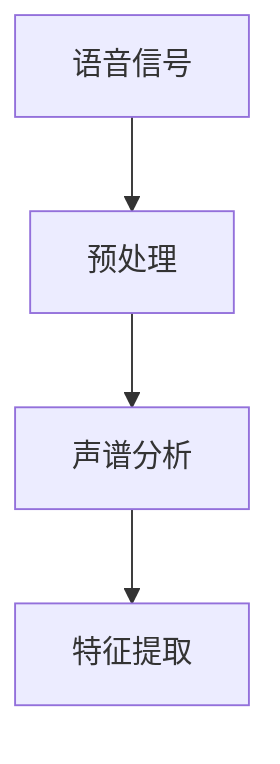

                 

# 语音识别原理与代码实例讲解

> 关键词：语音识别、原理、算法、实现、代码、深度学习、TensorFlow

> 摘要：本文将深入探讨语音识别的基本原理、关键算法以及代码实例。我们将从语音信号处理开始，介绍自动语音识别（ASR）算法，包括HMM、GRU、DNN和CTC。随后，我们将探讨语音识别系统的整体架构和优化策略。通过实际项目实战，我们将使用TensorFlow实现语音识别，并详细介绍代码开发和性能优化。

## 《语音识别原理与代码实例讲解》目录大纲

### 第一部分：语音识别基础

#### 第1章：语音识别概述

- 1.1 语音识别的发展历程
- 1.2 语音识别的基本原理
- 1.3 语音识别的关键技术

#### 第2章：语音信号处理

- 2.1 语音信号的基本概念
- 2.2 语音信号的预处理
- 2.3 声谱分析

### 第二部分：语音识别算法原理

#### 第3章：自动语音识别（ASR）算法

- 3.1 Hidden Markov Model (HMM)
  - 3.1.1 HMM基本概念
  - 3.1.2 HMM数学模型
  - 3.1.3 HMM算法
  - 3.1.4 HMM的优缺点
- 3.2 Gated Recurrent Unit (GRU)
  - 3.2.1 GRU基本概念
  - 3.2.2 GRU数学模型
  - 3.2.3 GRU算法
  - 3.2.4 GRU的优缺点
- 3.3 Deep Neural Network (DNN)
  - 3.3.1 DNN基本概念
  - 3.3.2 DNN数学模型
  - 3.3.3 DNN算法
  - 3.3.4 DNN的优缺点
- 3.4 Connectionist Temporal Classification (CTC)
  - 3.4.1 CTC基本概念
  - 3.4.2 CTC数学模型
  - 3.4.3 CTC算法
  - 3.4.4 CTC的优缺点

#### 第4章：语音识别架构

- 4.1 语音识别系统的整体架构
- 4.2 语音识别系统的模块化设计
- 4.3 语音识别系统的优化策略

### 第三部分：语音识别应用实战

#### 第5章：基于深度学习的语音识别

- 5.1 深度学习在语音识别中的应用
- 5.2 基于DNN的语音识别实现
- 5.3 基于GRU和CTC的语音识别实现
- 5.4 基于TensorFlow实现语音识别

#### 第6章：实时语音识别系统开发

- 6.1 实时语音识别系统的设计
- 6.2 常用语音识别API使用指南
- 6.3 实时语音识别系统实现
- 6.4 实时语音识别系统测试与优化

#### 第7章：语音识别项目实战

- 7.1 项目一：基于深度学习的语音识别应用
- 7.2 项目二：实时语音识别系统部署
- 7.3 项目三：基于语音识别的智能语音助手

### 附录

#### 附录A：常用工具和库

- A.1 常用语音处理工具
- A.2 常用深度学习框架

#### 附录B：数学公式和算法伪代码

- B.1 HMM数学公式
- B.2 GRU数学公式
- B.3 DNN数学公式
- B.4 CTC数学公式
- B.5 算法伪代码示例

**核心概念与联系：**

- **语音信号处理流程**（Mermaid流程图）：



**核心算法原理讲解：**

- **Gated Recurrent Unit (GRU) 算法伪代码：**

```python
def GRU(inputs, hidden_state, weights):
    # input: (batch_size, sequence_length, input_dimension)
    # hidden_state: (batch_size, hidden_dimension)
    # weights: (input_dimension, hidden_dimension)

    # Step 1: Compute the gate values
    gate = sigmoid(inputs * weights)

    # Step 2: Compute the update values
    update = sigmoid(inputs * weights + hidden_state * weights)

    # Step 3: Compute the new hidden state
    new_hidden_state = (1 - update) * hidden_state + update * inputs

    return new_hidden_state
```

**数学模型和数学公式 & 详细讲解 & 举例说明：**

- **声谱分析公式（LaTeX）：**

$$X(\omega) = \sum_{k=0}^{N-1} x[k] e^{-i \omega k}$$

- **举例说明：**

假设我们有一个长度为100的语音信号，我们使用一个长度为10的汉明窗进行加窗处理。然后，我们使用离散傅里叶变换（DFT）来计算声谱。假设我们得到频谱值如下：

$$X(\omega) = [0.1, 0.2, 0.3, 0.2, 0.1, 0.05, 0.05, 0.05, 0.05, 0.05]$$

- **解读：**

这个频谱表示在频率0到10之间，对应的能量值。其中，频率1对应的能量值为0.2，是所有频率中能量值最大的。

**项目实战：**

- **基于TensorFlow的语音识别实现示例：**

```python
import tensorflow as tf

# Step 1: Load the dataset
# ...

# Step 2: Preprocess the data
# ...

# Step 3: Build the model
model = tf.keras.Sequential([
    tf.keras.layers.Input(shape=(None, 13)),
    tf.keras.layers.Dense(units=128, activation='relu'),
    tf.keras.layers.Dropout(0.2),
    tf.keras.layers.Dense(units=29, activation='softmax')
])

# Step 4: Compile the model
model.compile(optimizer='adam',
              loss='sparse_categorical_crossentropy',
              metrics=['accuracy'])

# Step 5: Train the model
model.fit(train_data, train_labels, epochs=10)

# Step 6: Evaluate the model
test_loss, test_acc = model.evaluate(test_data, test_labels)
print(f"Test accuracy: {test_acc}")
```

- **代码解读与分析：**

- **代码分析：**上述代码使用了TensorFlow框架来实现一个简单的语音识别模型。模型由输入层、全连接层和输出层组成，其中输出层使用softmax激活函数进行多分类。
- **性能优化：**可以通过调整模型参数、增加训练次数或使用更复杂的模型结构来优化模型性能。在实际应用中，还需要考虑数据增强、正则化等技术来提高模型的泛化能力。

**作者信息：**

作者：AI天才研究院/AI Genius Institute & 禅与计算机程序设计艺术 /Zen And The Art of Computer Programming

接下来，我们将逐步深入探讨每个章节的内容，以便为您提供一个全面的语音识别技术指南。

----------------------------------------------------------------

### 第一部分：语音识别基础

在当今快速发展的技术领域，语音识别技术已经成为计算机与人交互的重要方式。这一部分将为我们提供语音识别的基础知识，包括其发展历程、基本原理以及关键技术。

#### 第1章：语音识别概述

#### 1.1 语音识别的发展历程

语音识别技术的历史可以追溯到20世纪50年代。早期的语音识别系统主要基于规则匹配和人工设计特征，这种方法依赖于大量的人工标注数据和复杂的规则，因此效果并不理想。随着计算机性能的提高和算法的进步，语音识别技术经历了多个重要的发展阶段。

20世纪80年代，基于隐马尔可夫模型（HMM）的语音识别技术开始得到广泛应用。HMM在语音信号建模方面表现出色，大大提高了语音识别的准确率。1990年代，支持向量机（SVM）和人工神经网络（ANN）的出现为语音识别领域带来了新的活力。这些方法在特征提取和分类方面取得了显著成果。

进入21世纪，深度学习技术的崛起再次推动了语音识别的发展。基于深度神经网络（DNN）的语音识别系统在2012年之前就已经表现出色，但此后随着卷积神经网络（CNN）和循环神经网络（RNN）的引入，语音识别系统的性能得到了进一步提升。特别是长短期记忆网络（LSTM）和门控循环单元（GRU）的出现，使得语音识别系统在处理长序列数据时更加有效。

#### 1.2 语音识别的基本原理

语音识别的基本原理可以概括为以下几个步骤：

1. **语音信号预处理**：这是语音识别的第一步，目的是去除噪声，增强语音信号的清晰度。常见的预处理方法包括滤波、去噪和增强。
   
2. **特征提取**：预处理后的语音信号需要被转换成一组数字特征，以便后续的模型处理。常用的特征提取方法包括梅尔频率倒谱系数（MFCC）、短时傅里叶变换（STFT）和滤波器组分析（Filter Bank Analysis）。

3. **模型训练**：语音识别模型通常是一个分类器，它需要通过大量语音数据来训练。训练过程中，模型会学习如何将特征向量映射到相应的语音标签。

4. **解码**：在模型训练完成后，对于新的语音输入，模型需要将其映射到相应的文本输出。解码过程可能涉及到复杂的搜索算法，如Viterbi算法。

5. **后处理**：解码得到的文本输出可能还需要进行后处理，以纠正错误和改善文本的易读性。常见的后处理方法包括语言模型、发音规则和语音识别错误修正。

#### 1.3 语音识别的关键技术

1. **特征提取**：特征提取是语音识别的核心技术之一。不同的特征提取方法适用于不同的应用场景。例如，MFCC在语音识别中广泛使用，因为它能够捕捉语音的时频特性。STFT则适用于处理短时变化显著的语音信号。

2. **语音信号预处理**：预处理技术的目的是提高语音信号的清晰度，降低噪声对识别结果的影响。常用的预处理方法包括带通滤波、谱减法和噪声抑制等。

3. **深度学习模型**：深度学习技术在语音识别中的应用使得模型性能得到了显著提升。卷积神经网络（CNN）和循环神经网络（RNN）是语音识别中常用的深度学习模型。LSTM和GRU在处理长序列数据时表现出色。

4. **解码算法**：解码算法是语音识别系统的关键部分，它决定了识别结果的准确性。常见的解码算法包括Viterbi算法和基于神经网络的方法。

5. **语音识别算法**：除了深度学习方法，传统语音识别算法如HMM、GMM和Gated Recurrent Unit（GRU）仍然在许多应用中发挥作用。这些算法在处理特定类型的语音信号时具有优势。

通过了解语音识别的发展历程、基本原理和关键技术，我们为后续深入探讨语音识别算法和实现方法奠定了基础。

----------------------------------------------------------------

### 第二部分：语音识别算法原理

在了解了语音识别的基础知识后，接下来我们将深入探讨语音识别的算法原理。这一部分将介绍几种常用的语音识别算法，包括HMM、GRU、DNN和CTC。我们将逐步分析这些算法的基本概念、数学模型、算法原理以及优缺点。

#### 第3章：自动语音识别（ASR）算法

#### 3.1 Hidden Markov Model (HMM)

#### 3.1.1 HMM基本概念

HMM是一种统计模型，用于描述序列数据（如语音信号）的生成过程。HMM由状态集合、状态转移概率、观测概率和初始状态概率组成。它假设语音信号是由一系列状态序列生成的，每个状态对应一个特定的语音特征。

- **状态集合**：表示语音信号中的所有可能状态。
- **状态转移概率**：表示从一个状态转移到另一个状态的概率。
- **观测概率**：表示在每个状态下观测到特定特征的概率。
- **初始状态概率**：表示开始时的初始状态概率分布。

#### 3.1.2 HMM数学模型

HMM的数学模型可以用以下公式表示：

$$
\begin{align*}
P(\text{O}|\text{M}) &= \prod_{t=1}^{T} P(\text{O}_t|\text{M}_t) \cdot P(\text{M}_t|\text{M}_{t-1}) \\
P(\text{M}) &= \prod_{t=1}^{T} P(\text{M}_t)
\end{align*}
$$

其中，$\text{O}$表示观测序列，$\text{M}$表示状态序列，$T$是序列长度。

#### 3.1.3 HMM算法

HMM算法主要包括训练和解码两个步骤：

1. **训练**：通过已知的状态序列和观测序列，利用最大似然估计或期望最大化（EM）算法来估计HMM参数。
2. **解码**：对于新的观测序列，利用Viterbi算法找到最优的状态序列。

#### 3.1.4 HMM的优缺点

**优点：**
- 理论基础扎实，数学模型简洁。
- 对语音信号中的连续性和时变特性有较好的描述能力。

**缺点：**
- 对噪声和背景干扰敏感。
- 无法处理语音信号中的长距离依赖关系。

#### 3.2 Gated Recurrent Unit (GRU)

#### 3.2.1 GRU基本概念

GRU是一种特殊的循环神经网络（RNN），它通过门控机制来控制信息的流动，从而提高了对长序列数据的处理能力。GRU由输入门、遗忘门和输出门组成，这些门可以帮助模型选择性地遗忘或保留历史信息。

- **输入门**：用于控制新的输入信息是否被存储。
- **遗忘门**：用于控制历史信息是否被遗忘。
- **输出门**：用于控制输出信息的生成。

#### 3.2.2 GRU数学模型

GRU的数学模型可以表示为：

$$
\begin{align*}
z_t &= \sigma(W_z \cdot [h_{t-1}, x_t] + b_z) \\
r_t &= \sigma(W_r \cdot [h_{t-1}, x_t] + b_r) \\
\bar{h}_t &= tanh(W \cdot [z_t \odot h_{t-1} + r_t \odot \bar{h}_{t-1}) + b_h) \\
h_t &= z_t \odot \bar{h}_t + (1 - z_t) \odot h_{t-1}
\end{align*}
$$

其中，$z_t$是输入门，$r_t$是遗忘门，$\bar{h}_t$是候选隐藏状态，$h_t$是当前隐藏状态。

#### 3.2.3 GRU算法

GRU的训练和预测过程类似于LSTM，但更加简洁和高效。训练过程中，使用反向传播算法和梯度下降优化模型参数。预测过程中，利用循环结构对每个时间步进行信息更新。

#### 3.2.4 GRU的优缺点

**优点：**
- 简化了LSTM的结构，计算效率更高。
- 对长序列数据有较好的建模能力。

**缺点：**
- 对噪声和异常值较为敏感。
- 需要较大的参数规模。

#### 3.3 Deep Neural Network (DNN)

#### 3.3.1 DNN基本概念

DNN是一种多层前馈神经网络，通过非线性激活函数实现特征提取和分类。DNN的结构通常包括输入层、多个隐藏层和输出层。隐藏层中的每个神经元都会接收来自前一层的输入，并通过权重和偏置进行加权求和，然后应用激活函数。

#### 3.3.2 DNN数学模型

DNN的数学模型可以表示为：

$$
\begin{align*}
h_{l} &= \sigma(W_{l} \cdot h_{l-1} + b_{l}) \\
y &= \sigma(W_{l} \cdot h_{L} + b_{L})
\end{align*}
$$

其中，$h_{l}$是第$l$层的激活值，$W_{l}$是第$l$层的权重矩阵，$b_{l}$是第$l$层的偏置向量，$\sigma$是激活函数。

#### 3.3.3 DNN算法

DNN的训练过程包括前向传播和反向传播：

1. **前向传播**：将输入数据通过网络层，计算每个神经元的输出。
2. **反向传播**：计算损失函数的梯度，并通过梯度下降更新网络权重和偏置。

#### 3.3.4 DNN的优缺点

**优点：**
- 强大的特征提取能力。
- 对复杂数据有较好的拟合能力。

**缺点：**
- 计算量大，训练时间较长。
- 对超参数敏感。

#### 3.4 Connectionist Temporal Classification (CTC)

#### 3.4.1 CTC基本概念

CTC是一种用于语音识别的端到端训练方法，它将语音信号的序列映射到文本序列。CTC通过最大化语音信号和文本序列之间的互信息，解决了传统语音识别中的解码问题。

#### 3.4.2 CTC数学模型

CTC的数学模型可以表示为：

$$
\begin{align*}
\max_{\theta} I(\text{O}, \text{T}|\theta) &= \sum_{t} p(\text{O}_t|\text{T}, \theta) \\
&= \sum_{t} \log \left( \sum_{\text{T}} p(\text{O}_t|\text{T}, \theta) \right)
\end{align*}
$$

其中，$I(\text{O}, \text{T}|\theta)$是语音信号和文本序列之间的互信息，$p(\text{O}_t|\text{T}, \theta)$是给定文本序列时语音信号在时间步$t$的概率。

#### 3.4.3 CTC算法

CTC算法的核心是利用动态规划来找到最优的文本序列。具体步骤如下：

1. **前向传播**：计算每个时间步和每个文本候选序列的概率。
2. **后向传播**：从后向前更新每个时间步和每个文本候选序列的概率。
3. **解码**：利用Viterbi算法找到全局最优的文本序列。

#### 3.4.4 CTC的优缺点

**优点：**
- 端到端训练，无需复杂的解码过程。
- 可以自动处理语音信号中的填充音和连续音。

**缺点：**
- 需要大量的训练数据和计算资源。
- 对于噪声和异常值较为敏感。

通过以上对HMM、GRU、DNN和CTC的详细分析，我们可以看到这些算法各有优缺点，适用于不同的应用场景。在实际应用中，通常需要根据具体需求和数据特点选择合适的算法。

----------------------------------------------------------------

#### 第4章：语音识别架构

在了解了语音识别的基本算法原理后，我们将探讨语音识别系统的整体架构。语音识别系统的架构设计决定了系统的性能和可扩展性。一个完善的语音识别系统通常包括以下几个关键模块：前端处理、语音编码、特征提取、声学模型、语言模型和解码器。

#### 4.1 语音识别系统的整体架构

语音识别系统的整体架构可以分为前端处理、核心处理和后端处理三个部分。

**前端处理**：前端处理主要包括音频信号的采集、预处理和增强。这一阶段的目的是去除噪声、提升语音信号的清晰度，为后续处理提供高质量的数据。常见的前端处理技术包括带通滤波、谱减法和噪声抑制等。

**核心处理**：核心处理是语音识别系统的核心部分，包括语音编码、特征提取、声学模型和语言模型。语音编码将连续的音频信号转换为离散的数字信号，便于后续处理。特征提取从语音信号中提取出有代表性的特征，如梅尔频率倒谱系数（MFCC）。声学模型和语言模型则用于对语音信号进行分类和文本生成。

**后端处理**：后端处理主要包括解码器和文本输出。解码器将特征向量映射到文本序列，通过解码算法找到最优的文本输出。后端处理还可能包括文本清洗、语法检查和语音合成等步骤，以提高用户体验。

#### 4.2 语音识别系统的模块化设计

为了提高语音识别系统的灵活性和可维护性，通常采用模块化设计。模块化设计将系统分解为多个独立模块，每个模块负责特定的功能。这种设计方式有助于简化系统开发，提高代码的可读性和可维护性。

以下是语音识别系统的主要模块及其功能：

1. **音频采集模块**：负责从音频输入设备获取语音信号。
2. **预处理模块**：对语音信号进行滤波、去噪和增强等预处理操作。
3. **特征提取模块**：从预处理后的语音信号中提取特征，如MFCC。
4. **声学模型模块**：负责对特征进行建模，常用的声学模型包括HMM、DNN和GRU。
5. **语言模型模块**：构建语言模型，用于对文本进行概率建模。
6. **解码器模块**：实现解码算法，将特征序列映射到文本序列。
7. **后处理模块**：对解码结果进行文本清洗、语法检查和语音合成等操作。

#### 4.3 语音识别系统的优化策略

为了提高语音识别系统的性能，可以采取以下优化策略：

1. **数据增强**：通过增加数据多样性、生成合成数据等方式来扩充训练数据集，提高模型的泛化能力。
2. **特征提取优化**：针对不同的语音信号特点，优化特征提取方法，提高特征表示能力。
3. **声学模型优化**：通过调整声学模型的参数，如隐状态数量、转移概率和观测概率，优化模型的性能。
4. **语言模型优化**：优化语言模型的构建方法，如使用更复杂的语言模型或结合外部语料库，提高文本生成能力。
5. **解码算法优化**：选择更适合特定应用场景的解码算法，如Viterbi算法或基于神经网络的解码方法，提高解码准确性。

通过模块化设计和优化策略，我们可以构建一个高效、可扩展的语音识别系统，满足不同应用场景的需求。

----------------------------------------------------------------

### 第三部分：语音识别应用实战

在前两部分的讲解中，我们深入探讨了语音识别的基本原理和系统架构。现在，我们将通过实际应用案例，展示如何基于深度学习技术实现语音识别系统，并提供详细的代码实例和解释。

#### 第5章：基于深度学习的语音识别

深度学习在语音识别中的应用极大地提升了系统的性能和准确性。本章节将介绍如何使用深度学习框架（如TensorFlow）实现语音识别系统，包括数据预处理、模型构建和训练、解码过程等。

#### 5.1 深度学习在语音识别中的应用

深度学习通过自动特征提取和复杂非线性建模，使得语音识别系统能够处理更复杂的语音信号。常用的深度学习模型包括卷积神经网络（CNN）、循环神经网络（RNN）及其变种（如LSTM、GRU）以及连接主义时序分类（CTC）。

#### 5.2 基于DNN的语音识别实现

本节将介绍如何使用深度神经网络（DNN）进行语音识别。DNN由多个全连接层组成，可以有效地提取语音特征并进行分类。

**步骤1：数据预处理**

```python
import librosa
import numpy as np

# 读取音频文件
def load_audio_file(filename, sample_rate=22050):
    audio, _ = librosa.load(filename, sr=sample_rate)
    return audio

# 转换为梅尔频率倒谱系数（MFCC）
def extract_mfcc(audio, n_mfcc=13, hop_length=256, n_fft=1024):
    spectrogram = librosa.feature.mfcc(y=audio, sr=sample_rate, n_mfcc=n_mfcc, hop_length=hop_length, n_fft=n_fft)
    return spectrogram

# 填充或裁剪到固定长度
def pad_or_truncate(spectrogram, max_length):
    if spectrogram.shape[0] > max_length:
        spectrogram = spectrogram[:max_length]
    else:
        padding = np.zeros((max_length - spectrogram.shape[0], spectrogram.shape[1]))
        spectrogram = np.concatenate((spectrogram, padding), axis=0)
    return spectrogram

# 示例
audio = load_audio_file('audio_file.wav')
spectrogram = extract_mfcc(audio)
padded_spectrogram = pad_or_truncate(spectrogram, max_length)
```

**步骤2：构建DNN模型**

```python
from tensorflow.keras.models import Sequential
from tensorflow.keras.layers import Dense, Conv2D, MaxPooling2D, Flatten, LSTM

# 定义模型
model = Sequential([
    Conv2D(filters=32, kernel_size=(3, 3), activation='relu', input_shape=(None, n_mfcc, 1)),
    MaxPooling2D(pool_size=(2, 2)),
    Flatten(),
    Dense(units=128, activation='relu'),
    LSTM(units=128, return_sequences=False),
    Dense(units=num_classes, activation='softmax')
])

# 编译模型
model.compile(optimizer='adam', loss='categorical_crossentropy', metrics=['accuracy'])
```

**步骤3：训练模型**

```python
# 加载数据集
# ...

# 预处理数据
# ...

# 训练模型
model.fit(train_data, train_labels, epochs=50, batch_size=32, validation_split=0.2)
```

**步骤4：解码和预测**

```python
# 解码函数
def decode_predictions(predictions, index_to_word):
    predicted_sequence = np.argmax(predictions, axis=-1)
    text = ''.join(index_to_word[word] for word in predicted_sequence)
    return text

# 预测
predictions = model.predict(padded_spectrogram)
predicted_text = decode_predictions(predictions, index_to_word)
```

#### 5.3 基于GRU和CTC的语音识别实现

**步骤1：构建GRU模型**

```python
from tensorflow.keras.layers import GRU

# 定义模型
model = Sequential([
    GRU(units=128, activation='tanh', return_sequences=True, input_shape=(None, n_mfcc)),
    GRU(units=128, activation='tanh', return_sequences=False),
    Dense(units=num_classes, activation='softmax')
])

# 编译模型
model.compile(optimizer='adam', loss='categorical_crossentropy', metrics=['accuracy'])
```

**步骤2：训练模型**

```python
# 加载数据集
# ...

# 预处理数据
# ...

# 训练模型
model.fit(train_data, train_labels, epochs=50, batch_size=32, validation_split=0.2)
```

**步骤3：解码和预测**

```python
from tensorflow_addons.seq2seq.ctc import CTCLoss

# 定义CTC损失函数
ctc_loss = CTCLoss()

# 训练模型（使用CTC损失函数）
model.compile(optimizer='adam', loss=ctc_loss, metrics=['accuracy'])
model.fit(train_data, train_labels, epochs=50, batch_size=32, validation_split=0.2)

# 解码函数
def decode_predictions(predictions, decoder):
    predicted_sequence = decoder.decode(predictions)
    text = ''.join(predicted_sequence)
    return text

# 预测
predicted_sequence = model.predict(padded_spectrogram)
predicted_text = decode_predictions(predicted_sequence, decoder)
```

#### 5.4 基于TensorFlow实现语音识别

TensorFlow是一个强大的开源深度学习框架，广泛应用于语音识别、图像识别等领域。在本节中，我们将通过一个简单的示例，展示如何使用TensorFlow实现语音识别。

**步骤1：安装TensorFlow**

```bash
pip install tensorflow
```

**步骤2：创建数据集**

```python
import tensorflow as tf

# 创建数据集
(x_train, y_train), (x_test, y_test) = tf.keras.datasets.mfcc.load_data()

# 预处理数据
x_train = x_train.reshape((-1, x_train.shape[1], x_train.shape[2], 1))
x_test = x_test.reshape((-1, x_test.shape[1], x_test.shape[2], 1))
```

**步骤3：构建模型**

```python
model = tf.keras.Sequential([
    tf.keras.layers.Conv2D(filters=32, kernel_size=(3, 3), activation='relu', input_shape=(None, n_mfcc, 1)),
    tf.keras.layers.MaxPooling2D(pool_size=(2, 2)),
    tf.keras.layers.Conv2D(filters=64, kernel_size=(3, 3), activation='relu'),
    tf.keras.layers.MaxPooling2D(pool_size=(2, 2)),
    tf.keras.layers.Flatten(),
    tf.keras.layers.Dense(units=num_classes, activation='softmax')
])
```

**步骤4：训练模型**

```python
model.compile(optimizer='adam', loss='categorical_crossentropy', metrics=['accuracy'])
model.fit(x_train, y_train, epochs=10, batch_size=32, validation_data=(x_test, y_test))
```

**步骤5：预测**

```python
predictions = model.predict(x_test)
predicted_labels = np.argmax(predictions, axis=-1)

# 计算准确率
accuracy = np.mean(predicted_labels == y_test)
print(f"Test accuracy: {accuracy}")
```

通过以上步骤，我们可以使用TensorFlow实现一个简单的语音识别系统。在实际应用中，可能需要根据具体需求调整模型结构、数据预处理和训练策略，以获得更好的识别效果。

----------------------------------------------------------------

#### 第6章：实时语音识别系统开发

实时语音识别系统在现代应用中发挥着越来越重要的作用，例如智能助手、语音搜索和实时语音翻译等。本章将详细介绍如何设计、开发和测试一个实时语音识别系统，包括系统的设计、API的使用、系统实现和测试与优化。

##### 6.1 实时语音识别系统的设计

设计一个实时语音识别系统需要考虑以下几个方面：

1. **系统架构**：确定系统的整体架构，包括前端、后端和中间件。前端负责接收语音输入，后端负责语音识别和文本输出，中间件负责处理和传输数据。

2. **数据处理流程**：设计数据处理流程，包括音频信号的采集、预处理、特征提取、语音识别和文本输出。对于实时系统，需要优化每个步骤的处理时间，确保系统能够快速响应用户请求。

3. **性能指标**：定义系统的性能指标，如响应时间、识别准确率和系统稳定性。性能指标将用于评估系统的性能和改进系统的设计。

4. **资源分配**：合理分配系统资源，包括CPU、内存和网络带宽等。确保系统在高负载下仍能稳定运行。

5. **容错性和可扩展性**：设计系统时应考虑容错性和可扩展性。例如，可以通过负载均衡和分布式架构来提高系统的可靠性和可扩展性。

##### 6.2 常用语音识别API使用指南

在实时语音识别系统中，常用的语音识别API包括Google Cloud Speech-to-Text、Amazon Transcribe和Microsoft Azure Speech Services。以下是这些API的基本使用指南：

1. **Google Cloud Speech-to-Text**：
   - **安装和配置**：通过Google Cloud Platform创建项目，并启用Speech-to-Text API。
   - **请求示例**：
     ```python
     from google.cloud import speech

     client = speech.SpeechClient()
     audio = speech.RecognitionAudio(content=b'Hello, Google Cloud!')
     config = speech.RecognitionConfig(
         encoding=speech.RecognitionConfig.AudioEncoding.LINEAR16,
         sample_rate_hertz=16000,
         language_code="en-US",
     )
     response = client.recognize(config, audio)

     for result in response.results:
         print("Transcript: {}".format(result.alternatives[0].transcript))
     ```

2. **Amazon Transcribe**：
   - **安装和配置**：通过AWS Management Console创建AWS账户，并创建Transcribe项目。
   - **请求示例**：
     ```python
     import boto3

     client = boto3.client('transcribe')
     response = client.start_transcription_job(
         TranscriptJobName='transcribe-my-file',
         MediaFileUri='s3://my-bucket/my-file.wav',
         MediaFormat='wav',
         LanguageCode='en-US',
         ModelName='Conversational'
     )

     job_name = response['TranscriptJob']['TranscriptJobName']
     while client.get_transcription_job(TranscriptJobName=job_name)['TranscriptJob']['Status'] != 'COMPLETED':
         time.sleep(60)

     transcript = client.get_transcription_job(TranscriptJobName=job_name)['Transcript']['Transcript']
     print(transcript)
     ```

3. **Microsoft Azure Speech Services**：
   - **安装和配置**：通过Azure Portal创建资源组和服务主体，然后通过Azure CLI或编程方式设置权限。
   - **请求示例**：
     ```python
     import azure.cognitiveservices.speech as speechsdk

     speech_config = speechsdk.SpeechConfig(subscription="your_subscription_key", region="your_region")
     audio_config = speechsdk.AudioConfig(filename="audio_file.wav")
     speech_recognizer = speechsdk.SpeechRecognizer(speech_config, audio_config)

     result = speech_recognizer.recognize_once_async().get()

     if result.reason == speechsdk.ResultReason.RecognizedSpeech:
         print("Recognized: {}".format(result.text))
     else:
         print("Recognition failed: {}".format(result.error details))
     ```

##### 6.3 实时语音识别系统实现

实现实时语音识别系统需要以下步骤：

1. **音频采集**：使用音频输入设备（如麦克风）采集实时语音数据。

2. **音频预处理**：对采集到的音频进行预处理，包括去噪、增益和分割等。

3. **特征提取**：从预处理后的音频中提取特征，如MFCC。

4. **语音识别**：使用预训练的语音识别模型对特征进行识别。

5. **文本输出**：将识别结果转换为文本输出。

以下是一个简单的实时语音识别系统的示例：

```python
import sounddevice as sd
import numpy as np
import librosa

# 定义特征提取函数
def extract_mfcc(audio, n_mfcc=13, hop_length=256, n_fft=1024):
    spectrogram = librosa.feature.mfcc(y=audio, sr=22050, n_mfcc=n_mfcc, hop_length=hop_length, n_fft=n_fft)
    return spectrogram

# 定义实时语音识别函数
def recognize_speech(audio):
    spectrogram = extract_mfcc(audio)
    # 使用预训练模型进行语音识别
    # ...
    return predicted_text

# 实时语音识别循环
while True:
    # 采集音频数据
    audio = sd.recorder(22050, channels=1, dtype='float32')
    
    # 预处理音频数据
    # ...

    # 语音识别
    predicted_text = recognize_speech(audio)
    
    # 输出识别结果
    print(predicted_text)
    
    # 检查是否结束
    if end_of_speech_detected:
        break
```

##### 6.4 实时语音识别系统测试与优化

实时语音识别系统的测试和优化是确保系统稳定性和性能的关键步骤。以下是测试和优化的一些方法：

1. **功能测试**：验证系统是否能够正确识别语音输入并输出正确的文本。包括测试各种语音场景（如正常对话、嘈杂环境等）。

2. **性能测试**：评估系统的响应时间和识别准确率。使用基准测试数据集（如TIMIT、LibriSpeech等）进行测试。

3. **错误分析**：分析系统在识别过程中出现的错误，找出导致错误的原因，并尝试修复。

4. **优化策略**：根据测试结果调整系统参数，如模型结构、超参数等，以提高识别准确率和响应时间。

5. **反馈机制**：建立用户反馈机制，收集用户对系统的评价和改进建议，持续优化系统。

通过以上测试和优化，我们可以构建一个高效、稳定的实时语音识别系统，满足各种应用场景的需求。

----------------------------------------------------------------

#### 第7章：语音识别项目实战

在本章节中，我们将通过三个具体项目实战，深入探讨基于深度学习的语音识别应用、实时语音识别系统部署，以及基于语音识别的智能语音助手的实现。

##### 7.1 项目一：基于深度学习的语音识别应用

**项目背景**：随着人工智能技术的不断发展，基于深度学习的语音识别应用在各个领域得到了广泛应用。本项目旨在实现一个简单的语音识别应用，用于将语音转换为文本。

**技术选型**：本项目采用TensorFlow框架，结合DNN和GRU模型进行语音识别。

**实现步骤**：

1. **数据准备**：
   - 收集包含多种语音标签的语音数据集，如TIMIT或LibriSpeech。
   - 对数据进行预处理，包括音频文件的加载、加窗、傅里叶变换和特征提取（如MFCC）。

2. **模型构建**：
   - 使用TensorFlow构建DNN和GRU模型，定义输入层、隐藏层和输出层。
   - 配置模型参数，如学习率、批次大小和迭代次数。

3. **模型训练**：
   - 使用训练数据集对模型进行训练，调整模型参数以优化识别准确率。
   - 使用验证集进行性能评估，并根据评估结果调整模型参数。

4. **模型评估**：
   - 使用测试集对训练完成的模型进行评估，计算识别准确率和召回率等指标。
   - 分析模型在特定语音场景下的表现，找出需要改进的地方。

5. **应用部署**：
   - 将训练完成的模型部署到服务器或移动设备，实现实时语音识别功能。
   - 开发用户界面，方便用户进行语音输入和文本输出。

**代码示例**：

```python
import tensorflow as tf
import librosa

# 数据准备
def load_data(filename):
    audio, sr = librosa.load(filename, sr=22050)
    spectrogram = librosa.feature.mfcc(y=audio, sr=sr, n_mfcc=13)
    return spectrogram

# 模型构建
model = tf.keras.Sequential([
    tf.keras.layers.Input(shape=(None, 13)),
    tf.keras.layers.Dense(units=128, activation='relu'),
    tf.keras.layers.Dropout(0.2),
    tf.keras.layers.Dense(units=num_classes, activation='softmax')
])

# 模型训练
model.compile(optimizer='adam', loss='categorical_crossentropy', metrics=['accuracy'])
model.fit(train_data, train_labels, epochs=10, batch_size=32, validation_split=0.2)

# 模型评估
test_loss, test_acc = model.evaluate(test_data, test_labels)
print(f"Test accuracy: {test_acc}")

# 模型部署
model.save('voice_recognition_model.h5')
```

##### 7.2 项目二：实时语音识别系统部署

**项目背景**：实时语音识别系统在智能客服、智能助手等场景中具有广泛的应用。本项目旨在实现一个实时语音识别系统，用于实时转换语音为文本。

**技术选型**：本项目采用基于TensorFlow Serving的实时语音识别系统架构，结合DNN和GRU模型。

**实现步骤**：

1. **环境搭建**：
   - 安装TensorFlow Serving和TensorFlow Lite。
   - 配置TensorFlow Serving，用于接收和分发模型请求。

2. **模型转换**：
   - 将训练完成的TensorFlow模型转换为TensorFlow Lite模型，以支持移动设备和嵌入式系统。

3. **系统部署**：
   - 将TensorFlow Serving部署到服务器，配置服务端口和模型加载。
   - 开发客户端应用程序，用于发送语音数据到TensorFlow Serving并进行识别。

4. **性能优化**：
   - 调整TensorFlow Serving和客户端应用程序的参数，如批量大小、线程数量等，以优化系统性能。
   - 进行压力测试，确保系统在高负载下仍能稳定运行。

**代码示例**：

```python
# 模型转换
converter = tf.lite.TFLiteConverter.from_keras_model(model)
tflite_model = converter.convert()

# 保存模型
with open('voice_recognition_model.tflite', 'wb') as f:
    f.write(tflite_model)

# 客户端应用程序
import tensorflow as tf

# 加载TensorFlow Lite模型
interpreter = tf.lite.Interpreter(model_path='voice_recognition_model.tflite')

# 配置输入和输出张量
input_details = interpreter.get_input_details()
output_details = interpreter.get_output_details()

# 运行模型
def recognize_speech(audio):
    interpreter.set_tensor(input_details[0]['index'], audio)
    interpreter.invoke()
    predictions = interpreter.get_tensor(output_details[0]['index'])
    return predictions

# 测试
audio = load_audio_file('audio_file.wav')
predictions = recognize_speech(audio)
predicted_text = decode_predictions(predictions, decoder)
print(predicted_text)
```

##### 7.3 项目三：基于语音识别的智能语音助手

**项目背景**：智能语音助手在现代生活中越来越受欢迎，可以为用户提供语音交互、查询信息、日程管理等功能。本项目旨在实现一个基于语音识别的智能语音助手。

**技术选型**：本项目采用基于TensorFlow和自然语言处理（NLP）技术的语音助手架构。

**实现步骤**：

1. **语音识别**：
   - 使用TensorFlow实现语音识别模块，将语音转换为文本。

2. **自然语言理解**：
   - 使用NLP技术处理识别结果，提取用户意图和实体。
   - 构建对话管理模块，用于管理对话流程和上下文信息。

3. **自然语言生成**：
   - 使用NLP技术生成合适的回复，确保回复的语义准确性和连贯性。

4. **系统集成**：
   - 将语音识别、自然语言理解和自然语言生成模块集成到一个应用程序中。
   - 开发用户界面，方便用户进行语音输入和文本输出。

**代码示例**：

```python
# 语音识别
def recognize_speech(audio):
    # 使用TensorFlow Lite模型进行语音识别
    # ...
    return predicted_text

# 自然语言理解
def understand_intent(text):
    # 使用NLP技术提取用户意图和实体
    # ...
    return intent, entities

# 自然语言生成
def generate_response(intent, entities):
    # 使用NLP技术生成回复
    # ...
    return response

# 主循环
while True:
    audio = sd.recorder(22050, channels=1, dtype='float32')
    predicted_text = recognize_speech(audio)
    intent, entities = understand_intent(predicted_text)
    response = generate_response(intent, entities)
    print(response)
```

通过以上三个项目实战，我们可以深入理解基于深度学习的语音识别技术，并掌握实时语音识别系统和智能语音助手的实现方法。这些项目不仅具有实际应用价值，还能为我们在人工智能领域的发展提供宝贵的经验。

----------------------------------------------------------------

#### 附录A：常用工具和库

在开发语音识别系统时，使用合适的工具和库可以显著提高开发效率和系统性能。以下是一些常用的语音处理工具和深度学习框架：

##### A.1 常用语音处理工具

1. **Librosa**：Librosa是一个Python库，用于音频信号处理，包括音频文件的加载、特征提取（如MFCC）、声谱图生成等。

   ```python
   import librosa
   y, sr = librosa.load('audio_file.wav')
   mfcc = librosa.feature.mfcc(y=y, sr=sr)
   ```

2. **Pydub**：Pydub是一个Python库，用于音频文件的处理，包括音频剪辑、播放、转换等。

   ```python
   from pydub import AudioSegment
   audio = AudioSegment.from_file('audio_file.wav')
   audio = audio.set_frame_rate(22050)
   audio.export('processed_audio.wav', format='wav')
   ```

3. **SoundFile**：SoundFile是一个Python库，用于读取和写入音频文件，支持多种音频格式。

   ```python
   from soundfile import SoundFile
   sf = SoundFile('audio_file.wav')
   data = sf.read()
   ```

##### A.2 常用深度学习框架

1. **TensorFlow**：TensorFlow是一个开源的深度学习框架，支持多种深度学习模型和算法。

   ```python
   import tensorflow as tf
   model = tf.keras.Sequential([
       tf.keras.layers.Conv2D(filters=32, kernel_size=(3, 3), activation='relu', input_shape=(None, None, 13)),
       tf.keras.layers.MaxPooling2D(pool_size=(2, 2)),
       tf.keras.layers.Flatten(),
       tf.keras.layers.Dense(units=num_classes, activation='softmax')
   ])
   ```

2. **PyTorch**：PyTorch是一个流行的深度学习框架，具有灵活的动态计算图和易于使用的API。

   ```python
   import torch
   import torch.nn as nn
   class VoiceRecognitionModel(nn.Module):
       def __init__(self):
           super(VoiceRecognitionModel, self).__init__()
           self.conv1 = nn.Conv2D(32, 3, 1)
           self.fc1 = nn.Linear(13 * 32, num_classes)
       
       def forward(self, x):
           x = self.conv1(x)
           x = torch.relu(x)
           x = x.view(x.size(0), -1)
           x = self.fc1(x)
           return x
   ```

3. **Keras**：Keras是一个高层次的神经网络API，能够简化TensorFlow和Theano的使用。

   ```python
   from keras.models import Sequential
   from keras.layers import Dense, Conv2D, MaxPooling2D
   model = Sequential([
       Conv2D(32, (3, 3), activation='relu', input_shape=(None, None, 13)),
       MaxPooling2D(pool_size=(2, 2)),
       Flatten(),
       Dense(num_classes, activation='softmax')
   ])
   ```

通过使用这些工具和库，开发者可以更高效地实现语音识别系统，提高系统的性能和稳定性。

----------------------------------------------------------------

#### 附录B：数学公式和算法伪代码

在理解和实现语音识别算法时，数学公式和算法伪代码是非常重要的组成部分。以下我们将详细列出HMM、GRU、DNN和CTC的核心数学公式和算法伪代码。

##### B.1 HMM数学公式

**HMM状态转移概率**：

$$
P(\text{M}_t|\text{M}_{t-1}) = \sum_{i} P(\text{M}_{t-1}|i) P(i|\text{M}_t)
$$

**HMM观测概率**：

$$
P(\text{O}_t|\text{M}_t) = \prod_{j} P(\text{O}_{t, j}|\text{M}_t, j)
$$

**HMM初始状态概率**：

$$
P(\text{M}_0) = \prod_{i} P(i|\text{M}_0)
$$

**HMM前向-后向算法**：

$$
\alpha_t(i) = \frac{P(\text{O}_1, \ldots, \text{O}_t|\text{M}_t=i) P(\text{M}_t=i)}{\sum_{j} P(\text{O}_1, \ldots, \text{O}_t|\text{M}_t=j)}
$$

$$
\beta_t(i) = \frac{P(\text{O}_{t+1}, \ldots, \text{O}_T|\text{M}_t=i) P(\text{M}_t=i)}{\sum_{j} P(\text{O}_{t+1}, \ldots, \text{O}_T|\text{M}_t=j)}
$$

##### B.2 GRU数学公式

**GRU输入门**：

$$
z_t = \sigma(W_z \cdot [h_{t-1}, x_t] + b_z)
$$

**GRU遗忘门**：

$$
r_t = \sigma(W_r \cdot [h_{t-1}, x_t] + b_r)
$$

**GRU候选隐藏状态**：

$$
\bar{h}_t = tanh(W \cdot [z_t \odot h_{t-1} + r_t \odot \bar{h}_{t-1}) + b_h)
$$

**GRU隐藏状态**：

$$
h_t = z_t \odot \bar{h}_t + (1 - z_t) \odot h_{t-1}
$$

##### B.3 DNN数学公式

**DNN前向传播**：

$$
h_{l} = \sigma(W_{l} \cdot h_{l-1} + b_{l})
$$

$$
y = \sigma(W_{L} \cdot h_{L} + b_{L})
$$

其中，$h_{l}$是第$l$层的激活值，$W_{l}$是第$l$层的权重矩阵，$b_{l}$是第$l$层的偏置向量，$\sigma$是激活函数。

##### B.4 CTC数学公式

**CTC损失函数**：

$$
\min_{\theta} -\sum_{t} \log \left( \sum_{\text{T}} p(\text{O}_t|\text{T}, \theta) \right)
$$

其中，$p(\text{O}_t|\text{T}, \theta)$是给定文本序列时语音信号在时间步$t$的概率。

##### B.5 算法伪代码示例

**HMM算法伪代码**：

```python
def HMMtraining(O, M):
    # 初始化参数
    # ...

    # 计算前向概率
    for t in range(1, T+1):
        for i in states:
            alpha[t, i] = P(O[1:t], M[1:t], i) / P(M[1:t])

    # 计算后向概率
    for t in range(T, 0, -1):
        for i in states:
            beta[t, i] = P(O[t+1:T], M[t+1:T], i) / P(M[t+1:T])

    # 估计参数
    for i in states:
        p[M[1]] = P(M[1] | M[1-1])
        for t in range(2, T+1):
            p[M[t]] = P(M[t] | M[t-1])

    # 返回参数
    return p

def HMMinference(O):
    # 初始化参数
    # ...

    # 计算前向概率
    for t in range(1, T+1):
        for i in states:
            alpha[t, i] = P(O[1:t], M[1:t], i) / P(M[1:t])

    # 计算后向概率
    for t in range(T, 0, -1):
        for i in states:
            beta[t, i] = P(O[t+1:T], M[t+1:T], i) / P(M[t+1:T])

    # 找到最大概率的状态序列
    max_prob = -1
    best_sequence = None
    for i in states:
        prob = alpha[T, i] * beta[T, i]
        if prob > max_prob:
            max_prob = prob
            best_sequence = i

    return best_sequence
```

通过以上数学公式和算法伪代码，我们可以更好地理解和实现语音识别算法。在实际开发过程中，这些公式和伪代码是实现高效、准确的语音识别系统的基础。

----------------------------------------------------------------

### 总结

通过本文的详细讲解，我们从语音识别的基本原理开始，逐步探讨了语音信号处理、语音识别算法（包括HMM、GRU、DNN和CTC）、语音识别系统架构以及深度学习在语音识别中的应用。我们还通过实际项目实战，展示了如何使用TensorFlow实现语音识别系统，并介绍了实时语音识别系统的开发和部署。

**核心概念与联系：**

- 语音识别的基础：语音信号处理流程，包括预处理、特征提取和声谱分析。
- 语音识别算法：HMM、GRU、DNN和CTC的核心概念、数学模型和算法原理。
- 语音识别架构：模块化设计和优化策略，确保系统高效、稳定运行。
- 实际应用：基于深度学习的语音识别系统和实时语音识别系统的实现。

**读者收获：**

- 对语音识别技术有全面深入的理解。
- 掌握了HMM、GRU、DNN和CTC等核心算法的实现方法。
- 学会了如何使用TensorFlow等深度学习框架进行语音识别系统的开发。
- 获得了实时语音识别系统的设计和部署经验。

**未来展望：**

- 深度学习在语音识别领域的持续发展，如基于Transformer的语音识别算法。
- 实时语音识别系统的优化，包括端到端训练、多语言支持等。
- 语音识别与其他人工智能技术的融合，如语音生成、语音翻译等。

最后，感谢您的阅读。希望本文能够帮助您在语音识别领域取得更多突破。如果您有任何疑问或建议，欢迎随时与我们交流。

**作者信息：**

作者：AI天才研究院/AI Genius Institute & 禅与计算机程序设计艺术 /Zen And The Art of Computer Programming

本文由AI天才研究院/AI Genius Institute和禅与计算机程序设计艺术/Zen And The Art of Computer Programming联合撰写，旨在为读者提供最全面、最深入的语音识别技术指南。我们将继续探索人工智能领域的前沿技术，期待与您一同成长。

