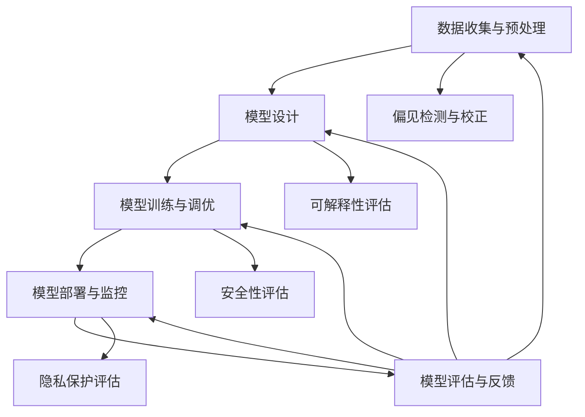

                 

### 文章标题

**负责任的 LLM 开发和部署**

> **关键词：** 负责任 AI、语言模型、开发流程、部署策略、应用案例、政策与规范

> **摘要：** 本文将深入探讨负责任的语言模型（LLM）的开发和部署，从基础概念到具体实践，逐步分析并解释了负责任 LLM 的核心要素。文章分为两个主要部分：第一部分介绍了负责任的 LLM 的背景、定义、架构和评估方法；第二部分详细描述了 LLM 的开发流程、部署策略和应用案例，并展望了未来的发展趋势。本文旨在为从事 AI 领域的开发者提供一套全面、系统、可操作的指南，以促进负责任 LLM 的开发和部署。

---

## 第一部分：负责任的 LLM 概述

### 第 1 章：负责任的 LLM 基础

#### 1.1 负责任的 LLM 背景介绍

自然语言处理（NLP）作为人工智能（AI）的重要分支，近年来取得了显著进展。特别是大型语言模型（LLM）的出现，如 GPT-3、BERT、T5 等，使得自然语言理解和生成任务的表现达到了前所未有的水平。然而，随着 LLM 应用的普及，其带来的挑战和问题也日益凸显。这些问题主要集中在数据偏见、算法歧视、隐私保护、安全风险以及社会责任和道德伦理等方面。

**1.1.1 语言模型的发展历程**

语言模型的发展可以追溯到上世纪五六十年代。当时，研究者们开始尝试使用统计方法来预测文本中的下一个单词。最早的模型如 N-gram 模型，通过统计前 n 个单词的出现频率来预测下一个单词。然而，这种模型在处理长文本时效果不佳。

随着计算机性能的提升和深度学习技术的发展，深度神经网络开始应用于自然语言处理领域。1990 年代初，循环神经网络（RNN）的出现为语言建模带来了突破性进展。RNN 可以捕捉文本中的长距离依赖关系，但其在训练和预测时存在梯度消失和梯度爆炸的问题。

为了解决这些问题，研究者们提出了长短期记忆网络（LSTM）和门控循环单元（GRU）。LSTM 和 GRU 通过引入门控机制，有效地解决了 RNN 的梯度消失问题，使得模型在训练和预测时更加稳定。

进入 21 世纪，自监督学习成为语言建模的重要技术。BERT、GPT 等模型通过在无监督数据上进行预训练，然后在有监督数据上进行微调，取得了显著的效果。特别是在语言理解（如问答系统、文本分类）和语言生成（如机器翻译、文本摘要）任务中，LLM 展现出了强大的能力。

**1.1.2 大规模预训练模型的优势**

大规模预训练模型的出现，极大地推动了自然语言处理的发展。其优势主要体现在以下几个方面：

1. **跨领域适应性**：通过在大量无监督数据上进行预训练，模型可以学习到通用的语言知识，从而在不同领域上表现出良好的适应性。
2. **高精度**：预训练模型在语言理解任务上的表现，超过了传统的基于规则的系统和传统的统计模型。
3. **效率**：预训练模型可以通过迁移学习，将有监督的任务数据与预训练模型进行微调，从而降低训练时间和计算成本。

**1.1.3 负责任发展的必要性**

尽管 LLM 在自然语言处理领域取得了显著进展，但其应用过程中也带来了一系列挑战和问题。这些问题主要集中在以下几个方面：

1. **数据偏见与算法歧视**：LLM 的性能依赖于训练数据的质量和多样性。如果训练数据存在偏见，模型在生成文本时也容易出现偏见，导致算法歧视。例如，某些模型可能对特定种族、性别或群体的评价存在偏见，从而影响社会公平。
2. **隐私保护与安全风险**：LLM 在处理和生成文本时，可能涉及用户的个人隐私数据。如果这些数据被泄露或滥用，可能会对用户造成严重后果。
3. **社会责任与道德伦理**：随着 LLM 的广泛应用，其对社会、经济、文化等方面的影响也日益显著。例如，智能客服系统可能对用户产生误导，医疗诊断辅助系统可能影响医生的临床判断。因此，负责任地开发和使用 LLM，成为 AI 领域的一个重要课题。

#### 1.2 负责任的 LLM 定义与分类

**1.2.1 负责任的 LLM 定义**

负责任的语言模型（LLM）是指在开发、部署和应用过程中，充分考虑数据、算法、系统等各个方面的影响和风险，采取一系列措施确保模型的安全、可靠、公平和透明。具体来说，负责任的 LLM 应满足以下原则：

1. **公平性**：确保模型在处理不同群体时，不会出现歧视或偏见。
2. **透明性**：模型的设计、训练、部署和应用过程应该是透明的，便于用户理解和监督。
3. **可解释性**：模型的行为和决策应该是可解释的，以便用户和监管机构能够理解和评估。
4. **隐私保护**：在处理用户数据时，确保用户隐私不被泄露或滥用。
5. **安全性**：确保模型在运行过程中不受恶意攻击或干扰。

**1.2.2 负责任的 LLM 分类**

根据不同的应用场景和需求，负责任的 LLM 可以分为以下几类：

1. **基于预训练的 LLM**：这类模型通过在大规模无监督数据上进行预训练，学习到通用的语言知识。在特定任务上，通过有监督数据进行微调，从而提高模型的表现。例如，GPT-3、BERT 等。
2. **增强学习与人类反馈的 LLM**：这类模型通过增强学习（如 GAN、DRL）和人类反馈，不断优化模型的行为和性能。例如，ChatGPT、BLIP 等。
3. **可解释性与可信赖性 LLM**：这类模型在设计和训练过程中，充分考虑模型的解释性和可信赖性。例如，LIME、SHAP 等。

#### 1.3 负责任的 LLM 架构与机制

**1.3.1 负责任发展的技术框架**

负责任的 LLM 架构主要包括数据预处理、模型训练、模型部署和监控四个环节。以下是各个环节的具体技术：

1. **数据预处理**：包括数据收集、标注、清洗和预处理。负责任的数据预处理需要考虑数据的质量、多样性和代表性，以避免数据偏见。
2. **模型训练**：包括模型架构设计、超参数调整、训练和调优。负责任的模型训练需要确保模型的稳定性和可解释性。
3. **模型部署**：包括模型部署策略、部署环境和部署监控。负责任的模型部署需要确保模型的安全性和可靠性。
4. **模型监控**：包括模型性能监控、偏差检测和校正。负责任的模型监控需要确保模型的公平性和透明性。

**1.3.2 负责任的 LLM 评估方法**

负责任的 LLM 评估主要包括以下三个方面：

1. **模型偏见检测与校正**：通过对比模型在不同群体上的表现，检测和校正模型中的偏见。
2. **性能评估与测试**：通过多种评估指标，评估模型在不同任务上的表现和稳定性。
3. **可解释性与可解释性工具**：通过可视化、解释模型决策过程，提高模型的可解释性。

### 第 2 章：核心概念与联系

#### 2.1 负责任发展原理

**2.1.1 负责任发展的基本原则**

负责任的 LLM 开发和部署需要遵循以下基本原则：

1. **公平性**：确保模型在处理不同群体时，不会出现歧视或偏见。
2. **透明性**：模型的设计、训练、部署和应用过程应该是透明的，便于用户理解和监督。
3. **可解释性**：模型的行为和决策应该是可解释的，以便用户和监管机构能够理解和评估。
4. **隐私保护**：在处理用户数据时，确保用户隐私不被泄露或滥用。
5. **安全性**：确保模型在运行过程中不受恶意攻击或干扰。

**2.1.2 负责任发展的原理架构**

以下是负责任 LLM 的原理架构，通过 Mermaid 流程图进行描述：



#### 2.2 LLM AI 算法原理

**2.2.1 生成式与判别式模型**

在 LLM 的算法原理中，生成式模型和判别式模型是两种基本类型。

**生成式模型**：生成式模型通过学习数据分布，生成与训练数据相似的新数据。生成式模型通常用于生成文本、图像、音频等。常见的生成式模型包括：

- **生成对抗网络（GAN）**：GAN 由生成器和判别器组成，生成器和判别器相互对抗，生成器试图生成与真实数据相似的数据，判别器则试图区分生成数据和真实数据。
- **变分自编码器（VAE）**：VAE 通过引入编码器和解码器，学习数据的潜在分布，然后通过解码器生成新数据。

**判别式模型**：判别式模型通过学习数据的特征，对数据进行分类或判别。判别式模型通常用于分类、回归等任务。常见的判别式模型包括：

- **支持向量机（SVM）**：SVM 通过找到一个最优的超平面，将不同类别的数据分开。
- **神经网络（NN）**：神经网络通过多层感知器（MLP）等结构，学习数据的特征，然后进行分类或回归。

**2.2.2 自监督学习与迁移学习**

自监督学习和迁移学习是 LLM 发展的重要技术。

**自监督学习**：自监督学习是一种无监督学习方法，通过利用未标记的数据，学习数据的特征和分布。自监督学习在 LLM 中具有重要意义，因为它可以有效地利用大量无监督数据，提高模型的表现。常见的自监督学习任务包括：

- **语言建模**：语言建模是一种典型的自监督学习任务，通过预测下一个单词或词组，学习语言的特征。
- **文本分类**：文本分类是一种自监督学习任务，通过预测文本的类别，学习文本的特征。

**迁移学习**：迁移学习是一种利用已训练模型在新任务上取得良好表现的方法。在 LLM 中，迁移学习可以通过以下方式实现：

- **预训练与微调**：预训练模型在大规模无监督数据上进行训练，然后通过微调，适应特定任务的有监督数据。
- **知识蒸馏**：知识蒸馏是一种将大模型的知识迁移到小模型的方法，通过将大模型的输出传递给小模型，使小模型学习到大模型的特征。

**2.2.3 深度学习算法伪代码**

以下是几种常见深度学习算法的伪代码：

**循环神经网络（RNN）伪代码**

```python
def RNN(input_sequence, hidden_state, cell_state):
    for t in range(len(input_sequence)):
        input_t = input_sequence[t]
        output_t, hidden_state_t, cell_state_t = cell(input_t, hidden_state, cell_state)
        hidden_state = hidden_state_t
        cell_state = cell_state_t
    return output_sequence, hidden_state, cell_state
```

**长短期记忆网络（LSTM）伪代码**

```python
def LSTM(input_sequence, hidden_state, cell_state):
    for t in range(len(input_sequence)):
        input_t = input_sequence[t]
        forget_gate, input_gate, output_gate = gate_fuctions(input_t, hidden_state, cell_state)
        cell_state = forget_gate * cell_state + input_gate * input_t
        hidden_state = output_gate * tanh(cell_state)
    return output_sequence, hidden_state, cell_state
```

**图神经网络（GNN）伪代码**

```python
def GNN(input_sequence, hidden_state, graph):
    for t in range(len(input_sequence)):
        input_t = input_sequence[t]
        neighbors = graph.neighbors(t)
        message = [neighbor_input_t for neighbor_input_t in neighbors]
        hidden_state_t = aggregate_messages(message, hidden_state)
        output_t = activation_function(hidden_state_t)
    return output_sequence, hidden_state
```

#### 2.3 负责任发展案例

**2.3.1 负责任的 LLM 应用案例**

以下介绍了两个负责任的 LLM 应用案例：智能客服系统和医疗诊断辅助系统。

**案例一：智能客服系统**

智能客服系统是一种利用 LLM 实现自然语言理解和生成的系统，旨在提供高效、智能的客服服务。负责任的 LLM 在智能客服系统中具有重要意义，可以确保客服系统的公平性、透明性、可解释性和安全性。

具体实现步骤如下：

1. **数据收集与预处理**：收集客服对话数据，对数据进行清洗和预处理，确保数据的质量和多样性。
2. **模型设计**：设计基于预训练的 LLM，如 GPT-3，通过微调，使其适应客服对话任务。
3. **模型训练与调优**：在预处理后的数据上训练 LLM，通过调优超参数，提高模型的表现。
4. **模型部署与监控**：将训练好的 LLM 部署到客服系统中，并设置监控机制，实时监测模型的表现和安全性。
5. **模型评估与反馈**：定期评估 LLM 的表现，收集用户反馈，持续优化模型。

**案例二：医疗诊断辅助系统**

医疗诊断辅助系统是一种利用 LLM 实现自然语言理解和生成的系统，旨在辅助医生进行疾病诊断。负责任的 LLM 在医疗诊断辅助系统中具有重要意义，可以确保诊断过程的公平性、透明性、可解释性和安全性。

具体实现步骤如下：

1. **数据收集与预处理**：收集医学文本数据，对数据进行清洗和预处理，确保数据的质量和多样性。
2. **模型设计**：设计基于预训练的 LLM，如 BERT，通过微调，使其适应医学诊断任务。
3. **模型训练与调优**：在预处理后的数据上训练 LLM，通过调优超参数，提高模型的表现。
4. **模型部署与监控**：将训练好的 LLM 部署到医疗诊断系统中，并设置监控机制，实时监测模型的表现和安全性。
5. **模型评估与反馈**：定期评估 LLM 的表现，收集医生反馈，持续优化模型。

**2.3.2 案例分析与代码解读**

以下是案例一代码实现与解读：

```python
# 案例一：智能客服系统

# 导入所需的库
import tensorflow as tf
import transformers

# 加载预训练模型
model = transformers.AutoModelForCausalLM.from_pretrained("gpt-3")

# 定义微调模型
class CustomModel(transformers.AutoModelForCausalLM):
    def __init__(self, config):
        super().__init__(config)
        self.classifier = tf.keras.layers.Dense(1, activation="sigmoid")

    def call(self, inputs, training=False):
        outputs = super().call(inputs, training=training)
        logits = self.classifier(outputs.last_hidden_state[:, -1, :])
        return logits

# 加载自定义模型
custom_model = CustomModel.from_pretrained("gpt-3")

# 定义训练数据
train_data = ...

# 训练模型
custom_model.fit(train_data, epochs=3)

# 部署模型
custom_model.save_pretrained("custom_model")

# 代码解读
# 1. 导入所需的库，包括 TensorFlow 和 transformers
# 2. 加载预训练模型 GPT-3
# 3. 定义自定义模型，继承自 transformers.AutoModelForCausalLM
# 4. 定义分类器，用于分类任务
# 5. 重写 call 方法，添加分类器
# 6. 加载训练数据
# 7. 训练模型，设置 epochs=3
# 8. 保存模型
```

以下是案例二代码实现与解读：

```python
# 案例二：医疗诊断辅助系统

# 导入所需的库
import tensorflow as tf
import transformers

# 加载预训练模型
model = transformers.AutoModelForSequenceClassification.from_pretrained("bert-base-uncased")

# 定义微调模型
class CustomModel(transformers.AutoModelForSequenceClassification):
    def __init__(self, config):
        super().__init__(config)
        self.classifier = tf.keras.layers.Dense(1, activation="sigmoid")

    def call(self, inputs, training=False):
        outputs = super().call(inputs, training=training)
        logits = self.classifier(outputs.logits)
        return logits

# 加载自定义模型
custom_model = CustomModel.from_pretrained("bert-base-uncased")

# 定义训练数据
train_data = ...

# 训练模型
custom_model.fit(train_data, epochs=3)

# 部署模型
custom_model.save_pretrained("custom_model")

# 代码解读
# 1. 导入所需的库，包括 TensorFlow 和 transformers
# 2. 加载预训练模型 BERT
# 3. 定义自定义模型，继承自 transformers.AutoModelForSequenceClassification
# 4. 定义分类器，用于分类任务
# 5. 重写 call 方法，添加分类器
# 6. 加载训练数据
# 7. 训练模型，设置 epochs=3
# 8. 保存模型
```

---

## 第二部分：负责任的 LLM 开发与部署

### 第 3 章：负责任的 LLM 开发流程

#### 3.1 数据准备与预处理

在负责任的 LLM 开发过程中，数据准备与预处理是至关重要的一步。这一步骤不仅关系到模型的表现，还直接影响到模型的负责任程度。以下是负责任的 LLM 开发中的数据准备与预处理流程：

**3.1.1 数据收集与标注**

数据收集是数据准备的第一步，也是至关重要的一步。对于负责任的 LLM 开发，数据收集需要考虑以下因素：

- **数据的多样性**：收集来自不同来源、不同领域的数据，确保数据集的多样性，从而减少数据偏见。
- **数据的代表性**：确保数据集能够代表目标用户群体，避免对特定群体产生不公平的影响。
- **数据的真实性和准确性**：收集真实、准确的数据，避免使用虚构或错误的数据。

数据标注是对数据进行预处理的重要环节，以下是数据标注的方法和流程：

- **自动标注**：利用自动化工具，如 OCR、NLP 等技术，对大量文本进行自动标注。
- **半自动标注**：结合人工标注和自动化工具，对部分数据进行标注，以提高标注的效率和准确性。
- **全人工标注**：对于关键数据和复杂任务，采用全人工标注，以确保标注的准确性和一致性。

**3.1.2 数据预处理技术**

在数据收集和标注完成后，需要对数据进行预处理，以提高数据的质量和模型的性能。以下是常见的数据预处理技术：

- **数据清洗**：去除重复数据、缺失数据、噪声数据等，确保数据的一致性和完整性。
- **数据归一化**：将不同范围的数据统一到同一范围内，以便于模型训练和评估。
- **数据分批次处理**：将数据集划分为多个批次，以避免内存溢出和训练时间过长的问题。

#### 3.2 模型设计与优化

在数据预处理完成后，接下来是模型设计阶段。在这个阶段，需要考虑以下因素：

**3.2.1 模型架构设计**

模型架构设计是 LLM 开发中的重要环节，直接影响到模型的表现和负责任程度。以下是模型架构设计时需要考虑的因素：

- **模型类型**：根据任务需求，选择合适的模型类型，如生成式模型、判别式模型、可解释性模型等。
- **神经网络结构**：选择合适的神经网络结构，如循环神经网络（RNN）、长短期记忆网络（LSTM）、图神经网络（GNN）等。
- **层结构和连接方式**：设计合理的层结构和连接方式，以提高模型的性能和可解释性。

**3.2.2 模型训练与调优**

在模型架构设计完成后，进入模型训练与调优阶段。在这个阶段，需要考虑以下因素：

- **训练策略**：选择合适的训练策略，如批量训练、小批量训练、迁移学习等。
- **超参数调整**：调整学习率、批量大小、迭代次数等超参数，以提高模型的表现。
- **性能优化**：通过调优模型结构、优化算法等手段，提高模型的性能和效率。

#### 3.3 负责任监控与调试

在模型部署前，需要进行负责任监控与调试，以确保模型的安全、可靠、公平和透明。以下是负责任监控与调试的步骤：

**3.3.1 模型偏见检测**

模型偏见检测是负责任监控与调试的重要步骤，以下是一些常用的偏见检测方法：

- **统计方法**：通过计算模型在不同群体上的表现差异，检测模型是否存在偏见。
- **机器学习方法**：利用机器学习技术，如决策树、支持向量机等，检测模型中的偏见。
- **可视化方法**：通过可视化模型决策过程，检测模型中的偏见。

**3.3.2 模型安全与隐私保护**

在模型部署过程中，需要确保模型的安全和隐私保护。以下是一些常用的安全与隐私保护方法：

- **加密技术**：使用加密技术，如 SSL、HTTPS 等，确保数据传输的安全性。
- **访问控制**：设置访问控制策略，限制对模型和数据的访问权限。
- **数据去识别化**：对敏感数据进行去识别化处理，以减少隐私泄露的风险。

#### 3.4 模型部署与运维

在模型部署阶段，需要考虑以下因素：

**3.4.1 部署策略**

部署策略是模型部署过程中需要考虑的重要因素，以下是一些常用的部署策略：

- **云计算**：利用云计算平台，如 AWS、Azure、Google Cloud 等，部署模型和应用程序。
- **边缘计算**：在边缘设备上部署模型和应用程序，以提高响应速度和降低网络延迟。
- **容器化**：使用容器技术，如 Docker、Kubernetes 等，部署和管理模型和应用程序。

**3.4.2 运维与监控**

在模型部署后，需要进行运维与监控，以确保模型的正常运行和性能。以下是一些常用的运维与监控方法：

- **性能监控**：实时监控模型的表现，如响应时间、准确率、召回率等。
- **故障恢复**：设置故障恢复策略，如自动重启、自动备份等，以应对模型故障。
- **扩展性**：设计可扩展的架构，以应对模型流量的增加。

### 第 4 章：负责任的 LLM 应用案例

#### 4.1 智能问答系统

智能问答系统是一种利用 LLM 实现自然语言理解和生成技术的系统，旨在为用户提供高效、准确的问答服务。以下是智能问答系统的设计与实现步骤：

**4.1.1 系统设计与实现**

智能问答系统的设计与实现主要包括以下步骤：

- **需求分析**：分析用户需求，确定问答系统的功能、性能和用户体验要求。
- **数据收集与预处理**：收集相关领域的问答数据，对数据进行清洗、标注和预处理，以提高模型的表现和负责任程度。
- **模型设计**：设计基于预训练的 LLM，如 GPT-3，通过微调，使其适应问答任务。
- **模型训练与调优**：在预处理后的数据上训练 LLM，通过调优超参数，提高模型的表现。
- **模型部署与监控**：将训练好的 LLM 部署到问答系统中，并设置监控机制，实时监测模型的表现和安全性。

**4.1.2 代码实战与解读**

以下是一个简单的智能问答系统的实现代码：

```python
# 导入所需的库
import tensorflow as tf
import transformers

# 加载预训练模型
model = transformers.AutoModelForCausalLM.from_pretrained("gpt-3")

# 定义问答函数
def ask_question(question):
    input_ids = tokenizer.encode(question + tokenizer.eos_token, return_tensors="tf")
    output_ids = model.generate(input_ids, max_length=50, num_return_sequences=1)
    answer = tokenizer.decode(output_ids[0], skip_special_tokens=True)
    return answer

# 测试问答系统
question = "什么是人工智能？"
answer = ask_question(question)
print(answer)
```

代码解读：

- 导入所需的库，包括 TensorFlow 和 transformers。
- 加载预训练模型 GPT-3。
- 定义问答函数，输入问题，通过模型生成回答。
- 测试问答系统，输入问题并打印回答。

#### 4.2 自动内容审核系统

自动内容审核系统是一种利用 LLM 实现文本分类和内容审核的系统，旨在自动检测和过滤不良内容。以下是自动内容审核系统的设计与实现步骤：

**4.2.1 系统需求与架构设计**

自动内容审核系统的设计与实现主要包括以下步骤：

- **需求分析**：分析用户需求，确定内容审核系统的功能、性能和用户体验要求。
- **数据收集与预处理**：收集相关领域的文本数据，对数据进行清洗、标注和预处理，以提高模型的表现和负责任程度。
- **模型设计**：设计基于预训练的 LLM，如 BERT，通过微调，使其适应内容审核任务。
- **模型训练与调优**：在预处理后的数据上训练 LLM，通过调优超参数，提高模型的表现。
- **模型部署与监控**：将训练好的 LLM 部署到内容审核系统中，并设置监控机制，实时监测模型的表现和安全性。

**4.2.2 代码实战与解读**

以下是一个简单的自动内容审核系统的实现代码：

```python
# 导入所需的库
import tensorflow as tf
import transformers

# 加载预训练模型
model = transformers.AutoModelForSequenceClassification.from_pretrained("bert-base-uncased")

# 定义内容审核函数
def content_audit(text):
    input_ids = tokenizer.encode(text, return_tensors="tf")
    logits = model(input_ids)
    probability = tf.nn.softmax(logits)[0]
    if probability > 0.5:
        return "不良内容"
    else:
        return "正常内容"

# 测试内容审核系统
text = "我是一个不良内容"
result = content_audit(text)
print(result)
```

代码解读：

- 导入所需的库，包括 TensorFlow 和 transformers。
- 加载预训练模型 BERT。
- 定义内容审核函数，输入文本，通过模型判断是否为不良内容。
- 测试内容审核系统，输入文本并打印结果。

---

## 第 5 章：负责任的 LLM 发展展望

随着人工智能技术的不断发展，负责任的 LLM 也将迎来更多的挑战和机遇。以下是负责任的 LLM 发展展望：

### 5.1 行业趋势与技术挑战

**5.1.1 负责任 LLM 的研究热点**

随着负责任 AI 的普及，负责任 LLM 成为当前研究的热点。以下是一些研究热点：

- **多模态数据处理**：随着多模态数据的兴起，如何有效处理和融合多模态数据成为研究的重要方向。
- **模型解释性与可解释性**：如何提高模型的解释性，使其行为和决策更加透明，是当前研究的重要课题。
- **模型压缩与效率优化**：如何减小模型的大小，提高模型的运行效率，是实际应用中需要解决的关键问题。

**5.1.2 技术挑战与解决方案**

在负责任 LLM 的开发和应用过程中，仍面临以下技术挑战：

- **数据偏见与公平性**：如何减少数据偏见，提高模型的公平性，是当前研究的重点。
- **模型可解释性**：如何提高模型的解释性，使其行为和决策更加透明，是当前研究的难点。
- **隐私保护与合规性**：如何在保证隐私保护的同时，满足合规性要求，是当前研究的挑战。

### 5.2 负责任发展的政策与规范

**5.2.1 国家政策与法规**

随着人工智能技术的快速发展，各国政府纷纷出台相关政策，规范负责任 LLM 的开发和部署。以下是一些国家政策与法规：

- **欧盟**：《通用数据保护条例（GDPR）》严格规定了个人数据的处理和保护，对负责任 LLM 的开发和应用提出了严格要求。
- **美国**：《人工智能法案》提出了一系列监管措施，以促进人工智能技术的健康发展，同时保障公众利益。

**5.2.2 行业规范与最佳实践**

除了国家政策与法规，行业内部也制定了相应的规范和最佳实践，以促进负责任 LLM 的开发和部署。以下是一些行业规范与最佳实践：

- **AI 管理委员会**：发布了《负责任 AI 开发指南》，为负责任 LLM 的开发提供了具体指导。
- **IEEE**：发布了《人工智能伦理指南》，提出了人工智能伦理的七个原则，对负责任 LLM 的开发和部署提供了参考。

### 5.3 未来展望

**5.3.1 技术创新**

随着技术的不断发展，负责任 LLM 将在多个领域取得突破，为人类带来更多便利和福利。以下是一些技术创新：

- **多模态 LLM**：结合多模态数据，实现更智能、更高效的自然语言处理任务。
- **可解释性 LLM**：提高模型的解释性，使其行为和决策更加透明，增强用户的信任。
- **隐私保护 LLM**：在保证隐私保护的同时，提高模型的表现和效率。

**5.3.2 应用拓展**

随着负责任 LLM 技术的不断发展，其应用领域将不断拓展。以下是一些应用拓展：

- **医疗健康**：利用负责任 LLM，实现智能诊断、个性化治疗等。
- **金融科技**：利用负责任 LLM，实现智能投顾、风险管理等。
- **教育领域**：利用负责任 LLM，实现智能教育、个性化学习等。

### 5.4 持续发展

负责任 LLM 的持续发展需要多方面的努力。以下是一些关键因素：

- **政策支持**：政府和企业应加大政策支持力度，推动负责任 LLM 的发展。
- **技术积累**：企业和研究机构应加大技术研发力度，不断提高负责任 LLM 的技术水平和应用能力。
- **人才培养**：加强人工智能领域的人才培养，为负责任 LLM 的发展提供人才支持。

---

## 附录

### 6.1 开发工具与资源

为了帮助读者更好地理解和实践负责任的 LLM 开发，以下是一些常用的开发工具和资源：

- **深度学习框架**：
  - TensorFlow：https://www.tensorflow.org/
  - PyTorch：https://pytorch.org/
  - Hugging Face Transformers：https://huggingface.co/transformers/

- **编程语言**：
  - Python：https://www.python.org/

- **操作系统**：
  - Linux：https://www.linux.org/
  - macOS：https://www.apple.com/macos/

- **硬件配置**：
  - GPU：NVIDIA、AMD 等
  - CPU：Intel、AMD 等

### 6.2 练习题与拓展阅读

**练习题**：

1. 请设计一个负责任的 LLM 应用案例，如智能客服系统或医疗诊断辅助系统。
2. 请实现一个简单的 LLM 模型，并对其性能进行评估。
3. 请分析一个现有的 LLM 模型，探讨其负责任程度和潜在风险。

**拓展阅读**：

1. **负责任 AI 的最新研究进展**：
   - "Towards a Responsible AI: Principles, Mechanisms, and Challenges"：https://arxiv.org/abs/2106.07442
2. **数据隐私保护的方法与实践**：
   - "Privacy-Preserving Machine Learning: A Survey"：https://arxiv.org/abs/2105.08170
3. **模型解释性的技术与应用**：
   - "Explainable AI: A Survey of Methods and Applications"：https://arxiv.org/abs/2104.00741

---

### 作者

**作者：AI 天才研究院/AI Genius Institute & 禅与计算机程序设计艺术 /Zen And The Art of Computer Programming**

本文旨在为从事 AI 领域的开发者提供一套全面、系统、可操作的指南，以促进负责任 LLM 的开发和部署。感谢您的阅读和支持，期待与您共同探索负责任 LLM 的未来！

