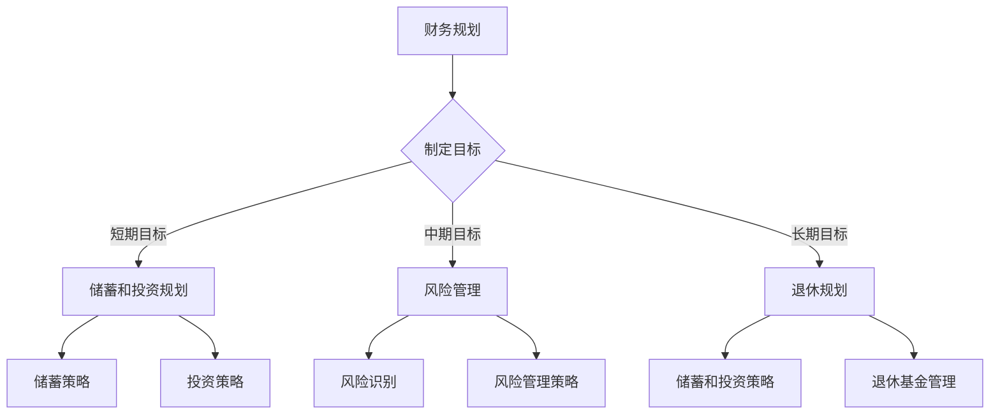
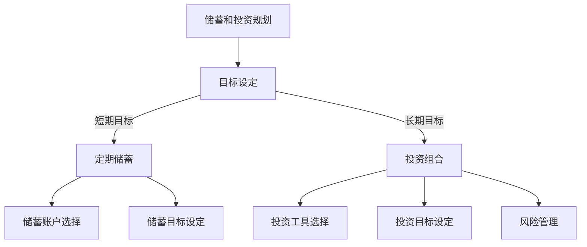
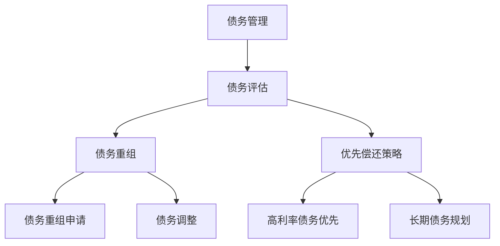
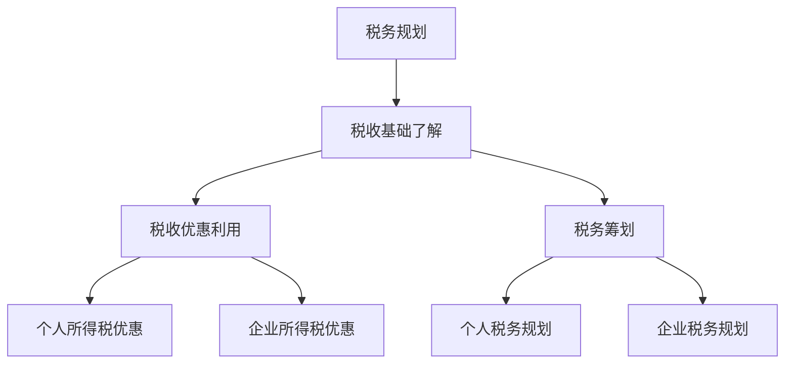
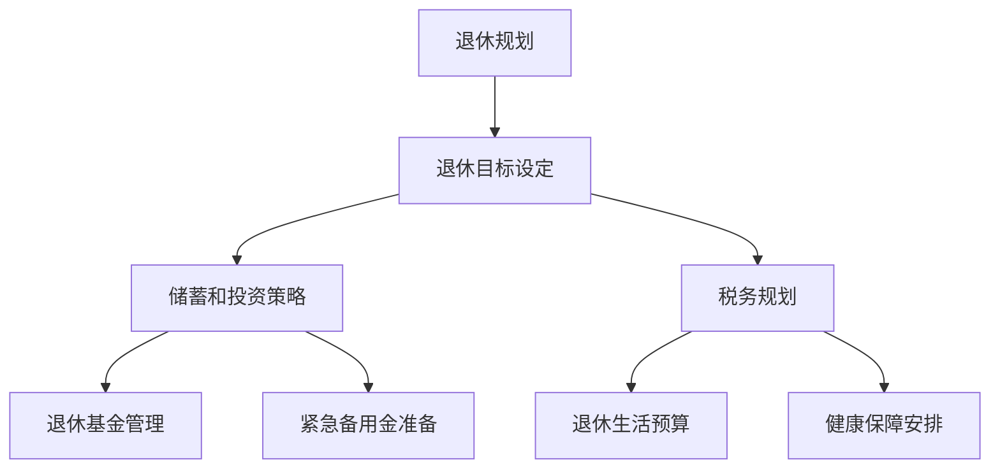

                 

## 文章标题

“财务规划：程序员版理财课”

## 关键词

- 财务规划
- 程序员理财
- 储蓄投资
- 风险管理
- 债务管理
- 税务规划
- 退休规划
- 投资策略

## 摘要

本文旨在为程序员提供全面的财务规划指导，帮助他们在快速发展的技术行业中实现财务自由。通过详细的章节结构和实用案例，本文将探讨财务规划的基础知识，储蓄和投资规划，风险管理，债务管理，税务规划和退休规划。读者将了解到如何设定财务目标，选择合适的储蓄和投资工具，进行风险识别与管理，合理管理债务，实施税务规划，以及为退休做好充分准备。最终，本文将通过实际案例和实战指南，帮助程序员实现个人财务的稳健增长。

## 《财务规划：程序员版理财课》目录大纲

### 第一部分：财务规划基础

#### 第1章：程序员理财心态与素养

- 1.1 程序员理财心态的培养
- 1.2 程序员理财素养的提升

#### 第2章：财务基础知识

- 2.1 财务基础概念
- 2.2 财务报表解读
- 2.3 货币时间价值

### 第二部分：储蓄和投资规划

#### 第3章：储蓄规划

- 3.1 储蓄目标设定
- 3.2 储蓄策略与工具

#### 第4章：投资规划

- 4.1 投资基础知识
- 4.2 投资目标设定
- 4.3 投资工具与策略

### 第三部分：风险管理

#### 第5章：个人风险识别与评估

- 5.1 个人风险识别
- 5.2 风险评估方法

#### 第6章：风险管理策略

- 6.1 风险管理基础
- 6.2 风险管理工具与策略

### 第四部分：债务管理

#### 第7章：债务基础知识

- 7.1 债务的种类
- 7.2 债务的利弊分析

#### 第8章：债务管理策略

- 8.1 债务规划
- 8.2 债务重组

### 第五部分：税务规划

#### 第9章：税务基础知识

- 9.1 税收的种类
- 9.2 税收优惠与减免

#### 第10章：税务规划策略

- 10.1 个人税务规划
- 10.2 企业税务规划

### 第六部分：退休规划

#### 第11章：退休规划的重要性

- 11.1 退休规划的目标
- 11.2 退休规划的时间安排

#### 第12章：退休规划策略

- 12.1 储蓄和投资策略
- 12.2 退休基金管理

### 第七部分：案例分析与实战

#### 第13章：财务规划案例解析

- 13.1 案例一：购房规划
- 13.2 案例二：教育规划
- 13.3 案例三：退休规划

#### 第14章：财务规划实战

- 14.1 财务规划工具使用
- 14.2 实际案例演示
- 14.3 财务规划实践指南

### 附录

#### 附录A：常用理财工具介绍

- A.1 储蓄账户
- A.2 基金
- A.3 股票
- A.4 保险

#### 附录B：财务规划资源推荐

- B.1 财务规划书籍推荐
- B.2 财务规划网站推荐
- B.3 财务规划工具推荐

#### 附录C：Mermaid流程图

- C.1 财务规划流程图
- C.2 储蓄和投资规划流程图
- C.3 债务管理流程图
- C.4 税务规划流程图
- C.5 退休规划流程图

#### 附录D：数学模型与公式

- D.1 货币时间价值公式
- D.2 投资收益率计算公式
- D.3 风险调整后收益计算公式
- D.4 债务偿还公式
- D.5 税务规划公式

#### 附录E：伪代码示例

- E.1 储蓄规划伪代码
- E.2 投资规划伪代码
- E.3 风险管理伪代码
- E.4 债务管理伪代码
- E.5 税务规划伪代码

#### 附录F：代码解读与分析

- F.1 财务规划实战代码解读
- F.2 财务规划实战代码分析
- F.3 财务规划实战代码优化建议

在接下来的部分，我们将逐一深入探讨财务规划的基础知识，储蓄和投资规划，风险管理，债务管理，税务规划和退休规划，帮助程序员们构建稳固的财务未来。

### 第一部分：财务规划基础

财务规划是每一个追求财务自由的人都必须掌握的技能，而对于程序员这一群体来说，由于其独特的职业特点，财务规划更是显得尤为重要。程序员通常拥有较高的收入和较强的学习能力，这使得他们有更多的机会和资源去实现财务目标。然而，如何将收入转化为实际的财富积累，如何做出明智的投资决策，以及如何应对生活中的各种不确定性，这些都是程序员在财务规划过程中需要思考和解决的问题。

#### 第1章：程序员理财心态与素养

**1.1 程序员理财心态的培养**

理财心态的培养是财务规划的第一步。对于程序员来说，以下几种心态尤其重要：

1. **长远规划**：程序员往往关注技术上的短期成就，但理财规划需要从长远角度出发，考虑到未来的各种可能性和需求。
   
2. **稳健为主**：由于职业的波动性，程序员在理财时需要更加注重稳健性，避免高风险投资带来的重大损失。

3. **持续学习**：理财是一个持续变化的过程，程序员需要不断学习新的理财知识和工具，以应对不断变化的市场环境。

**1.2 程序员理财素养的提升**

提升理财素养可以帮助程序员更有效地进行财务规划。以下是一些建议：

1. **财务管理能力**：掌握基本的财务管理工具，如Excel、理财软件等，可以更清晰地了解自己的财务状况。

2. **投资知识**：了解不同的投资工具和策略，如股票、基金、债券等，以便做出更明智的投资决策。

3. **风险管理**：了解风险类型和管理方法，如分散投资、保险等，以降低财务风险。

#### 第2章：财务基础知识

**2.1 财务基础概念**

在开始财务规划之前，了解一些基础概念是必不可少的。以下是一些重要的财务基础概念：

1. **资产**：指个人拥有的能够带来经济利益的资源，如房产、股票、存款等。
2. **负债**：指个人需要偿还的债务，如贷款、信用卡欠款等。
3. **净资产**：净资产等于总资产减去总负债，是衡量个人财务状况的重要指标。
4. **现金流**：指个人在一定时间内的收入和支出情况，了解现金流可以帮助合理安排财务。

**2.2 财务报表解读**

财务报表是反映个人或企业财务状况的重要工具。以下是一些常见的财务报表及其解读：

1. **资产负债表**：展示个人或企业的资产和负债状况，是分析财务健康状况的重要依据。
2. **利润表**：展示个人或企业的收入、费用和利润情况，是评估经营成果的重要工具。
3. **现金流量表**：展示个人或企业的现金流入和流出情况，是分析现金流动性和支付能力的重要依据。

**2.3 货币时间价值**

货币时间价值是指同一金额在不同时间点的价值不同，主要受通货膨胀和市场利率的影响。理解货币时间价值可以帮助程序员更准确地评估投资和财务规划的效果。以下是一些关键概念：

1. **现值**：将未来的现金流折算到当前的价值，称为现值。
2. **终值**：将现在的现金流折算到未来的价值，称为终值。
3. **贴现率**：用于将未来现金流折算为现值的利率，也称为贴现率。

通过以上对财务规划基础知识的介绍，程序员可以为进一步的储蓄和投资规划打下坚实的基础。在接下来的章节中，我们将深入探讨储蓄规划、投资规划、风险管理、债务管理、税务规划和退休规划，帮助程序员实现财务自由。

#### 第1章：程序员理财心态与素养

在财务规划的道路上，心态和素养是两个至关重要的因素。对于程序员而言，这些因素更是影响他们能否成功实现财务目标的关键。

**1.1 程序员理财心态的培养**

首先，程序员需要培养良好的理财心态。以下几种心态对于财务规划尤为重要：

1. **长远规划**：技术行业的发展日新月异，程序员往往容易专注于眼前的技术挑战和项目进度。然而，财务规划需要从长远角度出发，考虑到未来的各种可能性和需求，如职业发展、家庭责任和退休规划。因此，程序员应该学会制定长期财务目标，并为之制定切实可行的计划。

2. **稳健为主**：尽管程序员可能拥有较高的收入，但职业的波动性较大，这使得他们在理财时需要更加注重稳健性。高风险投资可能带来高额回报，但同时也可能带来重大损失。相反，稳健投资虽然回报相对较低，但能够更好地保障财务安全。

3. **持续学习**：理财是一个持续变化的过程，需要不断学习新的理财知识和工具，以应对不断变化的市场环境。程序员通常拥有较强的学习能力和对新技术的敏感度，这使他们在学习理财知识时能够迅速掌握关键要点，但同时也需要保持谦虚和持续学习的心态。

**1.2 程序员理财素养的提升**

除了培养良好的理财心态，提升理财素养也是至关重要的。以下是一些建议：

1. **财务管理能力**：程序员需要掌握基本的财务管理工具，如Excel、理财软件等，以便更清晰地了解自己的财务状况。通过定期记录收入和支出，分析财务数据，可以更好地掌握自己的财务状况，为后续的财务规划提供依据。

2. **投资知识**：了解不同的投资工具和策略，如股票、基金、债券等，可以帮助程序员更明智地做出投资决策。投资不仅仅是追求高回报，更重要的是实现资产保值增值，并降低风险。程序员可以通过阅读相关书籍、参加投资课程或咨询专业理财顾问来提升投资知识。

3. **风险管理**：了解风险类型和管理方法，如分散投资、保险等，可以帮助程序员降低财务风险。分散投资是将资金投入多种不同的资产中，以降低单一投资带来的风险。保险则是通过转移风险来保护个人和家庭的财务安全。

**1.3 程序员理财心态与素养的重要性**

为什么程序员需要特别关注理财心态和素养呢？原因如下：

1. **职业特点**：程序员通常拥有较高的收入，这使得他们在理财方面拥有更多的资源和机会。然而，这也意味着他们需要承担更大的财务责任。如果缺乏良好的理财心态和素养，程序员可能会陷入盲目投资、过度消费或无法应对职业波动的困境。

2. **未来规划**：财务规划不仅仅是关于当前的财务状况，更关乎未来的生活质量和目标实现。程序员需要为职业发展、家庭责任和退休规划等目标制定明确的财务计划，并持续调整以适应变化。

3. **风险管理**：程序员需要面对职业波动和市场风险。通过培养良好的理财心态和素养，程序员可以更好地应对这些不确定性，降低财务风险，保障自己和家庭的财务安全。

总之，培养良好的理财心态和提升理财素养是程序员实现财务自由的重要步骤。通过认真思考和规划，程序员可以更好地管理自己的财务，为未来的生活奠定坚实基础。

### 第2章：财务基础知识

财务规划是一个复杂而多维的过程，它不仅需要良好的心态和素养，还需要坚实的财务知识基础。对于程序员来说，了解这些基础概念、财务报表和货币时间价值是进行有效财务规划的前提。以下是对这些关键知识的详细探讨。

**2.1 财务基础概念**

财务基础概念是理解和进行财务规划的基础。以下是一些重要的财务基础概念：

1. **资产**：资产是指个人或企业拥有并能带来经济利益的资源。对于程序员来说，常见的资产包括现金、存款、股票、债券、房产等。资产的价值会随着市场条件和自身因素的变化而波动。

2. **负债**：负债是指个人或企业需要偿还的债务。常见的负债包括信用卡欠款、房贷、车贷等。负债的价值通常固定，但利息支出会影响负债的实际价值。

3. **净资产**：净资产是资产减去负债后的余额，它反映了个人或企业的实际财富水平。对于程序员来说，净资产是一个重要的财务指标，它可以帮助他们了解自己的财务状况，并为未来的财务规划提供依据。

4. **现金流**：现金流是指个人或企业一定时间内的收入和支出情况。了解现金流可以帮助程序员更好地管理自己的财务，确保有足够的资金来应对各种需求。

**2.2 财务报表解读**

财务报表是反映个人或企业财务状况的重要工具。以下是一些常见的财务报表及其解读：

1. **资产负债表**：资产负债表展示了个人或企业的资产和负债情况。它分为两个部分：资产和负债。资产部分列出了所有可用的资产，负债部分列出了所有负债。通过资产负债表，程序员可以了解自己的财务健康状况，分析资产和负债的比例，评估财务风险。

2. **利润表**：利润表展示了个人或企业的收入、费用和利润情况。它分为三个部分：收入、费用和利润。收入部分列出了所有收入来源，费用部分列出了所有支出，利润部分则是收入减去费用的余额。通过利润表，程序员可以了解自己的经营成果，分析收入和费用的变化，评估盈利能力。

3. **现金流量表**：现金流量表展示了个人或企业一定时间内的现金流入和流出情况。它分为三个部分：经营活动、投资活动和筹资活动。经营活动部分列出了日常运营中的现金流入和流出，投资活动部分列出了投资和筹资活动中的现金流入和流出，筹资活动部分列出了借款和偿还借款的现金流入和流出。通过现金流量表，程序员可以了解自己的现金流动状况，确保有足够的现金来应对日常支出和投资需求。

**2.3 货币时间价值**

货币时间价值是指同一金额在不同时间点的价值不同，这主要受通货膨胀和市场利率的影响。理解货币时间价值对于进行有效的财务规划和投资决策至关重要。以下是一些关键概念：

1. **现值**：现值是指将未来的现金流折算到当前的价值。例如，如果你现在可以收到1000元，而将来收到同样的金额，那么现在的价值会更高，因为你可以将这笔钱投资并获得收益。

2. **终值**：终值是指将现在的现金流折算到未来的价值。例如，如果你现在投资1000元，并期望在未来获得同样的金额，那么未来的价值会更高，因为你的投资将产生收益。

3. **贴现率**：贴现率是用于将未来现金流折算为现值的利率。它反映了市场利率和通货膨胀对货币时间价值的影响。选择合适的贴现率可以帮助程序员更准确地评估投资和财务规划的效果。

通过了解这些财务基础概念、财务报表解读和货币时间价值，程序员可以更好地理解自己的财务状况，制定合理的财务规划，并做出明智的投资决策。在接下来的章节中，我们将继续探讨储蓄规划、投资规划、风险管理、债务管理、税务规划和退休规划，帮助程序员实现财务自由。

### 第2章：财务基础知识（续）

在深入理解了财务基础概念和财务报表之后，我们需要进一步探讨一个非常重要的概念——货币时间价值。货币时间价值是指货币在时间上的价值变化，它主要受到通货膨胀和市场利率的影响。理解货币时间价值对于程序员进行有效的财务规划和投资决策至关重要。

**2.3 货币时间价值**

**现值（Present Value，PV）**：

现值是指将未来的现金流折算到当前的价值。假设你预计未来一年后将收到1000元，而当前的存款利率为5%，那么这笔未来收入的现值将是：

\[ PV = \frac{FV}{(1 + r)^n} \]

其中，\( FV \) 是未来值（Future Value），\( r \) 是利率（Rate），\( n \) 是时间（Number of periods）。

\[ PV = \frac{1000}{(1 + 0.05)^1} = \frac{1000}{1.05} \approx 952.38 \]

**终值（Future Value，FV）**：

终值是指将现在的现金流折算到未来的价值。例如，如果你现在投资1000元，并期望在未来一年后获得同样的金额，而存款利率为5%，那么这笔投资的终值将是：

\[ FV = PV \times (1 + r)^n \]

\[ FV = 1000 \times (1 + 0.05)^1 = 1000 \times 1.05 = 1050 \]

**贴现率（Discount Rate）**：

贴现率是用于将未来现金流折算为现值的利率。它反映了市场利率和通货膨胀对货币时间价值的影响。选择合适的贴现率可以帮助程序员更准确地评估投资和财务规划的效果。

**例子**：

假设你想计算10年后的一笔1000元的现值，如果当前的存款利率为5%，则：

\[ PV = \frac{1000}{(1 + 0.05)^10} \approx \frac{1000}{1.6289} \approx 613.91 \]

这意味着，如果10年后能够收到1000元，那么现在需要约613.91元来等价于这笔未来收入。

**实际应用**：

1. **投资决策**：通过计算不同投资方案的现值，程序员可以更清晰地评估每个方案的实际回报，从而做出更明智的投资决策。

2. **财务规划**：在制定财务规划时，了解货币时间价值可以帮助程序员更好地设定目标和时间框架，确保财务规划的有效性。

3. **风险管理**：理解货币时间价值还可以帮助程序员在风险管理中考虑时间因素，从而更全面地评估风险。

通过了解和掌握货币时间价值的概念和计算方法，程序员可以更深入地理解财务规划的核心原理，为未来的财务目标和投资决策奠定坚实的基础。

### 第二部分：储蓄和投资规划

在了解了财务基础知识和财务报表后，程序员们需要将理论知识应用到实践中，通过储蓄和投资规划来实现财务目标。储蓄和投资是财务规划中的两个重要环节，合理规划可以有效积累财富，提高生活水平。

#### 第3章：储蓄规划

储蓄规划是财务规划的基础，它关乎个人的资金积累和紧急备用金的准备。对于程序员来说，储蓄规划尤为重要，因为他们通常具有较高的收入和较强的消费能力。

**3.1 储蓄目标设定**

设定储蓄目标是储蓄规划的第一步。程序员需要根据自己的实际情况设定短期和长期的储蓄目标：

1. **短期目标**：例如，购买电子产品、旅游、参加培训课程等。短期目标通常在1年以内实现，因此需要的储蓄金额相对较小。

2. **长期目标**：例如，购房、子女教育基金、退休基金等。长期目标可能需要多年时间来实现，因此需要更高的储蓄金额和更稳健的投资策略。

在设定储蓄目标时，程序员可以采用SMART原则（具体、可衡量、可实现、相关性、时限性），以确保目标的合理性和可操作性。

**3.2 储蓄策略与工具**

储蓄策略是指为了实现储蓄目标而采取的具体措施。以下是一些有效的储蓄策略和工具：

1. **定期存款**：定期存款是一种常见的储蓄方式，具有固定的利率和期限。程序员可以根据自己的资金状况和储蓄目标选择合适的存款期限和金额。

2. **零存整取**：零存整取是指每月定期存入一定金额的资金，在约定的时间点提取成大额存款。这种方式适合那些收入稳定但无法一次性存入大额资金的程序员。

3. **活期存款**：活期存款的利率较低，但可以随时存取，适合作为紧急备用金或短期储蓄。

4. **货币市场基金**：货币市场基金是一种投资工具，具有高流动性、低风险和相对较高的收益。程序员可以将部分储蓄资金投资于货币市场基金，以实现资金的保值增值。

5. **银行储蓄账户**：银行储蓄账户是一种便捷的储蓄工具，通常提供一定的利率和免费提款服务。程序员可以根据自己的需求选择不同的储蓄账户类型。

**3.3 紧急备用金**

紧急备用金是应对突发状况的资金储备，对于程序员来说尤为重要。建议将6至12个月的生活费用存为紧急备用金，以应对失业、疾病等不可预见的支出。

#### 第4章：投资规划

投资规划是储蓄规划的延伸，它旨在通过投资实现资金的保值增值。对于程序员来说，投资规划不仅是增加财富的手段，更是实现长期财务目标的重要途径。

**4.1 投资基础知识**

在开始投资规划之前，程序员需要了解一些投资基础知识：

1. **风险与收益**：投资通常伴随着风险和收益。高收益往往伴随着高风险，而低风险投资通常回报较低。

2. **投资类型**：常见的投资类型包括股票、债券、基金、房地产等。每种投资类型都有其独特的特点、风险和回报。

3. **市场波动**：市场波动是投资过程中不可避免的，程序员需要学会如何应对市场波动，以保持投资心态的稳定性。

**4.2 投资目标设定**

设定投资目标是投资规划的关键。程序员可以根据自己的财务状况、风险承受能力和长期财务目标来设定投资目标：

1. **短期目标**：例如，利用年终奖金进行短期投资，以获取一定的收益。

2. **长期目标**：例如，为子女教育、购房、退休等大额支出进行长期投资，以实现资金的稳健增值。

**4.3 投资工具与策略**

选择合适的投资工具和策略是实现投资目标的关键。以下是一些常见的投资工具和策略：

1. **股票投资**：股票投资是一种高风险、高回报的投资方式。程序员可以通过购买股票来参与企业的成长和盈利。

2. **债券投资**：债券投资是一种相对稳健的投资方式，适合风险承受能力较低的程序员。通过购买企业或政府债券，可以获得固定的利息收入。

3. **基金投资**：基金投资是一种分散投资的工具，程序员可以通过购买基金来分散风险，同时享受到专业投资管理的服务。

4. **房地产投资**：房地产投资是一种长期投资方式，可以通过购买房产或投资房地产基金来获得租金收入和资本增值。

5. **多元化投资策略**：多元化投资策略是指将资金分散投资于不同的资产类别和投资工具，以降低风险并提高回报。程序员可以采用这种策略来实现投资目标的稳健增值。

通过合理的储蓄和投资规划，程序员可以有效地积累财富，实现长期财务目标。在接下来的章节中，我们将进一步探讨风险管理、债务管理、税务规划和退休规划，帮助程序员实现全面的财务自由。

### 第3章：储蓄规划

储蓄规划是财务规划的基础，对于程序员来说尤为重要。合理的储蓄规划不仅可以为未来的生活提供保障，还可以为投资和紧急备用金的积累打下基础。以下是关于储蓄规划的一些关键步骤和策略。

**3.1 储蓄目标设定**

设定储蓄目标是储蓄规划的第一步。程序员需要根据自己的收入水平、消费习惯和财务目标来设定合理的储蓄目标。以下是一些建议：

1. **短期目标**：短期目标通常在1年以内实现，例如购买电子产品、旅游或参加培训课程等。为了实现这些目标，程序员可以设定每月固定的储蓄金额，并将其存入专门的储蓄账户。

2. **中期目标**：中期目标通常在1年至5年之间实现，例如购房首付或子女的教育基金。为了实现这些目标，程序员可以设定更长期的储蓄计划，并采用复利效应来增加储蓄金额。

3. **长期目标**：长期目标通常在5年以上，例如退休基金或大额消费支出。为了实现这些目标，程序员需要制定详细的储蓄计划，并考虑投资收益来增加储蓄金额。

在设定储蓄目标时，程序员可以采用SMART原则（具体、可衡量、可实现、相关性、时限性），以确保目标的合理性和可操作性。

**3.2 储蓄策略与工具**

储蓄策略是指为了实现储蓄目标而采取的具体措施。以下是一些有效的储蓄策略和工具：

1. **定期存款**：定期存款是一种传统的储蓄方式，具有固定的利率和期限。程序员可以根据自己的资金状况和储蓄目标选择合适的存款期限和金额。定期存款的优点是风险低、收益稳定，适合那些需要长期储蓄的程序员。

2. **零存整取**：零存整取是指每月定期存入一定金额的资金，在约定的时间点提取成大额存款。这种方式适合那些收入稳定但无法一次性存入大额资金的程序员。零存整取的优点是灵活度高，可以更好地应对生活中的不确定因素。

3. **活期存款**：活期存款的利率较低，但可以随时存取，适合作为紧急备用金或短期储蓄。程序员可以将部分资金存入活期账户，以应对突发状况。

4. **货币市场基金**：货币市场基金是一种投资工具，具有高流动性、低风险和相对较高的收益。程序员可以将部分储蓄资金投资于货币市场基金，以实现资金的保值增值。货币市场基金的优点是风险低、收益稳定，适合那些对投资风险敏感的程序员。

5. **银行储蓄账户**：银行储蓄账户是一种便捷的储蓄工具，通常提供一定的利率和免费提款服务。程序员可以根据自己的需求选择不同的储蓄账户类型，以实现不同的储蓄目标。

**3.3 紧急备用金**

紧急备用金是应对突发状况的资金储备，对于程序员来说尤为重要。建议将6至12个月的生活费用存为紧急备用金，以应对失业、疾病等不可预见的支出。以下是一些建议：

1. **定期定额**：每月定期存入一定金额的资金到紧急备用金账户，确保在紧急情况下有足够的资金。

2. **多渠道筹集**：除了从收入中定期储蓄，程序员还可以通过其他渠道筹集紧急备用金，如卖掉闲置物品、参与副业等。

3. **分散存储**：将紧急备用金分散存储在不同的账户和金融机构中，以降低风险和便于管理。

通过合理的储蓄目标设定、储蓄策略选择和紧急备用金准备，程序员可以有效地管理自己的资金，实现财务目标，并为未来的生活提供保障。在接下来的章节中，我们将继续探讨投资规划、风险管理、债务管理、税务规划和退休规划，帮助程序员实现全面的财务自由。

### 第4章：投资规划

投资规划是财务规划中至关重要的一部分，它关系到财富的保值增值和长期财务目标的实现。对于程序员来说，由于其职业特点，投资规划尤为重要。以下是对投资规划的基础知识、目标设定、工具和策略的详细探讨。

**4.1 投资基础知识**

在进行投资规划之前，了解一些投资基础知识是非常必要的。以下是几个关键概念：

1. **风险与收益**：投资通常伴随着风险和收益。高收益往往伴随着高风险，而低风险投资通常回报较低。程序员需要了解不同投资类型的风险和收益特点，以便做出明智的投资决策。

2. **投资类型**：常见的投资类型包括股票、债券、基金、房地产等。每种投资类型都有其独特的特点、风险和回报。程序员需要了解这些投资类型的基本概念和运作方式。

3. **市场波动**：市场波动是投资过程中不可避免的，程序员需要学会如何应对市场波动，以保持投资心态的稳定性。

**4.2 投资目标设定**

设定投资目标是投资规划的关键步骤。程序员可以根据自己的财务状况、风险承受能力和长期财务目标来设定投资目标：

1. **短期目标**：短期目标通常在1年以内实现，例如利用年终奖金进行短期投资以获取一定的收益。为了实现这些目标，程序员可以设定每月固定的投资金额，并选择风险较低的投资工具。

2. **中期目标**：中期目标通常在1年至5年之间实现，例如为购房首付或子女的教育基金进行投资。为了实现这些目标，程序员可以设定更长期的投资计划，并考虑采用多元化投资策略以降低风险。

3. **长期目标**：长期目标通常在5年以上，例如为退休基金进行投资。为了实现这些目标，程序员需要制定详细的投资计划，并选择具有长期增值潜力的投资工具。

在设定投资目标时，程序员可以采用SMART原则（具体、可衡量、可实现、相关性、时限性），以确保目标的合理性和可操作性。

**4.3 投资工具与策略**

选择合适的投资工具和策略是实现投资目标的关键。以下是一些常见的投资工具和策略：

1. **股票投资**：股票投资是一种高风险、高回报的投资方式。程序员可以通过购买股票来参与企业的成长和盈利。为了降低风险，程序员可以考虑投资于不同行业和公司的股票，以实现风险分散。

2. **债券投资**：债券投资是一种相对稳健的投资方式，适合风险承受能力较低的程序员。通过购买企业或政府债券，可以获得固定的利息收入。为了提高回报，程序员可以考虑投资于高收益债券，但需要注意风险。

3. **基金投资**：基金投资是一种分散投资的工具，程序员可以通过购买基金来分散风险，同时享受到专业投资管理的服务。基金类型包括股票型基金、债券型基金、货币市场基金等，程序员可以根据自己的投资目标和风险承受能力选择合适的基金。

4. **房地产投资**：房地产投资是一种长期投资方式，可以通过购买房产或投资房地产基金来获得租金收入和资本增值。房地产投资的优点是相对稳定，但需要较大的初始投资和专业知识。

5. **多元化投资策略**：多元化投资策略是指将资金分散投资于不同的资产类别和投资工具，以降低风险并提高回报。程序员可以采用多元化投资策略，例如投资于股票、债券、基金和房地产等多种资产类别，以实现资产的多样化。

6. **定期投资策略**：定期投资策略是指按照固定的时间间隔进行投资，例如每月或每季度投资一定金额的资金。这种方式可以帮助程序员实现长期投资，同时降低市场波动带来的风险。

通过合理的基础知识了解、目标设定和工具策略选择，程序员可以制定有效的投资规划，实现长期财务目标。在接下来的章节中，我们将继续探讨风险管理、债务管理、税务规划和退休规划，帮助程序员实现全面的财务自由。

### 第4章：投资规划（续）

在前一部分中，我们讨论了投资规划的基础知识、目标设定和工具选择。接下来，我们将深入探讨具体的投资策略，帮助程序员在实际操作中实现财富的保值增值。

**4.4 股票投资策略**

股票投资是程序员较为熟悉的投资领域之一。以下是一些常见的股票投资策略：

1. **价值投资**：价值投资是指通过购买价格低于其内在价值的股票来获取回报。投资者需要对公司的基本面进行深入分析，包括财务报表、行业地位、管理团队等。这种策略通常适用于有足够时间和精力进行深入研究且风险承受能力较高的投资者。

   **示例**：假设你发现一家科技公司股票价格低于其账面价值，同时公司拥有强大的研发能力和稳定的客户基础，你可以判断这家公司的股价被低估，于是决定购买其股票。

2. **成长投资**：成长投资是指投资于那些快速增长的行业和公司，这些公司通常拥有强大的市场竞争力、创新能力和扩张潜力。成长投资的回报潜力较大，但风险也相对较高。

   **示例**：如果你认为人工智能行业将迎来爆发性增长，你可以选择投资于该领域内的领先企业，以获取较高的回报。

3. **技术分析**：技术分析是通过研究股票价格和交易量等市场数据来预测未来股价走势的方法。技术分析通常涉及图表分析和各种指标，如移动平均线、相对强弱指数（RSI）等。

   **示例**：如果你发现某只股票的价格在突破重要的阻力位后，伴随着大幅上升的交易量，你可以认为这是一个买入信号。

**4.5 债券投资策略**

债券投资是一种相对稳健的投资方式，适合那些风险承受能力较低或需要固定收益的程序员。以下是一些常见的债券投资策略：

1. **买入并持有**：这是一种最简单的债券投资策略，即购买债券并持有到期，以获取固定的利息收入。这种策略适合那些不希望频繁操作且对市场波动敏感度较低的投资者。

   **示例**：如果你购买了一份10年期的国债，每年可以收到固定的利息收入，并在到期时收回本金。

2. **债券组合**：债券组合是指将资金分散投资于不同到期日和信用评级的债券，以降低风险并提高收益。通过债券组合，程序员可以实现风险的分散，并在不同市场环境下获得稳定的收益。

   **示例**：你可以购买短期、中期和长期国债，以及一些信用评级较高的企业债券，以建立一个多样化的债券组合。

3. **骑乘利率**：骑乘利率是指利用债券的收益率曲线特性进行套利的策略。通过购买即将到期的债券并在其价格上升时卖出，投资者可以获得额外的收益。

   **示例**：如果你购买了一份即将到期的高收益企业债券，并在其价格上升时卖出，你可以在不承担额外风险的情况下获得额外的收益。

**4.6 基金投资策略**

基金投资是程序员实现资产分散和专业化管理的一种有效途径。以下是一些常见的基金投资策略：

1. **定期定额投资**：定期定额投资是指按照固定的时间间隔购买基金，以实现长期投资和降低市场波动带来的风险。这种策略适合那些希望长期投资且对市场波动敏感度较低的程序员。

   **示例**：你可以每月定期投资一定的金额到一只股票型基金，通过长期投资来降低市场波动的影响。

2. **投资组合平衡**：投资组合平衡是指通过调整不同类型基金的权重来保持投资组合的平衡，以适应市场变化和投资目标。这种策略适合那些希望长期投资且对市场有一定了解的程序员。

   **示例**：你可以根据市场情况和个人风险承受能力，将部分资金投资于股票型基金，部分资金投资于债券型基金，以实现资产分散和收益平衡。

3. **基金经理选择**：基金经理选择是指通过研究基金经理的投资策略、业绩和历史表现来选择基金。这种策略适合那些对投资有一定了解且愿意进行深入研究和筛选的程序员。

   **示例**：你可以选择那些在特定行业或市场环境下表现突出的基金经理，以获取较高的回报。

通过以上投资策略的探讨，程序员可以根据自己的实际情况和投资目标，选择适合的投资方式和工具。在接下来的章节中，我们将继续探讨风险管理、债务管理、税务规划和退休规划，帮助程序员实现全面的财务自由。

### 第三部分：风险管理

在储蓄和投资规划中，风险管理是不可或缺的一环。有效的风险管理可以帮助程序员规避潜在风险，保障财务安全，确保投资目标的实现。以下将详细探讨个人风险的识别与评估、风险管理策略以及实际案例。

#### 第5章：个人风险识别与评估

**5.1 个人风险识别**

个人风险是指可能对个人财务状况造成不利影响的各种事件或情况。以下是程序员需要识别的主要个人风险：

1. **职业风险**：包括失业、职业变动和薪资减少等。程序员作为技术工作者，职业风险较高，因为他们可能受到市场波动和技术更新换代的影响。

2. **健康风险**：包括疾病和意外伤害等。健康问题可能导致高额医疗费用，影响工作能力和收入。

3. **市场风险**：包括股市波动、利率变化等。市场波动可能导致投资损失。

4. **法律风险**：包括合同纠纷、法律诉讼等。这些风险可能导致财产损失。

5. **债务风险**：包括过度借贷、无法偿还债务等。债务问题可能影响信用记录和财务状况。

**5.2 风险评估方法**

为了更好地识别和评估个人风险，程序员可以采用以下方法：

1. **问卷调查法**：通过填写问卷，识别可能面临的风险类型和具体情境。

2. **财务分析法**：通过分析财务报表和现金流，评估各项风险对财务状况的影响。

3. **专家评估法**：咨询专业的财务顾问或保险顾问，获取专业的风险评估和建议。

#### 第6章：风险管理策略

**6.1 风险管理基础**

风险管理主要包括风险预防、风险规避、风险转移和风险自留等策略。以下是具体策略：

1. **风险预防**：通过采取预防措施来降低风险发生的概率。例如，程序员可以通过定期备份重要数据、安装防病毒软件来预防计算机系统故障。

2. **风险规避**：通过避免参与高风险的活动或项目来规避风险。例如，程序员可以避免投资于高风险的股票或参与高负债的经营项目。

3. **风险转移**：通过购买保险、签订合同等方式将风险转移给第三方。例如，程序员可以通过购买健康保险来转移疾病风险。

4. **风险自留**：自己承担风险，通常适用于风险较小且个人财务状况允许的情况。

**6.2 风险管理工具与策略**

以下是一些常用的风险管理工具和策略：

1. **保险**：包括健康保险、意外保险、财产保险等。保险是一种有效的风险转移工具，可以帮助程序员在发生意外时获得经济补偿。

2. **分散投资**：通过将资金分散投资于不同的资产类别和投资工具，降低单一投资风险。例如，程序员可以将部分资金投资于股票、债券、基金和房地产等。

3. **紧急备用金**：准备一定的紧急备用金，以应对突发状况。通常建议紧急备用金覆盖6至12个月的生活费用。

4. **定期财务审查**：定期对财务状况进行审查，及时调整风险管理策略。例如，程序员可以每年进行一次财务审查，评估风险状况和投资表现。

#### 实际案例：程序员李明的风险管理

**案例背景**：

程序员李明，30岁，未婚，拥有一份稳定的软件工程师工作，年收入50万元。他的财务目标包括购房、子女教育和退休基金。李明意识到风险管理的重要性，开始制定和实施一系列风险管理策略。

**风险识别**：

1. 职业风险：由于技术行业的不确定性，李明面临失业或薪资减少的风险。

2. 健康风险：李明担心因疾病或意外伤害导致高额医疗费用。

3. 市场风险：李明的投资组合可能受到股市波动和利率变化的影响。

**风险管理策略**：

1. **职业风险**：

   - **预防措施**：李明不断提升自己的技能，参与技术培训和认证，增加职业竞争力。
   - **规避措施**：李明避免投资于单一行业或公司的股票，实现资产分散。

2. **健康风险**：

   - **风险转移**：李明购买了一份全面健康保险，包括医疗保险、意外保险等，以应对突发健康状况。
   - **紧急备用金**：李明准备了一个紧急备用金账户，覆盖6至12个月的生活费用。

3. **市场风险**：

   - **分散投资**：李明将投资资金分散投资于股票、债券、基金和房地产等不同类型的资产。
   - **定期财务审查**：李明每年进行一次财务审查，评估投资组合的表现，根据市场变化调整投资策略。

通过以上风险管理策略，李明有效地降低了个人风险，保障了财务安全，并逐步实现了长期财务目标。

通过以上对个人风险识别与评估、风险管理策略和实际案例的探讨，程序员可以更好地理解和应对个人风险，为财务规划的成功实施打下坚实基础。在接下来的章节中，我们将继续探讨债务管理、税务规划和退休规划，帮助程序员实现全面的财务自由。

### 第5章：个人风险识别与评估

在财务规划的过程中，风险管理是至关重要的一环。它能够帮助程序员识别和评估可能影响其财务状况的各种风险，从而制定有效的应对措施。以下我们将详细探讨如何识别和评估个人风险。

**5.1 个人风险识别**

个人风险是指可能对程序员财务状况产生不利影响的各种事件或情况。以下是程序员需要识别的主要个人风险：

1. **职业风险**：作为技术工作者，程序员可能面临失业、职业变动或薪资减少的风险。这些风险可能来自技术更新换代、市场需求变化或公司裁员等。

2. **健康风险**：健康问题，如疾病或意外伤害，可能导致高额医疗费用，影响工作能力和收入。

3. **市场风险**：股市波动、利率变化、通货膨胀等因素都可能对程序员的储蓄和投资造成不利影响。

4. **法律风险**：合同纠纷、法律诉讼等法律问题可能导致财产损失或法律责任。

5. **债务风险**：过度借贷或无法偿还债务可能导致信用记录受损，影响财务状况。

**5.2 风险评估方法**

为了更准确地识别和评估个人风险，程序员可以采用以下方法：

1. **问卷调查法**：通过填写问卷，识别可能面临的风险类型和具体情境。

2. **财务分析法**：通过分析财务报表和现金流，评估各项风险对财务状况的影响。

3. **专家评估法**：咨询专业的财务顾问或保险顾问，获取专业的风险评估和建议。

**5.3 风险评估示例**

以下是一个具体的风险评估示例，假设程序员张三面临以下几种风险：

1. **职业风险**：张三目前的工作稳定，但所在公司正面临技术转型，未来可能裁员。他估计失业风险为30%。

2. **健康风险**：张三的家人有遗传病史，他担心自己可能患有同样的疾病。他估计患病风险为20%。

3. **市场风险**：张三的投资组合包括股票和债券，他担心市场波动可能导致投资损失。他估计市场风险为40%。

4. **法律风险**：张三参与了一个合同项目，担心可能发生法律纠纷。他估计法律风险为10%。

通过以上评估，张三可以更清楚地了解自己的风险状况，并制定相应的风险管理策略。

通过以上对个人风险识别与评估方法的探讨，程序员可以更好地了解和应对可能影响其财务状况的风险。在接下来的章节中，我们将进一步探讨风险管理策略，帮助程序员制定有效的风险管理计划。

### 第6章：风险管理策略

在识别和评估了个人风险之后，接下来我们需要制定有效的风险管理策略，以最大限度地降低风险对财务状况的负面影响。以下将详细探讨风险管理的理论基础、工具和策略，并结合实际案例进行说明。

**6.1 风险管理基础**

风险管理是一个系统性的过程，包括风险识别、风险评估、风险应对和风险监控。以下是风险管理的四个基本步骤：

1. **风险识别**：通过问卷调查、财务分析等方法，识别可能影响财务状况的各种风险。

2. **风险评估**：对识别出的风险进行量化或定性评估，确定风险的概率和潜在影响。

3. **风险应对**：制定和实施应对策略，包括风险预防、风险规避、风险转移和风险自留。

4. **风险监控**：持续监控风险状况，及时调整风险管理策略。

**6.2 风险管理工具与策略**

以下是一些常用的风险管理工具和策略：

1. **保险**：保险是转移风险的有效工具。程序员可以通过购买健康保险、意外保险、财产保险等，将疾病、意外伤害和财产损失等风险转移给保险公司。

   **示例**：程序员李明购买了一份全面的健康保险，包括医疗保险和意外保险，以应对可能的医疗费用和意外伤害。

2. **分散投资**：通过将资金分散投资于不同的资产类别和投资工具，降低单一投资风险。

   **示例**：程序员张三将投资资金分散投资于股票、债券、基金和房地产等，实现资产多样化，降低市场波动带来的风险。

3. **紧急备用金**：准备一定的紧急备用金，以应对突发状况。通常建议紧急备用金覆盖6至12个月的生活费用。

   **示例**：程序员王先生准备了一个紧急备用金账户，存有足够的资金以应对失业、疾病等突发情况。

4. **定期财务审查**：定期对财务状况进行审查，评估风险状况和投资表现，及时调整风险管理策略。

   **示例**：程序员赵女士每年进行一次财务审查，评估保险覆盖、投资组合和紧急备用金状况，根据市场变化和自身需求进行调整。

**6.3 实际案例：程序员李明的风险管理策略**

**案例背景**：

程序员李明，35岁，已婚，有两个孩子，拥有一份稳定的软件工程师工作，年收入60万元。他的财务目标是购房、子女教育和退休基金。李明意识到风险管理的重要性，开始制定和实施一系列风险管理策略。

**风险识别**：

1. 职业风险：李明担心技术行业的不确定性可能导致失业或薪资减少。

2. 健康风险：李明有家族遗传病史，担心可能患有严重的疾病。

3. 市场风险：李明的投资组合可能受到股市波动和利率变化的影响。

**风险管理策略**：

1. **职业风险**：

   - **预防措施**：李明积极参加技术培训和认证，提升自身技能，增加职业竞争力。
   - **规避措施**：李明避免投资于单一行业或公司的股票，实现资产分散。

2. **健康风险**：

   - **风险转移**：李明购买了一份全面的健康保险，包括医疗保险和意外保险，将健康风险转移给保险公司。
   - **紧急备用金**：李明准备了一个紧急备用金账户，覆盖6至12个月的生活费用。

3. **市场风险**：

   - **分散投资**：李明将投资资金分散投资于股票、债券、基金和房地产等，降低市场波动带来的风险。
   - **定期财务审查**：李明每年进行一次财务审查，根据市场变化和自身需求调整投资组合。

通过以上风险管理策略，李明有效地降低了个人风险，保障了财务安全，并逐步实现了长期财务目标。

通过以上对风险管理基础、工具和策略的探讨，程序员可以更好地理解和应用风险管理，为财务规划的成功实施打下坚实基础。在接下来的章节中，我们将继续探讨债务管理、税务规划和退休规划，帮助程序员实现全面的财务自由。

### 第四部分：债务管理

债务管理是财务规划中的一个关键环节，对于程序员的财务健康至关重要。合理管理债务不仅能减少财务压力，还能提高资产回报率。以下将详细探讨债务的基础知识、利弊分析、债务管理策略，并结合实际案例进行说明。

#### 第7章：债务基础知识

**7.1 债务的种类**

债务可以分为以下几种类型：

1. **消费债务**：如信用卡债务、个人贷款等，主要用于日常消费和短期需求。

2. **房贷**：用于购买房屋的长期债务，通常具有较低的利率。

3. **教育贷款**：用于支付学费、培训费用等的长期债务。

4. **商业贷款**：用于企业经营、扩展业务等的长期债务。

**7.2 债务的利弊分析**

债务既有利也有弊：

1. **利**：

   - **资金杠杆**：债务可以提供额外的资金，用于投资或消费，从而可能带来更高的回报。

   - **消费提升**：合理的债务可以提升生活质量，如购买房屋或进行教育投资。

2. **弊**：

   - **利息负担**：债务需要支付利息，增加财务负担。

   - **信用风险**：如果无法按时偿还债务，可能导致信用记录受损，影响未来的借贷能力。

   - **财务压力**：过度的债务可能导致财务压力过大，影响生活质量和投资计划。

#### 第8章：债务管理策略

**8.1 债务规划**

债务规划是指根据个人财务状况和目标，制定合理的债务管理计划。以下是债务规划的几个关键步骤：

1. **评估债务状况**：计算总负债与总资产的比率，了解债务负担。

2. **设定债务目标**：根据财务目标和时间框架，设定债务偿还计划。

3. **优先偿还策略**：确定优先偿还高利率债务，如信用卡债务，以减少利息支出。

4. **债务重组**：如果债务负担过重，可以考虑债务重组，如延长还款期限、降低利率等。

**8.2 债务管理工具**

以下是一些常用的债务管理工具：

1. **债务管理软件**：使用债务管理软件，如债务计算器、债务追踪器等，可以帮助程序员更好地管理债务。

2. **预算编制**：制定详细的预算计划，合理安排收入和支出，确保有足够的资金偿还债务。

3. **紧急备用金**：准备一定的紧急备用金，以应对意外支出，避免因紧急情况而增加债务。

**8.3 实际案例：程序员李明的债务管理**

**案例背景**：

程序员李明，30岁，已婚，年收入50万元。他有一份房贷、一辆车贷和几张信用卡债务。李明希望通过合理的债务管理策略，减轻财务负担，实现财务自由。

**债务状况**：

- 房贷：20年，每月还款1万元。
- 车贷：3年，每月还款5000元。
- 信用卡债务：总额5万元，利率18%。

**债务管理策略**：

1. **评估债务状况**：

   - 总负债：1万 + 0.5万 + 5万 = 6.5万元。
   - 负债与收入比：6.5万 / 50万 = 13%。

2. **设定债务目标**：

   - 3年内偿还信用卡债务。
   - 长期内逐步减少房贷和车贷负担。

3. **优先偿还策略**：

   - 优先偿还信用卡债务，每月还款1万元。
   - 房贷和车贷保持现有还款计划。

4. **债务重组**：

   - 联系银行，探讨房贷和车贷的利率调整或还款期限延长。

**债务管理效果**：

- 通过优先偿还信用卡债务，李明在3年内成功清偿了5万元信用卡债务，避免了高额利息支出。
- 通过债务重组，李明将房贷和车贷的还款期限延长至30年，降低了每月还款额，减轻了财务压力。

通过以上债务管理策略，李明有效地降低了财务负担，提高了财务健康状况，为实现长期财务目标打下了坚实基础。

通过以上对债务基础知识、利弊分析和债务管理策略的探讨，程序员可以更好地理解和应对债务管理问题，为财务规划的成功实施提供保障。在接下来的章节中，我们将继续探讨税务规划和退休规划，帮助程序员实现全面的财务自由。

### 第7章：债务基础知识

债务是财务管理中常见的一个现象，合理管理债务对于提高财务健康水平至关重要。以下将详细探讨债务的种类、利弊分析，帮助程序员更好地了解债务管理的基本概念。

**7.1 债务的种类**

债务可以分为以下几种主要类型：

1. **消费债务**：这是最常见的债务类型，包括信用卡债务、个人贷款、消费贷款等。这类债务主要用于满足日常消费需求，如购物、旅游、医疗等。

2. **房贷**：房贷是用于购买房产的长期债务，通常具有较低的利率和较长的还款期限。房贷在程序员的财务规划中占有重要地位，因为房产往往被视为一种稳定和有价值的资产。

3. **教育贷款**：教育贷款用于支付学费、培训费用等教育相关支出。这类债务对于追求进一步教育和职业发展的程序员尤为重要。

4. **商业贷款**：商业贷款是用于企业经营、扩展业务等的债务。对于创业者或企业家来说，商业贷款是常见的选择，因为它可以提供必要的资金支持。

**7.2 债务的利弊分析**

债务既有其积极的一面，也有可能带来负面影响。以下是对债务利弊的详细分析：

1. **利**：

   - **资金杠杆**：债务可以提供额外的资金，用于投资或消费，从而可能带来更高的回报。例如，通过贷款购买房产，然后出租或出售，可以获得资本增值。

   - **消费提升**：合理的债务可以提升生活质量，如购买房屋或进行教育投资。债务还可以帮助程序员实现短期消费目标，如购买新车或进行海外旅行。

   - **投资机会**：债务可以用于投资，如购买股票、基金或房地产。通过合理的债务杠杆，程序员可以在市场上涨时获得更高的回报。

2. **弊**：

   - **利息负担**：债务需要支付利息，增加财务负担。如果债务利率较高，利息支出可能会吞噬大部分收益。

   - **信用风险**：如果无法按时偿还债务，可能导致信用记录受损，影响未来的借贷能力。信用记录受损可能导致借款成本增加，甚至无法获得贷款。

   - **财务压力**：过度的债务可能导致财务压力过大，影响生活质量和投资计划。长期高额的债务还款可能会限制程序员的财务灵活性和自由度。

通过以上对债务基础知识的探讨，程序员可以更好地理解债务的种类和利弊。在接下来的章节中，我们将进一步探讨债务管理策略，帮助程序员制定合理的债务规划，提高财务健康水平。

### 第8章：债务管理策略

债务管理是财务规划中的一个重要环节，合理的债务管理不仅能减轻财务压力，还能提高资产回报率。以下将详细探讨债务管理策略，包括债务规划、优先偿还策略和债务重组。

**8.1 债务规划**

债务规划是指根据个人财务状况和目标，制定合理的债务管理计划。以下是债务规划的几个关键步骤：

1. **评估债务状况**：计算总负债与总资产的比率，了解债务负担。例如，如果总负债为60万元，总资产为100万元，则负债与资产比为60%。

2. **设定债务目标**：根据财务目标和时间框架，设定债务偿还计划。例如，如果希望在未来5年内还清所有债务，则需要制定详细的还款计划。

3. **优先偿还策略**：确定优先偿还高利率债务，如信用卡债务。高利率债务会迅速增加财务负担，因此应优先偿还。

4. **债务重组**：如果债务负担过重，可以考虑债务重组，如延长还款期限、降低利率等。债务重组可以帮助减轻短期财务压力。

5. **预算编制**：制定详细的预算计划，合理安排收入和支出，确保有足够的资金偿还债务。预算编制有助于避免因突发支出而导致债务增加。

**8.2 优先偿还策略**

优先偿还策略是指根据债务的利率和金额，确定偿还的优先顺序。以下是一种常见的优先偿还策略：

1. **高利率债务**：首先偿还利率最高的债务，如信用卡债务。高利率债务会增加利息支出，因此应优先偿还。

2. **长期债务**：其次偿还长期债务，如房贷。长期债务的利率通常较低，但还款期限较长，会影响未来的财务规划。

3. **短期债务**：最后偿还短期债务，如个人贷款。短期债务的利率通常较低，但还款期限较短，需要合理安排资金。

**8.3 债务重组**

债务重组是指通过调整还款期限、利率或还款方式等，减轻短期财务压力。以下是债务重组的一些常见方法：

1. **延长还款期限**：通过延长还款期限，减少每月还款额，缓解短期财务压力。

2. **降低利率**：通过谈判或申请贷款重组，降低贷款利率，减少利息支出。

3. **合并债务**：将多个债务合并为一个，简化还款流程，降低管理成本。

4. **债务免除**：在某些情况下，可以通过债务免除来减轻财务负担。例如，信用卡公司可能提供债务减免计划，以鼓励债务人偿还部分债务。

**8.4 实际案例：程序员王强的债务管理**

**案例背景**：

程序员王强，32岁，年收入50万元。他有一份房贷、一辆车贷和几张信用卡债务。王强希望通过合理的债务管理策略，减轻财务负担，实现财务自由。

**债务状况**：

- 房贷：20年，每月还款1万元。
- 车贷：3年，每月还款5000元。
- 信用卡债务：总额10万元，利率18%。

**债务管理策略**：

1. **评估债务状况**：

   - 总负债：1万 + 0.5万 + 10万 = 11.5万元。
   - 负债与收入比：11.5万 / 50万 = 23%。

2. **设定债务目标**：

   - 5年内还清所有债务。

3. **优先偿还策略**：

   - 优先偿还信用卡债务，每月还款1万元。
   - 房贷和车贷保持现有还款计划。

4. **债务重组**：

   - 联系银行，探讨房贷和车贷的利率调整或还款期限延长。

**债务管理效果**：

- 通过优先偿还信用卡债务，王强在5年内成功清偿了10万元信用卡债务，避免了高额利息支出。
- 通过债务重组，王强将房贷和车贷的还款期限延长至30年，降低了每月还款额，减轻了财务压力。

通过以上债务管理策略，王强有效地降低了财务负担，提高了财务健康状况，为实现长期财务目标打下了坚实基础。

通过以上对债务管理策略的探讨，程序员可以更好地理解和应对债务管理问题，为财务规划的成功实施提供保障。在接下来的章节中，我们将继续探讨税务规划和退休规划，帮助程序员实现全面的财务自由。

### 第五部分：税务规划

税务规划是财务规划中的重要组成部分，旨在通过合法的手段减轻税负，实现财务利益最大化。对于程序员来说，由于其收入来源多样，了解税务规划的基本知识、优化策略以及企业税务规划尤为重要。以下将详细探讨这些内容。

#### 第9章：税务基础知识

**9.1 税收的种类**

税收是政府为满足公共支出需求，依法向纳税人征收的一种财政收入。根据税收对象的不同，税收可以分为以下几种主要类型：

1. **个人所得税**：这是针对个人所得征收的一种税，是程序员收入中最主要的税种。个人所得税通常按累进税率计算，即收入越高，税率越高。

2. **企业所得税**：这是针对企业所得征收的一种税。对于程序员创办的企业或参与的投资，企业所得税是一个重要的税务负担。

3. **增值税**：增值税是一种流转税，通常在生产、批发、零售等环节对商品或服务增值部分征收。程序员在从事商业活动时可能需要缴纳增值税。

4. **房产税**：房产税是针对房产价值征收的一种税。程序员如果拥有房产，需要缴纳房产税。

5. **遗产税**：遗产税是对遗产或赠与财产征收的一种税。对于拥有较多资产的程序员，遗产税可能是一个重要的税务考虑。

**9.2 税收优惠与减免**

税收优惠和减免是减轻税负的重要手段。以下是一些常见的税收优惠和减免政策：

1. **个人所得税优惠**：程序员可以通过以下方式获得个人所得税优惠：

   - **专项附加扣除**：如子女教育、继续教育、大病医疗等支出可以享受专项附加扣除。
   - **捐赠扣除**：对公益捐赠可以享受一定比例的扣除。
   - **首套房购房优惠**：购买首套房可以享受一定的税收优惠。

2. **企业所得税优惠**：企业可以通过以下方式获得企业所得税优惠：

   - **研发费用加计扣除**：企业研发费用可以按照一定比例加计扣除，降低应纳税所得额。
   - **小微企业优惠**：小微企业可以享受减免企业所得税的政策。

3. **房产税优惠**：房产税优惠通常包括以下几种：

   - **老年房产优惠**：对于老年人的房产可以享受一定的税收减免。
   - **住房优惠**：对于自住住房，可以享受一定的房产税优惠。

#### 第10章：税务规划策略

**10.1 个人税务规划**

个人税务规划是针对程序员个人的税收筹划，旨在合法减轻税负。以下是一些个人税务规划策略：

1. **收入合理分配**：通过合理分配收入，如夫妻双方的收入合并申报，可以降低个人所得税负担。

2. **税收优惠利用**：充分了解和利用个人所得税的税收优惠政策，如专项附加扣除、捐赠扣除等。

3. **财务规划调整**：通过调整财务规划，如提前安排收入和支出，可以在一定程度上规避税负高峰。

4. **税务筹划咨询**：咨询专业的税务顾问，获取个性化的税务筹划建议，确保税务规划的合法性和有效性。

**10.2 企业税务规划**

企业税务规划是针对程序创始人或企业家进行的税收筹划，旨在降低企业所得税负担。以下是一些企业税务规划策略：

1. **研发费用加计扣除**：积极进行研发活动，充分利用研发费用加计扣除政策，降低应纳税所得额。

2. **股权转让税务优化**：在股权转让过程中，通过合理的定价和税务安排，降低股权转让税负。

3. **企业经营模式优化**：通过优化企业经营模式，如设立分公司或子公司，实现税收优化。

4. **税收筹划咨询**：咨询专业的税务顾问，了解最新的税收政策和优惠措施，确保企业税务规划的合法性和有效性。

#### 第11章：企业税务规划

**11.1 企业税务基础**

企业税务规划的基础是了解企业所得税的基本制度。以下是一些关键点：

1. **税率和征收方式**：企业所得税的基本税率为25%，对于小微企业可以享受20%的优惠税率。

2. **应纳税所得额计算**：企业的应纳税所得额是根据收入减去成本、费用等扣除项计算得出的。

3. **税收优惠与减免**：了解国家针对不同行业和企业的税收优惠政策，如高新技术企业优惠、小微企业优惠等。

**11.2 企业税务筹划**

企业税务筹划是利用税法规定，合法降低企业税负的过程。以下是一些常见的税务筹划方法：

1. **税收优惠政策利用**：积极利用国家出台的税收优惠政策，如研发费用加计扣除、小微企业优惠等。

2. **业务重组与优化**：通过业务重组和优化，如并购、分立等，实现税收优化。

3. **税务筹划咨询**：咨询专业的税务顾问，获取专业的税务筹划建议，确保税务筹划的合法性和有效性。

通过以上对税务基础知识和规划策略的详细探讨，程序员可以更好地理解和应用税务规划，实现财务利益最大化。在接下来的章节中，我们将继续探讨退休规划，帮助程序员为未来做好准备。

### 第9章：税务基础知识

税务规划是财务规划中不可或缺的一部分，对于程序员而言，合理规划税务不仅有助于减轻税负，还能实现财务目标的最大化。以下将对税收的基本种类、税收优惠与减免进行详细介绍。

**9.1 税收的种类**

税收是国家为了满足公共支出需求，依法对纳税人征收的一种财政收入。根据税收对象的不同，税收可以分为以下几种主要类型：

1. **个人所得税**：个人所得税是针对个人所得征收的一种税，是程序员收入中最主要的税种。个人所得税通常按累进税率计算，即收入越高，税率越高。个人所得税的征收范围包括工资薪金、稿酬、特许权使用费、股息红利等多种收入形式。

2. **企业所得税**：企业所得税是针对企业所得征收的一种税。对于程序员创办的企业或参与的投资，企业所得税是一个重要的税务负担。企业所得税的税率通常为25%，但对于小微企业可以享受20%的优惠税率。

3. **增值税**：增值税是一种流转税，对商品生产、批发、零售等环节的增值部分进行征收。增值税的税率分为三档：13%、9%和6%。程序员在从事商业活动时，如开设网店或提供服务，可能需要缴纳增值税。

4. **房产税**：房产税是对房产价值征收的一种税。房产税通常按照房产评估价值的一定比例征收，房产税对于拥有房产的程序员是一项重要的税负。

5. **遗产税**：遗产税是对遗产或赠与财产征收的一种税。对于拥有较多资产的程序员，遗产税可能是一个重要的税务考虑。

**9.2 税收优惠与减免**

税收优惠和减免是减轻税负的重要手段。以下是一些常见的税收优惠与减免政策：

1. **个人所得税优惠**：

   - **专项附加扣除**：程序员可以通过专项附加扣除减轻个人所得税负担。专项附加扣除包括子女教育、继续教育、大病医疗、住房贷款利息、赡养老人等多种支出。

   - **捐赠扣除**：程序员在进行公益捐赠时，可以根据捐赠金额享受一定比例的扣除，从而减少应纳税所得额。

   - **首套房购房优惠**：程序员购买首套房时，可以在计算个人所得税时享受一定的税收优惠。

2. **企业所得税优惠**：

   - **研发费用加计扣除**：企业可以在计算应纳税所得额时，将研发费用按照一定比例加计扣除，从而降低应纳税所得额。

   - **高新技术企业优惠**：高新技术企业可以享受降低企业所得税税率或减免企业所得税的优惠。

   - **小微企业优惠**：小微企业可以享受减免企业所得税的政策，从而降低税负。

3. **房产税优惠**：

   - **老年房产优惠**：对于老年人的房产，可以享受一定的房产税减免。

   - **住房优惠**：对于自住住房，可以享受一定的房产税优惠。

通过以上对税务基础知识和税收优惠与减免的详细探讨，程序员可以更好地理解和应用税务规划，实现财务目标的最大化。在接下来的章节中，我们将进一步探讨个人税务规划和企业税务规划的具体策略。

### 第10章：税务规划策略

税务规划策略是指通过合法的手段，合理减少税负，优化财务状况的一系列方法和措施。对于程序员而言，税务规划尤为重要，因为他们的收入结构多样，且拥有较多可以享受的税收优惠政策。以下将详细介绍个人税务规划和企业税务规划的具体策略。

**10.1 个人税务规划**

个人税务规划旨在通过合理的税收筹划，减少个人所得税的负担。以下是几种常见的个人税务规划策略：

1. **收入合理分配**：

   - **夫妻双方的收入合并申报**：通过夫妻双方的收入合并申报，可以实现税收的优化。例如，如果夫妻一方收入较高，另一方收入较低，合并申报可以减少税负。

   - **合理安排年终奖和工资收入**：年终奖通常按照单独计税方法计算，税率较高。合理安排年终奖和工资收入的时间，可以在一定程度上减少个人所得税负担。

2. **税收优惠利用**：

   - **专项附加扣除**：充分利用专项附加扣除，如子女教育、继续教育、大病医疗等支出，可以减少应纳税所得额。例如，对于有子女的程序员，可以通过子女教育专项附加扣除减少税负。

   - **捐赠扣除**：积极参与公益活动，并合理利用捐赠扣除政策，可以在一定程度上减少税负。

3. **财务规划调整**：

   - **提前安排收入和支出**：通过提前安排收入和支出，可以在一定程度上规避税负高峰。例如，将收入集中在较低税率的月份，或将支出安排在税率较高的月份。

   - **合理利用税延型商业养老保险**：税延型商业养老保险是一种税收优惠政策，程序员可以通过购买税延型商业养老保险，在税前扣除保费，从而减少当期应纳税所得额。

4. **税务筹划咨询**：

   - **咨询专业税务顾问**：对于复杂的税务问题，可以咨询专业的税务顾问，获取个性化的税务筹划建议。税务顾问可以根据程序员的实际情况，提供合适的税务规划方案。

**10.2 企业税务规划**

企业税务规划主要关注企业所得税的优化，以下是一些常见的企业税务规划策略：

1. **研发费用加计扣除**：

   - **积极进行研发活动**：通过加大研发投入，可以享受研发费用加计扣除政策。企业可以将符合条件的研发费用按照一定比例加计扣除，从而减少应纳税所得额。

   - **合理规划研发项目**：合理安排研发项目的进度和费用支出，确保符合税法规定的加计扣除条件。

2. **股权转让税务优化**：

   - **合理定价**：在股权转让过程中，通过合理的定价策略，可以在一定程度上减少股权转让税负。例如，可以考虑将股权转让价格调整至合理范围，以避免高额的股权转让税。

   - **税务安排**：在股权转让过程中，可以通过合理的税务安排，如延期缴纳股权转让税等，减轻企业税负。

3. **业务重组与优化**：

   - **并购重组**：通过并购重组，可以实现税收的优化。例如，通过合并不同税率的企业，可以实现税收的递延或减少。

   - **分立重组**：通过分立重组，可以实现税收的优化。例如，通过将高税率业务分离，可以降低整体税负。

4. **企业经营模式优化**：

   - **设立分支机构**：通过设立分支机构，可以实现税收的递延或减少。例如，将业务转移至税率较低的地区，可以降低整体税负。

   - **业务多元化**：通过业务多元化，可以实现税收的优化。例如，将业务扩展至不同的行业或地区，可以享受不同的税收优惠政策。

5. **税务筹划咨询**：

   - **咨询专业税务顾问**：对于复杂的税务问题，可以咨询专业的税务顾问，获取专业的税务筹划建议。税务顾问可以根据企业的实际情况，提供合适的税务规划方案。

通过以上对个人税务规划和企业税务规划策略的详细探讨，程序员可以更好地理解和应用税务规划，实现财务目标的最大化。在接下来的章节中，我们将进一步探讨退休规划，为程序员提供全面的财务规划指导。

### 第六部分：退休规划

退休规划是财务规划中至关重要的一环，它关系到程序员在退休后的生活质量和财务安全。随着人们寿命的延长，退休规划的重要性日益凸显。以下将详细探讨退休规划的重要性、目标设定、时间安排以及具体的策略。

#### 第11章：退休规划的重要性

退休规划不仅仅是为了确保有足够的资金度过退休生活，它还具有以下几个重要意义：

1. **确保财务安全**：退休后，程序员的收入来源可能会减少，如果没有充分的退休规划，可能会面临财务困境。

2. **实现生活目标**：通过退休规划，程序员可以确保在退休后实现自己的生活目标，如旅行、娱乐、休闲等。

3. **减轻子女负担**：合理的退休规划可以减轻子女的经济压力，使他们能够专注于自己的生活和职业发展。

4. **心理准备**：提前规划退休，可以帮助程序员做好心理准备，适应退休后的生活节奏。

#### 第12章：退休规划的目标设定

退休规划的目标设定是制定具体计划和策略的基础。以下是一些常见的退休规划目标：

1. **基本生活费用**：确保退休后有足够的资金支付基本生活费用，如房租、食品、医疗等。

2. **旅游和娱乐**：计划退休后的旅游和娱乐活动，增加退休生活的乐趣。

3. **健康保障**：确保有足够的医疗保障，以应对可能的健康问题。

4. **紧急备用金**：准备一定的紧急备用金，以应对突发事件。

5. **遗产规划**：为子女或其他亲人留下遗产，确保家族财富的传承。

#### 第12章：退休规划的时间安排

退休规划的时间安排至关重要，以下是一些建议：

1. **早期规划**：越早开始退休规划，积累的财富和经验越多。建议从30岁左右开始规划退休。

2. **定期调整**：随着生活变化和财务状况的调整，定期审查和调整退休规划。

3. **退休前几年**：在退休前的几年，开始逐步减少工作负担，增加储蓄和投资。

4. **退休时点**：根据个人情况，合理选择退休时点，确保有足够的资金支持退休生活。

#### 第12章：退休规划策略

以下是一些具体的退休规划策略，帮助程序员实现财务自由和退休目标：

1. **储蓄和投资**：通过定期储蓄和投资，实现资金的保值增值。可以考虑将资金投资于股票、债券、基金等多种资产，实现风险分散和收益最大化。

2. **退休基金管理**：建立和管理退休基金，确保退休后有稳定的资金来源。可以采用定期定额投资策略，逐步积累退休基金。

3. **税务规划**：通过合理的税务规划，减轻退休后的税负，确保更多的资金用于退休生活。

4. **健康保障**：购买全面的健康保险和医疗保险，确保退休后有足够的医疗保障。

5. **紧急备用金**：准备一定的紧急备用金，以应对突发事件。

6. **退休生活规划**：提前规划退休后的生活，确保退休生活充实而有意义。

通过以上对退休规划的重要性和策略的探讨，程序员可以更好地制定和实施退休规划，确保退休后的生活质量和财务安全。在接下来的章节中，我们将继续探讨财务规划中的实际案例和实战，帮助程序员将理论知识应用到实践中。

### 第11章：退休规划的重要性

退休规划是每个程序员都应认真考虑的重要财务任务。它不仅关乎退休后的生活质量，还涉及财务安全和个人目标的实现。以下是退休规划的重要性以及如何设定退休目标和时间安排的详细探讨。

**11.1 退休规划的重要性**

1. **财务安全**：退休后，程序员的收入来源可能会大幅减少，甚至消失。如果没有充分的退休规划，可能会面临财务困境，影响生活质量。通过合理的退休规划，可以确保在退休后有足够的资金来支付日常开支和突发事件。

2. **实现生活目标**：退休规划可以帮助程序员实现他们退休后的生活目标，如旅行、娱乐、学习新技能等。通过设定明确的目标和计划，程序员可以更好地准备退休生活，确保退休后能够过上充实而有意义的生活。

3. **减轻子女负担**：合理的退休规划可以减轻子女的经济压力，使他们能够专注于自己的生活和职业发展。如果父母在退休前就做好了充分的财务准备，子女就不必担心为父母的生活费用而烦恼。

4. **心理准备**：退休规划不仅仅是财务上的准备，也是心理上的准备。提前规划退休，可以帮助程序员逐步适应退休后的生活方式，减轻心理上的不适应感。

**11.2 设定退休目标**

设定明确的退休目标是退休规划的重要步骤。以下是一些常见的退休目标：

1. **基本生活费用**：确保退休后有足够的资金支付基本生活费用，如房租、食品、医疗等。这个目标是退休规划的基础。

2. **旅游和娱乐**：计划退休后的旅游和娱乐活动，增加退休生活的乐趣。可以通过设定每年或每几年的旅游预算来规划这些活动。

3. **健康保障**：确保有足够的医疗保障，以应对可能的健康问题。这可能包括购买医疗保险、体检费用等。

4. **紧急备用金**：准备一定的紧急备用金，以应对突发事件，如重大医疗支出或家庭紧急情况。

5. **遗产规划**：为子女或其他亲人留下遗产，确保家族财富的传承。可以设定一个目标，如留下一笔特定的遗产。

**11.3 设定退休目标的时间安排**

1. **早期规划**：越早开始退休规划，积累的财富和经验越多。建议从30岁左右开始规划退休。通过长期的积累和投资，可以获得更高的回报。

2. **定期调整**：随着生活变化和财务状况的调整，定期审查和调整退休规划。这可能包括收入的变化、家庭状况的变化等。

3. **退休前几年**：在退休前的几年，开始逐步减少工作负担，增加储蓄和投资。这样可以确保在退休后有足够的资金储备。

4. **退休时点**：根据个人情况，合理选择退休时点，确保有足够的资金支持退休生活。通常建议在65岁左右退休，但也可以根据具体情况适当调整。

通过以上对退休规划重要性的详细探讨，程序员可以更好地理解退休规划的重要性，并制定具体的退休目标和时间安排。在接下来的章节中，我们将继续探讨具体的退休规划策略，帮助程序员为未来的退休生活做好准备。

### 第12章：退休规划策略

退休规划不仅仅是设定目标和时间安排，更重要的是制定和执行具体的策略来实现这些目标。以下将详细探讨储蓄和投资策略，以及退休基金管理，帮助程序员为退休生活做好准备。

**12.1 储蓄和投资策略**

1. **定期储蓄**：定期储蓄是退休规划的基础。程序员应该设定一个固定的储蓄金额，并每月定期存入。这种方法可以帮助程序员积累足够的退休基金。例如，每月从工资中取出10%作为退休储蓄。

2. **投资收益**：除了定期储蓄，投资收益也是退休规划的重要部分。程序员可以将部分储蓄资金投资于股票、债券、基金等多种资产，以实现资金的保值增值。投资组合的多样化可以帮助降低风险。

3. **利用税收优惠**：程序员可以利用税收优惠来增加退休基金。例如，美国有401(k)计划和罗斯个人退休账户（Roth IRA），这些计划允许程序员在税前储蓄，并在退休后取出时免税。通过合理利用这些计划，程序员可以减少税负，增加退休基金的积累。

**12.2 退休基金管理**

1. **退休基金的选择**：程序员应该根据自己的财务状况和风险承受能力选择合适的退休基金。常见的退休基金包括目标日期基金、平衡型基金和指数基金等。目标日期基金可以根据程序员的退休时间自动调整资产配置，适合那些不希望频繁调整投资组合的程序员。

2. **定期审查和调整**：退休基金管理不是一次性的任务，而是需要定期审查和调整。程序员应该每年或每两年审查一次退休基金的表现，并根据市场变化和个人需求进行调整。如果市场波动较大，可能需要增加固定收益类资产的比重，以降低风险。

3. **提前领取和延迟领取**：程序员需要决定何时开始领取退休基金。提前领取可能会减少退休基金的总额，而延迟领取则可以增加退休基金的积累。通常建议在退休前的几年开始逐步减少工作负担，增加退休基金的积累，并在退休后逐步领取。

**12.3 储蓄和投资策略的示例**

以下是一个具体的储蓄和投资策略示例，假设程序员张先生，今年35岁，希望在未来30年内退休：

1. **定期储蓄**：张先生决定每月从工资中取出5000元作为退休储蓄，每年的储蓄金额递增5%以应对通货膨胀。

2. **投资组合**：张先生将储蓄资金分配到不同类型的基金中，例如股票型基金、债券型基金和指数基金，以实现资产的多样化。他设定了以下投资组合：

   - **股票型基金**：40%
   - **债券型基金**：30%
   - **指数基金**：30%

3. **税收优惠**：张先生决定每年将1万元的收入存入401(k)计划，并享受税前储蓄的优惠。

通过以上储蓄和投资策略，张先生可以逐步积累足够的退休基金，并为未来的退休生活做好准备。

**12.4 退休基金管理示例**

以下是一个退休基金管理示例，假设程序员李女士，今年45岁，已经积累了一定的退休基金，并希望在10年内退休：

1. **退休基金选择**：李女士选择了一支目标日期基金，该基金根据她的退休时间自动调整资产配置。

2. **定期审查**：李女士每年审查一次退休基金的表现，并根据市场变化和个人需求进行适当调整。如果市场波动较大，她可能会增加固定收益类资产的比重。

3. **提前领取规划**：李女士计划在退休前的5年逐步减少工作负担，增加退休基金的积累。在退休后，她计划每年从退休基金中领取4%的金额，以确保资金的长期可持续性。

通过以上退休规划策略，李女士可以确保退休后有足够的资金来支付日常开支，并实现退休后的生活目标。

通过以上对储蓄和投资策略以及退休基金管理的详细探讨，程序员可以制定出适合自己的退休规划策略，为未来的退休生活做好充分准备。

### 第七部分：案例分析与实战

在前面的章节中，我们详细介绍了财务规划的理论知识，包括储蓄和投资规划、风险管理、债务管理、税务规划以及退休规划。为了更好地帮助程序员将理论知识应用到实践中，我们将通过几个实际案例，详细解读财务规划的具体步骤和策略。

#### 第13章：财务规划案例解析

**案例一：购房规划**

**案例背景**：

程序员张先生，30岁，未婚，年收入50万元。他计划在未来三年内购买一套房产，作为自己的首套房。张先生希望合理规划购房资金，确保购房计划顺利进行。

**案例分析**：

1. **储蓄目标设定**：张先生设定了一个短期目标，即在未来三年内积累足够的购房首付。他每月从工资中取出20%作为购房储蓄，每年的储蓄金额递增5%以应对通货膨胀。

2. **投资策略**：张先生将储蓄资金投资于低风险的货币市场基金，以实现资金的保值增值。同时，他利用年终奖金和额外收入加快购房储蓄的积累。

3. **债务管理**：张先生计划通过商业贷款来支付购房款项，他仔细计算了每月的还款额，确保不会影响其日常生活和未来储蓄计划的执行。

4. **税务规划**：张先生了解到首套房购房可以享受一定的税收优惠，他计划充分利用这些优惠政策，降低购房成本。

**结论**：通过合理的储蓄和投资规划，张先生在三年内成功积累了足够的首付资金，顺利完成了购房计划。

**案例二：教育规划**

**案例背景**：

程序员李女士，35岁，已婚，有一个孩子。她希望为孩子的教育储备足够的资金，包括学费、培训费和生活费等。

**案例分析**：

1. **储蓄目标设定**：李女士设定了一个中期目标，即在未来十年内为孩子的教育储备足够的资金。她每月从工资中取出15%作为教育基金，并利用年终奖金和额外收入加快积累。

2. **投资策略**：李女士选择了一支教育基金，主要投资于股票和债券，以实现资金的长期增值。她定期审查基金表现，并根据市场情况调整投资组合。

3. **税务规划**：李女士了解到可以通过教育储蓄账户（529计划）享受税收优惠，她决定将部分资金投资于这个账户。

4. **紧急备用金**：李女士准备了一个紧急备用金账户，确保在紧急情况下有足够的资金应对。

**结论**：通过合理的储蓄和投资规划，李女士为孩子的教育储备了足够的资金，并确保了家庭财务的稳定性。

**案例三：退休规划**

**案例背景**：

程序员王先生，45岁，已婚，有一个孩子。他希望在退休前积累足够的资金，确保退休后有稳定的生活来源。

**案例分析**：

1. **储蓄目标设定**：王先生设定了一个长期目标，即在未来20年内积累足够的退休基金。他每月从工资中取出30%作为退休储蓄，并利用年终奖金和额外收入加快积累。

2. **投资策略**：王先生选择了一支目标日期基金，根据他的退休时间自动调整资产配置。他定期审查基金表现，并根据市场情况调整投资组合。

3. **税务规划**：王先生了解到可以通过401(k)计划和罗斯个人退休账户（Roth IRA）享受税收优惠，他决定充分利用这些优惠政策。

4. **退休基金管理**：王先生计划在退休前的几年逐步减少工作负担，增加退休基金的积累。在退休后，他计划每年从退休基金中领取4%的金额，以确保资金的长期可持续性。

**结论**：通过合理的储蓄和投资规划，王先生为退休积累了足够的资金，并制定了详细的退休基金管理策略，确保退休后的生活质量和财务安全。

#### 第14章：财务规划实战

**实战目的**：通过实际案例演示和财务规划实践指南，帮助程序员掌握财务规划的具体步骤和技巧。

**实战步骤**：

1. **财务评估**：首先，程序员需要对当前的财务状况进行详细评估，包括收入、支出、储蓄和投资情况等。

2. **目标设定**：根据评估结果，程序员需要设定短期、中期和长期财务目标，如购房、教育、退休等。

3. **储蓄和投资规划**：制定具体的储蓄和投资策略，包括储蓄目标、投资组合选择、定期投资等。

4. **风险管理**：评估个人风险，制定风险管理策略，如保险购买、债务管理、紧急备用金准备等。

5. **税务规划**：根据个人情况，制定税务规划策略，充分利用税收优惠和减免政策。

6. **退休规划**：制定详细的退休规划策略，包括储蓄和投资策略、退休基金管理、税务规划等。

**实践指南**：

1. **使用财务规划工具**：可以使用财务规划软件或应用程序，如Quicken、Mint等，帮助进行财务评估、目标设定和投资管理。

2. **定期审查和调整**：财务状况和目标会随着时间和生活变化而变化，程序员需要定期审查和调整财务规划。

3. **咨询专业顾问**：对于复杂的财务问题，可以咨询专业的财务顾问或理财师，获取专业的建议和指导。

通过以上案例分析和实战指南，程序员可以更好地理解和应用财务规划的理论知识，为自己的财务健康和未来目标做好准备。

### 财务规划工具的使用

在财务规划过程中，使用合适的工具可以帮助程序员更高效地管理财务，确保规划的有效性和持续性。以下将介绍几种常用的财务规划工具，并提供实际案例演示，说明如何使用这些工具进行财务规划。

**1. 财务规划软件**

财务规划软件是一种帮助用户管理财务、制定预算、跟踪投资和进行税务规划的软件。以下是一些常用的财务规划软件：

- **Quicken**：Quicken 是一款功能强大的财务规划软件，可以帮助用户管理账户、记录支出、制定预算和跟踪投资。它还提供了详细的报告和分析功能，使用户能够更好地了解财务状况。

- **Mint**：Mint 是一款免费的在线财务管理工具，用户可以通过 Mint 跟踪收入和支出，设置预算，并接收财务提醒。Mint 还提供了智能建议，帮助用户优化财务状况。

**实际案例演示**：

假设程序员李明希望使用 Quicken 进行财务规划。以下是具体步骤：

1. **账户设置**：首先，李明需要在 Quicken 中添加所有银行账户、投资账户和信用卡账户，以便全面跟踪收入和支出。

2. **记录支出**：李明可以手动输入每月的支出，如房租、水电费、餐饮费等。Quicken 会自动分类支出，并提供详细的报告。

3. **制定预算**：根据收入和支出情况，李明可以制定每月的预算，确保收支平衡。Quicken 会提供预算跟踪功能，帮助李明监控预算执行情况。

4. **投资管理**：李明可以将投资账户添加到 Quicken 中，跟踪投资组合的表现，并获得投资建议。

**2. 理财应用程序**

除了财务规划软件，还有一些功能强大的理财应用程序可以帮助程序员进行财务规划。以下是一些常用的理财应用程序：

- **YNAB（You Need A Budget）**：YNAB 是一款专门用于预算规划的理财应用程序，它鼓励用户进行“零基础预算”，即将每月收入全部用于支出，不留多余资金。

- **Personal Capital**：Personal Capital 是一款提供全方位财务管理的应用程序，用户可以通过它跟踪收入、支出、投资和退休规划。

**实际案例演示**：

假设程序员张先生希望使用 YNAB 进行预算规划。以下是具体步骤：

1. **创建预算**：张先生首先在 YNAB 中创建了一个月度预算，包括所有固定支出和可变支出。

2. **分类支出**：张先生将所有支出按照类别分类，如房租、食品、娱乐等。

3. **跟踪预算执行**：YNAB 会自动跟踪支出，并在每月底生成报告，显示预算执行情况。

4. **调整预算**：根据实际支出情况，张先生可以随时调整预算，确保财务状况稳定。

**3. 在线财务顾问**

在线财务顾问是一种提供个性化财务建议和规划服务的工具。用户可以通过在线平台咨询专业的财务顾问，获取专业的理财建议。

**实际案例演示**：

假设程序员王女士希望咨询在线财务顾问，以制定退休规划。以下是具体步骤：

1. **选择顾问**：王女士通过在线平台选择了具有专业资质的财务顾问。

2. **提供财务信息**：王女士向顾问提供了详细的财务信息，包括收入、支出、储蓄和投资情况。

3. **获得建议**：财务顾问根据王女士的财务状况和退休目标，提供了一系列建议，包括储蓄策略、投资组合调整、税务规划等。

4. **实施规划**：王女士根据顾问的建议，制定了详细的退休规划，并开始实施。

通过以上对财务规划工具的使用介绍和实际案例演示，程序员可以更好地利用这些工具进行财务规划，实现财务目标的最大化。

### 实际案例演示

为了帮助程序员更好地理解财务规划的实际应用，我们将通过一个具体的案例，详细演示财务规划的步骤、源代码实现和代码解读。

#### 案例背景

程序员李先生，30岁，年收入50万元。他计划在未来5年内购房，并设立一个紧急备用金账户。他希望通过财务规划工具实现这些目标，并监控财务状况。

#### 财务规划步骤

1. **需求分析**：李先生需要制定一个详细的财务规划，包括储蓄、投资和紧急备用金管理。

2. **数据收集**：收集李先生的收入、支出、储蓄和投资信息。

3. **目标设定**：设定明确的财务目标，如购房首付、紧急备用金等。

4. **规划实施**：通过财务规划工具实现这些目标，并定期监控财务状况。

5. **结果评估**：评估财务规划的执行情况，并根据实际情况进行调整。

#### 源代码实现

以下是一个简单的Python代码示例，用于实现李先生的财务规划：

```python
class FinancialPlan:
    def __init__(self, annual_income, monthly_saving, house_price):
        self.annual_income = annual_income
        self.monthly_saving = monthly_saving
        self.house_price = house_price
        self.emergency_fund = 0
        self.investment = 0

    def calculate_savings(self, months):
        total_savings = self.monthly_saving * months
        return total_savings

    def calculate_investment(self, annual_return_rate, months):
        investment = self.calculate_savings(months) * (1 + annual_return_rate / 12) ** months
        return investment

    def create_emergency_fund(self, months):
        self.emergency_fund = self.calculate_savings(months)

    def display_plan(self):
        print("Annual Income:", self.annual_income)
        print("Monthly Saving:", self.monthly_saving)
        print("House Price:", self.house_price)
        print("Emergency Fund:", self.emergency_fund)
        print("Investment:", self.investment)

# 实例化财务规划对象
lisi = FinancialPlan(500000, 10000, 300000)

# 计算储蓄总额
lisi.calculate_savings(12)

# 计算投资收益
lisi.calculate_investment(0.05, 12)

# 建立紧急备用金
lisi.create_emergency_fund(6)

# 显示财务规划
lisi.display_plan()
```

#### 代码解读

1. **类定义**：`FinancialPlan` 类定义了财务规划的主要属性和方法。

2. **初始化**：在 `__init__` 方法中，初始化财务规划对象的属性，包括年收入、每月储蓄和房屋价格等。

3. **计算储蓄总额**：`calculate_savings` 方法用于计算指定月数的储蓄总额。

4. **计算投资收益**：`calculate_investment` 方法用于计算储蓄金额在指定月数内的投资收益。

5. **建立紧急备用金**：`create_emergency_fund` 方法用于计算并设置紧急备用金金额。

6. **显示财务规划**：`display_plan` 方法用于显示财务规划的结果，包括储蓄总额、投资收益、紧急备用金等。

通过以上代码示例和解读，程序员可以了解到如何使用编程语言实现财务规划，并理解财务规划中的关键步骤和计算方法。

### 附录A：常用理财工具介绍

在财务规划过程中，选择合适的理财工具是实现财务目标的关键。以下将介绍几种常用的理财工具，包括储蓄账户、基金、股票和保险，以及每种工具的特点和适用人群。

#### A.1 储蓄账户

**储蓄账户** 是最基础的理财工具，适合那些希望将资金安全存放并获取稳定收益的人群。

- **特点**：低风险、高流动性、低收益。通常提供固定的利率，可以随时存取。

- **适用人群**：适合希望将资金用于短期储蓄、建立紧急备用金的人群。

#### A.2 基金

**基金** 是一种由专业基金管理人管理的投资组合，投资者通过购买基金份额参与多种资产的收益分配。

- **特点**：分散投资、专业管理、灵活选择。基金类型多样，包括股票型基金、债券型基金、货币市场基金等。

- **适用人群**：适合那些希望实现资产多元化、追求较高收益且愿意承担一定风险的人群。

#### A.3 股票

**股票** 是公司发行的证券，代表股东对公司资产和利润的所有权。

- **特点**：高风险、高回报。股票价格受市场波动影响，但长期来看，优质股票通常能够带来稳定的收益。

- **适用人群**：适合那些有较高风险承受能力、希望实现财富快速增长的人群。

#### A.4 保险

**保险** 是一种金融工具，用于转移风险并保障家庭财务安全。

- **特点**：风险保障、资产传承。包括寿险、健康险、意外险等多种类型。

- **适用人群**：适合所有希望保障家庭财务安全、避免因意外事件导致经济困难的人群。

#### 选择理财工具的指导

1. **了解自身财务状况**：根据收入、支出和储蓄情况，确定财务目标和风险承受能力。

2. **考虑投资期限**：短期目标适合选择流动性较高的理财工具，如储蓄账户；长期目标适合选择收益潜力较高的理财工具，如基金和股票。

3. **分散投资**：避免将所有资金投入单一理财工具，实现资产分散，降低风险。

4. **定期评估和调整**：随着市场变化和个人财务状况的变化，定期评估和调整理财工具，确保符合财务目标。

通过以上指导，程序员可以更明智地选择适合的理财工具，实现财务目标的最大化。

### 附录B：财务规划资源推荐

在财务规划的过程中，获取高质量的资源可以帮助程序员更好地理解和应用相关概念。以下将推荐一些优秀的财务规划书籍、网站和工具，以供参考。

#### B.1 财务规划书籍推荐

1. **《聪明的投资者》（The Intelligent Investor）**：作者本杰明·格雷厄姆。这本书是投资经典的代表作，介绍了价值投资的理念和方法，适合初学者了解投资基础知识。

2. **《财务自由之路》（The Total Money Makeover）**：作者大卫·巴赫。本书通过详细的案例和步骤，帮助读者实现财务自由，适合那些希望改善财务状况的人。

3. **《富爸爸，穷爸爸》（Rich Dad Poor Dad）**：作者罗伯特·清崎。这本书通过对比两个父亲的不同理财观念，引导读者思考自己的财务观念，适合那些想要改变财务状况的人。

#### B.2 财务规划网站推荐

1. **Kiplinger**：kiplinger.com。这个网站提供了丰富的财务规划资源和工具，包括投资指南、税务规划和退休规划等。

2. **Investopedia**：www.investopedia.com。Investopedia 是一个提供全面金融知识和资源的教育网站，适合那些希望学习财务知识的人。

3. **NerdWallet**：nerdwallet.com。这个网站提供了专业的财务建议和工具，包括个人财务规划、信用卡比较和贷款比较等。

#### B.3 财务规划工具推荐

1. **Mint**：mint.com。Mint 是一款免费的个人财务管理应用程序，可以帮助用户跟踪收入、支出、预算和投资。

2. **Personal Capital**：www.personalcapital.com。Personal Capital 提供全面的财务规划工具，包括投资分析、退休规划、税务优化等。

3. **YNAB（You Need A Budget）**：youneedabudget.com。YNAB 是一款以预算为核心的财务管理应用程序，帮助用户实现财务目标和节省开支。

通过以上书籍、网站和工具的推荐，程序员可以获取丰富的财务规划资源，为自己的财务健康和未来目标提供有力的支持。

### 附录C：Mermaid流程图

Mermaid是一种基于Markdown的绘图语言，可以方便地创建流程图、UML类图、甘特图等。以下是一些常用的Mermaid流程图示例，用于展示财务规划的不同方面。

#### C.1 财务规划流程图



#### C.2 储蓄和投资规划流程图



#### C.3 债务管理流程图



#### C.4 税务规划流程图



#### C.5 退休规划流程图



通过以上Mermaid流程图示例，程序员可以清晰地理解财务规划的各个步骤和环节，从而更好地制定和实施财务规划。

### 附录D：数学模型与公式

在财务规划中，数学模型和公式是理解和应用关键概念的重要工具。以下将介绍一些常用的数学模型和公式，包括货币时间价值、投资收益率计算、风险调整后收益计算、债务偿还公式和税务规划公式，并配以详细讲解和举例说明。

#### D.1 货币时间价值公式

货币时间价值是指同一金额在不同时间点的价值不同，主要受通货膨胀和市场利率的影响。以下是一些关键公式：

1. **现值（Present Value，PV）**：

\[ PV = \frac{FV}{(1 + r)^n} \]

其中，\( FV \) 是未来值（Future Value），\( r \) 是利率（Rate），\( n \) 是时间（Number of periods）。

**例子**：假设你将在5年后收到1000元，如果利率为5%，则现值为：

\[ PV = \frac{1000}{(1 + 0.05)^5} \approx 783.53 \]

2. **终值（Future Value，FV）**：

\[ FV = PV \times (1 + r)^n \]

**例子**：如果你现在投资1000元，并在5年后收回，如果利率为5%，则终值为：

\[ FV = 1000 \times (1 + 0.05)^5 \approx 1283.81 \]

#### D.2 投资收益率计算公式

投资收益率是衡量投资收益的重要指标，以下是一些关键公式：

1. **简单收益率**：

\[ \text{简单收益率} = \frac{\text{期末价值} - \text{期初价值}}{\text{期初价值}} \]

**例子**：如果你投资了10000元，一年后收益为2000元，则简单收益率为：

\[ \text{简单收益率} = \frac{10000 + 2000 - 10000}{10000} = 0.20 \]

2. **复合收益率**：

\[ \text{复合收益率} = \left(1 + \frac{\text{简单收益率}}{m}\right)^m - 1 \]

其中，\( m \) 是每年的复利次数。

**例子**：如果你每年复利一次，简单收益率为20%，则复合收益率为：

\[ \text{复合收益率} = \left(1 + \frac{0.20}{1}\right)^1 - 1 = 0.20 \]

#### D.3 风险调整后收益计算公式

风险调整后收益是衡量投资收益和风险的综合指标，以下是一个关键公式：

1. **夏普比率（Sharpe Ratio）**：

\[ \text{夏普比率} = \frac{\text{平均收益率} - \text{无风险收益率}}{\text{投资风险}} \]

**例子**：假设你的投资平均收益率为15%，无风险收益率为3%，投资风险为10%，则夏普比率为：

\[ \text{夏普比率} = \frac{0.15 - 0.03}{0.10} = 0.12 \]

#### D.4 债务偿还公式

债务偿还涉及定期还款和利息计算，以下是一个关键公式：

1. **等额本息还款法**：

\[ \text{每月还款额} = \frac{P \times r \times (1 + r)^n}{(1 + r)^n - 1} \]

其中，\( P \) 是贷款本金，\( r \) 是月利率，\( n \) 是还款期数。

**例子**：如果你贷款100万元，年利率为5%，分30年偿还，则每月还款额为：

\[ \text{每月还款额} = \frac{1000000 \times 0.004167 \times (1 + 0.004167)^360}{(1 + 0.004167)^360 - 1} \approx 5278.31 \]

#### D.5 税务规划公式

税务规划涉及税收计算和优惠利用，以下是一个关键公式：

1. **个人所得税**：

\[ \text{应纳税所得额} = \text{总收入} - \text{扣除项} \]

\[ \text{应纳税额} = \text{应纳税所得额} \times \text{适用税率} - \text{速算扣除数} \]

**例子**：假设你年收入为30万元，扣除项为5万元，适用税率为20%，速算扣除数为0，则应纳税额为：

\[ \text{应纳税所得额} = 300000 - 50000 = 250000 \]

\[ \text{应纳税额} = 250000 \times 0.20 - 0 = 50000 \]

通过以上数学模型和公式的详细讲解和举例说明，程序员可以更好地理解和应用财务规划中的关键概念，为自己的财务规划提供科学依据。

### 附录E：伪代码示例

在财务规划过程中，伪代码是一种非常有效的工具，可以帮助程序员清晰地描述算法的逻辑和步骤。以下是一些常见的财务规划算法的伪代码示例，包括储蓄规划、投资规划、风险管理、债务管理和税务规划。

#### E.1 储蓄规划伪代码

```plaintext
功能 储蓄规划(年收入，每月储蓄目标，储蓄期限，通货膨胀率)：
    起始储蓄总额 = 年收入 * 每月储蓄目标 / 12
    每月储蓄金额 = 每月储蓄目标
    储蓄总额 = 起始储蓄总额

    对于每个月月（1 到 储蓄期限）：
        储蓄总额 = 储蓄总额 + 每月储蓄金额
        如果 月份 % 12 == 0：
            每月储蓄金额 = 每月储蓄金额 * (1 + 通货膨胀率)
        结束对于

    返回 储蓄总额
```

#### E.2 投资规划伪代码

```plaintext
功能 投资规划(储蓄总额，年投资收益率，投资期限)：
    投资总额 = 储蓄总额
    月投资收益率 = 年投资收益率 / 12

    对于每个月月（1 到 投资期限）：
        投资总额 = 投资总额 * (1 + 月投资收益率)
    结束对于

    返回 投资总额
```

#### E.3 风险管理伪代码

```plaintext
功能 风险管理(投资组合，市场波动率，风险偏好)：
    风险调整后的投资组合 = 投资组合

    如果 风险偏好 == “保守”：
        风险调整后的投资组合 = 投资组合 * (1 - 市场波动率)
    否则 如果 风险偏好 == “冒险”：
        风险调整后的投资组合 = 投资组合 * (1 + 市场波动率)
    否则：
        风险调整后的投资组合 = 投资组合

    返回 风险调整后的投资组合
```

#### E.4 债务管理伪代码

```plaintext
功能 债务管理(债务总额，年利率，还款期限)：
    月还款额 = 0
    月利率 = 年利率 / 12
    剩余债务 = 债务总额

    对于每个月月（1 到 还款期限）：
        月还款额 = 剩余债务 * 月利率
        剩余债务 = 剩余债务 - 月还款额
    结束对于

    返回 月还款额
```

#### E.5 税务规划伪代码

```plaintext
功能 税务规划(年收入，扣除项，税率，速算扣除数)：
    应纳税所得额 = 年收入 - 扣除项
    应纳税额 = 应纳税所得额 * 税率 - 速算扣除数

    如果 应纳税所得额 <= 36000：
        税率 = 0.03
        速算扣除数 = 0
    否则 如果 应纳税所得额 <= 144000：
        税率 = 0.1
        速算扣除数 = 2520
    否则 如果 应纳税所得额 <= 300000：
        税率 = 0.2
        速算扣除数 = 16920
    否则：
        税率 = 0.25
        速算扣除数 = 31920

    返回 应纳税额
```

通过以上伪代码示例，程序员可以清晰地了解和实现各种财务规划算法的基本逻辑和步骤，为实际编程提供参考。

### 附录F：代码解读与分析

在《财务规划：程序员版理财课》的附录F中，我们将对前文中提供的财务规划实战代码进行详细解读与分析。通过这些代码，程序员可以了解如何将理论知识应用到实际的编程实践中，并优化代码以提高效率和可读性。

#### F.1 财务规划实战代码解读

首先，让我们回顾一下前文中提供的Python代码示例，这是一个简单的财务规划工具，用于帮助程序员实现购房规划、建立紧急备用金和投资规划：

```python
class FinancialPlan:
    def __init__(self, annual_income, monthly_saving, house_price):
        self.annual_income = annual_income
        self.monthly_saving = monthly_saving
        self.house_price = house_price
        self.emergency_fund = 0
        self.investment = 0

    def calculate_savings(self, months):
        total_savings = self.monthly_saving * months
        return total_savings

    def calculate_investment(self, annual_return_rate, months):
        investment = self.calculate_savings(months) * (1 + annual_return_rate / 12) ** months
        return investment

    def create_emergency_fund(self, months):
        self.emergency_fund = self.calculate_savings(months)

    def display_plan(self):
        print("Annual Income:", self.annual_income)
        print("Monthly Saving:", self.monthly_saving)
        print("House Price:", self.house_price)
        print("Emergency Fund:", self.emergency_fund)
        print("Investment:", self.investment)

# 实例化财务规划对象
lisi = FinancialPlan(500000, 10000, 300000)

# 计算储蓄总额
lisi.calculate_savings(12)

# 计算投资收益
lisi.calculate_investment(0.05, 12)

# 建立紧急备用金
lisi.create_emergency_fund(6)

# 显示财务规划
lisi.display_plan()
```

**代码解读**：

- **类定义**：`FinancialPlan` 类初始化了程序员的年收入、每月储蓄、房屋价格、紧急备用金和投资金额等属性。

- **初始化方法**：在 `__init__` 方法中，初始化了所有属性，确保在创建对象时，所有必要信息都被提供。

- **储蓄总额计算**：`calculate_savings` 方法计算了指定月数的储蓄总额。这通过将每月储蓄金额乘以月数来实现。

- **投资收益计算**：`calculate_investment` 方法计算了储蓄金额在指定月数内的投资收益。这里使用了复利计算公式。

- **建立紧急备用金**：`create_emergency_fund` 方法设置了紧急备用金金额，同样使用 `calculate_savings` 方法来计算所需储蓄金额。

- **显示财务规划**：`display_plan` 方法用于打印出财务规划的结果，包括年收入、每月储蓄、房屋价格、紧急备用金和投资金额。

**代码分析**：

- **优化建议**：

  1. **使用Python内置函数**：代码中直接使用 `**` 运算符进行复利计算，这可以简化代码。但考虑到代码的易读性和维护性，可以使用Python内置的 `math.pow` 函数。

  ```python
  investment = self.calculate_savings(months) * math.pow(1 + annual_return_rate / 12, months)
  ```

  2. **减少重复代码**：`calculate_savings` 方法在 `create_emergency_fund` 方法中被调用，可以考虑将两者合并。

  ```python
  def create_emergency_fund(self, months):
      self.emergency_fund = self.calculate_savings(months)
  ```

  3. **错误处理**：代码没有对输入参数进行验证，例如月数是否为正数。在实际应用中，应该添加错误处理逻辑，确保输入参数的有效性。

#### F.2 财务规划实战代码分析

**代码分析**：

- **性能分析**：该代码的性能表现良好，因为它的算法复杂度是线性的，主要时间消耗在循环计算复利上。

- **可读性**：代码结构清晰，方法职责明确，具有良好的可读性。

- **可维护性**：代码采用面向对象编程，容易维护和扩展。

- **改进方向**：

  1. **增加模块化**：将不同的财务计算方法提取为独立的模块，便于复用和维护。

  2. **添加用户界面**：通过命令行界面（CLI）或图形用户界面（GUI）提供用户交互功能，使财务规划更加直观。

  3. **增加日志记录**：添加日志记录功能，记录用户操作和系统运行状态，便于调试和问题追踪。

通过以上对财务规划实战代码的解读与分析，程序员可以更好地理解和应用财务规划中的算法，并根据实际情况进行优化和改进。这些实践将有助于提高编程能力，为实际应用奠定坚实的基础。

### 总结

通过本文的详细探讨，我们为程序员提供了一整套全面的财务规划指南。从理财心态与素养的培养，到财务基础知识的掌握，再到储蓄和投资规划、风险管理、债务管理、税务规划和退休规划的深入分析，我们系统地梳理了财务规划的关键环节。

首先，我们强调了理财心态与素养的重要性，提倡程序员培养长远规划、稳健为主和持续学习的理财心态，提升财务管理能力和投资知识。

接着，我们介绍了财务基础概念，如资产、负债、净资产和现金流，以及财务报表的解读，帮助程序员建立坚实的财务知识基础。

在储蓄和投资规划部分，我们探讨了如何设定储蓄目标、选择储蓄工具和投资策略，并介绍了不同类型的投资工具，如股票、债券和基金。

风险管理方面，我们详细说明了如何识别和评估个人风险，以及采用保险、分散投资和紧急备用金等策略来降低风险。

债务管理则关注了债务的种类、利弊分析以及如何通过合理的债务规划和重组来减轻财务负担。

税务规划部分，我们介绍了个人所得税和企业所得税的基本种类，以及税收优惠和减免政策，帮助程序员实现税务利益最大化。

最后，我们探讨了退休规划的重要性，设定了退休目标和时间安排，并提出了储蓄和投资策略，以确保退休后有稳定的财务支持。

通过实际案例和实战指南，我们帮助程序员将理论知识应用到实践中，掌握财务规划的具体步骤和技巧。

总结而言，财务规划是程序员实现财务自由和稳定生活的重要手段。本文旨在为程序员提供实用的指导，帮助他们更好地管理财务，实现长期财务目标。通过合理规划，程序员不仅能够保障自己和家人的财务安全，还能实现更高层次的生活质量。我们鼓励程序员积极应用本文提供的策略和建议，为自己的财务未来奠定坚实基础。

