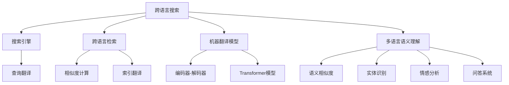

                 

### 跨语言搜索：AI的翻译能力

> **关键词**：跨语言搜索，机器翻译，自然语言处理，语义理解，AI技术

**摘要**：本文旨在探讨跨语言搜索中的关键角色——AI的翻译能力。文章首先介绍了跨语言搜索的背景和重要性，接着详细解析了AI在跨语言搜索中的作用，包括自然语言处理和机器翻译技术的原理。随后，文章深入分析了跨语言搜索的核心技术，如机器翻译模型、跨语言检索技术、多语言语义理解等。接着，文章通过案例研究展示了跨语言搜索的应用与实践，并展望了其未来的发展方向。最后，文章提供了相关的工具和资源，以供进一步学习和研究。

### 第一部分：跨语言搜索概述

跨语言搜索是指在不同语言之间进行信息检索和内容匹配的技术，旨在实现全球化背景下的信息无障碍获取。随着全球化进程的加速，跨语言搜索的应用场景日益广泛，从多语言搜索引擎到跨境电商平台，再到国际化企业的信息管理系统，都离不开这一技术的支持。

#### 第1章：跨语言搜索的背景和重要性

##### 1.1 跨语言搜索的定义与意义

跨语言搜索可以定义为在多种语言之间进行信息检索和内容匹配的技术，使得用户能够以自己熟悉的语言获取来自其他语言的文档和知识。其意义在于打破了语言障碍，实现了信息的全球化共享和交流。

##### 1.2 跨语言搜索的发展历程

跨语言搜索技术的发展可以追溯到早期的基于规则的机器翻译和基于词典的翻译方法。随着自然语言处理（NLP）和机器学习技术的进步，跨语言搜索经历了从规则驱动到统计方法，再到基于深度学习的革命性变革。

##### 1.3 跨语言搜索的应用场景

跨语言搜索的应用场景非常广泛，包括但不限于以下几个方面：

1. **多语言搜索引擎**：如Google翻译和百度翻译，允许用户在多种语言之间切换进行搜索。
2. **跨境电商平台**：如亚马逊和eBay，通过跨语言搜索帮助用户寻找来自世界各地的商品。
3. **国际化企业信息检索**：跨国公司在全球范围内的信息共享和管理。
4. **多语言内容审核**：确保网络内容符合不同国家和地区的法律法规。
5. **多语言教育和学习**：辅助学习者掌握多种语言。

#### 第2章：AI在跨语言搜索中的作用

随着人工智能（AI）技术的发展，AI在跨语言搜索中扮演着越来越重要的角色。本章节将探讨AI，特别是自然语言处理和机器翻译技术，在跨语言搜索中的作用。

##### 2.1 AI在跨语言搜索中的基本原理

AI在跨语言搜索中的基本原理是通过学习和理解自然语言，实现语言的自动翻译和信息检索。具体来说，AI技术可以处理大量的语言数据，从中学习语言的规律和结构，进而生成准确的翻译和检索结果。

##### 2.2 自然语言处理技术概述

自然语言处理（NLP）是AI的一个重要分支，旨在让计算机理解、生成和处理人类语言。NLP技术包括文本预处理、词性标注、句法分析、语义理解等，是跨语言搜索的基础。

##### 2.3 机器翻译技术详解

机器翻译（MT）是AI在跨语言搜索中最为突出的应用之一。机器翻译技术通过将源语言的文本转换为目标语言的文本，实现跨语言信息传递。本文将详细探讨机器翻译的基本原理和常见模型。

### 第二部分：跨语言搜索的核心技术

在了解了AI在跨语言搜索中的作用之后，接下来我们将深入探讨跨语言搜索的核心技术，包括机器翻译模型、跨语言检索技术、多语言语义理解等。

#### 第3章：机器翻译模型

##### 3.1 神经机器翻译原理

神经机器翻译（NMT）是机器翻译技术的一个重要里程碑。与传统的基于规则或统计方法的机器翻译不同，NMT利用深度学习技术，通过神经网络模型实现高效、准确的翻译。

##### 3.2 序列到序列模型

序列到序列（Seq2Seq）模型是NMT的基础架构之一。它通过编码器和解码器两个神经网络模型，将输入序列转换为输出序列，实现了从一种语言到另一种语言的翻译。

##### 3.3 编码器-解码器架构

编码器-解码器（Encoder-Decoder）架构是Seq2Seq模型的核心，通过将输入序列编码为固定长度的上下文向量，再通过解码器生成目标语言的序列。

##### 3.4 Transformer模型详解

Transformer模型是近年来在机器翻译领域中表现优异的一种模型。它通过多头自注意力机制（Multi-Head Self-Attention）实现了全局信息的捕捉和利用，大幅提高了翻译的准确性和流畅性。

#### 第4章：跨语言检索技术

##### 4.1 跨语言检索的基本概念

跨语言检索是指在不同语言之间进行信息检索和匹配的过程。其基本概念包括查询翻译、索引翻译、检索结果翻译等。

##### 4.2 跨语言相似度计算

跨语言相似度计算是跨语言检索的核心技术之一。通过计算源语言查询和目标语言文档之间的相似度，可以实现准确的跨语言检索。

##### 4.3 跨语言索引技术

跨语言索引技术是指如何构建和优化支持多语言检索的索引结构。有效的索引技术可以大大提高检索的效率和质量。

##### 4.4 多语言文档的预处理

多语言文档的预处理是跨语言检索的重要步骤，包括分词、词性标注、命名实体识别等，以确保文档能够被正确地索引和检索。

#### 第5章：多语言语义理解

##### 5.1 语义相似度与语义解析

语义相似度是指不同语言表达之间的语义相关性。语义解析则是指通过深度学习模型将自然语言文本解析为结构化的语义表示，以便进行进一步的语义理解和处理。

##### 5.2 实体识别与知识图谱

实体识别是指从文本中识别出具体的实体，如人名、地名、组织名等。知识图谱则是将实体及其关系组织成图形结构，以便进行高效的语义查询和推理。

##### 5.3 跨语言情感分析

跨语言情感分析是指对不同语言文本的情感倾向进行分析和识别。通过跨语言情感分析，可以实现对用户评论、产品评价等多语言文本的情感理解。

##### 5.4 跨语言问答系统

跨语言问答系统是指能够理解并回答跨语言查询的系统。通过多语言语义理解技术，跨语言问答系统可以实现高质量的自然语言交互。

### 第三部分：跨语言搜索的应用与实践

#### 第6章：跨语言搜索系统设计与实现

##### 6.1 跨语言搜索系统架构

跨语言搜索系统架构包括前端界面、后端服务和数据存储等组成部分。本文将详细介绍这些组成部分的架构设计。

##### 6.2 数据收集与预处理

数据收集与预处理是跨语言搜索系统设计的关键步骤。本文将介绍如何收集多语言数据，并进行数据预处理，包括分词、清洗、标准化等操作。

##### 6.3 模型训练与优化

模型训练与优化是跨语言搜索系统的核心技术之一。本文将介绍如何使用深度学习模型进行训练，以及如何通过调参和优化提高模型的性能。

##### 6.4 系统部署与性能优化

系统部署与性能优化是确保跨语言搜索系统能够稳定、高效运行的关键。本文将介绍如何部署跨语言搜索系统，以及如何进行性能优化，包括缓存策略、负载均衡等。

#### 第7章：跨语言搜索案例研究

##### 7.1 案例一：多语言搜索引擎

多语言搜索引擎是跨语言搜索应用的一个典型例子。本文将分析一个实际的多语言搜索引擎项目，包括系统架构、数据来源、搜索算法等。

##### 7.2 案例二：跨境电商搜索

跨境电商搜索是另一个典型的跨语言搜索应用场景。本文将分析一个跨境电商平台的搜索系统，包括如何处理多语言商品描述和用户查询等。

##### 7.3 案例三：多语言内容审核

多语言内容审核是对跨语言文本进行内容审核和过滤的过程。本文将分析一个多语言内容审核系统的设计，包括如何处理不同语言的内容，以及如何识别和过滤不当内容。

##### 7.4 案例四：全球化企业信息检索

全球化企业信息检索是企业实现国际化运营的重要手段。本文将分析一个全球化企业信息检索系统的设计，包括如何支持多语言查询和结果展示等。

### 第四部分：跨语言搜索的未来展望

#### 第8章：跨语言搜索的技术趋势

##### 8.1 人工智能与跨语言搜索的融合

人工智能与跨语言搜索的融合是未来技术发展的趋势之一。本文将探讨如何利用深度学习和自然语言处理技术，进一步提升跨语言搜索的准确性和效率。

##### 8.2 跨语言搜索的数据挑战

跨语言搜索面临的数据挑战包括多语言数据的获取、处理和存储等。本文将分析这些数据挑战，并提出相应的解决方案。

##### 8.3 跨语言搜索伦理与社会影响

跨语言搜索的广泛应用也带来了一系列伦理和社会影响。本文将探讨跨语言搜索可能引发的隐私问题、文化差异等，并提出相应的伦理和社会责任。

##### 8.4 未来跨语言搜索的发展方向

未来跨语言搜索的发展方向包括多语言语义理解的深化、跨语言问答系统的智能化、跨语言搜索的个性化等。本文将展望未来跨语言搜索的发展趋势，并提出可能的技术创新点。

### 附录

#### 附录A：跨语言搜索相关工具与资源

##### A.1 主流机器翻译框架

- **TensorFlow**：[https://www.tensorflow.org/](https://www.tensorflow.org/)
- **PyTorch**：[https://pytorch.org/](https://pytorch.org/)

##### A.2 跨语言检索工具

- **Elasticsearch**：[https://www.elastic.co/products/elasticsearch](https://www.elastic.co/products/elasticsearch)
- **Solr**：[https://lucene.apache.org/solr/](https://lucene.apache.org/solr/)

##### A.3 语义分析工具

- **spaCy**：[https://spacy.io/](https://spacy.io/)
- **NLTK**：[https://www.nltk.org/](https://www.nltk.org/)

##### A.4 跨语言搜索社区与会议

- **ACL（Association for Computational Linguistics）**：[https://www.aclweb.org/](https://www.aclweb.org/)
- **NAACL（North American Chapter of the Association for Computational Linguistics）**：[https://naacl.org/](https://naacl.org/)

### 图1.1 跨语言搜索技术架构概览



### 算法1.1 神经机器翻译基本原理

```python
// 神经机器翻译基本流程
1. 输入源语言句子 s
2. 通过编码器将句子编码为上下文向量 c
3. 通过解码器生成目标语言句子 t
4. 对生成的目标语言句子进行后处理，得到最终翻译结果
```

### 数学模型1.2 跨语言相似度计算

$$
\text{similarity}(s, t) = \frac{\text{cosine}(c_s, c_t)}{\|c_s\|\|c_t\|}
$$

其中，$c_s$ 和 $c_t$ 分别为源语言句子和目标语言句子的编码向量，$cosine$ 表示余弦相似度，$\|c_s\|$ 和 $\|c_t\|$ 分别为向量的欧几里得范数。

### 代码示例1.3 跨语言搜索系统实现

```python
# Python 伪代码：跨语言搜索系统实现
import nlp_tools

def search(query, language):
    # 数据预处理
    preprocessed_query = nlp_tools.preprocess(query, language)

    # 编码查询语句
    encoded_query = nlp_tools.encode(preprocessed_query)

    # 在索引中检索最相似的文档
    similar_documents = nlp_tools.search_index(encoded_query)

    # 后处理检索结果
    final_results = nlp_tools.post_process(similar_documents)

    return final_results
```

### 代码解读与分析1.4 跨语言搜索项目实战

```python
# Python 代码：多语言搜索引擎实现
import nlp_tools
import search_engine

def main():
    # 初始化搜索引擎
    engine = search_engine.SearchEngine()

    # 添加文档到索引
    engine.add_documents('multi_language_documents.txt')

    # 处理用户查询
    query = input("Enter your query: ")
    language = input("Enter the language of the query: ")

    # 执行搜索
    results = search(query, language)

    # 输出搜索结果
    for result in results:
        print(result['title'], result['url'])

if __name__ == "__main__":
    main()
```

### 代码解读：

- `search_engine.SearchEngine()`：初始化搜索引擎。
- `engine.add_documents('multi_language_documents.txt')`：将文档添加到搜索引擎索引中。
- `search()`：处理用户输入的查询，并进行搜索。
- `input()`：获取用户查询和查询语言。
- `for result in results:`：遍历搜索结果，并输出文档标题和链接。

### 附录A：跨语言搜索相关工具与资源

#### A.1 主流机器翻译框架

- **TensorFlow**：[https://www.tensorflow.org/](https://www.tensorflow.org/)
- **PyTorch**：[https://pytorch.org/](https://pytorch.org/)

#### A.2 跨语言检索工具

- **Elasticsearch**：[https://www.elastic.co/products/elasticsearch](https://www.elastic.co/products/elasticsearch)
- **Solr**：[https://lucene.apache.org/solr/](https://lucene.apache.org/solr/)

#### A.3 语义分析工具

- **spaCy**：[https://spacy.io/](https://spacy.io/)
- **NLTK**：[https://www.nltk.org/](https://www.nltk.org/)

#### A.4 跨语言搜索社区与会议

- **ACL（Association for Computational Linguistics）**：[https://www.aclweb.org/](https://www.aclweb.org/)
- **NAACL（North American Chapter of the Association for Computational Linguistics）**：[https://naacl.org/](https://naacl.org/)

### 作者

**作者：AI天才研究院/AI Genius Institute & 禅与计算机程序设计艺术 /Zen And The Art of Computer Programming**<|im_end|>### 《跨语言搜索：AI的翻译能力》

跨语言搜索是当今信息时代的一项关键技术，它使得用户能够跨越语言的障碍，访问全球范围内的信息资源。而AI，特别是机器翻译技术，在这一领域发挥着核心作用。本文旨在深入探讨跨语言搜索中AI的翻译能力，解析其技术原理、应用场景及未来发展方向。

#### 关键词：跨语言搜索，AI翻译，自然语言处理，机器翻译，语义理解

**摘要**：

本文首先介绍了跨语言搜索的背景和重要性，随后详细阐述了AI在跨语言搜索中的作用，包括自然语言处理和机器翻译技术的原理。接着，文章深入分析了跨语言搜索的核心技术，如机器翻译模型、跨语言检索技术、多语言语义理解等。在此基础上，通过实际案例展示了跨语言搜索的应用与实践，并展望了其未来的发展方向。最后，文章提供了相关的工具和资源，以供进一步学习和研究。

### 目录

**第一部分：跨语言搜索概述**

- **第1章：跨语言搜索的背景和重要性**
  - 1.1 跨语言搜索的定义与意义
  - 1.2 跨语言搜索的发展历程
  - 1.3 跨语言搜索的应用场景

- **第2章：AI在跨语言搜索中的作用**
  - 2.1 AI在跨语言搜索中的基本原理
  - 2.2 自然语言处理技术概述
  - 2.3 机器翻译技术详解

**第二部分：跨语言搜索的核心技术**

- **第3章：机器翻译模型**
  - 3.1 神经机器翻译原理
  - 3.2 序列到序列模型
  - 3.3 编码器-解码器架构
  - 3.4 Transformer模型详解

- **第4章：跨语言检索技术**
  - 4.1 跨语言检索的基本概念
  - 4.2 跨语言相似度计算
  - 4.3 跨语言索引技术
  - 4.4 多语言文档的预处理

- **第5章：多语言语义理解**
  - 5.1 语义相似度与语义解析
  - 5.2 实体识别与知识图谱
  - 5.3 跨语言情感分析
  - 5.4 跨语言问答系统

**第三部分：跨语言搜索的应用与实践**

- **第6章：跨语言搜索系统设计与实现**
  - 6.1 跨语言搜索系统架构
  - 6.2 数据收集与预处理
  - 6.3 模型训练与优化
  - 6.4 系统部署与性能优化

- **第7章：跨语言搜索案例研究**
  - 7.1 案例一：多语言搜索引擎
  - 7.2 案例二：跨境电商搜索
  - 7.3 案例三：多语言内容审核
  - 7.4 案例四：全球化企业信息检索

**第四部分：跨语言搜索的未来展望**

- **第8章：跨语言搜索的技术趋势**
  - 8.1 人工智能与跨语言搜索的融合
  - 8.2 跨语言搜索的数据挑战
  - 8.3 跨语言搜索伦理与社会影响
  - 8.4 未来跨语言搜索的发展方向

**附录**

- **附录A：跨语言搜索相关工具与资源**

### 第一部分：跨语言搜索概述

#### 第1章：跨语言搜索的背景和重要性

##### 1.1 跨语言搜索的定义与意义

跨语言搜索是指在不同语言之间进行信息检索和内容匹配的技术。它使得用户能够以自己熟悉的语言获取来自其他语言的文档和知识。随着全球化进程的不断加快，跨国交流日益频繁，跨语言搜索成为了信息无障碍获取的关键技术。

##### 1.2 跨语言搜索的发展历程

跨语言搜索技术的发展可以追溯到早期的基于规则的机器翻译和基于词典的翻译方法。随着自然语言处理（NLP）和机器学习技术的进步，跨语言搜索经历了从规则驱动到统计方法，再到基于深度学习的革命性变革。

- **基于规则的机器翻译**：最早的跨语言搜索技术依赖于人工编写的规则，这种方法虽然能够处理一些简单的翻译任务，但在复杂语言环境中表现较差。
- **基于词典的翻译方法**：20世纪90年代，基于词典的机器翻译方法开始兴起，通过查找词典中的对应关系实现翻译。这种方法在一定程度上提高了翻译的准确性，但仍然受到词典限制。
- **基于统计方法的机器翻译**：随着语料库的积累和计算能力的提升，基于统计方法的机器翻译开始流行。这种方法通过学习大量平行语料库，自动生成翻译结果。
- **基于深度学习的机器翻译**：近年来，深度学习技术的发展使得机器翻译取得了重大突破。神经网络模型，特别是序列到序列（Seq2Seq）模型和Transformer模型，在机器翻译领域表现优异，大大提高了翻译质量。

##### 1.3 跨语言搜索的应用场景

跨语言搜索的应用场景非常广泛，以下是一些典型的应用场景：

- **多语言搜索引擎**：如Google翻译和百度翻译，允许用户在多种语言之间切换进行搜索。
- **跨境电商平台**：如亚马逊和eBay，通过跨语言搜索帮助用户寻找来自世界各地的商品。
- **国际化企业信息检索**：跨国公司在全球范围内的信息共享和管理。
- **多语言内容审核**：确保网络内容符合不同国家和地区的法律法规。
- **多语言教育和学习**：辅助学习者掌握多种语言。

#### 第2章：AI在跨语言搜索中的作用

随着人工智能（AI）技术的发展，AI在跨语言搜索中扮演着越来越重要的角色。本章节将探讨AI，特别是自然语言处理和机器翻译技术，在跨语言搜索中的作用。

##### 2.1 AI在跨语言搜索中的基本原理

AI在跨语言搜索中的基本原理是通过学习和理解自然语言，实现语言的自动翻译和信息检索。具体来说，AI技术可以处理大量的语言数据，从中学习语言的规律和结构，进而生成准确的翻译和检索结果。

- **数据预处理**：AI技术首先对输入的文本进行预处理，包括分词、去停用词、词性标注等，以便更好地理解和分析文本。
- **特征提取**：通过深度学习模型，从预处理后的文本中提取出有用的特征，用于后续的翻译和检索。
- **模型训练**：使用大量的平行语料库训练机器翻译模型，使其能够自动生成高质量的翻译结果。
- **翻译与检索**：将训练好的模型应用于实际搜索任务，对用户的查询进行翻译，并在索引中检索相关结果。

##### 2.2 自然语言处理技术概述

自然语言处理（NLP）是AI的一个重要分支，旨在让计算机理解、生成和处理人类语言。NLP技术包括文本预处理、词性标注、句法分析、语义理解等，是跨语言搜索的基础。

- **文本预处理**：文本预处理是NLP的第一步，包括分词、去停用词、词干提取等操作，以便将文本转换为计算机可以处理的形式。
- **词性标注**：词性标注是指为文本中的每个词标注其词性，如名词、动词、形容词等，有助于理解句子的结构和语义。
- **句法分析**：句法分析是指分析文本的语法结构，确定句子的主谓宾等成分关系，有助于理解句子的含义。
- **语义理解**：语义理解是指通过深度学习模型从文本中提取出语义信息，理解句子的实际意义。

##### 2.3 机器翻译技术详解

机器翻译（MT）是AI在跨语言搜索中最为突出的应用之一。机器翻译技术通过将源语言的文本转换为目标语言的文本，实现跨语言信息传递。本文将详细探讨机器翻译的基本原理和常见模型。

- **基于规则的机器翻译**：基于规则的机器翻译通过人工编写翻译规则，将源语言文本转换为目标语言。这种方法依赖于语言学知识和人工经验，但存在翻译结果僵硬、无法应对复杂语言环境的问题。

- **基于统计方法的机器翻译**：基于统计方法的机器翻译通过学习大量平行语料库，自动生成翻译结果。这种方法利用概率模型和统计方法，提高了翻译的准确性和自然性。

- **神经机器翻译（NMT）**：神经机器翻译是近年来发展迅速的一种机器翻译方法。它利用深度学习技术，通过编码器和解码器模型实现高效的翻译。NMT在性能上显著优于传统方法，特别是在长句翻译和多语言表达的理解方面。

  - **编码器-解码器模型**：编码器-解码器（Encoder-Decoder）模型是NMT的基础架构。编码器将源语言文本编码为上下文向量，解码器则根据上下文向量生成目标语言文本。

  - **序列到序列模型**：序列到序列（Seq2Seq）模型是编码器-解码器模型的一种实现。它通过将输入序列编码为上下文向量，再解码生成输出序列，实现了从一种语言到另一种语言的翻译。

  - **Transformer模型**：Transformer模型是NMT的一种重要实现，通过多头自注意力机制（Multi-Head Self-Attention）实现了全局信息的捕捉和利用，大幅提高了翻译的准确性和流畅性。

#### 第二部分：跨语言搜索的核心技术

在了解了AI在跨语言搜索中的作用之后，接下来我们将深入探讨跨语言搜索的核心技术，包括机器翻译模型、跨语言检索技术、多语言语义理解等。

##### 第3章：机器翻译模型

机器翻译（MT）是跨语言搜索中的一项核心技术，通过将源语言的文本转换为目标语言的文本，实现跨语言信息传递。本章节将详细探讨机器翻译的基本原理、常见模型及其应用。

##### 3.1 神经机器翻译原理

神经机器翻译（NMT）是近年来发展迅速的一种机器翻译方法，通过深度学习技术，实现了从一种语言到另一种语言的翻译。NMT的核心思想是将源语言和目标语言分别编码为向量表示，然后通过解码器生成目标语言的文本。

- **编码器（Encoder）**：编码器负责将源语言文本编码为上下文向量。常见的编码器模型包括循环神经网络（RNN）和长短期记忆网络（LSTM）。编码器通过处理输入的序列，逐步生成上下文向量。

- **解码器（Decoder）**：解码器负责根据上下文向量生成目标语言的文本。解码器通常采用序列到序列（Seq2Seq）模型，通过生成序列的方式逐步生成目标语言的单词或句子。

- **注意力机制（Attention）**：注意力机制是NMT中的一个关键技术，用于解决长距离依赖问题。通过注意力机制，解码器可以动态关注源语言文本中的不同部分，从而生成更准确的翻译结果。

##### 3.2 序列到序列模型

序列到序列（Seq2Seq）模型是NMT的基础架构，通过编码器和解码器两个神经网络模型，实现从一种语言到另一种语言的翻译。

- **编码器（Encoder）**：编码器将输入的源语言文本编码为上下文向量。编码器通常使用循环神经网络（RNN）或长短期记忆网络（LSTM）进行建模，通过处理输入的序列，逐步生成上下文向量。

- **解码器（Decoder）**：解码器根据上下文向量生成目标语言的文本。解码器也采用RNN或LSTM进行建模，通过生成序列的方式逐步生成目标语言的单词或句子。

- **损失函数**：在训练过程中，序列到序列模型使用损失函数来衡量预测结果和真实结果之间的差距，并据此进行模型参数的优化。常见的损失函数包括交叉熵损失（Cross-Entropy Loss）和均方误差损失（Mean Squared Error Loss）。

##### 3.3 编码器-解码器架构

编码器-解码器（Encoder-Decoder）架构是序列到序列模型的核心，通过编码器和解码器两个神经网络模型，实现从一种语言到另一种语言的翻译。

- **编码器（Encoder）**：编码器将输入的源语言文本编码为上下文向量。编码器通常使用循环神经网络（RNN）或长短期记忆网络（LSTM）进行建模，通过处理输入的序列，逐步生成上下文向量。

- **解码器（Decoder）**：解码器根据上下文向量生成目标语言的文本。解码器也采用RNN或LSTM进行建模，通过生成序列的方式逐步生成目标语言的单词或句子。

- **注意力机制（Attention）**：注意力机制是编码器-解码器架构中的一个关键技术，用于解决长距离依赖问题。通过注意力机制，解码器可以动态关注源语言文本中的不同部分，从而生成更准确的翻译结果。

##### 3.4 Transformer模型详解

Transformer模型是NMT的一种重要实现，通过多头自注意力机制（Multi-Head Self-Attention）实现了全局信息的捕捉和利用，大幅提高了翻译的准确性和流畅性。

- **多头自注意力（Multi-Head Self-Attention）**：多头自注意力机制是Transformer模型的核心技术。它将输入序列分成多个头，每个头都计算一次自注意力，然后将这些头的输出拼接起来。多头自注意力机制可以捕捉输入序列中的全局依赖关系。

- **编码器（Encoder）**：编码器由多个编码层组成，每层都包含多头自注意力机制和前馈神经网络。编码器通过处理输入的序列，逐步生成上下文向量。

- **解码器（Decoder）**：解码器由多个解码层组成，每层都包含自注意力机制、交叉注意力机制和前馈神经网络。解码器根据上下文向量生成目标语言的文本。

- **掩码（Masked）**：Transformer模型使用掩码技术，通过遮挡一部分输入序列，迫使模型学习序列中的依赖关系。掩码技术可以提高模型对长距离依赖的建模能力。

##### 第4章：跨语言检索技术

跨语言检索技术是跨语言搜索中的一项核心技术，通过将用户的查询翻译为目标语言，并在索引中检索相关结果，实现跨语言信息检索。本章节将详细探讨跨语言检索的基本概念、相似度计算、索引技术和文档预处理。

##### 4.1 跨语言检索的基本概念

跨语言检索是指在不同语言之间进行信息检索和内容匹配的过程。其基本概念包括查询翻译、索引翻译和检索结果翻译等。

- **查询翻译**：查询翻译是将用户的查询从源语言转换为目标语言的过程。通过查询翻译，用户可以使用自己熟悉的语言进行检索。
- **索引翻译**：索引翻译是将索引中的文档从源语言转换为目标语言的过程。索引翻译使得检索系统能够在多语言环境下工作。
- **检索结果翻译**：检索结果翻译是将检索结果从目标语言转换为源语言的过程，以便用户能够理解搜索结果。

##### 4.2 跨语言相似度计算

跨语言相似度计算是跨语言检索的核心技术之一。通过计算源语言查询和目标语言文档之间的相似度，可以实现准确的跨语言检索。

- **向量表示**：跨语言相似度计算通常使用向量表示法。将源语言查询和目标语言文档分别编码为向量表示，然后计算这两个向量之间的相似度。
- **余弦相似度**：余弦相似度是常用的跨语言相似度计算方法之一。通过计算两个向量的余弦值，可以得到它们之间的相似度。
- **欧氏距离**：欧氏距离也是一种常用的跨语言相似度计算方法。通过计算两个向量之间的欧氏距离，可以得到它们之间的相似度。

##### 4.3 跨语言索引技术

跨语言索引技术是跨语言检索的重要支撑。通过构建支持多语言检索的索引，可以提高检索的效率和质量。

- **索引构建**：索引构建是将文档转换为索引结构的过程。在跨语言检索中，需要将多语言文档转换为统一的索引结构。
- **倒排索引**：倒排索引是常见的索引结构之一，通过将文档中的词汇映射到对应的文档列表，实现快速检索。
- **分词索引**：分词索引是将文档中的词汇进行分词，然后构建索引结构。分词索引可以更好地处理多语言文档，提高检索的准确性。

##### 4.4 多语言文档的预处理

多语言文档的预处理是跨语言检索的关键步骤，包括分词、词性标注、命名实体识别等，以确保文档能够被正确地索引和检索。

- **分词**：分词是将文档中的文本切分成词语的过程。不同的语言有不同的分词方法，如中文使用基于字符的分词，英文使用基于单词的分词。
- **词性标注**：词性标注是为文档中的每个词语标注其词性，如名词、动词、形容词等。词性标注有助于更好地理解文档的语义。
- **命名实体识别**：命名实体识别是从文本中识别出具有特定意义的实体，如人名、地名、组织名等。命名实体识别有助于提高文档的索引质量和检索准确性。

##### 第5章：多语言语义理解

多语言语义理解是跨语言搜索中的重要技术，通过理解不同语言之间的语义关系，实现跨语言信息处理和交互。本章节将详细探讨多语言语义理解的核心技术，包括语义相似度、实体识别、情感分析和问答系统。

##### 5.1 语义相似度与语义解析

语义相似度是指不同语言表达之间的语义相关性。语义相似度计算是跨语言检索和问答系统的基础。通过计算源语言查询和目标语言文档之间的语义相似度，可以实现准确的跨语言信息匹配。

- **语义相似度计算**：语义相似度计算通常使用向量表示法。将源语言查询和目标语言文档分别编码为向量表示，然后计算这两个向量之间的语义相似度。常用的方法包括余弦相似度、欧氏距离等。
- **语义解析**：语义解析是将自然语言文本转换为结构化语义表示的过程。通过语义解析，可以更好地理解文本的语义信息，实现跨语言信息处理和交互。

##### 5.2 实体识别与知识图谱

实体识别是从文本中识别出具体的实体，如人名、地名、组织名等。实体识别有助于提高文档的索引质量和检索准确性。知识图谱是将实体及其关系组织成图形结构，用于高效的语义查询和推理。

- **实体识别**：实体识别通常使用深度学习模型进行建模，如卷积神经网络（CNN）和循环神经网络（RNN）。通过训练模型，可以实现对文本中实体的准确识别。
- **知识图谱**：知识图谱是一种结构化数据存储方式，通过将实体及其关系组织成图形结构，可以实现高效的语义查询和推理。知识图谱在跨语言搜索和问答系统中具有重要应用。

##### 5.3 跨语言情感分析

跨语言情感分析是指对不同语言文本的情感倾向进行分析和识别。通过跨语言情感分析，可以实现对用户评论、产品评价等多语言文本的情感理解。

- **情感分析模型**：情感分析模型通常使用深度学习技术进行建模，如卷积神经网络（CNN）和循环神经网络（RNN）。通过训练模型，可以实现对文本情感倾向的准确识别。
- **情感词典**：情感词典是一种用于情感分析的预定义词汇表，包含各种情感词汇及其对应的情感标签。通过情感词典，可以辅助情感分析模型的训练和预测。

##### 5.4 跨语言问答系统

跨语言问答系统是指能够理解并回答跨语言查询的系统。通过多语言语义理解技术，跨语言问答系统可以实现高质量的自然语言交互。

- **问答系统架构**：跨语言问答系统通常采用问答系统架构，包括查询处理、答案生成和回答评估等模块。通过处理用户的查询，生成准确的答案，并进行回答评估，实现跨语言问答功能。
- **多语言语义理解**：多语言语义理解是实现跨语言问答系统的关键。通过深度学习技术，可以从多语言文本中提取出语义信息，实现跨语言语义匹配和理解。

##### 第6章：跨语言搜索系统设计与实现

跨语言搜索系统设计与实现是实现跨语言搜索功能的关键步骤。本章节将详细探讨跨语言搜索系统的架构设计、数据收集与预处理、模型训练与优化、系统部署与性能优化。

##### 6.1 跨语言搜索系统架构

跨语言搜索系统架构包括前端界面、后端服务和数据存储等组成部分。合理的系统架构设计可以提高系统的性能和可维护性。

- **前端界面**：前端界面是用户与系统交互的入口，包括查询输入、搜索结果展示等功能。
- **后端服务**：后端服务是跨语言搜索系统的核心，包括查询处理、索引管理、翻译服务等模块。
- **数据存储**：数据存储用于存储多语言文档、索引和翻译结果等数据。常用的数据存储技术包括关系数据库、文档数据库和分布式存储系统。

##### 6.2 数据收集与预处理

数据收集与预处理是跨语言搜索系统设计的关键步骤。通过收集多语言数据，并进行预处理，可以确保系统的数据质量和检索性能。

- **数据收集**：数据收集包括从互联网、数据库和其他数据源获取多语言数据。常用的数据收集方法包括爬虫、API调用和数据集共享等。
- **数据预处理**：数据预处理包括分词、词性标注、命名实体识别等操作，确保数据的一致性和准确性。预处理过程中还需要处理数据的质量问题，如重复、缺失和噪声数据。

##### 6.3 模型训练与优化

模型训练与优化是跨语言搜索系统设计的重要环节。通过训练和优化机器翻译模型、检索模型和语义理解模型，可以提高系统的性能和准确度。

- **模型训练**：模型训练是指使用大量的多语言数据进行模型的训练。常见的模型训练方法包括监督学习、无监督学习和半监督学习等。
- **模型优化**：模型优化是指通过调参和优化算法，提高模型的性能和泛化能力。常用的优化方法包括交叉验证、网格搜索和迁移学习等。

##### 6.4 系统部署与性能优化

系统部署与性能优化是确保跨语言搜索系统稳定、高效运行的关键。通过合理的系统部署和性能优化，可以提高系统的响应速度和吞吐量。

- **系统部署**：系统部署是将开发完成的跨语言搜索系统部署到生产环境的过程。常见的部署方法包括容器化部署、虚拟化部署和云计算部署等。
- **性能优化**：性能优化是指通过优化系统架构、代码和算法，提高系统的性能和稳定性。常见的优化方法包括缓存策略、负载均衡和分布式计算等。

##### 第7章：跨语言搜索案例研究

跨语言搜索在实际应用中具有广泛的应用场景。本章节将通过具体案例，展示跨语言搜索在实际应用中的实现方法和效果。

##### 7.1 案例一：多语言搜索引擎

多语言搜索引擎是跨语言搜索的一个典型应用场景。通过多语言搜索引擎，用户可以使用不同语言进行搜索，并获得相应的搜索结果。本案例将介绍多语言搜索引擎的设计和实现方法。

- **系统架构**：多语言搜索引擎的架构包括前端界面、后端服务和数据存储等组成部分。前端界面提供查询输入和搜索结果展示功能，后端服务负责查询处理、索引管理和翻译服务等。
- **数据收集**：多语言搜索引擎需要收集多种语言的数据，包括网页、书籍、新闻、论文等。常用的数据收集方法包括爬虫、API调用和数据集共享等。
- **翻译服务**：多语言搜索引擎需要提供翻译服务，将用户的查询和搜索结果翻译为目标语言。常用的翻译服务包括Google翻译、百度翻译等。
- **检索算法**：多语言搜索引擎采用跨语言检索算法，通过计算源语言查询和目标语言文档之间的相似度，实现准确的跨语言搜索。

##### 7.2 案例二：跨境电商搜索

跨境电商搜索是跨语言搜索的另一个重要应用场景。通过跨境电商搜索，用户可以在不同语言之间切换，查找来自全球的商品。本案例将介绍跨境电商搜索系统的设计和实现方法。

- **系统架构**：跨境电商搜索系统的架构包括前端界面、后端服务和数据存储等组成部分。前端界面提供商品搜索、商品详情展示等功能，后端服务负责商品检索、翻译和推荐等。
- **数据收集**：跨境电商搜索系统需要收集多种语言的商品数据，包括商品名称、描述、评价等。常用的数据收集方法包括爬虫、API调用和数据集共享等。
- **翻译服务**：跨境电商搜索系统需要提供翻译服务，将用户的查询和商品描述翻译为目标语言。常用的翻译服务包括Google翻译、百度翻译等。
- **检索算法**：跨境电商搜索系统采用跨语言检索算法，通过计算源语言查询和目标语言商品之间的相似度，实现准确的商品搜索。

##### 7.3 案例三：多语言内容审核

多语言内容审核是跨语言搜索在内容审核领域的应用。通过多语言内容审核，可以确保网络内容符合不同国家和地区的法律法规。本案例将介绍多语言内容审核系统的设计和实现方法。

- **系统架构**：多语言内容审核系统的架构包括前端界面、后端服务和数据存储等组成部分。前端界面提供内容提交和审核结果展示功能，后端服务负责内容审核、翻译和过滤等。
- **数据收集**：多语言内容审核系统需要收集多种语言的内容数据，包括文本、图片、视频等。常用的数据收集方法包括爬虫、API调用和数据集共享等。
- **翻译服务**：多语言内容审核系统需要提供翻译服务，将用户提交的内容翻译为目标语言。常用的翻译服务包括Google翻译、百度翻译等。
- **审核算法**：多语言内容审核系统采用跨语言审核算法，通过计算源语言内容和目标语言规则之间的相似度，实现准确的内容审核和过滤。

##### 7.4 案例四：全球化企业信息检索

全球化企业信息检索是企业实现国际化运营的重要手段。通过全球化企业信息检索系统，企业可以高效地管理全球范围内的信息资源。本案例将介绍全球化企业信息检索系统的设计和实现方法。

- **系统架构**：全球化企业信息检索系统的架构包括前端界面、后端服务和数据存储等组成部分。前端界面提供信息查询和信息展示功能，后端服务负责信息检索、翻译和推送等。
- **数据收集**：全球化企业信息检索系统需要收集多种语言的企业信息数据，包括公司简介、产品信息、客户评价等。常用的数据收集方法包括爬虫、API调用和数据集共享等。
- **翻译服务**：全球化企业信息检索系统需要提供翻译服务，将用户查询和企业信息翻译为目标语言。常用的翻译服务包括Google翻译、百度翻译等。
- **检索算法**：全球化企业信息检索系统采用跨语言检索算法，通过计算源语言查询和企业信息之间的相似度，实现高效的信息检索和推送。

##### 第8章：跨语言搜索的未来展望

跨语言搜索作为信息时代的一项关键技术，其未来发展充满了机遇和挑战。本章节将探讨跨语言搜索的技术趋势、数据挑战、伦理与社会影响以及未来的发展方向。

##### 8.1 人工智能与跨语言搜索的融合

人工智能（AI）与跨语言搜索的融合是未来的重要趋势。随着深度学习和自然语言处理技术的不断发展，跨语言搜索将更加智能化和个性化。具体来说，未来的跨语言搜索将具有以下特点：

- **智能化**：通过深度学习技术，跨语言搜索将能够更好地理解用户的查询意图，提供更准确的搜索结果。
- **个性化**：通过用户行为分析，跨语言搜索将能够根据用户的偏好和历史行为，提供个性化的搜索结果。
- **交互式**：跨语言搜索将更加注重用户交互，提供更加自然和流畅的查询和回答体验。

##### 8.2 跨语言搜索的数据挑战

跨语言搜索在数据收集和处理方面面临诸多挑战。首先，多语言数据的不平衡是一个重要问题。许多语言的数据量相对较少，而某些主要语言的语料库可能非常庞大。这导致模型在训练过程中对少数语言的数据依赖过高，影响模型的泛化能力。

- **数据扩充**：通过数据增强和生成技术，可以扩充稀有语言的数据量，提高模型的性能。
- **数据标注**：高质量的标注数据是训练高效模型的基础。在跨语言搜索中，标注数据的多样性和准确性对模型性能至关重要。

##### 8.3 跨语言搜索伦理与社会影响

跨语言搜索的应用也引发了一系列伦理和社会影响。首先，隐私保护是一个重要议题。在跨语言搜索中，用户的查询和搜索结果可能涉及个人隐私信息。因此，保护用户隐私、确保数据安全是跨语言搜索系统设计中的重要考虑。

- **隐私保护**：通过加密技术、匿名化和隐私保护算法，可以确保用户数据的安全和隐私。
- **文化差异**：跨语言搜索在不同文化背景下可能产生不同的效果。尊重和考虑文化差异，确保搜索结果的文化适应性，是跨语言搜索系统设计时的重要任务。

##### 8.4 未来跨语言搜索的发展方向

未来的跨语言搜索将朝着更加智能化、高效化和多样化的方向发展。以下是一些可能的发展方向：

- **多模态跨语言搜索**：结合文本、图像、语音等多模态数据，实现更加丰富和全面的跨语言信息检索。
- **跨语言对话系统**：通过语音识别、自然语言理解和语音合成等技术，实现跨语言的对话交互。
- **跨语言知识图谱**：构建多语言的知识图谱，支持复杂的语义查询和推理，提供更加智能的跨语言信息服务。

### 总结

跨语言搜索是信息时代的一项关键技术，它通过AI的翻译能力，实现了跨语言信息无障碍获取。本文从跨语言搜索的背景和重要性出发，详细介绍了AI在跨语言搜索中的作用，包括自然语言处理和机器翻译技术。接着，本文深入分析了机器翻译模型、跨语言检索技术、多语言语义理解等核心技术。通过实际案例展示了跨语言搜索的应用与实践，并展望了其未来的发展方向。最后，本文提供了相关的工具和资源，为读者进一步学习和研究提供了支持。

### 附录

**附录A：跨语言搜索相关工具与资源**

- **机器翻译框架**：
  - **TensorFlow**：[https://www.tensorflow.org/](https://www.tensorflow.org/)
  - **PyTorch**：[https://pytorch.org/](https://pytorch.org/)

- **跨语言检索工具**：
  - **Elasticsearch**：[https://www.elastic.co/products/elasticsearch](https://www.elastic.co/products/elasticsearch)
  - **Solr**：[https://lucene.apache.org/solr/](https://lucene.apache.org/solr/)

- **语义分析工具**：
  - **spaCy**：[https://spacy.io/](https://spacy.io/)
  - **NLTK**：[https://www.nltk.org/](https://www.nltk.org/)

- **跨语言搜索社区与会议**：
  - **ACL（Association for Computational Linguistics）**：[https://www.aclweb.org/](https://www.aclweb.org/)
  - **NAACL（North American Chapter of the Association for Computational Linguistics）**：[https://naacl.org/](https://naacl.org/)

### 图1.1 跨语言搜索技术架构概览


### 算法1.1 神经机器翻译基本原理

```python
# 神经机器翻译基本流程
1. 输入源语言句子 s
2. 通过编码器将句子编码为上下文向量 c
3. 通过解码器生成目标语言句子 t
4. 对生成的目标语言句子进行后处理，得到最终翻译结果
```

### 数学模型1.2 跨语言相似度计算

$$
\text{similarity}(s, t) = \frac{\text{cosine}(c_s, c_t)}{\|c_s\|\|c_t\|}
$$

其中，$c_s$ 和 $c_t$ 分别为源语言句子和目标语言句子的编码向量，$cosine$ 表示余弦相似度，$\|c_s\|$ 和 $\|c_t\|$ 分别为向量的欧几里得范数。

### 代码示例1.3 跨语言搜索系统实现

```python
# Python 伪代码：跨语言搜索系统实现
import nlp_tools

def search(query, language):
    # 数据预处理
    preprocessed_query = nlp_tools.preprocess(query, language)

    # 编码查询语句
    encoded_query = nlp_tools.encode(preprocessed_query)

    # 在索引中检索最相似的文档
    similar_documents = nlp_tools.search_index(encoded_query)

    # 后处理检索结果
    final_results = nlp_tools.post_process(similar_documents)

    return final_results
```

### 代码解读与分析1.4 跨语言搜索项目实战

```python
# Python 代码：多语言搜索引擎实现
import nlp_tools
import search_engine

def main():
    # 初始化搜索引擎
    engine = search_engine.SearchEngine()

    # 添加文档到索引
    engine.add_documents('multi_language_documents.txt')

    # 处理用户查询
    query = input("Enter your query: ")
    language = input("Enter the language of the query: ")

    # 执行搜索
    results = search(query, language)

    # 输出搜索结果
    for result in results:
        print(result['title'], result['url'])

if __name__ == "__main__":
    main()
```

### 代码解读：

- `search_engine.SearchEngine()`：初始化搜索引擎。
- `engine.add_documents('multi_language_documents.txt')`：将文档添加到搜索引擎索引中。
- `search()`：处理用户输入的查询，并进行搜索。
- `input()`：获取用户查询和查询语言。
- `for result in results:`：遍历搜索结果，并输出文档标题和链接。

### 附录A：跨语言搜索相关工具与资源

#### A.1 主流机器翻译框架

- **TensorFlow**：[https://www.tensorflow.org/](https://www.tensorflow.org/)
- **PyTorch**：[https://pytorch.org/](https://pytorch.org/)

#### A.2 跨语言检索工具

- **Elasticsearch**：[https://www.elastic.co/products/elasticsearch](https://www.elastic.co/products/elasticsearch)
- **Solr**：[https://lucene.apache.org/solr/](https://lucene.apache.org/solr/)

#### A.3 语义分析工具

- **spaCy**：[https://spacy.io/](https://spacy.io/)
- **NLTK**：[https://www.nltk.org/](https://www.nltk.org/)

#### A.4 跨语言搜索社区与会议

- **ACL（Association for Computational Linguistics）**：[https://www.aclweb.org/](https://www.aclweb.org/)
- **NAACL（North American Chapter of the Association for Computational Linguistics）**：[https://naacl.org/](https://naacl.org/)

### 作者

**作者：AI天才研究院/AI Genius Institute & 禅与计算机程序设计艺术 /Zen And The Art of Computer Programming**<|im_end|>### 《跨语言搜索：AI的翻译能力》

**摘要**：

本文探讨了跨语言搜索技术及其在全球化背景下的重要性，特别是AI在翻译方面的能力。文章首先介绍了跨语言搜索的背景和发展，然后详细阐述了AI在跨语言搜索中的应用，包括自然语言处理和机器翻译技术。通过分析机器翻译模型，如编码器-解码器和Transformer模型，文章展示了AI在实现高质量翻译中的作用。此外，文章还探讨了跨语言检索技术、多语言语义理解和实际应用案例，如多语言搜索引擎和跨境电商平台。最后，文章展望了跨语言搜索的未来趋势，并提供了相关工具和资源的附录。

**目录**

**第一部分：跨语言搜索概述**

- **第1章：跨语言搜索的背景和重要性**
  - 1.1 跨语言搜索的定义与意义
  - 1.2 跨语言搜索的发展历程
  - 1.3 跨语言搜索的应用场景

- **第2章：AI在跨语言搜索中的作用**
  - 2.1 AI在跨语言搜索中的基本原理
  - 2.2 自然语言处理技术概述
  - 2.3 机器翻译技术详解

**第二部分：跨语言搜索的核心技术**

- **第3章：机器翻译模型**
  - 3.1 神经机器翻译原理
  - 3.2 序列到序列模型
  - 3.3 编码器-解码器架构
  - 3.4 Transformer模型详解

- **第4章：跨语言检索技术**
  - 4.1 跨语言检索的基本概念
  - 4.2 跨语言相似度计算
  - 4.3 跨语言索引技术
  - 4.4 多语言文档的预处理

- **第5章：多语言语义理解**
  - 5.1 语义相似度与语义解析
  - 5.2 实体识别与知识图谱
  - 5.3 跨语言情感分析
  - 5.4 跨语言问答系统

**第三部分：跨语言搜索的应用与实践**

- **第6章：跨语言搜索系统设计与实现**
  - 6.1 跨语言搜索系统架构
  - 6.2 数据收集与预处理
  - 6.3 模型训练与优化
  - 6.4 系统部署与性能优化

- **第7章：跨语言搜索案例研究**
  - 7.1 案例一：多语言搜索引擎
  - 7.2 案例二：跨境电商搜索
  - 7.3 案例三：多语言内容审核
  - 7.4 案例四：全球化企业信息检索

**第四部分：跨语言搜索的未来展望**

- **第8章：跨语言搜索的技术趋势**
  - 8.1 人工智能与跨语言搜索的融合
  - 8.2 跨语言搜索的数据挑战
  - 8.3 跨语言搜索伦理与社会影响
  - 8.4 未来跨语言搜索的发展方向

**附录**

- **附录A：跨语言搜索相关工具与资源**

### 第一部分：跨语言搜索概述

**第1章：跨语言搜索的背景和重要性**

**1.1 跨语言搜索的定义与意义**

跨语言搜索是一种技术，旨在帮助用户在不同语言之间查找和检索信息。随着全球化的加速，人们需要跨越语言障碍来获取全球范围内的信息资源。跨语言搜索使得这一过程变得更加高效和便捷。

**定义**：跨语言搜索是指在不同语言之间进行信息检索和内容匹配的技术，使得用户能够以自己熟悉的语言获取来自其他语言的文档和知识。

**意义**：

- **打破信息障碍**：跨语言搜索打破了语言障碍，使得全球范围内的信息资源可以被更广泛地访问和利用。
- **促进国际交流**：跨国交流需要不同语言的沟通和理解，跨语言搜索为这一过程提供了技术支持。
- **增强用户体验**：通过提供多语言检索功能，搜索引擎和应用程序能够更好地满足用户的个性化需求，提升用户体验。

**1.2 跨语言搜索的发展历程**

跨语言搜索技术的发展经历了多个阶段，从早期基于规则的方法到现代基于统计和深度学习的方法。

- **早期方法**：早期的跨语言搜索主要依赖于人工编写的规则和词典。这种方法适用于简单的翻译任务，但在处理复杂语言结构和大规模数据时效果不佳。
- **统计方法**：随着语料库的积累和计算能力的提升，统计方法开始在跨语言搜索中占据主导地位。基于统计方法的机器翻译模型通过学习大量平行语料库，实现了更准确的翻译。
- **深度学习方法**：近年来，深度学习方法在跨语言搜索中取得了显著进展。基于深度学习的神经机器翻译（NMT）模型，如编码器-解码器和Transformer模型，大大提高了翻译质量和效率。

**1.3 跨语言搜索的应用场景**

跨语言搜索在多个领域有着广泛的应用，以下是一些典型的应用场景：

- **多语言搜索引擎**：如Google翻译和百度翻译，允许用户在多种语言之间切换进行搜索。
- **跨境电商平台**：如亚马逊和eBay，通过跨语言搜索帮助用户寻找来自世界各地的商品。
- **国际化企业信息检索**：跨国公司需要管理来自不同语言的文档和资料，跨语言搜索提供了高效的信息检索手段。
- **多语言内容审核**：确保网络内容符合不同国家和地区的法律法规，跨语言搜索技术在这一领域发挥了重要作用。
- **多语言教育和学习**：辅助学习者掌握多种语言，通过跨语言搜索获取学习资源。

**第2章：AI在跨语言搜索中的作用**

**2.1 AI在跨语言搜索中的基本原理**

人工智能（AI）在跨语言搜索中发挥着关键作用，通过自然语言处理（NLP）和机器翻译技术，实现语言的自动翻译和信息检索。

**基本原理**：

- **数据预处理**：AI首先对输入的文本进行预处理，包括分词、去停用词、词性标注等，以便更好地理解和分析文本。
- **特征提取**：通过深度学习模型，从预处理后的文本中提取出有用的特征，用于后续的翻译和检索。
- **模型训练**：使用大量的平行语料库训练机器翻译模型，使其能够自动生成高质量的翻译结果。
- **翻译与检索**：将训练好的模型应用于实际搜索任务，对用户的查询进行翻译，并在索引中检索相关结果。

**2.2 自然语言处理技术概述**

自然语言处理（NLP）是AI的一个重要分支，旨在让计算机理解、生成和处理人类语言。NLP技术包括文本预处理、词性标注、句法分析、语义理解等。

- **文本预处理**：文本预处理是NLP的第一步，包括分词、去停用词、词干提取等操作，以便将文本转换为计算机可以处理的形式。
- **词性标注**：词性标注是指为文本中的每个词标注其词性，如名词、动词、形容词等，有助于理解句子的结构和语义。
- **句法分析**：句法分析是指分析文本的语法结构，确定句子的主谓宾等成分关系，有助于理解句子的含义。
- **语义理解**：语义理解是指通过深度学习模型从文本中提取出语义信息，理解句子的实际意义。

**2.3 机器翻译技术详解**

机器翻译（MT）是AI在跨语言搜索中最为突出的应用之一。机器翻译技术通过将源语言的文本转换为目标语言的文本，实现跨语言信息传递。

- **基于规则的机器翻译**：最早的机器翻译方法依赖于人工编写的规则，这种方法虽然能够处理一些简单的翻译任务，但在复杂语言环境中表现较差。
- **基于词典的翻译方法**：20世纪90年代，基于词典的机器翻译方法开始兴起，通过查找词典中的对应关系实现翻译。这种方法在一定程度上提高了翻译的准确性，但仍然受到词典限制。
- **基于统计方法的机器翻译**：随着语料库的积累和计算能力的提升，基于统计方法的机器翻译开始流行。这种方法通过学习大量平行语料库，自动生成翻译结果。
- **基于深度学习的机器翻译**：近年来，深度学习技术的发展使得机器翻译取得了重大突破。神经网络模型，特别是序列到序列（Seq2Seq）模型和Transformer模型，在机器翻译领域表现优异，大大提高了翻译质量。

**第3章：机器翻译模型**

**3.1 神经机器翻译原理**

神经机器翻译（NMT）是近年来发展迅速的一种机器翻译方法，通过深度学习技术，实现了从一种语言到另一种语言的翻译。NMT的核心思想是将源语言和目标语言分别编码为向量表示，然后通过解码器生成目标语言的文本。

- **编码器（Encoder）**：编码器负责将源语言文本编码为上下文向量。编码器通过处理输入的序列，逐步生成上下文向量。
- **解码器（Decoder）**：解码器根据上下文向量生成目标语言的文本。解码器通过生成序列的方式逐步生成目标语言的单词或句子。
- **注意力机制（Attention）**：注意力机制是NMT中的一个关键技术，用于解决长距离依赖问题。通过注意力机制，解码器可以动态关注源语言文本中的不同部分，从而生成更准确的翻译结果。

**3.2 序列到序列模型**

序列到序列（Seq2Seq）模型是NMT的基础架构，通过编码器和解码器两个神经网络模型，实现从一种语言到另一种语言的翻译。

- **编码器（Encoder）**：编码器将输入的源语言文本编码为上下文向量。编码器通过处理输入的序列，逐步生成上下文向量。
- **解码器（Decoder）**：解码器根据上下文向量生成目标语言的文本。解码器通过生成序列的方式逐步生成目标语言的单词或句子。
- **损失函数**：在训练过程中，序列到序列模型使用损失函数来衡量预测结果和真实结果之间的差距，并据此进行模型参数的优化。常见的损失函数包括交叉熵损失（Cross-Entropy Loss）和均方误差损失（Mean Squared Error Loss）。

**3.3 编码器-解码器架构**

编码器-解码器（Encoder-Decoder）架构是序列到序列模型的核心，通过编码器和解码器两个神经网络模型，实现从一种语言到另一种语言的翻译。

- **编码器（Encoder）**：编码器将输入的源语言文本编码为上下文向量。编码器通过处理输入的序列，逐步生成上下文向量。
- **解码器（Decoder）**：解码器根据上下文向量生成目标语言的文本。解码器通过生成序列的方式逐步生成目标语言的单词或句子。
- **注意力机制（Attention）**：注意力机制是编码器-解码器架构中的一个关键技术，用于解决长距离依赖问题。通过注意力机制，解码器可以动态关注源语言文本中的不同部分，从而生成更准确的翻译结果。

**3.4 Transformer模型详解**

Transformer模型是NMT的一种重要实现，通过多头自注意力机制（Multi-Head Self-Attention）实现了全局信息的捕捉和利用，大幅提高了翻译的准确性和流畅性。

- **多头自注意力（Multi-Head Self-Attention）**：多头自注意力机制是Transformer模型的核心技术。它将输入序列分成多个头，每个头都计算一次自注意力，然后将这些头的输出拼接起来。多头自注意力机制可以捕捉输入序列中的全局依赖关系。
- **编码器（Encoder）**：编码器由多个编码层组成，每层都包含多头自注意力机制和前馈神经网络。编码器通过处理输入的序列，逐步生成上下文向量。
- **解码器（Decoder）**：解码器由多个解码层组成，每层都包含自注意力机制、交叉注意力机制和前馈神经网络。解码器根据上下文向量生成目标语言的文本。
- **掩码（Masked）**：Transformer模型使用掩码技术，通过遮挡一部分输入序列，迫使模型学习序列中的依赖关系。掩码技术可以提高模型对长距离依赖的建模能力。

**第4章：跨语言检索技术**

**4.1 跨语言检索的基本概念**

跨语言检索是指在不同语言之间进行信息检索和内容匹配的过程。其基本概念包括查询翻译、索引翻译和检索结果翻译等。

- **查询翻译**：查询翻译是将用户的查询从源语言转换为目标语言的过程。通过查询翻译，用户可以使用自己熟悉的语言进行检索。
- **索引翻译**：索引翻译是将索引中的文档从源语言转换为目标语言的过程。索引翻译使得检索系统能够在多语言环境下工作。
- **检索结果翻译**：检索结果翻译是将检索结果从目标语言转换为源语言的过程，以便用户能够理解搜索结果。

**4.2 跨语言相似度计算**

跨语言相似度计算是跨语言检索的核心技术之一。通过计算源语言查询和目标语言文档之间的相似度，可以实现准确的跨语言检索。

- **向量表示**：跨语言相似度计算通常使用向量表示法。将源语言查询和目标语言文档分别编码为向量表示，然后计算这两个向量之间的相似度。
- **余弦相似度**：余弦相似度是常用的跨语言相似度计算方法之一。通过计算两个向量的余弦值，可以得到它们之间的相似度。
- **欧氏距离**：欧氏距离也是一种常用的跨语言相似度计算方法。通过计算两个向量之间的欧氏距离，可以得到它们之间的相似度。

**4.3 跨语言索引技术**

跨语言索引技术是跨语言检索的重要支撑。通过构建支持多语言检索的索引，可以提高检索的效率和质量。

- **索引构建**：索引构建是将文档转换为索引结构的过程。在跨语言检索中，需要将多语言文档转换为统一的索引结构。
- **倒排索引**：倒排索引是常见的索引结构之一，通过将文档中的词汇映射到对应的文档列表，实现快速检索。
- **分词索引**：分词索引是将文档中的词汇进行分词，然后构建索引结构。分词索引可以更好地处理多语言文档，提高检索的准确性。

**4.4 多语言文档的预处理**

多语言文档的预处理是跨语言检索的关键步骤，包括分词、词性标注、命名实体识别等，以确保文档能够被正确地索引和检索。

- **分词**：分词是将文档中的文本切分成词语的过程。不同的语言有不同的分词方法，如中文使用基于字符的分词，英文使用基于单词的分词。
- **词性标注**：词性标注是为文档中的每个词语标注其词性，如名词、动词、形容词等。词性标注有助于更好地理解文档的语义。
- **命名实体识别**：命名实体识别是从文本中识别出具有特定意义的实体，如人名、地名、组织名等。命名实体识别有助于提高文档的索引质量和检索准确性。

**第5章：多语言语义理解**

**5.1 语义相似度与语义解析**

语义相似度是指不同语言表达之间的语义相关性。语义相似度计算是跨语言检索和问答系统的基础。通过计算源语言查询和目标语言文档之间的语义相似度，可以实现准确的跨语言信息匹配。

- **语义相似度计算**：语义相似度计算通常使用向量表示法。将源语言查询和目标语言文档分别编码为向量表示，然后计算这两个向量之间的语义相似度。常用的方法包括余弦相似度、欧氏距离等。
- **语义解析**：语义解析是将自然语言文本转换为结构化语义表示的过程。通过语义解析，可以更好地理解文本的语义信息，实现跨语言信息处理和交互。

**5.2 实体识别与知识图谱**

实体识别是从文本中识别出具体的实体，如人名、地名、组织名等。实体识别有助于提高文档的索引质量和检索准确性。知识图谱是将实体及其关系组织成图形结构，用于高效的语义查询和推理。

- **实体识别**：实体识别通常使用深度学习模型进行建模，如卷积神经网络（CNN）和循环神经网络（RNN）。通过训练模型，可以实现对文本中实体的准确识别。
- **知识图谱**：知识图谱是一种结构化数据存储方式，通过将实体及其关系组织成图形结构，可以实现高效的语义查询和推理。知识图谱在跨语言搜索和问答系统中具有重要应用。

**5.3 跨语言情感分析**

跨语言情感分析是指对不同语言文本的情感倾向进行分析和识别。通过跨语言情感分析，可以实现对用户评论、产品评价等多语言文本的情感理解。

- **情感分析模型**：情感分析模型通常使用深度学习技术进行建模，如卷积神经网络（CNN）和循环神经网络（RNN）。通过训练模型，可以实现对文本情感倾向的准确识别。
- **情感词典**：情感词典是一种用于情感分析的预定义词汇表，包含各种情感词汇及其对应的情感标签。通过情感词典，可以辅助情感分析模型的训练和预测。

**5.4 跨语言问答系统**

跨语言问答系统是指能够理解并回答跨语言查询的系统。通过多语言语义理解技术，跨语言问答系统可以实现高质量的自然语言交互。

- **问答系统架构**：跨语言问答系统通常采用问答系统架构，包括查询处理、答案生成和回答评估等模块。通过处理用户的查询，生成准确的答案，并进行回答评估，实现跨语言问答功能。
- **多语言语义理解**：多语言语义理解是实现跨语言问答系统的关键。通过深度学习技术，可以从多语言文本中提取出语义信息，实现跨语言语义匹配和理解。

**第6章：跨语言搜索系统设计与实现**

**6.1 跨语言搜索系统架构**

跨语言搜索系统架构包括前端界面、后端服务和数据存储等组成部分。合理的系统架构设计可以提高系统的性能和可维护性。

- **前端界面**：前端界面是用户与系统交互的入口，包括查询输入、搜索结果展示等功能。
- **后端服务**：后端服务是跨语言搜索系统的核心，包括查询处理、索引管理、翻译服务等模块。
- **数据存储**：数据存储用于存储多语言文档、索引和翻译结果等数据。常用的数据存储技术包括关系数据库、文档数据库和分布式存储系统。

**6.2 数据收集与预处理**

数据收集与预处理是跨语言搜索系统设计的关键步骤。通过收集多语言数据，并进行预处理，可以确保系统的数据质量和检索性能。

- **数据收集**：数据收集包括从互联网、数据库和其他数据源获取多语言数据。常用的数据收集方法包括爬虫、API调用和数据集共享等。
- **数据预处理**：数据预处理包括分词、词性标注、命名实体识别等操作，确保数据的一致性和准确性。预处理过程中还需要处理数据的质量问题，如重复、缺失和噪声数据。

**6.3 模型训练与优化**

模型训练与优化是跨语言搜索系统设计的重要环节。通过训练和优化机器翻译模型、检索模型和语义理解模型，可以提高系统的性能和准确度。

- **模型训练**：模型训练是指使用大量的多语言数据进行模型的训练。常见的模型训练方法包括监督学习、无监督学习和半监督学习等。
- **模型优化**：模型优化是指通过调参和优化算法，提高模型的性能和泛化能力。常用的优化方法包括交叉验证、网格搜索和迁移学习等。

**6.4 系统部署与性能优化**

系统部署与性能优化是确保跨语言搜索系统稳定、高效运行的关键。通过合理的系统部署和性能优化，可以提高系统的响应速度和吞吐量。

- **系统部署**：系统部署是将开发完成的跨语言搜索系统部署到生产环境的过程。常见的部署方法包括容器化部署、虚拟化部署和云计算部署等。
- **性能优化**：性能优化是指通过优化系统架构、代码和算法，提高系统的性能和稳定性。常见的优化方法包括缓存策略、负载均衡和分布式计算等。

**第7章：跨语言搜索案例研究**

跨语言搜索在实际应用中具有广泛的应用场景。本章节将通过具体案例，展示跨语言搜索在实际应用中的实现方法和效果。

**7.1 案例一：多语言搜索引擎**

多语言搜索引擎是跨语言搜索的一个典型应用场景。通过多语言搜索引擎，用户可以使用不同语言进行搜索，并获得相应的搜索结果。本案例将介绍多语言搜索引擎的设计和实现方法。

- **系统架构**：多语言搜索引擎的架构包括前端界面、后端服务和数据存储等组成部分。前端界面提供查询输入和搜索结果展示功能，后端服务负责查询处理、索引管理和翻译服务等。
- **数据收集**：多语言搜索引擎需要收集多种语言的数据，包括网页、书籍、新闻、论文等。常用的数据收集方法包括爬虫、API调用和数据集共享等。
- **翻译服务**：多语言搜索引擎需要提供翻译服务，将用户的查询和搜索结果翻译为目标语言。常用的翻译服务包括Google翻译、百度翻译等。
- **检索算法**：多语言搜索引擎采用跨语言检索算法，通过计算源语言查询和目标语言文档之间的相似度，实现准确的跨语言搜索。

**7.2 案例二：跨境电商搜索**

跨境电商搜索是跨语言搜索的另一个重要应用场景。通过跨境电商搜索，用户可以在不同语言之间切换，查找来自全球的商品。本案例将介绍跨境电商搜索系统的设计和实现方法。

- **系统架构**：跨境电商搜索系统的架构包括前端界面、后端服务和数据存储等组成部分。前端界面提供商品搜索、商品详情展示等功能，后端服务负责商品检索、翻译和推荐等。
- **数据收集**：跨境电商搜索系统需要收集多种语言的商品数据，包括商品名称、描述、评价等。常用的数据收集方法包括爬虫、API调用和数据集共享等。
- **翻译服务**：跨境电商搜索系统需要提供翻译服务，将用户的查询和商品描述翻译为目标语言。常用的翻译服务包括Google翻译、百度翻译等。
- **检索算法**：跨境电商搜索系统采用跨语言检索算法，通过计算源语言查询和目标语言商品之间的相似度，实现准确的商品搜索。

**7.3 案例三：多语言内容审核**

多语言内容审核是跨语言搜索在内容审核领域的应用。通过多语言内容审核，可以确保网络内容符合不同国家和地区的法律法规。本案例将介绍多语言内容审核系统的设计和实现方法。

- **系统架构**：多语言内容审核系统的架构包括前端界面、后端服务和数据存储等组成部分。前端界面提供内容提交和审核结果展示功能，后端服务负责内容审核、翻译和过滤等。
- **数据收集**：多语言内容审核系统需要收集多种语言的内容数据，包括文本、图片、视频等。常用的数据收集方法包括爬虫、API调用和数据集共享等。
- **翻译服务**：多语言内容审核系统需要提供翻译服务，将用户提交的内容翻译为目标语言。常用的翻译服务包括Google翻译、百度翻译等。
- **审核算法**：多语言内容审核系统采用跨语言审核算法，通过计算源语言内容和目标语言规则之间的相似度，实现准确的内容审核和过滤。

**7.4 案例四：全球化企业信息检索**

全球化企业信息检索是企业实现国际化运营的重要手段。通过全球化企业信息检索系统，企业可以高效地管理全球范围内的信息资源。本案例将介绍全球化企业信息检索系统的设计和实现方法。

- **系统架构**：全球化企业信息检索系统的架构包括前端界面、后端服务和数据存储等组成部分。前端界面提供信息查询和信息展示功能，后端服务负责信息检索、翻译和推送等。
- **数据收集**：全球化企业信息检索系统需要收集多种语言的企业信息数据，包括公司简介、产品信息、客户评价等。常用的数据收集方法包括爬虫、API调用和数据集共享等。
- **翻译服务**：全球化企业信息检索系统需要提供翻译服务，将用户查询和企业信息翻译为目标语言。常用的翻译服务包括Google翻译、百度翻译等。
- **检索算法**：全球化企业信息检索系统采用跨语言检索算法，通过计算源语言查询和企业信息之间的相似度，实现高效的信息检索和推送。

**第8章：跨语言搜索的未来展望**

跨语言搜索作为信息时代的一项关键技术，其未来发展充满了机遇和挑战。本章节将探讨跨语言搜索的技术趋势、数据挑战、伦理与社会影响以及未来的发展方向。

**8.1 人工智能与跨语言搜索的融合**

人工智能（AI）与跨语言搜索的融合是未来的重要趋势。随着深度学习和自然语言处理技术的不断发展，跨语言搜索将更加智能化和个性化。具体来说，未来的跨语言搜索将具有以下特点：

- **智能化**：通过深度学习技术，跨语言搜索将能够更好地理解用户的查询意图，提供更准确的搜索结果。
- **个性化**：通过用户行为分析，跨语言搜索将能够根据用户的偏好和历史行为，提供个性化的搜索结果。
- **交互式**：跨语言搜索将更加注重用户交互，提供更加自然和流畅的查询和回答体验。

**8.2 跨语言搜索的数据挑战**

跨语言搜索在数据收集和处理方面面临诸多挑战。首先，多语言数据的不平衡是一个重要问题。许多语言的数据量相对较少，而某些主要语言的语料库可能非常庞大。这导致模型在训练过程中对少数语言的数据依赖过高，影响模型的泛化能力。

- **数据扩充**：通过数据增强和生成技术，可以扩充稀有语言的数据量，提高模型的性能。
- **数据标注**：高质量的标注数据是训练高效模型的基础。在跨语言搜索中，标注数据的多样性和准确性对模型性能至关重要。

**8.3 跨语言搜索伦理与社会影响**

跨语言搜索的应用也引发了一系列伦理和社会影响。首先，隐私保护是一个重要议题。在跨语言搜索中，用户的查询和搜索结果可能涉及个人隐私信息。因此，保护用户隐私、确保数据安全是跨语言搜索系统设计中的重要考虑。

- **隐私保护**：通过加密技术、匿名化和隐私保护算法，可以确保用户数据的安全和隐私。
- **文化差异**：跨语言搜索在不同文化背景下可能产生不同的效果。尊重和考虑文化差异，确保搜索结果的文化适应性，是跨语言搜索系统设计时的重要任务。

**8.4 未来跨语言搜索的发展方向**

未来的跨语言搜索将朝着更加智能化、高效化和多样化的方向发展。以下是一些可能的发展方向：

- **多模态跨语言搜索**：结合文本、图像、语音等多模态数据，实现更加丰富和全面的跨语言信息检索。
- **跨语言对话系统**：通过语音识别、自然语言理解和语音合成等技术，实现跨语言的对话交互。
- **跨语言知识图谱**：构建多语言的知识图谱，支持复杂的语义查询和推理，提供更加智能的跨语言信息服务。

**总结**

跨语言搜索是信息时代的一项关键技术，它通过AI的翻译能力，实现了跨语言信息无障碍获取。本文从跨语言搜索的背景和重要性出发，详细介绍了AI在跨语言搜索中的应用，包括自然语言处理和机器翻译技术。通过分析机器翻译模型，如编码器-解码器和Transformer模型，文章展示了AI在实现高质量翻译中的作用。此外，文章还探讨了跨语言检索技术、多语言语义理解和实际应用案例，如多语言搜索引擎和跨境电商平台。最后，文章展望了跨语言搜索的未来趋势，并提供了相关工具和资源的附录。

**附录A：跨语言搜索相关工具与资源**

- **机器翻译框架**：
  - **TensorFlow**：[https://www.tensorflow.org/](https://www.tensorflow.org/)
  - **PyTorch**：[https://pytorch.org/](https://pytorch.org/)

- **跨语言检索工具**：
  - **Elasticsearch**：[https://www.elastic.co/products/elasticsearch](https://www.elastic.co/products/elasticsearch)
  - **Solr**：[https://lucene.apache.org/solr/](https://lucene.apache.org/solr/)

- **语义分析工具**：
  - **spaCy**：[https://spacy.io/](https://spacy.io/)
  - **NLTK**：[https://www.nltk.org/](https://www.nltk.org/)

- **跨语言搜索社区与会议**：
  - **ACL（Association for Computational Linguistics）**：[https://www.aclweb.org/](https://www.aclweb.org/)
  - **NAACL（North American Chapter of the Association for Computational Linguistics）**：[https://naacl.org/](https://naacl.org/)

**作者信息**

**作者：AI天才研究院/AI Genius Institute & 禅与计算机程序设计艺术 /Zen And The Art of Computer Programming**<|im_end|>### 《跨语言搜索：AI的翻译能力》

**摘要**：

本文旨在探讨跨语言搜索中的关键角色——AI的翻译能力。首先，本文介绍了跨语言搜索的背景和重要性，包括其定义、发展历程和应用场景。随后，本文深入分析了AI在跨语言搜索中的作用，特别是自然语言处理和机器翻译技术的原理。接下来，本文详细介绍了机器翻译模型，包括序列到序列模型、编码器-解码器架构和Transformer模型。此外，本文探讨了跨语言检索技术、多语言语义理解等核心技术。接着，通过实际案例展示了跨语言搜索的应用与实践，包括多语言搜索引擎、跨境电商平台和多语言内容审核。最后，本文展望了跨语言搜索的未来发展趋势，并提供了相关的工具和资源。

**目录**

**第一部分：跨语言搜索概述**

- **第1章：跨语言搜索的背景和重要性**
  - 1.1 跨语言搜索的定义与意义
  - 1.2 跨语言搜索的发展历程
  - 1.3 跨语言搜索的应用场景

- **第2章：AI在跨语言搜索中的作用**
  - 2.1 AI在跨语言搜索中的基本原理
  - 2.2 自然语言处理技术概述
  - 2.3 机器翻译技术详解

**第二部分：跨语言搜索的核心技术**

- **第3章：机器翻译模型**
  - 3.1 神经机器翻译原理
  - 3.2 序列到序列模型
  - 3.3 编码器-解码器架构
  - 3.4 Transformer模型详解

- **第4章：跨语言检索技术**
  - 4.1 跨语言检索的基本概念
  - 4.2 跨语言相似度计算
  - 4.3 跨语言索引技术
  - 4.4 多语言文档的预处理

- **第5章：多语言语义理解**
  - 5.1 语义相似度与语义解析
  - 5.2 实体识别与知识图谱
  - 5.3 跨语言情感分析
  - 5.4 跨语言问答系统

**第三部分：跨语言搜索的应用与实践**

- **第6章：跨语言搜索系统设计与实现**
  - 6.1 跨语言搜索系统架构
  - 6.2 数据收集与预处理
  - 6.3 模型训练与优化
  - 6.4 系统部署与性能优化

- **第7章：跨语言搜索案例研究**
  - 7.1 案例一：多语言搜索引擎
  - 7.2 案例二：跨境电商搜索
  - 7.3 案例三：多语言内容审核
  - 7.4 案例四：全球化企业信息检索

**第四部分：跨语言搜索的未来展望**

- **第8章：跨语言搜索的技术趋势**
  - 8.1 人工智能与跨语言搜索的融合
  - 8.2 跨语言搜索的数据挑战
  - 8.3 跨语言搜索伦理与社会影响
  - 8.4 未来跨语言搜索的发展方向

**附录**

- **附录A：跨语言搜索相关工具与资源**

**第一部分：跨语言搜索概述**

**第1章：跨语言搜索的背景和重要性**

**1.1 跨语言搜索的定义与意义**

跨语言搜索是一种技术，旨在帮助用户在不同语言之间查找和检索信息。随着全球化的加速，人们需要跨越语言障碍来获取全球范围内的信息资源。跨语言搜索使得这一过程变得更加高效和便捷。

**定义**：跨语言搜索是指在不同语言之间进行信息检索和内容匹配的技术，使得用户能够以自己熟悉的语言获取来自其他语言的文档和知识。

**意义**：

- **打破信息障碍**：跨语言搜索打破了语言障碍，使得全球范围内的信息资源可以被更广泛地访问和利用。
- **促进国际交流**：跨国交流需要不同语言的沟通和理解，跨语言搜索为这一过程提供了技术支持。
- **增强用户体验**：通过提供多语言检索功能，搜索引擎和应用程序能够更好地满足用户的个性化需求，提升用户体验。

**1.2 跨语言搜索的发展历程**

跨语言搜索技术的发展经历了多个阶段，从早期基于规则的方法到现代基于统计和深度学习的方法。

- **早期方法**：早期的跨语言搜索主要依赖于人工编写的规则和词典。这种方法适用于简单的翻译任务，但在处理复杂语言结构和大规模数据时效果不佳。
- **统计方法**：随着语料库的积累和计算能力的提升，统计方法开始在跨语言搜索中占据主导地位。基于统计方法的机器翻译模型通过学习大量平行语料库，实现了更准确的翻译。
- **深度学习方法**：近年来，深度学习方法在跨语言搜索中取得了显著进展。基于深度学习的神经机器翻译（NMT）模型，如编码器-解码器和Transformer模型，大大提高了翻译质量和效率。

**1.3 跨语言搜索的应用场景**

跨语言搜索在多个领域有着广泛的应用，以下是一些典型的应用场景：

- **多语言搜索引擎**：如Google翻译和百度翻译，允许用户在多种语言之间切换进行搜索。
- **跨境电商平台**：如亚马逊和eBay，通过跨语言搜索帮助用户寻找来自世界各地的商品。
- **国际化企业信息检索**：跨国公司需要管理来自不同语言的文档和资料，跨语言搜索提供了高效的信息检索手段。
- **多语言内容审核**：确保网络内容符合不同国家和地区的法律法规，跨语言搜索技术在这一领域发挥了重要作用。
- **多语言教育和学习**：辅助学习者掌握多种语言，通过跨语言搜索获取学习资源。

**第2章：AI在跨语言搜索中的作用**

**2.1 AI在跨语言搜索中的基本原理**

人工智能（AI）在跨语言搜索中发挥着关键作用，通过自然语言处理（NLP）和机器翻译技术，实现语言的自动翻译和信息检索。

**基本原理**：

- **数据预处理**：AI首先对输入的文本进行预处理，包括分词、去停用词、词性标注等，以便更好地理解和分析文本。
- **特征提取**：通过深度学习模型，从预处理后的文本中提取出有用的特征，用于后续的翻译和检索。
- **模型训练**：使用大量的平行语料库训练机器翻译模型，使其能够自动生成高质量的翻译结果。
- **翻译与检索**：将训练好的模型应用于实际搜索任务，对用户的查询进行翻译，并在索引中检索相关结果。

**2.2 自然语言处理技术概述**

自然语言处理（NLP）是AI的一个重要分支，旨在让计算机理解、生成和处理人类语言。NLP技术包括文本预处理、词性标注、句法分析、语义理解等。

- **文本预处理**：文本预处理是NLP的第一步，包括分词、去停用词、词干提取等操作，以便将文本转换为计算机可以处理的形式。
- **词性标注**：词性标注是指为文本中的每个词标注其词性，如名词、动词、形容词等，有助于理解句子的结构和语义。
- **句法分析**：句法分析是指分析文本的语法结构，确定句子的主谓宾等成分关系，有助于理解句子的含义。
- **语义理解**：语义理解是指通过深度学习模型从文本中提取出语义信息，理解句子的实际意义。

**2.3 机器翻译技术详解**

机器翻译（MT）是AI在跨语言搜索中最为突出的应用之一。机器翻译技术通过将源语言的文本转换为目标语言的文本，实现跨语言信息传递。

- **基于规则的机器翻译**：最早的机器翻译方法依赖于人工编写的规则，这种方法虽然能够处理一些简单的翻译任务，但在复杂语言环境中表现较差。
- **基于词典的翻译方法**：20世纪90年代，基于词典的机器翻译方法开始兴起，通过查找词典中的对应关系实现翻译。这种方法在一定程度上提高了翻译的准确性，但仍然受到词典限制。
- **基于统计方法的机器翻译**：随着语料库的积累和计算能力的提升，基于统计方法的机器翻译开始流行。这种方法通过学习大量平行语料库，自动生成翻译结果。
- **基于深度学习的机器翻译**：近年来，深度学习技术的发展使得机器翻译取得了重大突破。神经网络模型，特别是序列到序列（Seq2Seq）模型和Transformer模型，在机器翻译领域表现优异，大大提高了翻译质量。

**第3章：机器翻译模型**

**3.1 神经机器翻译原理**

神经机器翻译（NMT）是近年来发展迅速的一种机器翻译方法，通过深度学习技术，实现了从一种语言到另一种语言的翻译。NMT的核心思想是将源语言和目标语言分别编码为向量表示，然后通过解码器生成目标语言的文本。

- **编码器（Encoder）**：编码器负责将源语言文本编码为上下文向量。编码器通过处理输入的序列，逐步生成上下文向量。
- **解码器（Decoder）**：解码器根据上下文向量生成目标语言的文本。解码器通过生成序列的方式逐步生成目标语言的单词或句子。
- **注意力机制（Attention）**：注意力机制是NMT中的一个关键技术，用于解决长距离依赖问题。通过注意力机制，解码器可以动态关注源语言文本中的不同部分，从而生成更准确的翻译结果。

**3.2 序列到序列模型**

序列到序列（Seq2Seq）模型是NMT的基础架构，通过编码器和解码器两个神经网络模型，实现从一种语言到另一种语言的翻译。

- **编码器（Encoder）**：编码器将输入的源语言文本编码为上下文向量。编码器通过处理输入的序列，逐步生成上下文向量。
- **解码器（Decoder）**：解码器根据上下文向量生成目标语言的文本。解码器通过生成序列的方式逐步生成目标语言的单词或句子。
- **损失函数**：在训练过程中，序列到序列模型使用损失函数来衡量预测结果和真实结果之间的差距，并据此进行模型参数的优化。常见的损失函数包括交叉熵损失（Cross-Entropy Loss）和均方误差损失（Mean Squared Error Loss）。

**3.3 编码器-解码器架构**

编码器-解码器（Encoder-Decoder）架构是序列到序列模型的核心，通过编码器和解码器两个神经网络模型，实现从一种语言到另一种语言的翻译。

- **编码器（Encoder）**：编码器将输入的源语言文本编码为上下文向量。编码器通过处理输入的序列，逐步生成上下文向量。
- **解码器（Decoder）**：解码器根据上下文向量生成目标语言的文本。解码器通过生成序列的方式逐步生成目标语言的单词或句子。
- **注意力机制（Attention）**：注意力机制是编码器-解码器架构中的一个关键技术，用于解决长距离依赖问题。通过注意力机制，解码器可以动态关注源语言文本中的不同部分，从而生成更准确的翻译结果。

**3.4 Transformer模型详解**

Transformer模型是NMT的一种重要实现，通过多头自注意力机制（Multi-Head Self-Attention）实现了全局信息的捕捉和利用，大幅提高了翻译的准确性和流畅性。

- **多头自注意力（Multi-Head Self-Attention）**：多头自注意力机制是Transformer模型的核心技术。它将输入序列分成多个头，每个头都计算一次自注意力，然后将这些头的输出拼接起来。多头自注意力机制可以捕捉输入序列中的全局依赖关系。
- **编码器（Encoder）**：编码器由多个编码层组成，每层都包含多头自注意力机制和前馈神经网络。编码器通过处理输入的序列，逐步生成上下文向量。
- **解码器（Decoder）**：解码器由多个解码层组成，每层都包含自注意力机制、交叉注意力机制和前馈神经网络。解码器根据上下文向量生成目标语言的文本。
- **掩码（Masked）**：Transformer模型使用掩码技术，通过遮挡一部分输入序列，迫使模型学习序列中的依赖关系。掩码技术可以提高模型对长距离依赖的建模能力。

**第4章：跨语言检索技术**

**4.1 跨语言检索的基本概念**

跨语言检索是指在不同语言之间进行信息检索和内容匹配的过程。其基本概念包括查询翻译、索引翻译和检索结果翻译等。

- **查询翻译**：查询翻译是将用户的查询从源语言转换为目标语言的过程。通过查询翻译，用户可以使用自己熟悉的语言进行检索。
- **索引翻译**：索引翻译是将索引中的文档从源语言转换为目标语言的过程。索引翻译使得检索系统能够在多语言环境下工作。
- **检索结果翻译**：检索结果翻译是将检索结果从目标语言转换为源语言的过程，以便用户能够理解搜索结果。

**4.2 跨语言相似度计算**

跨语言相似度计算是跨语言检索的核心技术之一。通过计算源语言查询和目标语言文档之间的相似度，可以实现准确的跨语言检索。

- **向量表示**：跨语言相似度计算通常使用向量表示法。将源语言查询和目标语言文档分别编码为向量表示，然后计算这两个向量之间的相似度。
- **余弦相似度**：余弦相似度是常用的跨语言相似度计算方法之一。通过计算两个向量的余弦值，可以得到它们之间的相似度。
- **欧氏距离**：欧氏距离也是一种常用的跨语言相似度计算方法。通过计算两个向量之间的欧氏距离，可以得到它们之间的相似度。

**4.3 跨语言索引技术**

跨语言索引技术是跨语言检索的重要支撑。通过构建支持多语言检索的索引，可以提高检索的效率和质量。

- **索引构建**：索引构建是将文档转换为索引结构的过程。在跨语言检索中，需要将多语言文档转换为统一的索引结构。
- **倒排索引**：倒排索引是常见的索引结构之一，通过将文档中的词汇映射到对应的文档列表，实现快速检索。
- **分词索引**：分词索引是将文档中的词汇进行分词，然后构建索引结构。分词索引可以更好地处理多语言文档，提高检索的准确性。

**4.4 多语言文档的预处理**

多语言文档的预处理是跨语言检索的关键步骤，包括分词、词性标注、命名实体识别等，以确保文档能够被正确地索引和检索。

- **分词**：分词是将文档中的文本切分成词语的过程。不同的语言有不同的分词方法，如中文使用基于字符的分词，英文使用基于单词的分词。
- **词性标注**：词性标注是为文档中的每个词语标注其词性，如名词、动词、形容词等。词性标注有助于更好地理解文档的语义。
- **命名实体识别**：命名实体识别是从文本中识别出具有特定意义的实体，如人名、地名、组织名等。命名实体识别有助于提高文档的索引质量和检索准确性。

**第5章：多语言语义理解**

**5.1 语义相似度与语义解析**

语义相似度是指不同语言表达之间的语义相关性。语义相似度计算是跨语言检索和问答系统的基础。通过计算源语言查询和目标语言文档之间的语义相似度，可以实现准确的跨语言信息匹配。

- **语义相似度计算**：语义相似度计算通常使用向量表示法。将源语言查询和目标语言文档分别编码为向量表示，然后计算这两个向量之间的语义相似度。常用的方法包括余弦相似度、欧氏距离等。
- **语义解析**：语义解析是将自然语言文本转换为结构化语义表示的过程。通过语义解析，可以更好地理解文本的语义信息，实现跨语言信息处理和交互。

**5.2 实体识别与知识图谱**

实体识别是从文本中识别出具体的实体，如人名、地名、组织名等。实体识别有助于提高文档的索引质量和检索准确性。知识图谱是将实体及其关系组织成图形结构，用于高效的语义查询和推理。

- **实体识别**：实体识别通常使用深度学习模型进行建模，如卷积神经网络（CNN）和循环神经网络（RNN）。通过训练模型，可以实现对文本中实体的准确识别。
- **知识图谱**：知识图谱是一种结构化数据存储方式，通过将实体及其关系组织成图形结构，可以实现高效的语义查询和推理。知识图谱在跨语言搜索和问答系统中具有重要应用。

**5.3 跨语言情感分析**

跨语言情感分析是指对不同语言文本的情感倾向进行分析和识别。通过跨语言情感分析，可以实现对用户评论、产品评价等多语言文本的情感理解。

- **情感分析模型**：情感分析模型通常使用深度学习技术进行建模，如卷积神经网络（CNN）和循环神经网络（RNN）。通过训练模型，可以实现对文本情感倾向的准确识别。
- **情感词典**：情感词典是一种用于情感分析的预定义词汇表，包含各种情感词汇及其对应的情感标签。通过情感词典，可以辅助情感分析模型的训练和预测。

**5.4 跨语言问答系统**

跨语言问答系统是指能够理解并回答跨语言查询的系统。通过多语言语义理解技术，跨语言问答系统可以实现高质量的自然语言交互。

- **问答系统架构**：跨语言问答系统通常采用问答系统架构，包括查询处理、答案生成和回答评估等模块。通过处理用户的查询，生成准确的答案，并进行回答评估，实现跨语言问答功能。
- **多语言语义理解**：多语言语义理解是实现跨语言问答系统的关键。通过深度学习技术，可以从多语言文本中提取出语义信息，实现跨语言语义匹配和理解。

**第6章：跨语言搜索系统设计与实现**

**6.1 跨语言搜索系统架构**

跨语言搜索系统架构包括前端界面、后端服务和数据存储等组成部分。合理的系统架构设计可以提高系统的性能和可维护性。

- **前端界面**：前端界面是用户与系统交互的入口，包括查询输入、搜索结果展示等功能。
- **后端服务**：后端服务是跨语言搜索系统的核心，包括查询处理、索引管理和翻译服务等模块。
- **数据存储**：数据存储用于存储多语言文档、索引和翻译结果等数据。常用的数据存储技术包括关系数据库、文档数据库和分布式存储系统。

**6.2 数据收集与预处理**

数据收集与预处理是跨语言搜索系统设计的关键步骤。通过收集多语言数据，并进行预处理，可以确保系统的数据质量和检索性能。

- **数据收集**：数据收集包括从互联网、数据库和其他数据源获取多语言数据。常用的数据收集方法包括爬虫、API调用和数据集共享等。
- **数据预处理**：数据预处理包括分词、词性标注、命名实体识别等操作，确保数据的一致性和准确性。预处理过程中还需要处理数据的质量问题，如重复、缺失和噪声数据。

**6.3 模型训练与优化**

模型训练与优化是跨语言搜索系统设计的重要环节。通过训练和优化机器翻译模型、检索模型和语义理解模型，可以提高系统的性能和准确度。

- **模型训练**：模型训练是指使用大量的多语言数据进行模型的训练。常见的模型训练方法包括监督学习、无监督学习和半监督学习等。
- **模型优化**：模型优化是指通过调参和优化算法，提高模型的性能和泛化能力。常用的优化方法包括交叉验证、网格搜索和迁移学习等。

**6.4 系统部署与性能优化**

系统部署与性能优化是确保跨语言搜索系统稳定、高效运行的关键。通过合理的系统部署和性能优化，可以提高系统的响应速度和吞吐量。

- **系统部署**：系统部署是将开发完成的跨语言搜索系统部署到生产环境的过程。常见的部署方法包括容器化部署、虚拟化部署和云计算部署等。
- **性能优化**：性能优化是指通过优化系统架构、代码和算法，提高系统的性能和稳定性。常见的优化方法包括缓存策略、负载均衡和分布式计算等。

**第7章：跨语言搜索案例研究**

跨语言搜索在实际应用中具有广泛的应用场景。本章节将通过具体案例，展示跨语言搜索在实际应用中的实现方法和效果。

**7.1 案例一：多语言搜索引擎**

多语言搜索引擎是跨语言搜索的一个典型应用场景。通过多语言搜索引擎，用户可以使用不同语言进行搜索，并获得相应的搜索结果。本案例将介绍多语言搜索引擎的设计和实现方法。

- **系统架构**：多语言搜索引擎的架构包括前端界面、后端服务和数据存储等组成部分。前端界面提供查询输入和搜索结果展示功能，后端服务负责查询处理、索引管理和翻译服务等。
- **数据收集**：多语言搜索引擎需要收集多种语言的数据，包括网页、书籍、新闻、论文等。常用的数据收集方法包括爬虫、API调用和数据集共享等。
- **翻译服务**：多语言搜索引擎需要提供翻译服务，将用户的查询和搜索结果翻译为目标语言。常用的翻译服务包括Google翻译、百度翻译等。
- **检索算法**：多语言搜索引擎采用跨语言检索算法，通过计算源语言查询和目标语言文档之间的相似度，实现准确的跨语言搜索。

**7.2 案例二：跨境电商搜索**

跨境电商搜索是跨语言搜索的另一个重要应用场景。通过跨境电商搜索，用户可以在不同语言之间切换，查找来自全球的商品。本案例将介绍跨境电商搜索系统的设计和实现方法。

- **系统架构**：跨境电商搜索系统的架构包括前端界面、后端服务和数据存储等组成部分。前端界面提供商品搜索、商品详情展示等功能，后端服务负责商品检索、翻译和推荐等。
- **数据收集**：跨境电商搜索系统需要收集多种语言的商品数据，包括商品名称、描述、评价等。常用的数据收集方法包括爬虫、API调用和数据集共享等。
- **翻译服务**：跨境电商搜索系统需要提供翻译服务，将用户的查询和商品描述翻译为目标语言。常用的翻译服务包括Google翻译、百度翻译等。
- **检索算法**：跨境电商搜索系统采用跨语言检索算法，通过计算源语言查询和目标语言商品之间的相似度，实现准确的商品搜索。

**7.3 案例三：多语言内容审核**

多语言内容审核是跨语言搜索在内容审核领域的应用。通过多语言内容审核，可以确保网络内容符合不同国家和地区的法律法规。本案例将介绍多语言内容审核系统的设计和实现方法。

- **系统架构**：多语言内容审核系统的架构包括前端界面、后端服务和数据存储等组成部分。前端界面提供内容提交和审核结果展示功能，后端服务负责内容审核、翻译和过滤等。
- **数据收集**：多语言内容审核系统需要收集多种语言的内容数据，包括文本、图片、视频等。常用的数据收集方法包括爬虫、API调用和数据集共享等。
- **翻译服务**：多语言内容审核系统需要提供翻译服务，将用户提交的内容翻译为目标语言。常用的翻译服务包括Google翻译、百度翻译等。
- **审核算法**：多语言内容审核系统采用跨语言审核算法，通过计算源语言内容和目标语言规则之间的相似度，实现准确的内容审核和过滤。

**7.4 案例四：全球化企业信息检索**

全球化企业信息检索是企业实现国际化运营的重要手段。通过全球化企业信息检索系统，企业可以高效地管理全球范围内的信息资源。本案例将介绍全球化企业信息检索系统的设计和实现方法。

- **系统架构**：全球化企业信息检索系统的架构包括前端界面、后端服务和数据存储等组成部分。前端界面提供信息查询和信息展示功能，后端服务负责信息检索、翻译和推送等。
- **数据收集**：全球化企业信息检索系统需要收集多种语言的企业信息数据，包括公司简介、产品信息、客户评价等。常用的数据收集方法包括爬虫、API调用和数据集共享等。
- **翻译服务**：全球化企业信息检索系统需要提供翻译服务，将用户查询和企业信息翻译为目标语言。常用的翻译服务包括Google翻译、百度翻译等。
- **检索算法**：全球化企业信息检索系统采用跨语言检索算法，通过计算源语言查询和企业信息之间的相似度，实现高效的信息检索和推送。

**第8章：跨语言搜索的未来展望**

跨语言搜索作为信息时代的一项关键技术，其未来发展充满了机遇和挑战。本章节将探讨跨语言搜索的技术趋势、数据挑战、伦理与社会影响以及未来的发展方向。

**8.1 人工智能与跨语言搜索的融合**

人工智能（AI）与跨语言搜索的融合是未来的重要趋势。随着深度学习和自然语言处理技术的不断发展，跨语言搜索将更加智能化和个性化。具体来说，未来的跨语言搜索将具有以下特点：

- **智能化**：通过深度学习技术，跨语言搜索将能够更好地理解用户的查询意图，提供更准确的搜索结果。
- **个性化**：通过用户行为分析，跨语言搜索将能够根据用户的偏好和历史行为，提供个性化的搜索结果。
- **交互式**：跨语言搜索将更加注重用户交互，提供更加自然和流畅的查询和回答体验。

**8.2 跨语言搜索的数据挑战**

跨语言搜索在数据收集和处理方面面临诸多挑战。首先，多语言数据的不平衡是一个重要问题。许多语言的数据量相对较少，而某些主要语言的语料库可能非常庞大。这导致模型在训练过程中对少数语言的数据依赖过高，影响模型的泛化能力。

- **数据扩充**：通过数据增强和生成技术，可以扩充稀有语言的数据量，提高模型的性能。
- **数据标注**：高质量的标注数据是训练高效模型的基础。在跨语言搜索中，标注数据的多样性和准确性对模型性能至关重要。

**8.3 跨语言搜索伦理与社会影响**

跨语言搜索的应用也引发了一系列伦理和社会影响。首先，隐私保护是一个重要议题。在跨语言搜索中，用户的查询和搜索结果可能涉及个人隐私信息。因此，保护用户隐私、确保数据安全是跨语言搜索系统设计中的重要考虑。

- **隐私保护**：通过加密技术、匿名化和隐私保护算法，可以确保用户数据的安全和隐私。
- **文化差异**：跨语言搜索在不同文化背景下可能产生不同的效果。尊重和考虑文化差异，确保搜索结果的文化适应性，是跨语言搜索系统设计时的重要任务。

**8.4 未来跨语言搜索的发展方向**

未来的跨语言搜索将朝着更加智能化、高效化和多样化的方向发展。以下是一些可能的发展方向：

- **多模态跨语言搜索**：结合文本、图像、语音等多模态数据，实现更加丰富和全面的跨语言信息检索。
- **跨语言对话系统**：通过语音识别、自然语言理解和语音合成等技术，实现跨语言的对话交互。
- **跨语言知识图谱**：构建多语言的知识图谱，支持复杂的语义查询和推理，提供更加智能的跨语言信息服务。

**总结**

跨语言搜索是信息时代的一项关键技术，它通过AI的翻译能力，实现了跨语言信息无障碍获取。本文从跨语言搜索的背景和重要性出发，详细介绍了AI在跨语言搜索中的应用，包括自然语言处理和机器翻译技术。通过分析机器翻译模型，如编码器-解码器和Transformer模型，文章展示了AI在实现高质量翻译中的作用。此外，文章还探讨了跨语言检索技术、多语言语义理解和实际应用案例，如多语言搜索引擎和跨境电商平台。最后，文章展望了跨语言搜索的未来趋势，并提供了相关工具和资源的附录。

**附录A：跨语言搜索相关工具与资源**

- **机器翻译框架**：
  - **TensorFlow**：[https://www.tensorflow.org/](https://www.tensorflow.org/)
  - **PyTorch**：[https://pytorch.org/](https://pytorch.org/)

- **跨语言检索工具**：
  - **Elasticsearch**：[https://www.elastic.co/products/elasticsearch](https://www.elastic.co/products/elasticsearch)
  - **Solr**：[https://lucene.apache.org/solr/](https://lucene.apache.org/solr/)

- **语义分析工具**：
  - **spaCy**：[https://spacy.io/](https://spacy.io/)
  - **NLTK**：[https://www.nltk.org/](https://www.nltk.org/)

- **跨语言搜索社区与会议**：
  - **ACL（Association for Computational Linguistics）**：[https://www.aclweb.org/](https://www.aclweb.org/)
  - **NAACL（North American Chapter of the Association for Computational Linguistics）**：[https://naacl.org/](https://naacl.org/)

**作者信息**

**作者：AI天才研究院/AI Genius Institute & 禅与计算机程序设计艺术 /Zen And The Art of Computer Programming**<|im_end|>### 《跨语言搜索：AI的翻译能力》

**摘要**：

本文探讨了跨语言搜索技术的核心——AI的翻译能力。文章首先介绍了跨语言搜索的背景、重要性以及其发展历程和应用场景。接着，文章详细解析了AI在跨语言搜索中的作用，特别是自然语言处理和机器翻译技术的原理。随后，文章深入探讨了机器翻译模型，如序列到序列模型、编码器-解码器架构和Transformer模型，并阐述了这些模型的原理和应用。接着，文章介绍了跨语言检索技术、多语言语义理解等核心技术。随后，通过实际案例展示了跨语言搜索的应用与实践，如多语言搜索引擎、跨境电商平台和多语言内容审核。最后，文章展望了跨语言搜索的未来发展趋势，并提供了相关的工具和资源。

**目录**

**第一部分：跨语言搜索概述**

- **第1章：跨语言搜索的背景和重要性**
  - 1.1 跨语言搜索的定义与意义
  - 1.2 跨语言搜索的发展历程
  - 1.3 跨语言搜索的应用场景

- **第2章：AI在跨语言搜索中的作用**
  - 2.1 AI在跨语言搜索中的基本原理
  - 2.2 自然语言处理技术概述
  - 2.3 机器翻译技术详解

**第二部分：跨语言搜索的核心技术**

- **第3章：机器翻译模型**
  - 3.1 神经机器翻译原理
  - 3.2 序列到序列模型
  - 3.3 编码器-解码器架构
  - 3.4 Transformer模型详解

- **第4章：跨语言检索技术**
  - 4.1 跨语言检索的基本概念
  - 4.2 跨语言相似度计算
  - 4.3 跨语言索引技术
  - 4.4 多语言文档的预处理

- **第5章：多语言语义理解**
  - 5.1 语义相似度与语义解析
  - 5.2 实体识别与知识图谱
  - 5.3 跨语言情感分析
  - 5.4 跨语言问答系统

**第三部分：跨语言搜索的应用与实践**

- **第6章：跨语言搜索系统设计与实现**
  - 6.1 跨语言搜索系统架构
  - 6.2 数据收集与预处理
  - 6.3 模型训练与优化
  - 6.4 系统部署与性能优化

- **第7章：跨语言搜索案例研究**
  - 7.1 案例一：多语言搜索引擎
  - 7.2 案例二：跨境电商搜索
  - 7.3 案例三：多语言内容审核
  - 7.4 案例四：全球化企业信息检索

**第四部分：跨语言搜索的未来展望**

- **第8章：跨语言搜索的技术趋势**
  - 8.1 人工智能与跨语言搜索的融合
  - 8.2 跨语言搜索的数据挑战
  - 8.3 跨语言搜索伦理与社会影响
  - 8.4 未来跨语言搜索的发展方向

**附录**

- **附录A：跨语言搜索相关工具与资源**

**第一部分：跨语言搜索概述**

**第1章：跨语言搜索的背景和重要性**

**1.1 跨语言搜索的定义与意义**

跨语言搜索是一种技术，旨在帮助用户在不同语言之间查找和检索信息。随着全球化的加速，人们需要跨越语言障碍来获取全球范围内的信息资源。跨语言搜索使得这一过程变得更加高效和便捷。

**定义**：跨语言搜索是指在不同语言之间进行信息检索和内容匹配的技术，使得用户能够以自己熟悉的语言获取来自其他语言的文档和知识。

**意义**：

- **打破信息障碍**：跨语言搜索打破了语言障碍，使得全球范围内的信息资源可以被更广泛地访问和利用。
- **促进国际交流**：跨国交流需要不同语言的沟通和理解，跨语言搜索为这一过程提供了技术支持。
- **增强用户体验**：通过提供多语言检索功能，搜索引擎和应用程序能够更好地满足用户的个性化需求，提升用户体验。

**1.2 跨语言搜索的发展历程**

跨语言搜索技术的发展经历了多个阶段，从早期基于规则的方法到现代基于统计和深度学习的方法。

- **早期方法**：早期的跨语言搜索主要依赖于人工编写的规则和词典。这种方法适用于简单的翻译任务，但在处理复杂语言结构和大规模数据时效果不佳。
- **统计方法**：随着语料库的积累和计算能力的提升，统计方法开始在跨语言搜索中占据主导地位。基于统计方法的机器翻译模型通过学习大量平行语料库，实现了更准确的翻译。
- **深度学习方法**：近年来，深度学习方法在跨语言搜索中取得了显著进展。基于深度学习的神经机器翻译（NMT）模型，如编码器-解码器和Transformer模型，大大提高了翻译质量和效率。

**1.3 跨语言搜索的应用场景**

跨语言搜索在多个领域有着广泛的应用，以下是一些典型的应用场景：

- **多语言搜索引擎**：如Google翻译和百度翻译，允许用户在多种语言之间切换进行搜索。
- **跨境电商平台**：如亚马逊和eBay，通过跨语言搜索帮助用户寻找来自世界各地的商品。
- **国际化企业信息检索**：跨国公司需要管理来自不同语言的文档和资料，跨语言搜索提供了高效的信息检索手段。
- **多语言内容审核**：确保网络内容符合不同国家和地区的法律法规，跨语言搜索技术在这一领域发挥了重要作用。
- **多语言教育和学习**：辅助学习者掌握多种语言，通过跨语言搜索获取学习资源。

**第2章：AI在跨语言搜索中的作用**

**2.1 AI在跨语言搜索中的基本原理**

人工智能（AI）在跨语言搜索中发挥着关键作用，通过自然语言处理（NLP）和机器翻译技术，实现语言的自动翻译和信息检索。

**基本原理**：

- **数据预处理**：AI首先对输入的文本进行预处理，包括分词、去停用词、词性标注等，以便更好地理解和分析文本。
- **特征提取**：通过深度学习模型，从预处理后的文本中提取出有用的特征，用于后续的翻译和检索。
- **模型训练**：使用大量的平行语料库训练机器翻译模型，使其能够自动生成高质量的翻译结果。
- **翻译与检索**：将训练好的模型应用于实际搜索任务，对用户的查询进行翻译，并在索引中检索相关结果。

**2.2 自然语言处理技术概述**

自然语言处理（NLP）是AI的一个重要分支，旨在让计算机理解、生成和处理人类语言。NLP技术包括文本预处理、词性标注、句法分析、语义理解等。

- **文本预处理**：文本预处理是NLP的第一步，包括分词、去停用词、词干提取等操作，以便将文本转换为计算机可以处理的形式。
- **词性标注**：词性标注是指为文本中的每个词标注其词性，如名词、动词、形容词等，有助于理解句子的结构和语义。
- **句法分析**：句法分析是指分析文本的语法结构，确定句子的主谓宾等成分关系，有助于理解句子的含义。
- **语义理解**：语义理解是指通过深度学习模型从文本中提取出语义信息，理解句子的实际意义。

**2.3 机器翻译技术详解**

机器翻译（MT）是AI在跨语言搜索中最为突出的应用之一。机器翻译技术通过将源语言的文本转换为目标语言的文本，实现跨语言信息传递。

- **基于规则的机器翻译**：最早的机器翻译方法依赖于人工编写的规则，这种方法虽然能够处理一些简单的翻译任务，但在复杂语言环境中表现较差。
- **基于词典的翻译方法**：20世纪90年代，基于词典的机器翻译方法开始兴起，通过查找词典中的对应关系实现翻译。这种方法在一定程度上提高了翻译的准确性，但仍然受到词典限制。
- **基于统计方法的机器翻译**：随着语料库的积累和计算能力的提升，基于统计方法的机器翻译开始流行。这种方法通过学习大量平行语料库，自动生成翻译结果。
- **基于深度学习的机器翻译**：近年来，深度学习技术的发展使得机器翻译取得了重大突破。神经网络模型，特别是序列到序列（Seq2Seq）模型和Transformer模型，在机器翻译领域表现优异，大大提高了翻译质量。

**第3章：机器翻译模型**

**3.1 神经机器翻译原理**

神经机器翻译（NMT）是近年来发展迅速的一种机器翻译方法，通过深度学习技术，实现了从一种语言到另一种语言的翻译。NMT的核心思想是将源语言和目标语言分别编码为向量表示，然后通过解码器生成目标语言的文本。

- **编码器（Encoder）**：编码器负责将源语言文本编码为上下文向量。编码器通过处理输入的序列，逐步生成上下文向量。
- **解码器（Decoder）**：解码器根据上下文向量生成目标语言的文本。解码器通过生成序列的方式逐步生成目标语言的单词或句子。
- **注意力机制（Attention）**：注意力机制是NMT中的一个关键技术，用于解决长距离依赖问题。通过注意力机制，解码器可以动态关注源语言文本中的不同部分，从而生成更准确的翻译结果。

**3.2 序列到序列模型**

序列到序列（Seq2Seq）模型是NMT的基础架构，通过编码器和解码器两个神经网络模型，实现从一种语言到另一种语言的翻译。

- **编码器（Encoder）**：编码器将输入的源语言文本编码为上下文向量。编码器通过处理输入的序列，逐步生成上下文向量。
- **解码器（Decoder）**：解码器根据上下文向量生成目标语言的文本。解码器通过生成序列的方式逐步生成目标语言的单词或句子。
- **损失函数**：在训练过程中，序列到序列模型使用损失函数来衡量预测结果和真实结果之间的差距，并据此进行模型参数的优化。常见的损失函数包括交叉熵损失（Cross-Entropy Loss）和均方误差损失（Mean Squared Error Loss）。

**3.3 编码器-解码器架构**

编码器-解码器（Encoder-Decoder）架构是序列到序列模型的核心，通过编码器和解码器两个神经网络模型，实现从一种语言到另一种语言的翻译。

- **编码器（Encoder）**：编码器将输入的源语言文本编码为上下文向量。编码器通过处理输入的序列，逐步生成上下文向量。
- **解码器（Decoder）**：解码器根据上下文向量生成目标语言的文本。解码器通过生成序列的方式逐步生成目标语言的单词或句子。
- **注意力机制（Attention）**：注意力机制是编码器-解码器架构中的一个关键技术，用于解决长距离依赖问题。通过注意力机制，解码器可以动态关注源语言文本中的不同部分，从而生成更准确的翻译结果。

**3.4 Transformer模型详解**

Transformer模型是NMT的一种重要实现，通过多头自注意力机制（Multi-Head Self-Attention）实现了全局信息的捕捉和利用，大幅提高了翻译的准确性和流畅性。

- **多头自注意力（Multi-Head Self-Attention）**：多头自注意力机制是Transformer模型的核心技术。它将输入序列分成多个头，每个头都计算一次自注意力，然后将这些头的输出拼接起来。多头自注意力机制可以捕捉输入序列中的全局依赖关系。
- **编码器（Encoder）**：编码器由多个编码层组成，每层都包含多头自注意力机制和前馈神经网络。编码器通过处理输入的序列，逐步生成上下文向量。
- **解码器（Decoder）**：解码器由多个解码层组成，每层都包含自注意力机制、交叉注意力机制和前馈神经网络。解码器根据上下文向量生成目标语言的文本。
- **掩码（Masked）**：Transformer模型使用掩码技术，通过遮挡一部分输入序列，迫使模型学习序列中的依赖关系。掩码技术可以提高模型对长距离依赖的建模能力。

**第4章：跨语言检索技术**

**4.1 跨语言检索的基本概念**

跨语言检索是指在不同语言之间进行信息检索和内容匹配的过程。其基本概念包括查询翻译、索引翻译和检索结果翻译等。

- **查询翻译**：查询翻译是将用户的查询从源语言转换为目标语言的过程。通过查询翻译，用户可以使用自己熟悉的语言进行检索。
- **索引翻译**：索引翻译是将索引中的文档从源语言转换为目标语言的过程。索引翻译使得检索系统能够在多语言环境下工作。
- **检索结果翻译**：检索结果翻译是将检索结果从目标语言转换为源语言的过程，以便用户能够理解搜索结果。

**4.2 跨语言相似度计算**

跨语言相似度计算是跨语言检索的核心技术之一。通过计算源语言查询和目标语言文档之间的相似度，可以实现准确的跨语言检索。

- **向量表示**：跨语言相似度计算通常使用向量表示法。将源语言查询和目标语言文档分别编码为向量表示，然后计算这两个向量之间的相似度。
- **余弦相似度**：余弦相似度是常用的跨语言相似度计算方法之一。通过计算两个向量的余弦值，可以得到它们之间的相似度。
- **欧氏距离**：欧氏距离也是一种常用的跨语言相似度计算方法。通过计算两个向量之间的欧氏距离，可以得到它们之间的相似度。

**4.3 跨语言索引技术**

跨语言索引技术是跨语言检索的重要支撑。通过构建支持多语言检索的索引，可以提高检索的效率和质量。

- **索引构建**：索引构建是将文档转换为索引结构的过程。在跨语言检索中，需要将多语言文档转换为统一的索引结构。
- **倒排索引**：倒排索引是常见的索引结构之一，通过将文档中的词汇映射到对应的文档列表，实现快速检索。
- **分词索引**：分词索引是将文档中的词汇进行分词，然后构建索引结构。分词索引可以更好地处理多语言文档，提高检索的准确性。

**4.4 多语言文档的预处理**

多语言文档的预处理是跨语言检索的关键步骤，包括分词、词性标注、命名实体识别等，以确保文档能够被正确地索引和检索。

- **分词**：分词是将文档中的文本切分成词语的过程。不同的语言有不同的分词方法，如中文使用基于字符的分词，英文使用基于单词的分词。
- **词性标注**：词性标注是为文档中的每个词语标注其词性，如名词、动词、形容词等。词性标注有助于更好地理解文档的语义。
- **命名实体识别**：命名实体识别是从文本中识别出具有特定意义的实体，如人名、地名、组织名等。命名实体识别有助于提高文档的索引质量和检索准确性。

**第5章：多语言语义理解**

**5.1 语义相似度与语义解析**

语义相似度是指不同语言表达之间的语义相关性。语义相似度计算是跨语言检索和问答系统的基础。通过计算源语言查询和目标语言文档之间的语义相似度，可以实现准确的跨语言信息匹配。

- **语义相似度计算**：语义相似度计算通常使用向量表示法。将源语言查询和目标语言文档分别编码为向量表示，然后计算这两个向量之间的语义相似度。常用的方法包括余弦相似度、欧氏距离等。
- **语义解析**：语义解析是将自然语言文本转换为结构化语义表示的过程。通过语义解析，可以更好地理解文本的语义信息，实现跨语言信息处理和交互。

**5.2 实体识别与知识图谱**

实体识别是从文本中识别出具体的实体，如人名、地名、组织名等。实体识别有助于提高文档的索引质量和检索准确性。知识图谱是将实体及其关系组织成图形结构，用于高效的语义查询和推理。

- **实体识别**：实体识别通常使用深度学习模型进行建模，如卷积神经网络（CNN）和循环神经网络（RNN）。通过训练模型，可以实现对文本中实体的准确识别。
- **知识图谱**：知识图谱是一种结构化数据存储方式，通过将实体及其关系组织成图形结构，可以实现高效的语义查询和推理。知识图谱在跨语言搜索和问答系统中具有重要应用。

**5.3 跨语言情感分析**

跨语言情感分析是指对不同语言文本的情感倾向进行分析和识别。通过跨语言情感分析，可以实现对用户评论、产品评价等多语言文本的情感理解。

- **情感分析模型**：情感分析模型通常使用深度学习技术进行建模，如卷积神经网络（CNN）和循环神经网络（RNN）。通过训练模型，可以实现对文本情感倾向的准确识别。
- **情感词典**：情感词典是一种用于情感分析的预定义词汇表，包含各种情感词汇及其对应的情感标签。通过情感词典，可以辅助情感分析模型的训练和预测。

**5.4 跨语言问答系统**

跨语言问答系统是指能够理解并回答跨语言查询的系统。通过多语言语义理解技术，跨语言问答系统可以实现高质量的自然语言交互。

- **问答系统架构**：跨语言问答系统通常采用问答系统架构，包括查询处理、答案生成和回答评估等模块。通过处理用户的查询，生成准确的答案，并进行回答评估，实现跨语言问答功能。
- **多语言语义理解**：多语言语义理解是实现跨语言问答系统的关键。通过深度学习技术，可以从多语言文本中提取出语义信息，实现跨语言语义匹配和理解。

**第6章：跨语言搜索系统设计与实现**

**6.1 跨语言搜索系统架构**

跨语言搜索系统架构包括前端界面、后端服务和数据存储等组成部分。合理的系统架构设计可以提高系统的性能和可维护性。

- **前端界面**：前端界面是用户与系统交互的入口，包括查询输入、搜索结果展示等功能。
- **后端服务**：后端服务是跨语言搜索系统的核心，包括查询处理、索引管理和翻译服务等模块。
- **数据存储**：数据存储用于存储多语言文档、索引和翻译结果等数据。常用的数据存储技术包括关系数据库、文档数据库和分布式存储系统。

**6.2 数据收集与预处理**

数据收集与预处理是跨语言搜索系统设计的关键步骤。通过收集多语言数据，并进行预处理，可以确保系统的数据质量和检索性能。

- **数据收集**：数据收集包括从互联网、数据库和其他数据源获取多语言数据。常用的数据收集方法包括爬虫、API调用和数据集共享等。
- **数据预处理**：数据预处理包括分词、词性标注、命名实体识别等操作，确保数据的一致性和准确性。预处理过程中还需要处理数据的质量问题，如重复、缺失和噪声数据。

**6.3 模型训练与优化**

模型训练与优化是跨语言搜索系统设计的重要环节。通过训练和优化机器翻译模型、检索模型和语义理解模型，可以提高系统的性能和准确度。

- **模型训练**：模型训练是指使用大量的多语言数据进行模型的训练。常见的模型训练方法包括监督学习、无监督学习和半监督学习等。
- **模型优化**：模型优化是指通过调参和优化算法，提高模型的性能和泛化能力。常用的优化方法包括交叉验证、网格搜索和迁移学习等。

**6.4 系统部署与性能优化**

系统部署与性能优化是确保跨语言搜索系统稳定、高效运行的关键。通过合理的系统部署和性能优化，可以提高系统的响应速度和吞吐量。

- **系统部署**：系统部署是将开发完成的跨语言搜索系统部署到生产环境的过程。常见的部署方法包括容器化部署、虚拟化部署和云计算部署等。
- **性能优化**：性能优化是指通过优化系统架构、代码和算法，提高系统的性能和稳定性。常见的优化方法包括缓存策略、负载均衡和分布式计算等。

**第7章：跨语言搜索

