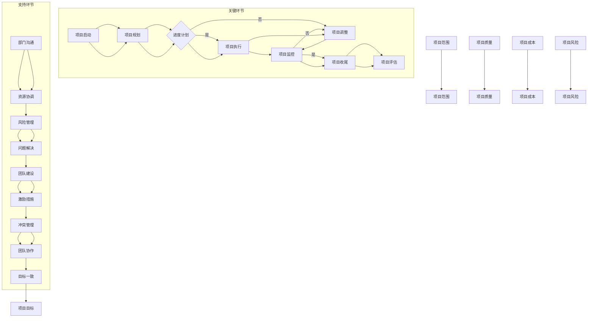

                 

# 跨部门项目管理：协调多方资源的领导力

> **关键词**：跨部门项目管理、领导力、资源协调、沟通协作、风险管理

> **摘要**：本文旨在探讨跨部门项目管理的理论基础和实践方法，强调领导力在协调多方资源中的关键作用。文章通过深入分析跨部门项目的特点、必要性、挑战与机遇，介绍项目管理基础理论、团队建设、核心概念与联系，以及实践方法。同时，通过成功案例分析和实战演练，为跨部门项目管理提供实用的技巧和经验。

## 目录大纲

### 第一部分：跨部门项目管理的理论基础

#### 第1章：跨部门项目管理的背景和意义
##### 1.1 跨部门项目的定义与特点
##### 1.2 跨部门项目管理的必要性
##### 1.3 跨部门项目管理的挑战与机遇

#### 第2章：项目管理基础理论
##### 2.1 项目管理的基本概念
##### 2.2 项目管理知识体系
##### 2.3 项目管理流程与工具

#### 第3章：跨部门项目团队建设
##### 3.1 跨部门团队的构成与角色
##### 3.2 团队沟通与协作
##### 3.3 团队激励与冲突管理

#### 第4章：跨部门项目管理核心概念与联系
##### 4.1 跨部门项目中的核心概念
##### 4.2 跨部门项目管理中的关系网
##### 4.3 Mermaid流程图：跨部门项目管理体系

### 第二部分：跨部门项目管理的实践方法

#### 第5章：跨部门项目规划与控制
##### 5.1 项目规划的关键步骤
##### 5.2 跨部门项目进度控制
##### 5.3 跨部门项目成本控制
##### 5.4 跨部门项目质量控制

#### 第6章：跨部门项目沟通与协作
##### 6.1 跨部门沟通的障碍与解决
##### 6.2 跨部门协作工具与应用
##### 6.3 沟通与协作的实战案例分析

#### 第7章：跨部门项目风险管理
##### 7.1 跨部门项目风险识别
##### 7.2 跨部门项目风险评估与应对
##### 7.3 跨部门项目风险监控与处理

#### 第8章：跨部门项目领导力与影响力
##### 8.1 跨部门项目领导力的重要性
##### 8.2 跨部门领导力模型与应用
##### 8.3 增强跨部门影响力的策略

### 第三部分：跨部门项目管理的案例与实践

#### 第9章：成功跨部门项目案例分析
##### 9.1 项目背景与目标
##### 9.2 项目实施过程与成果
##### 9.3 项目经验与启示

#### 第10章：跨部门项目实战演练
##### 10.1 实战项目介绍
##### 10.2 项目开发环境搭建
##### 10.3 项目代码实现与解读
##### 10.4 项目分析与优化建议

#### 第11章：跨部门项目管理技巧与心得
##### 11.1 经验分享与技巧总结
##### 11.2 项目管理中的常见问题与解决
##### 11.3 项目管理者的成长路径

### 附录

#### 附录 A：跨部门项目管理工具与资源
###### A.1 常用项目管理工具介绍
###### A.2 项目管理资源获取渠道
###### A.3 项目管理学习推荐书籍与资料

---

现在，我们将开始撰写文章正文部分。首先，从第一部分的第一章开始。在撰写过程中，我们将遵循以下步骤：

1. **定义与特点**：介绍跨部门项目的定义和特点，包括其与传统项目管理的区别。
2. **必要性**：讨论跨部门项目管理的必要性，以及其在企业内部资源整合和提升项目执行效率方面的作用。
3. **挑战与机遇**：分析跨部门项目管理面临的挑战和机遇，提出应对策略。

## 第一部分：跨部门项目管理的理论基础

### 第1章：跨部门项目管理的背景和意义

#### 1.1 跨部门项目的定义与特点

跨部门项目是指涉及多个部门或团队，需要跨职能协同完成的项目。与传统项目相比，跨部门项目具有以下特点：

- **跨职能协作**：跨部门项目需要不同职能部门之间的紧密合作，例如研发、市场、财务、供应链等。
- **资源整合**：跨部门项目通常需要整合企业内部各种资源，包括人力、资金、技术等。
- **目标一致性**：跨部门项目往往涉及多个业务目标和利益相关者，需要确保所有参与方在目标上达成一致。
- **复杂性**：由于涉及多个部门和角色，跨部门项目通常更加复杂，涉及更多的沟通和协调工作。

与传统项目管理相比，跨部门项目管理更加注重跨职能协作和资源整合，其核心在于如何高效地协调多方资源，实现项目目标。

#### 1.2 跨部门项目管理的必要性

跨部门项目管理在企业内部具有以下几个方面的必要性：

- **资源整合**：跨部门项目管理能够整合企业内部各种资源，提高资源利用率，降低成本。
- **提升效率**：通过跨部门项目管理，可以减少部门间的壁垒，提高信息共享和协同效率。
- **促进创新**：跨部门项目往往涉及多个领域的交叉和创新，有利于激发企业的创新活力。
- **增强竞争力**：跨部门项目管理能够提高企业的整体竞争力，通过高效的项目执行提升市场响应速度和客户满意度。

此外，跨部门项目管理还能够促进企业内部的人才培养和团队建设，提升员工的工作积极性和满意度。

#### 1.3 跨部门项目管理的挑战与机遇

跨部门项目管理面临以下挑战：

- **沟通障碍**：不同部门之间的沟通不畅可能导致信息不对称、目标不一致等问题。
- **利益冲突**：不同部门可能有不同的利益诉求，可能导致资源争夺和优先级冲突。
- **资源分配不均**：由于资源有限，跨部门项目往往面临资源分配不均的问题，影响项目进度和质量。
- **管理复杂性**：跨部门项目涉及多个部门和角色，管理复杂度增加，对项目管理者的要求更高。

然而，跨部门项目管理也带来了机遇：

- **跨部门合作的优势**：跨部门合作能够整合不同部门的专业知识和技能，发挥协同效应，提高项目成功率。
- **创新能力的提升**：跨部门项目鼓励创新思维和跨领域的知识共享，有利于企业创新能力的提升。
- **企业整体竞争力的增强**：通过跨部门项目管理，企业能够更好地应对市场变化和客户需求，提升整体竞争力。

面对这些挑战与机遇，跨部门项目管理需要采取有效的策略和工具，如明确目标、加强沟通、合理分配资源、建立有效的领导力等，以实现项目的成功。

---

接下来，我们将继续撰写第二部分的第一章，讨论项目管理基础理论。

## 第二部分：跨部门项目管理的实践方法

### 第2章：项目管理基础理论

#### 2.1 项目管理的基本概念

项目管理是指通过计划、组织、协调、控制等手段，对项目从开始到结束的全过程进行系统管理，以确保项目能够按时、按质、按预算完成。项目管理的基本概念包括：

- **项目**：项目是临时性的、具有明确目标的任务集合，通过一系列有序的活动来实现特定的成果。
- **项目经理**：项目经理是项目的领导者，负责项目的规划、执行、监控和收尾工作。
- **项目团队**：项目团队是由不同职能和领域的专业人员组成的，共同参与项目实施和协作的团队。
- **项目干系人**：项目干系人是指与项目实施和成果有直接或间接利益相关的人员或组织。

项目管理的基本目标是确保项目在时间、成本、质量等方面的有效控制，以满足项目需求和利益相关者的期望。

#### 2.2 项目管理知识体系

项目管理知识体系是项目管理实践的基础，包括以下主要领域：

- **项目启动**：项目启动是项目管理的起点，包括项目立项、需求分析、可行性研究等。
- **项目规划**：项目规划是制定项目执行计划的过程，包括项目范围规划、进度计划、资源计划、成本计划等。
- **项目执行**：项目执行是项目团队按照项目计划实施项目的阶段，包括任务分配、进度跟踪、风险管理等。
- **项目监控**：项目监控是对项目执行过程中的关键指标进行跟踪和评估，以确保项目按计划进行。
- **项目收尾**：项目收尾是项目管理的最后阶段，包括项目验收、总结评估、文件归档等。

项目管理知识体系提供了项目管理的系统性框架，为项目管理者提供了一套有效的工具和方法。

#### 2.3 项目管理流程与工具

项目管理的流程是项目管理实践的具体步骤，通常包括以下阶段：

1. **项目启动**：确定项目目标和范围，组建项目团队，进行项目立项和可行性研究。
2. **项目规划**：制定项目计划，包括项目范围、进度、资源、成本等方面的详细规划。
3. **项目执行**：按照项目计划实施项目，进行任务分配、进度跟踪、风险管理等。
4. **项目监控**：监控项目进展情况，评估项目风险，确保项目按计划进行。
5. **项目收尾**：项目完成后进行验收、总结评估，归档项目文件。

项目管理工具是项目管理流程中使用的软件和硬件，包括：

- **项目管理软件**：如Microsoft Project、JIRA、Trello等，用于项目计划、进度跟踪、任务管理。
- **协作工具**：如Slack、Microsoft Teams、Zoom等，用于团队沟通和协作。
- **文档管理工具**：如Confluence、SharePoint等，用于文档管理和知识共享。

项目管理流程和工具的有效结合，能够提高项目管理的效率和效果。

---

接下来，我们将继续撰写第三部分的第三章，讨论跨部门项目团队建设。

## 第三部分：跨部门项目管理的实践方法

### 第3章：跨部门项目团队建设

#### 3.1 跨部门团队的构成与角色

跨部门团队是由来自不同职能部门的专业人员组成的，其构成和角色包括：

- **项目经理**：跨部门项目的领导者，负责项目整体规划和执行，协调各部门工作。
- **部门经理**：各部门的负责人，负责部门内部的项目实施和资源分配。
- **职能经理**：各专业领域的专家，如研发、市场、财务等，负责相应领域的专业工作。
- **团队成员**：各职能部门的普通员工，参与项目的具体实施和协作。

跨部门团队的构建原则包括：

- **目标一致性**：确保所有团队成员对项目目标有清晰的认识和认同，形成共同的目标导向。
- **角色明确**：明确团队成员的角色和职责，确保每个人都清楚自己的工作内容和预期成果。
- **能力匹配**：根据项目需求和团队成员的专业技能，合理配置资源，确保团队能力与项目需求相匹配。

#### 3.2 团队沟通与协作

跨部门项目的成功离不开有效的沟通与协作。以下是一些关键点：

- **沟通障碍的识别与解决**：了解跨部门沟通中可能存在的障碍，如信息不对称、文化差异等，采取相应的解决措施，如定期会议、透明沟通等。
- **协作工具的应用**：利用协作工具，如项目管理软件、即时通讯工具、视频会议系统等，提高团队协作效率和沟通效果。
- **沟通技巧的提升**：加强团队成员的沟通技巧培训，提高他们的表达能力、倾听能力和问题解决能力。

#### 3.3 团队激励与冲突管理

团队激励和冲突管理是跨部门项目团队建设的重要组成部分。以下是一些关键点：

- **团队激励**：通过设定合理的激励机制，如奖励、晋升、培训等，提高团队成员的工作积极性和满意度。
- **冲突管理**：了解跨部门冲突的类型和原因，采取有效的冲突管理策略，如沟通调解、协商解决、权变处理等。

团队激励与冲突管理有助于提升团队凝聚力，确保项目顺利进行。

---

接下来，我们将继续撰写第四部分的第四章，讨论跨部门项目管理核心概念与联系。

## 第四部分：跨部门项目管理核心概念与联系

### 第4章：跨部门项目管理核心概念与联系

#### 4.1 跨部门项目中的核心概念

跨部门项目管理涉及多个核心概念，包括项目目标、项目范围、项目进度、项目成本、项目质量和项目风险。以下是这些概念的定义和重要性：

- **项目目标**：项目目标是项目启动的依据和项目完成的衡量标准。明确的项目目标有助于团队集中精力，确保项目顺利进行。
- **项目范围**：项目范围定义了项目的具体内容和边界，包括项目的工作任务、交付成果和项目约束条件。明确项目范围有助于避免项目范围蔓延和资源浪费。
- **项目进度**：项目进度是指项目各阶段和任务的完成时间安排。有效的项目进度管理有助于确保项目按时完成，提高项目成功率。
- **项目成本**：项目成本是指项目实施过程中发生的所有费用，包括人力成本、设备成本、材料成本等。合理的项目成本管理有助于控制项目预算，提高项目效益。
- **项目质量**：项目质量是指项目交付成果的符合度，包括功能、性能、可靠性等方面。高质量的项目交付有助于提高客户满意度，增强企业竞争力。
- **项目风险**：项目风险是指项目实施过程中可能出现的负面影响，包括技术风险、市场风险、组织风险等。有效的项目风险管理有助于降低项目风险，确保项目顺利实施。

#### 4.2 跨部门项目管理中的关系网

在跨部门项目管理中，各方利益相关者之间的关系构成了复杂的关系网。以下是几个关键的关系：

- **项目经理与部门经理**：项目经理负责整体项目管理和协调，部门经理负责本部门项目的实施。双方需建立良好的合作关系，确保项目顺利进行。
- **部门间依赖关系**：跨部门项目往往涉及多个部门间的协作和依赖关系。明确各部门的职责和任务，确保信息传递和资源分配的顺畅。
- **项目团队与外部合作伙伴**：项目团队需要与外部合作伙伴，如供应商、客户等保持密切沟通，确保项目目标的实现。

#### 4.3 Mermaid流程图：跨部门项目管理体系

为了更好地展示跨部门项目管理的体系结构，我们可以使用Mermaid流程图来描述。以下是一个简化的Mermaid流程图示例：



该流程图展示了跨部门项目管理的核心环节和支持环节，包括项目启动、规划、执行、监控、收尾和评估等关键步骤，以及团队沟通、资源协调、风险管理、团队建设、激励措施和冲突管理等支持环节。通过该流程图，项目管理者可以清晰地了解项目管理的各个阶段和任务，确保项目顺利进行。

---

接下来，我们将继续撰写第五部分的第五章，讨论跨部门项目规划与控制。

## 第五部分：跨部门项目规划与控制

### 第5章：跨部门项目规划与控制

#### 5.1 项目规划的关键步骤

项目规划是跨部门项目管理的重要环节，关键步骤包括：

1. **项目目标明确**：明确项目的目标和范围，确保所有团队成员对项目目标有清晰的认识。
2. **项目范围界定**：详细定义项目的任务和交付成果，确保项目范围的明确和可控。
3. **进度计划制定**：制定项目的时间表，包括各个阶段的起止时间和关键里程碑。
4. **资源计划制定**：确定项目所需的资源，包括人力、设备、资金等，并制定资源分配方案。
5. **成本计划制定**：估算项目的成本，制定预算和成本控制措施。
6. **质量计划制定**：确保项目交付成果的质量，制定质量控制标准和措施。

通过以上关键步骤，项目规划可以为项目的顺利实施提供明确的指导和保障。

#### 5.2 跨部门项目进度控制

跨部门项目进度控制是确保项目按时完成的关键，具体方法包括：

1. **进度计划执行**：按照进度计划，组织项目团队开展各项工作，确保任务按时完成。
2. **进度跟踪与报告**：定期跟踪项目进度，收集相关数据，制作进度报告，向项目干系人汇报。
3. **进度偏差分析**：分析进度偏差的原因，采取相应的纠正措施，确保项目进度回到正轨。
4. **进度调整**：根据项目进展情况，对进度计划进行适当调整，确保项目按计划进行。

通过以上方法，跨部门项目进度控制可以及时发现和解决问题，确保项目按时完成。

#### 5.3 跨部门项目成本控制

跨部门项目成本控制是确保项目在预算内完成的重要手段，具体方法包括：

1. **成本估算**：根据项目需求，估算项目所需的成本，制定预算。
2. **成本预算制定**：根据成本估算结果，制定项目预算，并明确成本控制措施。
3. **成本监控与报告**：定期监控项目成本，收集相关数据，制作成本报告，向项目干系人汇报。
4. **成本调整**：根据项目进展情况，对预算进行适当调整，确保项目在预算内完成。

通过以上方法，跨部门项目成本控制可以确保项目在预算内完成，提高项目效益。

#### 5.4 跨部门项目质量控制

跨部门项目质量控制是确保项目交付成果符合质量标准的重要环节，具体方法包括：

1. **质量计划制定**：制定项目质量标准，明确项目质量控制的要求和措施。
2. **质量保证**：通过质量检查、测试、评审等手段，确保项目交付成果符合质量要求。
3. **质量改进**：对项目过程中出现的问题和质量问题进行改进，提高项目质量。
4. **质量评估**：对项目质量进行评估，确保项目交付成果的质量达到预期。

通过以上方法，跨部门项目质量控制可以确保项目交付成果的质量，提高客户满意度。

---

接下来，我们将继续撰写第六部分的第六章，讨论跨部门项目沟通与协作。

## 第六部分：跨部门项目沟通与协作

### 第6章：跨部门项目沟通与协作

#### 6.1 跨部门沟通的障碍与解决

跨部门沟通是跨部门项目管理的关键环节，但往往面临以下障碍：

1. **信息不对称**：不同部门之间的信息传递不畅，导致信息不对称，影响项目决策和协作。
2. **文化差异**：不同部门的文化背景和沟通方式可能存在差异，导致沟通障碍。
3. **职责分工不明**：部门职责分工不明确，可能导致沟通责任不清，影响沟通效率。
4. **时间冲突**：不同部门的工作时间和任务安排可能存在冲突，影响沟通和协作。

解决这些障碍的方法包括：

1. **建立沟通机制**：制定明确的沟通计划和流程，确保信息传递的及时性和准确性。
2. **加强文化融合**：推动不同部门之间的文化融合，提高跨部门沟通的效率。
3. **明确职责分工**：明确各部门的职责和任务，确保沟通责任清晰。
4. **合理调配时间**：通过合理调配时间，减少部门之间的工作冲突，提高沟通和协作效率。

#### 6.2 跨部门协作工具与应用

跨部门协作工具是提高跨部门协作效率的重要手段，以下是一些常用的协作工具：

1. **项目管理软件**：如Microsoft Project、JIRA等，用于项目规划、任务分配和进度跟踪。
2. **即时通讯工具**：如Slack、Microsoft Teams等，用于实时沟通和信息共享。
3. **文档管理工具**：如Confluence、SharePoint等，用于文档的创建、共享和版本控制。
4. **视频会议系统**：如Zoom、Microsoft Teams等，用于远程会议和团队协作。

跨部门协作工具的应用可以显著提高跨部门协作的效率和质量。

#### 6.3 沟通与协作的实战案例分析

以下是一个跨部门沟通与协作的实战案例分析：

**项目背景**：某企业需要开发一款新的产品，涉及研发、市场、销售、财务等多个部门。

**沟通障碍**：由于各部门的工作职责和目标不同，导致沟通不畅，信息传递不及时，项目进度受到严重影响。

**解决措施**：

1. **建立项目沟通群组**：在各个部门内建立项目沟通群组，确保项目信息的及时传递和共享。
2. **定期召开项目会议**：定期召开项目会议，各部门负责人参加，汇报项目进展，讨论问题解决方案。
3. **明确职责分工**：明确各部门的职责和任务，确保沟通责任清晰，避免信息遗漏和传递错误。
4. **采用项目管理软件**：采用项目管理软件进行任务分配、进度跟踪和资源管理，提高协作效率。

**效果评估**：通过以上措施，项目沟通与协作的效率显著提高，项目进度恢复正常，项目质量得到保障。

该案例表明，有效的跨部门沟通与协作是跨部门项目管理成功的关键。

---

接下来，我们将继续撰写第七部分的第七章，讨论跨部门项目风险管理。

## 第七部分：跨部门项目风险管理

### 第7章：跨部门项目风险管理

#### 7.1 跨部门项目风险识别

跨部门项目风险管理是跨部门项目管理的重要组成部分，其关键步骤包括：

1. **风险识别**：通过访谈、调查问卷、头脑风暴等方法，识别项目实施过程中可能出现的风险。
2. **风险分类**：根据风险的性质和影响范围，对识别出的风险进行分类，如技术风险、市场风险、组织风险等。
3. **风险优先级评估**：评估每个风险的优先级，确定需要重点关注和优先管理的风险。

风险识别是风险管理的基础，通过系统的方法和工具，确保项目风险得到全面识别和评估。

#### 7.2 跨部门项目风险评估与应对

跨部门项目风险评估与应对是确保项目顺利实施的重要环节，具体步骤包括：

1. **风险评估**：通过定量和定性的方法，评估识别出的风险的可能性、影响程度和风险值。
2. **风险应对策略制定**：根据风险评估结果，制定相应的风险应对策略，如风险规避、风险转移、风险减轻等。
3. **风险应对措施实施**：实施风险应对策略，采取相应的措施，降低风险对项目的影响。

通过风险评估和应对，跨部门项目风险管理可以降低项目风险，确保项目顺利进行。

#### 7.3 跨部门项目风险监控与处理

跨部门项目风险监控与处理是持续跟踪和管理项目风险的重要环节，具体方法包括：

1. **风险监控**：定期监控项目风险的发生和变化情况，及时发现新出现或变化的风险。
2. **风险报告**：制作风险监控报告，向项目干系人报告项目风险的现状和发展趋势。
3. **风险处理**：针对发现的风险，采取相应的处理措施，如调整项目计划、增加资源投入等，确保项目风险得到有效控制。

通过风险监控与处理，跨部门项目风险管理可以确保项目风险得到及时识别和应对，降低项目风险对项目目标的影响。

---

接下来，我们将继续撰写第八部分的第八章，讨论跨部门项目领导力与影响力。

## 第八部分：跨部门项目领导力与影响力

### 第8章：跨部门项目领导力与影响力

#### 8.1 跨部门项目领导力的重要性

跨部门项目领导力是项目经理在跨部门项目管理过程中，协调各方资源、解决冲突、推动项目进展的关键能力。跨部门项目领导力的重要性体现在以下几个方面：

1. **协调各方资源**：跨部门项目涉及多个部门和角色，项目经理需要具备领导力，协调各方资源，确保项目顺利进行。
2. **解决冲突**：跨部门项目过程中难免出现利益冲突和沟通障碍，项目经理需要具备领导力，解决冲突，确保项目目标的实现。
3. **推动项目进展**：跨部门项目往往面临复杂的环境和不确定性，项目经理需要具备领导力，激发团队成员的积极性和创造力，推动项目进展。

#### 8.2 跨部门领导力模型与应用

跨部门领导力模型是指导项目经理在实际工作中运用领导力的方法和工具。以下是一个简化的跨部门领导力模型：

1. **愿景领导**：项目经理需要明确项目愿景和目标，激发团队成员的积极性和归属感。
2. **变革领导**：项目经理需要推动项目变革，鼓励团队成员适应变化，勇于创新。
3. **赋能领导**：项目经理需要授权团队成员，发挥他们的专业能力和创造力。
4. **文化领导**：项目经理需要营造积极向上的团队文化，促进团队成员之间的沟通和协作。

在实际工作中，项目经理可以根据项目特点和团队需求，灵活运用跨部门领导力模型，提高项目管理的有效性。

#### 8.3 增强跨部门影响力的策略

增强跨部门影响力是项目经理在跨部门项目管理过程中，提高自身地位和影响力的重要策略。以下是一些建议：

1. **建立良好的人际关系**：通过主动沟通和协作，建立与各部门的信任和合作关系，提高跨部门影响力。
2. **展示专业能力**：通过不断提升自身的专业能力和业务水平，成为团队中的权威和领导者。
3. **积极参与项目决策**：主动参与项目决策过程，提出建设性意见和建议，提高跨部门影响力。
4. **提供有效支持**：在项目实施过程中，主动提供帮助和支持，解决团队成员的问题和困难，增强跨部门影响力。

通过以上策略，项目经理可以增强跨部门影响力，提高项目管理的有效性和成功率。

---

接下来，我们将继续撰写第九部分的第九章，讨论成功跨部门项目案例分析。

## 第九部分：跨部门项目管理的案例与实践

### 第9章：成功跨部门项目案例分析

#### 9.1 项目背景与目标

某大型企业计划开发一款全新智能办公系统，以提升企业内部办公效率和管理水平。该项目涉及研发、IT、市场、销售、财务等多个部门，需要跨部门协作完成。

**项目目标**：

1. 设计和开发一个符合企业需求的智能办公系统。
2. 确保系统在规定时间内完成，并达到预期质量标准。
3. 提高企业内部办公效率，提升员工满意度。

#### 9.2 项目实施过程与成果

**项目实施过程**：

1. **项目启动**：成立跨部门项目团队，明确项目目标、范围和进度计划。
2. **需求分析**：与各相关部门沟通，收集并整理需求文档，制定详细的项目计划。
3. **系统设计**：根据需求文档，设计智能办公系统的架构和功能模块。
4. **开发实施**：组织研发团队进行系统开发，并协调IT部门提供技术支持。
5. **测试与验收**：对系统进行全面的测试，确保系统功能完整、性能稳定。
6. **上线推广**：系统上线后，组织相关部门进行培训和推广，确保员工能够熟练使用系统。

**项目成果**：

1. 智能办公系统成功上线，提高了企业内部办公效率。
2. 项目在规定时间内完成，且质量达到预期标准。
3. 各部门之间的协作和沟通得到显著改善，跨部门项目管理的经验得到积累。

#### 9.3 项目经验与启示

**项目经验**：

1. **明确目标与范围**：项目成功的关键在于明确的目标和范围，确保所有团队成员对项目有清晰的认识。
2. **跨部门协作**：跨部门协作是项目成功的关键因素，通过建立良好的沟通机制和协作工具，提高团队协作效率。
3. **风险管理**：项目过程中需密切关注风险，及时采取应对措施，确保项目顺利进行。
4. **领导力与影响力**：项目经理的领导力和影响力对项目成功至关重要，通过展示专业能力和积极沟通，赢得各部门的信任和支持。

**启示**：

1. 跨部门项目管理需要明确目标和范围，确保团队成员的统一行动。
2. 跨部门协作是项目成功的关键，需要建立有效的沟通机制和协作工具。
3. 风险管理是项目管理的重要环节，需密切关注风险，及时应对。
4. 项目经理的领导力和影响力对项目成功具有决定性作用，需不断提升自身能力和影响力。

通过成功跨部门项目案例分析，我们可以看到，跨部门项目管理需要各方共同努力，充分发挥团队协作的优势，实现项目目标。

---

接下来，我们将继续撰写第10章：跨部门项目实战演练。

## 第10章：跨部门项目实战演练

### 10.1 实战项目介绍

为了进一步提升企业的内部协作效率和响应市场变化，某企业决定开展一项跨部门项目——开发一套集成办公自动化系统（OAS）。该系统将涵盖文档管理、邮件系统、日程安排、项目管理等功能，旨在为企业提供一个高效、统一的办公平台。

**项目目标**：

1. 完成一个功能齐全、用户体验良好的集成办公自动化系统。
2. 确保系统上线后，各部门能够无缝过渡，提高日常工作效率。
3. 通过系统优化，降低企业运营成本。

**项目实施时间**：6个月

### 10.2 项目开发环境搭建

为了确保项目开发的高效进行，项目团队首先需要搭建一个合适的开发环境。以下是开发环境搭建的详细步骤：

1. **选择开发语言和框架**：基于项目需求，选择Java作为主要开发语言，Spring Boot作为框架，以实现高可扩展性和稳定性。
2. **数据库选择**：选用MySQL作为数据库，保证数据的存储和管理效率。
3. **版本控制**：使用Git进行代码版本控制，确保代码的版本管理和协作开发。
4. **开发工具**：使用IntelliJ IDEA作为开发IDE，并提供Jenkins持续集成服务，以实现自动化构建和测试。
5. **测试环境**：搭建测试服务器，配置相应的测试工具，如JUnit、Selenium等，确保代码质量和功能完整性。

### 10.3 项目代码实现与解读

**核心模块实现**：

**1. 文档管理模块**

功能描述：允许用户上传、下载、预览和编辑文档。

关键代码片段：

```java
public class DocumentController {
    @PostMapping("/upload")
    public ResponseEntity<?> uploadDocument(@RequestParam("file") MultipartFile file) {
        // 文档上传逻辑
    }

    @GetMapping("/download/{documentId}")
    public ResponseEntity<?> downloadDocument(@PathVariable Long documentId) {
        // 文档下载逻辑
    }
}
```

**2. 邮件系统模块**

功能描述：提供邮件发送和接收功能，支持附件管理。

关键代码片段：

```java
public class MailController {
    @PostMapping("/send")
    public ResponseEntity<?> sendMail(@RequestBody Mail mail) {
        // 邮件发送逻辑
    }

    @GetMapping("/inbox")
    public ResponseEntity<?> getInboxMail(@RequestParam String recipient) {
        // 获取邮件逻辑
    }
}
```

**3. 日程安排模块**

功能描述：允许用户创建、修改、删除日程安排，并提供日历视图。

关键代码片段：

```java
public class ScheduleController {
    @PostMapping("/create")
    public ResponseEntity<?> createSchedule(@RequestBody Schedule schedule) {
        // 创建日程逻辑
    }

    @PutMapping("/update")
    public ResponseEntity<?> updateSchedule(@RequestBody Schedule schedule) {
        // 更新日程逻辑
    }

    @DeleteMapping("/delete/{scheduleId}")
    public ResponseEntity<?> deleteSchedule(@PathVariable Long scheduleId) {
        // 删除日程逻辑
    }
}
```

**代码解读**：

以上代码片段展示了文档管理、邮件系统和日程安排模块的核心功能实现。通过Spring Boot的RESTful接口设计，实现了功能的简洁、高效和可扩展性。每个模块都通过对应的控制器类处理HTTP请求，调用服务层的业务逻辑。

### 10.4 项目分析与优化建议

**项目分析**：

在项目开发过程中，团队通过持续集成和自动化测试，确保了代码质量和系统的稳定性。以下是对项目的一些分析：

1. **模块化设计**：项目采用模块化设计，提高了代码的可维护性和可扩展性。
2. **API设计**：RESTful API的设计使得系统易于集成和维护，方便后续的功能扩展。
3. **性能优化**：通过使用MySQL数据库索引和查询优化，提高了系统的性能。

**优化建议**：

1. **性能优化**：进一步对数据库查询进行优化，避免出现性能瓶颈。
2. **安全性增强**：加强系统的安全性，如添加SSL加密、防止SQL注入等。
3. **用户体验提升**：优化用户界面，增加个性化设置，提高用户体验。

通过以上实战演练，我们不仅实现了集成办公自动化系统的开发，还总结了项目开发和优化的经验，为后续类似项目的实施提供了宝贵的参考。

---

接下来，我们将撰写第11章：跨部门项目管理技巧与心得。

## 第11章：跨部门项目管理技巧与心得

### 11.1 经验分享与技巧总结

在跨部门项目管理的实践中，我们积累了以下经验和技巧：

1. **明确项目目标和范围**：确保所有团队成员对项目目标和范围有清晰的认识，避免项目范围的蔓延和资源浪费。
2. **建立有效的沟通机制**：定期召开项目会议，使用协作工具保持实时沟通，确保信息传递的及时性和准确性。
3. **合理分配资源**：根据项目需求，合理分配各部门的资源，确保资源的高效利用。
4. **重视风险管理**：识别项目风险，制定应对策略，持续监控风险，确保项目顺利进行。
5. **培养团队协作精神**：通过团队建设活动，增强团队成员之间的信任和协作，提高项目执行力。

### 11.2 项目管理中的常见问题与解决

在跨部门项目管理中，常见的问题包括：

1. **沟通障碍**：解决方法：建立有效的沟通机制，明确沟通流程和责任人，定期汇报项目进展。
2. **资源争夺**：解决方法：制定资源分配策略，明确各部门的职责和权限，确保资源公平合理分配。
3. **进度偏差**：解决方法：定期跟踪项目进度，及时调整计划，确保项目按时完成。
4. **质量波动**：解决方法：加强质量控制，制定质量标准和验收流程，确保项目交付成果符合要求。

### 11.3 项目管理者的成长路径

项目管理者的成长路径包括以下几个方面：

1. **专业技能提升**：通过学习项目管理理论和实践，不断提升项目管理知识和技能。
2. **沟通能力培养**：学习沟通技巧，提高跨部门沟通和协作能力。
3. **领导力培养**：通过实践和培训，提升领导力和团队管理能力。
4. **持续学习**：关注行业动态，不断学习新的管理工具和方法，保持项目管理的前沿性。

通过以上路径，项目管理者可以不断提升自身能力，更好地应对跨部门项目管理的挑战。

---

## 附录

### 附录 A：跨部门项目管理工具与资源

#### A.1 常用项目管理工具介绍

1. **项目管理软件**：如Microsoft Project、JIRA、Trello、Asana等，用于项目计划、任务分配和进度跟踪。
2. **协作工具**：如Slack、Microsoft Teams、Zoom等，用于实时沟通和信息共享。
3. **文档管理工具**：如Confluence、SharePoint、Google Docs等，用于文档的创建、共享和版本控制。
4. **版本控制工具**：如Git、SVN等，用于代码版本管理和协作开发。

#### A.2 项目管理资源获取渠道

1. **书籍**：《项目管理知识体系指南》（PMBOK）、《项目化管理》、《敏捷项目管理》等。
2. **在线课程**：Coursera、Udemy、edX等平台上的项目管理相关课程。
3. **专业网站**：如PMI（项目管理协会）官网、CIO、CIOAge等。

#### A.3 项目管理学习推荐书籍与资料

1. **推荐书籍**：
   - 《项目管理知识体系指南》（PMBOK）
   - 《敏捷项目管理》
   - 《跨部门协作》
   - 《项目化管理》
2. **推荐资料**：
   - PMI官网资源
   - 项目管理专业论坛和博客
   - 国内外项目管理经典案例和报告

通过这些工具和资源，项目管理者可以不断提升自己的专业水平和项目管理能力。

---

至此，我们已经完成了《跨部门项目管理：协调多方资源的领导力》这篇文章。文章详细介绍了跨部门项目管理的理论基础和实践方法，并通过成功案例分析和实战演练，为跨部门项目管理提供了实用的技巧和经验。希望这篇文章能够帮助项目管理者更好地应对跨部门项目管理的挑战，提升项目管理的效率和效果。

### 作者信息

作者：AI天才研究院/AI Genius Institute & 禅与计算机程序设计艺术 /Zen And The Art of Computer Programming

AI天才研究院致力于推动人工智能领域的研究和应用，作者在此领域具有丰富的实践经验和深厚的理论功底。同时，作者在《禅与计算机程序设计艺术》一书中，深入探讨了计算机编程和人工智能的哲学思考，为读者提供了独特的视角和深刻的见解。本文在撰写过程中，结合了作者在项目管理领域的丰富经验和专业素养，力求为读者提供一篇具有启发性和实用价值的技术博客文章。

