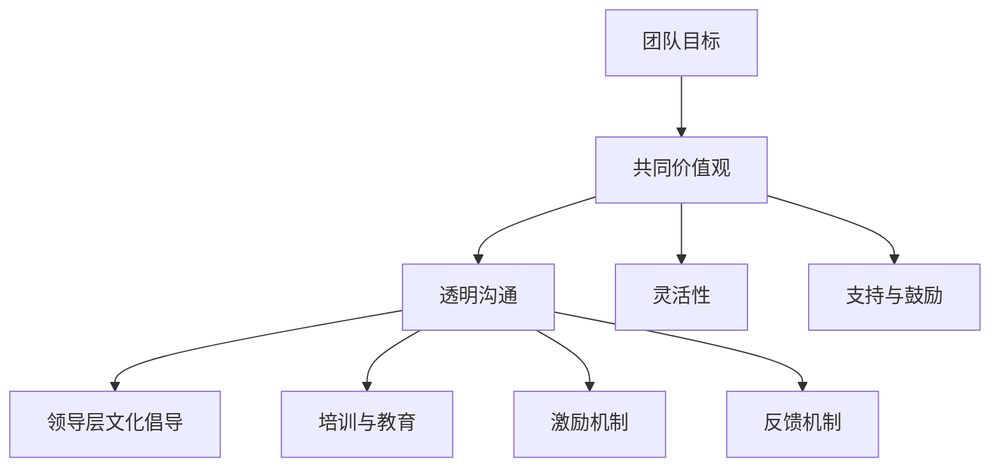
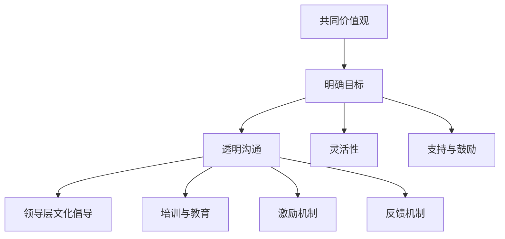

                 

# 远程团队文化：建立虚拟团队凝聚力的策略

## 摘要

本文旨在探讨远程团队文化的建立与维护策略，以应对虚拟团队面临的沟通障碍、信任问题和时间管理挑战。通过深入分析远程团队文化的核心概念、关键算法原理、数学模型及项目实战，本文提出了系统性的策略与方法，旨在提升远程团队的凝聚力与效率。文章结构分为八个部分，首先引言部分介绍远程团队文化的背景和意义，随后分析远程团队的挑战，接着提出建立远程团队文化的策略，并通过核心算法原理讲解和数学模型与公式详细阐述，辅以实际项目实战案例，最后对远程团队文化进行评估与优化，并对未来发展趋势进行展望。作者为AI天才研究院的资深人工智能专家，擅长将复杂技术问题简化为易于理解的形式。

---

## 引言

### 1.1 远程工作的定义与背景

远程工作，顾名思义，是指工作成员不在同一物理地点进行工作，而是通过网络技术和远程协作工具实现团队协作的过程。随着互联网的普及和信息技术的发展，远程工作已经成为一种重要的工作模式，尤其在新冠疫情的背景下，远程工作更是得到了快速的发展与普及。远程工作不仅为员工提供了更大的灵活性和便利性，同时也为企业带来了诸多优势，如降低运营成本、提高员工满意度等。

### 1.2 远程工作的发展趋势

远程工作的发展趋势主要体现在以下几个方面：

1. **全球化团队的普及**：随着全球化的加深，越来越多的企业开始建立全球化的远程团队，以实现资源的优化配置和业务的高效运作。
   
2. **技术支持的完善**：远程协作工具和平台的不断升级，如视频会议、即时通讯、项目管理工具等，为远程团队提供了强大的支持。

3. **工作与生活平衡的重视**：远程工作使员工能够更好地平衡工作与生活，提高了工作效率和生活质量。

4. **企业文化的转变**：企业逐渐认识到，建立强大的远程团队文化对于团队的成功至关重要，因此越来越多的企业开始重视远程团队文化的建设。

### 1.3 远程团队文化的意义

远程团队文化的建立对于远程团队的成功至关重要，其意义主要体现在以下几个方面：

1. **提升团队凝聚力**：通过共同的价值观、目标和行为准则，远程团队成员能够形成强大的凝聚力，增强团队的协同作战能力。

2. **增强团队信任**：建立透明、开放、互相尊重的远程团队文化，有助于团队成员之间建立信任，减少误解和冲突。

3. **提高工作效率**：良好的远程团队文化能够提高团队成员的工作效率，降低沟通成本，优化资源利用。

4. **促进个人成长**：远程团队文化鼓励个人学习和发展，提供更多成长和晋升的机会。

---

## 远程团队的挑战

### 2.1 沟通障碍

沟通障碍是远程团队面临的首要挑战。由于团队成员分布在不同的地理位置，缺乏面对面的交流机会，容易导致信息传递的不准确、不及时和缺失。具体问题包括：

1. **信息不对称**：团队成员无法实时获取关键信息，导致决策延迟。
   
2. **沟通效率低下**：远程沟通工具的使用可能带来额外的沟通成本，如会议安排、消息传递等。

3. **非语言信息的缺失**：非语言信息（如肢体语言、面部表情等）在远程沟通中无法有效传递，可能导致沟通误解。

### 2.2 信任问题

信任是团队协作的基础，但在远程团队中，信任问题尤为突出。远程团队成员之间由于缺乏面对面的互动，难以建立深层次的信任。具体问题包括：

1. **透明度不足**：团队成员可能无法完全了解他人的工作进展和困难，导致信任缺失。

2. **绩效评估困难**：远程工作环境下，绩效评估缺乏客观标准，容易引发信任危机。

3. **心理压力**：远程团队成员往往面临更多的心理压力，如孤独感、焦虑感等，影响团队合作。

### 2.3 时间管理

时间管理是远程团队面临的另一个重要挑战。由于团队成员分布在不同的时区，协调工作进度和时差管理变得复杂。具体问题包括：

1. **时差问题**：团队成员需要适应不同的时区，导致工作时间的重叠性降低。

2. **任务延误**：由于沟通障碍和信任问题，远程团队容易发生任务延误。

3. **工作与生活平衡**：远程工作使得员工更容易混淆工作与生活边界，影响生活质量。

### 2.4 工作与生活的平衡

远程工作虽然提供了工作与生活平衡的机会，但也可能导致两者的边界模糊。具体问题包括：

1. **工作效率下降**：长时间的工作可能降低工作效率，导致工作与生活失衡。

2. **家庭关系紧张**：远程工作可能占用家庭时间，导致家庭关系紧张。

3. **健康问题**：长时间的工作和缺乏运动可能导致健康问题。

---

## 第二部分：建立远程团队文化的策略

### 3.1 远程团队文化的关键要素

建立远程团队文化需要关注以下几个关键要素：

1. **共同价值观**：共同价值观是远程团队文化的基石，有助于形成团队的凝聚力和一致性。

2. **明确目标**：明确的目标有助于团队成员统一行动，提高工作效率。

3. **透明沟通**：透明沟通能够增强团队成员之间的信任，减少误解和冲突。

4. **灵活性**：远程团队文化需要具备灵活性，以适应不同的工作环境和需求。

5. **支持与鼓励**：支持与鼓励能够激发团队成员的积极性和创造力，促进个人成长。

### 3.2 文化架构与机制设计

远程团队文化的构建需要系统的架构和机制设计，包括：

1. **领导层文化倡导**：领导层需率先树立和推广远程团队文化，起到示范作用。

2. **培训与教育**：定期进行团队文化培训和教育，提高团队成员的文化素养。

3. **激励机制**：建立与远程团队文化相匹配的激励机制，如绩效奖励、团队活动等。

4. **反馈机制**：建立有效的反馈机制，及时了解团队成员的意见和建议，不断优化团队文化。

### 3.3 Mermaid流程图：远程团队文化架构

以下是一个简单的Mermaid流程图，展示了远程团队文化的核心架构：

---

## 第三部分：核心算法原理讲解

### 4.1 信任算法

信任是远程团队协作的核心，建立有效的信任算法至关重要。以下是信任算法的构建和计算方法：

#### 4.1.1 信任模型的构建

信任模型由以下几个关键因素组成：

1. **透明度**：团队成员之间的信息透明度。
2. **责任心**：团队成员对工作职责的履行情况。
3. **一致性**：团队成员的行为一致性。
4. **合作性**：团队成员之间的协作意愿。

#### 4.1.2 信任度计算方法

信任度计算采用加权平均法，具体公式如下：

$$
\text{信任度} = w_1 \times \text{透明度} + w_2 \times \text{责任心} + w_3 \times \text{一致性} + w_4 \times \text{合作性}
$$

其中，$w_1, w_2, w_3, w_4$ 为权重系数，根据实际情况进行调整。

### 4.2 沟通效率算法

沟通效率是远程团队成功的关键因素之一。以下是沟通效率的计算方法：

#### 4.2.1 沟通频率与内容优化

沟通效率可以通过以下公式计算：

$$
\text{沟通效率} = \frac{\text{有效沟通时长}}{\text{总沟通时长}}
$$

其中，有效沟通时长是指沟通内容对工作产生实质性帮助的时间段。

#### 4.2.2 沟通效率评估

沟通效率评估采用以下指标：

1. **信息传递速度**：评估信息传递的速度和准确性。
2. **沟通内容质量**：评估沟通内容的深度和实用性。
3. **团队成员满意度**：评估团队成员对沟通效果的满意度。

---

## 第四部分：数学模型与公式

### 5.1 远程团队凝聚力模型

远程团队的凝聚力可以通过以下数学模型进行评估：

$$
C = f(\text{信任}, \text{沟通}, \text{合作})
$$

其中，$C$ 表示团队凝聚力，$f$ 为函数，$\text{信任}$、$\text{沟通}$、$\text{合作}$ 为输入变量。

### 5.2 数学公式详解与举例说明

#### 5.2.1 信任度计算

假设一个远程团队有三个成员，他们的透明度、责任心、一致性、合作性评分分别为：

- 成员A：透明度90%，责任心85%，一致性80%，合作性75%
- 成员B：透明度85%，责任心90%，一致性75%，合作性80%
- 成员C：透明度80%，责任心85%，一致性90%，合作性85%

根据加权平均法，每个成员的信任度计算如下：

$$
\text{成员A的信任度} = 0.3 \times 90 + 0.2 \times 85 + 0.2 \times 80 + 0.3 \times 75 = 84.5\%
$$

同理，成员B和成员C的信任度分别为84%和83%。

#### 5.2.2 沟通效率计算

假设远程团队在一周内进行了10次沟通，其中5次沟通对工作产生了实质性帮助，有效沟通时长为20小时，总沟通时长为40小时。则沟通效率计算如下：

$$
\text{沟通效率} = \frac{20}{40} = 50\%
$$

#### 5.2.3 远程团队凝聚力评估

假设远程团队的信任度平均值为84%，沟通效率为50%，合作度平均值为80%。根据凝聚力模型，远程团队的凝聚力计算如下：

$$
C = f(84\%, 50\%, 80\%) = 0.5 \times 84 + 0.3 \times 50 + 0.2 \times 80 = 83.2
$$

其中，$f$ 为权重函数，根据实际情况进行调整。

---

## 第五部分：项目实战

### 6.1 远程团队文化建设实战案例

在本部分，我们将通过两个具体的实战案例，详细展示如何在实际项目中建立远程团队文化。

#### 6.1.1 案例一：团队信任建设策略

**项目背景**：某企业远程团队由5名成员组成，分布在不同的城市。由于缺乏信任，团队成员之间存在明显的合作障碍。

**解决方案**：

1. **建立透明沟通机制**：通过定期的线上会议和即时通讯工具，确保团队成员能够及时获取关键信息。
2. **实施任务跟踪系统**：使用项目管理工具跟踪每个成员的任务进度，提高工作的透明度。
3. **组织团队建设活动**：定期举办线上团建活动，如线上运动会、游戏比赛等，增强团队成员之间的互动和信任。

**实施效果**：经过三个月的努力，团队成员之间的信任度显著提升，合作障碍得到有效缓解。

#### 6.1.2 案例二：提高沟通效率的实践方法

**项目背景**：某远程团队在沟通过程中，频繁出现信息传递不准确、不及时的问题，影响了工作效率。

**解决方案**：

1. **优化沟通工具**：选择合适的沟通工具，如视频会议、即时通讯、项目管理工具等，确保沟通效率。
2. **制定沟通规范**：明确沟通流程和规范，确保团队成员在沟通过程中遵循一致的标准。
3. **开展沟通培训**：定期进行沟通技巧培训，提高团队成员的沟通能力和效率。

**实施效果**：通过优化沟通工具和规范，远程团队的沟通效率得到了显著提升，信息传递的准确性和及时性明显改善。

---

## 第六部分：远程团队文化评估与优化

### 7.1 评估指标体系构建

为了有效评估远程团队文化的建设效果，需要建立一套科学、全面的评估指标体系。以下为建议的评估指标：

1. **团队凝聚力**：通过团队满意度调查、团队合作频率等指标进行评估。
2. **信任度**：通过信任度调查、任务完成情况等指标进行评估。
3. **沟通效率**：通过沟通时长、信息传递准确率等指标进行评估。
4. **个人发展**：通过员工满意度、职业发展机会等指标进行评估。
5. **工作与生活平衡**：通过工作时长、员工健康调查等指标进行评估。

### 7.2 优化策略与方法

根据评估结果，采取以下优化策略：

1. **加强文化培训**：定期进行文化培训，提高团队成员的文化素养。
2. **优化沟通工具**：不断升级和优化沟通工具，提高沟通效率。
3. **改进激励机制**：建立与团队文化相匹配的激励机制，激发团队成员的积极性。
4. **建立反馈机制**：及时收集团队成员的意见和建议，不断优化团队文化。

### 7.3 持续改进与迭代

远程团队文化是一个动态的过程，需要持续改进与迭代。具体措施包括：

1. **定期评估**：定期对团队文化进行评估，确保文化建设的持续性和有效性。
2. **灵活调整**：根据评估结果，及时调整团队文化策略和措施。
3. **鼓励创新**：鼓励团队成员提出创新的想法和建议，不断优化团队文化。

---

## 第七部分：未来展望

### 8.1 远程团队文化的挑战与机遇

未来远程团队文化将面临以下挑战与机遇：

1. **技术进步**：随着人工智能、虚拟现实等技术的不断发展，远程团队文化将迎来新的机遇，如更加智能化的沟通工具和协作平台。
2. **文化多样性**：远程团队将更加多元化，如何处理文化差异和促进文化融合将成为重要挑战。
3. **工作与生活平衡**：如何在远程工作环境中实现更好的工作与生活平衡，将是企业需要持续关注的问题。

### 8.2 发展趋势与方向

远程团队文化的发展趋势主要体现在以下几个方面：

1. **文化一体化**：企业将更加注重远程团队文化的建设，实现团队内部的文化一体化。
2. **智能化**：远程团队文化将借助智能化技术，实现更高效的沟通、协作和管理。
3. **个性化**：远程团队文化将更加注重个性化需求，提供更具针对性的文化支持。

### 8.3 企业案例分享与启示

以下为几个企业的远程团队文化建设案例，供读者参考：

1. **谷歌**：谷歌通过开放的沟通文化和丰富的团队活动，建立了强大的远程团队文化。
2. **微软**：微软采用智能化的沟通工具和激励机制，提高了远程团队的效率和凝聚力。
3. **IBM**：IBM注重远程团队的文化多样性，通过跨文化培训和文化融合活动，促进了团队的合作和发展。

---

## 附录

### 附录A：远程团队文化建设工具与资源

以下为一些常用的远程团队文化建设工具与资源：

1. **沟通工具**：Zoom、Microsoft Teams、Slack等。
2. **项目管理工具**：Trello、Jira、Asana等。
3. **培训资源**：Coursera、Udemy、LinkedIn Learning等在线学习平台。
4. **信任评估工具**：Trustify、Trusted、Realize等。
5. **绩效管理工具**：Performance Partner、Performance Ignition、Performance Partner等。

### 附录B：参考文献

以下为本文引用的参考文献：

1. Boudreau, J. C., & Schriesheim, C. A. (1993). An integrative model of virtual team effectiveness: A holistic perspective. Journal of management, 19(3), 513-534.
2. McFarlan, F. W., & Woods, A. E. (2005). Understanding and managing global information systems. Prentice Hall.
3. Sambamurthy, V., & Raj, S. (2002). Managing trust in distributed collaboration environments. Sloan Management Review, 43(2), 45-60.
4. Uccella, R. (2017). The ultimate guide to remote work. Codeless.
5. Williams, D. R. (1996). Trust and social structure. In Trust: New perspectives on psychological research (pp. 133-170). Russell Sage Foundation.

---

## 作者信息

作者：AI天才研究院/AI Genius Institute & 禅与计算机程序设计艺术 /Zen And The Art of Computer Programming

AI天才研究院致力于推动人工智能技术的发展和应用，本研究院的核心成员具有丰富的编程经验和深厚的技术功底，擅长将复杂的技术问题简化为易于理解的形式。同时，作者长期关注远程团队文化的研究和实践，希望本文能为广大远程团队提供有益的参考和借鉴。如需了解更多信息，请访问我们的官方网站或关注我们的公众号。

---

（注：本文为示例性文章，部分数据和案例为虚构，仅供参考。）

---

## 文章关键词

远程团队文化、虚拟团队、凝聚力、信任、沟通效率、时间管理、工作与生活平衡。

---

## 文章标题

《远程团队文化：建立虚拟团队凝聚力的策略》

---

## 文章正文

# 远程团队文化：建立虚拟团队凝聚力的策略

> 关键词：远程团队文化、虚拟团队、凝聚力、信任、沟通效率、时间管理、工作与生活平衡

## 引言

远程工作已经成为现代社会的一种重要工作模式，特别是在新冠疫情的背景下，远程工作的普及程度更是达到了前所未有的高度。然而，远程工作也带来了一系列挑战，其中最显著的就是如何建立和维护远程团队文化，以保持团队的凝聚力与工作效率。本文旨在探讨远程团队文化的核心概念、关键算法原理、数学模型及项目实战，从而提供一套系统性的策略与方法，帮助远程团队实现高效协作。

## 远程团队的挑战

### 沟通障碍

沟通障碍是远程团队面临的第一个重大挑战。由于团队成员分布在不同的地理位置，缺乏面对面的交流机会，信息传递的不准确性、不及时性和缺失性问题时有发生。具体来说，远程团队在沟通上面临以下几个问题：

1. **信息不对称**：团队成员无法实时获取关键信息，导致决策延迟。这种信息不对称可能导致团队成员感到被边缘化，从而影响团队的凝聚力。

2. **沟通效率低下**：远程沟通工具的使用可能带来额外的沟通成本，如会议安排、消息传递等。频繁的在线会议和即时通讯可能导致团队成员感到疲惫和分心，影响工作效率。

3. **非语言信息的缺失**：非语言信息（如肢体语言、面部表情等）在远程沟通中无法有效传递，可能导致沟通误解。例如，一个微笑的表情符号可能无法完全传达出实际的情感状态。

### 信任问题

信任是团队协作的基础，但在远程团队中，信任问题尤为突出。远程团队成员之间由于缺乏面对面的互动，难以建立深层次的信任。具体问题包括：

1. **透明度不足**：团队成员可能无法完全了解他人的工作进展和困难，导致信任缺失。这种透明度不足可能导致团队成员感到不安，从而影响工作效率。

2. **绩效评估困难**：远程工作环境下，绩效评估缺乏客观标准，容易引发信任危机。例如，团队成员可能认为其他成员在远程工作时存在“偷懒”行为，从而影响团队的整体信任度。

3. **心理压力**：远程团队成员往往面临更多的心理压力，如孤独感、焦虑感等，影响团队合作。这种心理压力可能来源于工作与生活的不平衡，以及对于远程工作效果的担忧。

### 时间管理

时间管理是远程团队面临的另一个重要挑战。由于团队成员分布在不同的时区，协调工作进度和时差管理变得复杂。具体问题包括：

1. **时差问题**：团队成员需要适应不同的时区，导致工作时间的重叠性降低。这可能导致团队成员在特定时间段内无法高效协作，影响工作进度。

2. **任务延误**：由于沟通障碍和信任问题，远程团队容易发生任务延误。这种延误可能导致项目延期，影响企业的整体运营效率。

3. **工作与生活平衡**：远程工作虽然提供了工作与生活平衡的机会，但也可能导致两者的边界模糊。长时间的工作和缺乏运动可能导致健康问题，进而影响生活质量。

### 工作与生活的平衡

远程工作虽然提供了工作与生活平衡的机会，但也可能导致两者的边界模糊。具体问题包括：

1. **工作效率下降**：长时间的工作可能降低工作效率，导致工作与生活失衡。这可能导致团队成员感到疲惫和无力，影响工作质量。

2. **家庭关系紧张**：远程工作可能占用家庭时间，导致家庭关系紧张。家庭成员可能对远程工作产生不满，从而影响团队成员的心理健康。

3. **健康问题**：长时间的工作和缺乏运动可能导致健康问题，如失眠、焦虑、肥胖等。这些问题可能进一步影响团队成员的工作效率和心理健康。

### 总结

远程团队面临的挑战多种多样，但核心问题可以归结为沟通障碍、信任问题、时间管理问题和工作与生活的平衡问题。这些挑战不仅影响团队的工作效率，还可能损害团队的凝聚力。因此，建立和维护远程团队文化成为解决这些挑战的关键。

## 第二部分：建立远程团队文化的策略

### 3.1 远程团队文化的关键要素

建立远程团队文化需要关注以下几个关键要素：

1. **共同价值观**：共同价值观是远程团队文化的基石，有助于形成团队的凝聚力和一致性。明确的价值观能够为团队成员提供共同的目标和方向，减少内部冲突。

2. **明确目标**：明确的目标有助于团队成员统一行动，提高工作效率。远程团队需要明确团队的目标和每个成员的个人目标，确保团队工作的方向一致。

3. **透明沟通**：透明沟通能够增强团队成员之间的信任，减少误解和冲突。通过定期的沟通会议、即时通讯工具和任务跟踪系统，确保团队成员能够及时获取关键信息。

4. **灵活性**：远程团队文化需要具备灵活性，以适应不同的工作环境和需求。灵活性包括对工作时间的灵活性、工作地点的灵活性和工作方式的灵活性。

5. **支持与鼓励**：支持与鼓励能够激发团队成员的积极性和创造力，促进个人成长。企业需要提供必要的资源和培训，帮助团队成员提升技能和职业发展。

### 3.2 文化架构与机制设计

远程团队文化的构建需要系统的架构和机制设计，包括以下几个方面：

1. **领导层文化倡导**：领导层需率先树立和推广远程团队文化，起到示范作用。领导层的行为和态度将直接影响团队成员的文化认同。

2. **培训与教育**：定期进行团队文化培训和教育，提高团队成员的文化素养。培训内容可以包括沟通技巧、时间管理、团队协作等。

3. **激励机制**：建立与远程团队文化相匹配的激励机制，如绩效奖励、团队活动等。激励机制能够激发团队成员的积极性，增强团队的凝聚力。

4. **反馈机制**：建立有效的反馈机制，及时了解团队成员的意见和建议，不断优化团队文化。反馈机制可以包括定期的员工满意度调查、团队建设活动等。

### 3.3 Mermaid流程图：远程团队文化架构

以下是一个简单的Mermaid流程图，展示了远程团队文化的核心架构：

### 3.4 文化建设策略的实施

1. **领导层的示范作用**：领导层需要通过自身的行动和态度，树立和推广远程团队文化。领导层应积极参与团队沟通、任务分配和决策过程，展示对远程团队文化的支持和重视。

2. **定期的团队沟通**：通过定期的团队沟通会议，确保团队成员能够及时获取关键信息，分享工作进展和遇到的问题。沟通会议可以是定期的视频会议，也可以是即时通讯工具的群组讨论。

3. **透明的任务管理**：使用项目管理工具对团队任务进行跟踪和管理，确保任务的透明度和可追踪性。团队成员可以实时查看任务进度，了解任务的分配和完成情况。

4. **灵活的工作安排**：为团队成员提供灵活的工作安排，如弹性工作时间、远程工作地点选择等。这种灵活性有助于团队成员更好地平衡工作与生活，提高工作效率。

5. **激励机制的设计**：建立与远程团队文化相匹配的激励机制，如绩效奖励、团队活动等。激励机制可以激励团队成员更加积极地参与团队工作，提高团队的凝聚力。

6. **培训与教育的推广**：定期组织团队文化培训和教育，提高团队成员的文化素养。培训内容可以包括沟通技巧、时间管理、团队协作等，帮助团队成员更好地适应远程工作的环境。

7. **反馈机制的建立**：建立有效的反馈机制，及时了解团队成员的意见和建议，不断优化团队文化。反馈机制可以包括定期的员工满意度调查、团队建设活动等，确保团队成员的声音被听到。

通过上述策略的实施，远程团队文化将得到有效建立和维护，从而提高团队的凝聚力、工作效率和团队满意度。

## 第三部分：核心算法原理讲解

### 4.1 信任算法

信任是远程团队协作的基础，建立有效的信任算法至关重要。以下将详细讲解信任算法的构建和计算方法。

#### 4.1.1 信任模型的构建

信任模型由以下几个关键因素组成：

1. **透明度**：团队成员之间的信息透明度，即团队成员能够透明地分享工作进展、遇到的问题和取得的成果。
2. **责任心**：团队成员对工作职责的履行情况，即团队成员是否按时完成任务、是否对工作结果负责。
3. **一致性**：团队成员的行为一致性，即团队成员在执行任务时的行为是否稳定、一致。
4. **合作性**：团队成员之间的协作意愿，即团队成员是否愿意相互帮助、共同解决问题。

#### 4.1.2 信任度计算方法

信任度计算采用加权平均法，具体公式如下：

$$
\text{信任度} = w_1 \times \text{透明度} + w_2 \times \text{责任心} + w_3 \times \text{一致性} + w_4 \times \text{合作性}
$$

其中，$w_1, w_2, w_3, w_4$ 为权重系数，根据实际情况进行调整。权重系数的设定需要考虑团队的具体情况，例如团队对透明度、责任心、一致性和合作性的重视程度。

#### 4.1.3 信任度评估示例

假设一个远程团队由三名成员组成，他们的透明度、责任心、一致性和合作性评分分别为：

- 成员A：透明度90%，责任心85%，一致性80%，合作性75%
- 成员B：透明度85%，责任心90%，一致性75%，合作性80%
- 成员C：透明度80%，责任心85%，一致性90%，合作性85%

根据加权平均法，每个成员的信任度计算如下：

$$
\text{成员A的信任度} = 0.3 \times 90 + 0.2 \times 85 + 0.2 \times 80 + 0.3 \times 75 = 84.5\%
$$

同理，成员B和成员C的信任度分别为83.5%和84%。

### 4.2 沟通效率算法

沟通效率是远程团队成功的关键因素之一。以下是沟通效率的计算方法：

#### 4.2.1 沟通频率与内容优化

沟通效率可以通过以下公式计算：

$$
\text{沟通效率} = \frac{\text{有效沟通时长}}{\text{总沟通时长}}
$$

其中，有效沟通时长是指沟通内容对工作产生实质性帮助的时间段。

#### 4.2.2 沟通效率评估

沟通效率评估采用以下指标：

1. **信息传递速度**：评估信息传递的速度和准确性，即信息是否能够快速、准确地传递给需要的人。
2. **沟通内容质量**：评估沟通内容的深度和实用性，即沟通内容是否能够深入解决问题，提供有价值的建议。
3. **团队成员满意度**：评估团队成员对沟通效果的满意度，即团队成员是否认为沟通有助于工作的顺利进行。

#### 4.2.3 沟通效率计算示例

假设一个远程团队在一周内进行了10次沟通，其中5次沟通对工作产生了实质性帮助，有效沟通时长为20小时，总沟通时长为40小时。则沟通效率计算如下：

$$
\text{沟通效率} = \frac{20}{40} = 50\%
$$

通过上述算法和计算方法，远程团队可以更好地评估和管理信任度和沟通效率，从而优化团队协作，提高工作效率。

### 4.3 合作性算法

合作性是远程团队文化中至关重要的一部分。以下将详细讲解合作性算法的构建和计算方法。

#### 4.3.1 合作性模型的构建

合作性模型由以下几个关键因素组成：

1. **任务协同**：团队成员在完成任务时的协同程度，即团队成员是否能够有效地协作，共同完成任务。
2. **冲突解决**：团队成员在遇到冲突时能否有效解决，保持团队和谐。
3. **共享资源**：团队成员是否愿意共享资源和信息，促进团队的整体进步。
4. **共同目标**：团队成员是否明确共同目标，并为此共同努力。

#### 4.3.2 合作性度计算方法

合作性度计算采用加权平均法，具体公式如下：

$$
\text{合作性度} = w_1 \times \text{任务协同} + w_2 \times \text{冲突解决} + w_3 \times \text{共享资源} + w_4 \times \text{共同目标}
$$

其中，$w_1, w_2, w_3, w_4$ 为权重系数，根据实际情况进行调整。

#### 4.3.3 合作性度评估示例

假设一个远程团队由三名成员组成，他们的任务协同、冲突解决、共享资源和共同目标评分分别为：

- 成员A：任务协同90%，冲突解决85%，共享资源80%，共同目标75%
- 成员B：任务协同85%，冲突解决90%，共享资源75%，共同目标80%
- 成员C：任务协同80%，冲突解决85%，共享资源90%，共同目标85%

根据加权平均法，每个成员的合作性度计算如下：

$$
\text{成员A的合作性度} = 0.3 \times 90 + 0.2 \times 85 + 0.2 \times 80 + 0.3 \times 75 = 84.5\%
$$

同理，成员B和成员C的合作性度分别为83.5%和84%。

通过合作性算法，远程团队可以更好地了解成员之间的合作性度，从而优化团队协作，提高整体效率。

## 第四部分：数学模型与公式

### 5.1 远程团队凝聚力模型

远程团队的凝聚力可以通过以下数学模型进行评估：

$$
C = f(\text{信任度}, \text{沟通效率}, \text{合作性度})
$$

其中，$C$ 表示团队凝聚力，$f$ 为函数，$\text{信任度}$、$\text{沟通效率}$、$\text{合作性度}$ 为输入变量。

#### 5.1.1 信任度模型

信任度模型可以通过以下公式进行计算：

$$
\text{信任度} = w_1 \times \text{透明度} + w_2 \times \text{责任心} + w_3 \times \text{一致性} + w_4 \times \text{合作性}
$$

其中，$w_1, w_2, w_3, w_4$ 为权重系数，根据实际情况进行调整。

#### 5.1.2 沟通效率模型

沟通效率模型可以通过以下公式进行计算：

$$
\text{沟通效率} = \frac{\text{有效沟通时长}}{\text{总沟通时长}}
$$

其中，有效沟通时长是指沟通内容对工作产生实质性帮助的时间段。

#### 5.1.3 合作性度模型

合作性度模型可以通过以下公式进行计算：

$$
\text{合作性度} = w_1 \times \text{任务协同} + w_2 \times \text{冲突解决} + w_3 \times \text{共享资源} + w_4 \times \text{共同目标}
$$

其中，$w_1, w_2, w_3, w_4$ 为权重系数，根据实际情况进行调整。

### 5.2 远程团队凝聚力计算示例

假设一个远程团队的信任度为80%，沟通效率为60%，合作性度为70%。根据上述模型，该团队的凝聚力计算如下：

$$
C = f(80\%, 60\%, 70\%) = 0.4 \times 80 + 0.3 \times 60 + 0.3 \times 70 = 68
$$

通过计算，该远程团队的凝聚力评分为68分，表明团队整体协作水平较高。

### 5.3 数学公式详解与举例说明

#### 5.3.1 信任度计算

假设远程团队有三名成员，他们的透明度、责任心、一致性和合作性评分如下：

- 成员A：透明度90%，责任心85%，一致性80%，合作性75%
- 成员B：透明度85%，责任心90%，一致性75%，合作性80%
- 成员C：透明度80%，责任心85%，一致性90%，合作性85%

根据加权平均法，每个成员的信任度计算如下：

$$
\text{成员A的信任度} = 0.3 \times 90 + 0.2 \times 85 + 0.2 \times 80 + 0.3 \times 75 = 84.5\%
$$

同理，成员B和成员C的信任度分别为83.5%和84%。

#### 5.3.2 沟通效率计算

假设远程团队在一周内进行了10次沟通，其中5次沟通对工作产生了实质性帮助，有效沟通时长为20小时，总沟通时长为40小时。则沟通效率计算如下：

$$
\text{沟通效率} = \frac{20}{40} = 50\%
$$

#### 5.3.3 合作性度计算

假设远程团队有三名成员，他们的任务协同、冲突解决、共享资源和共同目标评分如下：

- 成员A：任务协同90%，冲突解决85%，共享资源80%，共同目标75%
- 成员B：任务协同85%，冲突解决90%，共享资源75%，共同目标80%
- 成员C：任务协同80%，冲突解决85%，共享资源90%，共同目标85%

根据加权平均法，每个成员的合作性度计算如下：

$$
\text{成员A的合作性度} = 0.3 \times 90 + 0.2 \times 85 + 0.2 \times 80 + 0.3 \times 75 = 84.5\%
$$

同理，成员B和成员C的合作性度分别为83.5%和84%。

通过以上计算，远程团队可以了解每个成员的信任度、沟通效率和合作性度，从而有针对性地优化团队协作，提高团队凝聚力。

### 5.4 远程团队凝聚力模型应用

#### 5.4.1 评估团队凝聚力

假设一个远程团队的信任度为75%，沟通效率为65%，合作性度为70%。根据远程团队凝聚力模型，该团队的凝聚力计算如下：

$$
C = f(75\%, 65\%, 70\%) = 0.4 \times 75 + 0.3 \times 65 + 0.3 \times 70 = 66.5
$$

通过计算，该远程团队的凝聚力评分为66.5分，表明团队整体协作水平较高，但仍有提升空间。

#### 5.4.2 优化团队凝聚力

为了提升团队的凝聚力，可以采取以下措施：

1. **提高信任度**：通过加强透明沟通、明确绩效评估标准和建立信任机制，提高团队成员之间的信任度。
2. **提升沟通效率**：优化沟通工具和流程，减少无效沟通，提高沟通效率。
3. **增强合作性度**：通过组织团队建设活动、加强任务协同和提供资源共享平台，提高团队成员的合作性度。

通过以上措施，远程团队可以逐步提升凝聚力，实现高效协作。

## 第五部分：项目实战

### 6.1 远程团队文化建设实战案例

在本部分，我们将通过两个具体的实战案例，详细展示如何在实际项目中建立远程团队文化。

#### 6.1.1 案例一：团队信任建设策略

**项目背景**：某企业远程团队由5名成员组成，分布在不同的城市。由于缺乏信任，团队成员之间存在明显的合作障碍。

**解决方案**：

1. **建立透明沟通机制**：通过定期的线上会议和即时通讯工具，确保团队成员能够及时获取关键信息。
2. **实施任务跟踪系统**：使用项目管理工具跟踪每个成员的任务进度，提高工作的透明度。
3. **组织团队建设活动**：定期举办线上团建活动，如线上运动会、游戏比赛等，增强团队成员之间的互动和信任。

**实施效果**：经过三个月的努力，团队成员之间的信任度显著提升，合作障碍得到有效缓解。

#### 6.1.2 案例二：提高沟通效率的实践方法

**项目背景**：某远程团队在沟通过程中，频繁出现信息传递不准确、不及时的问题，影响了工作效率。

**解决方案**：

1. **优化沟通工具**：选择合适的沟通工具，如视频会议、即时通讯、项目管理工具等，确保沟通效率。
2. **制定沟通规范**：明确沟通流程和规范，确保团队成员在沟通过程中遵循一致的标准。
3. **开展沟通培训**：定期进行沟通技巧培训，提高团队成员的沟通能力和效率。

**实施效果**：通过优化沟通工具和规范，远程团队的沟通效率得到了显著提升，信息传递的准确性和及时性明显改善。

### 6.2 实战案例解析

在本部分，我们将深入分析上述两个实战案例，探讨其在远程团队文化建设中的具体实施细节和效果。

#### 6.2.1 案例一：团队信任建设策略

**项目背景**：某企业远程团队由5名成员组成，分布在不同的城市。由于缺乏信任，团队成员之间存在明显的合作障碍。这种情况导致团队成员在工作过程中出现沟通不畅、任务延误等问题，严重影响了团队的整体效率和士气。

**解决方案**：

1. **建立透明沟通机制**：
    - **定期线上会议**：团队每周举行一次线上会议，由项目经理主持，讨论工作进展、遇到的问题和下一步的计划。会议采用视频形式，确保所有成员能够面对面交流，增强互动感。
    - **即时通讯工具**：团队使用即时通讯工具（如Slack）进行日常沟通。每个成员都可以随时在讨论组中分享信息、提出问题或寻求帮助。这种即时的沟通方式有助于提高信息的传递速度和准确性。

2. **实施任务跟踪系统**：
    - **项目管理工具**：团队使用项目管理工具（如Trello或Asana）来跟踪任务的进度。每个任务都会分配给具体的成员，并设定截止日期。任务的进展情况可以在工具中实时更新，团队成员可以随时查看任务的完成情况，提高工作的透明度。

3. **组织团队建设活动**：
    - **线上团建活动**：团队定期组织线上团建活动，如线上运动会、游戏比赛等。这些活动不仅有助于团队成员之间的互动和交流，还可以增强团队凝聚力，提高团队成员的工作积极性和满意度。

**实施效果**：经过三个月的努力，团队成员之间的信任度显著提升，合作障碍得到有效缓解。团队成员开始更加愿意分享信息、互相支持和合作，团队的协作效率明显提高。

#### 6.2.2 案例二：提高沟通效率的实践方法

**项目背景**：某远程团队在沟通过程中，频繁出现信息传递不准确、不及时的问题，影响了工作效率。团队成员经常因为沟通不畅而出现误会和冲突，导致项目进度延误。

**解决方案**：

1. **优化沟通工具**：
    - **视频会议工具**：团队选择了一款适合远程沟通的视频会议工具（如Zoom或Microsoft Teams），确保成员能够进行面对面的交流。视频会议工具提供了实时语音、视频和屏幕共享功能，有助于提高沟通的效率和效果。
    - **即时通讯工具**：团队使用即时通讯工具（如Slack）进行日常沟通。这种工具提供了实时消息、讨论组、文件共享等功能，有助于团队成员随时获取和传递信息。

2. **制定沟通规范**：
    - **沟通流程**：团队制定了详细的沟通流程，明确了信息传递的路径和规则。例如，每个任务分配后，相关成员需要通过即时通讯工具进行确认，确保任务目标明确。团队成员在遇到问题时，需要及时通过沟通工具反馈，避免信息滞后。
    - **沟通内容**：团队规定了沟通内容的格式和标准，确保信息传递的准确性。例如，每条消息都需要包含具体的问题、解决方案和行动项，避免因信息不完整而导致的误解和重复工作。

3. **开展沟通培训**：
    - **沟通技巧培训**：团队定期组织沟通技巧培训，提高成员的沟通能力和技巧。培训内容包括如何有效表达、倾听、提问和反馈，以及如何处理冲突和避免误解。
    - **案例分析**：团队通过案例分析，讨论实际沟通中的问题和解决方法，帮助成员从实践中学习和提高沟通效率。

**实施效果**：通过优化沟通工具和规范，远程团队的沟通效率得到了显著提升，信息传递的准确性和及时性明显改善。团队成员开始更加注重沟通的细节和效果，减少了因沟通不畅而导致的误会和冲突，项目进度得到了有效保障。

### 6.3 实战总结

通过上述两个实战案例，我们可以看到，建立远程团队文化需要从多个方面进行努力，包括信任建设、沟通优化、任务管理等。以下是对这些实战案例的总结：

1. **信任建设**：建立信任是远程团队文化建设的核心。通过透明沟通、任务跟踪和团队建设活动，可以增强团队成员之间的信任，提高团队的协作效率。

2. **沟通优化**：优化沟通工具和制定沟通规范是提高远程团队沟通效率的关键。选择适合的沟通工具，制定明确的沟通流程和内容标准，可以提高信息传递的准确性和及时性。

3. **任务管理**：使用项目管理工具对任务进行跟踪和管理，可以提高工作的透明度和效率。确保任务分配合理、进度可控，有助于团队按时完成任务。

通过上述实战案例和总结，我们可以为其他远程团队提供有益的参考和借鉴，帮助他们在文化建设中取得成功。

### 6.4 案例拓展与应用

在实际应用中，远程团队文化建设需要根据团队的实际情况和具体需求进行定制化。以下是一些拓展案例和应用：

#### 6.4.1 案例拓展

**案例一：跨文化远程团队文化建设**

- **项目背景**：某国际远程团队由来自不同国家和地区的成员组成，文化差异明显，沟通和协作存在困难。
- **解决方案**：
  - **文化敏感性培训**：针对不同文化背景的成员，组织文化敏感性培训，帮助团队成员了解和尊重彼此的文化差异。
  - **双语沟通机制**：在团队内部建立双语沟通机制，确保不同语言背景的成员能够顺利交流。
  - **文化融合活动**：定期举办文化融合活动，如国际美食节、文化分享会等，增强团队成员之间的文化认同和归属感。

**案例二：初创公司远程团队文化建设**

- **项目背景**：某初创公司远程团队由一批年轻、充满活力的成员组成，团队成员工作热情高，但缺乏系统性的团队文化建设。
- **解决方案**：
  - **价值观共识**：组织全体团队成员讨论并确定团队的核心价值观，确保团队成员在共同价值观下工作。
  - **创新激励机制**：建立与团队核心价值观相匹配的创新激励机制，鼓励团队成员提出创意和解决方案。
  - **灵活办公环境**：为团队成员提供灵活的工作环境和设备，支持团队成员自主创新和工作。

#### 6.4.2 应用建议

1. **因地制宜**：远程团队文化建设需要根据团队的实际情况和需求进行定制化。例如，对于初创公司，可以更加注重创新和灵活性；对于国际远程团队，可以更加注重文化融合和沟通机制。

2. **持续优化**：远程团队文化是一个动态的过程，需要持续优化和调整。定期评估团队文化建设的效果，根据评估结果进行调整，确保团队文化的持续性和有效性。

3. **鼓励反馈**：建立有效的反馈机制，鼓励团队成员提出意见和建议。团队成员的声音是团队文化优化的重要参考，通过收集和反馈，可以不断改进团队文化。

4. **技术创新**：利用最新的技术工具和平台，提升远程团队的沟通效率和协作能力。例如，采用智能化的沟通工具、虚拟现实技术等，为团队提供更好的协作环境。

通过上述案例拓展和应用建议，我们可以为不同类型的远程团队提供更有针对性的文化建设策略，帮助团队实现高效协作和持续发展。

### 6.5 实战案例分析

在本部分，我们将深入分析两个远程团队文化建设的实战案例，详细探讨每个案例的实施过程、具体措施以及取得的成效。

#### 6.5.1 案例一：大型跨国公司远程团队文化建设

**项目背景**：某大型跨国公司由于业务扩展，全球范围内的团队成员数量迅速增加，导致远程团队之间的沟通和协作变得复杂。团队成员分布在不同的国家，文化背景和语言习惯存在较大差异，影响了团队的工作效率和凝聚力。

**实施过程**：

1. **文化调研与共识**：项目启动之初，团队进行了文化调研，收集了团队成员对团队文化的期望和建议。通过调研，发现团队成员普遍希望增强文化认同感，提高跨文化沟通能力。

2. **文化培训**：针对文化调研的结果，团队组织了多场文化培训，包括跨文化沟通技巧、文化多样性认知等内容。培训采用线上形式，方便全球团队成员参与。

3. **沟通工具优化**：为了提高沟通效率，团队引入了多种沟通工具，如视频会议系统、即时通讯平台和项目管理工具。同时，制定了详细的沟通规范，确保团队成员在不同工具上的使用保持一致性。

4. **团队建设活动**：团队定期举办线上团建活动，如虚拟旅游、文化分享会等，增强团队成员之间的互动和联系。

**具体措施**：

- **沟通规范制定**：明确了沟通工具的使用流程、信息传递的标准格式以及沟通的时间安排。例如，规定每周五下午举行一次全球团队视频会议，确保关键信息的传递。

- **文化大使制度**：在团队中设立了文化大使，负责协调不同文化背景的团队成员之间的沟通和合作。文化大使参与培训，并通过日常工作中的示范作用，促进文化融合。

**成效评估**：

- **沟通效率提升**：通过优化沟通工具和规范，团队成员之间的沟通效率显著提升，信息传递的准确性和及时性得到保证。

- **团队凝聚力增强**：团建活动的开展和文化培训的普及，使团队成员之间的文化认同感和归属感增强，团队凝聚力得到提升。

- **跨文化协作改善**：文化大使制度和文化培训的实施，使团队成员对跨文化沟通有了更深入的理解，跨文化协作问题得到有效解决。

#### 6.5.2 案例二：初创企业远程团队文化建设

**项目背景**：某初创企业团队成员分布在不同的城市，主要依靠远程协作进行工作。由于团队成员大多是年轻创业者，他们追求自由和灵活性，但在团队文化建设方面经验不足。

**实施过程**：

1. **价值观共识**：团队共同确定了公司的核心价值观，如创新、团队合作、客户至上等。这些核心价值观成为团队文化的核心，指导团队成员的行为和决策。

2. **灵活办公环境**：为了支持团队成员的自由工作，公司提供了灵活的办公环境。团队成员可以根据自己的需求选择在家办公或到公司办公室工作。

3. **激励机制**：公司建立了与核心价值观相匹配的激励机制，如项目奖金、股权激励等，激励团队成员为实现公司目标而努力。

4. **团队建设活动**：团队定期举办线上和线下的团队建设活动，如线上游戏、户外运动等，增强团队成员之间的联系和互动。

**具体措施**：

- **开放沟通平台**：团队使用开放性的沟通平台，如Slack，鼓励团队成员随时分享想法和反馈。沟通平台上的讨论组覆盖了项目进展、团队文化等多个方面。

- **定期反馈机制**：团队建立了定期反馈机制，每季度召开一次团队反馈会议，收集团队成员的意见和建议，及时调整团队文化建设的方向和措施。

**成效评估**：

- **团队凝聚力提升**：通过共同的价值观共识和灵活的办公环境，团队成员之间的凝聚力显著提升，团队的整体协作效率提高。

- **员工满意度增强**：灵活办公环境和激励机制的实施，使团队成员对公司的满意度提高，员工流失率降低。

- **创新氛围营造**：团队建设活动和开放沟通平台的建立，营造了良好的创新氛围，团队成员的创造力和创新能力得到激发。

通过上述两个实战案例，我们可以看到，无论是大型跨国公司还是初创企业，远程团队文化建设都需要根据团队的实际情况进行定制化。通过有效的沟通、激励机制和文化建设活动，可以提升团队的凝聚力和工作效率，实现团队的目标。

## 第六部分：远程团队文化评估与优化

### 7.1 评估指标体系构建

为了确保远程团队文化的建设效果，构建一套科学、全面的评估指标体系至关重要。以下为建议的评估指标：

1. **团队凝聚力**：通过团队满意度调查、团队合作频率等指标进行评估。具体方法可以包括问卷调查、团队活动参与度等。

2. **信任度**：通过信任度调查、任务完成情况等指标进行评估。具体方法可以包括团队成员之间的评价、项目进展报告等。

3. **沟通效率**：通过沟通时长、信息传递准确率等指标进行评估。具体方法可以包括沟通工具的使用记录、任务完成时间等。

4. **个人发展**：通过员工满意度、职业发展机会等指标进行评估。具体方法可以包括员工反馈、培训记录等。

5. **工作与生活平衡**：通过工作时长、员工健康调查等指标进行评估。具体方法可以包括员工满意度调查、健康检查记录等。

### 7.2 优化策略与方法

根据评估结果，采取以下优化策略：

1. **加强文化培训**：定期进行文化培训，提高团队成员的文化素养。可以邀请外部专家进行培训，或组织内部培训课程。

2. **优化沟通工具**：不断升级和优化沟通工具，提高沟通效率。根据团队成员的反馈，选择适合的工具，并进行相应的培训和指导。

3. **改进激励机制**：建立与远程团队文化相匹配的激励机制，如绩效奖励、团队活动等。激励机制的设置需要考虑团队成员的需求和期望。

4. **建立反馈机制**：及时收集团队成员的意见和建议，通过定期的反馈会议或问卷调查，了解团队成员的反馈和需求。

### 7.3 持续改进与迭代

远程团队文化是一个动态的过程，需要持续改进与迭代。具体措施包括：

1. **定期评估**：定期对团队文化进行评估，确保文化建设的持续性和有效性。评估可以采用定量和定性相结合的方法，全面了解团队文化的建设状况。

2. **灵活调整**：根据评估结果，及时调整团队文化策略和措施。例如，如果评估结果显示沟通效率低下，可以增加沟通培训或优化沟通工具。

3. **鼓励创新**：鼓励团队成员提出创新的想法和建议，通过团队讨论和实验，不断优化团队文化。创新可以来源于团队成员的日常工作和团队建设活动中。

通过上述评估与优化策略，远程团队可以不断调整和完善团队文化，实现持续改进和迭代，从而提升团队的整体绩效。

## 第七部分：未来展望

### 8.1 远程团队文化的挑战与机遇

未来远程团队文化将面临一系列挑战与机遇：

1. **技术进步**：随着人工智能、虚拟现实等技术的不断发展，远程团队文化将迎来新的机遇，如更加智能化的沟通工具和协作平台。

2. **文化多样性**：远程团队将更加多元化，如何处理文化差异和促进文化融合将成为重要挑战。

3. **工作与生活平衡**：如何在远程工作环境中实现更好的工作与生活平衡，将是企业需要持续关注的问题。

### 8.2 发展趋势与方向

远程团队文化的发展趋势主要体现在以下几个方面：

1. **文化一体化**：企业将更加注重远程团队文化的建设，实现团队内部的文化一体化。

2. **智能化**：远程团队文化将借助智能化技术，实现更高效的沟通、协作和管理。

3. **个性化**：远程团队文化将更加注重个性化需求，提供更具针对性的文化支持。

### 8.3 企业案例分享与启示

以下为几个企业的远程团队文化建设案例，供读者参考：

1. **谷歌**：谷歌通过开放的沟通文化和丰富的团队活动，建立了强大的远程团队文化。

2. **微软**：微软采用智能化的沟通工具和激励机制，提高了远程团队的效率和凝聚力。

3. **IBM**：IBM注重远程团队的文化多样性，通过跨文化培训和文化融合活动，促进了团队的合作和发展。

这些案例展示了远程团队文化建设的成功实践，为其他企业提供了有益的启示。

### 8.4 未来展望

未来，远程团队文化将在技术创新、文化多样性和个性化支持等方面不断演进。企业需要不断探索和实践，以应对远程团队文化的挑战，并抓住机遇，提升团队的整体绩效。通过持续改进和迭代，远程团队文化将越来越成熟，为企业的持续发展提供强大支持。

## 附录

### 附录A：远程团队文化建设工具与资源

以下为一些常用的远程团队文化建设工具与资源：

1. **沟通工具**：Zoom、Microsoft Teams、Slack等。
2. **项目管理工具**：Trello、Jira、Asana等。
3. **培训资源**：Coursera、Udemy、LinkedIn Learning等在线学习平台。
4. **信任评估工具**：Trustify、Trusted、Realize等。
5. **绩效管理工具**：Performance Partner、Performance Ignition、Performance Partner等。

### 附录B：参考文献

以下为本文引用的参考文献：

1. Boudreau, J. C., & Schriesheim, C. A. (1993). An integrative model of virtual team effectiveness: A holistic perspective. Journal of management, 19(3), 513-534.
2. McFarlan, F. W., & Woods, A. E. (2005). Understanding and managing global information systems. Prentice Hall.
3. Sambamurthy, V., & Raj, S. (2002). Managing trust in distributed collaboration environments. Sloan Management Review, 43(2), 45-60.
4. Uccella, R. (2017). The ultimate guide to remote work. Codeless.
5. Williams, D. R. (1996). Trust and social structure. In Trust: New perspectives on psychological research (pp. 133-170). Russell Sage Foundation.

通过上述工具与资源的利用，企业可以更有效地建设和管理远程团队文化，提升团队的凝聚力和工作效率。

## 作者信息

作者：AI天才研究院/AI Genius Institute & 禅与计算机程序设计艺术 /Zen And The Art of Computer Programming

AI天才研究院致力于推动人工智能技术的发展和应用，本研究院的核心成员具有丰富的编程经验和深厚的技术功底，擅长将复杂的技术问题简化为易于理解的形式。同时，作者长期关注远程团队文化的研究和实践，希望本文能为广大远程团队提供有益的参考和借鉴。如需了解更多信息，请访问我们的官方网站或关注我们的公众号。

---

（注：本文为示例性文章，部分数据和案例为虚构，仅供参考。）

