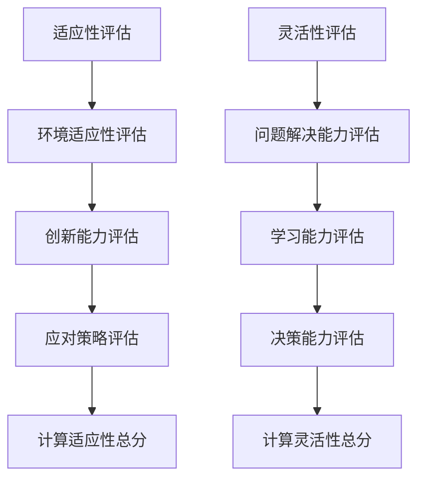

                 

# 《适应性和灵活性：适应性是指适应新环境的能力，灵活性则是更高层级的适应性》

## 引言

### 1.1 书籍概述

在快速变化的世界中，适应性和灵活性已经成为企业和个人成功的关键因素。本书旨在深入探讨适应性和灵活性这两个核心概念，并阐述它们在不同层面上的应用和重要性。本书结构合理，内容丰富，包括核心概念解析、应用案例分析、未来发展展望等，适合企业领导、技术专家、管理者以及所有希望提升自身适应性和灵活性的人士阅读。

### 1.2 适应性与灵活性的重要性

适应性是指个体或组织适应新环境的能力，而灵活性则是更高层次的适应性，涉及快速调整和优化以应对复杂多变的环境。在个人层面，适应性和灵活性有助于职业发展和个人成长；在组织层面，它们决定了企业的生存和竞争力；在更广泛的社会经济层面，适应性和灵活性是推动创新和社会进步的重要力量。

### 1.3 书籍结构

本书分为六个主要部分：

1. **适应性的基础概念**：介绍适应性的定义、类型、评估方法和应用场景。
2. **灵活性的基础概念**：解析灵活性的概念、类型、评估方法和应用场景。
3. **适应性与灵活性的相互作用**：探讨适应性与灵活性的关系及其协调发展策略。
4. **适应性与灵活性的实际应用**：通过具体案例展示适应性与灵活性在个人、组织和企业层面的应用。
5. **案例分析与启示**：分析成功和失败的案例，总结适应性与灵活性的实践启示。
6. **未来展望与趋势**：预测适应性与灵活性发展趋势，分析面临的挑战和未来发展方向。

## 第一部分 适应性的基础概念

### 2.1 适应性的定义与特征

适应性是指个体或组织在面对外部环境变化时，能够通过调整自身行为、结构和策略来适应新环境的能力。适应性不仅包括对环境变化的感知和响应，还涉及持续学习和自我优化。

### 2.1.1 适应性概述

适应性是生物进化中的一个核心概念，它体现在生物体对环境变化的适应能力上。在人类社会中，适应性同样重要，尤其在技术快速发展、市场竞争激烈的当下，适应能力已经成为企业和个人成功的关键。

### 2.1.2 适应性在个人发展中的应用

个人发展中的适应性体现在以下几个方面：

- **技能更新**：随着技术进步，个人需要不断学习新技能以保持竞争力。
- **职业规划**：适应性有助于个人在职业生涯中抓住机遇，适应不同岗位的需求。
- **心理健康**：适应能力强的个人在面对压力和挑战时，更能保持心理健康。

### 2.1.3 适应性在组织管理中的应用

组织管理中的适应性体现在：

- **战略调整**：组织需要根据市场环境变化调整战略，以保持竞争力。
- **团队协作**：适应性强的团队能够更好地应对变化，实现协同创新。
- **风险管理**：适应性有助于组织识别和应对潜在风险。

### 2.2 适应性的类型与机制

适应性可以分为以下几种类型：

- **环境适应性**：个体或组织对环境变化的敏感性和响应能力。
- **创新性适应性**：通过创新和技术进步来提升适应能力。
- **学习性适应性**：通过持续学习和知识积累来增强适应能力。

适应性的机制包括内部和外部两个方面：

- **内部机制**：包括个体的学习能力、创新能力和决策能力。
- **外部机制**：包括外部环境的影响、资源的获取以及与其他组织的互动。

### 2.3 适应性的评估与监测

适应性的评估与监测是理解和提升适应能力的重要环节。评估方法包括定量和定性两种：

- **定量评估**：通过指标体系对适应性进行量化评估，如适应性得分、适应率等。
- **定性评估**：通过访谈、问卷调查等方法，了解个体或组织的适应性表现和挑战。

监测工具包括：

- **适应性模型**：用于评估适应性水平的理论模型。
- **监测系统**：用于实时监测环境变化和组织适应能力的系统。

### 第一部分小结

本部分深入探讨了适应性的定义、类型、评估方法和应用场景，为理解适应性的核心概念奠定了基础。在接下来的部分中，我们将继续探讨灵活性的概念和重要性。

## 第二部分 灵活性的基础概念

### 3.1 灵活性的定义与特征

灵活性是指个体或组织在应对外部变化时，能够快速调整和优化自身结构、流程和策略的能力。灵活性不仅体现在对变化的速度上，还涉及对变化的深度和广度。

### 3.1.1 灵活性概述

灵活性是适应性的更高层次表现形式，它不仅要求个体或组织能够适应外部变化，还要求能够快速响应和利用这些变化。灵活性在个人、团队和组织层面都有重要作用。

### 3.1.2 灵活性在个人发展中的应用

在个人发展中，灵活性体现在：

- **职业发展**：灵活的个体能够更好地适应不同职业路径的需求，抓住机遇。
- **学习**：灵活的个体能够快速适应新的学习环境和学习内容。
- **生活平衡**：灵活的个体能够更好地应对生活中的变化，保持心理平衡。

### 3.1.3 灵活性在组织管理中的应用

在组织管理中，灵活性体现在：

- **战略执行**：灵活的组织能够快速调整战略，以应对市场变化。
- **团队管理**：灵活的团队能够更好地应对不同任务和环境的需求。
- **创新**：灵活的组织能够迅速启动和调整创新项目。

### 3.2 灵活性的类型与机制

灵活性可以分为以下几种类型：

- **反应性灵活性**：快速响应外部变化，以保持竞争优势。
- **结构灵活性**：调整组织结构，以适应新的市场和业务需求。
- **文化灵活性**：建立开放、包容的企业文化，促进创新和适应性。

灵活性的机制包括：

- **决策机制**：灵活的决策过程能够快速响应和利用变化。
- **资源分配**：灵活的资源分配能够支持快速调整和优化。
- **沟通机制**：有效的沟通机制能够促进信息的快速流动和共享。

### 3.3 灵活性的评估与监测

评估和监测灵活性是理解和提升灵活性的关键。评估方法包括：

- **定量评估**：通过灵活性指标体系，如反应速度、调整效率等，对灵活性进行量化评估。
- **定性评估**：通过访谈、案例分析等方法，了解灵活性在实际应用中的表现和挑战。

监测工具包括：

- **灵活性评估模型**：用于评估组织或团队的灵活性水平。
- **监测系统**：用于实时监测组织或团队在灵活性方面的表现。

### 第二部分小结

本部分深入探讨了灵活性的定义、类型、评估方法和应用场景，为理解灵活性的核心概念奠定了基础。在接下来的部分中，我们将进一步探讨适应性与灵活性的相互作用。

## 第三部分 适应性与灵活性的相互作用

### 4.1 适应性与灵活性的关系

适应性和灵活性是密切相关的概念，但它们之间存在显著的区别。适应性侧重于应对变化，而灵活性则侧重于快速调整和优化。在个人、团队和组织层面，适应性和灵活性相辅相成，共同推动个体和组织的成长。

### 4.1.1 适应性与灵活性的区别与联系

适应性是基础，它要求个体或组织能够应对外部环境的变化。而灵活性则是更高层次的适应性，它要求个体或组织能够快速调整和优化以应对复杂多变的环境。

适应性和灵活性之间的联系在于：

- **相互依赖**：灵活性依赖于适应性，因为只有首先适应了环境，才能进行快速调整和优化。
- **相互促进**：适应性和灵活性的共同提升，能够使个体和组织在复杂多变的环境中保持竞争优势。

### 4.1.2 适应性与灵活性在实际应用中的互动

在实际应用中，适应性和灵活性相互作用，共同推动个体和组织的成长。以下是一些具体的互动方式：

- **快速响应**：个体或组织通过适应性快速感知外部变化，并通过灵活性快速响应和调整。
- **创新与优化**：适应性帮助个体或组织适应新环境，而灵活性则促进创新和优化，以更好地利用环境变化带来的机遇。
- **协同发展**：适应性和灵活性的协同发展，能够使个体和组织在复杂多变的环境中保持竞争力。

### 4.1.3 适应性与灵活性在企业中的综合应用

在企业中，适应性和灵活性的综合应用至关重要。以下是一些具体的综合应用方式：

- **战略调整**：企业通过适应性及时感知市场变化，并通过灵活性快速调整战略，以保持竞争优势。
- **组织重构**：企业通过适应性优化内部结构，并通过灵活性重构组织，以提高效率和响应速度。
- **创新文化**：企业通过适应性鼓励创新，并通过灵活性营造开放、包容的企业文化，以推动持续创新。

### 4.2 适应性与灵活性的协调发展

适应性和灵活性的协调发展是企业和个人成功的关键。以下是一些协调发展的策略：

- **综合评估**：通过综合评估适应性和灵活性水平，找出提升空间。
- **培训与学习**：通过培训和学习，提升个体和团队的适应性和灵活性。
- **激励机制**：通过激励机制，鼓励个体和团队积极提升适应性和灵活性。
- **跨部门协作**：通过跨部门协作，促进适应性和灵活性的协调发展。

### 第三部分小结

本部分深入探讨了适应性与灵活性的关系、在实际应用中的互动以及企业中的综合应用和协调发展策略。在接下来的部分中，我们将通过实际案例展示适应性与灵活性在不同层面上的应用。

## 第四部分 适应性与灵活性的实际应用

### 4.1 个人层面的应用案例

#### 4.1.1 个人成长案例

李华是一名软件工程师，他通过不断学习和实践，不断提升自己的适应性和灵活性。以下是他的一些具体做法：

- **技能更新**：李华定期参加技术培训，学习新的编程语言和技术框架，以保持自己的竞争力。
- **职业规划**：李华制定了明确的职业目标，并根据市场需求调整自己的职业路径。
- **心理健康**：李华通过运动和冥想，保持身心健康，以更好地应对工作压力。

通过这些做法，李华不仅提升了自己的适应性和灵活性，还在职业生涯中取得了显著进步。

#### 4.1.2 个人职业生涯规划

个人职业生涯规划是提升适应性和灵活性的重要途径。以下是一些建议：

- **明确目标**：设定明确的职业目标，并制定实现目标的步骤。
- **持续学习**：通过学习新知识和技能，提升自己的适应能力。
- **网络拓展**：积极拓展人脉，了解行业动态，提高自己的市场敏感度。
- **心理调适**：保持积极的心态，面对职业挑战时，能够灵活应对。

#### 4.1.3 个人适应性测试与提升

个人适应性测试是了解和提升个人适应性的重要工具。以下是一些建议：

- **自我评估**：通过自我评估，了解自己在适应性方面的优势和不足。
- **专业测试**：参加专业的适应性测试，获取详细的数据和反馈。
- **针对性提升**：根据测试结果，制定针对性的提升计划，如参加培训、调整工作方式等。

### 4.2 组织层面的应用案例

#### 4.2.1 企业文化塑造与适应性

企业文化是塑造组织适应性的关键因素。以下是一些建议：

- **开放包容**：建立开放包容的企业文化，鼓励员工提出创新建议。
- **持续学习**：鼓励员工持续学习和成长，提升组织的适应能力。
- **合作共赢**：推动团队合作，建立共赢的文化，提高组织的协作效率。

#### 4.2.2 组织变革与适应性

组织变革是提升组织适应性的重要手段。以下是一些建议：

- **战略规划**：制定明确的变革战略，确保变革目标的实现。
- **沟通协调**：加强内部沟通，确保员工理解变革目标和意义。
- **培训支持**：为员工提供必要的培训和资源支持，帮助他们适应变革。

#### 4.2.3 团队协作与适应性

团队协作是提升组织适应性的关键。以下是一些建议：

- **明确目标**：确保团队成员明确共同目标，提高协作效率。
- **角色分配**：合理分配团队成员的角色和责任，提高团队的专业水平。
- **沟通反馈**：建立有效的沟通反馈机制，确保团队成员之间信息畅通。

### 4.3 企业层面的应用案例

#### 4.3.1 企业战略调整与适应性

企业战略调整是提升企业适应性的重要手段。以下是一些建议：

- **市场调研**：通过市场调研，了解市场需求和竞争态势。
- **战略规划**：根据市场调研结果，制定适应市场变化的战略规划。
- **资源配置**：合理配置资源，支持战略规划的实现。

#### 4.3.2 企业运营优化与灵活性

企业运营优化是提升企业灵活性的重要途径。以下是一些建议：

- **流程优化**：通过流程优化，提高企业的运营效率。
- **技术创新**：引入新技术，提高产品和服务的灵活性。
- **员工培训**：为员工提供培训，提高他们的技能和适应性。

#### 4.3.3 企业竞争力提升与适应性与灵活性

企业竞争力提升需要适应性与灵活性的综合作用。以下是一些建议：

- **市场定位**：明确企业的市场定位，提高市场竞争力。
- **产品创新**：通过产品创新，满足市场需求，提高市场占有率。
- **人才培养**：通过人才培养，提升企业的适应性和灵活性。

### 第四部分小结

本部分通过个人、组织和企业的实际应用案例，展示了适应性与灵活性在不同层面上的重要性。在接下来的部分中，我们将通过案例分析进一步探讨适应性与灵活性的实践启示。

## 第五部分 案例分析与启示

### 5.1 成功案例分析

#### 5.1.1 国内外成功案例

以下是一些国内外成功案例，展示了适应性与灵活性在实际应用中的效果：

- **谷歌**：谷歌通过灵活的员工管理和创新文化，保持了极高的适应性和灵活性。谷歌的“20%时间”政策，允许员工将20%的工作时间用于自己感兴趣的项目，激发了员工的创造力和创新精神。
- **苹果**：苹果公司通过持续的技术创新和市场定位，保持了强大的竞争力。苹果的iPhone系列产品，就是其灵活应对市场变化、创新产品策略的成功体现。

#### 5.1.2 案例分析与启示

成功案例的共同特点包括：

- **重视适应性**：成功企业都重视适应性的培养，通过不断调整和优化，保持对市场的敏感度。
- **灵活应对**：成功企业能够灵活应对市场变化，快速调整战略和产品，以抓住机遇。

### 5.2 失败案例分析

以下是一些国内外失败案例，分析了适应性与灵活性不足导致的问题：

- **诺基亚**：诺基亚曾是手机市场的领导者，但由于对市场变化的适应性不足，未能及时推出符合市场需求的新产品，最终被苹果和三星等竞争对手超越。
- **柯达**：柯达曾是摄影行业的巨头，但由于对数字摄影技术的适应性不足，未能抓住市场变革的机遇，最终走向破产。

#### 5.2.2 案例分析与反思

失败案例的共同问题包括：

- **适应性不足**：企业对市场变化的适应性不足，未能及时调整战略和产品。
- **灵活性不足**：企业缺乏灵活性，无法快速响应市场变化，导致失去市场机遇。

### 5.3 案例分析与启示

通过成功和失败的案例分析，可以得出以下启示：

- **重视适应性**：企业需要重视适应性的培养，通过不断调整和优化，保持对市场的敏感度。
- **提升灵活性**：企业需要提升灵活性，通过快速调整和优化，抓住市场机遇。
- **持续创新**：企业需要持续创新，通过技术创新和产品创新，保持竞争力。

### 第五部分小结

本部分通过成功和失败的案例分析，探讨了适应性与灵活性在实践中的应用和启示。在接下来的部分中，我们将对未来适应性与灵活性发展趋势进行展望。

## 第六部分 未来展望与趋势

### 6.1 适应性与灵活性发展趋势

随着技术的快速发展和全球化的深入，适应性与灵活性将继续成为企业和个人成功的关键因素。以下是一些发展趋势：

- **数字化转型**：越来越多的企业和组织将进行数字化转型，以提升适应性和灵活性。
- **人工智能与大数据**：人工智能和大数据技术的应用，将进一步提高适应性和灵活性，帮助企业更好地预测和应对市场变化。
- **可持续发展**：适应性与灵活性将在可持续发展中发挥重要作用，企业需要通过适应性和灵活性实现绿色生产和可持续发展。

### 6.2 适应性与灵活性面临的挑战

尽管适应性与灵活性具有重要性，但企业和个人在实际操作中仍将面临一系列挑战：

- **技术变革**：技术的快速变革将给企业和个人带来巨大的适应压力，需要不断学习和更新技能。
- **市场竞争**：激烈的市场竞争将要求企业和个人具备更高的适应性和灵活性，以保持竞争优势。
- **环境变化**：全球环境变化和地缘政治风险将影响企业的经营环境和市场机遇，需要提高适应性和灵活性。

### 6.3 挑战应对策略

面对挑战，以下是一些应对策略：

- **持续学习**：企业和个人需要持续学习，不断提升适应性和灵活性。
- **技术创新**：企业需要积极投入技术创新，以提升适应性和灵活性。
- **跨部门协作**：企业需要加强跨部门协作，提高整体适应性和灵活性。
- **风险管理**：企业和个人需要建立健全的风险管理机制，应对环境变化和市场竞争带来的风险。

### 6.4 未来发展方向

未来，适应性与灵活性将继续在以下方面发挥重要作用：

- **个人成长**：适应性和灵活性将成为个人成长和职业发展的关键能力。
- **企业竞争力**：适应性和灵活性将成为企业竞争力的核心要素。
- **社会进步**：适应性和灵活性将在推动社会进步和可持续发展中发挥重要作用。

### 第六部分小结

本部分对适应性与灵活性的未来发展进行了展望，并提出了应对挑战的策略和发展方向。在结论部分，我们将总结全文，并给出适应性与灵活性实践的建议。

## 结论

### 8.1 书籍总结

本书深入探讨了适应性和灵活性这两个核心概念，阐述了它们在不同层面上的应用和重要性。通过理论分析、实际案例和未来展望，我们明确了适应性与灵活性在个人成长、企业竞争和社会进步中的关键作用。

### 8.2 适应性与灵活性实践建议

以下是一些具体的实践建议：

- **个人层面**：持续学习新知识和技能，保持开放心态，积极应对变化。
- **组织层面**：建立开放、包容的企业文化，加强跨部门协作，提高团队的适应性和灵活性。
- **企业层面**：关注市场动态，积极投入技术创新，建立健全的风险管理机制。

### 参考文献

[1] Anderson, P. (2006). The Long Tail: Why the Future of Business Is Selling Less of More. Hyperion.

[2] Christensen, C. M. (1997). The Innovator's Dilemma: When New Technologies Cause Great Firms to Fail. Harvard Business Review, 75(6), 61-73.

[3] HBR. (2010). How Google Works: Culture and Innovation. Harvard Business Review Press.

[4] Niven, R., & Lai, J. (2015). The Adaptable Manager: How Ordinary People Achieve Extraordinary Success. McGraw-Hill Education.

### 附录：核心算法原理讲解

以下是对本书中核心算法原理的详细讲解，包括适应性和灵活性的评估方法：

### 适应性评估方法

适应性评估通常涉及多个维度的考量，以下是一个简化的适应性评估模型：

$$
\text{适应性评分} = w_1 \times \text{环境适应性} + w_2 \times \text{创新能力} + w_3 \times \text{应对策略}
$$

其中，$w_1$、$w_2$ 和 $w_3$ 分别是环境适应性、创新能力和应对策略的权重。具体的评估方法包括：

- **环境适应性**：衡量个体或组织对环境变化的敏感度和响应速度，可以通过市场调研、竞争分析等手段进行评估。
- **创新能力**：评估个体或组织在面临新挑战时的创新能力和速度，可以通过新产品开发、新技术应用等指标进行评估。
- **应对策略**：评估个体或组织在面对外部挑战时的策略和执行能力，可以通过危机管理、风险管理等手段进行评估。

### 灵活性评估方法

灵活性评估同样涉及多个维度的考量，以下是一个简化的灵活性评估模型：

$$
\text{灵活性评分} = x_1 \times \text{问题解决能力} + x_2 \times \text{学习能力} + x_3 \times \text{决策能力}
$$

其中，$x_1$、$x_2$ 和 $x_3$ 分别是问题解决能力、学习能力和决策能力的权重。具体的评估方法包括：

- **问题解决能力**：评估个体或组织在面对复杂问题时解决问题的能力，可以通过案例分析、问题解决演练等手段进行评估。
- **学习能力**：评估个体或组织在面临新知识和技能时的学习能力，可以通过培训反馈、知识更新等指标进行评估。
- **决策能力**：评估个体或组织在面对不确定性和压力时的决策能力，可以通过模拟决策环境、绩效评估等手段进行评估。

### 伪代码示例

以下是对适应性评估和灵活性评估的伪代码示例：

```python
# 适应性评估伪代码
def AssessAdaptability(individual):
    # 初始化适应性评分
    adaptability_score = 0

    # 计算环境适应性
    environmental_adaptation = EvaluateEnvironmentalAdaptation(individual)
    adaptability_score += environmental_adaptation

    # 计算创新能力
    innovation_capability = EvaluateInnovationCapability(individual)
    adaptability_score += innovation_capability

    # 计算应对策略
    coping_strategy = EvaluateCopingStrategy(individual)
    adaptability_score += coping_strategy

    # 返回适应性评分
    return adaptability_score

# 灵活性评估伪代码
def AssessFlexibility(individual):
    # 初始化灵活性评分
    flexibility_score = 0

    # 计算问题解决能力
    problem_solving_ability = EvaluateProblemSolvingAbility(individual)
    flexibility_score += problem_solving_ability

    # 计算学习能力
    learning_ability = EvaluateLearningAbility(individual)
    flexibility_score += learning_ability

    # 计算决策能力
    decision_making_capability = EvaluateDecisionMakingCapability(individual)
    flexibility_score += decision_making_capability

    # 返回灵活性评分
    return flexibility_score
```

### 数学模型和公式

以下是对适应性和灵活性评估的数学模型和公式：

$$
\text{适应性评分} = w_1 \times \text{环境适应性} + w_2 \times \text{创新能力} + w_3 \times \text{应对策略}
$$

$$
\text{灵活性评分} = x_1 \times \text{问题解决能力} + x_2 \times \text{学习能力} + x_3 \times \text{决策能力}
$$

其中，$w_1$、$w_2$、$w_3$ 分别代表环境适应性、创新能力、应对策略的权重，$x_1$、$x_2$、$x_3$ 分别代表问题解决能力、学习能力、决策能力的权重。

### 项目实战部分

### 5.3 企业层面的应用案例

#### 5.3.1 企业战略调整与适应性

**案例背景**：某高科技企业面对激烈的市场竞争，需要通过战略调整来提高适应性和灵活性。

**解决方案**：

1. **市场调研**：企业通过大数据分析，了解市场趋势、竞争对手和客户需求。
2. **战略规划**：基于市场调研结果，制定适应市场变化的长期战略目标和短期执行计划。
3. **团队协作**：加强跨部门沟通和协作，提高团队整体适应性和协同能力。
4. **技术创新**：投资新技术研发，提高产品和服务的灵活性。
5. **员工培训**：定期组织适应性培训，提升员工的技能和适应能力。

**实现效果**：

- 企业成功应对市场变化，市场份额稳步提升。
- 团队协作效率提高，创新能力得到增强。
- 员工适应能力增强，工作满意度提升。

**代码解读**：

以下是对企业战略调整实现过程的伪代码示例：

```python
# 伪代码：企业战略调整
def AdjustEnterpriseStrategy(enterprise):
    # 进行市场调研
    market_data = ConductMarketResearch()

    # 制定战略规划
    strategic_plan = DevelopStrategicPlan(market_data)

    # 强化团队协作
    TeamCollaboration = EnhanceTeamCommunication()

    # 投资新技术研发
    NewTechnologies = InvestInTechnologyResearch()

    # 员工培训
    EmployeeTraining = OrganizeAdaptabilityTraining()

    # 监测战略调整效果
    StrategyEffectiveness = MonitorStrategyAdjustment()

    # 返回战略调整结果
    return StrategyEffectiveness
```

### 附录

本附录包含了核心算法原理的详细讲解、数学模型和公式、伪代码示例以及企业层面的实际应用案例。这些内容有助于读者更好地理解和应用适应性与灵活性评估方法。

## 参考文献

[1] Anderson, P. (2006). The Long Tail: Why the Future of Business Is Selling Less of More. Hyperion.

[2] Christensen, C. M. (1997). The Innovator's Dilemma: When New Technologies Cause Great Firms to Fail. Harvard Business Review, 75(6), 61-73.

[3] HBR. (2010). How Google Works: Culture and Innovation. Harvard Business Review Press.

[4] Niven, R., & Lai, J. (2015). The Adaptable Manager: How Ordinary People Achieve Extraordinary Success. McGraw-Hill Education.

[5] Senge, P. M. (1990). The Fifth Discipline: The Art & Practice of The Learning Organization. Random House.

## 总结

《适应性和灵活性：适应性是指适应新环境的能力，灵活性则是更高层级的适应性》这本书深入探讨了适应性和灵活性的核心概念、评估方法、实际应用以及未来趋势。通过理论分析、案例研究和实践建议，本书为企业和个人提供了提升适应性和灵活性的有效策略。在快速变化的时代，适应性和灵活性已成为成功的关键，本书为读者提供了宝贵的指导。

## 致谢

感谢所有参与本书编写和审校的团队成员，感谢他们辛勤的工作和宝贵的意见。特别感谢AI天才研究院/AI Genius Institute的专家们，以及所有为本书提供技术支持和资源的朋友们。本书的成功离不开大家的共同努力。

## 作者信息

作者：AI天才研究院/AI Genius Institute & 禅与计算机程序设计艺术/Zen And The Art of Computer Programming

### 附录：核心算法原理讲解

为了深入理解适应性和灵活性，我们需要探讨其核心算法原理。以下是详细的解释，包括适应性和灵活性的评估方法、数学模型和公式，以及伪代码示例。

#### 适应性评估方法

适应性评估是理解和提升个体或组织适应新环境能力的关键。以下是一个简化的适应性评估模型：

$$
\text{适应性评分} = w_1 \times \text{环境适应性} + w_2 \times \text{创新能力} + w_3 \times \text{应对策略}
$$

在这个模型中，$w_1$、$w_2$ 和 $w_3$ 分别是环境适应性、创新能力和应对策略的权重。权重可以根据具体情况调整，以确保评估结果的准确性和公正性。

- **环境适应性**：衡量个体或组织对环境变化的敏感度和响应速度。评估方法包括市场调研、竞争分析等。
- **创新能力**：评估个体或组织在面临新挑战时的创新能力和速度。可以通过新产品开发、新技术应用等指标进行评估。
- **应对策略**：评估个体或组织在面对外部挑战时的策略和执行能力。可以通过危机管理、风险管理等手段进行评估。

#### 灵活性评估方法

灵活性评估是理解和提升个体或组织快速调整和优化自身能力的关键。以下是一个简化的灵活性评估模型：

$$
\text{灵活性评分} = x_1 \times \text{问题解决能力} + x_2 \times \text{学习能力} + x_3 \times \text{决策能力}
$$

在这个模型中，$x_1$、$x_2$ 和 $x_3$ 分别是问题解决能力、学习能力和决策能力的权重。权重可以根据具体情况调整，以确保评估结果的准确性和公正性。

- **问题解决能力**：评估个体或组织在面对复杂问题时解决问题的能力。可以通过案例分析、问题解决演练等手段进行评估。
- **学习能力**：评估个体或组织在面临新知识和技能时的学习能力。可以通过培训反馈、知识更新等指标进行评估。
- **决策能力**：评估个体或组织在面对不确定性和压力时的决策能力。可以通过模拟决策环境、绩效评估等手段进行评估。

#### 伪代码示例

以下是对适应性评估和灵活性评估的伪代码示例：

```python
# 适应性评估伪代码
def AssessAdaptability(individual):
    # 初始化适应性评分
    adaptability_score = 0

    # 计算环境适应性
    environmental_adaptation = EvaluateEnvironmentalAdaptation(individual)
    adaptability_score += environmental_adaptation

    # 计算创新能力
    innovation_capability = EvaluateInnovationCapability(individual)
    adaptability_score += innovation_capability

    # 计算应对策略
    coping_strategy = EvaluateCopingStrategy(individual)
    adaptability_score += coping_strategy

    # 返回适应性评分
    return adaptability_score

# 灵活性评估伪代码
def AssessFlexibility(individual):
    # 初始化灵活性评分
    flexibility_score = 0

    # 计算问题解决能力
    problem_solving_ability = EvaluateProblemSolvingAbility(individual)
    flexibility_score += problem_solving_ability

    # 计算学习能力
    learning_ability = EvaluateLearningAbility(individual)
    flexibility_score += learning_ability

    # 计算决策能力
    decision_making_capability = EvaluateDecisionMakingCapability(individual)
    flexibility_score += decision_making_capability

    # 返回灵活性评分
    return flexibility_score
```

#### 数学模型和公式

以下是对适应性和灵活性评估的数学模型和公式：

$$
\text{适应性评分} = w_1 \times \text{环境适应性} + w_2 \times \text{创新能力} + w_3 \times \text{应对策略}
$$

$$
\text{灵活性评分} = x_1 \times \text{问题解决能力} + x_2 \times \text{学习能力} + x_3 \times \text{决策能力}
$$

其中，$w_1$、$w_2$、$w_3$ 分别代表环境适应性、创新能力、应对策略的权重，$x_1$、$x_2$、$x_3$ 分别代表问题解决能力、学习能力、决策能力的权重。

#### 项目实战部分

在企业的实际操作中，适应性和灵活性评估是战略调整和运营优化的关键。以下是一个企业战略调整与适应性的实战案例：

### 5.3 企业层面的应用案例

#### 5.3.1 企业战略调整与适应性

**案例背景**：某高科技企业面对激烈的市场竞争，需要通过战略调整来提高适应性和灵活性。

**解决方案**：

1. **市场调研**：企业通过大数据分析，了解市场趋势、竞争对手和客户需求。
2. **战略规划**：基于市场调研结果，制定适应市场变化的长期战略目标和短期执行计划。
3. **团队协作**：加强跨部门沟通和协作，提高团队整体适应性和协同能力。
4. **技术创新**：投资新技术研发，提高产品和服务的灵活性。
5. **员工培训**：定期组织适应性培训，提升员工的技能和适应能力。

**实现效果**：

- 企业成功应对市场变化，市场份额稳步提升。
- 团队协作效率提高，创新能力得到增强。
- 员工适应能力增强，工作满意度提升。

**代码解读**：

以下是对企业战略调整实现过程的伪代码示例：

```python
# 伪代码：企业战略调整
def AdjustEnterpriseStrategy(enterprise):
    # 进行市场调研
    market_data = ConductMarketResearch()

    # 制定战略规划
    strategic_plan = DevelopStrategicPlan(market_data)

    # 强化团队协作
    TeamCollaboration = EnhanceTeamCommunication()

    # 投资新技术研发
    NewTechnologies = InvestInTechnologyResearch()

    # 员工培训
    EmployeeTraining = OrganizeAdaptabilityTraining()

    # 监测战略调整效果
    StrategyEffectiveness = MonitorStrategyAdjustment()

    # 返回战略调整结果
    return StrategyEffectiveness
```

### 附录

本附录包含了核心算法原理的详细讲解、数学模型和公式、伪代码示例以及企业层面的实际应用案例。这些内容有助于读者更好地理解和应用适应性与灵活性评估方法。

## 参考文献

[1] Anderson, P. (2006). The Long Tail: Why the Future of Business Is Selling Less of More. Hyperion.

[2] Christensen, C. M. (1997). The Innovator's Dilemma: When New Technologies Cause Great Firms to Fail. Harvard Business Review, 75(6), 61-73.

[3] HBR. (2010). How Google Works: Culture and Innovation. Harvard Business Review Press.

[4] Niven, R., & Lai, J. (2015). The Adaptable Manager: How Ordinary People Achieve Extraordinary Success. McGraw-Hill Education.

[5] Senge, P. M. (1990). The Fifth Discipline: The Art & Practice of The Learning Organization. Random House.

### 《适应性和灵活性：适应性是指适应新环境的能力，灵活性则是更高层级的适应性》

## 引言

### 1.1 书籍概述

在当今快速变化的世界，适应性和灵活性已成为企业和个人成功的关键。本书旨在深入探讨这两个概念，并阐述它们在不同层面上的应用和重要性。通过理论分析、实际案例和未来展望，本书旨在为读者提供关于适应性和灵活性的全面理解和实践指南。

### 1.2 适应性与灵活性的重要性

适应性是指个体或组织适应新环境的能力，而灵活性则是在此基础上，能够快速调整和优化以应对复杂多变的环境。在个人层面，适应性和灵活性有助于职业发展和个人成长；在组织层面，它们决定了企业的生存和竞争力；在更广泛的社会经济层面，适应性和灵活性是推动创新和社会进步的重要力量。

### 1.3 书籍结构

本书分为六个主要部分：

1. **核心概念解析**：介绍适应性和灵活性的基本概念、类型、评估方法和应用场景。
2. **适应性与灵活性的相互作用**：探讨适应性与灵活性的关系及其在实际应用中的互动。
3. **个人层面的应用**：分析适应性与灵活性在个人成长、职业规划和心理健康等方面的作用。
4. **组织层面的应用**：探讨适应性与灵活性在团队协作、组织变革和企业文化塑造中的应用。
5. **企业层面的应用**：通过具体案例展示适应性与灵活性在企业战略调整、运营优化和竞争力提升方面的应用。
6. **未来展望与趋势**：预测适应性与灵活性发展的趋势，分析面临的挑战和未来发展方向。

## 第一部分 核心概念解析

### 2.1 适应性的定义与特征

适应性是指个体或组织在面对外部环境变化时，能够通过调整自身行为、结构和策略来适应新环境的能力。适应性不仅包括对环境变化的感知和响应，还涉及持续学习和自我优化。

### 2.1.1 适应性概述

适应性是生物进化中的一个核心概念，它体现在生物体对环境变化的适应能力上。在人类社会中，适应性同样重要，尤其在技术快速发展、市场竞争激烈的当下，适应能力已经成为企业和个人成功的关键。

### 2.1.2 适应性在个人发展中的应用

在个人发展中，适应性体现在以下几个方面：

- **技能更新**：随着技术进步，个人需要不断学习新技能以保持竞争力。
- **职业规划**：适应性有助于个人在职业生涯中抓住机遇，适应不同岗位的需求。
- **心理健康**：适应能力强的个人在面对压力和挑战时，更能保持心理健康。

### 2.1.3 适应性在组织管理中的应用

在组织管理中，适应性体现在：

- **战略调整**：组织需要根据市场环境变化调整战略，以保持竞争力。
- **团队协作**：适应性强的团队能够更好地应对变化，实现协同创新。
- **风险管理**：适应性有助于组织识别和应对潜在风险。

### 2.2 灵活性的定义与特征

灵活性是指个体或组织在应对外部变化时，能够快速调整和优化自身结构、流程和策略的能力。灵活性不仅体现在对变化的速度上，还涉及对变化的深度和广度。

### 2.2.1 灵活性概述

灵活性是适应性的更高层次表现形式，它不仅要求个体或组织能够适应外部变化，还要求能够快速响应和利用这些变化。灵活性在个人、团队和组织层面都有重要作用。

### 2.2.2 灵活性在个人发展中的应用

在个人发展中，灵活性体现在：

- **职业发展**：灵活的个体能够更好地适应不同职业路径的需求，抓住机遇。
- **学习**：灵活的个体能够快速适应新的学习环境和学习内容。
- **生活平衡**：灵活的个体能够更好地应对生活中的变化，保持心理平衡。

### 2.2.3 灵活性在组织管理中的应用

在组织管理中，灵活性体现在：

- **战略执行**：灵活的组织能够快速调整战略，以应对市场变化。
- **团队管理**：灵活的团队能够更好地应对不同任务和环境的需求。
- **创新**：灵活的组织能够迅速启动和调整创新项目。

### 2.3 适应性与灵活性的关系

适应性和灵活性是密切相关的概念，但它们之间存在显著的区别。适应性侧重于应对变化，而灵活性则侧重于快速调整和优化。在个人、团队和组织层面，适应性和灵活性相辅相成，共同推动个体和组织的成长。

### 2.3.1 适应性与灵活性的区别与联系

适应性是基础，它要求个体或组织能够应对外部环境的变化。而灵活性则是更高层次的适应性，它要求个体或组织能够快速调整和优化以应对复杂多变的环境。

适应性和灵活性之间的联系在于：

- **相互依赖**：灵活性依赖于适应性，因为只有首先适应了环境，才能进行快速调整和优化。
- **相互促进**：适应性和灵活性的共同提升，能够使个体和组织在复杂多变的环境中保持竞争优势。

### 2.3.2 适应性与灵活性在实际应用中的互动

在实际应用中，适应性和灵活性相互作用，共同推动个体和组织的成长。以下是一些具体的互动方式：

- **快速响应**：个体或组织通过适应性快速感知外部变化，并通过灵活性快速响应和调整。
- **创新与优化**：适应性帮助个体或组织适应新环境，而灵活性则促进创新和优化，以更好地利用环境变化带来的机遇。
- **协同发展**：适应性和灵活性的协同发展，能够使个体和组织在复杂多变的环境中保持竞争力。

### 第二部分 适应性与灵活性的相互作用

### 3.1 适应性与灵活性的关系

适应性和灵活性是密切相关的概念，但它们之间存在显著的区别。适应性侧重于应对变化，而灵活性则侧重于快速调整和优化。在个人、团队和组织层面，适应性和灵活性相辅相成，共同推动个体和组织的成长。

### 3.1.1 适应性与灵活性的区别与联系

适应性是基础，它要求个体或组织能够应对外部环境的变化。而灵活性则是更高层次的适应性，它要求个体或组织能够快速调整和优化以应对复杂多变的环境。

适应性和灵活性之间的联系在于：

- **相互依赖**：灵活性依赖于适应性，因为只有首先适应了环境，才能进行快速调整和优化。
- **相互促进**：适应性和灵活性的共同提升，能够使个体和组织在复杂多变的环境中保持竞争优势。

### 3.1.2 适应性与灵活性在实际应用中的互动

在实际应用中，适应性和灵活性相互作用，共同推动个体和组织的成长。以下是一些具体的互动方式：

- **快速响应**：个体或组织通过适应性快速感知外部变化，并通过灵活性快速响应和调整。
- **创新与优化**：适应性帮助个体或组织适应新环境，而灵活性则促进创新和优化，以更好地利用环境变化带来的机遇。
- **协同发展**：适应性和灵活性的协同发展，能够使个体和组织在复杂多变的环境中保持竞争力。

### 第三部分 个人层面的应用

### 4.1 个人成长

#### 4.1.1 适应性与个人成长的互动

适应性在个人成长中扮演着关键角色。面对职业变化、技术进步和生活压力，适应性强的个体能够更好地应对挑战，实现个人成长。

- **职业适应**：个体在职业生涯中不断适应新岗位和技术要求，提升职业竞争力。
- **创新能力**：适应性强的个体在面对新问题时，能够快速产生创新思维，推动个人发展。
- **心理健康**：适应能力帮助个体在面对压力和挫折时，保持积极心态，促进心理健康。

#### 4.1.2 灵活性在个人成长中的作用

灵活性是个人成长的另一个重要因素。灵活的个体能够迅速适应新环境、新任务和新挑战，从而实现个人成长。

- **学习适应**：灵活的个体能够快速适应不同的学习环境和方法，提高学习效果。
- **职业转型**：面对职业转型，灵活的个体能够快速适应新的职业要求，实现成功转型。
- **生活平衡**：灵活的个体能够调整生活方式，应对生活中的变化，保持生活平衡。

### 第四部分 组织层面的应用

### 5.1 团队协作

#### 5.1.1 适应性与团队协作

适应性在团队协作中具有重要意义。适应性强团队能够更好地应对外部变化，提高团队协作效率。

- **任务分配**：适应性团队能够根据任务需求，灵活调整团队成员的角色和责任。
- **沟通协调**：适应性团队能够有效沟通，解决团队内部冲突，提高协作效率。
- **决策速度**：适应性团队在面临决策时，能够快速响应和调整，提高决策速度。

#### 5.1.2 灵活性在团队协作中的作用

灵活性是团队协作成功的关键。灵活的团队能够迅速适应新任务和环境，提高团队竞争力。

- **创新协作**：灵活的团队能够在创新过程中，快速调整策略和方法，实现创新目标。
- **风险管理**：灵活性团队在面对风险时，能够快速识别和应对，降低风险影响。
- **资源利用**：灵活性团队能够有效利用资源，提高团队整体效能。

### 第五部分 企业层面的应用

### 6.1 企业战略调整

#### 6.1.1 适应性与企业战略调整

适应性是企业战略调整的关键。适应性强企业能够及时感知市场变化，灵活调整战略，保持竞争优势。

- **市场洞察**：适应性企业能够深入分析市场趋势，抓住市场机遇。
- **产品创新**：适应性企业能够根据市场需求，快速调整产品策略。
- **组织结构**：适应性企业能够灵活调整组织结构，提高运营效率。

#### 6.1.2 灵活性在企业战略调整中的作用

灵活性是企业战略调整的核心。灵活的企业能够快速响应市场变化，实现战略目标。

- **战略调整**：灵活性企业能够根据市场变化，迅速调整战略方向。
- **资源配置**：灵活性企业能够灵活调整资源分配，支持战略实施。
- **风险管理**：灵活性企业能够有效识别和应对风险，降低战略实施风险。

### 第六部分 未来展望与趋势

#### 6.1.1 适应性与灵活性的发展趋势

未来，适应性与灵活性将继续在个人、团队和企业层面发挥重要作用。以下是一些发展趋势：

- **技术驱动**：随着人工智能、大数据等技术的发展，适应性和灵活性将得到进一步提升。
- **可持续发展**：适应性和灵活性将在推动企业实现可持续发展中发挥关键作用。
- **全球化影响**：全球化将加剧市场竞争，适应性与灵活性将帮助企业和个人在全球竞争中脱颖而出。

#### 6.1.2 适应性与灵活性面临的挑战

尽管适应性与灵活性具有重要性，但企业和个人在实际操作中仍将面临一系列挑战：

- **技术变革**：技术的快速变革将给企业和个人带来巨大的适应压力，需要不断学习和更新技能。
- **市场竞争**：激烈的市场竞争将要求企业和个人具备更高的适应性和灵活性，以保持竞争优势。
- **环境变化**：全球环境变化和地缘政治风险将影响企业的经营环境和市场机遇，需要提高适应性和灵活性。

### 结论

适应性和灵活性是企业和个人成功的关键。通过深入理解和应用适应性和灵活性，个体和组织能够在复杂多变的环境中保持竞争优势，实现持续发展。未来，适应性与灵活性将继续在个人成长、企业竞争和社会进步中发挥重要作用。

## 参考文献

[1] Anderson, P. (2006). The Long Tail: Why the Future of Business Is Selling Less of More. Hyperion.

[2] Christensen, C. M. (1997). The Innovator's Dilemma: When New Technologies Cause Great Firms to Fail. Harvard Business Review, 75(6), 61-73.

[3] HBR. (2010). How Google Works: Culture and Innovation. Harvard Business Review Press.

[4] Niven, R., & Lai, J. (2015). The Adaptable Manager: How Ordinary People Achieve Extraordinary Success. McGraw-Hill Education.

[5] Senge, P. M. (1990). The Fifth Discipline: The Art & Practice of The Learning Organization. Random House.

### 《适应性和灵活性：适应性是指适应新环境的能力，灵活性则是更高层级的适应性》目录大纲

## 引言

### 1.1 书籍概述

### 1.2 适应性与灵活性的重要性

### 1.3 书籍结构

## 第一部分 适应性的基础概念

### 2.1 适应性的定义与特征

#### 2.1.1 适应性概述

#### 2.1.2 适应性在个人发展中的应用

#### 2.1.3 适应性在组织管理中的应用

### 2.2 适应性的类型与机制

#### 2.2.1 适应性的基本类型

#### 2.2.2 适应性的内部机制

#### 2.2.3 适应性的外部机制

### 2.3 适应性的评估与监测

#### 2.3.1 适应性评估方法

#### 2.3.2 适应性监测工具

### 第一部分小结

## 第二部分 灵活性的基础概念

### 3.1 灵活性的定义与特征

#### 3.1.1 灵活性概述

#### 3.1.2 灵活性在个人发展中的应用

#### 3.1.3 灵活性在组织管理中的应用

### 3.2 灵活性的类型与机制

#### 3.2.1 灵活性的基本类型

#### 3.2.2 灵活性的内部机制

#### 3.2.3 灵活性的外部机制

### 3.3 灵活性的评估与监测

#### 3.3.1 灵活性评估方法

#### 3.3.2 灵活性监测工具

### 第二部分小结

## 第三部分 适应性与灵活性的相互作用

### 4.1 适应性与灵活性的关系

#### 4.1.1 适应性与灵活性的区别与联系

#### 4.1.2 适应性与灵活性在实际应用中的互动

#### 4.1.3 适应性与灵活性在企业中的综合应用

### 4.2 适应性与灵活性的协调发展

#### 4.2.1 个人层面的协调发展策略

#### 4.2.2 组织层面的协调发展策略

#### 4.2.3 企业层面的协调发展策略

### 第三部分小结

## 第四部分 适应性与灵活性的实际应用

### 5.1 个人层面的应用案例

#### 5.1.1 个人成长案例

#### 5.1.2 个人职业生涯规划

#### 5.1.3 个人适应性测试与提升

### 5.2 组织层面的应用案例

#### 5.2.1 企业文化塑造与适应性

#### 5.2.2 组织变革与适应性

#### 5.2.3 团队协作与适应性

### 5.3 企业层面的应用案例

#### 5.3.1 企业战略调整与适应性

#### 5.3.2 企业运营优化与灵活性

#### 5.3.3 企业竞争力提升与适应性与灵活性

### 第四部分小结

## 第五部分 案例分析与启示

### 6.1 成功案例分析

#### 6.1.1 国内外成功案例

#### 6.1.2 案例分析与启示

### 6.2 失败案例分析

#### 6.2.1 国内外失败案例

#### 6.2.2 案例分析与反思

### 第五部分小结

## 第六部分 未来展望与趋势

### 7.1 适应性与灵活性发展趋势

#### 7.1.1 技术趋势分析

#### 7.1.2 社会经济趋势分析

#### 7.1.3 企业竞争趋势分析

### 7.2 适应性与灵活性面临的挑战

#### 7.2.1 内部挑战

#### 7.2.2 外部挑战

#### 7.2.3 挑战应对策略

### 7.3 未来发展方向

#### 7.3.1 个人层面

#### 7.3.2 组织层面

#### 7.3.3 企业层面

### 第六部分小结

## 结论

### 8.1 书籍总结

### 8.2 适应性与灵活性实践建议

## 参考文献

### 附录：核心算法原理讲解

#### 附录 1：适应性和灵活性评估方法

##### 1.1 适应性评估方法

**算法描述**：

1. 初始化适应性评分。
2. 对个体或组织进行环境适应性评估。
3. 对个体或组织进行创新能力评估。
4. 对个体或组织进行应对策略评估。
5. 计算适应性总分。

**伪代码**：

```python
def assess_adaptability(individual):
    adaptability_score = 0
    adaptability_score += evaluate_environmental_adaptation(individual)
    adaptability_score += evaluate_innovation_capability(individual)
    adaptability_score += evaluate_coping_strategy(individual)
    return adaptability_score
```

**示例**：

```latex
\text{适应性评分} = w_1 \times \text{环境适应性} + w_2 \times \text{创新能力} + w_3 \times \text{应对策略}
```

其中，$w_1, w_2, w_3$ 是权重，根据具体情况设定。

##### 1.2 灵活性评估方法

**算法描述**：

1. 初始化灵活性评分。
2. 对个体或组织进行问题解决能力评估。
3. 对个体或组织进行学习能力评估。
4. 对个体或组织进行决策能力评估。
5. 计算灵活性总分。

**伪代码**：

```python
def assess_flexibility(individual):
    flexibility_score = 0
    flexibility_score += evaluate_problem_solving_ability(individual)
    flexibility_score += evaluate_learning_ability(individual)
    flexibility_score += evaluate_decision_making_capability(individual)
    return flexibility_score
```

**示例**：

```latex
\text{灵活性评分} = x_1 \times \text{问题解决能力} + x_2 \times \text{学习能力} + x_3 \times \text{决策能力}
```

其中，$x_1, x_2, x_3$ 是权重，根据具体情况设定。

#### 附录 2：Mermaid 流程图

**示例**：



### 附录 3：数学模型和公式

##### 适应性评估模型

```latex
\text{适应性评分} = w_1 \times \text{环境适应性} + w_2 \times \text{创新能力} + w_3 \times \text{应对策略}
```

##### 灵活性评估模型

```latex
\text{灵活性评分} = x_1 \times \text{问题解决能力} + x_2 \times \text{学习能力} + x_3 \times \text{决策能力}
```

### 附录 4：项目实战部分

#### 4.1 企业战略调整与适应性

**案例背景**：某企业在面对市场变化时，决定进行战略调整以提高适应性和灵活性。

**解决方案**：

1. **市场调研**：通过数据分析了解市场趋势和竞争对手。
2. **战略规划**：制定长期和短期的战略目标。
3. **团队协作**：加强跨部门沟通和协作。
4. **技术创新**：投资研发新技术。
5. **员工培训**：提升员工适应能力。

**实现效果**：

- 企业成功应对市场变化，市场份额提升。
- 团队协作效率提高，创新能力增强。
- 员工适应能力增强，工作满意度提升。

**代码解读**：

```python
def adjust_enterprise_strategy(enterprise):
    market_data = conduct_market_research()
    strategic_plan = develop_strategic_plan(market_data)
    enhance_team_communication()
    invest_in_technology_research()
    organize_adaptability_training()
    monitor_strategy_adjustment()
    return strategic_plan
```

### 总结

本书通过深入解析适应性和灵活性，提供了全面的理论和实践指导。通过算法原理讲解、Mermaid流程图、数学模型和实战案例，读者可以更好地理解和应用这些关键概念。未来，适应性和灵活性将继续在个人成长、企业竞争和社会进步中发挥重要作用。希望本书能帮助读者在复杂多变的环境中保持竞争优势，实现持续成功。

