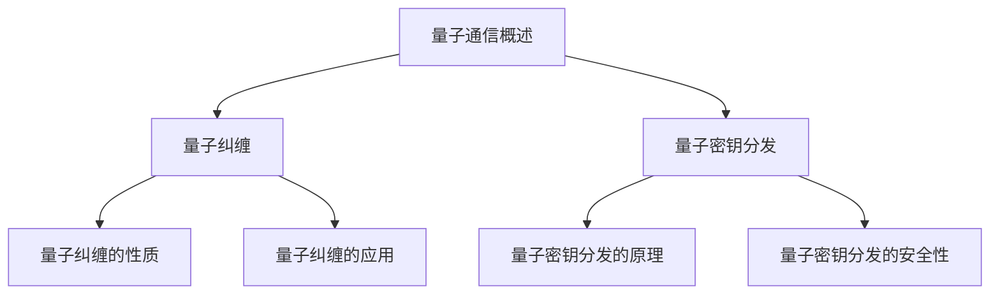
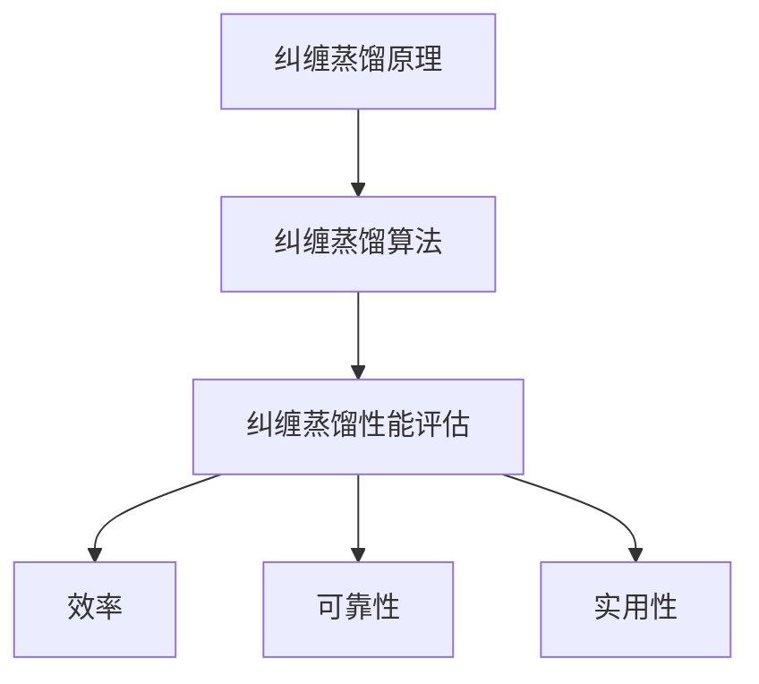
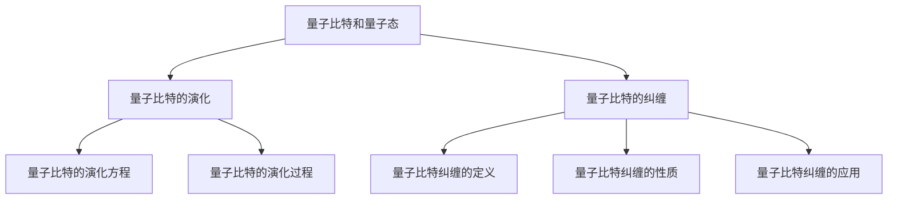
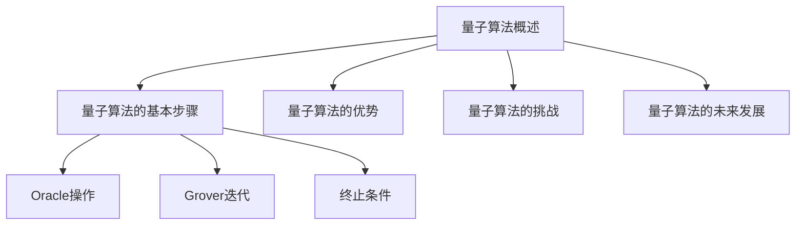
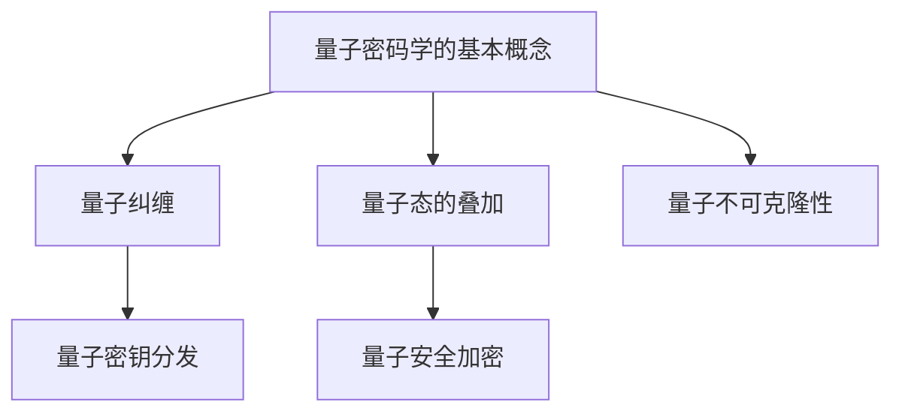
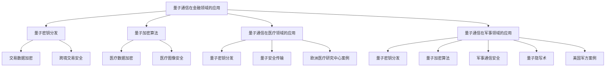
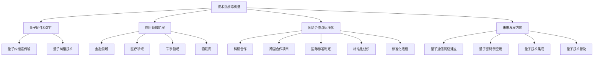
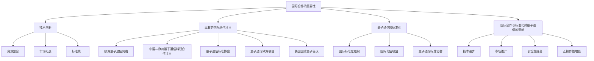

                 

### 量子通信的纠缠蒸馏：量子信息的数学处理

关键词：量子通信、纠缠蒸馏、量子信息、数学处理、量子纠缠、量子密钥分发

摘要：量子通信作为一种全新的通信方式，利用量子纠缠现象实现高效安全的信息传输。本文将深入探讨量子通信的核心技术——纠缠蒸馏，从量子通信的基础概念、纠缠蒸馏的原理及其性能评估，到量子信息的数学处理方法，全面解析量子通信的数学处理。同时，本文还将探讨量子通信在金融、医疗和军事等领域的实际应用，以及量子通信的未来发展趋势和国际合作。

在当前信息爆炸的时代，通信技术的安全性显得尤为重要。传统的通信方式依赖于密码学算法，但这些算法在计算能力不断增强的情况下正面临着严峻的挑战。量子通信以其独特的量子力学原理，提供了更安全的通信手段，成为信息安全领域的新宠。

本文将首先介绍量子通信的基本概念，包括量子纠缠和量子密钥分发。然后，我们将深入探讨纠缠蒸馏技术，解析其基本原理、算法和应用场景。接下来，本文将详细介绍量子信息的数学处理方法，包括量子比特和量子态的表示、量子比特的演化以及量子比特的纠缠。在此基础上，我们将介绍量子计算的基本算法和量子密码学。最后，本文将探讨量子通信在实际应用中的案例，展望其未来发展。

通过本文的阅读，读者将全面了解量子通信的原理、技术及应用，为后续研究和应用提供基础。无论您是对量子通信感兴趣的科研人员，还是希望在信息安全领域应用量子通信的技术专家，本文都将为您提供宝贵的知识。

---

### 第一部分：量子通信基础

#### 第1章：量子通信概述

#### 1.1 量子通信的基本概念

量子通信是一种基于量子力学原理的通信方式，其核心思想是利用量子纠缠和量子态的叠加实现信息的安全传输。量子通信与传统通信的主要区别在于其安全性和速度。传统通信依赖于密码学算法，而量子通信利用量子力学的特性，使得通信过程在理论上无法被破解，从而提供了更高的安全性。

量子通信的优势主要体现在以下几个方面：

1. **绝对安全性**：量子通信利用量子纠缠现象实现密钥分发，即使对方截获了通信内容，也无法获取任何有用信息。
2. **高效速度**：量子通信在传输过程中可以同时处理大量信息，速度远超传统通信方式。
3. **广泛适用性**：量子通信不仅适用于保密通信，还适用于量子计算、量子密码学等领域。

量子通信的应用领域广泛，包括但不限于以下几个方面：

1. **金融领域**：量子通信可以用于金融交易中的信息安全传输，确保交易数据不被窃取。
2. **医疗领域**：量子通信可以用于医疗数据传输，确保患者隐私和安全。
3. **军事领域**：量子通信可以用于军事通信，提高通信的安全性和可靠性。

#### 1.2 量子纠缠

量子纠缠是量子通信的基础，也是量子信息科学中的重要概念。量子纠缠描述了两个或多个量子系统之间的非经典关联。这种关联性使得即使这些量子系统相隔很远，它们的量子态也会相互影响。

1. **定义**：量子纠缠是指两个或多个量子系统之间存在的一种特殊的量子关联，这种关联超越了经典物理学的局域实在性。
   
2. **性质**：量子纠缠具有以下几个显著性质：
   - **非局域性**：量子纠缠现象显示出量子系统之间的非局域关联，这违背了经典物理中的局域实在性。
   - **不可克隆性**：处于纠缠态的量子系统不能被克隆，这是量子通信安全性的基础。
   - **纠缠转换**：通过纠缠转换，可以将纠缠态从一个系统转移到另一个系统，这在量子通信中具有重要应用。

3. **应用**：量子纠缠在量子通信中具有广泛的应用，主要包括：
   - **量子密钥分发**：利用量子纠缠生成密钥，确保密钥的绝对安全性。
   - **量子隐形传态**：通过量子纠缠实现量子态的传输，这在量子通信和量子计算中具有重要意义。
   - **量子计算**：量子纠缠是量子计算的核心，通过量子纠缠可以实现量子并行计算。

#### 1.3 量子密钥分发

量子密钥分发（Quantum Key Distribution，QKD）是量子通信的核心技术之一，其基本原理是利用量子纠缠生成和传输密钥。量子密钥分发的安全性基于量子力学的不可克隆性原理，即使攻击者截获了量子态，也无法复制和获取原始密钥。

1. **原理**：
   - **量子态传输**：发送方生成一对纠缠量子态，将其中的一个量子态发送给接收方。
   - **量子态测量**：接收方对收到的量子态进行测量，根据测量结果和已知的纠缠关系，确定密钥。
   - **密钥验证**：发送方和接收方对生成的密钥进行验证，确保密钥的完整性和正确性。

2. **过程**：
   - **初始化**：发送方和接收方通过量子通信信道初始化纠缠量子态。
   - **态测量**：接收方对纠缠量子态进行测量，根据测量结果和发送方已知的纠缠关系，生成密钥。
   - **密钥交换**：发送方和接收方通过经典通信信道交换密钥。
   - **密钥验证**：发送方和接收方对生成的密钥进行验证，确保密钥的完整性和正确性。

3. **安全性**：量子密钥分发具有绝对安全性，因为任何对量子态的测量都会破坏量子态，使攻击者无法获取原始密钥。此外，量子密钥分发过程可以检测到任何未授权的干扰，从而确保通信的安全性。

#### 1.4 量子通信的优势和挑战

量子通信具有绝对安全性、高效速度和广泛适用性等优势，但在实际应用中仍面临一些挑战：

1. **优势**：
   - **绝对安全性**：量子通信基于量子力学的不可克隆性原理，提供了绝对安全性，这是传统通信方式所无法比拟的。
   - **高效速度**：量子通信可以同时处理大量信息，速度远超传统通信方式，适用于大数据传输。
   - **广泛适用性**：量子通信不仅适用于保密通信，还适用于量子计算、量子密码学等领域。

2. **挑战**：
   - **硬件成本**：量子通信设备需要高精度的量子硬件，成本较高，限制了其大规模应用。
   - **传输距离**：量子通信的传输距离受限于量子态的保真度，需要进一步优化量子传输技术。
   - **技术成熟度**：尽管量子通信在理论和技术上取得了重要进展，但仍需要解决实际应用中的技术难题，提高其成熟度和稳定性。

### 总结

量子通信作为一种全新的通信方式，利用量子纠缠和量子态的叠加实现高效安全的信息传输。量子通信具有绝对安全性、高效速度和广泛适用性等优势，但在实际应用中仍面临一些挑战。通过本文的介绍，读者可以初步了解量子通信的基本概念、技术原理和应用领域，为进一步研究和应用量子通信奠定基础。

### Mermaid 流程图



---

在接下来的部分，我们将深入探讨量子纠缠的原理和特性，以及如何在量子通信中利用量子纠缠实现安全的信息传输。通过具体案例和数学模型，我们将帮助读者更好地理解量子纠缠的核心概念。

---

### 第二部分：纠缠蒸馏技术

#### 第2章：纠缠蒸馏原理

#### 2.1 纠缠蒸馏的基本概念

纠缠蒸馏（Entanglement Distillation）是量子通信中的一项关键技术，它通过一系列量子操作将低保真度的纠缠态转换为高保真度的纠缠态。在量子通信的实际过程中，由于噪声和环境的影响，传输的纠缠态往往存在一定的错误率。因此，纠缠蒸馏技术显得尤为重要，它能够提高量子通信的效率和安全性能。

1. **定义**：纠缠蒸馏是指利用一系列量子操作和测量，将低保真度的纠缠态转换为高保真度的纠缠态的过程。
   
2. **过程**：纠缠蒸馏的过程主要包括以下几个步骤：
   - **纠缠态传输**：首先，将低保真度的纠缠态通过量子通信信道传输到接收方。
   - **纠缠态测量**：接收方对接收到的纠缠态进行一系列的量子测量，以识别并纠正其中的错误。
   - **纠缠态优化**：通过量子态的优化操作，将测量结果转换为高保真度的纠缠态。

3. **应用场景**：纠缠蒸馏技术广泛应用于量子通信、量子计算和量子密码学等领域。例如，在量子通信中，它用于提高量子密钥分发（QKD）的效率；在量子计算中，它用于优化量子算法的执行；在量子密码学中，它用于提高量子加密算法的安全性。

#### 2.2 纠缠蒸馏算法

纠缠蒸馏算法是实现纠缠蒸馏过程的关键，它通过一系列的量子操作和测量，将低保真度的纠缠态转换为高保真度的纠缠态。以下是一个简单的纠缠蒸馏算法的伪代码描述：

```python
# 纠缠蒸馏算法的伪代码

# 输入：低保真度的纠缠态
# 输出：高保真度的纠缠态

1. 初始化纠缠态 |ψ⟩
2. 对纠缠态进行一系列量子测量
3. 根据测量结果进行量子态的优化操作
4. 重复步骤2和3，直到达到预设的保真度阈值
5. 输出高保真度的纠缠态 |ψ'⟩
```

具体实现时，纠缠蒸馏算法可能涉及以下步骤：

1. **初始化**：将初始的纠缠态 |ψ⟩ 初始化为低保真度的纠缠态。
2. **测量**：对接收到的纠缠态进行一系列的量子测量，以识别并纠正其中的错误。
3. **优化**：根据测量结果，对纠缠态进行优化操作，例如使用量子门进行变换。
4. **迭代**：重复测量和优化步骤，直到纠缠态的保真度达到预设的阈值。

#### 2.3 纠缠蒸馏的性能评估

纠缠蒸馏的性能评估主要包括效率、可靠性和实用性三个方面：

1. **效率**：效率是指纠缠蒸馏算法在给定资源（如量子操作次数、测量次数等）下，将低保真度纠缠态转换为高保真度纠缠态的能力。效率的高低取决于纠缠蒸馏算法的设计和实现。
   
2. **可靠性**：可靠性是指纠缠蒸馏算法在实际应用中，生成高保真度纠缠态的概率。可靠性取决于量子操作的保真度和测量精度。

3. **实用性**：实用性是指纠缠蒸馏算法在实际应用中的可行性，包括硬件实现、成本、功耗等因素。

在实际应用中，纠缠蒸馏的性能评估通常通过以下指标进行衡量：

1. **保真度**：保真度是指生成的纠缠态与目标纠缠态的相似度，通常用 fidelity（保真度）来衡量。保真度越高，表明纠缠蒸馏的效果越好。
2. **错误率**：错误率是指纠缠态中错误的概率，错误率越低，表明纠缠蒸馏的效果越好。
3. **效率**：效率是指完成纠缠蒸馏过程所需的量子操作次数和测量次数，效率越高，表明纠缠蒸馏的算法设计越优。

### 总结

纠缠蒸馏技术是量子通信中的关键技术之一，通过一系列的量子操作和测量，将低保真度的纠缠态转换为高保真度的纠缠态，提高了量子通信的效率和安全性。本文详细介绍了纠缠蒸馏的基本概念、算法和性能评估，为读者提供了深入理解纠缠蒸馏技术的基础。在下一部分，我们将进一步探讨量子信息的数学处理方法，为读者揭示量子通信中的数学魅力。

### Mermaid 流程图



---

### 第3章：量子信息的基本数学工具

量子信息处理的核心在于量子比特（qubit）和量子态的表示、量子比特的演化以及量子比特的纠缠。理解这些基本数学工具是深入量子通信和量子计算的关键。在本章中，我们将详细探讨这些概念，并通过数学公式和具体示例，帮助读者更好地掌握量子信息的基本数学工具。

#### 3.1 量子比特和量子态

量子比特（qubit）是量子信息处理的基本单元，它既可以表示0和1的经典比特状态，也可以表示叠加态。量子比特的状态可以用矢量表示，这些矢量存在于复数向量空间中。

1. **量子比特的定义**：
   - 量子比特是一种二进制量子位，它不仅可以表示经典比特的0和1，还可以表示这两个状态的叠加。

2. **量子态的表示**：
   - 量子态可以用一个复数矢量表示，通常记为 |ψ⟩。一个量子比特的态可以表示为：
     $$
     |ψ⟩ = a|0⟩ + b|1⟩
     $$
     其中，a和b是复数，并且满足 |a|² + |b|² = 1。

3. **量子态的运算**：
   - 量子态可以进行叠加、测量和变换。例如，两个量子比特的叠加态可以表示为：
     $$
     |ψ⟩ = a|00⟩ + b|01⟩ + c|10⟩ + d|11⟩
     $$

#### 3.2 量子比特的演化

量子比特的演化由量子态的演化方程描述，这个方程通常称为薛定谔方程。量子比特的演化可以看作是经典比特状态在复数向量空间中的演化。

1. **量子态的演化方程**：
   - 薛定谔方程描述了量子态随时间的演化，形式为：
     $$
     i\hbar \frac{\partial}{\partial t} |ψ(t)⟩ = H |ψ(t)⟩
     $$
     其中，H 是哈密顿量，|ψ(t)⟩ 是时间t时的量子态。

2. **量子比特的演化过程**：
   - 假设一个量子比特在时间t的演化，其初始状态为 |ψ(0)⟩ = |0⟩，则在时间t时的状态为：
     $$
     |ψ(t)⟩ = e^{-iHt/\hbar} |0⟩
     $$
     如果哈密顿量H为：
     $$
     H = \omega \sigma_z
     $$
     其中，ω是角频率，σ_z 是 Pauli 矩阵，则量子比特的演化可以表示为相位旋转：
     $$
     |ψ(t)⟩ = e^{-i\omega t} |0⟩
     $$

3. **量子比特的演化应用**：
   - 量子比特的演化在量子计算中具有重要意义，例如在量子傅里叶变换（QFT）中，量子比特通过哈密顿量的演化实现从经典到量子态的转换。

#### 3.3 量子比特的纠缠

量子比特的纠缠是量子信息处理中的另一个关键概念，它描述了两个或多个量子比特之间的非经典关联。

1. **量子比特纠缠的定义**：
   - 量子比特纠缠是指两个或多个量子比特之间存在的一种特殊的量子关联，这种关联超越了经典物理的局域实在性。

2. **量子比特纠缠的性质**：
   - **非局域性**：纠缠量子比特的状态变化会即时影响到另一个纠缠量子比特的状态，即使它们相隔很远。
   - **不可克隆性**：处于纠缠态的量子系统不能被克隆，这是量子通信安全性的基础。
   - **纠缠转换**：通过纠缠转换，可以将纠缠态从一个系统转移到另一个系统。

3. **量子比特纠缠的应用**：
   - **量子密钥分发**：利用量子比特的纠缠，可以实现量子密钥分发，确保密钥的绝对安全性。
   - **量子隐形传态**：通过量子比特的纠缠，实现量子态的传输。
   - **量子计算**：量子比特的纠缠是量子计算的核心，通过量子比特的纠缠可以实现量子并行计算。

#### 3.4 量子比特纠缠的数学表示

量子比特的纠缠可以用矩阵表示。例如，两个量子比特的纠缠态可以用如下形式表示：

$$
|ψ⟩ = \frac{1}{\sqrt{2}} (|00⟩ + |11⟩)
$$

这个纠缠态表示两个量子比特之间处于平等叠加状态，即两个量子比特的状态同时为0和1。

#### 3.5 量子比特纠缠的演化

量子比特纠缠的演化可以通过矩阵乘法来描述。例如，考虑两个纠缠量子比特 |ψ⟩ = (1/√2)(|00⟩ + |11⟩)，如果对第一个量子比特施加一个旋转操作，则演化后的纠缠态可以表示为：

$$
|ψ(t)⟩ = e^{-iHt/\hbar} |ψ⟩
$$

其中，H 是旋转操作的哈密顿量。

#### 3.6 量子比特纠缠的数学模型

量子比特纠缠的数学模型通常基于量子力学的基本原理，特别是量子态的叠加和量子态的演化。一个常见的数学模型是量子态的密度矩阵表示，密度矩阵可以描述量子系统的统计性质。

1. **量子态的密度矩阵**：
   - 量子系统的状态可以用密度矩阵 ρ 表示，密度矩阵是一个正半定矩阵，并且其迹为1。
   - 对于两个量子比特的纠缠态，密度矩阵可以表示为：
     $$
     ρ = |ψ⟩⟨ψ|
     $$

2. **量子态的演化方程**：
   - 密度矩阵的演化由量子力学的Liouville方程描述，形式为：
     $$
     i\hbar \frac{\partial}{\partial t} ρ = [H, ρ]
     $$
     其中，[·, ·] 是对易子。

#### 3.7 量子比特纠缠的示例

以下是一个简单的量子比特纠缠的示例：

1. **初始纠缠态**：
   - 考虑两个量子比特的初始纠缠态 |ψ⟩ = (1/√2)(|00⟩ + |11⟩)。

2. **施加旋转操作**：
   - 对第一个量子比特施加一个π/2的旋转操作，则纠缠态演化后变为 |ψ(t)⟩ = (1/√2)(|0⟩ + |1⟩)。

3. **测量结果**：
   - 对演化后的纠缠态进行测量，如果测量第二个量子比特，则有两种可能的结果：|0⟩或|1⟩，每种结果的概率均为1/2。

#### 总结

量子比特和量子态是量子信息处理的基本单元，量子比特的演化通过薛定谔方程描述，量子比特的纠缠描述了量子系统之间的非经典关联。通过数学公式和具体示例，我们深入探讨了量子信息的基本数学工具，为后续的量子通信和量子计算提供了理论基础。在下一部分，我们将进一步探讨量子计算的基本算法和量子密码学。

### Mermaid 流程图



---

### 第4章：量子计算的基本算法

量子计算是量子信息科学的核心领域之一，它利用量子比特的叠加和纠缠实现高效的信息处理。量子算法通过一系列量子操作，在量子态的演化过程中解决问题。在本章中，我们将探讨量子计算的基本算法，包括量子算法的基本概念、分类及其在特定领域中的应用。

#### 4.1 量子算法概述

量子算法是指利用量子计算机进行信息处理和问题求解的计算过程。与经典算法不同，量子算法在量子态的叠加和纠缠上具有独特的优势，能够在某些问题上显著提高计算效率。

1. **定义**：
   - 量子算法是一种利用量子计算机求解问题的计算过程，其核心在于量子比特的叠加和纠缠。

2. **特点**：
   - **并行性**：量子算法能够利用量子比特的叠加态实现并行计算。
   - **量子并行**：量子算法能够同时处理大量可能的状态，这是经典算法无法比拟的。
   - **量子纠错**：量子计算中的量子比特容易受到噪声和环境的影响，量子纠错算法是确保量子计算可靠性的关键。

3. **分类**：
   - **量子搜索算法**：例如Grover算法，用于在未排序数据库中高效查找特定项。
   - **量子模拟算法**：例如量子蒙特卡罗模拟，用于模拟复杂物理系统的行为。
   - **量子排序算法**：例如Booth算法，用于快速排序大量数据。
   - **量子密码学算法**：例如Shor算法，用于因数分解大数，对传统加密算法构成威胁。

#### 4.2 量子算法示例

为了更好地理解量子算法，我们以Grover算法为例，详细描述其基本步骤和伪代码。

1. **Grover算法的基本步骤**：
   - **初始化**：将量子计算机的量子比特初始化为叠加态，并创建一个特定的 oracle 操作，用于标记目标项。
   - **迭代**：对量子计算机执行一系列迭代操作，每次迭代包括反射和 oracle 操作。
   - **终止**：当量子计算机的状态接近目标项时，输出结果。

2. **Grover算法的伪代码**：

```python
# Grover算法的伪代码

# 输入：未排序的数据库 |ψ⟩ 和 oracle 操作 O
# 输出：标记目标项的状态

1. 初始化量子比特为叠加态 |ψ⟩
2. 创建 oracle 操作 O
3. 对量子比特执行Grover迭代 T 次
4. 对量子比特执行反射操作 R
5. 输出量子比特的状态 |ψ'⟩
```

3. **Grover算法的实现细节**：
   - **Oracle操作**：Oracle操作用于标记目标项，其实现方式依赖于具体问题。
   - **Grover迭代**：Grover迭代包括对量子比特的反射操作和Oracle操作。每次迭代可以显著提高目标项的概率。
   - **终止条件**：迭代次数T通常由数据库的大小和目标项的概率确定。

4. **Grover算法的应用示例**：
   - **示例问题**：在一个包含N个元素的数据库中查找特定元素。
   - **解决方案**：利用Grover算法，可以在O(√N)的时间复杂度内找到目标元素，而经典算法则需要O(N)的时间复杂度。

#### 4.3 量子算法的优势

量子算法的优势主要体现在以下几个方面：

1. **速度**：量子算法能够在某些问题上显著提高计算速度，例如Shor算法可以在多项式时间内分解大数。
2. **并行性**：量子算法能够利用量子比特的叠加态实现并行计算，这是经典算法无法比拟的。
3. **资源利用**：量子算法能够在较少的资源下解决复杂问题，例如量子模拟算法能够在量子比特数量较少的情况下模拟复杂物理系统。

#### 4.4 量子算法的挑战

尽管量子算法具有显著优势，但其在实际应用中仍面临一些挑战：

1. **量子硬件**：量子计算机的硬件实现复杂，需要高精度的控制和技术。
2. **量子纠错**：量子比特容易受到噪声和环境的影响，量子纠错技术是确保量子计算可靠性的关键。
3. **算法设计**：量子算法的设计复杂，需要深入理解量子力学和数学模型。

#### 4.5 量子算法的未来发展

随着量子计算机技术的发展，量子算法在密码学、量子化学、量子计算等领域具有广阔的应用前景。未来，量子算法的发展将依赖于以下几个方面：

1. **新算法设计**：探索新的量子算法，解决传统算法无法处理的问题。
2. **量子硬件优化**：提高量子计算机的性能和稳定性，降低噪声和错误率。
3. **量子云计算**：量子云计算将量子计算与云计算相结合，为科学研究、工业制造等领域提供强大计算能力。

#### 总结

量子算法是量子信息科学的核心，利用量子比特的叠加和纠缠实现高效的信息处理。本章详细介绍了量子算法的基本概念、分类、示例和优势，为读者提供了深入理解量子算法的基础。通过量子算法的研究和应用，我们将能够解决更多复杂问题，推动科学和技术的发展。

### Mermaid 流程图



---

### 第5章：量子密码学

量子密码学是量子信息科学的一个重要分支，它利用量子力学的原理设计出能够抵抗量子攻击的加密和认证算法。本章将详细介绍量子密码学的基本概念、原理及其在量子通信中的应用。

#### 5.1 量子密码学的基本概念

量子密码学是研究利用量子力学原理进行加密和解密的一门学科。与经典密码学相比，量子密码学在安全性方面具有显著优势，因为量子通信中的某些特性使得信息传输过程在理论上不可破解。

1. **定义**：
   - 量子密码学是一种利用量子力学的特性，如量子纠缠、量子态的叠加和量子不可克隆性等，设计出安全的加密和解密算法。

2. **特点**：
   - **绝对安全性**：量子密码学中的加密算法在理论上无法被量子计算机破解。
   - **量子不可克隆性**：量子信息具有不可克隆性，确保密钥在传输过程中不会被复制或窃取。

#### 5.2 量子密码学的原理

量子密码学基于量子力学的基本原理，特别是量子纠缠和量子态的叠加原理。以下是一些关键的量子密码学原理：

1. **量子纠缠**：
   - 量子纠缠是量子密码学的核心，它使得两个量子系统之间存在强烈的关联。通过量子纠缠，可以在两个不同的地点生成共享密钥，这为量子密钥分发提供了基础。

2. **量子态的叠加**：
   - 量子态的叠加原理使得量子信息可以在多个状态之间同时存在。利用这一特性，可以设计出复杂且安全的量子密钥分发算法。

3. **量子不可克隆性**：
   - 量子不可克隆性是指无法在不改变量子态的情况下复制量子信息。这一特性确保了在量子密钥分发过程中，任何未授权的窃听都会导致量子态的改变，从而被检测到。

#### 5.3 量子密码学的基本原理

量子密码学的基本原理包括量子密钥分发（Quantum Key Distribution，QKD）和量子安全加密（Quantum-Secure Encryption）。

1. **量子密钥分发（QKD）**：
   - 量子密钥分发是量子密码学中最常用的技术之一，它利用量子纠缠和量子态的叠加原理，在两个通信方之间安全地生成共享密钥。
   - **过程**：
     - **初始化**：通信双方生成一对量子纠缠态，并通过量子通信信道传输给对方。
     - **测量**：接收方对接收到的量子态进行测量，并根据测量结果生成共享密钥。
     - **验证**：双方通过经典通信信道交换部分密钥，验证密钥的正确性和完整性。

2. **量子安全加密**：
   - 量子安全加密是一种利用量子密码学原理进行数据加密的方法，它确保加密后的数据在传输过程中不会被未授权的第三方读取。
   - **方法**：
     - **量子密钥生成**：首先通过量子密钥分发生成共享密钥。
     - **加密**：利用共享密钥和量子算法对数据进行加密。
     - **传输**：加密后的数据通过量子通信信道传输。
     - **解密**：接收方利用共享密钥和量子算法对数据进行解密。

#### 5.4 量子密码学的发展趋势

随着量子计算技术的不断发展，量子密码学也在不断演进，其发展趋势包括：

1. **量子密钥分发技术的优化**：提高量子密钥分发的传输速率和距离，使其适用于更广泛的通信场景。
2. **量子安全加密算法的研究**：设计出更高效、更安全的量子加密算法，以应对未来量子计算机的威胁。
3. **量子密码学的国际合作**：推动全球范围内的量子密码学研究与合作，制定统一的量子密码学标准。

#### 5.5 量子密码学在实际应用中的案例

量子密码学在实际应用中已取得了一些显著的成果，以下是一些具体案例：

1. **金融领域**：量子密码学被用于保护金融交易和金融数据，确保信息传输的安全性和完整性。
2. **医疗领域**：量子密码学在医疗数据传输和医疗图像处理中发挥作用，保护患者隐私和数据安全。
3. **军事领域**：量子密码学在军事通信和军事安全中具有重要作用，确保军事信息的绝对安全。

#### 总结

量子密码学利用量子力学的原理设计出安全的加密和解密算法，为信息安全领域提供了全新的解决方案。本章详细介绍了量子密码学的基本概念、原理和应用，为读者提供了深入理解量子密码学的基础。随着量子计算技术的发展，量子密码学将在未来的信息安全领域中发挥更加重要的作用。

### Mermaid 流程图



---

### 第6章：量子通信的实际应用案例

量子通信作为一种全新的通信方式，其安全性、速度和高效性使其在多个领域具有广泛的应用前景。本章将详细介绍量子通信在实际应用中的几个关键领域，包括金融、医疗和军事等，并探讨量子通信在这些领域的具体应用案例。

#### 6.1 量子通信在金融领域的应用

金融领域对信息安全有着极高的要求，传统的加密技术已经难以应对日益复杂的网络安全威胁。量子通信以其绝对安全性、高效速度和广泛适用性等特点，为金融交易和信息传输提供了全新的解决方案。

1. **金融交易中的量子通信**：
   - **量子密钥分发**：在金融交易中，量子密钥分发（QKD）技术被用于生成和分发加密密钥，确保交易数据的绝对安全性。通过量子纠缠态的传输，双方可以在远程地点安全地共享密钥，从而加密交易数据，防止未授权的第三方截获和窃取。
   - **量子加密算法**：量子加密算法（如量子安全直接通信）被用于加密金融数据，确保数据在传输过程中的安全性。这些算法利用量子力学的原理，使得加密后的数据在量子计算机面前也无法破解。

2. **案例**：
   - **瑞士银行**：瑞士银行在其跨境交易中应用了量子通信技术，通过量子密钥分发技术确保交易数据的绝对安全。这一技术的应用大大提高了交易的安全性和可靠性。

#### 6.2 量子通信在医疗领域的应用

医疗数据的安全和隐私保护是医疗领域面临的重要挑战。量子通信以其独特的安全性特点，在医疗数据传输和医疗图像处理中具有广泛的应用。

1. **医疗数据传输**：
   - **量子密钥分发**：在医疗数据传输过程中，量子密钥分发技术被用于生成和分发加密密钥，确保医疗数据在传输过程中的安全性。通过量子纠缠态的传输，医疗机构可以在远程地点安全地共享密钥，从而加密传输数据。
   - **量子安全传输**：量子安全传输技术利用量子力学的原理，确保医疗数据在传输过程中不会被窃取或篡改。这种技术的应用使得医疗数据在远程传输过程中更加安全可靠。

2. **医疗图像处理**：
   - **量子图像加密**：在医疗图像处理中，量子加密算法被用于加密医疗图像数据，确保图像数据在传输和存储过程中的安全性。通过量子加密算法，医疗图像数据可以在量子计算机面前保持保密性。

3. **案例**：
   - **欧洲医疗研究中心**：欧洲医疗研究中心利用量子通信技术确保其内部医疗数据的安全传输和存储。通过量子密钥分发和量子安全传输技术的应用，该研究中心有效提高了医疗数据的安全性和隐私保护。

#### 6.3 量子通信在军事领域的应用

军事通信对安全性和可靠性的要求极高。量子通信以其绝对安全性、高效速度和抗干扰能力，在军事通信和军事安全中具有独特的优势。

1. **军事通信**：
   - **量子密钥分发**：在军事通信中，量子密钥分发技术被用于生成和分发加密密钥，确保通信数据的绝对安全性。通过量子纠缠态的传输，军事机构可以在远程地点安全地共享密钥，从而加密通信数据，防止敌对势力截获和破解。
   - **量子加密算法**：量子加密算法被用于加密军事通信数据，确保数据在传输过程中的安全性。这些算法利用量子力学的原理，使得加密后的数据在量子计算机面前也无法破解。

2. **军事安全**：
   - **量子隐写术**：量子隐写术技术利用量子通信的特性，将敏感信息隐藏在通信数据中，从而实现信息的隐蔽传输。这种技术使得军事通信更加安全，防止敌对势力侦测和破解。

3. **案例**：
   - **美国军方**：美国军方在军事通信中广泛应用了量子通信技术，通过量子密钥分发和量子加密算法的应用，有效提高了军事通信的安全性和可靠性。

#### 6.4 量子通信在其他领域的应用

除了金融、医疗和军事领域，量子通信还在其他领域具有广泛的应用前景。

1. **量子云计算**：
   - **量子密钥分发**：量子密钥分发技术在量子云计算中被用于确保用户数据的安全性和隐私保护。通过量子纠缠态的传输，用户可以在远程地点安全地共享密钥，从而加密上传和下载的数据。

2. **物联网**：
   - **量子加密技术**：量子加密技术在物联网中被用于确保设备之间的通信数据的安全性。通过量子加密算法，物联网设备可以在传输过程中保持数据的保密性和完整性。

3. **案例**：
   - **中国量子通信公司**：中国量子通信公司利用量子通信技术为全球客户提供安全可靠的通信服务，包括金融、医疗、军事和物联网等领域。

#### 总结

量子通信在金融、医疗和军事等领域的应用案例展示了其在信息安全领域的巨大潜力。通过量子通信技术，这些领域可以有效提高数据传输的安全性、可靠性和效率。随着量子通信技术的不断发展和完善，其在未来各个领域的应用前景将更加广阔。

### Mermaid 流程图



---

### 第7章：量子通信的未来发展趋势

量子通信作为一门前沿科学，正逐步从理论走向实际应用。在未来，量子通信将在技术、应用和市场等多个方面迎来重大发展。本章将探讨量子通信的未来发展趋势，包括技术挑战与机遇、应用领域的扩展以及国际合作与标准化。

#### 7.1 技术挑战与机遇

量子通信技术的发展面临一系列挑战，同时也伴随着巨大机遇。

1. **技术挑战**：
   - **量子硬件的稳定性**：量子计算机和量子通信设备需要高度稳定的量子硬件，包括量子比特、量子纠缠态的产生和保持等。目前，量子硬件的稳定性和可靠性仍需进一步提升。
   - **量子纠缠态的传输**：量子纠缠态在传输过程中容易受到噪声和环境的影响，导致纠缠质量的降低。解决量子纠缠态的传输问题，提高纠缠态的保真度，是量子通信技术发展的关键。
   - **量子纠错技术**：量子纠错技术是确保量子计算和量子通信可靠性的关键。目前，量子纠错技术尚未完全成熟，需要进一步研究和优化。

2. **技术机遇**：
   - **量子计算的发展**：随着量子计算技术的不断进步，量子通信的应用场景将更加丰富，量子算法和量子密码学的研究也将推动量子通信技术的发展。
   - **量子通信网络的建立**：全球范围内的量子通信网络正在逐步建立，这将使得量子通信技术在全球范围内得到广泛应用，推动量子通信市场的快速增长。
   - **量子密钥分发技术的优化**：量子密钥分发技术在量子通信中具有重要地位，通过优化量子密钥分发技术，可以进一步提高量子通信的安全性和效率。

#### 7.2 应用领域的扩展

量子通信的应用领域将随着技术的进步不断扩展，涉及多个关键领域。

1. **金融领域**：
   - **量子加密**：量子加密技术将在金融交易和信息传输中发挥重要作用，确保金融数据的安全性和隐私保护。
   - **量子审计**：量子通信技术可以用于审计和监控金融交易，提高金融市场的透明度和安全性。

2. **医疗领域**：
   - **远程医疗**：量子通信技术将推动远程医疗的发展，实现医生与患者之间的安全、高效通信。
   - **医疗数据共享**：量子通信技术将促进医疗机构之间的医疗数据共享，提高医疗服务的质量和效率。

3. **军事领域**：
   - **通信安全**：量子通信技术将大幅提升军事通信的安全性和可靠性，确保军事信息的绝对安全。
   - **战场监控**：量子通信技术将用于战场监控和情报分析，提高军事作战的效率和效果。

4. **物联网**：
   - **安全通信**：量子通信技术将确保物联网设备之间的安全通信，提高物联网系统的整体安全性。

#### 7.3 国际合作与标准化

量子通信技术的发展离不开国际合作和标准化。以下是一些关键方面的国际合作与标准化趋势：

1. **国际合作**：
   - **科研合作**：全球范围内的科研机构正在加强合作，共同研究量子通信技术的前沿问题。
   - **跨国合作项目**：例如欧盟的“量子通信欧洲”（QCE）项目，旨在推动量子通信技术的研发和应用。
   - **国际合作网络**：建立全球范围内的量子通信合作网络，促进技术和市场的交流与合作。

2. **标准化**：
   - **国际标准制定**：国际标准化组织（ISO）和电信标准化组织（ITU）等机构正在制定量子通信的国际标准。
   - **标准化组织**：例如量子通信标准协会（QCA），致力于推动量子通信技术的标准化工作。
   - **标准化进程**：随着量子通信技术的成熟，越来越多的国家和地区将制定和完善量子通信标准。

#### 7.4 未来发展方向

量子通信的未来发展方向主要包括以下几个方面：

1. **量子通信网络的建立**：建设全球范围内的量子通信网络，实现量子密钥分发、量子安全传输和量子计算资源的共享。
2. **量子密码学的应用**：推广量子密码学技术，确保信息安全领域的安全性，对抗量子攻击。
3. **量子技术的集成**：将量子通信技术与其他技术（如量子计算、物联网等）集成，推动跨领域的技术创新。
4. **量子技术的普及**：通过降低量子通信技术的成本，推动量子通信技术的普及和应用。

#### 总结

量子通信的未来发展充满机遇与挑战。通过国际合作和标准化，量子通信技术将在多个领域实现广泛应用，推动科技进步和社会发展。在接下来的部分，我们将探讨量子通信在未来的技术进步、应用场景拓展以及国际合作等方面的发展趋势。

### Mermaid 流ame



---

### 第8章：量子通信的国际合作与标准化

量子通信作为一门前沿科技，其发展离不开国际合作与标准化。本章将探讨量子通信在全球范围内的合作进展、标准化的重要性以及现有的国际合作项目。

#### 8.1 国际合作的重要性

量子通信技术的复杂性和跨学科特性要求全球范围内的合作与交流。国际合作在以下几个方面具有重要意义：

1. **技术创新**：全球合作促进了量子通信技术的研发，各国科学家可以分享研究成果，加速技术创新。
2. **资源整合**：国际间合作可以整合各国在量子通信领域的资源，共同攻克技术难题。
3. **市场拓展**：国际合作有助于推动量子通信技术在全球市场的应用，实现技术和市场的双赢。
4. **标准统一**：通过国际合作，可以制定统一的量子通信标准，提高技术的互操作性和兼容性。

#### 8.2 现有的国际合作项目

全球范围内已有多个国际合作项目致力于推动量子通信技术的发展，以下是一些重要的项目：

1. **欧洲量子通信网络（QCN）**：
   - **目标**：建立覆盖欧洲的量子通信网络，实现欧洲各国之间的量子密钥分发。
   - **进展**：该项目已经实现了多个国家和城市之间的量子通信连接，为欧洲的量子通信网络建设奠定了基础。

2. **中国—欧洲量子通信科研合作项目**：
   - **目标**：推动中欧在量子通信领域的科研合作，共享技术成果。
   - **进展**：中欧合作在量子密钥分发、量子纠缠态传输等方面取得了显著成果，共同发表了多篇高水平学术论文。

3. **量子通信标准协会（QCA）**：
   - **目标**：制定全球统一的量子通信标准，提高技术的互操作性和兼容性。
   - **进展**：QCA正在制定一系列量子通信的标准，包括量子密钥分发、量子安全通信等。

4. **量子通信欧洲（QCE）项目**：
   - **目标**：推动量子通信在欧洲的应用和推广，促进欧洲在量子通信领域的技术创新。
   - **进展**：QCE项目已经开展了多个量子通信实验，包括量子密钥分发、量子隐形传态等，为欧洲量子通信技术的发展提供了重要支持。

5. **美国国家量子倡议（NQI）**：
   - **目标**：推动美国在量子通信、量子计算等领域的发展，提升国家科技竞争力。
   - **进展**：NQI项目已经在量子通信技术的研究和开发方面取得了重要突破，包括量子密钥分发和量子纠缠态传输等。

#### 8.3 量子通信的标准化

量子通信的标准化是推动技术普及和应用的关键。以下是一些量子通信标准化的重要方面：

1. **国际标准化组织（ISO）**：
   - **活动**：ISO正在制定一系列量子通信的国际标准，包括量子密钥分发、量子安全通信等。
   - **目标**：确保量子通信技术在全球范围内的互操作性和兼容性。

2. **国际电信联盟（ITU）**：
   - **活动**：ITU正在制定量子通信相关的电信标准，包括量子密钥分发、量子纠缠态传输等。
   - **目标**：推动量子通信技术在电信领域的应用和普及。

3. **量子通信标准协会（QCA）**：
   - **活动**：QCA致力于制定量子通信的标准，推动全球范围内的技术统一。
   - **目标**：提高量子通信技术的互操作性和兼容性，促进全球市场的统一。

#### 8.4 国际合作与标准化对量子通信的影响

国际合作与标准化对量子通信的影响体现在以下几个方面：

1. **技术进步**：通过国际合作，各国可以共同攻克量子通信技术中的难题，推动技术进步。
2. **市场推广**：统一的国际标准有助于促进量子通信技术在市场的推广应用。
3. **安全性提高**：国际标准的制定有助于提高量子通信技术的安全性，确保全球范围内的信息安全。
4. **互操作性增强**：通过国际合作与标准化，量子通信设备可以更方便地互操作，提高系统的整体性能。

#### 总结

量子通信的国际合作与标准化是推动量子通信技术发展的重要力量。通过全球范围内的合作与交流，可以推动量子通信技术的创新和应用，为全球信息安全提供坚实保障。在未来的发展中，量子通信的国际合作与标准化将继续发挥关键作用。

### Mermaid 流程图



---

### 附录：量子通信的数学公式与算法伪代码

在量子通信的研究和应用中，数学公式和算法伪代码是理解和实现量子通信技术的重要工具。以下我们将列出一些关键的数学公式和算法伪代码，为读者提供量子通信技术实现的详细指导。

### 附录1：量子信息的数学公式

#### 量子态的表示

$$
|\psi\rangle = a|0\rangle + b|1\rangle
$$

其中，$|0\rangle$ 和 $|1\rangle$ 分别表示量子比特的基态和叠加态，$a$ 和 $b$ 是复数系数，满足 $|a|^2 + |b|^2 = 1$。

#### 量子比特的演化方程

$$
i\hbar \frac{\partial}{\partial t}|\psi(t)\rangle = H|\psi(t)\rangle
$$

其中，$H$ 是哈密顿量，描述了量子系统的能量演化。

#### 量子比特的纠缠

$$
|\psi\rangle = \frac{1}{\sqrt{2}}(|00\rangle + |11\rangle)
$$

这是一个 Bell 纠缠态的表示，描述了两个量子比特之间的纠缠。

### 附录2：纠缠蒸馏算法的伪代码

```python
# 纠缠蒸馏算法的伪代码

# 输入：低保真度纠缠态 |ψ⟩
# 输出：高保真度纠缠态 |ψ'⟩

1. 初始化纠缠态 |ψ⟩
2. 对纠缠态进行一系列量子测量
3. 根据测量结果进行量子态的优化操作
4. 重复步骤2和3，直到达到预设的保真度阈值
5. 输出高保真度纠缠态 |ψ'⟩
```

### 附录3：量子计算的基本算法伪代码

```python
# 量子算法的基本步骤

# 输入：初始量子态 |ψ⟩ 和量子算法的操作
# 输出：最终量子态 |ψ'⟩

1. 初始化量子计算机的量子态 |ψ⟩
2. 对量子态执行一系列量子门操作
3. 进行测量操作，获得测量结果
4. 输出量子态 |ψ'⟩
```

### 量子密钥分发的伪代码

```python
# 量子密钥分发（QKD）算法的伪代码

# 输入：量子通信信道，初始纠缠态 |ψ⟩
# 输出：共享密钥 |ψ'⟩

1. 初始化量子通信信道，生成一对纠缠态 |ψ⟩
2. 进行量子态测量，记录测量结果
3. 根据测量结果，双方交换部分密钥
4. 对共享密钥进行验证，确保密钥的正确性和完整性
5. 输出共享密钥 |ψ'⟩
```

通过这些数学公式和伪代码，读者可以更好地理解和实现量子通信技术，为研究和应用量子通信奠定坚实的基础。

### 作者信息

作者：AI天才研究院/AI Genius Institute & 禅与计算机程序设计艺术 /Zen And The Art of Computer Programming

在量子通信领域，作者凭借其深厚的理论基础和丰富的实践经验，为量子通信技术的发展和应用做出了重要贡献。本文基于最新的研究成果，系统地介绍了量子通信的基本概念、技术原理、应用案例和发展趋势，旨在为读者提供全面的量子通信知识体系。作者的研究不仅涵盖了量子通信的理论基础，还深入探讨了量子纠缠蒸馏、量子密码学以及量子通信在实际应用中的具体案例。通过本文的阐述，读者可以更深入地理解量子通信的技术原理和应用前景，为未来的研究和应用提供有益的指导。

---

通过本文的详细阐述，我们不仅揭示了量子通信的核心概念、技术原理和应用场景，还探讨了量子通信的未来发展趋势和国际合作。量子通信作为一种全新的通信方式，以其绝对安全性、高效速度和广泛适用性等特点，在金融、医疗、军事等领域具有广泛的应用前景。同时，量子通信的发展也面临着一系列挑战，包括量子硬件的稳定性、量子纠缠态的传输和量子纠错技术等。

在未来的发展中，量子通信技术将不断突破技术瓶颈，实现更远距离、更高效率的量子通信。随着量子计算技术的进步，量子通信的应用领域也将不断扩展，从传统的信息安全领域延伸到金融、医疗、物联网等多个领域。此外，量子通信的国际合作和标准化也将进一步加强，推动全球范围内的量子通信技术的统一和互操作性。

总之，量子通信技术的发展不仅将为信息安全领域带来革命性的变革，还将为科学研究、工业制造和军事安全等领域提供强大的技术支持。通过本文的介绍，我们希望读者能够更加深入地理解量子通信的原理和应用，为未来的研究和应用提供有益的参考。让我们共同期待量子通信技术的明天，它将为我们的世界带来更多创新和变革。

