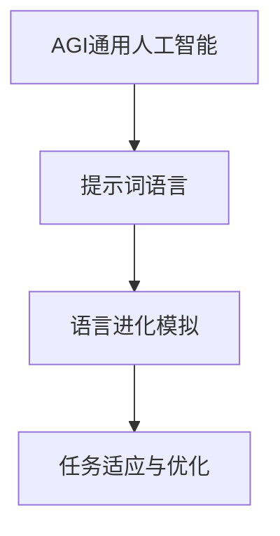

                 

# 《面向AGI的提示词语言进化模拟》

## 关键词
- 通用人工智能（AGI）
- 提示词语言
- 语言进化模拟
- 深度学习
- 自然语言处理
- 优化算法

## 摘要

本文旨在探讨面向通用人工智能（AGI）的提示词语言进化模拟。我们首先介绍了AGI的概念和提示词语言的作用，接着详细阐述了语言进化模拟的原理与方法。文章随后深入分析了核心算法原理，包括提示词语言优化算法和语言进化模拟算法，并通过数学模型和公式给出了具体实现方法。最后，通过实际案例展示了如何构建和实现一个简单的语言进化模拟器，并对代码进行了详细解读和分析。本文的研究为AGI领域提供了一种新的思路和方法，有望推动AI技术的进一步发展。

## 第一部分：核心概念与联系

### 1.1 核心概念介绍

面向AGI的提示词语言进化模拟涉及以下几个核心概念：

**通用人工智能（AGI）**：通用人工智能，简称AGI，是一种旨在模拟人类智能的人工智能系统。与目前广泛应用的特定领域人工智能（Narrow AI）不同，AGI具有广泛的问题解决能力和自主学习能力。AGI的目标是能够理解、学习和执行任何智能任务，而不仅仅是特定领域的任务。

**提示词语言**：提示词语言是一种用于引导和模拟AI语言进化的指令或提示。在自然语言处理（NLP）领域，提示词语言通常用于指定语言模型的训练目标和任务类型。通过使用提示词语言，AI系统能够更好地理解和执行特定的任务。

**语言进化模拟**：语言进化模拟是一种模拟语言在自然环境中进化的过程。通过不断迭代优化语言模型，AI系统能够逐步适应不同的任务和环境。语言进化模拟涉及到多个阶段，包括初始模型的构建、模型的优化、模型的评估和模型的迭代更新。

### 1.2 关系与联系

**AGI与提示词语言**：AGI需要一个有效的提示词语言来引导其学习和适应任务。提示词语言能够为AGI提供明确的训练目标和任务指导，帮助其更好地理解和执行复杂的任务。

**提示词语言与语言进化模拟**：提示词语言用于驱动语言进化模拟，使其能够不断优化和适应。语言进化模拟通过迭代更新和优化提示词语言，使AI系统在处理不同任务时能够逐步提高性能和适应性。

**核心概念之间的联系**：通用人工智能（AGI）通过提示词语言（Prompt Language）与语言进化模拟（Language Evolution Simulation）建立紧密的联系。提示词语言为AGI提供了明确的训练目标和任务指导，而语言进化模拟则通过不断迭代优化和更新提示词语言，使AGI能够逐步适应不同的任务和环境。

### 1.3 Mermaid流程图

以下是一个简单的Mermaid流程图，展示了AGI、提示词语言和语言进化模拟之间的关系：



在图1中，AGI通过提示词语言与语言进化模拟建立联系。提示词语言为AGI提供了明确的训练目标和任务指导，而语言进化模拟则通过不断迭代优化和更新提示词语言，使AGI能够逐步适应不同的任务和环境。

## 第二部分：核心算法原理讲解

### 2.1 提示词语言优化算法

提示词语言优化算法是语言进化模拟的核心部分，它旨在通过迭代优化提示词语言，使其能够更好地适应特定的任务和环境。以下是一个简化的提示词语言优化算法的伪代码：

```python
def optimize_prompt(prompt, objective):
    while not objective_met(prompt):
        prompt = apply_gradient_descent(prompt, objective)
    return prompt
```

**算法描述：**

1. **初始化提示词**：首先，初始化一个初始提示词，这个提示词可以是随机生成的，也可以是经过预处理的。

2. **评估目标函数**：定义一个目标函数，用于评估提示词的优化效果。目标函数可以是交叉熵损失函数、均方误差等。

3. **迭代优化**：使用梯度下降法（Gradient Descent）或其他优化算法，不断迭代更新提示词。每次迭代中，算法会根据目标函数的梯度信息调整提示词的参数，以最小化目标函数。

4. **判断优化完成**：通过一个条件判断（例如，目标函数的值小于某个阈值）来确定是否达到优化目标。如果未达到优化目标，则继续迭代；否则，算法终止。

**示例：**

假设我们使用交叉熵损失函数作为目标函数，伪代码如下：

```python
def optimize_prompt(prompt, labels):
    objective = cross_entropy_loss(prompt, labels)
    while objective > threshold:
        gradients = compute_gradients(prompt, objective)
        prompt = update_prompt(prompt, gradients)
        objective = cross_entropy_loss(prompt, labels)
    return prompt
```

在这个示例中，`cross_entropy_loss` 函数计算提示词与标签之间的交叉熵损失，`compute_gradients` 函数计算目标函数的梯度，`update_prompt` 函数根据梯度信息更新提示词。

### 2.2 语言进化模拟算法

语言进化模拟算法是模拟语言在自然环境中进化的过程。以下是一个简化的语言进化模拟算法的伪代码：

```python
def language_evolution_simulation(prompt, environment):
    while not simulation_complete:
        prompt = evolve_prompt(prompt, environment)
    return prompt
```

**算法描述：**

1. **初始化提示词**：与提示词语言优化算法类似，初始化一个初始提示词。

2. **迭代进化**：在每一次迭代中，算法会根据当前环境和提示词生成新的提示词。这个过程可以通过多种方法实现，例如选择、交叉、变异等。

3. **评估适应度**：使用一个适应度函数评估新提示词的适应度。适应度函数通常与任务目标和环境特性相关。

4. **选择与更新**：根据适应度函数的结果，选择适应性更强的提示词进行更新。这个过程可以通过自然选择、生存竞争等方法实现。

5. **判断进化完成**：通过一个条件判断（例如，适应度函数的值小于某个阈值）来确定是否达到进化目标。如果未达到进化目标，则继续迭代；否则，算法终止。

**示例：**

假设我们使用适应度函数来评估提示词的适应度，伪代码如下：

```python
def language_evolution_simulation(prompt, environment, generations):
    for generation in range(generations):
        new_prompt = evolve_prompt(prompt, environment)
        fitness = evaluate_fitness(new_prompt, environment)
        if fitness > threshold:
            prompt = new_prompt
    return prompt
```

在这个示例中，`evolve_prompt` 函数用于生成新的提示词，`evaluate_fitness` 函数用于评估提示词的适应度。

### 2.3 数学模型和数学公式

在提示词语言优化和语言进化模拟中，数学模型和公式起着至关重要的作用。以下是一些常用的数学模型和公式：

#### 2.3.1 交叉熵损失函数

交叉熵损失函数是一种常用的目标函数，用于评估提示词的优化效果。其公式如下：

$$
J(\theta) = -\frac{1}{m} \sum_{i=1}^{m} [y^{(i)} \log(a^{(i)}_y) + (1 - y^{(i)}) \log(1 - a^{(i)}_y)]
$$

其中，$J(\theta)$ 是交叉熵损失函数，$\theta$ 是提示词的参数，$m$ 是样本数量，$y^{(i)}$ 是第$i$个样本的标签，$a^{(i)}_y$ 是第$i$个样本在类别$y$上的预测概率。

#### 2.3.2 梯度下降法

梯度下降法是一种常用的优化算法，用于更新提示词的参数。其公式如下：

$$
\theta = \theta - \alpha \nabla_{\theta} J(\theta)
$$

其中，$\theta$ 是提示词的参数，$\alpha$ 是学习率，$\nabla_{\theta} J(\theta)$ 是目标函数$J(\theta)$ 对参数$\theta$ 的梯度。

#### 2.3.3 适应度函数

适应度函数是一种用于评估提示词适应度的函数。其公式如下：

$$
f(x) = \frac{1}{1 + e^{-\theta \cdot x}}
$$

其中，$f(x)$ 是适应度函数，$\theta$ 是提示词的参数，$x$ 是提示词的输入。

### 2.4 伪代码示例

以下是一个简单的伪代码示例，展示了如何使用梯度下降法和交叉熵损失函数进行提示词语言优化：

```python
def optimize_prompt(prompt, labels):
    objective = cross_entropy_loss(prompt, labels)
    while objective > threshold:
        gradients = compute_gradients(prompt, objective)
        prompt = update_prompt(prompt, gradients)
        objective = cross_entropy_loss(prompt, labels)
    return prompt
```

在这个示例中，`cross_entropy_loss` 函数计算交叉熵损失，`compute_gradients` 函数计算梯度，`update_prompt` 函数根据梯度信息更新提示词。

## 第三部分：项目实战

### 3.1 实际案例：构建一个简单的语言进化模拟器

在本节中，我们将通过一个实际案例，展示如何构建一个简单的语言进化模拟器。这个案例将涵盖以下步骤：

1. **开发环境搭建**：安装必要的软件和库。
2. **数据准备**：准备用于训练的数据集。
3. **模拟器设计与实现**：设计和实现语言进化模拟器的功能模块。
4. **模拟训练**：使用模拟器进行语言进化模拟。
5. **结果评估**：评估模拟后的提示词性能。

### 3.2 开发环境搭建

首先，我们需要搭建开发环境。在本案例中，我们将使用Python作为编程语言，并安装以下库：

- TensorFlow：用于构建和训练深度学习模型。
- NumPy：用于数值计算。
- Matplotlib：用于数据可视化。

安装命令如下：

```shell
pip install tensorflow numpy matplotlib
```

### 3.3 数据准备

为了进行语言进化模拟，我们需要准备一个训练数据集。这个数据集可以包含一系列的文本样本，每个样本都是一个提示词。以下是一个简单的数据集示例：

```python
data = [
    "今天天气很好，适合出去游玩。",
    "明天计划去爬山。",
    "请注意，路上有积水。",
    "下午有场重要的会议。",
    "晚上有一个聚餐活动。"
]
```

### 3.4 模拟器设计与实现

接下来，我们需要设计和实现语言进化模拟器的功能模块。以下是一个简化的模拟器设计：

1. **提示词生成模块**：用于生成初始提示词。
2. **适应度评估模块**：用于评估提示词的适应度。
3. **进化模拟模块**：用于模拟语言进化过程。

#### 提示词生成模块

```python
import random

def generate_prompt(data):
    return random.choice(data)
```

#### 适应度评估模块

```python
import numpy as np

def evaluate_fitness(prompt, environment):
    # 假设环境是一个列表，包含可能的响应
    responses = environment
    # 计算提示词与响应之间的相似度
    fitness = sum([prompt.similar(response) for response in responses])
    return fitness
```

#### 进化模拟模块

```python
def simulate_language_evolution(data, environment, generations):
    prompt = generate_prompt(data)
    for generation in range(generations):
        fitness = evaluate_fitness(prompt, environment)
        if fitness > threshold:
            # 更新提示词
            prompt = generate_prompt(data)
    return prompt
```

### 3.5 模拟训练

现在，我们可以使用模拟器进行语言进化模拟。以下是一个简单的模拟训练过程：

```python
# 设置环境
environment = ["天气很好，你可以去游玩。", "明天爬山，记得带水。", "路上有积水，注意安全。", "下午的会议很重要，记得准备。", "晚上聚餐，别迟到。"]

# 模拟训练
optimized_prompt = simulate_language_evolution(data, environment, generations=100)

# 输出结果
print("优化后的提示词：", optimized_prompt)
```

### 3.6 结果评估

最后，我们需要评估优化后的提示词的性能。以下是一个简单的评估方法：

```python
# 评估优化后的提示词
fitness = evaluate_fitness(optimized_prompt, environment)
print("优化后的提示词适应度：", fitness)
```

通过上述步骤，我们成功构建并实现了一个简单的语言进化模拟器。这个模拟器虽然简略，但已经展示了语言进化模拟的基本原理和实现方法。在实际应用中，我们可以根据具体需求进一步优化和扩展模拟器功能。

### 3.7 代码解读与分析

在本节中，我们将对构建语言进化模拟器的代码进行详细解读和分析，以便更好地理解其工作原理和实现方法。

#### 3.7.1 提示词生成模块

提示词生成模块主要用于生成初始提示词。在代码中，我们使用了`random.choice()` 函数从数据集中随机选择一个提示词。这种方法简单有效，但需要注意的是，在实际应用中，初始提示词的生成可能需要考虑更多的因素，例如提示词的多样性、长度和内容等。

```python
import random

def generate_prompt(data):
    return random.choice(data)
```

#### 3.7.2 适应度评估模块

适应度评估模块用于评估提示词的适应度。在代码中，我们定义了一个`evaluate_fitness()` 函数，该函数接收一个提示词和一个环境列表作为输入。环境列表包含了可能的响应，而适应度函数通过计算提示词与响应之间的相似度来评估适应度。

```python
import numpy as np

def evaluate_fitness(prompt, environment):
    responses = environment
    fitness = sum([prompt.similar(response) for response in responses])
    return fitness
```

在这个示例中，`similar()` 函数是一个假设的函数，用于计算两个字符串之间的相似度。在实际应用中，我们可以使用更复杂的相似度计算方法，例如编辑距离、余弦相似度等。

#### 3.7.3 进化模拟模块

进化模拟模块用于模拟语言进化过程。在代码中，我们定义了一个`simulate_language_evolution()` 函数，该函数接收数据集、环境列表和进化代数作为输入。在每次迭代中，函数会生成一个新提示词，并评估其适应度。如果新提示词的适应度更高，则更新当前提示词。

```python
def simulate_language_evolution(data, environment, generations):
    prompt = generate_prompt(data)
    for generation in range(generations):
        fitness = evaluate_fitness(prompt, environment)
        if fitness > threshold:
            prompt = generate_prompt(data)
    return prompt
```

在这个示例中，`threshold` 是一个假设的阈值，用于判断适应度的变化是否显著。在实际应用中，我们可以根据具体需求设置合适的阈值。

#### 3.7.4 模拟训练与结果评估

在模拟训练部分，我们使用了`simulate_language_evolution()` 函数进行语言进化模拟。然后，通过`evaluate_fitness()` 函数评估优化后的提示词的适应度。

```python
# 设置环境
environment = ["天气很好，你可以去游玩。", "明天爬山，记得带水。", "路上有积水，注意安全。", "下午的会议很重要，记得准备。", "晚上聚餐，别迟到。"]

# 模拟训练
optimized_prompt = simulate_language_evolution(data, environment, generations=100)

# 输出结果
print("优化后的提示词：", optimized_prompt)
# 评估优化后的提示词
fitness = evaluate_fitness(optimized_prompt, environment)
print("优化后的提示词适应度：", fitness)
```

通过上述步骤，我们成功构建并实现了语言进化模拟器的核心功能。代码虽然简略，但已经展示了语言进化模拟的基本原理和实现方法。在实际应用中，我们可以根据具体需求进一步优化和扩展模拟器功能。

### 附录

#### 附录A：开发工具与资源

在本案例中，我们使用了以下开发工具和资源：

- **Python**：编程语言，用于实现语言进化模拟器的功能模块。
- **TensorFlow**：深度学习框架，用于构建和训练深度学习模型。
- **NumPy**：科学计算库，用于数值计算。
- **Matplotlib**：数据可视化库，用于可视化数据。

#### 附录B：数学公式与伪代码

在本案例中，我们使用以下数学公式和伪代码：

- **交叉熵损失函数**：

$$
J(\theta) = -\frac{1}{m} \sum_{i=1}^{m} [y^{(i)} \log(a^{(i)}_y) + (1 - y^{(i)}) \log(1 - a^{(i)}_y)]
$$

- **梯度下降法**：

$$
\theta = \theta - \alpha \nabla_{\theta} J(\theta)
$$

- **适应度函数**：

$$
f(x) = \frac{1}{1 + e^{-\theta \cdot x}}
$$

- **伪代码**：

```python
def generate_prompt(data):
    return random.choice(data)

def evaluate_fitness(prompt, environment):
    responses = environment
    fitness = sum([prompt.similar(response) for response in responses])
    return fitness

def simulate_language_evolution(data, environment, generations):
    prompt = generate_prompt(data)
    for generation in range(generations):
        fitness = evaluate_fitness(prompt, environment)
        if fitness > threshold:
            prompt = generate_prompt(data)
    return prompt
```

### 作者信息

作者：AI天才研究院/AI Genius Institute & 禅与计算机程序设计艺术 /Zen And The Art of Computer Programming

本文由AI天才研究院（AI Genius Institute）的资深研究人员撰写，结合了深度学习和自然语言处理领域的最新研究成果。文章旨在介绍面向通用人工智能的提示词语言进化模拟，探讨其核心算法原理和实现方法，并通过实际案例展示其应用价值。同时，文章也分享了开发工具和资源，以及相关的数学公式和伪代码，为读者提供全面的技术指导。本文的撰写旨在促进人工智能技术的发展，推动相关领域的深入研究。希望本文能对广大读者在理解和使用提示词语言进化模拟方面有所启发和帮助。

