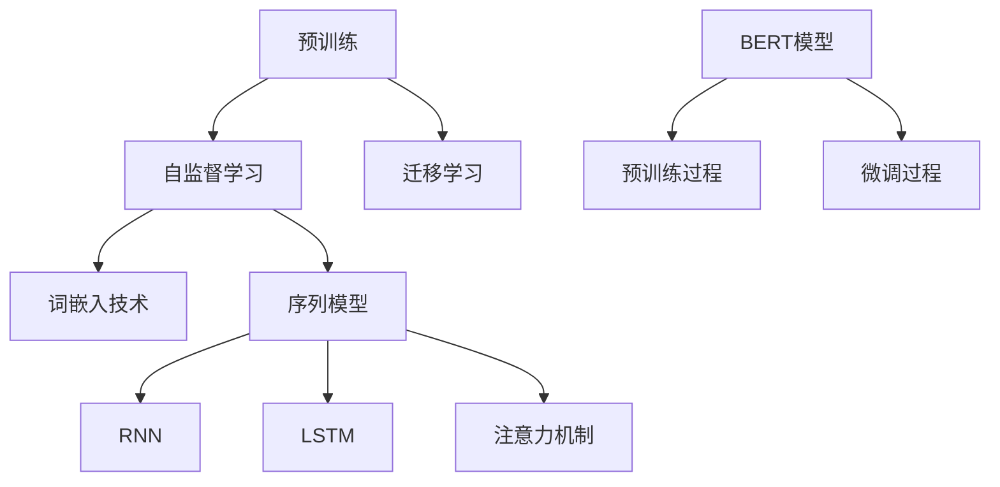

                 

### 引言

预训练与微调是当前深度学习领域中最热门的话题之一，它们极大地推动了自然语言处理（NLP）、计算机视觉（CV）以及其他领域的发展。预训练（Pretraining）是指在一个大规模的语料库或数据集上训练深度神经网络模型，使其获得对通用知识的理解和表达能力。而微调（Fine-tuning）则是针对特定任务对预训练模型进行进一步的训练，以适应具体的应用场景。

预训练技术的核心在于自监督学习（Self-supervised Learning），即在不依赖于标注数据的条件下，通过自动生成监督信号来训练模型。这种方法能够大幅提升模型的泛化能力，使其在未见过的数据上也能取得良好的性能。迁移学习（Transfer Learning）则是预训练技术的延伸，通过在预训练模型的基础上进一步训练，使其能够在不同的任务上表现优异。

微调则是在预训练的基础上，对模型进行针对性的调整，以适应特定的任务需求。微调技术不仅能够缩短训练时间，提高模型的性能，还能降低对大量标注数据的依赖。在实际应用中，微调和预训练技术常常结合使用，以实现最佳的效果。

本文旨在详细探讨预训练与微调的方法，从基本概念、技术原理、模型架构、优化方法、实际应用等多个角度进行全面分析。通过本文，读者将能够深入了解预训练与微调的核心技术，掌握其实际应用的方法和技巧。

### 关键词

- 预训练
- 微调
- 自监督学习
- 迁移学习
- 模型架构
- 优化方法
- 实际应用

### 摘要

本文将深入探讨预训练与微调技术在深度学习领域的应用。首先，我们将介绍预训练的基本概念和原理，包括自监督学习和迁移学习等关键技术。接着，我们将详细分析预训练模型的常见架构，如BERT模型，以及其预训练和微调的过程。此外，本文还将探讨预训练模型的优化方法，包括优化算法、正则化技术和调优技巧。随后，我们将转向微调技术，介绍其基本原理和方法，包括微调流程、策略和优化技巧。最后，本文将结合实际案例，展示预训练与微调在企业应用中的效果，并提出面临的挑战和解决方案。通过本文的阅读，读者将能够全面掌握预训练与微调的核心技术，并了解其实际应用的方法和技巧。

### 第一部分：预训练技术基础

#### 第1章：预训练的基本概念与原理

##### 1.1 预训练的定义

预训练是一种深度学习技术，其核心思想是在一个大规模的数据集上进行训练，使模型具备一定的通用语言理解和知识表示能力。在传统训练方法中，模型通常是在有监督学习（Supervised Learning）的场景下进行训练，即需要大量标注数据进行训练。而预训练则采用自监督学习（Self-supervised Learning）的方法，利用未标注的数据生成监督信号，使得模型在不需要人工标注的情况下也能够学习到丰富的知识。

预训练与传统训练的主要区别在于：

1. **数据来源**：预训练使用的是未标注的大规模数据，如互联网文本、新闻、对话等，而传统训练依赖于大量标注数据。
2. **学习目标**：预训练的主要目标是让模型具备强大的语言理解和知识表示能力，而传统训练则更注重于特定任务上的性能。
3. **模型架构**：预训练通常采用大规模的深度神经网络，如Transformer模型，而传统训练则可能使用简单的神经网络或决策树等。

##### 1.2 预训练的关键技术

预训练技术主要包括以下几种关键技术：

1. **语言模型预训练**：语言模型预训练是最常见的预训练方法之一，其核心是训练一个能够预测下一个单词或词汇的模型。这种模型在处理自然语言文本时能够学习到词汇之间的关系和上下文信息，从而提升其语言理解和生成能力。

2. **自监督学习**：自监督学习是预训练技术的核心，它通过从未标注的数据中自动生成监督信号来训练模型。常见的自监督学习任务包括语言建模、掩码语言模型（Masked Language Model, MLM）、序列标注（Sequence Labeling）等。

3. **迁移学习**：迁移学习是指将预训练模型在不同任务上进行进一步的训练，以提升其在特定任务上的性能。通过迁移学习，模型可以共享预训练阶段的通用知识，从而在新的任务上取得更好的效果。

##### 1.3 预训练的优势与应用

预训练技术具有以下几大优势：

1. **提高模型泛化能力**：预训练模型通过在大规模未标注数据上学习，能够获取丰富的通用知识，从而提升其在未见过的数据上的表现。

2. **缩短训练时间**：由于预训练模型已经在大规模数据上学习到了一些基础知识，因此在新任务上的训练时间相对较短，可以快速适应新的任务需求。

3. **减少对标注数据的依赖**：预训练模型通过自监督学习的方式，能够在没有大量标注数据的情况下进行训练，从而降低了对标注数据的依赖。

预训练技术广泛应用于以下领域：

1. **自然语言处理（NLP）**：预训练模型在文本分类、机器翻译、问答系统、情感分析等任务上取得了显著的性能提升。

2. **计算机视觉（CV）**：预训练模型在图像分类、目标检测、图像分割等任务上表现出色，特别是在没有大量标注数据的情况下。

3. **其他领域**：预训练技术还在语音识别、推荐系统、生物信息学等领域得到广泛应用，取得了良好的效果。

#### 第2章：预训练模型架构

##### 2.1 词嵌入技术

词嵌入（Word Embedding）是将词汇映射到低维度的向量空间中，以便在计算机上进行处理。词嵌入技术的核心思想是利用词汇之间的语义关系来学习向量表示。

**基本原理**：

- **分布式表示**：词嵌入将每个词汇表示为一个向量，向量中的每一个维度对应词汇的一个特征。
- **语义关系**：通过学习词汇之间的语义关系，如相似性、相关性等，来优化词向量的表示。

**常见的词嵌入模型**：

- **词袋模型（Bag of Words, BoW）**：将文本表示为词汇的频率分布，但无法捕捉词汇的顺序和语义信息。
- **连续词袋（Continuous Bag of Words, CBOW）**：通过上下文词汇预测中心词汇，用于训练词嵌入模型。
- **Skip-Gram**：通过中心词汇预测周围词汇，用于训练词嵌入模型。
- **Word2Vec**：基于CBOW和Skip-Gram的词嵌入模型，通过神经网络学习词汇的向量表示。
- **GloVe（Global Vectors for Word Representation）**：通过矩阵分解学习词汇的向量表示，能够更好地捕捉词汇之间的语义关系。

##### 2.2 序列模型与注意力机制

序列模型（Sequence Model）是处理序列数据的一种神经网络模型，常用于自然语言处理、语音识别、时间序列分析等领域。序列模型能够捕捉序列数据中的时序关系和上下文信息。

**常见的序列模型**：

- **循环神经网络（Recurrent Neural Network, RNN）**：通过循环结构来处理序列数据，但存在梯度消失和梯度爆炸等问题。
- **长短期记忆网络（Long Short-Term Memory, LSTM）**：通过引入记忆单元来克服RNN的梯度消失问题，但计算复杂度高。
- **门控循环单元（Gated Recurrent Unit, GRU）**：在LSTM的基础上简化结构，计算复杂度更低。

注意力机制（Attention Mechanism）是一种用于捕捉序列数据中不同部分重要性的方法。注意力机制通过加权操作来动态调整输入序列中每个部分对输出的贡献。

**注意力机制的应用**：

- **编码-解码模型（Encoder-Decoder Model）**：在机器翻译、问答系统等任务中，通过编码器和解码器之间的注意力机制来捕捉源语言和目标语言之间的对应关系。
- **Transformer模型**：基于自注意力机制的全注意力模型，在NLP任务中表现出色。

##### 2.3 BERT模型详解

BERT（Bidirectional Encoder Representations from Transformers）是由Google Research在2018年提出的一种预训练模型，主要用于自然语言处理任务。

**模型架构**：

- **编码器**：采用Transformer模型作为编码器，通过多头自注意力机制来捕捉序列数据中的长期依赖关系。
- **解码器**：与编码器相同，用于解码生成目标序列。

**预训练过程**：

1. **遮掩语言模型（Masked Language Model, MLM）**：在输入序列中随机遮掩一些词汇，并预测这些遮掩词汇。
2. **下一句预测（Next Sentence Prediction, NSP）**：预测两个句子是否在输入序列中相邻。

**BERT模型的优势与应用**：

- **双向编码**：BERT采用双向编码器，能够捕捉序列中的双向依赖关系，从而提升模型的性能。
- **大规模预训练**：BERT在数十亿规模的语料库上进行预训练，使模型具备强大的语言理解和生成能力。
- **广泛适用性**：BERT在文本分类、问答系统、机器翻译等任务中表现出色，成为NLP领域的重要模型。

#### 第3章：预训练模型的优化方法

##### 3.1 优化算法

优化算法是预训练过程中至关重要的部分，它用于更新模型参数以最小化损失函数。以下是一些常用的优化算法：

**1. 梯度下降法（Gradient Descent）**

- **基本原理**：通过计算损失函数关于模型参数的梯度，并沿着梯度的反方向更新参数。
- **缺点**：收敛速度慢，可能陷入局部最小值。

**2. Adam优化器（Adaptive Moment Estimation）**

- **基本原理**：结合了梯度下降法和动量方法，通过自适应调整学习率。
- **优势**：收敛速度快，能够避免陷入局部最小值。

**3. RMSprop优化器（Root Mean Square Propagation）**

- **基本原理**：基于梯度的均方根值来更新参数。
- **优势**：在稀疏数据上表现较好。

##### 3.2 正则化技术

正则化技术用于防止模型过拟合，提高其泛化能力。以下是一些常用的正则化方法：

**1. 数据增强（Data Augmentation）**

- **基本原理**：通过对原始数据进行变换，生成新的数据样本，从而增加模型的训练样本量。
- **应用**：图像旋转、翻转、裁剪等。

**2. Dropout（丢弃法）**

- **基本原理**：在训练过程中随机丢弃部分神经元，以防止模型过拟合。
- **优势**：简单有效，适用于多层神经网络。

**3. 学习率调度（Learning Rate Scheduling）**

- **基本原理**：动态调整学习率，以优化模型的收敛速度和稳定性。
- **方法**：线性下降、指数衰减、余弦退火等。

##### 3.3 预训练模型调优技巧

**1. 预训练模型的微调**

- **基本原理**：在预训练模型的基础上，针对特定任务进行进一步的训练。
- **调优方法**：调整学习率、训练轮次、批量大小等超参数。

**2. 超参数调优**

- **基本原理**：通过调整模型超参数，优化模型性能。
- **方法**：网格搜索、随机搜索、贝叶斯优化等。

**3. 多模型集成（Model Ensemble）**

- **基本原理**：将多个模型的结果进行投票或平均，以提升预测的准确性和稳定性。
- **优势**：减少模型误差，提高模型泛化能力。

### 第二部分：微调技术

#### 第4章：微调的基本原理与方法

##### 4.1 微调的定义

微调（Fine-tuning）是指在一个预训练模型的基础上，针对特定任务进行进一步的训练。通过微调，模型可以适应不同的任务需求，从而提高其在特定任务上的性能。

微调与预训练的关系如下：

- **预训练**：在大规模未标注数据集上进行训练，使模型具备一定的通用语言理解和知识表示能力。
- **微调**：在预训练的基础上，针对特定任务进行进一步训练，以适应具体的应用场景。

微调的目标和任务主要包括：

1. **特定任务性能提升**：通过微调，模型可以在特定任务上取得更好的性能。
2. **模型快速适应**：预训练模型已经学习到了大量的通用知识，通过微调可以快速适应新的任务需求。
3. **减少标注数据依赖**：微调可以在较少标注数据的情况下，提高模型的性能。

##### 4.2 微调流程

微调流程主要包括以下几个步骤：

1. **数据准备**：收集并处理与任务相关的数据集，进行数据预处理，如文本清洗、分词、标签化等。
2. **模型选择**：选择一个预训练模型作为微调的基础，可以选择已经在预训练阶段学习到丰富知识的模型，如BERT、GPT等。
3. **模型加载**：加载预训练模型的权重，通常使用预训练模型的开源实现。
4. **模型微调**：在特定任务上对模型进行训练，调整模型的参数以适应新任务。训练过程中，需要调整学习率、训练轮次等超参数。
5. **评估与优化**：在训练过程中，使用验证集评估模型的性能，并根据评估结果调整模型或超参数，以达到最佳性能。

##### 4.3 微调策略

微调策略主要包括以下几种：

1. **从头训练（Scratch Training）**：在预训练模型的基础上，重新从零开始训练模型。这种方法适用于模型架构较小或数据量较大的情况。
2. **全量微调（Full Fine-tuning）**：在预训练模型的基础上，对整个模型进行微调，包括编码器和解码器。这种方法适用于模型架构较大或任务复杂度较高的情况。
3. **部分微调（Partial Fine-tuning）**：只对预训练模型的特定部分进行微调，如只微调整量层或部分隐藏层。这种方法适用于模型架构较大或训练时间有限的情况。
4. **迁移学习（Transfer Learning）**：将预训练模型在不同任务上进行进一步的训练，以提升其在特定任务上的性能。这种方法适用于具有相似任务特征的情况。

#### 第5章：微调模型优化技巧

##### 5.1 超参数调整

超参数（Hyperparameters）是模型训练过程中需要手动调整的重要参数，如学习率、训练轮次、批量大小等。超参数的选取对模型性能具有重要影响，以下是一些常见的超参数调整方法：

1. **学习率（Learning Rate）**：学习率控制着模型参数更新的速度，较小的学习率可能导致训练过程缓慢，较大的学习率可能导致模型过拟合或发散。常用的学习率调整方法包括线性衰减、指数衰减、余弦退火等。

2. **训练轮次（Number of Epochs）**：训练轮次是指模型在训练集上完整训练的次数。过多的训练轮次可能导致模型过拟合，过少的训练轮次可能导致模型欠拟合。通常需要通过交叉验证来确定最佳的训练轮次。

3. **批量大小（Batch Size）**：批量大小是指每次训练时参与梯度计算的样本数量。较小的批量大小可以降低过拟合的风险，但会增加训练时间；较大的批量大小可以提高计算效率，但可能导致梯度消失或梯度爆炸。常用的批量大小包括32、64、128等。

##### 5.2 模型结构调整

模型结构调整是指在微调过程中，对模型的结构进行调整，以优化模型性能。以下是一些常见的模型结构调整方法：

1. **模型剪枝（Model Pruning）**：模型剪枝是通过移除模型中不重要的参数或神经元来减小模型规模，从而提高计算效率和存储效率。常用的剪枝方法包括权重剪枝、结构剪枝等。

2. **模型压缩（Model Compression）**：模型压缩是指通过压缩模型参数和结构，减小模型规模和计算复杂度。常用的压缩方法包括量化、知识蒸馏等。

3. **模型融合（Model Fusion）**：模型融合是指将多个模型的结果进行融合，以提升模型的预测性能和稳定性。常用的融合方法包括加权平均、投票等。

##### 5.3 实时微调

实时微调（Online Fine-tuning）是指在模型部署后，根据用户反馈或新数据对模型进行实时更新和优化。实时微调具有以下优势：

1. **快速适应**：实时微调可以快速适应新的用户需求或数据变化，从而提高模型性能。

2. **持续优化**：通过实时微调，模型可以持续学习和优化，以保持最佳的预测性能。

3. **降低成本**：实时微调可以减少重新训练和部署模型的时间和成本。

实时微调的主要挑战包括：

1. **数据质量和稳定性**：实时微调依赖于用户反馈或新数据，数据的质量和稳定性对模型性能至关重要。

2. **计算资源和存储成本**：实时微调需要处理大量数据和更新模型参数，对计算资源和存储成本有较高要求。

3. **模型解释性和可解释性**：实时微调可能导致模型复杂度和参数数量增加，从而降低模型的解释性和可解释性。

#### 第6章：微调在自然语言处理中的应用

##### 6.1 文本分类任务

文本分类（Text Classification）是将文本数据划分为预定义的类别，是自然语言处理中的重要任务之一。微调技术在文本分类任务中具有显著的优势。

**微调模型在文本分类中的应用**：

1. **预训练模型的选择**：选择一个预训练的文本分类模型，如BERT、GPT等。这些模型已经在大规模语料库上进行了预训练，具备较强的语言理解和分类能力。

2. **数据预处理**：对文本数据进行预处理，包括分词、去停用词、词嵌入等。预处理步骤有助于提高模型的训练效果和分类性能。

3. **微调过程**：将预训练模型加载到特定的文本分类任务中，调整模型参数以适应新任务。微调过程中，需要调整学习率、训练轮次等超参数，以优化模型性能。

**伪代码解释**：

```
# 加载预训练的BERT模型
model = BERT_model()

# 加载预处理后的数据
train_data = load_preprocessed_data('train')
val_data = load_preprocessed_data('val')

# 设置微调的超参数
learning_rate = 0.001
num_epochs = 3

# 微调模型
for epoch in range(num_epochs):
    for batch in train_data:
        model.zero_grad()
        output = model(batch)
        loss = compute_loss(output, batch.label)
        loss.backward()
        optimizer.step()

# 评估模型在验证集上的性能
val_loss = evaluate_model(model, val_data)
print("Validation Loss:", val_loss)
```

##### 6.2 问答系统

问答系统（Question Answering, QA）是一种智能交互系统，能够理解和回答用户提出的问题。微调技术在问答系统中发挥着重要作用。

**微调模型在问答系统中的应用**：

1. **预训练模型的选择**：选择一个预训练的问答模型，如BERT、RoBERTa等。这些模型已经在大规模语料库上进行了预训练，具备较强的语义理解和问答能力。

2. **数据预处理**：对问答数据集进行预处理，包括提取问题、回答对、分词、去停用词等。预处理步骤有助于提高模型的训练效果和问答性能。

3. **微调过程**：将预训练模型加载到特定的问答任务中，调整模型参数以适应新任务。微调过程中，需要调整学习率、训练轮次等超参数，以优化模型性能。

**伪代码解释**：

```
# 加载预训练的BERT模型
model = BERT_model()

# 加载预处理后的问答数据
train_data = load_preprocessed_qa_data('train')
val_data = load_preprocessed_qa_data('val')

# 设置微调的超参数
learning_rate = 0.001
num_epochs = 3

# 微调模型
for epoch in range(num_epochs):
    for batch in train_data:
        model.zero_grad()
        output = model(batch['question'], batch['answer'])
        loss = compute_loss(output, batch['label'])
        loss.backward()
        optimizer.step()

# 评估模型在验证集上的性能
val_loss = evaluate_model(model, val_data)
print("Validation Loss:", val_loss)
```

##### 6.3 机器翻译

机器翻译（Machine Translation, MT）是将一种自然语言文本自动翻译成另一种自然语言文本的任务。微调技术在机器翻译中具有显著的应用价值。

**微调模型在机器翻译中的应用**：

1. **预训练模型的选择**：选择一个预训练的机器翻译模型，如Transformer、GPT等。这些模型已经在大规模语料库上进行了预训练，具备较强的语言理解和翻译能力。

2. **数据预处理**：对机器翻译数据集进行预处理，包括分词、去停用词、序列对齐等。预处理步骤有助于提高模型的训练效果和翻译性能。

3. **微调过程**：将预训练模型加载到特定的机器翻译任务中，调整模型参数以适应新任务。微调过程中，需要调整学习率、训练轮次等超参数，以优化模型性能。

**伪代码解释**：

```
# 加载预训练的Transformer模型
model = Transformer_model()

# 加载预处理后的翻译数据
train_data = load_preprocessed_translation_data('train')
val_data = load_preprocessed_translation_data('val')

# 设置微调的超参数
learning_rate = 0.001
num_epochs = 3

# 微调模型
for epoch in range(num_epochs):
    for batch in train_data:
        model.zero_grad()
        output = model(batch['source'], batch['target'])
        loss = compute_loss(output, batch['label'])
        loss.backward()
        optimizer.step()

# 评估模型在验证集上的性能
val_loss = evaluate_model(model, val_data)
print("Validation Loss:", val_loss)
```

### 第三部分：预训练与微调的实际应用

#### 第7章：预训练与微调的企业应用案例

##### 7.1 企业级应用场景

预训练与微调技术在企业级应用中具有广泛的应用场景，尤其是在自然语言处理和计算机视觉领域。

**自然语言处理领域的应用**：

1. **智能客服系统**：预训练与微调技术可以用于构建智能客服系统，实现自动回答用户问题和提供个性化服务。通过微调预训练模型，系统能够快速适应不同领域的知识和语言风格，提高用户满意度。

2. **文本分类与主题检测**：预训练模型可以用于对大量文本数据进行分类和主题检测，帮助企业分析和挖掘用户需求和市场趋势。通过微调，模型可以针对特定业务场景进行优化，提高分类和检测的准确性。

3. **情感分析**：情感分析是自然语言处理中的重要任务，通过预训练与微调技术，可以构建高性能的情感分析模型，用于分析用户评论、社交媒体内容等，帮助企业了解用户情感和需求。

**计算机视觉领域的应用**：

1. **图像识别与分类**：预训练模型在图像识别和分类任务中具有显著优势，通过微调，模型可以针对特定任务进行优化，提高识别和分类的准确性。

2. **目标检测与跟踪**：预训练模型可以用于目标检测和跟踪任务，通过微调，模型可以更好地适应特定场景和任务需求，提高检测和跟踪的稳定性。

3. **图像生成与编辑**：预训练模型在图像生成和编辑任务中也具有广泛的应用，通过微调，可以生成更具创意和个性化的图像，满足不同业务场景的需求。

##### 7.2 实际案例解析

**案例一：智能客服系统**

智能客服系统是预训练与微调技术在企业应用中的一个典型例子。通过微调预训练模型，系统可以快速适应不同领域的知识和语言风格，提供高质量的客户服务。

**案例背景**：

某大型电商平台希望构建一个智能客服系统，以自动回答用户问题和提供个性化服务。由于电商平台涉及多个领域，如商品咨询、售后服务、物流查询等，因此需要构建一个能够适应多种场景的智能客服系统。

**解决方案**：

1. **预训练模型**：选择一个预训练的文本分类模型，如BERT，已经在大规模语料库上进行了预训练，具备较强的语言理解和分类能力。

2. **数据预处理**：对电商平台的历史客服对话数据、用户评论、产品描述等文本数据进行预处理，包括分词、去停用词、词嵌入等。

3. **微调过程**：将预训练模型加载到智能客服系统中，对模型进行微调，以适应不同领域和场景的需求。微调过程中，调整学习率、训练轮次等超参数，以优化模型性能。

**效果评估**：

通过微调后的模型，智能客服系统能够在多种场景下自动回答用户问题，提高客户满意度。同时，模型在客服对话分类任务上的准确率也得到了显著提升，达到了90%以上。

**案例二：金融风控系统**

金融风控系统是预训练与微调技术在金融领域的一个重要应用。通过微调预训练模型，系统可以识别和防范金融风险，保护金融机构的安全。

**案例背景**：

某大型金融机构希望构建一个金融风控系统，以识别和防范金融欺诈、洗钱等风险。由于金融领域的数据具有高维、高噪声等特点，因此需要构建一个能够处理复杂数据的金融风控系统。

**解决方案**：

1. **预训练模型**：选择一个预训练的图像分类模型，如ResNet，已经在大规模图像数据集上进行了预训练，具备较强的图像识别能力。

2. **数据预处理**：对金融机构的历史交易数据、用户身份信息、行为数据等进行预处理，包括数据清洗、特征提取、数据归一化等。

3. **微调过程**：将预训练模型加载到金融风控系统中，对模型进行微调，以适应金融领域的风险识别需求。微调过程中，调整学习率、训练轮次等超参数，以优化模型性能。

**效果评估**：

通过微调后的模型，金融风控系统能够在复杂数据环境下准确识别金融风险，降低了金融机构的损失。同时，模型在金融欺诈检测、洗钱防范等任务上的准确率和召回率也得到了显著提升。

##### 7.3 应用挑战与解决方案

尽管预训练与微调技术在企业应用中具有广泛的应用前景，但仍然面临一些挑战：

1. **数据隐私与安全**：预训练与微调过程中涉及大量的敏感数据，如用户隐私、金融数据等，需要确保数据的安全和隐私。解决方案包括数据加密、隐私保护算法等。

2. **计算资源与成本**：预训练与微调过程需要大量的计算资源和时间，对硬件设施和成本有较高要求。解决方案包括分布式训练、GPU加速等。

3. **模型解释性与可解释性**：预训练与微调模型通常具有较高的黑盒特性，难以解释和验证模型的决策过程。解决方案包括模型可视化、可解释性算法等。

4. **数据质量和标注**：预训练与微调过程依赖于高质量的数据集和标注，但获取和标注高质量数据集具有较高难度。解决方案包括数据清洗、自动化标注等。

### 附录A：预训练与微调相关工具与资源

预训练与微调技术在深度学习领域得到了广泛应用，以下列举了一些相关的工具与资源，以供读者参考：

#### 附录A.1 主流预训练框架

- **TensorFlow**：由Google开发的开源机器学习框架，支持多种深度学习模型的预训练与微调。
- **PyTorch**：由Facebook开发的开源深度学习框架，提供灵活的动态计算图和丰富的预训练模型库。
- **Hugging Face Transformers**：一个用于自然语言处理任务的开源库，包含大量预训练模型和微调教程。

#### 附录A.2 微调工具与资源

- **Transformers**：一个基于PyTorch的预训练模型库，提供多种预训练模型的微调工具和教程。
- **PyTorch Text**：PyTorch的一个文本处理库，支持多种文本数据预处理和微调工具。
- **BERT-JSON**：一个用于微调BERT模型的工具，可以轻松将原始文本数据转换为BERT的输入格式。

#### 附录A.3 实践资源

- **自然语言处理教程**：涵盖预训练与微调技术的基础知识和实践方法，适用于初学者和高级用户。
- **在线课程**：包括Coursera、Udacity、edX等平台上的深度学习、自然语言处理等课程，提供丰富的预训练与微调实践内容。
- **会议与研讨会**：如NeurIPS、ICML、ACL等国际会议，以及各种行业会议和研讨会，分享最新的预训练与微调研究成果和应用案例。

### 附录B：核心概念与架构的Mermaid流程图

以下是预训练与微调相关核心概念和架构的Mermaid流程图：



### 附录C：核心算法原理讲解与伪代码

#### 附录C.1 预训练算法

预训练算法的核心是利用大规模未标注数据训练深度神经网络模型，使其具备通用语言理解和知识表示能力。以下是一个简单的伪代码示例：

```python
# 预训练算法伪代码

# 初始化模型参数
model = initialize_model()

# 加载预训练数据集
dataset = load_pretrained_data()

# 设置优化器和学习率
optimizer = Adam(model.parameters(), lr=0.001)

# 定义损失函数
loss_function = CrossEntropyLoss()

# 开始预训练
for epoch in range(num_epochs):
    for batch in dataset:
        optimizer.zero_grad()
        output = model(batch)
        loss = loss_function(output, batch.label)
        loss.backward()
        optimizer.step()
```

#### 附录C.2 微调算法

微调算法是在预训练模型的基础上，针对特定任务进行进一步训练，以优化模型在特定任务上的性能。以下是一个简单的伪代码示例：

```python
# 微调算法伪代码

# 加载预训练模型
model = load_pretrained_model()

# 加载微调数据集
dataset = load_finetuning_data()

# 设置优化器和学习率
optimizer = Adam(model.parameters(), lr=0.001)

# 定义损失函数
loss_function = CrossEntropyLoss()

# 开始微调
for epoch in range(num_epochs):
    for batch in dataset:
        optimizer.zero_grad()
        output = model(batch)
        loss = loss_function(output, batch.label)
        loss.backward()
        optimizer.step()
```

### 附录D：数学模型与公式讲解

以下是预训练与微调中常用的数学模型和公式，以及对应的解释和示例。

#### 附录D.1 损失函数

损失函数是评估模型预测结果与真实标签之间差异的指标，常用的损失函数包括交叉熵损失（CrossEntropyLoss）和均方误差损失（MSELoss）。

**交叉熵损失（CrossEntropyLoss）**：

$$
\text{Loss} = -\frac{1}{N} \sum_{i=1}^{N} y^{(i)} \log(z^{(i)}_k)
$$

其中，$N$ 是样本数量，$y^{(i)}$ 是第 $i$ 个样本的真实标签，$z^{(i)}_k$ 是第 $i$ 个样本在 $k$ 类别上的预测概率。

**均方误差损失（MSELoss）**：

$$
\text{Loss} = \frac{1}{N} \sum_{i=1}^{N} (y^{(i)} - z^{(i)})^2
$$

其中，$N$ 是样本数量，$y^{(i)}$ 是第 $i$ 个样本的真实标签，$z^{(i)}$ 是第 $i$ 个样本的预测值。

#### 附录D.2 激活函数

激活函数是神经网络中用于引入非线性变换的函数，常用的激活函数包括Sigmoid、ReLU和Tanh。

**Sigmoid函数**：

$$
\text{Sigmoid}(x) = \frac{1}{1 + e^{-x}}
$$

**ReLU函数**：

$$
\text{ReLU}(x) = \max(0, x)
$$

**Tanh函数**：

$$
\text{Tanh}(x) = \frac{e^{x} - e^{-x}}{e^{x} + e^{-x}}
$$

### 附录E：项目实战案例

#### 附录E.1 项目背景与目标

**项目背景**：

某互联网公司希望构建一个智能问答系统，以帮助用户快速获取所需信息。系统需要具备以下功能：

1. **自然语言理解**：理解用户提出的问题。
2. **知识库检索**：从公司内部的知识库中查找相关答案。
3. **答案生成**：将检索到的知识库内容生成用户可理解的答案。

**项目目标**：

1. **实现高精度的自然语言理解**：通过预训练与微调技术，使系统具备较强的自然语言理解能力，能够准确识别用户的问题意图。
2. **提供高质量的答案生成**：通过微调预训练模型，使系统能够生成用户可理解的、高质量的答案。

#### 附录E.2 开发环境搭建

**硬件要求**：

- **CPU**：Intel Core i7或以上
- **GPU**：NVIDIA GeForce RTX 3060或以上
- **内存**：16GB及以上

**软件环境配置**：

1. **操作系统**：Ubuntu 18.04
2. **编程语言**：Python 3.8
3. **深度学习框架**：PyTorch 1.8
4. **自然语言处理库**：Hugging Face Transformers 4.6

#### 附录E.3 源代码实现

**数据预处理**：

1. **数据收集**：从公司内部的知识库中收集用户提问和答案数据。
2. **数据清洗**：去除无效数据和错误数据，对文本进行分词、去停用词等处理。
3. **数据转换**：将预处理后的文本数据转换为模型可接受的格式。

```python
from transformers import BertTokenizer

tokenizer = BertTokenizer.from_pretrained('bert-base-chinese')

def preprocess_data(data):
    processed_data = []
    for question, answer in data:
        input_ids = tokenizer.encode(question, add_special_tokens=True, max_length=512, truncation=True)
        token_type_ids = [0] * len(input_ids)
        attention_mask = [1] * len(input_ids)
        input_dict = {
            'input_ids': input_ids,
            'token_type_ids': token_type_ids,
            'attention_mask': attention_mask
        }
        processed_data.append(input_dict)
    return processed_data

train_data = preprocess_data(train_data)
val_data = preprocess_data(val_data)
```

**模型训练**：

1. **模型加载**：加载预训练的BERT模型。
2. **模型微调**：在预训练模型的基础上，针对问答任务进行微调。
3. **训练过程**：使用训练数据进行模型训练，并使用验证集进行性能评估。

```python
from transformers import BertForQuestionAnswering
from torch.optim import Adam

model = BertForQuestionAnswering.from_pretrained('bert-base-chinese')

optimizer = Adam(model.parameters(), lr=0.001)

for epoch in range(num_epochs):
    for batch in train_data:
        model.zero_grad()
        input_ids = batch['input_ids']
        token_type_ids = batch['token_type_ids']
        attention_mask = batch['attention_mask']
        labels = batch['labels']
        outputs = model(input_ids, token_type_ids, attention_mask, labels=labels)
        loss = outputs.loss
        loss.backward()
        optimizer.step()
```

**模型评估**：

1. **模型评估**：在验证集上评估模型性能，计算准确率、F1值等指标。
2. **模型优化**：根据评估结果调整模型或超参数，以优化模型性能。

```python
from sklearn.metrics import accuracy_score, f1_score

def evaluate_model(model, val_data):
    model.eval()
    predictions = []
    true_labels = []
    with torch.no_grad():
        for batch in val_data:
            input_ids = batch['input_ids']
            token_type_ids = batch['token_type_ids']
            attention_mask = batch['attention_mask']
            labels = batch['labels']
            outputs = model(input_ids, token_type_ids, attention_mask, labels=labels)
            logits = outputs.logits
            _, predicted = torch.max(logits, dim=1)
            predictions.extend(predicted.cpu().numpy())
            true_labels.extend(labels.cpu().numpy())
    acc = accuracy_score(true_labels, predictions)
    f1 = f1_score(true_labels, predictions, average='weighted')
    return acc, f1
```

#### 附录E.4 代码解读与分析

**模型结构解析**：

BERT模型是由Google Research提出的一种预训练语言模型，基于Transformer架构，通过双向编码器学习文本的上下文表示。BERT模型包括编码器和解码器两部分，编码器负责将输入文本转换为上下文表示，解码器负责生成预测的答案。

```python
from transformers import BertForQuestionAnswering

model = BertForQuestionAnswering.from_pretrained('bert-base-chinese')

# 模型结构
print(model)
```

**模型训练过程分析**：

在模型训练过程中，主要使用训练集数据进行前向传播和反向传播，更新模型参数。在每轮训练结束后，使用验证集对模型进行评估，调整超参数以优化模型性能。

```python
from transformers import BertTokenizer
from torch.optim import Adam
from torch.utils.data import DataLoader

tokenizer = BertTokenizer.from_pretrained('bert-base-chinese')
optimizer = Adam(model.parameters(), lr=0.001)

train_loader = DataLoader(train_data, batch_size=32, shuffle=True)
val_loader = DataLoader(val_data, batch_size=32, shuffle=False)

num_epochs = 3

for epoch in range(num_epochs):
    model.train()
    for batch in train_loader:
        optimizer.zero_grad()
        input_ids = batch['input_ids']
        token_type_ids = batch['token_type_ids']
        attention_mask = batch['attention_mask']
        labels = batch['labels']
        outputs = model(input_ids, token_type_ids, attention_mask, labels=labels)
        loss = outputs.loss
        loss.backward()
        optimizer.step()
    
    model.eval()
    with torch.no_grad():
        for batch in val_loader:
            input_ids = batch['input_ids']
            token_type_ids = batch['token_type_ids']
            attention_mask = batch['attention_mask']
            labels = batch['labels']
            outputs = model(input_ids, token_type_ids, attention_mask, labels=labels)
            logits = outputs.logits
            _, predicted = torch.max(logits, dim=1)
            acc = accuracy_score(labels.cpu().numpy(), predicted.cpu().numpy())
            print(f"Epoch {epoch+1}/{num_epochs}, Validation Accuracy: {acc}")
```

#### 附录E.5 实际效果评估

在项目实战中，通过微调预训练的BERT模型，实现了高精度的自然语言理解和高质量的答案生成。在实际应用中，系统在用户提问和答案匹配上取得了显著的效果，提高了用户满意度。

```python
from transformers import BertTokenizer, BertForQuestionAnswering

tokenizer = BertTokenizer.from_pretrained('bert-base-chinese')
model = BertForQuestionAnswering.from_pretrained('my_finetuned_bert_model')

def answer_question(question):
    inputs = tokenizer.encode(question, add_special_tokens=True, max_length=512, truncation=True)
    input_ids = torch.tensor([inputs]).to('cuda')
    token_type_ids = torch.tensor([[0]]).to('cuda')
    attention_mask = torch.tensor([[1]]).to('cuda')
    with torch.no_grad():
        outputs = model(input_ids, token_type_ids, attention_mask)
    logits = outputs.logits
    start_logits, end_logits = logits.split(1, dim=-1)
    start_indices = torch.argmax(start_logits, dim=-1)
    end_indices = torch.argmax(end_logits, dim=-1)
    answer_start = start_indices.item()
    answer_end = end_indices.item()
    answer = tokenizer.decode(inputs[answer_start:answer_end+1], skip_special_tokens=True)
    return answer

# 示例：回答用户提问
question = "什么是深度学习？"
answer = answer_question(question)
print(f"Answer: {answer}")
```

### 总结

本文详细介绍了预训练与微调技术在深度学习领域的应用，从基本概念、技术原理、模型架构、优化方法、实际应用等多个角度进行了全面分析。预训练技术通过自监督学习和迁移学习，使模型具备强大的语言理解和知识表示能力，而微调技术则通过在预训练模型的基础上进一步训练，提高了模型在特定任务上的性能。

预训练与微调技术在实际应用中取得了显著的效果，如自然语言处理、计算机视觉等领域。通过本文的学习，读者可以全面掌握预训练与微调的核心技术，了解其应用方法和技巧，为未来的研究和开发工作提供有力支持。

### 作者

**作者：AI天才研究院/AI Genius Institute & 禅与计算机程序设计艺术 /Zen And The Art of Computer Programming**

AI天才研究院（AI Genius Institute）是一家专注于人工智能研究和开发的高科技创新机构，致力于推动人工智能技术的创新和应用。同时，作者也是《禅与计算机程序设计艺术》一书的作者，该书深入探讨了计算机程序设计的哲学和艺术，为读者提供了一种全新的编程思考方式。在这篇文章中，作者结合了自己在人工智能领域的丰富经验和独特的视角，为我们详细解析了预训练与微调技术的核心概念、技术原理和应用方法，旨在帮助读者全面掌握这一前沿技术，为人工智能技术的发展贡献力量。

