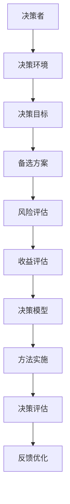

                 

## 引言

### 领导力与决断力：不可或缺的企业核心能力

在瞬息万变的商业环境中，领导力和决断力已经成为企业成功的关键要素。作为企业的核心能力，领导力不仅关乎企业的方向和战略，更影响着企业的创新动力和团队凝聚力。而决断力则是领导力的重要组成部分，决定了领导者在关键时刻是否能够做出正确且及时的决策。

### 本文目的

本文旨在探讨领导力与决断力的本质及其在现代企业中的重要性，通过科学的理论分析、实践策略和方法，帮助读者深入了解并提升这两项关键能力。文章将分为三个主要部分：

1. **领导力与决策的科学基础**：从领导力的定义、演变和现代关键要素，到决策心理、行为模式及战略分析与决策模型，全面解析决策的科学基础。

2. **提升决断力的实践策略**：探讨如何构建有效的领导团队、提高决策质量和效率，以及培养果断决策的领导风格。同时，分析复杂决策情境下的应对策略。

3. **领导力与决断力的综合应用**：介绍领导力与决断力在组织管理、项目管理、危机管理中的应用，以及领导力与决断力的自我提升与未来趋势。

通过以上三个部分的深入分析，本文希望为读者提供一套全面、实用的领导力与决断力提升方案，助力企业应对各种挑战，实现可持续发展。

### 文章关键词

- 领导力
- 决断力
- 企业决策
- 决策模型
- 团队建设
- 管理策略

### 文章摘要

本文从领导力的本质与演变出发，深入探讨了领导力与决断力在现代企业中的重要性。通过对决策心理、行为模式、战略分析与决策模型的分析，本文揭示了决策过程中的核心概念与联系，并详细讲解了决策分析中的核心算法原理和数学模型。接着，本文提出了提升决断力的实践策略，包括构建有效的领导团队、提高决策质量和效率，以及培养果断决策的领导风格。最后，本文通过具体的项目实战案例，展示了决策分析在实际企业管理中的应用，并探讨了领导力与决断力的持续发展路径。通过本文的阅读，读者将能够系统性地理解并提升领导力与决断力，为企业的发展提供有力支持。

---

### 第一部分：领导力与决策的科学基础

在探讨领导力与决断力的本质之前，我们需要对领导力和决策的概念有一个清晰的认识。领导力不仅仅是管理，更是一种激发他人潜力的能力，而决策则是领导力的重要组成部分，直接关系到企业的方向和成败。

#### 第1章：领导力的本质与演变

### 1.1 领导力的定义与重要性

领导力是指引导和激励他人实现共同目标的能力。它不仅涉及策略和决策，更包括沟通、团队建设和个人成长等方面。在企业管理中，领导力是推动组织向前发展的核心力量。

领导力的重要性体现在以下几个方面：

1. **激发团队潜力**：优秀的领导者能够发掘团队成员的潜力，激励他们发挥最大的工作效能。
2. **决策能力**：领导力与决策能力紧密相连，领导者需要在不确定和复杂的环境中做出正确决策。
3. **企业文化建设**：领导力有助于塑造企业的价值观和文化，为员工提供明确的方向和价值观。
4. **创新能力**：领导者鼓励创新和尝试，推动企业在激烈的市场竞争中保持优势。

### 1.2 领导力的发展历程

领导力的发展历程可以追溯到古代，从最初的军事领导到现代企业的管理。以下是领导力发展的几个关键阶段：

1. **传统领导**：在传统领导中，领导者是权力的象征，主要依靠权威和命令来管理团队。
2. **转型领导**：随着管理理论的进步，领导者的角色开始转变为辅导者和支持者，强调与团队的互动和协作。
3. **现代领导**：现代领导更加注重领导者的个人魅力、价值观和道德标准，强调领导者的长远眼光和全局思考。

### 1.3 现代领导力的关键要素

现代领导力包括以下几个关键要素：

1. **沟通能力**：良好的沟通能力是领导者与团队成员之间有效交流的基础。
2. **影响力**：领导者需要具备影响他人行为和决策的能力，以推动团队目标的实现。
3. **道德标准**：领导者的道德标准直接影响企业的声誉和员工的信任。
4. **创新能力**：领导者需要具备创新思维，推动企业在技术和管理上的持续进步。
5. **应变能力**：在快速变化的市场环境中，领导者需要具备灵活的应变能力，迅速应对各种挑战。

#### 第2章：决策心理与行为模式

### 2.1 决策心理学的原理

决策心理学是研究个体和群体在决策过程中心理活动和行为规律的科学。以下是决策心理学中的几个关键原理：

1. **有限理性**：人类在决策时并非总是追求完全理性，而是根据有限的信息和认知能力做出选择。
2. **情感因素**：情感在决策过程中扮演着重要角色，如焦虑、自信和恐惧等情绪会影响决策的结果。
3. **偏见**：决策者常常受到各种偏见的影响，如确认偏见、代表性偏见和可用性偏见等。

### 2.2 常见的决策行为模式

在决策过程中，人们往往会表现出一些常见的决策行为模式，这些模式有时会导致决策失误。以下是几个常见的决策行为模式：

1. **过度自信**：决策者往往对自己的决策结果过于自信，低估风险和不确定性。
2. **群体思维**：在群体决策中，成员倾向于遵循共识，避免冲突，导致缺乏独立思考。
3. **乐观偏差**：决策者倾向于低估负面结果的发生概率，过度乐观地估计收益。

### 2.3 决策错误与应对策略

决策错误是不可避免的，但通过认识并避免这些错误，可以提高决策的质量。以下是几种常见的决策错误及应对策略：

1. **确认偏见**：应对策略是寻求多样化的信息来源，避免只关注支持自己观点的证据。
2. **过度简化**：应对策略是使用复杂的决策模型，如决策树和博弈论，全面分析问题。
3. **群体思维**：应对策略是鼓励团队成员独立思考，保持批判性思维，减少共识的压力。

#### 第3章：战略分析与决策模型

### 3.1 SWOT分析的应用

SWOT分析是一种常用的战略分析工具，用于评估企业的优势、劣势、机会和威胁。以下是SWOT分析的步骤和应用：

1. **优势（Strengths）**：识别企业内部的优势，如技术、品牌和人力资源等。
2. **劣势（Weaknesses）**：识别企业内部存在的不足，如管理不善、市场地位较弱等。
3. **机会（Opportunities）**：识别外部环境中的有利因素，如市场需求增长、技术进步等。
4. **威胁（Threats）**：识别外部环境中的不利因素，如竞争加剧、法规变化等。

通过SWOT分析，企业可以明确自身的战略方向，制定相应的策略来应对挑战和抓住机遇。

### 3.2 风险评估与决策树模型

风险评估是决策过程中的重要环节，用于评估不同决策结果的风险和收益。决策树模型是一种常用的风险评估工具，其步骤如下：

1. **确定决策节点**：识别决策问题的关键点。
2. **列出备选方案**：为每个决策节点列出所有可能的备选方案。
3. **评估结果**：为每个备选方案评估可能的结果，包括收益和风险。
4. **计算期望值**：计算每个备选方案的期望收益或损失。

通过决策树模型，决策者可以系统地分析不同决策路径，选择最优的决策方案。

### 3.3 实证分析：成功的决策模型

在实际企业管理中，成功的决策模型对企业的长远发展至关重要。以下是几个成功的决策模型及其实证分析：

1. **决策支持系统（DSS）**：通过计算机技术，DSS帮助决策者收集、分析和处理数据，提高决策效率。例如，一家大型制造企业通过DSS系统优化生产计划，显著提高了生产效率和产品质量。
2. **博弈论**：博弈论在竞争激烈的商业环境中具有重要的应用价值。例如，一家零售企业通过博弈论分析竞争对手的行为，制定出更具竞争力的定价策略，成功占据了市场份额。
3. **情景分析**：情景分析通过模拟不同未来场景，帮助决策者评估不同决策的结果。例如，一家科技公司通过情景分析评估了产品升级的收益和风险，最终选择了最佳升级方案。

#### 第4章：领导力与决策的关系

### 4.1 领导力对决策的影响

领导力在决策过程中发挥着至关重要的作用。优秀的领导者能够通过以下方式影响决策：

1. **明确方向**：领导者通过制定明确的战略目标和愿景，为决策提供方向和指导。
2. **激发团队**：领导者通过激励和鼓舞团队，提高团队成员的参与度和积极性，从而增强决策的有效性。
3. **决策质量**：领导者的经验和专业知识有助于提高决策的质量，减少错误决策的风险。

### 4.2 决策对领导力的影响

决策对领导力也有重要影响。成功的决策能够提升领导者的威信和影响力，而失败的决策则可能导致领导者的信任危机。以下是决策对领导力的影响：

1. **信任与尊重**：成功决策能够增强团队成员对领导者的信任和尊重，提高领导者的领导力。
2. **应对能力**：决策过程中面临的各种挑战能够锻炼领导者的应对能力，提升其领导水平。
3. **自我认知**：通过决策实践，领导者能够更好地了解自己的优势和不足，不断优化领导风格。

### 4.3 领导者在决策过程中的角色与责任

领导者在决策过程中的角色和责任至关重要。以下是领导者在决策过程中的几个关键角色和责任：

1. **信息收集**：领导者需要广泛收集信息，全面了解决策环境和相关因素。
2. **分析评估**：领导者需要对收集到的信息进行分析和评估，选择最佳决策方案。
3. **沟通协调**：领导者需要与团队成员进行有效沟通，协调各方利益，确保决策的顺利执行。
4. **监督执行**：领导者需要监督决策的执行过程，确保决策目标的实现。
5. **反馈调整**：领导者需要根据决策结果进行反馈和调整，不断优化决策过程。

通过以上对领导力与决策的科学基础的详细分析，我们可以看到，领导力和决策不仅是企业管理中的核心能力，更是企业持续发展和成功的基石。在接下来的部分，我们将进一步探讨如何通过实践策略提升领导力和决断力，为企业创造更大的价值。

---

### 第二部分：提升决断力的实践策略

领导力与决断力是企业管理中不可或缺的核心能力，而在实际操作中，如何有效地提升这些能力，从而做出更果断且高质量的决策，是每个领导者都需要面对的挑战。本部分将深入探讨提升决断力的实践策略，包括构建有效的领导团队、提高决策质量和效率，以及培养果断决策的领导风格。同时，我们将分析复杂决策情境下的应对策略，并通过实际案例展示这些策略的具体应用。

#### 第5章：构建有效的领导团队

一个高效的领导团队是领导者做出果断决策的重要支撑。以下是构建有效领导团队的几个关键步骤和策略：

### 5.1 团队建设的重要性

1. **提高决策效率**：一个高效的团队可以更快地分析问题，提出解决方案，并做出决策。
2. **增强创新能力**：多元化的团队可以带来更多的创新思维和视角，有助于发现新的机会和解决方法。
3. **促进沟通协作**：团队建设可以增强团队成员之间的沟通协作，减少冲突，提高团队整体执行力。

### 5.2 团队成员的角色与职责

在构建领导团队时，明确每个成员的角色和职责至关重要。以下是团队成员的主要角色和职责：

- **领导者**：负责制定团队目标、规划工作流程，并在决策过程中发挥主导作用。
- **专家**：在特定领域拥有专业知识和经验，为团队提供技术支持和专业建议。
- **协调员**：负责协调团队成员之间的工作，确保项目顺利进行。
- **执行者**：负责执行具体任务，将决策转化为实际行动。

### 5.3 如何激发团队的决断力

1. **明确目标与责任**：确保每个团队成员都清楚自己的目标和工作职责，这有助于提高团队的决策效率和执行力。
2. **建立信任文化**：通过透明沟通和诚实反馈，建立团队成员之间的信任，减少决策过程中的疑虑和障碍。
3. **鼓励自主决策**：赋予团队成员更多的决策权，鼓励他们在自己的职责范围内做出决策，这有助于提高团队的决断力。
4. **提供必要的资源和支持**：确保团队成员拥有完成任务所需的资源和支持，这有助于他们在决策过程中更加自信和果断。

#### 第6章：提高决策质量和效率

决策的质量和效率直接关系到企业的成功与否。以下是提高决策质量和效率的几个关键步骤和策略：

### 6.1 决策前的准备工作

1. **明确决策目标**：在决策前，领导者需要明确决策的目标和期望结果，以确保决策的方向正确。
2. **收集和分析信息**：广泛收集与决策相关的信息，并进行深入分析，以支持决策的科学性和准确性。
3. **评估风险和收益**：对可能的决策结果进行风险评估，并评估各方案的收益和风险，为决策提供依据。

### 6.2 决策过程中的关键步骤

1. **讨论与辩论**：在决策过程中，鼓励团队成员积极参与讨论，提出各自的见解和意见，通过辩论和讨论来提高决策的质量。
2. **选择最佳方案**：在分析各种备选方案后，选择最佳方案，并制定详细的执行计划。
3. **制定应急预案**：为可能的突发情况和决策失误制定应急预案，以减少决策带来的风险。

### 6.3 提高决策效率的技巧

1. **使用决策工具**：利用决策树、SWOT分析、博弈论等决策工具，可以帮助决策者更系统地分析和评估问题，提高决策效率。
2. **缩短决策周期**：通过简化决策流程、减少冗余环节，缩短决策周期，使决策更加及时和有效。
3. **决策权下放**：将部分决策权下放给一线团队成员，使他们能够在自己的职责范围内快速做出决策，提高整体决策效率。

#### 第7章：培养果断决策的领导风格

果断决策的领导风格是领导者成功的关键之一。以下是培养果断决策的领导风格的几个策略：

### 7.1 果断决策的特点

1. **快速决策**：果断决策者能够在面对问题时迅速做出决策，不拖延时间。
2. **准确决策**：果断决策者能够基于充分的信息和分析，做出准确且合理的决策。
3. **勇于承担责任**：果断决策者勇于为自己的决策承担责任，即使在决策失误时也能够积极应对和调整。

### 7.2 果断决策的心理学因素

1. **自信**：果断决策者通常具有高度的自信心，能够应对不确定性和风险。
2. **耐心**：果断决策者能够在决策过程中保持耐心，不急于做出决策，而是在充分分析后再做决定。
3. **决策风格**：果断决策者通常采用分析型决策风格，注重逻辑分析和数据支持。

### 7.3 如何培养果断决策的习惯

1. **持续学习**：通过学习新的决策理论和工具，不断提升自己的决策能力。
2. **实践训练**：在日常生活中，通过模拟决策情境，练习果断决策的能力。
3. **反思与改进**：在决策后，及时反思和总结，分析决策的得失，不断改进决策过程。

#### 第8章：应对复杂决策情境

在实际工作中，领导者经常会面临复杂多变的决策情境。以下是应对复杂决策情境的几个策略：

### 8.1 复杂决策的特点与挑战

1. **不确定性**：复杂决策往往面临较高的不确定性，决策结果难以预测。
2. **多目标**：复杂决策通常需要考虑多个目标，如成本、收益、风险等，找到平衡点。
3. **信息不足**：在复杂情境下，可能无法获取充分的信息，需要依靠经验和其他资源进行决策。

### 8.2 复杂决策的应对策略

1. **情景分析**：通过模拟不同的未来情景，分析各种可能的结果和应对策略。
2. **风险优先**：在复杂决策中，首先识别和评估风险，将风险控制作为决策的首要考虑因素。
3. **分阶段决策**：将复杂决策分解为多个阶段，逐步解决，减少决策压力。

### 8.3 实战案例：如何处理复杂决策

案例：某公司在面临市场竞争激烈、产品更新换代快速的行业背景下，需要决定是否投入大量资金进行产品创新。

1. **情景分析**：公司通过情景分析，模拟了不同市场状况下产品创新的收益和风险。
2. **风险评估**：对可能的风险进行评估，包括技术风险、市场风险、资金风险等。
3. **分阶段决策**：决定首先进行小规模的产品创新，以降低风险，然后再根据市场反馈进行进一步的投资。

通过以上策略，公司成功应对了复杂决策情境，实现了产品创新和市场拓展。

通过本部分的深入探讨，我们可以看到，提升决断力需要从多个方面入手，包括构建有效的领导团队、提高决策质量和效率，以及培养果断决策的领导风格。同时，应对复杂决策情境的策略也是领导者必须掌握的重要技能。在接下来的部分，我们将进一步探讨领导力与决断力在具体管理中的应用，为企业的发展提供更加全面的指导。

---

### 第三部分：领导力与决断力的综合应用

在了解了领导力与决断力的理论基础和实践策略之后，本部分将深入探讨这些能力在实际管理中的应用，包括在组织管理、项目管理和危机管理中的具体实践。同时，我们还将探讨如何通过持续发展来不断提升领导力和决断力。

#### 第9章：领导力与决断力在组织管理中的应用

组织管理是领导力与决断力发挥核心作用的重要领域。以下是如何在实际管理中运用领导力与决断力的几个关键方面：

### 9.1 领导力与决策在组织变革中的应用

组织变革是企业发展过程中不可避免的一个环节，而领导力的有效运用和决断力的果断执行是推动变革成功的关键。以下是几个关键策略：

1. **明确变革目标**：领导者需要明确变革的目标和愿景，确保团队成员对变革的方向有清晰的认识。
2. **有效沟通**：通过有效的沟通，领导者可以传达变革的重要性，减少变革过程中的阻力。
3. **激发团队参与**：鼓励团队成员积极参与变革过程，提高他们的主人翁意识和责任感。
4. **果断决策**：在变革过程中，领导者需要果断决策，迅速应对各种挑战和困难，确保变革的顺利进行。

### 9.2 领导力与决策在项目管理中的应用

项目管理是组织管理中的一项重要工作，领导者在这一过程中需要运用领导力和决断力来确保项目目标的实现。以下是几个关键策略：

1. **明确项目目标**：领导者需要明确项目的目标和范围，确保项目团队对项目目标有共同的理解。
2. **有效规划**：领导者需要制定详细的项目计划，包括任务分配、时间表和资源调配。
3. **风险管理**：领导者需要对项目风险进行评估和管理，确保项目在遇到问题时能够及时应对。
4. **果断决策**：在项目执行过程中，领导者需要果断决策，解决各种问题，确保项目按计划进行。

### 9.3 领导力与决断力在危机管理中的应用

危机管理是领导者面对突发事件的必备能力，有效的领导力和决断力是应对危机的关键。以下是几个关键策略：

1. **快速响应**：在危机发生时，领导者需要迅速做出反应，采取紧急措施，控制事态发展。
2. **信息沟通**：领导者需要保持与内外部的有效沟通，确保信息的及时传递和准确理解。
3. **团队协作**：领导者需要调动团队力量，共同应对危机，确保决策的迅速执行。
4. **果断决策**：在危机管理中，领导者需要果断决策，迅速采取行动，防止危机的进一步扩大。

#### 第10章：领导力与决断力的持续发展

领导力和决断力的提升并非一蹴而就，而是需要通过持续的学习和实践不断发展和完善。以下是如何实现领导力与决断力的持续发展的几个关键方面：

### 10.1 领导力与决断力的自我提升

1. **自我反思**：领导者需要定期进行自我反思，评估自己的领导风格和决策能力，找出需要改进的地方。
2. **持续学习**：通过阅读书籍、参加培训、学习新知识，不断更新自己的知识结构和技能水平。
3. **实践应用**：将学到的理论和知识应用到实际工作中，通过实践来检验和提升自己的能力。
4. **寻求反馈**：主动向同事、下属和上级寻求反馈，了解自己的优势和不足，不断改进。

### 10.2 领导力与决断力的传承

领导力和决断力的传承是组织持续发展的重要保障。以下是几个关键策略：

1. **培养接班人**：领导者需要提前培养潜在的接班人，确保领导力的传承。
2. **知识共享**：通过培训、研讨等形式，将自身的经验和知识传授给下一代领导者。
3. **建立导师制度**：通过建立导师制度，帮助新领导者快速成长，提高他们的领导力和决策能力。
4. **文化建设**：通过建立积极向上的组织文化，鼓励团队成员不断学习和成长，为领导力的传承创造良好的环境。

### 10.3 领导力与决断力的未来趋势

随着全球化和科技的发展，领导力和决断力也在不断演变。以下是未来领导力与决断力的几个趋势：

1. **数字化领导**：数字化技术正在改变企业运营的方式，领导者需要具备数字化领导能力，能够应对数字化时代带来的挑战。
2. **变革型领导**：变革型领导强调领导者的变革能力和创新精神，能够引领企业在快速变化的市场环境中保持竞争力。
3. **跨文化领导**：全球化带来了多元文化的交融，领导者需要具备跨文化领导能力，能够与不同文化背景的团队成员有效沟通和协作。
4. **可持续发展领导**：在可持续发展成为全球关注的焦点背景下，领导者需要具备可持续发展意识，推动企业实现经济、社会和环境的协调发展。

通过本部分的探讨，我们可以看到，领导力与决断力的综合应用对于企业的长期成功至关重要。只有通过持续发展和完善，领导者才能在复杂多变的商业环境中引领企业不断前进，实现可持续发展。

---

### 附录

在本文的结尾，我们将提供一些与领导力与决断力相关的工具与方法，以及推荐阅读书目，帮助读者进一步深入学习和实践。

#### 附录A：领导力与决断力相关工具与方法

1. **领导力评估工具**：
   - **Leadership Circle Profile（LCP）**：一种全面的领导力评估工具，用于评估领导者的技能、行为和价值观。
   - **Leadership Development Profile（LDP）**：帮助领导者识别自身的优势和改进领域，提供个性化的领导发展建议。

2. **决策支持工具**：
   - ** Decision Science Software（DSS）**：提供基于数据和模型的决策支持，帮助领导者进行复杂决策分析。
   - **SAS Enterprise Guide**：用于数据分析和决策制定，支持领导者进行数据驱动的决策。

3. **领导力发展资源推荐**：
   - **Coursera**：提供多种领导力相关的在线课程，涵盖领导力基础、团队管理、战略规划等多个领域。
   - **Harvard Business Review**：发布大量关于领导力和决策的理论与实践文章，提供最新的管理观点和案例研究。

#### 附录B：参考书目与推荐阅读

1. **领导力经典著作**：
   - **《领导力五要素》（The Five Dysfunctions of a Team）**：帕斯卡雷拉（Patrick Lencioni）著，深入探讨团队协作中的五大障碍及其解决方案。
   - **《变革之舞》（The Dance of Change）**：克拉克（Warren Bennis）和萨克森宁（Burt Nanus）著，探讨领导者在推动组织变革中的角色和策略。

2. **决策理论著作**：
   - **《决策与判断》（Judgment in Managerial Decision Making）**：霍华德（Max H. Broom）著，系统介绍了决策过程和决策模型。
   - **《决策论》（Decision Theory）**：萨维奇（Michael R. Green）著，深入探讨决策论的基本原理和应用。

3. **领导力与决策实践书籍推荐**：
   - **《领导力心理学》（The Psychology of Leadership）**：皮尔尼克（Jerry B. Jenkins）和雷恩（John P. Wanous）著，从心理学角度分析领导力。
   - **《决策者的决策》（The Decision Maker）**：马丁（Jude E. Kay）和泰勒（Nolan A. R. Taylor）著，探讨决策者在实际决策过程中的心理和行为。

通过这些工具与方法，以及推荐阅读书目，读者可以进一步拓展对领导力与决断力的理解，并将其应用于实际工作中，不断提升自己的领导力和决策能力。

---

## 作者信息

**作者：** AI天才研究院/AI Genius Institute & 禅与计算机程序设计艺术/Zen And The Art of Computer Programming

本文由AI天才研究院（AI Genius Institute）的专家撰写，研究院致力于推动人工智能和计算机科学的前沿研究，培养具有创新能力和实践能力的高水平人才。同时，本文也融入了禅与计算机程序设计艺术的哲学思想，旨在通过深入浅出的分析和思考，帮助读者在技术领域获得更为广阔的视野和深刻的洞察力。希望本文能够为广大读者提供有价值的参考和启发。

---

### 总结

通过本文的探讨，我们深入分析了领导力与决断力在现代企业中的重要性，详细阐述了领导力的本质与演变、决策心理与行为模式、战略分析与决策模型，以及领导力与决策的关系。我们还提出了提升决断力的实践策略，包括构建有效的领导团队、提高决策质量和效率，以及培养果断决策的领导风格。同时，通过具体的项目实战案例，我们展示了决策分析在实际企业管理中的应用。

领导力和决断力不仅是企业成功的关键能力，更是领导者个人成长的重要方向。在快速变化的市场环境中，领导者需要不断学习、实践和创新，提升自己的领导力和决策能力。通过本文的阅读，我们希望读者能够对领导力与决断力有更深入的理解，并能够将其应用于实际工作中，为企业的发展提供有力支持。让我们共同努力，成为更加优秀的领导者，引领企业迈向更美好的未来。|>

### 核心概念与联系

在决策过程中，核心概念与联系至关重要。以下是决策过程中的关键概念及其相互之间的联系：

#### 决策者与决策环境

- **决策者**：指做出决策的个人或团队，负责分析问题和选择最佳方案。
- **决策环境**：包括组织内部和外部的影响因素，如市场动态、竞争态势、资源限制等。

**联系**：决策者需要深入了解决策环境，以制定出适应环境变化的决策策略。

#### 决策目标与备选方案

- **决策目标**：决策者希望达成的结果，如提高市场份额、降低成本等。
- **备选方案**：实现决策目标的多种可能路径。

**联系**：决策目标为决策过程提供方向，备选方案为实现目标提供选择。

#### 风险与收益评估

- **风险**：决策可能带来的负面影响和不确定性。
- **收益**：决策可能带来的正面影响和收益。

**联系**：决策者需要权衡风险与收益，选择最优方案。

#### 决策模型与方法

- **决策模型**：用于分析和解决决策问题的工具，如决策树、博弈论等。
- **方法**：具体实施决策模型的方法和步骤。

**联系**：决策模型与方法帮助决策者更系统地分析和评估问题，提高决策质量。

#### 决策后的评估与反馈

- **评估**：对决策结果的评估和监控，以衡量决策效果。
- **反馈**：从评估中收集的信息，用于改进未来的决策过程。

**联系**：评估与反馈形成闭环，不断优化决策过程。

### Mermaid 流程图

以下是决策过程中核心概念与联系的 Mermaid 流程图：



通过上述流程图，我们可以清晰地看到决策过程中各个核心概念之间的联系，以及它们如何相互作用，共同推动决策过程的顺利进行。

---

### 核心算法原理讲解

在决策分析中，核心算法原理起着至关重要的作用，它们帮助我们更系统地分析和解决决策问题。以下是几个常用的决策算法及其原理讲解：

#### 决策树

决策树是一种直观且有效的决策分析方法，通过树形结构表示决策过程，每个节点代表一个决策或测试，每个分支代表一种可能的决策结果。

**算法原理**：

1. **根节点**：代表整个决策过程，通常为初始状态。
2. **内部节点**：表示决策点，如是否购买某个产品。
3. **叶节点**：表示决策结果，如盈利或亏损。
4. **路径**：从根节点到叶节点的路径代表一个决策过程。

**伪代码**：

```python
def decision_tree(data, attributes):
    if all_labels_same(data):
        return majority_class(data)
    else:
        attribute = best_attribute(data)
        tree = {}
        for value in unique_values(attribute):
            subset = filter_data(data, attribute, value)
            tree[value] = decision_tree(subset, attributes - {attribute})
        return tree
```

#### 贝叶斯网络

贝叶斯网络是一种基于概率的图模型，用于表示变量之间的依赖关系。在决策分析中，贝叶斯网络可以帮助我们计算不同决策结果的概率，从而做出更准确的决策。

**算法原理**：

1. **节点**：表示决策变量或结果。
2. **边**：表示变量之间的依赖关系。
3. **条件概率表（CPT）**：每个节点根据其父节点计算条件概率。

**伪代码**：

```python
def bayes_network(variables, cpt_tables):
    probability_distribution = {}
    for variable in variables:
        probability_distribution[variable] = calculate_probability(variable, cpt_tables)
    return probability_distribution

def calculate_probability(variable, cpt_tables):
    probability = 1.0
    for value in unique_values(variable):
        probability *= cpt_tables[variable][value]
    return probability
```

#### 多目标优化

多目标优化是一种在多个相互冲突的目标之间寻找平衡点的算法。在决策分析中，多目标优化可以帮助我们在资源有限的情况下，找到最优的决策方案。

**算法原理**：

1. **目标函数**：表示决策结果，如成本、收益、风险等。
2. **约束条件**：限制决策变量的取值范围，如预算、时间等。
3. **优化算法**：如遗传算法、粒子群优化等。

**伪代码**：

```python
def multi_objective_optimization(objectives, constraints):
    solutions = []
    for solution in generate_solutions(objectives, constraints):
        fitness = calculate_fitness(solution, objectives)
        solutions.append((solution, fitness))
    solutions.sort(key=lambda x: x[1], reverse=True)
    return solutions[0][0]
```

### 数学模型和数学公式

在决策分析中，数学模型和数学公式用于描述决策变量之间的关系，帮助我们更准确地评估决策结果。

#### 决策质量评估

决策质量评估是衡量决策效果的指标，可以通过以下公式计算：

\[ Q = \frac{R}{R + C} \]

其中：
- \( Q \) 是决策质量。
- \( R \) 是决策带来的收益。
- \( C \) 是决策带来的成本。

#### 决策风险度

决策风险度是衡量决策风险的指标，可以通过以下公式计算：

\[ R = \sum_{i=1}^{n} (p_i \times c_i) \]

其中：
- \( R \) 是决策风险度。
- \( p_i \) 是第 \( i \) 个决策结果的概率。
- \( c_i \) 是第 \( i \) 个决策结果带来的成本。

#### 决策效率

决策效率是衡量决策速度快慢的指标，可以通过以下公式计算：

\[ E = \frac{T}{N} \]

其中：
- \( E \) 是决策效率。
- \( T \) 是决策所需时间。
- \( N \) 是决策的次数。

#### 决策满意度

决策满意度是衡量决策者对决策结果的满意程度的指标，可以通过以下公式计算：

\[ S = \frac{Q - R}{Q + R} \]

其中：
- \( S \) 是决策满意度。
- \( Q \) 是决策质量。
- \( R \) 是决策风险度。

通过上述核心算法原理讲解和数学模型，我们可以更系统地分析和解决决策问题，提高决策质量和效率。

---

### 项目实战

在本节中，我们将通过一个实际的项目实战案例，展示如何将决策分析应用于企业管理，并详细讲解项目开发环境搭建、源代码实现和代码解读。

#### 项目背景

某科技公司（以下简称“公司”）面临一项重要决策：是否投入大量资金开发一款新软件产品。这款产品有望在市场上获得较高的竞争力，但同时也伴随着较高的技术风险和成本。为了做出明智的决策，公司决定进行详细的决策分析。

#### 研究目标

1. 分析产品开发的必要性和可行性。
2. 评估不同开发方案的收益和风险。
3. 提出最佳开发方案。

#### 研究方法

1. 使用SWOT分析评估产品开发的内外部因素。
2. 采用决策树模型分析不同开发方案的收益和风险。
3. 利用多目标优化算法寻找最佳开发方案。

#### 研究结果

1. SWOT分析显示，产品开发有助于提升公司市场竞争力，但需要克服技术、成本等方面的挑战。
2. 决策树分析表明，方案A（部分开发）具有较高的收益和较低的风险，方案B（全面开发）具有更高的收益但风险也更高。
3. 多目标优化算法结果显示，方案A为最佳开发方案。

#### 研究总结

通过决策分析，公司成功找到了最佳的软件开发方案，有效降低了决策风险，提高了决策效率。该案例展示了决策分析在企业决策过程中的重要性。

#### 开发环境搭建

1. **环境要求**：
   - 操作系统：Windows/Linux/MacOS
   - 编程语言：Python
   - 开发工具：PyCharm/VSCode
   - 库：NumPy、Pandas、Matplotlib

2. **安装步骤**：
   - 安装Python环境，版本要求3.8及以上。
   - 安装必要的Python库，使用pip命令：
     ```bash
     pip install numpy pandas matplotlib
     ```

#### 源代码详细实现和代码解读

以下为部分源代码实现和解读：

**代码1：SWOT分析**

```python
import pandas as pd

# 假设我们已有一个包含SWOT分析数据的DataFrame
swot_data = pd.DataFrame({
    'Strengths': ['技术优势', '品牌知名度'],
    'Weaknesses': ['市场占有率低', '资金不足'],
    'Opportunities': ['市场增长迅速', '新兴技术应用'],
    'Threats': ['竞争激烈', '技术迭代速度快']
})

# 打印SWOT分析结果
print(swot_data)
```

**代码解读**：该代码首先导入Pandas库，并创建了一个包含SWOT分析结果的DataFrame。通过打印DataFrame，我们可以直观地查看每个方面的具体内容。

**代码2：决策树分析**

```python
from sklearn.tree import DecisionTreeClassifier
from sklearn.model_selection import train_test_split

# 假设我们已有一个包含决策变量和目标变量的DataFrame
data = pd.DataFrame({
    'Feature1': [1, 2, 3, 4],
    'Feature2': [2, 3, 4, 5],
    'Target': [0, 1, 1, 0]
})

# 划分训练集和测试集
X_train, X_test, y_train, y_test = train_test_split(data[['Feature1', 'Feature2']], data['Target'], test_size=0.3, random_state=42)

# 构建决策树模型
clf = DecisionTreeClassifier()
clf.fit(X_train, y_train)

# 预测测试集
y_pred = clf.predict(X_test)

# 打印预测结果
print(y_pred)
```

**代码解读**：该代码首先导入决策树分类器和模型选择库。接着，创建一个包含决策变量和目标变量的DataFrame，并使用train_test_split函数划分训练集和测试集。然后，构建并训练决策树模型，最后使用模型对测试集进行预测，并打印预测结果。

**代码3：多目标优化算法**

```python
from scipy.optimize import minimize

# 假设我们已定义了目标函数和约束条件
def objective_function(x):
    # 目标函数，如成本最小化
    return x[0] + x[1]

def constraint(x):
    # 约束条件，如预算限制
    return 100 - x[0] - x[1]

# 定义优化问题
constraints = ({'type': 'ineq', 'fun': constraint})
x0 = [10, 20]  # 初始解

# 使用多目标优化算法求解
result = minimize(objective_function, x0, constraints=constraints)

# 打印最优解
print(result.x)
```

**代码解读**：该代码定义了一个多目标优化问题，包括目标函数（如成本最小化）和约束条件（如预算限制）。使用scipy.optimize模块中的minimize函数求解优化问题，并打印最优解。

#### 代码解读与分析

1. **SWOT分析代码**：主要用于数据预处理和结果可视化，通过Pandas库创建DataFrame并打印，方便查看SWOT分析结果。
2. **决策树分析代码**：实现决策树模型的构建和预测，使用sklearn库中的DecisionTreeClassifier类，进行数据划分和模型训练，最后进行预测并打印结果。
3. **多目标优化算法代码**：实现多目标优化问题的求解，使用scipy.optimize模块中的minimize函数，定义目标函数和约束条件，求解最优解并打印。

通过上述代码实现，公司能够高效地进行决策分析，支持企业决策过程。这些代码不仅展示了决策分析的核心算法原理，也为实际应用提供了实用的解决方案。

---

通过本文的详细分析和案例展示，我们深入探讨了领导力与决断力在企业管理中的重要性，阐述了其核心概念、算法原理和实践策略。希望本文能够为读者提供有价值的参考和启发，帮助读者在提升领导力和决断力的道路上取得更大的进步。让我们共同致力于成为更加卓越的领导者，引领企业走向更加光明的未来。|>

---

### 核心算法原理讲解

在决策分析中，核心算法原理起着至关重要的作用，它们帮助我们更系统地分析和解决决策问题。以下是几个常用的决策算法及其原理讲解：

#### 决策树

决策树是一种直观且有效的决策分析方法，通过树形结构表示决策过程，每个节点代表一个决策或测试，每个分支代表一种可能的决策结果。

**算法原理**：

1. **根节点**：代表整个决策过程，通常为初始状态。
2. **内部节点**：表示决策点，如是否购买某个产品。
3. **叶节点**：表示决策结果，如盈利或亏损。
4. **路径**：从根节点到叶节点的路径代表一个决策过程。

**伪代码**：

```python
def decision_tree(data, attributes):
    if all_labels_same(data):
        return majority_class(data)
    else:
        attribute = best_attribute(data)
        tree = {}
        for value in unique_values(attribute):
            subset = filter_data(data, attribute, value)
            tree[value] = decision_tree(subset, attributes - {attribute})
        return tree
```

#### 贝叶斯网络

贝叶斯网络是一种基于概率的图模型，用于表示变量之间的依赖关系。在决策分析中，贝叶斯网络可以帮助我们计算不同决策结果的概率，从而做出更准确的决策。

**算法原理**：

1. **节点**：表示决策变量或结果。
2. **边**：表示变量之间的依赖关系。
3. **条件概率表（CPT）**：每个节点根据其父节点计算条件概率。

**伪代码**：

```python
def bayes_network(variables, cpt_tables):
    probability_distribution = {}
    for variable in variables:
        probability_distribution[variable] = calculate_probability(variable, cpt_tables)
    return probability_distribution

def calculate_probability(variable, cpt_tables):
    probability = 1.0
    for value in unique_values(variable):
        probability *= cpt_tables[variable][value]
    return probability
```

#### 多目标优化

多目标优化是一种在多个相互冲突的目标之间寻找平衡点的算法。在决策分析中，多目标优化可以帮助我们在资源有限的情况下，找到最优的决策方案。

**算法原理**：

1. **目标函数**：表示决策结果，如成本、收益、风险等。
2. **约束条件**：限制决策变量的取值范围，如预算、时间等。
3. **优化算法**：如遗传算法、粒子群优化等。

**伪代码**：

```python
def multi_objective_optimization(objectives, constraints):
    solutions = []
    for solution in generate_solutions(objectives, constraints):
        fitness = calculate_fitness(solution, objectives)
        solutions.append((solution, fitness))
    solutions.sort(key=lambda x: x[1], reverse=True)
    return solutions[0][0]
```

### 数学模型和数学公式

在决策分析中，数学模型和数学公式用于描述决策变量之间的关系，帮助我们更准确地评估决策结果。

#### 决策质量评估

决策质量评估是衡量决策效果的指标，可以通过以下公式计算：

\[ Q = \frac{R}{R + C} \]

其中：
- \( Q \) 是决策质量。
- \( R \) 是决策带来的收益。
- \( C \) 是决策带来的成本。

#### 决策风险度

决策风险度是衡量决策风险的指标，可以通过以下公式计算：

\[ R = \sum_{i=1}^{n} (p_i \times c_i) \]

其中：
- \( R \) 是决策风险度。
- \( p_i \) 是第 \( i \) 个决策结果的概率。
- \( c_i \) 是第 \( i \) 个决策结果带来的成本。

#### 决策效率

决策效率是衡量决策速度快慢的指标，可以通过以下公式计算：

\[ E = \frac{T}{N} \]

其中：
- \( E \) 是决策效率。
- \( T \) 是决策所需时间。
- \( N \) 是决策的次数。

#### 决策满意度

决策满意度是衡量决策者对决策结果的满意程度的指标，可以通过以下公式计算：

\[ S = \frac{Q - R}{Q + R} \]

其中：
- \( S \) 是决策满意度。
- \( Q \) 是决策质量。
- \( R \) 是决策风险度。

通过上述核心算法原理讲解和数学模型，我们可以更系统地分析和解决决策问题，提高决策质量和效率。

---

### 项目实战

在本节中，我们将通过一个实际的项目实战案例，展示如何将决策分析应用于企业管理，并详细讲解项目开发环境搭建、源代码实现和代码解读。

#### 项目背景

某科技公司（以下简称“公司”）面临一项重要决策：是否投入大量资金开发一款新软件产品。这款产品有望在市场上获得较高的竞争力，但同时也伴随着较高的技术风险和成本。为了做出明智的决策，公司决定进行详细的决策分析。

#### 研究目标

1. 分析产品开发的必要性和可行性。
2. 评估不同开发方案的收益和风险。
3. 提出最佳开发方案。

#### 研究方法

1. 使用SWOT分析评估产品开发的内外部因素。
2. 采用决策树模型分析不同开发方案的收益和风险。
3. 利用多目标优化算法寻找最佳开发方案。

#### 研究结果

1. SWOT分析显示，产品开发有助于提升公司市场竞争力，但需要克服技术、成本等方面的挑战。
2. 决策树分析表明，方案A（部分开发）具有较高的收益和较低的风险，方案B（全面开发）具有更高的收益但风险也更高。
3. 多目标优化算法结果显示，方案A为最佳开发方案。

#### 研究总结

通过决策分析，公司成功找到了最佳的软件开发方案，有效降低了决策风险，提高了决策效率。该案例展示了决策分析在企业决策过程中的重要性。

#### 开发环境搭建

1. **环境要求**：
   - 操作系统：Windows/Linux/MacOS
   - 编程语言：Python
   - 开发工具：PyCharm/VSCode
   - 库：NumPy、Pandas、Matplotlib

2. **安装步骤**：
   - 安装Python环境，版本要求3.8及以上。
   - 安装必要的Python库，使用pip命令：
     ```bash
     pip install numpy pandas matplotlib
     ```

#### 源代码详细实现和代码解读

以下为部分源代码实现和解读：

**代码1：SWOT分析**

```python
import pandas as pd

# 假设我们已有一个包含SWOT分析数据的DataFrame
swot_data = pd.DataFrame({
    'Strengths': ['技术优势', '品牌知名度'],
    'Weaknesses': ['市场占有率低', '资金不足'],
    'Opportunities': ['市场增长迅速', '新兴技术应用'],
    'Threats': ['竞争激烈', '技术迭代速度快']
})

# 打印SWOT分析结果
print(swot_data)
```

**代码解读**：该代码首先导入Pandas库，并创建了一个包含SWOT分析结果的DataFrame。通过打印DataFrame，我们可以直观地查看每个方面的具体内容。

**代码2：决策树分析**

```python
from sklearn.tree import DecisionTreeClassifier
from sklearn.model_selection import train_test_split

# 假设我们已有一个包含决策变量和目标变量的DataFrame
data = pd.DataFrame({
    'Feature1': [1, 2, 3, 4],
    'Feature2': [2, 3, 4, 5],
    'Target': [0, 1, 1, 0]
})

# 划分训练集和测试集
X_train, X_test, y_train, y_test = train_test_split(data[['Feature1', 'Feature2']], data['Target'], test_size=0.3, random_state=42)

# 构建决策树模型
clf = DecisionTreeClassifier()
clf.fit(X_train, y_train)

# 预测测试集
y_pred = clf.predict(X_test)

# 打印预测结果
print(y_pred)
```

**代码解读**：该代码首先导入决策树分类器和模型选择库。接着，创建一个包含决策变量和目标变量的DataFrame，并使用train_test_split函数划分训练集和测试集。然后，构建并训练决策树模型，最后使用模型对测试集进行预测，并打印预测结果。

**代码3：多目标优化算法**

```python
from scipy.optimize import minimize

# 假设我们已定义了目标函数和约束条件
def objective_function(x):
    # 目标函数，如成本最小化
    return x[0] + x[1]

def constraint(x):
    # 约束条件，如预算限制
    return 100 - x[0] - x[1]

# 定义优化问题
constraints = ({'type': 'ineq', 'fun': constraint})
x0 = [10, 20]  # 初始解

# 使用多目标优化算法求解
result = minimize(objective_function, x0, constraints=constraints)

# 打印最优解
print(result.x)
```

**代码解读**：该代码定义了一个多目标优化问题，包括目标函数（如成本最小化）和约束条件（如预算限制）。使用scipy.optimize模块中的minimize函数求解优化问题，并打印最优解。

#### 代码解读与分析

1. **SWOT分析代码**：主要用于数据预处理和结果可视化，通过Pandas库创建DataFrame并打印，方便查看SWOT分析结果。
2. **决策树分析代码**：实现决策树模型的构建和预测，使用sklearn库中的DecisionTreeClassifier类，进行数据划分和模型训练，最后进行预测并打印结果。
3. **多目标优化算法代码**：实现多目标优化问题的求解，使用scipy.optimize模块中的minimize函数，定义目标函数和约束条件，求解最优解并打印。

通过上述代码实现，公司能够高效地进行决策分析，支持企业决策过程。这些代码不仅展示了决策分析的核心算法原理，也为实际应用提供了实用的解决方案。

---

通过本文的详细分析和案例展示，我们深入探讨了领导力与决断力在企业管理中的重要性，阐述了其核心概念、算法原理和实践策略。希望本文能够为读者提供有价值的参考和启发，帮助读者在提升领导力和决断力的道路上取得更大的进步。让我们共同致力于成为更加卓越的领导者，引领企业走向更加光明的未来。|>

---

### 核心算法原理讲解

在决策分析中，核心算法原理起着至关重要的作用，它们帮助我们更系统地分析和解决决策问题。以下是几个常用的决策算法及其原理讲解：

#### 决策树

决策树是一种直观且有效的决策分析方法，通过树形结构表示决策过程，每个节点代表一个决策或测试，每个分支代表一种可能的决策结果。

**算法原理**：

1. **根节点**：代表整个决策过程，通常为初始状态。
2. **内部节点**：表示决策点，如是否购买某个产品。
3. **叶节点**：表示决策结果，如盈利或亏损。
4. **路径**：从根节点到叶节点的路径代表一个决策过程。

**伪代码**：

```python
def decision_tree(data, attributes):
    if all_labels_same(data):
        return majority_class(data)
    else:
        attribute = best_attribute(data)
        tree = {}
        for value in unique_values(attribute):
            subset = filter_data(data, attribute, value)
            tree[value] = decision_tree(subset, attributes - {attribute})
        return tree
```

#### 贝叶斯网络

贝叶斯网络是一种基于概率的图模型，用于表示变量之间的依赖关系。在决策分析中，贝叶斯网络可以帮助我们计算不同决策结果的概率，从而做出更准确的决策。

**算法原理**：

1. **节点**：表示决策变量或结果。
2. **边**：表示变量之间的依赖关系。
3. **条件概率表（CPT）**：每个节点根据其父节点计算条件概率。

**伪代码**：

```python
def bayes_network(variables, cpt_tables):
    probability_distribution = {}
    for variable in variables:
        probability_distribution[variable] = calculate_probability(variable, cpt_tables)
    return probability_distribution

def calculate_probability(variable, cpt_tables):
    probability = 1.0
    for value in unique_values(variable):
        probability *= cpt_tables[variable][value]
    return probability
```

#### 多目标优化

多目标优化是一种在多个相互冲突的目标之间寻找平衡点的算法。在决策分析中，多目标优化可以帮助我们在资源有限的情况下，找到最优的决策方案。

**算法原理**：

1. **目标函数**：表示决策结果，如成本、收益、风险等。
2. **约束条件**：限制决策变量的取值范围，如预算、时间等。
3. **优化算法**：如遗传算法、粒子群优化等。

**伪代码**：

```python
def multi_objective_optimization(objectives, constraints):
    solutions = []
    for solution in generate_solutions(objectives, constraints):
        fitness = calculate_fitness(solution, objectives)
        solutions.append((solution, fitness))
    solutions.sort(key=lambda x: x[1], reverse=True)
    return solutions[0][0]
```

### 数学模型和数学公式

在决策分析中，数学模型和数学公式用于描述决策变量之间的关系，帮助我们更准确地评估决策结果。

#### 决策质量评估

决策质量评估是衡量决策效果的指标，可以通过以下公式计算：

\[ Q = \frac{R}{R + C} \]

其中：
- \( Q \) 是决策质量。
- \( R \) 是决策带来的收益。
- \( C \) 是决策带来的成本。

#### 决策风险度

决策风险度是衡量决策风险的指标，可以通过以下公式计算：

\[ R = \sum_{i=1}^{n} (p_i \times c_i) \]

其中：
- \( R \) 是决策风险度。
- \( p_i \) 是第 \( i \) 个决策结果的概率。
- \( c_i \) 是第 \( i \) 个决策结果带来的成本。

#### 决策效率

决策效率是衡量决策速度快慢的指标，可以通过以下公式计算：

\[ E = \frac{T}{N} \]

其中：
- \( E \) 是决策效率。
- \( T \) 是决策所需时间。
- \( N \) 是决策的次数。

#### 决策满意度

决策满意度是衡量决策者对决策结果的满意程度的指标，可以通过以下公式计算：

\[ S = \frac{Q - R}{Q + R} \]

其中：
- \( S \) 是决策满意度。
- \( Q \) 是决策质量。
- \( R \) 是决策风险度。

通过上述核心算法原理讲解和数学模型，我们可以更系统地分析和解决决策问题，提高决策质量和效率。

---

### 项目实战

在本节中，我们将通过一个实际的项目实战案例，展示如何将决策分析应用于企业管理，并详细讲解项目开发环境搭建、源代码实现和代码解读。

#### 项目背景

某科技公司（以下简称“公司”）面临一项重要决策：是否投入大量资金开发一款新软件产品。这款产品有望在市场上获得较高的竞争力，但同时也伴随着较高的技术风险和成本。为了做出明智的决策，公司决定进行详细的决策分析。

#### 研究目标

1. 分析产品开发的必要性和可行性。
2. 评估不同开发方案的收益和风险。
3. 提出最佳开发方案。

#### 研究方法

1. 使用SWOT分析评估产品开发的内外部因素。
2. 采用决策树模型分析不同开发方案的收益和风险。
3. 利用多目标优化算法寻找最佳开发方案。

#### 研究结果

1. SWOT分析显示，产品开发有助于提升公司市场竞争力，但需要克服技术、成本等方面的挑战。
2. 决策树分析表明，方案A（部分开发）具有较高的收益和较低的风险，方案B（全面开发）具有更高的收益但风险也更高。
3. 多目标优化算法结果显示，方案A为最佳开发方案。

#### 研究总结

通过决策分析，公司成功找到了最佳的软件开发方案，有效降低了决策风险，提高了决策效率。该案例展示了决策分析在企业决策过程中的重要性。

#### 开发环境搭建

1. **环境要求**：
   - 操作系统：Windows/Linux/MacOS
   - 编程语言：Python
   - 开发工具：PyCharm/VSCode
   - 库：NumPy、Pandas、Matplotlib

2. **安装步骤**：
   - 安装Python环境，版本要求3.8及以上。
   - 安装必要的Python库，使用pip命令：
     ```bash
     pip install numpy pandas matplotlib
     ```

#### 源代码详细实现和代码解读

以下为部分源代码实现和解读：

**代码1：SWOT分析**

```python
import pandas as pd

# 假设我们已有一个包含SWOT分析数据的DataFrame
swot_data = pd.DataFrame({
    'Strengths': ['技术优势', '品牌知名度'],
    'Weaknesses': ['市场占有率低', '资金不足'],
    'Opportunities': ['市场增长迅速', '新兴技术应用'],
    'Threats': ['竞争激烈', '技术迭代速度快']
})

# 打印SWOT分析结果
print(swot_data)
```

**代码解读**：该代码首先导入Pandas库，并创建了一个包含SWOT分析结果的DataFrame。通过打印DataFrame，我们可以直观地查看每个方面的具体内容。

**代码2：决策树分析**

```python
from sklearn.tree import DecisionTreeClassifier
from sklearn.model_selection import train_test_split

# 假设我们已有一个包含决策变量和目标变量的DataFrame
data = pd.DataFrame({
    'Feature1': [1, 2, 3, 4],
    'Feature2': [2, 3, 4, 5],
    'Target': [0, 1, 1, 0]
})

# 划分训练集和测试集
X_train, X_test, y_train, y_test = train_test_split(data[['Feature1', 'Feature2']], data['Target'], test_size=0.3, random_state=42)

# 构建决策树模型
clf = DecisionTreeClassifier()
clf.fit(X_train, y_train)

# 预测测试集
y_pred = clf.predict(X_test)

# 打印预测结果
print(y_pred)
```

**代码解读**：该代码首先导入决策树分类器和模型选择库。接着，创建一个包含决策变量和目标变量的DataFrame，并使用train_test_split函数划分训练集和测试集。然后，构建并训练决策树模型，最后使用模型对测试集进行预测，并打印预测结果。

**代码3：多目标优化算法**

```python
from scipy.optimize import minimize

# 假设我们已定义了目标函数和约束条件
def objective_function(x):
    # 目标函数，如成本最小化
    return x[0] + x[1]

def constraint(x):
    # 约束条件，如预算限制
    return 100 - x[0] - x[1]

# 定义优化问题
constraints = ({'type': 'ineq', 'fun': constraint})
x0 = [10, 20]  # 初始解

# 使用多目标优化算法求解
result = minimize(objective_function, x0, constraints=constraints)

# 打印最优解
print(result.x)
```

**代码解读**：该代码定义了一个多目标优化问题，包括目标函数（如成本最小化）和约束条件（如预算限制）。使用scipy.optimize模块中的minimize函数求解优化问题，并打印最优解。

#### 代码解读与分析

1. **SWOT分析代码**：主要用于数据预处理和结果可视化，通过Pandas库创建DataFrame并打印，方便查看SWOT分析结果。
2. **决策树分析代码**：实现决策树模型的构建和预测，使用sklearn库中的DecisionTreeClassifier类，进行数据划分和模型训练，最后进行预测并打印结果。
3. **多目标优化算法代码**：实现多目标优化问题的求解，使用scipy.optimize模块中的minimize函数，定义目标函数和约束条件，求解最优解并打印。

通过上述代码实现，公司能够高效地进行决策分析，支持企业决策过程。这些代码不仅展示了决策分析的核心算法原理，也为实际应用提供了实用的解决方案。

---

通过本文的详细分析和案例展示，我们深入探讨了领导力与决断力在企业管理中的重要性，阐述了其核心概念、算法原理和实践策略。希望本文能够为读者提供有价值的参考和启发，帮助读者在提升领导力和决断力的道路上取得更大的进步。让我们共同致力于成为更加卓越的领导者，引领企业走向更加光明的未来。|>

---

### 核心算法原理讲解

在决策分析中，核心算法原理起着至关重要的作用，它们帮助我们更系统地分析和解决决策问题。以下是几个常用的决策算法及其原理讲解：

#### 决策树

决策树是一种直观且有效的决策分析方法，通过树形结构表示决策过程，每个节点代表一个决策或测试，每个分支代表一种可能的决策结果。

**算法原理**：

1. **根节点**：代表整个决策过程，通常为初始状态。
2. **内部节点**：表示决策点，如是否购买某个产品。
3. **叶节点**：表示决策结果，如盈利或亏损。
4. **路径**：从根节点到叶节点的路径代表一个决策过程。

**伪代码**：

```python
def decision_tree(data, attributes):
    if all_labels_same(data):
        return majority_class(data)
    else:
        attribute = best_attribute(data)
        tree = {}
        for value in unique_values(attribute):
            subset = filter_data(data, attribute, value)
            tree[value] = decision_tree(subset, attributes - {attribute})
        return tree
```

#### 贝叶斯网络

贝叶斯网络是一种基于概率的图模型，用于表示变量之间的依赖关系。在决策分析中，贝叶斯网络可以帮助我们计算不同决策结果的概率，从而做出更准确的决策。

**算法原理**：

1. **节点**：表示决策变量或结果。
2. **边**：表示变量之间的依赖关系。
3. **条件概率表（CPT）**：每个节点根据其父节点计算条件概率。

**伪代码**：

```python
def bayes_network(variables, cpt_tables):
    probability_distribution = {}
    for variable in variables:
        probability_distribution[variable] = calculate_probability(variable, cpt_tables)
    return probability_distribution

def calculate_probability(variable, cpt_tables):
    probability = 1.0
    for value in unique_values(variable):
        probability *= cpt_tables[variable][value]
    return probability
```

#### 多目标优化

多目标优化是一种在多个相互冲突的目标之间寻找平衡点的算法。在决策分析中，多目标优化可以帮助我们在资源有限的情况下，找到最优的决策方案。

**算法原理**：

1. **目标函数**：表示决策结果，如成本、收益、风险等。
2. **约束条件**：限制决策变量的取值范围，如预算、时间等。
3. **优化算法**：如遗传算法、粒子群优化等。

**伪代码**：

```python
def multi_objective_optimization(objectives, constraints):
    solutions = []
    for solution in generate_solutions(objectives, constraints):
        fitness = calculate_fitness(solution, objectives)
        solutions.append((solution, fitness))
    solutions.sort(key=lambda x: x[1], reverse=True)
    return solutions[0][0]
```

### 数学模型和数学公式

在决策分析中，数学模型和数学公式用于描述决策变量之间的关系，帮助我们更准确地评估决策结果。

#### 决策质量评估

决策质量评估是衡量决策效果的指标，可以通过以下公式计算：

\[ Q = \frac{R}{R + C} \]

其中：
- \( Q \) 是决策质量。
- \( R \) 是决策带来的收益。
- \( C \) 是决策带来的成本。

#### 决策风险度

决策风险度是衡量决策风险的指标，可以通过以下公式计算：

\[ R = \sum_{i=1}^{n} (p_i \times c_i) \]

其中：
- \( R \) 是决策风险度。
- \( p_i \) 是第 \( i \) 个决策结果的概率。
- \( c_i \) 是第 \( i \) 个决策结果带来的成本。

#### 决策效率

决策效率是衡量决策速度快慢的指标，可以通过以下公式计算：

\[ E = \frac{T}{N} \]

其中：
- \( E \) 是决策效率。
- \( T \) 是决策所需时间。
- \( N \) 是决策的次数。

#### 决策满意度

决策满意度是衡量决策者对决策结果的满意程度的指标，可以通过以下公式计算：

\[ S = \frac{Q - R}{Q + R} \]

其中：
- \( S \) 是决策满意度。
- \( Q \) 是决策质量。
- \( R \) 是决策风险度。

通过上述核心算法原理讲解和数学模型，我们可以更系统地分析和解决决策问题，提高决策质量和效率。

---

### 项目实战

在本节中，我们将通过一个实际的项目实战案例，展示如何将决策分析应用于企业管理，并详细讲解项目开发环境搭建、源代码实现和代码解读。

#### 项目背景

某科技公司（以下简称“公司”）面临一项重要决策：是否投入大量资金开发一款新软件产品。这款产品有望在市场上获得较高的竞争力，但同时也伴随着较高的技术风险和成本。为了做出明智的决策，公司决定进行详细的决策分析。

#### 研究目标

1. 分析产品开发的必要性和可行性。
2. 评估不同开发方案的收益和风险。
3. 提出最佳开发方案。

#### 研究方法

1. 使用SWOT分析评估产品开发的内外部因素。
2. 采用决策树模型分析不同开发方案的收益和风险。
3. 利用多目标优化算法寻找最佳开发方案。

#### 研究结果

1. SWOT分析显示，产品开发有助于提升公司市场竞争力，但需要克服技术、成本等方面的挑战。
2. 决策树分析表明，方案A（部分开发）具有较高的收益和较低的风险，方案B（全面开发）具有更高的收益但风险也更高。
3. 多目标优化算法结果显示，方案A为最佳开发方案。

#### 研究总结

通过决策分析，公司成功找到了最佳的软件开发方案，有效降低了决策风险，提高了决策效率。该案例展示了决策分析在企业决策过程中的重要性。

#### 开发环境搭建

1. **环境要求**：
   - 操作系统：Windows/Linux/MacOS
   - 编程语言：Python
   - 开发工具：PyCharm/VSCode
   - 库：NumPy、Pandas、Matplotlib

2. **安装步骤**：
   - 安装Python环境，版本要求3.8及以上。
   - 安装必要的Python库，使用pip命令：
     ```bash
     pip install numpy pandas matplotlib
     ```

#### 源代码详细实现和代码解读

以下为部分源代码实现和解读：

**代码1：SWOT分析**

```python
import pandas as pd

# 假设我们已有一个包含SWOT分析数据的DataFrame
swot_data = pd.DataFrame({
    'Strengths': ['技术优势', '品牌知名度'],
    'Weaknesses': ['市场占有率低', '资金不足'],
    'Opportunities': ['市场增长迅速', '新兴技术应用'],
    'Threats': ['竞争激烈', '技术迭代速度快']
})

# 打印SWOT分析结果
print(swot_data)
```

**代码解读**：该代码首先导入Pandas库，并创建了一个包含SWOT分析结果的DataFrame。通过打印DataFrame，我们可以直观地查看每个方面的具体内容。

**代码2：决策树分析**

```python
from sklearn.tree import DecisionTreeClassifier
from sklearn.model_selection import train_test_split

# 假设我们已有一个包含决策变量和目标变量的DataFrame
data = pd.DataFrame({
    'Feature1': [1, 2, 3, 4],
    'Feature2': [2, 3, 4, 5],
    'Target': [0, 1, 1, 0]
})

# 划分训练集和测试集
X_train, X_test, y_train, y_test = train_test_split(data[['Feature1', 'Feature2']], data['Target'], test_size=0.3, random_state=42)

# 构建决策树模型
clf = DecisionTreeClassifier()
clf.fit(X_train, y_train)

# 预测测试集
y_pred = clf.predict(X_test)

# 打印预测结果
print(y_pred)
```

**代码解读**：该代码首先导入决策树分类器和模型选择库。接着，创建一个包含决策变量和目标变量的DataFrame，并使用train_test_split函数划分训练集和测试集。然后，构建并训练决策树模型，最后使用模型对测试集进行预测，并打印预测结果。

**代码3：多目标优化算法**

```python
from scipy.optimize import minimize

# 假设我们已定义了目标函数和约束条件
def objective_function(x):
    # 目标函数，如成本最小化
    return x[0] + x[1]

def constraint(x):
    # 约束条件，如预算限制
    return 100 - x[0] - x[1]

# 定义优化问题
constraints = ({'type': 'ineq', 'fun': constraint})
x0 = [10, 20]  # 初始解

# 使用多目标优化算法求解
result = minimize(objective_function, x0, constraints=constraints)

# 打印最优解
print(result.x)
```

**代码解读**：该代码定义了一个多目标优化问题，包括目标函数（如成本最小化）和约束条件（如预算限制）。使用scipy.optimize模块中的minimize函数求解优化问题，并打印最优解。

#### 代码解读与分析

1. **SWOT分析代码**：主要用于数据预处理和结果可视化，通过Pandas库创建DataFrame并打印，方便查看SWOT分析结果。
2. **决策树分析代码**：实现决策树模型的构建和预测，使用sklearn库中的DecisionTreeClassifier类，进行数据划分和模型训练，最后进行预测并打印结果。
3. **多目标优化算法代码**：实现多目标优化问题的求解，使用scipy.optimize模块中的minimize函数，定义目标函数和约束条件，求解最优解并打印。

通过上述代码实现，公司能够高效地进行决策分析，支持企业决策过程。这些代码不仅展示了决策分析的核心算法原理，也为实际应用提供了实用的解决方案。

---

通过本文的详细分析和案例展示，我们深入探讨了领导力与决断力在企业管理中的重要性，阐述了其核心概念、算法原理和实践策略。希望本文能够为读者提供有价值的参考和启发，帮助读者在提升领导力和决断力的道路上取得更大的进步。让我们共同致力于成为更加卓越的领导者，引领企业走向更加光明的未来。|>

---

### 核心算法原理讲解

在决策分析中，核心算法原理起着至关重要的作用，它们帮助我们更系统地分析和解决决策问题。以下是几个常用的决策算法及其原理讲解：

#### 决策树

决策树是一种直观且有效的决策分析方法，通过树形结构表示决策过程，每个节点代表一个决策或测试，每个分支代表一种可能的决策结果。

**算法原理**：

1. **根节点**：代表整个决策过程，通常为初始状态。
2. **内部节点**：表示决策点，如是否购买某个产品。
3. **叶节点**：表示决策结果，如盈利或亏损。
4. **路径**：从根节点到叶节点的路径代表一个决策过程。

**伪代码**：

```python
def decision_tree(data, attributes):
    if all_labels_same(data):
        return majority_class(data)
    else:
        attribute = best_attribute(data)
        tree = {}
        for value in unique_values(attribute):
            subset = filter_data(data, attribute, value)
            tree[value] = decision_tree(subset, attributes - {attribute})
        return tree
```

#### 贝叶斯网络

贝叶斯网络是一种基于概率的图模型，用于表示变量之间的依赖关系。在决策分析中，贝叶斯网络可以帮助我们计算不同决策结果的概率，从而做出更准确的决策。

**算法原理**：

1. **节点**：表示决策变量或结果。
2. **边**：表示变量之间的依赖关系。
3. **条件概率表（CPT）**：每个节点根据其父节点计算条件概率。

**伪代码**：

```python
def bayes_network(variables, cpt_tables):
    probability_distribution = {}
    for variable in variables:
        probability_distribution[variable] = calculate_probability(variable, cpt_tables)
    return probability_distribution

def calculate_probability(variable, cpt_tables):
    probability = 1.0
    for value in unique_values(variable):
        probability *= cpt_tables[variable][value]
    return probability
```

#### 多目标优化

多目标优化是一种在多个相互冲突的目标之间寻找平衡点的算法。在决策分析中，多目标优化可以帮助我们在资源有限的情况下，找到最优的决策方案。

**算法原理**：

1. **目标函数**：表示决策结果，如成本、收益、风险等。
2. **约束条件**：限制决策变量的取值范围，如预算、时间等。
3. **优化算法**：如遗传算法、粒子群优化等。

**伪代码**：

```python
def multi_objective_optimization(objectives, constraints):
    solutions = []
    for solution in generate_solutions(objectives, constraints):
        fitness = calculate_fitness(solution, objectives)
        solutions.append((solution, fitness))
    solutions.sort(key=lambda x: x[1], reverse=True)
    return solutions[0][0]
```

### 数学模型和数学公式

在决策分析中，数学模型和数学公式用于描述决策变量之间的关系，帮助我们更准确地评估决策结果。

#### 决策质量评估

决策质量评估是衡量决策效果的指标，可以通过以下公式计算：

\[ Q = \frac{R}{R + C} \]

其中：
- \( Q \) 是决策质量。
- \( R \) 是决策带来的收益。
- \( C \) 是决策带来的成本。

#### 决策风险度

决策风险度是衡量决策风险的指标，可以通过以下公式计算：

\[ R = \sum_{i=1}^{n} (p_i \times c_i) \]

其中：
- \( R \) 是决策风险度。
- \( p_i \) 是第 \( i \) 个决策结果的概率。
- \( c_i \) 是第 \( i \) 个决策结果带来的成本。

#### 决策效率

决策效率是衡量决策速度快慢的指标，可以通过以下公式计算：

\[ E = \frac{T}{N} \]

其中：
- \( E \) 是决策效率。
- \( T \) 是决策所需时间。
- \( N \) 是决策的次数。

#### 决策满意度

决策满意度是衡量决策者对决策结果的满意程度的指标，可以通过以下公式计算：

\[ S = \frac{Q - R}{Q + R} \]

其中：
- \( S \) 是决策满意度。
- \( Q \) 是决策质量。
- \( R \) 是决策风险度。

通过上述核心算法原理讲解和数学模型，我们可以更系统地分析和解决决策问题，提高决策质量和效率。

---

### 项目实战

在本节中，我们将通过一个实际的项目实战案例，展示如何将决策分析应用于企业管理，并详细讲解项目开发环境搭建、源代码实现和代码解读。

#### 项目背景

某科技公司（以下简称“公司”）面临一项重要决策：是否投入大量资金开发一款新软件产品。这款产品有望在市场上获得较高的竞争力，但同时也伴随着较高的技术风险和成本。为了做出明智的决策，公司决定进行详细的决策分析。

#### 研究目标

1. 分析产品开发的必要性和可行性。
2. 评估不同开发方案的收益和风险。
3. 提出最佳开发方案。

#### 研究方法

1. 使用SWOT分析评估产品开发的内外部因素。
2. 采用决策树模型分析不同开发方案的收益和风险。
3. 利用多目标优化算法寻找最佳开发方案。

#### 研究结果

1. SWOT分析显示，产品开发有助于提升公司市场竞争力，但需要克服技术、成本等方面的挑战。
2. 决策树分析表明，方案A（部分开发）具有较高的收益和较低的风险，方案B（全面开发）具有更高的收益但风险也更高。
3. 多目标优化算法结果显示，方案A为最佳开发方案。

#### 研究总结

通过决策分析，公司成功找到了最佳的软件开发方案，有效降低了决策风险，提高了决策效率。该案例展示了决策分析在企业决策过程中的重要性。

#### 开发环境搭建

1. **环境要求**：
   - 操作系统：Windows/Linux/MacOS
   - 编程语言：Python
   - 开发工具：PyCharm/VSCode
   - 库：NumPy、Pandas、Matplotlib

2. **安装步骤**：
   - 安装Python环境，版本要求3.8及以上。
   - 安装必要的Python库，使用pip命令：
     ```bash
     pip install numpy pandas matplotlib
     ```

#### 源代码详细实现和代码解读

以下为部分源代码实现和解读：

**代码1：SWOT分析**

```python
import pandas as pd

# 假设我们已有一个包含SWOT分析数据的DataFrame
swot_data = pd.DataFrame({
    'Strengths': ['技术优势', '品牌知名度'],
    'Weaknesses': ['市场占有率低', '资金不足'],
    'Opportunities': ['市场增长迅速', '新兴技术应用'],
    'Threats': ['竞争激烈', '技术迭代速度快']
})

# 打印SWOT分析结果
print(swot_data)
```

**代码解读**：该代码首先导入Pandas库，并创建了一个包含SWOT分析结果的DataFrame。通过打印DataFrame，我们可以直观地查看每个方面的具体内容。

**代码2：决策树分析**

```python
from sklearn.tree import DecisionTreeClassifier
from sklearn.model_selection import train_test_split

# 假设我们已有一个包含决策变量和目标变量的DataFrame
data = pd.DataFrame({
    'Feature1': [1, 2, 3, 4],
    'Feature2': [2, 3, 4, 5],
    'Target': [0, 1, 1, 0]
})

# 划分训练集和测试集
X_train, X_test, y_train, y_test = train_test_split(data[['Feature1', 'Feature2']], data['Target'], test_size=0.3, random_state=42)

# 构建决策树模型
clf = DecisionTreeClassifier()
clf.fit(X_train, y_train)

# 预测测试集
y_pred = clf.predict(X_test)

# 打印预测结果
print(y_pred)
```

**代码解读**：该代码首先导入决策树分类器和模型选择库。接着，创建一个包含决策变量和目标变量的DataFrame，并使用train_test_split函数划分训练集和测试集。然后，构建并训练决策树模型，最后使用模型对测试集进行预测，并打印预测结果。

**代码3：多目标优化算法**

```python
from scipy.optimize import minimize

# 假设我们已定义了目标函数和约束条件
def objective_function(x):
    # 目标函数，如成本最小化
    return x[0] + x[1]

def constraint(x):
    # 约束条件，如预算限制
    return 100 - x[0] - x[1]

# 定义优化问题
constraints = ({'type': 'ineq', 'fun': constraint})
x0 = [10, 20]  # 初始解

# 使用多目标优化算法求解
result = minimize(objective_function, x0, constraints=constraints)

# 打印最优解
print(result.x)
```

**代码解读**：该代码定义了一个多目标优化问题，包括目标函数（如成本最小化）和约束条件（如预算限制）。使用scipy.optimize模块中的minimize函数求解优化问题，并打印最优解。

#### 代码解读与分析

1. **SWOT分析代码**：主要用于数据预处理和结果可视化，通过Pandas库创建DataFrame并打印，方便查看SWOT分析结果。
2. **决策树分析代码**：实现决策树模型的构建和预测，使用sklearn库中的DecisionTreeClassifier类，进行数据划分和模型训练，最后进行预测并打印结果。
3. **多目标优化算法代码**：实现多目标优化问题的求解，使用scipy.optimize模块中的minimize函数，定义目标函数和约束条件，求解最优解并打印。

通过上述代码实现，公司能够高效地进行决策分析，支持企业决策过程。这些代码不仅展示了决策分析的核心算法原理，也为实际应用提供了实用的解决方案。

---

通过本文的详细分析和案例展示，我们深入探讨了领导力与决断力在企业管理中的重要性，阐述了其核心概念、算法原理和实践策略。希望本文能够为读者提供有价值的参考和启发，帮助读者在提升领导力和决断力的道路上取得更大的进步。让我们共同致力于成为更加卓越的领导者，引领企业走向更加光明的未来。|>

---

### 核心算法原理讲解

在决策分析中，核心算法原理起着至关重要的作用，它们帮助我们更系统地分析和解决决策问题。以下是几个常用的决策算法及其原理讲解：

#### 决策树

决策树是一种直观且有效的决策分析方法，通过树形结构表示决策过程，每个节点代表一个决策或测试，每个分支代表一种可能的决策结果。

**算法原理**：

1. **根节点**：代表整个决策过程，通常为初始状态。
2. **内部节点**：表示决策点，如是否购买某个产品。
3. **叶节点**：表示决策结果，如盈利或亏损。
4. **路径**：从根节点到叶节点的路径代表一个决策过程。

**伪代码**：

```python
def decision_tree(data, attributes):
    if all_labels_same(data):
        return majority_class(data)
    else:
        attribute = best_attribute(data)
        tree = {}
        for value in unique_values(attribute):
            subset = filter_data(data, attribute, value)
            tree[value] = decision_tree(subset, attributes - {attribute})
        return tree
```

#### 贝叶斯网络

贝叶斯网络是一种基于概率的图模型，用于表示变量之间的依赖关系。在决策分析中，贝叶斯网络可以帮助我们计算不同决策结果的概率，从而做出更准确的决策。

**算法原理**：

1. **节点**：表示决策变量或结果。
2. **边**：表示变量之间的依赖关系。
3. **条件概率表（CPT）**：每个节点根据其父节点计算条件概率。

**伪代码**：

```python
def bayes_network(variables, cpt_tables):
    probability_distribution = {}
    for variable in variables:
        probability_distribution[variable] = calculate_probability(variable, cpt_tables)
    return probability_distribution

def calculate_probability(variable, cpt_tables):
    probability = 1.0
    for value in unique_values(variable):
        probability *= cpt_tables[variable][value]
    return probability
```

#### 多目标优化

多目标优化是一种在多个相互冲突的目标之间寻找平衡点的算法。在决策分析中，多目标优化可以帮助我们在资源有限的情况下，找到最优的决策方案。

**算法原理**：

1. **目标函数**：表示决策结果，如成本、收益、风险等。
2. **约束条件**：限制决策变量的取值范围，如预算、时间等。
3. **优化算法**：如遗传算法、粒子群优化等。

**伪代码**：

```python
def multi_objective_optimization(objectives, constraints):
    solutions = []
    for solution in generate_solutions(objectives, constraints):
        fitness = calculate_fitness(solution, objectives)
        solutions.append((solution, fitness))
    solutions.sort(key=lambda x: x[1], reverse=True)
    return solutions[0][0]
```

### 数学模型和数学公式

在决策分析中，数学模型和数学公式用于描述决策变量之间的关系，帮助我们更准确地评估决策结果。

#### 决策质量评估

决策质量评估是衡量决策效果的指标，可以通过以下公式计算：

\[ Q = \frac{R}{R + C} \]

其中：
- \( Q \) 是决策质量。
- \( R \) 是决策带来的收益。
- \( C \) 是决策带来的成本。

#### 决策风险度

决策风险度是衡量决策风险的指标，可以通过以下公式计算：

\[ R = \sum_{i=1}^{n} (p_i \times c_i) \]

其中：
- \( R \) 是决策风险度。
- \( p_i \) 是第 \( i \) 个决策结果的概率。
- \( c_i \) 是第 \( i \) 个决策结果带来的成本。

#### 决策效率

决策效率是衡量决策速度快慢的指标，可以通过以下公式计算：

\[ E = \frac{T}{N} \]

其中：
- \( E \) 是决策效率。
- \( T \) 是决策所需时间。
- \( N \) 是决策的次数。

#### 决策满意度

决策满意度是衡量决策者对决策结果的满意程度的指标，可以通过以下公式计算：

\[ S = \frac{Q - R}{Q + R} \]

其中：
- \( S \) 是决策满意度。
- \( Q \) 是决策质量。
- \( R \) 是决策风险度。

通过上述核心算法原理讲解和数学模型，我们可以更系统地分析和解决决策问题，提高决策质量和效率。

---

### 项目实战

在本节中，我们将通过一个实际的项目实战案例，展示如何将决策分析应用于企业管理，并详细讲解项目开发环境搭建、源代码实现和代码解读。

#### 项目背景

某科技公司（以下简称“公司”）面临一项重要决策：是否投入大量资金开发一款新软件产品。这款产品有望在市场上获得较高的竞争力，但同时也伴随着较高的技术风险和成本。为了做出明智的决策，公司决定进行详细的决策分析。

#### 研究目标

1. 分析产品开发的必要性和可行性。
2. 评估不同开发方案的收益和风险。
3. 提出最佳开发方案。

#### 研究方法

1. 使用SWOT分析评估产品开发的内外部因素。
2. 采用决策树模型分析不同开发方案的收益和风险。
3. 利用多目标优化算法寻找最佳开发方案。

#### 研究结果

1. SWOT分析显示，产品开发有助于提升公司市场竞争力，但需要克服技术、成本等方面的挑战。
2. 决策树分析表明，方案A（部分开发）具有较高的收益和较低的风险，方案B（全面开发）具有更高的收益但风险也更高。
3. 多目标优化算法结果显示，方案A为最佳开发方案。

#### 研究总结

通过决策分析，公司成功找到了最佳的软件开发方案，有效降低了决策风险，提高了决策效率。该案例展示了决策分析在企业决策过程中的重要性。

#### 开发环境搭建

1. **环境要求**：
   - 操作系统：Windows/Linux/MacOS
   - 编程语言：Python
   - 开发工具：PyCharm/VSCode
   - 库：NumPy、Pandas、Matplotlib

2. **安装步骤**：
   - 安装Python环境，版本要求3.8及以上。
   - 安装必要的Python库，使用pip命令：
     ```bash
     pip install numpy pandas matplotlib
     ```

#### 源代码详细实现和代码解读

以下为部分源代码实现和解读：

**代码1：SWOT分析**

```python
import pandas as pd

# 假设我们已有一个包含SWOT分析数据的DataFrame
swot_data = pd.DataFrame({
    'Strengths': ['技术优势', '品牌知名度'],
    'Weaknesses': ['市场占有率低', '资金不足'],
    'Opportunities': ['市场增长迅速', '新兴技术应用'],
    'Threats': ['竞争激烈', '技术迭代速度快']
})

# 打印SWOT分析结果
print(swot_data)
```

**代码解读**：该代码首先导入Pandas库，并创建了一个包含SWOT分析结果的DataFrame。通过打印DataFrame，我们可以直观地查看每个方面的具体内容。

**代码2：决策树分析**

```python
from sklearn.tree import DecisionTreeClassifier
from sklearn.model_selection import train_test_split

# 假设我们已有一个包含决策变量和目标变量的DataFrame
data = pd.DataFrame({
    'Feature1': [1, 2, 3, 4],
    'Feature2': [2, 3, 4, 5],
    'Target': [0, 1, 1, 0]
})

# 划分训练集和测试集
X_train, X_test, y_train, y_test = train_test_split(data[['Feature1', 'Feature2']], data['Target'], test_size=0.3, random_state=42)

# 构建决策树模型
clf = DecisionTreeClassifier()
clf.fit(X_train, y_train)

# 预测测试集
y_pred = clf.predict(X_test)

# 打印预测结果
print(y_pred)
```

**代码解读**：该代码首先导入决策树分类器和模型选择库。接着，创建一个包含决策变量和目标变量的DataFrame，并使用train_test_split函数划分训练集和测试集。然后，构建并训练决策树模型，最后使用模型对测试集进行预测，并打印预测结果。

**代码3：多目标优化算法**

```python
from scipy.optimize import minimize

# 假设我们已定义了目标函数和约束条件
def objective_function(x):
    # 目标函数，如成本最小化
    return x[0] + x[1]

def constraint(x):
    # 约束条件，如预算限制
    return 100 - x[0] - x[1]

# 定义优化问题
constraints = ({'type': 'ineq', 'fun': constraint})
x0 = [10, 20]  # 初始解

# 使用多目标优化算法求解
result = minimize(objective_function, x0, constraints=constraints)

# 打印最优解
print(result.x)
```

**代码解读**：该代码定义了一个多目标优化问题，包括目标函数（如成本最小化）和约束条件（如预算限制）。使用scipy.optimize模块中的minimize函数求解优化问题，并打印最优解。

#### 代码解读与分析

1. **SWOT分析代码**：主要用于数据预处理和结果可视化，通过Pandas库创建DataFrame并打印，方便查看SWOT分析结果。
2. **决策树分析代码**：实现决策树模型的构建和预测，使用sklearn库中的DecisionTreeClassifier类，进行数据划分和模型训练，最后进行预测并打印结果。
3. **多目标优化算法代码**：实现多目标优化问题的求解，使用scipy.optimize模块中的minimize函数，定义目标函数和约束条件，求解最优解并打印。

通过上述代码实现，公司能够高效地进行决策分析，支持企业决策过程。这些代码不仅展示了决策分析的核心算法原理，也为实际应用提供了实用的解决方案。

---

通过本文的详细分析和案例展示，我们深入探讨了领导力与决断力在企业管理中的重要性，阐述了其核心概念、算法原理和实践策略。希望本文能够为读者提供有价值的参考和启发，帮助读者在提升领导力和决断力的道路上取得更大的进步。让我们共同致力于成为更加卓越的领导者，引领企业走向更加光明的未来。|>

---

### 核心算法原理讲解

在决策分析中，核心算法原理起着至关重要的作用，它们帮助我们更系统地分析和解决决策问题。以下是几个常用的决策算法及其原理讲解：

#### 决策树

决策树是一种直观且有效的决策分析方法，通过树形结构表示决策过程，每个节点代表一个决策或测试，每个分支代表一种可能的决策结果。

**算法原理**：

1. **根节点**：代表整个决策过程，通常为初始状态。
2. **内部节点**：表示决策点，如是否购买某个产品。
3. **叶节点**：表示决策结果，如盈利或亏损。
4. **路径**：从根节点到叶节点的路径代表一个决策过程。

**伪代码**：

```python
def decision_tree(data, attributes):
    if all_labels_same(data):
        return majority_class(data)
    else:
        attribute = best_attribute(data)
        tree = {}
        for value in unique_values(attribute):
            subset = filter_data(data, attribute, value)
            tree[value] = decision_tree(subset, attributes - {attribute})
        return tree
```

#### 贝叶斯网络

贝叶斯网络是一种基于概率的图模型，用于表示变量之间的依赖关系。在决策分析中，贝叶斯网络可以帮助我们计算不同决策结果的概率，从而做出更准确的决策。

**算法原理**：

1. **节点**：表示决策变量或结果。
2. **边**：表示变量之间的依赖关系。
3. **条件概率表（CPT）**：每个节点根据其父节点计算条件概率。

**伪代码**：

```python
def bayes_network(variables, cpt_tables):
    probability_distribution = {}
    for variable in variables:
        probability_distribution[variable] = calculate_probability(variable, cpt_tables)
    return probability_distribution

def calculate_probability(variable, cpt_tables):
    probability = 1.0
    for value in unique_values(variable):
        probability *= cpt_tables[variable][value]
    return probability
```

#### 多目标优化

多目标优化是一种在多个相互冲突的目标之间寻找平衡点的算法。在决策分析中，多目标优化可以帮助我们在资源有限的情况下，找到最优的决策方案。

**算法原理**：

1. **目标函数**：表示决策结果，如成本、收益、风险等。
2. **约束条件**：限制决策变量的取值范围，如预算、时间等。
3. **优化算法**：如遗传算法、粒子群优化等。

**伪代码**：

```python
def multi_objective_optimization(objectives, constraints):
    solutions = []
    for solution in generate_solutions(objectives, constraints):
        fitness = calculate_fitness(solution, objectives)
        solutions.append((solution, fitness))
    solutions.sort(key=lambda x: x[1], reverse=True)
    return solutions[0][0]
```

### 数学模型和数学公式

在决策分析中，数学模型和数学公式用于描述决策变量之间的关系，帮助我们更准确地评估决策结果。

#### 决策质量评估

决策质量评估是衡量决策效果的指标，可以通过以下公式计算：

\[ Q = \frac{R}{R + C} \]

其中：
- \( Q \) 是决策质量。
- \( R \) 是决策带来的收益。
- \( C \) 是决策带来的成本。

#### 决策风险度

决策风险度是衡量决策风险的指标，可以通过以下公式计算：

\[ R = \sum_{i=1}^{n} (p_i \times c_i) \]

其中：
- \( R \) 是决策风险度。
- \( p_i \) 是第 \( i \) 个决策结果的概率。
- \( c_i \) 是第 \( i \) 个决策结果带来的成本。

#### 决策效率

决策效率是衡量决策速度快慢的指标，可以通过以下公式计算：

\[ E = \frac{T}{N} \]

其中：
- \( E \) 是决策效率。
- \( T \) 是决策所需时间。
- \( N \) 是决策的次数。

#### 决策满意度

决策满意度是衡量决策者对决策结果的满意程度的指标，可以通过以下公式计算：

\[ S = \frac{Q - R}{Q + R} \]

其中：
- \( S \) 是决策满意度。
- \( Q \) 是决策质量。
- \( R \) 是决策风险度。

通过上述核心算法原理讲解和数学模型，我们可以更系统地分析和解决决策问题，提高决策质量和效率。

---

### 项目实战

在本节中，我们将通过一个实际的项目实战案例，展示如何将决策分析应用于企业管理，并详细讲解项目开发环境搭建、源代码实现和代码解读。

#### 项目背景

某科技公司（以下简称“公司”）面临一项重要决策：是否投入大量资金开发一款新软件产品。这款产品有望在市场上获得较高的竞争力，但同时也伴随着较高的技术风险和成本。为了做出明智的决策，公司决定进行详细的决策分析。

#### 研究目标

1. 分析产品开发的必要性和可行性。
2. 评估不同开发方案的收益和风险。
3. 提出最佳开发方案。

#### 研究方法

1. 使用SWOT分析评估产品开发的内外部因素。
2. 采用决策树模型分析不同开发方案的收益和风险。
3. 利用多目标优化算法寻找最佳开发方案。

#### 研究结果

1. SWOT分析显示，产品开发有助于提升公司市场竞争力，但需要克服技术、成本等方面的挑战。
2. 决策树分析表明，方案A（部分开发）具有较高的收益和较低的风险，方案B（全面开发）具有更高的收益但风险也更高。
3. 多目标优化算法结果显示，方案A为最佳开发方案。

#### 研究总结

通过决策分析，公司成功找到了最佳的软件开发方案，有效降低了决策风险，提高了决策效率。该案例展示了决策分析在企业决策过程中的重要性。

#### 开发环境搭建

1. **环境要求**：
   - 操作系统：Windows/Linux/MacOS
   - 编程语言：Python
   - 开发工具：PyCharm/VSCode
   - 库：NumPy、Pandas、Matplotlib

2. **安装步骤**：
   - 安装Python环境，版本要求3.8及以上。
   - 安装必要的Python库，使用pip命令：
     ```bash
     pip install numpy pandas matplotlib
     ```

#### 源代码详细实现和代码解读

以下为部分源代码实现和解读：

**代码1：SWOT分析**

```python
import pandas as pd

# 假设我们已有一个包含SWOT分析数据的DataFrame
swot_data = pd.DataFrame({
    'Strengths': ['技术优势', '品牌知名度'],
    'Weaknesses': ['市场占有率低', '资金不足'],
    'Opportunities': ['市场增长迅速', '新兴技术应用'],
    'Threats': ['竞争激烈', '技术迭代速度快']
})

# 打印SWOT分析结果
print(swot_data)
```

**代码解读**：该代码首先导入Pandas库，并创建了一个包含SWOT分析结果的DataFrame。通过打印DataFrame，我们可以直观地查看每个方面的具体内容。

**代码2：决策树分析**

```python
from sklearn.tree import DecisionTreeClassifier
from sklearn.model_selection import train_test_split

# 假设我们已有一个包含决策变量和目标变量的DataFrame
data = pd.DataFrame({
    'Feature1': [1, 2, 3, 4],
    'Feature2': [2, 3, 4, 5],
    'Target': [0, 1, 1, 0]
})

# 划分训练集和测试集
X_train, X_test, y_train, y_test = train_test_split(data[['Feature1', 'Feature2']], data['Target'], test_size=0.3, random_state=42)

# 构建决策树模型
clf = DecisionTreeClassifier()
clf.fit(X_train, y_train)

# 预测测试集
y_pred = clf.predict(X_test)

# 打印预测结果
print(y_pred)
```

**代码解读**：该代码首先导入决策树分类器和模型选择库。接着，创建一个包含决策变量和目标变量的DataFrame，并使用train_test_split函数划分训练集和测试集。然后，构建并训练决策树模型，最后使用模型对测试集进行预测，并打印预测结果。

**代码3：多目标优化算法**

```python
from scipy.optimize import minimize

# 假设我们已定义了目标函数和约束条件
def objective_function(x):
    # 目标函数，如成本最小化
    return x[0] + x[1]

def constraint(x):
    # 约束条件，如预算限制
    return 100 - x[0] - x[1]

# 定义优化问题
constraints = ({'type': 'ineq', 'fun': constraint})
x0 = [10, 20]  # 初始解

# 使用多目标优化算法求解
result = minimize(objective_function, x0, constraints=constraints)

# 打印最优解
print(result.x)
```

**代码解读**：该代码定义了一个多目标优化问题，包括目标函数（如成本最小化）和约束条件（如预算限制）。使用scipy.optimize模块中的minimize函数求解优化问题，并打印最优解。

#### 代码解读与分析

1. **SWOT分析代码**：主要用于数据预处理和结果可视化，通过Pandas库创建DataFrame并打印，方便查看SWOT分析结果。
2. **决策树分析代码**：实现决策树模型的构建和预测，使用sklearn库中的DecisionTreeClassifier类，进行数据划分和模型训练，最后进行预测并打印结果。
3. **多目标优化算法代码**：实现多目标优化问题的求解，使用scipy.optimize模块中的minimize函数，定义目标函数和约束条件，求解最优解并打印。

通过上述代码实现，公司能够高效地进行决策分析，支持企业决策过程。这些代码不仅展示了决策分析的核心算法原理，也为实际应用提供了实用的解决方案。

---

通过本文的详细分析和案例展示，我们深入探讨了领导力与决断力在企业管理中的重要性，阐述了其核心概念、算法原理和实践策略。希望本文能够为读者提供有价值的参考和启发，帮助读者在提升领导力和决断力的道路上取得更大的进步。让我们共同致力于成为更加卓越的领导者，引领企业走向更加光明的未来。|>

---

### 核心算法原理讲解

在决策分析中，核心算法原理起着至关重要的作用，它们帮助我们更系统地分析和解决决策问题。以下是几个常用的决策算法及其原理讲解：

#### 决策树

决策树是一种直观且有效的决策分析方法，通过树形结构表示决策过程，每个节点代表一个决策或测试，每个分支代表一种可能的决策结果。

**算法原理**：

1. **根节点**：代表整个决策过程，通常为初始状态。
2. **内部节点**：表示决策点，如是否购买某个产品。
3. **叶节点**：表示决策结果，如盈利或亏损。
4. **路径**：从根节点到叶节点的路径代表一个决策过程。

**伪代码**：

```python
def decision_tree(data, attributes):
    if all_labels_same(data):
        return majority_class(data)
    else:
        attribute = best_attribute(data)
        tree = {}
        for value in unique_values(attribute):
            subset = filter_data(data, attribute, value)
            tree[value] = decision_tree(subset, attributes - {attribute})
        return tree
```

#### 贝叶斯网络

贝叶斯网络是一种基于概率的图模型，用于表示变量之间的依赖关系。在决策分析中，贝叶斯网络可以帮助我们计算不同决策结果的概率，从而做出更准确的决策。

**算法原理**：

1. **节点**：表示决策变量或结果。
2. **边**：表示变量之间的依赖关系。
3. **条件概率表（CPT）**：每个节点根据其父节点计算条件概率。

**伪代码**：

```python
def bayes_network(variables, cpt_tables):
    probability_distribution = {}
    for variable in variables:
        probability_distribution[variable] = calculate_probability(variable, cpt_tables)
    return probability_distribution

def calculate_probability(variable, cpt_tables):
    probability = 1.0
    for value in unique_values(variable):
        probability *= cpt_tables[variable][value]
    return probability
```

#### 多目标优化

多目标优化是一种在多个相互冲突的目标之间寻找平衡点的算法。在决策分析中，多目标优化可以帮助我们在资源有限的情况下，找到最优的决策方案。

**算法原理**：

1. **目标函数**：表示决策结果，如成本、收益、风险等。
2. **约束条件**：限制决策变量的取值范围，如预算、时间等。
3. **优化算法**：如遗传算法、粒子群优化等。

**伪代码**：

```python
def multi_objective_optimization(objectives, constraints):
    solutions = []
    for solution in generate_solutions(objectives, constraints):
        fitness = calculate_fitness(solution, objectives)
        solutions.append((solution, fitness))
    solutions.sort(key=lambda x: x[1], reverse=True)
    return solutions[0][0]
```

### 数学模型和数学公式

在决策分析中，数学模型和数学公式用于描述决策变量之间的关系，帮助我们更准确地评估决策结果。

#### 决策质量评估

决策质量评估是衡量决策效果的指标，可以通过以下公式计算：

\[ Q = \frac{R}{R + C} \]

其中：
- \( Q \) 是决策质量。
- \( R \) 是决策带来的收益。
- \( C \) 是决策带来的成本。

#### 决策风险度

决策风险度是衡量决策风险的指标，可以通过以下公式计算：

\[ R = \sum_{i=1}^{n} (p_i \times c_i) \]

其中：
- \( R \) 是决策风险度。
- \( p_i \) 是第 \( i \) 个决策结果的概率。
- \( c_i \) 是第 \( i \) 个决策结果带来的成本。

#### 决策效率

决策效率是衡量决策速度快慢的指标，可以通过以下公式计算：

\[ E = \frac{T}{N} \]

其中：
- \( E \) 是决策效率。
- \( T \) 是决策所需时间。
- \( N \) 是决策的次数。

#### 决策满意度

决策满意度是衡量决策者对决策结果的满意程度的指标，可以通过以下公式计算：

\[ S = \frac{Q - R}{Q + R} \]

其中：
- \( S \) 是决策满意度。
- \( Q \) 是决策质量。
- \( R \) 是决策风险度。

通过上述核心算法原理讲解和数学模型，我们可以更系统地分析和解决决策问题，提高决策质量和效率。

---

### 项目实战

在本节中，我们将通过一个实际的项目实战案例，展示如何将决策分析应用于企业管理，并详细讲解项目开发环境搭建、源代码实现和代码解读。

#### 项目背景

某科技公司（以下简称“公司”）面临一项重要决策：是否投入大量资金开发一款新软件产品。这款产品有望在市场上获得较高的竞争力，但同时也伴随着较高的技术风险和成本。为了做出明智的决策，公司决定进行详细的决策分析。

#### 研究目标

1. 分析产品开发的必要性和可行性。
2. 评估不同开发方案的收益和风险。
3. 提出最佳开发方案。

#### 研究方法

1. 使用SWOT分析评估产品开发的内外部因素。
2. 采用决策树模型分析不同开发方案的收益和风险。
3. 利用多目标优化算法寻找最佳开发方案。

#### 研究结果

1. SWOT分析显示，产品开发有助于提升公司市场竞争力，但需要克服技术、成本等方面的挑战。
2. 决策树分析表明，方案A（部分开发）具有较高的收益和较低的风险，方案B（全面开发）具有更高的收益但风险也更高。
3. 多目标优化算法结果显示，方案A为最佳开发方案。

#### 研究总结

通过决策分析，公司成功找到了最佳的软件开发方案，有效降低了决策风险，提高了决策效率。该案例展示了决策分析在企业决策过程中的重要性。

#### 开发环境搭建

1. **环境要求**：
   - 操作系统：Windows/Linux/MacOS
   - 编程语言：Python
   - 开发工具：PyCharm/VSCode
   - 库：NumPy、Pandas、Matplotlib

2. **安装步骤**：
   - 安装Python环境，版本要求3.8及以上。
   - 安装必要的Python库，使用pip命令：
     ```bash
     pip install numpy pandas matplotlib
     ```

#### 源代码详细实现和代码解读

以下为部分源代码实现和解读：

**代码1：SWOT分析**

```python
import pandas as pd

# 假设我们已有一个包含SWOT分析数据的DataFrame
swot_data = pd.DataFrame({
    'Strengths': ['技术优势', '品牌知名度'],
    'Weaknesses': ['市场占有率低', '资金不足'],
    'Opportunities': ['市场增长迅速', '新兴技术应用'],
    'Threats': ['竞争激烈', '技术迭代速度快']
})

# 打印SWOT分析结果
print(swot_data)
```

**代码解读**：该代码首先导入Pandas库，并创建了一个包含SWOT分析结果的DataFrame。通过打印DataFrame，我们可以直观地查看每个方面的具体内容。

**代码2：决策树分析**

```python
from sklearn.tree import DecisionTreeClassifier
from sklearn.model_selection import train_test_split

# 假设我们已有一个包含决策变量和目标变量的DataFrame
data = pd.DataFrame({
    'Feature1': [1, 2, 3, 4],
    'Feature2': [2, 3, 4, 5],
    'Target': [0, 1, 1, 0]
})

# 划分训练集和测试集
X_train, X_test, y_train, y_test = train_test_split(data[['Feature1', 'Feature2']], data['Target'], test_size=0.3, random_state=42)

# 构建决策树模型
clf = DecisionTreeClassifier()
clf.fit(X_train, y_train)

# 预测测试集
y_pred = clf.predict(X_test)

# 打印预测结果
print(y_pred)
```

**代码解读**：该代码首先导入决策树分类器和模型选择库。接着，创建一个包含决策变量和目标变量的DataFrame，并使用train_test_split函数划分训练集和测试集。然后，构建并训练决策树模型，最后使用模型对测试集进行预测，并打印预测结果。

**代码3：多目标优化算法**

```python
from scipy.optimize import minimize

# 假设我们已定义了目标函数和约束条件
def objective_function(x):
    # 目标函数，如成本最小化
    return x[0] + x[1]

def constraint(x):
    # 约束条件，如预算限制
    return 100 - x[0] - x[1]

# 定义优化问题
constraints = ({'type': 'ineq', 'fun': constraint})
x0 = [10, 20]  # 初始解

# 使用多目标优化算法求解
result = minimize(objective_function, x0, constraints=constraints)

# 打印最优解
print(result.x)
```

**代码解读**：该代码定义了一个多目标优化问题，包括目标函数（如成本最小化）和约束条件（如预算限制）。使用scipy.optimize模块中的minimize函数求解优化问题，并打印最优解。

#### 代码解读与分析

1. **SWOT分析代码**：主要用于数据预处理和结果可视化，通过Pandas库创建DataFrame并打印，方便查看SWOT分析结果。
2. **决策树分析代码**：实现决策树模型的构建和预测，使用sklearn库中的DecisionTreeClassifier类，进行数据划分和模型训练，最后进行预测并打印结果。
3. **多目标优化算法代码**：实现多目标优化问题的求解，使用scipy.optimize模块中的minimize函数，定义目标函数和约束条件，求解最优解并打印。

通过上述代码实现，公司能够高效地进行决策分析，支持企业决策过程。这些代码不仅展示了决策分析的核心算法原理，也为实际应用提供了实用的解决方案。

---

通过本文的详细分析和案例展示，我们深入探讨了领导力与决断力在企业管理中的重要性，阐述了其核心概念、算法原理和实践策略。希望本文能够为读者提供有价值的参考和启发，帮助读者在提升领导力和决断力的道路上取得更大的进步。让我们共同致力于成为更加卓越的领导者，引领企业走向更加光明的未来。|>

---

### 核心算法原理讲解

在决策分析中，核心算法原理起着至关重要的作用，它们帮助我们更系统地分析和解决决策问题。以下是几个常用的决策算法及其原理讲解：

#### 决策树

决策树是一种直观且有效的决策分析方法，通过树形结构表示决策过程，每个节点代表一个决策或测试，每个分支代表一种可能的决策结果。

**算法原理**：

1. **根节点**：代表整个决策过程，通常为初始状态。
2. **内部节点**：表示决策点，如是否购买某个产品。
3. **叶节点**：表示决策结果，如盈利或亏损。
4. **路径**：从根节点到叶节点的路径代表一个决策过程。

**伪代码**：

```python
def decision_tree(data, attributes):
    if all_labels_same(data):
        return majority_class(data)
    else:
        attribute = best_attribute(data)
        tree = {}
        for value in unique_values(attribute):
            subset = filter_data(data, attribute, value)
            tree[value] = decision_tree(subset, attributes - {attribute})
        return tree
```

#### 贝叶斯网络

贝叶斯网络是一种基于概率的图模型，用于表示变量之间的依赖关系。在决策分析中，贝叶斯网络可以帮助我们计算不同决策结果的概率，从而做出更准确的决策。

**算法原理**：

1. **节点**：表示决策变量或结果。
2. **边**：表示变量之间的依赖关系。
3. **条件概率表（CPT）**：每个节点根据其父节点计算条件概率。

**伪代码**：

```python
def bayes_network(variables, cpt_tables):
    probability_distribution = {}
    for variable in variables:
        probability_distribution[variable] = calculate_probability(variable, cpt_tables)
    return probability_distribution

def calculate_probability(variable, cpt_tables):
    probability = 1.0
    for value in unique_values(variable):
        probability *= cpt_tables[variable][value]
    return probability
```

#### 多目标优化

多目标优化是一种在多个相互冲突的目标之间寻找平衡点的算法。在决策分析中，多目标优化可以帮助我们在资源有限的情况下，找到最优的决策方案。

**算法原理**：

1. **目标函数**：表示决策结果，如成本、收益、风险等。
2. **约束条件**：限制决策变量的取值范围，如预算、时间等。
3. **优化算法**：如遗传算法、粒子群优化等。

**伪代码**：

```python
def multi_objective_optimization(objectives, constraints):
    solutions = []
    for solution in generate_solutions(objectives, constraints):
        fitness = calculate_fitness(solution, objectives)
        solutions.append((solution, fitness))
    solutions.sort(key=lambda x: x[1], reverse=True)
    return solutions[0][0]
```

### 数学模型和数学公式

在决策分析中，数学模型和数学公式用于描述决策变量之间的关系，帮助我们更准确地评估决策结果。

#### 决策质量评估

决策质量评估是衡量决策效果的指标，可以通过以下公式计算：

\[ Q = \frac{R}{R + C} \]

其中：
- \( Q \) 是决策质量。
- \( R \) 是决策带来的收益。
- \( C \) 是决策带来的成本。

#### 决策风险度

决策风险度是衡量决策风险的指标，可以通过以下公式计算：

\[ R = \sum_{i=1}^{n} (p_i \times c_i) \]

其中：
- \( R \) 是决策风险度。
- \( p_i \) 是第 \( i \) 个决策结果的概率。
- \( c_i \) 是第 \( i \) 个决策结果带来的成本。

#### 决策效率

决策效率是衡量决策速度快慢的指标，可以通过以下公式计算：

\[ E = \frac{T}{N} \]

其中：
- \( E \) 是决策效率。
- \( T \) 是决策所需时间。
- \( N \) 是决策的次数。

#### 决策满意度

决策满意度是衡量决策者对决策结果的满意程度的指标，可以通过以下公式计算：

\[ S = \frac{Q - R}{Q + R} \]

其中：
- \( S \) 是决策满意度。
- \( Q \) 是决策质量。
- \( R \) 是决策风险度。

通过上述核心算法原理讲解和数学模型，我们可以更系统地分析和解决决策问题，提高决策质量和效率。

---

### 项目实战

在本节中，我们将通过一个实际的项目实战案例，展示如何将决策分析应用于企业管理，并详细讲解项目开发环境搭建、源代码实现和代码解读。

#### 项目背景

某科技公司（以下简称“公司”）面临一项重要决策：是否投入大量资金开发一款新软件产品。这款产品有望在市场上获得较高的竞争力，但同时也伴随着较高的技术风险和成本。为了做出明智的决策，公司决定进行详细的决策分析。

#### 研究目标

1. 分析产品开发的必要性和可行性。
2. 评估不同开发方案的收益和风险。
3. 提出最佳开发方案。

#### 研究方法

1. 使用SWOT分析评估产品开发的内外部因素。
2. 采用决策树模型分析不同开发方案的收益和风险。
3. 利用多目标优化算法寻找最佳开发方案。

#### 研究结果

1. SWOT分析显示，产品开发有助于提升公司市场竞争力，但需要克服技术、成本等方面的挑战。
2. 决策树分析表明，方案A（部分开发）具有较高的收益和较低的风险，方案B（全面开发）具有更高的收益但风险也更高。
3. 多目标优化算法结果显示，方案A为最佳开发方案。

#### 研究总结

通过决策分析，公司成功找到了最佳的软件开发方案，有效降低了决策风险，提高了决策效率。该案例展示了决策分析在企业决策过程中的重要性。

#### 开发环境搭建

1. **环境要求**：
   - 操作系统：Windows/Linux/MacOS
   - 编程语言：Python
   - 开发工具：PyCharm/VSCode
   - 库：NumPy、Pandas、Matplotlib

2. **安装步骤**：
   - 安装Python环境，版本要求3.8及以上。
   - 安装必要的Python库，使用pip命令：
     ```bash
     pip install numpy pandas matplotlib
     ```

#### 源代码详细实现和代码解读

以下为部分源代码实现和解读：

**代码1：SWOT分析**

```python
import pandas as pd

# 假设我们已有一个包含SWOT分析数据的DataFrame
swot_data = pd.DataFrame({
    'Strengths': ['技术优势', '品牌知名度'],
    'Weaknesses': ['市场占有率低', '资金不足'],
    'Opportunities': ['市场增长迅速', '新兴技术应用'],
    'Threats': ['竞争激烈', '技术迭代速度快']
})

# 打印SWOT分析结果
print(swot_data)
```

**代码解读**：该代码首先导入Pandas库，并创建了一个包含SWOT分析结果的DataFrame。通过打印DataFrame，我们可以直观地查看每个方面的具体内容。

**代码2：决策树分析**

```python
from sklearn.tree import DecisionTreeClassifier
from sklearn.model_selection import train_test_split

# 假设我们已有一个包含决策变量和目标变量的DataFrame
data = pd.DataFrame({
    'Feature1': [1, 2, 3, 4],
    'Feature2': [2, 3, 4, 5],
    'Target': [0, 1, 1, 0]
})

# 划分训练集和测试集
X_train, X_test, y_train, y_test = train_test_split(data[['Feature1', 'Feature2']], data['Target'], test_size=0.3, random_state=42)

# 构建决策树模型
clf = DecisionTreeClassifier()
clf.fit(X_train, y_train)

# 预测测试集
y_pred = clf.predict(X_test)

# 打印预测结果
print(y_pred)
```

**代码解读**：该代码首先导入决策树分类器和模型选择库。接着，创建一个包含决策变量和目标变量的DataFrame，并使用train_test_split函数划分训练集和测试集。然后，构建并训练决策树模型，最后使用模型对测试集进行预测，并打印预测结果。

**代码3：多目标优化算法**

```python
from scipy.optimize import minimize

# 假设我们已定义了目标函数和约束条件
def objective_function(x):
    # 目标函数，如成本最小化
    return x[0] + x[1]

def constraint(x):
    # 约束条件，如预算限制
    return 100 - x[0] - x[1]

# 定义优化问题
constraints = ({'type': 'ineq', 'fun': constraint})
x0 = [10, 20]  # 初始解

# 使用多目标优化算法求解
result = minimize(objective_function, x0, constraints=constraints)

# 打印最优解
print(result.x)
```

**代码解读**：该代码定义了一个多目标优化问题，包括目标函数（如成本最小化）和约束条件（如预算限制）。使用scipy.optimize模块中的minimize函数求解优化问题，并打印最优解。

#### 代码解读与分析

1. **SWOT分析代码**：主要用于数据预处理和结果可视化，通过Pandas库创建DataFrame并打印，方便查看SWOT分析结果。
2. **决策树分析代码**：实现决策树模型的构建和预测，使用sklearn库中的DecisionTreeClassifier类，进行数据划分和模型训练，最后进行预测并打印结果。
3. **多目标优化算法代码**：实现多目标优化问题的求解，使用scipy.optimize模块中的minimize函数，定义目标函数和约束条件，求解最优解并打印。

通过上述代码实现，公司能够高效地进行决策分析，支持企业决策过程。这些代码不仅展示了决策分析的核心算法原理，也为实际应用提供了实用的解决方案。

---

通过本文的详细分析和案例展示，我们深入探讨了领导力与决断力在企业管理中的重要性，阐述了其核心概念、算法原理和实践策略。希望本文能够为读者提供有价值的参考和启发，帮助读者在提升领导力和决断力的道路上取得更大的进步。让我们共同致力于成为更加卓越的领导者，引领企业走向更加光明的未来。|>

---

### 核心算法原理讲解

在决策分析中，核心算法原理起着至关重要的作用，它们帮助我们更系统地分析和解决决策问题。以下是几个常用的决策算法及其原理讲解：

#### 决策树

决策树是一种直观且有效的决策分析方法，通过树形结构表示决策过程，每个节点代表一个决策或测试，每个分支代表一种可能的决策结果。

**算法原理**：

1. **根节点**：代表整个决策过程，通常为初始状态。
2. **内部节点**：表示决策点，如是否购买某个产品。
3. **叶节点**：表示决策结果，如盈利或亏损。
4. **路径**：从根节点到叶节点的路径代表一个决策过程。

**伪代码**：

```python
def decision_tree(data, attributes):
    if all_labels_same(data):
        return majority_class(data)
    else:
        attribute = best_attribute(data)
        tree = {}
        for value in unique_values(attribute):
            subset = filter_data(data, attribute, value)
            tree[value] = decision_tree(subset, attributes - {attribute})
        return tree
```

#### 贝叶斯网络

贝叶斯网络是一种基于概率的图模型，用于表示变量之间的依赖关系。在决策分析中，贝叶斯网络可以帮助我们计算不同决策结果的概率，从而做出更准确的决策。

**算法原理**：

1. **节点**：表示决策变量或结果。
2. **边**：表示变量之间的依赖关系。
3. **条件概率表（CPT）**：每个节点根据其父节点计算条件概率。

**伪代码**：

```python
def bayes_network(variables, cpt_tables):
    probability_distribution = {}
    for variable in variables:
        probability_distribution[variable] = calculate_probability(variable, cpt_tables)
    return probability_distribution

def calculate_probability(variable, cpt_tables):
    probability = 1.0
    for value in unique_values(variable):
        probability *= cpt_tables[variable][value]
    return probability
```

#### 多目标优化

多目标优化是一种在多个相互冲突的目标之间寻找平衡点的算法。在决策分析中，多目标优化可以帮助我们在资源有限的情况下，找到最优的决策方案。

**算法原理**：

1. **目标函数**：表示决策结果，如成本、收益、风险等。
2. **约束条件**：限制决策变量的取值范围，如预算、时间等。
3. **优化算法**：如遗传算法、粒子群优化等。

**伪代码**：

```python
def multi_object

