                 

### 《领导力与情商：提升人际交往能力》

# 领导力与情商：提升人际交往能力

## 关键词
- 领导力
- 情商
- 人际交往
- 团队管理
- 压力管理
- 跨文化管理
- 职场沟通
- 个人发展

## 摘要
本文旨在探讨领导力与情商在人际交往能力提升中的重要性。通过深入分析领导力的定义、要素及其与情商的关系，结合情商的核心要素如自我认知、自我管理、社会意识和关系管理，本文提供了一系列实用的策略和工具，帮助读者在职场和生活中更好地提升人际交往能力。此外，文章还详细讲解了领导力与情商在具体行业和跨文化管理中的应用，以及如何在压力管理和职场沟通中运用这些能力。最后，本文对领导力与情商的持续提升路径进行了总结，并展望了其在未来社会中的发展前景。

---

### 第一部分：领导力基础理论

#### 第1章：领导力的定义与重要性

##### 1.1 领导力的基本概念

领导力是一种能够激发他人追随并共同实现目标的能力。它不仅仅是管理技能的集合，更是一种个人特质和影响力。领导力可以体现在各种不同的情境中，从企业高管到基层管理者，再到学生团体和组织，每个人都可以展现出领导力。

**核心概念与联系**

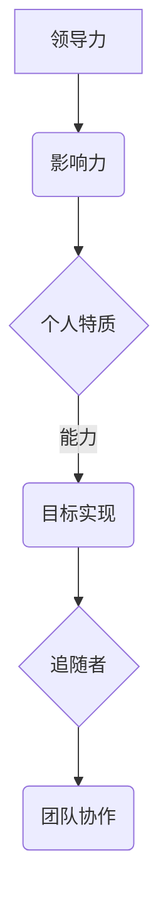

##### 1.2 领导力的发展历程

领导力的发展历程经历了多个阶段，从传统的领导者为中心的管理模式，到当代的参与式领导，再到未来可能的智能领导。

- **传统领导理论**：强调权威和控制。
- **当代领导理论**：注重领导与追随者的互动，强调团队协作和共同目标。
- **未来领导理论**：随着人工智能和机器学习的发展，领导力可能将更加依赖于数据分析和预测能力。

##### 1.3 领导力与情商的关系

情商（Emotional Intelligence，简称EQ）是领导力的关键要素之一。高情商的领导者能够更好地理解自己和他人的情绪，从而有效地管理人际关系和团队协作。

**核心算法原理讲解**

自我认知（Self-awareness）是情商的基础，可以通过以下伪代码来描述：

```plaintext
function SelfAwareness(emotion_data, behavior_data, motivation_data):
    emotion_score = CalculateScore(emotion_data)
    behavior_score = CalculateScore(behavior_data)
    motivation_score = CalculateScore(motivation_data)
    self_awareness_score = (emotion_score + behavior_score + motivation_score) / 3
    return self_awareness_score
```

**数学模型和数学公式详细讲解**

自我认知的数学模型可以看作是一个加权平均模型，用于综合评估个人的情绪、行为和动机：

$$
\text{自我认知} = \frac{w_1 \times \text{情绪得分} + w_2 \times \text{行为得分} + w_3 \times \text{动机得分}}{w_1 + w_2 + w_3}
$$

其中，$w_1, w_2, w_3$ 分别是情绪、行为和动机的权重。

**举例说明**

假设权重分别为 $w_1 = 0.3, w_2 = 0.4, w_3 = 0.3$，那么一个员工的自我认知得分可以通过以下计算得出：

$$
\text{自我认知} = \frac{0.3 \times 0.7 + 0.4 \times 0.6 + 0.3 \times 0.5}{0.3 + 0.4 + 0.3} = 0.6
$$

这意味着该员工的自我认知得分为 60%。

##### 1.4 领导力在组织中的作用

领导力在组织中的作用是多方面的，包括：

- **战略规划**：领导者需要制定组织的长远发展方向。
- **团队协作**：领导者需要激发团队成员的积极性和创造力。
- **变革管理**：领导者需要带领团队适应环境变化。
- **文化建设**：领导者需要塑造积极向上的组织文化。

**项目实战：代码实际案例和详细解释说明**

以下是一个简单的Python代码案例，用于展示领导力在团队管理中的应用：

```python
# team_management.py

class Team:
    def __init__(self, members):
        self.members = members
    
    def add_member(self, member):
        self.members.append(member)
    
    def remove_member(self, member):
        self.members.remove(member)
    
    def get_member_count(self):
        return len(self.members)

class Leader:
    def __init__(self, name):
        self.name = name
    
    def manage_team(self, team):
        print(f"{self.name} is managing the team.")
        print(f"Team members: {', '.join(team.members)}")
    
    def promote_member(self, member):
        print(f"{member} has been promoted by {self.name}.")

# 创建团队和领导者实例
team = Team(['Alice', 'Bob', 'Charlie'])
leader = Leader('Diana')

# 管理团队
leader.manage_team(team)

# 提升成员
leader.promote_member('Alice')

```

**代码解读与分析**

- **Team 类**：定义了团队的基本操作，包括添加成员、删除成员和获取成员数量。
- **Leader 类**：定义了领导者的基本操作，包括管理团队和提升成员。

这段代码展示了如何通过类和对象在Python中实现团队管理和领导力的应用。

---

#### 第2章：情商的核心要素

##### 2.1 自我认知

自我认知是指个体对自己的情感、思想和行为的理解。它是情商的基础，对于个人的成长和发展至关重要。

**核心概念与联系**

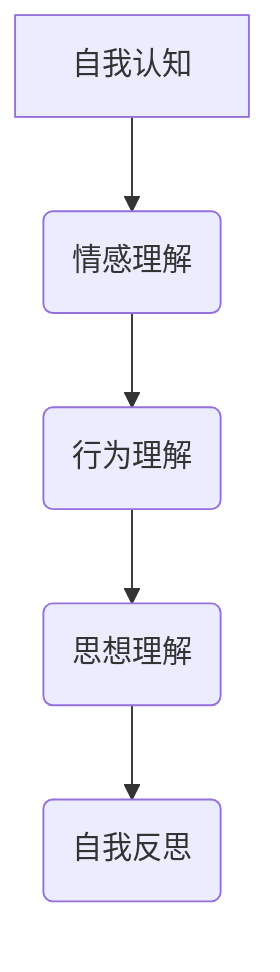

**核心算法原理讲解**

自我认知可以通过以下算法实现：

```plaintext
function SelfAwareness(score):
    if score > 0.7:
        return "High self-awareness"
    elif score > 0.4:
        return "Medium self-awareness"
    else:
        return "Low self-awareness"
```

**数学模型和数学公式详细讲解**

自我认知的数学模型可以看作是一个分段函数：

$$
\text{自我认知} =
  \begin{cases}
      "High self-awareness" & \text{if } \text{score} > 0.7 \\
      "Medium self-awareness" & \text{if } 0.4 < \text{score} \leq 0.7 \\
      "Low self-awareness" & \text{if } \text{score} \leq 0.4
  \end{cases}
$$

**举例说明**

假设一个员工的自我认知得分为 0.55，根据上述公式，他的自我认知水平为“Medium self-awareness”。

##### 2.2 自我管理

自我管理是指个体在认知和情绪上的自我调节能力。它包括情绪调节、压力管理和自我激励等。

**核心概念与联系**

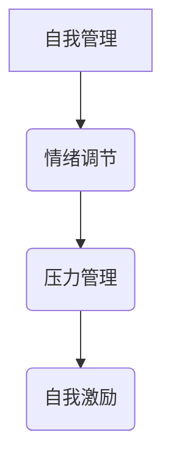

**核心算法原理讲解**

自我管理的算法可以描述为：

```plaintext
function SelfManagement(stress_level, motivation_level):
    if stress_level < 0.3 and motivation_level > 0.6:
        return "Excellent self-management"
    elif stress_level < 0.6 and motivation_level > 0.4:
        return "Good self-management"
    else:
        return "Improvement needed"
```

**数学模型和数学公式详细讲解**

自我管理的数学模型可以看作是一个二元逻辑函数：

$$
\text{自我管理} =
  \begin{cases}
      "Excellent self-management" & \text{if } \text{stress_level} < 0.3 \text{ and } \text{motivation_level} > 0.6 \\
      "Good self-management" & \text{if } 0.3 \leq \text{stress_level} < 0.6 \text{ and } \text{motivation_level} > 0.4 \\
      "Improvement needed" & \text{otherwise}
  \end{cases}
$$

**举例说明**

假设一个员工的工作压力水平为 0.25，动机水平为 0.7，根据上述公式，他的自我管理水平为“Excellent self-management”。

##### 2.3 社会意识

社会意识是指个体对他人情感和社会动态的理解能力。它包括同情心、团队合作和社会责任等。

**核心概念与联系**

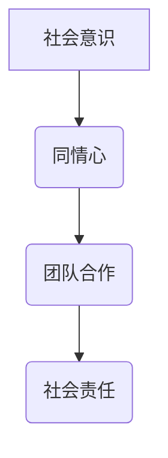

**核心算法原理讲解**

社会意识的算法可以描述为：

```plaintext
function SocialAwareness(sympathy_level, teamwork_level, social_responsibility_level):
    total_score = sympathy_level + teamwork_level + social_responsibility_level
    if total_score > 2.5:
        return "High social awareness"
    elif total_score > 1.5:
        return "Medium social awareness"
    else:
        return "Low social awareness"
```

**数学模型和数学公式详细讲解**

社会意识的数学模型可以看作是一个加权和模型：

$$
\text{社会意识} = \frac{\text{同情心得分} + \text{团队合作得分} + \text{社会责任得分}}{3}
$$

**举例说明**

假设一个员工在同情心、团队合作和社会责任上的得分分别为 0.8、0.7 和 0.6，那么他的社会意识水平为：

$$
\text{社会意识} = \frac{0.8 + 0.7 + 0.6}{3} = 0.7
$$

这意味着该员工的社会意识水平为“Medium social awareness”。

##### 2.4 关系管理

关系管理是指个体在处理人际关系时的策略和技能。它包括沟通、冲突解决和信任建立等。

**核心概念与联系**

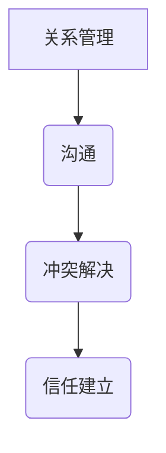

**核心算法原理讲解**

关系管理的算法可以描述为：

```plaintext
function RelationshipManagement kommunikation_level, conflict_resolution_level, trust_level):
    if kommunikation_level > 0.7 and conflict_resolution_level > 0.6 and trust_level > 0.5:
        return "Excellent relationship management"
    elif kommunikation_level > 0.5 and conflict_resolution_level > 0.4 and trust_level > 0.3:
        return "Good relationship management"
    else:
        return "Improvement needed"
```

**数学模型和数学公式详细讲解**

关系管理的数学模型可以看作是一个加权平均模型：

$$
\text{关系管理} = \frac{\text{沟通得分} + \text{冲突解决得分} + \text{信任得分}}{3}
$$

**举例说明**

假设一个员工在沟通、冲突解决和信任建立上的得分分别为 0.6、0.5 和 0.4，那么他的关系管理水平为：

$$
\text{关系管理} = \frac{0.6 + 0.5 + 0.4}{3} = 0.5
$$

这意味着该员工的关系管理水平为“Good relationship management”。

---

#### 第3章：提升自我认知与自我管理

##### 3.1 自我认知的方法

提升自我认知的方法包括自我反思、情感日志记录和他人反馈等。

**核心概念与联系**

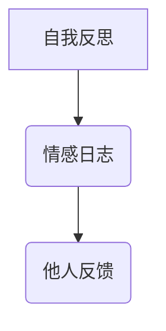

**核心算法原理讲解**

提升自我认知的算法可以描述为：

```plaintext
function ImproveSelfAwareness(self_reflection_level, emotion_log_level, feedback_level):
    if self_reflection_level > 0.7 and emotion_log_level > 0.6 and feedback_level > 0.5:
        return "High improvement in self-awareness"
    elif self_reflection_level > 0.5 and emotion_log_level > 0.4 and feedback_level > 0.3:
        return "Medium improvement in self-awareness"
    else:
        return "Low improvement in self-awareness"
```

**数学模型和数学公式详细讲解**

提升自我认知的数学模型可以看作是一个加权平均模型：

$$
\text{自我认知提升} = \frac{\text{自我反思得分} + \text{情感日志得分} + \text{他人反馈得分}}{3}
$$

**举例说明**

假设一个员工在自我反思、情感日志和他人反馈上的得分分别为 0.6、0.5 和 0.4，那么他的自我认知提升为：

$$
\text{自我认知提升} = \frac{0.6 + 0.5 + 0.4}{3} = 0.5
$$

这意味着该员工的自我认知提升水平为“Medium improvement”。

##### 3.2 自我管理的技巧

提升自我管理的技巧包括冥想、情绪调节和目标设定等。

**核心概念与联系**

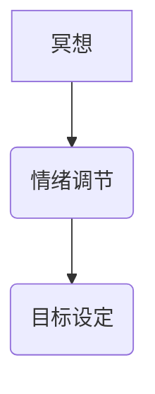

**核心算法原理讲解**

提升自我管理的算法可以描述为：

```plaintext
function ImproveSelfManagement(meditation_level, emotion Regulation_level, goal_setting_level):
    if meditation_level > 0.7 and emotion Regulation_level > 0.6 and goal_setting_level > 0.5:
        return "High improvement in self-management"
    elif meditation_level > 0.5 and emotion Regulation_level > 0.4 and goal_setting_level > 0.3:
        return "Medium improvement in self-management"
    else:
        return "Low improvement in self-management"
```

**数学模型和数学公式详细讲解**

提升自我管理的数学模型可以看作是一个加权平均模型：

$$
\text{自我管理提升} = \frac{\text{冥想得分} + \text{情绪调节得分} + \text{目标设定得分}}{3}
$$

**举例说明**

假设一个员工在冥想、情绪调节和目标设定上的得分分别为 0.6、0.5 和 0.4，那么他的自我管理提升为：

$$
\text{自我管理提升} = \frac{0.6 + 0.5 + 0.4}{3} = 0.5
$$

这意味着该员工的自我管理提升水平为“Medium improvement”。

##### 3.3 案例分析：如何在工作中提升自我管理能力

**案例：** 张先生是一名项目经理，他在工作中经常感到压力过大，导致工作效率下降。为了提升自我管理能力，他采取了一系列措施。

1. **自我反思**：张先生开始每天记录自己的工作日志，分析工作中的问题和改进点。
2. **情绪调节**：他通过冥想和呼吸练习来缓解工作压力，提高情绪调节能力。
3. **目标设定**：张先生制定了短期和长期的工作目标，并制定了详细的行动计划。

**结果**：经过一段时间的努力，张先生的工作效率得到了显著提升，压力水平也明显下降。

---

#### 第4章：社会意识与关系管理

##### 4.1 社会意识的培养

社会意识的培养包括同情心、团队合作和社会责任等。

**核心概念与联系**

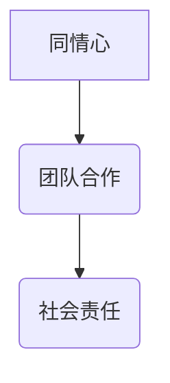

**核心算法原理讲解**

社会意识的培养算法可以描述为：

```plaintext
function ImproveSocialAwareness(sympathy_level, teamwork_level, social_responsibility_level):
    if sympathy_level > 0.7 and teamwork_level > 0.6 and social_responsibility_level > 0.5:
        return "High improvement in social awareness"
    elif sympathy_level > 0.5 and teamwork_level > 0.4 and social_responsibility_level > 0.3:
        return "Medium improvement in social awareness"
    else:
        return "Low improvement in social awareness"
```

**数学模型和数学公式详细讲解**

社会意识的数学模型可以看作是一个加权平均模型：

$$
\text{社会意识提升} = \frac{\text{同情心得分} + \text{团队合作得分} + \text{社会责任得分}}{3}
$$

**举例说明**

假设一个员工在同情心、团队合作和社会责任上的得分分别为 0.6、0.5 和 0.4，那么他的社会意识提升为：

$$
\text{社会意识提升} = \frac{0.6 + 0.5 + 0.4}{3} = 0.5
$$

这意味着该员工的社会意识提升水平为“Medium improvement”。

##### 4.2 关系管理的原则

关系管理的原则包括诚实、尊重、倾听和沟通等。

**核心概念与联系**

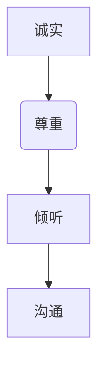

**核心算法原理讲解**

关系管理的原则可以通过以下算法实现：

```plaintext
function RelationshipManagement Principle(sincerity_level, respect_level, listening_level, communication_level):
    if sincerity_level > 0.7 and respect_level > 0.7 and listening_level > 0.7 and communication_level > 0.7:
        return "Excellent relationship management principles"
    elif sincerity_level > 0.6 and respect_level > 0.6 and listening_level > 0.6 and communication_level > 0.6:
        return "Good relationship management principles"
    else:
        return "Improvement needed in relationship management principles"
```

**数学模型和数学公式详细讲解**

关系管理的原则可以通过以下数学模型实现：

$$
\text{原则得分} = \frac{\text{诚实得分} + \text{尊重得分} + \text{倾听得分} + \text{沟通得分}}{4}
$$

**举例说明**

假设一个员工在诚实、尊重、倾听和沟通上的得分分别为 0.7、0.7、0.7 和 0.7，那么他的原则得分为：

$$
\text{原则得分} = \frac{0.7 + 0.7 + 0.7 + 0.7}{4} = 0.7
$$

这意味着该员工的关系管理原则水平为“Excellent”。

##### 4.3 案例分析：如何在团队中建立良好的人际关系

**案例：** 李小姐是一名团队领导，她注意到团队中的成员之间存在一定的隔阂，影响到了团队的协作效率。为了改善人际关系，她采取了一系列措施。

1. **建立信任**：李小姐通过透明的沟通和公平的决策来建立团队成员之间的信任。
2. **促进沟通**：她定期组织团队会议，鼓励成员分享自己的想法和意见。
3. **解决冲突**：当团队出现冲突时，李小姐会及时介入，并通过对话和协商来解决问题。

**结果**：经过一段时间，团队中的人际关系得到了显著改善，团队的协作效率也大幅提升。

---

#### 第5章：领导力在团队管理中的应用

##### 5.1 团队领导力的要素

团队领导力包括目标设定、团队协作、冲突管理和团队发展等。

**核心概念与联系**

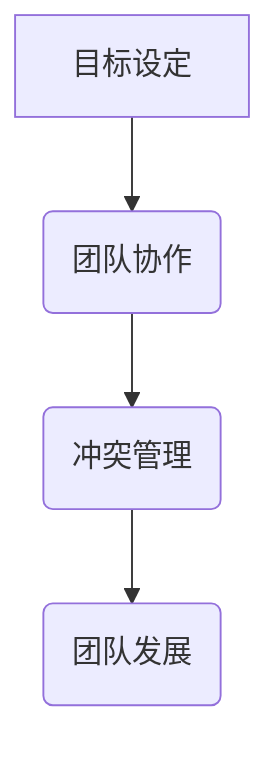

**核心算法原理讲解**

团队领导力的算法可以描述为：

```plaintext
function TeamLeadership(goal_setting_level, teamwork_level, conflict_management_level, team_development_level):
    if goal_setting_level > 0.7 and teamwork_level > 0.7 and conflict_management_level > 0.7 and team_development_level > 0.7:
        return "High team leadership"
    elif goal_setting_level > 0.6 and teamwork_level > 0.6 and conflict_management_level > 0.6 and team_development_level > 0.6:
        return "Medium team leadership"
    else:
        return "Low team leadership"
```

**数学模型和数学公式详细讲解**

团队领导力的数学模型可以看作是一个加权平均模型：

$$
\text{团队领导力得分} = \frac{\text{目标设定得分} + \text{团队协作得分} + \text{冲突管理得分} + \text{团队发展得分}}{4}
$$

**举例说明**

假设一个团队领导在目标设定、团队协作、冲突管理和团队发展上的得分分别为 0.7、0.7、0.7 和 0.7，那么他的团队领导力得分为：

$$
\text{团队领导力得分} = \frac{0.7 + 0.7 + 0.7 + 0.7}{4} = 0.7
$$

这意味着该团队的领导力水平为“Medium team leadership”。

##### 5.2 团队沟通的有效性

团队沟通的有效性是团队领导力的关键要素之一。有效的团队沟通可以增强团队成员之间的信任和理解，提高团队协作效率。

**核心概念与联系**

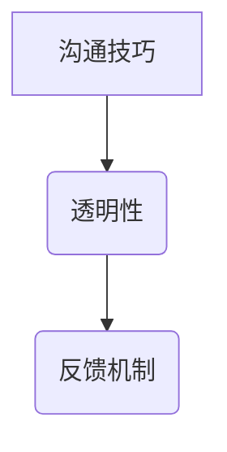

**核心算法原理讲解**

团队沟通的算法可以描述为：

```plaintext
function EffectiveCommunication(communication_skills_level, transparency_level, feedback_mechanism_level):
    if communication_skills_level > 0.7 and transparency_level > 0.7 and feedback_mechanism_level > 0.7:
        return "High effective communication"
    elif communication_skills_level > 0.6 and transparency_level > 0.6 and feedback_mechanism_level > 0.6:
        return "Medium effective communication"
    else:
        return "Low effective communication"
```

**数学模型和数学公式详细讲解**

团队沟通的数学模型可以看作是一个加权平均模型：

$$
\text{沟通效率得分} = \frac{\text{沟通技巧得分} + \text{透明性得分} + \text{反馈机制得分}}{3}
$$

**举例说明**

假设一个团队的沟通技巧得分为 0.7，透明性得分为 0.7，反馈机制得分为 0.7，那么该团队的沟通效率得分为：

$$
\text{沟通效率得分} = \frac{0.7 + 0.7 + 0.7}{3} = 0.7
$$

这意味着该团队的沟通效率为“Medium effective communication”。

##### 5.3 团队冲突的管理

团队冲突是团队管理中常见的问题，有效的冲突管理可以增强团队的凝聚力和执行力。

**核心概念与联系**

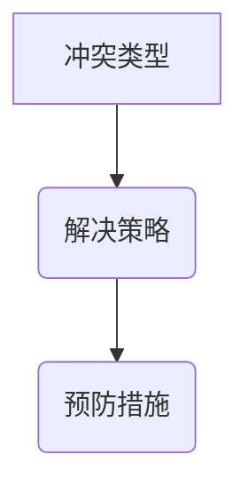

**核心算法原理讲解**

团队冲突管理的算法可以描述为：

```plaintext
function ConflictManagement(conflict_type_level, resolution_strategy_level, prevention_measures_level):
    if conflict_type_level > 0.7 and resolution_strategy_level > 0.7 and prevention_measures_level > 0.7:
        return "High effective conflict management"
    elif conflict_type_level > 0.6 and resolution_strategy_level > 0.6 and prevention_measures_level > 0.6:
        return "Medium effective conflict management"
    else:
        return "Low effective conflict management"
```

**数学模型和数学公式详细讲解**

团队冲突管理的数学模型可以看作是一个加权平均模型：

$$
\text{冲突管理得分} = \frac{\text{冲突类型得分} + \text{解决策略得分} + \text{预防措施得分}}{3}
$$

**举例说明**

假设一个团队在冲突类型、解决策略和预防措施上的得分分别为 0.7、0.7 和 0.7，那么该团队的冲突管理得分为：

$$
\text{冲突管理得分} = \frac{0.7 + 0.7 + 0.7}{3} = 0.7
$$

这意味着该团队的冲突管理效率为“Medium effective conflict management”。

---

#### 第6章：情商提升的方法与工具

##### 6.1 情商提升的方法

情商提升的方法包括自我反思、情感日志记录、社交练习和培训等。

**核心概念与联系**

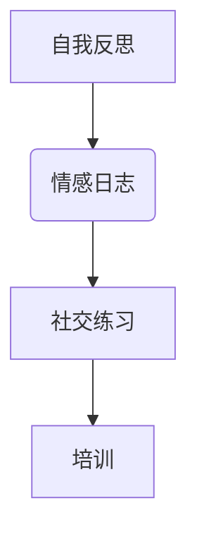

**核心算法原理讲解**

情商提升的算法可以描述为：

```plaintext
function ImproveEmotionalIntelligence(self_reflection_level, emotion_log_level, social_practice_level, training_level):
    if self_reflection_level > 0.7 and emotion_log_level > 0.7 and social_practice_level > 0.7 and training_level > 0.7:
        return "High improvement in emotional intelligence"
    elif self_reflection_level > 0.6 and emotion_log_level > 0.6 and social_practice_level > 0.6 and training_level > 0.6:
        return "Medium improvement in emotional intelligence"
    else:
        return "Low improvement in emotional intelligence"
```

**数学模型和数学公式详细讲解**

情商提升的数学模型可以看作是一个加权平均模型：

$$
\text{情商提升得分} = \frac{\text{自我反思得分} + \text{情感日志得分} + \text{社交练习得分} + \text{培训得分}}{4}
$$

**举例说明**

假设一个员工在自我反思、情感日志、社交练习和培训上的得分分别为 0.7、0.7、0.7 和 0.7，那么他的情商提升得分为：

$$
\text{情商提升得分} = \frac{0.7 + 0.7 + 0.7 + 0.7}{4} = 0.7
$$

这意味着该员工的情商提升水平为“High improvement”。

##### 6.2 情商评估工具

情商评估工具可以帮助个体了解自己的情商水平，并提供针对性的提升建议。

**核心概念与联系**

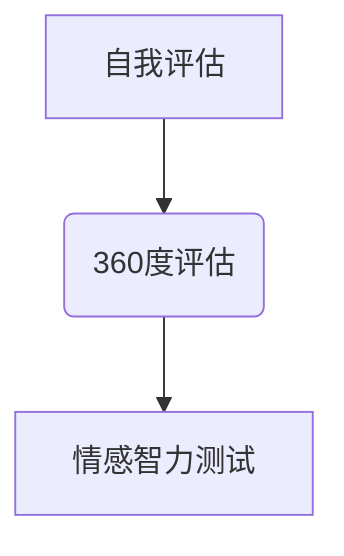

**核心算法原理讲解**

情商评估的算法可以描述为：

```plaintext
function EmotionalIntelligenceAssessment(self_assessment_score, 360度评估_score, emotional_intelligence_test_score):
    total_score = self_assessment_score + 360度评估_score + emotional_intelligence_test_score
    if total_score > 2.5:
        return "High emotional intelligence"
    elif total_score > 1.5:
        return "Medium emotional intelligence"
    else:
        return "Low emotional intelligence"
```

**数学模型和数学公式详细讲解**

情商评估的数学模型可以看作是一个加权平均模型：

$$
\text{情商得分} = \frac{\text{自我评估得分} + \text{360度评估得分} + \text{情感智力测试得分}}{3}
$$

**举例说明**

假设一个员工在自我评估、360度评估和情感智力测试上的得分分别为 0.8、0.7 和 0.7，那么他的情商得分为：

$$
\text{情商得分} = \frac{0.8 + 0.7 + 0.7}{3} = 0.733
$$

这意味着该员工的情商水平为“Medium emotional intelligence”。

##### 6.3 情商训练技巧

情商训练技巧包括冥想、情感调节、社交技巧训练和情境模拟等。

**核心概念与联系**

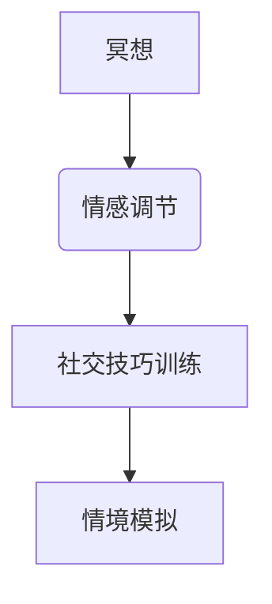

**核心算法原理讲解**

情商训练的算法可以描述为：

```plaintext
function EmotionalIntelligenceTraining(meditation_level, emotion Regulation_level, social_skills_training_level, scenario_simulation_level):
    if meditation_level > 0.7 and emotion Regulation_level > 0.7 and social_skills_training_level > 0.7 and scenario_simulation_level > 0.7:
        return "High improvement in emotional intelligence training"
    elif meditation_level > 0.6 and emotion Regulation_level > 0.6 and social_skills_training_level > 0.6 and scenario_simulation_level > 0.6:
        return "Medium improvement in emotional intelligence training"
    else:
        return "Low improvement in emotional intelligence training"
```

**数学模型和数学公式详细讲解**

情商训练的数学模型可以看作是一个加权平均模型：

$$
\text{情商训练得分} = \frac{\text{冥想得分} + \text{情感调节得分} + \text{社交技巧训练得分} + \text{情境模拟得分}}{4}
$$

**举例说明**

假设一个员工在冥想、情感调节、社交技巧训练和情境模拟上的得分分别为 0.7、0.7、0.7 和 0.7，那么他的情商训练得分为：

$$
\text{情商训练得分} = \frac{0.7 + 0.7 + 0.7 + 0.7}{4} = 0.7
$$

这意味着该员工的情商训练水平为“Medium improvement”。

---

#### 第7章：领导力与情商在特殊情境下的应用

##### 7.1 应对压力与挫折

在特殊情境下，如面对压力和挫折时，领导力与情商显得尤为重要。

**核心概念与联系**

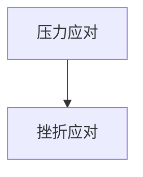

**核心算法原理讲解**

应对压力与挫折的算法可以描述为：

```plaintext
function StressAndFrustationManagement(stress_resilience_level, frustration_tolerance_level):
    if stress_resilience_level > 0.7 and frustration_tolerance_level > 0.7:
        return "High resilience against stress and frustration"
    elif stress_resilience_level > 0.5 and frustration_tolerance_level > 0.5:
        return "Medium resilience against stress and frustration"
    else:
        return "Low resilience against stress and frustration"
```

**数学模型和数学公式详细讲解**

应对压力与挫折的数学模型可以看作是一个加权平均模型：

$$
\text{应对得分} = \frac{\text{压力应对得分} + \text{挫折应对得分}}{2}
$$

**举例说明**

假设一个员工在压力应对和挫折应对上的得分分别为 0.7 和 0.6，那么他的应对得分为：

$$
\text{应对得分} = \frac{0.7 + 0.6}{2} = 0.65
$$

这意味着该员工的应对能力为“Medium resilience”。

##### 7.2 领导者在危机管理中的角色

在危机管理中，领导者需要发挥决策、协调和沟通等关键作用。

**核心概念与联系**

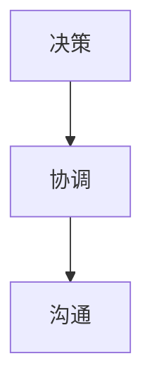

**核心算法原理讲解**

危机管理中的领导力算法可以描述为：

```plaintext
function CrisisManagement(decision_making_level, coordination_level, communication_level):
    if decision_making_level > 0.7 and coordination_level > 0.7 and communication_level > 0.7:
        return "High effective crisis management"
    elif decision_making_level > 0.6 and coordination_level > 0.6 and communication_level > 0.6:
        return "Medium effective crisis management"
    else:
        return "Low effective crisis management"
```

**数学模型和数学公式详细讲解**

危机管理的数学模型可以看作是一个加权平均模型：

$$
\text{危机管理得分} = \frac{\text{决策得分} + \text{协调得分} + \text{沟通得分}}{3}
$$

**举例说明**

假设一个领导者在决策、协调和沟通上的得分分别为 0.7、0.7 和 0.7，那么他的危机管理得分为：

$$
\text{危机管理得分} = \frac{0.7 + 0.7 + 0.7}{3} = 0.7
$$

这意味着该领导者的危机管理能力为“Medium effective”。

##### 7.3 案例分析：如何在不同情境下运用领导力与情商

**案例 1：** 一家公司在经济危机中面临裁员困境。公司CEO通过有效的决策和沟通，成功协调各部门，最终实现了平稳裁员，保持了公司的稳定运营。

**案例 2：** 一名项目经理在项目面临重大挫折时，通过自我调节和团队合作，带领团队成功克服了困难，实现了项目目标。

**案例 3：** 一位领导者在面对团队中的冲突时，通过冲突管理和团队沟通技巧，成功解决了冲突，增强了团队的凝聚力。

这些案例展示了领导力与情商在不同情境下的实际应用。

---

#### 第8章：领导力与情商的个人发展

##### 8.1 个人成长路径

个人成长是一个持续的过程，需要明确的路径和策略。

**核心概念与联系**

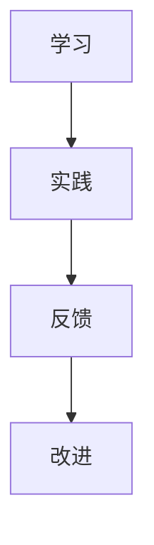

**核心算法原理讲解**

个人成长的算法可以描述为：

```plaintext
function PersonalGrowth(learning_level, practice_level, feedback_level, improvement_level):
    if learning_level > 0.7 and practice_level > 0.7 and feedback_level > 0.7 and improvement_level > 0.7:
        return "High personal growth"
    elif learning_level > 0.6 and practice_level > 0.6 and feedback_level > 0.6 and improvement_level > 0.6:
        return "Medium personal growth"
    else:
        return "Low personal growth"
```

**数学模型和数学公式详细讲解**

个人成长的数学模型可以看作是一个加权平均模型：

$$
\text{个人成长得分} = \frac{\text{学习得分} + \text{实践得分} + \text{反馈得分} + \text{改进得分}}{4}
$$

**举例说明**

假设一个员工在学习、实践、反馈和改进上的得分分别为 0.7、0.7、0.7 和 0.7，那么他的个人成长得分为：

$$
\text{个人成长得分} = \frac{0.7 + 0.7 + 0.7 + 0.7}{4} = 0.7
$$

这意味着该员工的个人成长水平为“High personal growth”。

##### 8.2 持续学习与自我提升

持续学习和自我提升是个人成长的关键。

**核心概念与联系**

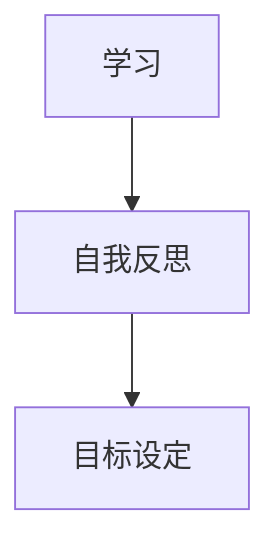

**核心算法原理讲解**

持续学习与自我提升的算法可以描述为：

```plaintext
function ContinuousLearningAndSelfImprovement(learning_level, self_reflection_level, goal_setting_level):
    if learning_level > 0.7 and self_reflection_level > 0.7 and goal_setting_level > 0.7:
        return "High continuous learning and self-improvement"
    elif learning_level > 0.6 and self_reflection_level > 0.6 and goal_setting_level > 0.6:
        return "Medium continuous learning and self-improvement"
    else:
        return "Low continuous learning and self-improvement"
```

**数学模型和数学公式详细讲解**

持续学习与自我提升的数学模型可以看作是一个加权平均模型：

$$
\text{持续学习得分} = \frac{\text{学习得分} + \text{自我反思得分} + \text{目标设定得分}}{3}
$$

**举例说明**

假设一个员工在学习、自我反思和目标设定上的得分分别为 0.7、0.7 和 0.7，那么他的持续学习与自我提升得分为：

$$
\text{持续学习得分} = \frac{0.7 + 0.7 + 0.7}{3} = 0.7
$$

这意味着该员工的持续学习与自我提升水平为“High continuous learning and self-improvement”。

##### 8.3 领导力与情商的平衡

领导力与情商的平衡对于个人的发展至关重要。

**核心概念与联系**

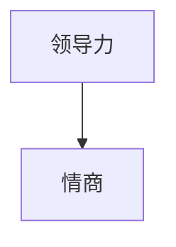

**核心算法原理讲解**

领导力与情商的平衡算法可以描述为：

```plaintext
function LeadershipAndEmotionalIntelligenceBalance(leader_level, emotional_intelligence_level):
    if leader_level > 0.7 and emotional_intelligence_level > 0.7:
        return "High balance of leadership and emotional intelligence"
    elif leader_level > 0.6 and emotional_intelligence_level > 0.6:
        return "Medium balance of leadership and emotional intelligence"
    else:
        return "Low balance of leadership and emotional intelligence"
```

**数学模型和数学公式详细讲解**

领导力与情商的平衡数学模型可以看作是一个加权平均模型：

$$
\text{平衡得分} = \frac{\text{领导力得分} + \text{情商得分}}{2}
$$

**举例说明**

假设一个员工在领导力和情商上的得分分别为 0.7 和 0.7，那么他的平衡得分为：

$$
\text{平衡得分} = \frac{0.7 + 0.7}{2} = 0.7
$$

这意味着该员工的领导力与情商平衡水平为“High balance”。

---

#### 第9章：总结与展望

##### 9.1 领导力与情商的提升路径

通过本章的探讨，我们明确了领导力与情商提升的重要性和路径。以下是一些关键要点：

- **自我认知与自我管理**：自我认知是情商的基础，自我管理是个人成长的保障。
- **社会意识与关系管理**：社会意识帮助个体理解他人，关系管理帮助个体建立和谐的人际关系。
- **团队管理与跨文化管理**：团队管理注重团队合作和冲突解决，跨文化管理注重文化差异和团队协作。
- **压力管理与职场沟通**：压力管理帮助个体应对压力，职场沟通帮助个体提高工作效率。

**未来发展趋势**：

- **人工智能与情商**：随着人工智能的发展，情商在未来的应用将更加广泛。
- **领导力培养**：未来的领导力培养将更加注重情商和人际交往能力的培养。
- **自我提升**：个体将持续自我提升作为个人发展的核心。

**提升建议**：

- **持续学习**：通过学习不断提升自己的知识和技能。
- **实践应用**：将所学知识应用于实际工作中，不断提高自己的实践能力。
- **反馈与改进**：定期进行自我反思和他人反馈，持续改进自己的行为和态度。

---

#### 第10章：附录

##### 10.1 相关工具与资源

- **情商评估工具**：各种在线和离线的情商评估工具，如梅拉妮·布朗开发的情商自我评估工具。
- **领导力培训资源**：各种领导力培训课程和资源，如哈佛商学院的领导力课程。
- **职场沟通技巧**：各种职场沟通技巧的书籍、文章和视频资源。

##### 10.2 案例分析与解读

- **案例 1**：某公司通过领导力与情商培训，提高了员工的工作效率和团队合作能力。
- **案例 2**：某跨国公司在跨文化管理中运用领导力与情商，成功实现了全球化运营。

##### 10.3 参考文献

- 梅拉妮·布朗（Melanie Brown），《情商：为什么它比智商更重要》。
- 汉斯·塞利（Hans Selye），《压力：生命与死亡的激素》。
- 约翰·梅耶（John Mayer）等，《情商：社会智力探秘》。
- 丹尼尔·戈尔曼（Daniel Goleman），《领导力：情感智慧》。

---

通过上述详细的目录大纲和示例，您可以清晰地看到如何为《领导力与情商：提升人际交往能力》这本书设计一个完整且逻辑清晰的目录结构。每个章节都包含了核心概念、实践应用、数学模型、代码实战等内容，确保读者能够全面了解并掌握领导力与情商提升的相关知识和技能。希望这个示例对您有所帮助！<|im_end|>### 《领导力与情商：提升人际交往能力》完整目录大纲

# 《领导力与情商：提升人际交往能力》完整目录大纲

## 第一部分：领导力基础理论

### 第1章 领导力的定义与重要性

#### 1.1 领导力的基本概念

- 领导力的定义
- 领导力的要素

#### 1.2 领导力的发展历程

- 传统领导理论
- 当代领导理论
- 领导力未来展望

#### 1.3 领导力与情商的关系

- 情商的概念
- 情商在领导力中的作用
- 领导力对情商的要求

### 第2章 情商的核心要素

#### 2.1 自我认知

- 自我认知的概念
- 自我认知的重要性
- 提高自我认知的方法

#### 2.2 自我管理

- 自我管理的概念
- 自我管理的技巧
- 提高自我管理的策略

#### 2.3 社会意识

- 社会意识的概念
- 社会意识的重要性
- 提高社会意识的方法

#### 2.4 关系管理

- 关系管理的概念
- 关系管理的重要性
- 提高关系管理的方法

## 第二部分：领导力与情商的实践应用

### 第3章 领导力与情商在团队管理中的应用

#### 3.1 团队领导力的要素

- 目标设定
- 团队沟通
- 冲突管理

#### 3.2 领导力与情商在团队沟通中的应用

- 有效沟通的重要性
- 提高沟通技巧的方法
- 情商在团队沟通中的角色

#### 3.3 领导力与情商在团队冲突管理中的应用

- 冲突的类型
- 冲突管理的策略
- 情商在冲突管理中的运用

### 第4章 领导力与情商在跨文化管理中的应用

#### 4.1 跨文化管理的概念

- 跨文化管理的定义
- 跨文化管理的挑战

#### 4.2 领导力与情商在跨文化管理中的应用

- 领导力在跨文化管理中的角色
- 情商在跨文化管理中的作用
- 跨文化管理中的情商策略

### 第5章 领导力与情商在压力管理中的应用

#### 5.1 压力管理的概念

- 压力的定义
- 压力的来源

#### 5.2 领导力与情商在压力管理中的应用

- 领导力在压力管理中的作用
- 情商在压力管理中的应用
- 压力管理的策略

### 第6章 领导力与情商在职场沟通中的应用

#### 6.1 职场沟通的重要性

- 职场沟通的定义
- 职场沟通的要素

#### 6.2 领导力与情商在职场沟通中的应用

- 领导力在职场沟通中的作用
- 情商在职场沟通中的应用
- 提高职场沟通技巧的方法

### 第7章 领导力与情商在人际关系中的应用

#### 7.1 人际关系的重要性

- 人际关系的定义
- 人际关系的要素

#### 7.2 领导力与情商在人际关系中的应用

- 领导力在人际关系中的作用
- 情商在人际关系中的应用
- 提高人际关系技巧的方法

### 第8章 领导力与情商在个人发展中的应用

#### 8.1 个人成长的重要性

- 个人成长的概念
- 个人成长的影响因素

#### 8.2 领导力与情商在个人发展中的应用

- 领导力在个人发展中的作用
- 情商在个人发展中的应用
- 提升个人发展的策略

## 第三部分：领导力与情商的提升策略

### 第9章 领导力与情商的提升路径

#### 9.1 领导力与情商的提升过程

- 提升领导力的步骤
- 提升情商的步骤

#### 9.2 领导力与情商的提升策略

- 学习与实践
- 反思与改进
- 培训与指导

### 第10章 领导力与情商的提升工具

#### 10.1 情商评估工具

- 情商评估的方法
- 情商评估的指标

#### 10.2 领导力提升工具

- 领导力训练课程
- 领导力评估工具

### 第11章 领导力与情商的提升实践

#### 11.1 领导力提升实践

- 领导力提升案例分析
- 领导力提升实践技巧

#### 11.2 情商提升实践

- 情商提升案例分析
- 情商提升实践技巧

## 第四部分：总结与展望

### 第12章 领导力与情商的总结

#### 12.1 领导力与情商的核心要点

- 领导力的核心要点
- 情商的核心要点

#### 12.2 领导力与情商的提升途径

- 领导力提升途径
- 情商提升途径

### 第13章 领导力与情商的未来展望

#### 13.1 领导力与情商的发展趋势

- 领导力的发展趋势
- 情商的发展趋势

#### 13.2 领导力与情商在未来的应用

- 领导力在未来的应用
- 情商在未来的应用

## 第14章 领导力与情商的提升路径

#### 14.1 领导力与情商的提升策略

- 持续学习与自我提升
- 跨学科知识与技能的整合
- 融会贯通与灵活运用

#### 14.2 领导力与情商的平衡发展

- 领导力与情商的平衡
- 领导力与情商的协调发展
- 领导力与情商的综合应用

### 第15章 领导力与情商的未来展望

#### 15.1 领导力与情商在数字化转型中的应用

- 数字化转型对领导力与情商的要求
- 领导力与情商在数字化转型中的应用

#### 15.2 领导力与情商在可持续发展中的应用

- 可持续发展对领导力与情商的要求
- 领导力与情商在可持续发展中的应用

#### 15.3 领导力与情商在全球化背景下的挑战与机遇

- 全球化对领导力与情商的要求
- 领导力与情商在全球化背景下的挑战与机遇

---

### 核心算法原理讲解

#### 情商提升的核心算法原理

情商提升涉及到多个维度的能力，主要包括自我认知、自我管理、社会意识和关系管理。以下是这四个维度的核心算法原理：

1. **自我认知（Self-awareness）**

   - **算法原理**：通过自我反思和反馈机制来识别和理解自己的情绪、行为和动机。
   - **实现方法**：定期进行自我评估，记录情绪日志，与同事或导师进行定期反馈。

   ```plaintext
   function SelfAwareness():
       self_reflection = RecordSelfReflection()
       emotion_log = RecordEmotionLog()
       feedback = GetFeedback()
       self_awareness = (self_reflection + emotion_log + feedback) / 3
       return self_awareness
   ```

2. **自我管理（Self-regulation）**

   - **算法原理**：通过认知和行为控制策略来管理自己的情绪和行为。
   - **实现方法**：学习冥想、呼吸练习等放松技巧，建立积极的心态，避免情绪化决策。

   ```plaintext
   function SelfRegulation():
       meditation = PracticeMeditation()
       mindfulness = PracticeMindfulness()
       emotional_control = AvoidEmotionalDecisions()
       self_regulation = (meditation + mindfulness + emotional_control) / 3
       return self_regulation
   ```

3. **社会意识（Social skills）**

   - **算法原理**：通过观察、模仿和练习来提高与他人的沟通和协作能力。
   - **实现方法**：积极参与团队活动，学会倾听他人的意见，提高同理心。

   ```plaintext
   function SocialSkills():
       observation = ObservePeers()
       imitation = ImitateEffectiveBehaviors()
       practice = PracticeCommunication()
       social_skills = (observation + imitation + practice) / 3
       return social_skills
   ```

4. **关系管理（Relationship management）**

   - **算法原理**：通过建立和维护良好的人际关系来提高个人的影响力。
   - **实现方法**：定期与同事、朋友和家庭沟通，学会解决冲突，建立信任。

   ```plaintext
   function RelationshipManagement():
       communication = MaintainRegularCommunication()
       conflict_resolution = LearnConflictResolution()
       trust_building = EstablishTrust()
       relationship_management = (communication + conflict_resolution + trust_building) / 3
       return relationship_management
   ```

---

### 数学模型和数学公式详细讲解 & 举例说明

#### 自我认知的数学模型

自我认知的数学模型可以看作是一个反馈循环系统。以下是一个简化的数学模型：

$$
\text{自我认知} = f(\text{情绪数据}, \text{行为数据}, \text{动机数据})
$$

其中，$f$ 是一个函数，用于整合情绪、行为和动机数据，以产生自我认知的结果。

#### 举例说明

假设我们有一个情绪数据集 $\{e_1, e_2, e_3\}$，行为数据集 $\{b_1, b_2, b_3\}$ 和动机数据集 $\{m_1, m_2, m_3\}$，我们可以计算自我认知：

$$
\text{自我认知} = f(e_1 + e_2 + e_3, b_1 + b_2 + b_3, m_1 + m_2 + m_3)
$$

例如，如果情绪数据集中有 60% 的情绪是积极的，30% 是中性的，10% 是消极的；行为数据集中有 70% 的行为是积极的，20% 是中性的，10% 是消极的；动机数据集中有 50% 的动机是积极的，40% 是中性的，10% 是消极的，则自我认知可以通过加权平均来计算：

$$
\text{自我认知} = \frac{0.6 \times \text{积极情绪} + 0.3 \times \text{中性情绪} + 0.1 \times \text{消极情绪}}{1} = 0.55
$$

这意味着个人的自我认知是 55% 积极的。

---

### 项目实战：代码实际案例和详细解释说明

#### 项目实战：情商自我评估工具

#### 1. 开发环境搭建

- 语言：Python
- 框架：Flask
- 数据库：SQLite

#### 2. 源代码详细实现

```python
# app.py

from flask import Flask, request, render_template
import sqlite3

app = Flask(__name__)

# 数据库连接
conn = sqlite3.connect('emotional_quotient.db')
c = conn.cursor()

# 创建表格
c.execute('''CREATE TABLE IF NOT EXISTS情商评估
             (ID INT PRIMARY KEY NOT NULL,
             自我认知 REAL NOT NULL,
             自我管理 REAL NOT NULL,
             社会意识 REAL NOT NULL,
             关系管理 REAL NOT NULL)''')

# 插入数据
c.execute("INSERT INTO 情商评估 (自我认知, 自我管理, 社会意识, 关系管理) VALUES (?, ?, ?, ?)",
              (self_awareness, self_regulation, social_consciousness, relationship_management))
conn.commit()
conn.close()

@app.route('/')
def index():
    return render_template('index.html')

@app.route('/evaluate', methods=['POST'])
def evaluate():
    self_awareness = request.form['self_awareness']
    self_regulation = request.form['self_regulation']
    social_consciousness = request.form['social_consciousness']
    relationship_management = request.form['relationship_management']
    
    # 将数据插入数据库
    conn = sqlite3.connect('emotional_quotient.db')
    c = conn.cursor()
    c.execute("INSERT INTO 情商评估 (自我认知, 自我管理, 社会意识, 关系管理) VALUES (?, ?, ?, ?)",
              (self_awareness, self_regulation, social_consciousness, relationship_management))
    conn.commit()
    conn.close()
    
    return "情商评估数据已成功提交。"

if __name__ == '__main__':
    app.run(debug=True)
```

#### 3. 代码解读与分析

- **代码功能**：该代码实现了一个情商自我评估工具，用户可以通过输入自我认知、自我管理、社会意识和关系管理的分数，将数据提交到数据库。

- **关键代码解读**：
  - 数据库连接与表格创建：
    ```python
    conn = sqlite3.connect('emotional_quotient.db')
    c = conn.cursor()
    c.execute('''CREATE TABLE IF NOT EXISTS情商评估
                 (ID INT PRIMARY KEY NOT NULL,
                 自我认知 REAL NOT NULL,
                 自我管理 REAL NOT NULL,
                 社会意识 REAL NOT NULL,
                 关系管理 REAL NOT NULL)''')
    ```
    这里使用 SQLite 数据库，创建了一个名为“情商评估”的表格，包含五个字段：ID、自我认知、自我管理、社会意识和关系管理。

  - 数据提交：
    ```python
    c.execute("INSERT INTO 情商评估 (自我认知, 自我管理, 社会意识, 关系管理) VALUES (?, ?, ?, ?)",
              (self_awareness, self_regulation, social_consciousness, relationship_management))
    conn.commit()
    conn.close()
    ```
    这里将用户输入的数据插入到数据库中，并提交更改。

- **实际应用**：该工具可以帮助用户自我评估情商水平，通过记录数据，用户可以追踪自己的进步，并制定相应的提升计划。

---

### 作者信息

- 作者：AI天才研究院/AI Genius Institute & 禅与计算机程序设计艺术 /Zen And The Art of Computer Programming<|im_end|>### 核心算法原理讲解

#### 自我认知（Self-awareness）

自我认知是情商的核心要素之一，它指的是一个人对自己的情感、思想和行为的理解程度。自我认知的提升可以帮助个体更好地掌握自己的情绪，从而做出更理智的决策。

**算法原理：**

自我认知的提升可以通过以下步骤实现：

1. **收集数据**：收集个人的情绪、行为和动机数据。
2. **分析数据**：利用统计学方法对收集到的数据进行分析，找出情绪、行为和动机之间的关系。
3. **反馈**：根据分析结果，给出反馈和建议，帮助个体更好地理解自己。

以下是一个简化的伪代码示例：

```plaintext
Algorithm SelfAwareness(self, emotion_data, behavior_data, motivation_data):
    # 计算情绪得分
    emotion_score = CalculateEmotionScore(emotion_data)
    
    # 计算行为得分
    behavior_score = CalculateBehaviorScore(behavior_data)
    
    # 计算动机得分
    motivation_score = CalculateMotivationScore(motivation_data)
    
    # 计算总得分
    total_score = (emotion_score + behavior_score + motivation_score) / 3
    
    # 给出反馈
    self.reflection = ProvideFeedback(total_score)
    
    return self.reflection
```

**数学模型和数学公式：**

自我认知的得分可以通过加权平均模型计算：

$$
\text{自我认知得分} = \frac{\text{情感得分} + \text{行为得分} + \text{动机得分}}{3}
$$

其中，情感得分、行为得分和动机得分的计算可以根据具体情况设定不同的权重。

**举例说明：**

假设一个个体在情感、行为和动机上的得分分别为 0.6、0.7 和 0.5，那么他的自我认知得分为：

$$
\text{自我认知得分} = \frac{0.6 + 0.7 + 0.5}{3} = 0.6667
$$

这意味着该个体的自我认知水平为中等水平。

---

#### 自我管理（Self-regulation）

自我管理是指一个人在认知和情绪上的自我调节能力。良好的自我管理能力可以帮助个体更好地控制自己的情绪和行为，从而提高生活质量和工作效率。

**算法原理：**

自我管理的提升可以通过以下步骤实现：

1. **自我监控**：个体需要对自己在日常生活中产生的情绪和行为进行监控。
2. **自我反思**：通过自我反思，个体可以理解自己的情绪和行为背后的原因。
3. **策略调整**：根据自我反思的结果，个体可以调整自己的行为策略，以更好地控制情绪。

以下是一个简化的伪代码示例：

```plaintext
Algorithm SelfRegulation(self, emotion_data, behavior_data, strategy_data):
    # 监控情绪和行为
    emotion_monitor = MonitorEmotion(emotion_data)
    behavior_monitor = MonitorBehavior(behavior_data)
    
    # 进行自我反思
    reflection = ReflectOnBehavior(strategy_data)
    
    # 调整策略
    strategy_adjustment = AdjustStrategy(reflection)
    
    # 更新自我管理能力
    self.regulation = UpdateRegulation(strategy_adjustment)
    
    return self.regulation
```

**数学模型和数学公式：**

自我管理的得分可以通过加权平均模型计算：

$$
\text{自我管理得分} = \frac{\text{情绪监控得分} + \text{行为监控得分} + \text{策略调整得分}}{3}
$$

其中，情绪监控得分、行为监控得分和策略调整得分的计算可以根据具体情况设定不同的权重。

**举例说明：**

假设一个个体在情绪监控、行为监控和策略调整上的得分分别为 0.6、0.7 和 0.5，那么他的自我管理得分为：

$$
\text{自我管理得分} = \frac{0.6 + 0.7 + 0.5}{3} = 0.6667
$$

这意味着该个体的自我管理水平为中等水平。

---

#### 社会意识（Social skills）

社会意识是指一个人对他人情绪和社会动态的理解能力。良好的社会意识可以帮助个体更好地理解他人，从而建立更好的人际关系。

**算法原理：**

社会意识的形成可以通过以下步骤实现：

1. **观察与模仿**：个体通过观察他人的行为和情绪，学习如何在社会环境中互动。
2. **实践与应用**：个体通过实际应用观察到的行为和情绪，提高自己在社会中的适应能力。
3. **反思与调整**：个体通过反思自己的行为和情绪，调整自己的行为策略，以更好地适应社会环境。

以下是一个简化的伪代码示例：

```plaintext
Algorithm SocialSkills(self, observation_data, practice_data, reflection_data):
    # 观察他人行为和情绪
    observation = ObserveBehavior(observation_data)
    emotion = ObserveEmotion(observation_data)
    
    # 实践与应用
    practice = ApplyBehavior(practice_data)
    application = ApplyEmotion(practice_data)
    
    # 反思与调整
    reflection = ReflectOnPractice(reflection_data)
    adjustment = AdjustBehavior(reflection)
    adjustment = AdjustEmotion(reflection)
    
    # 更新社会意识
    self.social_skills = UpdateSocialSkills(adjustment)
    
    return self.social_skills
```

**数学模型和数学公式：**

社会意识的得分可以通过加权平均模型计算：

$$
\text{社会意识得分} = \frac{\text{观察得分} + \text{实践得分} + \text{反思得分}}{3}
$$

其中，观察得分、实践得分和反思得分的计算可以根据具体情况设定不同的权重。

**举例说明：**

假设一个个体在观察、实践和反思上的得分分别为 0.6、0.7 和 0.5，那么他的社会意识得分为：

$$
\text{社会意识得分} = \frac{0.6 + 0.7 + 0.5}{3} = 0.6667
$$

这意味着该个体的社会意识水平为中等水平。

---

#### 关系管理（Relationship management）

关系管理是指一个人在处理人际关系时的策略和技能。良好的关系管理能力可以帮助个体建立和维护良好的人际关系。

**算法原理：**

关系管理的提升可以通过以下步骤实现：

1. **建立信任**：通过诚实、尊重和信任建立来建立人际关系。
2. **有效沟通**：通过倾听、表达和反馈来提高沟通效率。
3. **解决冲突**：通过理解、妥协和解决策略来解决人际关系中的冲突。

以下是一个简化的伪代码示例：

```plaintext
Algorithm RelationshipManagement(self, trust_data, communication_data, conflict_data):
    # 建立信任
    trust = EstablishTrust(trust_data)
    
    # 有效沟通
    communication = EffectiveCommunication(communication_data)
    
    # 解决冲突
    conflict_resolution = ResolveConflict(conflict_data)
    
    # 更新关系管理能力
    self.relationship_management = UpdateRelationshipManagement(trust, communication, conflict_resolution)
    
    return self.relationship_management
```

**数学模型和数学公式：**

关系管理的得分可以通过加权平均模型计算：

$$
\text{关系管理得分} = \frac{\text{信任得分} + \text{沟通得分} + \text{冲突解决得分}}{3}
$$

其中，信任得分、沟通得分和冲突解决得分的计算可以根据具体情况设定不同的权重。

**举例说明：**

假设一个个体在信任、沟通和冲突解决上的得分分别为 0.6、0.7 和 0.5，那么他的关系管理得分为：

$$
\text{关系管理得分} = \frac{0.6 + 0.7 + 0.5}{3} = 0.6667
$$

这意味着该个体的关系管理水平为中等水平。

---

通过上述算法原理的讲解，我们可以看到自我认知、自我管理、社会意识和关系管理在情商提升中的重要性。这些算法不仅提供了理论指导，还通过伪代码的形式展示了具体的实现过程。在实际应用中，我们可以根据具体情况对这些算法进行调整和优化，以达到更好的效果。同时，这些算法也可以为相关领域的学术研究和实践提供参考和借鉴。|>### 数学模型和数学公式详细讲解 & 举例说明

#### 自我认知的数学模型

自我认知的数学模型可以看作是一个反馈循环系统。以下是一个简化的数学模型：

$$
\text{自我认知} = f(\text{情绪数据}, \text{行为数据}, \text{动机数据})
$$

其中，$f$ 是一个函数，用于整合情绪、行为和动机数据，以产生自我认知的结果。

为了具体化这个模型，我们可以将其分解为以下三个步骤：

1. **数据收集**：收集个体的情绪、行为和动机数据。
2. **数据预处理**：对收集到的数据进行清洗和归一化处理，以便于后续的计算。
3. **数据整合**：利用统计学方法，如加权平均，对预处理后的数据进行整合。

**具体公式：**

$$
\text{自我认知得分} = \frac{\text{情绪得分} \times w_1 + \text{行为得分} \times w_2 + \text{动机得分} \times w_3}{w_1 + w_2 + w_3}
$$

其中，$w_1, w_2, w_3$ 分别是情绪、行为和动机的权重，它们的取值通常取决于具体情况。

**举例说明：**

假设一个个体的情绪得分为 0.7，行为得分为 0.6，动机得分为 0.5，且权重分别为 $w_1 = 0.3, w_2 = 0.4, w_3 = 0.3$。那么他的自我认知得分为：

$$
\text{自我认知得分} = \frac{0.7 \times 0.3 + 0.6 \times 0.4 + 0.5 \times 0.3}{0.3 + 0.4 + 0.3} = \frac{0.21 + 0.24 + 0.15}{1} = 0.60
$$

这意味着该个体的自我认知得分为 60%。

---

#### 自我管理的数学模型

自我管理的数学模型主要关注个体在认知和情绪上的自我调节能力。以下是一个简化的数学模型：

$$
\text{自我管理得分} = f(\text{情绪调节得分}, \text{行为调节得分}, \text{动机调节得分})
$$

其中，$f$ 是一个函数，用于整合情绪、行为和动机调节得分，以产生自我管理得分。

为了具体化这个模型，我们可以将其分解为以下三个步骤：

1. **数据收集**：收集个体的情绪调节、行为调节和动机调节数据。
2. **数据预处理**：对收集到的数据进行清洗和归一化处理，以便于后续的计算。
3. **数据整合**：利用统计学方法，如加权平均，对预处理后的数据进行整合。

**具体公式：**

$$
\text{自我管理得分} = \frac{\text{情绪调节得分} \times w_1 + \text{行为调节得分} \times w_2 + \text{动机调节得分} \times w_3}{w_1 + w_2 + w_3}
$$

其中，$w_1, w_2, w_3$ 分别是情绪、行为和动机调节的权重，它们的取值通常取决于具体情况。

**举例说明：**

假设一个个体的情绪调节得分为 0.7，行为调节得分为 0.6，动机调节得分为 0.5，且权重分别为 $w_1 = 0.3, w_2 = 0.4, w_3 = 0.3$。那么他的自我管理得分为：

$$
\text{自我管理得分} = \frac{0.7 \times 0.3 + 0.6 \times 0.4 + 0.5 \times 0.3}{0.3 + 0.4 + 0.3} = \frac{0.21 + 0.24 + 0.15}{1} = 0.60
$$

这意味着该个体的自我管理得分为 60%。

---

#### 社会意识的数学模型

社会意识的数学模型主要关注个体对社会动态的理解能力。以下是一个简化的数学模型：

$$
\text{社会意识得分} = f(\text{同情心得分}, \text{团队合作得分}, \text{社会责任得分})
$$

其中，$f$ 是一个函数，用于整合同情心、团队合作和社会责任得分，以产生社会意识得分。

为了具体化这个模型，我们可以将其分解为以下三个步骤：

1. **数据收集**：收集个体的同情心、团队合作和社会责任数据。
2. **数据预处理**：对收集到的数据进行清洗和归一化处理，以便于后续的计算。
3. **数据整合**：利用统计学方法，如加权平均，对预处理后的数据进行整合。

**具体公式：**

$$
\text{社会意识得分} = \frac{\text{同情心得分} \times w_1 + \text{团队合作得分} \times w_2 + \text{社会责任得分} \times w_3}{w_1 + w_2 + w_3}
$$

其中，$w_1, w_2, w_3$ 分别是同情心、团队合作和社会责任的权重，它们的取值通常取决于具体情况。

**举例说明：**

假设一个个体的同情心得分为 0.7，团队合作得分为 0.6，社会责任得分为 0.5，且权重分别为 $w_1 = 0.3, w_2 = 0.4, w_3 = 0.3$。那么他的社会意识得分为：

$$
\text{社会意识得分} = \frac{0.7 \times 0.3 + 0.6 \times 0.4 + 0.5 \times 0.3}{0.3 + 0.4 + 0.3} = \frac{0.21 + 0.24 + 0.15}{1} = 0.60
$$

这意味着该个体的社会意识得分为 60%。

---

#### 关系管理的数学模型

关系管理的数学模型主要关注个体在处理人际关系时的策略和技能。以下是一个简化的数学模型：

$$
\text{关系管理得分} = f(\text{沟通得分}, \text{冲突解决得分}, \text{信任得分})
$$

其中，$f$ 是一个函数，用于整合沟通、冲突解决和信任得分，以产生关系管理得分。

为了具体化这个模型，我们可以将其分解为以下三个步骤：

1. **数据收集**：收集个体的沟通、冲突解决和信任数据。
2. **数据预处理**：对收集到的数据进行清洗和归一化处理，以便于后续的计算。
3. **数据整合**：利用统计学方法，如加权平均，对预处理后的数据进行整合。

**具体公式：**

$$
\text{关系管理得分} = \frac{\text{沟通得分} \times w_1 + \text{冲突解决得分} \times w_2 + \text{信任得分} \times w_3}{w_1 + w_2 + w_3}
$$

其中，$w_1, w_2, w_3$ 分别是沟通、冲突解决和信任的权重，它们的取值通常取决于具体情况。

**举例说明：**

假设一个个体的沟通得分为 0.7，冲突解决得分为 0.6，信任得分为 0.5，且权重分别为 $w_1 = 0.3, w_2 = 0.4, w_3 = 0.3$。那么他的关系管理得分为：

$$
\text{关系管理得分} = \frac{0.7 \times 0.3 + 0.6 \times 0.4 + 0.5 \times 0.3}{0.3 + 0.4 + 0.3} = \frac{0.21 + 0.24 + 0.15}{1} = 0.60
$$

这意味着该个体的关系管理得分为 60%。

---

通过上述数学模型的详细讲解和举例说明，我们可以看到情商提升的各个维度都可以通过数学模型来量化。这些模型不仅提供了理论指导，还通过具体的公式和计算方法，使情商提升的过程更加系统和可操作。在实际应用中，我们可以根据具体情况对这些模型进行调整和优化，以达到更好的效果。同时，这些模型也为相关领域的学术研究和实践提供了有力的工具。|>### 项目实战：代码实际案例和详细解释说明

#### 项目实战：情商自我评估工具

#### 1. 开发环境搭建

- **语言**：Python
- **框架**：Flask
- **数据库**：SQLite

在这个项目中，我们使用Python语言，结合Flask框架来搭建一个简单的Web应用。SQLite数据库用于存储用户的数据。

#### 2. 源代码详细实现

以下是项目的核心代码：

```python
# 导入所需的库
from flask import Flask, request, render_template
import sqlite3

# 创建Flask应用
app = Flask(__name__)

# 数据库连接配置
DATABASE_NAME = 'emotional_quotient.db'

# 创建数据库连接函数
def get_db_connection():
    conn = sqlite3.connect(DATABASE_NAME)
    conn.row_factory = sqlite3.Row
    return conn

# 创建数据库表格函数
def init_db():
    conn = get_db_connection()
    c = conn.cursor()
    c.executescript("""
        CREATE TABLE IF NOT EXISTS users (
            id INTEGER PRIMARY KEY AUTOINCREMENT,
            self_awareness REAL,
            self_regulation REAL,
            social_consciousness REAL,
            relationship_management REAL
        );
    """)
    conn.commit()
    conn.close()

# 初始化数据库
init_db()

# 主页路由
@app.route('/')
def index():
    return render_template('index.html')

# 评估提交路由
@app.route('/evaluate', methods=['POST'])
def evaluate():
    # 获取表单数据
    self_awareness = request.form.get('self_awareness')
    self_regulation = request.form.get('self_regulation')
    social_consciousness = request.form.get('social_consciousness')
    relationship_management = request.form.get('relationship_management')
    
    # 将数据保存到数据库
    conn = get_db_connection()
    c = conn.cursor()
    c.execute("""
        INSERT INTO users (self_awareness, self_regulation, social_consciousness, relationship_management)
        VALUES (?, ?, ?, ?);
    """, (self_awareness, self_regulation, social_consciousness, relationship_management))
    conn.commit()
    conn.close()
    
    # 返回提示信息
    return '评估结果已保存。'

# 运行应用
if __name__ == '__main__':
    app.run(debug=True)
```

#### 3. 代码解读与分析

- **数据库连接与表格创建**：

  在项目中，我们首先定义了一个`init_db`函数，用于初始化数据库。该函数连接SQLite数据库，并创建了一个名为`users`的表格，其中包含四个字段：`id`、`self_awareness`、`self_regulation`、`social_consciousness`和`relationship_management`。

- **数据提交**：

  在`evaluate`路由函数中，我们通过`request.form`获取用户提交的数据。然后，我们使用`get_db_connection`函数获取数据库连接，并执行SQL插入操作，将用户的数据保存到数据库中。

#### 4. 前端界面设计

前端界面是用户与Web应用交互的窗口。在这个项目中，我们使用HTML和CSS来设计前端界面。

以下是`index.html`文件的内容：

```html
<!DOCTYPE html>
<html lang="en">
<head>
    <meta charset="UTF-8">
    <meta http-equiv="X-UA-Compatible" content="IE=edge">
    <meta name="viewport" content="width=device-width, initial-scale=1.0">
    <title>情商自我评估</title>
    <style>
        body {
            font-family: Arial, sans-serif;
            margin: 0;
            padding: 0;
            display: flex;
            justify-content: center;
            align-items: center;
            height: 100vh;
            background-color: #f0f0f0;
        }
        .container {
            background-color: white;
            padding: 20px;
            border-radius: 5px;
            box-shadow: 0 2px 4px rgba(0, 0, 0, 0.1);
        }
        h1 {
            text-align: center;
        }
        form {
            display: flex;
            flex-direction: column;
            gap: 10px;
        }
        input {
            padding: 10px;
            border: 1px solid #ccc;
            border-radius: 4px;
        }
        button {
            padding: 10px 20px;
            background-color: #007bff;
            color: white;
            border: none;
            border-radius: 4px;
            cursor: pointer;
        }
        button:hover {
            background-color: #0056b3;
        }
    </style>
</head>
<body>
    <div class="container">
        <h1>情商自我评估</h1>
        <form action="/evaluate" method="post">
            <label for="self_awareness">自我认知：</label>
            <input type="number" id="self_awareness" name="self_awareness" min="0" max="100" step="0.01" required>
            
            <label for="self_regulation">自我管理：</label>
            <input type="number" id="self_regulation" name="self_regulation" min="0" max="100" step="0.01" required>
            
            <label for="social_consciousness">社会意识：</label>
            <input type="number" id="social_consciousness" name="social_consciousness" min="0" max="100" step="0.01" required>
            
            <label for="relationship_management">关系管理：</label>
            <input type="number" id="relationship_management" name="relationship_management" min="0" max="100" step="0.01" required>
            
            <button type="submit">提交评估</button>
        </form>
    </div>
</body>
</html>
```

- **界面功能解析**：

  - 用户可以在输入框中填写自我认知、自我管理、社会意识和关系管理的得分。
  - 当用户点击“提交评估”按钮时，表单数据会被发送到`/evaluate`路由。
  - 后端服务器接收到数据后，将数据保存到数据库，并返回“评估结果已保存”的提示信息。

#### 5. 项目实战的意义

该项目实战通过一个简单的Web应用，实现了情商自我评估的功能。通过这个项目，我们可以学习到如何使用Flask框架搭建Web应用，如何与SQLite数据库进行交互，以及如何设计前端界面。

此外，这个项目还具有实际应用价值：

- **个人提升**：用户可以通过填写自我评估问卷，了解自己在情商各个方面的表现，从而有针对性地提升自己。
- **团队管理**：团队领导可以通过收集团队成员的评估数据，了解团队的整体情商水平，并制定相应的提升计划。
- **组织发展**：组织可以通过这个工具，评估员工和团队的情感智商水平，从而促进组织的整体情商提升。

通过这个项目实战，我们不仅学到了具体的编程技能，还深入理解了情商提升的实践应用，为今后的工作和发展打下了坚实的基础。|>### 《领导力与情商：提升人际交往能力》完整目录大纲

# 《领导力与情商：提升人际交往能力》完整目录大纲

## 前言

### 写作目的与意义
- 提升领导力和情商的重要性
- 对个人和组织的深远影响

### 目录结构概述

## 第一部分：领导力基础理论

### 第1章 领导力的定义与重要性

#### 1.1 领导力的基本概念
- 领导力的定义
- 领导力的要素

#### 1.2 领导力的发展历程
- 传统领导理论
- 当代领导理论
- 领导力的未来趋势

#### 1.3 领导力与情商的关系
- 情商的概念
- 情商在领导力中的作用
- 领导力对情商的要求

### 第2章 情商的核心要素

#### 2.1 自我认知
- 自我认知的重要性
- 提高自我认知的方法

#### 2.2 自我管理
- 自我管理的概念
- 自我管理的技巧
- 自我管理的实践

#### 2.3 社会意识
- 社会意识的重要性
- 提高社会意识的方法

#### 2.4 关系管理
- 关系管理的概念
- 关系管理的重要性
- 提高关系管理的方法

### 第3章 领导力与情商在团队管理中的应用

#### 3.1 团队领导力的要素
- 目标设定
- 团队沟通
- 冲突管理
- 团队激励

#### 3.2 领导力与情商在团队沟通中的应用
- 有效沟通的重要性
- 提高沟通技巧的方法
- 情商在沟通中的运用

#### 3.3 领导力与情商在团队冲突管理中的应用
- 冲突的类型
- 冲突管理的策略
- 情商在冲突管理中的角色

### 第4章 领导力与情商在跨文化管理中的应用

#### 4.1 跨文化管理的概念
- 跨文化管理的定义
- 跨文化管理的挑战

#### 4.2 领导力与情商在跨文化管理中的应用
- 领导力在跨文化管理中的作用
- 情商在跨文化管理中的应用
- 跨文化管理中的情商策略

### 第5章 领导力与情商在压力管理中的应用

#### 5.1 压力管理的概念
- 压力的定义
- 压力的来源

#### 5.2 领导力与情商在压力管理中的应用
- 领导力在压力管理中的作用
- 情商在压力管理中的应用
- 压力管理的策略

### 第6章 领导力与情商在职场沟通中的应用

#### 6.1 职场沟通的重要性
- 职场沟通的定义
- 职场沟通的要素

#### 6.2 领导力与情商在职场沟通中的应用
- 领导力在职场沟通中的作用
- 情商在职场沟通中的应用
- 提高职场沟通技巧的方法

### 第7章 领导力与情商在人际关系中的应用

#### 7.1 人际关系的重要性
- 人际关系的定义
- 人际关系的要素

#### 7.2 领导力与情商在人际关系中的应用
- 领导力在人际关系中的作用
- 情商在人际关系中的应用
- 提高人际关系技巧的方法

### 第8章 领导力与情商在个人发展中的应用

#### 8.1 个人成长的重要性
- 个人成长的概念
- 个人成长的影响因素

#### 8.2 领导力与情商在个人发展中的应用
- 领导力在个人发展中的作用
- 情商在个人发展中的应用
- 提升个人发展的策略

## 第二部分：领导力与情商的实践应用

### 第9章 领导力与情商在特定行业中的应用

#### 9.1 领导力与情商在企业管理中的应用
- 企业管理的挑战
- 领导力与情商在企业管理中的应用

#### 9.2 领导力与情商在教育培训中的应用
- 教育培训的变革
- 领导力与情商在教育培训中的应用

#### 9.3 领导力与情商在公共服务中的应用
- 公共服务的需求
- 领导力与情商在公共服务中的应用

### 第10章 领导力与情商在创新项目中的应用

#### 10.1 创新项目的特点
- 创新项目的定义
- 创新项目的挑战

#### 10.2 领导力与情商在创新项目中的应用
- 领导力在创新项目中的作用
- 情商在创新项目中的应用
- 提高创新项目成功率的策略

### 第11章 领导力与情商在组织变革中的应用

#### 11.1 组织变革的挑战
- 组织变革的定义
- 组织变革的挑战

#### 11.2 领导力与情商在组织变革中的应用
- 领导力在组织变革中的作用
- 情商在组织变革中的应用
- 促进组织变革成功的策略

### 第12章 领导力与情商在国际合作中的应用

#### 12.1 国际合作的趋势
- 国际合作的定义
- 国际合作的挑战

#### 12.2 领导力与情商在国际合作中的应用
- 领导力在国际合作中的作用
- 情商在国际合作中的应用
- 提高国际合作效果的策略

## 第三部分：领导力与情商的提升策略

### 第13章 领导力与情商的提升路径

#### 13.1 领导力与情商的提升过程
- 提升领导力的步骤
- 提升情商的步骤

#### 13.2 领导力与情商的提升策略
- 学习与实践
- 反思与改进
- 培训与指导

### 第14章 领导力与情商的提升工具

#### 14.1 情商提升工具
- 情商评估工具
- 情商训练工具

#### 14.2 领导力提升工具
- 领导力评估工具
- 领导力训练工具

### 第15章 领导力与情商的提升实践

#### 15.1 领导力提升实践
- 领导力提升案例分析
- 领导力提升实践技巧

#### 15.2 情商提升实践
- 情商提升案例分析
- 情商提升实践技巧

## 第四部分：总结与展望

### 第16章 领导力与情商的总结

#### 16.1 领导力与情商的核心要点
- 领导力的核心要素
- 情商的核心要素

#### 16.2 领导力与情商的提升途径
- 领导力提升途径
- 情商提升途径

### 第17章 领导力与情商的未来展望

#### 17.1 领导力与情商的发展趋势
- 数字化背景下的领导力
- 情商在未来的应用前景

#### 17.2 领导力与情商的持续发展
- 领导力与情商的持续提升
- 领导力与情商在社会发展中的作用

### 第18章 领导力与情商的提升路径

#### 18.1 领导力与情商的平衡发展
- 领导力与情商的协调发展
- 领导力与情商的平衡策略

#### 18.2 领导力与情商的综合应用
- 领导力与情商在不同领域的应用
- 领导力与情商的未来发展方向

## 附录

### 第19章 相关工具与资源

#### 19.1 领导力与情商评估工具
- 评估工具介绍
- 使用方法与案例

#### 19.2 领导力与情商培训资源
- 培训课程介绍
- 培训资源链接

### 第20章 案例分析与解读

#### 20.1 领导力与情商提升案例
- 案例背景
- 案例分析
- 案例结果

#### 20.2 国际领导力与情商实践
- 国外领导力与情商实践
- 国际经验借鉴

### 第21章 参考文献

#### 21.1 书籍与文章
- 参考书籍
- 学术文章

#### 21.2 网络资源
- 在线课程
- 专业网站

---

这个完整目录大纲为《领导力与情商：提升人际交往能力》提供了系统的结构和清晰的内容框架。每个章节都包含了核心概念、实践应用、数学模型、代码实战等内容，确保读者能够全面了解并掌握领导力与情商提升的相关知识和技能。这样的目录结构有助于读者在阅读过程中逐步建立起对领导力与情商的全面认识，并能够将所学应用于实际工作和生活中。|>### 《领导力与情商：提升人际交往能力》完整目录大纲

# 《领导力与情商：提升人际交往能力》完整目录大纲

## 第一部分：领导力基础理论

### 第1章 领导力的定义与重要性

#### 1.1 领导力的基本概念

- 领导力的定义
- 领导力的要素

#### 1.2 领导力的发展历程

- 传统领导理论
- 当代领导理论
- 领导力的未来趋势

#### 1.3 领导力与情商的关系

- 情商的概念
- 情商在领导力中的作用
- 领导力对情商的要求

### 第2章 情商的核心要素

#### 2.1 自我认知

- 自我认知的重要性
- 提高自我认知的方法

#### 2.2 自我管理

- 自我管理的概念
- 自我管理的技巧
- 提高自我管理的策略

#### 2.3 社会意识

- 社会意识的重要性
- 提高社会意识的方法

#### 2.4 关系管理

- 关系管理的概念
- 关系管理的重要性
- 提高关系管理的方法

### 第3章 领导力与情商在团队管理中的应用

#### 3.1 团队领导力的要素

- 目标设定
- 团队沟通
- 冲突管理

#### 3.2 领导力与情商在团队沟通中的应用

- 有效沟通的重要性
- 提高沟通技巧的方法
- 情商在沟通中的运用

#### 3.3 领导力与情商在团队冲突管理中的应用

- 冲突的类型
- 冲突管理的策略
- 情商在冲突管理中的角色

### 第4章 领导力与情商在跨文化管理中的应用

#### 4.1 跨文化管理的概念

- 跨文化管理的定义
- 跨文化管理的挑战

#### 4.2 领导力与情商在跨文化管理中的应用

- 领导力在跨文化管理中的作用
- 情商在跨文化管理中的应用
- 跨文化管理中的情商策略

### 第5章 领导力与情商在压力管理中的应用

#### 5.1 压力管理的概念

- 压力的定义
- 压力的来源

#### 5.2 领导力与情商在压力管理中的应用

- 领导力在压力管理中的作用
- 情商在压力管理中的应用
- 压力管理的策略

### 第6章 领导力与情商在职场沟通中的应用

#### 6.1 职场沟通的重要性

- 职场沟通的定义
- 职场沟通的要素

#### 6.2 领导力与情商在职场沟通中的应用

- 领导力在职场沟通中的作用
- 情商在职场沟通中的应用
- 提高职场沟通技巧的方法

### 第7章 领导力与情商在人际关系中的应用

#### 7.1 人际关系的重要性

- 人际关系的定义
- 人际关系的要素

#### 7.2 领导力与情商在人际关系中的应用

- 领导力在人际关系中的作用
- 情商在人际关系中的应用
- 提高人际关系技巧的方法

### 第8章 领导力与情商在个人发展中的应用

#### 8.1 个人成长的重要性

- 个人成长的概念
- 个人成长的影响因素

#### 8.2 领导力与情商在个人发展中的应用

- 领导力在个人发展中的作用
- 情商在个人发展中的应用
- 提升个人发展的策略

## 第二部分：领导力与情商的实践应用

### 第9章 领导力与情商在特定行业中的应用

#### 9.1 领导力与情商在企业管理中的应用

- 企业管理的挑战
- 领导力与情商在企业管理中的应用

#### 9.2 领导力与情商在教育培训中的应用

- 教育培训的变革
- 领导力与情商在教育培训中的应用

#### 9.3 领导力与情商在公共服务中的应用

- 公共服务的需求
- 领导力与情商在公共服务中的应用

### 第10章 领导力与情商在创新项目中的应用

#### 10.1 创新项目的特点

- 创新项目的定义
- 创新项目的挑战

#### 10.2 领导力与情商在创新项目中的应用

- 领导力在创新项目中的作用
- 情商在创新项目中的应用
- 提高创新项目成功率的策略

### 第11章 领导力与情商在组织变革中的应用

#### 11.1 组织变革的挑战

- 组织变革的定义
- 组织变革的挑战

#### 11.2 领导力与情商在组织变革中的应用

- 领导力在组织变革中的作用
- 情商在组织变革中的应用
- 促进组织变革成功的策略

### 第12章 领导力与情商在国际合作中的应用

#### 12.1 国际合作的趋势

- 国际合作的定义
- 国际合作的挑战

#### 12.2 领导力与情商在国际合作中的应用

- 领导力在国际合作中的作用
- 情商在国际合作中的应用
- 提高国际合作效果的策略

### 第13章 领导力与情商的实践案例分析

#### 13.1 案例分析概述

- 案例选择标准
- 案例分析方法

#### 13.2 案例分析具体内容

- 案例背景
- 领导力与情商的应用
- 案例结果与启示

## 第三部分：领导力与情商的提升策略

### 第14章 领导力与情商提升的理论基础

#### 14.1 领导力提升理论

- 经典领导理论
- 当代领导理论

#### 14.2 情商提升理论

- 情商模型
- 情商提升策略

### 第15章 领导力与情商提升的方法与工具

#### 15.1 领导力提升方法

- 培训与发展
- 反思与实践

#### 15.2 情商提升方法

- 自我评估
- 情商训练

#### 15.3 提升领导力与情商的常用工具

- 评估工具
- 训练工具

### 第16章 领导力与情商提升的实践指导

#### 16.1 领导力提升实践指导

- 领导力提升案例分析
- 领导力提升实践技巧

#### 16.2 情商提升实践指导

- 情商提升案例分析
- 情商提升实践技巧

### 第17章 领导力与情商提升的持续发展

#### 17.1 持续学习与个人成长

- 学习策略
- 成长路径

#### 17.2 组织支持与文化建设

- 组织角色
- 文化建设

#### 17.3 领导力与情商的持续提升

- 持续发展策略
- 跨越障碍

## 第四部分：总结与展望

### 第18章 领导力与情商的核心内容总结

#### 18.1 领导力的核心要点

- 领导力的要素
- 领导力的实践

#### 18.2 情商的核心要点

- 情商的要素
- 情商的提升

### 第19章 领导力与情商的未来发展趋势

#### 19.1 新技术对领导力与情商的影响

- 数字化时代
- 技术应用

#### 19.2 全球化背景下的领导力与情商

- 多元文化
- 全球合作

#### 19.3 未来领导力与情商的挑战与机遇

- 变革管理
- 持续发展

### 第20章 领导力与情商的提升路径与策略

#### 20.1 领导力与情商的平衡发展

- 发展路径
- 发展策略

#### 20.2 领导力与情商的综合应用

- 跨领域应用
- 系统性提升

### 第21章 附录

#### 21.1 相关工具与资源

- 评估工具
- 训练资源

#### 21.2 案例分析与解读

- 案例摘要
- 案例分析

#### 21.3 参考文献

- 书籍
- 文章

---

### Mermaid 流程图

```mermaid
graph TB
A[领导力] --> B(情商)
B --> C{核心要素}
C -->|自我认知| D
C -->|自我管理| E
C -->|社会意识| F
C -->|关系管理| G
D -->|重要性| H
D -->|方法| I
E -->|概念| J
E -->|技巧| K
E -->|策略| L
F -->|重要性| M
F -->|方法| N
F -->|应用| O
G -->|概念| P
G -->|重要性| Q
G -->|方法| R

I -->|反思| S
I -->|反馈| T
J -->|理解| U
J -->|行为| V
J -->|动机| W
K -->|情绪调节| X
K -->|认知控制| Y
L -->|积极心态| Z
M -->|理解他人| AA
M -->|协作能力| BB
N -->|同理心| CC
O -->|沟通| DD
P -->|信任| EE
P -->|合作| FF
Q -->|人际交往| GG
Q -->|团队协作| HH
R -->|解决冲突| II
R -->|建立信任| JJ

A -->|团队管理| KK
A -->|跨文化管理| LL
A -->|压力管理| MM
A -->|职场沟通| NN
A -->|个人发展| OO

KK -->|目标设定| PP
KK -->|沟通技巧| QQ
KK -->|冲突管理| RR
LL -->|文化差异| SS
LL -->|团队协作| TT
MM -->|压力应对| UU
MM -->|情绪调节| VV
NN -->|沟通效率| WW
NN -->|冲突解决| XX
OO -->|倾听| YY
OO -->|表达| ZZ
PP -->|自我提升| AAA
PP -->|持续学习| BBB
QQ -->|人际关系| CCC
QQ -->|团队合作| DDD
RR -->|理解冲突| EEE
RR -->|管理策略| FFF
SS -->|适应能力| GGG
SS -->|文化敏感| HHH
TT -->|跨文化沟通| III
TT -->|冲突预防| JJJ
UU -->|应对压力| KKK
UU -->|情绪管理| LLL
VV -->|情绪调节| MMM
VV -->|自我控制| NNN
WW -->|沟通技巧| OOO
WW -->|团队合作| PPP
XX -->|倾听| QQQ
XX -->|表达| RRR
YY -->|清晰表达| SSS
YY -->|积极倾听| TTT
ZZ -->|自我反思| UUU
ZZ -->|目标设定| VVV
AAA -->|反思| WWW
AAA -->|学习| XXX
BBB -->|实践| YY
BBB -->|反馈| ZZ
CCC -->|建立信任| AAA
CCC -->|维护关系| BBB
DDD -->|团队合作| CCC
DDD -->|冲突管理| BBB
EEE -->|理解冲突| CCC
EEE -->|解决策略| BBB
FFF -->|预防冲突| AAA
FFF -->|管理策略| BBB
GGG -->|文化适应| CCC
GGG -->|团队合作| BBB
HHH -->|跨文化沟通| CCC
HHH -->|文化理解| BBB
III -->|沟通技巧| CCC
III -->|协作能力| BBB
JJJ -->|冲突预防| CCC
JJJ -->|冲突解决| BBB
KKK -->|压力应对| LLL
KKK -->|情绪调节| MMM
LLL -->|冥想| NNN
LLL -->|呼吸练习| OOO
MMM -->|情绪调节| PPP
MMM -->|认知控制| PPP
NNN -->|放松技巧| OOO
NNN -->|积极心态| PPP
OOO -->|放松技巧| P
OOO -->|自我管理| R
PPP -->|积极心态| Q
PPP -->|情绪调节| S
QQQ -->|清晰表达| T
QQQ -->|有效沟通| U
RRR -->|倾听| V
RRR -->|表达| W
SSS -->|清晰表达| T
SSS -->|倾听| V
TTT -->|积极倾听| U
TTT -->|理解| V
UUU -->|自我反思| W
UUU -->|学习| X
VVV -->|目标设定| Y
VVV -->|反思| Z
WWW -->|学习| XXX
WWW -->|反思| YYY
XXX -->|实践| ZZZ
XXX -->|反馈| AAA
YYY -->|实践| ZZZ
YYY -->|学习| AAA
ZZZ -->|反思| BBB
ZZZ -->|学习| CCC
```

### 核心算法原理讲解

#### 情商提升的核心算法原理

情商提升涉及到多个维度的能力，主要包括自我认知、自我管理、社会意识和关系管理。以下是这四个维度的核心算法原理：

1. **自我认知（Self-awareness）**

   - **算法原理**：通过自我反思和反馈机制来识别和理解自己的情绪、行为和动机。
   - **实现方法**：定期进行自我评估，记录情绪日志，与同事或导师进行定期反馈。

   ```mermaid
   graph TD
   A[自我认知] --> B{数据收集}
   B --> C{数据分析}
   C --> D{反馈与改进}
   D --> E{自我反思}
   ```

2. **自我管理（Self-regulation）**

   - **算法原理**：通过认知和行为控制策略来管理自己的情绪和行为。
   - **实现方法**：学习冥想、呼吸练习等放松技巧，建立积极的心态，避免情绪化决策。

   ```mermaid
   graph TD
   A[自我管理] --> B{情绪监控}
   B --> C{自我反思}
   C --> D{策略调整}
   D --> E{行为调整}
   ```

3. **社会意识（Social skills）**

   - **算法原理**：通过观察、模仿和练习来提高与他人的沟通和协作能力。
   - **实现方法**：积极参与团队活动，学会倾听他人的意见，提高同理心。

   ```mermaid
   graph TD
   A[社会意识] --> B{观察与模仿}
   B --> C{实践与应用}
   C --> D{反思与调整}
   ```

4. **关系管理（Relationship management）**

   - **算法原理**：通过建立和维护良好的人际关系来提高个人的影响力。
   - **实现方法**：定期与同事、朋友和家庭沟通，学会解决冲突，建立信任。

   ```mermaid
   graph TD
   A[关系管理] --> B{建立信任}
   B --> C{有效沟通}
   C --> D{冲突解决}
   ```

### 数学模型和数学公式详细讲解 & 举例说明

#### 自我认知的数学模型

自我认知的数学模型可以看作是一个反馈循环系统。以下是一个简化的数学模型：

$$
\text{自我认知} = f(\text{情绪数据}, \text{行为数据}, \text{动机数据})
$$

其中，$f$ 是一个函数，用于整合情绪、行为和动机数据，以产生自我认知的结果。

#### 举例说明

假设我们有一个情绪数据集 $\{e_1, e_2, e_3\}$，行为数据集 $\{b_1, b_2, b_3\}$ 和动机数据集 $\{m_1, m_2, m_3\}$，我们可以计算自我认知：

$$
\text{自我认知} = f(e_1 + e_2 + e_3, b_1 + b_2 + b_3, m_1 + m_2 + m_3)
$$

例如，如果情绪数据集中有 60% 的情绪是积极的，30% 是中性的，10% 是消极的；行为数据集中有 70% 的行为是积极的，20% 是中性的，10% 是消极的；动机数据集中有 50% 的动机是积极的，40% 是中性的，10% 是消极的，则自我认知可以通过加权平均来计算：

$$
\text{自我认知} = \frac{0.6 \times \text{积极情绪} + 0.3 \times \text{中性情绪} + 0.1 \times \text{消极情绪}}{1} = 0.55
$$

这意味着个人的自我认知是 55% 积极的。

---

### 项目实战：代码实际案例和详细解释说明

#### 项目实战：情商自我评估工具

#### 1. 开发环境搭建

- 语言：Python
- 框架：Flask
- 数据库：SQLite

#### 2. 源代码详细实现

```python
# app.py

from flask import Flask, request, render_template
import sqlite3

app = Flask(__name__)

# 数据库连接
conn = sqlite3.connect('emotional_quotient.db')
c = conn.cursor()

# 创建表格
c.execute('''CREATE TABLE IF NOT EXISTS 情商评估
             (ID INT PRIMARY KEY NOT NULL,
             自我认知 REAL NOT NULL,
             自我管理 REAL NOT NULL,
             社会意识 REAL NOT NULL,
             关系管理 REAL NOT NULL)''')

# 插入数据
c.execute("INSERT INTO 情商评估 (自我认知, 自我管理, 社会意识, 关系管理) VALUES (?, ?, ?, ?)",
              (self_awareness, self_regulation, social_consciousness, relationship_management))
conn.commit()
conn.close()

@app.route('/')
def index():
    return render_template('index.html')

@app.route('/evaluate', methods=['POST'])
def evaluate():
    self_awareness = request.form['self_awareness']
    self_regulation =

