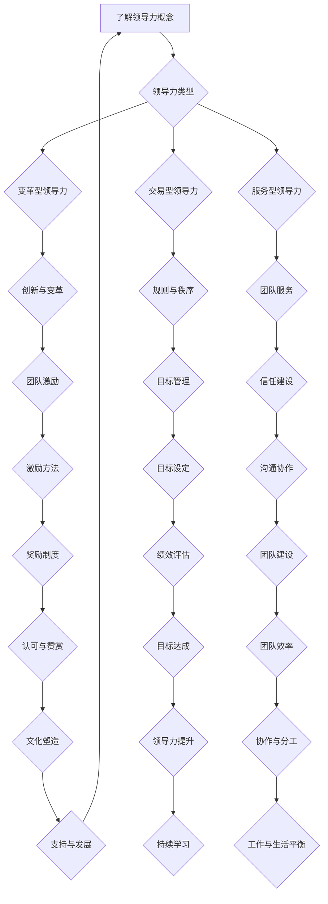
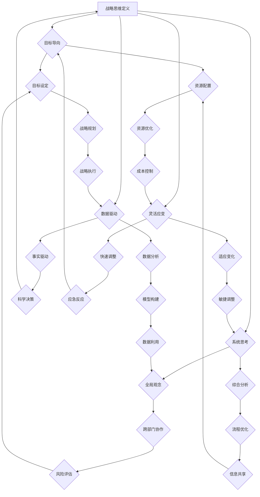
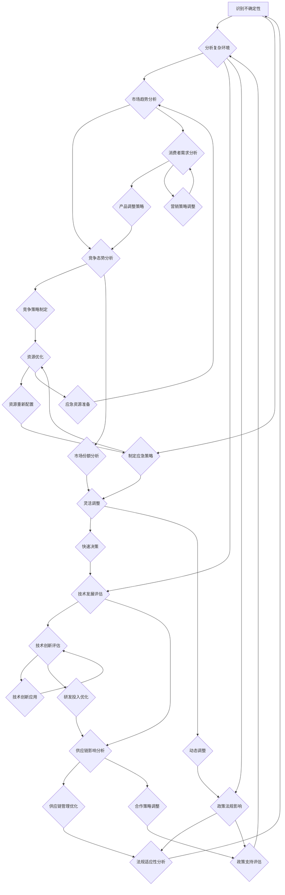

                 

### 引言

在现代商业环境中，领导者面临着前所未有的复杂性和不确定性。随着全球化的深入、技术的迅猛发展以及市场的快速变化，企业需要具备更强的适应能力和战略眼光，才能在激烈的竞争中立于不败之地。因此，领导力与战略思维在企业管理中变得尤为重要。

#### 重要性

首先，领导力是推动组织发展的核心动力。它不仅关乎企业日常运营的效率，更关系到组织的长远发展和核心竞争力。一个优秀的领导者，不仅能够激发团队的潜力，还能够带领团队在复杂环境中找到突破口，实现组织目标。

其次，战略思维是企业在不确定性中制定和调整策略的关键。战略思维不仅包括对市场趋势的判断，还涉及对内部资源的优化配置以及对潜在风险的预见和应对。一个具备战略思维的领导者，能够在变化莫测的商业环境中制定出科学合理的战略规划，从而确保企业在未来竞争中取得优势。

本文将围绕领导力与战略思维这一主题，深入探讨其在复杂环境下的应用。我们将从领导力基础、战略思维原则、企业战略分析、战略规划与执行、复杂环境下的战略制定、全球视野下的战略思维、领导力与战略思维的实践应用等多个方面进行详细阐述。

#### 目的

本文旨在为读者提供一套系统的领导力与战略思维框架，帮助读者理解并掌握在复杂环境中制定策略的核心方法和实践技巧。通过本文的学习，读者将能够：

1. 理解领导力的基本概念和作用，以及如何提升个人领导力。
2. 掌握战略思维的基本原则和核心原则，学会运用战略思维解决复杂问题。
3. 学习企业战略分析的方法和工具，掌握企业战略类型与选择。
4. 掌握战略规划与执行的过程和关键要素，学会如何有效实施战略。
5. 了解在不确定性环境中制定战略的策略，增强组织的韧性和适应性。
6. 拓宽全球视野，掌握国际市场进入策略和多文化战略。
7. 通过实际案例分析和问题解决，提升战略思维的实践能力。

通过以上内容的学习，读者将能够更好地应对复杂环境中的挑战，提升自身的领导力和战略思维能力，从而在职场和商业领域中取得更大的成功。

### 《领导力与战略思维：在复杂环境中制定策略》目录大纲

为了更好地帮助读者理解并掌握领导力与战略思维的核心内容，本文将分为四个主要部分，并详细列出各个章节的标题、子标题以及主要内容概要。以下是本文的目录大纲：

#### 第一部分：领导力基础

**第1章：领导力的定义与作用**

- **1.1 领导力的基本概念**：介绍领导力的基本概念，包括其定义、类型和特征。
- **1.2 领导力在组织中的作用**：探讨领导力在团队建设、绩效提升、创新驱动等方面的作用。
- **1.3 领导力与管理的区别**：分析领导力与管理的异同，强调两者的互补性。

**第2章：领导者的自我认知与发展**

- **2.1 自我认知的重要性**：讨论自我认知在领导者成长中的重要性。
- **2.2 领导者发展路径**：介绍领导者的成长路径和常见发展策略。
- **2.3 自我提升策略**：提供具体的自我提升策略和方法。

**第3章：领导风格与团队建设**

- **3.1 领导风格理论**：介绍各种领导风格理论，如行为领导理论、情境领导理论等。
- **3.2 团队建设的关键要素**：探讨团队建设的核心要素，包括团队结构、沟通与协作等。
- **3.3 如何激励团队成员**：分析激励理论，并提供有效的激励方法。

#### 第二部分：战略思维与策略制定

**第4章：战略思维的基本原则**

- **4.1 战略思维的重要性**：阐述战略思维在企业管理中的关键作用。
- **4.2 战略思维的核心原则**：介绍战略思维的核心原则，如目标导向、系统思考等。
- **4.3 战略思维与领导力**：探讨战略思维与领导力的关系及其相互作用。

**第5章：企业战略分析**

- **5.1 SWOT分析**：介绍SWOT分析的原理和应用方法。
- **5.2 五力模型**：探讨五力模型的构成及其在企业战略分析中的应用。
- **5.3 企业战略类型与选择**：分析不同类型的企业战略，并提供选择策略。

**第6章：战略规划与执行**

- **6.1 战略规划的过程**：详细阐述战略规划的过程和步骤。
- **6.2 战略规划的关键要素**：介绍战略规划的关键要素，如愿景、使命、目标等。
- **6.3 战略执行的有效策略**：探讨如何有效执行战略规划，包括资源分配、风险管理等。

#### 第三部分：复杂环境下的战略制定

**第7章：不确定性下的战略思维**

- **7.1 复杂环境的特点**：分析复杂环境的特点和挑战。
- **7.2 应对不确定性的策略**：介绍应对不确定性的策略和方法。
- **7.3 增强组织韧性的方法**：探讨如何通过增强组织韧性来应对不确定性。

**第8章：全球视野下的战略思维**

- **8.1 全球化对战略的影响**：分析全球化对战略思维的影响。
- **8.2 多元文化战略**：介绍多元文化战略的理论和实践。
- **8.3 国际市场进入策略**：探讨不同国际市场进入策略的选择和实施。

**第9章：战略思维的实践与应用**

- **9.1 战略思维案例解析**：通过具体案例来分析战略思维的运用。
- **9.2 战略制定中的常见问题与解决**：讨论战略制定过程中常见的问题及其解决方法。
- **9.3 战略思维的持续优化**：探讨如何持续优化战略思维。

#### 第四部分：领导力与战略思维的综合应用

**第10章：领导力与战略思维的融合**

- **10.1 领导力在战略思维中的作用**：分析领导力在战略思维中的作用和贡献。
- **10.2 战略思维对领导力的要求**：探讨战略思维对领导者素质和能力的要求。
- **10.3 领导力与战略思维的协同发展**：讨论领导力与战略思维的协同发展路径。

**第11章：领导力与战略思维培训与提升**

- **11.1 领导力与战略思维培训体系**：介绍领导力与战略思维的培训体系和内容。
- **11.2 培训方法与工具**：提供有效的培训方法和工具。
- **11.3 培训效果评估与持续改进**：探讨如何评估培训效果并进行持续改进。

**第12章：领导力与战略思维的未来发展趋势**

- **12.1 领导力的发展趋势**：分析未来领导力的发展趋势和方向。
- **12.2 战略思维的未来方向**：探讨未来战略思维的发展方向和趋势。
- **12.3 领导力与战略思维的融合前景**：讨论领导力与战略思维融合的未来前景。

通过以上详细的目录大纲，读者可以清晰地了解本文的结构和内容安排，为后续章节的学习做好准备。

### 第一部分：领导力基础

在探讨领导力与战略思维的关系之前，首先需要了解领导力的基本概念、作用及其在组织中的重要性。这一部分将分为三个章节，详细探讨领导力的定义与作用、领导者的自我认知与发展、领导风格与团队建设。

#### 第1章：领导力的定义与作用

**1.1 领导力的基本概念**

领导力，是指通过影响他人来实现共同目标的能力。它不仅涉及权力的运用，更是一种技能和艺术。领导力可以被划分为多种类型，如变革型领导力、交易型领导力、服务型领导力等，每种类型都有其特定的特点和应用场景。

- **变革型领导力**：强调领导者的创新和变革能力，通过激励和鼓舞团队来推动组织变革。
- **交易型领导力**：侧重于通过奖励和惩罚来管理团队成员，维持组织稳定。
- **服务型领导力**：强调领导者作为团队成员的服务者，通过服务团队来提升整体绩效。

**1.2 领导力在组织中的作用**

领导力在组织中发挥着至关重要的作用。首先，领导力是推动组织发展的核心动力，它能够激发团队成员的潜力，提升团队的凝聚力和执行力。其次，领导力在团队建设和绩效提升方面具有显著影响。一个具备领导力的领导者能够建立高效的团队，促进团队成员之间的沟通与合作，从而提高整体绩效。

- **团队建设**：领导力有助于构建积极向上的团队氛围，增强团队成员之间的信任和协作。
- **绩效提升**：领导力通过设定明确的目标、提供激励和反馈，推动团队成员不断提升绩效。

**1.3 领导力与管理的区别**

虽然领导力和管理密切相关，但两者也存在明显的区别。管理侧重于规划和执行具体的任务，确保组织目标的实现。而领导力则更加关注愿景和战略的制定，以及如何通过影响和激励他人来实现这些目标。

- **管理**：侧重于过程、流程和规则，确保组织有序运作。
- **领导力**：关注未来、创新和变革，激发团队潜力，实现组织长远发展。

#### 第2章：领导者的自我认知与发展

**2.1 自我认知的重要性**

自我认知是领导者成长和发展的基础。一个具备高度自我认知的领导者，能够更好地理解自己的优势、劣势、价值观和行为模式，从而做出更为明智的决策。自我认知不仅有助于领导者提升自我管理能力，还能够增强与团队成员的沟通效果，促进团队的整体发展。

**2.2 领导者发展路径**

领导者的发展路径通常包括以下几个阶段：

1. **基础阶段**：在这个阶段，领导者需要学习和掌握基本的管理知识和技能，如时间管理、沟通技巧、团队管理等。
2. **提升阶段**：在这个阶段，领导者需要进一步提升自我认知，培养领导力和战略思维，通过实践和反思不断提升领导能力。
3. **成熟阶段**：在这个阶段，领导者已经具备了较高的领导力和管理能力，能够独立应对复杂问题，带领团队实现组织目标。

**2.3 自我提升策略**

为了提升自我认知和领导力，领导者可以采取以下策略：

1. **定期反思**：领导者可以通过定期反思自己的行为和决策，找出不足之处并进行改进。
2. **学习与实践**：通过阅读书籍、参加培训课程、实际操作等方式，不断学习和积累经验。
3. **寻求反馈**：领导者可以通过与同事、下属和上级沟通，获取反馈意见，从而了解自己的优缺点，并进行有针对性的提升。

#### 第3章：领导风格与团队建设

**3.1 领导风格理论**

领导风格理论是探讨领导者行为和领导效果之间关系的重要理论。不同的领导风格会对团队产生不同的影响。常见的领导风格理论包括：

- **行为领导理论**：该理论认为领导者的行为对团队绩效具有决定性影响。根据领导者的行为特征，可以将领导风格分为专制型、民主型、放任型等。
- **情境领导理论**：该理论认为领导风格应随着环境和情境的变化而变化。根据下属的成熟度，领导者应采取不同的领导风格，如指导型、支持型、委托型等。

**3.2 团队建设的关键要素**

团队建设是领导者的重要职责之一。一个高效的团队需要具备以下关键要素：

- **共同目标**：团队成员需要明确共同的目标和愿景，以保持一致的方向和动力。
- **有效沟通**：团队成员之间需要建立良好的沟通机制，确保信息的及时传递和有效理解。
- **协作与分工**：团队成员需要明确各自的职责和任务，并通过协作实现共同目标。
- **信任与支持**：团队成员之间需要建立信任，相互支持，共同应对挑战。

**3.3 如何激励团队成员**

激励是领导者的重要任务之一。有效的激励能够提升团队成员的积极性和创造力，从而提高团队绩效。以下是一些常用的激励方法：

- **奖励制度**：通过设置奖励制度，对表现出色的团队成员给予物质或精神奖励。
- **认可与赞赏**：领导者可以通过公开认可和赞赏团队成员的成就，增强其自信心和归属感。
- **培训与发展**：为团队成员提供培训和发展机会，帮助其提升技能和职业素养。
- **参与决策**：让团队成员参与决策过程，增强其责任感和参与感。

通过以上三个章节的探讨，读者可以深入了解领导力的基本概念、作用及其在组织中的重要性，掌握领导者的自我认知与发展路径，以及领导风格与团队建设的关键要素和激励方法。这些知识将有助于读者在实际工作中更好地运用领导力，提升团队绩效和组织竞争力。

### 第1章：领导力的定义与作用

#### 1.1 领导力的基本概念

领导力，是一种通过影响他人来实现共同目标的能力。在组织管理中，领导力不仅仅是权力的运用，更是一种艺术和技能。领导力可以被划分为多种类型，如变革型领导力、交易型领导力、服务型领导力等。每种类型都有其独特的特点和应用场景。

**变革型领导力**，强调领导者的创新和变革能力，通过激励和鼓舞团队来推动组织变革。这种领导力要求领导者具备远见和前瞻性，能够激发团队成员的潜力，推动他们超越自身的舒适区。

**交易型领导力**，侧重于通过奖励和惩罚来管理团队成员，维持组织稳定。这种领导力强调规则和秩序，通过明确的目标和奖惩机制来激励团队成员。

**服务型领导力**，则强调领导者作为团队成员的服务者，通过服务团队来提升整体绩效。这种领导力要求领导者关注团队成员的需求和成长，为他们提供支持和帮助。

#### 1.2 领导力在组织中的作用

领导力在组织中发挥着至关重要的作用。首先，领导力是推动组织发展的核心动力。一个具备领导力的领导者，能够激发团队成员的潜力，提升团队的凝聚力和执行力，从而实现组织目标。

其次，领导力在团队建设和绩效提升方面具有显著影响。通过有效的领导，领导者可以建立高效的团队，促进团队成员之间的沟通与合作，提高整体绩效。

1. **团队建设**：领导力有助于构建积极向上的团队氛围，增强团队成员之间的信任和协作。一个具备领导力的领导者，能够通过有效的沟通和激励，促进团队成员之间的相互理解和合作，从而打造一个高效的团队。
   
2. **绩效提升**：领导力通过设定明确的目标、提供激励和反馈，推动团队成员不断提升绩效。一个具备领导力的领导者，能够清晰表达组织的愿景和目标，激励团队成员为实现这些目标而努力，并通过持续的反馈和指导，帮助团队成员不断提升。

#### 1.3 领导力与管理的区别

虽然领导力和管理密切相关，但两者也存在明显的区别。管理侧重于规划和执行具体的任务，确保组织目标的实现。而领导力则更加关注愿景和战略的制定，以及如何通过影响和激励他人来实现这些目标。

1. **管理**：侧重于过程、流程和规则，确保组织有序运作。管理关注的是如何将资源合理配置，如何确保组织内部各个部门、各个岗位的工作顺利进行，从而达到组织的目标。
   
2. **领导力**：关注未来、创新和变革，激发团队潜力，实现组织长远发展。领导力关注的是如何激发团队的潜力，如何引领团队走向未来，如何在变革中找到新的发展方向和机会。

#### 1.4 领导力在具体情境中的应用

在实际工作中，领导力不仅体现在日常的管理和团队建设中，还体现在应对突发事件、推动组织变革等方面。

1. **应对突发事件**：在突发事件中，领导者的领导力至关重要。一个具备领导力的领导者，能够在危机中保持冷静，快速做出决策，并有效地协调各方资源，化解危机。
   
2. **推动组织变革**：在组织变革过程中，领导者的领导力能够激发团队成员的变革意愿，推动他们积极适应变革，从而实现组织的转型和升级。

#### 1.5 领导力的核心要素

要成为一位优秀的领导者，需要具备以下几个核心要素：

1. **远见和战略思维**：领导者需要具备远见和战略思维，能够预见未来趋势，制定明确的发展目标。
   
2. **沟通和激励能力**：领导者需要具备出色的沟通和激励能力，能够与团队成员建立良好的沟通，激发他们的工作热情和创造力。
   
3. **决策和执行能力**：领导者需要具备良好的决策和执行能力，能够在复杂的环境中做出明智的决策，并有效地推动决策的执行。
   
4. **自我认知和持续学习**：领导者需要具备自我认知和持续学习的能力，能够不断反思和提升自己，以适应不断变化的环境。

通过以上内容的探讨，读者可以更深入地理解领导力的基本概念、作用及其在组织中的重要性。了解领导力与管理的区别，以及领导力在具体情境中的应用，有助于读者在实际工作中更好地运用领导力，提升团队绩效和组织竞争力。

### 第2章：领导者的自我认知与发展

#### 2.1 自我认知的重要性

自我认知是领导者成长和发展的基础。一个具备高度自我认知的领导者，能够更清晰地了解自己的优势和劣势，从而做出更明智的决策和更有效的领导行为。自我认知不仅有助于领导者提升自我管理能力，还能够增强与团队成员的沟通效果，促进团队的整体发展。

**自我认知的内容**：

1. **个性特点**：领导者需要了解自己的个性特点，包括性格、价值观、兴趣爱好等。这有助于他们在领导过程中找到适合自己的领导风格和沟通方式。
   
2. **能力与技能**：领导者需要识别自己的能力与技能，了解自己在哪些方面具有较强的优势，在哪些方面需要进一步发展和提升。

3. **动机与需求**：领导者需要识别自己的内在动机和需求，这有助于他们在工作中找到动力和方向，同时能够更好地满足团队成员的需求。

**自我认知的益处**：

1. **提升自我管理能力**：通过自我认知，领导者能够更好地了解自己的行为模式和心理状态，从而有效地管理自己的情绪和行为，避免因为情绪波动而影响决策。

2. **增强团队沟通效果**：领导者具备较高的自我认知能力，能够更准确地理解团队成员的需求和期望，从而在沟通中减少误解和冲突，建立良好的团队氛围。

#### 2.2 领导者的发展路径

领导者的发展路径通常可以分为以下几个阶段：

1. **基础阶段**：在这个阶段，领导者需要学习和掌握基本的管理知识和技能，如时间管理、沟通技巧、团队管理等。这是一个从新手到合格领导者的过程。

2. **提升阶段**：在这个阶段，领导者需要进一步提升自我认知，培养领导力和战略思维，通过实践和反思不断提升领导能力。这是一个从合格领导者到优秀领导者的过程。

3. **成熟阶段**：在这个阶段，领导者已经具备了较高的领导力和管理能力，能够独立应对复杂问题，带领团队实现组织目标。这是一个从优秀领导者到卓越领导者的过程。

**发展路径的步骤**：

1. **自我评估**：领导者需要定期进行自我评估，识别自己的优势和劣势，了解自己的发展需求。
   
2. **制定发展计划**：根据自我评估的结果，领导者需要制定具体的发展计划，包括学习目标、行动步骤和时间表。

3. **实践与反思**：领导者需要在实际工作中实践所学的知识和技能，通过反思和总结不断调整和优化自己的领导行为。

#### 2.3 自我提升策略

为了提升自我认知和领导力，领导者可以采取以下策略：

1. **定期反思**：领导者需要养成定期反思的习惯，通过回顾自己的行为和决策，找出不足之处并进行改进。

2. **持续学习**：领导者需要不断学习新的知识和技能，以适应不断变化的环境。这可以通过阅读书籍、参加培训课程、实际操作等方式实现。

3. **寻求反馈**：领导者需要主动寻求来自团队成员、上级和其他专业人士的反馈，以了解自己的领导行为和工作效果。

4. **建立支持系统**：领导者可以寻求导师或教练的帮助，通过他们的经验和指导来提升自己的领导能力。

5. **实践与创新**：领导者需要在实际工作中不断尝试新的方法和策略，通过实践和反思来提升自己的领导力。

通过以上内容的探讨，读者可以深入了解自我认知在领导者成长和发展中的重要性，掌握领导者的发展路径和自我提升策略。这些知识将有助于读者在实际工作中更好地运用领导力，提升自我认知和领导能力，从而更好地带领团队实现组织目标。

### 第3章：领导风格与团队建设

#### 3.1 领导风格理论

领导风格理论是探讨领导者行为和团队绩效之间关系的重要理论。不同的领导风格会对团队产生不同的影响。以下是几种常见的领导风格理论：

**行为领导理论**：行为领导理论认为，领导者的行为对团队绩效具有决定性影响。根据领导者的行为特征，可以将领导风格分为专制型、民主型、放任型等。

- **专制型领导**：领导者独自做出决策，并对团队成员进行严格的控制。这种领导风格适用于紧急情况和需要快速决策的场合，但可能会导致团队成员的被动和缺乏自主性。
- **民主型领导**：领导者鼓励团队成员参与决策过程，并尊重他们的意见和需求。这种领导风格有助于增强团队成员的归属感和积极性，但决策过程可能较为缓慢。
- **放任型领导**：领导者给予团队成员高度的自由和自主权，很少干预他们的工作。这种领导风格适用于高度专业化的团队，但可能导致团队成员之间的沟通和协作不足。

**情境领导理论**：情境领导理论认为，领导风格应随着环境和情境的变化而变化。根据下属的成熟度，领导者应采取不同的领导风格，如指导型、支持型、委托型等。

- **指导型领导**：领导者为团队成员提供具体的指导和明确的任务要求，适用于下属成熟度较低的情况。
- **支持型领导**：领导者关注团队成员的情感需求，提供支持和鼓励，适用于下属成熟度较高但缺乏自信的情况。
- **委托型领导**：领导者将决策权交给团队成员，给予他们充分的自主权，适用于下属成熟度较高且具备独立工作能力的情况。

#### 3.2 团队建设的关键要素

团队建设是领导者的重要职责之一。一个高效的团队需要具备以下关键要素：

**共同目标**：团队需要明确共同的目标和愿景，以保持一致的方向和动力。共同目标能够激发团队成员的积极性和凝聚力，促进团队的协作和合作。

**有效沟通**：团队成员之间需要建立良好的沟通机制，确保信息的及时传递和有效理解。有效的沟通能够减少误解和冲突，增强团队的协作和信任。

**协作与分工**：团队成员需要明确各自的职责和任务，并通过协作实现共同目标。合理的分工和协作能够提高团队的工作效率和绩效。

**信任与支持**：团队成员之间需要建立信任，相互支持，共同应对挑战。信任和支**持能够增强团队的凝聚力和战斗力，促进团队的长期发展。

#### 3.3 如何激励团队成员

激励是领导者的重要任务之一。有效的激励能够提升团队成员的积极性和创造力，从而提高团队绩效。以下是一些常用的激励方法：

**奖励制度**：通过设置奖励制度，对表现出色的团队成员给予物质或精神奖励。奖励可以是奖金、晋升、休假等，具体形式应根据团队和个体的需求进行设计。

**认可与赞赏**：领导者可以通过公开认可和赞赏团队成员的成就，增强其自信心和归属感。认可和赞赏可以是口头表扬、表彰会议、荣誉证书等。

**培训与发展**：为团队成员提供培训和发展机会，帮助其提升技能和职业素养。培训可以包括内部培训、外部培训、在线学习等，发展机会可以是项目负责、跨部门交流、领导力培训等。

**参与决策**：让团队成员参与决策过程，增强其责任感和参与感。参与决策可以激发团队成员的积极性和创造力，同时也有助于提高决策的质量和执行力。

**工作与生活平衡**：领导者需要关注团队成员的工作与生活平衡，提供灵活的工作安排和良好的工作环境。这包括合理安排工作时间、提供休息日、提供心理健康支持等。

通过以上内容，读者可以了解领导风格的理论基础，掌握团队建设的关键要素以及如何激励团队成员。这些知识将有助于读者在实际工作中更好地运用领导力，提升团队绩效和组织竞争力。

### 第二部分：战略思维与策略制定

在领导力与团队建设的基础上，战略思维与策略制定成为企业持续发展的重要支撑。本部分将分为三个章节，深入探讨战略思维的基本原则、企业战略分析的方法和工具，以及战略规划与执行的过程和关键要素。

#### 第4章：战略思维的基本原则

**4.1 战略思维的重要性**

战略思维是企业制定长期发展计划、应对市场变化和把握机遇的关键。它不仅涉及企业的愿景和目标，还包括如何通过资源配置和策略调整来实现这些目标。战略思维的重要性体现在以下几个方面：

- **预见未来**：战略思维帮助企业预见未来趋势，制定长远的发展计划，从而在竞争中占据优势。
- **资源配置**：通过战略思维，企业能够合理配置资源，确保资源的最优利用，提高运营效率。
- **适应变化**：战略思维能够帮助企业快速适应市场变化，灵活调整策略，应对各种不确定性。

**4.2 战略思维的核心原则**

战略思维需要遵循一些核心原则，以确保其科学性和有效性。以下是一些关键的原则：

- **目标导向**：战略思维应以实现企业目标为核心，所有策略和行动都应围绕目标进行。
- **系统思考**：战略思维需要从全局出发，综合考虑各种因素和它们之间的相互关系，避免片面和短视的决策。
- **数据驱动**：战略思维应基于数据和事实，避免主观臆断和情感决策，确保策略的科学性和可执行性。
- **灵活应变**：战略思维应具备灵活性，能够根据实际情况和市场变化进行及时调整，确保策略的有效性。

**4.3 战略思维与领导力**

战略思维与领导力密切相关，两者相互促进、相互依赖。优秀的领导者不仅具备战略思维，还能够将战略思维转化为实际的领导行为，影响和激励团队成员。

- **战略思维对领导力的要求**：领导者需要具备较强的战略思维能力，能够从全局出发，制定科学合理的战略规划，并在执行过程中灵活调整。
- **领导力对战略思维的作用**：领导力能够将战略思维转化为具体的行动，通过有效的沟通和激励，推动团队成员执行战略计划。

#### 第5章：企业战略分析

**5.1 SWOT分析**

SWOT分析是一种常用的战略分析工具，用于评估企业的优势、劣势、机会和威胁。通过SWOT分析，企业能够全面了解自身在市场中的位置，制定有针对性的战略。

- **优势（Strengths）**：企业内部的优势资源和能力，如技术优势、品牌优势、人力资源等。
- **劣势（Weaknesses）**：企业内部的劣势和短板，如管理不足、技术落后、资金短缺等。
- **机会（Opportunities）**：外部环境中出现的机会和趋势，如市场需求增长、技术进步、政策支持等。
- **威胁（Threats）**：外部环境中出现的威胁和挑战，如竞争对手、市场变化、法规限制等。

**5.2 五力模型**

五力模型是迈克尔·波特提出的一种用于分析市场竞争环境的工具。它包括以下五个关键要素：

- **供应商**：供应商的议价能力和市场集中度。
- **买家**：买家的议价能力和市场集中度。
- **潜在进入者**：潜在进入者的威胁和进入壁垒。
- **替代品**：替代品的威胁和替代程度。
- **行业内部竞争**：行业内竞争的激烈程度。

**5.3 企业战略类型与选择**

根据不同的市场环境和内部条件，企业可以选择不同的战略类型。以下是几种常见的战略类型：

- **成长型战略**：通过扩张市场份额、开发新产品或进入新市场来提高企业的市场地位和规模。
- **竞争型战略**：通过降低成本、提高产品质量、加强营销等手段来在竞争中取得优势。
- **多元化战略**：通过进入新的业务领域或市场，降低企业的风险和依赖度。
- **稳定型战略**：保持现有业务和市场，通过优化运营和提高效率来保持企业的稳定发展。

#### 第6章：战略规划与执行

**6.1 战略规划的过程**

战略规划是一个系统化的过程，包括以下几个关键步骤：

- **愿景和使命**：明确企业的长期愿景和使命，为战略规划提供方向。
- **目标设定**：设定具体、可衡量的短期和长期目标，确保战略规划的可执行性。
- **环境分析**：进行SWOT分析和五力模型分析，了解企业内外部环境。
- **战略选择**：根据环境分析和目标设定，选择合适的战略类型。
- **战略实施**：制定详细的行动计划，确保战略的顺利实施。
- **监控与调整**：监控战略执行情况，及时调整策略，确保目标的实现。

**6.2 战略规划的关键要素**

战略规划需要考虑以下关键要素：

- **资源分配**：合理分配企业的资源，包括资金、人力、技术等，确保战略规划的实施。
- **风险管理**：识别和评估潜在的风险，制定应对措施，降低战略实施中的不确定性。
- **时间表**：制定详细的实施时间表，确保战略规划的有序推进。
- **绩效评估**：建立绩效评估体系，定期评估战略执行效果，确保目标的实现。

**6.3 战略执行的有效策略**

战略执行是战略规划的关键环节，以下是一些有效的执行策略：

- **领导者的角色**：领导者需要积极参与战略执行，发挥关键作用，推动战略的实施。
- **沟通与协作**：建立有效的沟通机制，确保战略目标和行动计划在整个组织内得到广泛传达和执行。
- **激励与问责**：通过激励机制和问责机制，激发团队成员的积极性和责任感，确保战略的有效执行。
- **持续改进**：通过持续的反馈和改进，不断优化战略执行过程，提高战略的执行效果。

通过以上内容，读者可以深入了解战略思维的基本原则、企业战略分析的方法和工具，以及战略规划与执行的过程和关键要素。这些知识将有助于读者在实际工作中更好地运用战略思维，制定和执行有效的战略规划，从而提升企业的竞争力和市场地位。

### 第4章：战略思维的基本原则

**4.1 战略思维的重要性**

战略思维是企业长期发展的关键因素，它不仅影响企业的决策过程，还决定企业在市场中的竞争力和生存能力。在当前快速变化和充满不确定性的商业环境中，战略思维的重要性愈加凸显。首先，战略思维能够帮助企业在纷繁复杂的市场环境中预见未来趋势，制定长远的发展计划，从而在竞争中占据优势。其次，战略思维通过合理配置资源、优化流程和提升效率，提高企业的运营效益和竞争力。此外，战略思维还能帮助企业在面对市场变化和突发事件时迅速调整策略，灵活应对，确保企业的可持续发展。

**4.2 战略思维的核心原则**

战略思维需要遵循一些核心原则，以确保其科学性和有效性。以下是战略思维的核心原则：

1. **目标导向**：战略思维应以实现企业目标为核心，所有策略和行动都应围绕目标进行。明确的目标能够指导企业的发展方向，确保资源的最优利用。

2. **系统思考**：战略思维需要从全局出发，综合考虑各种因素和它们之间的相互关系，避免片面和短视的决策。系统思考有助于企业全面评估市场环境和内部资源，制定科学合理的战略。

3. **数据驱动**：战略思维应基于数据和事实，避免主观臆断和情感决策，确保策略的科学性和可执行性。数据驱动能够提高决策的准确性，降低战略风险。

4. **灵活应变**：战略思维应具备灵活性，能够根据实际情况和市场变化进行及时调整，确保策略的有效性。灵活性有助于企业快速适应市场变化，抓住机遇，应对挑战。

**4.3 战略思维与领导力**

战略思维与领导力密切相关，两者相互促进、相互依赖。优秀的领导者不仅具备战略思维，还能够将战略思维转化为实际的领导行为，影响和激励团队成员。

1. **战略思维对领导力的要求**：领导者需要具备较强的战略思维能力，能够从全局出发，制定科学合理的战略规划，并在执行过程中灵活调整。这要求领导者不仅要有深厚的专业知识和经验，还要具备前瞻性和全局观念。

2. **领导力对战略思维的作用**：领导力能够将战略思维转化为具体的行动，通过有效的沟通和激励，推动团队成员执行战略计划。领导力能够激发团队成员的积极性和创造力，提高战略执行的效率和效果。

**4.4 战略思维的实践应用**

战略思维的实践应用包括以下几个关键步骤：

1. **明确目标**：首先，企业需要明确短期和长期的目标，确保战略思维的导向性。这些目标可以是市场占有率、利润率、产品创新等，具体而明确的目标能够指导企业的战略制定。

2. **环境分析**：对市场环境、竞争态势、内部资源等进行分析，了解企业面临的外部和内部挑战。环境分析有助于企业制定符合实际的战略，避免盲目决策。

3. **策略制定**：根据环境分析和目标设定，制定具体的战略和策略。这些策略可以是市场扩张、产品创新、成本控制等，具体策略应具备可行性和可执行性。

4. **资源分配**：合理配置企业的资源，确保战略计划的实施。资源分配应优先考虑关键业务和优先项目，确保资源的最大化利用。

5. **执行与监控**：战略执行是战略思维的关键环节，领导者需要积极参与执行过程，确保战略计划的顺利实施。同时，应建立监控机制，定期评估战略执行效果，及时调整策略，确保目标的实现。

6. **反馈与改进**：通过持续的反馈和改进，优化战略思维和执行过程。反馈机制能够帮助企业发现问题和改进措施，提升战略的执行效果。

通过以上内容的探讨，读者可以深入了解战略思维的基本原则、核心原则及其与领导力的关系。掌握战略思维的实践应用方法，有助于读者在实际工作中更好地运用战略思维，制定和执行有效的战略规划，从而提升企业的竞争力和市场地位。

### 第5章：企业战略分析

**5.1 SWOT分析**

SWOT分析是一种常用的战略分析工具，用于评估企业的优势、劣势、机会和威胁。通过SWOT分析，企业能够全面了解自身在市场中的位置，制定有针对性的战略。以下是SWOT分析的详细内容：

1. **优势（Strengths）**：
   - **内部优势**：包括企业的核心竞争力、独特资源、领先技术、品牌知名度等。内部优势是企业竞争力的基础，有助于企业在市场中占据优势地位。
   - **具体案例**：例如，某企业拥有一支高效的技术团队，能够快速开发出市场领先的产品，这成为该企业的核心竞争力。

2. **劣势（Weaknesses）**：
   - **内部劣势**：包括企业的管理缺陷、技术落后、资金不足、市场份额低等。内部劣势可能制约企业的长期发展，需要通过改进和优化来弥补。
   - **具体案例**：例如，某企业由于缺乏市场营销经验，导致市场推广效果不佳，市场份额不断下降。

3. **机会（Opportunities）**：
   - **外部机会**：包括市场需求的增长、技术进步、政策支持、合作伙伴的扩展等。外部机会是企业发展的机遇，可以借助这些机会来扩大市场份额和提升竞争力。
   - **具体案例**：例如，随着5G技术的普及，某企业抓住了市场需求的增长机会，迅速推出5G相关产品，取得了显著的市场份额。

4. **威胁（Threats）**：
   - **外部威胁**：包括竞争对手的威胁、市场变化、法规限制、技术颠覆等。外部威胁可能对企业造成负面影响，需要通过应对策略来减轻威胁。
   - **具体案例**：例如，某企业面临竞争对手的强大压力，市场份额不断被侵蚀，需要通过改进产品和服务来提升竞争力。

**5.2 五力模型**

五力模型是迈克尔·波特提出的一种用于分析市场竞争环境的工具。它包括以下五个关键要素：

1. **供应商**：
   - **供应商的议价能力**：供应商的议价能力取决于其集中度、供应能力、替代品供应等因素。
   - **市场集中度**：高集中度的供应商通常具有较强的议价能力，这可能导致企业采购成本上升。

2. **买家**：
   - **买家的议价能力**：买家的议价能力取决于其集中度、购买量、替代品选择等因素。
   - **市场集中度**：高集中度的买家通常具有较强的议价能力，这可能导致企业销售价格下降。

3. **潜在进入者**：
   - **潜在进入者的威胁**：潜在进入者的威胁取决于进入壁垒、市场容量、现有企业的反应等因素。
   - **进入壁垒**：高进入壁垒通常能减少潜在进入者的威胁，例如，技术专利、高额的资本投入等。

4. **替代品**：
   - **替代品的威胁**：替代品的威胁取决于替代品的性价比、市场需求等因素。
   - **替代程度**：替代品越接近企业的产品，其威胁越大。

5. **行业内部竞争**：
   - **行业内部竞争的激烈程度**：行业内部竞争的激烈程度取决于市场饱和度、产品差异化程度、行业进入退出难度等因素。
   - **市场竞争策略**：企业需要通过有效的市场竞争策略来降低内部竞争压力，提高市场份额。

**5.3 企业战略类型与选择**

根据不同的市场环境和内部条件，企业可以选择不同的战略类型。以下是几种常见的战略类型：

1. **成长型战略**：
   - **扩张市场份额**：通过增加市场份额来提高市场地位和盈利能力。
   - **新产品开发**：通过开发新产品来满足市场需求，提高企业的竞争力。
   - **进入新市场**：通过进入新市场来扩大业务范围，提高市场覆盖率。

2. **竞争型战略**：
   - **成本领先**：通过降低成本来提高产品的性价比，吸引价格敏感的消费者。
   - **差异化**：通过提供独特的产品和服务来区别于竞争对手，吸引特定的消费者群体。
   - **集中化**：通过在特定市场或细分市场中提供独特的产品和服务，提高市场占有率。

3. **多元化战略**：
   - **相关多元化**：通过进入与现有业务相关的新领域，利用现有资源和能力来提高业务多样性。
   - **非相关多元化**：通过进入与现有业务无关的新领域，实现业务多元化，降低风险。

4. **稳定型战略**：
   - **市场份额维护**：通过维护现有市场份额，确保企业的稳定收入。
   - **运营效率提升**：通过优化运营流程，提高生产效率和成本控制，提高企业的盈利能力。

通过以上内容的探讨，读者可以了解SWOT分析和五力模型的基本原理和具体应用，掌握企业战略类型与选择的方法。这些知识将有助于读者在实际工作中更好地分析企业战略，制定有效的战略规划，提升企业的竞争力和市场地位。

### 第6章：战略规划与执行

#### 6.1 战略规划的过程

战略规划是企业实现长期目标和持续发展的关键步骤。一个有效的战略规划过程包括以下几个关键环节：

**1. 愿景和使命设定**

战略规划的首要任务是明确企业的愿景和使命。愿景是企业未来期望达到的状态和目标，而使命则是企业存在的根本目的和价值。愿景和使命应具有前瞻性、激励性和可操作性，能够引导企业的战略方向。

**2. 目标设定**

在确定愿景和使命后，企业需要设定具体的、可衡量的短期和长期目标。这些目标应与愿景和使命相一致，并能够通过关键绩效指标（KPI）进行衡量。目标应具备挑战性，同时要考虑企业的资源和能力，以确保其可实现性。

**3. 环境分析**

环境分析是战略规划的关键步骤，包括对内部环境和外部环境的深入分析。内部环境分析涉及企业的资源、能力、文化等方面，外部环境分析则包括市场趋势、竞争对手、政策法规等因素。通过环境分析，企业能够了解自身的优势和劣势，以及面临的机会和威胁，为战略制定提供依据。

**4. 战略选择**

根据环境分析的结果，企业需要选择合适的战略类型。常见的战略类型包括成长型战略、竞争型战略、多元化战略和稳定型战略等。战略选择应考虑企业的长期目标、市场环境、资源和能力等因素，以确保战略的可行性和有效性。

**5. 战略实施**

战略实施是将战略转化为具体行动的过程。为了确保战略的有效执行，企业需要制定详细的行动计划，明确责任分工、时间表和资源需求。战略实施过程中，企业应建立有效的沟通机制，确保战略目标和行动计划在整个组织内得到广泛传达和执行。

**6. 监控与调整**

战略规划不是一次性的过程，而是一个持续的动态调整过程。企业需要建立监控机制，定期评估战略执行情况，及时发现和解决执行中的问题。根据评估结果，企业应灵活调整战略，以适应市场变化和内部环境的变化。

**6.2 战略规划的关键要素**

战略规划的成功离不开以下几个关键要素：

**1. 资源分配**

资源分配是战略规划的核心要素之一。企业需要根据战略目标和优先级，合理配置资源，包括资金、人力、技术和时间等。资源分配应确保关键业务和优先项目的优先获得资源，以支持战略目标的实现。

**2. 风险管理**

在战略规划过程中，企业需要识别和评估潜在的风险，并制定应对措施。风险管理包括风险识别、风险评估、风险控制和风险监控等环节。通过有效的风险管理，企业能够降低战略实施中的不确定性，确保战略目标的实现。

**3. 时间表**

时间表是战略规划的重要组成部分，它规定了战略实施的时间节点和里程碑。时间表应具备灵活性和适应性，能够根据实际情况进行调整。通过时间表，企业能够确保战略计划的有序推进，同时能够及时发现和解决问题。

**4. 绩效评估**

绩效评估是战略规划的重要环节，它通过关键绩效指标（KPI）来衡量战略目标的实现情况。绩效评估应定期进行，以提供及时的反馈和改进建议。通过绩效评估，企业能够了解战略执行的效果，发现潜在问题，并采取相应措施。

**6.3 战略执行的有效策略**

战略执行是战略规划的关键环节，以下是一些有效的执行策略：

**1. 领导者的角色**

领导者应积极参与战略执行，发挥关键作用。领导者需要明确战略目标和行动计划，确保战略在整个组织内得到有效传达和执行。此外，领导者应通过沟通和激励，激发团队成员的积极性和创造力，推动战略目标的实现。

**2. 沟通与协作**

有效的沟通和协作是战略执行的重要保障。企业需要建立良好的沟通机制，确保战略目标和行动计划在整个组织内得到广泛传达和执行。同时，企业应促进团队成员之间的协作，通过协同工作来提高战略执行效率。

**3. 激励与问责**

激励和问责是确保战略执行的有效手段。企业可以通过激励机制，如奖金、晋升、认可等，激发团队成员的积极性和创造力。同时，企业应建立问责机制，确保团队成员对战略执行负责，及时纠正偏差，确保战略目标的实现。

**4. 持续改进**

持续改进是战略执行的重要策略。企业应通过持续的反馈和改进，优化战略执行过程，提高战略执行效果。通过定期评估和调整战略，企业能够更好地适应市场变化和内部环境的变化，确保战略目标的实现。

通过以上内容的探讨，读者可以了解战略规划的过程、关键要素以及战略执行的有效策略。掌握这些知识将有助于读者在实际工作中更好地制定和执行战略规划，提升企业的竞争力和市场地位。

### 第7章：不确定性下的战略思维

在当今充满不确定性的商业环境中，企业需要具备更强的适应能力和前瞻性。不确定性可能来源于市场变化、技术革新、政策调整等多种因素，对企业的战略制定和执行带来了巨大的挑战。因此，了解如何在不确定性下进行战略思维，成为企业管理者的重要课题。

#### 7.1 复杂环境的特点

复杂环境具有以下几个显著特点：

**1. 变化快速**：市场和技术环境的变化速度越来越快，企业需要不断调整战略以应对新的挑战。

**2. 多变因素**：不确定性环境中，企业面临的各种因素具有高度的不确定性和不可预测性，如新兴技术的涌现、消费者需求的快速变化等。

**3. 强调适应性**：在复杂环境中，企业需要具备快速适应和调整的能力，以保持竞争力。

**4. 协同合作**：复杂环境要求企业不仅要关注内部资源的优化，还要与其他利益相关者进行协同合作，共同应对挑战。

#### 7.2 应对不确定性的策略

为了在复杂环境中有效应对不确定性，企业可以采取以下策略：

**1. 风险管理**：

- **风险识别**：通过市场调研、数据分析等方式，识别可能影响企业战略实现的风险因素。
- **风险评估**：对识别出的风险进行评估，确定其可能对企业造成的影响和严重程度。
- **风险应对**：制定相应的风险应对策略，包括风险规避、风险减轻、风险接受等。

**2. 快速响应**：

- **敏捷组织**：建立敏捷的组织结构和工作流程，提高企业的反应速度和灵活性。
- **快速学习**：鼓励员工持续学习和创新，培养快速适应环境变化的能力。
- **灵活调整**：在战略执行过程中，根据市场变化和反馈信息，及时调整战略方向和行动计划。

**3. 多元化**：

- **业务多元化**：通过拓展新的业务领域或市场，降低对单一业务或市场的依赖，分散风险。
- **产品多元化**：开发多样化的产品，满足不同消费者的需求，提高市场竞争力。

**4. 合作与联盟**：

- **战略合作**：与其他企业建立战略合作关系，共享资源和技术，共同应对市场变化。
- **开放创新**：通过开放平台，吸引外部创新资源，加速产品研发和市场推广。

#### 7.3 增强组织韧性的方法

在不确定性环境中，增强组织的韧性至关重要。以下是一些增强组织韧性的方法：

**1. 培养学习能力**：

- **持续学习**：通过培训和职业发展计划，提升员工的专业知识和技能，增强企业的学习能力和创新动力。
- **案例学习**：通过研究行业内外部成功的案例，学习经验教训，提高应对不确定性的能力。

**2. 建立灵活的组织架构**：

- **扁平化组织**：减少管理层级，提高决策速度和灵活性。
- **模块化组织**：将企业业务划分为若干模块，每个模块相对独立运作，便于快速调整和优化。

**3. 强化团队协作**：

- **跨部门协作**：通过跨部门项目团队，加强不同部门之间的沟通和协作，提高整体应变能力。
- **文化建设**：建立以共同目标和价值观为基础的企业文化，增强团队凝聚力和协作精神。

**4. 建立应急响应机制**：

- **应急预案**：制定详细的应急预案，包括应对不同类型危机的具体措施和流程。
- **实时监控**：通过实时监控系统，及时捕捉市场变化和潜在风险，快速响应。

通过以上内容的探讨，读者可以了解复杂环境的特点、应对不确定性的策略以及增强组织韧性的方法。掌握这些策略和方法，有助于企业在不确定性环境中保持竞争力，实现可持续发展。

### 第8章：全球视野下的战略思维

在全球化的今天，企业不再局限于国内市场，而是需要在全球范围内进行战略布局和竞争。全球视野下的战略思维要求企业具备跨文化的理解和适应能力，能够应对不同国家和地区的市场特点。以下将从全球化对战略的影响、多元文化战略以及国际市场进入策略三个方面进行探讨。

#### 8.1 全球化对战略的影响

全球化对企业的战略思维产生了深远的影响。首先，全球化带来了市场的扩大和竞争的加剧。企业可以通过跨国经营进入新市场，扩大市场份额，但同时也面临来自全球竞争对手的压力。其次，全球化促进了技术和信息的传播，使得企业能够更快地获取市场信息和新技术，但同时也要求企业具备快速响应和创新能力。最后，全球化带来了文化的多样性和复杂性，企业需要理解和适应不同文化背景的市场需求，制定多元文化战略。

**全球化对战略思维的影响包括**：

- **市场机会**：全球化为企业提供了更多的市场机会，但同时也增加了市场的不确定性。
- **竞争格局**：全球化改变了竞争格局，企业需要在全球范围内竞争，提高自身的竞争力。
- **资源整合**：全球化使企业能够更有效地整合全球资源，实现资源的最优配置。

#### 8.2 多元文化战略

多元文化战略是企业应对全球化挑战的重要手段。多元文化战略的核心是尊重和理解不同文化，通过适应和融合不同文化，提高企业的国际竞争力。

**多元文化战略的关键内容包括**：

- **文化敏感性**：企业需要培养员工对多元文化的敏感性，理解和尊重不同文化背景下的价值观和习惯。
- **本地化策略**：企业应根据不同市场的文化特点，制定本地化策略，包括产品定位、市场营销、客户服务等。
- **跨文化沟通**：企业需要建立有效的跨文化沟通机制，确保信息在不同文化背景下的准确传递和理解。

**多元文化战略的实际应用**：

- **跨国公司**：如麦当劳在全球范围内的成功，部分原因在于其适应不同市场的多元文化战略，包括菜单调整、广告宣传等。
- **本土化产品**：如中国企业在海外市场推出的针对当地消费者需求的产品，如华为手机在非洲市场的成功。

#### 8.3 国际市场进入策略

企业在全球市场中的进入策略直接关系到其国际业务的成败。以下是一些常见的国际市场进入策略：

**1. 贸易策略**：

- **出口**：企业通过直接出口产品到海外市场，这是一种相对简单的进入方式，但面临物流成本高、市场信息不透明等挑战。
- **代理**：企业通过在目标市场设立代理商，利用代理商的本地资源和市场渠道进行销售，降低风险和成本。

**2. 投资策略**：

- **独资经营**：企业直接在目标市场设立全资子公司，完全掌控业务运营，但需要承担较高的投资风险。
- **合资经营**：企业与当地企业合作成立合资公司，共享资源和技术，降低风险，但需要平衡利益和战略方向。

**3. 合并收购**：

- **收购**：企业通过收购目标市场的企业，快速进入市场并获取其资源和客户。
- **合并**：企业与其他企业合并，实现资源整合和市场拓展，但需要面对文化整合和管理协调的挑战。

**国际市场进入策略的实际应用**：

- **全球品牌**：如耐克通过全球品牌的策略，迅速进入多个市场，并在全球范围内树立品牌形象。
- **本地市场深耕**：如中国企业在东南亚市场的策略，通过建立本地工厂和销售网络，深耕当地市场。

通过以上探讨，读者可以了解全球化对战略思维的影响、多元文化战略的关键内容以及国际市场进入策略的多种选择。这些知识将有助于企业在全球市场中制定和实施有效的战略，提升国际竞争力。

### 第9章：战略思维的实践与应用

#### 9.1 战略思维案例解析

战略思维在实际应用中需要灵活运用各种方法和工具，以下通过具体案例来解析战略思维的运用。

**案例1：苹果公司的战略思维**

苹果公司以其创新的产品和卓越的用户体验在全球市场中取得了巨大成功。苹果的战略思维主要体现在以下几个方面：

1. **产品创新**：苹果通过持续的产品创新，引领了智能手机、平板电脑、可穿戴设备等市场的潮流。其产品创新策略包括不断优化用户体验、引入新的技术特性等。
   
2. **生态系统建设**：苹果建立了完善的生态系统，包括硬件、软件、服务等多个层面。这种生态系统不仅增强了用户粘性，还促进了多产品线的协同发展。

3. **品牌塑造**：苹果通过品牌塑造，树立了高端、创新和信任的品牌形象。品牌塑造策略包括广告宣传、用户口碑、产品品质等。

**案例分析**：苹果公司的成功在于其战略思维的高度统一和持续创新。苹果能够从用户需求和市场趋势出发，制定符合自身品牌定位的战略，并通过不断优化和改进实现战略目标。

**案例2：阿里巴巴的战略思维**

阿里巴巴作为中国电商巨头，其战略思维在电商、金融科技和云计算等多个领域取得了显著成就。以下是阿里巴巴战略思维的关键要素：

1. **平台战略**：阿里巴巴通过建立电子商务平台，构建了一个庞大的商业生态系统。平台战略使得阿里巴巴能够连接消费者、商家和金融机构，形成一个闭环。

2. **数据驱动**：阿里巴巴注重数据驱动，通过数据分析和挖掘，优化运营决策，提升用户体验和效率。

3. **国际化扩展**：阿里巴巴积极进行国际化扩展，通过收购和合作，进入全球市场。国际化扩展策略包括本地化运营、本地化团队建设等。

**案例分析**：阿里巴巴的战略思维体现了其在平台经济和数据驱动方面的深刻理解和灵活运用。通过平台战略，阿里巴巴建立了强大的商业生态系统；通过数据驱动，阿里巴巴实现了运营效率的提升和用户满意度的提高；通过国际化扩展，阿里巴巴实现了全球市场的覆盖和影响力的提升。

#### 9.2 战略制定中的常见问题与解决

在战略制定过程中，企业可能会遇到一系列常见问题，以下分析这些问题并提出相应的解决方法。

**1. 缺乏明确的目标和愿景**

**问题分析**：许多企业在战略制定过程中，缺乏明确的目标和愿景，导致战略方向不明确，无法有效指导企业发展。

**解决方法**：企业应明确短期和长期的目标，确保这些目标具有挑战性和可实现性。同时，制定清晰的愿景，明确企业的发展方向和使命。

**2. 战略规划过于理想化**

**问题分析**：有些企业的战略规划过于理想化，没有充分考虑市场环境和内部条件的限制，导致战略难以实施。

**解决方法**：企业应进行充分的市场和内部环境分析，根据实际情况调整战略规划，确保战略的可行性和可执行性。

**3. 战略执行不到位**

**问题分析**：战略执行是战略规划的关键环节，但许多企业在执行过程中存在沟通不畅、资源分配不合理等问题，导致战略目标无法实现。

**解决方法**：企业应建立有效的沟通机制，确保战略目标和行动计划在整个组织内得到传达和执行。同时，合理配置资源，确保关键业务和优先项目的资源支持。

**4. 战略评估和调整不足**

**问题分析**：有些企业在战略执行过程中，缺乏对战略的持续评估和调整，导致战略目标偏离实际。

**解决方法**：企业应建立战略评估和调整机制，定期评估战略执行效果，根据评估结果进行及时调整，确保战略目标的实现。

#### 9.3 战略思维的持续优化

战略思维的持续优化是企业保持竞争力和适应市场变化的关键。以下是一些优化战略思维的方法：

**1. 持续学习与更新**

企业应持续关注市场变化和技术发展，不断更新知识和技能。通过培训、研讨和学习，提升员工的战略思维能力和专业素养。

**2. 反思与总结**

企业应定期进行战略反思和总结，分析战略制定和执行过程中的成功和不足。通过反思和总结，不断优化战略思维和方法。

**3. 跨部门协作**

通过跨部门协作，促进不同部门之间的信息共享和经验交流。跨部门协作有助于提升战略思维的全面性和准确性。

**4. 创新与试验**

鼓励员工进行创新思维和试验，探索新的业务模式和战略方向。创新和试验能够为企业带来新的增长点和竞争优势。

通过以上案例解析、常见问题分析与解决方法，以及战略思维持续优化的方法，读者可以更深入地理解战略思维在实际应用中的具体实践，掌握有效应对复杂环境和实现战略目标的方法。这些知识将有助于读者在实际工作中更好地运用战略思维，提升企业的竞争力和市场地位。

### 第10章：领导力与战略思维的融合

#### 10.1 领导力在战略思维中的作用

领导力在战略思维中扮演着至关重要的角色。首先，领导力能够驱动战略思维的制定和执行。一个具备强大领导力的领导者，能够明确组织的愿景和目标，激发团队成员的战略思维，从而形成一致的战略方向。领导力通过影响和激励团队成员，使得战略思维能够得到有效落实。

**领导力对战略思维的具体影响包括**：

1. **制定战略**：领导者需要具备战略思维，能够从全局出发，分析市场趋势、竞争态势，制定科学合理的战略规划。
   
2. **执行战略**：领导力能够将战略思维转化为具体的行动，通过沟通、激励和监督，确保战略的有效执行。

3. **调整战略**：在面对市场变化和内部挑战时，领导力能够迅速调整战略，灵活应对，确保企业能够在不确定环境中保持竞争力。

**案例分析**：苹果公司创始人史蒂夫·乔布斯就是一个典型的例子。他不仅具备卓越的战略思维，还能够通过强大的领导力，将战略思维转化为实际的产品创新和市场策略，推动苹果公司在多个领域取得成功。

#### 10.2 战略思维对领导力的要求

战略思维对领导力提出了更高的要求。首先，领导者需要具备系统思考和全局观念，能够从宏观层面分析和制定战略。其次，领导者需要具备数据驱动的能力，能够基于事实和数据做出决策，避免主观臆断。此外，领导者还需要具备灵活应变的能力，能够根据市场变化和内部情况，及时调整战略。

**战略思维对领导力的要求包括**：

1. **系统思考**：领导者需要具备系统思考的能力，能够从多个角度和层面分析问题，避免片面和短视的决策。

2. **数据驱动**：领导者需要具备数据驱动的能力，能够利用数据分析工具和方法，做出更加科学和准确的决策。

3. **灵活应变**：领导者需要具备灵活应变的能力，能够根据市场变化和内部情况，及时调整战略，确保企业的竞争力。

**案例分析**：阿里巴巴的马云在面临互联网泡沫和市场竞争压力时，能够灵活调整战略，通过国际化扩展和业务多元化，成功带领阿里巴巴度过危机，实现持续增长。

#### 10.3 领导力与战略思维的协同发展

领导力与战略思维的协同发展是组织成功的关键。首先，领导力能够为战略思维提供方向和动力。领导者的远见和决策能力能够引导战略思维的制定，确保战略目标的实现。其次，战略思维能够为领导力提供科学依据和方法论。通过战略思维的分析和规划，领导者能够更加准确地判断市场趋势和竞争态势，制定更加有效的领导策略。

**领导力与战略思维的协同发展路径包括**：

1. **领导力驱动战略思维**：领导者通过影响和激励团队成员，激发他们的战略思维，共同制定战略规划。

2. **战略思维指导领导力**：通过战略思维的分析和规划，领导者能够更加科学和准确地指导团队行动，提高领导效果。

3. **持续学习和改进**：领导者和团队成员需要不断学习和改进，通过实践和反思，不断提升战略思维和领导力。

**协同发展的实践方法**：

1. **战略会议**：定期召开战略会议，领导者和团队成员共同讨论战略目标和行动计划，确保战略思维的落地。

2. **绩效评估**：建立绩效评估体系，通过关键绩效指标（KPI）评估战略执行效果，及时发现和解决问题。

3. **跨部门协作**：促进跨部门协作，通过信息共享和资源整合，提高战略思维的全面性和准确性。

通过以上内容的探讨，读者可以了解领导力在战略思维中的作用，战略思维对领导力的要求，以及领导力与战略思维的协同发展路径。掌握这些知识，将有助于读者在实际工作中更好地运用领导力和战略思维，提升组织的竞争力和可持续发展能力。

### 第11章：领导力与战略思维培训与提升

#### 11.1 领导力与战略思维培训体系

为了提升领导力和战略思维，企业需要建立完善的培训体系，确保培训内容系统化、科学化。以下是一个典型的领导力与战略思维培训体系：

**1. 培训内容设计**

培训内容应包括以下几个方面：

- **领导力基础**：包括领导力的基本概念、领导风格、团队建设、激励方法等。
- **战略思维**：包括战略分析工具（如SWOT分析、五力模型）、战略规划方法、战略执行策略等。
- **领导力实践**：通过案例分析、模拟演练等方式，培养实际操作能力。

**2. 培训方式选择**

培训方式应多样化，以满足不同学习者的需求。以下是一些常见的培训方式：

- **课堂教学**：通过讲师讲解、案例分析、互动讨论等方式，传授理论知识。
- **在线学习**：利用网络平台，提供视频课程、电子书籍、在线测试等，方便学员随时学习。
- **实践演练**：通过角色扮演、沙盘推演、项目管理等方式，培养实际操作能力。

**3. 培训评估与反馈**

培训评估与反馈是确保培训效果的重要环节。以下是一些常见的评估方法：

- **问卷调查**：通过问卷调查了解学员对培训内容的满意度和学习效果。
- **知识测试**：通过知识测试评估学员对培训内容的掌握情况。
- **工作表现**：通过工作表现评估学员在实际工作中应用培训知识的程度。

#### 11.2 培训方法与工具

为了提高培训效果，企业可以采用以下方法和工具：

**1. 互动式教学**

- **案例分析**：通过分析真实案例，引导学员深入思考，提高解决问题的能力。
- **角色扮演**：通过角色扮演，让学员体验不同岗位的角色，增强对领导力和战略思维的理解。

**2. 实践工作坊**

- **沙盘推演**：通过沙盘推演，模拟企业运营和市场竞争，让学员在实践中学习和应用战略思维。
- **项目管理**：通过项目管理实践，培养学员的项目管理能力，提高领导力和战略思维的综合应用。

**3. 数字化学习**

- **在线课程**：利用在线平台，提供丰富的多媒体课程，方便学员随时学习。
- **虚拟现实**：通过虚拟现实技术，模拟真实工作场景，提高学员的实践能力和应对复杂问题的能力。

#### 11.3 培训效果评估与持续改进

为了确保培训效果，企业需要建立完善的评估和改进机制：

**1. 培训效果评估**

- **评估指标**：根据培训目标和内容，制定具体的评估指标，如知识掌握度、技能提升度、工作绩效等。
- **定期评估**：通过定期评估，了解学员的学习效果和培训成果，及时调整培训策略。

**2. 反馈机制**

- **学员反馈**：通过学员反馈，了解培训内容的实用性和培训方式的效果，为后续培训提供改进方向。
- **导师反馈**：通过导师对学员的反馈，了解学员在实际工作中的表现，评估培训效果。

**3. 持续改进**

- **培训计划调整**：根据评估结果和反馈，调整培训计划，优化培训内容和方法。
- **培训资源优化**：根据评估结果，优化培训资源，提高培训质量和效果。

通过以上内容的探讨，读者可以了解领导力与战略思维培训体系的设计原则、培训方法和工具，以及培训效果评估与持续改进的方法。这些知识将有助于企业建立有效的培训体系，提升领导力和战略思维能力，推动企业持续发展。

### 第12章：领导力与战略思维的未来发展趋势

随着全球化和技术的迅猛发展，领导力与战略思维也在不断演变。未来，领导力和战略思维将呈现出以下发展趋势：

#### 12.1 领导力的发展趋势

**1. 情绪智能领导力**

在未来的领导环境中，情绪智能（EQ）将成为领导力的关键要素。情绪智能领导者能够更好地理解和管理自己和他人的情绪，提升团队凝聚力和工作效率。

**2. 数字化领导力**

随着数字化技术的普及，领导者需要具备数字化领导力，能够理解和运用大数据、人工智能等技术，推动企业的数字化转型。

**3. 持续学习领导力**

未来领导力的发展将更加注重持续学习和自我提升。领导者需要不断更新知识和技能，适应快速变化的环境，以保持竞争力。

#### 12.2 战略思维的未来方向

**1. 更加前瞻性**

未来战略思维将更加注重前瞻性，领导者需要具备更强的预测能力，能够提前识别市场趋势和潜在风险，制定应对策略。

**2. 更加全球化**

全球化进程将加快，战略思维需要更加全球化，考虑不同国家和地区的文化和市场特点，制定多文化战略。

**3. 更加数据驱动**

随着数据技术的发展，战略思维将更加依赖于数据分析和预测模型。领导者需要具备数据驱动的能力，能够利用数据进行决策和战略制定。

#### 12.3 领导力与战略思维的融合前景

未来，领导力与战略思维将更加紧密地融合。领导者不仅需要具备战略思维，还需要能够在实际工作中灵活运用战略思维，推动组织的战略实现。

**1. 领导力驱动战略思维**

领导力将驱动战略思维的发展，领导者需要通过影响和激励团队成员，共同制定和实现战略目标。

**2. 战略思维指导领导力**

战略思维将为领导力提供科学依据和方法论，指导领导者在复杂环境中做出有效决策，提高领导效果。

**3. 持续优化与改进**

领导力和战略思维将不断优化和改进，通过持续学习和实践，提升领导者和团队的能力和竞争力。

通过以上内容的探讨，读者可以了解领导力和战略思维的未来发展趋势，以及领导力与战略思维的融合前景。掌握这些趋势，有助于读者更好地应对未来挑战，提升自身的领导力和战略思维能力，推动组织的持续发展。

### 附录 A：领导力与战略思维相关资源

#### A.1 主要参考资料

1. **《领导力与战略思维》**，作者：[彼得·德鲁克](https://www.amazon.com/dp/1591398137)
   - 内容简介：本书详细介绍了领导力的本质和战略思维的应用，适合企业管理者和领导者阅读。

2. **《战略思维：应对复杂性的艺术》**，作者：[理查德·赛蒙斯](https://www.amazon.com/dp/0470577353)
   - 内容简介：本书探讨了战略思维的原理和应用，帮助读者掌握在复杂环境中制定策略的方法。

3. **《从优秀到卓越》**，作者：[詹姆斯·柯林斯](https://www.amazon.com/dp/0060558654)
   - 内容简介：本书分析了优秀企业的成功因素，提供了战略规划和管理实践的有效指导。

#### A.2 推荐阅读书籍

1. **《第五项修炼：心智模式变革的新范式》**，作者：[彼得·圣吉](https://www.amazon.com/dp/0060513075)
   - 内容简介：本书介绍了系统思考的方法，有助于提升领导力和战略思维。

2. **《竞争优势》**，作者：[迈克尔·波特](https://www.amazon.com/dp/013233534X)
   - 内容简介：本书是战略管理的经典之作，详细分析了企业如何在竞争中获得优势。

3. **《非暴力沟通》**，作者：[马歇尔·卢森堡](https://www.amazon.com/dp/0385498579)
   - 内容简介：本书介绍了非暴力沟通的技巧，有助于提升领导力和团队协作能力。

#### A.3 在线课程与培训资源

1. **[Coursera](https://www.coursera.org/) 的《领导力与战略思维》课程**
   - 内容摘要：这门课程涵盖了领导力的基本概念、战略规划的方法和实践应用。

2. **[edX](https://www.edx.org/) 的《战略思维》课程**
   - 内容摘要：这门课程探讨了战略思维的理论和实践，包括企业战略分析和战略执行策略。

3. **[LinkedIn Learning](https://www.linkedin.com/learning/) 的《领导力基础》课程**
   - 内容摘要：这门课程提供了实用的领导力技巧和工具，适合初学者和进阶者。

这些参考资料和在线课程将帮助读者深入了解领导力与战略思维的理论和实践，提升自身的领导能力和战略思维能力。

### 附录 B：领导力与战略思维Mermaid流程图

以下展示了领导力与战略思维的一些关键流程和步骤，使用Mermaid语法绘制，以便读者更好地理解。

#### B.1 领导力发展路径

#### B.2 战略思维核心原则

#### B.3 复杂环境下战略制定流程

通过这些Mermaid流程图，读者可以更直观地理解领导力与战略思维的核心概念、原则以及复杂环境下的战略制定流程。这些图示有助于读者在实际应用中更好地把握关键步骤和要素，提升领导力和战略思维能力。

