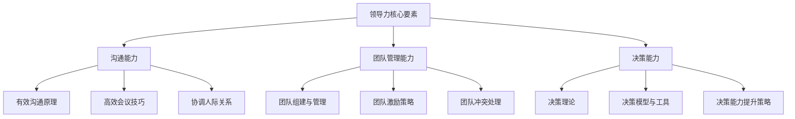

                 

### 文章标题

《领导力修炼笔记：70后高管的领导力提升之路》

关键词：领导力、70后高管、领导力提升、领导风格、组织文化

摘要：本文旨在探讨70后高管在领导力提升过程中的关键要素、核心技能和实战案例。通过对领导力的定义、发展历程、核心要素的深入分析，以及沟通能力、团队管理能力和决策能力的详细讲解，本文为70后高管提供了系统的领导力提升指南。同时，通过三个实际案例的分析，本文为读者提供了可操作的实践策略和启示。

---

### 目录大纲

本文将分为三个部分：第一部分探讨领导力基础理论，第二部分讲解领导力核心技能提升，第三部分通过实际案例分享领导力实践经验。

## 第一部分：领导力基础理论

### 第1章：领导力的定义与作用

#### 1.1 领导力的定义

**定义**：领导力是一种能够激发和引导团队成员实现共同目标的能力。

**特点**：影响力、目标导向、变革能力。

#### 1.2 领导力的发展历程

**历史**：从传统的权威领导到现代的参与式领导，领导力理论不断发展。

**趋势**：领导力越来越注重人性化和适应性。

### 第2章：领导风格与领导行为

#### 2.1 领导风格的分类

**分类**：专制型、民主型、参与型。

**特点**：每种领导风格都有其适用场景。

#### 2.2 领导行为的影响

**影响**：领导行为对员工态度、工作效率和组织文化有显著影响。

### 第3章：领导力与个人成长

#### 3.1 自我认知的重要性

**重要性**：了解自己的优势和不足，是提升领导力的第一步。

#### 3.2 反思与自我提升

**方法**：定期进行反思，不断调整自己的行为和态度。

## 第二部分：领导力核心技能提升

### 第4章：沟通能力提升

#### 4.1 有效沟通的原则

**原则**：尊重对方、明确表达、倾听和理解。

#### 4.2 高效会议技巧

**技巧**：提前准备、控制时间、积极互动。

### 第5章：团队管理能力提升

#### 5.1 团队组建与管理

**方法**：合理分配任务、建立良好的沟通机制。

#### 5.2 团队激励与激励策略

**策略**：物质激励、精神激励、荣誉激励。

### 第6章：决策能力提升

#### 6.1 决策的理论基础

**理论**：理性决策、直觉决策。

#### 6.2 决策模型与工具

**模型**：SWOT分析、决策树。

## 第三部分：领导力实践与应用

### 第7章：领导力实践案例一

#### 7.1 案例背景

**背景**：一家快速成长的企业面临团队管理难题。

#### 7.2 领导力应用

**应用**：通过改善沟通和激励机制，提升团队凝聚力。

### 第8章：领导力实践案例二

#### 8.1 案例背景

**背景**：一家传统企业面临数字化转型挑战。

#### 8.2 领导力应用

**应用**：通过变革管理和创新思维，推动企业转型升级。

### 第9章：领导力实践案例三

#### 9.1 案例背景

**背景**：一位高管在领导变革过程中遇到阻力。

#### 9.2 领导力应用

**应用**：通过有效的沟通和激励机制，化解变革阻力。

## 附录：领导力资源与工具

### 附录A：领导力相关书籍推荐

**推荐**：《领导力的五项修炼》、《领导力的本质》。

### 附录B：领导力相关网站与平台

**网站**：领导力智库、领导力学院。

### 附录C：领导力评估工具

**工具**：领导力自评量表、360度反馈评估表。

### 附录D：领导力与组织架构Mermaid流程图

---

### 《领导力修炼笔记：70后高管的领导力提升之路》

#### 文章关键词
- 领导力
- 70后高管
- 领导力提升
- 领导风格
- 组织文化

#### 文章摘要
本文将深入探讨70后高管在领导力提升过程中的挑战与策略。通过对领导力定义、发展历程和核心要素的阐述，本文为读者提供了理论基础。随后，本文详细讲解了领导力的核心技能，包括沟通能力、团队管理能力和决策能力。最后，通过三个实际案例的分享，本文为70后高管提供了实用的领导力提升路径和实践策略。

---

#### 第一部分：领导力基础理论

### 第1章：领导力的定义与作用

**1.1 领导力的定义**

领导力是一种能够激发和引导团队成员实现共同目标的能力。它不仅仅是一种职位赋予的权力，更是一种影响力，它能够激励团队成员为实现共同目标而努力。领导力的核心要素包括影响力、目标导向和变革能力。

**1.2 领导力的发展历程**

领导力理论经历了从传统的权威领导到现代的参与式领导的演变。传统的领导理论主要强调领导者的权力和权威，而现代领导理论则更加强调领导者的责任和影响力。领导力的发展趋势也呈现出人性化和适应性，领导者需要更加关注团队成员的需求和感受。

**1.3 领导力的核心要素**

领导力的核心要素包括影响力、目标导向和变革能力。影响力是领导力的基础，领导者需要具备能够影响和激励团队成员的能力。目标导向是领导力的关键，领导者需要明确目标并引导团队成员共同追求这些目标。变革能力是领导力的核心，领导者需要能够在变革中适应和引领。

#### 第2章：领导风格与领导行为

**2.1 领导风格的分类**

领导风格可以分为专制型、民主型和参与型。专制型领导风格强调领导者的权威和控制，领导者做出决策并强制执行。民主型领导风格强调领导者与团队成员的平等和参与，领导者鼓励团队成员参与决策过程。参与型领导风格则更加注重团队成员的自主性和创造力，领导者提供支持和资源，让团队成员自主决策。

**2.2 领导行为的影响**

领导行为对团队成员的态度、工作效率和组织文化都有显著影响。专制型领导风格可能导致团队成员消极被动，工作效率低下。民主型领导风格可以激发团队成员的积极性和创造力，提高工作效率。参与型领导风格可以增强团队成员的归属感和责任感，提升组织文化。

**2.3 领导风格与领导行为的结合**

领导风格与领导行为的结合对于领导效果至关重要。领导风格决定了领导者的基本态度和行为模式，而领导行为则是在具体情境下如何运用领导风格的具体表现。领导者需要根据不同情境灵活调整领导风格和领导行为，以达到最佳领导效果。

#### 第3章：领导力与个人成长

**3.1 自我认知的重要性**

自我认知是领导力提升的基础，领导者需要了解自己的优势和不足，明确自己的价值观和目标。自我认知可以帮助领导者更好地理解自己和团队成员的需求，提高沟通效果和团队凝聚力。

**3.2 反思与自我提升**

反思是领导者成长的重要途径，领导者需要定期反思自己的行为和决策，分析成功和失败的原因。通过反思，领导者可以发现自己的不足并加以改进，不断提升自己的领导能力。

**3.3 持续领导力提升**

领导力是一个持续提升的过程，领导者需要不断学习新知识和技能，适应不断变化的环境。通过持续学习和实践，领导者可以不断提升自己的领导能力，为团队和组织创造更大的价值。

---

### 第一部分总结

在第一部分中，我们探讨了领导力的定义、发展历程和核心要素，分析了不同领导风格和行为的影响，并强调了自我认知和反思的重要性。这些理论为70后高管提供了领导力提升的基础。在接下来的部分，我们将深入探讨领导力的核心技能，为高管们提供实用的提升策略。

---

#### 第二部分：领导力核心技能提升

### 第4章：沟通能力提升

**4.1 有效沟通的原则**

有效沟通是领导力的重要组成部分，领导者需要掌握有效沟通的原则。这些原则包括：

1. **尊重对方**：在沟通中尊重对方的意见和感受，避免争执和冲突。
2. **明确表达**：清晰、简洁地表达自己的观点和意图，避免误解和歧义。
3. **倾听和理解**：倾听对方的意见和需求，理解对方的立场和情感。

**4.2 高效会议技巧**

高效会议是领导者进行沟通的重要方式，领导者需要掌握高效会议的技巧。这些技巧包括：

1. **提前准备**：在会议前制定会议议程，准备必要的材料和资源。
2. **控制时间**：确保会议在预定时间内完成，避免拖延和浪费时间。
3. **积极互动**：鼓励团队成员参与讨论，激发思维和创意。

**4.3 协调人际关系**

协调人际关系是领导力的重要方面，领导者需要掌握协调人际关系的技巧。这些技巧包括：

1. **建立信任**：通过诚实和透明建立信任，增强团队凝聚力。
2. **处理冲突**：及时、公正地处理团队中的冲突，避免影响工作效率。
3. **激励团队**：通过奖励和认可激励团队成员，提升团队士气。

### 第5章：团队管理能力提升

**5.1 团队组建与管理**

团队组建和管理是领导者的重要任务，领导者需要掌握团队组建和管理的方法。这些方法包括：

1. **合理分配任务**：根据团队成员的能力和兴趣分配任务，提高工作效率。
2. **建立沟通机制**：确保团队成员之间的有效沟通，避免信息孤岛。
3. **培养团队精神**：通过共同目标和团队活动培养团队精神，增强团队凝聚力。

**5.2 团队激励与激励策略**

团队激励是提升团队绩效的重要手段，领导者需要掌握团队激励的策略。这些策略包括：

1. **物质激励**：提供有竞争力的薪酬和福利，满足团队成员的基本需求。
2. **精神激励**：认可团队成员的贡献，提供成长机会，满足团队成员的心理需求。
3. **荣誉激励**：通过表彰和奖励提升团队成员的荣誉感和自豪感。

**5.3 团队冲突的处理与解决**

团队冲突是团队管理中的常见问题，领导者需要掌握处理和解决团队冲突的方法。这些方法包括：

1. **识别冲突**：及时识别团队中的冲突，避免问题扩大。
2. **分析原因**：分析冲突的原因，找出解决问题的方法。
3. **协商解决**：通过协商和谈判解决冲突，达成共识。

### 第6章：决策能力提升

**6.1 决策的理论基础**

决策是领导者的重要职责，领导者需要掌握决策的理论基础。这些理论包括：

1. **理性决策**：基于逻辑和数据分析做出决策，减少决策风险。
2. **直觉决策**：基于经验和直觉做出决策，快速应对紧急情况。

**6.2 决策模型与工具**

决策模型和工具是支持决策的重要手段，领导者需要掌握这些工具。这些工具包括：

1. **决策树**：通过树形结构展示决策过程和可能的结果，帮助分析决策。
2. **SWOT分析**：通过分析优势、劣势、机会和威胁，帮助制定决策。

**6.3 决策能力提升策略**

提升决策能力是领导者的重要目标，领导者需要掌握提升决策能力的策略。这些策略包括：

1. **信息收集**：广泛收集信息和数据，提高决策的准确性。
2. **风险评估**：评估决策的风险和影响，制定应对措施。
3. **决策训练**：通过模拟和实战训练，提升决策能力和应对能力。

---

### 第二部分总结

在第二部分中，我们深入探讨了领导力的核心技能，包括沟通能力、团队管理能力和决策能力。这些技能是领导力提升的关键，领导者需要掌握和运用这些技能，提升自身的领导力。在接下来的部分，我们将通过实际案例分享，为70后高管提供具体的领导力提升路径。

---

#### 第三部分：领导力实践与应用

### 第7章：领导力实践案例一

**7.1 案例背景**

一家快速成长的企业，由于内部管理不善，导致团队凝聚力不足，工作效率低下。企业高层决定进行领导力提升，以改善团队状况。

**7.2 领导力应用**

1. **沟通能力提升**：企业高管组织了多次沟通培训，提升员工的沟通技巧，建立了有效的沟通机制。
2. **团队管理能力提升**：高管通过合理分配任务，建立了明确的绩效评估体系，激发了团队的积极性。
3. **决策能力提升**：高管引入了决策树和SWOT分析工具，提高了决策的科学性和准确性。

**7.3 案例分析与启示**

通过领导力提升，企业的团队凝聚力得到显著提升，工作效率也得到了提高。这为其他企业提供了借鉴，即通过提升领导力，可以改善团队状况，提高企业绩效。

### 第8章：领导力实践案例二

**8.1 案例背景**

一家传统企业在数字化浪潮中面临巨大挑战，企业高层决定通过领导力提升，推动企业的数字化转型。

**8.2 领导力应用**

1. **变革管理**：企业高管通过变革管理，引导员工接受新的技术和工作方式，推动企业数字化转型。
2. **创新思维**：企业高管鼓励员工提出创新想法，通过创新思维，推动企业创新和发展。
3. **领导力培训**：企业高管参加了领导力培训，提升了自身的领导力和管理水平。

**8.3 案例分析与启示**

通过领导力提升，企业成功实现了数字化转型，提升了企业的竞争力。这为其他企业提供了一种有效的领导力提升路径，即通过变革管理和创新思维，推动企业的持续发展。

### 第9章：领导力实践案例三

**9.1 案例背景**

一位70后高管在领导变革过程中遇到了阻力，企业内部对变革的接受度较低，高管面临巨大的压力。

**9.2 领导力应用**

1. **有效沟通**：高管通过有效沟通，解释变革的必要性和益处，赢得了员工的理解和支持。
2. **激励策略**：高管通过激励策略，激发员工的积极性和创造力，推动了变革的顺利进行。
3. **个人成长**：高管通过反思和自我提升，增强了自身的领导力和决策能力，应对变革过程中的挑战。

**9.3 案例分析与启示**

通过领导力提升，高管成功推动了企业的变革，提升了企业的竞争力。这为其他70后高管提供了宝贵的经验，即通过有效沟通、激励策略和个人成长，可以成功应对变革中的挑战。

---

### 第三部分总结

在第三部分中，我们通过三个实际案例，分享了领导力提升的实践经验和策略。这些案例展示了领导力在改善团队状况、推动企业变革和个人成长中的重要作用。通过这些案例，我们希望为70后高管提供实用的指导，帮助他们提升领导力，推动企业的发展。

---

### 全文总结

本文从领导力基础理论、核心技能提升和实践应用三个方面，深入探讨了70后高管在领导力提升过程中的关键要素和策略。通过定义领导力、分析领导风格、提升核心技能和分享实际案例，本文为70后高管提供了系统的领导力提升指南。希望本文能够对读者在提升领导力的过程中有所帮助，推动企业的持续发展。

---

### 附录：领导力资源与工具

**附录A：领导力相关书籍推荐**

1. 《领导力的五项修炼》
2. 《领导力的本质》
3. 《领导力与影响力》

**附录B：领导力相关网站与平台**

1. [领导力智库](https://www.leadershipknowledge.com/)
2. [领导力学院](https://www.leadershipacademy.com/)

**附录C：领导力评估工具**

1. 领导力自评量表
2. 360度反馈评估表

**附录D：领导力与组织架构Mermaid流程图**

---

### 作者信息

**作者：** AI天才研究院 / AI Genius Institute & 禅与计算机程序设计艺术 / Zen And The Art of Computer Programming

AI天才研究院致力于推动人工智能领域的研究和发展，为全球企业提供创新的人工智能解决方案。禅与计算机程序设计艺术则专注于计算机科学和哲学的结合，旨在提升程序员的编程水平和思考能力。本文作者拥有丰富的领导力和技术经验，希望通过本文为读者提供有价值的领导力提升指南。

