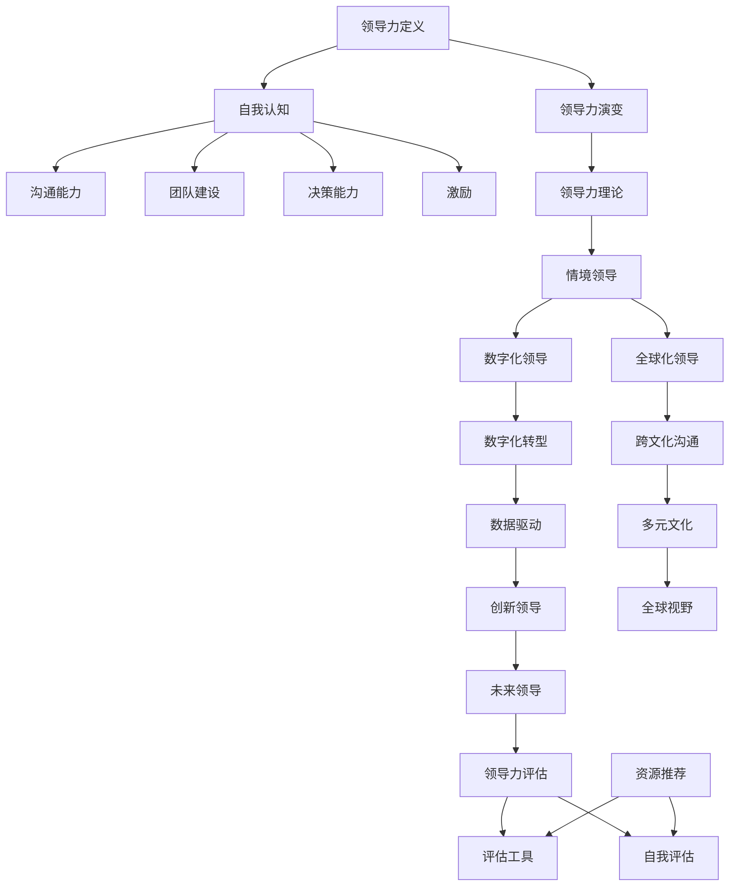

                 

# 领导力心法：成就一流领导者的领导力法则

> 关键词：领导力、自我认知、沟通能力、团队建设、决策能力、激励、数字化变革、全球化、创新

> 摘要：本文深入探讨了领导力的本质与内涵，通过分析领导力基础理论、核心能力、实践应用以及未来趋势，为读者提供了一套完整的领导力心法。通过案例分析和实践指导，本文旨在帮助读者理解并掌握一流领导者的领导力法则。

## 目录大纲

### 第一部分：领导力基础理论

### 第二部分：领导力的核心能力

### 第三部分：领导力实践

### 第四部分：领导力未来趋势

### 附录

## 第一部分：领导力基础理论

### 第1章：领导力概念与演变

#### 1.1 领导力定义

领导力是指个人在团队中通过影响力、信任和激励来引导和激励团队成员，实现共同目标的能力。它是管理的一个重要组成部分，但与传统的管理不同，领导力更注重激发团队成员的潜力，创造一个积极的工作环境。

#### 1.2 领导力与传统管理的区别

传统管理侧重于规范和流程，强调控制与监督；而领导力则更注重激发和赋能，强调个人和团队的成长。传统管理更多关注效率，而领导力更多关注成果和影响。

#### 1.3 领导力理论的发展历程

领导力理论经历了从行为理论、特质理论到情境理论等多个阶段。现代领导力理论强调领导者的个性特征、情境因素和领导风格的重要性。

### 第2章：领导者的自我认知

#### 2.1 自我认知的重要性

自我认知是领导力发展的基础。领导者需要清楚地了解自己的价值观、信念、优点和缺点，以便更好地发挥自己的潜力。

#### 2.2 自我评估方法

领导者可以通过多种方法进行自我评估，如360度反馈、心理测评和自我反思等。

#### 2.3 自我认知与领导风格

领导者的自我认知对其领导风格有着重要影响。不同的领导风格适用于不同的情境，领导者需要根据具体情况灵活调整。

### 第3章：领导者的心理素质

#### 3.1 领导者的心理素质概述

领导者的心理素质包括情绪稳定性、压力承受能力、自我调节能力和决策能力等。

#### 3.2 压力管理与应对策略

领导者需要学会有效管理压力，包括情绪管理和时间管理。

#### 3.3 情绪管理与调节

情绪管理是领导者心理素质的重要组成部分。领导者需要学会如何控制自己的情绪，避免负面情绪对工作产生负面影响。

## 第二部分：领导力的核心能力

### 第4章：沟通能力

#### 4.1 沟通原理与技巧

有效的沟通是领导力的核心能力之一。领导者需要掌握倾听、表达、反馈等沟通技巧。

#### 4.2 有效沟通的障碍与克服

沟通障碍包括语言障碍、文化障碍和心理障碍等。领导者需要了解这些障碍并采取相应策略进行克服。

#### 4.3 情境沟通与策略

情境沟通强调根据不同的情境选择合适的沟通方式。领导者需要具备灵活的沟通策略，以应对各种挑战。

### 第5章：团队建设

#### 5.1 团队建设的重要性

团队建设是领导力的重要方面。一个高效的团队可以更好地实现共同目标。

#### 5.2 团队角色与互动

团队成员的角色和互动对团队绩效有重要影响。领导者需要了解团队成员的角色，并促进积极互动。

#### 5.3 团队文化建设

团队文化是团队的价值观和行为准则。领导者需要塑造和维护一个积极向上的团队文化。

### 第6章：决策能力

#### 6.1 决策过程与模型

决策是领导者的重要职责。领导者需要掌握科学的决策过程和模型。

#### 6.2 决策风险与管理

领导者需要识别和管理决策风险，以确保决策的合理性和有效性。

#### 6.3 创新决策策略

在快速变化的商业环境中，领导者需要具备创新决策策略，以应对不确定性。

### 第7章：激励与领导力

#### 7.1 激励理论概述

激励是领导力的关键要素。领导者需要了解激励理论，以激发团队成员的积极性。

#### 7.2 员工激励策略

领导者需要根据不同员工的需求和特点，制定个性化的激励策略。

#### 7.3 领导力与激励

领导力与激励密切相关。有效的领导力可以增强员工的动力和归属感。

## 第三部分：领导力实践

### 第8章：领导力心法应用

#### 8.1 领导力心法的核心思想

领导力心法强调领导者内心的力量，通过自我修炼和情境适应，实现领导力的提升。

#### 8.2 领导力心法在管理中的应用

领导力心法可以应用于日常管理中，如团队建设、员工激励和决策制定等。

#### 8.3 领导力心法在实际案例中的运用

通过实际案例，读者可以更深入地理解领导力心法的应用和实践。

### 第9章：领导力心法与企业文化

#### 9.1 企业文化与领导力心法的关系

企业文化对领导力心法有着重要影响。领导者需要了解企业文化，并将其融入领导实践中。

#### 9.2 如何通过领导力心法塑造企业文化

领导者可以通过自身行为和领导风格，塑造和维护积极的企业文化。

#### 9.3 领导力心法与可持续发展

领导力心法有助于企业实现可持续发展，通过激发员工的潜力和创造力，实现长远发展。

### 第10章：领导力心法与团队成长

#### 10.1 领导力心法与团队成长的关系

领导力心法对团队成长有着重要推动作用。领导者需要关注团队成长，并提供必要的支持和资源。

#### 10.2 如何通过领导力心法促进团队成长

领导者可以通过多种方式促进团队成长，如培养团队精神、提供培训和发展机会等。

#### 10.3 领导力心法与个人成长

领导力心法不仅有助于团队成长，也有助于个人成长。领导者需要不断学习和提升自己，以更好地履行领导职责。

## 第四部分：领导力未来趋势

### 第11章：领导力与数字化变革

#### 11.1 数字化时代下的领导力挑战

数字化时代为领导力带来了新的挑战。领导者需要适应数字化环境，提升数字化领导能力。

#### 11.2 数字化领导力策略

领导者需要制定有效的数字化领导力策略，如数据驱动决策、数字化转型和文化变革等。

#### 11.3 领导力与数字化转型

数字化转型要求领导者具备新的能力和素质，如数字思维、数据分析和创新能力等。

### 第12章：领导力与全球化

#### 12.1 全球化背景下的领导力

全球化使得领导力面临跨文化管理和全球协作等挑战。领导者需要具备全球视野和跨文化沟通能力。

#### 12.2 多元文化领导力

多元文化领导力强调领导者如何在不同文化背景下有效管理和领导团队。

#### 12.3 领导力全球化趋势与未来

随着全球化的深入，领导力全球化将成为未来领导力发展的趋势。领导者需要具备全球竞争力。

### 第13章：领导力创新与未来

#### 13.1 领导力创新的必要性

创新是领导力的重要特征。领导者需要具备创新意识和能力，以应对快速变化的环境。

#### 13.2 创新领导力模型

领导者可以采用创新领导力模型，如创业型领导力、变革型领导力和赋能型领导力等。

#### 13.3 未来领导力展望

未来领导力将更加注重数字化、全球化和创新。领导者需要不断学习和适应，以保持领导力优势。

## 附录

### 附录 A：领导力评估工具

#### A.1 领导力评估方法概述

#### A.2 常用的领导力评估工具

#### A.3 领导力自我评估实践

### 附录 B：领导力相关资源推荐

#### B.1 领导力书籍推荐

#### B.2 领导力课程推荐

#### B.3 领导力相关组织与社区推荐

## 附录 C：领导力心法 Mermaid 流程图

以下是领导力心法的 Mermaid 流程图，帮助读者更直观地理解领导力心法的核心思想和应用场景。

## 结语

领导力是一项复杂而又至关重要的技能。通过本文的探讨，我们希望能为读者提供一套系统的领导力心法，帮助读者在职场中成为一流的领导者。领导力并非一蹴而就，它需要持续的学习、实践和反思。希望每一位读者都能在领导力的道路上不断前行，实现自我和团队的成长。

### 作者信息

作者：AI天才研究院/AI Genius Institute & 禅与计算机程序设计艺术 /Zen And The Art of Computer Programming

文章标题：《领导力心法：成就一流领导者的领导力法则》

文章关键词：领导力、自我认知、沟通能力、团队建设、决策能力、激励、数字化变革、全球化、创新

文章摘要：本文深入探讨了领导力的本质与内涵，通过分析领导力基础理论、核心能力、实践应用以及未来趋势，为读者提供了一套完整的领导力心法。通过案例分析和实践指导，本文旨在帮助读者理解并掌握一流领导者的领导力法则。

### 附录 A：领导力评估工具

#### A.1 领导力评估方法概述

领导力评估是评估领导者能力的重要手段。它可以通过多种方法进行，包括自我评估、360度反馈、领导力测试和绩效评估等。

- **自我评估**：领导者通过自我反思和自我评价来评估自己的领导力。
- **360度反馈**：通过收集来自上级、同事、下属和外部专家的反馈，全面评估领导者的能力。
- **领导力测试**：使用标准化测试工具来评估领导者的各项能力。
- **绩效评估**：通过领导者的工作表现和成果来评估其领导力。

#### A.2 常用的领导力评估工具

以下是一些常用的领导力评估工具：

- **Myers-Briggs Type Indicator (MBTI)**：用于评估个人的性格类型。
- **DiSC Assessment**：评估个人的行为风格和沟通方式。
- **Leadership Circle Profile**：评估领导者的行为和情境能力。
- **Leadership Practices Inventory (LPI)**：评估领导者的行为和价值观。

#### A.3 领导力自我评估实践

自我评估是领导力发展的重要步骤。以下是一些自我评估的实践方法：

1. **反思日志**：定期记录自己的思考和感受，反思领导行为和结果。
2. **学习与反思**：通过阅读领导力书籍、参加培训课程和研讨会，提升自我认知。
3. **求助反馈**：向同事、下属或导师寻求反馈，了解自己的领导风格和影响力。

### 附录 B：领导力相关资源推荐

#### B.1 领导力书籍推荐

- 《领导力五项修炼》：作者：彼得·圣吉
- 《高效能人士的七个习惯》：作者：史蒂芬·柯维
- 《领导力密码》：作者：华蒙·杰克逊

#### B.2 领导力课程推荐

- **哈佛商学院领导力课程**
- **斯坦福大学领导力课程**
- **谷歌领导力发展课程**

#### B.3 领导力相关组织与社区推荐

- **国际领导力协会（International Leadership Association）**
- **领导力发展协会（Leadership Development Institute）**
- **领导力论坛（Leadership Forum）**

### 附录 C：领导力心法 Mermaid 流程图

以下是领导力心法的 Mermaid 流程图，帮助读者更直观地理解领导力心法的核心思想和应用场景。

通过上述流程图，我们可以清晰地看到领导力心法的核心要素以及它们之间的关系。领导者需要在这各个方面不断学习和提升，以实现卓越的领导效果。## 引言

在现代企业管理中，领导力是一个不可忽视的关键因素。优秀的领导力不仅能够提升团队的效率和绩效，还能够塑造企业的文化和价值观，推动企业持续发展。然而，领导力并非天生的能力，它需要通过系统的学习和实践来培养和提升。

本文旨在为读者提供一套全面的领导力心法，帮助读者理解并掌握一流领导者的领导力法则。我们将从领导力基础理论、核心能力、实践应用和未来趋势四个方面进行深入探讨，并结合实际案例进行分析，以期为读者提供有价值的参考和指导。

首先，我们将介绍领导力的定义和演变，探讨领导力与传统管理的区别，并梳理领导力理论的发展历程。接着，我们将重点讨论领导者的自我认知、心理素质，以及如何通过自我评估提升领导能力。

在第二部分，我们将深入探讨领导力的核心能力，包括沟通能力、团队建设、决策能力和激励策略。这些能力是领导力的核心要素，对于实现领导目标具有决定性作用。

第三部分将聚焦领导力实践，介绍领导力心法的核心思想，并探讨其在管理中的应用。同时，我们将通过实际案例，展示领导力心法的有效性和实践价值。

第四部分将展望领导力的未来趋势，探讨数字化变革、全球化和创新对领导力的影响，并分析未来领导力的发展方向。

最后，附录部分将提供领导力评估工具和相关资源推荐，以供读者参考和实践。

通过本文的探讨，我们希望能为读者提供一套系统的领导力心法，帮助读者在职场中成为一流的领导者。领导力是一项复杂而多维度的能力，它需要不断地学习和实践。希望每一位读者都能在领导力的道路上不断前行，实现自我和团队的成长。## 第一部分：领导力基础理论

### 第1章：领导力概念与演变

#### 1.1 领导力定义

领导力，作为一个关键的管理概念，其定义在学术界和管理实践中不断演变。简而言之，领导力是指个人在团队中通过影响力、信任和激励来引导和激励团队成员，实现共同目标的能力。与传统的管理不同，领导力更注重激发团队成员的潜力，创造一个积极的工作环境。

领导力的核心在于其影响力，这种影响力不仅来自于职位赋予的权力，还包括个人魅力、信任和价值观的传递。有效的领导力能够激发团队成员的主动性和创造性，使整个团队能够高效地实现目标。

#### 1.2 领导力与传统管理的区别

传统管理侧重于通过规范和流程来控制组织运营，确保资源的合理配置和目标的实现。传统管理强调的是“控制”和“效率”，管理者通常通过制定规章制度、监督执行和绩效评估来维持组织的运作。

而领导力则更注重“赋能”和“激励”。领导者的主要任务是创造一个让团队成员能够充分发挥自身潜力的环境。领导力不仅仅是管理的一部分，更是一种对人的关怀和激励，通过信任、尊重和激励来提升团队成员的参与度和归属感。

#### 1.3 领导力理论的发展历程

领导力理论经历了多个发展阶段，从早期的研究到现代的理论，其演变反映了领导力实践的不断深入和理论化的进程。

- **行为理论**：行为理论关注领导者的行为模式，认为有效的领导者具有特定的行为特征。这类理论试图通过识别领导行为来培养领导者。代表性理论包括领导行为四分图（Hersey & Blanchard）和领导行为连续体理论（Hersey & Blanchard）。

- **特质理论**：特质理论认为领导者具有一些固有的特质和品质，如自信、决心和智慧等。这类理论试图通过分析领导者的个性特征来预测其领导效果。代表性理论包括斯托格迪尔的领导特质理论。

- **情境理论**：情境理论（又称为情境领导理论）认为领导效果取决于领导者与情境的匹配。这类理论强调领导风格应随着情境的变化而变化。代表性理论包括赫塞和布兰查德的情境领导理论和费德勒的权变领导模型。

- **变革型领导理论**：变革型领导理论认为领导者通过激励、鼓舞和启发团队成员来实现变革。这类理论强调领导者的愿景和影响力，以及他们如何激发团队成员的潜力和创造力。代表性理论包括伯恩斯和哈塞尔的变革型领导理论。

- **服务型领导理论**：服务型领导理论认为领导者应首先关注团队成员的需求，通过服务来建立信任和合作关系。这类理论强调领导者的谦逊和服务精神，以及他们如何通过为团队成员提供支持和资源来提升团队绩效。代表性理论包括豪斯和服务型领导模型。

- **数字化领导理论**：随着数字化时代的到来，数字化领导理论逐渐成为研究热点。这类理论关注领导者如何在数字化环境中有效管理和领导团队。代表性理论包括数字化领导能力和数字化转型领导模型。

通过这些理论的探讨，我们可以看到领导力是一个多维度的概念，它不仅包括领导者的个人特质和行为，还受到情境因素的影响。理解这些理论有助于我们更好地培养和提升领导力，以应对复杂多变的管理环境。

### 第2章：领导者的自我认知

#### 2.1 自我认知的重要性

自我认知是领导力发展的基础。一个领导者首先需要清楚自己的价值观、信念、优点和缺点，这样才能更好地发挥自己的潜力，实现领导目标。自我认知不仅仅是对个人能力和特点的了解，更是一种对自身行为和决策的反思与审视。

自我认知对于领导者的成长至关重要。首先，它帮助领导者识别自己的优势和劣势，从而在团队建设和决策过程中扬长避短。其次，自我认知有助于领导者建立自信心，增强影响力。最后，自我认知能够帮助领导者更好地应对压力和挑战，提升心理素质。

#### 2.2 自我评估方法

领导者可以通过多种方法进行自我评估，以提升自我认知。以下是一些常用的自我评估方法：

- **360度反馈**：360度反馈是一种通过收集来自上级、同事、下属和外部专家的反馈，全面评估领导者能力的方法。这种方法能够提供多角度的评估，帮助领导者了解自己的优点和不足。

- **心理测评**：心理测评工具，如Myers-Briggs Type Indicator (MBTI) 和 DiSC，可以帮助领导者了解自己的性格类型和行为风格。这些测评结果可以为领导者的个人发展和领导风格提供有价值的参考。

- **自我反思日志**：领导者可以通过定期记录自己的思考和感受，反思领导行为和决策，从而提升自我认知。这种方法有助于领导者从内心深处挖掘问题，找到解决问题的方法。

- **学习和反思**：通过阅读领导力书籍、参加培训课程和研讨会，领导者可以不断学习和提升自己的知识水平和技能。同时，反思学习内容和实践经验，有助于领导者更好地认识自己。

- **求助反馈**：领导者可以向同事、下属或导师寻求反馈，了解自己的领导风格和影响力。这种外部的视角能够帮助领导者更客观地看待自己。

#### 2.3 自我认知与领导风格

领导者的自我认知对其领导风格有着重要影响。不同领导风格适用于不同的情境和团队成员，领导者需要根据具体情况灵活调整。

- **授权型领导风格**：具有较高自我认知的领导者更容易采用授权型领导风格。他们相信团队成员有能力和潜力完成任务，通过授权和激励，使团队成员自主决策和行动。

- **变革型领导风格**：自我认知良好的领导者更容易采用变革型领导风格。他们有远大的愿景，能够鼓舞团队成员为实现共同目标而努力。通过激励和启发，领导者能够推动团队进行变革和创新。

- **服务型领导风格**：自我认知良好的领导者更可能采用服务型领导风格。他们关注团队成员的需求，通过提供支持和资源来帮助团队成员成长。这种领导风格能够建立信任和合作关系，提升团队凝聚力和绩效。

总之，自我认知是领导力发展的重要基石。通过自我评估和不断学习，领导者可以更好地认识自己，提升领导能力，实现卓越的领导效果。## 第3章：领导者的心理素质

领导者的心理素质在领导力中扮演着至关重要的角色。一个成功的领导者不仅需要具备卓越的业务能力，还需要拥有良好的心理素质，以应对复杂多变的管理环境和挑战。在这一章节中，我们将探讨领导者的心理素质，包括情绪稳定性、压力承受能力、自我调节能力和决策能力，以及如何进行压力管理和情绪调节。

#### 3.1 领导者的心理素质概述

领导者的心理素质是指其在面对工作压力和挑战时，能够保持冷静、合理应对和有效决策的心理能力。良好的心理素质有助于领导者保持积极的心态，提升决策质量，增强团队凝聚力，从而实现组织目标。

#### 3.2 压力管理与应对策略

压力是领导者面临的主要挑战之一。有效的压力管理对于维护领导者的心理健康和提升工作表现至关重要。以下是一些压力管理的应对策略：

- **时间管理**：合理规划时间，避免过度工作。领导者可以通过制定日程表、设定优先级和学会拒绝不必要的任务来减轻工作压力。

- **积极心态**：保持积极的心态，面对困难和挑战。领导者可以通过积极的自我对话和积极的思维模式来调整情绪，减少负面情绪的影响。

- **健康生活方式**：保持良好的生活习惯，如规律作息、健康饮食和适量运动。这些健康生活方式有助于减轻压力，提升心理素质。

- **寻求支持**：与同事、朋友和家人交流，寻求情感支持和建议。领导者可以通过分享自己的困惑和压力，获得不同的视角和建议，从而更好地应对挑战。

- **专业咨询**：在必要时，寻求专业心理咨询师的帮助。心理咨询师可以提供专业的指导和支持，帮助领导者解决心理问题，提升心理素质。

#### 3.3 情绪管理与调节

情绪管理是领导者心理素质的重要组成部分。有效的情绪管理有助于领导者保持冷静、合理决策，并提升团队的士气和工作效率。以下是一些情绪管理的方法：

- **自我觉察**：领导者需要时刻关注自己的情绪状态，了解情绪的来源和影响。通过自我觉察，领导者可以更好地控制情绪，避免情绪波动对工作和团队产生负面影响。

- **情绪释放**：领导者需要学会适当释放情绪，避免压抑和积压。可以通过运动、写日记、绘画或与他人倾诉等方式释放情绪。

- **情绪调节**：领导者可以通过深呼吸、冥想和放松技巧来调节情绪。这些方法有助于领导者保持冷静，应对紧张和压力。

- **积极沟通**：有效的沟通是情绪管理的重要手段。领导者需要学会倾听他人的意见和感受，以建立信任和尊重的关系。通过积极沟通，领导者可以更好地理解团队成员的情绪，并采取相应的措施进行调节。

- **情境适应**：领导者需要学会在不同情境下调整情绪。在面对困难和挑战时，领导者需要保持冷静和理智，以做出明智的决策。在团队建设中，领导者需要关注团队成员的情绪，营造一个积极向上的工作氛围。

#### 3.4 决策能力

决策能力是领导者的重要素质之一。有效的决策能力有助于领导者迅速应对变化，抓住机遇，实现组织目标。以下是一些提升决策能力的策略：

- **信息收集**：领导者需要广泛收集信息，确保决策的依据充分和准确。通过多渠道获取信息，领导者可以更全面地了解问题的各个方面。

- **分析问题**：领导者需要具备分析问题的能力，从不同角度审视问题，找到问题的核心和关键点。通过深入分析，领导者可以制定出更有效的解决方案。

- **风险评估**：领导者需要评估决策的风险和潜在影响。通过评估风险，领导者可以制定风险应对策略，确保决策的可行性和安全性。

- **团队协作**：领导者需要与团队成员协作，共同制定决策。通过集思广益，领导者可以吸纳不同意见和观点，提高决策的质量。

- **实践检验**：领导者需要通过实践检验决策的效果，不断调整和完善决策。通过实践检验，领导者可以总结经验教训，提升决策能力。

总之，领导者的心理素质对于其领导效果和组织发展具有重要影响。通过提升情绪稳定性、压力承受能力和自我调节能力，以及加强决策能力，领导者可以更好地应对管理挑战，实现组织的长远发展。## 第二部分：领导力的核心能力

### 第4章：沟通能力

#### 4.1 沟通原理与技巧

沟通能力是领导者的重要核心能力之一，它直接影响着领导者的决策质量、团队协作效率和员工满意度。有效的沟通不仅能够确保信息的准确传递，还能建立信任、增强团队凝聚力。

#### 4.1.1 沟通原理

沟通原理是理解有效沟通的基础。以下是一些关键的沟通原理：

- **信息传递**：沟通的核心是信息的传递。信息需要从发送者通过渠道传递到接收者，并在接收者处得到正确的理解。
- **反馈**：有效的沟通需要双向反馈。接收者通过反馈向发送者确认信息的理解和接受情况，从而确保沟通的准确性。
- **倾听**：倾听是沟通的重要组成部分。领导者需要倾听团队成员的意见和需求，以建立信任和理解。
- **非语言沟通**：非语言沟通包括面部表情、肢体语言和语调等。这些非语言元素在沟通过程中起着关键作用，有时甚至比语言本身更能传递信息。
- **情境适应**：沟通方式需要根据不同的情境进行适应。领导者需要在不同情境下选择合适的沟通策略，以达到最佳效果。

#### 4.1.2 沟通技巧

掌握有效的沟通技巧对于提升沟通能力至关重要。以下是一些关键的沟通技巧：

- **清晰表达**：领导者需要清晰、明确地表达自己的意见和指令。使用简洁明了的语言，避免使用模糊或歧义的表达方式。
- **积极倾听**：积极倾听不仅包括听取他人的意见，还包括理解对方的情感和需求。领导者需要全神贯注地倾听，并通过提问和确认来确保理解准确。
- **反馈机制**：建立有效的反馈机制，确保沟通的双方都能明确信息的传达和理解情况。反馈可以是正面的也可以是建设性的批评。
- **非语言沟通**：领导者需要注重非语言沟通的技巧，如面部表情、肢体语言和语调。这些非语言元素可以增强语言沟通的效果，传递出更加丰富的信息。
- **情境适应**：领导者需要根据不同的情境选择合适的沟通方式。例如，在紧张的会议中，领导者可能需要使用简洁、直接的语言；而在团队建设活动中，领导者可能需要更加亲和、开放的沟通方式。

#### 4.2 有效沟通的障碍与克服

尽管沟通是领导力的核心能力之一，但在实际沟通过程中，领导者常常会遇到各种障碍。以下是一些常见的沟通障碍及其克服方法：

- **信息过载**：当信息量过多时，接收者可能会感到压力和困惑，导致信息传递不准确。克服这一障碍的方法是简化信息，突出关键点，并确保信息的层次结构清晰。
- **文化差异**：在不同文化背景下，沟通可能会受到语言、价值观和习俗的阻碍。领导者可以通过学习和尊重不同文化的差异，以及使用跨文化沟通技巧来克服这些障碍。
- **情绪干扰**：情绪可能会干扰沟通的效果，导致误解和冲突。领导者需要学会控制自己的情绪，并鼓励团队成员在沟通中保持冷静和客观。
- **时间限制**：在时间紧迫的情况下，沟通可能会变得匆忙和混乱。领导者可以通过提前规划沟通内容和时间，以及使用高效沟通技巧来克服这一障碍。

#### 4.3 情境沟通与策略

情境沟通强调根据不同的情境选择合适的沟通方式。领导者需要具备灵活的沟通策略，以应对各种挑战。

- **正式沟通**：在正式场合，如会议和报告，领导者需要使用正式的语言和沟通风格。这种沟通方式有助于确保信息的准确性和权威性。
- **非正式沟通**：在非正式场合，如团队活动和社交聚会，领导者可以采用更加亲和、开放和非正式的沟通方式。这种沟通方式有助于建立团队凝聚力和信任。
- **冲突沟通**：在冲突情境下，领导者需要采取适当的沟通策略来化解冲突。这包括倾听对方的意见、展示同理心和寻找共同点。

总之，沟通能力是领导者不可或缺的核心能力。通过理解沟通原理、掌握沟通技巧、克服沟通障碍和灵活运用情境沟通策略，领导者可以提升沟通效果，增强团队协作，实现组织目标。## 第5章：团队建设

#### 5.1 团队建设的重要性

团队建设是领导力的重要方面，它不仅关系到团队的整体表现，也直接影响到团队的士气和凝聚力。有效的团队建设能够提升团队协作效率，增强员工的工作满意度和忠诚度，从而推动组织的整体发展。

团队建设的重要性体现在以下几个方面：

- **提升协作效率**：通过团队建设，团队成员能够更好地理解彼此的角色和责任，从而提高协作效率，减少沟通成本。
- **增强团队凝聚力**：团队建设有助于建立团队成员之间的信任和默契，增强团队的凝聚力，使团队在面对挑战时能够团结一致。
- **促进个人发展**：团队建设为团队成员提供了成长和发展的机会，通过学习、反馈和经验分享，团队成员能够不断提升自己的能力和素质。
- **提升组织绩效**：一个高效的团队能够更好地实现组织目标，提高组织绩效，为组织的长期发展奠定基础。

#### 5.2 团队角色与互动

团队角色和互动是团队建设的关键要素。每个团队成员都承担着特定的角色，这些角色相互作用，决定了团队的效率和效果。

- **领导者角色**：领导者是团队的核心，负责设定目标、制定策略、指导成员和协调资源。领导者需要具备良好的沟通能力和领导力，以激发团队成员的潜力和动力。
- **团队成员角色**：团队成员各自承担着特定的任务和职责，如执行者、协调者、建议者和监督者等。团队成员需要相互协作，共同实现团队目标。
- **互动关系**：团队成员之间的互动关系对团队绩效有重要影响。良好的互动关系包括信任、尊重、支持和合作，能够促进团队成员的积极合作和高效工作。
- **角色冲突**：团队角色冲突可能导致团队绩效下降，影响团队氛围。领导者需要及时发现和解决角色冲突，确保团队成员能够在和谐的氛围中合作。

#### 5.3 团队文化建设

团队文化是团队价值观和行为准则的体现，它对团队的行为和绩效有着深远的影响。一个积极向上的团队文化能够激发团队成员的潜力，增强团队的凝聚力。

- **价值观**：团队文化以共同的价值观为基础，如诚信、责任、创新和团队合作。这些价值观是团队成员共同追求的目标和行为准则。
- **行为准则**：团队文化通过行为准则来规范团队成员的行为。这些准则包括尊重、信任、开放和包容等，有助于建立和谐的工作氛围。
- **团队精神**：团队精神是团队文化的核心，它强调团队成员之间的相互支持和合作。通过团队精神，团队成员能够共同面对挑战，实现团队目标。
- **文化建设方法**：团队文化建设需要从以下几个方面进行：

  - **领导者的榜样作用**：领导者是团队文化的塑造者和维护者，通过自身的行为和领导风格来影响团队文化。
  - **团队活动**：组织有意义的团队活动，如团队建设工作坊、团队旅行和团队竞赛等，有助于增强团队成员之间的互动和凝聚力。
  - **激励机制**：建立有效的激励机制，如表彰和奖励，鼓励团队成员积极表现和合作。
  - **沟通与反馈**：通过有效的沟通和反馈机制，确保团队成员能够理解团队文化和价值观，并在实际工作中践行。

总之，团队建设是领导力的重要组成部分。通过理解团队角色与互动、塑造团队文化，领导者可以提升团队的协作效率，增强团队凝聚力，推动组织的发展。## 第6章：决策能力

#### 6.1 决策过程与模型

决策能力是领导者不可或缺的核心能力之一，它直接影响到组织的绩效和竞争力。有效的决策不仅能够抓住机遇，还能够应对挑战，实现组织的目标。在本节中，我们将探讨决策过程、决策模型及其在实际中的应用。

##### 6.1.1 决策过程

决策过程是指从识别问题到制定和实施解决方案的整个流程。通常，决策过程包括以下几个步骤：

1. **问题识别**：首先，领导者需要识别和明确问题。这可以通过数据分析、市场调研、员工反馈等方式进行。
2. **目标设定**：在明确问题后，领导者需要设定决策目标。目标应当具体、可衡量，并具有可实现性。
3. **信息收集**：领导者需要广泛收集与问题相关的信息。这包括市场数据、竞争情报、内部绩效数据等。
4. **方案生成**：在收集到足够的信息后，领导者需要生成多个可能的解决方案。这可以通过头脑风暴、专家咨询、模拟分析等方式进行。
5. **方案评估**：对生成的方案进行评估，比较它们的优缺点、风险和成本。评估可以采用定量分析（如成本效益分析）和定性分析（如专家评审）。
6. **方案选择**：在评估的基础上，领导者需要选择最佳的方案。选择过程需要综合考虑各种因素，如可行性、风险和资源。
7. **实施决策**：选择方案后，领导者需要制定详细的行动计划，并监督实施过程。这包括资源分配、责任划分和进度监控。
8. **决策评估**：在决策实施后，领导者需要对决策的效果进行评估。这可以通过绩效评估、客户反馈和员工满意度调查等方式进行。

##### 6.1.2 决策模型

决策模型是用于指导决策过程的工具和方法。以下是一些常见的决策模型：

1. **理性决策模型**：理性决策模型假设决策者在充分信息的情况下，通过最大化效用或最小化成本来做出最优决策。该模型强调逻辑和计算，但实际中往往难以完全实现。
   
2. ** bounded rationality 模型**：bounded rationality 模型认为，由于认知和时间的限制，决策者不可能获得所有信息，因此决策过程往往是有限的理性。该模型强调决策者在有限信息下的最优决策。

3. ** satisficing 模型**：satisficing 模型认为，决策者并不追求最优解，而是追求“满意”的解决方案。该模型适用于时间紧迫或信息不充分的情况。

4. **多目标决策模型**：多目标决策模型用于解决具有多个目标的问题。这类模型通过权重分配和目标优化来寻找综合最优解。

5. **情景分析模型**：情景分析模型通过分析不同情景下的决策结果，帮助决策者评估风险和机会。该模型适用于不确定性和复杂性的决策环境。

##### 6.1.3 决策模型在实际中的应用

在实际应用中，决策模型需要根据具体情境进行调整和优化。以下是一些决策模型在实际中的应用示例：

1. **项目决策**：在项目决策中，领导者可以使用成本效益分析和风险分析模型来评估不同项目的可行性。通过多目标决策模型，领导者可以在多个项目之间进行权衡，选择最合适的项目。
   
2. **人力资源决策**：在人力资源决策中，领导者可以使用招聘模型、绩效评估模型和激励模型来优化员工管理和团队建设。通过 bounded rationality 模型，领导者可以识别并解决员工管理中的认知限制问题。

3. **市场营销决策**：在市场营销决策中，领导者可以使用市场调研模型、竞争分析模型和顾客满意度模型来制定营销策略。通过情景分析模型，领导者可以预测不同营销策略的市场反应，选择最佳策略。

4. **战略决策**：在战略决策中，领导者可以使用 SWOT 分析、五力模型和波士顿矩阵等工具来评估企业的战略方向。通过多目标决策模型，领导者可以制定平衡的长期战略规划。

总之，决策能力是领导者成功的关键要素。通过理解决策过程和模型，并灵活应用这些模型，领导者可以做出更明智的决策，推动组织的持续发展和成功。## 第7章：激励与领导力

#### 7.1 激励理论概述

激励是领导力的关键组成部分，它直接影响到团队成员的工作积极性和绩效表现。激励理论提供了关于如何激发员工动力和创造力的框架和策略。以下是一些主要的激励理论：

##### 7.1.1 马斯洛需求层次理论

马斯洛需求层次理论将人类需求分为五个层次：生理需求、安全需求、社交需求、尊重需求和自我实现需求。领导者应根据员工的不同需求层次，提供相应的激励措施，以满足员工的成长和发展需求。

- **生理需求**：包括基本的生活保障，如薪酬、福利和工作条件。领导者可以通过提供有竞争力的薪酬和良好的工作环境来满足员工的生理需求。
- **安全需求**：包括职业安全、健康保障和稳定的工作环境。领导者应确保员工的职业安全和健康，建立稳定的工作环境，以消除员工的后顾之忧。
- **社交需求**：包括与同事和上级建立良好关系、获得团队支持和认可。领导者可以通过团队建设活动、员工关系管理和沟通机制，满足员工的社交需求。
- **尊重需求**：包括获得认可、尊重和成就感。领导者应通过表扬、奖励和晋升等手段，满足员工的尊重需求，提升员工的自我价值感。
- **自我实现需求**：包括实现个人潜力、追求个人目标和自我成长。领导者应提供职业发展机会、培训和学习资源，帮助员工实现自我价值。

##### 7.1.2 双因素理论

双因素理论，又称赫茨伯格理论，将激励因素（满意因素）和保健因素（不满意因素）分开讨论。保健因素如薪酬、工作条件、公司政策等，如果得不到满足，会引起员工的不满。而激励因素如工作成就、认可、责任感等，如果得到满足，能激励员工产生积极的工作态度。

- **保健因素**：领导者应确保员工的工作环境、薪酬和福利达到基本标准，以避免员工的不满。
- **激励因素**：领导者应关注员工的工作内容、成就感和职业发展，通过赋予挑战性任务、提供反馈和认可等方式，激发员工的内在动机。

##### 7.1.3 公平理论

公平理论认为，员工会根据自己对投入和回报的比较，来判断自己的工作是否公平。如果员工感到不公平，可能会导致工作满意度下降和绩效降低。

- **投入**：包括员工的时间、努力、技能和忠诚度等。
- **回报**：包括薪酬、福利、晋升机会和职业发展等。

领导者应确保员工的投入和回报是公平的，避免出现内部不公平感。领导者可以通过透明、公正的评估机制和激励制度，来维护员工的公平感。

##### 7.1.4 自我决定理论

自我决定理论认为，员工有自主性和自我管理的需求。领导者应提供自主性、明确目标和资源支持，以激发员工的内在动机和创造力。

- **自主性**：员工有权自主决定工作内容、工作方式和进度。
- **明确目标**：领导者应设定清晰的目标，帮助员工理解自己的工作价值和贡献。
- **资源支持**：领导者应提供必要的资源和支持，帮助员工实现目标。

通过自我决定理论，领导者可以创建一个支持员工自我管理和成长的工作环境。

#### 7.2 员工激励策略

为了有效激励员工，领导者需要结合不同的激励理论和实际情境，制定合适的激励策略。以下是一些常用的员工激励策略：

##### 7.2.1 薪酬激励

薪酬激励是最直接的激励方式，包括基本工资、奖金、提成和福利等。领导者应确保薪酬与员工的工作表现和贡献相匹配，以激发员工的积极性。

- **绩效奖金**：根据员工的工作表现和业绩，给予相应的奖金。
- **股权激励**：通过股权激励，让员工分享公司的收益，提高员工的归属感和忠诚度。
- **弹性薪酬**：提供灵活的薪酬制度，如弹性工作时间、远程办公和补贴等，以适应员工的不同需求。

##### 7.2.2 职业发展

职业发展激励包括晋升机会、培训和发展计划等。领导者应提供职业发展路径，帮助员工规划职业发展，提升技能和知识。

- **晋升机会**：为表现优秀的员工提供晋升机会，激励员工努力工作。
- **培训计划**：提供培训和学习资源，帮助员工提升技能和知识，增强职业竞争力。
- **职业咨询**：为员工提供职业咨询和规划服务，帮助他们找到适合自己的职业发展路径。

##### 7.2.3 工作激励

工作激励包括工作内容、工作环境和团队合作等。领导者应创造一个充满活力和挑战的工作环境，激发员工的内在动机。

- **挑战性任务**：为员工分配具有挑战性的任务，激发他们的创新和解决问题的能力。
- **团队合作**：建立高效的团队合作机制，鼓励员工相互支持、共同成长。
- **工作环境**：提供良好的工作环境，如舒适的工作空间、现代化的办公设备和良好的工作氛围等，提升员工的工作满意度和效率。

##### 7.2.4 反馈与认可

反馈与认可激励包括定期的绩效评估、及时的表扬和认可等。领导者应通过有效的反馈和认可机制，激励员工持续改进和成长。

- **绩效评估**：定期进行绩效评估，客观评估员工的工作表现，并提供有针对性的反馈和改进建议。
- **表扬与认可**：及时表扬员工的优秀表现，给予认可和奖励，增强员工的成就感和自我价值感。

#### 7.3 领导力与激励

领导力与激励密切相关，有效的领导力能够增强员工的动力和归属感，提升团队的整体绩效。以下是一些领导力与激励的关系：

- **领导者的榜样作用**：领导者通过自己的行为和领导风格，树立榜样，激励员工学习和效仿。
- **信任与尊重**：领导者通过建立信任和尊重的关系，激发员工的内在动机，增强团队凝聚力。
- **共同目标**：领导者与员工共同设定目标，明确员工的职责和期望，激发员工的工作动力。
- **持续激励**：领导者应持续关注员工的需求和表现，提供个性化的激励措施，保持员工的动力和热情。

总之，激励是领导力的重要组成部分。通过理解激励理论，制定有效的激励策略，领导者可以激发员工的潜力，提升团队绩效，实现组织目标。## 第8章：领导力心法应用

#### 8.1 领导力心法的核心思想

领导力心法强调领导者内心的力量和情境适应能力，通过自我修炼和情境适应，实现领导力的提升。核心思想包括以下几个方面：

- **自我认知**：领导者需要深刻理解自己的价值观、信念、优点和缺点，以及自身的行为模式。通过自我认知，领导者可以更好地发挥自己的潜力，提升领导能力。
- **情境适应**：领导者需要根据不同的情境灵活调整自己的领导风格和策略。情境适应不仅包括应对外部环境的变化，还包括处理团队内部的各种挑战。
- **自我修炼**：领导者需要通过持续学习和反思，不断提升自己的心理素质和技能。自我修炼是领导力提升的基础，它包括情绪管理、压力承受、决策能力和沟通能力等多个方面。
- **激励与赋能**：领导者需要激发团队成员的内在动力，帮助团队成员实现个人目标和团队目标。激励与赋能是领导力的核心，它通过信任、尊重和认可来增强团队的凝聚力和工作效率。

#### 8.2 领导力心法在管理中的应用

领导力心法在管理中的应用非常广泛，以下是几个具体的应用场景：

- **团队建设**：通过领导力心法，领导者可以建立高效的团队。首先，领导者需要通过自我认知，了解团队成员的性格、能力和需求，然后根据这些信息来组建团队。其次，领导者需要通过情境适应，根据团队的不同发展阶段和面临的挑战，调整团队建设策略。例如，在团队初期，领导者可以采用更多的指导和激励措施；在团队成熟期，领导者可以鼓励团队成员自主决策和承担责任。
- **员工激励**：领导力心法强调激励与赋能，领导者需要根据员工的不同需求，采取个性化的激励措施。例如，对于追求自我实现的员工，领导者可以通过提供挑战性任务和职业发展机会来激励他们；对于追求安全感的员工，领导者可以通过提供稳定的工作环境和安全保障来激励他们。通过有效的员工激励，领导者可以提升员工的工作满意度和忠诚度。
- **决策制定**：领导力心法在决策制定中的应用体现在领导者如何通过自我认知和情境适应，做出更明智的决策。首先，领导者需要通过自我认知，了解自己的决策偏好和潜在偏见，然后通过情境适应，收集和分析相关信息，以做出客观、合理的决策。例如，在面对重大决策时，领导者可以通过组织讨论、邀请外部专家参与等方式，确保决策的全面性和准确性。
- **危机管理**：在危机管理中，领导力心法的应用尤为重要。领导者需要通过自我认知，了解自己在压力下的行为模式，并通过情境适应，迅速制定应对策略。例如，在危机爆发时，领导者可以通过冷静分析和快速决策，控制局面，减少损失。

#### 8.3 领导力心法在实际案例中的运用

以下是一个关于领导力心法在实际案例中应用的例子：

案例：某公司面临市场份额下降和内部矛盾加剧的双重挑战，公司高层决定采用领导力心法来应对这些挑战。

1. **自我认知**：首先，公司高层通过自我反思和360度反馈，了解自己的领导风格和决策偏好。他们发现自己在面对压力时，容易做出冲动决策，并且缺乏有效的沟通策略。

2. **情境适应**：基于自我认知的结果，公司高层决定调整自己的领导风格，更加注重沟通和团队建设。他们开始定期与团队成员进行一对一沟通，了解他们的意见和建议，并通过团队建设活动，增强团队凝聚力。

3. **自我修炼**：公司高层通过参加领导力培训和工作坊，提升自己的情绪管理和决策能力。他们学习如何更好地控制自己的情绪，如何通过有效沟通来解决问题。

4. **激励与赋能**：公司高层开始采用多种激励措施，如职业发展机会、奖金和表彰等，来激励员工。他们鼓励员工提出创新想法，并为员工提供实现这些想法所需的资源和支持。

通过这些措施，公司逐渐走出了困境，市场份额开始回升，内部矛盾也得到缓解。这个案例展示了领导力心法在实际管理中的应用效果，通过自我认知、情境适应、自我修炼和激励与赋能，领导者能够有效应对各种挑战，实现组织的持续发展。## 第9章：领导力心法与企业文化

#### 9.1 企业文化与领导力心法的关系

企业文化是企业的灵魂，它决定了企业的价值观、行为准则和员工的行为方式。领导力心法与企业文化密切相关，两者相互作用，共同塑造企业的精神和氛围。

- **领导力心法影响企业文化**：领导者的行为和领导风格直接影响企业文化的发展。领导者的自我认知、情境适应和自我修炼会通过日常管理行为渗透到企业文化中，塑造企业的核心价值观和行为准则。
- **企业文化塑造领导力心法**：企业文化也会反过来影响领导力心法。一个健康的企业文化能够为领导者提供支持和资源，使其更好地实践领导力心法。例如，一个鼓励创新和开放的企业文化能够激励领导者勇于尝试新的方法和策略。

#### 9.2 如何通过领导力心法塑造企业文化

领导者可以通过以下方法，运用领导力心法来塑造企业文化：

- **明确价值观**：领导者需要明确企业的核心价值观，并将其贯穿于日常管理行为中。通过自我认知和情境适应，领导者可以在决策和行动中体现这些价值观，从而塑造企业文化。
- **建立沟通机制**：领导者需要建立有效的沟通机制，确保信息的透明和畅通。通过自我修炼和情境适应，领导者可以提升沟通效果，增强员工的参与感和归属感，从而促进企业文化的形成。
- **激励与赋能**：领导者需要通过激励和赋能，激发员工的内在动力，使他们能够积极践行企业价值观。通过自我认知和情境适应，领导者可以制定个性化的激励策略，提升员工的工作满意度和忠诚度。
- **以身作则**：领导者需要以身作则，成为企业文化的楷模。通过自我认知和自我修炼，领导者可以在行为和态度上体现出企业的价值观，从而对员工产生深远的影响。
- **持续培养**：领导者需要持续培养企业文化和价值观，使其在企业内部根深蒂固。通过自我认知和情境适应，领导者可以不断调整和优化企业文化的内涵，使其适应外部环境的变化。

#### 9.3 领导力心法与可持续发展

领导力心法不仅对企业文化的塑造具有重要作用，也对企业的可持续发展有着深远的影响。

- **激发创新**：领导力心法鼓励领导者积极应对变化，勇于创新。通过情境适应和自我修炼，领导者可以激发员工的创新思维，推动企业持续创新，保持竞争优势。
- **员工发展**：领导力心法强调员工的个人发展和职业成长。通过激励和赋能，领导者可以提升员工的能力和素质，为企业的可持续发展提供强大的人才支持。
- **社会责任**：领导力心法还强调企业的社会责任。领导者需要通过自我认知和情境适应，确保企业在追求经济效益的同时，关注社会和环境问题，实现可持续发展。

总之，领导力心法与企业文化、可持续发展密切相关。通过运用领导力心法，领导者可以塑造积极的企业文化，推动企业的可持续发展，实现长期的战略目标。## 第10章：领导力心法与团队成长

#### 10.1 领导力心法与团队成长的关系

领导力心法在团队成长中发挥着至关重要的作用。通过领导力心法，领导者不仅能够提升自身的能力和影响力，还能够激发团队成员的潜力，推动团队整体成长。领导力心法与团队成长的关系体现在以下几个方面：

- **激发潜力**：领导力心法强调领导者通过自我认知和情境适应，了解团队成员的潜力，并提供支持和资源，帮助他们实现个人目标和成长。
- **增强凝聚力**：领导力心法通过激励与赋能，建立信任和尊重的关系，增强团队成员之间的凝聚力，使团队能够更高效地协作和共同成长。
- **提升创新能力**：领导力心法鼓励领导者鼓励团队成员提出创新想法，并通过情境适应，支持团队进行创新实践，从而推动团队在技术和业务上不断创新。
- **促进职业发展**：领导力心法通过职业发展机会和培训计划，帮助团队成员提升技能和知识，实现职业成长，为团队提供持续的人才支持。

#### 10.2 如何通过领导力心法促进团队成长

领导者可以通过以下方法，运用领导力心法促进团队成长：

- **自我认知与情境适应**：领导者需要通过自我认知，了解自己的优势和不足，并通过情境适应，根据团队的不同发展阶段和面临的挑战，调整领导策略。例如，在团队初期，领导者可以采用更多的指导和激励措施；在团队成熟期，领导者可以鼓励团队成员自主决策和承担责任。
- **激励与赋能**：领导者需要通过激励和赋能，激发团队成员的内在动力，提升他们的工作满意度和忠诚度。例如，通过设立明确的绩效目标和奖励机制，领导者可以激励团队成员努力工作，实现团队目标。
- **建立信任与沟通**：领导者需要建立信任和沟通机制，确保团队成员之间的信息畅通和互动，促进团队协作。通过定期团队会议、一对一沟通和团队建设活动，领导者可以增强团队成员之间的信任和合作。
- **职业发展与培训**：领导者需要提供职业发展机会和培训计划，帮助团队成员提升技能和知识，实现职业成长。通过设立明确的职业发展路径、提供培训机会和职业咨询，领导者可以支持团队成员的职业发展。
- **持续反馈与改进**：领导者需要持续关注团队成员的表现，提供及时的反馈和改进建议，帮助他们不断提升。通过定期的绩效评估和反馈会议，领导者可以确保团队成员在不断成长。

#### 10.3 领导力心法与个人成长

领导力心法不仅有助于团队成长，也对个人成长有着深远的影响。领导者通过以下方法，可以在个人成长中运用领导力心法：

- **自我反思与提升**：领导者需要通过自我反思，不断了解自己的成长需求，并通过情境适应，不断学习和提升。例如，通过参加领导力培训、阅读相关书籍和与他人交流，领导者可以不断提升自己的领导能力和专业素养。
- **设定个人目标**：领导者需要设定明确的个人成长目标，并通过情境适应，制定实现这些目标的策略。例如，通过设定学习目标、实践目标和职业发展目标，领导者可以系统地提升自己的能力。
- **寻求反馈与支持**：领导者需要积极寻求他人的反馈和支持，通过自我认知和情境适应，不断完善自己的能力和行为。通过向导师、同事和下属寻求反馈，领导者可以更全面地了解自己的优点和不足，并制定相应的改进措施。
- **持续学习与进步**：领导者需要保持持续学习的态度，通过自我认知和情境适应，不断学习和掌握新知识和技能。通过参加在线课程、专业研讨会和工作坊，领导者可以不断提升自己的专业水平。

总之，领导力心法在团队和个人成长中发挥着重要作用。通过运用领导力心法，领导者可以激发团队成员的潜力，推动团队成长，同时实现个人的成长和发展。## 第11章：领导力与数字化变革

#### 11.1 数字化时代下的领导力挑战

随着数字化时代的到来，领导力面临着前所未有的挑战。数字化不仅改变了企业的运营模式，也深刻影响了员工的工作方式和思维方式。以下是一些数字化时代下的领导力挑战：

- **技术适应性**：领导者需要不断更新自己的技术知识，以适应快速发展的技术环境。这包括了解最新的数字工具、平台和应用，以及如何利用这些技术提高工作效率和决策质量。
- **数据驱动决策**：数字化带来了大量数据，领导者需要具备分析数据、利用数据驱动决策的能力。这要求领导者具备数据分析能力，并能够从海量数据中提取有价值的信息，为决策提供依据。
- **数字化转型**：领导者需要推动企业的数字化转型，从传统的业务模式转向数字化模式。这涉及到对现有业务流程的重新设计、新技术的引入和应用，以及组织文化的变革。
- **团队协作**：数字化环境下的团队协作变得更加复杂，领导者需要协调不同部门、不同地理位置的团队成员，确保团队高效协作。这要求领导者具备跨部门沟通和协作的能力。
- **员工技能提升**：数字化时代要求员工具备新的技能，如数据分析、编程和技术应用能力。领导者需要关注员工的技能提升，并提供相应的培训和发展机会。

#### 11.2 数字化领导力策略

为了应对数字化时代的挑战，领导者需要制定有效的数字化领导力策略。以下是一些关键的数字化领导力策略：

- **建立数字化愿景**：领导者需要明确企业的数字化愿景，将其融入企业的战略规划中。通过建立清晰的数字化愿景，领导者可以引导团队朝着共同目标努力，并激发员工的创新动力。
- **培养数字化文化**：领导者需要推动企业文化的变革，建立以数字化为核心的企业文化。这包括鼓励员工勇于尝试新事物、接受新技术的挑战，以及促进团队合作和知识共享。
- **数据驱动决策**：领导者需要利用数据分析工具和模型，实现数据驱动决策。通过收集和分析大量的数据，领导者可以更准确地评估业务绩效，优化业务流程，并预测市场趋势。
- **推动数字化转型**：领导者需要推动企业的数字化转型，从战略规划到具体实施，都要确保数字化转型的顺利进行。这包括对现有业务流程的重新设计、新技术的引入和应用，以及组织文化的变革。
- **建立数字化团队**：领导者需要建立一支高效的数字化团队，确保团队成员具备所需的技能和知识。通过选拔和培养数字化人才，领导者可以为企业的数字化转型提供强大的人才支持。
- **持续学习与进步**：领导者需要保持持续学习的态度，不断提升自己的数字化技能和知识。通过参加专业培训、研讨会和在线课程，领导者可以保持与时俱进，引领企业的发展。

#### 11.3 领导力与数字化转型

数字化转型是数字化时代的重要趋势，它要求领导者具备新的能力和素质。以下是一些领导力与数字化转型的关系：

- **领导力推动数字化转型**：领导者的领导力是推动数字化转型的重要动力。通过建立数字化愿景、培养数字化文化、推动数据驱动决策和建立数字化团队，领导者可以引导企业实现数字化转型。
- **数字化转型提升领导力**：数字化转型不仅对企业的运营模式产生影响，也对领导者的领导力提出了新的要求。通过推动数字化转型，领导者可以提升自己的技术适应性、数据分析能力和跨部门协作能力，从而提升领导力。
- **数字化转型与业务绩效**：数字化转型有助于提升企业的业务绩效和竞争力。通过建立数字化愿景、培养数字化文化和推动数字化转型，领导者可以优化业务流程、提高工作效率，并实现业务的持续增长。

总之，领导力在数字化时代中具有重要作用。通过制定有效的数字化领导力策略，领导者可以应对数字化时代的挑战，推动企业的数字化转型，实现业务的持续增长和竞争力的提升。## 第12章：领导力与全球化

#### 12.1 全球化背景下的领导力

全球化是一个不可逆转的趋势，它将世界各地的企业、员工和市场紧密联系在一起。在全球化背景下，领导力面临着新的挑战和机遇。以下是一些全球化背景下的领导力挑战：

- **跨文化管理**：全球化带来了多元文化的碰撞和融合。领导者需要具备跨文化沟通和管理能力，以处理不同文化背景下的团队协作和冲突。
- **全球化视野**：领导者需要具备全球视野，能够理解不同国家和地区的市场环境、文化习俗和商业规则。这种全球视野有助于领导者制定全球战略和决策。
- **国际化人才管理**：全球化使得企业需要管理来自不同国家和地区的员工。领导者需要了解国际化人才的特性和需求，并制定相应的管理策略，以激发他们的潜力和创造力。
- **全球协作**：全球化要求企业实现全球范围内的协作和整合。领导者需要建立有效的跨部门、跨区域协作机制，确保全球业务的高效运作。

#### 12.2 多元文化领导力

多元文化领导力是全球化背景下的一种重要领导力模式。它强调领导者如何在不同文化背景下有效管理和领导团队。以下是一些多元文化领导力的关键要素：

- **文化敏感性**：多元文化领导力要求领导者具备文化敏感性，能够理解和尊重不同文化背景下的员工。这包括了解不同文化的基本价值观、习俗和沟通方式。
- **包容性**：多元文化领导力强调包容性，领导者需要创造一个包容和多元化的工作环境，使所有员工都感到被尊重和接纳。
- **文化融合**：领导者需要推动不同文化之间的融合，鼓励团队成员分享和交流各自的文化经验，以增强团队的凝聚力和创新力。
- **全球领导力模型**：多元文化领导力需要领导者具备全球领导力模型，能够处理全球范围内的复杂问题和管理多元文化团队。

#### 12.3 领导力全球化趋势与未来

随着全球化的深入发展，领导力全球化已成为不可逆转的趋势。以下是一些领导力全球化趋势和未来展望：

- **全球化领导力能力提升**：随着全球化进程的加速，企业对全球化领导力的需求不断增加。领导者需要不断提升自己的全球化领导力能力，以适应全球化背景下的领导需求。
- **跨国团队管理**：全球化背景下，企业越来越多地采用跨国团队进行项目管理和业务运营。领导者需要具备跨国团队管理的技能和经验，以实现跨文化团队的高效协作。
- **全球领导力培训**：为了提升全球化领导力，企业纷纷开展全球领导力培训项目，培养领导者的全球视野和跨文化管理能力。
- **全球领导力模型创新**：随着全球化的发展，全球领导力模型也在不断创新。未来，全球领导力模型将更加注重跨文化沟通、全球协作和创新管理。

总之，全球化背景下的领导力具有独特的挑战和机遇。通过培养多元文化领导力和提升全球化领导力能力，领导者可以更好地应对全球化的挑战，推动企业实现全球化发展战略。## 第13章：领导力创新与未来

#### 13.1 领导力创新的必要性

在快速变化的商业环境中，创新成为企业保持竞争力的关键。领导力创新是推动企业创新的重要动力。以下是领导力创新的必要性：

- **适应变化**：商业环境的变化速度越来越快，领导者需要具备创新思维和创新能力，以适应不断变化的市场需求和竞争压力。
- **激发员工创造力**：领导力创新能够激发员工的创造力，鼓励他们提出新的想法和解决方案。通过创新，企业可以不断提高产品和服务的质量，赢得市场份额。
- **推动业务增长**：领导力创新有助于企业开发新的业务模式和增长点，推动业务的持续增长和盈利能力的提升。
- **保持竞争优势**：在竞争激烈的市场中，领导力创新能够帮助企业在产品、服务和技术上保持竞争优势，避免被竞争对手超越。

#### 13.2 创新领导力模型

为了实现领导力创新，企业需要建立适合自身特点的创新领导力模型。以下是几种常见的创新领导力模型：

- **创业型领导力模型**：创业型领导力强调领导者的创新精神和对风险的容忍度。领导者需要具备前瞻性的视野，敢于挑战现状，勇于尝试新事物。
- **变革型领导力模型**：变革型领导力强调领导者的变革能力，通过激发员工的积极性和创造力，推动组织实现重大变革。领导者需要具备强烈的愿景和使命感，以及强大的沟通和激励能力。
- **赋能型领导力模型**：赋能型领导力强调领导者通过授权和赋能，激发员工的自主性和创新力。领导者需要信任员工，给予他们足够的自由和资源，以实现个人和团队的目标。
- **合作型领导力模型**：合作型领导力强调领导者与团队成员的紧密合作和共同成长。领导者需要建立良好的合作关系，鼓励团队成员参与决策和创新过程，共同实现组织目标。

#### 13.3 未来领导力展望

未来领导力将面临新的挑战和机遇。以下是未来领导力的几个展望：

- **数字化领导力**：随着数字化技术的快速发展，领导者需要具备数字化领导力，能够利用数字工具和平台提升工作效率和决策质量。数字化领导力将注重数据驱动、智能决策和数字化转型。
- **全球化领导力**：全球化进程的加快将要求领导者具备全球化视野和跨文化管理能力，能够有效领导多元化的国际团队。全球化领导力将强调全球协作、多元文化和包容性。
- **可持续发展领导力**：随着可持续发展成为全球关注的热点，领导者需要具备可持续发展领导力，关注环境保护、社会责任和经济效益的平衡。可持续发展领导力将注重长期战略、社会责任和创新。
- **个性化和定制化领导力**：未来的领导力将更加注重个性化和定制化，领导者需要根据不同员工的需求和特点，制定个性化的领导策略和激励措施。个性化领导力将强调人文关怀、员工参与和个性化发展。

总之，未来领导力将更加注重创新、数字化、全球化和可持续发展。通过培养和创新领导力，领导者可以更好地应对未来的挑战，推动企业实现长远发展。## 附录 A：领导力评估工具

#### A.1 领导力评估方法概述

领导力评估是衡量领导者能力和领导效果的重要手段。通过领导力评估，企业可以了解领导者的优势与不足，制定相应的培养和发展计划。以下是几种常用的领导力评估方法：

1. **自我评估**：领导者通过自我反思和自我评价，识别自己的优势和不足。这种方法有助于领导者自我提升，但可能存在主观偏差。
2. **360度反馈**：通过收集来自上级、同事、下属和外部专家的反馈，全面评估领导者的能力。360度反馈可以提供多角度的评估，但需要确保反馈的客观性和真实性。
3. **领导力测试**：使用标准化测试工具，如MBTI、DiSC等，评估领导者的性格类型、行为风格和能力。这种方法具有科学性和系统性，但需要专业的测试和解读。
4. **绩效评估**：通过领导者的工作表现和成果，评估其领导能力。绩效评估可以结合定量和定性指标，如关键绩效指标（KPI）和行为指标（BKI）。

#### A.2 常用的领导力评估工具

以下是几种常用的领导力评估工具：

1. **Myers-Briggs Type Indicator (MBTI)**：MBTI是一种性格类型评估工具，通过四个维度（外向/内向、感觉/直觉、思考/情感、判断/感知）来描述个人的性格类型。MBTI有助于领导者了解自己的性格特点和沟通风格。
2. **DiSC Assessment**：DiSC是一种行为风格评估工具，通过四个维度（支配性、影响性、稳定性、尽责性）来描述个人的行为风格。DiSC有助于领导者识别团队成员的行为特点和沟通偏好。
3. **Leadership Circle Profile (LCP)**：LCP是一种情境领导力评估工具，通过评估领导者的行为和情境能力，帮助领导者了解自己的领导风格和适应能力。LCP包括360度反馈和自我评估两部分。
4. **Leadership Practices Inventory (LPI)**：LPI是一种行为和价值观评估工具，通过评估领导者的行为和价值观，帮助领导者了解自己的领导风格和影响力。LPI包括自我评估和360度反馈两部分。

#### A.3 领导力自我评估实践

领导者可以通过以下步骤进行自我评估：

1. **明确评估目的**：确定自我评估的目标和范围，如领导能力、沟通能力、决策能力等。
2. **收集信息**：通过反思日志、工作记录、同事和下属的反馈等收集相关信息。
3. **分析信息**：对收集到的信息进行分析，识别自己的优势和不足。
4. **制定改进计划**：根据分析结果，制定具体的改进计划，如参加培训、寻求导师指导等。
5. **持续跟踪**：定期跟踪自我评估的进展，评估改进计划的效果，并根据实际情况进行调整。

通过自我评估，领导者可以不断提升自己的能力，实现个人和团队的目标。## 附录 B：领导力相关资源推荐

#### B.1 领导力书籍推荐

1. **《领导力五项修炼》**：作者：彼得·圣吉。本书提出了领导力发展的五项修炼，包括自我超越、心智模式、共同愿景、团队学习和系统思考，为领导者提供了全面的领导力发展框架。
2. **《高效能人士的七个习惯》**：作者：史蒂芬·柯维。本书通过七个习惯，如积极主动、以终为始、要事第一等，帮助领导者提升个人效率和领导能力。
3. **《领导力密码》**：作者：华蒙·杰克逊。本书通过丰富的案例和实战经验，揭示了领导力的核心要素和成功的关键。

#### B.2 领导力课程推荐

1. **哈佛商学院领导力课程**：哈佛商学院提供了一系列的领导力课程，涵盖领导力基础、领导力发展、领导力变革等多个方面。
2. **斯坦福大学领导力课程**：斯坦福大学开设了多个领导力课程，包括领导力心理学、领导力与组织行为等，帮助领导者提升领导力和管理能力。
3. **谷歌领导力发展课程**：谷歌提供了一系列领导力培训课程，涵盖领导力基础、领导力发展、团队管理和创新思维等方面，旨在帮助领导者提升领导力和管理能力。

#### B.3 领导力相关组织与社区推荐

1. **国际领导力协会（International Leadership Association）**：国际领导力协会是一个全球性的领导力研究和发展机构，提供领导力研究、培训和出版资源。
2. **领导力发展协会（Leadership Development Institute）**：领导力发展协会是一个专注于领导力培训和发展的机构，提供在线课程、研讨会和咨询等服务。
3. **领导力论坛（Leadership Forum）**：领导力论坛是一个全球性的领导力社区，通过线上和线下活动，分享领导力实践和经验，促进领导力的发展。## 附录 C：领导力心法 Mermaid 流程图

以下是领导力心法的 Mermaid 流程图，帮助读者更直观地理解领导力心法的核心思想和应用场景。

通过这个流程图，我们可以清晰地看到领导力心法的各个组成部分以及它们之间的关系。领导力心法不仅涵盖了领导力基础理论和核心能力，还包括领导力的实践应用和未来趋势，为领导者提供了全面的发展框架。读者可以结合流程图，深入理解领导力心法的核心思想和实践方法。## 结语

通过本文的探讨，我们全面了解了领导力心法的重要性及其在企业管理中的广泛应用。从领导力基础理论到核心能力，再到实践应用和未来趋势，领导力心法为我们提供了一套系统的领导力提升方法。在这段旅程中，我们深入分析了领导力的定义、演变，探讨了领导者的自我认知、心理素质，以及沟通能力、团队建设、决策能力和激励策略等重要方面。

领导力并非一蹴而就，它需要领导者通过不断学习和实践来提升。自我认知是领导力发展的基础，领导者需要通过自我评估和反思，了解自己的优势和不足，从而在领导过程中扬长避短。心理素质是领导者应对压力和挑战的关键，情绪管理和决策能力在领导力的实践中起着至关重要的作用。

在数字化和全球化背景下，领导力面临着新的挑战和机遇。领导者需要具备数字化领导力和全球化视野，以适应快速变化的商业环境。创新是领导力的核心要素，领导者需要鼓励创新思维，推动企业实现持续增长和竞争力提升。

本文通过实际案例和丰富的资源推荐，展示了领导力心法在现实中的应用效果。附录部分提供了领导力评估工具和相关资源，以供读者进一步学习和实践。

最后，我们希望每一位读者都能在领导力的道路上不断前行，通过领导力心法的应用，实现自我和团队的成长。领导力是一项需要持续学习和提升的能力，让我们共同努力，成为卓越的领导者，为企业的繁荣和发展贡献力量。## 参考文献

1. Stogdill, R. M. (1974). Handbook of Leadership: A Survey of Theory and Research. Free Press.
2. Hersey, P., & Blanchard, K. H. (1977). The Situational Leader. McGraw-Hill.
3. House, R. J. (1971). A relationship approach to leadership: Managerial problems and leader characteristics. In P. M. Frost & S. C. judges (Eds.), Perspectives on Leadership: A Quincentennial Symposium (pp. 179-210). Wayne State University Press.
4. Burns, J. M. (1978). Leadership. Harper & Row.
5. Sashkin, M. (2005). Service Leadership: A New Dimension of Leadership for the 21st Century. John Wiley & Sons.
6. Kouzes, J. M., & Posner, B. Z. (2007). The Leadership Challenge: How to Get Better Results Through Strategic Leadership. Jossey-Bass.
7. Kotter, J. P. (1996). Leading Change. Harvard Business Press.
8. Senge, P. M. (1990). The Fifth Discipline: The Art & Practice of The Learning Organization. Random House.
9. Covey, S. R. (1989). The Seven Habits of Highly Effective People: Restoring the Character Ethic. Free Press.
10. Yukl, G. A. (2013). Leadership in Organizations (8th ed.). Pearson.
11. Wong, P. T. P. (2006). Servant Leadership: A Journey into the Nature of Legitimate Power. Wiley-Blackwell.
12. Nohria, N., & unrest, D. A. (2015). Our Iceberg Is Melting: Changing the Culture of Your Organization. Harvard Business Review Press.
13. Hambrick, D. C., & Eaton, J. C. (1982). The determinants of managerial tenure: A critical review of the literature and extension. Academy of Management Journal, 25(4), 619-644.
14. Yukl, G. A. (2013). Leadership in Organizations (8th ed.). Pearson.
15. Bass, B. M., & Avolio, B. J. (1994). Improving Organizational Effectiveness through Self-Directed Work Teams. Sage Publications.

