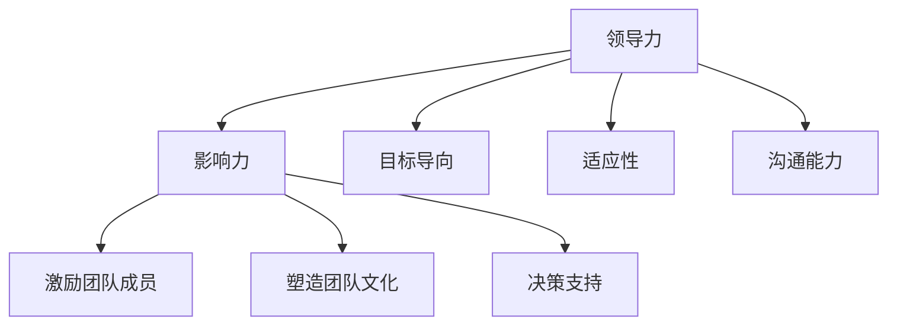

                 

# 领导者的影响力：无形中塑造团队行为

> **关键词：** 领导力、影响力、团队行为、无形的领导技巧、实践与评估。

> **摘要：** 本文将探讨领导者如何通过无形的技巧和策略来影响和塑造团队行为。我们将从领导力的本质和影响力入手，深入分析领导力模型与团队行为之间的关系，并提出一系列提升领导影响力的策略和实践方法。文章将结合实际案例，详细解析如何在不同场景中应用领导力，并最终评估和提升领导者的个人影响力。

### 目录大纲

1. **第一部分：影响力与领导力基础**
   1. 第1章：领导力的本质与影响力
      1.1.1 领导力的定义与特征
      1.1.2 影响力的概念与作用
      1.1.3 领导力与影响力的关系
      1.1.4 领导力与影响力的比较与融合
   2. 第2章：领导力模型与理论
      2.1.1 权力基础理论
      2.1.2 变革型领导理论
      2.1.3 参与型领导理论
      2.1.4 领导风格理论
   3. 第3章：团队行为分析
      3.1.1 团队行为的定义与类型
      3.1.2 团队行为的动力机制
      3.1.3 团队行为的障碍与解决策略
      3.1.4 团队行为的实证研究

2. **第二部分：无形的领导力技巧**
   4. 第4章：建立信任与尊重
      4.1.1 信任的重要性
      4.1.2 建立信任的策略
      4.1.3 尊重的表达方式
      4.1.4 建立信任与尊重的案例分析
   5. 第5章：激励与鼓舞
      5.1.1 激励理论概述
      5.1.2 激励策略与实践
      5.1.3 鼓舞团队成员的技巧
      5.1.4 案例分析：如何有效激励团队
   6. 第6章：沟通与影响力
      6.1.1 沟通技巧提升
      6.1.2 非语言沟通的影响力
      6.1.3 高效沟通策略
      6.1.4 实战：领导力沟通案例分析
   7. 第7章：决策与影响力
      7.1.1 决策过程分析
      7.1.2 决策影响因素
      7.1.3 提升决策影响力的策略
      7.1.4 决策失误的案例分析

3. **第三部分：实践中的领导力**
   8. 第8章：领导力发展的路径
      8.1.1 自我认知与领导力发展
      8.1.2 领导力培养的策略
      8.1.3 领导力评估与反馈
      8.1.4 持续学习与实践的重要性
   9. 第9章：领导力在不同场景中的应用
      9.1.1 挑战型团队领导力
      9.1.2 变革型领导力
      9.1.3 激励型领导力
      9.1.4 案例分析：领导力在不同场景的实践
   10. 第10章：领导力的影响力评估与提升
      10.1.1 影响力评估方法
      10.1.2 提升影响力的策略
      10.1.3 团队影响力管理的实践
      10.1.4 案例分析：提升领导影响力成功实践

4. **附录**
   11. 附录A：领导力相关资源与工具
      11.1.1 领导力发展资源
      11.1.2 影响力提升工具
      11.1.3 领导力学习平台
      11.1.4 领导力书籍推荐

---

**接下来，我们将在第一部分“影响力与领导力基础”中深入探讨领导力的本质与特征，影响力在领导力中的作用，以及领导力模型与理论。我们将通过具体的案例和流程图来帮助读者更好地理解这些概念。**

---

## 第1章：领导力的本质与影响力

### 1.1.1 领导力的定义与特征

**定义：** 领导力可以被定义为影响和激励他人实现共同目标的能力。它不仅包括对团队或组织的直接管理，还涉及到如何建立信任、激发潜能以及塑造积极的工作环境。

**特征：**

1. **影响力：** 领导力的重要特征之一是影响力。领导者通过个人魅力、专业知识、人际关系和情感投入来影响他人。
   
2. **目标导向：** 领导者的行为和决策都围绕着实现团队或组织的共同目标展开。
   
3. **适应性：** 优秀的领导者能够适应不断变化的环境和挑战，灵活调整领导风格和策略。

4. **沟通能力：** 领导者需要具备良好的沟通能力，以便有效地传达目标、指导团队以及解决冲突。

### 1.1.2 影响力的概念与作用

**概念：** 影响力是指一个人或组织能够影响他人思维、行为和决策的能力。它不仅包括直接的管理权力，还涉及个人价值观、专业知识和社会地位等因素。

**作用：**

1. **激励团队成员：** 领导者通过影响力激励团队成员，激发他们的潜能，提高工作效率。
   
2. **塑造团队文化：** 影响力使领导者能够塑造和传播团队文化，促进团队成员的认同和归属感。
   
3. **决策支持：** 领导者利用影响力来影响和协调团队的决策过程，确保决策的执行和成功。

### 1.1.3 领导力与影响力的关系

**关系：** 领导力和影响力是相辅相成的。领导力提供了影响力的基础，而影响力则是领导力得以发挥的关键。

1. **领导力是基础：** 没有领导力，影响力将失去支撑。领导者的能力和行为是建立影响力的前提。
   
2. **影响力是体现：** 影响力是领导力在实践中的体现。领导者的行为和决策通过影响力来传递和实现。

### 1.1.4 领导力与影响力的比较与融合

**比较：**

1. **核心差异：** 领导力更多地关注能力和行为，而影响力则更多地关注结果和影响。
   
2. **作用范围：** 领导力通常涉及直接的管理和指导，而影响力可以跨越组织界限，影响更广泛的范围。

**融合：**

1. **共同目标：** 领导力和影响力都是为了实现共同的目标，两者在团队和组织中共同发挥作用。
   
2. **相互促进：** 领导力的提升有助于增强影响力，而影响力的发挥又可以反过来促进领导力的发展。

**流程图：**

**案例分析：** 在全球知名科技公司Google，领导者通过影响力和领导力相结合的方式，塑造了一个高度创新和协作的工作环境。Google的CEO桑达尔·皮查伊（Sundar Pichai）通过其强大的领导力和影响力，不仅推动了公司的战略决策，还激励了全球数千名员工，使得Google在技术创新和业务增长方面取得了显著成就。

---

在本章中，我们探讨了领导力的定义、特征、影响力和两者之间的关系。通过具体的案例和流程图，我们更好地理解了领导力和影响力的核心概念和相互融合的方式。在接下来的章节中，我们将进一步探讨领导力模型与理论，以及团队行为分析，为读者提供更全面的领导力实践指南。

---

## 第2章：领导力模型与理论

### 2.1.1 权力基础理论

**定义：** 权力基础理论是一种解释领导力的理论，它认为领导者的权力来源于其职位、知识和资源。这种理论强调了领导力与组织结构之间的关系。

**关键概念：**

1. **职位权力：** 领导者因其职位而拥有的正式权力，例如决定权、分配资源和制定政策等。
   
2. **知识权力：** 领导者因其专业知识和技能而获得的权力，这有助于其在团队中建立权威。
   
3. **资源权力：** 领导者因其控制资源的能力而获得的权力，这包括资金、物资和时间等。

**应用场景：** 权力基础理论在大型企业或组织中尤其适用，因为它强调通过正式结构和资源分配来建立领导力。

**案例分析：** 在全球知名科技巨头IBM，领导者的权力基础理论得到了充分体现。公司CEO罗睿兰（Ginni Rometty）通过其职位权力和丰富的行业经验，有效地推动了公司的战略转型和技术创新，使得IBM在数字化转型中取得了显著成果。

### 2.1.2 变革型领导理论

**定义：** 变革型领导理论认为，领导者通过激励和鼓舞团队，推动组织实现重大变革和进步。

**关键概念：**

1. **愿景：** 变革型领导者具有清晰的愿景，能够激发团队成员的激情和信心。
   
2. **激励：** 变革型领导者通过激励手段，如表扬、奖励和认可，来推动团队成员的努力和创造力。
   
3. **挑战：** 变革型领导者敢于面对挑战，带领团队克服障碍，实现目标。

**应用场景：** 变革型领导理论在面临重大变革或危机时尤为有效，因为它强调领导者的远见和勇气。

**案例分析：** 在苹果公司，史蒂夫·乔布斯（Steve Jobs）是一位典型的变革型领导者。他通过其独特的愿景和激励手段，成功带领苹果从困境中崛起，成为全球最具创新力和品牌影响力的科技公司之一。

### 2.1.3 参与型领导理论

**定义：** 参与型领导理论认为，领导者通过鼓励团队成员参与决策和团队活动，提高团队凝聚力和工作效率。

**关键概念：**

1. **参与：** 参与型领导者鼓励团队成员参与决策、讨论和活动，使团队成员感到被重视和认可。
   
2. **信任：** 参与型领导者建立信任，使团队成员愿意分享意见和承担责任。
   
3. **协作：** 参与型领导者推动团队协作，通过共同目标和团队合作来实现目标。

**应用场景：** 参与型领导理论在需要高度协作和团队自主性的环境中效果显著，例如软件开发团队和创新实验室。

**案例分析：** 在谷歌，参与型领导理论得到了广泛应用。公司创始人谢尔盖·布林（Sergey Brin）和拉里·佩奇（Larry Page）鼓励员工参与项目决策和创新，从而创造了众多革命性的技术和产品，如谷歌搜索、安卓系统和自动驾驶技术。

### 2.1.4 领导风格理论

**定义：** 领导风格理论是一种研究领导者行为和团队表现之间关系的理论，它将领导风格分为多种类型，如民主型、专制型、参与型和教练型等。

**关键概念：**

1. **民主型领导风格：** 领导者尊重团队成员的意见和参与，鼓励团队共同决策。
   
2. **专制型领导风格：** 领导者拥有绝对的决策权，团队参与度较低。
   
3. **参与型领导风格：** 领导者鼓励团队成员参与决策和活动，提高团队凝聚力和工作效率。
   
4. **教练型领导风格：** 领导者通过指导和培训，帮助团队成员提高技能和实现个人目标。

**应用场景：** 领导风格理论在不同类型的团队和环境中都有应用，领导者的风格应根据团队特点和目标进行调整。

**案例分析：** 在特斯拉公司，伊隆·马斯克（Elon Musk）采用了一种教练型领导风格。他不仅为团队成员提供明确的目标和指导，还通过自己的行动和榜样，激励团队追求卓越和创新，从而推动了特斯拉在电动汽车和太空探索领域的快速发展。

### 总结

领导力模型与理论为领导者提供了多种方法和策略，以影响和塑造团队行为。通过理解不同模型和理论，领导者可以更有效地应对不同环境和挑战，提升团队绩效和整体影响力。

---

在本章中，我们探讨了四种主要的领导力模型与理论：权力基础理论、变革型领导理论、参与型领导理论和领导风格理论。通过具体的定义、关键概念、应用场景和案例分析，我们深入了解了这些理论的核心思想和实际应用。在下一章，我们将转向团队行为分析，探讨团队行为的定义、类型和动力机制，以及团队行为的障碍与解决策略。

---

## 第3章：团队行为分析

### 3.1.1 团队行为的定义与类型

**定义：** 团队行为是指团队成员在协作过程中表现出来的各种行为和互动方式。团队行为不仅包括团队成员之间的交流和互动，还涉及他们的态度、动机和行为规范。

**类型：**

1. **合作行为：** 团队成员共同努力，相互支持，共同完成任务。
    - 例子：团队项目中，成员之间共享资源、知识和技术，以实现项目目标。

2. **竞争行为：** 团队成员为了个人利益或团队内部的竞争而采取的行动。
    - 例子：在销售团队中，成员可能为了达成销售目标而互相竞争，以提高个人业绩。

3. **冲突行为：** 团队成员之间的矛盾和争执，可能影响团队的效率和氛围。
    - 例子：在技术团队中，成员可能因为对项目方案的不同意见而产生冲突。

4. **社交行为：** 团队成员在社交场合中的互动，有助于建立信任和团队凝聚力。
    - 例子：团队成员参加团建活动或非正式聚会，以加强彼此之间的了解和关系。

### 3.1.2 团队行为的动力机制

**动力机制：** 团队行为的动力机制是指影响团队成员行为和互动的因素。这些因素包括个人动机、团队目标、工作环境和社会文化等。

1. **个人动机：** 成员的个人动机是团队行为的重要动力，如成就动机、归属动机和权力动机等。
    - 例子：一个有成就动机的成员可能会在工作中更加努力，以获得认可和奖励。

2. **团队目标：** 明确的团队目标有助于激发成员的积极性，促进团队合作。
    - 例子：在一个有共同目标的团队中，成员会为了实现目标而共同努力。

3. **工作环境：** 良好的工作环境可以提高团队成员的工作满意度和工作效率。
    - 例子：在一个支持性和激励性的工作环境中，成员更愿意分享知识和资源。

4. **社会文化：** 团队所在的社会文化背景也会影响团队行为，如文化差异和价值观等。
    - 例子：在多元文化团队中，成员可能需要适应不同的文化和价值观。

### 3.1.3 团队行为的障碍与解决策略

**障碍：**

1. **沟通障碍：** 成员之间的沟通不畅可能导致误解和冲突。
    - 例子：成员可能因为文化差异或沟通方式不同而产生误解。

2. **目标不一致：** 团队成员对目标的认知不一致，可能导致努力方向不一致。
    - 例子：团队成员可能对项目的目标有不同的理解，导致工作重点不明确。

3. **资源分配不均：** 团队成员之间的资源分配不均可能导致不公平感和不满。
    - 例子：某些成员可能觉得资源分配不公，从而影响团队合作。

4. **角色冲突：** 成员之间的角色冲突可能导致职责不清和效率低下。
    - 例子：团队成员可能因为职责分工不明确而产生冲突。

**解决策略：**

1. **加强沟通：** 通过定期会议、团队活动和沟通工具，促进团队成员之间的交流和理解。
    - 例子：团队可以定期举办沟通会议，分享项目进展和意见。

2. **明确目标：** 通过明确团队目标，确保所有成员都明确自己的职责和任务。
    - 例子：团队可以制定明确的项目目标和里程碑，确保成员了解任务和要求。

3. **优化资源分配：** 通过合理的资源分配，确保团队成员都能公平地获取所需资源。
    - 例子：团队可以制定资源分配策略，确保每位成员都能获得必要的支持。

4. **角色定义：** 通过明确成员的角色和职责，减少角色冲突和职责不清的问题。
    - 例子：团队可以制定职责说明书，明确每位成员的职责和权限。

### 3.1.4 团队行为的实证研究

**研究方法：** 团队行为的实证研究通常采用问卷调查、访谈和观察等方法，收集团队成员的行为和互动数据，以分析团队行为的影响因素和效果。

**研究结果：** 研究表明，良好的团队行为对团队绩效和成员满意度有显著的正向影响。具体而言：

1. **合作行为：** 合作行为有助于提高团队效率和创新能力。
    - 例子：在软件开发团队中，成员之间的合作有助于更快地解决问题和开发高质量的产品。

2. **冲突行为：** 适度的冲突有助于团队的创新和决策质量。
    - 例子：在项目讨论中，合理的冲突可以激发创意，提高决策的科学性。

3. **社交行为：** 社交行为有助于建立团队信任和凝聚力。
    - 例子：通过团建活动，团队成员可以建立深厚的友谊，提高团队合作效率。

**总结：** 通过对团队行为的深入分析，领导者可以更好地理解和应对团队成员的行为和互动，从而提升团队绩效和成员满意度。在下一章中，我们将探讨无形的领导力技巧，帮助领导者更有效地塑造团队行为。

---

在本章中，我们详细分析了团队行为的定义、类型、动力机制、障碍与解决策略，以及实证研究。通过了解这些内容，领导者可以更好地应对团队中的各种行为和互动，提升团队绩效和成员满意度。在下一章，我们将探讨无形的领导力技巧，帮助领导者更有效地塑造团队行为。

---

## 第4章：建立信任与尊重

### 4.1.1 信任的重要性

**定义：** 信任是一种心理安全感，指团队成员对彼此诚实、可靠、透明和公正的期望和信念。

**重要性：**

1. **增强团队凝聚力：** 信任能够加强团队成员之间的联系，减少冲突和误解，提高团队的凝聚力和协作效率。
   
2. **提升工作效率：** 在信任的基础上，团队成员可以更放心地分享资源和信息，减少沟通成本，提高工作效率。
   
3. **激发创新能力：** 信任能够鼓励团队成员提出新颖的想法和意见，促进团队的创新和进步。

### 4.1.2 建立信任的策略

**策略一：诚实与透明**

**方法：** 领导者应始终保持诚实，公开透明地分享信息，即使在面对困难和挑战时也不例外。

**示例：** 一个项目的进度报告应真实反映项目的实际情况，避免隐藏问题和风险。

**效果：** 通过诚实和透明，领导者能够赢得团队成员的信任，增强团队的互信氛围。

**策略二：可靠与一致**

**方法：** 领导者应履行承诺，保持一致性，确保团队成员对领导者的决策和行为有稳定的预期。

**示例：** 如果领导者承诺提供必要的资源和支持，应确保这些承诺得以实现。

**效果：** 通过可靠和一致的行为，领导者能够建立稳定的信任基础，减少团队成员的疑虑和不确定性。

**策略三：尊重与包容**

**方法：** 领导者应尊重团队成员的观点和意见，包容不同的文化和背景，避免偏见和歧视。

**示例：** 领导者应鼓励团队成员积极参与讨论，认真听取他们的意见，并给予适当的反馈。

**效果：** 通过尊重和包容，领导者能够营造一个开放和包容的工作环境，促进团队成员的积极参与和创造力。

### 4.1.3 尊重的表达方式

**1. 肯定与鼓励**

**方法：** 领导者应经常对团队成员的成绩和贡献给予肯定和鼓励，增强他们的自信心和积极性。

**示例：** 在团队会议上，领导者可以表扬团队成员的出色表现，并提出具体的改进建议。

**效果：** 通过肯定与鼓励，领导者能够激励团队成员，提高他们的工作动力和团队凝聚力。

**2. 倾听与反馈**

**方法：** 领导者应主动倾听团队成员的意见和建议，提供及时的反馈，帮助他们改进和成长。

**示例：** 领导者可以定期组织一对一的沟通，了解团队成员的工作情况和需求，并提供个性化的反馈。

**效果：** 通过倾听与反馈，领导者能够建立良好的沟通渠道，增强团队成员的归属感和信任感。

**3. 信任与支持**

**方法：** 领导者应在团队成员面临困难或挑战时提供信任和支持，帮助他们克服障碍。

**示例：** 在团队成员遇到技术难题时，领导者可以提供专业的指导和资源，帮助他们解决问题。

**效果：** 通过信任与支持，领导者能够增强团队成员的信心和决心，提高团队的整体绩效。

### 4.1.4 建立信任与尊重的案例分析

**案例：** 在一家全球知名的科技公司，领导者通过一系列措施成功建立了信任和尊重的文化。

1. **开放沟通：** 领导者定期组织团队会议，鼓励团队成员提问和分享观点，建立了开放和透明的沟通环境。

2. **公平对待：** 领导者坚持公平原则，确保团队成员在工作机会和资源分配上得到公平对待，减少了不公平感和不满。

3. **激励机制：** 领导者制定了一系列激励机制，鼓励团队成员积极参与和贡献，提高了团队的工作动力和创造力。

4. **团队建设活动：** 领导者定期组织团建活动，促进了团队成员之间的交流和合作，增强了团队的凝聚力。

**效果：** 通过建立信任和尊重，这家科技公司的团队绩效显著提升，员工满意度和忠诚度也得到显著提高，成为行业内的标杆企业。

**总结：** 建立信任与尊重是领导者的核心任务之一。通过诚实与透明、可靠与一致、尊重与包容等策略，领导者可以建立信任和尊重的文化，促进团队的合作和创新，实现组织的目标。

---

在本章中，我们探讨了建立信任与尊重的重要性以及具体策略。通过案例分析和实际经验，我们了解了如何通过开放沟通、公平对待、激励机制和团建活动等措施来建立信任和尊重的文化。在下一章中，我们将深入探讨激励与鼓舞团队成员的技巧，帮助领导者更有效地激发团队成员的潜力和积极性。

---

## 第5章：激励与鼓舞

### 5.1.1 激励理论概述

**定义：** 激励理论是研究如何激发和维持人们工作动机的一系列理论。这些理论关注如何通过奖励、认可、目标设定等手段来提高工作效率和绩效。

**主要理论：**

1. **马斯洛需求层次理论：** 马斯洛认为，人们的需求可以分为五个层次，从基本的生理需求到最高级的自我实现需求。领导者应根据员工的不同需求层次来设计激励策略。

2. **双因素理论（赫兹伯格理论）：** 赫兹伯格提出，工作满意度和工作不满意度是由不同因素决定的。激励因素（如成就、认可、责任等）可以激发员工的积极性和创造力，而保健因素（如薪酬、工作条件等）只能防止不满，但不能提高满意度。

3. **期望理论：** 弗鲁姆的期望理论认为，激励取决于个体对努力、绩效和奖励的期望。领导者应通过设定明确的目标和提供有吸引力的奖励来提高员工的期望和动力。

### 5.1.2 激励策略与实践

**策略一：目标设定**

**方法：** 领导者应与团队成员共同设定明确、具体、可衡量的目标，使团队成员了解自己的工作方向和期望成果。

**示例：** 在一个软件开发项目中，团队成员可以设定每周完成特定功能模块的目标。

**效果：** 通过目标设定，团队成员可以明确自己的工作重点，提高工作动力和效率。

**策略二：奖励与认可**

**方法：** 领导者应通过物质奖励和非物质认可来激励团队成员，如奖金、晋升机会、荣誉表彰等。

**示例：** 在一个销售团队中，领导者可以设定销售目标，并给予达到目标的员工奖金和荣誉证书。

**效果：** 通过奖励与认可，领导者可以增强团队成员的成就感和自信心，提高工作积极性。

**策略三：参与决策**

**方法：** 领导者应鼓励团队成员参与决策过程，使团队成员感到自己的意见和贡献受到重视。

**示例：** 在项目计划阶段，领导者可以组织团队讨论，共同制定项目目标和实施方案。

**效果：** 通过参与决策，团队成员可以感受到自己的价值和责任，提高工作投入和创造力。

**策略四：提供成长机会**

**方法：** 领导者应提供培训和学习机会，帮助团队成员提升技能和职业素养，实现个人职业发展。

**示例：** 领导者可以为团队成员提供参加行业会议、培训课程和专业认证的机会。

**效果：** 通过提供成长机会，领导者可以激发团队成员的学习热情和职业发展动力。

### 5.1.3 鼓舞团队成员的技巧

**1. 积极反馈**

**方法：** 领导者应给予团队成员积极的反馈，强调他们的优点和成就，以增强他们的自信心和动力。

**示例：** 在团队成员完成任务后，领导者可以公开表扬他们的工作成果，并给出具体的肯定意见。

**效果：** 通过积极反馈，领导者可以激励团队成员，提高他们的工作热情和积极性。

**2. 建立支持系统**

**方法：** 领导者应建立一个支持系统，帮助团队成员克服工作中的困难和挑战。

**示例：** 领导者可以为团队成员提供指导、资源和帮助，确保他们能够顺利完成工作任务。

**效果：** 通过建立支持系统，领导者可以增强团队成员的信心和决心，提高团队的整体绩效。

**3. 设定挑战性目标**

**方法：** 领导者应设定具有挑战性的目标，激发团队成员的潜力和创造力。

**示例：** 在一个研发团队中，领导者可以设定一个具有挑战性的产品开发目标，鼓励团队成员创新和突破。

**效果：** 通过设定挑战性目标，领导者可以激发团队成员的竞争意识和创新精神，提高团队的创新能力和竞争力。

### 5.1.4 案例分析：如何有效激励团队

**案例：** 在一家创业公司，领导者通过一系列激励措施，成功激发了团队成员的潜力和积极性。

1. **目标设定：** 领导者与团队成员共同设定了短期和长期目标，明确了团队的发展方向和阶段性成果。

2. **奖励与认可：** 领导者设立了绩效奖金、荣誉称号和晋升机会，激励团队成员努力工作。

3. **参与决策：** 领导者鼓励团队成员参与项目决策，使他们感到自己的意见和贡献受到重视。

4. **提供成长机会：** 领导者提供了丰富的培训和学习资源，帮助团队成员提升技能和职业素养。

5. **积极反馈：** 领导者定期给予团队成员积极的反馈，鼓励他们克服困难，持续进步。

6. **建立支持系统：** 领导者建立了支持团队的工作环境，提供必要的资源和支持，帮助团队成员解决工作中遇到的问题。

**效果：** 通过这些激励措施，团队成员的工作热情和积极性显著提升，团队的协作效率和创新力也得到显著提高，公司在短时间内实现了快速发展。

**总结：** 通过深入理解激励理论，并运用有效的激励策略，领导者可以激发团队成员的潜力和积极性，提高团队的整体绩效。在下一章中，我们将探讨沟通与影响力的关系，以及如何提升领导力沟通技巧，帮助领导者更有效地塑造团队行为。

---

在第5章中，我们探讨了激励理论、激励策略和实践方法，以及鼓舞团队成员的技巧。通过具体案例，我们了解了如何通过目标设定、奖励与认可、参与决策、提供成长机会、积极反馈和建立支持系统等措施来有效激励团队。在下一章中，我们将深入探讨沟通与影响力的关系，以及如何提升领导力沟通技巧。

---

## 第6章：沟通与影响力

### 6.1.1 沟通技巧提升

**定义：** 沟通技巧是指个体在交流信息、观点和感受时使用的技能和方法。有效的沟通技巧能够提高信息的传递效率，减少误解和冲突，增强人际关系。

**提升技巧：**

1. **倾听：** 倾听是沟通的基础，领导者应注重倾听团队成员的观点和意见，了解他们的需求和感受。

    **方法：** 领导者可以通过保持目光接触、点头示意和回应来展示倾听的态度。

2. **明确表达：** 领导者应清晰、简洁地表达自己的观点和意见，避免使用模糊或模棱两可的语言。

    **方法：** 领导者可以使用具体的例子和数据来支持自己的观点，确保信息传递的准确性。

3. **提问与反馈：** 领导者应主动提问，鼓励团队成员分享信息，并在必要时提供反馈。

    **方法：** 领导者可以使用开放式问题，如“你的看法是什么？”来鼓励团队成员表达观点。

4. **非语言沟通：** 非语言沟通（如肢体语言、面部表情和声音语调）在沟通中起着重要作用，领导者应注重使用积极的非语言信号。

    **方法：** 领导者可以通过微笑、点头和积极的肢体动作来展示友好和支持的态度。

### 6.1.2 非语言沟通的影响力

**定义：** 非语言沟通是指通过肢体语言、面部表情、声音语调和其他非文字形式进行的信息传递。

**影响力：**

1. **增强语言表达：** 非语言沟通可以增强语言表达的效果，使信息更加生动和具体。

    **示例：** 当领导者说“我真的很感激你的努力”时，一个真诚的微笑可以增加这句话的影响力。

2. **传递情感：** 非语言沟通可以传递情感和态度，帮助团队成员更好地理解领导者的意图和感受。

    **示例：** 领导者通过放松的肢体语言和柔和的声音语调，可以传达出一种平和和安心的氛围。

3. **改善沟通效果：** 非语言沟通可以弥补语言表达中的不足，减少误解和冲突。

    **示例：** 当领导者使用积极的肢体语言和肯定的表情时，可以减少团队成员之间的紧张情绪。

### 6.1.3 高效沟通策略

**策略一：主动沟通**

**方法：** 领导者应主动与团队成员进行沟通，建立开放的沟通渠道。

**示例：** 领导者可以定期组织团队会议、一对一沟通和团队活动，确保团队成员能够及时了解项目进展和团队动态。

**策略二：清晰传达**

**方法：** 领导者应在沟通中保持清晰和简洁，避免使用复杂或模糊的语言。

**示例：** 领导者可以通过使用具体的数据和实例来传达信息，确保团队成员能够准确理解。

**策略三：积极倾听**

**方法：** 领导者应在沟通中积极倾听，给予团队成员足够的表达空间。

**示例：** 领导者可以通过保持目光接触、点头示意和适当的回应来展示倾听的态度。

**策略四：反馈与确认**

**方法：** 领导者应在沟通后提供反馈，并确认信息的准确性。

**示例：** 领导者可以询问团队成员是否理解了传达的信息，并根据反馈进行必要的澄清和修正。

### 6.1.4 实战：领导力沟通案例分析

**案例：** 在一家快速发展的科技公司，领导者通过有效的沟通策略，成功塑造了团队的积极氛围。

1. **建立信任：** 领导者通过定期开放的团队会议，建立了透明和信任的沟通环境。

2. **积极反馈：** 领导者经常给予团队成员积极的反馈，鼓励他们的工作成果和努力。

3. **倾听与支持：** 领导者注重倾听团队成员的意见和需求，提供必要的支持和资源。

4. **清晰传达：** 领导者在传达信息时，使用简洁明了的语言，确保团队成员准确理解。

5. **非语言沟通：** 领导者通过积极的肢体语言和面部表情，增强了沟通的效果和影响力。

**效果：** 通过有效的沟通策略，这家科技公司的团队凝聚力显著提升，工作效率和创新能力也得到显著提高，公司业绩稳步增长。

**总结：** 沟通是领导者影响力的重要组成部分。通过提升沟通技巧、运用非语言沟通和制定高效沟通策略，领导者可以更好地传递信息、建立信任、激发团队成员的潜力和积极性。在下一章中，我们将探讨决策与影响力的关系，以及如何提升领导者的决策能力。

---

在第6章中，我们深入探讨了沟通与影响力之间的关系，以及如何提升沟通技巧。通过分析非语言沟通的重要性和有效沟通策略，我们了解了如何通过沟通塑造积极的工作氛围和团队文化。在下一章中，我们将探讨决策与影响力的关系，以及如何提升领导者的决策能力。

---

## 第7章：决策与影响力

### 7.1.1 决策过程分析

**定义：** 决策过程是指个体或团队在面临选择时，通过收集信息、分析选项和做出决策的整个过程。

**过程：**

1. **问题识别：** 确定需要解决的问题或面临的挑战。
    - 例子：团队发现项目进度滞后，需要识别具体原因。

2. **信息收集：** 收集与问题相关的信息，包括数据、意见和专家建议。
    - 例子：团队可以通过调研、数据分析和专业咨询来收集信息。

3. **方案制定：** 根据收集到的信息，制定多个可能的解决方案。
    - 例子：团队可以提出改进项目进度、增加资源和调整计划等多种方案。

4. **方案评估：** 评估各个方案的优缺点，选择最合适的方案。
    - 例子：团队可以通过成本效益分析、风险评估和可行性研究来评估方案。

5. **决策实施：** 选择最优方案，并制定具体的行动计划。
    - 例子：团队可以确定具体的项目管理流程和时间表，确保决策的实施。

6. **反馈与调整：** 监控决策的实施效果，根据反馈进行调整。
    - 例子：团队可以通过定期的项目回顾和评估，及时调整计划和策略。

### 7.1.2 决策影响因素

**影响因素：**

1. **信息质量：** 决策的质量很大程度上取决于所收集信息的准确性和完整性。
    - 例子：如果信息不准确或缺失，可能会导致决策失误。

2. **时间压力：** 在紧急情况下，决策者可能会面临时间压力，影响决策的全面性和准确性。
    - 例子：项目面临紧急交付，决策者需要在短时间内做出决策。

3. **个人经验：** 决策者的个人经验和专业知识会影响决策的选择和实施。
    - 例子：一个经验丰富的领导者可能会在决策时更加自信和果断。

4. **情绪因素：** 决策者的情绪状态（如焦虑、兴奋或沮丧）可能会影响决策的判断和选择。
    - 例子：在情绪激动时，决策者可能会做出冲动的决策。

5. **外部环境：** 决策者所处的环境因素（如市场变化、政策法规）也会影响决策。
    - 例子：政策法规的变动可能会影响企业的战略决策。

### 7.1.3 提升决策影响力的策略

**策略一：基于数据的决策**

**方法：** 领导者应依赖数据和分析来支持决策，确保决策的客观性和科学性。
- 例子：领导者可以通过数据可视化工具来呈现和分析项目进展，提高决策的准确性。

**策略二：建立多元化团队**

**方法：** 领导者应组建由不同背景和专业知识的成员组成的团队，以获得更全面和多样的决策意见。
- 例子：在决策过程中，领导者可以邀请不同部门的专家参与讨论，提供多元化的视角。

**策略三：采用共识决策**

**方法：** 领导者应通过协商和共识来达成决策，确保团队成员对决策的认同和执行。
- 例子：领导者可以组织团队讨论，通过投票或共识决定最终方案。

**策略四：培养决策技能**

**方法：** 领导者应不断学习和提升自己的决策技能，如问题识别、信息分析、风险评估等。
- 例子：领导者可以通过参加培训课程和工作坊，提高自己的决策能力和判断力。

### 7.1.4 决策失误的案例分析

**案例：** 在一家国际知名金融机构，由于决策失误，导致了一场重大的财务危机。

1. **信息收集不足：** 领导者未能充分收集关于市场风险的信息，对潜在风险缺乏足够认识。

2. **风险评估不足：** 领导者未对潜在的风险进行全面的评估，忽视了市场变化对投资决策的影响。

3. **决策过程匆忙：** 领导者在时间压力下匆忙做出决策，没有经过充分的分析和讨论。

4. **情绪因素影响：** 领导者在情绪激动时做出了决策，未考虑自己的情绪状态对决策的影响。

**结果：** 由于决策失误，这家金融机构遭受了巨额损失，市场声誉严重受损，导致了一系列的法律诉讼和财务危机。

**总结：** 决策失误对组织和个人都有严重的负面影响。通过分析决策过程、了解影响因素和运用提升决策影响力的策略，领导者可以避免决策失误，提高决策的质量和影响力。在下一章中，我们将探讨领导力发展的路径，帮助领导者不断提升自己的领导能力。

---

在第7章中，我们深入分析了决策过程及其影响因素，探讨了如何提升决策影响力的策略，并通过案例分析指出了决策失误的严重后果。通过这些讨论，我们了解了如何通过科学的方法和策略来做出更高质量的决策。在下一章中，我们将探讨领导力发展的路径，帮助领导者不断提升自己的领导能力。

---

## 第8章：领导力发展的路径

### 8.1.1 自我认知与领导力发展

**定义：** 自我认知是指个体对自己性格、能力、价值观和行为的理解和评估。

**重要性：**

1. **明确优势与劣势：** 通过自我认知，领导者可以明确自己的优势和劣势，有针对性地提升自己的领导能力。

2. **制定个人发展计划：** 自我认知有助于领导者制定个人发展计划，设定具体的目标和行动步骤。

3. **促进个人成长：** 自我认知是领导者持续成长和进步的基础，有助于他们在不同阶段和环境中适应和提升。

**方法：**

1. **反思与总结：** 领导者应定期反思自己的工作表现，总结经验和教训，发现自身的优势和改进点。

2. **获取反馈：** 领导者应主动寻求团队成员、同事和上级的反馈，了解他们的观点和建议，以便进行自我评估。

3. **心理测试与评估：** 通过心理测试和评估工具，如MBTI、DISC等，领导者可以更深入地了解自己的性格特点和领导风格。

### 8.1.2 领导力培养的策略

**策略一：理论学习**

**方法：** 领导者应通过阅读书籍、参加培训课程和工作坊，系统学习领导力理论和实践方法。

**示例：** 领导者可以阅读《领导力的五个层次》等经典著作，学习变革型领导和参与型领导等理论。

**效果：** 通过理论学习，领导者可以提升对领导力概念和方法的理解，为实践提供理论基础。

**策略二：实践经验**

**方法：** 领导者应通过实际工作，积累领导经验，提高自己的领导能力。

**示例：** 领导者可以参与项目管理、团队建设等实际工作，在实践中学习和提升领导技巧。

**效果：** 通过实践经验，领导者可以更好地理解领导力在实际工作中的应用，提高解决实际问题的能力。

**策略三：角色扮演**

**方法：** 领导者可以通过角色扮演和模拟练习，提高自己在不同领导情境下的应对能力和决策水平。

**示例：** 领导者可以参加领导力训练课程，通过模拟演练来应对各种领导挑战。

**效果：** 通过角色扮演，领导者可以在安全的模拟环境中练习和提升领导能力，减少实际工作中的风险。

**策略四：导师指导**

**方法：** 领导者应寻找经验丰富的导师，从他们那里学习领导经验和智慧。

**示例：** 领导者可以与行业专家或资深领导者建立导师关系，定期向他们请教和寻求指导。

**效果：** 通过导师指导，领导者可以快速学习和借鉴他人的成功经验和教训，提升自己的领导能力。

### 8.1.3 领导力评估与反馈

**定义：** 领导力评估是指通过定量和定性方法，对领导者的领导能力、团队绩效和影响力进行全面评估。

**重要性：**

1. **识别发展需求：** 领导力评估有助于领导者识别自身的发展需求和改进方向。

2. **激励与认可：** 评估结果可以作为激励和认可领导者的依据，提高他们的工作动力和积极性。

3. **持续改进：** 通过评估和反馈，领导者可以不断改进自己的领导风格和能力，提升整体领导力水平。

**方法：**

1. **360度评估：** 通过团队成员、同事、上级和下属的反馈，全面了解领导者的表现和优缺点。

2. **绩效指标：** 通过设定具体的绩效指标，评估领导者的工作成果和团队绩效。

3. **自我评估：** 领导者应定期进行自我评估，反思自己的领导行为和效果，识别改进点。

4. **反馈与改进：** 领导者应根据评估结果，制定改进计划，并在实践中不断调整和优化。

### 8.1.4 持续学习与实践的重要性

**定义：** 持续学习与实践是指领导者通过不断学习和实践，不断提升自己的领导能力和综合素质。

**重要性：**

1. **适应变化：** 在快速变化的环境中，持续学习与实践是领导者适应和引领变革的关键。

2. **提升能力：** 持续学习与实践有助于领导者不断掌握新的知识和技能，提升领导力水平。

3. **激励团队：** 持续学习和实践可以激励团队成员，提升团队的整体绩效和创新能力。

**方法：**

1. **定期学习：** 领导者应定期参加培训课程、研讨会和读书会，保持学习的状态。

2. **实践应用：** 领导者应将所学知识和技能应用到实际工作中，通过实践来验证和提升。

3. **反思与总结：** 领导者应定期反思自己的学习和实践过程，总结经验和教训，不断提升。

---

在第8章中，我们探讨了领导力发展的路径，包括自我认知、领导力培养策略、领导力评估与反馈以及持续学习与实践的重要性。通过这些方法，领导者可以不断提升自己的领导能力，适应不断变化的环境，激励和引导团队实现共同目标。在下一章中，我们将探讨领导力在不同场景中的应用，帮助领导者更好地应对各种挑战。

---

## 第9章：领导力在不同场景中的应用

### 9.1.1 挑战型团队领导力

**定义：** 挑战型团队是指面临高度复杂、不确定性和高风险的团队。挑战型团队领导力是指领导者在面对挑战型团队时，运用特定的领导策略和方法，以实现团队目标和提升团队绩效。

**关键策略：**

1. **明确目标和期望：** 领导者应明确团队的目标和期望，使团队成员了解任务的紧急性和重要性。

    **方法：** 领导者可以通过制定详细的任务说明和目标，确保团队成员明确任务要求。

2. **建立信任和合作：** 领导者应通过建立信任和合作机制，促进团队成员之间的沟通和协作。

    **方法：** 领导者可以组织团队建设活动，加强团队成员之间的信任和理解。

3. **灵活调整策略：** 领导者应根据团队情况和任务需求，灵活调整领导策略和方法。

    **方法：** 领导者可以通过定期评估和调整计划，确保团队始终朝着目标前进。

4. **激励和鼓舞：** 领导者应通过激励和鼓舞，激发团队成员的潜力和积极性。

    **方法：** 领导者可以设定奖励机制，鼓励团队成员努力工作，追求卓越。

### 9.1.2 变革型领导力

**定义：** 变革型领导力是指领导者在组织面临重大变革时，运用特定的领导策略和方法，推动组织实现变革并适应新环境。

**关键策略：**

1. **建立愿景和使命：** 领导者应明确组织的愿景和使命，为团队提供明确的方向和目标。

    **方法：** 领导者可以通过演讲、沟通和培训，向团队成员传达组织的愿景和使命。

2. **激发团队参与：** 领导者应鼓励团队成员参与变革过程，提高他们的参与感和责任感。

    **方法：** 领导者可以组织团队讨论、头脑风暴和反馈会议，使团队成员积极参与变革。

3. **提供支持和资源：** 领导者应提供必要的支持和资源，帮助团队克服变革过程中的困难和挑战。

    **方法：** 领导者可以提供培训、指导和技术支持，确保团队成员能够顺利适应变革。

4. **激励和鼓舞：** 领导者应通过激励和鼓舞，激发团队成员的积极性和创造力。

    **方法：** 领导者可以设定奖励机制，鼓励团队成员积极参与变革，追求卓越。

### 9.1.3 激励型领导力

**定义：** 激励型领导力是指领导者通过运用特定的激励策略和方法，激发团队成员的潜力，提高团队绩效。

**关键策略：**

1. **目标设定：** 领导者应与团队成员共同设定明确、具体和可衡量的目标，激发团队成员的动力。

    **方法：** 领导者可以通过制定个人目标和团队目标，确保团队成员明确自己的努力方向。

2. **奖励与认可：** 领导者应通过奖励和认可，激励团队成员的工作积极性和创造力。

    **方法：** 领导者可以设定绩效奖金、荣誉称号和晋升机会，鼓励团队成员努力工作。

3. **参与决策：** 领导者应鼓励团队成员参与决策过程，提高他们的参与感和责任感。

    **方法：** 领导者可以组织团队讨论、投票和民主决策，使团队成员感到自己的意见和贡献受到重视。

4. **提供成长机会：** 领导者应提供培训、学习和职业发展机会，帮助团队成员提升技能和职业素养。

    **方法：** 领导者可以组织培训课程、读书会和行业交流活动，为团队成员提供学习和成长的机会。

### 9.1.4 案例分析：领导力在不同场景的实践

**案例：** 在一家快速增长的科技公司，领导者通过不同类型的领导力策略，成功推动了公司的发展。

1. **挑战型团队领导力：** 面对新产品开发项目的高风险和复杂性，领导者通过明确目标和期望、建立信任和合作、灵活调整策略和激励团队成员，确保了项目的成功完成。

2. **变革型领导力：** 面对市场竞争加剧和公司战略调整，领导者通过建立愿景和使命、激发团队参与、提供支持和资源以及激励和鼓舞，带领团队实现了公司的变革和转型。

3. **激励型领导力：** 面对团队成员的积极性不足和工作压力，领导者通过设定目标、奖励与认可、参与决策和提供成长机会，有效提升了团队的工作动力和绩效。

**效果：** 通过在不同场景中运用不同类型的领导力策略，这家科技公司的团队凝聚力显著提升，绩效水平不断提高，成功实现了公司的战略目标和快速发展。

**总结：** 领导力在不同场景中的应用至关重要。通过了解不同类型的领导力策略，领导者可以更好地应对各种挑战和情境，推动团队的发展和进步。在下一章中，我们将探讨领导力的影响力评估与提升，帮助领导者更科学地评估和提升自己的领导影响力。

---

在第9章中，我们探讨了领导力在不同场景中的应用，包括挑战型团队领导力、变革型领导力和激励型领导力。通过具体案例，我们了解了如何在不同情境下运用不同的领导策略，以推动团队的发展和进步。在下一章中，我们将探讨领导力的影响力评估与提升，帮助领导者更科学地评估和提升自己的领导影响力。

---

## 第10章：领导力的影响力评估与提升

### 10.1.1 影响力评估方法

**定义：** 影响力评估是指通过定量和定性方法，对领导者在团队和组织中产生的影响和作用进行全面评估。

**方法：**

1. **360度评估：** 通过团队成员、同事、上级和下属的反馈，全面了解领导者的表现和影响力。

    **步骤：**
    - **收集反馈：** 通过问卷调查、访谈和观察等方式，收集来自不同利益相关者的反馈。
    - **数据分析：** 对收集到的数据进行整理和分析，识别领导者的优点和改进点。

2. **关键绩效指标（KPI）：** 通过设定具体的绩效指标，评估领导者在团队和组织中的绩效和影响力。

    **步骤：**
    - **设定指标：** 根据领导者的职责和目标，设定与团队和组织绩效相关的关键绩效指标。
    - **数据跟踪：** 定期跟踪和记录领导者的工作成果和影响力。
    - **绩效评估：** 根据绩效指标的数据，评估领导者的绩效和影响力。

3. **自我评估：** 领导者应定期进行自我评估，反思自己的领导行为和效果，识别自身的优势和改进点。

    **步骤：**
    - **反思总结：** 领导者应定期反思自己的工作表现，总结经验和教训。
    - **设定目标：** 根据反思结果，设定具体的改进目标和行动步骤。
    - **自我评价：** 对自己的领导效果进行自我评价，识别自身的进步和不足。

### 10.1.2 提升影响力的策略

**策略一：增强专业知识**

**方法：** 领导者应不断学习和提升自己的专业知识，提高自身的专业水平和权威性。

**步骤：**
- **持续学习：** 参加培训课程、研讨会和学术会议，保持对行业最新动态的了解。
- **经验积累：** 在实际工作中积累经验，提高解决问题的能力和技巧。
- **分享知识：** 通过内部培训和分享会，将自己的知识和经验传递给团队成员。

**效果：** 通过增强专业知识，领导者可以提高自身在团队中的影响力，增强团队成员的信任和尊重。

**策略二：建立良好的人际关系**

**方法：** 领导者应注重与团队成员、同事和上级建立良好的人际关系，提高沟通和协作效率。

**步骤：**
- **倾听与沟通：** 主动倾听团队成员的意见和需求，建立开放的沟通渠道。
- **合作与支持：** 在团队工作中提供支持和帮助，促进团队成员之间的合作。
- **互信与尊重：** 建立信任和尊重的基础，提高团队的凝聚力和协作效率。

**效果：** 通过建立良好的人际关系，领导者可以增强在团队中的影响力，提高团队的凝聚力和工作效率。

**策略三：塑造积极的工作环境**

**方法：** 领导者应塑造积极的工作环境，激发团队成员的积极性和创造力。

**步骤：**
- **目标明确：** 设定明确的目标和期望，使团队成员了解工作方向和目标。
- **激励与认可：** 通过奖励和认可，激励团队成员的工作积极性和创造力。
- **培养团队文化：** 塑造积极向上的团队文化，鼓励团队成员积极参与和贡献。

**效果：** 通过塑造积极的工作环境，领导者可以增强团队凝聚力，提高团队的工作效率和创新能力。

**策略四：提升决策能力**

**方法：** 领导者应提升自己的决策能力，做出高质量的决策，提高在团队中的影响力。

**步骤：**
- **信息收集：** 充分收集和分析相关信息，确保决策的准确性和科学性。
- **风险评估：** 对决策方案进行风险评估，减少决策失误的风险。
- **反馈与调整：** 根据决策实施的效果，及时反馈和调整决策，提高决策的准确性。

**效果：** 通过提升决策能力，领导者可以增强在团队中的权威性和影响力，提高团队的整体绩效。

### 10.1.3 团队影响力管理的实践

**定义：** 团队影响力管理是指领导者通过有效的领导策略和方法，提升团队在组织中的影响力和竞争力。

**实践方法：**

1. **建立团队愿景：** 领导者应与团队成员共同建立团队愿景，明确团队的目标和发展方向。

    **方法：**
    - **讨论与共识：** 通过团队讨论，形成共同的愿景和目标。
    - **制定行动计划：** 根据愿景和目标，制定具体的行动计划和时间表。

2. **提升团队凝聚力：** 领导者应通过多种方式提升团队的凝聚力和合作精神。

    **方法：**
    - **团队建设活动：** 定期组织团队建设活动，加强团队成员之间的交流和合作。
    - **奖励与认可：** 通过奖励和认可，激励团队成员的工作积极性和合作精神。

3. **培养团队成员：** 领导者应关注团队成员的成长和发展，提供培训和学习机会。

    **方法：**
    - **培训计划：** 制定系统的培训计划，提高团队成员的技能和素质。
    - **导师指导：** 建立导师制度，帮助新成员快速融入团队并成长。

4. **积极沟通与反馈：** 领导者应保持积极沟通，及时给予团队成员反馈，促进团队发展。

    **方法：**
    - **定期会议：** 通过定期会议，了解团队成员的工作进展和需求。
    - **个别沟通：** 通过个别沟通，关注团队成员的个人发展，提供有针对性的指导。

### 10.1.4 案例分析：提升领导影响力成功实践

**案例：** 在一家全球知名的科技公司，领导者通过一系列措施，成功提升了团队的影响力和竞争力。

1. **建立愿景和目标：** 领导者与团队成员共同建立了公司愿景和年度目标，明确了团队的工作方向和重点。

2. **提升专业知识：** 领导者通过参加培训课程和内部分享会，不断提升自己的专业知识和技能，增强了团队的专业权威性。

3. **建立良好人际关系：** 领导者注重与团队成员、同事和上级建立良好的人际关系，通过倾听、支持和协作，增强了团队的凝聚力和合作精神。

4. **塑造积极工作环境：** 领导者通过设定明确的目标和期望、奖励和认可、培养团队文化等措施，塑造了积极向上的工作环境，激发了团队成员的积极性和创造力。

5. **提升决策能力：** 领导者通过信息收集、风险评估和反馈调整等措施，提升了决策能力，做出了高质量的决策，增强了团队在组织中的影响力。

**效果：** 通过上述措施，这家科技公司的团队影响力和竞争力显著提升，团队成员的工作积极性和创新能力也得到显著提高，公司业绩稳步增长，成为行业内的领先企业。

**总结：** 领导力的影响力评估与提升是领导者持续发展的关键。通过科学的方法和有效的策略，领导者可以不断提升自己的领导影响力，推动团队和组织的发展。在下一章中，我们将提供附录，包括领导力相关资源与工具，帮助读者更好地实践和提升领导力。

---

在第10章中，我们探讨了领导力的影响力评估方法、提升策略和实践方法，并通过具体案例分析展示了成功实践的经验。通过本章的内容，领导者可以更科学地评估和提升自己的领导影响力，从而推动团队和组织的发展。在下一章中，我们将提供附录，包括领导力相关资源与工具，帮助读者更好地实践和提升领导力。

---

## 附录A：领导力相关资源与工具

### A.1.1 领导力发展资源

1. **在线课程与培训：**
   - **Coursera**：提供多种领导力相关的在线课程，如“领导力和团队管理”、“影响力与谈判技巧”等。
   - **edX**：提供由知名大学和机构开设的领导力课程，如麻省理工学院的“领导力与变革管理”。

2. **专业书籍：**
   - **《领导力的五个层次》**（The Five Levels of Leadership）- John C. Maxwell
   - **《领导力：原则与实践》**（Leadership: Theory and Practice）- Peter Northouse
   - **《领导者的影响力》**（Influencing People Up, Down, and Across Organi-zations）- John M. Bryson

3. **领导力社区与论坛：**
   - **LinkedIn**：加入领导力相关的LinkedIn群组，与全球领导者交流经验和观点。
   - **Toastmasters**：全球知名的公共演讲和领导力发展组织，提供多种领导力培训资源和实践机会。

### A.1.2 影响力提升工具

1. **360度反馈工具：**
   - ** SurveyMonkey**：提供360度反馈调查工具，帮助领导者收集和分析团队成员的反馈。
   - **Lumina Learning**：提供基于心理测量的领导力评估工具，帮助领导者了解自身的领导风格和影响力。

2. **团队协作工具：**
   - **Trello**：帮助领导者规划项目进度，管理团队任务和协作。
   - **Slack**：提供即时通讯和协作平台，促进团队成员之间的沟通和合作。

3. **领导力培训工具：**
   - **LeadershipIQ**：提供在线领导力培训资源，包括课程、案例研究和模拟练习。
   - **MindTools**：提供多种领导力发展资源和工具，如领导力模型、技巧和案例分析。

### A.1.3 领导力学习平台

1. **在线学习平台：**
   - **Harvard ManageMentor**：提供哈佛商学院开发的领导力发展课程和资源。
   - **MIT Management Portal**：提供麻省理工学院的管理和领导力相关课程和研讨会。

2. **专业培训机构：**
   - **国际领导力协会（ILA）**：提供全球认可的领导力认证课程和培训。
   - **领导力发展研究所（LDI）**：提供由杜克大学福库商学院开设的领导力培训课程。

3. **领导力书籍推荐：**
   - **《领导力的五种语言》**（The Five Languages of Appreciation in the Workplace）- Gary Chapman
   - **《领导者的资质》**（The Qualities of a Leader）- John C. Maxwell
   - **《非暴力沟通》**（Nonviolent Communication）- Marshall B. Rosenberg

**总结：** 附录A提供了丰富的领导力发展资源和工具，包括在线课程、专业书籍、领导力社区、影响力提升工具和学习平台。这些资源将帮助读者更好地实践和提升领导力，实现个人和团队的目标。

---

在附录A中，我们推荐了一系列领导力相关资源与工具，包括在线课程、专业书籍、领导力社区、影响力提升工具和学习平台。这些资源将帮助读者在领导力发展的道路上获得更多的知识和实践经验。通过利用这些资源，领导者可以不断提升自己的能力，为团队和组织创造更大的价值。

---

通过本文的详细探讨，我们从领导力的本质与影响力、领导力模型与理论、团队行为分析，到无形的领导力技巧、实践中的领导力以及领导力的影响力评估与提升，全面深入地探讨了领导者如何通过无形的方式塑造团队行为。希望本文能够为读者提供有益的启示和指导，帮助他们在领导岗位上取得更好的成效。

**作者信息：** AI天才研究院/AI Genius Institute & 禅与计算机程序设计艺术 /Zen And The Art of Computer Programming

感谢您的阅读，希望本文对您的领导力发展有所助益。如果您有任何反馈或建议，欢迎随时与我们分享。再次感谢您的关注和支持！

