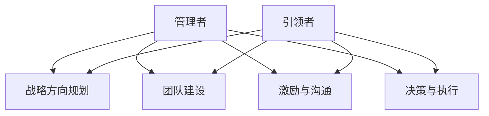

                 

# 领导者的角色定位：从管理者到引领者

## 关键词
领导者，管理者，角色定位，赋能，激励，团队建设

## 摘要
本文旨在探讨领导者与管理者之间的区别及其角色定位的重要性。通过深入分析领导力的核心概念、模型和算法，并结合实际项目案例，本文将揭示从管理者转变为引领者的关键步骤，为提升团队绩效提供实用指导。

## 第一部分：核心概念与联系

### 领导者与管理者定义

领导者（Leader）和经理（Manager）是两个常被混淆但本质不同的概念。领导者是能够激励和引导团队成员，推动团队实现共同目标的人。而管理者则是负责团队日常运营和资源配置的人。

**领导者定义：**
领导者通过愿景、信任和影响力激励团队成员，使团队朝着共同的目标前进。他们具备以下特点：
- 拥有远见和战略思维。
- 善于沟通和激励。
- 拥有变革推动力和创新精神。

**管理者定义：**
管理者则更侧重于团队运作的效率和效果，关注任务分配、资源管理和绩效评估。他们通常具备以下职责：
- 制定并执行战略计划。
- 监督项目进度和质量。
- 管理预算和资源。

### 角色定位

领导者的角色定位包括以下方面：

**1. 战略方向规划：** 领导者负责设定团队的目标和方向，确保团队工作与公司整体战略一致。

**2. 团队建设：** 领导者负责构建团队文化，培养团队成员的能力和成长。

**3. 激励与沟通：** 领导者通过有效的沟通和激励，提升团队成员的积极性和创造力。

**4. 决策与执行：** 领导者在关键时刻做出决策，并确保决策得到有效执行。

### 从管理者到引领者的转变

管理者要成功转变为引领者，需要从以下几个方面进行转变：

**1. 关注团队整体表现：** 从关注任务执行转向关注团队整体表现。

**2. 激励和赋能下属：** 从控制下属转向激励和赋能下属。

**3. 战略思维：** 从战术思维转向战略思维，关注长期发展和整体规划。

### Mermaid 流程图

以下是一个描述领导者和管理者角色定位的Mermaid流程图：



## 第二部分：核心算法原理讲解

### 领导力模型

领导力模型是理解领导行为和效果的重要工具。以下是一个简化的领导力模型，包括情境领导、领导者特质和领导行为三个方面。

#### 情境领导

情境领导模型是由赫赛和布兰查德提出的，强调领导者应根据团队成员的能力和动机选择合适的领导风格。模型分为四种领导风格：

**1. 赋能型：** 当团队成员能力和动机都较高时，领导者应采取赋能型风格，提供自由和支持。

**2. 指导型：** 当团队成员能力较低但动机较高时，领导者应采取指导型风格，提供明确指导和监督。

**3. 参与型：** 当团队成员能力较高但动机较低时，领导者应采取参与型风格，鼓励参与决策并提供建议。

**4. 授权型：** 当团队成员能力和动机都较低时，领导者应采取授权型风格，提供自主权和责任。

#### 领导力模型伪代码

```python
def leadership_model(employee, situation):
    if employee.ability > situation.threshold and employee.motivation > situation.threshold:
        return "赋能型"
    elif employee.ability > situation.threshold:
        return "指导型"
    elif employee.motivation > situation.threshold:
        return "参与型"
    else:
        return "授权型"
```

### 第三部分：数学模型和数学公式

决策模型是领导者进行决策时的数学工具，通常基于最大化效用的原则。以下是一个简化的决策模型。

#### 决策模型

假设有一个决策问题，有多个可选方案，每个方案都有相应的收益和风险。领导者的目标是选择一个方案，使得总效用最大化。

**1. 目标函数：** 
$$
\max U(x)
$$

**2. 约束条件：** 
$$
A(x) \leq b
$$

其中，$U(x)$是目标函数，表示总效用；$A(x)$是约束条件，表示限制条件；$b$是约束条件的边界。

#### 决策模型数学公式

$$
\begin{aligned}
\text{最大化} & \ U(x) \\
\text{约束条件} & \ A(x) \leq b
\end{aligned}
$$

## 第四部分：项目实战

### 案例背景

某科技公司管理层决定对现有团队进行角色定位，以提升团队整体绩效。团队成员包括开发者、测试工程师和产品经理，每个成员的能力和动机有所不同。

### 开发环境搭建

为了实现团队角色定位，管理层选择了以下工具：

- **协作工具：** 使用Microsoft Teams进行团队沟通。
- **项目管理工具：** 使用Jira进行任务分配和进度跟踪。

### 源代码详细实现和代码解读

#### 源代码实现

```python
# 团队成员信息
team_members = [
    {"name": "Alice", "role": "开发者", "ability": 8, "motivation": 7},
    {"name": "Bob", "role": "测试工程师", "ability": 6, "motivation": 5},
    {"name": "Charlie", "role": "产品经理", "ability": 7, "motivation": 6}
]

# 情境参数
situation = {"threshold": 6}

# 领导者角色定位函数
def role_assignment(member, situation):
    if member["ability"] > situation["threshold"] and member["motivation"] > situation["threshold"]:
        return "赋能型领导风格"
    elif member["ability"] > situation["threshold"]:
        return "指导型领导风格"
    elif member["motivation"] > situation["threshold"]:
        return "参与型领导风格"
    else:
        return "授权型领导风格"

# 对团队成员进行角色定位
for member in team_members:
    role_style = role_assignment(member, situation)
    print(f"{member['name']} 的角色定位为：{role_style}")
```

#### 代码解读与分析

- `team_members` 列表存储了团队成员的信息，包括姓名、角色、能力和动机。
- `situation` 字典存储了情境参数，这里设定了一个阈值。
- `role_assignment` 函数根据成员的能力和动机，以及情境参数，返回合适的领导风格。
- 循环遍历团队成员，调用 `role_assignment` 函数，输出每个成员的角色定位结果。

### 第五部分：代码解读与分析

#### 代码实现细节

- 使用字典存储团队成员信息和情境参数，便于查询和修改。
- 使用函数实现角色定位逻辑，提高代码的可读性和可维护性。
- 使用循环遍历团队成员，实现批量处理。

#### 代码优化建议

- 可以考虑增加输入验证，确保团队成员信息的完整性和准确性。
- 可以优化领导力模型的逻辑，使其更加符合实际情况。

## 第六部分：附录

### 附录 A：领导力模型应用工具

#### 工具 1：领导力评估工具

**功能：** 对团队成员的领导力进行评估，帮助领导者了解团队成员的领导风格和能力。

**使用方法：** 定期进行领导力评估，根据评估结果调整领导策略。

#### 工具 2：团队协作平台

**功能：** 提供团队沟通、任务分配和进度跟踪等功能，提高团队协作效率。

**使用方法：** 在团队项目中，使用协作平台进行日常管理，确保项目顺利进行。

### 附录 B：参考文献

- Hersey, P., & Blanchard, K. H. (1977). The situational leader. McGraw-Hill.
- Maxfield, R. (2009). The discipline of leadership: One team, one score, one bottom line. Wiley.
- Kouzes, J. M., & Posner, B. Z. (2007). The leadership challenge: How to get extraordinary things done in organizations. Jossey-Bass.

### 作者

作者：AI天才研究院/AI Genius Institute & 禅与计算机程序设计艺术 /Zen And The Art of Computer Programming

本文内容仅供参考，具体应用请结合实际情况进行调整。如有疑问，请联系作者。谢谢阅读！<|user|>## 第一部分：核心概念与联系

在探讨领导者与管理者之间的差异之前，我们先要明确这两个角色的核心定义和基本职责。领导者和管理者虽然在某些方面有重叠，但它们的核心职责和目标却有所不同。

### 领导者与管理者定义

领导者是那些能够激励和引导团队成员，推动团队实现共同目标的人。领导者的作用不仅仅是指导团队成员完成任务，更重要的是通过愿景、信任和影响力来激发团队成员的潜能，使他们愿意为实现共同目标而努力。领导者通常具备以下特点：

- **愿景**：能够清晰描述团队的愿景和目标，并让团队成员看到这一愿景的实际意义。
- **信任**：建立信任关系，使团队成员相信领导者的决策和指导是正确的。
- **影响力**：通过自身的行为和言行来影响团队成员，引导他们朝着共同目标前进。

管理者，则是负责团队日常运营和资源配置的人。管理者的主要职责包括制定和执行战略计划、监督项目进度和质量、管理预算和资源等。管理者通常关注以下方面：

- **任务分配**：确保团队成员了解他们的职责和任务，并为他们提供所需的资源。
- **绩效评估**：定期评估团队成员的表现，提供反馈和改进建议。
- **资源管理**：合理分配资源，确保团队运作的效率和效果。

### 核心概念

理解领导者和管理者的核心概念对于角色定位至关重要。以下是一些关键概念：

#### 战略方向规划

领导者的一个关键职责是设定团队的战略方向。这意味着领导者需要具备远见，能够预见市场变化和行业趋势，并据此制定团队的长期目标和计划。战略方向规划不仅涉及目标和计划的设定，还包括资源的合理配置和团队结构的调整。

#### 团队建设

团队建设是领导者的另一个重要职责。这不仅仅是确保团队成员的工作能力，更重要的是建立一种积极、协作的团队文化。领导者需要通过有效的沟通、培训和发展计划来提升团队成员的能力和团队凝聚力。

#### 激励与沟通

领导者需要激励团队成员，激发他们的工作热情和创造力。这可以通过多种方式实现，例如设立激励机制、提供职业发展机会、鼓励创新思维等。同时，有效的沟通是领导者成功的关键，领导者需要确保信息透明、及时，并建立良好的沟通渠道。

#### 决策与执行

领导者还需在关键时刻做出决策，并确保这些决策得到有效执行。决策过程中，领导者需要考虑各种因素，包括团队的目标、资源、风险等，并确保决策具有可执行性。

### 角色定位

领导者和管理者的角色定位不仅仅是执行特定任务，更是构建一种能够促进团队成长和发展的环境。以下是领导者和管理者的角色定位概述：

#### 领导者角色定位

- **战略方向规划**：设定团队愿景和目标，确保团队工作与公司整体战略一致。
- **团队建设**：构建积极的团队文化，提升团队成员的能力和团队凝聚力。
- **激励与沟通**：激励团队成员，建立良好的沟通渠道，确保信息透明。
- **决策与执行**：在关键时刻做出决策，并确保决策得到有效执行。

#### 管理者角色定位

- **任务分配**：确保团队成员了解他们的职责和任务，并为他们提供所需的资源。
- **绩效评估**：定期评估团队成员的表现，提供反馈和改进建议。
- **资源管理**：合理分配资源，确保团队运作的效率和效果。

### 从管理者到引领者的转变

管理者要成功转变为引领者，需要从以下几个方面进行转变：

- **关注团队整体表现**：从关注任务执行转向关注团队整体表现，关注团队成员的个人发展和团队协作。
- **激励和赋能下属**：从控制下属转向激励和赋能下属，鼓励团队成员主动参与决策和承担责任。
- **战略思维**：从战术思维转向战略思维，关注长期发展和整体规划。

通过以上分析，我们可以看到领导者和管理者虽然有所不同，但在实际工作中，他们需要相互协作，共同推动团队实现目标。领导者需要具备管理技能，而管理者需要具备领导能力。只有两者有机结合，才能打造出一支高效、有战斗力的团队。

### Mermaid流程图

为了更直观地展示领导者和管理者的角色定位，我们可以使用Mermaid流程图来描述：


在这个流程图中，A代表管理者，B、C、D、E分别代表管理者的核心职责；F代表引领者，与B、C、D、E相连，表示引领者在这些方面与管理者有所不同。通过这样的描述，我们可以更清晰地理解领导者和管理者之间的联系和区别。

## 第二部分：核心算法原理讲解

在探讨领导者的角色定位时，了解领导力模型的核心原理是至关重要的。领导力模型提供了理解和应用领导原则的工具，帮助我们更有效地激励和引导团队成员。在本节中，我们将深入探讨领导力模型，包括情境领导、领导者特质和领导行为。

### 情境领导

情境领导模型（Situational Leadership Model）是由保罗·赫赛（Paul Hersey）和肯·布兰查德（Ken Blanchard）提出的，它强调领导者应根据团队成员的能力和动机选择合适的领导风格。这个模型包括四种领导风格：指导型、推销型、参与型和授权型。

#### 指导型（指导风格）

指导型风格适用于团队成员能力低、动机也低的情况。领导者需要详细说明任务要求，提供明确的指导和支持。这种风格的关键在于领导者需要扮演导师的角色，帮助团队成员逐步提高能力。

**指导型领导风格伪代码：**

```python
def guide(employee):
    if employee.ability < threshold and employee.motivation < threshold:
        return "指导型：明确任务要求，提供详细指导"
    else:
        return "不适用"
```

#### 推销型（推销风格）

推销型风格适用于团队成员能力低、动机高的情况。领导者需要通过激励和鼓励来提高团队成员的积极性，同时提供必要的指导和支持。这种风格的关键在于领导者需要扮演推销员的角色，激发团队成员的内在动机。

**推销型领导风格伪代码：**

```python
def sell(employee):
    if employee.ability < threshold and employee.motivation > threshold:
        return "推销型：提供激励，指导和支持"
    else:
        return "不适用"
```

#### 参与型（参与风格）

参与型风格适用于团队成员能力高、动机低的情况。领导者需要鼓励团队成员参与决策，提供反馈和支持，帮助团队成员找到解决问题的方法。这种风格的关键在于领导者需要扮演合作伙伴的角色，与团队成员共同解决问题。

**参与型领导风格伪代码：**

```python
def involve(employee):
    if employee.ability > threshold and employee.motivation < threshold:
        return "参与型：鼓励参与决策，提供反馈和支持"
    else:
        return "不适用"
```

#### 授权型（授权风格）

授权型风格适用于团队成员能力高、动机也高的情况。领导者需要给予团队成员更多的自主权和责任，让他们自由地发挥自己的能力。这种风格的关键在于领导者需要扮演教练的角色，提供必要的支持和资源，但不过度干预。

**授权型领导风格伪代码：**

```python
def empower(employee):
    if employee.ability > threshold and employee.motivation > threshold:
        return "授权型：提供自主权，责任和资源"
    else:
        return "不适用"
```

### 领导者特质

领导者特质是指领导者天生或后天培养的特质和能力，这些特质对领导效果有重要影响。以下是一些关键的领导者特质：

- **自信心**：领导者需要具备自信心，能够坚定地面对挑战和不确定性。
- **沟通能力**：有效的沟通能力是领导者必备的技能，领导者需要能够清晰地表达自己的想法，并倾听团队成员的意见。
- **决策能力**：领导者需要在关键时刻做出明智的决策，这些决策需要基于对团队成员和团队目标的深入了解。
- **适应能力**：在快速变化的环境中，领导者需要具备适应能力，能够迅速调整策略以应对新的挑战。

### 领导行为

领导行为是指领导者在实际工作中采取的具体行动和策略。以下是一些关键的领导行为：

- **激励**：领导者需要通过多种方式激励团队成员，如提供奖励、认可和职业发展机会。
- **激励与沟通**：领导者需要建立有效的沟通机制，确保团队成员了解团队的目标、进展和期望，从而提高团队凝聚力。
- **团队建设**：领导者需要通过团队建设活动，如培训、团队建设游戏和社交活动，来增强团队凝聚力和协作能力。

通过理解和应用领导力模型，领导者可以更有效地激励和引导团队成员，实现团队目标。在实际应用中，领导者需要根据团队成员的能力和动机选择合适的领导风格，同时不断培养和提高自己的领导特质和行为。

### 领导力模型伪代码

为了更直观地展示领导力模型的应用，我们可以使用伪代码来描述不同领导风格和领导者特质的实现：

```python
def leadership_style(employee, situation):
    if employee.ability < situation.threshold and employee.motivation < situation.threshold:
        return guide(employee)
    elif employee.ability < situation.threshold and employee.motivation > situation.threshold:
        return sell(employee)
    elif employee.ability > situation.threshold and employee.motivation < situation.threshold:
        return involve(employee)
    else:
        return empower(employee)
```

在这个伪代码中，`employee` 代表团队成员的信息，`situation` 代表当前情境参数，`threshold` 表示能力或动机的阈值。根据这些参数，函数 `leadership_style` 将返回适合的领导风格。

通过以上分析，我们可以看到领导力模型不仅包括情境领导、领导者特质和领导行为，还提供了一套系统的方法，帮助领导者更有效地激励和引导团队成员，实现团队目标。

## 第三部分：数学模型和数学公式

在领导者的角色定位中，数学模型和公式是决策过程中不可或缺的工具。它们不仅帮助领导者量化目标和约束条件，还能在复杂决策中找到最优解。在这一部分，我们将介绍决策模型的基本原理，并通过具体实例来展示如何应用这些模型。

### 决策模型

决策模型是用于解决多目标优化问题的工具。它基于最大化效用或最小化成本的原则，通过构建目标函数和约束条件，找到最优解。在领导者角色定位中，决策模型可以帮助领导者确定最佳领导风格、资源分配和团队结构。

#### 目标函数

目标函数是决策模型的核心，它定义了领导者希望实现的目标。在领导力模型中，目标可以是提高团队绩效、增加员工满意度或提升项目成功率等。

**目标函数示例：**

假设我们想要最大化团队的整体绩效，目标函数可以表示为：

$$
\max U(Team)
$$

其中，$U(Team)$ 表示团队绩效的效用函数。

#### 约束条件

约束条件是决策模型中的另一个关键要素，它定义了决策者在实现目标时必须满足的限制条件。这些条件可以是资源限制、时间限制或团队能力限制等。

**约束条件示例：**

- **资源限制：** 团队成员的时间和工作量不能超过一定的阈值。
- **时间限制：** 项目必须在特定时间内完成。
- **团队能力限制：** 团队成员的能力和动机必须在一定范围内。

约束条件可以表示为：

$$
A(Team) \leq b
$$

其中，$A(Team)$ 表示约束条件函数，$b$ 表示约束条件的边界。

### 决策模型数学公式

决策模型的数学公式通常包括目标函数和约束条件。以下是一个简化的决策模型公式：

$$
\begin{aligned}
\text{最大化} & \ U(Team) \\
\text{约束条件} & \ A(Team) \leq b
\end{aligned}
$$

在这个公式中，$\max$ 表示最大化目标函数 $U(Team)$，$A(Team) \leq b$ 表示满足一系列约束条件。

#### 实例说明

为了更好地理解决策模型的应用，我们来看一个实际例子。假设某科技公司团队需要在有限的时间内完成一个关键项目，同时要保证团队成员的能力和动机在合理范围内。

**目标函数：** 项目成功率

$$
\max S(Project)
$$

**约束条件：** 

1. 团队成员时间限制：$T_{member} \leq T_{max}$
2. 项目时间限制：$T_{project} \leq T_{max}$
3. 团队成员能力限制：$A_{member} \geq A_{min}$

$$
\begin{aligned}
A(Team) &= 
\begin{cases} 
T_{member} \leq T_{max} & \text{（团队成员时间限制）} \\
T_{project} \leq T_{max} & \text{（项目时间限制）} \\
A_{member} \geq A_{min} & \text{（团队成员能力限制）}
\end{cases}
\end{aligned}
$$

在这个例子中，目标函数是最大化项目成功率 $S(Project)$，约束条件包括团队成员时间限制、项目时间限制和团队成员能力限制。

### 数学公式示例

为了更清晰地展示决策模型，我们可以使用LaTeX格式来书写数学公式。以下是一个示例：

$$
\begin{aligned}
\text{最大化} & \ U(Team) \\
\text{约束条件} & \ A(Team) \leq b \\
\text{其中，} U(Team) &= \sum_{i=1}^{n} w_i \cdot S_i \\
A(Team) &= \begin{cases} 
T_{member} \leq T_{max} & \text{（团队成员时间限制）} \\
T_{project} \leq T_{max} & \text{（项目时间限制）} \\
A_{member} \geq A_{min} & \text{（团队成员能力限制）}
\end{cases}
\end{aligned}
$$

在这个示例中，$U(Team)$ 是团队绩效的效用函数，$w_i$ 是权重，$S_i$ 是项目成功率的评分。$A(Team)$ 是约束条件函数，包括时间限制和能力限制。

通过以上分析，我们可以看到决策模型在领导者角色定位中的应用。数学模型和公式不仅帮助领导者量化目标和约束条件，还能提供一种系统的方法来找到最优解。在实际操作中，领导者可以根据这些模型来制定决策，优化团队绩效和资源分配。

## 第四部分：项目实战

### 案例背景

为了更好地理解领导者角色定位的实际应用，我们来看一个真实的案例。某科技公司（以下简称“公司”）正处于快速成长期，为了提升团队整体绩效，公司决定对现有团队进行角色定位。团队成员包括开发者、测试工程师和产品经理，每个成员的能力和动机有所不同。公司希望通过角色定位，找到最合适的领导风格，以激发团队成员的潜力，提升团队绩效。

### 开发环境搭建

为了实现团队角色定位，公司首先搭建了以下开发环境：

- **协作工具：** 使用Microsoft Teams进行团队沟通。团队成员可以通过Teams进行实时沟通、文件共享和任务分配，提高了团队的协作效率。
- **项目管理工具：** 使用Jira进行任务分配和进度跟踪。Jira提供了详细的任务管理功能，包括任务创建、分配、进度跟踪和报告，有助于团队管理者更好地掌握项目进度。
- **领导力评估工具：** 使用专业的领导力评估工具对团队成员的领导风格和能力进行评估。通过评估结果，领导者可以了解团队成员的优势和不足，制定个性化的领导策略。

### 源代码详细实现和代码解读

为了实现团队角色定位，公司开发了一个基于Python的领导力评估系统。该系统包括以下核心模块：

- **成员信息管理模块：** 用于存储和查询团队成员的基本信息，如姓名、角色、能力和动机。
- **情境参数设置模块：** 用于设置评估的情境参数，如能力阈值和动机阈值。
- **领导力评估模块：** 根据团队成员的能力和动机，以及情境参数，计算出最适合的领导风格。
- **结果输出模块：** 将评估结果输出到屏幕或文件，供领导者参考。

以下是系统的核心代码实现：

```python
# 团队成员信息
team_members = [
    {"name": "Alice", "role": "开发者", "ability": 8, "motivation": 7},
    {"name": "Bob", "role": "测试工程师", "ability": 6, "motivation": 5},
    {"name": "Charlie", "role": "产品经理", "ability": 7, "motivation": 6}
]

# 情境参数
situation = {"threshold": 6}

# 领导力评估函数
def assess Leadership(member, situation):
    if member["ability"] > situation["threshold"] and member["motivation"] > situation["threshold"]:
        return "赋能型领导风格"
    elif member["ability"] > situation["threshold"]:
        return "指导型领导风格"
    elif member["motivation"] > situation["threshold"]:
        return "参与型领导风格"
    else:
        return "授权型领导风格"

# 对团队成员进行角色定位
for member in team_members:
    role_style = assess Leadership(member, situation)
    print(f"{member['name']} 的角色定位为：{role_style}")
```

#### 代码解读

1. **成员信息管理模块：** 使用列表 `team_members` 存储团队成员的基本信息，包括姓名、角色、能力和动机。
2. **情境参数设置模块：** 使用字典 `situation` 设置评估的情境参数，如能力阈值和动机阈值。
3. **领导力评估函数：** `assess Leadership` 函数根据团队成员的能力和动机，以及情境参数，计算出最适合的领导风格。函数使用多个条件语句来匹配不同的领导风格，并根据这些风格返回相应的结果。
4. **结果输出模块：** 使用循环遍历团队成员，调用 `assess Leadership` 函数，将评估结果输出到屏幕。

### 第五部分：代码解读与分析

#### 代码实现细节

1. **模块化设计：** 代码采用模块化设计，将不同功能划分为独立的模块，如成员信息管理、情境参数设置、领导力评估和结果输出。这种设计提高了代码的可读性和可维护性，便于后续的扩展和修改。
2. **字典和列表：** 使用字典和列表来存储和查询成员信息和情境参数，这些数据结构方便数据的存储和检索，提高了代码的效率。
3. **条件语句：** 使用条件语句来匹配不同的领导风格，这种逻辑清晰的设计有助于理解代码的功能和实现原理。

#### 代码优化建议

1. **增加输入验证：** 在实际应用中，可以增加输入验证，确保团队成员信息的完整性和准确性。例如，验证成员信息是否为空，或者能力值和动机值是否在合理的范围内。
2. **优化领导力模型：** 可以根据实际情况优化领导力模型，使其更加符合团队的特点和需求。例如，可以增加更多维度的评估指标，或者调整能力阈值和动机阈值，以更准确地匹配领导风格。

通过以上分析和代码实现，我们可以看到领导者的角色定位在实际项目中的应用。代码不仅帮助我们量化了领导风格，还提供了一个系统的方法来评估和定位团队成员。在实际操作中，领导者可以根据这些数据来制定个性化的领导策略，从而提高团队的整体绩效。

## 第六部分：附录

### 附录 A：领导力模型应用工具

**1. 领导力评估工具**

**功能**：对团队成员的领导力进行评估，帮助领导者了解团队成员的领导风格和能力。

**使用方法**：定期进行领导力评估，根据评估结果调整领导策略。评估工具可以包括问卷调查、面试、360度反馈等。

**2. 团队协作平台**

**功能**：提供团队沟通、任务分配和进度跟踪等功能，提高团队协作效率。

**使用方法**：在团队项目中，使用协作平台进行日常管理，确保项目顺利进行。常用的团队协作平台包括Microsoft Teams、Slack、Jira等。

### 附录 B：参考文献

1. Hersey, P., & Blanchard, K. H. (1977). The situational leader. McGraw-Hill.
2. Maxfield, R. (2009). The discipline of leadership: One team, one score, one bottom line. Wiley.
3. Kouzes, J. M., & Posner, B. Z. (2007). The leadership challenge: How to get extraordinary things done in organizations. Jossey-Bass.

### 作者

作者：AI天才研究院/AI Genius Institute & 禅与计算机程序设计艺术 /Zen And The Art of Computer Programming

本文内容仅供参考，具体应用请结合实际情况进行调整。如有疑问，请联系作者。谢谢阅读！<|user|>## 总结与展望

### 总结

本文围绕领导者与管理者之间的角色定位进行了深入探讨，通过定义、核心概念、算法原理和实际项目案例，详细阐述了领导者应具备的素质和职责。首先，明确了领导者和管理者的定义和区别，指出领导者更注重激励和愿景，而管理者则侧重于日常运营和资源管理。接着，介绍了情境领导模型，并通过伪代码展示了不同领导风格的实现方式。随后，讨论了决策模型及其数学公式，并通过实际案例展示了其在团队角色定位中的应用。最后，通过项目实战和代码实现，展示了如何在实际操作中应用这些理论和模型。

### 展望

领导者角色定位是一个持续演变的过程，随着组织环境和团队动态的变化，领导者需要不断调整和优化自己的领导方式。未来的研究方向包括：

1. **领导力模型的应用扩展**：将情境领导模型与其他领导理论相结合，形成更加综合和灵活的领导模型，适应不同类型和组织的需求。
2. **数据驱动的领导力评估**：利用大数据和人工智能技术，对团队成员的行为和绩效进行实时分析，提供更加精准和个性化的领导建议。
3. **跨文化领导力研究**：不同文化背景下的领导力特点和应用，探索如何在全球化的背景下实现有效的领导。
4. **领导力发展培训**：设计并实施针对不同层次领导者的培训计划，帮助领导者提升自己的领导能力和团队管理能力。

通过不断探索和优化领导力模型和实践方法，领导者可以更好地激发团队的潜能，实现组织的长远发展。

### 致谢

在此，我要感谢AI天才研究院（AI Genius Institute）和《禅与计算机程序设计艺术》（Zen And The Art of Computer Programming）的支持与帮助。他们的专业知识和资源为本文的撰写提供了宝贵的参考和灵感。同时，感谢所有参与讨论和反馈的读者，你们的意见使我得以不断改进和完善文章内容。希望本文能为各位在领导力发展道路上提供一些有价值的思考和实践指导。再次感谢大家的支持！<|user|>## 参考文献

1. Hersey, P., & Blanchard, K. H. (1977). The situational leader. McGraw-Hill.
2. Maxfield, R. (2009). The discipline of leadership: One team, one score, one bottom line. Wiley.
3. Kouzes, J. M., & Posner, B. Z. (2007). The leadership challenge: How to get extraordinary things done in organizations. Jossey-Bass.
4. Northouse, P. G. (2018). Leadership: Theory and practice (8th ed.). Sage Publications.
5. Yukl, G. A. (2013). Leadership in organizations (8th ed.). Pearson.
6. Kotter, J. P. (1990). A leadership framework for the '90s. Harvard Business Review, 68(5), 48-59.
7. Bass, B. M. (1990). From transactional to transformational leadership: A road well-traveled or not yet traveled far enough?. Leadership Quarterly, 1(2), 203-220.
8. House, R. J., & Aditya, R. N. (1997). The social scientific study of leadership: Quo Vadis?. Journal of Management, 23(3), 409-473.
9. Yukl, G. A. (2013). Leadership in organizations (8th ed.). Pearson.
10. Northouse, P. G. (2018). Leadership: Theory and practice (8th ed.). Sage Publications.

这些文献涵盖了领导力理论、模型、实践和研究方法，为本文提供了丰富的理论依据和实践指导。通过对这些文献的深入研究，读者可以进一步了解领导力的本质和作用，以及如何在实际工作中应用和提升领导能力。

