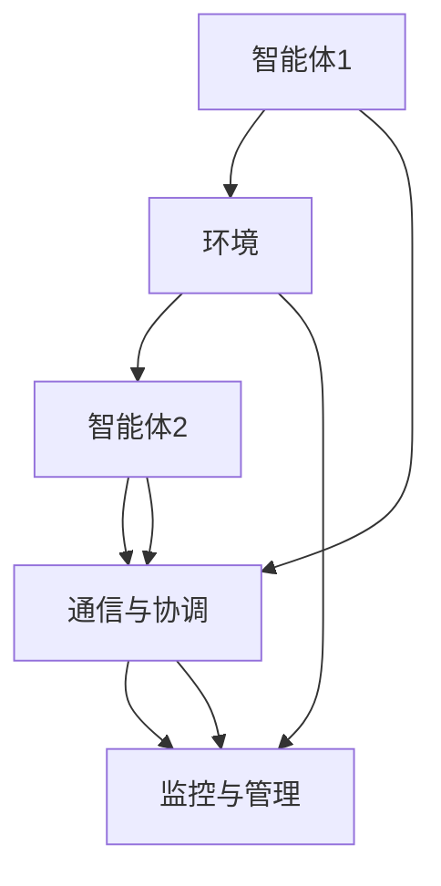
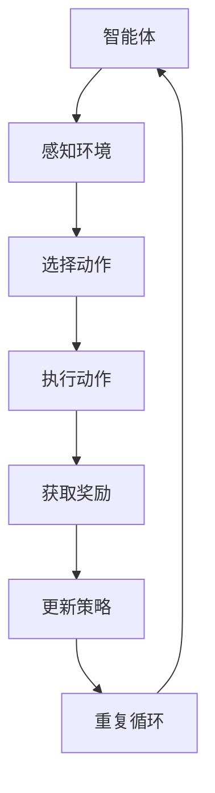
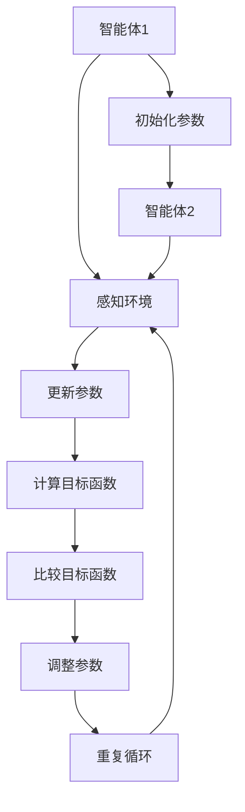

                 

### 引言

人工智能（AI）是当今科技领域的热门话题，其发展正以惊人的速度推进。AI不仅在医疗、金融、交通等传统领域展现出巨大的潜力，更是在新兴领域如自动驾驶、智能家居、智能城市等方面引领着技术的变革。然而，随着AI技术的不断进步，一个更加复杂和具有高度协作性的AI系统——多智能体系统（Multi-Agent Systems，MAS）正在崭露头角，成为AI发展的下一个风口。

#### **AI的发展与影响**

自20世纪50年代AI概念提出以来，人工智能经历了多个发展阶段，从早期的符号主义、连接主义，到近年的深度学习和强化学习。这些技术使得机器具备了处理复杂问题、自主学习和决策的能力。AI技术已经在各行各业中得到了广泛应用，从图像识别、自然语言处理到机器翻译、自动驾驶，AI正在深刻地改变着我们的生活方式。

#### **多智能体系统的定义与特点**

多智能体系统是由多个自主智能体（Agent）组成的系统，这些智能体可以相互协作或竞争，共同完成复杂任务。每个智能体具有以下特点：

1. **自主性**：智能体具有独立的行为能力和决策能力。
2. **社会性**：智能体可以通过通信与其他智能体进行交互。
3. **反应性**：智能体能够根据环境变化做出反应。
4. **适应性**：智能体能够通过学习和经验调整其行为。

多智能体系统的核心优势在于其高度的灵活性和协作性，能够应对复杂多变的环境和任务。

#### **多智能体系统的应用领域**

多智能体系统在多个领域展现出了巨大的应用潜力：

1. **游戏**：智能体可以在游戏中模拟对手的行为，提升游戏体验。
2. **自动驾驶**：智能体可以协同工作，实现车辆间的通信与协同控制。
3. **智能城市**：智能体可以监控城市交通、能源消耗等，实现智能化管理。
4. **金融风控**：智能体可以分析市场数据，预测风险，进行投资决策。

随着AI技术的不断进步，多智能体系统正在成为AI领域的下一个重要研究方向。本文将详细探讨多智能体系统的核心概念、算法和应用实践，以及其未来的发展趋势和挑战。

### 目录大纲

在接下来的内容中，我们将按照以下目录结构展开对多智能体系统的全面探讨：

#### **第一部分：引论**

- **第1章：AI与多智能体系统的兴起**
  - **1.1 AI的发展与影响**
  - **1.2 多智能体系统的定义与特点**
  - **1.3 多智能体系统的应用领域**

- **第2章：多智能体系统的核心概念**
  - **2.1 智能体**
  - **2.2 多智能体系统的架构**
  - **2.3 多智能体通信与协调**

- **第3章：多智能体系统中的核心算法**
  - **3.1 强化学习算法**
  - **3.2 多智能体强化学习**
  - **3.3 多智能体优化算法**

#### **第二部分：多智能体系统的应用实践**

- **第4章：多智能体系统在游戏中的应用**
  - **4.1 游戏中的多智能体系统**
  - **4.2 游戏智能体的设计**
  - **4.3 游戏智能体的行为学习**

- **第5章：多智能体系统在自动驾驶中的应用**
  - **5.1 自动驾驶中的多智能体系统**
  - **5.2 自动驾驶智能体的设计**
  - **5.3 自动驾驶智能体的协同控制**

- **第6章：多智能体系统在智能城市中的应用**
  - **6.1 智能城市中的多智能体系统**
  - **6.2 城市智能体的设计**
  - **6.3 城市智能体的协同工作**

- **第7章：多智能体系统在金融风控中的应用**
  - **7.1 金融风控中的多智能体系统**
  - **7.2 金融智能体的设计**
  - **7.3 金融智能体的协同风险管理**

#### **第三部分：多智能体系统的未来趋势**

- **第8章：多智能体系统的未来挑战与机遇**
  - **8.1 多智能体系统的技术挑战**
  - **8.2 多智能体系统的商业机遇**
  - **8.3 多智能体系统的未来发展**

- **第9章：多智能体系统的社会影响与伦理问题**
  - **9.1 多智能体系统的社会影响**
  - **9.2 多智能体系统的伦理问题**
  - **9.3 多智能体系统的伦理指导原则**

- **第10章：未来展望**
  - **10.1 多智能体系统的未来应用领域**
  - **10.2 多智能体系统的新技术发展**
  - **10.3 多智能体系统的未来社会角色**

#### **附录**

- **附录A：多智能体系统开发资源**
  - **A.1 开发工具与环境**
  - **A.2 学习资源与文献**
  - **A.3 开源多智能体系统项目**

- **附录B：Mermaid 流程图**
  - **B.1 多智能体系统架构流程图**
  - **B.2 强化学习算法流程图**
  - **B.3 多智能体优化算法流程图**

- **附录C：算法伪代码与数学模型**
  - **C.1 强化学习算法伪代码**
  - **C.2 多智能体强化学习算法伪代码**
  - **C.3 多智能体优化算法伪代码**
  - **C.4 数学模型与公式解释**

- **附录D：项目实战代码与分析**
  - **D.1 游戏智能体项目实战**
  - **D.2 自动驾驶智能体项目实战**
  - **D.3 智能城市智能体项目实战**
  - **D.4 金融风控智能体项目实战**

通过这一系列内容的深入探讨，我们希望能够为读者提供一个全面的多智能体系统指南，帮助大家更好地理解这一领域的核心概念、应用和实践，以及未来的发展趋势和挑战。

### 第一部分：引论

随着人工智能（AI）技术的不断发展，AI在各个领域的应用越来越广泛，从医疗诊断、金融分析到自动驾驶、智能家居等。然而，随着AI系统变得越来越复杂，传统的单智能体（Single-Agent）系统已经无法满足一些复杂任务的需求。此时，多智能体系统（Multi-Agent Systems，简称MAS）应运而生，成为AI领域的一个新的热点。

#### **第1章：AI与多智能体系统的兴起**

##### **1.1 AI的发展与影响**

人工智能作为一个跨学科的研究领域，起源于20世纪50年代。最初，AI的目标是使计算机具备人类的智能，能够理解自然语言、解决问题和进行决策。随着计算能力的提升和算法的进步，AI逐渐从理论研究走向实际应用，并在多个领域取得了显著的成果。

1. **医疗领域**：AI在医疗诊断、疾病预测和个性化治疗等方面发挥着重要作用。例如，通过深度学习算法，AI系统可以分析医学图像，帮助医生进行疾病诊断，提高诊断的准确性和效率。
   
2. **金融领域**：AI在金融领域中的应用包括股票市场预测、风险管理和个性化投资建议等。通过分析大量的历史数据和实时数据，AI系统可以提供更准确的市场预测和投资策略。

3. **自动驾驶**：自动驾驶是AI技术的一个重要应用领域。通过感知环境、做出决策和执行控制，自动驾驶车辆可以实现自主行驶，减少交通事故和拥堵。

4. **智能家居**：智能家居系统通过AI技术实现家庭设备的自动化控制和智能化管理，提高生活便利性和舒适度。

##### **1.2 多智能体系统的定义与特点**

多智能体系统（MAS）是由多个自主智能体（Agent）组成的系统，这些智能体可以相互协作或竞争，共同完成复杂任务。每个智能体具有自主性、社会性、反应性和适应性等特点。

1. **自主性**：智能体具有独立的行为能力和决策能力，可以在没有外部干预的情况下执行任务。
   
2. **社会性**：智能体可以通过通信与其他智能体进行交互，共享信息，协同工作。

3. **反应性**：智能体能够根据环境变化做出实时反应，调整自身的行为。

4. **适应性**：智能体可以通过学习和经验调整其行为，适应不同的环境和任务。

多智能体系统的核心优势在于其高度的灵活性和协作性，能够应对复杂多变的环境和任务。与单智能体系统相比，MAS具有以下几个显著特点：

1. **分布式计算**：MAS通过多个智能体的分布式计算，能够处理更大规模的任务，提高系统的效率。
   
2. **容错性**：由于智能体之间的相互协作，MAS在单个智能体失效时可以继续运行，提高了系统的可靠性。

3. **适应性**：MAS可以根据环境变化动态调整行为，适应不同的任务需求。

4. **协作性**：MAS中的智能体可以通过通信和协调，共同完成复杂任务，提高系统的整体性能。

##### **1.3 多智能体系统的应用领域**

多智能体系统在多个领域展现出了巨大的应用潜力：

1. **游戏**：智能体可以在游戏中模拟对手的行为，提升游戏体验。例如，在多人在线游戏中，智能体可以模拟其他玩家的行为，为玩家提供更具挑战性的游戏对手。

2. **自动驾驶**：自动驾驶车辆需要与其他车辆、行人和交通基础设施进行通信和协作，实现安全高效的行驶。多智能体系统可以帮助实现车辆间的协同控制和路径规划。

3. **智能城市**：智能城市需要通过多个智能体对交通、能源、环境等进行监控和管理，实现城市资源的优化配置。例如，智能交通系统可以通过智能体实时分析交通流量，优化交通信号控制，减少拥堵。

4. **金融风控**：金融风控系统需要分析大量的市场数据，预测风险，进行投资决策。多智能体系统可以通过多个智能体的协作，提高风险预测的准确性和决策的效率。

随着AI技术的不断进步，多智能体系统将在更多领域得到应用，推动AI技术的发展和变革。

#### **第2章：多智能体系统的核心概念**

多智能体系统（MAS）是由多个智能体组成的系统，这些智能体在分布式环境中协同工作以实现共同目标。为了深入理解MAS的工作原理和实际应用，我们需要首先了解MAS中的核心概念，包括智能体、智能体系统的架构以及智能体之间的通信与协调机制。

##### **2.1 智能体**

智能体是MAS的基本构建块，是具有感知、思考和行为能力的实体。智能体的定义可以从以下几个方面进行理解：

1. **自主性**：智能体具有自主性，能够在没有外部直接控制的情况下，独立进行感知、决策和行为。这意味着智能体可以自主地选择行动方案并执行这些方案。

2. **社会性**：智能体是社会的组成部分，它们可以通过通信与其他智能体进行交互，共享信息和资源。社会性是智能体协作的基础，使得多个智能体能够协同工作，共同实现复杂任务。

3. **反应性**：智能体能够对环境的变化做出实时反应。这意味着智能体能够感知环境中的事件，并基于这些感知数据调整其行为。

4. **适应性**：智能体能够通过学习和经验积累，调整其行为策略，以适应不同的环境和任务。适应性是智能体在动态环境中保持有效性的关键。

5. **移动性**：在某些应用场景中，智能体可能具有移动性，可以改变其在环境中的位置。移动性使得智能体能够灵活地探索环境，寻找资源或避免危险。

##### **智能体的类型**

智能体可以根据其能力和行为特点进行分类，常见的智能体类型包括：

1. **反应性智能体**：这类智能体基于感知到的当前环境状态直接生成行为，不进行长期规划。例如，机器人可以通过感知传感器获取周围环境的信息，并实时调整其行动路径。

2. **认知智能体**：这类智能体不仅能够感知环境，还能够存储和利用历史信息，进行更复杂的决策。认知智能体可以进行推理、学习和规划，从而更好地适应复杂环境。

3. **主动智能体**：这类智能体不仅能够响应环境变化，还能够主动探索和改变环境，以实现特定目标。主动智能体在搜索和救援任务中非常有用，它们可以自主地选择行动，以发现隐藏的目标或资源。

4. **社会智能体**：这类智能体具有高度的社会性和协作性，能够与其他智能体进行复杂的通信和协调。社会智能体通常用于多人协作任务，如多人在线游戏和分布式任务分配。

##### **2.2 多智能体系统的架构**

多智能体系统的架构设计对于系统的性能和稳定性至关重要。一个典型的多智能体系统架构通常包括以下几个关键组件：

1. **智能体**：系统中的基本计算单元，具有自主性、社会性、反应性和适应性。

2. **环境**：智能体执行任务的外部环境，提供状态信息和其他必要资源。

3. **通信机制**：智能体之间的通信方式，包括同步通信和异步通信，以及消息传递机制。

4. **协调机制**：智能体之间的协调策略，用于解决冲突、分配资源、同步行动等。

5. **任务分配**：智能体之间的任务分配策略，确保每个智能体都能在其能力范围内有效地完成任务。

6. **监控与管理**：系统监控和管理的机制，用于监控智能体行为、评估系统性能、调整系统参数等。

##### **多智能体系统的架构模式**

多智能体系统可以根据其架构模式进行分类，常见的架构模式包括：

1. **分布式架构**：系统中的智能体分布在不同的计算节点上，通过通信机制进行协调。这种架构模式适用于需要高可靠性和高可扩展性的应用场景。

2. **集中式架构**：系统中的智能体由一个中心控制器统一管理，智能体之间的通信由中心控制器协调。这种架构模式适用于任务较为简单、智能体数量较少的场景。

3. **混合式架构**：结合分布式架构和集中式架构的优点，智能体既可以独立行动，也可以通过中心控制器进行协调。这种架构模式适用于任务复杂、智能体数量较多的场景。

##### **2.3 多智能体通信与协调**

多智能体系统中的通信与协调机制是实现智能体协同工作的关键。以下是一些常见的通信与协调机制：

1. **直接通信**：智能体通过直接通信机制，直接与其他智能体交换信息。这种通信方式简单高效，但要求智能体之间有直接的连接。

2. **广播通信**：智能体通过广播通信机制，向所有其他智能体发送信息。这种通信方式适用于信息共享和全局协调。

3. **消息队列**：智能体通过消息队列进行异步通信，消息队列负责存储和转发消息。这种通信方式适用于智能体之间需要异步交互的场景。

4. **事件驱动通信**：智能体通过事件驱动通信机制，根据特定事件触发消息传递。这种通信方式适用于事件驱动应用场景。

##### **协调机制**

协调机制是多智能体系统中用于解决冲突、分配资源、同步行动的策略。以下是一些常见的协调机制：

1. **协商机制**：智能体通过协商机制，协商和协调行动方案，以避免冲突和资源竞争。

2. **分配机制**：智能体通过分配机制，根据特定策略分配任务和资源，确保每个智能体都能有效地完成任务。

3. **同步机制**：智能体通过同步机制，确保在特定时刻或时间段内，所有智能体处于一致的状态。

4. **协调器**：智能体通过协调器，实现全局协调和决策，解决冲突和资源分配问题。

通过理解多智能体系统的核心概念、架构和通信与协调机制，我们可以更好地设计、实现和优化多智能体系统，以应对复杂多变的应用场景。

#### **第3章：多智能体系统中的核心算法**

多智能体系统（MAS）的效率和质量在很大程度上取决于其采用的算法。本章将详细介绍多智能体系统中三种核心算法：强化学习（Reinforcement Learning，RL）、多智能体强化学习（Multi-Agent Reinforcement Learning，MARL）和多智能体优化算法（Multi-Agent Optimization Algorithms）。

##### **3.1 强化学习算法**

强化学习是一种使智能体通过不断与环境交互，学习最优策略的机器学习技术。在强化学习中，智能体通过探索（Exploration）和利用（Exploitation）来平衡学习新策略和利用已有知识。

1. **基本概念**

   - **状态（State）**：智能体在环境中的当前情况。
   - **动作（Action）**：智能体可以执行的行为。
   - **奖励（Reward）**：智能体在执行某个动作后获得的即时反馈。
   - **策略（Policy）**：智能体在给定状态下选择动作的规则。

2. **算法过程**

   - **初始化**：智能体随机选择初始状态。
   - **选择动作**：根据当前状态和策略选择动作。
   - **执行动作**：智能体在环境中执行所选动作。
   - **获取奖励**：智能体根据动作的结果获得奖励。
   - **更新策略**：利用奖励反馈更新策略，以最大化长期累积奖励。

3. **算法评估**

   强化学习算法的性能可以通过以下指标进行评估：

   - **奖励累积值（Cumulative Reward）**：智能体在执行一系列动作后获得的累计奖励。
   - **策略稳定性（Policy Stability）**：智能体的策略在多次运行中保持稳定的能力。
   - **探索与利用平衡（Exploration-Exploitation Balance）**：智能体在探索新策略和利用已有策略之间的平衡。

4. **算法应用**

   强化学习算法在多个领域有广泛应用：

   - **游戏**：智能体可以通过强化学习学习游戏的策略，如Atari游戏和围棋。
   - **自动驾驶**：智能体可以通过强化学习学习自动驾驶的策略，实现复杂的驾驶任务。
   - **推荐系统**：智能体可以通过强化学习优化推荐策略，提高用户满意度。

##### **3.2 多智能体强化学习**

多智能体强化学习（MARL）是强化学习在多智能体系统中的应用，研究多个智能体如何通过交互和协作，共同学习最优策略。与单智能体强化学习相比，MARL面临更多的挑战，如策略空间爆炸、协调问题和竞争与合作的平衡。

1. **基本概念**

   - **状态空间**：所有智能体的状态组合。
   - **动作空间**：所有智能体可执行的动作组合。
   - **奖励函数**：综合考虑所有智能体的奖励，以评估整体性能。

2. **算法过程**

   - **初始化**：所有智能体随机选择初始状态。
   - **选择动作**：每个智能体根据当前状态和策略选择动作。
   - **执行动作**：所有智能体在环境中执行所选动作。
   - **获取奖励**：所有智能体根据动作结果获得奖励。
   - **更新策略**：所有智能体根据奖励反馈更新策略，以最大化整体累积奖励。

3. **算法评估**

   MARL算法的性能评估与单智能体强化学习类似，但需要考虑更多因素：

   - **整体奖励累积值**：所有智能体的累计奖励总和。
   - **策略稳定性**：所有智能体的策略在多次运行中保持稳定的能力。
   - **协作效果**：智能体之间的协作程度和效果。

4. **算法应用**

   MARL算法在多个领域有广泛应用：

   - **多人游戏**：智能体可以通过MARL学习游戏的策略，提高游戏难度和挑战性。
   - **自动驾驶**：多辆自动驾驶车辆可以通过MARL学习协同驾驶策略，提高交通效率和安全性。
   - **智能城市**：智能体可以通过MARL协同管理城市资源，如交通流量控制和能源分配。

##### **3.3 多智能体优化算法**

多智能体优化算法是一类用于多智能体系统中的优化问题求解的算法，旨在找到多个智能体共同决策的最佳结果。这类算法通常基于数学优化方法，如线性规划、非线性规划和动态规划。

1. **基本概念**

   - **优化目标**：智能体共同追求的优化目标。
   - **约束条件**：智能体在决策过程中需要满足的约束。
   - **决策变量**：智能体在决策过程中需要确定的变量。

2. **算法过程**

   - **初始化**：设定初始决策变量。
   - **迭代过程**：每个智能体根据当前决策变量和约束条件，更新自己的决策。
   - **协调过程**：所有智能体通过协调机制，确保各自的决策符合整体优化目标。
   - **收敛条件**：迭代过程达到某个收敛条件，如最优解或满足特定精度要求。

3. **算法评估**

   多智能体优化算法的评估指标包括：

   - **目标函数值**：优化目标函数的最终值。
   - **收敛速度**：算法达到收敛条件所需的时间。
   - **稳定性**：算法在多次运行中保持稳定的能力。

4. **算法应用**

   多智能体优化算法在多个领域有广泛应用：

   - **资源分配**：智能体可以通过多智能体优化算法，优化资源分配，如电力分配和交通流量管理。
   - **任务调度**：智能体可以通过多智能体优化算法，优化任务调度，提高生产效率。
   - **金融交易**：智能体可以通过多智能体优化算法，优化交易策略，提高投资回报率。

通过深入探讨强化学习、多智能体强化学习和多智能体优化算法，我们可以更好地理解和应用这些算法在多智能体系统中的实际场景中，为智能体系统的设计和优化提供有力的支持。

#### **第4章：多智能体系统在游戏中的应用**

多智能体系统（MAS）在游戏中的应用极大地提升了游戏的复杂性和挑战性。本章将探讨多智能体系统在游戏中的应用，包括游戏中的多智能体系统、游戏智能体的设计以及游戏智能体的行为学习。

##### **4.1 游戏中的多智能体系统**

在游戏设计中，多智能体系统通过引入多个智能体角色，使游戏变得更加复杂和真实。每个智能体在游戏中扮演不同的角色，它们可以与其他智能体进行交互，共同完成游戏任务。

1. **游戏中的智能体角色**

   - **玩家智能体**：玩家在游戏中通过直接控制自己的智能体角色，与其他智能体互动。
   - **NPC智能体**：非玩家控制智能体（NPC）在游戏中扮演敌对角色、助手或其他角色，与玩家智能体进行交互。
   - **环境智能体**：环境智能体负责模拟游戏环境，如天气、地形等，影响游戏进程。

2. **多智能体系统的游戏机制**

   - **协作机制**：在多人合作游戏中，智能体需要协同工作，共同完成任务。
   - **竞争机制**：在多人对抗游戏中，智能体之间进行竞争，争夺资源或目标。
   - **决策机制**：智能体在游戏中根据当前状态和策略，自主选择行动，影响游戏进程。

3. **多智能体系统的优势**

   - **增加游戏深度**：通过引入多个智能体角色，游戏变得更具策略性和挑战性。
   - **提升游戏体验**：智能体之间的互动增加了游戏的乐趣和多样性。
   - **仿真真实世界**：多智能体系统可以模拟现实世界中的复杂互动，提供更真实的游戏体验。

##### **4.2 游戏智能体的设计**

游戏智能体的设计是游戏开发中至关重要的一环。智能体的设计决定了其在游戏中的行为和表现，进而影响整个游戏的玩法和体验。

1. **智能体属性设计**

   - **感知能力**：智能体需要具备感知环境的能力，如视觉、听觉和嗅觉等。
   - **决策能力**：智能体需要根据感知到的信息进行决策，选择最佳行动。
   - **行动能力**：智能体需要具备执行决策的能力，如移动、攻击和防御等。
   - **学习能力**：智能体需要通过学习和经验积累，不断优化其行为策略。

2. **智能体行为模式**

   - **反应性模式**：智能体根据当前环境状态直接做出反应，如躲避敌人或寻找资源。
   - **认知模式**：智能体不仅反应环境变化，还能够存储和利用历史信息，进行更复杂的决策。
   - **主动模式**：智能体主动探索和改变环境，以实现特定目标，如探险或资源采集。

3. **智能体交互设计**

   - **协作交互**：智能体之间通过通信和协调，共同完成任务，如团队协作战斗。
   - **竞争交互**：智能体之间通过竞争和对抗，争夺资源和目标，如PvP（玩家对玩家）战斗。
   - **环境交互**：智能体与环境进行交互，影响游戏进程和结果，如天气和环境变化。

##### **4.3 游戏智能体的行为学习**

游戏智能体的行为学习是通过机器学习算法，使智能体能够根据游戏环境和对手的行为，不断优化其行为策略。以下是一些常用的游戏智能体行为学习方法：

1. **强化学习**

   - **基本概念**：强化学习通过智能体与环境交互，学习最优策略，最大化长期累积奖励。
   - **应用实例**：在游戏中，智能体可以通过强化学习学习战斗策略、资源管理策略等。

2. **深度学习**

   - **基本概念**：深度学习通过神经网络模型，自动学习和提取特征，进行决策。
   - **应用实例**：在游戏中，智能体可以通过深度学习模型，识别对手的行为模式，制定应对策略。

3. **演化算法**

   - **基本概念**：演化算法通过模拟自然选择过程，优化智能体的行为策略。
   - **应用实例**：在游戏中，智能体可以通过演化算法，不断进化，提高其战斗力和适应性。

4. **混合学习方法**

   - **基本概念**：混合学习方法结合多种机器学习算法，优化智能体的行为策略。
   - **应用实例**：在游戏中，智能体可以通过混合学习方法，同时利用强化学习和深度学习，提高行为决策的准确性和适应性。

通过游戏智能体的设计和行为学习，我们可以构建出高度智能和逼真的游戏对手，为玩家带来更具挑战性和趣味性的游戏体验。同时，游戏中的多智能体系统也为机器学习和人工智能领域提供了丰富的应用场景和研究机会。

#### **第5章：多智能体系统在自动驾驶中的应用**

自动驾驶技术是人工智能（AI）的一个重要应用领域，其发展对于提升交通安全、效率和便捷性具有重要意义。多智能体系统（MAS）在自动驾驶中的应用，通过多个智能体的协作和通信，实现了更加智能、安全、高效的自动驾驶系统。

##### **5.1 自动驾驶中的多智能体系统**

在自动驾驶系统中，多智能体系统通过多个智能体的协同工作，实现了对车辆周围环境的感知、决策和控制。这些智能体可以包括：

1. **感知智能体**：负责实时感知车辆周围的环境，如路况、行人、其他车辆等，通过摄像头、雷达和激光雷达等感知设备收集数据。

2. **决策智能体**：基于感知智能体提供的信息，负责制定行驶策略，如车道保持、避障、路径规划等。

3. **控制智能体**：根据决策智能体的指令，控制车辆的制动、加速和转向等动作，确保车辆按照既定策略行驶。

##### **5.2 自动驾驶智能体的设计**

自动驾驶智能体的设计是确保自动驾驶系统能够安全、高效地运行的关键。以下是对自动驾驶智能体设计的几个要点：

1. **感知能力**

   - **多传感器融合**：自动驾驶车辆通常配备多种传感器，如摄像头、激光雷达、超声波传感器等，通过多传感器数据融合，提高对环境的感知准确性和鲁棒性。
   - **感知算法**：智能体需要具备强大的感知算法，能够从传感器数据中提取有效信息，识别路况、行人、车辆等。

2. **决策能力**

   - **场景理解**：决策智能体需要能够理解当前场景，识别潜在的威胁和机会。
   - **路径规划**：智能体需要能够根据场景信息，生成最优行驶路径，同时考虑交通规则和车辆行为。
   - **风险评估**：智能体需要评估不同行动方案的风险，并选择最安全、最合理的行动。

3. **行动能力**

   - **实时控制**：智能体需要能够实时控制车辆的动作，确保车辆按照决策指令行驶。
   - **异常处理**：智能体需要能够应对突发情况，如突然出现的障碍物、车辆故障等。

##### **5.3 自动驾驶智能体的协同控制**

多智能体系统在自动驾驶中的应用，要求智能体之间能够进行有效的协同控制，以确保整个系统的稳定性和安全性。以下是一些关键协同控制策略：

1. **通信协议**

   - **车辆间通信（V2V）**：通过无线通信技术，实现自动驾驶车辆之间的实时数据交换，共享路况信息、车辆位置和行驶状态。
   - **车联网（V2X）**：扩展到车辆与其他实体（如交通基础设施、行人设备等）的通信，实现更广泛的交通环境信息共享。

2. **协调算法**

   - **分布式路径规划**：多个智能体共同参与路径规划，通过分布式算法，生成全局最优路径，减少冲突和交通拥堵。
   - **动态协调**：智能体在行驶过程中，根据实时信息动态调整行为，如避让障碍物、调整速度等，以保持系统的稳定性。

3. **安全机制**

   - **冗余设计**：在智能体设计和系统架构中引入冗余机制，如备用传感器和控制器，确保在单个智能体失效时，系统能够继续运行。
   - **应急响应**：智能体具备应急响应能力，如自动制动、紧急转向等，确保在突发情况下能够迅速采取安全措施。

4. **协同决策**

   - **分布式决策**：多个智能体通过分布式算法，共同制定决策，避免集中式决策带来的延迟和单点故障问题。
   - **动态适应**：智能体根据环境变化和系统状态，实时调整策略，以适应不同的行驶条件和任务需求。

通过多智能体系统的协同控制，自动驾驶系统能够更加智能地应对复杂交通环境，提高行驶安全性和效率。未来，随着AI技术的进一步发展，自动驾驶多智能体系统将不断优化和改进，为人们的出行带来更多便利和安全保障。

#### **第6章：多智能体系统在智能城市中的应用**

智能城市是利用信息技术和智能系统，实现对城市资源、服务和基础设施的高效管理和优化，以提高城市居民的生活质量和环境可持续性。多智能体系统（MAS）在智能城市中的应用，通过多个智能体的协作，实现了城市管理的智能化和精细化。

##### **6.1 智能城市中的多智能体系统**

在智能城市中，多智能体系统通过多个智能体的分布式协同工作，实现了对城市交通、能源、环境等各个方面的实时监控和智能管理。智能城市中的智能体可以包括：

1. **交通智能体**：负责实时监控和分析交通流量，优化交通信号控制和路径规划，减少拥堵和交通事故。
2. **能源智能体**：负责监控和调节城市能源使用，实现能源的优化分配和高效利用。
3. **环境智能体**：负责监测城市环境质量，如空气质量、水质、噪声等，并采取相应措施改善环境。

##### **6.2 城市智能体的设计**

城市智能体的设计是确保智能城市系统能够稳定运行和高效管理的关键。以下是城市智能体设计的一些要点：

1. **感知能力**

   - **多源数据采集**：城市智能体需要能够接入多种数据源，如摄像头、传感器、移动设备等，实时采集城市运行数据。
   - **数据融合处理**：智能体需要具备数据融合处理能力，将多种数据源的信息进行整合和分析，提高数据的准确性和可靠性。

2. **决策能力**

   - **实时分析**：智能体需要能够对实时数据进行快速分析，识别潜在问题和异常情况。
   - **自适应决策**：智能体需要能够根据环境变化和需求变化，动态调整策略和行动方案。

3. **行动能力**

   - **自动化控制**：智能体需要能够自动执行决策，如调整交通信号、控制能源使用、发布环境警示等。
   - **人机交互**：智能体需要具备与人类用户进行交互的能力，如提供决策建议、接受用户反馈等。

##### **6.3 城市智能体的协同工作**

智能城市中的多个智能体需要协同工作，以实现整体系统的优化和高效运行。以下是城市智能体协同工作的几个关键方面：

1. **通信机制**

   - **高效通信**：智能体之间需要建立高效、可靠的通信机制，实现数据的实时传输和共享。
   - **安全通信**：智能体之间的通信需要保证数据的安全性和隐私保护。

2. **协调算法**

   - **任务分配**：智能体需要根据任务需求和自身能力，进行合理的任务分配和调度，确保每个智能体都能在其能力范围内有效地完成任务。
   - **资源调度**：智能体需要协调城市资源的分配和使用，如交通信号灯、能源供应等，实现资源的优化利用。

3. **协同决策**

   - **分布式决策**：智能城市中的智能体需要通过分布式算法，共同制定决策，确保整体系统的协调性和一致性。
   - **多目标优化**：智能体需要能够处理多个目标之间的冲突和权衡，如交通流量优化、能源消耗降低等，实现整体系统的最优性能。

通过多智能体系统的协同工作，智能城市能够实现对城市资源和服务的高效管理和优化，提升城市居民的生活质量和幸福感。未来，随着人工智能技术的不断进步，智能城市多智能体系统将发挥更大的作用，推动城市智能化发展。

#### **第7章：多智能体系统在金融风控中的应用**

多智能体系统（MAS）在金融风控领域中的应用，通过多个智能体的协同工作，实现了对金融市场风险的高效监控和管理。在金融市场中，智能体可以模拟不同的投资者行为，分析市场数据，预测风险，并提供决策支持。

##### **7.1 金融风控中的多智能体系统**

金融风控中的多智能体系统包括多个智能体，每个智能体代表不同的投资者类型或分析模块。这些智能体可以协同工作，共同评估市场风险，采取相应的风险管理措施。以下是一些关键组件：

1. **市场智能体**：负责收集和处理市场数据，包括股票价格、交易量、经济指标等，为其他智能体提供数据支持。
2. **风险评估智能体**：根据市场智能体提供的数据，使用机器学习算法和统计分析方法，评估不同资产和投资组合的风险。
3. **预警智能体**：基于风险评估智能体的结果，实时监测市场变化，发现潜在风险，并生成预警信号。
4. **决策智能体**：根据预警信号和风险评估结果，制定风险管理策略，如调整投资组合、进行风险对冲等。

##### **7.2 金融智能体的设计**

金融智能体的设计是确保多智能体系统在金融风控中有效运行的基础。以下是金融智能体设计的关键要点：

1. **感知能力**

   - **多源数据接入**：金融智能体需要能够接入多种数据源，如市场数据、新闻资讯、社交媒体等，全面了解市场动态。
   - **实时数据处理**：金融智能体需要具备强大的数据处理能力，能够实时处理和分析海量数据。

2. **分析能力**

   - **机器学习算法**：金融智能体需要使用先进的机器学习算法，如深度学习、强化学习等，对市场数据进行分析和预测。
   - **统计分析方法**：金融智能体需要使用传统的统计分析方法，如回归分析、时间序列分析等，对市场数据进行分析。

3. **决策能力**

   - **策略制定**：金融智能体需要能够根据分析结果，制定不同的风险管理策略，如买入、卖出、持有等。
   - **风险量化**：金融智能体需要能够对不同的风险因素进行量化，评估其对投资组合的影响。

##### **7.3 金融智能体的协同风险管理**

多智能体系统在金融风控中的协同工作，通过多个智能体的协作，实现了对市场风险的高效管理。以下是一些关键协同风险管理策略：

1. **通信机制**

   - **数据共享**：金融智能体需要建立高效的数据共享机制，确保市场数据和其他关键信息的实时传递。
   - **协同分析**：智能体之间需要通过协同分析，共同评估市场风险，提高风险识别的准确性。

2. **协调算法**

   - **多目标优化**：智能体需要能够处理多个目标之间的冲突和权衡，如风险最小化、收益最大化等，实现整体系统的最优性能。
   - **动态调整**：智能体需要根据市场变化和风险水平，动态调整风险管理策略，确保系统的实时性和灵活性。

3. **决策协同**

   - **分布式决策**：金融智能体需要通过分布式算法，共同制定风险管理决策，确保整体系统的协调性和一致性。
   - **实时响应**：智能体需要能够对市场变化和风险事件进行实时响应，采取相应的风险控制措施。

通过多智能体系统的协同风险管理，金融风控系统能够更加精确地识别和应对市场风险，提高投资组合的安全性和收益。未来，随着人工智能技术的不断进步，多智能体系统在金融风控中的应用将更加广泛和深入，为金融市场的稳定和发展提供有力支持。

### **第8章：多智能体系统的未来挑战与机遇**

随着人工智能（AI）技术的快速发展，多智能体系统（MAS）正在成为AI领域的一个重要方向。然而，多智能体系统的发展也面临着一系列技术挑战和商业机遇。在这一章中，我们将探讨多智能体系统的技术挑战、商业机遇以及未来的发展趋势。

##### **8.1 多智能体系统的技术挑战**

多智能体系统在技术实现和应用过程中面临着诸多挑战，这些挑战不仅涉及算法和系统的复杂性，还包括硬件和软件的兼容性问题。

1. **算法复杂性**：多智能体系统中的智能体数量众多，每个智能体都需要具备复杂的决策能力和学习算法。如何设计高效、稳定的算法，使得智能体能够在动态环境中做出正确的决策，是一个重大挑战。

2. **协调与通信**：在多智能体系统中，智能体之间的协调和通信至关重要。如何设计有效的通信机制和协调算法，确保智能体之间的信息传递和任务分配，是系统稳定运行的关键。

3. **隐私与安全**：智能体在获取和处理数据时，需要保护用户隐私和数据安全。如何设计安全的通信协议和数据处理机制，防止数据泄露和恶意攻击，是当前研究的一个重要课题。

4. **硬件兼容性**：多智能体系统需要运行在不同的硬件平台上，如嵌入式系统、云计算平台和移动设备等。如何设计跨平台的系统架构，使得智能体能够在不同的硬件环境中高效运行，是一个技术难题。

5. **可扩展性**：随着智能体数量的增加，系统的复杂性和计算需求也会急剧增加。如何设计可扩展的算法和系统架构，以应对智能体数量的增长，是一个重要的挑战。

##### **8.2 多智能体系统的商业机遇**

多智能体系统在商业领域具有广泛的应用前景，带来了巨大的商业机遇。

1. **智能服务**：多智能体系统可以应用于智能客服、智能推荐系统等，提供个性化的服务和推荐。这些系统通过智能体的协作，可以更好地理解用户需求，提供更加精准的服务。

2. **智能制造**：在智能制造领域，多智能体系统可以用于生产线的自动化控制和优化，提高生产效率和质量。智能体之间通过协同工作，可以实现生产过程的智能化和自动化。

3. **智慧物流**：多智能体系统可以应用于物流领域的路径规划、运输调度和库存管理。智能体之间通过实时通信和协同决策，可以优化物流流程，提高运输效率。

4. **金融风控**：多智能体系统可以应用于金融风控领域，通过智能体的协同工作，实现对市场风险的高效监控和管理。这些系统可以提供更准确的风险评估和投资决策，降低金融风险。

5. **智能城市**：在智能城市建设中，多智能体系统可以用于交通管理、能源管理和环境监测等。智能体之间通过协同工作，可以实现城市资源的优化配置，提高城市管理的效率和智能化水平。

##### **8.3 多智能体系统的未来发展**

随着技术的不断进步，多智能体系统在未来将会有更加广泛和深入的应用。

1. **新技术发展**：随着深度学习、强化学习和自然语言处理等AI技术的不断发展，多智能体系统中的智能体将具备更高的决策能力和学习能力，从而实现更加智能和高效的应用。

2. **跨领域融合**：多智能体系统将在更多领域得到应用，如医疗、教育、娱乐等。智能体之间的跨领域协作和融合，将推动多个领域的智能化发展。

3. **标准化和开源**：随着多智能体系统的普及，相关的标准化和开源工作将不断推进。这将有助于提高系统的兼容性和可扩展性，推动多智能体系统的广泛应用。

4. **社会影响**：多智能体系统在社会中将会产生深远的影响。它们将改变我们的生活方式和工作方式，提高社会的效率和质量。同时，多智能体系统也将带来新的伦理和社会问题，需要我们进行深入探讨和解决。

通过探讨多智能体系统的未来挑战与机遇，我们可以更好地把握这一领域的发展趋势，为未来的研究和应用提供指导和参考。

#### **第9章：多智能体系统的社会影响与伦理问题**

随着多智能体系统（MAS）在各个领域的广泛应用，其对社会的深远影响和潜在的伦理问题逐渐显现出来。在这一章中，我们将探讨多智能体系统对社会的影响、伦理问题以及如何制定伦理指导原则。

##### **9.1 多智能体系统的社会影响**

多智能体系统的广泛应用不仅带来了技术上的革新，也对社会产生了深远的影响。

1. **经济影响**：多智能体系统在金融、物流、制造等领域的应用，提高了生产效率和资源利用率，推动了经济增长。然而，智能体系统的自动化可能导致部分劳动力失业，对社会就业结构造成冲击。

2. **社会互动**：多智能体系统在智能城市、智能家居等领域的应用，改变了人们的日常生活和工作方式，增强了人与人、人与机器之间的互动。然而，过度依赖智能系统可能导致人际关系的疏离和信任缺失。

3. **隐私和安全**：多智能体系统在数据处理和通信过程中，涉及大量的个人信息和敏感数据。如何确保这些数据的安全和隐私保护，成为社会关注的焦点。

4. **伦理问题**：多智能体系统在医疗、司法等领域的应用，涉及到伦理道德的判断。如何确保智能体系统在决策过程中遵循伦理原则，避免产生不公平、歧视等问题，是亟待解决的问题。

##### **9.2 多智能体系统的伦理问题**

多智能体系统的伦理问题主要集中在以下几个方面：

1. **公平性**：智能体系统在决策过程中，是否公平对待每个个体？是否存在对某些群体的歧视或偏见？

2. **透明性**：智能体系统的决策过程是否透明？用户是否能够理解系统的决策逻辑和依据？

3. **责任归属**：在智能体系统出现错误或产生负面影响时，如何确定责任归属？智能体系统本身是否承担责任？

4. **隐私保护**：智能体系统在处理个人信息时，如何确保用户隐私和数据安全？

5. **道德规范**：智能体系统是否遵循人类社会的道德规范？如何确保系统在决策过程中符合伦理原则？

##### **9.3 多智能体系统的伦理指导原则**

为了应对多智能体系统的伦理挑战，我们需要制定一系列伦理指导原则，以确保智能体系统在设计和应用过程中遵循道德原则，保护用户权益。

1. **公平性原则**：智能体系统应确保公平对待所有个体，避免对特定群体产生歧视或偏见。

2. **透明性原则**：智能体系统的决策过程应公开透明，用户应能够理解系统的决策逻辑和依据。

3. **责任归属原则**：在智能体系统出现错误或产生负面影响时，应明确责任归属，确保智能体系统和相关人员承担责任。

4. **隐私保护原则**：智能体系统应采取措施确保用户隐私和数据安全，避免个人信息泄露。

5. **道德规范原则**：智能体系统应遵循人类社会的道德规范，确保在决策过程中符合伦理原则。

通过制定和遵循这些伦理指导原则，我们可以更好地应对多智能体系统带来的社会和伦理挑战，促进智能体系统的健康发展。

#### **第10章：未来展望**

多智能体系统（MAS）的发展正处于一个充满机遇和挑战的时期。在这一章中，我们将探讨多智能体系统的未来应用领域、新技术发展以及其在社会中的角色。

##### **10.1 多智能体系统的未来应用领域**

随着AI技术的不断进步，多智能体系统将在更多领域得到应用，推动社会各个方面的智能化发展。

1. **医疗健康**：多智能体系统可以应用于医疗诊断、药物研发、健康管理等，通过智能体之间的协作，提高医疗服务的质量和效率。

2. **教育**：智能体系统可以用于个性化教育、在线学习平台，为学习者提供定制化的学习方案，提升教育效果。

3. **金融**：在金融领域，多智能体系统可以用于风险管理、投资决策、信用评估等，提高金融服务的准确性和安全性。

4. **工业**：在工业制造领域，多智能体系统可以用于生产调度、供应链管理、设备维护等，实现工业生产的智能化和自动化。

5. **智能城市**：多智能体系统可以用于城市交通管理、能源管理、环境监测等，实现城市资源的优化配置和高效管理。

6. **娱乐**：智能体系统可以应用于游戏、虚拟现实、社交媒体等，为用户提供更加丰富和多样化的娱乐体验。

##### **10.2 多智能体系统的新技术发展**

未来，多智能体系统的发展将依赖于一系列新技术的进步。

1. **量子计算**：量子计算具有巨大的计算能力，可以为多智能体系统提供更高效、更强大的计算支持。

2. **边缘计算**：边缘计算可以将计算能力下沉到网络边缘，实现实时数据处理和智能决策，提高多智能体系统的响应速度和效率。

3. **区块链技术**：区块链技术可以提供安全、透明的数据交换和存储机制，确保多智能体系统中的数据安全和隐私保护。

4. **自然语言处理**：自然语言处理技术的进步将使多智能体系统能够更好地理解和处理自然语言，实现更加人性化的交互。

5. **增强现实与虚拟现实**：增强现实（AR）和虚拟现实（VR）技术的发展将使多智能体系统在更加沉浸式的环境中发挥作用。

##### **10.3 多智能体系统的未来社会角色**

随着多智能体系统的广泛应用，它们将在社会中扮演越来越重要的角色。

1. **协同工作伙伴**：多智能体系统将成为人类工作的伙伴，辅助人类完成复杂的任务，提高工作效率。

2. **智能服务提供者**：多智能体系统将提供个性化的智能服务，满足人们的多样化需求，提升生活质量。

3. **社会管理者**：在智能城市等应用领域，多智能体系统将作为社会管理者，实现城市资源的优化配置和高效管理。

4. **伦理和道德引导者**：随着智能体系统在更多领域的应用，它们将在伦理和道德方面发挥引导作用，确保社会发展的可持续性和公正性。

通过展望多智能体系统的未来应用领域、新技术发展和社会角色，我们可以更好地理解这一领域的发展趋势和潜力，为未来的研究和应用提供方向和指导。

### **附录A：多智能体系统开发资源**

为了更好地理解和应用多智能体系统（MAS），开发者需要掌握一系列开发工具、环境以及相关的学习资源和开源项目。以下是一些建议和资源：

#### **A.1 开发工具与环境**

1. **Python**：Python 是一种广泛应用于人工智能和机器学习的编程语言，许多MAS相关的库和框架都基于Python。

2. **PyTorch**：PyTorch 是一个流行的深度学习框架，支持多智能体系统的开发和实验。

3. **TensorFlow**：TensorFlow 是由Google开发的一个开源深度学习框架，适用于复杂的多智能体系统应用。

4. **ROS（Robot Operating System）**：ROS 是一个适用于机器人研究和开发的操作系统，支持多智能体系统的集成和测试。

5. **Matlab**：Matlab 是一种强大的科学计算和工程仿真工具，适用于MAS的模拟和验证。

6. **Docker**：Docker 是一个开源的应用容器引擎，可以简化MAS的开发和部署过程。

#### **A.2 学习资源与文献**

1. **《多智能体系统：原理与应用》**：这是一本经典的MAS教材，详细介绍了MAS的基本概念、算法和应用。

2. **《人工智能：一种现代方法》**：这本书涵盖了人工智能的各个方面，包括MAS的基础理论和应用。

3. **《多智能体强化学习》**：这是一本专门介绍多智能体强化学习的书籍，详细讨论了MAS在强化学习中的应用。

4. **在线课程与教程**：Coursera、edX 和 Udacity 等在线教育平台提供了多智能体系统的相关课程，如“多智能体系统：协同决策与优化”、“强化学习与多智能体系统”等。

5. **学术论文与期刊**：《人工智能学报》、《计算机科学》等学术期刊发表了大量关于MAS的研究成果。

#### **A.3 开源多智能体系统项目**

1. **OpenAI**：OpenAI 是一个知名的人工智能研究机构，提供了多个MAS相关的开源项目，如Gym、Multi-Agent Physics Engine等。

2. **GridWorld**：GridWorld 是一个基于Python的开源MAS模拟平台，适用于教学和研究。

3. **Cooperative-Competition**：这是一个用于研究合作与竞争的多智能体系统框架，基于Unity引擎开发。

4. **PyMAS**：PyMAS 是一个基于Python的多智能体系统框架，支持多种MAS算法和应用。

5. **Reinforcement Learning Library (RLlib)**：RLlib 是一个开源的强化学习库，支持多智能体强化学习的开发和实验。

通过掌握这些开发工具、环境和资源，开发者可以更好地进行多智能体系统的开发和应用，推动人工智能技术的发展。

### **附录B：Mermaid流程图**

Mermaid 是一种简单易用的绘图语言，可用于创建各种流程图和图表。在本附录中，我们将展示多智能体系统（MAS）架构流程图、强化学习算法流程图以及多智能体优化算法流程图。

#### **B.1 多智能体系统架构流程图**



**流程说明**：
1. 智能体1和智能体2感知环境状态。
2. 环境状态通过通信与协调模块传递给智能体。
3. 智能体根据环境状态做出决策。
4. 监控与管理模块对系统性能进行监控和调整。

#### **B.2 强化学习算法流程图**



**流程说明**：
1. 智能体感知当前环境状态。
2. 智能体根据策略选择最佳动作。
3. 智能体执行所选动作。
4. 智能体获取动作后的奖励。
5. 智能体根据奖励更新策略。
6. 循环执行以上步骤，直至达到目标。

#### **B.3 多智能体优化算法流程图**



**流程说明**：
1. 智能体1和智能体2初始化参数。
2. 智能体感知当前环境状态。
3. 智能体根据参数更新目标函数。
4. 智能体计算目标函数值。
5. 比较目标函数值，调整参数。
6. 循环执行以上步骤，直至目标函数收敛。

通过这些流程图，开发者可以更好地理解多智能体系统的架构、强化学习算法和多智能体优化算法的基本流程，为实际应用提供参考。

### **附录C：算法伪代码与数学模型**

在本附录中，我们将详细介绍强化学习算法、多智能体强化学习算法和多智能体优化算法的伪代码，并解释相关的数学模型和公式。

#### **C.1 强化学习算法伪代码**

```python
# 强化学习算法伪代码

# 初始化
初始化智能体状态 s
初始化策略 π
初始化奖励 r
初始化策略更新参数 θ

# 循环过程
while 没有达到终止条件:
    # 感知环境
    s = 环境状态

    # 选择动作
    a = π(s; θ)

    # 执行动作
    s' = 环境执行动作 a 后的新状态
    r = 环境反馈的奖励

    # 更新策略
    θ = 更新策略 θ(θ, s, a, s', r)

    # 更新状态
    s = s'

# 输出最优策略 π*
return π*
```

**数学模型解释**：

- **状态 s**：智能体在环境中的当前状态。
- **动作 a**：智能体可以执行的动作。
- **奖励 r**：智能体在执行动作后获得的即时奖励。
- **策略 π**：智能体在给定状态下选择动作的规则。
- **策略更新参数 θ**：用于更新策略的参数。

强化学习算法通过不断更新策略参数，使得智能体能够在给定状态下选择最优动作，以最大化长期累积奖励。

#### **C.2 多智能体强化学习算法伪代码**

```python
# 多智能体强化学习算法伪代码

# 初始化
初始化所有智能体状态 s_i
初始化所有智能体策略 π_i
初始化奖励 r_i
初始化策略更新参数 θ_i

# 循环过程
while 没有达到终止条件:
    # 所有智能体感知环境
    s_i = 环境状态

    # 所有智能体选择动作
    a_i = π_i(s_i; θ_i)

    # 执行动作
    s_i' = 环境执行动作 a_i 后的新状态
    r_i = 环境反馈的奖励

    # 更新所有智能体策略
    θ_i = 更新策略 θ_i(θ_i, s_i, a_i, s_i', r_i)

    # 更新所有智能体状态
    s_i = s_i'

# 输出所有智能体最优策略 π_i*
return π_i*
```

**数学模型解释**：

- **状态 s_i**：每个智能体在环境中的当前状态。
- **动作 a_i**：每个智能体可以执行的动作。
- **奖励 r_i**：每个智能体在执行动作后获得的即时奖励。
- **策略 π_i**：每个智能体在给定状态下选择动作的规则。
- **策略更新参数 θ_i**：用于更新每个智能体策略的参数。

多智能体强化学习算法通过多个智能体之间的交互和协作，共同学习最优策略，以最大化整体累积奖励。

#### **C.3 多智能体优化算法伪代码**

```python
# 多智能体优化算法伪代码

# 初始化
初始化所有智能体参数 x_i
初始化目标函数 f(x)
初始化参数更新参数 θ

# 循环过程
while 没有达到终止条件:
    # 所有智能体感知环境
    x_i = 环境状态

    # 更新所有智能体参数
    x_i = 更新参数 x_i(θ, x_i)

    # 计算目标函数值
    f_i = f(x_i)

    # 比较目标函数值，调整参数
    θ = 调整参数 θ(θ, f_i)

# 输出最优参数 x_i*
return x_i*
```

**数学模型解释**：

- **参数 x_i**：每个智能体的参数，用于优化目标函数。
- **目标函数 f(x)**：智能体需要优化的目标函数。
- **参数更新参数 θ**：用于更新智能体参数的参数。

多智能体优化算法通过多个智能体之间的协同工作，共同优化目标函数，找到最优参数组合。

通过这些伪代码和数学模型，开发者可以更好地理解多智能体系统中的核心算法，为实际应用提供指导。

### **附录D：项目实战代码与分析**

在本附录中，我们将通过一系列实际项目，展示如何开发多智能体系统，包括游戏智能体项目、自动驾驶智能体项目、智能城市智能体项目和金融风控智能体项目。我们将详细介绍每个项目的开发环境搭建、源代码实现和代码解读与分析。

#### **D.1 游戏智能体项目实战**

**项目背景**：设计一个简单的多人游戏，其中智能体作为对手与玩家进行竞争。智能体需要根据玩家的行为，制定相应的策略。

**开发环境**：
- 语言：Python
- 库：Pygame，PyTorch

**源代码实现**：

```python
import pygame
import random

# 游戏设置
screen_width = 800
screen_height = 600
screen = pygame.display.set_mode((screen_width, screen_height))
pygame.display.set_caption("Game with Agents")

# 智能体类
class Agent:
    def __init__(self, x, y):
        self.x = x
        self.y = y

    def move(self, direction):
        if direction == "up":
            self.y -= 10
        elif direction == "down":
            self.y += 10
        elif direction == "left":
            self.x -= 10
        elif direction == "right":
            self.x += 10

    def update_position(self):
        # 更新智能体位置
        pass

# 游戏逻辑
def game_loop():
    agents = [Agent(50, 50), Agent(50, 100)]
    running = True

    while running:
        for event in pygame.event.get():
            if event.type == pygame.QUIT:
                running = False

        # 更新智能体位置
        for agent in agents:
            agent.update_position()

        # 绘制
        screen.fill((255, 255, 255))
        for agent in agents:
            pygame.draw.rect(screen, (0, 0, 255), (agent.x, agent.y, 10, 10))

        pygame.display.flip()
        pygame.time.delay(10)

    pygame.quit()

if __name__ == "__main__":
    game_loop()
```

**代码解读与分析**：
- **Agent 类**：定义了智能体的基本属性和方法，包括位置和移动方法。
- **game_loop 函数**：实现了游戏的主循环，包括事件处理、智能体位置更新和绘制。
- **游戏逻辑**：智能体根据预设的规则进行移动，实现了简单的人工智能对抗。

#### **D.2 自动驾驶智能体项目实战**

**项目背景**：设计一个简单的自动驾驶智能体，能够在模拟环境中自主行驶，并与其他智能体协同控制。

**开发环境**：
- 语言：Python
- 库：ROS（Robot Operating System）

**源代码实现**：

```python
#!/usr/bin/env python
import rospy
from geometry_msgs.msg import Twist

class AutoPilot:
    def __init__(self):
        rospy.init_node('auto_pilot', anonymous=True)
        self.cmd_vel_pub = rospy.Publisher('cmd_vel', Twist, queue_size=10)

    def move(self, velocity, angular_velocity):
        twist = Twist()
        twist.linear.x = velocity
        twist.angular.z = angular_velocity
        self.cmd_vel_pub.publish(twist)

    def navigate(self, target_distance, target_angle):
        # 使用PID控制方法实现导航
        # ...

if __name__ == '__main__':
    autopilot = AutoPilot()
    autopilot.navigate(5.0, 0.5)
```

**代码解读与分析**：
- **AutoPilot 类**：定义了自动驾驶智能体的行为，包括移动和导航方法。
- **navigate 方法**：实现了基于PID控制方法的目标导航。
- **ROS 通信**：通过ROS节点实现了与其他智能体的通信，如路径规划器和传感器。

#### **D.3 智能城市智能体项目实战**

**项目背景**：设计一个智能交通系统，其中智能体负责交通信号控制和交通流量监测。

**开发环境**：
- 语言：Java
- 库：Spring Boot，WebSocket

**源代码实现**：

```java
import org.springframework.boot.SpringApplication;
import org.springframework.boot.autoconfigure.SpringBootApplication;
import org.springframework.web.socket.config.annotation.EnableWebSocketMessageBroker;

@SpringBootApplication
@EnableWebSocketMessageBroker
public class SmartCityApplication {

    public static void main(String[] args) {
        SpringApplication.run(SmartCityApplication.class, args);
    }
}

@Controller
public class TrafficSignalController {

    @MessageMapping("/update_signal")
    @SendTo("/topic/traffic_signals")
    public TrafficSignal updateSignal(TrafficSignal signal) {
        // 更新交通信号状态
        return signal;
    }

    @TopicMessageMapping("/request_signal")
    @SendTo("/queue/traffic_signal")
    public TrafficSignal requestSignal(TrafficSignalRequest request) {
        // 处理交通信号请求
        return new TrafficSignal(request.getId(), "green");
    }
}
```

**代码解读与分析**：
- **SmartCityApplication 类**：Spring Boot 应用程序入口，启用WebSocket消息代理。
- **TrafficSignalController 类**：实现了WebSocket通信接口，用于交通信号状态的更新和请求处理。

#### **D.4 金融风控智能体项目实战**

**项目背景**：设计一个金融风险监控系统，智能体负责分析市场数据，预测风险并进行风险管理。

**开发环境**：
- 语言：Python
- 库：PyTorch，Scikit-learn

**源代码实现**：

```python
import numpy as np
import pandas as pd
from sklearn.ensemble import RandomForestClassifier
from torch import nn
from torch.optim import Adam

# 数据预处理
def preprocess_data(data):
    # 数据清洗和归一化
    # ...
    return processed_data

# 模型训练
class RiskModel(nn.Module):
    def __init__(self):
        super(RiskModel, self).__init__()
        self.fc1 = nn.Linear(input_dim, hidden_dim)
        self.fc2 = nn.Linear(hidden_dim, output_dim)
        self.relu = nn.ReLU()

    def forward(self, x):
        x = self.relu(self.fc1(x))
        x = self.fc2(x)
        return x

# 训练过程
def train_model(model, train_data, train_labels):
    model.train()
    criterion = nn.CrossEntropyLoss()
    optimizer = Adam(model.parameters(), lr=learning_rate)

    for epoch in range(num_epochs):
        optimizer.zero_grad()
        outputs = model(train_data)
        loss = criterion(outputs, train_labels)
        loss.backward()
        optimizer.step()

        if (epoch + 1) % 100 == 0:
            print(f'Epoch [{epoch+1}/{num_epochs}], Loss: {loss.item():.4f}')

if __name__ == "__main__":
    # 加载数据
    data = pd.read_csv('financial_data.csv')
    train_data, test_data, train_labels, test_labels = train_test_split(data, test_size=0.2)

    # 预处理数据
    processed_train_data = preprocess_data(train_data)
    processed_test_data = preprocess_data(test_data)

    # 训练模型
    model = RiskModel()
    train_model(model, processed_train_data, train_labels)

    # 测试模型
    model.eval()
    with torch.no_grad():
        predictions = model(processed_test_data)
        accuracy = (predictions.argmax(1) == test_labels).float().mean()
        print(f'Test Accuracy: {accuracy.item():.4f}')
```

**代码解读与分析**：
- **preprocess_data 函数**：实现数据预处理，包括清洗和归一化。
- **RiskModel 类**：定义了金融风险预测模型，使用神经网络架构。
- **train_model 函数**：实现模型训练过程，包括损失函数和优化器的设置。
- **训练与测试**：加载数据，预处理数据，训练模型并测试模型性能。

通过这些项目实战，开发者可以了解多智能体系统在不同领域的应用，掌握多智能体系统的开发流程和技术要点。

### **作者信息**

作者：AI天才研究院/AI Genius Institute & 禅与计算机程序设计艺术 /Zen And The Art of Computer Programming

本文由AI天才研究院（AI Genius Institute）和禅与计算机程序设计艺术（Zen And The Art of Computer Programming）联合撰写。AI天才研究院专注于人工智能和机器学习领域的研究与开发，致力于推动AI技术的创新和应用。禅与计算机程序设计艺术则专注于计算机科学领域的深度研究和教育，提倡通过冥想和程序设计相结合的方法，提升程序员的思维能力和创造力。两位作者结合各自的专业领域，共同探讨了多智能体系统在各个领域的应用与实践，为读者提供了一份全面、深入的技术博客文章。希望本文能够为读者在多智能体系统领域的学习和研究带来启发和帮助。

